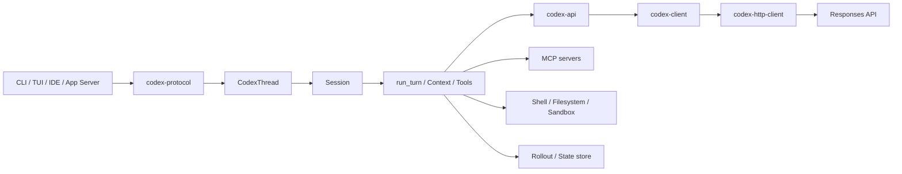

# 01. Codex Agent 总体架构

## 1. 先给结论

Codex Agent 不是“一个接收字符串并返回字符串的 LLM 包装器”。它更接近一个受约束的异步操作系统：外部客户端提交操作，Session 保存状态，模型提出下一步动作，工具运行时在权限边界内执行，然后把结果追加到历史中。

可以把它拆成五个平面：

1. **交互平面**：CLI、TUI、IDE 或 App Server 接收输入并展示事件。
2. **编排平面**：Thread、Session、Turn 和 Agent Loop 决定下一步做什么。
3. **上下文平面**：Prompt、World State、Skill 和 History 决定模型看到什么。
4. **能力平面**：Tool、MCP、Plugin、App 和执行环境决定模型能做什么。
5. **基础设施平面**：模型客户端、HTTP、持久化、遥测与沙箱保证可靠运行。

这五层通过明确的数据结构通信，而不是互相直接读取所有内部状态。

## 2. 控制权在哪里

“Agent 是模型控制还是程序控制”并不是二选一：

- 模型负责提出语义上的下一步，例如“搜索符号”“修改文件”“运行测试”；
- Runtime 负责决定该动作是否存在、是否合法、是否需要批准以及如何执行；
- Agent Loop 负责决定是否继续采样、压缩上下文、接受用户 steer 或结束；
- 用户和管理员策略拥有最高的外部控制权，可以限制文件系统、网络和工具。

所以更准确的说法是：**模型负责规划，Runtime 负责执行和治理。**

## 3. 从外向内的组件关系



### 3.1 客户端层

客户端不应该自己实现 Agent Loop。它主要做三件事：

- 把输入转换成 `Op`；
- 调用 `CodexThread::submit()`；
- 消费 Runtime 发出的 `EventMsg`。

[`codex_thread.rs`](../codex-rs/core/src/codex_thread.rs) 是面向调用方的重要句柄。这样的设计让 TUI、App Server 和其他客户端共享同一套 Agent 语义，而不各自复制工具循环。

### 3.2 Session 编排层

[`Session`](../codex-rs/core/src/session/session.rs) 持有一条线程运行所需的服务和可变状态，例如：

- 当前模型和线程配置；
- conversation history；
- input queue 与 active turn；
- MCP、Skill、Plugin、环境等服务引用；
- rollout 持久化句柄；
- telemetry 和事件发送能力。

Session 不是一次请求对象。它会跨越多个用户 Turn 存活。

### 3.3 Turn 和 Step 层

[`TurnContext`](../codex-rs/core/src/session/turn_context.rs) 是本轮任务的稳定配置快照；[`StepContext`](../codex-rs/core/src/session/step_context.rs) 是一次模型请求的动态能力快照。

需要 Step 的原因是：一个 Turn 可能持续几十秒，期间 MCP 连接、环境 readiness、AGENTS.md 或 Tool availability 可能变化。但同一次模型请求必须保证：

- 给模型看的 ToolSpec；
- ToolRouter 实际能够执行的 Handler；
- 生成 World State 时使用的环境；

来自同一个一致快照。否则模型看到工具 A，执行时却路由到更新后的工具 B，就会形成竞态条件。

### 3.4 模型通信层

[`Prompt`](../codex-rs/core/src/client_common.rs) 保存：

```rust
pub struct Prompt {
    pub input: Vec<ResponseItem>,
    pub(crate) tools: Vec<ToolSpec>,
    pub(crate) parallel_tool_calls: bool,
    pub base_instructions: BaseInstructions,
    pub output_schema: Option<Value>,
    pub output_schema_strict: bool,
}
```

这说明 Prompt 是结构化对象，而不是单个字符串。`ModelClientSession` 再把它转换成 `ResponsesApiRequest`。

### 3.5 工具和外部能力层

Tool 系统刻意分成两个集合：

- `ToolRegistry`：Runtime 已注册、理论上可执行的工具；
- `model_visible_specs`：本次请求真正告诉模型的工具。

[`ToolRouter`](../codex-rs/core/src/tools/router.rs) 同时持有二者。这个区别允许 Deferred Tool、Code Mode 内嵌工具和仅供内部 Runtime 使用的工具存在，而无需把全部 schema 塞进模型上下文。

## 4. 依赖方向为什么重要

一个可维护的 Agent 实现要避免以下反向依赖：

- UI 不应该知道 Tool Handler 的内部类型；
- Skill Loader 不应该直接执行 Shell；
- 模型 API 层不应该决定文件系统权限；
- Tool Handler 不应该自己拼装下一次模型 Prompt；
- HTTP 层不应该知道 Responses API 的业务事件。

Codex 的 crate 划分大致遵守这个方向：

```text
UI / app-server
    ↓
protocol + core orchestration
    ↓
api semantics + tool abstractions
    ↓
transport + filesystem + sandbox
```

这种分层带来的直接收益是可测试性。比如 `codex-api` 的测试可以提供假的 `HttpTransport`；Tool Router 测试可以注册假的 Runtime；Core 集成测试可以 mock Responses SSE，而不真正访问模型服务。

## 5. 数据流与事件流

系统里同时存在两条方向相反的流：

### 5.1 命令流

```text
客户端 → Op → Session → Turn task → Agent Loop
```

它表达“请做什么”，例如开始用户 Turn、中断、修改设置或请求 compact。

### 5.2 事件流

```text
Agent Loop / Tool → EventMsg → CodexThread → 客户端
```

它表达“正在发生什么”，例如：

- assistant 文本增量；
- reasoning 增量；
- Tool Call 开始和完成；
- token usage；
- approval request；
- warning 或 error；
- Turn complete。

事件流让 Runtime 不依赖某个具体 UI，也允许客户端实时展示长任务进展。

## 6. 并发模型

Codex 基于 Tokio。并发主要出现在：

- submission loop 与当前 Turn task 并行；
- 模型事件流持续到达；
-多个允许并行的 Tool Call 以 future 形式执行；
- MCP 启动、环境 readiness 和推荐工具发现并行进行；
- 用户可在 Agent 运行时发送 pending input 或 mailbox message。

并发不意味着所有状态都无锁共享。核心原则是：

- 线程级可变状态由 Session 内部同步保护；
- TurnContext 使用 `Arc` 共享且在本轮稳定；
- StepContext 一次捕获后只读；
- Tool Future 返回结构化结果，由主循环按顺序提交到 History。

## 7. 失败边界

成熟 Agent 必须区分不同失败：

| 失败位置 | 示例 | 典型处理 |
|---|---|---|
| 用户输入 | 无效图片 | 给用户可理解错误，结束本 Turn |
| 模型传输 | 断网、SSE 中断 | 按 provider 策略重试 |
| 模型协议 | 流在 completed 前关闭 | 转成 Stream error |
| Tool 参数 | JSON 不符合 schema | 返回 Tool error 给模型 |
| 权限 | 需要写未授权目录 | 请求批准或拒绝 |
| Tool 运行 | 命令退出非零 | 结构化输出，通常允许模型继续 |
| 上下文 | 超过窗口 | compact 或创建新窗口 |
| 取消 | 用户中断 | 传播 CancellationToken并清理任务 |

错误不能一律终止线程。有些错误应该让模型看到并改正，有些应该重试，有些必须立即停止。这种分类会贯穿后续章节。

## 8. 实现自己 Agent 时的架构建议

最小实现也建议保留以下边界：

1. 用结构化 `Message/ToolCall/ToolResult`，不要只存拼接后的字符串。
2. 把 Tool schema 与 Tool executor 分开，但通过稳定名称关联。
3. 每次模型调用固定一份能力快照。
4. 让策略层包围 Tool executor，而不是散落在每个工具里。
5. 模型输出和 UI 事件分离。
6. History append 与持久化事件保持明确顺序。
7. 所有循环都接受 cancellation，并有清晰结束条件。

下一章会详细解释 Session、Turn 和 Step 为什么是三个不同生命周期。

