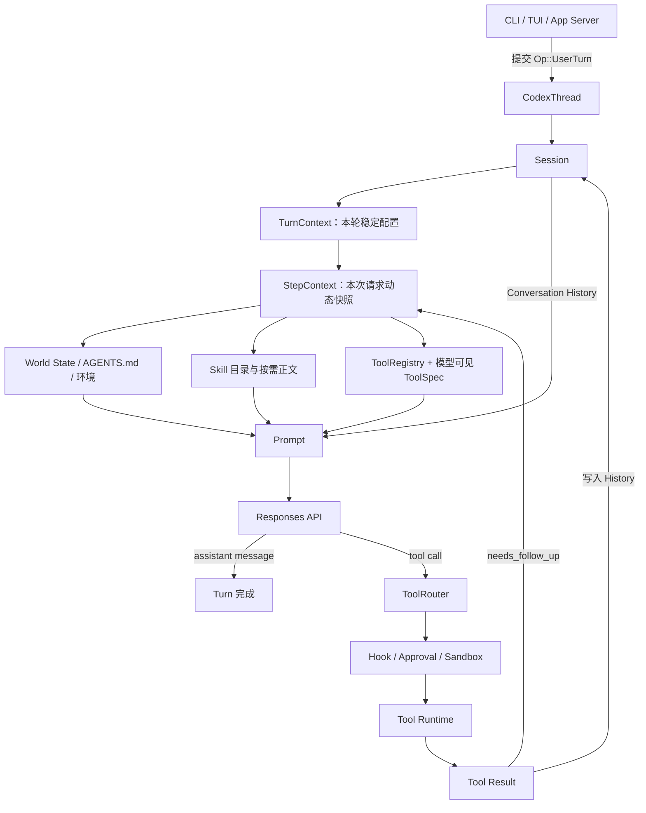

# Codex Agent 实现原理与源码导读

> 基于仓库提交 `bb5054fe47` 整理。本文档讨论的是当前源码中的真实实现，不把未来设想写成既有能力。

这套文档的目标不是教你调用一次模型 API，而是回答一个更完整的问题：**一个能够理解项目、遵守约束、选择工作流、调用工具、修改代码并在长对话中持续工作的 Coding Agent，应该怎样实现？**

Codex 给出的核心答案不是某个神秘的 `Agent` 类，而是一组相互约束的系统：

- Session 保存线程级状态并接收外部操作；
- Turn 表示一次用户任务；
- Step 为一次模型采样固定环境、工具与 MCP 快照；
- Prompt 把基础指令、历史、动态上下文和工具定义组合成结构化请求；
- Agent Loop 在“模型输出—工具执行—结果回传”之间循环；
- Skill 为模型提供按需展开的工作方法；
- Tool 为模型提供真正能够改变外部世界的动作；
- 权限、沙箱和生命周期 Hook 控制动作边界；
- History、Compaction 与 Rollout 负责短期上下文和持久恢复。

## 1. 一张图看完整系统



这里最值得记住的是：**模型不直接执行动作。**模型只产生结构化 Tool Call；Codex Runtime 决定工具是否存在、是否允许调用、在哪个环境执行，以及怎样把结果安全地返回模型。

## 2. 一次用户任务的主链路

一次典型任务会经历以下阶段：

1. UI 把用户输入封装成协议操作提交给 `CodexThread`。
2. `Session` 创建一个本轮稳定的 `TurnContext`。
3. `run_turn()` 在首次采样前判断是否需要压缩旧上下文。
4. Runtime 从用户输入中识别 Skill、Plugin、App 与 MCP 依赖。
5. Runtime 捕获 `StepContext`，固定本次请求的环境、MCP 和工具集合。
6. World State 生成完整上下文或相对上一 Step 的增量。
7. 被明确选择的 Skill 正文、Plugin 指令和用户输入写入 History。
8. `ContextManager::for_prompt()` 生成模型可见历史。
9. `build_prompt()` 组合历史、工具、基础指令和输出 schema。
10. `ModelClientSession::stream()` 发送 Responses 请求并返回事件流。
11. 如果模型输出 Tool Call，`ToolRouter` 找到对应 Runtime 并执行。
12. Tool Result 作为新的 `ResponseItem` 写回 History。
13. `needs_follow_up` 为真时重新捕获 Step 并再次调用模型。
14. 当模型只产生最终 assistant message 且没有新输入时，本 Turn 结束。

主循环入口是 [`run_turn()`](../codex-rs/core/src/session/turn.rs)。它比任何架构图都更权威，后续章节会沿着这个函数向两侧展开。

## 3. Skill、Tool、Prompt 和 Agent Loop 的关系

这四个概念经常被混在一起：

| 概念 | 解决的问题 | 模型得到什么 | Runtime 得到什么 |
|---|---|---|---|
| Prompt | 模型现在知道什么、必须遵守什么 | instructions、history、context、tool schemas | 一次结构化请求 |
| Skill | 某类任务应该采用什么工作流 | `SKILL.md` 中的详细说明 | 资源定位、依赖与注入记录 |
| Tool | 模型可以采取什么动作 | 名称、描述和参数 schema | 可路由的执行器 |
| Agent Loop | 如何持续完成多步骤任务 | 每一轮的新输入和工具结果 | 循环、取消、重试、结束条件 |

Skill 不等于 Tool。Skill 通常是“先检查什么、按什么顺序工作、使用哪些资源”的文字工作流；Tool 是执行命令、读取 MCP、打补丁等动作。一个 Skill 可以指导模型组合多个 Tool，但自己未必是可执行函数。

## 4. 代码分层

| 目录或 crate | 主要职责 |
|---|---|
| `codex-rs/core/src/session` | Session、Turn、Step 与主循环 |
| `codex-rs/core/src/context` | 运行时上下文片段与 World State |
| `codex-rs/core/src/context_manager` | 模型可见历史、规范化与增量更新 |
| `codex-rs/core/src/tools` | Tool 注册、暴露规划、路由、权限与执行 |
| `codex-rs/core-skills` | Host/Executor Skill 的发现、解析、缓存和注入 |
| `codex-rs/ext/skills` | Skill 扩展、跨 authority 资源、目录渲染与动态选择 |
| `codex-rs/tools` | 与 core 解耦的 ToolSpec、ToolCall、ToolOutput 等类型 |
| `codex-rs/codex-api` | Responses、Models、Images 等 API 语义 |
| `codex-rs/codex-client` | 通用重试、SSE 辅助和请求遥测 |
| `codex-rs/http-client` | HTTP、代理、证书、连接池和重定向 |
| `codex-rs/protocol` | UI、Core、App Server 共享的协议类型 |
| `codex-rs/rollout` / `state` | 持久化事件与线程状态 |

## 5. 文档目录

### 第一部分：运行骨架

1. [总体架构](01-architecture.md)：组件边界、依赖方向与控制权。
2. [Session、Turn 与 Step](02-session-turn-step.md)：为什么需要三层生命周期。
3. [Agent Loop](03-agent-loop.md)：从第一次采样到最终回答的真实循环。

### 第二部分：模型上下文

4. [Prompt 与 Instructions](04-prompt-and-instructions.md)：结构化 Prompt 怎样变成 Responses 请求。
5. [Context 与 World State](05-context-and-world-state.md)：AGENTS.md、环境和动态状态怎样增量注入。

### 第三部分：能力系统

6. [Skills](06-skills.md)：发现、搜索、选择、读取和注入。
7. [Tools](07-tools.md)：ToolSpec、Registry、暴露规划、搜索和 Router。
8. [MCP、Plugin 与 App](08-mcp-plugins-and-apps.md)：外部能力如何接入。
9. [工具执行与安全](09-tool-execution-and-sandbox.md)：参数校验、审批、沙箱、Hook 和输出。

### 第四部分：模型通信和长期运行

10. [模型客户端与流式传输](10-model-client-and-streaming.md)：Responses、SSE/WebSocket、重试和错误。
11. [History、Compaction 与缓存](11-history-compaction-and-cache.md)：上下文窗口如何长期维持。
12. [状态、恢复与 Rollout](12-state-resume-and-rollout.md)：线程如何持久化、恢复和 fork。

### 第五部分：高级能力和工程验证

13. [Multi-Agent](13-multi-agent.md)：子 Agent 的创建、通信、等待与并发边界。
14. [测试与调试](14-testing-and-debugging.md)：如何验证一个 Agent，而不只验证单个函数。
15. [按执行顺序阅读源码](15-execution-walkthrough.md)：从进程启动到用户输入、工具循环和最终回答。

### 附录

- [术语表（Glossary）](appendices/glossary.md)
- [源码地图](appendices/source-code-map.md)
- [关键数据结构](appendices/data-structures.md)
- [从零实现一个最小 Agent](appendices/minimal-agent.md)

## 6. 推荐阅读方式

第一次阅读按以下顺序：

```text
README
  → 01 总体架构
  → 02 生命周期
  → 03 Agent Loop
  → 04 Prompt
  → 07 Tool
  → 09 工具执行
  → 06 Skill
  → 05 Context
  → 10~14 工程专题
  → 最小 Agent 附录
```

如果你准备自己实现 Agent，建议每读完一章就回答三个问题：

1. 这部分状态由谁拥有？
2. 这部分信息什么时候固定，什么时候允许刷新？
3. 失败、取消或恢复后，系统如何保持一致？

成熟 Agent 的难点通常不在“调用模型”，而在这三个问题。

## 7. 文档的真实性边界

- 所有“当前实现”描述都应能落到仓库中的类型或函数。
- 简化 JSON、伪代码和时序图用于解释，不等于逐字节抓包。
- 配置与 Feature Flag 会改变工具集合、传输方式和上下文内容；文档描述的是主要路径，并在重要分支处显式说明。
- 源码持续演进，因此阅读时应先对照本文顶部的提交号，再搜索相应符号。
