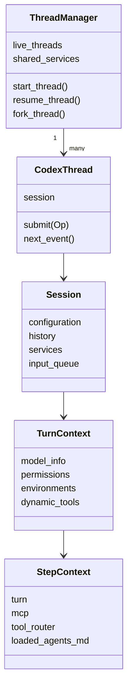
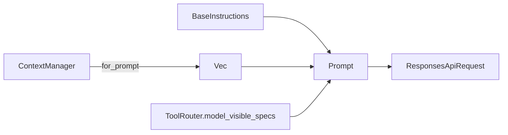
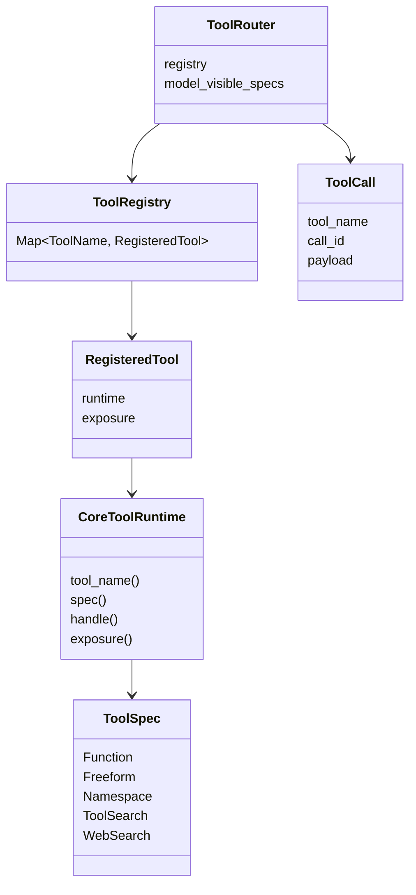
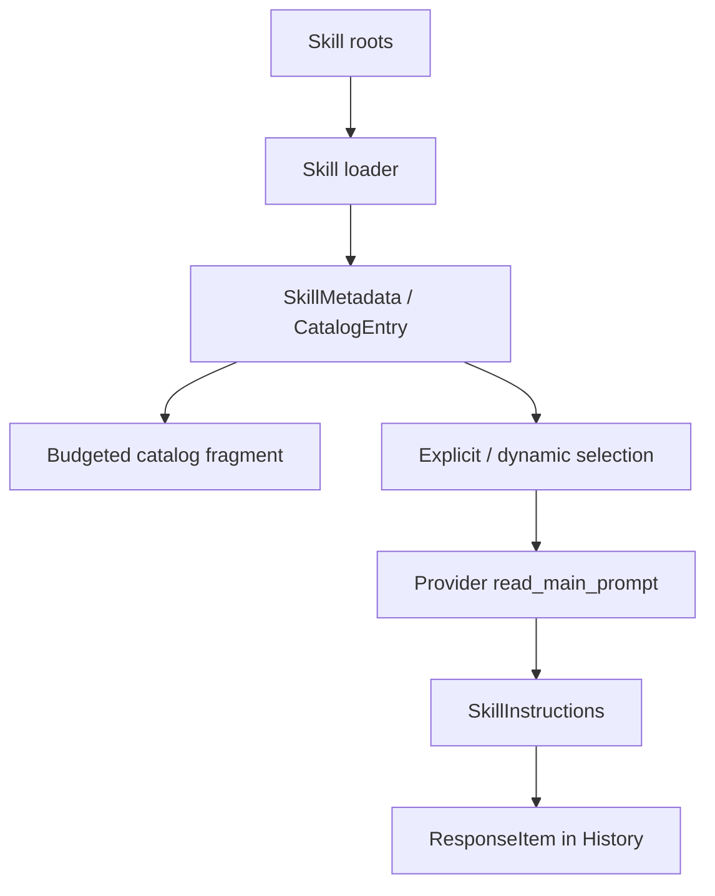

# 附录 B：关键数据结构与关系

## 1. 生命周期对象



### `Session`

线程级状态所有者。它既持有服务，又通过锁保护可变 conversation state。

### `TurnContext`

一次用户任务的稳定设置。用 `Arc` 在主循环和 Tool Future 间共享。

### `StepContext`

一次采样的一致能力快照。ToolRouter 放在这里是为了保证“广告的工具”和“执行的工具”一致。

## 2. Prompt 与 History



### `ResponseItem`

统一表示模型输入/输出的结构化 item。重要变体：

- `Message`；
- `Reasoning`；
- `FunctionCall` / `FunctionCallOutput`；
- `CustomToolCall` / `CustomToolCallOutput`；
- `ToolSearchCall` / `ToolSearchOutput`；
- `Compaction`。

### `ContextManager`

保存模型工作记忆，不是完整 UI transcript。负责 append、truncate、normalize、rollback 和 baseline。

### `Prompt`

一次模型请求的中间表示：input、tools、base instructions、parallel flag 和 output schema。

## 3. Tool 类型



### `ToolSpec`

模型可见能力声明。

### `CoreToolRuntime`

Core 内可执行工具契约。除执行外还能提供 exposure、并行、Hook、telemetry 和参数增量能力。

### `ToolRegistry`

执行能力全集。

### `ToolRouter`

Registry 加本次模型可见子集，并负责把 ResponseItem 路由为实际执行。

### `ToolCall`

模型协议 item 的内部统一表示。`call_id` 是 Result 关联键。

## 4. Skill 类型



### `SkillMetadata`

Host/Executor 侧发现结果，包含 name、description、path、scope、dependencies 和 policy。

### `SkillCatalogEntry`

扩展层跨 authority 的统一目录条目，保留 package 与 resource identity。

### `SkillInstructions`

被选中 Skill 的模型可见正文片段。

## 5. World State

```text
真实动态状态
  → WorldStateSnapshot(current)
  → compare WorldStateSnapshot(model_baseline)
  → Context fragments diff
  → ResponseItems
  → History
  → 更新 baseline + 持久化 patch
```

World State Snapshot 回答“现在是什么”；History baseline 回答“模型上次知道什么”。

## 6. 模型流

```mermaid
sequenceDiagram
    participant Loop as Agent Loop
    participant Client as ModelClientSession
    participant API as Responses API
    participant Router as ToolRouter
    participant History as ContextManager

    Loop->>Client: stream(Prompt)
    Client->>API: Responses request
    API-->>Client: OutputItemAdded / deltas
    API-->>Client: OutputItemDone(tool call)
    Client-->>Loop: ResponseEvent
    Loop->>Router: dispatch(ToolCall)
    Router-->>Loop: Tool Result
    Loop->>History: append(call output)
    Loop->>Client: stream(next Prompt)
```

## 7. 持久化类型

### Rollout Item

记录已发生事实，如 ResponseItem、TurnContext、WorldState、Compacted checkpoint 和 Agent 通信。

### History Version

History rewrite 时推进，帮助增量 client 判断是否仍能复用旧请求状态。

### World State Baseline

记录新窗口中模型已经知道的动态状态起点。

## 8. ID 体系

一个可靠 Agent 至少需要：

| ID | 用途 |
|---|---|
| Thread ID | 整条对话与持久化 |
| Turn ID | 一次用户任务与 telemetry |
| Response Item ID | 流式 item 与 UI 生命周期 |
| Tool Call ID | Tool Call/Result 配对 |
| Window ID | Compaction 上下文窗口 |
| Agent ID/Path | 多 Agent 路由与树关系 |

不要用数组下标或显示名称代替稳定 ID。

## 9. 数据所有权总结

| 数据 | 所有者 | 是否可变 |
|---|---|---|
| Conversation History | Session state | append，少数情况 rewrite |
| Turn settings | TurnContext | 本 Turn 只读 |
| Tool capability snapshot | StepContext | 本 Step 只读 |
| Tool Runtime | ToolRegistry/Router | 构建后只读 |
| Skill catalog snapshot | Skill service/extension store | 按刷新边界替换 |
| Model connection | ModelClientSession | Turn 内可变 |
| Rollout | Live thread/store | append-only 为主 |

