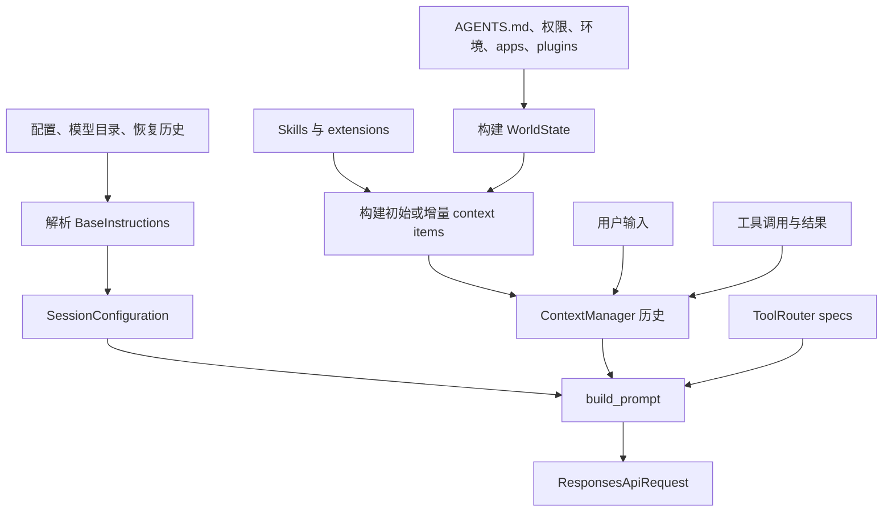

# Prompt：Codex 如何组装模型指令

> 分析对象：当前仓库中的 Rust 实现，重点是 `codex-rs/core`、`codex-rs/protocol`、`codex-rs/extension-api` 及相关 prompt crate。

## 1. 结论

Codex 的 prompt 不是一个静态字符串，而是一个分层、增量维护的模型输入系统。最终发送给模型的请求由四类内容组成：

1. `instructions`：线程级基础指令，对应 Responses API 的顶层 `instructions`。
2. `input`：按时间累积的 `ResponseItem` 历史，包括 developer/user/assistant 消息、推理项、工具调用及工具结果。
3. `tools`：当前 sampling step 对模型可见的工具 schema。
4. 推理、输出 schema、并行工具调用等采样控制参数。

核心聚合类型是 [`Prompt`](../codex-rs/core/src/client_common.rs)，其字段直接体现了上述结构：

```rust
pub struct Prompt {
    pub input: Vec<ResponseItem>,
    pub(crate) tools: Vec<ToolSpec>,
    pub(crate) parallel_tool_calls: bool,
    pub base_instructions: BaseInstructions,
    pub output_schema: Option<Value>,
    pub output_schema_strict: bool,
}
```

因此，从实现角度看，“Prompt”应理解为结构化请求，而不只是 system prompt。

## 2. 指令层次

### 2.1 基础指令：`BaseInstructions`

[`BaseInstructions`](../codex-rs/protocol/src/models.rs) 是线程的稳定基础指令，对应 Responses API 的 `instructions` 字段。默认文本编译自：

- [`codex-rs/protocol/src/prompts/base_instructions/default.md`](../codex-rs/protocol/src/prompts/base_instructions/default.md)

线程启动时，[`Session::spawn_internal`](../codex-rs/core/src/session/mod.rs) 按以下优先级解析它：

1. `config.base_instructions` 显式覆盖；
2. 恢复历史中 `session_meta.base_instructions`；
3. 当前 `ModelInfo::get_model_instructions(personality)`。

解析后的文本保存在 `SessionConfiguration.base_instructions`，之后通过 `Session::get_base_instructions()` 读取。它通常在整个线程中保持稳定，这有利于服务端 prompt cache；模型切换时不会重写旧历史，而是通过增量 developer 消息补充新模型指令。

### 2.2 Developer 指令

Developer 层并非单一来源，主要包括：

- `config.developer_instructions`；
- collaboration mode 自带的 developer instructions；
- 模型切换提示；
- personality 补充提示；
- skills 目录及使用规则；
- 权限、沙箱、环境、apps、plugins、多 agent 模式等运行状态；
- extension 贡献的 `PromptFragment`；
- memory read-path 指令；
- token budget、current time 等运行提醒。

[`Session::build_initial_context_with_world_state_and_mcp`](../codex-rs/core/src/session/mod.rs) 是第一次完整注入的主要组装点。它把内容分入三个槽：

- `DeveloperPolicy` / `DeveloperCapabilities`：合并成 developer 消息；
- `ContextualUser`：合并成上下文型 user 消息；
- `SeparateDeveloper`：保持为独立 developer 消息，适合必须隔离审计的策略，例如 guardian policy。

这些槽由 [`PromptFragment`](../codex-rs/ext/extension-api/src/contributors/prompt.rs) 和 `push_prompt_fragment()` 共同处理。

### 2.3 Contextual user 指令

仓库有意把部分运行上下文表示成 user role，而不是全部塞进 developer role。统一抽象是 `ContextualUserFragment`，由 `codex-context-fragments` 定义，并在 [`core/src/context`](../codex-rs/core/src/context/mod.rs) 中注册具体类型。

典型片段包括：

- `AGENTS.md`：`UserInstructions`；
- 当前环境：`EnvironmentsState`；
- 被点名 skill 的完整正文：`SkillInstructions`；
- hook 附加上下文；
- subagent 通知；
- 推荐插件；
- turn aborted 提示。

片段通常带稳定的起止 marker，例如：

```text
# AGENTS.md instructions ...
<INSTRUCTIONS>
...
</INSTRUCTIONS>
```

或：

```text
<skill>
<name>...</name>
<path>...</path>
...
</skill>
```

[`contextual_user_message.rs`](../codex-rs/core/src/context/contextual_user_message.rs) 用注册表识别这些消息。这让恢复、回滚和 UI 映射可以区分“真实用户消息”与“系统合成但使用 user role 的上下文”。

### 2.4 普通用户输入

协议入口是 `Op::UserInput`，由 [`session/handlers.rs`](../codex-rs/core/src/session/handlers.rs) 的 `user_input_or_turn_inner()` 转成 `TurnInput::UserInput`。随后：

1. 创建本 turn 的 `TurnContext`；
2. 尝试把输入 steer 到活动 turn；
3. 若当前空闲，则启动 `RegularTask`；
4. 在 `run_turn()` 中经过 hooks 后写入会话历史；
5. 下一次 sampling 从 `ContextManager::for_prompt()` 获得规范化输入。

用户输入支持文本、图片、音频、skill 等结构化形式；真正发请求前会按模型的 `input_modalities` 去除不支持的内容。

## 3. 初次完整注入与后续增量注入

Codex 明确遵守“历史只增量构建”的设计，而不是每轮重新拼出一个大 system prompt。

### 3.1 第一次 turn

[`Session::record_context_updates_and_set_reference_context_item`](../codex-rs/core/src/session/mod.rs) 检查 `ContextManager.reference_context_item`：

- 若为空，调用 `build_initial_context_with_world_state_and_mcp()`，完整注入初始上下文；
- 同时保存 `TurnContextItem` 和完整 `WorldStateItem`；
- 将当前 world-state snapshot 设为后续 diff baseline。

### 3.2 后续 turn

如果已经有 reference context，系统只追加差异：

- `build_settings_update_items()`：模型、multi-agent mode、personality 等设置变化；
- `WorldState::render_diff()`：AGENTS.md、环境、权限、apps、plugins 等变化；
- extension 的 turn context contribution。

这种设计有三点价值：

1. 保留真实历史因果关系；
2. 降低重复 token 与 cache miss；
3. 恢复线程时可以从 rollout 中重建同样的模型可见状态。

## 4. World State：动态 prompt 的状态模型

[`WorldState`](../codex-rs/core/src/context/world_state/mod.rs) 把动态上下文拆成带稳定 ID 的 section。目前核心 section 包括：

- `AgentsMdState`；
- `EnvironmentsState`；
- `PermissionsState`；
- `CollaborationModeState`；
- `AppsInstructionsState`；
- `PluginsInstructionsState`；
- `RealtimeState`；
- `EnvironmentsInstructionsState`。

每个 section 实现 `WorldStateSection`：

- `snapshot()` 返回最小比较状态；
- `render_diff(previous)` 生成模型可见差异；
- 可识别旧格式 fragment，以兼容历史 rollout；
- stable ID 和 snapshot 会被持久化。

[`Session::build_world_state_for_step`](../codex-rs/core/src/session/world_state.rs) 在每个 step 上构建实际 world state。注意它使用的是 `StepContext`，因此 prompt 中描述的环境、MCP 与工具清单来自同一请求快照，避免“模型看到 A、工具实际执行 B”的竞态。

## 5. Skill、plugin 和 extension 如何进入 prompt

### Skills

Skills 有两级注入：

1. 线程初始上下文只注入可用 skill 的名称、描述、定位方式与使用规则；
2. 用户显式点名 skill 后，`run_turn()` 的 `build_skills_and_plugins()` 读取完整 `SKILL.md`，作为 `<skill>` contextual user fragment 追加到历史。

这是一种 progressive disclosure：目录便宜，正文按需加载。

### Plugins / Apps

Plugin mention、app connector inventory 和 MCP tools 会在 turn 开始时解析。Plugin 指令通过 `build_plugin_injections()` 进入历史；可访问 app 的通用使用规则则属于 world state。

### Extensions

扩展可以通过不同贡献接口加入 prompt：

- thread context contributor：线程级稳定内容；
- turn context contributor：turn 级设置内容；
- world-state contributor：可 diff 的动态状态；
- turn input contributor：由当前用户输入触发的临时内容。

这比让扩展直接修改一个字符串更安全，因为 role、生命周期和持久化边界是显式的。

## 6. 最终请求如何编码

[`run_sampling_request()`](../codex-rs/core/src/session/turn.rs) 调用 `build_prompt()`，把以下内容封装为 `Prompt`：

- `ContextManager::for_prompt()` 生成的历史；
- `ToolRouter::model_visible_specs()`；
- 模型是否支持 parallel tool calls；
- session 的 base instructions；
- turn 的最终输出 JSON schema。

随后 [`ModelClientSession::build_responses_request`](../codex-rs/core/src/client.rs) 转成 `ResponsesApiRequest`。

普通 Responses 模式：

- `base_instructions.text` → 顶层 `instructions`；
- tools → 顶层 `tools`；
- history → `input`。

Responses Lite 模式：

- tools 被包装为开头的 `AdditionalTools` developer item；
- base instructions 被包装为开头的 developer message；
- 顶层 `instructions` 为空，顶层 `tools` 为 `None`。

这说明内部 prompt 模型与传输编码是分离的：同一个 `Prompt` 可以适配不同 wire 约束。

## 7. Prompt 生命周期图



## 8. 边界与设计判断

- Prompt 的权威状态不在 UI，而在 core 的 `SessionState + ContextManager + WorldState`。
- `BaseInstructions` 是稳定顶层指令；频繁变化的内容应进入增量 history，而不是重写它。
- role 是语义的一部分：developer、contextual user、真实 user 不能随意互换。
- 所有模型可见动态项最好实现为明确的 context fragment 或 world-state section；这也是仓库 `AGENTS.md` 对新增 context 的要求。
- prompt 与 tools 在每个 sampling step 一起捕获，确保 advertised capabilities 与执行 runtime 一致。
- compaction 会替换历史，但会按场景重新注入初始上下文并重建 baseline；它不是简单截断字符串。

## 9. 关键文件

- [`core/src/client_common.rs`](../codex-rs/core/src/client_common.rs)：`Prompt`。
- [`protocol/src/models.rs`](../codex-rs/protocol/src/models.rs)：`BaseInstructions`、`ResponseItem`。
- [`core/src/session/mod.rs`](../codex-rs/core/src/session/mod.rs)：基础指令解析、初始上下文、增量上下文。
- [`core/src/session/turn.rs`](../codex-rs/core/src/session/turn.rs)：turn loop、skill/plugin 注入、`build_prompt()`。
- [`core/src/context`](../codex-rs/core/src/context/mod.rs)：context fragment 类型。
- [`core/src/context/world_state`](../codex-rs/core/src/context/world_state/mod.rs)：动态状态与 diff。
- [`core/src/context_manager`](../codex-rs/core/src/context_manager/mod.rs)：历史维护与规范化。
- [`core/src/client.rs`](../codex-rs/core/src/client.rs)：Responses API 编码与传输。
