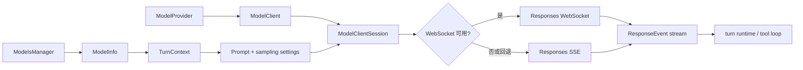

# LLM：模型发现、选择与推理请求

> 本文中的“LLM 层”包括模型目录、provider、认证、请求构建、流式传输、重试和模型能力适配；模型本身运行在外部服务，仓库实现的是其客户端与控制面。

## 1. 结论

当前 Codex 没有把 LLM 封装成一个简单的 `generate(prompt)`。实现分成四层：

1. `ModelsManager`：发现模型并解析能力元数据；
2. `ModelProvider`：定义 provider、认证、endpoint 和 provider 能力；
3. `ModelClient`：线程级稳定客户端状态；
4. `ModelClientSession`：turn 级连接、sticky routing 与流式请求状态。

实际推理统一使用 OpenAI Responses wire protocol。`WireApi` 目前只有 `Responses`；旧的 Chat Completions wire API 已明确拒绝。

## 2. 模型目录与 `ModelInfo`

[`ModelInfo`](../codex-rs/protocol/src/openai_models.rs) 是运行时选择与 prompt/tool 行为的权威能力描述，包含：

- 模型 slug；
- 基础 instructions 与 personality 消息；
- 默认 reasoning effort 和 reasoning summary；
- context window / max context window；
- input modalities；
- 是否支持 parallel tool calls；
- shell tool 类型；
- tool mode、web search、image generation 等能力；
- Responses Lite、item IDs、verbosity、service tiers 等协议能力；
- truncation policy、auto-compact limit 等上下文策略。

这意味着模型选择不仅改变请求中的 `model` 字段，还会改变：

- prompt 基础指令；
- 工具集合和工具 schema 编码；
- 是否并发工具调用；
- 上下文清理方式；
- reasoning 参数；
- transport 和返回事件处理。

`ModelInfo::get_model_instructions(personality)` 负责从模型模板得到最终基础指令。Personality 可能已烘焙进 base instructions，也可能需要额外 developer fragment。

## 3. `ModelsManager`：发现、缓存与合并

[`codex-models-manager`](../codex-rs/models-manager/src/manager.rs) 提供 `ModelsManager` trait。主要职责是：

- 从远端 `/models` 获取目录；
- 读取 bundled model catalog；
- 使用 `models_cache.json` 做磁盘缓存；
- 按 auth、visibility 和 priority 过滤 picker 内容；
- 根据 model slug 构造最终 `ModelInfo`；
- 接收 Responses stream 返回的 ETag 并按需刷新。

主要实现：

- `OpenAiModelsManager`：远端目录 + cache；
- `StaticModelsManager`：权威的进程内静态目录。

刷新策略有三种：

- `Online`：强制在线刷新；
- `Offline`：只使用缓存；
- `OnlineIfUncached`：有新鲜缓存则复用，否则联网。

线程创建时，`ThreadManager` 构造 shared models manager；`Session::spawn_internal()` 再通过 `get_default_model()` 和 `get_model_info()` 固化本线程初始模型与能力。

## 4. `ModelProvider`：后端与认证抽象

[`codex-model-provider`](../codex-rs/model-provider/src/provider.rs) 中的 `ModelProvider` trait 是 provider 运行时抽象。它负责：

- 返回 `ModelProviderInfo`；
- 声明 namespace tools、image generation、web search 等 provider 上限；
- 解析 provider-specific auth；
- 构造 API provider（base URL、headers、query）；
- 将 API error 映射为 Codex error；
- 创建合适的 models manager；
- 为 approval review、memory extraction、memory consolidation 提供偏好模型。

当前有：

- 通用 `ConfiguredModelProvider`；
- Amazon Bedrock 专用实现。

[`ModelProviderInfo`](../codex-rs/model-provider-info/src/lib.rs) 可来自内置默认值或用户 `config.toml`，支持：

- `base_url`；
- env API key、命令型 bearer token、显式 bearer token；
- AWS SigV4；
- 自定义 headers/query params；
- request/stream retry 上限；
- stream idle timeout；
- WebSocket 能力。

认证是 request-scoped 解析的。`ModelClientSession::current_client_setup()` 会在每次尝试前得到最新 auth，支持未授权后的 refresh/recovery，而不是在线程启动时永久冻结 token。

## 5. `ModelClient` 与 `ModelClientSession`

[`ModelClient`](../codex-rs/core/src/client.rs) 是 session/thread scoped，保存较稳定的状态：

- thread ID、session source、originator；
- provider 与 auth telemetry；
- verbosity、压缩、beta features；
- 是否启用 item IDs、attestation、timing metrics；
- WebSocket fallback 状态；
- 可跨 turn 复用的 cached WebSocket session。

[`ModelClientSession`](../codex-rs/core/src/client.rs) 每个 turn 创建一次，并在该 turn 的多次 sampling 和 retry 中复用。它持有：

- 当前 Responses WebSocket connection；
- `x-codex-turn-state` sticky routing token；
- previous response / incremental WebSocket 状态；
- turn 内 fallback 与连接复用信息。

这种生命周期划分很关键：

- provider/auth/config 不必在每次 sampling 重建；
- turn 内多个“模型 → 工具 → 模型”step 可复用连接；
- 不会把一个 turn 的 sticky state 意外泄漏给另一个 turn。

## 6. 请求构建

`ModelClientSession::build_responses_request()` 把内部 `Prompt` 转成 `ResponsesApiRequest`：

```text
model                <- ModelInfo.slug
instructions         <- Prompt.base_instructions
input                <- ContextManager 规范化后的 ResponseItem
tools                <- ToolSpec 序列化结果
parallel_tool_calls  <- Prompt 开关 && 模型能力
reasoning            <- effort + summary + context
text                 <- verbosity + output JSON schema
service_tier         <- config 与模型能力共同解析
prompt_cache_key     <- thread/window metadata
```

额外行为包括：

- 非 OpenAI provider 会清除内部 chat metadata passthrough；
- Responses Lite 会把 instructions/tools 前置到 input；
- 不支持 verbosity 的模型会忽略配置并记录 warning；
- `Ultra` reasoning effort 在请求层映射为 `Max`；
- output schema 默认 strict，但 guardian reviewer 特例关闭 strict；
- include `reasoning.encrypted_content`，以支持推理项在后续请求中延续。

## 7. Transport：SSE 与 WebSocket

普通推理通过 `/responses`，支持两条传输路径：

- SSE streaming；
- Responses-over-WebSocket。

WebSocket 是否启用由 provider capability 与 session fallback 状态共同决定。启动或 turn 开始时可以 best-effort prewarm：发送 `generate=false` 的 v2 `response.create`，等待完成后让正式请求复用 connection 和 previous response ID。

如果 WebSocket 建连或请求失败，客户端可禁用本 session 的 WebSocket 并回退到 SSE。这样 provider 的短期 WS 故障不会让整个线程不可用。

## 8. 流式事件模型

模型 transport 被映射为 [`ResponseEvent`](../codex-rs/core/src/client_common.rs)，由 `try_run_sampling_request()` 消费。重要事件包括：

- `Created`；
- `OutputItemAdded` / `OutputItemDone`；
- `OutputTextDelta`；
- tool call argument delta；
- reasoning summary/content delta；
- `ServerModel`、`ModelVerifications`；
- rate limits、models ETag；
- `Completed { response_id, token_usage, end_turn }`。

turn runtime 不等待完整 JSON 才工作：它会流式发 UI 事件、维护 active item、增量解析 plan 文本、收集工具参数，工具 item 完成后立即调度执行。

`Completed.end_turn == false` 会令 `needs_follow_up = true`，触发下一次 sampling。

## 9. Reasoning 与输出控制

`ModelClientSession::build_reasoning()` 综合：

- turn 显式 reasoning effort；
- `ModelInfo.default_reasoning_level`；
- 模型是否支持 reasoning summary 参数；
- `ReasoningSummary` 配置；
- Responses Lite 对 reasoning context 的要求。

如果启用 concurrent reasoning summaries 且 provider 是 OpenAI，请求会设置 sequential-cutoff delivery。流式 handler 再把 summary delta 与 raw reasoning delta 分别映射为协议事件。

最终输出 schema 来自 `Op::UserInput.final_output_json_schema`，存入 `TurnContext` 并进入 `Prompt`。因此结构化输出是 turn 级约束，不是线程永久设置。

## 10. 重试、恢复与错误边界

`run_sampling_request()` 在同一个 `ModelClientSession` 内重试，以保留 turn-scoped transport state。最大次数来自 provider 的 `stream_max_retries()`。

错误分为：

- retryable stream/transport error：退避并重试；
- context window exceeded：标记 token usage full，交给 auto-compaction / rollover；
- usage limit reached：更新 rate-limit snapshot 后返回；
- invalid image：尝试替换最后 turn 的工具图片，重新 sampling；
- turn aborted：沿 cancellation 路径立即结束；
- 其他错误：转成协议 `ErrorEvent`，保持线程仍可继续。

认证错误有专门 recovery telemetry，可刷新登录态后重试。Request 与 stream timeout/retry 是 provider 可配置的，并带硬上限以防无限重试。

## 11. 模型切换

模型可以通过 thread settings / collaboration mode 更新。新的 `TurnContext` 会解析新的 `ModelInfo`。为了避免历史重写：

- `SessionConfiguration` 更新当前模型；
- `build_model_instructions_update_item()` 检测上一 turn 模型变化；
- 把新模型 instructions 作为 `<model_switch>` developer context 追加；
- 工具路由、context window、reasoning 和 modalities 随新的 `ModelInfo` 重新计算。

这满足“上下文增量构建”原则，同时允许同一线程中切换模型。

## 12. 专用 LLM 调用

普通 agent turn 不是唯一模型调用：

- compaction：可走普通 sampling 或 `/responses/compact`；
- memory phase 1：使用结构化输出抽取 rollout memory；
- memory phase 2：启动受限的 consolidation agent；
- guardian / approval review：使用专用 reviewer source 与输出 schema；
- realtime：通过 `/realtime/calls` 建立实时会话。

这些流程复用 provider、auth、model metadata 和 telemetry，但拥有不同 prompt、source 标签和安全限制。

## 13. LLM 调用链



## 14. 设计判断

- LLM 在此项目中是“能力元数据 + provider + transport + stream protocol”，不是一个黑盒函数。
- `ModelInfo` 是大量运行时分支的中心；新增模型能力应优先进入元数据，而不是散落 slug 判断。
- 线程级 `ModelClient` 与 turn 级 `ModelClientSession` 的拆分，是连接复用和状态隔离的关键。
- Responses API item 是模型、history 与 tool loop 的共同语言，减少了内部格式转换。
- 模型返回的 `ServerModel`、ETag、rate limits、token usage 都会反向更新 runtime 状态，调用不是单向 RPC。

## 15. 关键文件

- [`protocol/src/openai_models.rs`](../codex-rs/protocol/src/openai_models.rs)：`ModelInfo`、模型能力。
- [`models-manager/src/manager.rs`](../codex-rs/models-manager/src/manager.rs)：发现、缓存、选择。
- [`model-provider/src/provider.rs`](../codex-rs/model-provider/src/provider.rs)：provider runtime 抽象。
- [`model-provider-info/src/lib.rs`](../codex-rs/model-provider-info/src/lib.rs)：provider 配置。
- [`core/src/client.rs`](../codex-rs/core/src/client.rs)：请求、认证、SSE/WS、重试。
- [`core/src/client_common.rs`](../codex-rs/core/src/client_common.rs)：`Prompt` 与 `ResponseStream`。
- [`core/src/session/turn.rs`](../codex-rs/core/src/session/turn.rs)：stream 消费与 agent loop。

