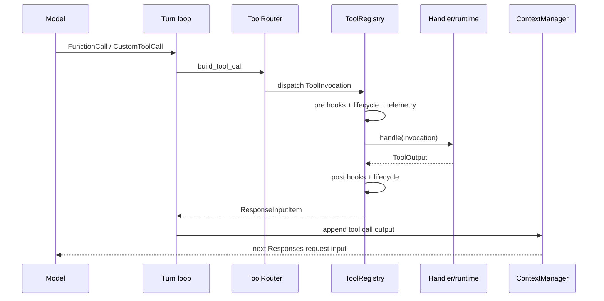

# Tools：能力声明、路由、执行与安全控制

## 1. 结论

Codex 的 tool 系统是一个“每个 sampling step 重新规划的能力面”，而不是启动时注册一次的全局函数表。

它把工具分成两个相互关联但不同的集合：

- **模型可见 specs**：本次请求告诉模型可以调用什么；
- **执行 registry**：收到调用后，runtime 实际能把它路由到哪里。

[`ToolRouter`](../codex-rs/core/src/tools/router.rs) 同时持有二者。这样可以支持 hidden/deferred/code-mode-only 工具：某些工具可被嵌套 runtime 调用，但不直接暴露给模型。

## 2. 核心类型

### `ToolSpec`

由 `codex-tools` 定义，是发送到 Responses API 的 schema。它支持普通 function、自定义 freeform、namespace、hosted tool 等形式。`create_tools_json_for_responses_api()` 最终将其序列化为 API JSON。

### `ToolName`

工具名称由可选 namespace 与 name 组成，而不是永远是一个平面字符串。这使 MCP、app、multi-agent 和 image generation 等能力可以避免命名冲突。

### `ToolCall`

[`core/src/tools/router.rs`](../codex-rs/core/src/tools/router.rs) 的内部调用表示：

```rust
pub struct ToolCall {
    pub tool_name: ToolName,
    pub call_id: String,
    pub payload: ToolPayload,
}
```

`ToolRouter::build_tool_call()` 将 Responses API 的三种 item 映射为它：

- `FunctionCall` → `ToolPayload::Function`；
- client-side `ToolSearchCall` → `ToolPayload::ToolSearch`；
- `CustomToolCall` → `ToolPayload::Custom`。

### `CoreToolRuntime`

[`CoreToolRuntime`](../codex-rs/core/src/tools/registry.rs) 是 core 本地工具的统一执行契约，建立在泛型 `ToolExecutor<ToolInvocation>` 之上。除 `spec()` 和 `handle()` 外，还能声明：

- exposure；
- 是否支持并行；
- payload kind 是否匹配；
- cancellation 是否必须等待 runtime 清理；
- pre/post hook payload；
- telemetry tags；
- tool search metadata；
- streamed argument diff consumer。

### `ToolOutput`

工具不直接返回字符串，而返回实现 `ToolOutput` 的对象。它同时提供：

- model-visible `ResponseInputItem`；
- code mode 使用的 JSON result；
- telemetry preview；
- 成功状态；
- hook-facing response；
- 是否包含 external context。

这种多视图输出避免让 telemetry、模型输入和 code-mode runtime 共享一个不合适的字符串格式。

## 3. 工具来源

[`build_tool_router()`](../codex-rs/core/src/tools/spec_plan.rs) 汇总多种来源：

### Core 内建工具

按 feature、模型能力、collaboration mode、session source 与平台选择，包括：

- shell / unified exec；
- apply patch；
- view image；
- plan / request user input；
- request permissions；
- MCP resource 读取；
- current time / sleep；
- multi-agent tools；
- new context window / token context；
- plugin install request；
- tool search；
- code mode delegate/execute/wait。

### MCP tools

`built_tools()` 从本 step 的 `McpRuntimeSnapshot` 获取固定的 MCP tool list，再由 `build_mcp_tool_runtimes()` 转成 core runtime。执行最终通过 MCP connection manager 完成。

### Apps / connectors

Apps 本质上投影到 MCP tools，但会叠加 connector access、enabled state、plugin metadata 与搜索策略。只有当前配置和权限允许的 connector 才会进入可用能力面。

### Dynamic tools

App-server 可在 thread start 时传入 `DynamicToolSpec`。这些工具由 [`DynamicToolHandler`](../codex-rs/core/src/tools/handlers/dynamic.rs) 转发为协议事件，并等待客户端用 `Op::DynamicToolResponse` 回答。

### Extension tools

`ExtensionRegistry` 中的 `ToolContributor` 返回通用 `ToolExecutor<ExtensionToolCall>`；core 用 `ExtensionToolAdapter` 接入统一 registry。Memory read tools 就通过这条扩展路径提供。

### Hosted tools

例如 web search，可作为 provider hosted spec 发送给模型。这类调用可能完全由 Responses 服务执行，而不是走本地 `ToolRegistry`。

### Code mode

Code mode 会把部分底层工具作为 JS runtime 内的嵌套工具，模型只看到一个更高层的 execute/delegate 接口。`ToolExposure` 和 `direct_only_tool_namespaces` 决定某工具是直接给模型、仅给 code mode，还是两者均可。

## 4. 每个 step 如何规划工具

`run_sampling_request()` 调用 `built_tools(sess, step_context, ...)`。主要步骤是：

1. 从 `StepContext` 冻结 MCP tools；
2. 加载当前 plugin snapshot；
3. 计算 apps/connectors 的 accessible + enabled 状态；
4. 计算 tool suggest 候选；
5. 构造 MCP runtimes；
6. 收集 extension 和 dynamic tools；
7. `spec_plan` 根据模型、feature 与模式规划 exposures；
8. 创建 `ToolRegistry` 和 model-visible specs。

`StepContext` 会被 `ToolCallRuntime` 保留到工具执行结束。这一点保证：模型调用某个工具时，执行使用的正是当时广告给模型的 MCP config、environment 和 capability roots，而不是之后刷新出来的新状态。

## 5. Exposure 模型

`ToolExposure` 至少区分以下语义：

- `Direct`：直接进入模型请求；
- `Deferred`：可经 tool search 等延迟发现；
- `DirectModelOnly`：直接模型调用可见，但不作为 code-mode nested tool；
- `Hidden`：注册用于内部调度，不对模型广告。

`build_model_visible_specs_and_registry()` 去重 runtime 名称、应用 code mode 转换、追加 hosted specs、合并 namespace，最终得到 request tools。

执行 registry 通常比 model-visible specs 更大，这是有意设计，不代表模型能越权调用隐藏工具：隐藏能力只能由已授权的 runtime 路径触发。

## 6. 调用与执行链

当 stream 返回 tool item：

1. `try_run_sampling_request()` 在 `OutputItemDone` 处理中识别 tool item；
2. `handle_output_item_done()` 调用 `ToolRouter::build_tool_call()`；
3. `ToolCallRuntime::handle_tool_call()` 生成异步 future；
4. future 进入 `FuturesOrdered`，允许执行并发但保持结果提交顺序；
5. router 构造 `ToolInvocation`；
6. registry 通过 `ToolName` 查找 handler；
7. 执行 hooks、approval/sandbox/runtime；
8. `ToolOutput` 转成 `FunctionCallOutput` / `CustomToolCallOutput`；
9. 结果写入 `ContextManager`；
10. turn loop 发起下一次 sampling。



## 7. 并行语义

模型是否可以在一次 response 中提出并行调用，由 `ModelInfo.supports_parallel_tool_calls` 控制；每个具体 runtime 还可通过 `supports_parallel_tool_calls()` 限制自身。

[`ToolCallRuntime`](../codex-rs/core/src/tools/parallel.rs) 使用一个 `RwLock` 作为 admission gate：

- 支持并行的工具获取 read lock，可彼此并行；
- 不支持并行的工具获取 write lock，会与所有其他调用串行。

结果 future 放在 `FuturesOrdered` 中，因此即使执行完成时间不同，写回模型历史仍保持调用顺序，减少 call/output 配对与 replay 的不确定性。

## 8. Cancellation

每个 turn、sampling 和 tool invocation 都有 child `CancellationToken`。Tool task 用 `AbortOnDropHandle` 托管。

取消时有两种策略：

- 普通 handler：直接 abort task，生成 model-visible aborted output；
- `waits_for_runtime_cancellation()` 的 handler：先让 runtime 完成进程清理，再返回 aborted output。

终态用 `AtomicBool` 认领，确保正常完成与取消竞态中只发送一次 lifecycle finish/aborted 事件。

## 9. Hooks 与扩展生命周期

Registry 在真正执行前后统一调用：

- `notify_tool_start()`；
- pre-tool-use hooks；
- handler；
- post-tool-use hooks；
- `notify_tool_finish()`。

Pre hook 可以：

- 阻止执行，并把原因返回模型；
- 重写 tool input，前提是 runtime 能从 hook JSON 重建 invocation。

Post hook 可以：

- 记录 additional context；
- 阻止原始结果进入模型；
- 用 feedback message 替换 model-visible result。

Extensions 还会收到 structured `ToolStartInput` / `ToolFinishInput`，包含 turn、call ID、tool name、direct/code-mode source 和 outcome。

## 10. Approval、Guardian 与 Sandbox

安全策略主要位于具体 shell/apply patch/MCP runtime 和通用 orchestrator 中：

- `PermissionProfile` 决定文件系统、网络和系统能力上限；
- approval policy 决定何时向用户请求批准；
- approval store 记录本 session 已批准范围；
- exec policy 可允许、提示或禁止命令；
- Guardian 可对 consequential action 做额外 review；
- shell/apply-patch runtime 将命令放入 Seatbelt/Landlock/Windows sandbox 等平台实现；
- network proxy / network approval 跟踪网络访问。

[`tools/orchestrator.rs`](../codex-rs/core/src/tools/orchestrator.rs) 实现“先按当前 sandbox 尝试，必要时请求批准并升级重试”的共享流程。工具 handler 不需要各自重新实现审批状态机。

## 11. 输出处理与上下文卫生

工具输出进入模型前会做专门处理：

- shell 输出采用 head/tail buffer 与 token 上限；
- function output 根据模型 truncation policy 截断；
- MCP structured content 保留 text/image/audio/resource，但会清理不支持的 image detail；
- invalid image 可在下一次请求失败后被替换为占位文本；
- telemetry preview 有独立的小上限，不复制完整敏感输出；
- external-context output 可把 thread memory mode 标记为 polluted。

因此“工具执行成功”与“完整原始输出进入 LLM”是两件不同的事。

## 12. Tool Search 与延迟加载

当工具数量较多或 code mode 启用时，Codex 可以只直接暴露少量入口，把其余工具作为 discoverable tools：

- `ToolSearchInfo` 描述搜索元数据；
- `ToolSearchHandlerCache` 缓存 handler；
- `tool_search` 返回 `LoadableToolSpec`；
- model 在后续请求中使用搜索到的工具。

这减少一次请求中的 schema token 数，也使插件市场、apps 和 large namespaces 能按需投影。

## 13. 关键边界

- **Spec 与 runtime 必须同源**：不能只发 schema 而没有执行器，也不能默认把所有执行器暴露给模型。
- **Step consistency**：工具广告和执行都绑定同一个 `StepContext`。
- **Tool call 是历史项**：调用与结果都写入会话，模型通过下一次 sampling 继续，而不是 handler 直接生成最终回答。
- **安全是多层的**：model instructions、exposure、approval、policy、sandbox、hooks、guardian 各自承担不同职责。
- **MCP 是外部工具协议，不是整个工具系统**：core、hosted、dynamic、extension、code-mode tools 都走同一上层路由，但底层执行不同。

## 14. 关键文件

- [`core/src/tools/spec_plan.rs`](../codex-rs/core/src/tools/spec_plan.rs)：工具集合规划。
- [`core/src/tools/router.rs`](../codex-rs/core/src/tools/router.rs)：spec + registry 聚合与 call 转换。
- [`core/src/tools/registry.rs`](../codex-rs/core/src/tools/registry.rs)：handler 注册、hooks、telemetry 与 dispatch。
- [`core/src/tools/parallel.rs`](../codex-rs/core/src/tools/parallel.rs)：并行与取消。
- [`core/src/tools/context.rs`](../codex-rs/core/src/tools/context.rs)：invocation/output 类型与截断。
- [`core/src/tools/orchestrator.rs`](../codex-rs/core/src/tools/orchestrator.rs)：审批与 sandbox 重试状态机。
- [`core/src/tools/handlers`](../codex-rs/core/src/tools/handlers/mod.rs)：具体工具。
- [`core/src/mcp_tool_call.rs`](../codex-rs/core/src/mcp_tool_call.rs)：MCP 调用路径。
- [`core/src/session/turn.rs`](../codex-rs/core/src/session/turn.rs)：模型输出到工具 future 的衔接。

