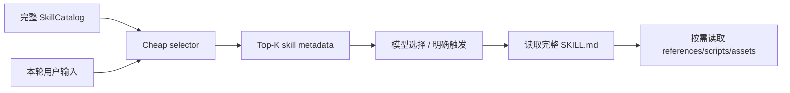
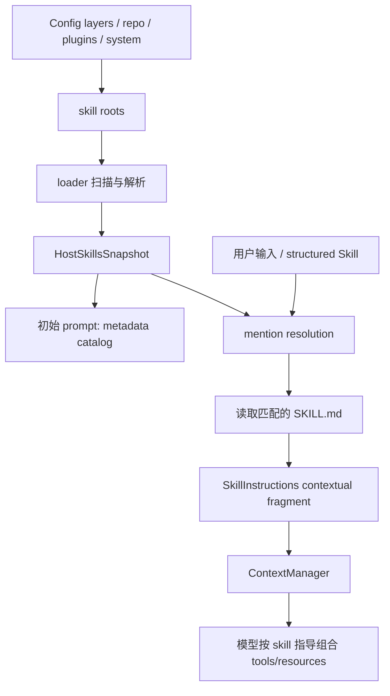

# Skills：发现、目录注入与按需展开

## 1. 结论

Codex 中的 skill 不是可执行 tool，也不是运行时插件对象。它首先是一份带元数据的 `SKILL.md` 指令资源，核心机制是：

1. 从多个 scope 和 filesystem 发现 skill；
2. 只把名称、描述、定位信息作为目录放进初始 prompt；
3. 根据用户显式 mention 选择 skill；
4. 按需读取完整 `SKILL.md`；
5. 将正文作为模型上下文注入；
6. skill 再指导模型使用 tools、脚本、assets 或其他资源。

所以 skill 是“模型可读的工作流包”，tool 是“runtime 可调用的动作”。两者可通过 dependency metadata 和 prompt instructions 联系，但生命周期与执行机制完全不同。

## 2. Crate 边界

主要实现位于独立 crate [`codex-core-skills`](../codex-rs/core-skills/src/lib.rs)，而 `codex-core/src/skills.rs` 主要做 re-export、config 适配和 invocation telemetry。

拆出的职责包括：

- loader：扫描与解析；
- service：缓存与失效；
- model：元数据和 snapshot；
- render：模型可见目录；
- injection：mention 解析与正文读取；
- config rules：enable/disable；
- system：bundled/system skill 安装；
- environment / remote：非本地主机文件系统的 skill；
- invocation utils：命令对 skill 的隐式使用检测。

## 3. Skill 数据模型

[`SkillMetadata`](../codex-rs/core-skills/src/model.rs) 保存：

- `name`；
- `description` 与可选短描述；
- `interface`：展示名、icon、brand color、default prompt；
- `dependencies`：所需 tools/MCP server 等；
- `policy`：是否允许 implicit invocation、product restriction；
- `path_to_skills_md`；
- `scope`；
- `plugin_id`。

`SkillScope` 区分：

- `Admin`；
- `System`；
- `User`；
- `Repo`。

`SkillLoadOutcome` 不只保存成功列表，还保存：

- parse errors；
- disabled paths；
- skill roots；
- path → root 映射；
- path → `ExecutorFileSystem` 映射；
- scripts/doc path 的 implicit skill indexes。

这允许同一个加载结果同时服务本地文件、远端 executor filesystem 和 plugin skill。

## 4. 文件格式

### `SKILL.md`

每个 skill 的入口文件名固定为 `SKILL.md`，要求 YAML frontmatter，至少包含：

```yaml
---
name: example-skill
description: What this skill is for and when it should be used.
---
```

正文是给模型的完整工作流说明。

Loader 对字段做边界校验，例如：

- name 最长 64；
- qualified name 最长 128；
- description 最长 1024；
- metadata 各字段也有硬上限。

这些上限防止单个 skill metadata 无界占用模型上下文。

### `.agents/openai.yaml`

skill 目录可带额外 metadata 文件，描述：

- UI interface；
- tool dependencies；
- invocation policy；
- product restrictions。

正文与展示/依赖 metadata 分离，使纯 Markdown skill 仍然简单，同时支持插件市场和 UI 所需信息。

## 5. Skill roots 与发现顺序

[`loader::skill_roots()`](../codex-rs/core-skills/src/loader.rs) 汇总：

- config layer stack 中的 admin/system/user roots；
- bundled/system skills；
- plugin 提供的 skill roots；
- runtime 额外 roots；
- 当前 repo 祖先路径下的 `.agents/skills`。

Loader 会：

- 对路径去重与 canonicalize；
- 限制扫描深度和每 root 目录数；
- 用 semaphore 限制并发 root scan；
- 明确 symlink 与 hidden directory policy；
- 解析 plugin namespace，形成 qualified skill name；
- 保留 discovery error，而不是因一个坏 skill 放弃整个目录。

Repo skill 跟随当前 cwd/config layer，因此不同工作区可以得到不同目录。

## 6. `SkillsService`：快照与缓存

[`SkillsService`](../codex-rs/core-skills/src/service.rs) 是 host skill discovery 的 owner，包含：

- `cache_by_cwd`；
- `cache_by_config`；
- extra roots；
- 全局 root scan semaphore；
- product restriction。

它返回不可变 `HostSkillsSnapshot`。Turn context 持有 snapshot，而不是随执行过程读取一个可变全局列表。因此：

- 同一 turn 的 mention resolution 与正文读取使用一致目录；
- 文件 watcher/config reload 可以使未来 turn 刷新，而不会改变正在运行的 turn；
- remote filesystem 映射随 snapshot 保留。

App-server 的 [`skills_watcher.rs`](../codex-rs/app-server/src/skills_watcher.rs) 负责监听相关路径并触发 cache invalidation / UI 更新。

## 7. 初始 prompt 中的 skill 目录

线程第一次构建完整 context 时，`Session::build_initial_context_with_world_state_and_mcp()` 调用：

1. `default_skill_metadata_budget(context_window)`；
2. `build_available_skills()`；
3. `AvailableSkillsInstructions::from_available_skills()`。

最后形成 developer fragment，包含：

- skill roots alias 表；
- 每个 skill 的 name、description、短路径或完整 locator；
- “何时触发、如何读取、如何处理 references/scripts/assets”的使用规则。

这部分只告诉模型“有哪些 skill，怎样使用”，不自动放入所有正文。

### 上下文预算

目录预算默认是：

- 有 context window 时：窗口的 2%；
- 无可靠窗口时：8000 字符。

Renderer 会优先尝试完整路径；若超预算，再尝试 root aliases。如果仍超预算，会缩短描述，必要时省略部分 skill，并发 warning/telemetry。

硬预算是这个设计的重要部分：skill 数量可以增长，但模型上下文消耗有上限。

## 8. Skill Search：大量 skill 下的发现、检索与裁剪

“Skill search”在当前项目里容易产生歧义，因为代码中至少有四种不同含义：

1. **discovery scan**：在 filesystem 中寻找 `SKILL.md`；
2. **explicit selection**：根据 `$skill-name` 或 resource path 精确匹配；
3. **catalog relevance selection**：根据用户输入给 skill metadata 排序；
4. **package resource search**：进入某个 skill package 后搜索其内部资源。

当前真正参与产品行为的是前两种；第三种已经有完整的本地检索算法，但仍处于 shadow experiment；第四种只有 provider API 骨架，内置 provider 暂未返回搜索结果。

### 8.1 Discovery scan 不是语义搜索

[`loader/discovery.rs`](../codex-rs/core-skills/src/loader/discovery.rs) 使用 `ExecutorFileSystem::walk()` 遍历每个 skill root，寻找文件名为 `SKILL.md` 的入口文件。

扫描带有明确硬上限：

- 最大深度：6；
- 每个 root 最多 2000 个目录；
- 每个 root 最多 20,000 个 filesystem entries；
- skill metadata 并发加载最多 64 个。

超过限制时，walk 被标记为 truncated，并产生 warning。这个阶段解决的是“有哪些 skill 存在”，不读取用户问题，也不计算 skill 与任务的相关度。

### 8.2 大量 skill 的当前正式处理：有界目录而非 Top-K

发现完成后，Codex 持有完整 `SkillCatalog` / `HostSkillsSnapshot`，但不会把它们逐字放进模型上下文。Renderer 使用 context budget 构造模型可见目录：

- host/core 路径默认占 context window 的 2%；
- 没有可靠 context window 时回退到 8000 字符；
- extension 的普通 catalog fragment 上限为 8000 bytes；
- host skills world-state 会进一步限制到最多 4000 tokens 或 8000 字符。

Core renderer 的降级顺序是：

```text
完整 name + description + locator
                  ↓ 超预算
尝试 root aliases，缩短 locator
                  ↓ 仍超预算
缩短每个 description
                  ↓ 仍超预算
移除 description，只保留最小 name + locator
                  ↓ 最小目录仍超预算
按稳定顺序保留能放下的 skill，其余 omitted
```

Extension catalog renderer 的策略更直接：按照 catalog 顺序加入不超过 8000 bytes 的 entry，放不下的 entry 计入 omitted，最后追加：

```text
- N additional skills omitted from this bounded skills list.
```

因此，当前正式行为不是“根据本轮问题检索 Top-K 后发给模型”，而是“生成一个有硬预算的稳定目录，让模型根据可见 name/description 自行判断”。这有利于 prompt caching 和行为稳定，但 skill 达到数百或数千时，排在预算之外的 skill 不会被模型自然发现。

### 8.3 显式 mention 可以绕过模型可见目录的省略

目录被裁剪不代表 skill 已从 runtime catalog 删除。`collect_explicit_skill_mentions()` 在完整 enabled catalog 中解析：

- `UserInput::Skill { name, path }`；
- `UserInput::Mention` 中的 `skill://...` 或 `SKILL.md` path；
- 文本中的 `$skill-name`；
- Markdown resource link 中的 skill path。

因此，即使某个 skill 因目录预算没有出现在 `<skills_instructions>` 中，只要用户或 UI 提供准确名称/path，它仍然可以被解析和加载。

这使大规模目录下的可靠调用方式变成：

```text
用户/UI 知道精确 skill
        ↓
发送 $skill-name 或结构化 UserInput::Skill
        ↓
在完整 catalog 中精确匹配
        ↓
读取并注入 SKILL.md
```

需要注意，同名、disabled path、connector slug 冲突等仍会参与消歧，plain name 不能保证在歧义场景中任意选中一个。

### 8.4 `skill_search` feature 当前实际启用的是 shadow selection

Feature registry 中存在稳定 feature：

```text
skill_search = true
```

App-server 将它映射为 `SkillsExtensionConfig.shadow_selection_enabled`。名字虽然是 `skill_search`，但当前实现文件明确说明这是临时 shadow-selection experiment。

Shadow 的含义是：

- 每个 turn 都可以运行候选检索；
- 检索结果只用于 telemetry 和离线评估；
- 不改变 model-visible skills catalog；
- 不自动把 Top-K `SKILL.md` 注入 prompt；
- 不影响 runtime 最终选择哪个 skill。

核心 trait [`CheapSkillSelector`](../codex-rs/ext/skills/src/dynamic_skill_selector.rs) 也明确要求 selector：

- deterministic；
- side-effect free；
- 足够便宜，可以每 turn 运行；
- 返回有界 candidate IDs；
- 不改变模型可见目录。

所以看到 config 中 `skill_search = true` 时，不能推断产品已经使用动态 retrieval。这一 feature 当前主要是在验证“如果只给模型/系统 Top-K，召回率是否足够”。

### 8.5 Shadow query 如何构造

[`build_shadow_query()`](../codex-rs/ext/skills/src/shadow_selection_experiment.rs) 遍历本 turn 的 `UserInput`：

- `UserInput::Text` 使用原始文本；
- `UserInput::Skill` 和 `UserInput::Mention` 使用其 name；
- image/audio 等输入不贡献文本；
- 多段内容用空格连接；
- 总 query 最多 16 KiB，超过后在 UTF-8 character boundary 截断。

它还将 query 标记为：

- `ascii_latin`；
- `cjk`；
- `other`；
- `mixed`；
- `none`。

这个 tag 只进入低基数 telemetry，用于比较不同文字系统下 selector 的效果。

### 8.6 被检索的文档字段

每个候选 skill 被投影成 `SkillSelectionDocument`：

```rust
SkillSelectionDocument {
    id,
    name,
    short_description,
    description,
}
```

候选需满足：

- `enabled == true`；
- `prompt_visible == true`；
- authority 为 host 或 orchestrator。

当前没有把完整 `SKILL.md` 正文、references、scripts 或 dependency metadata 建入检索文档。这让索引非常便宜，但召回质量强依赖 skill author 是否写好了 name、short description 和 description。

### 8.7 四种 selector

Shadow experiment 同时运行四个 selector，而不是只运行一种：

| Selector | 方法名 | 主要思路 |
|---|---|---|
| Weighted lexical | `weighted_lexical_v1` | 对 name、short description、description 的词命中手工加权 |
| Fielded BM25 | `fielded_bm25_v1` | 三字段 BM25，字段权重为 8:4:1 |
| Character n-gram | `character_ngram_v1` | 2 到 5 字符 n-gram，改善拼写变化、复合词和 CJK 匹配 |
| Multi-query lexical | `multi_query_lexical_v1` | 把多句/多子任务 query 拆成多个 view，合并 weighted lexical 排名 |

共同的有界设计包括：

- 单 selector query 最多 4 KiB；
- query term 最多 64；
- 单文档最多处理 4 KiB；
- 单文档 term 最多 256；
- 最多评分 1000 个候选；
- selector 内部最多支持 50 个结果；
- shadow experiment 最终只保留前 20 个。

#### Weighted lexical

`weighted_lexical_v1` 对不同字段给予不同的离散分数：

- query 中包含完整 skill name：高权重；
- name 精确 term 命中：最高 term 权重；
- name 的相关 term/前后缀命中：次高；
- short description 命中：中等；
- 长 description 命中：最低。

它还对匹配到的 query term 数量做平方奖励，让覆盖多个任务关键词的 skill 排名更高。英文 stop words 被过滤，term 做 lowercase 和非字母数字分隔归一化。

#### Fielded BM25

`fielded_bm25_v1` 分别 tokenize：

```text
name              weight 8
short_description weight 4
description       weight 1
```

然后计算带字段长度归一化的 BM25 分数，常量为 `k1 = 1.2`、`b = 0.75`。它比手工 lexical scoring 更能降低目录中常见词的权重，并利用 inverse document frequency 提升区分度。

#### Character n-gram

`character_ngram_v1` 为 query 和三个字段生成 2–5 字符 gram，仍使用 8:4:1 字段权重和类似 IDF 的计算。至少要匹配最多 3 个 query grams 才进入候选。

这一方法对以下情况更有价值：

- skill name 与用户用词存在轻微拼写差异；
- kebab-case、复合词和连续文本之间的边界不同；
- CJK 文本缺少空格分词；
- 用户只写了名称的一部分。

#### Multi-query lexical

`multi_query_lexical_v1` 先对完整 query 运行 weighted lexical，然后按以下边界拆分子 query：

- 换行；
- `. ! ? ;`；
- 英文连接词 `and then`、`and`、`then`、`also`。

最多生成 8 个 query views。合并时优先考虑：

1. 在任一 view 中的最好名次；
2. 在完整 query 中的名次；
3. 命中的 view 数量；
4. 首次出现的 view；
5. 稳定 ID 顺序。

它试图解决“一条用户请求包含多个子任务，完整 query 的主主题淹没次要 skill”的问题。

### 8.8 Shadow telemetry 如何判断搜索是否有效

每个 selector 会记录：

- 是否成功产生候选；
- selector 耗时；
- catalog entry 数量；
- selected entry 数量；
- query term 数量；
- catalog reduction basis points；
- query/candidate 是否被截断；
- query script 类型。

当 turn 后续真正读取某个 host/orchestrator skill 时，`record_invocation()` 会比较该 skill 是否出现在各 selector 的候选中，并记录 rank bucket：

```text
1
2–5
6–10
11–20
miss
```

这相当于用“最终实际调用的 skill”作为弱标签，在线估算 Top-20 recall。由于不同 selector 同时 shadow 运行，可以在不改变用户行为的前提下比较算法。

### 8.9 Provider `search()` 是另一套尚未完成的接口

[`SkillProvider`](../codex-rs/ext/skills/src/provider.rs) 已定义三种操作：

```text
list
read
search
```

其中 `search(SkillSearchRequest)` 带有：

- authority；
- package；
- query。

返回 `SkillSearchResult { matches }`，每个 match 包含 resource、title 和 snippet。这个 API 的语义更接近“已知 skill package 后，搜索 package 内部不可直接访问的资源”，而不是从全局 catalog 中选 skill。

但是当前 host、executor、orchestrator provider 的 `search()` 都返回空的默认结果；模型可见的 skills namespace 也只有：

```text
skills.list
skills.read
```

目前没有 `skills.search` tool。因此 provider search 还是为未来 authority-aware resource search 预留的抽象，不能当作现有功能。

### 8.10 Orchestrator skills 的 list/read 路径

对于 opaque orchestrator resources，模型不能把 locator 当作本地路径读取。Extension 暴露：

- `skills.list`：列出 orchestrator-owned enabled skills，返回 package 和 main resource handle；
- `skills.read`：根据精确 authority、package、resource 读取完整资源。

Orchestrator discovery 本身最多保留 100 个 skills，并限制分页数、名称长度、URI 长度和单资源内容大小。这是“目录 + 精确读取”的 progressive disclosure，不是 query-based search。

### 8.11 当前大规模 skill 行为总结

| 阶段 | 当前机制 | 是否根据用户问题搜索 |
|---|---|---|
| 找到 skill 文件 | 有界 filesystem walk | 否 |
| 建立 runtime catalog | 解析所有扫描到的 enabled metadata | 否 |
| 生成模型目录 | 2%/8000 字符或 8000 bytes 预算裁剪 | 否 |
| 用户明确 `$skill` | 完整 catalog 精确匹配 | 是，但属于 exact lookup |
| 自动相关度候选 | 四种 lexical selector Top-20 | 是，但只在 shadow 中 |
| 自动注入 Top-K 正文 | 未实现为正式路径 | — |
| package 内资源搜索 | provider API 已定义，内置实现为空 | 尚不可用 |

### 8.12 可能的演进方向

从现有代码结构推断，项目正在验证以下两阶段架构：



如果 shadow metrics 证明 Top-20 recall 足够高，未来可以让 selector 真正影响 model-visible catalog。不过正式启用仍需解决：

- explicit mention 必须始终绕过召回失败；
- catalog 与 selector 结果变化会影响 prompt caching；
- 多语言/CJK 的 tokenization 与召回；
- 同名和 plugin namespace 消歧；
- 某些 skill description 写得很差，metadata retrieval 无法命中；
- 新 skill 的 cold-start 与稳定排序；
- Top-K 未命中时的 `skills.list` / search fallback；
- selector 的候选上限 1000 对更大 catalog 的扩展方式；
- 不能因自动检索而绕过 enabled state、authority 或 permission boundary。

因此当前实现选择先 shadow 测量，再改变 prompt，而不是直接上线动态 skill retrieval。这与本项目对模型可见 context 的稳定性、有界性和 cache 命中的要求一致。

## 9. Mention 解析

[`collect_explicit_skill_mentions()`](../codex-rs/core-skills/src/injection.rs) 支持两类显式选择：

### 结构化选择

`UserInput::Skill { name, path, ... }` 按规范化绝对 path 精确匹配 enabled skill。这通常来自 UI 的 skill picker/link。

### 文本 mention

扫描文本中的：

- `$skill-name`；
- `[$skill-name](skill://...)`；
- 直接指向 `SKILL.md` 的资源链接。

选择规则考虑：

- disabled paths；
- duplicate name/path；
- plugin / app / MCP mention syntax；
- connector slug 冲突；
- plain name 是否唯一。

因此文本 `$foo` 不会在多个同名 skill 或与 app slug 冲突时随意选一个。

## 10. 正文按需注入

`run_turn()` 在第一次 sampling 前调用 `build_skills_and_plugins()`：

1. 从本 turn 用户输入收集 mentions；
2. 用 `TurnSkillsContext.snapshot` 解析 skill；
3. 检查并可提示安装 MCP dependencies；
4. `build_skill_injections()` 从对应 filesystem 读取完整正文；
5. 包装为 `SkillInstructions`；
6. 以 user role `<skill>` fragment 写入 `ContextManager`；
7. 发 telemetry 和 analytics。

注入格式由 [`skill_instructions.rs`](../codex-rs/core-skills/src/skill_instructions.rs) 定义：

```text
<skill>
<name>skill-name</name>
<path>/.../SKILL.md</path>
...完整正文...
</skill>
```

正文一旦写入历史，会参与当前 turn 后续所有 sampling，也会进入 rollout。它不会在未再次 mention 时每轮重复读取/追加。

## 11. Explicit 与 implicit invocation

### Explicit invocation

用户直接点名 skill 时，完整正文会注入，analytics 标记 `InvocationType::Explicit`。

### Implicit invocation

系统还能根据 shell command 的 scripts/doc path 判断命令是否在使用某个 skill。`maybe_emit_implicit_skill_invocation()`：

- 使用预构建 path index 检测；
- 每 turn 对同一 skill 去重；
- 通知 extension contributors；
- 发 telemetry/analytics。

这里的 implicit invocation 主要是“使用检测与记账”，不是无条件把正文偷偷注入。是否允许由 `SkillPolicy.allow_implicit_invocation` 与 enabled state 控制。

## 12. Skill dependencies

Skill metadata 可以声明 tool dependency，例如 MCP server、command 或 URL。用户显式点名 skill 后，`maybe_prompt_and_install_mcp_dependencies()` 检查依赖。

核心原则是：

- skill 自身不会绕过工具可用性；
- 依赖缺失时通过 elicitation/安装流程解决；
- 安装或连接成功后，工具仍需进入本 step 的 `ToolRouter` 才能调用；
- skill prompt 与 tool authorization 是两个独立安全边界。

## 13. Plugin skills 与 namespace

Plugin 可以贡献 skill roots。Loader 保存 `plugin_id`、plugin namespace 与 plugin root，用 qualified name 避免冲突。

同时，plugin 加载流程可能通过 extension 把 host skill catalog 或正文投影进 world state。为防重复，core 使用：

- `HostSkillsCatalogInWorldState`：表示目录已由 extension 注入；
- `InjectedHostSkillPrompts`：表示某些正文已由 extension 注入。

Legacy core path 会跳过这些已投影内容，实现迁移期间的去重。

## 14. Remote / environment-owned skills

Skill 不一定存在于 Codex host filesystem。`HostSkillsSnapshot` 保存每个 skill 对应的 `ExecutorFileSystem`，读取时使用 `PathUri`。

模型可见 locator 也区分：

- host file；
- environment resource；
- orchestrator resource；
- custom resource。

使用规则明确要求按 locator authority 读取，不能把所有资源假设成本地 path。这是 connected/remote executor 场景下的重要抽象。

## 15. 生命周期图



## 16. Skill 与 Tool 的精确区别

| 维度 | Skill | Tool |
|---|---|---|
| 本体 | Markdown 指令与资源包 | Runtime executor + schema |
| 模型如何获知 | 目录 + 按需正文 | Responses request 的 tools |
| 如何触发 | 用户 mention / 匹配规则 | 模型产生 tool call item |
| 谁执行 | LLM 阅读并遵循 | Core/MCP/extension/provider runtime |
| 权限 | 不能自行授予权限 | 受 approval/policy/sandbox 约束 |
| 状态 | snapshot、context injection | step-scoped router、call/output history |
| 扩展内容 | references/scripts/assets/templates | 参数 schema 与执行结果 |

## 17. 设计判断

- Skill 使用 progressive disclosure，避免把所有领域知识一次性塞入 prompt。
- Metadata 有严格长度和总预算，满足模型上下文的有界性要求。
- Snapshot 让 mention 选择、正文读取和 telemetry 基于一致目录。
- Skill 可以推荐工具使用方法，但不能扩大 ToolRouter 或 PermissionProfile 的权限。
- Plugin、remote filesystem 和 extension projection 已被纳入同一 skill model，而不是只支持 `~/.codex/skills`。
- 当前实现保留 legacy core injection 与 extension-owned projection 的过渡兼容逻辑，阅读代码时需留意去重 marker。
- `skill_search` 当前是 shadow experiment，不应误认为已启用动态 Top-K prompt injection。
- 大规模 skill 的正式保障目前来自有界扫描、有界目录、描述降级、精确 mention 和 progressive disclosure。

## 18. 关键文件

- [`core-skills/src/model.rs`](../codex-rs/core-skills/src/model.rs)：metadata、snapshot、load outcome。
- [`core-skills/src/loader.rs`](../codex-rs/core-skills/src/loader.rs)：roots、扫描与解析。
- [`core-skills/src/service.rs`](../codex-rs/core-skills/src/service.rs)：缓存、快照与失效。
- [`core-skills/src/render.rs`](../codex-rs/core-skills/src/render.rs)：目录和预算。
- [`core-skills/src/injection.rs`](../codex-rs/core-skills/src/injection.rs)：mention 与正文读取。
- [`core-skills/src/skill_instructions.rs`](../codex-rs/core-skills/src/skill_instructions.rs)：正文 fragment。
- [`core/src/session/turn.rs`](../codex-rs/core/src/session/turn.rs)：turn 级注入。
- [`core/src/session/mod.rs`](../codex-rs/core/src/session/mod.rs)：初始目录注入。
- [`app-server/src/skills_watcher.rs`](../codex-rs/app-server/src/skills_watcher.rs)：文件变化监听。
- [`ext/skills/src/shadow_selection_experiment.rs`](../codex-rs/ext/skills/src/shadow_selection_experiment.rs)：shadow query、四 selector 编排与评估指标。
- [`ext/skills/src/dynamic_skill_selector.rs`](../codex-rs/ext/skills/src/dynamic_skill_selector.rs)：cheap selector contract。
- [`ext/skills/src/dynamic_skill_selector/weighted_lexical.rs`](../codex-rs/ext/skills/src/dynamic_skill_selector/weighted_lexical.rs)：字段加权 lexical selector。
- [`ext/skills/src/dynamic_skill_selector/fielded_bm25.rs`](../codex-rs/ext/skills/src/dynamic_skill_selector/fielded_bm25.rs)：fielded BM25 selector。
- [`ext/skills/src/dynamic_skill_selector/character_ngram.rs`](../codex-rs/ext/skills/src/dynamic_skill_selector/character_ngram.rs)：字符 n-gram selector。
- [`ext/skills/src/dynamic_skill_selector/multi_query_lexical.rs`](../codex-rs/ext/skills/src/dynamic_skill_selector/multi_query_lexical.rs)：多子查询合并 selector。
- [`ext/skills/src/provider.rs`](../codex-rs/ext/skills/src/provider.rs)：list/read/search provider contract。
- [`ext/skills/src/tools`](../codex-rs/ext/skills/src/tools)：当前模型可用的 `skills.list` 与 `skills.read`。
