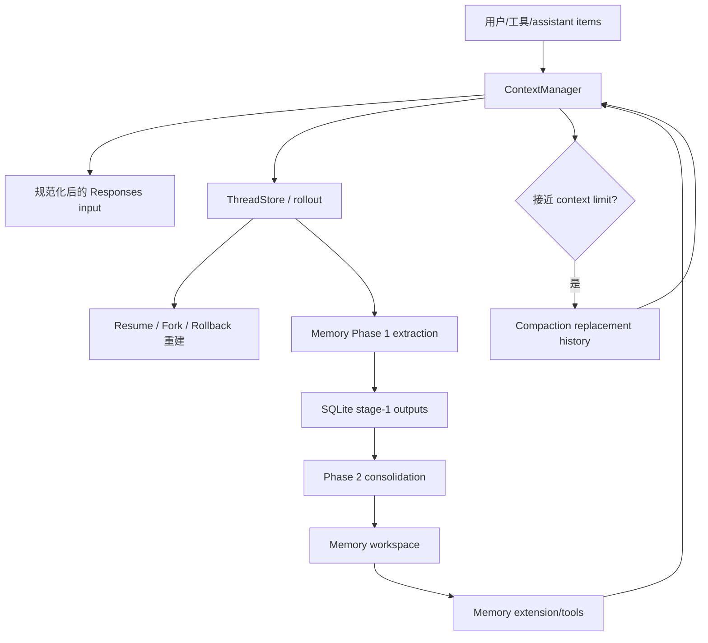

# Context / Memory：短期历史、持久化、压缩与长期记忆

## 1. 结论

当前项目里的“记忆”至少有四个不同层次，不能混为一谈：

1. **Turn/step context**：本次执行的配置和动态快照；
2. **Conversation context**：模型下一次请求能看到的线程历史；
3. **Rollout/thread persistence**：用于恢复、fork、审计的持久化事件日志；
4. **Long-term memories**：跨线程复用的 memory extraction + consolidation 系统。

此外还有 **compaction**：它是 conversation context 的有损压缩机制，不等同于长期 memory。

## 2. 生命周期层次

### `SessionConfiguration`

线程级当前配置，包含模型、provider、base/developer instructions、personality、collaboration mode、权限、环境、history mode 等。它可以被 thread settings 更新。

### `TurnContext`

[`TurnContext`](../codex-rs/core/src/session/turn_context.rs) 是一个 turn 内稳定的配置快照，包含：

- model/provider/model info；
- reasoning、service tier、output schema；
- developer instructions 与 personality；
- permission profile、approval policy、sandbox；
- environments；
- skill snapshot；
- dynamic tools；
- turn ID、source、telemetry、timing；
- turn-scoped extension data。

修改 session settings 不会反向改变已经运行中的 `TurnContext`。

### `StepContext`

[`StepContext`](../codex-rs/core/src/session/step_context.rs) 是每次 model sampling request 的动态快照，包含：

- 当前 turn；
- environment readiness snapshot；
- resolved capability roots；
- executor capability discovery；
- 当前 MCP runtime snapshot；
- lazy-frozen MCP tool list；
- 当前加载的 `AGENTS.md`。

它解决了 turn 内状态变化：一个 turn 可能经历多次“模型 → 工具 → 模型”，环境或 MCP 在 step 之间可以刷新，但一次 request 的 prompt、tool specs 和实际工具执行必须一致。

## 3. `ContextManager`：模型可见短期历史

[`ContextManager`](../codex-rs/core/src/context_manager/history.rs) 是 conversation context 的核心数据结构：

```text
items: Vec<ResponseItem>
history_version: u64
token_info: Option<TokenUsageInfo>
reference_context_item: Option<TurnContextItem>
world_state_baseline: Option<WorldStateSnapshot>
```

### `items`

从旧到新保存模型可见的 Responses items，包括：

- developer/user/assistant messages；
- reasoning；
- function/custom tool call 与 output；
- web search/image generation items；
- compaction items。

不是所有协议事件都会进入这里；`record_items()` 只保留适合 API history 的 items。

### `history_version`

正常 append 不需要重写版本；compaction、rollback、图片修复等重写操作会推进版本。Transport 增量复用可以据此判断历史是否仍兼容。

### `reference_context_item`

这是上一次稳定模型上下文配置的 baseline。后续 turn 用它判断是否只追加 settings diff，还是必须完整重注入。

### `world_state_baseline`

用于动态环境、权限、AGENTS.md 等 section 的 diff。它与 rollout 中的 `WorldStateItem` 配合，使恢复后仍可继续增量更新。

## 4. 写入历史的统一边界

[`Session::record_conversation_items()`](../codex-rs/core/src/session/mod.rs) 是关键写入边界。它同时：

1. 准备图片/音频；
2. 补充 turn ID 和 response item ID；
3. 按 truncation policy 写入 `ContextManager`；
4. append 到 rollout/thread store；
5. 向客户端发送 raw response item event。

因此内存历史、持久化历史和 UI event 通常从同一份 canonical item 派生，减少三者漂移。

工具结果、assistant 输出、synthetic context、skill 正文都走这条边界。

## 5. 请求前规范化

`ContextManager::for_prompt(input_modalities)` clone 一份历史并规范化，不直接修改权威 history。规范化负责：

- 保持 function call/output 配对；
- 移除不适合请求的 item；
- 按模型 modalities 去除不支持的 image/audio；
- 截断过大的 tool output；
- 保持 Responses API 所需顺序和结构。

这允许 rollout 保存较丰富的原始语义，而模型请求使用安全、兼容、受限的视图。

## 6. 动态 World State

World State 是 conversation context 中“当前世界”的结构化来源。每个 section 只保存比较所需 snapshot，并能相对上个 snapshot 渲染 diff。

执行过程：

1. `capture_step_context()` 捕获 filesystem/MCP/environment；
2. `build_world_state_for_step()` 生成当前 sections；
3. 首次 turn 注入 full fragments + full snapshot；
4. 后续 step/turn 用 `render_diff()` 只追加变化；
5. snapshot/merge patch 作为 `RolloutItem::WorldState` 持久化。

当 retained history 已不再包含某 section 的 fragment，section 可以通过 retained-fragment matcher 强制重新注入，避免 baseline 仍在但模型已看不到原内容。

## 7. Pending input、steering 与 mailbox

活动 turn 期间用户仍可发送输入。`InputQueue` 区分：

- 当前 turn pending input；
- mailbox/inter-agent items；
- 可触发新 turn 的 mailbox mail；
- approval/user-input 等等待中的响应。

`run_turn()` 在 sampling 边界 drain pending input，而不是任意时刻修改已发出的 request。特殊情况：

- turn 第一次 sampling 先处理原始用户输入；
- auto-compaction 后先恢复 model/tool continuation；
- commentary/reasoning item 边界可为 mailbox preemption 提供机会。

这让 steering 保持增量历史语义，同时避免一次 request 中 prompt 与 runtime 状态中途变化。

## 8. Token accounting 与 context window

上下文容量使用两类信息：

- 服务端返回的 `TokenUsageInfo`；
- `approx_token_count` 的本地估算。

估算包括 base instructions 与所有历史 items，用于请求前判断；服务端 usage 用于完成后的精确状态更新。

`session/context_window.rs` 综合：

- active context tokens；
- auto-compact scope；
- model resolved context window；
- effective context window percent；
- prefill/window limits。

达到阈值且还需 follow-up 时，runtime 触发 auto-compaction 或新 context window。

## 9. Compaction：短期上下文压缩

Compaction 的目标是让同一线程在有限 context window 中继续，不是生成跨线程知识。

### Local sampling compaction

[`core/src/compact.rs`](../codex-rs/core/src/compact.rs) 使用 summarization prompt，把历史压缩成 summary，并用新的 replacement history 替换 `ContextManager`。

### Remote compaction

支持 provider `/responses/compact` 的场景走 remote compact；仓库还包含 remote v2 尝试与 fallback。

### 触发场景

- 用户手动 `Op::Compact`；
- turn 前预检查；
- turn 中达到 context limit；
- 显式 `new_context_window` 请求。

### 初始上下文重注入

`InitialContextInjection` 区分：

- `DoNotInject`：standalone/pre-turn compaction 后清空 reference baseline，让下个普通 turn 完整重注入；
- `BeforeLastUserMessage(world_state)`：mid-turn compaction 把完整初始 context 插入最后真实 user message 之前，保证 continuation 立即可用。

Compaction 会维护 call/output 配对、turn boundary 和 world-state baseline，不是简单删除最旧消息。

## 10. Rollout 与 ThreadStore：持久化记忆

Conversation context 存在于内存中；持久化由 `ThreadStore` / `LiveThread` 完成。默认 local store 基于 rollout append log，并用 state DB 建索引。

持久化内容不只包括 `ResponseItem`，还包括：

- `SessionMeta`；
- `TurnContextItem`；
- `WorldStateItem` full/patch；
- token usage；
- compaction records；
- thread metadata、memory mode；
- turn lifecycle 与其他 replay 所需事件。

`ThreadManager` 用这些数据支持：

- resume；
- fork；
- rollback；
- archive/list/search；
- lazy materialization；
- app-server history projection。

Resume 不是把 UI 文本拼回 prompt，而是通过 [`rollout_reconstruction.rs`](../codex-rs/core/src/session/rollout_reconstruction.rs) 重建 `ContextManager`、reference context、world-state baseline 和 token state。

## 11. Fork 与 rollback

### Rollback

`ContextManager::drop_last_n_user_turns()` 以真实 user turn boundary 截断，并移除关联 call/output。如果截掉混合 initial context，会清除 reference baseline，让未来完整重注入。

### Fork

`ThreadManager` 支持：

- 在第 N 个 user message 前截断；
- 把当前持久化前缀视为“此刻被中断”的 snapshot。

如果源线程仍 mid-turn，fork 可追加与真实 interrupt 相同的 `<turn_aborted>` marker，保证模型理解历史为何突然结束。

## 12. 长期 Memory：读写分离

长期 memory 是独立的跨线程系统，主要分为：

- [`codex-memories-write`](../codex-rs/memories/write/src/lib.rs)：生成与整理；
- [`codex-memories-read`](../codex-rs/memories/read/src/lib.rs)：读取路径、citation 与 usage；
- [`codex-ext-memories`](../codex-rs/ext/memories/src/lib.rs)：把读取指令和工具接入 agent runtime；
- [`codex-state`](../codex-rs/state/src/runtime/memories.rs)：SQLite jobs 与 stage outputs。

### 启动条件

Root session 启动时异步触发，仅当：

- 线程非 ephemeral；
- `Feature::MemoryTool` 开启；
- 不是 subagent；
- state DB 可用；
- rate limit guard 允许。

它不阻塞当前用户 turn。

## 13. Memory 写路径：Phase 1

Phase 1 对单线程 rollout 做抽取：

1. 从 state DB 扫描近期、空闲、允许来源且 memory mode enabled 的线程；
2. 通过 lease/ownership token claim 有界数量 jobs；
3. 过滤为 memory-relevant rollout items；
4. 并发调用专用 extraction model；
5. 要求 JSON schema 输出 `raw_memory`、`rollout_summary`、可选 slug；
6. 对生成内容做 secret redaction；
7. 保存 stage-1 output；
8. 失败时写 backoff，成功时推进 global consolidation job。

并发数、扫描量、最大 rollout 年龄、最小 idle 时间都有配置上限，避免每次启动进行无界后台工作。

## 14. Memory 写路径：Phase 2

Phase 2 是全局串行 consolidation：

1. claim 单例 global lease；
2. 按 usage/freshness 选择有限数量 stage-1 outputs；
3. 更新 `raw_memories.md` 与 `rollout_summaries/`；
4. 删除过期 summary/extension resources；
5. 基于 memory root 的 git baseline 生成 `phase2_workspace_diff.md`；
6. 若无 diff，直接完成；
7. 若有 diff，启动内部 consolidation agent；
8. agent 只能写 memory root、无网络、无需 approval、禁用协作；
9. 运行中 heartbeat lease；
10. 验证 `MEMORY.md`、`memory_summary.md`、skills 等 artifacts；
11. 成功后重置 baseline 并更新 watermark/job 状态。

Phase 1 负责“每个 rollout 提取事实”，Phase 2 负责“全局去重、组织成可读/可检索资源”。

## 15. Memory 读路径

`MemoriesExtension` 在 thread start 根据配置保存 read-path 状态，并贡献：

- developer policy：告诉模型 memory root 和使用方法；
- dedicated memory tools（配置开启时）：search、read、list、ad-hoc note。

这些工具由 extension `ToolContributor` 进入统一 ToolRouter，因此仍受正常 telemetry 与 tool lifecycle 管理。

读取到 memory citation 时，core 在 turn state 标记 citation usage，memory store 更新 usage_count/last_usage。这反过来影响 Phase 2 后续选择排序与过期策略。

## 16. Memory mode 与污染

`ThreadMemoryMode` 对线程是否可用于未来 memory generation 做持久化控制：

- `Enabled`；
- `Disabled`。

State DB 内部还使用 `polluted` 状态：当 tool output 或 extension context 被标记为 external context，且配置禁止从 external context 生成 memory 时，线程会被标记 polluted。

这是重要的数据边界：模型能在当前 turn 使用外部内容，不代表系统允许把它长期沉淀为用户 memory。

## 17. 四类“记忆”的关系

| 层次 | 主要载体 | 生命周期 | 是否给当前模型 | 是否跨线程 |
|---|---|---|---|---|
| Turn/Step context | `TurnContext` / `StepContext` | turn / sampling step | 间接生成 prompt/tools | 否 |
| Conversation context | `ContextManager` | 当前线程窗口 | 是 | 否 |
| Rollout persistence | `ThreadStore` / rollout log | 持久化线程 | resume 后重建 | 作为原线程历史 |
| Long-term memory | SQLite + memory workspace | 跨线程长期 | 通过 extension/tools 按需 | 是 |
| Compaction summary | replacement history | 当前线程后续窗口 | 是 | 通常不直接跨线程 |

## 18. 数据流



## 19. 设计判断

- 短期 context、持久化 rollout、compaction 与长期 memory 被清晰分离，各自有独立安全和一致性边界。
- `ResponseItem` 是短期历史与模型 API 的共同格式，`RolloutItem` 则承载更多恢复元数据。
- World State 通过 typed snapshots 和 merge patches 避免重复注入，并支持恢复后继续 diff。
- 长期 memory 是后台、有界、lease 协调的 pipeline，不直接阻塞交互 agent。
- External context pollution 机制说明 memory 写入比当前 turn 使用具有更严格的来源要求。
- Memory read 通过 extension 和 tools 接入，而不是把全部 `MEMORY.md` 永久塞进每轮 prompt。

## 20. 关键文件

- [`core/src/context_manager/history.rs`](../codex-rs/core/src/context_manager/history.rs)：短期历史。
- [`core/src/context/world_state`](../codex-rs/core/src/context/world_state/mod.rs)：动态状态。
- [`core/src/session/step_context.rs`](../codex-rs/core/src/session/step_context.rs)：step snapshot。
- [`core/src/session/turn_context.rs`](../codex-rs/core/src/session/turn_context.rs)：turn snapshot。
- [`core/src/compact.rs`](../codex-rs/core/src/compact.rs)：compaction。
- [`core/src/session/rollout_reconstruction.rs`](../codex-rs/core/src/session/rollout_reconstruction.rs)：恢复。
- [`thread-store`](../codex-rs/thread-store/src/lib.rs)：持久化接口与实现。
- [`memories/README.md`](../codex-rs/memories/README.md)：memory pipeline 概览。
- [`memories/write`](../codex-rs/memories/write/src/lib.rs)：长期 memory 写路径。
- [`ext/memories`](../codex-rs/ext/memories/src/lib.rs)：长期 memory 读路径接入。
- [`state/src/runtime/memories.rs`](../codex-rs/state/src/runtime/memories.rs)：jobs、leases、outputs。

