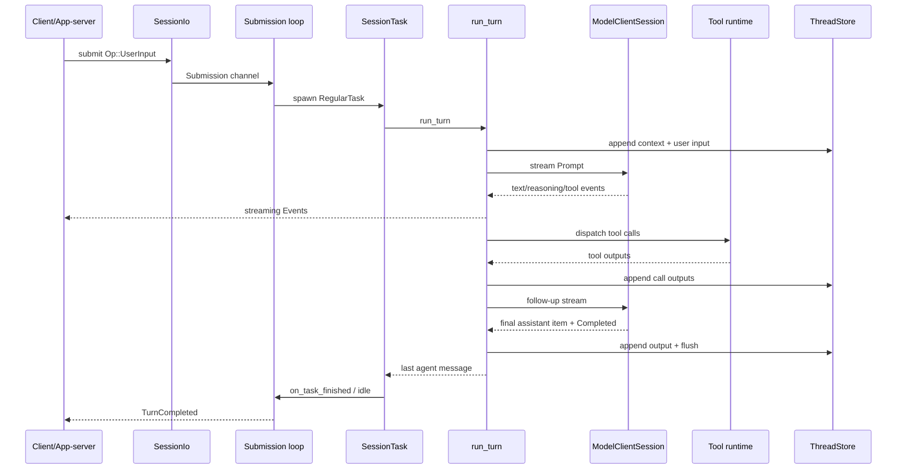

# Runtime / Orchestrator：线程、任务与 Agent Loop

## 1. 结论

Codex 的 runtime 是一个基于 Tokio 的分层事件系统。最核心的关系是：

```text
ThreadManager
  └─ CodexThread
      └─ Session
          ├─ submission loop
          ├─ one active SessionTask
          ├─ run_turn sampling loop
          ├─ tool futures
          └─ event stream + persistence
```

Agent loop 并不位于一个名叫 `Agent` 的 struct 中。真正的 orchestration 分散在：

- `ThreadManager`：多线程生命周期；
- `Session`：单线程状态与服务；
- `submission_loop`：外部操作入口；
- `SessionTask`：turn 工作流；
- `run_turn`：模型/工具循环；
- `ToolCallRuntime`：工具并行与取消；
- `ContextManager` / `ThreadStore`：状态提交与恢复。

## 2. `ThreadManager`：进程内线程控制面

[`ThreadManager`](../codex-rs/core/src/thread_manager.rs) 管理 `ThreadId -> Arc<CodexThread>`，并共享跨线程服务：

- auth manager；
- models manager；
- environment manager；
- skills service；
- plugins manager；
- MCP manager；
- extension registry；
- thread store / state DB；
- agent graph store；
- code mode provider；
- attestation/time provider。

主要职责：

- start / resume / fork thread；
- 注册与移除 live thread；
- 通知 thread created；
- 为 subagent 提供创建入口；
- shutdown 全部线程；
- 处理 history mode、source、parent/fork metadata。

`ThreadManager` 是“多个 agent thread 的容器”，但不执行单个 turn 的模型循环。

## 3. `CodexThread`：面向调用方的句柄

[`CodexThread`](../codex-rs/core/src/codex_thread.rs) 包装：

- `Arc<Session>`；
- `SessionIo`；
- 初始 `SessionConfiguredEvent`；
- rollout path；
- out-of-band elicitation 状态。

它向 app-server/TUI/SDK 暴露：

- `submit(Op)`；
- `next_event()`；
- thread settings/status；
- shutdown/wait；
- MCP resource calls；
- lifecycle 和辅助查询。

调用方与 runtime 的基本通信是双向流：提交 `Op`，消费 `Event`。

## 4. `SessionIo` 与 channel

`Session::spawn()` 创建：

- bounded submission channel，容量 512；
- unbounded event channel；
- watch channel 保存 agent status；
- shared future 表示 session loop 结束。

`SessionIo::submit()` 为每个操作生成 UUIDv7 submission ID，并附带 W3C trace context。该 ID 对创建 turn 的 app-server 请求也充当 public turn ID。

Bounded submission channel 提供输入背压；event channel 不阻塞核心 runtime 的产出，但客户端仍需持续消费。

## 5. Submission loop

[`submission_loop`](../codex-rs/core/src/session/handlers.rs) 是单线程控制操作的序列化入口。它逐个处理 `Submission { id, op, ... }`，分派：

- user input；
- interrupt / shutdown；
- thread settings；
- approval / permissions / user-input answers；
- MCP refresh / elicitation；
- compact / rollback；
- review；
- realtime conversation；
- dynamic tool response；
- inter-agent communication；
- user shell command。

它不会同步等待一个 regular turn 完成。`UserInput` 通常只创建/steer turn 并 spawn background task，然后 loop 继续接收 approval、interrupt 和 steering 操作。

收到 `Op::Shutdown` 或 submission channel 关闭后，runtime 会执行完整 teardown：取消任务、关闭工具进程、触发 extension thread-stop lifecycle、关闭 persistence。

## 6. `Session`：单线程状态容器

`Session` 将 mutable state 与 long-lived services 分开：

### `SessionState`

受 async mutex 保护，包含：

- `SessionConfiguration`；
- `ContextManager`；
- token/rate-limit/compact window 状态；
- previous turn settings；
- connector selection；
- additional context 等可变会话数据。

### `SessionServices`

[`state/service.rs`](../codex-rs/core/src/state/service.rs) 保存长期服务：

- model client；
- MCP runtime/snapshot；
- unified exec manager；
- auth/models/skills/plugins/extensions；
- agents.md manager；
- hooks/exec policy/approval store；
- telemetry/analytics/rollout trace；
- thread store/live thread/state DB；
- network proxy/approval；
- code mode service。

### `ActiveTurn`

同一 session 同时只有一个 active `SessionTask`。其中保存：

- running task handle；
- cancellation token；
- `TurnContext`；
- turn state（pending approvals、tool count、token baseline、memory citation 等）；
- completion notify；
- agent execution guard。

## 7. `SessionTask`：工作流抽象

[`SessionTask`](../codex-rs/core/src/tasks/mod.rs) 是 async workflow trait：

- `kind()`；
- `span_name()`；
- `run(session, turn_context, input, cancellation_token)`；
- 可选 `abort()` cleanup。

主要 task 类型：

- `RegularTask`：普通 agent turn；
- `CompactTask`；
- `ReviewTask`；
- `UserShellCommandTask`。

`Session::spawn_task()` 会先以 `Replaced` 原因取消旧任务，再清理 connector selection 并启动新任务。`start_task()` 负责：

1. 标记 turn timing；
2. 创建 cancellation token；
3. 安装 active turn state；
4. 触发 turn-start lifecycle；
5. 获取 multi-agent execution guard；
6. `tokio::spawn` task；
7. 完成时 flush rollout；
8. 调用统一 `on_task_finished()`。

## 8. `RegularTask` 与 startup prewarm

[`RegularTask`](../codex-rs/core/src/tasks/regular.rs) 是普通交互入口。它：

- 立即发送 `TurnStarted`；
- 尝试消费 session startup WebSocket prewarm；
- 调用 `run_turn()`；
- 如果 task 返回时 input queue 又有 pending input，则用空 initial input 再跑一轮。

Prewarm 是 best effort；取消或失败不会阻止 turn，最多回退到普通连接。

## 9. `run_turn`：核心 Agent Loop

[`run_turn`](../codex-rs/core/src/session/turn.rs) 的语义是：重复 sampling，直到模型不再要求 follow-up 且没有 pending input。

### Turn 开始阶段

1. 创建/复用 `ModelClientSession`；
2. 运行 pre-sampling compaction 检查；
3. 捕获 first `StepContext`；
4. 记录初始/增量 world state；
5. 解析并注入 skill/plugin/extension input；
6. 执行 session-start 与 input hooks；
7. 写入用户输入；
8. 初始化 turn diff tracker。

### 每次 sampling

1. 在安全边界 drain pending input；
2. 记录 time/token reminders；
3. 捕获或复用 `StepContext`；
4. 对 world state 做 step diff；
5. clone + normalize history；
6. 基于 step 构造 `ToolRouter`；
7. build `Prompt`；
8. 调用 model stream；
9. 流式转发文本/reasoning/plan/events；
10. 调度 tool calls；
11. drain tool outputs 并写回历史；
12. 根据 `end_turn`、tool calls、mailbox 判断是否继续。

### Sampling 后决策

- 若还需 follow-up：继续 loop；
- 若 token limit 到达：auto-compact / rollover 后继续；
- 若无 follow-up：执行 stop hooks；
- stop hook 可追加 continuation prompt，让 loop 再运行；
- 最终返回 last agent message。

这正是 agent 的 observe-decide-act-observe 循环，只是 observe/act 都被编码成 Responses items。

## 10. 流式处理与并发

Model stream 在 `try_run_sampling_request()` 内顺序消费，但工具执行可以并发：

- 完成的 tool item 转成 future；
- future 放进 `FuturesOrdered`；
- 支持并行的 runtime 并发执行；
- 写回 history 时保持原调用顺序；
- assistant text/reasoning delta 同时实时发给 UI。

Extension turn-item contributors 存在时，部分 streamed item 会延迟提交，先经过 contributor 处理再发客户端。

Plan mode 还维护独立的 streaming parser，把 assistant markdown 中的 proposed plan segment 映射成 `PlanItem` lifecycle。

## 11. Cancellation 与 interruption

取消是树状传播：

```text
SessionTask token
  └─ run_turn child
      └─ sampling child
          └─ tool invocation child
```

`Op::Interrupt` 调用 `abort_all_tasks(Interrupted)`：

1. 从 `ActiveTurn` 取出 running task；
2. cancel token；
3. 让 task 执行 abort cleanup；
4. 在短 grace period 后必要时 abort handle；
5. 取消 approvals / pending waits；
6. 写入 turn-aborted model-visible marker（按配置/version）；
7. 发 lifecycle/event；
8. 如果 mailbox 有 trigger work，可自动开启新 turn。

这种设计让 shell process、MCP call、model stream 和 task 都能观察同一取消意图，同时有明确的强制结束兜底。

## 12. Task 完成

`on_task_finished()` 是所有 task 的统一收尾点：

- 区分正常、aborted、unexpected error；
- 取消 metadata enrichment；
- 取出 active task；
- 处理尚未 drain 的 pending input；
- 计算本 turn token delta、tool count、memory citation；
- 记录 telemetry/analytics；
- 发 turn completed/aborted events；
- 执行 extension lifecycle；
- 清空 active turn，并检查 mailbox 是否应启动下一 turn。

统一收尾避免 Regular/Review/Compact 各自遗漏状态清理。

## 13. Multi-agent orchestration

多 agent 能力通过普通 tools 接入，但 runtime 另有 `AgentControl` 和 agent graph store：

- spawn tool 请求 `ThreadManager` 创建 child session；
- parent/child thread ID、source 和 trace 被记录；
- execution guard 控制并发容量与 residency；
- mailbox/inter-agent communication 进入 session input queue；
- wait/send/followup/interrupt/list 等工具操作 agent graph；
- child completion 被编码为 model-visible inter-agent context。

因此 subagent 不是同一 prompt 内的虚拟角色，而是独立 `CodexThread + Session + rollout`，通过 graph/mailbox 协调。

## 14. App-server 的位置

App-server 是外部 JSON-RPC 控制面，不是 agent core 本身。它负责：

- 将 `thread/start`、`turn/start` 等 v2 API 映射到 `ThreadManager/CodexThread`；
- 将 core `Event` 转成 app-server notifications；
- 管理客户端连接、thread state 与动态 tool responses；
- 暴露 config/models/MCP/plugins/apps/filesystem 等 RPC。

TUI、desktop app 或其他客户端可以共享 core runtime，但有不同的协议适配与 UI 状态。

## 15. Persistence 与容错

Runtime 关键状态在产生时 append 到 `LiveThread`。Task 完成前显式 flush rollout；失败会向用户发 warning，但不会立即杀死 agent。

恢复时：

- `ThreadStore` 加载 history/model context；
- reconstruction 恢复 `ContextManager` 与 baselines；
- `SessionConfiguredEvent` 告知客户端实际模型/权限/cwd；
- submission loop 重新开始接收操作。

Stream retry、WebSocket fallback、invalid image repair、MCP refresh、tool cancellation 等都尽量被限制在当前 step/turn，不让单次故障破坏整个 thread。

## 16. Telemetry 与 tracing

Runtime 在不同层建立 span：

- `thread_spawn`；
- `session_loop`；
- submission dispatch；
- turn task；
- sampling request / receiving stream；
- tool dispatch；
- provider transport。

W3C trace context 可从 app-server submission 传入，并传播到 model requests、subagents 和 rollout trace。Turn 结束会把 token、tool count、latency 等写回 span/analytics。

这让异步 agent loop 虽跨多个 Tokio task，仍能按 thread/turn/call ID 关联。

## 17. 完整时序



## 18. 设计判断

- runtime 采用“串行控制面 + 异步数据面”：submission 顺序处理，turn/model/tool 在后台运行。
- 同一 session 只允许一个 active task，但一个 task 内可以有多次 sampling 和并发工具。
- `TurnContext` 稳定、`StepContext` 可刷新，清晰表达两种一致性粒度。
- cancellation token 树和统一 task finish path 是资源清理的核心。
- subagent 是真正独立线程，具有独立历史、状态与安全上下文。
- persistence 是 runtime 的一等组成，不是 UI 层的聊天记录副本。
- extensions 通过 lifecycle/context/tool contributor 接口接入，不直接侵入主循环。

## 19. 关键文件

- [`core/src/thread_manager.rs`](../codex-rs/core/src/thread_manager.rs)：线程管理。
- [`core/src/codex_thread.rs`](../codex-rs/core/src/codex_thread.rs)：公开句柄。
- [`core/src/session/mod.rs`](../codex-rs/core/src/session/mod.rs)：Session、SessionIo、spawn。
- [`core/src/session/handlers.rs`](../codex-rs/core/src/session/handlers.rs)：submission loop。
- [`core/src/state`](../codex-rs/core/src/state/mod.rs)：services/session/turn state。
- [`core/src/tasks/mod.rs`](../codex-rs/core/src/tasks/mod.rs)：task 生命周期。
- [`core/src/tasks/regular.rs`](../codex-rs/core/src/tasks/regular.rs)：普通 turn task。
- [`core/src/session/turn.rs`](../codex-rs/core/src/session/turn.rs)：核心 agent loop。
- [`core/src/tools/parallel.rs`](../codex-rs/core/src/tools/parallel.rs)：tool 并行与取消。
- [`app-server/src/message_processor.rs`](../codex-rs/app-server/src/message_processor.rs)：JSON-RPC 控制面。

