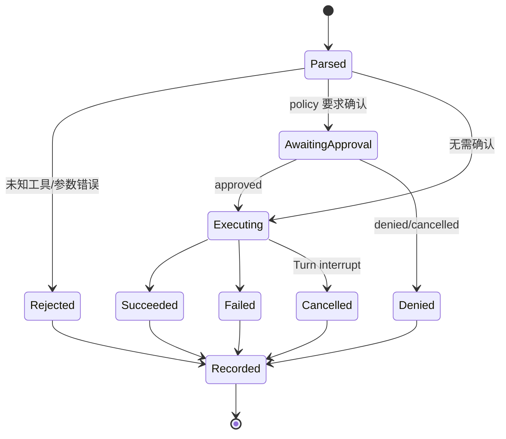
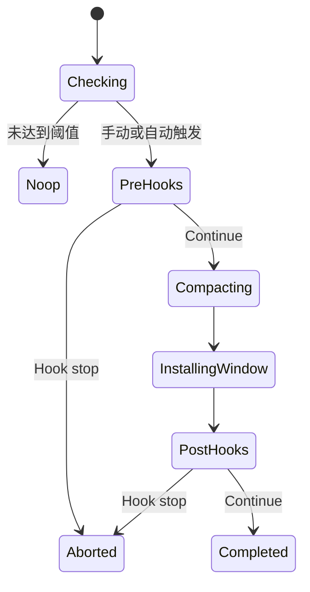

# 附录：核心状态机

状态机视角能把分散在异步函数、Channel 和 Event 中的控制流还原出来。下面不是协议枚举的机械抄录，而是阅读源码时最有用的生命周期模型。

## 1. Thread / Session 状态机

```mermaid
stateDiagram-v2
    [*] --> Starting: ThreadManager.start_thread
    Starting --> Running: Session.spawn 成功
    Starting --> Failed: 配置或初始化失败
    Running --> Running: 提交 Turn / steer / approval
    Running --> Interrupted: Op::Interrupt
    Interrupted --> Running: 新的用户 Turn
    Running --> ShuttingDown: shutdown / remove_thread
    ShuttingDown --> Closed: 后台任务和 recorder 收尾
    Failed --> [*]
    Closed --> [*]
```

Thread 是外部可寻址的会话实体，`Session` 是 Core 内的运行时实例。`ThreadManager` 持有活动 Thread，`Session::spawn` 创建 submission/event channels 并启动 `submission_loop`。

需要注意：一次 Turn 失败通常不会让整个 Thread 进入 Failed。Thread 仍可接受下一次输入。

## 2. Turn 状态机

```mermaid
stateDiagram-v2
    [*] --> Accepted: Op::UserInput
    Accepted --> Steered: 当前 Task 可接收 steer
    Accepted --> Starting: 需要新 Task
    Steered --> [*]
    Starting --> Running: RegularTask.run
    Running --> Sampling: sample model
    Sampling --> ToolRunning: function/tool call
    ToolRunning --> Sampling: 写入 tool output
    Sampling --> Compacting: token threshold
    Compacting --> Sampling: 新 context window
    Sampling --> Completing: final assistant message
    Running --> Aborted: interrupt / hook stop
    Sampling --> Failed: unrecoverable model error
    ToolRunning --> Failed: unrecoverable tool error
    Completing --> Completed
    Completed --> [*]
    Aborted --> [*]
    Failed --> [*]
```

`TurnStarted` 和最终完成事件包住整个循环；每次 sampling 只是 Turn 内的一个 Step。模型调用次数不等于 Turn 数。

## 3. Step / Agent Loop 状态机

```text
Capture StepContext
  -> Build WorldState
  -> Build model-visible tools
  -> Build History + Prompt
  -> Start stream
  -> Consume response items
       ├─ assistant final -> done
       ├─ tool call -> dispatch -> append output -> next Step
       ├─ retryable stream error -> reconnect/retry
       └─ fatal error -> fail Turn
```

StepContext 是一个采样步骤的快照。Turn 中途配置、工具或环境发生变化时，下一 Step 可以重新 capture，而正在执行的 Step 保持一致视图。

## 4. Tool Call 状态机



无论成功或失败，都应产生与 `call_id` 对应的输出项返回模型。否则 History 中会留下孤立 function call，下一请求可能违反 API 配对约束。

## 5. Approval 状态机

```text
Policy evaluation
  ├─ Allow -> execute
  ├─ Deny  -> structured denial
  └─ Ask   -> emit approval request
               ├─ accept once -> execute
               ├─ accept rule -> update scoped policy -> execute
               ├─ deny -> denial output
               └─ interrupt/thread close -> cancel
```

Approval 是异步暂停点，不应阻塞整个 submission loop。响应通过 request/call ID 回到等待中的执行任务。

## 6. 模型流状态机

```text
RequestBuilt
  -> Connecting
  -> Streaming
       ├─ delta events
       ├─ completed -> response items finalized
       ├─ idle/disconnect -> reconnect if budget permits
       └─ API error -> classify retryable/permanent
  -> Closed
```

重连与重新提交完整请求不是同一件事。若服务端流可续接，应优先续接；若必须重试请求，要考虑工具调用和计费是否可能重复。

## 7. 压缩状态机



本地摘要、远端摘要和 Token-budget 新窗口可以有不同实现，但都应复用统一 lifecycle event。

## 8. 长期记忆状态机

### Phase 1 Job

```text
Eligible -> Claimed(lease)
  -> Extracting
     ├─ SucceededWithOutput -> Stage1Output
     ├─ SucceededNoOutput
     └─ Failed(backoff) -> Eligible after retry time
```

### Phase 2 Global Job

```text
Pending -> GlobalLockClaimed
  -> WorkspaceSynced
  -> DiffChecked
     ├─ no diff + artifacts valid -> Succeeded
     └─ changed -> ConsolidationAgentRunning
          ├─ heartbeat + valid artifacts -> reset baseline -> Succeeded
          └─ failure/lease loss -> Failed
```

## 9. Code Mode Cell 状态机

```text
ExecuteRequest
  -> Running
     ├─ yielded -> caller receives cell_id -> wait
     ├─ result -> closed
     ├─ terminated -> closed
     └─ nested tool call -> delegate -> resume JavaScript
```

`cell_id` 是持续运行单元的句柄，不是 Tool Call ID。一个 Code Mode Tool Call 可以在同一 Cell 内触发多个嵌套工具。

## 10. 状态机实现检查表

- 每个状态是否有唯一拥有者？
- 每个异步等待是否可取消？
- 失败是否会留下未配对的 call/event？
- 重试是否可能重复副作用？
- 进程崩溃后，持久状态能否恢复？
- 状态变化是否带稳定 ID 和时间？
- UI 与日志是否从事件观察状态，而不是猜测内部字段？
- 是否存在无限等待、无限重试或无限队列？

