# Codex Agent 源码术语表

这份文档是 [Agent 启动流程](agent_startup.md) 和 [用户输入处理流程](agent_user_input_flow.md) 的配套“字典”。它不要求顺序通读。阅读另外两篇文档时，如果遇到不认识的类型，可以回到这里按类型名搜索。

如果想先把桌面客户端左侧栏与源码对象对应起来，请读 [Codex 客户端项目、任务与 Core Session 对应关系](codex_app_project_thread_session_mapping.md)。

本文中的“它是什么”尽量使用普通语言；“代码位置”用于确认当前实现；“不要混淆”专门指出源码阅读时最常见的误区。源码会持续变化，所以函数名和类型名通常比行号更可靠。

## 1. 先记住七个最重要的词

如果暂时不想阅读完整术语表，只需要先建立下面这条层级关系：

```text
Thread（整段会话）
└── Session（Core 中让这段会话真正运行的对象）
    ├── Submission（外部送给 Session 的一封“操作信”）
    ├── Turn（Agent 为一次目标持续工作的阶段）
    │   ├── Step / sampling iteration（一次模型请求及其处理）
    │   └── Tool call（模型在某个 Step 中要求执行的动作）
    └── Event（Session 向外发送的一封“状态信”）
```

### 1.1 `Thread`

- 普通话解释：用户在侧边栏中看到的一整个任务或对话。
- 它可以包含很多轮输入、模型回答、工具执行、审批和中断。
- app-server 协议把它当作可创建、恢复、读取、fork、归档的资源。
- Core 中没有一个完全等价、包办所有职责的 `Thread` struct；运行中的主体主要是 `CodexThread + Session`。
- 持久化层还会用 `LiveThread` 表示正在写入磁盘的 thread。
- 不要混淆：产品界面的“任务”、协议的 `Thread`、Core 的 `CodexThread` 和持久化的 `LiveThread` 指向同一概念的不同视图，但不是同一个 Rust 类型。

### 1.2 `Session`

- 普通话解释：Core 中真正拥有 Agent 运行状态的“大对象”。
- 它保存当前配置、模型客户端、对话历史、工具、MCP、权限、环境、hooks、输入队列和 active turn。
- 它从 thread 启动后一直存活到 thread 被关闭；通常跨越很多个 turn。
- 它由 `Session::spawn()` / `Session::new()` 创建，主要由 `Arc<Session>` 共享。
- 代码位置：[`core/src/session/session.rs`](../core/src/session/session.rs#L31)。
- 不要混淆：这里的 Session 不是“一次模型 HTTP 请求”，也不是“一条用户消息”。

### 1.3 `Submission`

- 普通话解释：外部发送给 Core Session 的一封带编号操作信。
- 它包含 `id`、一个 `Op`、可选客户端消息 id、trace 和父 turn 信息。
- 普通用户输入、interrupt、审批结果、MCP 刷新和 shutdown 都通过 Submission 进入同一个收件箱。
- `SessionIo.tx_sub` 负责发送，`submission_loop()` 负责逐个接收和分派。
- 代码位置：[`protocol/src/protocol.rs`](../protocol/src/protocol.rs#L176)。
- 不要混淆：Submission id 经常被用作新 turn id，但 Submission 本身不是 Turn。

### 1.4 `Turn`

- 普通话解释：Agent 围绕一次用户目标持续工作，直到完成、失败或中断的阶段。
- 一个 turn 可能包括多次模型请求和多次工具执行。
- 用户在 Agent 工作时追加的 steer 输入，通常仍属于当前 turn。
- Core 用 `TurnContext` 保存这一轮的设置，用 `ActiveTurn` 保存正在运行的任务状态。
- app-server 协议也有一个面向客户端展示的 `Turn` 数据结构。
- 不要混淆：Turn 不等于“用户消息 + 一条 assistant 消息”；工具循环可能让它长得多。

### 1.5 `Step` / sampling iteration

- 普通话解释：Turn 内的一次模型采样，以及紧接着对这次输出的处理。
- 输入通常是当前 history、instructions 和工具描述；输出可能是文本、reasoning 或 tool call。
- 如果输出包含 tool call，工具结果写回 history 后会产生下一个 Step。
- `StepContext` 是一次采样使用的运行快照。
- 不要混淆：代码里不一定到处都有名为 `Step` 的 struct；它更像流程概念，关键类型是 `StepContext`。

### 1.6 `Event`

- 普通话解释：Core 向外发送的一封带编号状态信。
- `Event` 是信封，`EventMsg` 是信的具体内容。
- 内容可以是 `SessionConfigured`、`TurnStarted`、消息增量、工具状态、审批请求、错误或 `TurnComplete`。
- app-server listener 把 Core Event 翻译成客户端 notification；TUI 再把 notification 变成界面变化。
- 代码位置：[`protocol/src/protocol.rs`](../protocol/src/protocol.rs#L1270)。
- 不要混淆：app-server notification 和 Core Event 表达相近事实，但属于不同协议边界。

### 1.7 `Item`

- 普通话解释：对话或 turn 中一个可识别的内容单元。
- 用户文本、assistant 文本、reasoning、tool call、tool output 等都可以是 item。
- `ResponseItem` 更贴近模型 API/history；`TurnItem` 更贴近产品向客户端展示的统一条目。
- item 往往有开始、增量和完成事件，因此一个 item 不等于一个 event。
- 不要混淆：`UserInput` 是输入描述，`ResponseItem` 是模型上下文记录，`TurnItem` 是产品层展示对象。

## 2. 一张全局对象关系图

```mermaid
flowchart LR
    User["用户"] --> CW["ChatWidget"]
    CW --> AC["AppCommand::UserTurn"]
    AC --> ASS["AppServerSession"]
    ASS --> MP["MessageProcessor"]
    MP --> TRP["TurnRequestProcessor"]
    TRP --> CT["CodexThread"]
    CT --> SIO["SessionIo"]
    SIO --> SUB["Submission / Op"]
    SUB --> SL["submission_loop"]
    SL --> SES["Session"]
    SES --> RT["RegularTask"]
    RT --> TC["TurnContext"]
    TC --> SC["StepContext"]
    SC --> MC["ModelClientSession"]
    MC --> RE["ResponseEvent"]
    RE --> TOOL["ToolRouter / ToolCallRuntime"]
    TOOL --> RE
    SES --> EV["Event / EventMsg"]
    EV --> MP
    MP --> ASS
    ASS --> CW
```



图中从左到右是请求方向，从 `Event` 返回到 UI 是通知方向。理解类型时，先问它位于哪一段，再问它是长期对象、单轮对象、消息信封还是数据快照。

### 2.1 桌面客户端中的“项目”和“对话”怎么映射

以桌面客户端左侧栏为例：一个带文件夹图标的 `codex` 分组下面，可能显示“查找服务启动与输入流程文档”“分析 skill 完整逻辑”等多个任务。它们不是一个 Session 里的多个 Turn，而是下面这组关系：

```text
客户端项目/文件夹分组：codex
│  最接近 app-server ThreadSection；同时通常关联同一个仓库 cwd/workspace
│
├── Thread A：查找服务启动与输入流程文档
│   ├── 持久化身份：ThreadId A
│   ├── 加载运行时：CodexThread A + Arc<Session A> + SessionIo A
│   └── Turn A1、Turn A2、Turn A3……
│
├── Thread B：分析 skill 完整逻辑
│   ├── 持久化身份：ThreadId B
│   ├── 加载运行时：CodexThread B + Arc<Session B> + SessionIo B
│   └── Turn B1、Turn B2……
│
└── Thread C：梳理项目 Tool 逻辑
    ├── 持久化身份：ThreadId C
    ├── 加载运行时：CodexThread C + Arc<Session C> + SessionIo C
    └── Turn C1、Turn C2……
```

这里要注意五点：

1. 文件夹分组不是 Core `Session`。协议层最接近它的是 [`ThreadSection`](../app-server-protocol/src/protocol/v2/thread_data.rs#L174)，它只有稳定 id 和用户可见名称。
2. `ThreadSection` 与项目目录不是同一字段。每个 [`Thread`](../app-server-protocol/src/protocol/v2/thread_data.rs#L184) 还单独保存 `cwd`。桌面客户端可以根据仓库/工作目录创建或选择同名 section，但 Core 没有一个拥有这些 thread 的 `Project` 对象。
3. 左侧每个任务标题对应一个独立 `Thread`。标题主要来自 `Thread.name`；没有显式名称时，客户端也可以用 `preview` 或首条用户消息展示。
4. 一个 Thread 被加载后，Core 通常为它建立一个 `CodexThread + Session + SessionIo` 运行组合；关闭进程后，内存对象消失，但 Thread 的历史和元数据仍可持久化。
5. 在同一个任务中继续输入，通常只是给这个 Thread 创建新的 Turn，不会在左侧栏新增 Thread。

因此，“项目下多个对话”更准确的说法是：“一个客户端 section/workspace 分组下列出多个独立的持久化 root threads”。这些 threads 可以共享 cwd、仓库配置和 AGENTS.md，但默认不共享彼此的 conversation history。

## 3. 名称后缀是什么意思

Codex 的类型名有较稳定的后缀习惯。先理解后缀，可以一次读懂一批类型。

| 后缀 | 一般含义 | 例子 |
| --- | --- | --- |
| `Params` | 客户端发起 RPC 时携带的参数 | `ThreadStartParams` |
| `Response` | RPC 的直接返回值 | `ThreadStartResponse` |
| `Notification` | 服务端主动推送、无需客户端 request id 的消息 | `TurnStartedNotification` |
| `Request` | 内部请求或需要响应的动作 | approval request |
| `Event` | Core 内部异步事实或状态变化 | `TurnStartedEvent` |
| `Msg` | 一组消息 variant 的枚举 | `EventMsg` |
| `Options` | 创建对象或调用函数时的一组策略参数 | `StartThreadOptions` |
| `Args` | 构造函数内部使用、通常更贴近实现的参数包 | `SessionSpawnArgs` |
| `Config` | 已解析、可供运行时使用的配置 | Core `Config` |
| `Overrides` | 只描述要覆盖的部分字段 | `ConfigOverrides` |
| `State` | 会变化且需要长期保存的运行状态 | `SessionState` |
| `Context` | 某次操作读取的一组背景信息或快照 | `TurnContext` |
| `Manager` | 管理一组资源的生命周期和查找 | `ThreadManager` |
| `Processor` | 接收请求并执行协议到业务逻辑的转换 | `TurnRequestProcessor` |
| `Router` | 根据名字或 variant 选择下游实现 | `ToolRouter` |
| `Runtime` | 真正执行某类能力时使用的运行环境 | `ToolCallRuntime` |
| `Handle` | 对内部对象的轻量引用或控制入口 | prewarm handle |
| `Snapshot` | 某一时刻的只读值，之后原状态可以继续变化 | config/state snapshot |

这些只是惯例，不是编译器规则。遇到例外时仍以字段和调用者为准。

## 4. TUI 层：用户能看到和操作的对象

### 4.1 `App`

- 它是什么：TUI 的顶层应用状态和主事件循环所有者。
- 负责什么：管理当前/后台 thread、弹窗、全局快捷键、app-server session 和 UI 事件分派。
- 谁创建：TUI 启动流程在完成基础 bootstrap 后创建。
- 活多久：通常和整个交互式 `codex` 进程一样久。
- 代码位置：[`tui/src/app.rs`](../tui/src/app.rs#L511)。
- 不要混淆：`App` 不是 Agent；它是承载和显示一个或多个 Agent thread 的客户端。

### 4.2 `ChatWidget`

- 它是什么：单个活动对话的主要 UI 控件。
- 负责什么：composer、历史渲染、turn 状态、输入队列、审批 UI 和 Core/app-server 事件展示。
- 谁持有：`App` 持有活动 ChatWidget，并在 thread 切换时保存或恢复相关状态。
- 代码位置：[`tui/src/chatwidget.rs`](../tui/src/chatwidget.rs#L543)。
- 不要混淆：它保存的是 UI 投影，不是 Core 的权威 conversation history。

### 4.3 `UserMessage`

- 它是什么：用户在 composer 中刚提交的一条 TUI 内部消息。
- 包含什么：文本、文本元素、本地图片、远程图片以及恢复草稿所需信息。
- 下一步：`input_submission.rs` 把它转换成协议层 `UserInput` items。
- 代码位置：[`tui/src/chatwidget/user_messages.rs`](../tui/src/chatwidget/user_messages.rs#L30)。
- 不要混淆：它不是 Core history 中的 `UserMessageEvent` 或 `ResponseItem::Message`。

### 4.4 `AppCommand`

- 它是什么：ChatWidget 交给 TUI App 主循环的内部命令枚举。
- 最重要 variant：`AppCommand::UserTurn`。
- `UserTurn` 除输入 items 外，还携带 cwd、权限、model、effort、service tier、personality 和 collaboration mode。
- 代码位置：[`tui/src/app_command.rs`](../tui/src/app_command.rs#L26)。
- 不要混淆：CLI crate 也存在另一个 `AppCommand`，用于 `codex app` 命令；两者完全不同。

### 4.5 `AppEvent`

- 它是什么：TUI 内部事件总线使用的大枚举。
- 来源：键盘/终端、后台 RPC task、文件搜索、Core/app-server notification、timer 等。
- 去向：`App` 主循环按 variant 修改 UI 状态或发起下一步操作。
- 代码位置：[`tui/src/app_event.rs`](../tui/src/app_event.rs#L188)。
- 不要混淆：它不是 Core `Event`；它只在 TUI 内部流动。

### 4.6 `AppEventSender`

- 它是什么：向 TUI 主事件循环发送 `AppEvent` 的轻量封装。
- 为什么需要：后台 async task 不直接借用整个 `App`，只持有 sender 即可安全回传结果。
- 代码位置：[`tui/src/app_event_sender.rs`](../tui/src/app_event_sender.rs#L23)。

### 4.7 `CodexOpTarget`

- 它是什么：ChatWidget 提交操作时选择的目标。
- `AppEvent` 路径：正常产品流程，先回到 App 再通过 app-server 路由。
- `Direct` 路径：直接操作某个 Core thread，主要用于特定运行形态或测试。
- 代码位置：[`tui/src/chatwidget.rs`](../tui/src/chatwidget.rs#L775)。
- 阅读提示：研究正常桌面/TUI 输入链时优先跟踪 `AppEvent`。

### 4.8 `AppServerTarget`

- 它是什么：TUI 要连接哪一种 app-server 的枚举。
- 常见形态：嵌入式、local daemon、remote。
- 影响什么：transport、路径解释位置、服务端状态归属和连接生命周期。
- 不影响什么：上层仍使用相同的 thread/turn RPC 语义。
- 代码位置：[`tui/src/lib.rs`](../tui/src/lib.rs#L264)。

### 4.9 `AppServerSession`

- 它是什么：TUI 侧对 app-server 客户端的高层封装。
- 负责什么：bootstrap、thread start/resume、turn start/steer、request handle 和 notification 接收。
- 它隐藏什么：嵌入式 channel、daemon 和远端 transport 的差异。
- 代码位置：[`tui/src/app_server_session.rs`](../tui/src/app_server_session.rs#L186)。
- 不要混淆：名字含 Session，但它不是 Core `Session`；它更像客户端连接门面。

### 4.10 `AppServerBootstrap`

- 它是什么：TUI 启动后从 app-server 预先取得的一组 UI 初始化数据。
- 常含内容：账号、模型列表、配置要求、反馈或套餐相关信息。
- 不做什么：不创建 Core thread，也不表示 Agent 已准备完成。
- 代码位置：[`tui/src/app_server_session.rs`](../tui/src/app_server_session.rs#L170)。

### 4.11 `ThreadInputState`

- 它是什么：TUI 为某个 thread 保存的输入区状态。
- 用途：切换 thread、恢复草稿、处理队列或中断时保留用户尚未完成的输入体验。
- 代码位置：[`tui/src/chatwidget/user_messages.rs`](../tui/src/chatwidget/user_messages.rs#L124)。
- 不要混淆：它不是 Core `InputQueue`，也不会决定模型实际看到什么。

## 5. app-server 协议层：客户端和服务端约定的语言

### 5.1 `ClientRequest`

- 它是什么：app-server 能接收的所有客户端 JSON-RPC 请求的总枚举。
- 例子：`ThreadStart`、`ThreadResume`、`TurnStart`、`TurnSteer`、配置和账号请求。
- 谁处理：`MessageProcessor` 先按 variant 分派，再交给具体 processor。
- 不要混淆：Core 的 `Op` 是 app-server 内部往 Session 发的操作，不是 wire request。

### 5.2 `ThreadStartParams`

- 它是什么：客户端创建新 thread 时发送的 v2 请求参数。
- 包含什么：model、cwd、权限、instructions、环境、dynamic tools、history mode 等。
- 下一步：ThreadRequestProcessor 将它归一化为 `ConfigOverrides` 和 `StartThreadOptions`。
- 代码位置：[`app-server-protocol/src/protocol/v2/thread.rs`](../app-server-protocol/src/protocol/v2/thread.rs#L57)。
- 不要混淆：它是公开 API 数据结构，不应直接塞入 Core `Session`。

### 5.3 `ThreadStartResponse`

- 它是什么：`thread/start` RPC 的直接响应。
- 表示什么：服务端已成功建立并公开 thread 的协议视图。
- 与 notification 的关系：客户端还可能收到 `thread/started`；response 与通知服务不同订阅方式。

### 5.4 `TurnStartParams`

- 它是什么：在既有 thread 上开始一次新 turn 的 v2 请求参数。
- 包含什么：thread id、结构化输入、每轮 model/权限/cwd/环境/输出 schema 设置。
- 下一步：TurnRequestProcessor 把它转换为 Core `Op::UserInput`。
- 代码位置：[`app-server-protocol/src/protocol/v2/turn.rs`](../app-server-protocol/src/protocol/v2/turn.rs#L71)。

### 5.5 app-server `UserInput`

- 它是什么：公开 API 中一项结构化用户输入。
- 常见 variant：文本、图片、skill、mention 等。
- 为什么不是 String：图片、显式 skill 和 app mention 需要保留类型信息，不能可靠地靠文本二次猜测。
- 代码位置：[`app-server-protocol/src/protocol/v2/turn.rs`](../app-server-protocol/src/protocol/v2/turn.rs#L292)。
- 不要混淆：protocol crate 还有 Core 使用的另一个 `UserInput`。

### 5.6 `TurnStartResponse`

- 它是什么：服务端接受 `turn/start` 后的同步响应。
- 通常状态：`InProgress`。
- 不保证什么：不保证模型已经返回 token，也不保证工具不会随后等待审批。
- 权威运行事件：继续观察 `turn/started`、item notifications 和 `turn/completed`。

### 5.7 `ServerNotificationEnvelope`

- 它是什么：app-server 主动推送给客户端的通知信封。
- 与 response 区别：notification 没有等待中的 RPC request id；它表达后续异步状态变化。
- 代码位置：[`app-server-protocol/src/protocol/common.rs`](../app-server-protocol/src/protocol/common.rs#L1795)。

### 5.8 协议 `Thread`

- 它是什么：客户端能序列化、展示和缓存的 thread 数据。
- 常含内容：id、状态、turn 列表、时间、名称和来源等。
- 它不包含：Core Session 中的模型客户端、Mutex、channel 或工具 runtime。
- 阅读提示：公开 API 类型强调稳定 wire shape；Core 类型强调运行能力。

### 5.9 协议 `Turn`

- 它是什么：客户端看到的一轮工作记录和状态。
- 常含内容：id、items、status、error 等。
- 它是投影：app-server 根据 Core events 和持久化信息维护，而不是执行模型循环的对象。

### 5.10 `ThreadSettings`

- 它是什么：协议层表示当前 thread 生效设置的结构。
- 常见内容：model、effort、cwd、权限、personality、collaboration mode。
- 与 `ThreadSettingsUpdateParams`：后者描述客户端想改变什么，前者描述当前结果。
- 代码位置：[`app-server-protocol/src/protocol/v2/thread.rs`](../app-server-protocol/src/protocol/v2/thread.rs#L279)。

## 6. app-server 实现层：把 RPC 翻译成 Core 操作

### 6.1 `MessageProcessor`

- 它是什么：app-server 请求分派中心。
- 输入：transport 解析后的客户端请求。
- 输出：同步 response、后台任务，或交给具体 request processor 的调用。
- 它还持有什么：ThreadManager、ConfigManager、认证、输出 sender 和各类共享依赖。
- 代码位置：[`app-server/src/message_processor.rs`](../app-server/src/message_processor.rs#L97)。
- 不要误读：它是交通指挥，不是运行 Agent turn 的地方。

### 6.2 `ThreadRequestProcessor`

- 它是什么：实现 thread/start、resume、fork、read、list 等 thread RPC 的处理器。
- 启动职责：校验参数、加载最终 Config、构造 StartThreadOptions、调用 ThreadManager。
- 为什么使用后台 task：Session 初始化可能较慢，不能长期堵住全局请求分派循环。
- 代码位置：[`app-server/src/request_processors/thread_processor.rs`](../app-server/src/request_processors/thread_processor.rs#L378)。

### 6.3 `TurnRequestProcessor`

- 它是什么：实现 turn/start、steer、interrupt 等 turn RPC 的处理器。
- start 职责：查找 CodexThread、校验输入、映射类型、构造 `Op::UserInput` 并提交。
- 代码位置：[`app-server/src/request_processors/turn_processor.rs`](../app-server/src/request_processors/turn_processor.rs#L87)。
- 不要误读：模型 sampling loop 不在这里，而在 Core `run_turn()`。

### 6.4 `ConfigManager`

- 它是什么：app-server 中负责读取、合并和更新配置的服务。
- thread/start 时的角色：把全局配置、项目配置、策略要求和请求 overrides 合并成 Core Config。
- 代码位置：[`app-server/src/config_manager.rs`](../app-server/src/config_manager.rs#L29)。

### 6.5 `ListenerTaskContext`

- 它是什么：app-server 为某个 Core thread 附加事件监听任务时所需的一组上下文。
- 负责串联：Core event receiver、thread 状态、outgoing sender、请求能力和清理逻辑。
- 阅读提示：Thread 创建成功但 listener 未附加时，Core 可能运行，客户端却看不到通知。

### 6.6 `ThreadStateManager`

- 它是什么：app-server 对活动 thread/turn 客户端视图的状态管理器。
- 数据来源：thread RPC、Core events、持久化读取和监听器更新。
- 代码位置：[`app-server/src/thread_state.rs`](../app-server/src/thread_state.rs#L315)。
- 不要混淆：它不是 Core `ThreadManager`；前者偏协议投影，后者管理真实运行对象。

### 6.7 `ThreadScopedOutgoingMessageSender`

- 它是什么：附带 thread 范围信息的 app-server 输出发送器。
- 用途：让 listener/processor 发送 notification 时保留正确 thread 归属和过滤语义。
- 代码位置：[`app-server/src/outgoing_message.rs`](../app-server/src/outgoing_message.rs#L109)。

## 7. Core 线程与 Session 生命周期

### 7.1 `ThreadManager`

- 它是什么：Core 活动 thread 的公共管理入口。
- 负责什么：start、resume、fork、查找、移除和关闭 `CodexThread`。
- 内部结构：对外 `ThreadManager` 包装共享的 `ThreadManagerState`。
- 代码位置：[`core/src/thread_manager.rs`](../core/src/thread_manager.rs#L196)。
- 不要混淆：它管理很多 Session；它自身不是某一个 Agent。

### 7.2 `ThreadManagerState`

- 它是什么：ThreadManager 背后的共享可变状态和具体实现。
- 负责什么：活跃 thread map、spawn 细节、首事件握手和依赖共享。
- 为什么分两层：外层门面容易 clone，内层集中持有真正状态。
- 代码位置：[`core/src/thread_manager.rs`](../core/src/thread_manager.rs#L278)。

### 7.3 `StartThreadOptions`

- 它是什么：Core 创建 thread 所需的高层选项包。
- 来源：app-server ThreadRequestProcessor 完成协议校验和 Config 合并后构造。
- 典型字段：config、initial history、source、instructions、dynamic tools、环境和扩展依赖。
- 代码位置：[`core/src/thread_manager.rs`](../core/src/thread_manager.rs#L201)。
- 不要混淆：它不是公开 wire Params，也不是最底层 Session 构造 Args。

### 7.4 `InitialHistory`

- 它是什么：Session 启动时历史从哪里来的枚举。
- 常见含义：全新历史、恢复既有 rollout、fork 或 cleared 之后的历史。
- 影响什么：thread id、conversation history、持久化恢复和首次模型上下文。
- 代码位置：[`protocol/src/protocol.rs`](../protocol/src/protocol.rs#L2569)。

### 7.5 `SessionSpawnArgs`

- 它是什么：`Session::spawn()` 使用的实现级构造参数包。
- 来源：ThreadManager 已经解析好 thread 来源、父 trace、AgentControl 和外部依赖后构造。
- 去向：Session::new 读取它建立持久化、模型、工具、MCP 和状态。
- 代码位置：[`core/src/session/mod.rs`](../core/src/session/mod.rs#L420)。

### 7.6 `Session`

- 它是什么：Agent 的核心长期运行对象，详见 1.2。
- 读代码方法：先看字段分类，再看 `Session::new()`；不要一开始钻进每个 service 的实现。
- 关键字段：`state`、`active_turn`、`input_queue`、`tx_event`、`services`。
- 代码位置：[`core/src/session/session.rs`](../core/src/session/session.rs#L31)。

### 7.7 `SessionConfiguration`

- 它是什么：从大而全的 Config 中提取、供当前 Session 使用的稳定配置集合。
- 为什么存在：区分全局配置文件形态与一个运行中 Session 实际采用的配置。
- 代码位置：[`core/src/session/session.rs`](../core/src/session/session.rs#L66)。

### 7.8 `SessionServices`

- 它是什么：Session 依赖的长期服务集合。
- 常见成员：模型客户端、MCP、exec、approval、hooks、环境、持久化和 telemetry。
- 为什么单独聚合：让 Session 的状态字段与外部能力字段有清晰边界。
- 代码位置：[`core/src/state/service.rs`](../core/src/state/service.rs#L45)。
- 不要混淆：Services 多为能力对象；SessionState 多为随对话变化的数据。

### 7.9 `SessionState`

- 它是什么：Session 内需要加锁保护的可变业务状态。
- 常见内容：conversation/context、token usage、当前设置和历史相关状态。
- 访问方式：通常经 `Mutex` 在短临界区内读写。
- 代码位置：[`core/src/state/session.rs`](../core/src/state/session.rs#L26)。
- 阅读提示：不要跨 `.await` 长时间持有 state 锁。

### 7.10 `SessionIo`

- 它是什么：把 Session 的三类通信通道包装起来的 I/O 门面。
- `tx_sub`：外部向 Session 发送 Submission。
- `rx_event`：外部接收 Session 发出的 Event。
- state receiver：观察线程状态变化。
- 代码位置：[`core/src/session/mod.rs`](../core/src/session/mod.rs#L393)。
- 不要混淆：SessionIo 负责通信，不拥有所有 Agent 业务状态。

### 7.11 `CodexThread`

- 它是什么：Core 对外暴露的“可驱动 Agent thread”句柄。
- 内部组合：Session 引用、SessionIo、AgentControl 和配置快照等。
- 提供什么：submit、submit_user_input、next_event、interrupt、shutdown 等方法。
- 代码位置：[`core/src/codex_thread.rs`](../core/src/codex_thread.rs#L183)。
- 类比：如果 Session 是发动机，CodexThread 是带控制接口和仪表线的整车操作句柄。

### 7.12 `AgentControl`

- 它是什么：限制和协调 Agent/子 Agent 执行容量的控制对象。
- 使用点：CodexThread 接收新输入或 spawn agent 前检查是否还有执行配额。
- 代码位置：[`core/src/agent/control.rs`](../core/src/agent/control.rs#L97)。
- 不要混淆：它不是 TUI 的权限审批策略。

### 7.13 `SessionConfiguredEvent`

- 它是什么：Session 初始化完成后发出的第一个 Core 事件内容。
- 为什么重要：ThreadManager 把它作为启动握手，确认 session id、model、配置和能力已经确定。
- 代码位置：[`protocol/src/protocol.rs`](../protocol/src/protocol.rs#L3928)。
- 不变量：正常 spawn 时它必须是 SessionIo 收到的第一个事件。

## 8. Core 输入、Turn 和任务执行

### 8.1 Core `UserInput`

- 它是什么：Core/protocol 层可以放进 Agent 输入序列的一项内容。
- 常见 variant：文本、图片、skill、mention。
- 来源：app-server v2 UserInput 经过显式映射得到。
- 代码位置：[`protocol/src/user_input.rs`](../protocol/src/user_input.rs#L15)。
- 不要混淆：它和 app-server 协议的同名枚举属于不同 crate。

### 8.2 `Op`

- 它是什么：外部可以要求 Core Session 执行的所有操作的枚举。
- 重要 variant：`UserInput`、`Interrupt`、各种 approval response、`Compact`、`Shutdown`。
- 它在哪里流动：放在 Submission 中，经 SessionIo 进入 submission_loop。
- 代码位置：[`protocol/src/protocol.rs`](../protocol/src/protocol.rs#L531)。
- 不要混淆：Op 是命令方向；EventMsg 是结果/通知方向。

### 8.3 `ThreadSettingsOverrides`

- 它是什么：随 `Op::UserInput` 进入 Core 的每轮设置覆盖值。
- 特点：字段通常是 Option，表示“这次有没有要求改变”。
- 下一步：转换成 `SessionSettingsUpdate`，再应用到新的 TurnContext/Session 状态。
- 代码位置：[`protocol/src/protocol.rs`](../protocol/src/protocol.rs#L460)。

### 8.4 `SessionSettingsUpdate`

- 它是什么：Core 内部已经类型化的 Session/turn 设置更新请求。
- 来源：handlers 解构 `Op::UserInput` 后，根据 ThreadSettingsOverrides 构造。
- 代码位置：[`core/src/session/session.rs`](../core/src/session/session.rs#L436)。

### 8.5 `TurnInput`

- 它是什么：Core 内部准备交给 `run_turn()` 的输入枚举。
- 可能内容：真正的 UserInput，或者已构造好的 ResponseItem/additional context。
- 为什么需要：把“用户显式输入”和“系统追加到历史的输入项”统一放入 turn 队列。
- 代码位置：[`core/src/session/input_queue.rs`](../core/src/session/input_queue.rs#L13)。

### 8.6 `InputQueue`

- 它是什么：Session 级输入排队和 steer 协调设施。
- 用途：active turn 工作时接收新增输入，并通知 RegularTask 是否需要继续处理。
- 代码位置：[`core/src/session/input_queue.rs`](../core/src/session/input_queue.rs#L35)。
- 不要混淆：TUI 也有用户消息队列；Core InputQueue 才影响正在运行的 turn。

### 8.7 `TurnInputQueue`

- 它是什么：InputQueue 中属于某个具体 turn 的队列数据。
- 作用：隔离不同 turn 的 pending input，避免旧 turn 消费新 turn 的内容。
- 代码位置：[`core/src/session/input_queue.rs`](../core/src/session/input_queue.rs#L30)。

### 8.8 `ActiveTurn`

- 它是什么：Session 当前正在运行的 turn 任务状态。
- 常见内容：task handles、cancellation token、turn context 和共享 tracker。
- 谁访问：spawn task、steer、interrupt、approval 与收尾逻辑。
- 代码位置：[`core/src/state/turn.rs`](../core/src/state/turn.rs#L31)。
- 不要混淆：它是 Core 运行态，不是 app-server 返回给客户端的 `Turn { status }`。

### 8.9 `SessionTask`

- 它是什么：可以在一个 Session/turn 中运行的任务抽象 trait。
- 实现者：普通用户 turn、compaction、review 等任务可以采用不同实现。
- 为什么存在：统一 active task 注册、取消、完成事件和清理流程。
- 代码位置：[`core/src/tasks/mod.rs`](../core/src/tasks/mod.rs#L184)。

### 8.10 `RegularTask`

- 它是什么：处理普通用户输入的 SessionTask 实现。
- 做什么：发送 TurnStarted，取得预热 model session，调用 `run_turn()`，并继续消费 pending input。
- 代码位置：[`core/src/tasks/regular.rs`](../core/src/tasks/regular.rs#L21)。
- 不要混淆：它协调一个 turn；真正的模型/工具循环主要在 `run_turn()`。

### 8.11 `TurnContext`

- 它是什么：一个 turn 运行期间使用的配置和能力上下文。
- 常见内容：turn id、model、cwd、权限、环境、collaboration mode、输出 schema、工具配置。
- 生命周期：新 turn 创建；该 turn 的多个 sampling iteration 共享其基础设置。
- 代码位置：[`core/src/session/turn_context.rs`](../core/src/session/turn_context.rs#L114)。
- 不要混淆：它不是 conversation history，也不是一次工具调用参数。

### 8.12 `StepContext`

- 它是什么：一次模型采样/工具处理使用的不可变视图。
- 包含什么：当前 TurnContext、解析后的环境、ToolRouter 等与该 step 一致的引用。
- 为什么需要：工具可能异步结束；它必须继续使用产生该调用时的上下文，而非后来更新的状态。
- 代码位置：[`core/src/session/step_context.rs`](../core/src/session/step_context.rs#L12)。

### 8.13 `TurnStartedEvent`

- 它是什么：Core 宣布一个 turn task 已经开始运行的事件内容。
- 发送者：RegularTask 开始执行时。
- 消费者：app-server listener 更新状态并向客户端发送 turn/started。
- 代码位置：[`protocol/src/protocol.rs`](../protocol/src/protocol.rs#L2021)。

### 8.14 `TurnCompleteEvent`

- 它是什么：Core 宣布 turn 已正常结束的事件内容。
- 常见信息：turn id、最终消息、usage 或完成相关元数据。
- 发送时机：任务框架确认不再有需要继续处理的输入，并完成清理之后。
- 代码位置：[`protocol/src/protocol.rs`](../protocol/src/protocol.rs#L1995)。

### 8.15 `CancellationToken`

- 它是什么：Tokio 生态中协作式取消异步工作的信号对象。
- 使用方式：interrupt 触发 token；模型流、工具 future 或任务循环主动检查并尽快返回。
- 不是什么：它不会像杀进程一样强制停止任意代码。
- 阅读提示：判断中断是否及时，要看下游 await 路径是否尊重 token。

## 9. 模型请求、上下文和流式响应

### 9.1 `ModelClient`

- 它是什么：Session 级模型访问配置和客户端工厂。
- 持有什么：provider、auth、endpoint、telemetry、重试和模型相关配置。
- 生命周期：通常和 Session 一样长。
- 代码位置：[`core/src/client.rs`](../core/src/client.rs#L252)。
- 不要混淆：它不代表某一次 streaming response。

### 9.2 `ModelClientSession`

- 它是什么：针对连续采样使用的模型客户端会话对象。
- 用途：承载连接/请求复用和 incremental request 相关状态。
- 来源：可以在 Session 启动时预热，也可以在 run_turn 中按需创建。
- 代码位置：[`core/src/client.rs`](../core/src/client.rs#L272)。
- 不要混淆：名字中的 Session 与 Core Agent Session 不是同一个生命周期层次。

### 9.3 `ModelProviderInfo`

- 它是什么：描述模型服务提供方能力和连接方式的数据结构。
- 可能包含：base URL、wire API、认证方式、重试/超时和请求头配置。
- 代码位置：[`model-provider-info/src/lib.rs`](../model-provider-info/src/lib.rs#L89)。
- 不要混淆：provider 是“通过谁调用”，model 是“调用哪个模型”。

### 9.4 `ModelInfo`

- 它是什么：具体模型的能力与展示元数据。
- 可能影响：上下文窗口、reasoning、图片支持、工具类型、默认 effort 等。
- 代码位置：[`protocol/src/openai_models.rs`](../protocol/src/openai_models.rs#L370)。

### 9.5 `Prompt`

- 它是什么：一次模型采样最终提交给 client 的结构化请求主体。
- 通常包含：input/history items、可用 tools、instructions 和输出约束。
- 代码位置：[`core/src/client_common.rs`](../core/src/client_common.rs#L18)。
- 不要混淆：它不是只有用户刚输入的那段 String。

### 9.6 `ContextManager`

- 它是什么：维护模型可见 conversation history 和上下文裁剪/转换逻辑的 Core 组件。
- 负责什么：追加 response items、生成请求历史、处理 token 限制和 compaction 后状态。
- 代码位置：[`core/src/context_manager/history.rs`](../core/src/context_manager/history.rs#L41)。
- 不要混淆：UI 历史用于展示；ContextManager 的历史用于下一次模型采样。

### 9.7 `ResponseItem`

- 它是什么：模型输入/输出历史中的标准化内容枚举。
- 常见 variant：message、reasoning、function call、function output、custom tool call/output。
- 代码位置：[`protocol/src/models.rs`](../protocol/src/models.rs#L813)。
- 核心作用：让一次采样结果能够原样或规范化地进入下一次采样上下文。

### 9.8 `ResponseEvent`

- 它是什么：模型 streaming 连接逐步产生的事件。
- 可能表达：response 创建、item 开始、文本增量、item 完成、response 完成或错误。
- 谁处理：`run_turn()` 的流消费逻辑。
- 不要混淆：ResponseEvent 来自模型 client；Core Event 发给 app-server/TUI。

### 9.9 `ConversationHistory`

- 它是什么：工具调用接口可读取的对话历史视图。
- 用途：某些工具需要理解当前对话，但不应直接依赖整个 Session 内部实现。
- 代码位置：[`tools/src/tool_call.rs`](../tools/src/tool_call.rs#L17)。

### 9.10 `ContextualUserFragment`

- 它是什么：可以安全、受限地注入模型可见用户上下文的 trait。
- 为什么重要：注入内容需要有类型、边界和大小控制，不能任意重写完整历史。
- 代码位置：[`context-fragments/src/fragment.rs`](../context-fragments/src/fragment.rs#L46)。

### 9.11 `RolloutItem`

- 它是什么：写入 thread rollout/持久化记录的一类条目。
- 用途：恢复会话、审计和重建模型上下文。
- 代码位置：[`protocol/src/protocol.rs`](../protocol/src/protocol.rs#L3207)。
- 不要混淆：rollout 是持久化日志视图，不等于当前内存中的 ContextManager。

## 10. 工具、审批和沙箱

### 10.1 `ToolSpec`

- 它是什么：告诉模型“有哪些工具、叫什么、参数 schema 是什么”的公开描述。
- 去向：放入 Prompt 随模型请求发送。
- 代码位置：[`tools/src/tool_spec.rs`](../tools/src/tool_spec.rs#L19)。
- 不要混淆：ToolSpec 只描述工具，不执行工具。

### 10.2 `DynamicToolSpec`

- 它是什么：在 thread 启动时由调用方动态提供的工具定义。
- 与内建工具区别：不必在 Codex 二进制中静态注册，行为由外部集成提供。
- 代码位置：[`protocol/src/dynamic_tools.rs`](../protocol/src/dynamic_tools.rs#L13)。

### 10.3 `ToolCall`

- 它是什么：Core 已从模型 ResponseItem 中解析出的一次具体工具调用。
- 包含什么：tool name、call id、payload 和调用来源。
- 代码位置：[`core/src/tools/router.rs`](../core/src/tools/router.rs#L32)。
- 不要混淆：ToolSpec 是能力说明；ToolCall 是模型已经发出的具体请求。

### 10.4 `ToolPayload`

- 它是什么：不同类别工具调用参数的统一枚举。
- 作用：把 function、custom、MCP 等 wire 形态转为类型化路由输入。
- 代码位置：[`tools/src/tool_payload.rs`](../tools/src/tool_payload.rs#L7)。

### 10.5 `ToolRouter`

- 它是什么：从 ToolCall 找到合适 ToolHandler 的入口。
- 做什么：解构 call、构造 invocation、检查类型支持并调用 registry。
- 代码位置：[`core/src/tools/router.rs`](../core/src/tools/router.rs#L68)。
- 不做什么：不直接包含所有 shell、apply_patch 或 MCP 的实现代码。

### 10.6 `ToolRegistry`

- 它是什么：tool name 到 ToolHandler 的注册表。
- 为什么需要：构建工具集合与执行工具解耦，plugin/MCP/内建工具可以统一查找。
- 代码位置：[`core/src/tools/registry.rs`](../core/src/tools/registry.rs#L252)。

### 10.7 `ToolHandler`

- 它是什么：某一类工具真正处理调用的实现接口。
- 负责什么：验证 payload、选择 runtime、产生 output 或结构化错误。
- 阅读路径：ToolRouter → ToolRegistry → 具体 handler → runtime。

### 10.8 `ToolInvocation`

- 它是什么：交给 handler 的完整运行参数包。
- 常含内容：Session、Turn/StepContext、cancellation token、call id、tool name、payload 和 tracker。
- 价值：handler 不需要从全局变量重新寻找本轮上下文。

### 10.9 `ToolCallRuntime`

- 它是什么：协调工具调用异步执行的运行器。
- 负责什么：并发策略、terminal outcome、future 生命周期、取消和结果回收。
- 代码位置：[`core/src/tools/parallel.rs`](../core/src/tools/parallel.rs#L41)。
- 不要混淆：它不是某个具体 shell 进程。

### 10.10 `FunctionCallOutputPayload`

- 它是什么：函数工具执行后写回模型上下文的标准结果。
- 关键关联：通过 call id 与原始 function call 配对。
- 代码位置：[`protocol/src/models.rs`](../protocol/src/models.rs#L1926)。
- 下一步：作为 ResponseItem/工具输出加入 history，触发后续采样。

### 10.11 `ApprovalPolicy`

- 它是什么：规定哪些工具动作需要询问用户批准的策略。
- 影响什么：shell、文件修改、网络或其他危险能力能否直接执行。
- 不是什么：它不规定操作系统最终能访问什么；那是 sandbox/permissions 的另一层。

### 10.12 `ApprovalsReviewer`

- 它是什么：描述由谁或哪种机制审核审批请求的配置。
- 与 ApprovalPolicy 区别：policy 判断“要不要审”，reviewer 参与“由谁审”。
- 代码位置：[`protocol/src/config_types.rs`](../protocol/src/config_types.rs#L165)。

### 10.13 `ApprovalStore`

- 它是什么：Core 在运行期记录已经批准的命令/动作信息的状态对象。
- 作用：避免在策略允许的范围内反复询问同一批准，并支持前缀规则等语义。
- 代码位置：[`core/src/tools/sandboxing.rs`](../core/src/tools/sandboxing.rs#L41)。

### 10.14 `SandboxPolicy`

- 它是什么：Core 旧/底层协议中描述工具进程隔离边界的策略枚举。
- 可能控制：可写目录、网络、只读范围或危险模式。
- 代码位置：[`protocol/src/protocol.rs`](../protocol/src/protocol.rs#L1004)。
- 不要混淆：是否需要用户批准与批准后能访问哪些资源是两件事。

### 10.15 `PermissionProfile`

- 它是什么：较高层、可命名的一组权限配置。
- 作用：把 sandbox、网络和审批相关选择组合成用户/策略可理解的 profile。
- 代码位置：[`protocol/src/models.rs`](../protocol/src/models.rs#L316)。

### 10.16 `ApplyPatchRuntime`

- 它是什么：执行结构化文件补丁的具体工具 runtime。
- 负责什么：解析目标、审批、应用 patch、生成变更结果。
- 代码位置：[`core/src/tools/runtimes/apply_patch.rs`](../core/src/tools/runtimes/apply_patch.rs#L58)。

## 11. MCP、Skill、Plugin、App 和 Hook

### 11.1 `McpManager`

- 它是什么：Core 管理 MCP server 连接、工具发现和调用的组件。
- 负责什么：连接生命周期、server 工具列表、调用路由和状态刷新。
- 代码位置：[`core/src/mcp.rs`](../core/src/mcp.rs#L54)。
- 不要混淆：MCP 是外部工具协议；Plugin 可以声明 MCP server，但 Plugin 不等于 MCP。

### 11.2 MCP server

- 它是什么：通过 Model Context Protocol 对 Codex 暴露 tools/resources/prompts 的外部服务。
- 在输入链中的位置：模型先看到 MCP tool spec，发出调用后 Core 经 MCP manager 请求 server。
- 失败边界：连接失败、工具发现失败和单次 tool call 失败是不同阶段。

### 11.3 `SkillMetadata`

- 它是什么：描述一个 skill 的名称、说明、路径或来源等轻量信息。
- 用途：发现、列表、mention 解析和选择；通常不会包含完整说明正文。
- 代码位置：[`skills/src/model.rs`](../skills/src/model.rs#L8)。

### 11.4 `SkillInstructions`

- 它是什么：选中 skill 后准备注入模型上下文的具体说明内容。
- 生命周期：按需读取并在相关 turn 中形成受控 context fragment。
- 代码位置：[`core-skills/src/skill_instructions.rs`](../core-skills/src/skill_instructions.rs#L6)。
- 不要混淆：metadata 用于“找到它”，instructions 用于“按它做”。

### 11.5 `PluginId`

- 它是什么：插件的类型安全唯一标识。
- 用途：安装、启用、禁用、查找资源和 telemetry 归属。
- 代码位置：[`plugin/src/plugin_id.rs`](../plugin/src/plugin_id.rs#L10)。

### 11.6 `PluginManifest`

- 它是什么：插件包的声明文件模型。
- 可描述：skills、MCP servers、hooks、apps/interfaces 和资源路径。
- 代码位置：[`plugin/src/manifest.rs`](../plugin/src/manifest.rs#L8)。
- 不要混淆：manifest 是声明；加载后的 runtime 能力由各 manager 建立。

### 11.7 `PluginsManager`

- 它是什么：负责插件发现、读取、安装、状态和详情查询的管理器。
- 代码位置：[`core-plugins/src/manager.rs`](../core-plugins/src/manager.rs#L427)。
- 在 Session 启动中的作用：提供 plugin/skill inventory，并可能参与后台 warmup。

### 11.8 App / Connector

- 它是什么：面向用户的外部服务连接能力，例如某个云应用及其工具。
- 与 Plugin 关系：Plugin 可以声明 app/connector；app 是用户理解的服务能力，plugin 是交付能力的包。
- 与 MCP 关系：某些 app tools 最终通过 MCP 暴露，但概念层次不同。

### 11.9 `AppDeclaration`

- 它是什么：Plugin 中声明一个 app/connector 的结构。
- 代码位置：[`plugin/src/lib.rs`](../plugin/src/lib.rs#L32)。

### 11.10 `Hooks`

- 它是什么：已经发现并注册、可在生命周期节点运行的一组 hook。
- 触发点：thread/turn/tool 等事件前后，具体取决于配置和支持的 HookEvent。
- 代码位置：[`hooks/src/registry.rs`](../hooks/src/registry.rs#L51)。
- 不要混淆：hook 是宿主在固定时机主动调用；tool 是模型选择调用。

### 11.11 `Hook`

- 它是什么：一个具体 hook handler 及其元数据。
- 包含什么：回调函数、事件匹配和来源/信任相关信息。
- 代码位置：[`hooks/src/types.rs`](../hooks/src/types.rs#L39)。

### 11.12 `HookEvent`

- 它是什么：hook 可以响应的生命周期事件枚举。
- 与 Core Event 区别：HookEvent 用来触发扩展逻辑；EventMsg 用来向客户端报告 Agent 状态。
- 代码位置：[`hooks/src/types.rs`](../hooks/src/types.rs#L92)。

### 11.13 `HookPayload`

- 它是什么：某次 hook 执行收到的结构化上下文。
- 可能包含：thread/turn/tool 信息、cwd、输入摘要或执行阶段相关字段。
- 代码位置：[`hooks/src/types.rs`](../hooks/src/types.rs#L64)。

## 12. 配置、认证、环境与持久化

### 12.1 Core `Config`

- 它是什么：经过多层配置合并和默认值解析后，Core 可以直接使用的完整运行配置。
- 来源：config.toml、项目配置、命令行、托管要求和 RPC overrides。
- 代码位置：[`core/src/config/mod.rs`](../core/src/config/mod.rs#L610)。
- 不要混淆：app-server protocol 也有一个用于 wire 输出的 `Config`。

### 12.2 `ConfigOverrides`

- 它是什么：只描述调用方希望覆盖哪些 Core 配置字段的结构。
- 使用点：thread/start 参数先变成 overrides，再由 ConfigManager 加载最终 Config。
- 代码位置：[`core/src/config/mod.rs`](../core/src/config/mod.rs#L2551)。

### 12.3 `ConfigBuilder`

- 它是什么：按层加载、合并并验证 Config 的构建器。
- 代码位置：[`core/src/config/mod.rs`](../core/src/config/mod.rs#L1338)。
- 阅读提示：配置值异常时，要追踪“哪一层提供了值”，而不只看最终 struct。

### 12.4 `AuthManager`

- 它是什么：登录/认证状态的管理组件。
- 负责什么：读取凭据、刷新或选择认证方式，并为模型/API 客户端提供 auth。
- 代码位置：[`login/src/auth/manager.rs`](../login/src/auth/manager.rs#L1769)。
- 不要混淆：认证回答“你是谁/能否访问服务”；approval 回答“本地动作是否获准”。

### 12.5 `ThreadEnvironments`

- 它是什么：管理 thread 可选择执行环境以及每轮解析结果的 Core 组件。
- 作用：本地/远端执行环境可能不同，turn 需要得到一个一致的环境快照。
- 代码位置：[`core/src/environment_selection.rs`](../core/src/environment_selection.rs#L79)。

### 12.6 `TurnEnvironment`

- 它是什么：某个 TurnContext 最终采用的执行环境描述。
- 可能影响：命令在哪里执行、路径如何解释、哪些 workspace roots 可用。
- 代码位置：[`core/src/session/turn_context.rs`](../core/src/session/turn_context.rs#L46)。

### 12.7 `LiveThread`

- 它是什么：thread-store 中正在创建、写入或恢复的持久化 thread 对象。
- 作用：把内存事件/rollout item 可靠写入存储，并管理初始化完成边界。
- 代码位置：[`thread-store/src/live_thread.rs`](../thread-store/src/live_thread.rs#L35)。
- 不要混淆：它关注持久化，不负责模型采样。

### 12.8 `ThreadStore`

- 它是什么：thread 持久化后端的抽象 trait。
- 负责什么：创建、读取、列出、更新和归档 thread 数据。
- 代码位置：[`thread-store/src/store.rs`](../thread-store/src/store.rs#L47)。

### 12.9 `RolloutRecorder`

- 它是什么：把 Session 运行过程中产生的 rollout items 记录到持久化层的组件。
- 代码位置：[`rollout/src/recorder.rs`](../rollout/src/recorder.rs#L85)。
- 与 LiveThread 关系：两者共同参与 thread 日志生命周期，但位于不同抽象层。

### 12.10 `StateDbHandle`

- 它是什么：指向结构化状态数据库 runtime 的共享句柄。
- 用途：thread 元数据、索引、状态查询等不一定都适合只存在 rollout 文件中。
- 代码位置：[`rollout/src/state_db.rs`](../rollout/src/state_db.rs#L29)。

### 12.11 `ThreadId`

- 它是什么：产品 thread 的类型安全 id。
- 代码位置：[`protocol/src/thread_id.rs`](../protocol/src/thread_id.rs#L16)。
- 对 root thread：它通常也被转换成同值的 SessionId。
- 对子 Agent：每个子 Agent 有独立 ThreadId，用来区分自己的历史和生命周期。
- 不要混淆：submission id、turn id、response id 和 tool call id 都有不同作用域。

### 12.12 `SessionId`

- 它是什么：一棵 root Agent + 子 Agent thread 树共享的逻辑会话 id。
- 代码位置：[`protocol/src/session_id.rs`](../protocol/src/session_id.rs#L15)。
- root thread 默认使用 `SessionId::from(thread_id)`，因此普通单 Agent 对话里二者的 UUID 通常相同。
- 子 Agent 会获得独立 ThreadId，但其 `AgentControl` 继续共享 root 的 SessionId。
- resume 时会从持久化 `SessionMeta` 恢复 SessionId，而不是简单地为每次进程内对象重建一个新 id。
- 不要混淆：Rust `Session` struct 是可被重新创建的内存运行对象；SessionId 表示的是更稳定的逻辑 Agent 树身份，不是内存对象地址或启动次数。

### 12.13 `ThreadSection`

- 它是什么：一组 thread 的独立持久化、用户可见分类。
- 包含什么：稳定的 UUIDv7 `id` 和可以重命名的 `name`。
- 使用方式：thread 可以移动进 section；section 可以 list、create、rename、delete。
- 代码位置：[`app-server-protocol/src/protocol/v2/thread_data.rs`](../app-server-protocol/src/protocol/v2/thread_data.rs#L174)。
- 与桌面项目分组的关系：文件夹形态的项目/任务分组在 app-server 协议中最接近这个类型。
- 不要混淆：section 负责组织；`Thread.cwd` 和 workspace roots 决定代码在哪个目录及环境中运行。

## 13. 最容易撞名的类型

| 名字 | 类型所在位置 | 真正含义 |
| --- | --- | --- |
| `Session` | Core | Agent 长期运行对象 |
| `AppServerSession` | TUI | app-server 客户端连接/请求门面 |
| `ModelClientSession` | Core client | 连续模型采样使用的客户端会话 |
| `Thread` | app-server protocol | 可发给客户端的 thread 数据 |
| `CodexThread` | Core | 可 submit/next_event 的运行句柄 |
| `LiveThread` | thread-store | 正在持久化的 thread |
| `UserInput` | app-server protocol | wire API 输入项 |
| `UserInput` | protocol crate | Core 输入项 |
| `UserMessage` | TUI | composer 提交的 UI 消息 |
| `UserMessageEvent` | Core protocol | Core 报告用户消息的事件内容 |
| `Event` | Core protocol | Core 输出信封 |
| `EventMsg` | Core protocol | Core 输出内容枚举 |
| `AppEvent` | TUI | TUI 内部事件枚举 |
| `ResponseEvent` | model client | 模型流事件 |
| `HookEvent` | hooks | 扩展触发生命周期事件 |
| `AppCommand` | TUI | ChatWidget 到 App 的内部命令 |
| `AppCommand` | CLI | `codex app` 子命令参数 |
| `Config` | Core | 完整运行时配置 |
| `Config` | app-server protocol | 可序列化的配置 API 数据 |
| `ThreadStateManager` | app-server | 客户端 thread 状态投影 |
| `ThreadManager` | Core | 真实活动 CodexThread 管理器 |
| `Turn` | app-server protocol | 对客户端展示的 turn 记录 |
| `ActiveTurn` | Core | 正在执行的任务状态 |
| `ToolSpec` | tools | 告诉模型工具长什么样 |
| `ToolCall` | Core | 模型已经要求执行的一次调用 |
| `ToolHandler` | Core tools | 处理一类工具调用的实现 |
| `ToolCallRuntime` | Core | 管理工具 future 和并发的运行器 |

遇到同名类型时，应先看 `use` 路径。IDE 中“跳到定义”比只按名称全文搜索更可靠。

## 14. 各种 ID 分别追踪什么

| ID | 作用域 | 用来串联什么 |
| --- | --- | --- |
| `thread_id` | 整段任务 | thread/start、resume、turns、持久化记录 |
| `session_id` | Core Session | SessionConfigured、运行实例和 telemetry |
| `submission_id` | 一次提交 | `SessionIo::submit` 到 submission_loop |
| `turn_id` | 一轮 Agent 工作 | turn/start 到 TurnComplete |
| `client_user_message_id` | 一条客户端消息 | 乐观 UI、去重或客户端关联 |
| `response_id` | 一次模型响应 | streaming response created/completed |
| `item_id` | 一个响应/展示 item | item started、delta、completed |
| `call_id` | 一次工具调用 | tool call 与 tool output 配对 |
| JSON-RPC request id | 一次 RPC | request 与直接 response 配对 |

调试时不要只记录一个模糊的 `id`。日志字段最好写出完整语义名，否则跨层对齐时非常容易认错。

## 15. 常见异步词汇

### 15.1 `Arc<T>`

- 含义：线程安全引用计数指针，让多个 async task 共享同一个对象。
- 看到 `Arc<Session>`：表示很多任务共同引用 Session，不是复制了一份 Session。

### 15.2 `Mutex<T>` / `RwLock<T>`

- 含义：保护会变化的共享状态。
- 阅读重点：锁的作用域多大、是否在 `.await` 前释放、谁可能同时竞争。

### 15.3 `mpsc` channel

- 含义：多个 sender、一个 receiver 的异步队列。
- 本文主链：Submission channel 和很多 TUI/app-server 内部事件通道采用这种思路。

### 15.4 `oneshot` channel

- 含义：只发送一次结果的异步通道。
- 常见用途：一次请求等待一次审批答案或后台任务返回。

### 15.5 `watch` channel

- 含义：只关心“当前最新状态”，订阅者在值变化时被唤醒。
- 与 mpsc 区别：mpsc 强调每封消息；watch 强调最新值。

### 15.6 `tokio::spawn`

- 含义：启动一个可独立推进的异步任务。
- 阅读方法：看到 spawn 时同时寻找 task 的结束条件、错误如何回传、持有的 sender 何时释放。

### 15.7 `tokio::join!`

- 含义：并发推进多个 future，并等待它们全部完成。
- Session 启动用途：并发处理互不依赖的持久化、认证/MCP、数据库等初始化以降低延迟。

### 15.8 `select!`

- 含义：同时等待多个异步事件，哪个先就先处理哪个。
- 常见用途：模型流、工具结果、取消信号或 channel 关闭之间的竞速。

### 15.9 `CancellationToken`

- 含义：可 clone 的协作取消信号。
- 重要结论：触发取消不代表任务已停止；任务需要在合适的 await/循环点观察它。

### 15.10 `Drop guard`

- 含义：对象离开作用域时自动执行清理或状态恢复。
- 常见用途：active 标记、watch 计数、span、临时注册和资源占用状态。

## 16. 按问题查术语的阅读路线

### 16.1 “Agent 为什么还没启动好？”

按以下顺序查：

1. `AppServerTarget`
2. `AppServerSession`
3. `ThreadStartParams`
4. `ThreadRequestProcessor`
5. `StartThreadOptions`
6. `ThreadManager`
7. `SessionSpawnArgs`
8. `Session`
9. `SessionConfiguredEvent`
10. `CodexThread`

### 16.2 “按 Enter 后消息去哪了？”

按以下顺序查：

1. `UserMessage`
2. app-server `UserInput`
3. `AppCommand::UserTurn`
4. `TurnStartParams`
5. `TurnRequestProcessor`
6. Core `UserInput`
7. `Op::UserInput`
8. `Submission`
9. `SessionIo`
10. `InputQueue`

### 16.3 “为什么模型调用工具后又请求了一次模型？”

按以下顺序查：

1. `Prompt`
2. `ResponseEvent`
3. `ResponseItem`
4. `ToolCall`
5. `ToolRouter`
6. `ToolHandler`
7. `ToolCallRuntime`
8. `FunctionCallOutputPayload`
9. `ContextManager`
10. `StepContext`

### 16.4 “为什么 UI 显示和 Core 状态不同步？”

按以下顺序查：

1. Core `Event` / `EventMsg`
2. app-server listener
3. `ThreadStateManager`
4. `ServerNotificationEnvelope`
5. `AppServerSession`
6. `AppEvent`
7. `ChatWidget`

### 16.5 “为什么工具没有直接执行？”

按以下顺序查：

1. `ToolSpec`
2. `ToolCall`
3. `ApprovalPolicy`
4. `ApprovalsReviewer`
5. `ApprovalStore`
6. `PermissionProfile`
7. `SandboxPolicy`
8. `CancellationToken`

## 17. 最后用一句话串起来

TUI 的 `ChatWidget` 把 `UserMessage` 变成 `AppCommand::UserTurn`，`AppServerSession` 用 `TurnStartParams` 发送给 `TurnRequestProcessor`；它把协议 `UserInput` 转成 Core `Op::UserInput`，装进 `Submission` 后经 `CodexThread` 和 `SessionIo` 送入 `Session`。`RegularTask` 为它建立 `TurnContext`，`run_turn()` 在每次采样创建 `StepContext`，通过 `ModelClientSession` 得到 `ResponseEvent`；若产生 `ToolCall`，则经 `ToolRouter`、`ToolHandler` 和 `ToolCallRuntime` 执行，把 `FunctionCallOutputPayload` 写回 `ContextManager` 后继续采样。最终 `Session` 发出 `EventMsg::TurnComplete`，app-server 把它翻译成 notification，TUI 再更新 `ChatWidget`。
