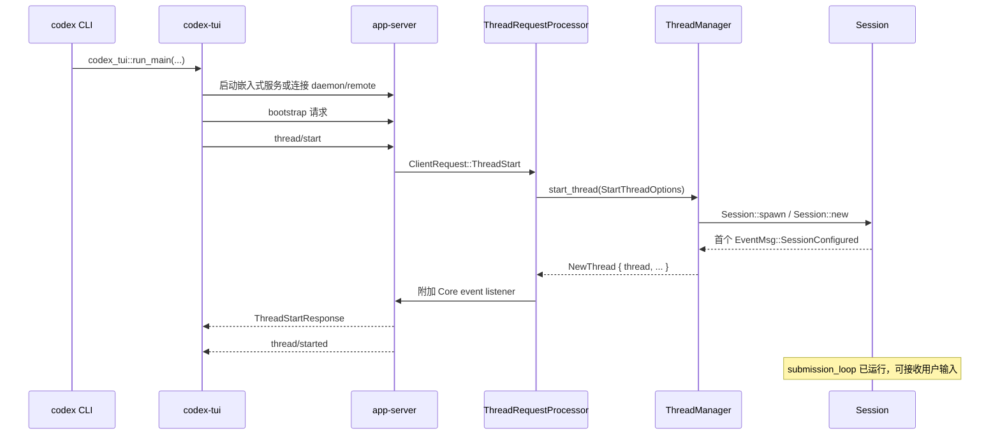

# Codex Agent 启动流程源码导读

本文解释交互式 `codex` 启动后，一个可接收用户输入的 Agent 是如何创建出来的。重点是当前 Rust 实现，而不是只描述 app-server 协议。

如果 `Thread`、`Session`、`Turn`、`Submission` 等名称还不熟悉，建议先读 [Codex Agent 源码术语表](agent_glossary.md)。术语表用普通语言解释各类型的职责、生命周期和易混淆点。

如果想知道桌面客户端的项目文件夹、任务标题与这些类型如何对应，请先读 [Codex 客户端项目、任务与 Core Session 对应关系](codex_app_project_thread_session_mapping.md)。

文中的“Agent 启动”包含四层含义：

1. `codex` 进程进入 TUI；
2. TUI 启动或连接 app-server；
3. app-server 处理 `thread/start`；
4. Core 创建 `Session`、`CodexThread` 和 submission loop。

只有第四层完成后，Agent 才真正具备接收 `Op::UserInput`、调用模型和执行工具的能力。函数名比行号更稳定；源码更新后，应优先按本文给出的符号搜索。

## 1. 先建立对象关系

当前实现中几个容易混淆的对象如下：

| 对象 | 所在层 | 作用 |
| --- | --- | --- |
| `App` / `ChatWidget` | TUI | 接收键盘事件、显示历史和状态 |
| `AppServerSession` | TUI | 封装 app-server 请求和通知 |
| `MessageProcessor` | app-server | 解析和分派 JSON-RPC 请求 |
| `ThreadRequestProcessor` | app-server | 实现 `thread/start`、`thread/resume` 等接口 |
| `ThreadManager` | Core | 创建、保存和查找活跃 `CodexThread` |
| `Session` | Core | 保存模型、权限、历史、工具、MCP、环境等运行状态 |
| `CodexThread` | Core API | 包装 `Session` 和双向消息通道 |
| `SessionIo` | Core | 持有 submission sender、event receiver 和状态 receiver |

这里的 app-server `Thread` 是对外协议概念，Core 中与它对应的运行对象主要是 `CodexThread + Session`。

## 2. 总体调用链



## 3. CLI 进入 TUI

顶层入口是 [`cli/src/main.rs` 中的 `main()`](../cli/src/main.rs#L967)。它通过 `arg0_dispatch_or_else` 完成多调用名分派，然后进入 `cli_main()`。

没有子命令时，`cli_main()` 调用 `run_interactive_tui()`。后者主要做三件事：

1. 规范化命令行传入的初始 prompt；
2. 检查终端是否适合启动交互界面；
3. 解析远程 app-server 地址，然后调用 `codex_tui::run_main()`。

对应代码见 [`run_interactive_tui()`](../cli/src/main.rs#L2348)。本阶段还没有创建 Core `Session`。

## 4. TUI 选择 app-server 形态

TUI 用 [`AppServerTarget`](../tui/src/lib.rs#L263) 区分三种后端：

- `Embedded`：在当前进程内启动 app-server；
- `LocalDaemon`：连接本机常驻 app-server；
- `Remote`：连接远端 app-server。

[`start_app_server()`](../tui/src/lib.rs#L444) 根据目标选择：

- `start_embedded_app_server(...)`；或
- `connect_remote_app_server(...)`。

后续 TUI 都通过 `AppServerClient` 和 [`AppServerSession`](../tui/src/app_server_session.rs#L256) 操作，因此输入处理主链不需要关心 app-server 是进程内还是远程。差异主要在传输、路径解释和状态数据库归属。

### 4.1 嵌入式 app-server

嵌入式模式不会经过 stdio JSONL，但仍然复用 app-server 的请求处理逻辑。TUI 与 app-server 之间使用进程内 channel；这保证嵌入式和远程模式共享 `thread/start`、`turn/start` 及通知语义。

### 4.2 独立 app-server 进程

独立服务的入口是 [`app-server/src/main.rs` 中的 `main()`](../app-server/src/main.rs#L65)，核心函数是 [`run_main_with_transport_options()`](../app-server/src/lib.rs#L458)。它会：

1. 创建 transport、outgoing 和 control channel；
2. 加载配置、认证、状态数据库和运行环境；
3. 启动 stdio、Unix socket、WebSocket 或 remote-control transport；
4. 启动 outbound router；
5. 创建 `MessageProcessor` 并启动 processor loop。

源码中的注释明确把服务拆成两个主要循环：processor loop 负责请求分派，outbound loop 负责可能较慢的连接写入，见 [`OutboundControlEvent` 上方说明](../app-server/src/lib.rs#L156)。

transport 启动见 [`app-server/src/lib.rs`](../app-server/src/lib.rs#L717)，outbound loop 和 processor loop 分别从同文件约 `819`、`874` 行开始。

## 5. TUI bootstrap 不是创建 Agent

TUI 创建 `AppServerSession` 后先调用 [`AppServerSession::bootstrap()`](../tui/src/app_server_session.rs#L302)。bootstrap 会读取账号，并发请求模型列表和配置要求，然后确定：

- 可用模型与默认模型；
- 认证和账号显示信息；
- 托管配置对新线程的限制；
- 反馈、套餐等 TUI 启动信息。

这些请求准备 UI 和新线程默认值，但不会创建 `Session`。真正创建 Agent 的请求仍然是 `thread/start`。

## 6. TUI 发起 `thread/start`

进入 [`App::run()`](../tui/src/app.rs#L772) 后，新会话路径通过 [`spawn_startup_thread_start()`](../tui/src/app.rs#L642) 在后台启动 `thread/start`。这样 TUI 可以先构造并渲染 `ChatWidget`，不必在空白界面等待完整的 Session 初始化。

实际请求由 [`start_thread_with_request_handle()`](../tui/src/app_server_session.rs#L1280) 或 [`start_thread_with_session_start_source()`](../tui/src/app_server_session.rs#L510) 构造。`ThreadStartParams` 携带的关键内容包括：

- model、provider、reasoning effort、service tier；
- cwd、workspace roots、environment selections；
- approval policy、permissions/sandbox；
- base/developer instructions、personality；
- dynamic tools、capability roots；
- 是否 ephemeral、history mode、session start source。

启动任务完成后，结果通过 `AppEvent::StartupThreadStarted` 回到 TUI 主循环。

## 7. app-server 分派 `thread/start`

transport 收到请求后，`MessageProcessor::process_request()` 将 wire request 转成 `ClientRequest`。`ClientRequest::ThreadStart` 被交给 `ThreadRequestProcessor::thread_start()`，见 [`message_processor.rs`](../app-server/src/message_processor.rs#L1035)。

[`thread_start_inner()`](../app-server/src/request_processors/thread_processor.rs#L981) 先完成同步校验和参数归一化：

1. 校验 history mode 是否受当前存储支持；
2. 禁止同时提供 legacy `sandbox` 和新 `permissions`；
3. 解析 workspace roots 和 environment selections；
4. 把协议参数转换成类型安全的 `ConfigOverrides`；
5. 创建 `ListenerTaskContext`；
6. 把耗时启动工作放入 `background_tasks`。

因此 `thread_start()` 自身不会长时间占用请求分派循环。最终 response 由后台的 `thread_start_task()` 主动发送。

## 8. `thread_start_task()` 生成最终 Config

[`thread_start_task()`](../app-server/src/request_processors/thread_processor.rs#L1142) 是 app-server 启动线程的主体。主要步骤是：

1. `ConfigManager::load_with_overrides()` 合并全局、项目、CLI 和请求覆盖；
2. 根据权限配置处理项目 trust；
3. 检查 exec policy 警告；
4. 补齐默认 environment selections；
5. 校验并统计 dynamic tools；
6. 构造 `StartThreadOptions`；
7. 调用 `ThreadManager::start_thread()`。

新建、清空和恢复的历史来源在这里开始分叉。普通启动使用 `InitialHistory::New`，清空后重建使用 `InitialHistory::Cleared`。

## 9. `ThreadManager` 创建 Core Thread

入口是 [`ThreadManager::start_thread()`](../core/src/thread_manager.rs#L774)。它补齐环境、session source、thread source 等信息后，进入 [`spawn_thread_with_source()`](../core/src/thread_manager.rs#L1724)。

后者负责：

1. 复用已经运行的 resumed thread，避免重复创建；
2. 加载用户指令和父线程 trace；
3. 计算 multi-agent version、originator 和 AgentControl；
4. 调用 `Session::spawn(SessionSpawnArgs { ... })`；
5. 调用 `finalize_thread_spawn()` 把 `Session + SessionIo` 包装为 `CodexThread`；
6. 将 `CodexThread` 放入 `ThreadManager.threads`。

这里的 `Session::spawn()` 不只是构造结构体。它先解析模型、instructions、权限和环境，再调用 `Session::new()`，最后创建长期运行的 submission loop。

## 10. `Session::new()` 初始化了什么

核心初始化从 [`Session::new()`](../core/src/session/session.rs#L496) 开始。

### 10.1 确定身份

根据 `InitialHistory` 决定新建还是恢复 `thread_id`，并计算 `session_id`、父线程、fork 来源、Agent path 和 multi-agent 限制。

### 10.2 并发执行独立初始化

为了降低启动延迟，以下工作通过 `tokio::join!` 并发进行：

- 创建或恢复持久化 `LiveThread`；
- 获取 state DB 上下文；
- 加载认证并投影初始 MCP 配置。

对应代码从 [`session.rs` 的并发初始化部分](../core/src/session/session.rs#L613) 开始。

### 10.3 构造运行时能力

随后依次准备：

- rollout/thread trace 和 telemetry；
- 默认 shell、shell snapshot、`ThreadEnvironments`；
- `AGENTS.md` 指令；
- plugin/skill warmup；
- config lock；
- managed network proxy；
- hooks 和 extension lifecycle；
- `ModelClient`、MCP runtime、统一 exec manager、approval store；
- `InputQueue`、active turn 状态和其他 Session services。

`AGENTS.md` 刷新、plugin/skill warmup、thread name 查询也会并发执行，见 [`session.rs`](../core/src/session/session.rs#L948)。

### 10.4 构造 `Session`

[`SessionServices`](../core/src/session/session.rs#L1087) 聚合模型客户端、MCP、工具执行、权限、hooks、环境、持久化和 telemetry。随后代码构造 `Arc<Session>`，其中关键运行状态包括：

- `active_turn: Mutex<Option<_>>`；
- `input_queue: InputQueue`；
- `tx_event`；
- `state: Mutex<SessionState>`；
- `services: SessionServices`。

## 11. `SessionConfigured` 必须是第一个事件

`Session::new()` 构造完成后，首先发送 [`EventMsg::SessionConfigured`](../core/src/session/session.rs#L1203)，然后才发送启动 warning、安装 MCP runtime、启动 MCP prewarm worker、调度模型 session prewarm，并记录初始历史。

这个顺序是一个明确的不变量。[`ThreadManagerState::finalize_thread_spawn()`](../core/src/thread_manager.rs#L1865) 会从 `SessionIo` 读取第一个事件，并要求它是：

```text
Event {
    id: INITIAL_SUBMIT_ID,
    msg: EventMsg::SessionConfigured(...),
}
```

否则返回 `CodexErr::SessionConfiguredNotFirstEvent`。验证通过后，`ThreadManager` 才构造 `CodexThread` 并加入活跃线程表。

## 12. submission loop 让 Agent 具备执行能力

`Session::spawn()` 在 `Session::new()` 返回后启动长期任务：

```rust
tokio::spawn(async move {
    submission_loop(session_for_loop, config, rx_sub).await;
});
```

对应代码见 [`core/src/session/mod.rs`](../core/src/session/mod.rs#L766)。同时创建的 `SessionIo` 持有：

- `tx_sub`：UI/app-server 向 Core 提交 `Submission`；
- `rx_event`：app-server 从 Core 读取 `Event`；
- `agent_status`：观察 Agent 状态；
- `session_loop_termination`：等待 loop 退出。

此时 Agent 才具备完整的双向通道：

```text
app-server --Submission--> Session submission_loop
app-server <--Event------- Session
```

## 13. app-server 附加事件监听并宣布 ready

`ThreadManager::start_thread()` 返回后，app-server：

1. 保存 app-server client 信息；
2. 从 Core snapshot 构造协议层 `Thread`；
3. 调用 `ensure_conversation_listener()` 监听 `CodexThread::next_event()`；
4. 更新 thread watch/status；
5. 发送 `ThreadStartResponse`；
6. 发送 `thread/started` notification。

对应代码见 [`thread_processor.rs`](../app-server/src/request_processors/thread_processor.rs#L1324)。监听器是 Core `EventMsg` 转换为 app-server `ServerNotification` 的入口。

因此可以把 Agent 的“可用”定义为：

- Core submission loop 已启动；
- `CodexThread` 已注册到 `ThreadManager`；
- app-server listener 已附加；
- `thread/start` response 已返回。

## 14. 启动期间的主要并发任务

| 任务 | 生命周期 | 目的 |
| --- | --- | --- |
| app-server processor loop | 服务级 | 处理进入的请求 |
| app-server outbound loop | 服务级 | 将 response/notification 写回连接 |
| `thread_start_task` | 单次启动 | 异步创建一个 Thread |
| Core submission loop | Thread 级 | 持续接收 `Submission`，直到 `Op::Shutdown` |
| app-server conversation listener | Thread 级 | 持续读取 Core `Event` 并转换通知 |
| MCP prewarm worker | Session 级 | 预热/刷新 MCP runtime |
| startup model prewarm | Session 级 | 尝试提前建立首轮模型 session |

这些任务解释了为什么日志看起来会交错：`thread/start`、MCP 状态、启动 warning 和 TUI 渲染并不都在同一个 async task 中完成。

## 15. 新建、恢复、fork 的差异

三条路径最终都会汇聚到 `Session::spawn()`：

- 新建：`InitialHistory::New`，生成新的 `thread_id`；
- 恢复：`InitialHistory::Resumed`，恢复原 `thread_id` 和历史；
- fork：复制或引用父线程历史，并记录 `forked_from_thread_id`。

共同不变量仍然是：返回给调用者前必须得到首个 `SessionConfigured`，必须注册 `CodexThread`，并且 submission loop 必须可用。

## 16. 推荐调试断点

想实际单步观察启动过程，可以依次在以下函数打断点：

1. `codex_cli::run_interactive_tui`
2. `codex_tui::start_app_server`
3. `AppServerSession::bootstrap`
4. `spawn_startup_thread_start`
5. `ThreadRequestProcessor::thread_start_inner`
6. `ThreadRequestProcessor::thread_start_task`
7. `ThreadManager::start_thread`
8. `ThreadManagerState::spawn_thread_with_source`
9. `Session::spawn`
10. `Session::new`
11. `ThreadManagerState::finalize_thread_spawn`
12. `submission_loop`

Tracing 中也可以重点搜索：

- `session_init`
- `session_init.thread_persistence`
- `session_init.auth_mcp`
- `session_init.plugin_skill_warmup`
- `app_server.thread_start.create_thread`
- `app_server.thread_start.attach_listener`
- `session_loop`

## 17. 一句话总结

Agent 启动并不是“构造一个 struct”，而是建立一组长期协作的对象和任务：TUI 通过 app-server 创建 Core `Session`，Core 发出首个 `SessionConfigured` 后注册 `CodexThread`，启动 submission loop；app-server 再附加 event listener，并把该 Thread 暴露给客户端。

<!-- GENERATED-SOURCE-ATLAS:STARTUP -->

## 18. 附录：Agent 启动源码图谱

这一附录不是要求顺序通读的第二篇正文，而是按执行顺序排列的源码地图。建议先读正文，再在调试或核对实现时展开对应区块。每个区块都给出进入条件、职责、离开条件和断点建议；源码快照用于把叙述和当前实现一一对照。

### A1. CLI 主入口与命令分派

源码入口：[`cli/src/main.rs:950`](../cli/src/main.rs#L950)

- 进入条件：操作系统已经启动 `codex` 可执行文件并调用 Rust `main()`。
- 本段职责：完成 arg0/子命令分派，决定进入交互式 TUI、exec、app-server 或其他子程序。
- 离开条件：交互式路径调用 `run_interactive_tui()`；非交互式路径在此分流。
- 阅读重点：先找 `main`、`cli_main` 和默认分支，不要把子命令初始化误认为 Agent Session 初始化。
- 调试建议：在 `main` 和 `cli_main` 默认分支下断点，记录解析后的 `Cli`。

<details>
<summary>展开源码快照（第 950–1050 行）</summary>

> 这是生成文档时的源码快照。代码变动后，以函数名搜索结果为准；左侧数字是原文件行号。

````rust
 950 |
 951 | #[derive(Debug, Parser)]
 952 | struct FeatureSetArgs {
 953 |     /// Feature key to update (for example: unified_exec).
 954 |     feature: String,
 955 | }
 956 |
 957 | fn stage_str(stage: Stage) -> &'static str {
 958 |     match stage {
 959 |         Stage::UnderDevelopment => "under development",
 960 |         Stage::Experimental { .. } => "experimental",
 961 |         Stage::Stable => "stable",
 962 |         Stage::Deprecated => "deprecated",
 963 |         Stage::Removed => "removed",
 964 |     }
 965 | }
 966 |
 967 | fn main() -> anyhow::Result<()> {
 968 |     let remote_control_disabled = codex_app_server::take_remote_control_disabled_env();
 969 |     arg0_dispatch_or_else(move |arg0_paths: Arg0DispatchPaths| async move {
 970 |         cli_main(arg0_paths, remote_control_disabled).await?;
 971 |         Ok(())
 972 |     })
 973 | }
 974 |
 975 | async fn cli_main(
 976 |     arg0_paths: Arg0DispatchPaths,
 977 |     remote_control_disabled: bool,
 978 | ) -> anyhow::Result<()> {
 979 |     let MultitoolCli {
 980 |         config_overrides: mut root_config_overrides,
 981 |         feature_toggles,
 982 |         remote,
 983 |         mut interactive,
 984 |         subcommand,
 985 |     } = MultitoolCli::parse();
 986 |
 987 |     // Fold --enable/--disable into config overrides so they flow to all subcommands.
 988 |     let toggle_overrides = feature_toggles.to_overrides()?;
 989 |     root_config_overrides.raw_overrides.extend(toggle_overrides);
 990 |     let root_remote = remote.remote;
 991 |     let root_remote_auth_token_env = remote.remote_auth_token_env;
 992 |     let root_strict_config = interactive.strict_config;
 993 |     interactive
 994 |         .shared
 995 |         .take_auto_review_config_overrides(&mut root_config_overrides);
 996 |     reject_root_strict_config_for_subcommand(root_strict_config, &subcommand)?;
 997 |     if let Some(subcommand) = subcommand.as_ref() {
 998 |         profile_v2_for_subcommand(&interactive, subcommand)?;
 999 |     }
1000 |
1001 |     match subcommand {
1002 |         None => {
1003 |             prepend_config_flags(
1004 |                 &mut interactive.config_overrides,
1005 |                 root_config_overrides.clone(),
1006 |             );
1007 |             let exit_info = run_interactive_tui(
1008 |                 interactive,
1009 |                 root_remote.clone(),
1010 |                 root_remote_auth_token_env.clone(),
1011 |                 arg0_paths.clone(),
1012 |             )
1013 |             .await?;
1014 |             handle_app_exit(exit_info)?;
1015 |         }
1016 |         Some(Subcommand::Exec(mut exec_cli)) => {
1017 |             reject_remote_mode_for_subcommand(
1018 |                 root_remote.as_deref(),
1019 |                 root_remote_auth_token_env.as_deref(),
1020 |                 "exec",
1021 |             )?;
1022 |             exec_cli
1023 |                 .shared
1024 |                 .inherit_exec_root_options(&interactive.shared);
1025 |             exec_cli.strict_config |= root_strict_config;
1026 |             prepend_config_flags(
1027 |                 &mut exec_cli.config_overrides,
1028 |                 root_config_overrides.clone(),
1029 |             );
1030 |             codex_exec::run_main(exec_cli, arg0_paths.clone()).await?;
1031 |         }
1032 |         Some(Subcommand::Review(ReviewCommand {
1033 |             strict_config,
1034 |             args: review_args,
1035 |         })) => {
1036 |             reject_remote_mode_for_subcommand(
1037 |                 root_remote.as_deref(),
1038 |                 root_remote_auth_token_env.as_deref(),
1039 |                 "review",
1040 |             )?;
1041 |             let mut exec_cli = ExecCli::try_parse_from(["codex", "exec"])?;
1042 |             exec_cli
1043 |                 .shared
1044 |                 .inherit_exec_root_options(&interactive.shared);
1045 |             exec_cli.command = Some(ExecCommand::Review(review_args));
1046 |             exec_cli.strict_config = strict_config || root_strict_config;
1047 |             prepend_config_flags(
1048 |                 &mut exec_cli.config_overrides,
1049 |                 root_config_overrides.clone(),
1050 |             );
````

</details>


### A2. CLI 进入交互式 TUI

源码入口：[`cli/src/main.rs:2320`](../cli/src/main.rs#L2320)

- 进入条件：命令行没有选择会绕开 TUI 的子命令。
- 本段职责：整理 prompt、终端和 app-server 参数，然后调用 `codex_tui::run_main()`。
- 离开条件：控制权进入 `codex-tui`；此时 Core `Session` 尚未创建。
- 阅读重点：区分 CLI 参数归一化与后面 thread 配置合并，两者处于不同层。
- 调试建议：观察传入 `run_main` 的 `TuiCli`、initial prompt 和 remote app-server 地址。

<details>
<summary>展开源码快照（第 2320–2410 行）</summary>

> 这是生成文档时的源码快照。代码变动后，以函数名搜索结果为准；左侧数字是原文件行号。

````rust
2320 | async fn print_app_server_remote_control_output(
2321 |     mode: AppServerRemoteControlMode,
2322 | ) -> anyhow::Result<()> {
2323 |     let output = codex_app_server_daemon::set_remote_control(mode).await?;
2324 |     println!("{}", serde_json::to_string(&output)?);
2325 |     Ok(())
2326 | }
2327 |
2328 | fn read_remote_auth_token_from_env_var_with<F>(
2329 |     env_var_name: &str,
2330 |     get_var: F,
2331 | ) -> anyhow::Result<String>
2332 | where
2333 |     F: FnOnce(&str) -> Result<String, std::env::VarError>,
2334 | {
2335 |     let auth_token = get_var(env_var_name)
2336 |         .map_err(|_| anyhow::anyhow!("environment variable `{env_var_name}` is not set"))?;
2337 |     let auth_token = auth_token.trim().to_string();
2338 |     if auth_token.is_empty() {
2339 |         anyhow::bail!("environment variable `{env_var_name}` is empty");
2340 |     }
2341 |     Ok(auth_token)
2342 | }
2343 |
2344 | fn read_remote_auth_token_from_env_var(env_var_name: &str) -> anyhow::Result<String> {
2345 |     read_remote_auth_token_from_env_var_with(env_var_name, |name| std::env::var(name))
2346 | }
2347 |
2348 | async fn run_interactive_tui(
2349 |     mut interactive: TuiCli,
2350 |     remote: Option<String>,
2351 |     remote_auth_token_env: Option<String>,
2352 |     arg0_paths: Arg0DispatchPaths,
2353 | ) -> std::io::Result<AppExitInfo> {
2354 |     if let Some(prompt) = interactive.prompt.take() {
2355 |         // Normalize CRLF/CR to LF so CLI-provided text can't leak `\r` into TUI state.
2356 |         interactive.prompt = Some(prompt.replace("\r\n", "\n").replace('\r', "\n"));
2357 |     }
2358 |
2359 |     let terminal_info = codex_terminal_detection::terminal_info();
2360 |     if terminal_info.name == TerminalName::Dumb {
2361 |         if !(std::io::stdin().is_terminal() && std::io::stderr().is_terminal()) {
2362 |             return Ok(AppExitInfo::fatal(
2363 |                 "TERM is set to \"dumb\". Refusing to start the interactive TUI because no terminal is available for a confirmation prompt (stdin/stderr is not a TTY). Run in a supported terminal or unset TERM.",
2364 |             ));
2365 |         }
2366 |
2367 |         eprintln!(
2368 |             "WARNING: TERM is set to \"dumb\". Codex's interactive TUI may not work in this terminal."
2369 |         );
2370 |         if !confirm("Continue anyway? [y/N]: ")? {
2371 |             return Ok(AppExitInfo::fatal(
2372 |                 "Refusing to start the interactive TUI because TERM is set to \"dumb\". Run in a supported terminal or unset TERM.",
2373 |             ));
2374 |         }
2375 |     }
2376 |
2377 |     let remote_endpoint = match resolve_remote_endpoint(remote, remote_auth_token_env) {
2378 |         Ok(remote_endpoint) => remote_endpoint,
2379 |         Err(err) if is_remote_auth_usage_error(&err) => {
2380 |             return Ok(AppExitInfo::fatal(err.to_string()));
2381 |         }
2382 |         Err(err) => return Err(err),
2383 |     };
2384 |     let start_tui = || {
2385 |         codex_tui::run_main(
2386 |             interactive.clone(),
2387 |             arg0_paths.clone(),
2388 |             codex_config::LoaderOverrides::default(),
2389 |             remote_endpoint.clone(),
2390 |         )
2391 |     };
2392 |     let mut attempted_backups = HashSet::new();
2393 |     loop {
2394 |         let err = match start_tui().await {
2395 |             Ok(exit_info) => return Ok(exit_info),
2396 |             Err(err) => err,
2397 |         };
2398 |         let Some(startup_error) = local_state_db::startup_error(&err) else {
2399 |             return Err(err);
2400 |         };
2401 |         if local_state_db::is_locked(startup_error.detail()) {
2402 |             local_state_db::print_locked_guidance(startup_error);
2403 |             return Ok(AppExitInfo::fatal(startup_error.to_string()));
2404 |         }
2405 |         if !local_state_db::is_auto_backup_recoverable(startup_error) {
2406 |             local_state_db::print_diagnostic_guidance(startup_error);
2407 |             return Ok(AppExitInfo::fatal(startup_error.to_string()));
2408 |         }
2409 |         if !attempted_backups.insert(startup_error.database_path().to_path_buf()) {
2410 |             local_state_db::print_diagnostic_guidance(startup_error);
````

</details>


### A3. TUI 的 app-server 目标与启动入口

源码入口：[`tui/src/lib.rs:260`](../tui/src/lib.rs#L260)

- 进入条件：CLI 已把交互式启动参数交给 TUI。
- 本段职责：定义 `AppServerTarget`，选择嵌入式、本地 daemon 或远端连接，并建立统一客户端。
- 离开条件：TUI 获得实现相同请求/通知语义的 `AppServerClient`。
- 阅读重点：三种部署形态只改变传输和状态归属，后面的 `thread/start` 业务链应保持一致。
- 调试建议：记录实际命中的 target 分支以及 transport 建立失败的具体阶段。

<details>
<summary>展开源码快照（第 260–510 行）</summary>

> 这是生成文档时的源码快照。代码变动后，以函数名搜索结果为准；左侧数字是原文件行号。

````rust
260 |     .await
261 | }
262 |
263 | #[derive(Clone, Debug, PartialEq, Eq)]
264 | pub(crate) enum AppServerTarget {
265 |     Embedded,
266 |     LocalDaemon { endpoint: RemoteAppServerEndpoint },
267 |     Remote { endpoint: RemoteAppServerEndpoint },
268 | }
269 |
270 | impl AppServerTarget {
271 |     pub(crate) fn uses_remote_workspace(&self) -> bool {
272 |         matches!(self, Self::Remote { .. })
273 |     }
274 |
275 |     fn thread_params_mode(&self) -> ThreadParamsMode {
276 |         if self.uses_remote_workspace() {
277 |             ThreadParamsMode::Remote
278 |         } else {
279 |             ThreadParamsMode::Embedded
280 |         }
281 |     }
282 | }
283 |
284 | async fn init_state_db_for_app_server_target(
285 |     config: &Config,
286 |     app_server_target: &AppServerTarget,
287 | ) -> std::io::Result<Option<StateDbHandle>> {
288 |     match app_server_target {
289 |         AppServerTarget::Embedded => state_db::try_init(config).await.map(Some).map_err(|err| {
290 |             let database_path = codex_state::runtime_db_path_for_corruption_error(&err)
291 |                 .unwrap_or_else(|| config.sqlite_config().state_db_path());
292 |             std::io::Error::other(LocalStateDbStartupError::new(
293 |                 database_path,
294 |                 format!("{err:#}"),
295 |             ))
296 |         }),
297 |         AppServerTarget::LocalDaemon { .. } | AppServerTarget::Remote { .. } => {
298 |             Ok(state_db::get_state_db(config).await)
299 |         }
300 |     }
301 | }
302 |
303 | // TODO(jif) delete after 22/11/2026.
304 | fn remove_legacy_tui_log_file(codex_home: &Path) {
305 |     // Shared append-only TUI logs could grow without bound. Existing processes
306 |     // may still hold the file open, so startup cleanup is best effort.
307 |     let _ = std::fs::remove_file(codex_home.join("log").join(TUI_LOG_FILE_NAME));
308 | }
309 |
310 | fn remote_addr_has_explicit_port(addr: &str, parsed: &Url) -> bool {
311 |     let Some(host) = parsed.host_str() else {
312 |         return false;
313 |     };
314 |     if parsed.port().is_some() {
315 |         return true;
316 |     }
317 |
318 |     let Some((_, rest)) = addr.split_once("://") else {
319 |         return false;
320 |     };
321 |     let authority_end = rest.find(['/', '?', '#']).unwrap_or(rest.len());
322 |     let authority = &rest[..authority_end];
323 |     let host_and_port = authority
324 |         .rsplit_once('@')
325 |         .map_or(authority, |(_, host_and_port)| host_and_port);
326 |     let explicit_default_port = match parsed.scheme() {
327 |         "ws" => 80,
328 |         "wss" => 443,
329 |         _ => return false,
330 |     };
331 |     let expected_host = if host.contains(':') {
332 |         format!("[{host}]")
333 |     } else {
334 |         host.to_string()
335 |     };
336 |     host_and_port == format!("{expected_host}:{explicit_default_port}")
337 | }
338 |
339 | fn websocket_url_supports_auth_token(parsed: &Url) -> bool {
340 |     match (parsed.scheme(), parsed.host()) {
341 |         ("wss", Some(_)) => true,
342 |         ("ws", Some(url::Host::Domain(domain))) => domain.eq_ignore_ascii_case("localhost"),
343 |         ("ws", Some(url::Host::Ipv4(addr))) => addr.is_loopback(),
344 |         ("ws", Some(url::Host::Ipv6(addr))) => addr.is_loopback(),
345 |         _ => false,
346 |     }
347 | }
348 |
349 | pub fn resolve_remote_addr(addr: &str) -> color_eyre::Result<RemoteAppServerEndpoint> {
350 |     if let Some(socket_path) = addr.strip_prefix("unix://") {
351 |         let socket_path = if socket_path.is_empty() {
352 |             let codex_home = find_codex_home().wrap_err("failed to resolve CODEX_HOME")?;
353 |             codex_app_server_client::app_server_control_socket_path(&codex_home)
354 |                 .map_err(color_eyre::Report::new)?
355 |         } else {
356 |             AbsolutePathBuf::relative_to_current_dir(socket_path)
357 |                 .map_err(color_eyre::Report::new)?
358 |         };
359 |         return Ok(RemoteAppServerEndpoint::UnixSocket { socket_path });
360 |     }
361 |
362 |     let parsed = match Url::parse(addr) {
363 |         Ok(parsed) => parsed,
364 |         Err(_) => {
365 |             color_eyre::eyre::bail!(
366 |                 "invalid remote address `{addr}`; expected `ws://host:port`, `wss://host:port`, `unix://`, or `unix://PATH`"
367 |             );
368 |         }
369 |     };
370 |     if matches!(parsed.scheme(), "ws" | "wss")
371 |         && parsed.host_str().is_some()
372 |         && remote_addr_has_explicit_port(addr, &parsed)
373 |         && parsed.path() == "/"
374 |         && parsed.query().is_none()
375 |         && parsed.fragment().is_none()
376 |     {
377 |         return Ok(RemoteAppServerEndpoint::WebSocket {
378 |             websocket_url: parsed.to_string(),
379 |             auth_token: None,
380 |         });
381 |     }
382 |
383 |     color_eyre::eyre::bail!(
384 |         "invalid remote address `{addr}`; expected `ws://host:port`, `wss://host:port`, `unix://`, or `unix://PATH`"
385 |     );
386 | }
387 |
388 | pub fn remote_addr_supports_auth_token(endpoint: &RemoteAppServerEndpoint) -> bool {
389 |     match endpoint {
390 |         RemoteAppServerEndpoint::WebSocket { websocket_url, .. } => {
391 |             Url::parse(websocket_url).is_ok_and(|parsed| websocket_url_supports_auth_token(&parsed))
392 |         }
393 |         RemoteAppServerEndpoint::UnixSocket { .. } => false,
394 |     }
395 | }
396 |
397 | async fn connect_remote_app_server(
398 |     endpoint: RemoteAppServerEndpoint,
399 | ) -> color_eyre::Result<AppServerClient> {
400 |     let app_server = RemoteAppServerClient::connect(RemoteAppServerConnectArgs {
401 |         endpoint,
402 |         client_name: "codex-tui".to_string(),
403 |         client_version: env!("CARGO_PKG_VERSION").to_string(),
404 |         experimental_api: true,
405 |         mcp_server_openai_form_elicitation: false,
406 |         opt_out_notification_methods: Vec::new(),
407 |         channel_capacity: DEFAULT_IN_PROCESS_CHANNEL_CAPACITY,
408 |     })
409 |     .await
410 |     .wrap_err("failed to connect to remote app server")?;
411 |     Ok(AppServerClient::Remote(app_server))
412 | }
413 |
414 | #[cfg(unix)]
415 | async fn maybe_probe_default_daemon_socket(codex_home: &Path) -> Option<AbsolutePathBuf> {
416 |     let socket_path = codex_app_server_client::app_server_control_socket_path(codex_home).ok()?;
417 |     match tokio::time::timeout(
418 |         AUTO_CONNECT_DAEMON_CONNECT_TIMEOUT,
419 |         tokio::net::UnixStream::connect(socket_path.as_path()),
420 |     )
421 |     .await
422 |     {
423 |         Ok(Ok(_stream)) => Some(socket_path),
424 |         Ok(Err(err)) => {
425 |             tracing::debug!(%err, socket_path = %socket_path.display(), "skipping default app-server daemon socket");
426 |             None
427 |         }
428 |         Err(_) => {
429 |             tracing::debug!(
430 |                 socket_path = %socket_path.display(),
431 |                 timeout_ms = AUTO_CONNECT_DAEMON_CONNECT_TIMEOUT.as_millis(),
432 |                 "timed out probing default app-server daemon socket"
433 |             );
434 |             None
435 |         }
436 |     }
437 | }
438 |
439 | #[cfg(not(unix))]
440 | async fn maybe_probe_default_daemon_socket(_codex_home: &Path) -> Option<AbsolutePathBuf> {
441 |     None
442 | }
443 |
444 | #[allow(clippy::too_many_arguments)]
445 | async fn start_app_server(
446 |     target: &AppServerTarget,
447 |     arg0_paths: Arg0DispatchPaths,
448 |     config: Config,
449 |     cli_kv_overrides: Vec<(String, toml::Value)>,
450 |     loader_overrides: LoaderOverrides,
451 |     strict_config: bool,
452 |     cloud_config_bundle: CloudConfigBundleLoader,
453 |     feedback: codex_feedback::CodexFeedback,
454 |     log_db: Option<log_db::LogDbLayer>,
455 |     state_db: Option<StateDbHandle>,
456 |     environment_manager: Arc<EnvironmentManager>,
457 | ) -> color_eyre::Result<AppServerClient> {
458 |     match target {
459 |         AppServerTarget::Embedded => start_embedded_app_server(
460 |             arg0_paths,
461 |             config,
462 |             cli_kv_overrides,
463 |             loader_overrides,
464 |             strict_config,
465 |             cloud_config_bundle,
466 |             feedback,
467 |             log_db,
468 |             state_db,
469 |             environment_manager,
470 |         )
471 |         .await
472 |         .map(AppServerClient::InProcess),
473 |         AppServerTarget::LocalDaemon { endpoint } | AppServerTarget::Remote { endpoint } => {
474 |             connect_remote_app_server(endpoint.clone()).await
475 |         }
476 |     }
477 | }
478 |
479 | pub(crate) async fn start_app_server_for_picker(
480 |     config: &Config,
481 |     target: &AppServerTarget,
482 |     state_db: Option<StateDbHandle>,
483 |     environment_manager: Arc<EnvironmentManager>,
484 | ) -> color_eyre::Result<AppServerSession> {
485 |     let app_server = start_app_server(
486 |         target,
487 |         Arg0DispatchPaths::default(),
488 |         config.clone(),
489 |         Vec::new(),
490 |         LoaderOverrides::default(),
491 |         /*strict_config*/ false,
492 |         CloudConfigBundleLoader::default(),
493 |         codex_feedback::CodexFeedback::new(),
494 |         /*log_db*/ None,
495 |         state_db,
496 |         environment_manager,
497 |     )
498 |     .await?;
499 |     Ok(AppServerSession::new(
500 |         app_server,
501 |         target.thread_params_mode(),
502 |     ))
503 | }
504 |
505 | #[cfg(test)]
506 | pub(crate) async fn start_embedded_app_server_for_picker(
507 |     config: &Config,
508 | ) -> color_eyre::Result<AppServerSession> {
509 |     let state_db = init_state_db_for_app_server_target(config, &AppServerTarget::Embedded).await?;
510 |     start_app_server_for_picker(
````

</details>


### A4. TUI App 启动线程任务

源码入口：[`tui/src/app.rs:620`](../tui/src/app.rs#L620)

- 进入条件：TUI 已完成基础 bootstrap，正在创建主界面。
- 本段职责：构造 App/ChatWidget，并在后台发送首次 `thread/start`，避免阻塞首次渲染。
- 离开条件：后台结果以 `AppEvent::StartupThreadStarted` 回到主事件循环。
- 阅读重点：UI 对象可以先存在，但 `SessionConfigured` 到达前不能把它等同于可用 Agent。
- 调试建议：在 `spawn_startup_thread_start` 和 StartupThreadStarted 处理点成对打断点。

<details>
<summary>展开源码快照（第 620–830 行）</summary>

> 这是生成文档时的源码快照。代码变动后，以函数名搜索结果为准；左侧数字是原文件行号。

````rust
620 |     let TypedRequestError::Server { source, .. } = error else {
621 |         return None;
622 |     };
623 |     let turn_error: AppServerTurnError = serde_json::from_value(source.data.clone()?).ok()?;
624 |     matches!(
625 |         turn_error.codex_error_info,
626 |         Some(AppServerCodexErrorInfo::ActiveTurnNotSteerable { .. })
627 |     )
628 |     .then_some(turn_error)
629 | }
630 |
631 | async fn resolve_runtime_model_provider_base_url(provider: &ModelProviderInfo) -> Option<String> {
632 |     let provider = create_model_provider(provider.clone(), /*auth_manager*/ None);
633 |     match provider.runtime_base_url().await {
634 |         Ok(base_url) => base_url,
635 |         Err(err) => {
636 |             tracing::warn!(%err, "failed to resolve runtime model provider base URL for status");
637 |             None
638 |         }
639 |     }
640 | }
641 |
642 | fn spawn_startup_thread_start(
643 |     app_server: &AppServerSession,
644 |     config: Config,
645 |     app_event_tx: AppEventSender,
646 | ) {
647 |     let request_handle = app_server.request_handle();
648 |     let thread_params_mode = app_server.thread_params_mode();
649 |     let remote_cwd_override = app_server.remote_cwd_override().map(Path::to_path_buf);
650 |     tokio::spawn(async move {
651 |         let result = crate::app_server_session::start_thread_with_request_handle(
652 |             request_handle,
653 |             config,
654 |             thread_params_mode,
655 |             remote_cwd_override,
656 |         )
657 |         .await
658 |         .map_err(|err| format!("{err:#}"));
659 |         app_event_tx.send(AppEvent::StartupThreadStarted { result });
660 |     });
661 | }
662 |
663 | #[derive(Debug, Clone, PartialEq, Eq)]
664 | enum ActiveTurnSteerRace {
665 |     Missing,
666 |     ExpectedTurnMismatch { actual_turn_id: String },
667 | }
668 |
669 | fn active_turn_steer_race(error: &TypedRequestError) -> Option<ActiveTurnSteerRace> {
670 |     let TypedRequestError::Server { method, source } = error else {
671 |         return None;
672 |     };
673 |     if method != "turn/steer" {
674 |         return None;
675 |     }
676 |     if source.message == "no active turn to steer" {
677 |         return Some(ActiveTurnSteerRace::Missing);
678 |     }
679 |
680 |     // App-server steer mismatches mean our cached active turn id is stale, but the response
681 |     // includes the server's current active turn so we can resynchronize and retry once.
682 |     let mismatch_prefix = "expected active turn id `";
683 |     let mismatch_separator = "` but found `";
684 |     let actual_turn_id = source
685 |         .message
686 |         .strip_prefix(mismatch_prefix)?
687 |         .split_once(mismatch_separator)?
688 |         .1
689 |         .strip_suffix('`')?
690 |         .to_string();
691 |     Some(ActiveTurnSteerRace::ExpectedTurnMismatch { actual_turn_id })
692 | }
693 |
694 | fn session_start_error(
695 |     action: &str,
696 |     target_session: &SessionTarget,
697 |     err: color_eyre::eyre::Report,
698 | ) -> color_eyre::eyre::Report {
699 |     if let Some(message) = archived_session_guidance(&err) {
700 |         return color_eyre::eyre::eyre!("{message}");
701 |     }
702 |
703 |     let target_label = target_session.display_label();
704 |     color_eyre::eyre::eyre!("Failed to {action} session from {target_label}: {err}")
705 | }
706 |
707 | fn archived_session_guidance(err: &color_eyre::eyre::Report) -> Option<String> {
708 |     let err = err.to_string();
709 |     let message = &err[err.find("session ")?..];
710 |     if !message.contains(" is archived. Run `codex unarchive ") {
711 |         return None;
712 |     }
713 |     let message = message
714 |         .split_once(" (code ")
715 |         .map_or(message, |(message, _)| message);
716 |     Some(message.to_string())
717 | }
718 |
719 | fn active_turn_interrupt_race(error: &TypedRequestError) -> Option<String> {
720 |     let TypedRequestError::Server { method, source } = error else {
721 |         return None;
722 |     };
723 |     if method != "turn/interrupt" {
724 |         return None;
725 |     }
726 |     let mismatch_prefix = "expected active turn id ";
727 |     let mismatch_separator = " but found ";
728 |     Some(
729 |         source
730 |             .message
731 |             .strip_prefix(mismatch_prefix)?
732 |             .split_once(mismatch_separator)?
733 |             .1
734 |             .to_string(),
735 |     )
736 | }
737 |
738 | impl App {
739 |     pub fn chatwidget_init_for_forked_or_resumed_thread(
740 |         &self,
741 |         tui: &mut tui::Tui,
742 |         cfg: crate::legacy_core::config::Config,
743 |         initial_user_message: Option<crate::chatwidget::UserMessage>,
744 |     ) -> crate::chatwidget::ChatWidgetInit {
745 |         crate::chatwidget::ChatWidgetInit {
746 |             config: cfg,
747 |             frame_requester: tui.frame_requester(),
748 |             app_event_tx: self.app_event_tx.clone(),
749 |             workspace_command_runner: self.workspace_command_runner.clone(),
750 |             initial_user_message,
751 |             enhanced_keys_supported: self.enhanced_keys_supported,
752 |             has_chatgpt_account: self.chat_widget.has_chatgpt_account(),
753 |             has_codex_backend_auth: self.chat_widget.has_codex_backend_auth(),
754 |             model_catalog: self.model_catalog.clone(),
755 |             feedback: self.feedback.clone(),
756 |             is_first_run: false,
757 |             status_account_display: self.chat_widget.status_account_display().cloned(),
758 |             runtime_model_provider_base_url: self
759 |                 .chat_widget
760 |                 .runtime_model_provider_base_url()
761 |                 .map(str::to_string),
762 |             initial_plan_type: self.chat_widget.current_plan_type(),
763 |             model: Some(self.chat_widget.current_model().to_string()),
764 |             startup_tooltip_override: None,
765 |             status_line_invalid_items_warned: self.status_line_invalid_items_warned.clone(),
766 |             terminal_title_invalid_items_warned: self.terminal_title_invalid_items_warned.clone(),
767 |             session_telemetry: self.session_telemetry.clone(),
768 |         }
769 |     }
770 |
771 |     #[allow(clippy::too_many_arguments)]
772 |     pub async fn run(
773 |         tui: &mut tui::Tui,
774 |         mut app_server: AppServerSession,
775 |         mut config: Config,
776 |         launch_cwd: PathBuf,
777 |         cli_kv_overrides: Vec<(String, TomlValue)>,
778 |         harness_overrides: ConfigOverrides,
779 |         loader_overrides: LoaderOverrides,
780 |         cloud_config_bundle: CloudConfigBundleLoader,
781 |         initial_prompt: Option<String>,
782 |         initial_images: Vec<PathBuf>,
783 |         session_selection: SessionSelection,
784 |         feedback: codex_feedback::CodexFeedback,
785 |         is_first_run: bool,
786 |         should_prompt_windows_sandbox_nux_at_startup: bool,
787 |         app_server_target: AppServerTarget,
788 |         state_db: Option<StateDbHandle>,
789 |         environment_manager: Arc<EnvironmentManager>,
790 |         startup_elapsed_before_app: Duration,
791 |         startup_bootstrap: Option<AppServerBootstrap>,
792 |         startup_hooks_browser: Option<HooksListEntry>,
793 |     ) -> Result<AppExitInfo> {
794 |         use tokio_stream::StreamExt;
795 |         let startup_started_at = Instant::now();
796 |         let (app_event_tx, mut app_event_rx) = unbounded_channel();
797 |         let app_event_tx = AppEventSender::new(app_event_tx);
798 |         emit_project_config_warnings(&app_event_tx, &config);
799 |         emit_system_bwrap_warning(&app_event_tx, &config);
800 |         tui.set_notification_settings(
801 |             config.tui_notifications.method,
802 |             config.tui_notifications.condition,
803 |         );
804 |
805 |         let harness_overrides =
806 |             normalize_harness_overrides_for_cwd(harness_overrides, &config.cwd)?;
807 |         let bootstrap = match startup_bootstrap {
808 |             Some(bootstrap) => bootstrap,
809 |             None => app_server.bootstrap(&config).await?,
810 |         };
811 |         let bootstrap_ms = bootstrap.duration.as_millis();
812 |         if matches!(
813 |             &session_selection,
814 |             SessionSelection::StartFresh | SessionSelection::Exit
815 |         ) {
816 |             apply_managed_new_thread_defaults(
817 |                 &mut config,
818 |                 app_server.managed_new_thread_defaults(),
819 |                 &cli_kv_overrides,
820 |                 &harness_overrides,
821 |             );
822 |         }
823 |         let mut model = config.model.clone().unwrap_or(bootstrap.default_model);
824 |         let available_models = bootstrap.available_models;
825 |         let remote_connection = crate::status::remote_connection::remote_connection_status_value(
826 |             &app_server_target,
827 |             app_server.server_version(),
828 |         );
829 |         let exit_info = handle_model_migration_prompt_if_needed(
830 |             tui,
````

</details>


### A5. AppServerSession bootstrap 与 thread/start 请求构造

源码入口：[`tui/src/app_server_session.rs:280`](../tui/src/app_server_session.rs#L280)

- 进入条件：TUI 已连接 app-server，但尚未拥有活动 thread。
- 本段职责：读取账号、模型和配置要求，并为新 thread 收集默认值与请求能力。
- 离开条件：bootstrap 数据可供 UI 使用，随后启动请求可以携带完整参数。
- 阅读重点：bootstrap 只是准备，不创建 Core Session；搜索 `ThreadStartParams` 才能找到创建边界。
- 调试建议：分别记录 bootstrap RPC 与 thread/start RPC，避免把两类延迟混在一起。

<details>
<summary>展开源码快照（第 280–480 行）</summary>

> 这是生成文档时的源码快照。代码变动后，以函数名搜索结果为准；左侧数字是原文件行号。

````rust
280 |     pub(crate) fn uses_remote_workspace(&self) -> bool {
281 |         matches!(self.thread_params_mode, ThreadParamsMode::Remote)
282 |     }
283 |
284 |     pub(crate) fn uses_embedded_app_server(&self) -> bool {
285 |         matches!(&self.client, AppServerClient::InProcess(_))
286 |     }
287 |
288 |     pub(crate) fn codex_home_path(
289 |         &self,
290 |         local_codex_home: &AbsolutePathBuf,
291 |     ) -> Option<AppServerPath> {
292 |         self.client.codex_home(local_codex_home)
293 |     }
294 |
295 |     pub(crate) fn server_version(&self) -> Option<&str> {
296 |         let AppServerClient::Remote(client) = &self.client else {
297 |             return None;
298 |         };
299 |         client.server_version()
300 |     }
301 |
302 |     pub(crate) async fn bootstrap(&mut self, config: &Config) -> Result<AppServerBootstrap> {
303 |         let started_at = Instant::now();
304 |         let account = self.read_account().await?;
305 |         // `hooks/list` holds the global config queue during startup. Submit models and config
306 |         // requirements together so an uncached model fetch can overlap both config requests.
307 |         let model_request_id = self.next_request_id();
308 |         let requirements_request_id = self.next_request_id();
309 |         let (models, requirements) = tokio::try_join!(
310 |             async {
311 |                 self.client
312 |                     .request_typed::<ModelListResponse>(ClientRequest::ModelList {
313 |                         request_id: model_request_id,
314 |                         params: ModelListParams {
315 |                             cursor: None,
316 |                             limit: None,
317 |                             include_hidden: Some(true),
318 |                         },
319 |                     })
320 |                     .await
321 |                     .map_err(|err| {
322 |                         bootstrap_request_error("model/list failed during TUI bootstrap", err)
323 |                     })
324 |             },
325 |             async {
326 |                 self.client
327 |                     .request_typed::<ConfigRequirementsReadResponse>(
328 |                         ClientRequest::ConfigRequirementsRead {
329 |                             request_id: requirements_request_id,
330 |                             params: None,
331 |                         },
332 |                     )
333 |                     .await
334 |                     .map_err(|err| {
335 |                         bootstrap_request_error(
336 |                             "configRequirements/read failed during TUI bootstrap",
337 |                             err,
338 |                         )
339 |                     })
340 |             },
341 |         )?;
342 |         self.managed_new_thread_defaults = requirements
343 |             .requirements
344 |             .and_then(|requirements| requirements.models)
345 |             .and_then(|models| models.new_thread);
346 |         let available_models = models
347 |             .data
348 |             .into_iter()
349 |             .map(model_preset_from_api_model)
350 |             .collect::<Vec<_>>();
351 |         let default_model = config
352 |             .model
353 |             .clone()
354 |             .or_else(|| {
355 |                 available_models
356 |                     .iter()
357 |                     .find(|model| model.is_default)
358 |                     .map(|model| model.model.clone())
359 |             })
360 |             .or_else(|| available_models.first().map(|model| model.model.clone()))
361 |             .wrap_err("model/list returned no models for TUI bootstrap")?;
362 |         self.default_model = Some(default_model.clone());
363 |         self.available_models = available_models.clone();
364 |
365 |         let (
366 |             account_email,
367 |             auth_mode,
368 |             status_account_display,
369 |             plan_type,
370 |             feedback_audience,
371 |             has_chatgpt_account,
372 |         ) = match account.account {
373 |             Some(Account::ApiKey {}) => (
374 |                 None,
375 |                 Some(TelemetryAuthMode::ApiKey),
376 |                 Some(StatusAccountDisplay::ApiKey),
377 |                 None,
378 |                 FeedbackAudience::External,
379 |                 false,
380 |             ),
381 |             Some(Account::Chatgpt { email, plan_type }) => {
382 |                 let feedback_audience = if email
383 |                     .as_deref()
384 |                     .is_some_and(|email| email.ends_with("@openai.com"))
385 |                 {
386 |                     FeedbackAudience::OpenAiEmployee
387 |                 } else {
388 |                     FeedbackAudience::External
389 |                 };
390 |                 (
391 |                     email.clone(),
392 |                     Some(TelemetryAuthMode::Chatgpt),
393 |                     Some(StatusAccountDisplay::ChatGpt {
394 |                         email,
395 |                         plan: Some(plan_type_display_name(plan_type)),
396 |                     }),
397 |                     Some(plan_type),
398 |                     feedback_audience,
399 |                     true,
400 |                 )
401 |             }
402 |             Some(Account::AmazonBedrock { .. }) => {
403 |                 (None, None, None, None, FeedbackAudience::External, false)
404 |             }
405 |             None => (None, None, None, None, FeedbackAudience::External, false),
406 |         };
407 |         Ok(AppServerBootstrap {
408 |             duration: started_at.elapsed(),
409 |             account_email,
410 |             auth_mode,
411 |             status_account_display,
412 |             plan_type,
413 |             requires_openai_auth: account.requires_openai_auth,
414 |             default_model,
415 |             feedback_audience,
416 |             has_chatgpt_account,
417 |             available_models,
418 |         })
419 |     }
420 |
421 |     pub(crate) fn managed_new_thread_defaults(&self) -> Option<&NewThreadModelDefaults> {
422 |         self.managed_new_thread_defaults.as_ref()
423 |     }
424 |
425 |     /// Fetches the current account info without refreshing the auth token.
426 |     ///
427 |     /// Used by both `bootstrap` (to populate the initial UI) and `get_login_status`
428 |     /// (to check auth mode without the overhead of a full bootstrap).
429 |     pub(crate) async fn read_account(&mut self) -> Result<GetAccountResponse> {
430 |         let account_request_id = self.next_request_id();
431 |         self.client
432 |             .request_typed(ClientRequest::GetAccount {
433 |                 request_id: account_request_id,
434 |                 params: GetAccountParams {
435 |                     refresh_token: false,
436 |                 },
437 |             })
438 |             .await
439 |             .map_err(|err| bootstrap_request_error("account/read failed during TUI bootstrap", err))
440 |     }
441 |
442 |     pub(crate) async fn external_agent_config_detect(
443 |         &mut self,
444 |         params: ExternalAgentConfigDetectParams,
445 |     ) -> Result<ExternalAgentConfigDetectResponse> {
446 |         let request_id = self.next_request_id();
447 |         self.client
448 |             .request_typed(ClientRequest::ExternalAgentConfigDetect { request_id, params })
449 |             .await
450 |             .wrap_err("externalAgentConfig/detect failed during external agent import")
451 |     }
452 |
453 |     pub(crate) async fn external_agent_config_import(
454 |         &mut self,
455 |         migration_items: Vec<ExternalAgentConfigMigrationItem>,
456 |         migration_source: String,
457 |     ) -> Result<()> {
458 |         // Mark the import active before sending the request so a fast completion notification
459 |         // cannot arrive before the TUI records it.
460 |         if self
461 |             .external_agent_config_import_completion_pending
462 |             .swap(true, Ordering::Relaxed)
463 |         {
464 |             color_eyre::eyre::bail!(EXTERNAL_AGENT_CONFIG_IMPORT_IN_PROGRESS_MESSAGE);
465 |         }
466 |         let request_id = self.next_request_id();
467 |         let response: Result<ExternalAgentConfigImportResponse> = self
468 |             .client
469 |             .request_typed(ClientRequest::ExternalAgentConfigImport {
470 |                 request_id,
471 |                 params: ExternalAgentConfigImportParams {
472 |                     migration_items,
473 |                     source: Some("cli".to_string()),
474 |                     provider_id: Some(migration_source.clone()),
475 |                     migration_source: Some(migration_source),
476 |                 },
477 |             })
478 |             .await
479 |             .wrap_err("externalAgentConfig/import failed during external agent import");
480 |         match response {
````

</details>


### A6. TUI 发出 thread/start

源码入口：[`tui/src/app_server_session.rs:1260`](../tui/src/app_server_session.rs#L1260)

- 进入条件：TUI 已确定 model、cwd、权限、环境和启动来源。
- 本段职责：把 TUI 状态映射成 app-server v2 `ThreadStartParams` 并等待请求结果。
- 离开条件：得到 `ThreadStartResponse` 或一个可恢复/展示的协议错误。
- 阅读重点：逐字段核对请求值，尤其是 permissions、workspace roots、dynamic tools 和 ephemeral。
- 调试建议：在 send_request 前打印结构化 params；远端模式还要核对路径使用哪台机器解释。

<details>
<summary>展开源码快照（第 1260–1380 行）</summary>

> 这是生成文档时的源码快照。代码变动后，以函数名搜索结果为准；左侧数字是原文件行号。

````rust
1260 |         result: serde_json::Value,
1261 |     ) -> std::io::Result<()> {
1262 |         self.client.resolve_server_request(request_id, result).await
1263 |     }
1264 |
1265 |     pub(crate) async fn shutdown(self) -> std::io::Result<()> {
1266 |         self.client.shutdown().await
1267 |     }
1268 |
1269 |     pub(crate) fn request_handle(&self) -> AppServerRequestHandle {
1270 |         self.client.request_handle()
1271 |     }
1272 |
1273 |     pub(crate) fn next_request_id(&mut self) -> RequestId {
1274 |         let request_id = self.next_request_id;
1275 |         self.next_request_id += 1;
1276 |         RequestId::Integer(request_id)
1277 |     }
1278 | }
1279 |
1280 | pub(crate) async fn start_thread_with_request_handle(
1281 |     request_handle: AppServerRequestHandle,
1282 |     config: Config,
1283 |     thread_params_mode: ThreadParamsMode,
1284 |     remote_cwd_override: Option<PathBuf>,
1285 | ) -> Result<AppServerStartedThread> {
1286 |     let response: ThreadStartResponse = request_handle
1287 |         .request_typed(ClientRequest::ThreadStart {
1288 |             request_id: RequestId::String(format!("startup-thread-start-{}", Uuid::new_v4())),
1289 |             params: thread_start_params_from_config(
1290 |                 &config,
1291 |                 thread_params_mode,
1292 |                 remote_cwd_override.as_deref(),
1293 |                 /*session_start_source*/ None,
1294 |             ),
1295 |         })
1296 |         .await
1297 |         .map_err(|err| bootstrap_request_error("thread/start failed during TUI bootstrap", err))?;
1298 |     started_thread_from_start_response(response, &config, thread_params_mode).await
1299 | }
1300 |
1301 | pub(crate) fn status_account_display_from_auth_mode(
1302 |     auth_mode: Option<AuthMode>,
1303 |     plan_type: Option<codex_protocol::account::PlanType>,
1304 | ) -> Option<StatusAccountDisplay> {
1305 |     match auth_mode {
1306 |         Some(AuthMode::ApiKey) => Some(StatusAccountDisplay::ApiKey),
1307 |         Some(AuthMode::Chatgpt)
1308 |         | Some(AuthMode::ChatgptAuthTokens)
1309 |         | Some(AuthMode::AgentIdentity)
1310 |         | Some(AuthMode::PersonalAccessToken) => Some(StatusAccountDisplay::ChatGpt {
1311 |             email: None,
1312 |             plan: plan_type.map(plan_type_display_name),
1313 |         }),
1314 |         Some(AuthMode::Headers) | Some(AuthMode::BedrockApiKey) => None,
1315 |         None => None,
1316 |     }
1317 | }
1318 |
1319 | fn model_preset_from_api_model(model: ApiModel) -> ModelPreset {
1320 |     let upgrade = model.upgrade.map(|upgrade_id| {
1321 |         let upgrade_info = model.upgrade_info.clone();
1322 |         ModelUpgrade {
1323 |             id: upgrade_id,
1324 |             migration_config_key: model.model.clone(),
1325 |             model_link: upgrade_info
1326 |                 .as_ref()
1327 |                 .and_then(|info| info.model_link.clone()),
1328 |             upgrade_copy: upgrade_info
1329 |                 .as_ref()
1330 |                 .and_then(|info| info.upgrade_copy.clone()),
1331 |             migration_markdown: upgrade_info.and_then(|info| info.migration_markdown),
1332 |         }
1333 |     });
1334 |
1335 |     ModelPreset {
1336 |         id: model.id,
1337 |         model: model.model,
1338 |         display_name: model.display_name,
1339 |         description: model.description,
1340 |         default_reasoning_effort: model.default_reasoning_effort,
1341 |         supported_reasoning_efforts: model
1342 |             .supported_reasoning_efforts
1343 |             .into_iter()
1344 |             .map(|effort| ReasoningEffortPreset {
1345 |                 effort: effort.reasoning_effort,
1346 |                 description: effort.description,
1347 |             })
1348 |             .collect(),
1349 |         supports_personality: model.supports_personality,
1350 |         additional_speed_tiers: model.additional_speed_tiers,
1351 |         service_tiers: model
1352 |             .service_tiers
1353 |             .into_iter()
1354 |             .map(|service_tier| ModelServiceTier {
1355 |                 id: service_tier.id,
1356 |                 name: service_tier.name,
1357 |                 description: service_tier.description,
1358 |             })
1359 |             .collect(),
1360 |         default_service_tier: model.default_service_tier,
1361 |         is_default: model.is_default,
1362 |         upgrade,
1363 |         show_in_picker: !model.hidden,
1364 |         multi_agent_version: None,
1365 |         availability_nux: model.availability_nux.map(|nux| ModelAvailabilityNux {
1366 |             message: nux.message,
1367 |         }),
1368 |         // `model/list` already returns models filtered for the active client/auth context.
1369 |         supported_in_api: true,
1370 |         input_modalities: model.input_modalities,
1371 |     }
1372 | }
1373 |
1374 | fn approvals_reviewer_override_from_config(
1375 |     config: &Config,
1376 | ) -> Option<codex_app_server_protocol::ApprovalsReviewer> {
1377 |     Some(config.approvals_reviewer.into())
1378 | }
1379 |
1380 | fn config_request_overrides_from_config(
````

</details>


### A7. app-server 进程和异步循环启动

源码入口：[`app-server/src/lib.rs:500`](../app-server/src/lib.rs#L500)

- 进入条件：独立 app-server 被 CLI、daemon 或测试入口启动。
- 本段职责：加载共享依赖，建立 transport/outbound/processor 三组通道和长期异步任务。
- 离开条件：MessageProcessor 可以接收 JSON-RPC，请求写回不会阻塞主分派循环。
- 阅读重点：辨认 processor loop 与 outbound loop 的边界，以及 channel 关闭时的退出传播。
- 调试建议：给每个 spawn 的任务命名或记录 span，先判断故障属于读、处理还是写。

<details>
<summary>展开源码快照（第 500–850 行）</summary>

> 这是生成文档时的源码快照。代码变动后，以函数名搜索结果为准；左侧数字是原文件行号。

````rust
500 |         Arc::new(NoopThreadConfigLoader),
501 |     );
502 |     match config_manager
503 |         .load_latest_config(/*fallback_cwd*/ None)
504 |         .await
505 |     {
506 |         Ok(config) => {
507 |             let discovered_thread_config_loader = configured_thread_config_loader(&config);
508 |             config_manager
509 |                 .replace_thread_config_loader(Arc::clone(&discovered_thread_config_loader));
510 |             let auth_manager =
511 |                 AuthManager::shared_from_config(&config, /*enable_codex_api_key_env*/ false).await;
512 |             config_manager.replace_cloud_config_bundle_loader(
513 |                 auth_manager,
514 |                 config.chatgpt_base_url.clone(),
515 |                 config.http_client_factory(),
516 |             );
517 |         }
518 |         Err(err) => {
519 |             warn!(error = %err, "Failed to preload config for cloud config bundle");
520 |             // TODO: Decide whether bootstrap config preload failures should block startup.
521 |             // If this fails, we cannot install cloud/thread config loaders, so non-strict
522 |             // startup may continue without managed cloud config.
523 |         }
524 |     };
525 |     let mut config_warnings = Vec::new();
526 |     let config = match config_manager
527 |         .load_latest_config(/*fallback_cwd*/ None)
528 |         .await
529 |     {
530 |         Ok(config) => config,
531 |         Err(err) => {
532 |             if strict_config {
533 |                 return Err(err);
534 |             }
535 |
536 |             let message = config_warning_from_error("Invalid configuration; using defaults.", &err);
537 |             config_warnings.push(message);
538 |             config_manager.load_default_config().await.map_err(|e| {
539 |                 std::io::Error::new(
540 |                     ErrorKind::InvalidData,
541 |                     format!("error loading default config after config error: {e}"),
542 |                 )
543 |             })?
544 |         }
545 |     };
546 |     let code_mode_session_provider: Option<Arc<dyn CodeModeSessionProvider>> =
547 |         match &runtime_options.code_mode_host_transport {
548 |             CodeModeHostTransport::Local => None,
549 |             CodeModeHostTransport::WebSocket(url) => {
550 |                 if !config.features.enabled(Feature::CodeModeHost) {
551 |                     return Err(std::io::Error::new(
552 |                         ErrorKind::InvalidInput,
553 |                         "remote code-mode host requires the code_mode_host feature to be enabled",
554 |                     ));
555 |                 }
556 |                 Some(Arc::new(
557 |                     WebSocketCodeModeSessionProvider::with_http_client_factory(
558 |                         url.to_string(),
559 |                         config.http_client_factory(),
560 |                     ),
561 |                 ))
562 |             }
563 |         };
564 |     let environment_manager = if ignore_user_config {
565 |         EnvironmentManager::from_env(Some(local_runtime_paths), config.http_client_factory()).await
566 |     } else {
567 |         EnvironmentManager::from_codex_home(
568 |             codex_home.clone(),
569 |             Some(local_runtime_paths),
570 |             config.http_client_factory(),
571 |         )
572 |         .await
573 |     }
574 |     .map(Arc::new)
575 |     .map_err(std::io::Error::other)?;
576 |
577 |     let otel = codex_core::otel_init::build_provider(
578 |         &config,
579 |         env!("CARGO_PKG_VERSION"),
580 |         Some(OTEL_SERVICE_NAME),
581 |         default_analytics_enabled,
582 |     )
583 |     .map_err(|e| {
584 |         std::io::Error::new(
585 |             ErrorKind::InvalidData,
586 |             format!("error loading otel config: {e}"),
587 |         )
588 |     })?;
589 |     codex_core::otel_init::record_process_start(otel.as_ref(), OTEL_SERVICE_NAME);
590 |     codex_core::otel_init::install_sqlite_telemetry(otel.as_ref(), OTEL_SERVICE_NAME);
591 |     let unix_socket_startup_lock = match &transport {
592 |         AppServerTransport::UnixSocket { socket_path } => {
593 |             let startup_lock_path = app_server_startup_lock_path(&codex_home)?;
594 |             let startup_lock = acquire_app_server_startup_lock(startup_lock_path).await?;
595 |             prepare_control_socket_path(socket_path.as_path()).await?;
596 |             Some(startup_lock)
597 |         }
598 |         _ => None,
599 |     };
600 |     let state_db_init = match init_sqlite_state_db_with_fresh_start_on_corruption(&config).await {
601 |         Ok(state_db_init) => state_db_init,
602 |         Err(err) => {
603 |             return Err(std::io::Error::other(format!(
604 |                 "failed to initialize sqlite state runtime under {}: {err}",
605 |                 config.sqlite_config().home().display()
606 |             )));
607 |         }
608 |     };
609 |     let state_db = state_db_init.state_db;
610 |     if let Some(recovery_notice) = state_db_init.recovery_notice {
611 |         config_warnings.push(ConfigWarningNotification {
612 |             summary: SQLITE_RECOVERY_CONFIG_WARNING_SUMMARY.to_string(),
613 |             details: Some(recovery_notice.details),
614 |             path: None,
615 |             range: None,
616 |         });
617 |     }
618 |
619 |     if let Ok(Some(err)) = check_execpolicy_for_warnings(&config.config_layer_stack).await {
620 |         config_warnings.push(exec_policy_config_warning(&err));
621 |     }
622 |
623 |     if let Some(warning) = project_config_warning(&config) {
624 |         config_warnings.push(warning);
625 |     }
626 |     for warning in &config.startup_warnings {
627 |         config_warnings.push(ConfigWarningNotification {
628 |             summary: warning.clone(),
629 |             details: None,
630 |             path: None,
631 |             range: None,
632 |         });
633 |     }
634 |     if let Some(warning) =
635 |         codex_core::config::system_bwrap_warning(config.permissions.permission_profile())
636 |     {
637 |         config_warnings.push(ConfigWarningNotification {
638 |             summary: warning,
639 |             details: None,
640 |             path: None,
641 |             range: None,
642 |         });
643 |     }
644 |
645 |     let feedback = CodexFeedback::new();
646 |
647 |     // Install a simple subscriber so `tracing` output is visible. Users can
648 |     // control the log level with `RUST_LOG` and switch to JSON logs with
649 |     // `LOG_FORMAT=json`.
650 |     let stderr_fmt: StderrLogLayer = match log_format_from_env() {
651 |         LogFormat::Json => tracing_subscriber::fmt::layer()
652 |             .json()
653 |             .with_writer(std::io::stderr)
654 |             .with_span_events(tracing_subscriber::fmt::format::FmtSpan::FULL)
655 |             .with_filter(EnvFilter::from_default_env())
656 |             .boxed(),
657 |         LogFormat::Default => tracing_subscriber::fmt::layer()
658 |             .with_writer(std::io::stderr)
659 |             .with_span_events(tracing_subscriber::fmt::format::FmtSpan::FULL)
660 |             .with_filter(EnvFilter::from_default_env())
661 |             .boxed(),
662 |     };
663 |
664 |     let feedback_layer = feedback.logger_layer();
665 |     let feedback_metadata_layer = feedback.metadata_layer();
666 |     let log_db = state_db.clone().map(log_db::start);
667 |     let log_db_layer = log_db
668 |         .clone()
669 |         .map(|layer| layer.with_filter(log_db::default_filter()));
670 |     let otel_logger_layer = otel.as_ref().and_then(|o| o.logger_layer());
671 |     let otel_tracing_layer = otel.as_ref().and_then(|o| o.tracing_layer());
672 |     let _ = tracing_subscriber::registry()
673 |         .with(stderr_fmt)
674 |         .with(feedback_layer)
675 |         .with(feedback_metadata_layer)
676 |         .with(log_db_layer)
677 |         .with(otel_logger_layer)
678 |         .with(otel_tracing_layer)
679 |         .try_init();
680 |     for warning in &config_warnings {
681 |         match &warning.details {
682 |             Some(details) => error!("{} {}", warning.summary, details),
683 |             None => error!("{}", warning.summary),
684 |         }
685 |     }
686 |     let remote_control_policy = if config
687 |         .config_layer_stack
688 |         .requirements()
689 |         .allow_remote_control
690 |         .as_ref()
691 |         .is_some_and(|requirement| !requirement.value)
692 |     {
693 |         RemoteControlPolicy::DisabledByRequirements
694 |     } else {
695 |         RemoteControlPolicy::Allowed
696 |     };
697 |     let remote_control_startup_mode = runtime_options.remote_control_startup_mode;
698 |     let remote_control_explicitly_requested =
699 |         remote_control_startup_mode == RemoteControlStartupMode::EnabledEphemeral;
700 |     if remote_control_explicitly_requested
701 |         && remote_control_policy == RemoteControlPolicy::DisabledByRequirements
702 |     {
703 |         return Err(std::io::Error::new(
704 |             ErrorKind::InvalidInput,
705 |             "remote control is disabled by managed requirements",
706 |         ));
707 |     }
708 |     let installation_id = resolve_installation_id(&config.codex_home).await?;
709 |     let transport_shutdown_token = CancellationToken::new();
710 |     let mut transport_accept_handles = Vec::<JoinHandle<()>>::new();
711 |
712 |     let single_client_mode = matches!(&transport, AppServerTransport::Stdio);
713 |     let graceful_signal_restart_enabled =
714 |         runtime_options.install_shutdown_signal_handler && !single_client_mode;
715 |     let mut app_server_client_name_rx = None;
716 |
717 |     match &transport {
718 |         AppServerTransport::Stdio => {
719 |             let (stdio_client_name_tx, stdio_client_name_rx) = oneshot::channel::<String>();
720 |             app_server_client_name_rx = Some(stdio_client_name_rx);
721 |             start_stdio_connection(
722 |                 transport_event_tx.clone(),
723 |                 &mut transport_accept_handles,
724 |                 stdio_client_name_tx,
725 |             )
726 |             .await?;
727 |         }
728 |         AppServerTransport::UnixSocket { socket_path } => {
729 |             let accept_handle = start_control_socket_acceptor(
730 |                 socket_path.clone(),
731 |                 transport_event_tx.clone(),
732 |                 transport_shutdown_token.clone(),
733 |             )
734 |             .await?;
735 |             transport_accept_handles.push(accept_handle);
736 |         }
737 |         AppServerTransport::WebSocket { bind_address } => {
738 |             let accept_handle = start_websocket_acceptor(
739 |                 *bind_address,
740 |                 transport_event_tx.clone(),
741 |                 transport_shutdown_token.clone(),
742 |                 policy_from_settings(&auth)?,
743 |             )
744 |             .await?;
745 |             transport_accept_handles.push(accept_handle);
746 |         }
747 |         AppServerTransport::Off => {}
748 |     }
749 |     drop(unix_socket_startup_lock);
750 |
751 |     let auth_manager =
752 |         AuthManager::shared_from_config(&config, /*enable_codex_api_key_env*/ false).await;
753 |
754 |     let remote_control_enabled = remote_control_policy == RemoteControlPolicy::Allowed
755 |         && remote_control_explicitly_requested
756 |         && state_db.is_some();
757 |     if remote_control_explicitly_requested && state_db.is_none() {
758 |         error!("remote control disabled because sqlite state db is unavailable");
759 |     }
760 |     let no_local_transport = transport_accept_handles.is_empty();
761 |     if no_local_transport
762 |         && remote_control_startup_mode != RemoteControlStartupMode::ResolvePersisted
763 |         && !remote_control_enabled
764 |     {
765 |         return Err(std::io::Error::new(
766 |             ErrorKind::InvalidInput,
767 |             if remote_control_policy == RemoteControlPolicy::DisabledByRequirements {
768 |                 "no transport configured; remote control disabled by managed requirements"
769 |             } else if remote_control_explicitly_requested && state_db.is_none() {
770 |                 "no transport configured; remote control disabled because sqlite state db is unavailable"
771 |             } else {
772 |                 "no transport configured; use --listen or enable remote control"
773 |             },
774 |         ));
775 |     }
776 |
777 |     let (remote_control_accept_handle, remote_control_handle) = start_remote_control(
778 |         RemoteControlStartConfig {
779 |             remote_control_url: config.chatgpt_base_url.clone(),
780 |             installation_id: installation_id.clone(),
781 |             policy: remote_control_policy,
782 |         },
783 |         state_db.clone(),
784 |         auth_manager.clone(),
785 |         transport_event_tx.clone(),
786 |         transport_shutdown_token.clone(),
787 |         app_server_client_name_rx,
788 |         remote_control_startup_mode,
789 |     )
790 |     .await?;
791 |     if no_local_transport
792 |         && remote_control_startup_mode == RemoteControlStartupMode::ResolvePersisted
793 |     {
794 |         let persisted_enabled = match remote_control_handle
795 |             .resolve_persisted_preference(/*app_server_client_name*/ None)
796 |             .await
797 |         {
798 |             Ok(persisted_enabled) => persisted_enabled,
799 |             Err(err) => {
800 |                 warn!("failed to resolve persisted remote control preference: {err}");
801 |                 false
802 |             }
803 |         };
804 |         if !persisted_enabled {
805 |             transport_shutdown_token.cancel();
806 |             let _ = remote_control_accept_handle.await;
807 |             return Err(std::io::Error::new(
808 |                 ErrorKind::InvalidInput,
809 |                 if remote_control_policy == RemoteControlPolicy::DisabledByRequirements {
810 |                     "no transport configured; remote control disabled by managed requirements"
811 |                 } else {
812 |                     "no transport configured; use --listen or enable remote control"
813 |                 },
814 |             ));
815 |         }
816 |     }
817 |     transport_accept_handles.push(remote_control_accept_handle);
818 |
819 |     let outbound_handle = tokio::spawn(async move {
820 |         let mut outbound_connections = HashMap::<ConnectionId, OutboundConnectionState>::new();
821 |         loop {
822 |             tokio::select! {
823 |                     biased;
824 |                     event = outbound_control_rx.recv() => {
825 |                         let Some(event) = event else {
826 |                             break;
827 |                         };
828 |                         match event {
829 |                             OutboundControlEvent::Opened {
830 |                                 connection_id,
831 |                                 writer,
832 |                                 disconnect_sender,
833 |                                 initialized,
834 |                                 experimental_api_enabled,
835 |                                 opted_out_notification_methods,
836 |                             } => {
837 |                                 outbound_connections.insert(
838 |                                     connection_id,
839 |                                     OutboundConnectionState::new(
840 |                                         writer,
841 |                                         initialized,
842 |                                         experimental_api_enabled,
843 |                                         opted_out_notification_methods,
844 |                                         disconnect_sender,
845 |                                     ),
846 |                                 );
847 |                             }
848 |                             OutboundControlEvent::Closed { connection_id } => {
849 |                                 outbound_connections.remove(&connection_id);
850 |                             }
````

</details>


### A8. MessageProcessor 分派 thread/start

源码入口：[`app-server/src/message_processor.rs:1000`](../app-server/src/message_processor.rs#L1000)

- 进入条件：transport 已解析出合法的 app-server ClientRequest。
- 本段职责：按请求枚举分派，把 thread 生命周期请求交给 ThreadRequestProcessor。
- 离开条件：同步请求直接响应；thread/start 的耗时主体进入后台任务。
- 阅读重点：协议分派层不应承载 Session 初始化细节，顺着 processor 字段继续追踪。
- 调试建议：记录 request id 与枚举 variant，后续用同一 id 对齐最终 response。

<details>
<summary>展开源码快照（第 1000–1090 行）</summary>

> 这是生成文档时的源码快照。代码变动后，以函数名搜索结果为准；左侧数字是原文件行号。

````rust
1000 |             ClientRequest::FsGetMetadata { params, .. } => self
1001 |                 .fs_processor
1002 |                 .get_metadata(params)
1003 |                 .await
1004 |                 .map(|response| Some(response.into())),
1005 |             ClientRequest::FsReadDirectory { params, .. } => self
1006 |                 .fs_processor
1007 |                 .read_directory(params)
1008 |                 .await
1009 |                 .map(|response| Some(response.into())),
1010 |             ClientRequest::FsRemove { params, .. } => self
1011 |                 .fs_processor
1012 |                 .remove(params)
1013 |                 .await
1014 |                 .map(|response| Some(response.into())),
1015 |             ClientRequest::FsCopy { params, .. } => self
1016 |                 .fs_processor
1017 |                 .copy(params)
1018 |                 .await
1019 |                 .map(|response| Some(response.into())),
1020 |             ClientRequest::FsWatch { params, .. } => self
1021 |                 .fs_processor
1022 |                 .watch(connection_id, params)
1023 |                 .await
1024 |                 .map(|response| Some(response.into())),
1025 |             ClientRequest::FsUnwatch { params, .. } => self
1026 |                 .fs_processor
1027 |                 .unwatch(connection_id, params)
1028 |                 .await
1029 |                 .map(|response| Some(response.into())),
1030 |             ClientRequest::ModelProviderCapabilitiesRead { params: _, .. } => self
1031 |                 .config_processor
1032 |                 .model_provider_capabilities_read()
1033 |                 .await
1034 |                 .map(|response| Some(response.into())),
1035 |             ClientRequest::ThreadStart { params, .. } => {
1036 |                 self.thread_processor
1037 |                     .thread_start(
1038 |                         request_id.clone(),
1039 |                         params,
1040 |                         app_server_client_name.clone(),
1041 |                         client_version.clone(),
1042 |                         supports_openai_form_elicitation,
1043 |                         request_context,
1044 |                     )
1045 |                     .await
1046 |             }
1047 |             ClientRequest::ThreadUnsubscribe { params, .. } => {
1048 |                 self.thread_processor
1049 |                     .thread_unsubscribe(&request_id, params)
1050 |                     .await
1051 |             }
1052 |             ClientRequest::ThreadResume { params, .. } => {
1053 |                 self.thread_processor
1054 |                     .thread_resume(
1055 |                         request_id.clone(),
1056 |                         params,
1057 |                         app_server_client_name.clone(),
1058 |                         client_version.clone(),
1059 |                         /*supports_openai_form_elicitation*/
1060 |                         supports_openai_form_elicitation,
1061 |                     )
1062 |                     .await
1063 |             }
1064 |             ClientRequest::ThreadFork { params, .. } => {
1065 |                 self.thread_processor
1066 |                     .thread_fork(
1067 |                         request_id.clone(),
1068 |                         params,
1069 |                         app_server_client_name.clone(),
1070 |                         client_version.clone(),
1071 |                         /*supports_openai_form_elicitation*/
1072 |                         supports_openai_form_elicitation,
1073 |                     )
1074 |                     .await
1075 |             }
1076 |             ClientRequest::ThreadArchive { params, .. } => {
1077 |                 self.thread_processor
1078 |                     .thread_archive(request_id.clone(), params)
1079 |                     .await
1080 |             }
1081 |             ClientRequest::ThreadDelete { params, .. } => {
1082 |                 self.thread_processor
1083 |                     .thread_delete(request_id.clone(), params)
1084 |                     .await
1085 |             }
1086 |             ClientRequest::ThreadIncrementElicitation { params, .. } => {
1087 |                 self.thread_processor
1088 |                     .thread_increment_elicitation(params)
1089 |                     .await
1090 |             }
````

</details>


### A9. ThreadRequestProcessor 校验和归一化

源码入口：[`app-server/src/request_processors/thread_processor.rs:980`](../app-server/src/request_processors/thread_processor.rs#L980)

- 进入条件：收到 v2 `ThreadStartParams` 和对应 request id。
- 本段职责：校验互斥参数、解析根目录和环境、合并配置并构造 `StartThreadOptions`。
- 离开条件：调用 `ThreadManager::start_thread`，或在进入 Core 前返回明确错误。
- 阅读重点：把协议字段到 ConfigOverrides 再到 StartThreadOptions 的转换画成字段映射表。
- 调试建议：若配置不符合预期，在 load_with_overrides 前后各观察一次，而不是直接跳进 Session。

<details>
<summary>展开源码快照（第 980–1200 行）</summary>

> 这是生成文档时的源码快照。代码变动后，以函数名搜索结果为准；左侧数字是原文件行号。

````rust
 980 |
 981 |     async fn thread_start_inner(
 982 |         &self,
 983 |         request_id: ConnectionRequestId,
 984 |         params: ThreadStartParams,
 985 |         app_server_client_name: Option<String>,
 986 |         app_server_client_version: Option<String>,
 987 |         supports_openai_form_elicitation: bool,
 988 |         request_context: RequestContext,
 989 |     ) -> Result<(), JSONRPCErrorError> {
 990 |         let ThreadStartParams {
 991 |             model,
 992 |             model_provider,
 993 |             allow_provider_model_fallback,
 994 |             service_tier,
 995 |             cwd,
 996 |             runtime_workspace_roots,
 997 |             approval_policy,
 998 |             approvals_reviewer,
 999 |             sandbox,
1000 |             permissions,
1001 |             config,
1002 |             service_name,
1003 |             base_instructions,
1004 |             developer_instructions,
1005 |             dynamic_tools,
1006 |             selected_capability_roots,
1007 |             mock_experimental_field: _mock_experimental_field,
1008 |             experimental_raw_events,
1009 |             personality,
1010 |             multi_agent_mode: _multi_agent_mode,
1011 |             ephemeral,
1012 |             history_mode,
1013 |             session_start_source,
1014 |             thread_source,
1015 |             environments,
1016 |         } = params;
1017 |         if matches!(
1018 |             history_mode,
1019 |             Some(codex_app_server_protocol::ThreadHistoryMode::Paginated)
1020 |         ) && !self.thread_store.supports_paginated_history_lists()
1021 |         {
1022 |             return Err(invalid_request(
1023 |                 "paginated threads require thread/turns/list and thread/items/list support",
1024 |             ));
1025 |         }
1026 |         if sandbox.is_some() && permissions.is_some() {
1027 |             return Err(invalid_request(
1028 |                 "`permissions` cannot be combined with `sandbox`",
1029 |             ));
1030 |         }
1031 |         let runtime_workspace_roots = runtime_workspace_roots.map(resolve_runtime_workspace_roots);
1032 |         let environments =
1033 |             resolve_turn_environment_selections(self.thread_manager.as_ref(), environments)?;
1034 |         let mut typesafe_overrides = self.build_thread_config_overrides(
1035 |             model,
1036 |             model_provider,
1037 |             service_tier,
1038 |             cwd,
1039 |             runtime_workspace_roots,
1040 |             approval_policy,
1041 |             approvals_reviewer,
1042 |             sandbox,
1043 |             permissions,
1044 |             base_instructions,
1045 |             developer_instructions,
1046 |             personality,
1047 |         );
1048 |         typesafe_overrides.ephemeral = ephemeral;
1049 |         let listener_task_context = ListenerTaskContext {
1050 |             thread_manager: Arc::clone(&self.thread_manager),
1051 |             thread_state_manager: self.thread_state_manager.clone(),
1052 |             outgoing: Arc::clone(&self.outgoing),
1053 |             pending_thread_unloads: Arc::clone(&self.pending_thread_unloads),
1054 |             thread_watch_manager: self.thread_watch_manager.clone(),
1055 |             thread_list_state_permit: self.thread_list_state_permit.clone(),
1056 |             fallback_model_provider: self.config.model_provider_id.clone(),
1057 |             codex_home: self.config.codex_home.to_path_buf(),
1058 |             skills_watcher: Arc::clone(&self.skills_watcher),
1059 |         };
1060 |         let request_trace = request_context.request_trace();
1061 |         let config_manager = self.config_manager.clone();
1062 |         let initial_config_warnings = Arc::clone(&self.initial_config_warnings);
1063 |         let outgoing = Arc::clone(&listener_task_context.outgoing);
1064 |         let error_request_id = request_id.clone();
1065 |         let thread_start_task = async move {
1066 |             if let Err(error) = Self::thread_start_task(
1067 |                 listener_task_context,
1068 |                 config_manager,
1069 |                 request_id,
1070 |                 app_server_client_name,
1071 |                 app_server_client_version,
1072 |                 supports_openai_form_elicitation,
1073 |                 config,
1074 |                 typesafe_overrides,
1075 |                 dynamic_tools,
1076 |                 selected_capability_roots.unwrap_or_default(),
1077 |                 history_mode.map(Into::into),
1078 |                 session_start_source,
1079 |                 thread_source.map(Into::into),
1080 |                 environments,
1081 |                 service_name,
1082 |                 allow_provider_model_fallback,
1083 |                 experimental_raw_events,
1084 |                 request_trace,
1085 |                 initial_config_warnings,
1086 |             )
1087 |             .await
1088 |             {
1089 |                 outgoing.send_error(error_request_id, error).await;
1090 |             }
1091 |         };
1092 |         self.background_tasks
1093 |             .spawn(thread_start_task.instrument(request_context.span()));
1094 |         Ok(())
1095 |     }
1096 |
1097 |     pub(crate) async fn drain_background_tasks(&self) {
1098 |         self.background_tasks.close();
1099 |         if tokio::time::timeout(Duration::from_secs(10), self.background_tasks.wait())
1100 |             .await
1101 |             .is_err()
1102 |         {
1103 |             warn!("timed out waiting for background tasks to shut down; proceeding");
1104 |         }
1105 |     }
1106 |
1107 |     pub(crate) async fn clear_all_thread_listeners(&self) {
1108 |         self.thread_state_manager.clear_all_listeners().await;
1109 |     }
1110 |
1111 |     pub(crate) async fn shutdown_threads(&self) {
1112 |         let report = self
1113 |             .thread_manager
1114 |             .shutdown_all_threads_bounded(Duration::from_secs(10))
1115 |             .await;
1116 |         for thread_id in report.submit_failed {
1117 |             warn!("failed to submit Shutdown to thread {thread_id}");
1118 |         }
1119 |         for thread_id in report.timed_out {
1120 |             warn!("timed out waiting for thread {thread_id} to shut down");
1121 |         }
1122 |     }
1123 |
1124 |     async fn request_trace_context(
1125 |         &self,
1126 |         request_id: &ConnectionRequestId,
1127 |     ) -> Option<codex_protocol::protocol::W3cTraceContext> {
1128 |         self.outgoing.request_trace_context(request_id).await
1129 |     }
1130 |
1131 |     async fn submit_core_op(
1132 |         &self,
1133 |         request_id: &ConnectionRequestId,
1134 |         thread: &CodexThread,
1135 |         op: Op,
1136 |     ) -> CodexResult<String> {
1137 |         thread
1138 |             .submit_with_trace(op, self.request_trace_context(request_id).await)
1139 |             .await
1140 |     }
1141 |
1142 |     #[allow(clippy::too_many_arguments)]
1143 |     async fn thread_start_task(
1144 |         listener_task_context: ListenerTaskContext,
1145 |         config_manager: ConfigManager,
1146 |         request_id: ConnectionRequestId,
1147 |         app_server_client_name: Option<String>,
1148 |         app_server_client_version: Option<String>,
1149 |         supports_openai_form_elicitation: bool,
1150 |         config_overrides: Option<HashMap<String, serde_json::Value>>,
1151 |         typesafe_overrides: ConfigOverrides,
1152 |         dynamic_tools: Option<Vec<DynamicToolSpec>>,
1153 |         selected_capability_roots: Vec<SelectedCapabilityRoot>,
1154 |         history_mode: Option<ThreadHistoryMode>,
1155 |         session_start_source: Option<codex_app_server_protocol::ThreadStartSource>,
1156 |         thread_source: Option<codex_protocol::protocol::ThreadSource>,
1157 |         environment_selections: Option<Vec<TurnEnvironmentSelection>>,
1158 |         service_name: Option<String>,
1159 |         allow_provider_model_fallback: bool,
1160 |         experimental_raw_events: bool,
1161 |         request_trace: Option<W3cTraceContext>,
1162 |         initial_config_warnings: Arc<Vec<ConfigWarningNotification>>,
1163 |     ) -> Result<(), JSONRPCErrorError> {
1164 |         let thread_start_started_at = std::time::Instant::now();
1165 |         let requested_cwd = typesafe_overrides.cwd.clone();
1166 |         let mut config = config_manager
1167 |             .load_with_overrides(config_overrides.clone(), typesafe_overrides.clone())
1168 |             .await
1169 |             .map_err(|err| config_load_error(&err))?;
1170 |         // The user may have requested WorkspaceWrite or DangerFullAccess via
1171 |         // the command line, though in the process of deriving the Config, it
1172 |         // could be downgraded to ReadOnly (perhaps there is no sandbox
1173 |         // available on Windows or the enterprise config disallows it). The cwd
1174 |         // should still be considered "trusted" in this case.
1175 |         let requested_permissions_trust_project =
1176 |             requested_permissions_trust_project(&typesafe_overrides, config.cwd.as_path());
1177 |         let effective_permissions_trust_project = permission_profile_trusts_project(
1178 |             &config.permissions.effective_permission_profile(),
1179 |             config.cwd.as_path(),
1180 |         );
1181 |
1182 |         if requested_cwd.is_some()
1183 |             && config.active_project.trust_level.is_none()
1184 |             && (requested_permissions_trust_project || effective_permissions_trust_project)
1185 |         {
1186 |             let trust_target = resolve_root_git_project_for_trust(LOCAL_FS.as_ref(), &config.cwd)
1187 |                 .await
1188 |                 .unwrap_or_else(|| config.cwd.clone());
1189 |             let current_cli_overrides = config_manager.current_cli_overrides();
1190 |             let cli_overrides_with_trust;
1191 |             let cli_overrides_for_reload = if let Err(err) =
1192 |                 codex_core::config::set_project_trust_level(
1193 |                     &listener_task_context.codex_home,
1194 |                     trust_target.as_path(),
1195 |                     TrustLevel::Trusted,
1196 |                 ) {
1197 |                 warn!(
1198 |                     "failed to persist trusted project state for {}; continuing with in-memory trust for this thread: {err}",
1199 |                     trust_target.display()
1200 |                 );
````

</details>


### A10. ThreadManager 的公共启动入口

源码入口：[`core/src/thread_manager.rs:760`](../core/src/thread_manager.rs#L760)

- 进入条件：app-server 已得到最终 Config 和 StartThreadOptions。
- 本段职责：提供新建、恢复、fork 等统一入口，并准备进入真正的 spawn 流程。
- 离开条件：控制权进入 `spawn_thread_with_source`，历史来源已明确。
- 阅读重点：新建与恢复共享大量初始化，但 `InitialHistory` 决定 thread id 和历史加载方式。
- 调试建议：观察 InitialHistory variant、session source 和 originator。

<details>
<summary>展开源码快照（第 760–870 行）</summary>

> 这是生成文档时的源码快照。代码变动后，以函数名搜索结果为准；左侧数字是原文件行号。

````rust
760 |
761 |         for descendant_id in self
762 |             .agent_control()
763 |             .list_live_agent_subtree_thread_ids(thread_id)
764 |             .await?
765 |         {
766 |             if seen_thread_ids.insert(descendant_id) {
767 |                 subtree_thread_ids.push(descendant_id);
768 |             }
769 |         }
770 |
771 |         Ok(subtree_thread_ids)
772 |     }
773 |
774 |     pub async fn start_thread(&self, options: StartThreadOptions) -> CodexResult<NewThread> {
775 |         Box::pin(self.start_thread_inner(options, /*forked_from_thread_id*/ None)).await
776 |     }
777 |
778 |     async fn start_thread_inner(
779 |         &self,
780 |         options: StartThreadOptions,
781 |         forked_from_thread_id: Option<ThreadId>,
782 |     ) -> CodexResult<NewThread> {
783 |         let environments = options.environments.unwrap_or_else(|| {
784 |             default_thread_environment_selections(
785 |                 self.state.environment_manager.as_ref(),
786 |                 &options.config.cwd,
787 |                 &options.config.workspace_roots,
788 |             )
789 |         });
790 |         let agent_control = self.agent_control_for_config(&options.config);
791 |         let (resumed_session_source, resumed_thread_source) = options
792 |             .initial_history
793 |             .get_resumed_session_sources()
794 |             .unwrap_or_else(|| (self.state.session_source.clone(), None));
795 |         let session_source = options.session_source.unwrap_or(resumed_session_source);
796 |         let thread_source = options.thread_source.or(resumed_thread_source);
797 |         Box::pin(self.state.spawn_thread_with_source(
798 |             options.config,
799 |             options.initial_history,
800 |             options.history_mode,
801 |             options.allow_provider_model_fallback,
802 |             Arc::clone(&self.state.auth_manager),
803 |             agent_control,
804 |             session_source,
805 |             /*parent_thread_id*/ None,
806 |             forked_from_thread_id,
807 |             ForkPersistence::Copied,
808 |             thread_source,
809 |             options.dynamic_tools,
810 |             options.metrics_service_name,
811 |             /*inherited_environments*/ None,
812 |             /*inherited_exec_policy*/ None,
813 |             options.parent_trace,
814 |             environments,
815 |             options.thread_extension_init,
816 |             options.supports_openai_form_elicitation,
817 |             /*user_shell_override*/ None,
818 |         ))
819 |         .await
820 |     }
821 |
822 |     // TODO(jif) merge with fork_agent
823 |     /// Spawn a subagent by forking persisted history from `forked_from_thread_id`.
824 |     pub async fn spawn_subagent(
825 |         &self,
826 |         forked_from_thread_id: ThreadId,
827 |         mut options: StartThreadOptions,
828 |     ) -> CodexResult<NewThread> {
829 |         let fork_source = self.get_thread(forked_from_thread_id).await?;
830 |         // Persist queued rollout updates before reading the fork snapshot.
831 |         fork_source.ensure_rollout_materialized().await;
832 |         fork_source.flush_rollout().await?;
833 |         let stored_thread = fork_source
834 |             .read_thread(
835 |                 /*include_archived*/ true, /*include_history*/ true,
836 |             )
837 |             .await
838 |             .map_err(|err| {
839 |                 CodexErr::Fatal(format!(
840 |                     "failed to read subagent fork source {forked_from_thread_id}: {err}"
841 |                 ))
842 |             })?;
843 |         let history = stored_thread_to_initial_history(stored_thread, fork_source.rollout_path())?;
844 |         let inherited_multi_agent_version = fork_source
845 |             .multi_agent_version()
846 |             .unwrap_or(MultiAgentVersion::V1);
847 |         options.initial_history = fork_history_from_snapshot(
848 |             ForkSnapshot::Interrupted,
849 |             history,
850 |             InterruptedTurnHistoryMarker::from_config_and_version(
851 |                 &options.config,
852 |                 inherited_multi_agent_version,
853 |             ),
854 |         );
855 |         self.start_thread_inner(options, Some(forked_from_thread_id))
856 |             .await
857 |     }
858 |
859 |     pub async fn resume_thread_from_rollout(
860 |         &self,
861 |         config: Config,
862 |         rollout_path: PathBuf,
863 |         auth_manager: Arc<AuthManager>,
864 |         parent_trace: Option<W3cTraceContext>,
865 |         supports_openai_form_elicitation: bool,
866 |     ) -> CodexResult<NewThread> {
867 |         let initial_history = self.initial_history_from_rollout_path(rollout_path).await?;
868 |         Box::pin(self.resume_thread_with_history(
869 |             config,
870 |             initial_history,
````

</details>


### A11. ThreadManager spawn 与首事件握手

源码入口：[`core/src/thread_manager.rs:1700`](../core/src/thread_manager.rs#L1700)

- 进入条件：线程来源、用户指令、父 trace 和 AgentControl 已准备。
- 本段职责：调用 `Session::spawn`，包装 `CodexThread`，并严格消费第一个 `SessionConfigured` 事件。
- 离开条件：thread 被放入活跃映射，调用者获得可提交操作的 `CodexThread`。
- 阅读重点：首事件握手是启动完成线，不要只看到 Arc<Session> 构造成功就判定启动完成。
- 调试建议：在 `Session::spawn` 返回和 `finalize_thread_spawn` 收首事件处测量耗时。

<details>
<summary>展开源码快照（第 1700–1910 行）</summary>

> 这是生成文档时的源码快照。代码变动后，以函数名搜索结果为准；左侧数字是原文件行号。

````rust
1700 |             initial_history,
1701 |             /*history_mode*/ None,
1702 |             /*allow_provider_model_fallback*/ false,
1703 |             auth_manager,
1704 |             agent_control,
1705 |             self.session_source.clone(),
1706 |             parent_thread_id,
1707 |             forked_from_thread_id,
1708 |             fork_persistence,
1709 |             thread_source,
1710 |             dynamic_tools,
1711 |             metrics_service_name,
1712 |             /*inherited_environments*/ None,
1713 |             /*inherited_exec_policy*/ None,
1714 |             parent_trace,
1715 |             environments,
1716 |             thread_extension_init,
1717 |             supports_openai_form_elicitation,
1718 |             user_shell_override,
1719 |         ))
1720 |         .await
1721 |     }
1722 |
1723 |     #[allow(clippy::too_many_arguments)]
1724 |     pub(crate) async fn spawn_thread_with_source(
1725 |         &self,
1726 |         config: Config,
1727 |         initial_history: InitialHistory,
1728 |         history_mode: Option<ThreadHistoryMode>,
1729 |         allow_provider_model_fallback: bool,
1730 |         auth_manager: Arc<AuthManager>,
1731 |         agent_control: AgentControl,
1732 |         session_source: SessionSource,
1733 |         parent_thread_id: Option<ThreadId>,
1734 |         forked_from_thread_id: Option<ThreadId>,
1735 |         fork_persistence: ForkPersistence,
1736 |         thread_source: Option<ThreadSource>,
1737 |         dynamic_tools: Vec<codex_protocol::dynamic_tools::DynamicToolSpec>,
1738 |         metrics_service_name: Option<String>,
1739 |         inherited_environments: Option<TurnEnvironmentSnapshot>,
1740 |         inherited_exec_policy: Option<Arc<crate::exec_policy::ExecPolicyManager>>,
1741 |         parent_trace: Option<W3cTraceContext>,
1742 |         environments: Vec<TurnEnvironmentSelection>,
1743 |         thread_extension_init: ExtensionDataInit,
1744 |         supports_openai_form_elicitation: bool,
1745 |         user_shell_override: Option<crate::shell::Shell>,
1746 |     ) -> CodexResult<NewThread> {
1747 |         let source_changed_during_startup = Arc::new(AtomicBool::new(false));
1748 |         {
1749 |             let mut starting = self
1750 |                 .starting_mcp_runtimes
1751 |                 .lock()
1752 |                 .unwrap_or_else(std::sync::PoisonError::into_inner);
1753 |             starting.retain(|runtime| runtime.strong_count() != 0);
1754 |             starting.push(Arc::downgrade(&source_changed_during_startup));
1755 |         }
1756 |         let is_resumed_thread = matches!(&initial_history, InitialHistory::Resumed(_));
1757 |         if let InitialHistory::Resumed(resumed) = &initial_history {
1758 |             let mut threads = self.threads.write().await;
1759 |             if let Some(thread) = threads.get(&resumed.conversation_id).cloned() {
1760 |                 if thread.is_running() {
1761 |                     if let Some(requested_rollout_path) = resumed.rollout_path.as_deref()
1762 |                         && thread.rollout_path().as_deref() != Some(requested_rollout_path)
1763 |                     {
1764 |                         return Err(CodexErr::InvalidRequest(format!(
1765 |                             "thread {} is already running with a different rollout path",
1766 |                             resumed.conversation_id
1767 |                         )));
1768 |                     }
1769 |                     return Ok(NewThread {
1770 |                         thread_id: resumed.conversation_id,
1771 |                         session_configured: thread.session_configured(),
1772 |                         thread,
1773 |                     });
1774 |                 }
1775 |                 threads.remove(&resumed.conversation_id);
1776 |             }
1777 |         }
1778 |         let user_instructions = self
1779 |             .user_instructions_for_spawn(&session_source, parent_thread_id, forked_from_thread_id)
1780 |             .await;
1781 |         let parent_rollout_thread_trace = self
1782 |             .parent_rollout_thread_trace_for_source(&session_source, &initial_history)
1783 |             .await;
1784 |         let tracked_session_source = session_source.clone();
1785 |         let multi_agent_version = self
1786 |             .initial_multi_agent_version_for_spawn(
1787 |                 &initial_history,
1788 |                 Some(&session_source),
1789 |                 parent_thread_id,
1790 |                 forked_from_thread_id,
1791 |             )
1792 |             .await;
1793 |         let originator = self
1794 |             .effective_originator(
1795 |                 &initial_history,
1796 |                 metrics_service_name.as_deref(),
1797 |                 &session_source,
1798 |                 parent_thread_id,
1799 |                 forked_from_thread_id,
1800 |             )
1801 |             .await;
1802 |         let source_changed_during_startup = Arc::new(AtomicBool::new(false));
1803 |         {
1804 |             let mut starting = self
1805 |                 .starting_mcp_runtimes
1806 |                 .lock()
1807 |                 .unwrap_or_else(std::sync::PoisonError::into_inner);
1808 |             starting.retain(|runtime| runtime.strong_count() != 0);
1809 |             starting.push(Arc::downgrade(&source_changed_during_startup));
1810 |         }
1811 |         let (session, io) = Box::pin(Session::spawn(SessionSpawnArgs {
1812 |             config,
1813 |             allow_provider_model_fallback,
1814 |             user_instructions,
1815 |             installation_id: self.installation_id.clone(),
1816 |             auth_manager,
1817 |             models_manager: Arc::clone(&self.models_manager),
1818 |             environment_manager: Arc::clone(&self.environment_manager),
1819 |             skills_service: Arc::clone(&self.skills_service),
1820 |             plugins_manager: Arc::clone(&self.plugins_manager),
1821 |             mcp_manager: Arc::clone(&self.mcp_manager),
1822 |             code_mode_session_provider: Arc::clone(&self.code_mode_session_provider),
1823 |             extensions: Arc::clone(&self.extensions),
1824 |             conversation_history: initial_history,
1825 |             requested_history_mode: history_mode,
1826 |             fork_persistence,
1827 |             session_source,
1828 |             forked_from_thread_id,
1829 |             parent_thread_id,
1830 |             thread_source,
1831 |             originator,
1832 |             agent_control,
1833 |             dynamic_tools,
1834 |             metrics_service_name,
1835 |             inherited_environments,
1836 |             inherited_exec_policy,
1837 |             parent_rollout_thread_trace,
1838 |             user_shell_override,
1839 |             parent_trace,
1840 |             environment_selections: environments,
1841 |             thread_extension_init,
1842 |             supports_openai_form_elicitation,
1843 |             analytics_events_client: self.analytics_events_client.clone(),
1844 |             thread_store: Arc::clone(&self.thread_store),
1845 |             attestation_provider: self.attestation_provider.clone(),
1846 |             external_time_provider: self.external_time_provider.clone(),
1847 |             inherited_multi_agent_version: multi_agent_version,
1848 |             git_enrichment_policy: GitEnrichmentPolicy::Fresh,
1849 |             windows_sandbox_proxy_settings_mode:
1850 |                 codex_sandboxing::WindowsSandboxProxySettingsMode::Reconcile,
1851 |         }))
1852 |         .await?;
1853 |         let new_thread = self
1854 |             .finalize_thread_spawn(session, io, tracked_session_source)
1855 |             .await?;
1856 |         if source_changed_during_startup.load(Ordering::Acquire) {
1857 |             new_thread.thread.session.request_mcp_runtime_refresh();
1858 |         }
1859 |         if is_resumed_thread {
1860 |             new_thread.thread.emit_thread_resume_lifecycle().await;
1861 |         }
1862 |         Ok(new_thread)
1863 |     }
1864 |
1865 |     async fn finalize_thread_spawn(
1866 |         &self,
1867 |         session: Arc<Session>,
1868 |         io: SessionIo,
1869 |         session_source: SessionSource,
1870 |     ) -> CodexResult<NewThread> {
1871 |         let thread_id = session.thread_id();
1872 |         let event = io.next_event().await?;
1873 |         let session_configured = match event {
1874 |             Event {
1875 |                 id,
1876 |                 msg: EventMsg::SessionConfigured(session_configured),
1877 |             } if id == INITIAL_SUBMIT_ID => session_configured,
1878 |             _ => {
1879 |                 return Err(CodexErr::SessionConfiguredNotFirstEvent);
1880 |             }
1881 |         };
1882 |
1883 |         {
1884 |             let mut threads = self.threads.write().await;
1885 |             if let std::collections::hash_map::Entry::Vacant(e) = threads.entry(thread_id) {
1886 |                 let thread = Arc::new(CodexThread::new(
1887 |                     session,
1888 |                     io,
1889 |                     session_configured.clone(),
1890 |                     session_configured.rollout_path.clone(),
1891 |                     session_source,
1892 |                 ));
1893 |                 e.insert(thread.clone());
1894 |                 return Ok(NewThread {
1895 |                     thread_id,
1896 |                     thread,
1897 |                     session_configured,
1898 |                 });
1899 |             }
1900 |         }
1901 |
1902 |         if let Err(err) = io.shutdown_and_wait().await {
1903 |             warn!("failed to shut down duplicate thread {thread_id}: {err}");
1904 |         }
1905 |         Err(CodexErr::InvalidRequest(format!(
1906 |             "thread {thread_id} is already running"
1907 |         )))
1908 |     }
1909 |
1910 |     pub(crate) fn notify_thread_created(&self, thread_id: ThreadId) {
````

</details>


### A12. Session::new 完整初始化

源码入口：[`core/src/session/session.rs:490`](../core/src/session/session.rs#L490)

- 进入条件：SessionSpawnArgs 已包含配置、认证、历史、环境与外部能力。
- 本段职责：创建/恢复持久化线程，并发加载认证和数据库，构造模型、MCP、工具、hooks、skills 与状态。
- 离开条件：发送首个 `SessionConfigured`，随后后台预热继续，Session 可被 ThreadManager 发布。
- 阅读重点：按 `tokio::join!` 并发组、SessionServices 聚合、Arc<Session> 构造、首事件四段阅读。
- 调试建议：启动慢时分别给 LiveThread、auth/MCP、AGENTS、plugin/skill warmup 和 shell snapshot 计时。

<details>
<summary>展开源码快照（第 490–1250 行）</summary>

> 这是生成文档时的源码快照。代码变动后，以函数名搜索结果为准；左侧数字是原文件行号。

````rust
 490 |
 491 |     pub(crate) async fn originator(&self) -> String {
 492 |         let state = self.state.lock().await;
 493 |         state.session_configuration.originator.clone()
 494 |     }
 495 |
 496 |     #[instrument(name = "session_init", level = "info", skip_all)]
 497 |     #[allow(clippy::too_many_arguments)]
 498 |     pub(crate) async fn new(
 499 |         mut session_configuration: SessionConfiguration,
 500 |         config: Arc<Config>,
 501 |         user_instructions: Option<codex_extension_api::UserInstructions>,
 502 |         installation_id: String,
 503 |         auth_manager: Arc<AuthManager>,
 504 |         models_manager: SharedModelsManager,
 505 |         exec_policy: Arc<ExecPolicyManager>,
 506 |         tx_event: Sender<Event>,
 507 |         agent_status: watch::Sender<AgentStatus>,
 508 |         mut initial_history: InitialHistory,
 509 |         fork_persistence: ForkPersistence,
 510 |         session_source: SessionSource,
 511 |         skills_service: Arc<SkillsService>,
 512 |         plugins_manager: Arc<PluginsManager>,
 513 |         mcp_manager: Arc<McpManager>,
 514 |         code_mode_session_provider: Arc<dyn codex_code_mode::CodeModeSessionProvider>,
 515 |         extensions: Arc<codex_extension_api::ExtensionRegistry<crate::config::Config>>,
 516 |         mut thread_extension_init: ExtensionDataInit,
 517 |         supports_openai_form_elicitation: bool,
 518 |         agent_control: AgentControl,
 519 |         environment_manager: Arc<EnvironmentManager>,
 520 |         inherited_environments: Option<TurnEnvironmentSnapshot>,
 521 |         analytics_events_client: Option<AnalyticsEventsClient>,
 522 |         thread_store: Arc<dyn ThreadStore>,
 523 |         parent_rollout_thread_trace: ThreadTraceContext,
 524 |         attestation_provider: Option<Arc<dyn AttestationProvider>>,
 525 |         external_time_provider: Option<Arc<dyn TimeProvider>>,
 526 |         multi_agent_version: Option<MultiAgentVersion>,
 527 |         git_enrichment_policy: GitEnrichmentPolicy,
 528 |         windows_sandbox_proxy_settings_mode: codex_sandboxing::WindowsSandboxProxySettingsMode,
 529 |     ) -> anyhow::Result<Arc<Self>> {
 530 |         debug!(
 531 |             "Configuring session: model={}; provider={:?}",
 532 |             session_configuration.collaboration_mode.model(),
 533 |             session_configuration.provider
 534 |         );
 535 |         let forked_from_id = session_configuration
 536 |             .forked_from_thread_id
 537 |             .or_else(|| initial_history.forked_from_id());
 538 |         session_configuration.forked_from_thread_id = forked_from_id;
 539 |         let parent_thread_id = session_configuration
 540 |             .parent_thread_id
 541 |             .or_else(|| initial_history.get_resumed_parent_thread_id());
 542 |         session_configuration.parent_thread_id = parent_thread_id;
 543 |         let is_paginated_subagent = matches!(
 544 |             session_configuration.history_mode,
 545 |             ThreadHistoryMode::Paginated
 546 |         ) && matches!(
 547 |             session_configuration.thread_source.as_ref(),
 548 |             Some(ThreadSource::Subagent)
 549 |         );
 550 |         if let InitialHistory::Forked(items) = &mut initial_history {
 551 |             Self::assign_missing_rollout_response_item_ids(items);
 552 |         }
 553 |         let multi_agent_version = multi_agent_version.map(OnceLock::from).unwrap_or_default();
 554 |         let initial_multi_agent_version = multi_agent_version.get().copied();
 555 |
 556 |         let thread_id = match &initial_history {
 557 |             InitialHistory::New | InitialHistory::Cleared | InitialHistory::Forked(_) => {
 558 |                 ThreadId::default()
 559 |             }
 560 |             InitialHistory::Resumed(resumed_history) => resumed_history.conversation_id,
 561 |         };
 562 |         let resumed_session_id = match &initial_history {
 563 |             InitialHistory::Resumed(resumed) => {
 564 |                 resumed.history.iter().find_map(|item| match item {
 565 |                     RolloutItem::SessionMeta(meta_line) => Some(meta_line.meta.session_id),
 566 |                     _ => None,
 567 |                 })
 568 |             }
 569 |             InitialHistory::New | InitialHistory::Cleared | InitialHistory::Forked(_) => None,
 570 |         };
 571 |         // Legacy subagent rollouts synthesize session_id from their own thread id.
 572 |         let resumed_session_id = resumed_session_id.filter(|session_id| {
 573 |             !session_configuration.session_source.is_non_root_agent()
 574 |                 || *session_id != SessionId::from(thread_id)
 575 |         });
 576 |         let session_id = resumed_session_id.unwrap_or_else(|| {
 577 |             if session_configuration.session_source.is_non_root_agent() {
 578 |                 agent_control.session_id()
 579 |             } else {
 580 |                 SessionId::from(thread_id)
 581 |             }
 582 |         });
 583 |         let initial_auto_compact_window_ids = AutoCompactWindowIds::new_initial();
 584 |         let agent_control = agent_control.with_session_id(
 585 |             session_id,
 586 |             config
 587 |                 .effective_agent_max_threads(MultiAgentVersion::V2)
 588 |                 .unwrap_or(usize::MAX),
 589 |         );
 590 |         let time_provider = crate::current_time::resolve_time_provider(
 591 |             config.current_time_reminder.as_ref(),
 592 |             external_time_provider,
 593 |         )?;
 594 |         let selected_capability_roots =
 595 |             match thread_extension_init.get::<Vec<SelectedCapabilityRoot>>() {
 596 |                 Some(roots) => roots.as_ref().clone(),
 597 |                 None => {
 598 |                     let roots = initial_history.get_selected_capability_roots();
 599 |                     if !roots.is_empty() {
 600 |                         thread_extension_init.insert(roots.clone());
 601 |                     }
 602 |                     roots
 603 |                 }
 604 |             };
 605 |         thread_extension_init.insert(codex_extension_api::ThreadOriginator(
 606 |             session_configuration.originator.clone(),
 607 |         ));
 608 |         let mcp_thread_init = thread_extension_init.clone();
 609 |         let thread_extension_data = codex_extension_api::ExtensionData::new_with_init(
 610 |             thread_id.to_string(),
 611 |             thread_extension_init,
 612 |         );
 613 |         // Kick off independent async setup tasks in parallel to reduce startup latency.
 614 |         //
 615 |         // - initialize thread persistence with new or resumed session info
 616 |         // - perform default shell discovery
 617 |         // - load history metadata (skipped for subagents)
 618 |         let thread_persistence_fut = async {
 619 |             if config.ephemeral {
 620 |                 Ok::<_, anyhow::Error>(None)
 621 |             } else {
 622 |                 let live_thread = match &initial_history {
 623 |                     InitialHistory::New | InitialHistory::Cleared | InitialHistory::Forked(_) => {
 624 |                         let params = CreateThreadParams {
 625 |                             session_id,
 626 |                             thread_id,
 627 |                             extra_config: config.extra_config.clone(),
 628 |                             forked_from_id,
 629 |                             parent_thread_id,
 630 |                             source: session_source,
 631 |                             thread_source: session_configuration.thread_source.clone(),
 632 |                             originator: session_configuration.originator.clone(),
 633 |                             base_instructions: BaseInstructions {
 634 |                                 text: session_configuration.base_instructions.clone(),
 635 |                             },
 636 |                             dynamic_tools: session_configuration.dynamic_tools.clone(),
 637 |                             selected_capability_roots: selected_capability_roots.clone(),
 638 |                             multi_agent_version: initial_multi_agent_version,
 639 |                             history_mode: session_configuration.history_mode,
 640 |                             history_base: match &fork_persistence {
 641 |                                 ForkPersistence::Copied => None,
 642 |                                 ForkPersistence::Referenced { history_base, .. } => *history_base,
 643 |                             },
 644 |                             subagent_history_start_ordinal: None,
 645 |                             initial_window_id: initial_auto_compact_window_ids
 646 |                                 .window_id
 647 |                                 .to_string(),
 648 |                             metadata: ThreadPersistenceMetadata {
 649 |                                 cwd: Some(config.cwd.to_path_buf()),
 650 |                                 model_provider: config.model_provider_id.clone(),
 651 |                                 memory_mode: if config.memories.generate_memories {
 652 |                                     ThreadMemoryMode::Enabled
 653 |                                 } else {
 654 |                                     ThreadMemoryMode::Disabled
 655 |                                 },
 656 |                             },
 657 |                         };
 658 |                         if is_paginated_subagent
 659 |                             && matches!(&fork_persistence, ForkPersistence::Copied)
 660 |                             && let InitialHistory::Forked(items) = &initial_history
 661 |                         {
 662 |                             LiveThread::create_with_inherited_model_context(
 663 |                                 Arc::clone(&thread_store),
 664 |                                 params,
 665 |                                 items,
 666 |                             )
 667 |                             .await?
 668 |                         } else {
 669 |                             LiveThread::create(Arc::clone(&thread_store), params).await?
 670 |                         }
 671 |                     }
 672 |                     InitialHistory::Resumed(resumed_history) => {
 673 |                         let params = ResumeThreadParams {
 674 |                             thread_id: resumed_history.conversation_id,
 675 |                             rollout_path: resumed_history.rollout_path.clone(),
 676 |                             history: Some(resumed_history.history.clone()),
 677 |                             include_archived: true,
 678 |                             metadata: ThreadPersistenceMetadata {
 679 |                                 cwd: Some(config.cwd.to_path_buf()),
 680 |                                 model_provider: config.model_provider_id.clone(),
 681 |                                 memory_mode: if config.memories.generate_memories {
 682 |                                     ThreadMemoryMode::Enabled
 683 |                                 } else {
 684 |                                     ThreadMemoryMode::Disabled
 685 |                                 },
 686 |                             },
 687 |                         };
 688 |                         LiveThread::resume(
 689 |                             Arc::clone(&thread_store),
 690 |                             session_configuration.history_mode,
 691 |                             params,
 692 |                         )
 693 |                         .await?
 694 |                     }
 695 |                 };
 696 |                 Ok(Some(live_thread))
 697 |             }
 698 |         }
 699 |         .instrument(info_span!(
 700 |             "session_init.thread_persistence",
 701 |             otel.name = "session_init.thread_persistence",
 702 |             session_init.ephemeral = config.ephemeral,
 703 |         ));
 704 |         let state_db_fut = async {
 705 |             if config.ephemeral {
 706 |                 None
 707 |             } else if let Some(local_store) =
 708 |                 thread_store.as_any().downcast_ref::<LocalThreadStore>()
 709 |             {
 710 |                 local_store.state_db().await
 711 |             } else {
 712 |                 None
 713 |             }
 714 |         }
 715 |         .instrument(info_span!(
 716 |             "session_init.state_db",
 717 |             otel.name = "session_init.state_db",
 718 |             session_init.ephemeral = config.ephemeral,
 719 |         ));
 720 |
 721 |         let mut mcp_auth_changes = auth_manager.auth_change_receiver();
 722 |         let auth_manager_clone = Arc::clone(&auth_manager);
 723 |         let config_for_mcp = Arc::clone(&config);
 724 |         let mcp_manager_for_mcp = Arc::clone(&mcp_manager);
 725 |         let mcp_thread_init_for_startup = &mcp_thread_init;
 726 |         let thread_extension_data_for_mcp = &thread_extension_data;
 727 |         let mcp_originator = session_configuration.originator.clone();
 728 |         let mcp_runtime_cwd = session_configuration
 729 |             .environment_selections()
 730 |             .first()
 731 |             .and_then(|environment| environment.cwd.to_abs_path().ok())
 732 |             .map(|cwd| cwd.to_path_buf())
 733 |             .unwrap_or_else(|| session_configuration.cwd().to_path_buf());
 734 |         let auth_and_mcp_fut = async move {
 735 |             let auth = auth_manager_clone.auth().await;
 736 |             let mcp_projection = mcp_manager_for_mcp
 737 |                 .runtime_config_for_step(
 738 |                     &config_for_mcp,
 739 |                     mcp_thread_init_for_startup,
 740 |                     thread_extension_data_for_mcp,
 741 |                     &mcp_originator,
 742 |                     /*ready_selected_capability_roots*/ &[],
 743 |                     /*executor_capability_discovery*/ None,
 744 |                 )
 745 |                 .await;
 746 |             (auth, mcp_projection)
 747 |         }
 748 |         .instrument(info_span!(
 749 |             "session_init.auth_mcp",
 750 |             otel.name = "session_init.auth_mcp",
 751 |         ));
 752 |
 753 |         // Join all independent futures.
 754 |         let (thread_persistence_result, state_db_ctx, (auth, mcp_projection)) =
 755 |             tokio::join!(thread_persistence_fut, state_db_fut, auth_and_mcp_fut);
 756 |
 757 |         let mut live_thread_init =
 758 |             LiveThreadInitGuard::new(thread_persistence_result.map_err(|e| {
 759 |                 error!("failed to initialize thread persistence: {e:#}");
 760 |                 e
 761 |             })?);
 762 |         let session_result: anyhow::Result<Arc<Self>> = async {
 763 |             let rollout_path = if let Some(live_thread) = live_thread_init.as_ref() {
 764 |                 live_thread.local_rollout_path().await?
 765 |             } else {
 766 |                 None
 767 |             };
 768 |             let trace_agent_path = session_configuration
 769 |                 .session_source
 770 |                 .get_agent_path()
 771 |                 .unwrap_or_else(codex_protocol::AgentPath::root);
 772 |             let trace_task_name =
 773 |                 (!trace_agent_path.is_root()).then(|| trace_agent_path.name().to_string());
 774 |             let trace_metadata = ThreadStartedTraceMetadata {
 775 |                 thread_id: thread_id.to_string(),
 776 |                 agent_path: trace_agent_path.to_string(),
 777 |                 task_name: trace_task_name,
 778 |                 nickname: session_configuration.session_source.get_nickname(),
 779 |                 agent_role: session_configuration.session_source.get_agent_role(),
 780 |                 session_source: session_configuration.session_source.clone(),
 781 |                 cwd: session_configuration.cwd().to_path_buf(),
 782 |                 rollout_path: rollout_path.clone(),
 783 |                 model: session_configuration.collaboration_mode.model().to_string(),
 784 |                 provider_name: config.model_provider_id.clone(),
 785 |                 approval_policy: session_configuration.approval_policy.value().to_string(),
 786 |                 sandbox_policy: format!("{:?}", session_configuration.sandbox_policy()),
 787 |             };
 788 |             let rollout_thread_trace = if matches!(
 789 |                 session_configuration.session_source,
 790 |                 SessionSource::SubAgent(SubAgentSource::ThreadSpawn { .. })
 791 |             ) {
 792 |                 // Spawned child threads are part of their root rollout tree. If the
 793 |                 // parent had no trace bundle, do not create an orphan child bundle
 794 |                 // that looks like an independent rollout.
 795 |                 parent_rollout_thread_trace.start_child_thread_trace_or_disabled(trace_metadata)
 796 |             } else {
 797 |                 ThreadTraceContext::start_root_or_disabled(trace_metadata)
 798 |             };
 799 |
 800 |             let mut post_session_configured_events = Vec::<Event>::new();
 801 |
 802 |             for usage in config.features.legacy_feature_usages() {
 803 |                 post_session_configured_events.push(Event {
 804 |                     id: INITIAL_SUBMIT_ID.to_owned(),
 805 |                     msg: EventMsg::DeprecationNotice(DeprecationNoticeEvent {
 806 |                         summary: usage.summary.clone(),
 807 |                         details: usage.details.clone(),
 808 |                     }),
 809 |                 });
 810 |             }
 811 |             for message in &config.startup_warnings {
 812 |                 post_session_configured_events.push(Event {
 813 |                     id: "".to_owned(),
 814 |                     msg: EventMsg::Warning(WarningEvent {
 815 |                         message: message.clone(),
 816 |                     }),
 817 |                 });
 818 |             }
 819 |             let config_path = config.codex_home.join(CONFIG_TOML_FILE);
 820 |             if let Some(event) = unstable_features_warning_event(
 821 |                 config
 822 |                     .config_layer_stack
 823 |                     .effective_config()
 824 |                     .get("features")
 825 |                     .and_then(TomlValue::as_table),
 826 |                 config.suppress_unstable_features_warning,
 827 |                 &config.features,
 828 |                 &config_path.display().to_string(),
 829 |             ) {
 830 |                 post_session_configured_events.push(event);
 831 |             }
 832 |             let telemetry_auth = auth.as_ref();
 833 |             let auth_mode = telemetry_auth
 834 |                 .map(CodexAuth::auth_mode)
 835 |                 .map(TelemetryAuthMode::from);
 836 |             let account_id = telemetry_auth.and_then(CodexAuth::get_account_id);
 837 |             let account_email = telemetry_auth.and_then(CodexAuth::get_account_email);
 838 |             let originator = session_configuration.originator.clone();
 839 |             let terminal_type = user_agent();
 840 |             let session_model = session_configuration.collaboration_mode.model().to_string();
 841 |             let auth_env_telemetry = collect_auth_env_telemetry(
 842 |                 &session_configuration.provider,
 843 |                 auth_manager.codex_api_key_env_enabled(),
 844 |             );
 845 |             let mut session_telemetry = SessionTelemetry::new(
 846 |                 thread_id,
 847 |                 session_model.as_str(),
 848 |                 session_model.as_str(),
 849 |                 account_id.clone(),
 850 |                 account_email.clone(),
 851 |                 auth_mode,
 852 |                 originator.clone(),
 853 |                 config.otel.log_user_prompt,
 854 |                 terminal_type.clone(),
 855 |                 session_configuration.session_source.clone(),
 856 |             )
 857 |             .with_auth_env(auth_env_telemetry.to_otel_metadata());
 858 |             if let Some(service_name) = session_configuration.metrics_service_name.as_deref() {
 859 |                 session_telemetry = session_telemetry.with_metrics_service_name(service_name);
 860 |             }
 861 |             let network_proxy_audit_metadata = NetworkProxyAuditMetadata {
 862 |                 conversation_id: Some(thread_id.to_string()),
 863 |                 app_version: Some(env!("CARGO_PKG_VERSION").to_string()),
 864 |                 user_account_id: account_id,
 865 |                 auth_mode: auth_mode.map(|mode| mode.to_string()),
 866 |                 originator: Some(originator),
 867 |                 user_email: account_email,
 868 |                 terminal_type: Some(terminal_type),
 869 |                 model: Some(session_model.clone()),
 870 |                 slug: Some(session_model),
 871 |             };
 872 |             config.features.emit_metrics(&session_telemetry);
 873 |             session_telemetry.counter(
 874 |                 THREAD_STARTED_METRIC,
 875 |                 /*inc*/ 1,
 876 |                 &[(
 877 |                     "is_git",
 878 |                     if get_git_repo_root(session_configuration.cwd()).is_some() {
 879 |                         "true"
 880 |                     } else {
 881 |                         "false"
 882 |                     },
 883 |                 )],
 884 |             );
 885 |
 886 |             let mcp_server_names =
 887 |                 codex_mcp::effective_mcp_servers(
 888 |                     &mcp_projection.config,
 889 |                     auth.as_ref(),
 890 |                 )
 891 |                     .into_keys()
 892 |                     .collect::<Vec<_>>();
 893 |             session_telemetry.conversation_starts(
 894 |                 config.model_provider.name.as_str(),
 895 |                 session_configuration.collaboration_mode.reasoning_effort(),
 896 |                 config
 897 |                     .model_reasoning_summary
 898 |                     .unwrap_or(ReasoningSummaryConfig::Auto),
 899 |                 config.model_context_window,
 900 |                 config.model_auto_compact_token_limit,
 901 |                 config.permissions.approval_policy.value(),
 902 |                 config
 903 |                     .permissions
 904 |                     .legacy_sandbox_policy(session_configuration.cwd().as_path()),
 905 |                 mcp_server_names.iter().map(String::as_str).collect(),
 906 |             );
 907 |
 908 |             let use_zsh_fork_shell = config.features.enabled(Feature::ShellZshFork);
 909 |             let default_shell = if let Some(user_shell_override) =
 910 |                 session_configuration.user_shell_override.clone()
 911 |             {
 912 |                 user_shell_override
 913 |             } else if use_zsh_fork_shell {
 914 |                 let zsh_path = config.zsh_path.as_ref().ok_or_else(|| {
 915 |                     anyhow::anyhow!(
 916 |                         "zsh fork feature enabled, but no packaged zsh fork is available for this install"
 917 |                     )
 918 |                 })?;
 919 |                 let zsh_path = zsh_path.to_path_buf();
 920 |                 shell::get_shell(shell::ShellType::Zsh, Some(&zsh_path)).ok_or_else(|| {
 921 |                     anyhow::anyhow!(
 922 |                         "zsh fork feature enabled, but packaged zsh fork `{}` is not usable",
 923 |                         zsh_path.display()
 924 |                     )
 925 |                 })?
 926 |             } else {
 927 |                 shell::default_user_shell()
 928 |             };
 929 |             let shell_snapshot = if config.features.enabled(Feature::ShellSnapshot) {
 930 |                 ShellSnapshot::new(
 931 |                     config.codex_home.clone(),
 932 |                     thread_id,
 933 |                     session_telemetry.clone(),
 934 |                     state_db_ctx.clone(),
 935 |                 )
 936 |             } else {
 937 |                 ShellSnapshot::disabled()
 938 |             };
 939 |             let turn_environments = Arc::new(ThreadEnvironments::new(
 940 |                 environment_manager,
 941 |                 default_shell.clone(),
 942 |                 shell_snapshot,
 943 |                 inherited_environments.unwrap_or_default(),
 944 |                 config.features.enabled(Feature::DeferredExecutor),
 945 |             ));
 946 |             turn_environments.update_selections(session_configuration.environment_selections());
 947 |             let resolved_environments = turn_environments.snapshot().await;
 948 |             let agents_md_manager = Arc::new(AgentsMdManager::new(user_instructions));
 949 |             let plugin_skill_warmup = warm_plugins_and_skills_for_session_init(
 950 |                 Arc::clone(&config),
 951 |                 Arc::clone(&plugins_manager),
 952 |                 Arc::clone(&skills_service),
 953 |                 &resolved_environments,
 954 |             )
 955 |             .instrument(info_span!(
 956 |                 "session_init.plugin_skill_warmup",
 957 |                 otel.name = "session_init.plugin_skill_warmup",
 958 |             ));
 959 |             let thread_name_lookup =
 960 |                 thread_title_from_thread_store(live_thread_init.as_ref(), &thread_store, thread_id)
 961 |                     .instrument(info_span!(
 962 |                         "session_init.thread_name_lookup",
 963 |                         otel.name = "session_init.thread_name_lookup",
 964 |                     ));
 965 |             let ((), plugin_skill_errors, thread_name) = tokio::join!(
 966 |                 agents_md_manager.refresh(config.as_ref(), &resolved_environments),
 967 |                 plugin_skill_warmup,
 968 |                 thread_name_lookup,
 969 |             );
 970 |             for err in &plugin_skill_errors {
 971 |                 error!(
 972 |                     "failed to load skill {}: {}",
 973 |                     err.path.display(),
 974 |                     err.message
 975 |                 );
 976 |             }
 977 |             session_configuration.thread_name = thread_name.clone();
 978 |             validate_config_lock_if_configured(&session_configuration).await?;
 979 |             export_config_lock_if_configured(&session_configuration, thread_id).await?;
 980 |             let state = SessionState::new_with_auto_compact_window_ids(
 981 |                 session_configuration.clone(),
 982 |                 initial_auto_compact_window_ids,
 983 |             );
 984 |             let managed_network_requirements_configured = config
 985 |                 .config_layer_stack
 986 |                 .requirements_toml()
 987 |                 .network
 988 |                 .is_some();
 989 |             let managed_network_requirements_enabled = config.managed_network_requirements_enabled();
 990 |             let network_approval = Arc::new(NetworkApprovalService::default());
 991 |             // The managed proxy can call back into core for allowlist-miss decisions.
 992 |             let network_policy_decider_session = if managed_network_requirements_configured {
 993 |                 config
 994 |                     .permissions
 995 |                     .network
 996 |                     .as_ref()
 997 |                     .map(|_| Arc::new(RwLock::new(std::sync::Weak::<Session>::new())))
 998 |             } else {
 999 |                 None
1000 |             };
1001 |             let blocked_request_observer = config
1002 |                 .permissions
1003 |                 .network
1004 |                 .as_ref()
1005 |                 .map(|_| build_blocked_request_observer(Arc::clone(&network_approval)));
1006 |             let network_policy_decider =
1007 |                 network_policy_decider_session
1008 |                     .as_ref()
1009 |                     .map(|network_policy_decider_session| {
1010 |                         build_network_policy_decider(
1011 |                             Arc::clone(&network_approval),
1012 |                             Arc::clone(network_policy_decider_session),
1013 |                         )
1014 |                     });
1015 |             let (network_proxy, session_network_proxy) =
1016 |                 if let Some(spec) = config.permissions.network.as_ref() {
1017 |                     let current_exec_policy = exec_policy.current();
1018 |                     let (network_proxy, session_network_proxy) = Self::start_managed_network_proxy(
1019 |                         spec,
1020 |                         current_exec_policy.as_ref(),
1021 |                         config.permissions.permission_profile(),
1022 |                         network_policy_decider.as_ref().map(Arc::clone),
1023 |                         blocked_request_observer.as_ref().map(Arc::clone),
1024 |                         managed_network_requirements_configured,
1025 |                         network_proxy_audit_metadata.clone(),
1026 |                     )
1027 |                     .instrument(info_span!(
1028 |                         "session_init.network_proxy",
1029 |                         otel.name = "session_init.network_proxy",
1030 |                         session_init.managed_network_requirements_enabled =
1031 |                             managed_network_requirements_enabled,
1032 |                     ))
1033 |                     .await?;
1034 |                     (Some(network_proxy), Some(session_network_proxy))
1035 |                 } else {
1036 |                     (None, None)
1037 |                 };
1038 |
1039 |             let hooks = build_hooks_for_config(
1040 |                 &config,
1041 |                 plugins_manager.as_ref(),
1042 |                 resolved_environments.single_local_environment(),
1043 |             )
1044 |             .await;
1045 |             for warning in hooks.startup_warnings() {
1046 |                 post_session_configured_events.push(Event {
1047 |                     id: INITIAL_SUBMIT_ID.to_owned(),
1048 |                     msg: EventMsg::Warning(WarningEvent {
1049 |                         message: warning.clone(),
1050 |                     }),
1051 |                 });
1052 |             }
1053 |
1054 |             let analytics_events_client = analytics_events_client.unwrap_or_else(|| {
1055 |                 AnalyticsEventsClient::new(
1056 |                     Arc::clone(&auth_manager),
1057 |                     config.chatgpt_base_url.trim_end_matches('/').to_string(),
1058 |                     config.analytics_enabled,
1059 |                 )
1060 |             });
1061 |             // Extensions need a stable thread-owned resource client before the Session exists.
1062 |             let mcp_runtime = Arc::new(McpRuntime::empty(
1063 |                 mcp_projection.config.prefix_mcp_tool_names,
1064 |             ));
1065 |             let session_extension_data =
1066 |                 codex_extension_api::ExtensionData::new(session_id.to_string());
1067 |             let mcp_resource_client = Arc::new(McpResourceClient::new(Arc::clone(&mcp_runtime)));
1068 |             let extension_metrics =
1069 |                 extension_metrics::from_session_telemetry(session_telemetry.clone());
1070 |             for contributor in extensions.thread_lifecycle_contributors() {
1071 |                 contributor.on_thread_start(codex_extension_api::ThreadStartInput {
1072 |                     config: config.as_ref(),
1073 |                     session_source: &session_configuration.session_source,
1074 |                     persistent_thread_state_available: state_db_ctx.is_some(),
1075 |                     environments: session_configuration.environment_selections(),
1076 |                     mcp_resource_client: Some(Arc::clone(&mcp_resource_client)),
1077 |                     extension_metrics: Some(Arc::clone(&extension_metrics)),
1078 |                     session_store: &session_extension_data,
1079 |                     thread_store: &thread_extension_data,
1080 |                 }).await;
1081 |             }
1082 |
1083 |             let executed_tool_calls = config
1084 |                 .features
1085 |                 .enabled(Feature::ExecutedToolCallMetadata)
1086 |                 .then(|| Arc::new(crate::state::ExecutedToolCallRecorder::default()));
1087 |             let services = SessionServices {
1088 |                 // Start with an empty connection set. The initialized set is
1089 |                 // published after SessionConfigured so MCP events follow it.
1090 |                 mcp_runtime,
1091 |                 unified_exec_manager: UnifiedExecProcessManager::new(
1092 |                     config.background_terminal_max_timeout,
1093 |                 ),
1094 |                 elicitations: crate::elicitation::ElicitationService::new(),
1095 |                 shell_zsh_path: config.zsh_path.clone(),
1096 |                 main_execve_wrapper_exe: config.main_execve_wrapper_exe.clone(),
1097 |                 analytics_events_client,
1098 |                 hooks: arc_swap::ArcSwap::from_pointee(hooks),
1099 |                 rollout_thread_trace,
1100 |                 user_shell: Arc::new(default_shell),
1101 |                 show_raw_agent_reasoning: config.show_raw_agent_reasoning,
1102 |                 exec_policy,
1103 |                 auth_manager: Arc::clone(&auth_manager),
1104 |                 openai_file_upload_client_pool: RouteAwareClientPool::new_without_request_logging(
1105 |                     config.http_client_factory(),
1106 |                     ClientRouteClass::Api,
1107 |                 )
1108 |                 .with_legacy_custom_ca_fallback(),
1109 |                 session_telemetry,
1110 |                 models_manager: Arc::clone(&models_manager),
1111 |                 tool_approvals: Mutex::new(ApprovalStore::default()),
1112 |                 guardian_rejection_circuit_breaker: Mutex::new(Default::default()),
1113 |                 runtime_handle: tokio::runtime::Handle::current(),
1114 |                 skills_service,
1115 |                 agents_md_manager,
1116 |                 plugins_manager: Arc::clone(&plugins_manager),
1117 |                 mcp_manager: Arc::clone(&mcp_manager),
1118 |                 extensions,
1119 |                 // TODO(jif): extract session to share between sub-agents
1120 |                 session_extension_data,
1121 |                 thread_extension_data,
1122 |                 selected_capability_roots,
1123 |                 mcp_thread_init,
1124 |                 supports_openai_form_elicitation: std::sync::atomic::AtomicBool::new(
1125 |                     supports_openai_form_elicitation,
1126 |                 ),
1127 |                 agent_control,
1128 |                 network_proxy: arc_swap::ArcSwapOption::from(network_proxy.map(Arc::new)),
1129 |                 network_proxy_audit_metadata,
1130 |                 managed_network_requirements_configured,
1131 |                 network_approval: Arc::clone(&network_approval),
1132 |                 state_db: state_db_ctx.clone(),
1133 |                 live_thread: live_thread_init.as_ref().cloned(),
1134 |                 thread_store: Arc::clone(&thread_store),
1135 |                 attestation_provider: attestation_provider.clone(),
1136 |                 time_provider,
1137 |                 model_client: ModelClient::new(
1138 |                     Some(Arc::clone(&auth_manager)),
1139 |                     if config.features.enabled(Feature::UseAgentIdentity) {
1140 |                         AgentIdentityAuthPolicy::ChatGptAuth
1141 |                     } else {
1142 |                         AgentIdentityAuthPolicy::JwtOnly
1143 |                     },
1144 |                     thread_id,
1145 |                     session_configuration.provider.clone(),
1146 |                     session_configuration.session_source.clone(),
1147 |                     session_configuration.originator.clone(),
1148 |                     config.model_verbosity,
1149 |                     config.features.enabled(Feature::EnableRequestCompression),
1150 |                     config.features.enabled(Feature::RuntimeMetrics),
1151 |                     Self::build_model_client_beta_features_header(config.as_ref()),
1152 |                     /*concurrent_reasoning_summaries_enabled*/ config
1153 |                         .features
1154 |                         .enabled(Feature::ConcurrentReasoningSummaries),
1155 |                     attestation_provider,
1156 |                     config.http_client_factory(),
1157 |                 )
1158 |                 .with_prompt_cache_key_override(
1159 |                     crate::guardian::prompt_cache_key_override_for_review_session(
1160 |                         &session_configuration.session_source,
1161 |                         session_configuration.parent_thread_id,
1162 |                     ),
1163 |                 ),
1164 |                 executed_tool_calls,
1165 |                 code_mode_service: crate::tools::code_mode::CodeModeService::new(
1166 |                     Arc::clone(&code_mode_session_provider),
1167 |                     &config.features,
1168 |                 ),
1169 |                 tool_search_handler_cache: Default::default(),
1170 |                 turn_environments: Arc::clone(&turn_environments),
1171 |             };
1172 |             let (mcp_prewarm_tx, mcp_prewarm_rx) = async_channel::bounded(1);
1173 |             let sess = Arc::new(Session {
1174 |                 thread_id,
1175 |                 installation_id,
1176 |                 tx_event: tx_event.clone(),
1177 |                 agent_status,
1178 |                 state: Mutex::new(state),
1179 |                 managed_network_proxy_refresh_lock: Semaphore::new(/*permits*/ 1),
1180 |                 features: config.features.clone(),
1181 |                 windows_sandbox_proxy_settings_mode,
1182 |                 multi_agent_version,
1183 |                 mcp_refresh: McpRefresh::new(),
1184 |                 mcp_elicitation_reviewer_handle: OnceLock::new(),
1185 |                 mcp_elicitation_lifecycle_handle: OnceLock::new(),
1186 |                 mcp_prewarm_tx,
1187 |                 mcp_prewarm_shutdown: CancellationToken::new(),
1188 |                 mcp_prewarm_task: std::sync::Mutex::new(None),
1189 |                 conversation: Arc::new(RealtimeConversationManager::new()),
1190 |                 active_turn: Mutex::new(None),
1191 |                 pending_user_message_admissions: Default::default(),
1192 |                 input_queue: InputQueue::new(),
1193 |                 guardian_review_session: GuardianReviewSessionManager::default(),
1194 |                 services,
1195 |                 git_enrichment_policy,
1196 |                 fork_persistence,
1197 |                 next_internal_sub_id: AtomicU64::new(0),
1198 |             });
1199 |             if let Some(network_policy_decider_session) = network_policy_decider_session {
1200 |                 let mut guard = network_policy_decider_session.write().await;
1201 |                 *guard = Arc::downgrade(&sess);
1202 |             }
1203 |             // Dispatch the SessionConfiguredEvent first and then report any errors.
1204 |             // If resuming, include converted initial messages in the payload so UIs can render them immediately.
1205 |             let initial_messages = initial_history.get_event_msgs();
1206 |             let events = std::iter::once(Event {
1207 |                 id: INITIAL_SUBMIT_ID.to_owned(),
1208 |                 msg: EventMsg::SessionConfigured(SessionConfiguredEvent {
1209 |                     session_id,
1210 |                     thread_id,
1211 |                     forked_from_id,
1212 |                     parent_thread_id,
1213 |                     thread_source: session_configuration.thread_source.clone(),
1214 |                     thread_name: session_configuration.thread_name.clone(),
1215 |                     model: session_configuration.collaboration_mode.model().to_string(),
1216 |                     model_provider_id: config.model_provider_id.clone(),
1217 |                     service_tier: session_configuration.service_tier.clone(),
1218 |                     approval_policy: session_configuration.approval_policy.value(),
1219 |                     approvals_reviewer: session_configuration.approvals_reviewer,
1220 |                     permission_profile: session_configuration.materialized_permission_profile(),
1221 |                     active_permission_profile: session_configuration.active_permission_profile(),
1222 |                     cwd: session_configuration.cwd().clone(),
1223 |                     reasoning_effort: session_configuration.collaboration_mode.reasoning_effort(),
1224 |                     initial_messages,
1225 |                     network_proxy: session_network_proxy.filter(|_| {
1226 |                         Self::managed_network_proxy_active_for_permission_profile(
1227 |                             session_configuration
1228 |                                 .permission_profile_state()
1229 |                                 .permission_profile(),
1230 |                         )
1231 |                     }),
1232 |                     rollout_path,
1233 |                 }),
1234 |             })
1235 |             .chain(post_session_configured_events.into_iter());
1236 |             for event in events {
1237 |                 sess.send_event_raw(event).await;
1238 |             }
1239 |             turn_environments.start_connection_event_forwarding(tx_event.clone());
1240 |
1241 |             let startup_auth_changed = mcp_auth_changes.has_changed().unwrap_or(false);
1242 |             if startup_auth_changed {
1243 |                 mcp_auth_changes.mark_unchanged();
1244 |             }
1245 |             let latest_auth = sess.services.auth_manager.auth().await;
1246 |             let mcp_projection = if startup_auth_changed
1247 |                 || mcp_auth_changes.has_changed().unwrap_or(false)
1248 |             {
1249 |                 sess.services
1250 |                     .plugins_manager
````

</details>


### A13. SessionIo、submission channel 与公开提交边界

源码入口：[`core/src/session/mod.rs:780`](../core/src/session/mod.rs#L780)

- 进入条件：Session::spawn 正在把内部 Session 暴露成外部可驱动对象。
- 本段职责：定义 submission/event/state 三条通道的 I/O 门面和提交 id 语义。
- 离开条件：CodexThread 可以只通过 SessionIo 发送 Op 并读取 Event。
- 阅读重点：submission id、turn id、client user message id 不是同一个概念，逐个看其生成和传递。
- 调试建议：在 tx_sub.send 和 rx_event.recv 两端记录 id，验证没有丢失或串线。

<details>
<summary>展开源码快照（第 780–890 行）</summary>

> 这是生成文档时的源码快照。代码变动后，以函数名搜索结果为准；左侧数字是原文件行号。

````rust
780 |         Ok((session, io))
781 |     }
782 | }
783 |
784 | impl SessionIo {
785 |     /// Submit the `op` wrapped in a `Submission` with a unique ID.
786 |     pub(crate) async fn submit(&self, op: Op) -> CodexResult<String> {
787 |         self.submit_with_trace(op, /*trace*/ None, /*parent_turn_id*/ None)
788 |             .await
789 |     }
790 |
791 |     pub(crate) async fn submit_with_trace(
792 |         &self,
793 |         op: Op,
794 |         trace: Option<W3cTraceContext>,
795 |         parent_turn_id: Option<String>,
796 |     ) -> CodexResult<String> {
797 |         let id = new_submission_id();
798 |         let sub = Submission {
799 |             id: id.clone(),
800 |             op,
801 |             client_user_message_id: None,
802 |             trace,
803 |             parent_turn_id,
804 |         };
805 |         self.submit_with_id(sub).await?;
806 |         Ok(id)
807 |     }
808 |
809 |     pub(crate) async fn submit_user_input_with_client_user_message_id(
810 |         &self,
811 |         op: Op,
812 |         trace: Option<W3cTraceContext>,
813 |         client_user_message_id: Option<String>,
814 |     ) -> CodexResult<String> {
815 |         debug_assert!(matches!(op, Op::UserInput { .. }));
816 |         let id = new_submission_id();
817 |         let sub = Submission {
818 |             id: id.clone(),
819 |             op,
820 |             client_user_message_id,
821 |             trace,
822 |             parent_turn_id: None,
823 |         };
824 |         self.submit_with_id(sub).await?;
825 |         Ok(id)
826 |     }
827 |
828 |     /// Use sparingly: prefer `submit()` so submission IDs are generated consistently.
829 |     pub(crate) async fn submit_with_id(&self, mut sub: Submission) -> CodexResult<()> {
830 |         if sub.trace.is_none() {
831 |             sub.trace = current_span_w3c_trace_context();
832 |         }
833 |         self.tx_sub
834 |             .send(sub)
835 |             .await
836 |             .map_err(|_| CodexErr::InternalAgentDied)?;
837 |         Ok(())
838 |     }
839 |
840 |     pub(crate) async fn shutdown_and_wait(&self) -> CodexResult<()> {
841 |         let session_loop_termination = self.session_loop_termination.clone();
842 |         match self.submit(Op::Shutdown).await {
843 |             Ok(_) => {}
844 |             Err(err) if matches!(err.details(), CodexErrorDetails::InternalAgentDied) => {}
845 |             Err(err) => return Err(err),
846 |         }
847 |         session_loop_termination.await;
848 |         Ok(())
849 |     }
850 |
851 |     pub(crate) async fn next_event(&self) -> CodexResult<Event> {
852 |         let event = self
853 |             .rx_event
854 |             .recv()
855 |             .await
856 |             .map_err(|_| CodexErr::InternalAgentDied)?;
857 |         Ok(event)
858 |     }
859 |
860 |     pub(crate) async fn agent_status(&self) -> AgentStatus {
861 |         self.agent_status.borrow().clone()
862 |     }
863 | }
864 |
865 | /// Generate a core submission ID. App-server exposes submission IDs that
866 | /// create turns as a public-facing turn ID.
867 | ///
868 | /// Some use cases take advantage of the fact that these are UUID7 which
869 | /// encodes a timestamp, so think carefully before changing this.
870 | pub(crate) fn new_submission_id() -> String {
871 |     Uuid::now_v7().to_string()
872 | }
873 |
874 | fn get_service_tier(
875 |     configured_service_tier: Option<String>,
876 |     fast_mode_enabled: bool,
877 |     model_info: &ModelInfo,
878 | ) -> Option<String> {
879 |     if !fast_mode_enabled {
880 |         return None;
881 |     }
882 |     configured_service_tier.filter(|service_tier| {
883 |         service_tier == SERVICE_TIER_DEFAULT_REQUEST_VALUE
884 |             || model_info.supports_service_tier(service_tier)
885 |     })
886 | }
887 |
888 | fn unsupported_service_tier_warning(
889 |     configured_service_tier: Option<&str>,
890 |     fast_mode_enabled: bool,
````

</details>


### A14. submission_loop 成为 Agent 的长期收件箱

源码入口：[`core/src/session/handlers.rs:710`](../core/src/session/handlers.rs#L710)

- 进入条件：Session 已构造，rx_sub 与 Arc<Session> 被交给后台任务。
- 本段职责：持续接收 Op，分派输入、中断、审批、MCP 刷新和关闭等控制操作。
- 离开条件：只有收到 Shutdown 或 channel 关闭时循环结束；平时它伴随 Agent 生命周期运行。
- 阅读重点：启动完成的实际结果不是一个返回值，而是这个循环已经存活且 thread 已被发布。
- 调试建议：验证 task 没有提前退出；若 TUI 无响应，先看 submission 是否抵达该 match。

<details>
<summary>展开源码快照（第 710–850 行）</summary>

> 这是生成文档时的源码快照。代码变动后，以函数名搜索结果为准；左侧数字是原文件行号。

````rust
710 |         }
711 |     }
712 | }
713 |
714 | pub(super) async fn submission_loop(
715 |     sess: Arc<Session>,
716 |     config: Arc<Config>,
717 |     rx_sub: Receiver<Submission>,
718 | ) {
719 |     // To break out of this loop, send Op::Shutdown.
720 |     let mut shutdown_received = false;
721 |     while let Ok(sub) = rx_sub.recv().await {
722 |         debug!(?sub, "Submission");
723 |         let dispatch_span = submission_dispatch_span(&sub);
724 |         let should_exit = async {
725 |             match sub.op.clone() {
726 |                 Op::Interrupt => {
727 |                     interrupt(&sess).await;
728 |                     false
729 |                 }
730 |                 Op::CleanBackgroundTerminals => {
731 |                     clean_background_terminals(&sess).await;
732 |                     false
733 |                 }
734 |                 Op::RealtimeConversationStart(params) => {
735 |                     if let Err(err) =
736 |                         handle_realtime_conversation_start(&sess, sub.id.clone(), params).await
737 |                     {
738 |                         sess.send_event_raw(Event {
739 |                             id: sub.id.clone(),
740 |                             msg: EventMsg::Error(ErrorEvent {
741 |                                 message: err.to_string(),
742 |                                 codex_error_info: Some(CodexErrorInfo::Other),
743 |                             }),
744 |                         })
745 |                         .await;
746 |                     }
747 |                     false
748 |                 }
749 |                 Op::RealtimeConversationAudio(params) => {
750 |                     handle_realtime_conversation_audio(&sess, sub.id.clone(), params).await;
751 |                     false
752 |                 }
753 |                 Op::RealtimeConversationText(params) => {
754 |                     handle_realtime_conversation_text(&sess, sub.id.clone(), params).await;
755 |                     false
756 |                 }
757 |                 Op::RealtimeConversationSpeech(params) => {
758 |                     handle_realtime_conversation_speech(&sess, sub.id.clone(), params).await;
759 |                     false
760 |                 }
761 |                 Op::RealtimeConversationClose => {
762 |                     handle_realtime_conversation_close(&sess, sub.id.clone()).await;
763 |                     false
764 |                 }
765 |                 Op::RealtimeConversationListVoices => {
766 |                     realtime_conversation_list_voices(&sess, sub.id.clone()).await;
767 |                     false
768 |                 }
769 |                 Op::UserInput { .. } => {
770 |                     user_input_or_turn(
771 |                         &sess,
772 |                         sub.id.clone(),
773 |                         sub.op,
774 |                         sub.client_user_message_id,
775 |                         sub.parent_turn_id,
776 |                     )
777 |                     .await;
778 |                     false
779 |                 }
780 |                 Op::ThreadSettings { thread_settings } => {
781 |                     update_thread_settings(&sess, sub.id.clone(), thread_settings).await;
782 |                     false
783 |                 }
784 |                 Op::InterAgentCommunication { communication } => {
785 |                     inter_agent_communication(
786 |                         &sess,
787 |                         sub.id.clone(),
788 |                         communication,
789 |                         sub.parent_turn_id,
790 |                     )
791 |                     .await;
792 |                     false
793 |                 }
794 |                 Op::ExecApproval {
795 |                     id: approval_id,
796 |                     turn_id,
797 |                     decision,
798 |                 } => {
799 |                     exec_approval(&sess, approval_id, turn_id, decision).await;
800 |                     false
801 |                 }
802 |                 Op::PatchApproval { id, decision } => {
803 |                     patch_approval(&sess, id, decision).await;
804 |                     false
805 |                 }
806 |                 Op::UserInputAnswer { id, response } => {
807 |                     request_user_input_response(&sess, id, response).await;
808 |                     false
809 |                 }
810 |                 Op::RequestPermissionsResponse { id, response } => {
811 |                     request_permissions_response(&sess, id, response).await;
812 |                     false
813 |                 }
814 |                 Op::DynamicToolResponse { id, response } => {
815 |                     dynamic_tool_response(&sess, id, response).await;
816 |                     false
817 |                 }
818 |                 Op::RefreshMcpServers => {
819 |                     refresh_mcp_servers(&sess);
820 |                     false
821 |                 }
822 |                 Op::ReloadUserConfig => {
823 |                     reload_user_config(&sess).await;
824 |                     false
825 |                 }
826 |                 Op::Compact => {
827 |                     compact(&sess, sub.id.clone()).await;
828 |                     false
829 |                 }
830 |                 Op::ThreadRollback { num_turns } => {
831 |                     thread_rollback(&sess, sub.id.clone(), num_turns).await;
832 |                     false
833 |                 }
834 |                 Op::SetThreadMemoryMode { mode } => {
835 |                     set_thread_memory_mode(&sess, sub.id.clone(), mode).await;
836 |                     false
837 |                 }
838 |                 Op::RunUserShellCommand { command } => {
839 |                     run_user_shell_command(&sess, sub.id.clone(), command).await;
840 |                     false
841 |                 }
842 |                 Op::ResolveElicitation {
843 |                     server_name,
844 |                     request_id,
845 |                     decision,
846 |                     content,
847 |                     meta,
848 |                 } => {
849 |                     resolve_elicitation(&sess, server_name, request_id, decision, content, meta)
850 |                         .await;
````

</details>
