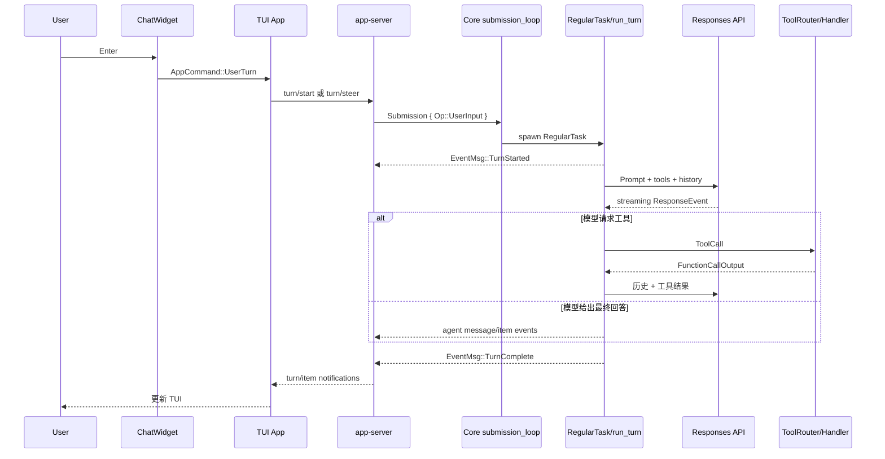

# Codex Agent 处理用户输入源码导读

本文从用户在 TUI 中提交一条消息开始，一直追踪到模型请求、工具执行、下一次采样和最终 UI 更新。重点是当前 `codex-rs` 实现中的真实类型、channel 和 async task。

如果代码中的类型名影响阅读，建议先读 [Codex Agent 源码术语表](agent_glossary.md)。它重点解释同名类型、对象生命周期，以及 `Thread → Session → Turn → Step` 的层级关系。

桌面客户端项目、任务标题和当前运行 Session 的对应关系，见 [Codex 客户端项目、任务与 Core Session 对应关系](codex_app_project_thread_session_mapping.md)。

本文默认 Agent 已按 [Agent 启动流程源码导读](agent_startup.md) 完成启动，已有可用的 `CodexThread`、Core submission loop 和 app-server event listener。

## 1. 总体流程



## 2. 需要区分的三类“输入”

当前代码存在三层名字相似但职责不同的类型：

| 类型 | 层 | 含义 |
| --- | --- | --- |
| `codex_app_server_protocol::UserInput` | TUI/app-server | text、image、skill、mention 等协议输入项 |
| `AppCommand::UserTurn` | TUI 内部 | 用户输入加 cwd、模型、权限等每轮设置 |
| `codex_protocol::protocol::Op::UserInput` | Core | 放入 submission queue 的 Core 操作 |

旧文档和部分兼容/测试代码还会出现 `Op::UserTurn`。阅读当前 app-server 主链时，应以 `TurnStartParams -> Op::UserInput` 为准。

## 3. TUI 捕获 Enter

Composer 将按键和文本编辑结果归一化为 `InputResult`。[`ChatWidget::handle_composer_input_result()`](../tui/src/chatwidget/input_flow.rs#L15) 处理 `InputResult::Submitted`：

1. 用文本和 text elements 构造 `UserMessage`；
2. 忽略完全空的文本/图片输入；
3. 检查 Session 是否已经配置完成；
4. 判断当前是否应该立即发送，还是放入 TUI 输入队列；
5. 清理上一轮 reasoning header，设置 `Working` 状态；
6. 调用 `submit_user_message()`。

如果 Agent 仍在初始化、plan 正在流式输出、设置弹窗阻止自动发送，输入会进入 `queued_user_messages`。[`maybe_send_next_queued_input()`](../tui/src/chatwidget/input_flow.rs#L136) 只在空闲时取出一条，防止无意中并发启动多个 turn。

## 4. TUI 将 `UserMessage` 变成结构化 items

主要逻辑在 [`submit_user_message_with_history_and_shell_escape_policy()`](../tui/src/chatwidget/input_submission.rs#L98)。它依次处理：

1. Session 未配置时恢复/排队输入；
2. 检查当前模型是否支持图片；
3. 识别以 `!` 开头的本地 shell escape；
4. 将远程图片、本地图片、文本转成 `UserInput`；
5. 从显式 binding 和文本 mention 中解析 skill；
6. 解析 plugin 和 app/connector mention；
7. 注入 IDE context；
8. 计算 collaboration mode、personality、service tier 和 permission profile；
9. 构造 `AppCommand::UserTurn`。

输入项顺序很重要：图片、文本、skills/mentions 和 IDE context 最终形成传给模型的本轮内容。显式选择的 skill 使用 `UserInput::Skill`，app/plugin 使用 `UserInput::Mention`。

### 4.1 `!command` 是旁路

当允许 shell escape 且文本以 `!` 开头时，TUI 构造 `RunUserShellCommand`，不会走普通模型 turn。理解用户输入主链时要先排除这条特殊路径。

### 4.2 乐观显示

通过 app event 提交时，`turn/start` 可能等待远端工作。TUI 会先把用户消息放入可见历史，再提交请求，见 [`input_submission.rs`](../tui/src/chatwidget/input_submission.rs#L359)。如果请求被拒绝，TUI 再执行恢复/错误显示逻辑。

## 5. `AppCommand::UserTurn` 携带什么

定义见 [`tui/src/app_command.rs`](../tui/src/app_command.rs#L24)。除 `items` 外，它还携带：

- cwd；
- approval policy 和 approvals reviewer；
- active permission profile；
- model、reasoning effort、summary、service tier；
- collaboration mode、personality；
- 可选 final output JSON schema。

这些值不是永久修改全局配置，而是作为本轮请求或 sticky thread settings 的输入。

[`ChatWidget::submit_op()`](../tui/src/chatwidget.rs#L1741) 将命令发送到：

- `CodexOpTarget::AppEvent`：正常 TUI 主链；
- `CodexOpTarget::Direct`：部分测试或直接驱动场景。

正常路径产生 `AppEvent::CodexOp(op)`。

## 6. TUI 决定 `turn/steer` 还是 `turn/start`

TUI 主事件循环在 [`AppEvent::CodexOp`](../tui/src/app/event_dispatch.rs#L437) 分支中先刷新乐观 UI，然后调用 `submit_active_thread_op()`。

[`AppCommand::UserTurn` 的路由逻辑](../tui/src/app/thread_routing.rs#L649) 会先检查目标 Thread 是否已有 active turn：

- 有 active turn：优先调用 `turn/steer`，把输入送入当前 turn；
- 没有 active turn：调用 `turn/start` 创建新 turn；
- TUI 缓存的 active turn id 过期：根据 app-server 错误刷新 id，必要时重试一次或回退到 `turn/start`；
- 当前 turn 不允许 steer：将输入留在 TUI 队列或显示错误。

因此“用户在 Agent 工作时再次输入”不一定创建新 turn，可能成为当前 turn 的 steer/pending input。

本文后续重点讲没有 active turn 时的 `turn/start` 主链。

## 7. TUI 构造 `TurnStartParams`

[`AppServerSession::turn_start()`](../tui/src/app_server_session.rs#L893) 把 `AppCommand::UserTurn` 转成 `ClientRequest::TurnStart`。请求包括：

- `thread_id` 和 `input`；
- cwd、runtime workspace roots、environment override；
- approval policy、permissions 或 sandbox policy；
- model、effort、summary、service tier、personality；
- collaboration mode 和 output schema。

调用成功会立即返回一个 `TurnStartResponse`，其中 Turn 状态是 `InProgress`。真正的 `turn/started` notification 要等 Core `RegularTask` 开始运行后才发出。

## 8. app-server 接收 `turn/start`

`MessageProcessor` 在 [`ClientRequest::TurnStart`](../app-server/src/message_processor.rs#L1294) 分支调用 `TurnRequestProcessor::turn_start()`。

[`turn_start_inner()`](../app-server/src/request_processors/turn_processor.rs#L476) 的主要工作是：

1. 加载 `thread_id` 对应的 `CodexThread`；
2. 检查该 Thread 是否允许直接输入；
3. 校验输入字符数和图片 URL；
4. 更新 app-server client/form elicitation 能力；
5. 将 v2 `UserInput` 映射为 Core input item；
6. 解析 cwd、环境和 per-turn settings；
7. 构造 Core `Op::UserInput`；
8. 调用 `CodexThread::submit_user_input_with_client_user_message_id()`。

Core 操作大致是：

```rust
Op::UserInput {
    items,
    final_output_json_schema,
    responsesapi_client_metadata,
    additional_context,
    thread_settings,
}
```

Core 生成的 submission id 同时作为 app-server 对外的 `turn_id`，见 [`new_submission_id()` 的说明](../core/src/session/mod.rs#L865)。

## 9. 输入进入 Core submission queue

[`CodexThread::submit_user_input_with_client_user_message_id()`](../core/src/codex_thread.rs#L284) 先通过 `AgentControl` 检查执行容量，然后委托给 `SessionIo`。

[`SessionIo::submit_user_input_with_client_user_message_id()`](../core/src/session/mod.rs#L809) 创建 `Submission`：

```text
Submission {
    id,
    op: Op::UserInput,
    client_user_message_id,
    trace,
    parent_turn_id: None,
}
```

随后通过 `tx_sub.send(sub)` 写入 channel。发送成功只表示 Core 已接收 submission，并不表示模型请求已经开始。

## 10. `submission_loop` 分派输入

每个 Core Session 都有一个 [`submission_loop()`](../core/src/session/handlers.rs#L714)。它持续读取 `rx_sub`，直到收到 `Op::Shutdown`。

`Op::UserInput` 分支调用：

```text
user_input_or_turn(...)
  -> user_input_or_turn_inner(...)
```

见 [`handlers.rs`](../core/src/session/handlers.rs#L769)。loop 还统一处理 interrupt、approval response、request-user-input answer、MCP refresh 等操作，因此这些控制消息与普通用户输入共享同一 Session 收件入口。

## 11. 新 turn 与 steer 在 Core 再次汇合

[`user_input_or_turn_inner()`](../core/src/session/handlers.rs#L189) 首先：

1. 解构 `Op::UserInput`；
2. 将 thread settings 转成 `SessionSettingsUpdate`；
3. 用 submission id 创建新的 `TurnContext`；
4. 尝试 `sess.steer_input(...)`。

这里有两种结果：

- `Steered`：当前已有可 steer 的 active turn，输入进入其 `InputQueue`；
- `NoActiveTurn`：构造 `TurnInput`，调用 `sess.spawn_task(..., RegularTask::new())`。

普通新消息走第二条路径。additional context 会先转换为 `TurnInput::ResponseItem`，用户内容成为 `TurnInput::UserInput`。

## 12. `RegularTask` 宣布 TurnStarted

[`RegularTask::run()`](../core/src/tasks/regular.rs#L38) 是普通 Agent turn 的任务实现。它先发送 `EventMsg::TurnStarted`，然后尝试消费启动阶段预热好的 `ModelClientSession`。

如果没有可用 prewarm session，就在 `run_turn()` 中创建新的 model client session。随后调用：

```text
run_turn(session, turn_context, input, prewarmed_client_session, cancellation_token)
```

如果本轮结束时 `InputQueue` 又出现 pending input，`RegularTask` 会再次调用 `run_turn()`，而不是立即结束整个用户可见 turn。

## 13. `run_turn()` 的准备阶段

主循环位于 [`core/src/session/turn.rs` 的 `run_turn()`](../core/src/session/turn.rs#L135)。进入首次模型采样前会执行：

1. 必要时做 pre-sampling compaction；
2. 从本轮输入识别需要的 MCP server 和 plugin；
3. 捕获第一个 `StepContext`；
4. 记录变化的 world state/reference context；
5. 构造 skill/plugin instruction 注入项；
6. 执行 pending SessionStart hooks；
7. 执行 hooks 并把用户输入记录到 conversation history；
8. 记录模型、工具和配置相关 telemetry。

`StepContext` 是一次采样使用的不可变视图，包含当前 `TurnContext`、环境和 `ToolRouter`。工具可能异步执行，因此工具调用必须保留产生它时的 `StepContext`，不能随意改用后续状态。

## 14. 每次采样如何构造模型输入

`run_turn()` 从 [`loop`](../core/src/session/turn.rs#L267) 开始反复采样。每轮会：

1. 在允许时从 `InputQueue` drain pending input；
2. 运行 input hooks 并记录新增输入；
3. 捕获或复用 `StepContext`；
4. 从 conversation history 生成适合当前模型 modality 的 prompt input；
5. 构造 Responses metadata；
6. 调用 `run_sampling_request()`。

[`run_sampling_request()`](../core/src/session/turn.rs#L1306) 再完成：

- 读取 base instructions；
- 创建 `ToolCallRuntime`；
- 启动本轮 code-mode worker；
- 用 history、tool specs、instructions 构造 `Prompt`；
- 调用 `try_run_sampling_request()`；
- 对可重试的 stream 错误执行有限重试。

## 15. 模型流式响应如何处理

[`try_run_sampling_request()`](../core/src/session/turn.rs#L2155) 调用 `ModelClientSession::stream()`，然后逐个消费 `ResponseEvent`。

主要事件包括：

| `ResponseEvent` | 处理方式 |
| --- | --- |
| `OutputItemAdded` | 建立 active item，发送 item started，准备流式解析器 |
| `OutputTextDelta` | 转换成 agent message/plan delta 并立即发给 UI |
| `ToolCallInputDelta` | 让支持的工具显示增量参数/patch |
| `OutputItemDone` | 持久化最终 item；普通消息完成或排队工具执行 |
| `RateLimits` | 更新内部 rate-limit snapshot |
| `Completed` | 记录 response id、token usage，决定是否需要 follow-up |

所有完成的响应 item 都会及时写入 conversation history/rollout。这样即使随后取消 turn，已经发生的模型输出和工具调用仍然有一致记录。

## 16. 模型请求工具时发生什么

`OutputItemDone` 最终进入 [`handle_output_item_done()`](../core/src/stream_events_utils.rs#L287)。它调用 [`ToolRouter::build_tool_call()`](../core/src/tools/router.rs#L152)，将模型输出转换为统一的 `ToolCall`：

- `ResponseItem::FunctionCall`；
- client-executed `ToolSearchCall`；
- `CustomToolCall`。

识别到工具后：

1. 立即记录 tool call item；
2. 创建 `ToolCallRuntime::handle_tool_call()` future；
3. 设置 `needs_follow_up = true`；
4. 将 future 放入 `FuturesOrdered`。

### 16.1 ToolRouter 的职责

[`ToolRouter`](../core/src/tools/router.rs#L68) 同时保存：

- 发给模型看的 tool specs；
- 实际可执行的 `ToolRegistry`。

执行时它把 `ToolCall` 变成 `ToolInvocation`，其中包含 Session、StepContext、TurnContext、call id、payload、cancellation token 和 diff tracker，然后分派给注册的 handler。

### 16.2 并行与串行工具

[`ToolCallRuntime`](../core/src/tools/parallel.rs#L40) 使用读写锁控制工具并行性：

- 支持并行的工具获取 read lock；
- 不支持并行的工具获取 write lock。

因此模型在一次响应中产生多个工具调用时，可以按 registry 声明并发执行，同时保证需要串行语义的工具不会与其他调用重叠。

### 16.3 approval 和等待用户输入

shell、patch、MCP 或其他 handler 可以通过 Core Event 请求 approval/permissions/user input。对应回答再作为 `Op::ExecApproval`、`Op::PatchApproval`、`Op::RequestPermissionsResponse` 或 `Op::UserInputAnswer` 进入同一个 submission loop，并唤醒等待中的工具 future。

## 17. 工具结果为什么会触发下一次模型采样

模型 stream 完成后，`try_run_sampling_request()` 调用 [`drain_in_flight()`](../core/src/session/turn.rs#L2105)，等待工具 futures，并把每个 `ResponseInputItem` 转成 conversation item 记录下来。

工具输出通常是 `FunctionCallOutput` 或 `CustomToolCallOutput`。因为工具调用已设置 `needs_follow_up = true`，控制权回到 `run_turn()` 后不会结束，而是：

1. 重新 clone 更新后的 history；
2. history 中现在包含原 tool call 和 tool output；
3. 再次调用模型；
4. 重复“模型输出 → 工具 → 工具结果 → 模型”的循环。

这就是 Agent 能连续执行多步任务的核心闭环。

## 18. 什么时候结束 turn

一次采样返回后，`run_turn()` 综合判断：

```text
needs_follow_up = model_needs_follow_up || has_pending_input
```

会继续循环的典型情况：

- 模型调用了工具；
- Responses API 明确返回 `end_turn: false`；
- 用户在执行期间 steer 了新输入；
- mailbox/子 Agent 消息到达；
- stop hook 请求带新 prompt 继续。

当没有 follow-up 时，`run_turn()`：

1. 保存最后一条 agent message；
2. 执行 turn-stop hooks；
3. 必要时执行 legacy after-agent hook；
4. 返回 `last_agent_message`。

`RegularTask` 若也没有 pending input，就返回并结束 task。Session 的任务管理逻辑随后发送 `EventMsg::TurnComplete`，清理 active turn 状态；对应完成事件的构造位于 [`core/src/tasks/mod.rs`](../core/src/tasks/mod.rs#L785)。

## 19. Core Event 如何返回 TUI

反向链路如下：

```text
Session::send_event(...)
→ tx_event
→ CodexThread::next_event()
→ app-server conversation listener
→ bespoke_event_handling / item_event_to_server_notification
→ ServerNotification
→ AppServerClient::next_event()
→ TUI 按 thread_id 路由
→ ChatWidget::handle_server_notification(...)
→ history/status/streaming UI 更新
```

app-server 的 Thread listener 从 [`request_processors/thread_lifecycle.rs`](../app-server/src/request_processors/thread_lifecycle.rs#L139) 开始，核心读取点是该文件中的 `conversation.next_event()`。事件转换主要位于 [`bespoke_event_handling.rs`](../app-server/src/bespoke_event_handling.rs)。

常见映射包括：

- `EventMsg::TurnStarted` → `turn/started`；
- item begin/end → `item/started`、`item/completed`；
- agent text delta → `item/agentMessage/delta`；
- exec/patch/MCP events → 相应工具 item notification；
- `EventMsg::TurnComplete` → `turn/completed`。

## 20. 中断和追加输入

### 20.1 Interrupt

TUI 调用 `turn/interrupt`，app-server 向 Core 提交 `Op::Interrupt`。submission loop 调用 `interrupt()`，取消 active turn 的 cancellation token。模型 stream 和工具 runtime 都监听该 token；取消后会停止采样、终止或等待工具清理，并产生 aborted/error completion 状态。

### 20.2 执行期间追加输入

若当前 active turn 可 steer，追加输入进入 `InputQueue`。`run_turn()` 在合适的采样边界 drain pending input，执行 hooks、写入 history，再把更新后的上下文送给模型。

这避免了任意时刻改写正在发送的 request：上下文只在明确的 step 边界更新。

## 21. 关键状态与不变量

理解或修改这条链路时，应保持以下约束：

1. 一个 Session 同时最多有一个 active user-visible turn；
2. submission id 是 Core 关联事件的 id，也是 app-server 暴露的 turn id；
3. conversation history 只能增量构建，不能随意重写；
4. 模型看见的 tool spec 必须与执行 tool call 时使用的 `ToolRouter` 属于同一个 `StepContext`；
5. tool call 和 tool output 必须都记录进 history，才能进行下一次采样；
6. 流式 item 的 started、delta、completed 顺序必须对客户端保持一致；
7. cancellation 必须同时覆盖模型 stream 和仍在执行的工具；
8. approval response 通过 submission loop 回到等待中的工具，不应绕过 Session 状态。

## 22. 推荐调试断点

从一次 Enter 走到最终回答，可以按顺序设置：

1. `ChatWidget::handle_composer_input_result`
2. `ChatWidget::submit_user_message_with_history_and_shell_escape_policy`
3. `ChatWidget::submit_op`
4. `App::submit_active_thread_op`
5. `AppServerSession::turn_start`
6. `TurnRequestProcessor::turn_start_inner`
7. `SessionIo::submit_user_input_with_client_user_message_id`
8. `submission_loop`
9. `user_input_or_turn_inner`
10. `RegularTask::run`
11. `run_turn`
12. `run_sampling_request`
13. `try_run_sampling_request`
14. `handle_output_item_done`
15. `ToolCallRuntime::handle_tool_call_with_source`
16. `ToolRouter::dispatch_tool_call_with_code_mode_result_inner`
17. `drain_in_flight`

建议同时观察这些值：

- `thread_id`
- `sub_id` / `turn_id`
- `active_turn`
- `input_queue`
- `needs_follow_up`
- `ResponseItem`
- `in_flight`
- `cancellation_token`

## 23. 最小 Core 示例

如果只想理解 Core 而暂时跳过 TUI 和 app-server，可从 [`thread-manager-sample/src/main.rs`](../thread-manager-sample/src/main.rs#L87) 开始。它直接：

1. 创建 `ThreadManager`；
2. `start_thread()`；
3. `thread.submit(Op::UserInput { ... })`；
4. 循环 `thread.next_event()`；
5. 收到 `TurnComplete` 后退出。

其 [`run_turn()` 示例](../thread-manager-sample/src/main.rs#L324) 是观察 submission/event 双向通道的最小入口。

## 24. 一句话总结

用户输入不是直接传给模型：TUI 先把它结构化并附加每轮运行设置，app-server 将 `turn/start` 转成 Core `Submission`，Session task 把输入和历史组成 prompt；模型产生工具调用时，工具结果被写回历史并触发下一次采样，直到没有 follow-up，最终事件再沿 Core → app-server → TUI 的反向链路显示给用户。

<!-- GENERATED-SOURCE-ATLAS:INPUT -->

## 25. 附录：用户输入处理源码图谱

这一附录把一次输入从按下 Enter 到 TurnComplete 拆成可独立检查的源码区块。正常学习时只展开当前关心的一段；排障时则沿 submission id、turn id 和 tool call id 三类标识串联区块。源码快照服务于精确对照，不替代前面的概念解释。

### B1. Composer 提交、排队与发送时机

源码入口：[`tui/src/chatwidget/input_flow.rs:1`](../tui/src/chatwidget/input_flow.rs#L1)

- 进入条件：终端按键已被 composer 解析为 `InputResult::Submitted`。
- 本段职责：创建 UserMessage，判断立即发送还是排队，并维护 Working/idle UI 状态。
- 离开条件：消息进入结构化输入转换，或安全地留在 queued_user_messages。
- 阅读重点：会话未配置、plan 流式输出、弹窗和 active turn 都可能改变发送时机。
- 调试建议：同时观察 submitted message、queued length、session configured 和 task running 标志。

<details>
<summary>展开源码快照（第 1–259 行）</summary>

> 这是生成文档时的源码快照。代码变动后，以函数名搜索结果为准；左侧数字是原文件行号。

````rust
  1 | //! User input submission, queue draining, and draft restore flow for `ChatWidget`.
  2 | //!
  3 | //! The queue data itself lives in `input_queue`; this module owns the app-level
  4 | //! effects around taking composer input, submitting user turns, draining queued
  5 | //! follow-ups, and restoring draft state across interrupts or thread switches.
  6 |
  7 | use super::*;
  8 |
  9 | impl ChatWidget {
 10 |     pub(crate) fn set_parent_owned_thread(&mut self) {
 11 |         self.blocks_direct_input = true;
 12 |         self.bottom_pane.set_parent_owned_thread();
 13 |     }
 14 |
 15 |     pub(super) fn handle_composer_input_result(
 16 |         &mut self,
 17 |         input_result: InputResult,
 18 |         had_modal_or_popup: bool,
 19 |     ) {
 20 |         match input_result {
 21 |             InputResult::Submitted {
 22 |                 text,
 23 |                 text_elements,
 24 |             } => {
 25 |                 let user_message = self.user_message_from_submission(text, text_elements);
 26 |                 if user_message.text.is_empty()
 27 |                     && user_message.local_images.is_empty()
 28 |                     && user_message.remote_image_urls.is_empty()
 29 |                 {
 30 |                     return;
 31 |                 }
 32 |                 let should_submit_now = self.is_session_configured()
 33 |                     && !self.is_plan_streaming_in_tui()
 34 |                     && !self.input_queue.suppress_queue_autosend
 35 |                     && (!self.input_queue.user_turn_pending_start
 36 |                         || self.turn_lifecycle.agent_turn_running);
 37 |                 if should_submit_now {
 38 |                     if self.only_user_shell_commands_running()
 39 |                         && !user_message.text.starts_with('!')
 40 |                     {
 41 |                         self.queue_user_message(user_message);
 42 |                         return;
 43 |                     }
 44 |                     // Submitted is emitted when user submits.
 45 |                     // Reset any reasoning header only when we are actually submitting a turn.
 46 |                     self.reasoning_buffer.clear();
 47 |                     self.reasoning_header = None;
 48 |                     self.reasoning_summary_parts.clear();
 49 |                     self.set_status_header(String::from("Working"));
 50 |                     self.submit_user_message(user_message);
 51 |                 } else {
 52 |                     self.queue_user_message(user_message);
 53 |                 }
 54 |             }
 55 |             InputResult::Queued {
 56 |                 text,
 57 |                 text_elements,
 58 |                 action,
 59 |                 pending_pastes,
 60 |             } => {
 61 |                 let user_message = self.user_message_from_submission(text, text_elements);
 62 |                 self.queue_user_message_with_options(user_message, action, pending_pastes);
 63 |             }
 64 |             InputResult::Command(cmd) => {
 65 |                 self.handle_slash_command_dispatch(cmd);
 66 |             }
 67 |             InputResult::ServiceTierCommand(command) => {
 68 |                 self.handle_service_tier_command_dispatch(command);
 69 |             }
 70 |             InputResult::CommandWithArgs(cmd, args, text_elements) => {
 71 |                 self.handle_slash_command_with_args_dispatch(cmd, args, text_elements);
 72 |             }
 73 |             InputResult::ParentOwnedInputBlocked => {
 74 |                 self.add_error_message(PARENT_OWNED_INPUT_MESSAGE.to_string());
 75 |             }
 76 |             InputResult::None => {}
 77 |         }
 78 |         if had_modal_or_popup && self.bottom_pane.no_modal_or_popup_active() {
 79 |             self.maybe_send_next_queued_input();
 80 |         }
 81 |         self.refresh_plan_mode_nudge();
 82 |     }
 83 |
 84 |     pub(super) fn defer_input_until_settings_applied(&mut self) {
 85 |         if !self.bottom_pane.no_modal_or_popup_active() {
 86 |             self.input_queue.suppress_queue_autosend = true;
 87 |         }
 88 |     }
 89 |
 90 |     pub(super) fn on_modal_or_popup_closed(&mut self) {
 91 |         if self.input_queue.suppress_queue_autosend {
 92 |             self.app_event_tx.send(AppEvent::SettingsSelectionClosed);
 93 |         } else {
 94 |             self.maybe_send_next_queued_input();
 95 |         }
 96 |     }
 97 |
 98 |     pub(super) fn queue_user_message(&mut self, user_message: UserMessage) {
 99 |         self.queue_user_message_with_options(user_message, QueuedInputAction::Plain, Vec::new());
100 |     }
101 |
102 |     pub(crate) fn set_queue_submissions_until_session_configured(&mut self, queue: bool) {
103 |         self.bottom_pane
104 |             .set_queue_submissions(queue && !self.is_session_configured());
105 |     }
106 |
107 |     pub(super) fn queue_user_message_with_options(
108 |         &mut self,
109 |         user_message: UserMessage,
110 |         action: QueuedInputAction,
111 |         pending_pastes: Vec<(String, String)>,
112 |     ) {
113 |         let should_run_now = self.is_session_configured()
114 |             && !self.is_user_turn_pending_or_running()
115 |             && !self.input_queue.suppress_queue_autosend;
116 |         if !should_run_now || action != QueuedInputAction::Plain {
117 |             self.input_queue
118 |                 .queued_user_messages
119 |                 .push_back(QueuedUserMessage {
120 |                     user_message,
121 |                     action,
122 |                     pending_pastes,
123 |                 });
124 |             self.input_queue
125 |                 .queued_user_message_history_records
126 |                 .push_back(UserMessageHistoryRecord::UserMessageText);
127 |             self.refresh_pending_input_preview();
128 |             if should_run_now {
129 |                 self.maybe_send_next_queued_input();
130 |             }
131 |         } else {
132 |             self.submit_user_message(user_message);
133 |         }
134 |     }
135 |
136 |     /// If idle and there are queued inputs, submit exactly one to start the next turn.
137 |     pub(crate) fn maybe_send_next_queued_input(&mut self) -> bool {
138 |         if self.input_queue.suppress_queue_autosend {
139 |             return false;
140 |         }
141 |         if self.blocks_direct_input {
142 |             return false;
143 |         }
144 |         if self.is_user_turn_pending_or_running() {
145 |             return false;
146 |         }
147 |         let mut submitted_follow_up = false;
148 |         while !self.is_user_turn_pending_or_running() {
149 |             let Some((queued_message, history_record)) = self.pop_next_queued_user_message() else {
150 |                 break;
151 |             };
152 |             match queued_message.action {
153 |                 QueuedInputAction::Plain => {
154 |                     submitted_follow_up = self.submit_user_message_with_history_record(
155 |                         queued_message.into_user_message(),
156 |                         history_record,
157 |                     );
158 |                     break;
159 |                 }
160 |                 QueuedInputAction::ParseSlash => {
161 |                     let drain = self.submit_queued_slash_prompt(queued_message);
162 |                     if drain == QueueDrain::Stop {
163 |                         submitted_follow_up = self.is_user_turn_pending_or_running();
164 |                         break;
165 |                     }
166 |                 }
167 |                 QueuedInputAction::RunShell => {
168 |                     let drain = self.submit_queued_shell_prompt(queued_message.into_user_message());
169 |                     if drain == QueueDrain::Stop {
170 |                         submitted_follow_up = self.is_user_turn_pending_or_running();
171 |                         break;
172 |                     }
173 |                 }
174 |             }
175 |         }
176 |         // Update the list to reflect the remaining queued messages (if any).
177 |         self.refresh_pending_input_preview();
178 |         submitted_follow_up
179 |     }
180 |
181 |     pub(super) fn is_user_turn_pending_or_running(&self) -> bool {
182 |         self.input_queue.user_turn_pending_start
183 |             || self.turn_lifecycle.agent_turn_running
184 |             || self.review.is_review_mode
185 |             || (self.bottom_pane.is_task_running() && self.mcp_startup_status.is_none())
186 |     }
187 |
188 |     pub(super) fn only_user_shell_commands_running(&self) -> bool {
189 |         self.turn_lifecycle.agent_turn_running
190 |             && !self.running_commands.is_empty()
191 |             && self
192 |                 .running_commands
193 |                 .values()
194 |                 .all(|command| command.source == ExecCommandSource::UserShell)
195 |     }
196 |
197 |     /// Rebuild and update the bottom-pane pending-input preview.
198 |     pub(super) fn refresh_pending_input_preview(&mut self) {
199 |         let preview = self.input_queue.preview();
200 |         self.bottom_pane.set_pending_input_preview(
201 |             preview.queued_messages,
202 |             preview.pending_steers,
203 |             preview.rejected_steers,
204 |         );
205 |     }
206 |
207 |     pub(crate) fn submit_user_message_with_mode(
208 |         &mut self,
209 |         text: String,
210 |         mut collaboration_mode: CollaborationModeMask,
211 |     ) {
212 |         if self.blocks_direct_input {
213 |             self.add_error_message(PARENT_OWNED_INPUT_MESSAGE.to_string());
214 |             return;
215 |         }
216 |         if collaboration_mode.mode == Some(ModeKind::Plan)
217 |             && let Some(effort) = self.config.plan_mode_reasoning_effort.clone()
218 |         {
219 |             collaboration_mode.reasoning_effort = Some(Some(effort));
220 |         }
221 |         if self.turn_lifecycle.agent_turn_running
222 |             && self.active_collaboration_mask.as_ref() != Some(&collaboration_mode)
223 |         {
224 |             self.add_error_message(
225 |                 "Cannot switch collaboration mode while a turn is running.".to_string(),
226 |             );
227 |             return;
228 |         }
229 |         self.set_collaboration_mask_from_user_action(collaboration_mode);
230 |         let should_queue = self.is_plan_streaming_in_tui();
231 |         let user_message = UserMessage {
232 |             text,
233 |             local_images: Vec::new(),
234 |             remote_image_urls: Vec::new(),
235 |             text_elements: Vec::new(),
236 |             mention_bindings: Vec::new(),
237 |         };
238 |         if should_queue {
239 |             self.queue_user_message(user_message);
240 |         } else {
241 |             self.submit_user_message(user_message);
242 |         }
243 |     }
244 |
245 |     #[cfg(test)]
246 |     pub(crate) fn queued_user_message_texts(&self) -> Vec<String> {
247 |         self.input_queue
248 |             .rejected_steers_queue
249 |             .iter()
250 |             .map(|message| message.text.clone())
251 |             .chain(
252 |                 self.input_queue
253 |                     .queued_user_messages
254 |                     .iter()
255 |                     .map(|message| message.text.clone()),
256 |             )
257 |             .collect()
258 |     }
259 | }
````

</details>


### B2. 文本、图片、skill、plugin 和 IDE context 结构化

源码入口：[`tui/src/chatwidget/input_submission.rs:80`](../tui/src/chatwidget/input_submission.rs#L80)

- 进入条件：TUI 决定提交一条 UserMessage。
- 本段职责：识别 shell escape，构造协议 UserInput items，解析 mention，并组装 AppCommand::UserTurn。
- 离开条件：结构化命令进入 AppEvent 或 Direct 提交路径，乐观 UI 已更新。
- 阅读重点：输入项的顺序、显式绑定与文本 mention 的去重、图片能力检查和失败恢复。
- 调试建议：在 AppCommand 构造前检查 items 数组，确认用户可见文本与注入上下文的边界。

<details>
<summary>展开源码快照（第 80–410 行）</summary>

> 这是生成文档时的源码快照。代码变动后，以函数名搜索结果为准；左侧数字是原文件行号。

````rust
 80 |             ShellEscapePolicy::Allow,
 81 |         )
 82 |         .0
 83 |     }
 84 |
 85 |     pub(super) fn submit_user_message_with_shell_escape_policy(
 86 |         &mut self,
 87 |         user_message: UserMessage,
 88 |         shell_escape_policy: ShellEscapePolicy,
 89 |     ) -> Option<AppCommand> {
 90 |         self.submit_user_message_with_history_and_shell_escape_policy(
 91 |             user_message,
 92 |             UserMessageHistoryRecord::UserMessageText,
 93 |             shell_escape_policy,
 94 |         )
 95 |         .1
 96 |     }
 97 |
 98 |     fn submit_user_message_with_history_and_shell_escape_policy(
 99 |         &mut self,
100 |         user_message: UserMessage,
101 |         history_record: UserMessageHistoryRecord,
102 |         shell_escape_policy: ShellEscapePolicy,
103 |     ) -> (bool, Option<AppCommand>) {
104 |         if !self.is_session_configured() {
105 |             tracing::warn!("cannot submit user message before session is configured; queueing");
106 |             self.input_queue
107 |                 .queued_user_messages
108 |                 .push_front(QueuedUserMessage::from(user_message));
109 |             self.input_queue
110 |                 .queued_user_message_history_records
111 |                 .push_front(history_record);
112 |             self.refresh_pending_input_preview();
113 |             return (true, None);
114 |         }
115 |         if user_message.text.is_empty()
116 |             && user_message.local_images.is_empty()
117 |             && user_message.remote_image_urls.is_empty()
118 |         {
119 |             return (false, None);
120 |         }
121 |         if (!user_message.local_images.is_empty() || !user_message.remote_image_urls.is_empty())
122 |             && !self.current_model_supports_images()
123 |         {
124 |             let UserMessage {
125 |                 text,
126 |                 text_elements,
127 |                 local_images,
128 |                 mention_bindings,
129 |                 remote_image_urls,
130 |             } = user_message_for_restore(user_message, &history_record);
131 |             self.restore_blocked_image_submission(
132 |                 text,
133 |                 text_elements,
134 |                 local_images,
135 |                 mention_bindings,
136 |                 remote_image_urls,
137 |             );
138 |             return (false, None);
139 |         }
140 |         let UserMessage {
141 |             text,
142 |             local_images,
143 |             remote_image_urls,
144 |             text_elements,
145 |             mention_bindings,
146 |         } = user_message;
147 |
148 |         let render_in_history = !self.turn_lifecycle.agent_turn_running;
149 |         let mut items: Vec<UserInput> = Vec::new();
150 |
151 |         // Special-case: "!cmd" executes a local shell command instead of sending to the model.
152 |         if shell_escape_policy == ShellEscapePolicy::Allow
153 |             && let Some(stripped) = text.strip_prefix('!')
154 |         {
155 |             let app_command = match self.submit_shell_command_with_history(stripped, &text) {
156 |                 QueueDrain::Continue => None,
157 |                 QueueDrain::Stop => Some(AppCommand::run_user_shell_command(
158 |                     stripped.trim().to_string(),
159 |                 )),
160 |             };
161 |             return (app_command.is_some(), app_command);
162 |         }
163 |
164 |         for image_url in &remote_image_urls {
165 |             items.push(UserInput::Image {
166 |                 url: image_url.clone(),
167 |                 detail: None,
168 |             });
169 |         }
170 |
171 |         for image in &local_images {
172 |             items.push(UserInput::LocalImage {
173 |                 path: image.path.clone(),
174 |                 detail: None,
175 |             });
176 |         }
177 |
178 |         if !text.is_empty() {
179 |             items.push(UserInput::Text {
180 |                 text: text.clone(),
181 |                 text_elements: app_server_text_elements(&text_elements),
182 |             });
183 |         }
184 |
185 |         let mentions = collect_tool_mentions(&text, &HashMap::new());
186 |         let bound_names: HashSet<String> = mention_bindings
187 |             .iter()
188 |             .map(|binding| binding.mention.clone())
189 |             .collect();
190 |         let mut skill_names_lower: HashSet<String> = HashSet::new();
191 |         let mut selected_skill_paths: HashSet<AbsolutePathBuf> = HashSet::new();
192 |         let mut selected_plugin_ids: HashSet<String> = HashSet::new();
193 |
194 |         if let Some(skills) = self.bottom_pane.skills() {
195 |             skill_names_lower = skills
196 |                 .iter()
197 |                 .map(|skill| skill.name.to_ascii_lowercase())
198 |                 .collect();
199 |
200 |             for binding in &mention_bindings {
201 |                 let path = binding
202 |                     .path
203 |                     .strip_prefix("skill://")
204 |                     .unwrap_or(binding.path.as_str());
205 |                 let path = Path::new(path);
206 |                 if let Some(skill) = skills.iter().find(|skill| skill.path.as_path() == path)
207 |                     && selected_skill_paths.insert(skill.path.clone())
208 |                 {
209 |                     items.push(UserInput::Skill {
210 |                         name: skill.name.clone(),
211 |                         path: skill.path.to_path_buf(),
212 |                     });
213 |                 }
214 |             }
215 |
216 |             let skill_mentions = find_skill_mentions_with_tool_mentions(&mentions, skills);
217 |             for skill in skill_mentions {
218 |                 if bound_names.contains(skill.name.as_str())
219 |                     || !selected_skill_paths.insert(skill.path.clone())
220 |                 {
221 |                     continue;
222 |                 }
223 |                 items.push(UserInput::Skill {
224 |                     name: skill.name.clone(),
225 |                     path: skill.path.to_path_buf(),
226 |                 });
227 |             }
228 |         }
229 |
230 |         if let Some(plugins) = self.plugins_for_mentions() {
231 |             for binding in &mention_bindings {
232 |                 let Some(plugin_config_name) = binding
233 |                     .path
234 |                     .strip_prefix("plugin://")
235 |                     .filter(|id| !id.is_empty())
236 |                 else {
237 |                     continue;
238 |                 };
239 |                 if !selected_plugin_ids.insert(plugin_config_name.to_string()) {
240 |                     continue;
241 |                 }
242 |                 if let Some(plugin) = plugins
243 |                     .iter()
244 |                     .find(|plugin| plugin.config_name == plugin_config_name)
245 |                 {
246 |                     items.push(UserInput::Mention {
247 |                         name: plugin.display_name.clone(),
248 |                         path: binding.path.clone(),
249 |                     });
250 |                 }
251 |             }
252 |         }
253 |
254 |         let mut selected_app_ids: HashSet<String> = HashSet::new();
255 |         if let Some(apps) = self.connectors_for_mentions() {
256 |             for binding in &mention_bindings {
257 |                 let Some(app_id) = binding
258 |                     .path
259 |                     .strip_prefix("app://")
260 |                     .filter(|id| !id.is_empty())
261 |                 else {
262 |                     continue;
263 |                 };
264 |                 if selected_app_ids.contains(app_id) {
265 |                     continue;
266 |                 }
267 |                 if let Some(app) = apps
268 |                     .iter()
269 |                     .find(|app| app.id == app_id && is_app_mentionable(app))
270 |                 {
271 |                     selected_app_ids.insert(app_id.to_string());
272 |                     items.push(UserInput::Mention {
273 |                         name: app.name.clone(),
274 |                         path: binding.path.clone(),
275 |                     });
276 |                 }
277 |             }
278 |
279 |             let app_mentions = find_app_mentions(&mentions, apps, &skill_names_lower);
280 |             for app in app_mentions {
281 |                 let slug = codex_connectors::metadata::connector_mention_slug(&app);
282 |                 if bound_names.contains(&slug) || !selected_app_ids.insert(app.id.clone()) {
283 |                     continue;
284 |                 }
285 |                 let app_id = app.id.as_str();
286 |                 items.push(UserInput::Mention {
287 |                     name: app.name.clone(),
288 |                     path: format!("app://{app_id}"),
289 |                 });
290 |             }
291 |         }
292 |
293 |         let effective_mode = self.effective_collaboration_mode();
294 |         if effective_mode.model().trim().is_empty() {
295 |             self.add_error_message(
296 |                 "Thread model is unavailable. Wait for the thread to finish syncing or choose a model before sending input.".to_string(),
297 |             );
298 |             self.restore_user_message_to_composer(user_message_for_restore(
299 |                 UserMessage {
300 |                     text,
301 |                     local_images,
302 |                     remote_image_urls,
303 |                     text_elements,
304 |                     mention_bindings,
305 |                 },
306 |                 &history_record,
307 |             ));
308 |             return (false, None);
309 |         }
310 |
311 |         self.maybe_apply_ide_context(&mut items);
312 |
313 |         let collaboration_mode = if self.collaboration_modes_enabled() {
314 |             self.active_collaboration_mask
315 |                 .as_ref()
316 |                 .map(|_| effective_mode.clone())
317 |         } else {
318 |             None
319 |         };
320 |         let pending_steer = (!render_in_history).then(|| PendingSteer {
321 |             user_message: UserMessage {
322 |                 text: text.clone(),
323 |                 local_images: local_images.clone(),
324 |                 remote_image_urls: remote_image_urls.clone(),
325 |                 text_elements: text_elements.clone(),
326 |                 mention_bindings: mention_bindings.clone(),
327 |             },
328 |             history_record: history_record.clone(),
329 |             compare_key: Self::pending_steer_compare_key_from_items(&items),
330 |         });
331 |         let personality = self
332 |             .config
333 |             .personality
334 |             .filter(|_| self.config.features.enabled(Feature::Personality))
335 |             .filter(|_| self.current_model_supports_personality());
336 |         let service_tier = self.service_tier_update_for_core();
337 |         let active_permission_profile = self.config.permissions.active_permission_profile();
338 |         let op = AppCommand::user_turn(
339 |             items,
340 |             self.config.cwd.to_path_buf(),
341 |             AskForApproval::from(self.config.permissions.approval_policy.value()),
342 |             active_permission_profile,
343 |             effective_mode.model().to_string(),
344 |             effective_mode.reasoning_effort(),
345 |             /*summary*/ None,
346 |             service_tier,
347 |             /*final_output_json_schema*/ None,
348 |             collaboration_mode,
349 |             personality,
350 |         );
351 |         let submitted_message = UserMessage {
352 |             text,
353 |             local_images,
354 |             remote_image_urls,
355 |             text_elements,
356 |             mention_bindings,
357 |         };
358 |
359 |         // App-event submissions are handled serially, and turn/start can wait on remote work.
360 |         // Queue the optimistic prompt first so the user's input is visible while that happens.
361 |         // Direct submissions do not share that queue, so keep their existing failure behavior.
362 |         let render_before_submit =
363 |             render_in_history && matches!(&self.codex_op_target, CodexOpTarget::AppEvent);
364 |         if render_before_submit {
365 |             self.on_user_message_display(user_message_display_for_history(
366 |                 submitted_message.clone(),
367 |                 &history_record,
368 |             ));
369 |         }
370 |
371 |         if !self.submit_op(op.clone()) {
372 |             return (false, None);
373 |         }
374 |         if render_in_history {
375 |             self.input_queue.user_turn_pending_start = true;
376 |         }
377 |
378 |         // Persist the submitted text to cross-session message history. Mentions are encoded into
379 |         // placeholder syntax so recall can reconstruct the mention bindings in a future session.
380 |         let encoded_mentions = submitted_message
381 |             .mention_bindings
382 |             .iter()
383 |             .map(|binding| LinkedMention {
384 |                 sigil: binding.sigil,
385 |                 mention: binding.mention.clone(),
386 |                 path: binding.path.clone(),
387 |             })
388 |             .collect::<Vec<_>>();
389 |         let history_text = match &history_record {
390 |             UserMessageHistoryRecord::UserMessageText if !submitted_message.text.is_empty() => {
391 |                 Some(encode_history_mentions(
392 |                     &submitted_message.text,
393 |                     &encoded_mentions,
394 |                 ))
395 |             }
396 |             UserMessageHistoryRecord::Override(history) if !history.text.is_empty() => {
397 |                 Some(encode_history_mentions(&history.text, &encoded_mentions))
398 |             }
399 |             UserMessageHistoryRecord::UserMessageText | UserMessageHistoryRecord::Override(_) => {
400 |                 None
401 |             }
402 |         };
403 |         if let Some(history_text) = history_text {
404 |             self.append_message_history_entry(history_text);
405 |         }
406 |
407 |         if let Some(pending_steer) = pending_steer {
408 |             self.input_queue.pending_steers.push_back(pending_steer);
409 |             self.transcript.saw_plan_item_this_turn = false;
410 |             self.refresh_pending_input_preview();
````

</details>


### B3. AppCommand::UserTurn 的 TUI 内部契约

源码入口：[`tui/src/app_command.rs:1`](../tui/src/app_command.rs#L1)

- 进入条件：ChatWidget 已把编辑器状态转换为一次应用命令。
- 本段职责：定义每轮输入连同 cwd、模型、权限、协作模式和输出 schema 的载体。
- 离开条件：App 主循环可以在不知道 composer 细节的情况下路由此命令。
- 阅读重点：区分输入 items 与 thread settings；前者进入对话，后者控制这一轮如何运行。
- 调试建议：比较连续两轮 AppCommand，找出哪些设置发生了 sticky 变化。

<details>
<summary>展开源码快照（第 1–120 行）</summary>

> 这是生成文档时的源码快照。代码变动后，以函数名搜索结果为准；左侧数字是原文件行号。

````rust
  1 | use std::path::PathBuf;
  2 |
  3 | use codex_app_server_protocol::AskForApproval;
  4 | use codex_app_server_protocol::CommandExecutionApprovalDecision;
  5 | use codex_app_server_protocol::FileChangeApprovalDecision;
  6 | use codex_app_server_protocol::McpServerElicitationAction;
  7 | use codex_app_server_protocol::RequestId as AppServerRequestId;
  8 | use codex_app_server_protocol::ReviewTarget;
  9 | use codex_app_server_protocol::ToolRequestUserInputResponse;
 10 | use codex_app_server_protocol::UserInput;
 11 | use codex_config::types::ApprovalsReviewer;
 12 | use codex_protocol::approvals::GuardianAssessmentEvent;
 13 | use codex_protocol::config_types::CollaborationMode;
 14 | use codex_protocol::config_types::Personality;
 15 | use codex_protocol::config_types::ReasoningSummary as ReasoningSummaryConfig;
 16 | use codex_protocol::config_types::WindowsSandboxLevel;
 17 | use codex_protocol::models::ActivePermissionProfile;
 18 | use codex_protocol::models::PermissionProfile;
 19 | use codex_protocol::openai_models::ReasoningEffort as ReasoningEffortConfig;
 20 | use codex_protocol::request_permissions::RequestPermissionsResponse;
 21 | use serde::Serialize;
 22 | use serde_json::Value;
 23 |
 24 | #[allow(clippy::large_enum_variant)]
 25 | #[derive(Debug, Clone, PartialEq, Serialize)]
 26 | pub(crate) enum AppCommand {
 27 |     Interrupt,
 28 |     CleanBackgroundTerminals,
 29 |     RunUserShellCommand {
 30 |         command: String,
 31 |     },
 32 |     UserTurn {
 33 |         items: Vec<UserInput>,
 34 |         cwd: PathBuf,
 35 |         approval_policy: AskForApproval,
 36 |         approvals_reviewer: Option<ApprovalsReviewer>,
 37 |         active_permission_profile: Option<ActivePermissionProfile>,
 38 |         model: String,
 39 |         effort: Option<ReasoningEffortConfig>,
 40 |         summary: Option<ReasoningSummaryConfig>,
 41 |         service_tier: Option<Option<String>>,
 42 |         final_output_json_schema: Option<Value>,
 43 |         collaboration_mode: Option<CollaborationMode>,
 44 |         personality: Option<Personality>,
 45 |     },
 46 |     OverrideTurnContext {
 47 |         cwd: Option<PathBuf>,
 48 |         approval_policy: Option<AskForApproval>,
 49 |         approvals_reviewer: Option<ApprovalsReviewer>,
 50 |         permission_profile: Option<PermissionProfile>,
 51 |         active_permission_profile: Option<ActivePermissionProfile>,
 52 |         windows_sandbox_level: Option<WindowsSandboxLevel>,
 53 |         model: Option<String>,
 54 |         effort: Option<Option<ReasoningEffortConfig>>,
 55 |         summary: Option<ReasoningSummaryConfig>,
 56 |         service_tier: Option<Option<String>>,
 57 |         collaboration_mode: Option<CollaborationMode>,
 58 |         personality: Option<Personality>,
 59 |     },
 60 |     ExecApproval {
 61 |         id: String,
 62 |         turn_id: Option<String>,
 63 |         decision: CommandExecutionApprovalDecision,
 64 |     },
 65 |     PatchApproval {
 66 |         id: String,
 67 |         decision: FileChangeApprovalDecision,
 68 |     },
 69 |     ResolveElicitation {
 70 |         server_name: String,
 71 |         request_id: AppServerRequestId,
 72 |         decision: McpServerElicitationAction,
 73 |         content: Option<Value>,
 74 |         meta: Option<Value>,
 75 |     },
 76 |     UserInputAnswer {
 77 |         id: String,
 78 |         response: ToolRequestUserInputResponse,
 79 |     },
 80 |     RequestPermissionsResponse {
 81 |         id: String,
 82 |         response: RequestPermissionsResponse,
 83 |     },
 84 |     ReloadUserConfig,
 85 |     ListSkills {
 86 |         cwds: Vec<PathBuf>,
 87 |         force_reload: bool,
 88 |     },
 89 |     Compact,
 90 |     SetThreadName {
 91 |         name: String,
 92 |     },
 93 |     Review {
 94 |         target: ReviewTarget,
 95 |     },
 96 |     ApproveGuardianDeniedAction {
 97 |         event: GuardianAssessmentEvent,
 98 |     },
 99 | }
100 |
101 | impl AppCommand {
102 |     pub(crate) fn interrupt() -> Self {
103 |         Self::Interrupt
104 |     }
105 |
106 |     pub(crate) fn clean_background_terminals() -> Self {
107 |         Self::CleanBackgroundTerminals
108 |     }
109 |
110 |     pub(crate) fn run_user_shell_command(command: String) -> Self {
111 |         Self::RunUserShellCommand { command }
112 |     }
113 |
114 |     #[allow(clippy::too_many_arguments)]
115 |     pub(crate) fn user_turn(
116 |         items: Vec<UserInput>,
117 |         cwd: PathBuf,
118 |         approval_policy: AskForApproval,
119 |         active_permission_profile: Option<ActivePermissionProfile>,
120 |         model: String,
````

</details>


### B4. AppEvent 接收乐观提交

源码入口：[`tui/src/app/event_dispatch.rs:420`](../tui/src/app/event_dispatch.rs#L420)

- 进入条件：ChatWidget 通过 AppEvent 通道发出 CodexOp。
- 本段职责：在主事件循环中刷新 UI 并调用活动 thread 的操作路由。
- 离开条件：命令进入 turn/steer 或 turn/start 的异步请求任务。
- 阅读重点：UI 已显示消息不等于后端已接收；错误时需要恢复或显式展示失败。
- 调试建议：用事件时间戳区分按下 Enter、乐观显示、RPC 响应和 Core TurnStarted。

<details>
<summary>展开源码快照（第 420–490 行）</summary>

> 这是生成文档时的源码快照。代码变动后，以函数名搜索结果为准；左侧数字是原文件行号。

````rust
420 |             }
421 |             AppEvent::Logout => match app_server.logout_account().await {
422 |                 Ok(()) => {
423 |                     self.show_shutdown_feedback(tui)?;
424 |                     return Ok(self
425 |                         .handle_exit_mode(app_server, ExitMode::ShutdownFirst)
426 |                         .await);
427 |                 }
428 |                 Err(err) => {
429 |                     tracing::error!("failed to logout: {err}");
430 |                     self.chat_widget
431 |                         .add_error_message(format!("Logout failed: {err}"));
432 |                 }
433 |             },
434 |             AppEvent::FatalExitRequest(message) => {
435 |                 return Ok(AppRunControl::Exit(ExitReason::Fatal(message)));
436 |             }
437 |             AppEvent::CodexOp(op) => {
438 |                 let is_user_turn = matches!(&op, AppCommand::UserTurn { .. });
439 |                 if is_user_turn {
440 |                     let screen_size = tui.terminal.last_known_screen_size;
441 |                     self.handle_draw_pre_render(tui, screen_size)?;
442 |                     if self.transcript_reflow.has_pending_reflow() {
443 |                         self.transcript_reflow.schedule_immediate();
444 |                         self.maybe_run_resize_reflow(tui, screen_size)?;
445 |                     }
446 |                     self.chat_widget.pre_draw_tick();
447 |                     self.render_chat_widget_frame(tui, screen_size)?;
448 |                 }
449 |                 self.chat_widget.prepare_local_op_submission(&op);
450 |                 if let Err(err) = self.submit_active_thread_op(app_server, op).await {
451 |                     let handled = is_user_turn
452 |                         && matches!(
453 |                             err.downcast_ref::<TypedRequestError>(),
454 |                             Some(TypedRequestError::Server { method, .. })
455 |                                 if method == "turn/start"
456 |                         )
457 |                         && self
458 |                             .chat_widget
459 |                             .handle_turn_start_rejection(format!("Failed to start turn: {err:#}"));
460 |                     if !handled {
461 |                         return Err(err);
462 |                     }
463 |                     tracing::error!(error = ?err, "failed to start turn through app server");
464 |                 }
465 |             }
466 |             AppEvent::RetrySafetyBufferedTurn {
467 |                 thread_id,
468 |                 turn_id,
469 |                 model,
470 |                 turn,
471 |                 prompt,
472 |             } => {
473 |                 self.retry_safety_buffered_turn(
474 |                     tui,
475 |                     app_server,
476 |                     super::safety_buffering::SafetyBufferedRetry {
477 |                         thread_id,
478 |                         turn_id,
479 |                         model,
480 |                         turn,
481 |                         prompt,
482 |                     },
483 |                 )
484 |                 .await;
485 |             }
486 |             AppEvent::AppendMessageHistoryEntry { thread_id, text } => {
487 |                 self.append_message_history_entry(thread_id, text);
488 |             }
489 |             AppEvent::SyncThreadGitBranch { thread_id, branch } => {
490 |                 if let Err(err) = app_server
````

</details>


### B5. 活动 turn 路由：steer 还是 start

源码入口：[`tui/src/app/thread_routing.rs:640`](../tui/src/app/thread_routing.rs#L640)

- 进入条件：App 收到 UserTurn，且目标 thread id 已知。
- 本段职责：根据缓存和服务端 active turn 状态选择 steer、start、重试或排队。
- 离开条件：已有 turn 接收追加输入，或新 turn/start 请求被发出。
- 阅读重点：特别阅读 stale active turn id 的恢复分支，它解释了偶发竞态为何不必直接报错。
- 调试建议：记录本地 active id、服务端错误中的 id 和最终选择的 RPC。

<details>
<summary>展开源码快照（第 640–820 行）</summary>

> 这是生成文档时的源码快照。代码变动后，以函数名搜索结果为准；左侧数字是原文件行号。

````rust
640 |                                     tracing::warn!(error = %error, "thread event channel closed");
641 |                                 }
642 |                                 break;
643 |                             }
644 |                         }
645 |                     }
646 |                 });
647 |                 Ok(true)
648 |             }
649 |             AppCommand::UserTurn {
650 |                 items,
651 |                 cwd,
652 |                 approval_policy,
653 |                 approvals_reviewer,
654 |                 active_permission_profile,
655 |                 model,
656 |                 effort,
657 |                 summary,
658 |                 service_tier,
659 |                 final_output_json_schema,
660 |                 collaboration_mode,
661 |                 personality,
662 |             } => {
663 |                 let mut should_start_turn = true;
664 |                 if let Some(turn_id) = self.active_turn_id_for_thread(thread_id).await {
665 |                     let mut steer_turn_id = turn_id;
666 |                     let mut retried_after_turn_mismatch = false;
667 |                     loop {
668 |                         match app_server
669 |                             .turn_steer(thread_id, steer_turn_id.clone(), items.to_vec())
670 |                             .await
671 |                         {
672 |                             Ok(_) => return Ok(true),
673 |                             Err(error) => {
674 |                                 if let Some(turn_error) =
675 |                                     active_turn_not_steerable_turn_error(&error)
676 |                                 {
677 |                                     if !self.chat_widget.enqueue_rejected_steer() {
678 |                                         self.chat_widget.add_error_message(turn_error.message);
679 |                                     }
680 |                                     return Ok(true);
681 |                                 }
682 |                                 match active_turn_steer_race(&error) {
683 |                                     Some(ActiveTurnSteerRace::Missing) => {
684 |                                         if let Some(channel) =
685 |                                             self.thread_event_channels.get(&thread_id)
686 |                                         {
687 |                                             let mut store = channel.store.lock().await;
688 |                                             store.clear_active_turn_id();
689 |                                         }
690 |                                         should_start_turn = true;
691 |                                         break;
692 |                                     }
693 |                                     Some(ActiveTurnSteerRace::ExpectedTurnMismatch {
694 |                                         actual_turn_id,
695 |                                     }) if !retried_after_turn_mismatch
696 |                                         && actual_turn_id != steer_turn_id =>
697 |                                     {
698 |                                         // Review flows can swap the active turn before the TUI
699 |                                         // processes the corresponding notification. Retry once with
700 |                                         // the server-reported turn id so non-steerable review turns
701 |                                         // still fall through to the existing queueing behavior.
702 |                                         if let Some(channel) =
703 |                                             self.thread_event_channels.get(&thread_id)
704 |                                         {
705 |                                             let mut store = channel.store.lock().await;
706 |                                             store.active_turn_id = Some(actual_turn_id.clone());
707 |                                         }
708 |                                         steer_turn_id = actual_turn_id;
709 |                                         retried_after_turn_mismatch = true;
710 |                                     }
711 |                                     Some(ActiveTurnSteerRace::ExpectedTurnMismatch {
712 |                                         actual_turn_id,
713 |                                     }) => {
714 |                                         if let Some(channel) =
715 |                                             self.thread_event_channels.get(&thread_id)
716 |                                         {
717 |                                             let mut store = channel.store.lock().await;
718 |                                             store.active_turn_id = Some(actual_turn_id);
719 |                                         }
720 |                                         return Err(error.into());
721 |                                     }
722 |                                     None => return Err(error.into()),
723 |                                 }
724 |                             }
725 |                         }
726 |                     }
727 |                 }
728 |                 if should_start_turn {
729 |                     let config = self.chat_widget.config_ref();
730 |                     let approvals_reviewer =
731 |                         approvals_reviewer.unwrap_or(config.approvals_reviewer);
732 |                     let permissions_override = Self::turn_permissions_override_from_config(
733 |                         config,
734 |                         active_permission_profile.as_ref(),
735 |                         self.runtime_permission_profile_override
736 |                             .as_ref()
737 |                             .map(|profile| &profile.permission_profile),
738 |                     );
739 |                     let response = app_server
740 |                         .turn_start(
741 |                             thread_id,
742 |                             items.to_vec(),
743 |                             cwd.clone(),
744 |                             *approval_policy,
745 |                             approvals_reviewer,
746 |                             permissions_override,
747 |                             config.permissions.user_visible_workspace_roots(),
748 |                             model.to_string(),
749 |                             effort.clone(),
750 |                             *summary,
751 |                             service_tier.clone(),
752 |                             collaboration_mode.clone(),
753 |                             *personality,
754 |                             final_output_json_schema.clone(),
755 |                         )
756 |                         .await?;
757 |                     if self.active_thread_id == Some(thread_id)
758 |                         && self.chat_widget.thread_id() == Some(thread_id)
759 |                     {
760 |                         self.chat_widget
761 |                             .record_safety_buffering_turn(response.turn.id, op);
762 |                     }
763 |                 }
764 |                 Ok(true)
765 |             }
766 |             AppCommand::ListSkills { cwds, force_reload } => {
767 |                 self.handle_skills_list_result(
768 |                     app_server
769 |                         .skills_list(codex_app_server_protocol::SkillsListParams {
770 |                             cwds: cwds.clone(),
771 |                             force_reload: *force_reload,
772 |                         })
773 |                         .await,
774 |                     "failed to refresh skills",
775 |                 );
776 |                 Ok(true)
777 |             }
778 |             AppCommand::Compact => {
779 |                 app_server.thread_compact_start(thread_id).await?;
780 |                 Ok(true)
781 |             }
782 |             AppCommand::SetThreadName { name } => {
783 |                 app_server
784 |                     .thread_set_name(thread_id, name.to_string())
785 |                     .await?;
786 |                 Ok(true)
787 |             }
788 |             AppCommand::Review { target } => {
789 |                 let response = app_server.review_start(thread_id, target.clone()).await?;
790 |                 let review_thread_id = ThreadId::from_string(&response.review_thread_id)
791 |                     .wrap_err("review/start returned invalid review thread id")?;
792 |                 let store = Arc::clone(&self.ensure_thread_channel(review_thread_id).store);
793 |                 let mut store = store.lock().await;
794 |                 store.active_turn_id = Some(response.turn.id);
795 |                 Ok(true)
796 |             }
797 |             AppCommand::CleanBackgroundTerminals => {
798 |                 app_server
799 |                     .thread_background_terminals_clean(thread_id)
800 |                     .await?;
801 |                 Ok(true)
802 |             }
803 |             AppCommand::RunUserShellCommand { command } => {
804 |                 app_server
805 |                     .thread_shell_command(thread_id, command.to_string())
806 |                     .await?;
807 |                 Ok(true)
808 |             }
809 |             AppCommand::ReloadUserConfig => {
810 |                 app_server.reload_user_config().await?;
811 |                 Ok(true)
812 |             }
813 |             AppCommand::OverrideTurnContext { .. } => {
814 |                 self.sync_override_turn_context_settings(app_server, thread_id, op)
815 |                     .await;
816 |                 Ok(true)
817 |             }
818 |             AppCommand::ApproveGuardianDeniedAction { event } => {
819 |                 app_server
820 |                     .thread_approve_guardian_denied_action(thread_id, event)
````

</details>


### B6. TUI 映射 TurnStartParams

源码入口：[`tui/src/app_server_session.rs:870`](../tui/src/app_server_session.rs#L870)

- 进入条件：路由层决定创建一个新 turn。
- 本段职责：把 AppCommand 字段映射到 app-server v2 TurnStartParams 并发送请求。
- 离开条件：获得 InProgress TurnStartResponse，后续进展依赖异步通知。
- 阅读重点：响应只是接收确认；真正运行起点以 Core TurnStarted 转出的通知为准。
- 调试建议：抓取完整请求并核对 input、permissions、cwd、model 和 output schema。

<details>
<summary>展开源码快照（第 870–990 行）</summary>

> 这是生成文档时的源码快照。代码变动后，以函数名搜索结果为准；左侧数字是原文件行号。

````rust
870 |     pub(crate) async fn thread_inject_items(
871 |         &mut self,
872 |         thread_id: ThreadId,
873 |         items: Vec<ResponseItem>,
874 |     ) -> Result<ThreadInjectItemsResponse> {
875 |         let items = items
876 |             .into_iter()
877 |             .map(serde_json::to_value)
878 |             .collect::<std::result::Result<Vec<_>, _>>()
879 |             .wrap_err("failed to encode thread/inject_items payload")?;
880 |         let request_id = self.next_request_id();
881 |         self.client
882 |             .request_typed(ClientRequest::ThreadInjectItems {
883 |                 request_id,
884 |                 params: ThreadInjectItemsParams {
885 |                     thread_id: thread_id.to_string(),
886 |                     items,
887 |                 },
888 |             })
889 |             .await
890 |             .wrap_err("thread/inject_items failed during TUI side conversation setup")
891 |     }
892 |
893 |     #[allow(clippy::too_many_arguments)]
894 |     pub(crate) async fn turn_start(
895 |         &mut self,
896 |         thread_id: ThreadId,
897 |         items: Vec<UserInput>,
898 |         cwd: PathBuf,
899 |         approval_policy: AskForApproval,
900 |         approvals_reviewer: codex_protocol::config_types::ApprovalsReviewer,
901 |         permissions_override: TurnPermissionsOverride,
902 |         workspace_roots: &[AbsolutePathBuf],
903 |         model: String,
904 |         effort: Option<codex_protocol::openai_models::ReasoningEffort>,
905 |         summary: Option<codex_protocol::config_types::ReasoningSummary>,
906 |         service_tier: Option<Option<String>>,
907 |         collaboration_mode: Option<codex_protocol::config_types::CollaborationMode>,
908 |         personality: Option<codex_protocol::config_types::Personality>,
909 |         output_schema: Option<serde_json::Value>,
910 |     ) -> Result<TurnStartResponse> {
911 |         let request_id = self.next_request_id();
912 |         let (sandbox_policy, permissions) =
913 |             turn_permissions_overrides(permissions_override, cwd.as_path());
914 |         self.client
915 |             .request_typed(ClientRequest::TurnStart {
916 |                 request_id,
917 |                 params: TurnStartParams {
918 |                     thread_id: thread_id.to_string(),
919 |                     client_user_message_id: None,
920 |                     input: items,
921 |                     responsesapi_client_metadata: None,
922 |                     additional_context: None,
923 |                     environments: None,
924 |                     cwd: Some(cwd),
925 |                     runtime_workspace_roots: Some(workspace_roots.to_vec()),
926 |                     approval_policy: Some(approval_policy),
927 |                     approvals_reviewer: Some(approvals_reviewer.into()),
928 |                     sandbox_policy,
929 |                     permissions,
930 |                     model: Some(model),
931 |                     service_tier,
932 |                     effort,
933 |                     summary,
934 |                     personality,
935 |                     output_schema,
936 |                     collaboration_mode,
937 |                     multi_agent_mode: None,
938 |                 },
939 |             })
940 |             .await
941 |             .wrap_err("turn/start failed in TUI")
942 |     }
943 |
944 |     pub(crate) async fn turn_interrupt(
945 |         &mut self,
946 |         thread_id: ThreadId,
947 |         turn_id: String,
948 |     ) -> std::result::Result<(), TypedRequestError> {
949 |         let request_id = self.next_request_id();
950 |         let _: TurnInterruptResponse = self
951 |             .client
952 |             .request_typed(ClientRequest::TurnInterrupt {
953 |                 request_id,
954 |                 params: TurnInterruptParams {
955 |                     thread_id: thread_id.to_string(),
956 |                     turn_id,
957 |                 },
958 |             })
959 |             .await?;
960 |         Ok(())
961 |     }
962 |
963 |     pub(crate) async fn startup_interrupt(
964 |         &mut self,
965 |         thread_id: ThreadId,
966 |     ) -> std::result::Result<(), TypedRequestError> {
967 |         self.turn_interrupt(thread_id, String::new()).await
968 |     }
969 |
970 |     pub(crate) async fn turn_steer(
971 |         &mut self,
972 |         thread_id: ThreadId,
973 |         turn_id: String,
974 |         items: Vec<UserInput>,
975 |     ) -> std::result::Result<TurnSteerResponse, TypedRequestError> {
976 |         let request_id = self.next_request_id();
977 |         self.client
978 |             .request_typed(ClientRequest::TurnSteer {
979 |                 request_id,
980 |                 params: TurnSteerParams {
981 |                     thread_id: thread_id.to_string(),
982 |                     client_user_message_id: None,
983 |                     input: items,
984 |                     responsesapi_client_metadata: None,
985 |                     additional_context: None,
986 |                     expected_turn_id: turn_id,
987 |                 },
988 |             })
989 |             .await
990 |     }
````

</details>


### B7. MessageProcessor 分派 turn/start

源码入口：[`app-server/src/message_processor.rs:1270`](../app-server/src/message_processor.rs#L1270)

- 进入条件：app-server transport 收到 ClientRequest::TurnStart。
- 本段职责：把 turn 请求交给 TurnRequestProcessor，并保持 JSON-RPC request id 关联。
- 离开条件：处理器返回同步接收结果，事件监听器随后转发运行通知。
- 阅读重点：这一层只做分派；业务校验和 Core Op 构造在 turn_processor。
- 调试建议：先确认 variant 命中，再深入处理器，避免在错误协议版本上排查。

<details>
<summary>展开源码快照（第 1270–1330 行）</summary>

> 这是生成文档时的源码快照。代码变动后，以函数名搜索结果为准；左侧数字是原文件行号。

````rust
1270 |                 self.plugin_processor.plugin_install(params).await
1271 |             }
1272 |             ClientRequest::PluginUninstall { params, .. } => {
1273 |                 self.plugin_processor.plugin_uninstall(params).await
1274 |             }
1275 |             ClientRequest::ModelList { params, .. } => {
1276 |                 self.catalog_processor.model_list(params).await
1277 |             }
1278 |             ClientRequest::ExperimentalFeatureList { params, .. } => {
1279 |                 self.catalog_processor
1280 |                     .experimental_feature_list(params)
1281 |                     .await
1282 |             }
1283 |             ClientRequest::PermissionProfileList { params, .. } => {
1284 |                 self.catalog_processor.permission_profile_list(params).await
1285 |             }
1286 |             ClientRequest::CollaborationModeList { params, .. } => {
1287 |                 self.catalog_processor.collaboration_mode_list(params).await
1288 |             }
1289 |             ClientRequest::MockExperimentalMethod { params, .. } => {
1290 |                 self.catalog_processor
1291 |                     .mock_experimental_method(params)
1292 |                     .await
1293 |             }
1294 |             ClientRequest::TurnStart { params, .. } => {
1295 |                 self.turn_processor
1296 |                     .turn_start(
1297 |                         request_id.clone(),
1298 |                         params,
1299 |                         app_server_client_name.clone(),
1300 |                         client_version.clone(),
1301 |                         /*supports_openai_form_elicitation*/
1302 |                         supports_openai_form_elicitation,
1303 |                     )
1304 |                     .await
1305 |             }
1306 |             ClientRequest::ThreadInjectItems { params, .. } => {
1307 |                 self.turn_processor.thread_inject_items(params).await
1308 |             }
1309 |             ClientRequest::TurnSteer { params, .. } => {
1310 |                 self.turn_processor.turn_steer(&request_id, params).await
1311 |             }
1312 |             ClientRequest::TurnInterrupt { params, .. } => {
1313 |                 self.turn_processor
1314 |                     .turn_interrupt(&request_id, params)
1315 |                     .await
1316 |             }
1317 |             ClientRequest::ThreadRealtimeStart { params, .. } => {
1318 |                 self.turn_processor
1319 |                     .thread_realtime_start(&request_id, params)
1320 |                     .await
1321 |             }
1322 |             ClientRequest::ThreadRealtimeAppendAudio { params, .. } => {
1323 |                 self.turn_processor
1324 |                     .thread_realtime_append_audio(&request_id, params)
1325 |                     .await
1326 |             }
1327 |             ClientRequest::ThreadRealtimeAppendText { params, .. } => {
1328 |                 self.turn_processor
1329 |                     .thread_realtime_append_text(&request_id, params)
1330 |                     .await
````

</details>


### B8. TurnRequestProcessor 校验并构造 Op::UserInput

源码入口：[`app-server/src/request_processors/turn_processor.rs:470`](../app-server/src/request_processors/turn_processor.rs#L470)

- 进入条件：turn/start 参数已绑定到目标 thread。
- 本段职责：校验输入和能力，映射 v2 items，解析 per-turn 环境与设置，并提交 Core Op。
- 离开条件：submission id 被作为 turn id 返回，或请求在进入 Core 前失败。
- 阅读重点：按 协议UserInput→CoreUserInput、ThreadSettings、submit 三个转换点逐段核对。
- 调试建议：在转换前后比较 item 数量和 variant；图片 URL、权限互斥最容易提前失败。

<details>
<summary>展开源码快照（第 470–750 行）</summary>

> 这是生成文档时的源码快照。代码变动后，以函数名搜索结果为准；左侧数字是原文件行号。

````rust
470 |         if actual_chars > MAX_USER_INPUT_TEXT_CHARS {
471 |             return Err(Self::input_too_large_error(actual_chars));
472 |         }
473 |         Ok(())
474 |     }
475 |
476 |     async fn turn_start_inner(
477 |         &self,
478 |         request_id: ConnectionRequestId,
479 |         params: TurnStartParams,
480 |         app_server_client_name: Option<String>,
481 |         app_server_client_version: Option<String>,
482 |         supports_openai_form_elicitation: bool,
483 |     ) -> Result<TurnStartResponse, JSONRPCErrorError> {
484 |         let (thread_id, thread) =
485 |             self.load_thread(&params.thread_id)
486 |                 .await
487 |                 .inspect_err(|error| {
488 |                     self.track_error_response(&request_id, error, /*error_type*/ None);
489 |                 })?;
490 |         self.ensure_direct_input_allowed(&request_id, thread.as_ref())
491 |             .await?;
492 |         if let Err(error) = Self::validate_v2_input_limit(&params.input) {
493 |             self.track_error_response(
494 |                 &request_id,
495 |                 &error,
496 |                 Some(AnalyticsJsonRpcError::Input(InputError::TooLarge)),
497 |             );
498 |             return Err(error);
499 |         }
500 |         Self::set_app_server_client_info(
501 |             thread.as_ref(),
502 |             app_server_client_name,
503 |             app_server_client_version,
504 |         )
505 |         .await
506 |         .inspect_err(|error| {
507 |             self.track_error_response(&request_id, error, /*error_type*/ None);
508 |         })?;
509 |         thread
510 |             .set_openai_form_elicitation_support(supports_openai_form_elicitation)
511 |             .await
512 |             .map_err(|err| {
513 |                 internal_error(format!(
514 |                     "failed to update OpenAI form elicitation support: {err}"
515 |                 ))
516 |             })?;
517 |
518 |         let runtime_workspace_roots = params
519 |             .runtime_workspace_roots
520 |             .map(resolve_runtime_workspace_roots);
521 |         let environment_selections =
522 |             resolve_turn_environment_selections(self.thread_manager.as_ref(), params.environments)?;
523 |
524 |         // Map v2 input items to core input items.
525 |         let mapped_items: Vec<CoreInputItem> = params
526 |             .input
527 |             .into_iter()
528 |             .map(V2UserInput::into_core)
529 |             .collect();
530 |         let client_user_message_id = params.client_user_message_id;
531 |         let additional_context = map_additional_context(params.additional_context);
532 |         let turn_has_input = !mapped_items.is_empty();
533 |         let cwd = resolve_request_cwd(params.cwd)?;
534 |         let environments = self
535 |             .build_environment_override(
536 |                 thread.as_ref(),
537 |                 cwd,
538 |                 runtime_workspace_roots,
539 |                 environment_selections,
540 |             )
541 |             .await;
542 |         let thread_settings = self
543 |             .build_thread_settings_overrides(
544 |                 thread.as_ref(),
545 |                 ThreadSettingsBuildParams {
546 |                     method: "turn/start",
547 |                     environments,
548 |                     approval_policy: params.approval_policy,
549 |                     approvals_reviewer: params.approvals_reviewer,
550 |                     sandbox_policy: params.sandbox_policy,
551 |                     permissions: params.permissions,
552 |                     model: params.model,
553 |                     service_tier: params.service_tier,
554 |                     effort: params.effort,
555 |                     summary: params.summary,
556 |                     collaboration_mode: params.collaboration_mode,
557 |                     personality: params.personality,
558 |                 },
559 |             )
560 |             .await?;
561 |         let parent_permission_profile_override =
562 |             thread_settings.permission_profile.clone().or_else(|| {
563 |                 thread_settings
564 |                     .sandbox_policy
565 |                     .as_ref()
566 |                     .map(PermissionProfile::from_legacy_sandbox_policy)
567 |             });
568 |
569 |         // Start the turn by submitting the user input. Return its submission id as turn_id.
570 |         let turn_op = Op::UserInput {
571 |             items: mapped_items,
572 |             final_output_json_schema: params.output_schema,
573 |             responsesapi_client_metadata: params.responsesapi_client_metadata,
574 |             additional_context,
575 |             thread_settings,
576 |         };
577 |         let turn_id = thread
578 |             .submit_user_input_with_client_user_message_id(
579 |                 turn_op,
580 |                 self.request_trace_context(&request_id).await,
581 |                 client_user_message_id,
582 |             )
583 |             .await
584 |             .map_err(|err| {
585 |                 let error = internal_error(format!("failed to start turn: {err}"));
586 |                 self.track_error_response(&request_id, &error, /*error_type*/ None);
587 |                 error
588 |             })?;
589 |
590 |         if turn_has_input {
591 |             let config_snapshot = thread.config_snapshot().await;
592 |             let parent_permission_profile =
593 |                 parent_permission_profile_override.unwrap_or(config_snapshot.permission_profile);
594 |             codex_memories_write::start_memories_startup_task(
595 |                 Arc::clone(&self.thread_manager),
596 |                 Arc::clone(&self.auth_manager),
597 |                 thread_id,
598 |                 Arc::clone(&thread),
599 |                 thread.config().await,
600 |                 parent_permission_profile,
601 |                 &config_snapshot.session_source,
602 |             );
603 |         }
604 |
605 |         self.outgoing
606 |             .record_request_turn_id(&request_id, &turn_id)
607 |             .await;
608 |         let turn = Turn {
609 |             id: turn_id,
610 |             items: vec![],
611 |             items_view: TurnItemsView::NotLoaded,
612 |             error: None,
613 |             status: TurnStatus::InProgress,
614 |             started_at: None,
615 |             completed_at: None,
616 |             duration_ms: None,
617 |         };
618 |
619 |         Ok(TurnStartResponse { turn })
620 |     }
621 |
622 |     async fn build_environment_override(
623 |         &self,
624 |         thread: &CodexThread,
625 |         cwd: Option<AbsolutePathBuf>,
626 |         workspace_roots: Option<Vec<AbsolutePathBuf>>,
627 |         environment_selections: Option<Vec<TurnEnvironmentSelection>>,
628 |     ) -> Option<TurnEnvironmentSelections> {
629 |         if cwd.is_none() && workspace_roots.is_none() && environment_selections.is_none() {
630 |             return None;
631 |         }
632 |
633 |         // Explicit environment selections own their roots and pass through unchanged. Top-level
634 |         // `runtimeWorkspaceRoots` is only a compatibility input for default environments.
635 |         if let Some(environment_selections) = environment_selections {
636 |             let legacy_fallback_cwd = match cwd {
637 |                 Some(cwd) => cwd,
638 |                 None => match environment_selections
639 |                     .iter()
640 |                     .find(|selection| selection.environment_id == LOCAL_ENVIRONMENT_ID)
641 |                     .and_then(|selection| selection.cwd.to_abs_path().ok())
642 |                 {
643 |                     Some(cwd) => cwd,
644 |                     None => thread.config_snapshot().await.cwd().clone(),
645 |                 },
646 |             };
647 |             return Some(TurnEnvironmentSelections::new(
648 |                 legacy_fallback_cwd,
649 |                 environment_selections,
650 |             ));
651 |         }
652 |
653 |         let snapshot = thread.config_snapshot().await;
654 |         let current_cwd = snapshot.cwd().clone();
655 |         let legacy_fallback_cwd = cwd.unwrap_or_else(|| current_cwd.clone());
656 |         let workspace_roots = match workspace_roots {
657 |             Some(workspace_roots) => workspace_roots,
658 |             None => {
659 |                 // Match the pre-environment partial-update behavior: a cwd-only update retargets
660 |                 // the old cwd root while preserving any additional roots. Deduplicate because the
661 |                 // new cwd may already be present as an additional root.
662 |                 let mut retargeted_workspace_roots = Vec::new();
663 |                 for root in snapshot.workspace_roots {
664 |                     let root = if root == current_cwd {
665 |                         legacy_fallback_cwd.clone()
666 |                     } else {
667 |                         root
668 |                     };
669 |                     if !retargeted_workspace_roots.contains(&root) {
670 |                         retargeted_workspace_roots.push(root);
671 |                     }
672 |                 }
673 |                 retargeted_workspace_roots
674 |             }
675 |         };
676 |         let environment_selections = self
677 |             .thread_manager
678 |             .default_environment_selections(&legacy_fallback_cwd, &workspace_roots);
679 |         Some(TurnEnvironmentSelections::new(
680 |             legacy_fallback_cwd,
681 |             environment_selections,
682 |         ))
683 |     }
684 |
685 |     async fn build_thread_settings_overrides(
686 |         &self,
687 |         thread: &CodexThread,
688 |         params: ThreadSettingsBuildParams,
689 |     ) -> Result<codex_protocol::protocol::ThreadSettingsOverrides, JSONRPCErrorError> {
690 |         let ThreadSettingsBuildParams {
691 |             method,
692 |             environments,
693 |             approval_policy,
694 |             approvals_reviewer,
695 |             sandbox_policy,
696 |             permissions,
697 |             model,
698 |             service_tier,
699 |             effort,
700 |             summary,
701 |             collaboration_mode,
702 |             personality,
703 |         } = params;
704 |
705 |         if sandbox_policy.is_some() && permissions.is_some() {
706 |             return Err(invalid_request(
707 |                 "`permissions` cannot be combined with `sandboxPolicy`",
708 |             ));
709 |         }
710 |
711 |         let collaboration_mode =
712 |             collaboration_mode.map(|mode| self.normalize_collaboration_mode(mode));
713 |         let has_environment_override = environments.is_some();
714 |         // `thread/settings/update` only acknowledges that the update was queued.
715 |         // Clients that send dependent partial updates should wait for
716 |         // `thread/settings/updated` or combine the fields in one request.
717 |         let snapshot = if permissions.is_some() {
718 |             Some(thread.config_snapshot().await)
719 |         } else {
720 |             None
721 |         };
722 |
723 |         let has_any_overrides = has_environment_override
724 |             || approval_policy.is_some()
725 |             || approvals_reviewer.is_some()
726 |             || sandbox_policy.is_some()
727 |             || permissions.is_some()
728 |             || model.is_some()
729 |             || service_tier.is_some()
730 |             || effort.is_some()
731 |             || summary.is_some()
732 |             || collaboration_mode.is_some()
733 |             || personality.is_some();
734 |
735 |         let approval_policy =
736 |             approval_policy.map(codex_app_server_protocol::AskForApproval::to_core);
737 |         let approvals_reviewer =
738 |             approvals_reviewer.map(codex_app_server_protocol::ApprovalsReviewer::to_core);
739 |         let sandbox_policy = sandbox_policy.map(|policy| policy.to_core());
740 |         let (permission_profile, active_permission_profile, profile_workspace_roots) =
741 |             if let Some(permissions) = permissions {
742 |                 let Some(snapshot) = snapshot.as_ref() else {
743 |                     return Err(internal_error(format!(
744 |                         "{method} permission selection missing thread snapshot"
745 |                     )));
746 |                 };
747 |                 let overrides = ConfigOverrides {
748 |                     cwd: environments
749 |                         .as_ref()
750 |                         .map(|environments| environments.legacy_fallback_cwd.to_path_buf()),
````

</details>


### B9. CodexThread 的容量检查与提交门面

源码入口：[`core/src/codex_thread.rs:250`](../core/src/codex_thread.rs#L250)

- 进入条件：app-server 已持有目标 `Arc<CodexThread>` 和 Core Op。
- 本段职责：通过 AgentControl 检查容量，再委托 SessionIo 写 submission channel。
- 离开条件：返回 submission id；输入尚未保证被 submission_loop 消费。
- 阅读重点：API 接收成功、channel send 成功、turn task 启动成功是三个不同观察点。
- 调试建议：若返回 TooManyAgents，问题发生在模型采样之前。

<details>
<summary>展开源码快照（第 250–330 行）</summary>

> 这是生成文档时的源码快照。代码变动后，以函数名搜索结果为准；左侧数字是原文件行号。

````rust
250 |         {
251 |             contributor
252 |                 .on_thread_resume(codex_extension_api::ThreadResumeInput {
253 |                     session_store: &self.session.services.session_extension_data,
254 |                     thread_store: &self.session.services.thread_extension_data,
255 |                 })
256 |                 .await;
257 |         }
258 |     }
259 |
260 |     pub async fn emit_thread_idle_lifecycle_if_idle(&self) {
261 |         self.session.emit_thread_idle_lifecycle_if_idle().await;
262 |     }
263 |
264 |     #[doc(hidden)]
265 |     pub async fn ensure_rollout_materialized(&self) {
266 |         self.session.ensure_rollout_materialized().await;
267 |     }
268 |
269 |     #[doc(hidden)]
270 |     pub async fn flush_rollout(&self) -> std::io::Result<()> {
271 |         self.session.flush_rollout().await
272 |     }
273 |
274 |     pub async fn submit_with_trace(
275 |         &self,
276 |         op: Op,
277 |         trace: Option<W3cTraceContext>,
278 |     ) -> CodexResult<String> {
279 |         self.io
280 |             .submit_with_trace(op, trace, /*parent_turn_id*/ None)
281 |             .await
282 |     }
283 |
284 |     pub async fn submit_user_input_with_client_user_message_id(
285 |         &self,
286 |         op: Op,
287 |         trace: Option<W3cTraceContext>,
288 |         client_user_message_id: Option<String>,
289 |     ) -> CodexResult<String> {
290 |         self.session
291 |             .services
292 |             .agent_control
293 |             .ensure_execution_capacity_for_op(self.session.thread_id(), &op)
294 |             .await?;
295 |         self.io
296 |             .submit_user_input_with_client_user_message_id(op, trace, client_user_message_id)
297 |             .await
298 |     }
299 |
300 |     /// Waits until Core has actually started a turn or steered the active turn.
301 |     pub async fn submit_user_input_and_wait_for_admission(
302 |         &self,
303 |         op: Op,
304 |         trace: Option<W3cTraceContext>,
305 |         client_user_message_id: Option<String>,
306 |     ) -> CodexResult<UserMessageAdmission> {
307 |         if !matches!(op, Op::UserInput { .. }) {
308 |             return Err(CodexErr::InvalidRequest(
309 |                 "user message admission requires user input".to_string(),
310 |             ));
311 |         }
312 |         self.session
313 |             .services
314 |             .agent_control
315 |             .ensure_execution_capacity_for_op(self.session.thread_id(), &op)
316 |             .await?;
317 |         let submission_id = crate::session::new_submission_id();
318 |         let (_pending_admission, admission) = self
319 |             .session
320 |             .pending_user_message_admissions
321 |             .register(submission_id.clone());
322 |         self.io
323 |             .submit_with_id(Submission {
324 |                 id: submission_id.clone(),
325 |                 op,
326 |                 client_user_message_id,
327 |                 trace,
328 |                 parent_turn_id: None,
329 |             })
330 |             .await?;
````

</details>


### B10. SessionIo 创建 Submission

源码入口：[`core/src/session/mod.rs:800`](../core/src/session/mod.rs#L800)

- 进入条件：CodexThread 允许本次输入进入 Session。
- 本段职责：生成 submission id，保存 client message id/trace/parent turn，并发送到 tx_sub。
- 离开条件：submission_loop 的 rx_sub 可读取完整 Submission。
- 阅读重点：submission envelope 与内部 Op 分层；控制操作也复用同一 envelope。
- 调试建议：记录 send 错误；它通常意味着 Session 后台循环已退出或 channel 被关闭。

<details>
<summary>展开源码快照（第 800–880 行）</summary>

> 这是生成文档时的源码快照。代码变动后，以函数名搜索结果为准；左侧数字是原文件行号。

````rust
800 |             op,
801 |             client_user_message_id: None,
802 |             trace,
803 |             parent_turn_id,
804 |         };
805 |         self.submit_with_id(sub).await?;
806 |         Ok(id)
807 |     }
808 |
809 |     pub(crate) async fn submit_user_input_with_client_user_message_id(
810 |         &self,
811 |         op: Op,
812 |         trace: Option<W3cTraceContext>,
813 |         client_user_message_id: Option<String>,
814 |     ) -> CodexResult<String> {
815 |         debug_assert!(matches!(op, Op::UserInput { .. }));
816 |         let id = new_submission_id();
817 |         let sub = Submission {
818 |             id: id.clone(),
819 |             op,
820 |             client_user_message_id,
821 |             trace,
822 |             parent_turn_id: None,
823 |         };
824 |         self.submit_with_id(sub).await?;
825 |         Ok(id)
826 |     }
827 |
828 |     /// Use sparingly: prefer `submit()` so submission IDs are generated consistently.
829 |     pub(crate) async fn submit_with_id(&self, mut sub: Submission) -> CodexResult<()> {
830 |         if sub.trace.is_none() {
831 |             sub.trace = current_span_w3c_trace_context();
832 |         }
833 |         self.tx_sub
834 |             .send(sub)
835 |             .await
836 |             .map_err(|_| CodexErr::InternalAgentDied)?;
837 |         Ok(())
838 |     }
839 |
840 |     pub(crate) async fn shutdown_and_wait(&self) -> CodexResult<()> {
841 |         let session_loop_termination = self.session_loop_termination.clone();
842 |         match self.submit(Op::Shutdown).await {
843 |             Ok(_) => {}
844 |             Err(err) if matches!(err.details(), CodexErrorDetails::InternalAgentDied) => {}
845 |             Err(err) => return Err(err),
846 |         }
847 |         session_loop_termination.await;
848 |         Ok(())
849 |     }
850 |
851 |     pub(crate) async fn next_event(&self) -> CodexResult<Event> {
852 |         let event = self
853 |             .rx_event
854 |             .recv()
855 |             .await
856 |             .map_err(|_| CodexErr::InternalAgentDied)?;
857 |         Ok(event)
858 |     }
859 |
860 |     pub(crate) async fn agent_status(&self) -> AgentStatus {
861 |         self.agent_status.borrow().clone()
862 |     }
863 | }
864 |
865 | /// Generate a core submission ID. App-server exposes submission IDs that
866 | /// create turns as a public-facing turn ID.
867 | ///
868 | /// Some use cases take advantage of the fact that these are UUID7 which
869 | /// encodes a timestamp, so think carefully before changing this.
870 | pub(crate) fn new_submission_id() -> String {
871 |     Uuid::now_v7().to_string()
872 | }
873 |
874 | fn get_service_tier(
875 |     configured_service_tier: Option<String>,
876 |     fast_mode_enabled: bool,
877 |     model_info: &ModelInfo,
878 | ) -> Option<String> {
879 |     if !fast_mode_enabled {
880 |         return None;
````

</details>


### B11. Core 判断 steer 或创建 RegularTask

源码入口：[`core/src/session/handlers.rs:180`](../core/src/session/handlers.rs#L180)

- 进入条件：submission_loop 匹配到 `Op::UserInput`。
- 本段职责：应用线程设置、建立 TurnContext，尝试 steer；没有活动 turn 时 spawn RegularTask。
- 离开条件：输入进入现有 InputQueue，或新任务拥有首批 TurnInput。
- 阅读重点：app-server 的 steer/start 只是第一层判断，Core 仍要用真实 active task 状态防竞态。
- 调试建议：观察 steer_input 返回值和 active_turn 锁内状态。

<details>
<summary>展开源码快照（第 180–310 行）</summary>

> 这是生成文档时的源码快照。代码变动后，以函数名搜索结果为准；左侧数字是原文件行号。

````rust
180 |     let snapshot = {
181 |         let state = sess.state.lock().await;
182 |         state.session_configuration.thread_config_snapshot()
183 |     };
184 |     EventMsg::ThreadSettingsApplied(ThreadSettingsAppliedEvent {
185 |         thread_settings: snapshot.into_thread_settings_snapshot(),
186 |     })
187 | }
188 |
189 | pub(super) async fn user_input_or_turn_inner(
190 |     sess: &Arc<Session>,
191 |     sub_id: String,
192 |     op: Op,
193 |     client_user_message_id: Option<String>,
194 |     parent_turn_id: Option<String>,
195 | ) -> CodexResult<UserMessageAdmission> {
196 |     let Op::UserInput {
197 |         items,
198 |         final_output_json_schema,
199 |         responsesapi_client_metadata,
200 |         additional_context,
201 |         thread_settings,
202 |     } = op
203 |     else {
204 |         unreachable!();
205 |     };
206 |     let emit_thread_settings_applied = thread_settings != ThreadSettingsOverrides::default();
207 |     let mut updates = if emit_thread_settings_applied {
208 |         thread_settings_update(sess, thread_settings).await
209 |     } else {
210 |         SessionSettingsUpdate::default()
211 |     };
212 |     updates.final_output_json_schema = Some(final_output_json_schema);
213 |
214 |     // new_turn_with_sub_id already emits an error event when settings are invalid.
215 |     let current_context = sess.new_turn_with_sub_id(sub_id.clone(), updates).await?;
216 |     if emit_thread_settings_applied {
217 |         sess.send_event_raw_without_materializing_rollout(Event {
218 |             id: sub_id.clone(),
219 |             msg: thread_settings_applied_event(sess).await,
220 |         })
221 |         .await;
222 |     }
223 |     sess.maybe_emit_model_warnings_for_turn(current_context.as_ref())
224 |         .await;
225 |     match sess
226 |         .steer_input(
227 |             items.clone(),
228 |             additional_context.clone(),
229 |             /*expected_turn_id*/ None,
230 |             client_user_message_id.clone(),
231 |             responsesapi_client_metadata.clone(),
232 |         )
233 |         .await
234 |     {
235 |         Ok(turn_id) => {
236 |             current_context.session_telemetry.user_prompt(&items);
237 |             Ok(UserMessageAdmission::Steered { turn_id })
238 |         }
239 |         Err(SteerInputError::NoActiveTurn(items)) => {
240 |             if let Some(id) = parent_turn_id {
241 |                 current_context.turn_metadata_state.set_parent_turn_id(id);
242 |             }
243 |             if let Some(responsesapi_client_metadata) = responsesapi_client_metadata {
244 |                 current_context
245 |                     .turn_metadata_state
246 |                     .set_responsesapi_client_metadata(responsesapi_client_metadata);
247 |             }
248 |             current_context.session_telemetry.user_prompt(&items);
249 |             let additional_context_input = {
250 |                 let mut state = sess.state.lock().await;
251 |                 state.additional_context.merge(additional_context)
252 |             };
253 |             let mut task_input = additional_context_input
254 |                 .into_iter()
255 |                 .map(ResponseItem::from)
256 |                 .map(TurnInput::ResponseItem)
257 |                 .collect::<Vec<_>>();
258 |             if !items.is_empty() {
259 |                 task_input.push(TurnInput::UserInput {
260 |                     content: items,
261 |                     client_id: client_user_message_id,
262 |                 });
263 |             }
264 |             sess.spawn_task(
265 |                 Arc::clone(&current_context),
266 |                 task_input,
267 |                 crate::tasks::RegularTask::new(),
268 |             )
269 |             .await;
270 |             Ok(UserMessageAdmission::Started { turn_id: sub_id })
271 |         }
272 |         Err(err) => {
273 |             sess.send_event_raw(Event {
274 |                 id: sub_id.clone(),
275 |                 msg: EventMsg::Error(err.to_error_event()),
276 |             })
277 |             .await;
278 |             Err(CodexErr::InvalidRequest(format!(
279 |                 "failed to admit user message: {err:?}"
280 |             )))
281 |         }
282 |     }
283 | }
284 |
285 | /// Queues an inter-agent message, then lets the shared pending-work scheduler
286 | /// decide whether an idle session should start a regular turn.
287 | pub async fn inter_agent_communication(
288 |     sess: &Arc<Session>,
289 |     sub_id: String,
290 |     communication: InterAgentCommunication,
291 |     parent_turn_id: Option<String>,
292 | ) {
293 |     let trigger_turn = communication.trigger_turn;
294 |     sess.input_queue
295 |         .enqueue_mailbox_communication(communication, parent_turn_id.filter(|_| trigger_turn))
296 |         .await;
297 |     crate::agent_communication::emit_agent_communication_receive(&sub_id);
298 |     if trigger_turn || sess.has_outstanding_durable_sleep() {
299 |         sess.maybe_start_turn_for_pending_work_with_sub_id(sub_id)
300 |             .await;
301 |     }
302 | }
303 |
304 | pub async fn run_user_shell_command(sess: &Arc<Session>, sub_id: String, command: String) {
305 |     if let Some((turn_context, cancellation_token)) =
306 |         sess.active_turn_context_and_cancellation_token().await
307 |     {
308 |         let session = Arc::clone(sess);
309 |         tokio::spawn(async move {
310 |             execute_user_shell_command(
````

</details>


### B12. submission_loop 的统一操作分派

源码入口：[`core/src/session/handlers.rs:720`](../core/src/session/handlers.rs#L720)

- 进入条件：长期 Session 收件循环正在运行。
- 本段职责：按 Op variant 分派用户输入、中断、审批答案、工具答案和关闭。
- 离开条件：每个操作进入对应 handler；Shutdown 终止循环。
- 阅读重点：审批响应不是另开通道，因此阻塞工具调用时也必须保持此循环可继续收件。
- 调试建议：在 match 入口按 submission id 打日志，重建跨异步任务的完整时间线。

<details>
<summary>展开源码快照（第 720–840 行）</summary>

> 这是生成文档时的源码快照。代码变动后，以函数名搜索结果为准；左侧数字是原文件行号。

````rust
720 |     let mut shutdown_received = false;
721 |     while let Ok(sub) = rx_sub.recv().await {
722 |         debug!(?sub, "Submission");
723 |         let dispatch_span = submission_dispatch_span(&sub);
724 |         let should_exit = async {
725 |             match sub.op.clone() {
726 |                 Op::Interrupt => {
727 |                     interrupt(&sess).await;
728 |                     false
729 |                 }
730 |                 Op::CleanBackgroundTerminals => {
731 |                     clean_background_terminals(&sess).await;
732 |                     false
733 |                 }
734 |                 Op::RealtimeConversationStart(params) => {
735 |                     if let Err(err) =
736 |                         handle_realtime_conversation_start(&sess, sub.id.clone(), params).await
737 |                     {
738 |                         sess.send_event_raw(Event {
739 |                             id: sub.id.clone(),
740 |                             msg: EventMsg::Error(ErrorEvent {
741 |                                 message: err.to_string(),
742 |                                 codex_error_info: Some(CodexErrorInfo::Other),
743 |                             }),
744 |                         })
745 |                         .await;
746 |                     }
747 |                     false
748 |                 }
749 |                 Op::RealtimeConversationAudio(params) => {
750 |                     handle_realtime_conversation_audio(&sess, sub.id.clone(), params).await;
751 |                     false
752 |                 }
753 |                 Op::RealtimeConversationText(params) => {
754 |                     handle_realtime_conversation_text(&sess, sub.id.clone(), params).await;
755 |                     false
756 |                 }
757 |                 Op::RealtimeConversationSpeech(params) => {
758 |                     handle_realtime_conversation_speech(&sess, sub.id.clone(), params).await;
759 |                     false
760 |                 }
761 |                 Op::RealtimeConversationClose => {
762 |                     handle_realtime_conversation_close(&sess, sub.id.clone()).await;
763 |                     false
764 |                 }
765 |                 Op::RealtimeConversationListVoices => {
766 |                     realtime_conversation_list_voices(&sess, sub.id.clone()).await;
767 |                     false
768 |                 }
769 |                 Op::UserInput { .. } => {
770 |                     user_input_or_turn(
771 |                         &sess,
772 |                         sub.id.clone(),
773 |                         sub.op,
774 |                         sub.client_user_message_id,
775 |                         sub.parent_turn_id,
776 |                     )
777 |                     .await;
778 |                     false
779 |                 }
780 |                 Op::ThreadSettings { thread_settings } => {
781 |                     update_thread_settings(&sess, sub.id.clone(), thread_settings).await;
782 |                     false
783 |                 }
784 |                 Op::InterAgentCommunication { communication } => {
785 |                     inter_agent_communication(
786 |                         &sess,
787 |                         sub.id.clone(),
788 |                         communication,
789 |                         sub.parent_turn_id,
790 |                     )
791 |                     .await;
792 |                     false
793 |                 }
794 |                 Op::ExecApproval {
795 |                     id: approval_id,
796 |                     turn_id,
797 |                     decision,
798 |                 } => {
799 |                     exec_approval(&sess, approval_id, turn_id, decision).await;
800 |                     false
801 |                 }
802 |                 Op::PatchApproval { id, decision } => {
803 |                     patch_approval(&sess, id, decision).await;
804 |                     false
805 |                 }
806 |                 Op::UserInputAnswer { id, response } => {
807 |                     request_user_input_response(&sess, id, response).await;
808 |                     false
809 |                 }
810 |                 Op::RequestPermissionsResponse { id, response } => {
811 |                     request_permissions_response(&sess, id, response).await;
812 |                     false
813 |                 }
814 |                 Op::DynamicToolResponse { id, response } => {
815 |                     dynamic_tool_response(&sess, id, response).await;
816 |                     false
817 |                 }
818 |                 Op::RefreshMcpServers => {
819 |                     refresh_mcp_servers(&sess);
820 |                     false
821 |                 }
822 |                 Op::ReloadUserConfig => {
823 |                     reload_user_config(&sess).await;
824 |                     false
825 |                 }
826 |                 Op::Compact => {
827 |                     compact(&sess, sub.id.clone()).await;
828 |                     false
829 |                 }
830 |                 Op::ThreadRollback { num_turns } => {
831 |                     thread_rollback(&sess, sub.id.clone(), num_turns).await;
832 |                     false
833 |                 }
834 |                 Op::SetThreadMemoryMode { mode } => {
835 |                     set_thread_memory_mode(&sess, sub.id.clone(), mode).await;
836 |                     false
837 |                 }
838 |                 Op::RunUserShellCommand { command } => {
839 |                     run_user_shell_command(&sess, sub.id.clone(), command).await;
840 |                     false
````

</details>


### B13. RegularTask 宣告 TurnStarted 并管理 pending input

源码入口：[`core/src/tasks/regular.rs:1`](../core/src/tasks/regular.rs#L1)

- 进入条件：spawn_task 已注册 active turn 并启动普通任务。
- 本段职责：发送 TurnStarted，调用 run_turn，并在 pending input 存在时继续下一段采样。
- 离开条件：没有更多 pending input，返回最终 agent message 给任务收尾逻辑。
- 阅读重点：一个用户可见 turn 可以包含多次 run_turn 调用，不要把它们误数成多个 turn。
- 调试建议：在循环头记录 pending input 数量和 prewarmed session 是否命中。

<details>
<summary>展开源码快照（第 1–91 行）</summary>

> 这是生成文档时的源码快照。代码变动后，以函数名搜索结果为准；左侧数字是原文件行号。

````rust
 1 | use std::sync::Arc;
 2 |
 3 | use tokio_util::sync::CancellationToken;
 4 |
 5 | use crate::session::TurnInput;
 6 | use crate::session::session::Session;
 7 | use crate::session::turn::run_hooks_and_record_inputs;
 8 | use crate::session::turn::run_turn;
 9 | use crate::session::turn_context::TurnContext;
10 | use crate::session_startup_prewarm::SessionStartupPrewarmResolution;
11 | use crate::state::TaskKind;
12 | use codex_protocol::protocol::EventMsg;
13 | use codex_protocol::protocol::TurnStartedEvent;
14 | use tracing::Instrument;
15 | use tracing::trace_span;
16 |
17 | use super::SessionTask;
18 | use super::SessionTaskResult;
19 |
20 | #[derive(Default)]
21 | pub(crate) struct RegularTask;
22 |
23 | impl RegularTask {
24 |     pub(crate) fn new() -> Self {
25 |         Self
26 |     }
27 | }
28 |
29 | impl SessionTask for RegularTask {
30 |     fn kind(&self) -> TaskKind {
31 |         TaskKind::Regular
32 |     }
33 |
34 |     fn span_name(&self) -> &'static str {
35 |         "session_task.turn"
36 |     }
37 |
38 |     async fn run(
39 |         self: Arc<Self>,
40 |         sess: Arc<Session>,
41 |         ctx: Arc<TurnContext>,
42 |         input: Vec<TurnInput>,
43 |         cancellation_token: CancellationToken,
44 |     ) -> SessionTaskResult {
45 |         let run_turn_span = trace_span!("run_turn");
46 |         // Regular turns emit `TurnStarted` inline so first-turn lifecycle does
47 |         // not wait on startup prewarm resolution.
48 |         let prewarmed_client_session = async {
49 |             let event = EventMsg::TurnStarted(TurnStartedEvent {
50 |                 turn_id: ctx.sub_id.clone(),
51 |                 trace_id: ctx.trace_id.clone(),
52 |                 started_at: ctx.turn_timing_state.started_at_unix_secs().await,
53 |                 model_context_window: ctx.model_context_window(),
54 |                 collaboration_mode_kind: ctx.mode,
55 |             });
56 |             sess.send_event(ctx.as_ref(), event).await;
57 |             sess.set_server_reasoning_included(/*included*/ false).await;
58 |             sess.consume_startup_prewarm_for_regular_turn(&cancellation_token)
59 |                 .await
60 |         }
61 |         .instrument(trace_span!("regular_task.prepare_run_turn"))
62 |         .await;
63 |         let prewarmed_client_session = match prewarmed_client_session {
64 |             SessionStartupPrewarmResolution::Cancelled => {
65 |                 run_hooks_and_record_inputs(&sess, &ctx, &input).await;
66 |                 return Ok(None);
67 |             }
68 |             SessionStartupPrewarmResolution::Unavailable { .. } => None,
69 |             SessionStartupPrewarmResolution::Ready(prewarmed_client_session) => {
70 |                 Some(*prewarmed_client_session)
71 |             }
72 |         };
73 |         let mut next_input = input;
74 |         let mut prewarmed_client_session = prewarmed_client_session;
75 |         loop {
76 |             let last_agent_message = run_turn(
77 |                 Arc::clone(&sess),
78 |                 Arc::clone(&ctx),
79 |                 next_input,
80 |                 prewarmed_client_session.take(),
81 |                 cancellation_token.child_token(),
82 |             )
83 |             .instrument(run_turn_span.clone())
84 |             .await?;
85 |             if !sess.input_queue.has_pending_input(&sess.active_turn).await {
86 |                 return Ok(last_agent_message);
87 |             }
88 |             next_input = Vec::new();
89 |         }
90 |     }
91 | }
````

</details>


### B14. run_turn 准备阶段与首次采样

源码入口：[`core/src/session/turn.rs:140`](../core/src/session/turn.rs#L140)

- 进入条件：RegularTask 提供 Session、TurnContext、输入和 cancellation token。
- 本段职责：执行 compaction、上下文/skill/plugin/hook 注入，建立 StepContext 并开始模型采样。
- 离开条件：获得 streaming ResponseEvent，或在采样前因取消/配置/模型错误结束。
- 阅读重点：区分一次 turn 的稳定 TurnContext 与每次采样捕获的 StepContext。
- 调试建议：在 prompt 构造完成时导出 item 类型列表和工具数量，不要默认记录敏感正文。

<details>
<summary>展开源码快照（第 140–600 行）</summary>

> 这是生成文档时的源码快照。代码变动后，以函数名搜索结果为准；左侧数字是原文件行号。

````rust
140 | ///
141 | /// While it is possible for the model to return multiple of these items in a
142 | /// single sampling request, in practice, we generally one item per sampling request:
143 | ///
144 | /// - If the model requests a function call, we execute it and send the output
145 | ///   back to the model in the next sampling request.
146 | /// - If the model sends only an assistant message, we record it in the
147 | ///   conversation history and consider the turn complete.
148 | ///
149 | pub(crate) async fn run_turn(
150 |     sess: Arc<Session>,
151 |     turn_context: Arc<TurnContext>,
152 |     input: Vec<TurnInput>,
153 |     prewarmed_client_session: Option<ModelClientSession>,
154 |     cancellation_token: CancellationToken,
155 | ) -> CodexResult<Option<String>> {
156 |     let mut client_session =
157 |         prewarmed_client_session.unwrap_or_else(|| sess.services.model_client.new_session());
158 |     // TODO(ccunningham): Pre-turn compaction runs before context updates and the
159 |     // new user message are recorded. Estimate pending incoming items (context
160 |     // diffs/full reinjection + user input) and trigger compaction preemptively
161 |     // when they would push the thread over the compaction threshold.
162 |     if let Err(err) = run_pre_sampling_compact(
163 |         &sess,
164 |         &turn_context,
165 |         &mut client_session,
166 |         &cancellation_token,
167 |     )
168 |     .await
169 |     {
170 |         if matches!(err.details(), CodexErrorDetails::TurnAborted) {
171 |             run_hooks_and_record_inputs(&sess, &turn_context, &input).await;
172 |             return Err(err);
173 |         }
174 |         let error = err.to_codex_protocol_error();
175 |         sess.emit_turn_error_lifecycle(turn_context.as_ref(), error.clone())
176 |             .await;
177 |         error!("Failed to run pre-sampling compact");
178 |         return Ok(None);
179 |     }
180 |
181 |     let user_input = turn_user_input(&input);
182 |     let (required_servers, mentioned_plugins) =
183 |         match required_mcp_servers_for_input(&sess, turn_context.as_ref(), &user_input)
184 |             .or_cancel(&cancellation_token)
185 |             .await
186 |         {
187 |             Ok(requirements) => requirements,
188 |             Err(err) => {
189 |                 run_hooks_and_record_inputs(&sess, &turn_context, &input).await;
190 |                 return Err(err.into());
191 |             }
192 |         };
193 |
194 |     // run_turn owns the step used to seed context and make the first sampling request.
195 |     let first_step_context = match sess
196 |         .capture_step_context_with_required_mcp_servers(
197 |             Arc::clone(&turn_context),
198 |             &cancellation_token,
199 |             &required_servers,
200 |         )
201 |         .await
202 |     {
203 |         Ok(step_context) => step_context,
204 |         Err(err) if matches!(err.details(), CodexErrorDetails::TurnAborted) => {
205 |             run_hooks_and_record_inputs(&sess, &turn_context, &input).await;
206 |             return Err(err);
207 |         }
208 |         Err(err) => return Err(err),
209 |     };
210 |     // Keep the exact model-visible state used by this turn and its inline compactions.
211 |     let (world_state, display_roots) = tokio::join!(
212 |         sess.record_context_updates_and_set_reference_context_item(first_step_context.as_ref()),
213 |         turn_diff_display_roots(first_step_context.as_ref()),
214 |     );
215 |     let mut world_state = world_state?;
216 |
217 |     let Some((injection_items, explicitly_enabled_connectors)) = build_skills_and_plugins(
218 |         &sess,
219 |         first_step_context.as_ref(),
220 |         &user_input,
221 |         &mentioned_plugins,
222 |         &cancellation_token,
223 |     )
224 |     .await
225 |     else {
226 |         return Ok(None);
227 |     };
228 |
229 |     if run_pending_session_start_hooks(&sess, &turn_context).await {
230 |         return Ok(None);
231 |     }
232 |     let mut can_drain_pending_input = input.is_empty();
233 |     if run_hooks_and_record_inputs(&sess, &turn_context, &input).await {
234 |         return Ok(None);
235 |     }
236 |
237 |     sess.merge_connector_selection(explicitly_enabled_connectors.clone())
238 |         .await;
239 |     sess.set_previous_turn_settings(Some(PreviousTurnSettings {
240 |         model: turn_context.model_info.slug.clone(),
241 |         comp_hash: turn_context.model_info.comp_hash.clone(),
242 |         realtime_active: Some(turn_context.realtime_active),
243 |     }))
244 |     .await;
245 |     for response_item in injection_items {
246 |         sess.record_conversation_items(&turn_context, std::slice::from_ref(&response_item))
247 |             .await;
248 |     }
249 |
250 |     track_turn_resolved_config_analytics(&sess, &turn_context, &input).await;
251 |
252 |     let mut last_agent_message: Option<String> = None;
253 |     let mut stop_hook_active = false;
254 |     // Although from the perspective of codex.rs, TurnDiffTracker has the lifecycle of a Task which contains
255 |     // many turns, from the perspective of the user, it is a single turn.
256 |     let turn_diff_tracker = Arc::new(tokio::sync::Mutex::new(
257 |         TurnDiffTracker::with_environment_display_roots(display_roots),
258 |     ));
259 |
260 |     // `ModelClientSession` is turn-scoped and caches WebSocket + sticky routing state, so we reuse
261 |     // one instance across retries within this turn.
262 |     // Pending input is drained into history before building the next model request.
263 |     // However, we defer that drain until after sampling in two cases:
264 |     // 1. At the start of a turn, so the fresh turn input in `input` gets sampled first.
265 |     // 2. After auto-compact, when model/tool continuation needs to resume before any steer.
266 |
267 |     let mut next_step_context = Some(first_step_context);
268 |     loop {
269 |         // Note that pending_input would be something like a message the user
270 |         // submitted through the UI while the model was running. Though the UI
271 |         // may support this, the model might not.
272 |         let pending_input = if can_drain_pending_input {
273 |             sess.input_queue
274 |                 .get_pending_input(&sess.active_turn)
275 |                 .await
276 |                 .0
277 |         } else {
278 |             Vec::new()
279 |         };
280 |
281 |         if run_hooks_and_record_inputs(&sess, &turn_context, &pending_input).await {
282 |             break;
283 |         }
284 |
285 |         let window_id = sess.current_window_id().await;
286 |         super::rollout_budget::maybe_record_reminder(
287 |             sess.as_ref(),
288 |             turn_context.as_ref(),
289 |             &window_id,
290 |         )
291 |         .await;
292 |
293 |         // Capture once so context, advertised tools, and tool calls share one request view.
294 |         let step_context = match next_step_context.take() {
295 |             Some(step_context) => step_context,
296 |             None if pending_input.is_empty() => {
297 |                 sess.capture_step_context(Arc::clone(&turn_context), &cancellation_token)
298 |                     .await?
299 |             }
300 |             None => {
301 |                 let pending_user_input = turn_user_input(&pending_input);
302 |                 let (required_servers, _) = required_mcp_servers_for_input(
303 |                     &sess,
304 |                     turn_context.as_ref(),
305 |                     &pending_user_input,
306 |                 )
307 |                 .or_cancel(&cancellation_token)
308 |                 .await?;
309 |                 sess.capture_step_context_with_required_mcp_servers(
310 |                     Arc::clone(&turn_context),
311 |                     &cancellation_token,
312 |                     &required_servers,
313 |                 )
314 |                 .await?
315 |             }
316 |         };
317 |         let sampling_request_result: CodexResult<_> = async {
318 |             super::time_reminder::maybe_record_current_time_reminder(
319 |                 sess.as_ref(),
320 |                 turn_context.as_ref(),
321 |                 &window_id,
322 |             )
323 |             .await?;
324 |
325 |             world_state = sess
326 |                 .record_step_world_state_if_changed(&world_state, step_context.as_ref())
327 |                 .await?;
328 |
329 |             // Construct the input that we will send to the model.
330 |             let sampling_request_input: Vec<ResponseItem> = async {
331 |                 sess.clone_history()
332 |                     .await
333 |                     .for_prompt(&turn_context.model_info.input_modalities)
334 |             }
335 |             .instrument(trace_span!("run_turn.prepare_sampling_request_input"))
336 |             .await;
337 |
338 |             let responses_metadata = turn_context.turn_metadata_state.to_responses_metadata(
339 |                 sess.installation_id.clone(),
340 |                 window_id,
341 |                 CodexResponsesRequestKind::Turn,
342 |             );
343 |             run_sampling_request(
344 |                 Arc::clone(&sess),
345 |                 Arc::clone(&step_context),
346 |                 Arc::clone(&turn_context.extension_data),
347 |                 Arc::clone(&turn_diff_tracker),
348 |                 &mut client_session,
349 |                 &responses_metadata,
350 |                 sampling_request_input,
351 |                 cancellation_token.child_token(),
352 |             )
353 |             .await
354 |         }
355 |         .await;
356 |         match sampling_request_result {
357 |             Ok((sampling_request_output, sampling_request_input)) => {
358 |                 let SamplingRequestResult {
359 |                     needs_follow_up: model_needs_follow_up,
360 |                     last_agent_message: sampling_request_last_agent_message,
361 |                 } = sampling_request_output;
362 |                 if model_needs_follow_up {
363 |                     sess.input_queue
364 |                         .accept_mailbox_delivery_for_current_turn(
365 |                             &sess.active_turn,
366 |                             &turn_context.sub_id,
367 |                         )
368 |                         .await;
369 |                 }
370 |                 can_drain_pending_input = true;
371 |                 let (has_pending_input, token_status) = async {
372 |                     let has_pending_input =
373 |                         sess.input_queue.has_pending_input(&sess.active_turn).await;
374 |                     let token_status = super::context_window::context_window_token_status(
375 |                         sess.as_ref(),
376 |                         turn_context.as_ref(),
377 |                     )
378 |                     .await;
379 |                     (has_pending_input, token_status)
380 |                 }
381 |                 .instrument(trace_span!("run_turn.collect_post_sampling_state"))
382 |                 .await;
383 |                 let needs_follow_up = model_needs_follow_up || has_pending_input;
384 |                 let token_limit_reached = token_status.token_limit_reached;
385 |
386 |                 trace!(
387 |                     turn_id = %turn_context.sub_id,
388 |                     total_usage_tokens = token_status.active_context_tokens,
389 |                     auto_compact_scope_tokens = token_status.auto_compact_scope_tokens,
390 |                     auto_compact_scope_limit = ?token_status.auto_compact_scope_limit,
391 |                     auto_compact_limit_scope = ?turn_context.config.model_auto_compact_token_limit_scope,
392 |                     auto_compact_window_prefill_tokens = ?token_status.auto_compact_window_prefill_tokens,
393 |                     full_context_window_limit = ?token_status.full_context_window_limit,
394 |                     full_context_window_limit_reached = token_status.full_context_window_limit_reached,
395 |                     token_limit_reached,
396 |                     model_needs_follow_up,
397 |                     has_pending_input,
398 |                     needs_follow_up,
399 |                     "post sampling token usage"
400 |                 );
401 |                 if tracing::event_enabled!(
402 |                     target: POST_SAMPLING_TOKEN_ESTIMATE_TARGET,
403 |                     tracing::Level::TRACE,
404 |                     turn_id,
405 |                     estimated_token_count,
406 |                     message
407 |                 ) {
408 |                     let estimated_token_count =
409 |                         sess.get_estimated_token_count(turn_context.as_ref()).await;
410 |                     trace!(
411 |                         target: POST_SAMPLING_TOKEN_ESTIMATE_TARGET,
412 |                         turn_id = %turn_context.sub_id,
413 |                         estimated_token_count = ?estimated_token_count,
414 |                         "post sampling token estimate"
415 |                     );
416 |                 }
417 |
418 |                 let should_roll_over = needs_follow_up
419 |                     && (sess.take_new_context_window_request().await || token_limit_reached);
420 |                 let allow_auto_compact_fallback = !should_roll_over && !token_limit_reached;
421 |                 super::token_budget::maybe_record(
422 |                     sess.as_ref(),
423 |                     turn_context.as_ref(),
424 |                     token_status.base_window_tokens_remaining,
425 |                     allow_auto_compact_fallback,
426 |                 )
427 |                 .await;
428 |
429 |                 // as long as compaction works well in getting us way below the token limit, we shouldn't worry about being in an infinite loop.
430 |                 if should_roll_over {
431 |                     if let Err(err) = run_auto_compact(
432 |                         &sess,
433 |                         Arc::clone(&step_context),
434 |                         /*fallback_step_context*/ None,
435 |                         &mut client_session,
436 |                         InitialContextInjection::BeforeLastUserMessage {
437 |                             world_state: Arc::clone(&world_state),
438 |                             step_context: Arc::clone(&step_context),
439 |                         },
440 |                         CompactionReason::ContextLimit,
441 |                         CompactionPhase::MidTurn,
442 |                     )
443 |                     .await
444 |                     {
445 |                         if matches!(err.details(), CodexErrorDetails::TurnAborted) {
446 |                             return Err(err);
447 |                         }
448 |                         let error = err.to_codex_protocol_error();
449 |                         sess.emit_turn_error_lifecycle(turn_context.as_ref(), error.clone())
450 |                             .await;
451 |                         return Ok(None);
452 |                     }
453 |                     if run_pending_session_start_hooks(&sess, &turn_context).await {
454 |                         return Ok(None);
455 |                     }
456 |                     can_drain_pending_input = !model_needs_follow_up;
457 |                     continue;
458 |                 }
459 |
460 |                 if !needs_follow_up {
461 |                     last_agent_message = sampling_request_last_agent_message;
462 |                     let stop_outcome = run_turn_stop_hooks(
463 |                         &sess,
464 |                         &turn_context,
465 |                         stop_hook_active,
466 |                         last_agent_message.clone(),
467 |                     )
468 |                     .await;
469 |                     if stop_outcome.should_block {
470 |                         if let Some(hook_prompt_message) =
471 |                             build_hook_prompt_message(&stop_outcome.continuation_fragments)
472 |                         {
473 |                             sess.record_response_item_and_emit_turn_item(
474 |                                 &turn_context,
475 |                                 hook_prompt_message,
476 |                             )
477 |                             .await;
478 |                             sess.input_queue
479 |                                 .accept_mailbox_delivery_for_current_turn(
480 |                                     &sess.active_turn,
481 |                                     &turn_context.sub_id,
482 |                                 )
483 |                                 .await;
484 |                             stop_hook_active = true;
485 |                             continue;
486 |                         } else {
487 |                             sess.send_event(
488 |                                 &turn_context,
489 |                                 EventMsg::Warning(WarningEvent {
490 |                                     message: "Stop hook requested continuation without a prompt; ignoring the block.".to_string(),
491 |                                 }),
492 |                             )
493 |                             .await;
494 |                         }
495 |                     }
496 |                     if stop_outcome.should_stop {
497 |                         break;
498 |                     }
499 |                     if run_legacy_after_agent_hook(
500 |                         &sess,
501 |                         &turn_context,
502 |                         &sampling_request_input,
503 |                         last_agent_message.clone(),
504 |                     )
505 |                     .await
506 |                     {
507 |                         return Ok(None);
508 |                     }
509 |                     break;
510 |                 }
511 |                 continue;
512 |             }
513 |             Err(err) if matches!(err.details(), CodexErrorDetails::TurnAborted) => {
514 |                 return Err(err);
515 |             }
516 |             Err(codex_error)
517 |                 if matches!(
518 |                     codex_error.details(),
519 |                     CodexErrorDetails::InvalidImageRequest()
520 |                 ) =>
521 |             {
522 |                 sess.track_turn_codex_error(turn_context.as_ref(), &codex_error);
523 |                 let error = CodexErrorInfo::BadRequest;
524 |                 sess.emit_turn_error_lifecycle(turn_context.as_ref(), error.clone())
525 |                     .await;
526 |                 let event = EventMsg::Error(ErrorEvent {
527 |                     message: "Invalid image in your last message. Please remove it and try again."
528 |                         .to_string(),
529 |                     codex_error_info: Some(error),
530 |                 });
531 |                 sess.send_event(&turn_context, event).await;
532 |                 break;
533 |             }
534 |             Err(e) => {
535 |                 info!("Turn error: {e:#}");
536 |                 let error = e.to_codex_protocol_error();
537 |                 sess.emit_turn_error_lifecycle(turn_context.as_ref(), error.clone())
538 |                     .await;
539 |                 sess.track_turn_codex_error(turn_context.as_ref(), &e);
540 |                 let event = EventMsg::Error(e.to_error_event(/*message_prefix*/ None));
541 |                 sess.send_event(&turn_context, event).await;
542 |                 // let the user continue the conversation
543 |                 break;
544 |             }
545 |         }
546 |     }
547 |
548 |     Ok(last_agent_message)
549 | }
550 |
551 | #[instrument(level = "trace", skip_all)]
552 | async fn turn_diff_display_roots(step_context: &StepContext) -> Vec<(String, PathUri)> {
553 |     let mut display_roots = Vec::new();
554 |     for turn_environment in step_context.environments.turn_environments() {
555 |         let cwd = turn_environment.cwd();
556 |         // A turn cwd is expected to be a directory. If it is a file, the failed `<cwd>/.git` probe
557 |         // is ignored and ancestor search continues from its parent.
558 |         let root = find_nearest_ancestor_with_markers(
559 |             turn_environment.environment.get_filesystem().as_ref(),
560 |             cwd,
561 |             vec![".git".to_string()],
562 |             FindUpErrorPolicy::Ignore,
563 |             /*sandbox*/ None,
564 |         )
565 |         .await
566 |         .ok()
567 |         .flatten()
568 |         .unwrap_or_else(|| cwd.clone());
569 |         display_roots.push((turn_environment.environment_id.clone(), root));
570 |     }
571 |     display_roots
572 | }
573 |
574 | #[instrument(level = "trace", skip_all)]
575 | pub(crate) async fn run_hooks_and_record_inputs(
576 |     sess: &Arc<Session>,
577 |     turn_context: &Arc<TurnContext>,
578 |     input: &[TurnInput],
579 | ) -> bool {
580 |     let mut blocked_input = false;
581 |     let mut accepted_user_input = false;
582 |     for input_item in input {
583 |         let hook_outcome = inspect_pending_input(sess, turn_context, input_item).await;
584 |         if hook_outcome.should_stop {
585 |             blocked_input = true;
586 |             record_additional_contexts(sess, turn_context, hook_outcome.additional_contexts).await;
587 |         } else {
588 |             if matches!(input_item, TurnInput::UserInput { content, .. } if !content.is_empty()) {
589 |                 accepted_user_input = true;
590 |             }
591 |             record_pending_input(
592 |                 sess,
593 |                 turn_context,
594 |                 input_item.clone(),
595 |                 hook_outcome.additional_contexts,
596 |             )
597 |             .await;
598 |         }
599 |     }
600 |     blocked_input && !accepted_user_input
````

</details>


### B15. 模型事件、工具调用和并发工具 future

源码入口：[`core/src/session/turn.rs:1050`](../core/src/session/turn.rs#L1050)

- 进入条件：模型流已经建立并持续产生 response events。
- 本段职责：解析输出 item、识别工具调用、路由 handler、决定并发性并收集工具结果。
- 离开条件：工具结果写入历史以触发下一次采样，或最终回答标记本轮可结束。
- 阅读重点：模型输出工具参数不等于工具已执行；ToolCallRuntime 还要处理审批、沙箱与取消。
- 调试建议：按 call_id 串起 response item、tool dispatch、approval、output 和下一次 request。

<details>
<summary>展开源码快照（第 1050–1450 行）</summary>

> 这是生成文档时的源码快照。代码变动后，以函数名搜索结果为准；左侧数字是原文件行号。

````rust
1050 |     sess: &Arc<Session>,
1051 |     turn_context: &Arc<TurnContext>,
1052 |     client_session: &mut ModelClientSession,
1053 |     cancellation_token: &CancellationToken,
1054 | ) -> CodexResult<()> {
1055 |     let Some(previous_turn_settings) = sess.previous_turn_settings().await else {
1056 |         return Ok(());
1057 |     };
1058 |     let should_compact_for_comp_hash_change = comp_hash_changed(
1059 |         previous_turn_settings.comp_hash.as_deref(),
1060 |         turn_context.model_info.comp_hash.as_deref(),
1061 |     );
1062 |     let previous_model = previous_turn_settings.model;
1063 |     let previous_model_turn_context = Arc::new(
1064 |         turn_context
1065 |             .with_model(previous_model.clone(), &sess.services.models_manager)
1066 |             .await,
1067 |     );
1068 |
1069 |     if should_compact_for_comp_hash_change {
1070 |         let step_context = sess
1071 |             .capture_step_context(Arc::clone(&previous_model_turn_context), cancellation_token)
1072 |             .await?;
1073 |         let fallback_step_context = capture_current_model_fallback_step_context(
1074 |             sess,
1075 |             turn_context,
1076 |             previous_model.as_str(),
1077 |             cancellation_token,
1078 |         )
1079 |         .await?;
1080 |         run_auto_compact(
1081 |             sess,
1082 |             step_context,
1083 |             fallback_step_context,
1084 |             client_session,
1085 |             InitialContextInjection::DoNotInject,
1086 |             CompactionReason::CompHashChanged,
1087 |             CompactionPhase::PreTurn,
1088 |         )
1089 |         .await?;
1090 |         return Ok(());
1091 |     }
1092 |
1093 |     let Some(old_context_window) = previous_model_turn_context.model_context_window() else {
1094 |         return Ok(());
1095 |     };
1096 |     let Some(new_context_window) = turn_context.model_context_window() else {
1097 |         return Ok(());
1098 |     };
1099 |     let active_context_tokens = sess.get_total_token_usage().await;
1100 |     let previous_model_limit_reached = match turn_context
1101 |         .config
1102 |         .model_auto_compact_token_limit_scope
1103 |     {
1104 |         AutoCompactTokenLimitScope::Total => {
1105 |             let new_auto_compact_limit = turn_context
1106 |                 .model_info
1107 |                 .auto_compact_token_limit()
1108 |                 .unwrap_or(i64::MAX);
1109 |             active_context_tokens > new_auto_compact_limit
1110 |                 || active_context_tokens >= new_context_window
1111 |         }
1112 |         AutoCompactTokenLimitScope::BodyAfterPrefix => active_context_tokens >= new_context_window,
1113 |     };
1114 |     let should_run = previous_model_limit_reached
1115 |         && previous_model_turn_context.model_info.slug != turn_context.model_info.slug
1116 |         && old_context_window > new_context_window;
1117 |     if should_run {
1118 |         let step_context = sess
1119 |             .capture_step_context(Arc::clone(&previous_model_turn_context), cancellation_token)
1120 |             .await?;
1121 |         let fallback_step_context = capture_current_model_fallback_step_context(
1122 |             sess,
1123 |             turn_context,
1124 |             previous_model.as_str(),
1125 |             cancellation_token,
1126 |         )
1127 |         .await?;
1128 |         run_auto_compact(
1129 |             sess,
1130 |             step_context,
1131 |             fallback_step_context,
1132 |             client_session,
1133 |             InitialContextInjection::DoNotInject,
1134 |             CompactionReason::ModelDownshift,
1135 |             CompactionPhase::PreTurn,
1136 |         )
1137 |         .await?;
1138 |     }
1139 |     Ok(())
1140 | }
1141 |
1142 | #[instrument(
1143 |     level = "trace",
1144 |     skip_all,
1145 |     fields(reason = ?reason, phase = ?phase)
1146 | )]
1147 | async fn run_auto_compact(
1148 |     sess: &Arc<Session>,
1149 |     step_context: Arc<StepContext>,
1150 |     fallback_step_context: Option<Arc<StepContext>>,
1151 |     client_session: &mut ModelClientSession,
1152 |     initial_context_injection: InitialContextInjection,
1153 |     reason: CompactionReason,
1154 |     phase: CompactionPhase,
1155 | ) -> CodexResult<()> {
1156 |     let turn_context = &step_context.turn;
1157 |     let _profile_guard = turn_context.turn_timing_state.begin_compaction();
1158 |     if turn_context.config.features.enabled(Feature::TokenBudget) {
1159 |         // Compaction is the reset request, so force a new context window
1160 |         // instead of consuming a pending `new_context` tool request.
1161 |         crate::compact_token_budget::run_inline_auto_compact_task(
1162 |             Arc::clone(sess),
1163 |             step_context,
1164 |             initial_context_injection,
1165 |         )
1166 |         .await?;
1167 |         return Ok(());
1168 |     }
1169 |
1170 |     if should_use_remote_compact_task(turn_context.provider.info()) {
1171 |         if turn_context
1172 |             .config
1173 |             .features
1174 |             .enabled(Feature::RemoteCompactionV2)
1175 |         {
1176 |             emit_compact_metric(
1177 |                 &sess.services.session_telemetry,
1178 |                 "remote_v2",
1179 |                 /*manual*/ false,
1180 |             );
1181 |             run_inline_remote_auto_compact_task_v2(
1182 |                 Arc::clone(sess),
1183 |                 step_context,
1184 |                 fallback_step_context,
1185 |                 client_session,
1186 |                 initial_context_injection,
1187 |                 reason,
1188 |                 phase,
1189 |             )
1190 |             .await?;
1191 |             return Ok(());
1192 |         }
1193 |         emit_compact_metric(
1194 |             &sess.services.session_telemetry,
1195 |             "remote",
1196 |             /*manual*/ false,
1197 |         );
1198 |         run_inline_remote_auto_compact_task(
1199 |             Arc::clone(sess),
1200 |             step_context,
1201 |             fallback_step_context,
1202 |             client_session.turn_state(),
1203 |             initial_context_injection,
1204 |             reason,
1205 |             phase,
1206 |         )
1207 |         .await?;
1208 |     } else {
1209 |         emit_compact_metric(
1210 |             &sess.services.session_telemetry,
1211 |             "local",
1212 |             /*manual*/ false,
1213 |         );
1214 |         run_inline_auto_compact_task(
1215 |             Arc::clone(sess),
1216 |             Arc::clone(turn_context),
1217 |             initial_context_injection,
1218 |             reason,
1219 |             phase,
1220 |         )
1221 |         .await?;
1222 |     }
1223 |     Ok(())
1224 | }
1225 |
1226 | pub(super) fn collect_explicit_app_ids_from_skill_items(
1227 |     skill_items: &[ResponseItem],
1228 |     connectors: &[connectors::AppInfo],
1229 |     skill_name_counts_lower: &HashMap<String, usize>,
1230 | ) -> HashSet<String> {
1231 |     if skill_items.is_empty() || connectors.is_empty() {
1232 |         return HashSet::new();
1233 |     }
1234 |
1235 |     let skill_messages = skill_items
1236 |         .iter()
1237 |         .filter_map(|item| match item {
1238 |             ResponseItem::Message { content, .. } => {
1239 |                 content.iter().find_map(|content_item| match content_item {
1240 |                     ContentItem::InputText { text } => Some(text.clone()),
1241 |                     _ => None,
1242 |                 })
1243 |             }
1244 |             _ => None,
1245 |         })
1246 |         .collect::<Vec<String>>();
1247 |     if skill_messages.is_empty() {
1248 |         return HashSet::new();
1249 |     }
1250 |
1251 |     let mentions = collect_tool_mentions_from_messages(&skill_messages);
1252 |     let mention_names_lower = mentions
1253 |         .plain_names
1254 |         .iter()
1255 |         .map(|name| name.to_ascii_lowercase())
1256 |         .collect::<HashSet<String>>();
1257 |     let mut connector_ids = mentions
1258 |         .paths
1259 |         .iter()
1260 |         .filter(|path| tool_kind_for_path(path) == ToolMentionKind::App)
1261 |         .filter_map(|path| app_id_from_path(path).map(str::to_string))
1262 |         .collect::<HashSet<String>>();
1263 |
1264 |     let connector_slug_counts = build_connector_slug_counts(connectors);
1265 |     for connector in connectors {
1266 |         let slug = codex_connectors::metadata::connector_mention_slug(connector);
1267 |         let connector_count = connector_slug_counts.get(&slug).copied().unwrap_or(0);
1268 |         let skill_count = skill_name_counts_lower.get(&slug).copied().unwrap_or(0);
1269 |         if connector_count == 1 && skill_count == 0 && mention_names_lower.contains(&slug) {
1270 |             connector_ids.insert(connector.id.clone());
1271 |         }
1272 |     }
1273 |
1274 |     connector_ids
1275 | }
1276 |
1277 | #[instrument(level = "trace", skip_all)]
1278 | pub(crate) fn build_prompt(
1279 |     input: Vec<ResponseItem>,
1280 |     router: &ToolRouter,
1281 |     turn_context: &TurnContext,
1282 |     base_instructions: BaseInstructions,
1283 | ) -> Prompt {
1284 |     Prompt {
1285 |         input,
1286 |         tools: router.model_visible_specs(),
1287 |         parallel_tool_calls: turn_context.model_info.supports_parallel_tool_calls,
1288 |         base_instructions,
1289 |         output_schema: turn_context.final_output_json_schema.clone(),
1290 |         output_schema_strict: !crate::guardian::is_guardian_reviewer_source(
1291 |             &turn_context.session_source,
1292 |         ),
1293 |     }
1294 | }
1295 |
1296 | #[allow(clippy::too_many_arguments)]
1297 | #[allow(deprecated)]
1298 | #[instrument(level = "trace",
1299 |     skip_all,
1300 |     fields(
1301 |         turn_id = %step_context.turn.sub_id,
1302 |         model = %step_context.turn.model_info.slug,
1303 |         cwd = %step_context.turn.cwd.display()
1304 |     )
1305 | )]
1306 | async fn run_sampling_request(
1307 |     sess: Arc<Session>,
1308 |     step_context: Arc<StepContext>,
1309 |     turn_store: Arc<codex_extension_api::ExtensionData>,
1310 |     turn_diff_tracker: SharedTurnDiffTracker,
1311 |     client_session: &mut ModelClientSession,
1312 |     responses_metadata: &CodexResponsesMetadata,
1313 |     input: Vec<ResponseItem>,
1314 |     cancellation_token: CancellationToken,
1315 | ) -> CodexResult<(SamplingRequestResult, Vec<ResponseItem>)> {
1316 |     let turn_context = Arc::clone(&step_context.turn);
1317 |     let router = Arc::clone(&step_context.tool_router);
1318 |
1319 |     let base_instructions = sess.get_base_instructions().await;
1320 |
1321 |     let tool_runtime = ToolCallRuntime::new(
1322 |         Arc::clone(&sess),
1323 |         Arc::clone(&step_context),
1324 |         Arc::clone(&turn_diff_tracker),
1325 |     );
1326 |     let _code_mode_worker = sess.services.code_mode_service.start_turn_worker(
1327 |         &sess,
1328 |         Arc::clone(&step_context),
1329 |         Arc::clone(&turn_diff_tracker),
1330 |     );
1331 |     let max_retries = turn_context.provider.info().stream_max_retries();
1332 |     let mut retries = 0;
1333 |     let mut initial_input = Some(input);
1334 |     let mut original_input = None;
1335 |     let mut executed_tool_calls_by_output = HashMap::new();
1336 |     loop {
1337 |         let prompt_input = if let Some(input) = initial_input.take() {
1338 |             input
1339 |         } else {
1340 |             sess.clone_history()
1341 |                 .await
1342 |                 .for_prompt(&turn_context.model_info.input_modalities)
1343 |         };
1344 |         let mut prompt_input = prompt_input;
1345 |         if let Some(executed_tool_calls) = sess.services.executed_tool_calls.as_ref()
1346 |             && executed_tool_calls
1347 |                 .attach_pending_to_prompt(&mut prompt_input, &mut executed_tool_calls_by_output)
1348 |         {
1349 |             codex_protocol::models::bound_executed_tool_calls_for_prompt(&mut prompt_input);
1350 |         }
1351 |         let prompt = build_prompt(
1352 |             prompt_input,
1353 |             router.as_ref(),
1354 |             turn_context.as_ref(),
1355 |             base_instructions.clone(),
1356 |         );
1357 |         let err = match try_run_sampling_request(
1358 |             tool_runtime.clone(),
1359 |             Arc::clone(&sess),
1360 |             Arc::clone(&turn_context),
1361 |             Arc::clone(&turn_store),
1362 |             client_session,
1363 |             responses_metadata,
1364 |             Arc::clone(&turn_diff_tracker),
1365 |             &prompt,
1366 |             cancellation_token.child_token(),
1367 |         )
1368 |         .await
1369 |         {
1370 |             Ok(output) => {
1371 |                 return Ok((output, original_input.unwrap_or(prompt.input)));
1372 |             }
1373 |             Err(err) => match err.details() {
1374 |                 CodexErrorDetails::ContextWindowExceeded => {
1375 |                     sess.set_total_tokens_full(&turn_context).await;
1376 |                     return Err(err);
1377 |                 }
1378 |                 CodexErrorDetails::UsageLimitReached(e) => {
1379 |                     let rate_limits = e.rate_limits.clone();
1380 |                     if let Some(rate_limits) = rate_limits {
1381 |                         sess.update_rate_limits(&turn_context, *rate_limits).await;
1382 |                     }
1383 |                     return Err(err);
1384 |                 }
1385 |                 _ => err,
1386 |             },
1387 |         };
1388 |
1389 |         if original_input.is_none() {
1390 |             original_input = Some(prompt.input);
1391 |         }
1392 |
1393 |         if !err.is_retryable() {
1394 |             return Err(err);
1395 |         }
1396 |
1397 |         handle_retryable_response_stream_error(
1398 |             &mut retries,
1399 |             max_retries,
1400 |             err,
1401 |             client_session,
1402 |             &sess,
1403 |             &turn_context,
1404 |             ResponsesStreamRequest::Sampling,
1405 |         )
1406 |         .await?;
1407 |         turn_context.turn_timing_state.record_sampling_retry();
1408 |     }
1409 | }
1410 |
1411 | pub(crate) struct PreparedToolRecommendations {
1412 |     auth: Option<CodexAuth>,
1413 |     endpoint_candidates: Option<Vec<DiscoverableTool>>,
1414 | }
1415 |
1416 | #[instrument(level = "trace", skip_all)]
1417 | pub(crate) async fn prepare_tool_recommendations(
1418 |     sess: &Session,
1419 |     turn_context: &TurnContext,
1420 | ) -> PreparedToolRecommendations {
1421 |     let loaded_plugins = sess
1422 |         .services
1423 |         .plugins_manager
1424 |         .plugins_for_config(&turn_context.config.plugins_config_input())
1425 |         .instrument(trace_span!("built_tools.load_plugins"))
1426 |         .await;
1427 |     let tool_suggest_is_enabled = tool_suggest_enabled(turn_context);
1428 |     let auth = if tool_suggest_is_enabled {
1429 |         sess.services.auth_manager.auth().await
1430 |     } else {
1431 |         None
1432 |     };
1433 |     let endpoint_candidates = if tool_suggest_is_enabled {
1434 |         let plugins_config = turn_context.config.plugins_config_input();
1435 |         sess.services
1436 |             .plugins_manager
1437 |             .recommended_plugin_candidates_for_config(RecommendedPluginCandidatesInput {
1438 |                 plugins_config: &plugins_config,
1439 |                 loaded_plugins: &loaded_plugins,
1440 |                 auth: auth.as_ref(),
1441 |                 disabled_tools: &turn_context.config.tool_suggest.disabled_tools,
1442 |                 app_server_client_name: turn_context.app_server_client_name.as_deref(),
1443 |             })
1444 |             .await
1445 |     } else {
1446 |         None
1447 |     };
1448 |
1449 |     PreparedToolRecommendations {
1450 |         auth,
````

</details>


### B16. 后续采样、完成条件和错误路径

源码入口：[`core/src/session/turn.rs:1760`](../core/src/session/turn.rs#L1760)

- 进入条件：一次采样结束，可能已有工具输出、pending input 或最终文本。
- 本段职责：决定是否继续模型循环，处理限流/重试/截断/取消，并形成最终消息。
- 离开条件：run_turn 返回；任务框架发送 TurnComplete 并清理 active turn。
- 阅读重点：结束判断依赖是否需要 follow-up，而不只是是否看到 assistant 文本。
- 调试建议：记录每次 sampling iteration 的原因：initial、tool output、steer input、retry 或 compaction。

<details>
<summary>展开源码快照（第 1760–2100 行）</summary>

> 这是生成文档时的源码快照。代码变动后，以函数名搜索结果为准；左侧数字是原文件行号。

````rust
1760 |         | EventMsg::TurnStarted(_)
1761 |         | EventMsg::ThreadSettingsApplied(_)
1762 |         | EventMsg::TurnComplete(_)
1763 |         | EventMsg::TokenCount(_)
1764 |         | EventMsg::UserMessage(_)
1765 |         | EventMsg::AgentReasoning(_)
1766 |         | EventMsg::AgentReasoningRawContent(_)
1767 |         | EventMsg::AgentReasoningSectionBreak(_)
1768 |         | EventMsg::SessionConfigured(_)
1769 |         | EventMsg::EnvironmentConnected(_)
1770 |         | EventMsg::EnvironmentDisconnected(_)
1771 |         | EventMsg::ThreadGoalUpdated(_)
1772 |         | EventMsg::McpStartupUpdate(_)
1773 |         | EventMsg::McpStartupComplete(_)
1774 |         | EventMsg::McpToolCallBegin(_)
1775 |         | EventMsg::McpToolCallEnd(_)
1776 |         | EventMsg::WebSearchBegin(_)
1777 |         | EventMsg::WebSearchEnd(_)
1778 |         | EventMsg::ExecCommandBegin(_)
1779 |         | EventMsg::ExecCommandOutputDelta(_)
1780 |         | EventMsg::TerminalInteraction(_)
1781 |         | EventMsg::ExecCommandEnd(_)
1782 |         | EventMsg::PatchApplyBegin(_)
1783 |         | EventMsg::PatchApplyUpdated(_)
1784 |         | EventMsg::PatchApplyEnd(_)
1785 |         | EventMsg::ImageGenerationBegin(_)
1786 |         | EventMsg::ImageGenerationEnd(_)
1787 |         | EventMsg::ViewImageToolCall(_)
1788 |         | EventMsg::ExecApprovalRequest(_)
1789 |         | EventMsg::RequestPermissions(_)
1790 |         | EventMsg::RequestUserInput(_)
1791 |         | EventMsg::DynamicToolCallRequest(_)
1792 |         | EventMsg::DynamicToolCallResponse(_)
1793 |         | EventMsg::GuardianAssessment(_)
1794 |         | EventMsg::ElicitationRequest(_)
1795 |         | EventMsg::ApplyPatchApprovalRequest(_)
1796 |         | EventMsg::DeprecationNotice(_)
1797 |         | EventMsg::StreamError(_)
1798 |         | EventMsg::TurnDiff(_)
1799 |         | EventMsg::RealtimeConversationListVoicesResponse(_)
1800 |         | EventMsg::PlanUpdate(_)
1801 |         | EventMsg::TurnAborted(_)
1802 |         | EventMsg::ShutdownComplete
1803 |         | EventMsg::EnteredReviewMode(_)
1804 |         | EventMsg::ExitedReviewMode(_)
1805 |         | EventMsg::RawResponseItem(_)
1806 |         | EventMsg::RawResponseCompleted(_)
1807 |         | EventMsg::ItemStarted(_)
1808 |         | EventMsg::HookStarted(_)
1809 |         | EventMsg::HookCompleted(_)
1810 |         | EventMsg::AgentMessageContentDelta(_)
1811 |         | EventMsg::PlanDelta(_)
1812 |         | EventMsg::ReasoningContentDelta(_)
1813 |         | EventMsg::ReasoningRawContentDelta(_)
1814 |         | EventMsg::CollabAgentSpawnBegin(_)
1815 |         | EventMsg::CollabAgentSpawnEnd(_)
1816 |         | EventMsg::CollabAgentInteractionBegin(_)
1817 |         | EventMsg::CollabAgentInteractionEnd(_)
1818 |         | EventMsg::CollabWaitingBegin(_)
1819 |         | EventMsg::CollabWaitingEnd(_)
1820 |         | EventMsg::CollabCloseBegin(_)
1821 |         | EventMsg::CollabCloseEnd(_)
1822 |         | EventMsg::CollabResumeBegin(_)
1823 |         | EventMsg::CollabResumeEnd(_)
1824 |         | EventMsg::SubAgentActivity(_) => None,
1825 |     }
1826 | }
1827 |
1828 | /// Split the stream into normal assistant text vs. proposed plan content.
1829 | /// Normal text becomes AgentMessage deltas; plan content becomes PlanDelta +
1830 | /// TurnItem::Plan.
1831 | async fn handle_plan_segments(
1832 |     sess: &Session,
1833 |     turn_context: &TurnContext,
1834 |     state: &mut PlanModeStreamState,
1835 |     item_id: &str,
1836 |     segments: Vec<ProposedPlanSegment>,
1837 | ) {
1838 |     for segment in segments {
1839 |         match segment {
1840 |             ProposedPlanSegment::Normal(delta) => {
1841 |                 if delta.is_empty() {
1842 |                     continue;
1843 |                 }
1844 |                 let has_non_whitespace = delta.chars().any(|ch| !ch.is_whitespace());
1845 |                 if !has_non_whitespace && !state.started_agent_message_items.contains(item_id) {
1846 |                     let entry = state
1847 |                         .leading_whitespace_by_item
1848 |                         .entry(item_id.to_string())
1849 |                         .or_default();
1850 |                     entry.push_str(&delta);
1851 |                     continue;
1852 |                 }
1853 |                 let delta = if !state.started_agent_message_items.contains(item_id) {
1854 |                     if let Some(prefix) = state.leading_whitespace_by_item.remove(item_id) {
1855 |                         format!("{prefix}{delta}")
1856 |                     } else {
1857 |                         delta
1858 |                     }
1859 |                 } else {
1860 |                     delta
1861 |                 };
1862 |                 maybe_emit_pending_agent_message_start(sess, turn_context, state, item_id).await;
1863 |
1864 |                 let event = AgentMessageContentDeltaEvent {
1865 |                     thread_id: sess.thread_id.to_string(),
1866 |                     turn_id: turn_context.sub_id.clone(),
1867 |                     item_id: item_id.to_string(),
1868 |                     delta,
1869 |                 };
1870 |                 sess.send_event(turn_context, EventMsg::AgentMessageContentDelta(event))
1871 |                     .await;
1872 |             }
1873 |             ProposedPlanSegment::ProposedPlanStart => {
1874 |                 if !state.plan_item_state.completed {
1875 |                     state.plan_item_state.start(sess, turn_context).await;
1876 |                 }
1877 |             }
1878 |             ProposedPlanSegment::ProposedPlanDelta(delta) => {
1879 |                 if !state.plan_item_state.completed {
1880 |                     if !state.plan_item_state.started {
1881 |                         state.plan_item_state.start(sess, turn_context).await;
1882 |                     }
1883 |                     state
1884 |                         .plan_item_state
1885 |                         .push_delta(sess, turn_context, &delta)
1886 |                         .await;
1887 |                 }
1888 |             }
1889 |             ProposedPlanSegment::ProposedPlanEnd => {}
1890 |         }
1891 |     }
1892 | }
1893 |
1894 | async fn emit_streamed_assistant_text_delta(
1895 |     sess: &Session,
1896 |     turn_context: &TurnContext,
1897 |     plan_mode_state: Option<&mut PlanModeStreamState>,
1898 |     item_id: &str,
1899 |     parsed: ParsedAssistantTextDelta,
1900 | ) {
1901 |     if parsed.is_empty() {
1902 |         return;
1903 |     }
1904 |     if !parsed.citations.is_empty() {
1905 |         // Citation extraction is intentionally local for now; we strip citations from display text
1906 |         // but do not yet surface them in protocol events.
1907 |         let _citations = parsed.citations;
1908 |     }
1909 |     if let Some(state) = plan_mode_state {
1910 |         if !parsed.plan_segments.is_empty() {
1911 |             handle_plan_segments(sess, turn_context, state, item_id, parsed.plan_segments).await;
1912 |         }
1913 |         return;
1914 |     }
1915 |     if parsed.visible_text.is_empty() {
1916 |         return;
1917 |     }
1918 |     let event = AgentMessageContentDeltaEvent {
1919 |         thread_id: sess.thread_id.to_string(),
1920 |         turn_id: turn_context.sub_id.clone(),
1921 |         item_id: item_id.to_string(),
1922 |         delta: parsed.visible_text,
1923 |     };
1924 |     sess.send_event(turn_context, EventMsg::AgentMessageContentDelta(event))
1925 |         .await;
1926 | }
1927 |
1928 | /// Flush buffered assistant text parser state when an assistant message item ends.
1929 | async fn flush_assistant_text_segments_for_item(
1930 |     sess: &Session,
1931 |     turn_context: &TurnContext,
1932 |     plan_mode_state: Option<&mut PlanModeStreamState>,
1933 |     parsers: &mut AssistantMessageStreamParsers,
1934 |     item_id: &str,
1935 | ) {
1936 |     let parsed = parsers.finish_item(item_id);
1937 |     emit_streamed_assistant_text_delta(sess, turn_context, plan_mode_state, item_id, parsed).await;
1938 | }
1939 |
1940 | /// Flush any remaining buffered assistant text parser state at response completion.
1941 | async fn flush_assistant_text_segments_all(
1942 |     sess: &Session,
1943 |     turn_context: &TurnContext,
1944 |     mut plan_mode_state: Option<&mut PlanModeStreamState>,
1945 |     parsers: &mut AssistantMessageStreamParsers,
1946 | ) {
1947 |     for (item_id, parsed) in parsers.drain_finished() {
1948 |         emit_streamed_assistant_text_delta(
1949 |             sess,
1950 |             turn_context,
1951 |             plan_mode_state.as_deref_mut(),
1952 |             &item_id,
1953 |             parsed,
1954 |         )
1955 |         .await;
1956 |     }
1957 | }
1958 |
1959 | /// Emit completion for plan items by parsing the finalized assistant message.
1960 | async fn maybe_complete_plan_item_from_message(
1961 |     sess: &Session,
1962 |     turn_context: &TurnContext,
1963 |     state: &mut PlanModeStreamState,
1964 |     item: &ResponseItem,
1965 | ) {
1966 |     if let ResponseItem::Message { role, content, .. } = item
1967 |         && role == "assistant"
1968 |     {
1969 |         let mut text = String::new();
1970 |         for entry in content {
1971 |             if let ContentItem::OutputText { text: chunk } = entry {
1972 |                 text.push_str(chunk);
1973 |             }
1974 |         }
1975 |         if let Some(plan_text) = extract_proposed_plan_text(&text) {
1976 |             let (plan_text, _citations) = strip_citations(&plan_text);
1977 |             if !state.plan_item_state.started {
1978 |                 state.plan_item_state.start(sess, turn_context).await;
1979 |             }
1980 |             state
1981 |                 .plan_item_state
1982 |                 .complete_with_text(sess, turn_context, plan_text)
1983 |                 .await;
1984 |         }
1985 |     }
1986 | }
1987 |
1988 | /// Emit a completed agent message in plan mode, respecting deferred starts.
1989 | async fn emit_agent_message_in_plan_mode(
1990 |     sess: &Session,
1991 |     turn_context: &TurnContext,
1992 |     agent_message: codex_protocol::items::AgentMessageItem,
1993 |     state: &mut PlanModeStreamState,
1994 | ) {
1995 |     let agent_message_id = agent_message.id.clone();
1996 |     let text = agent_message_text(&agent_message);
1997 |     if text.trim().is_empty() {
1998 |         state.pending_agent_message_items.remove(&agent_message_id);
1999 |         state.started_agent_message_items.remove(&agent_message_id);
2000 |         return;
2001 |     }
2002 |
2003 |     maybe_emit_pending_agent_message_start(sess, turn_context, state, &agent_message_id).await;
2004 |
2005 |     if !state
2006 |         .started_agent_message_items
2007 |         .contains(&agent_message_id)
2008 |     {
2009 |         let start_item = state
2010 |             .pending_agent_message_items
2011 |             .remove(&agent_message_id)
2012 |             .unwrap_or_else(|| {
2013 |                 TurnItem::AgentMessage(codex_protocol::items::AgentMessageItem {
2014 |                     id: agent_message_id.clone(),
2015 |                     content: Vec::new(),
2016 |                     phase: None,
2017 |                     memory_citation: None,
2018 |                 })
2019 |             });
2020 |         sess.emit_turn_item_started(turn_context, &start_item).await;
2021 |         state
2022 |             .started_agent_message_items
2023 |             .insert(agent_message_id.clone());
2024 |     }
2025 |
2026 |     sess.emit_turn_item_completed(turn_context, TurnItem::AgentMessage(agent_message))
2027 |         .await;
2028 |     state.started_agent_message_items.remove(&agent_message_id);
2029 | }
2030 |
2031 | /// Emit completion for a plan-mode turn item, handling agent messages specially.
2032 | async fn emit_turn_item_in_plan_mode(
2033 |     sess: &Session,
2034 |     turn_context: &TurnContext,
2035 |     turn_item: TurnItem,
2036 |     previously_active_item: Option<&TurnItem>,
2037 |     state: &mut PlanModeStreamState,
2038 | ) {
2039 |     match turn_item {
2040 |         TurnItem::AgentMessage(agent_message) => {
2041 |             emit_agent_message_in_plan_mode(sess, turn_context, agent_message, state).await;
2042 |         }
2043 |         _ => {
2044 |             if previously_active_item.is_none() {
2045 |                 sess.emit_turn_item_started(turn_context, &turn_item).await;
2046 |             }
2047 |             sess.emit_turn_item_completed(turn_context, turn_item).await;
2048 |         }
2049 |     }
2050 | }
2051 |
2052 | /// Handle a completed assistant response item in plan mode, returning true if handled.
2053 | async fn handle_assistant_item_done_in_plan_mode(
2054 |     sess: &Session,
2055 |     turn_context: &TurnContext,
2056 |     turn_store: &codex_extension_api::ExtensionData,
2057 |     item: &ResponseItem,
2058 |     state: &mut PlanModeStreamState,
2059 |     previously_active_item: Option<&TurnItem>,
2060 |     last_agent_message: &mut Option<String>,
2061 | ) -> bool {
2062 |     if let ResponseItem::Message { role, .. } = item
2063 |         && role == "assistant"
2064 |     {
2065 |         maybe_complete_plan_item_from_message(sess, turn_context, state, item).await;
2066 |
2067 |         let mut finalized_facts = None;
2068 |         if let Some(finalized_turn_item) = finalize_non_tool_response_item(
2069 |             sess,
2070 |             TurnItemContributorPolicy::Run(turn_store),
2071 |             item,
2072 |             /*plan_mode*/ true,
2073 |         )
2074 |         .await
2075 |         {
2076 |             finalized_facts = Some(finalized_turn_item.facts.clone());
2077 |             emit_turn_item_in_plan_mode(
2078 |                 sess,
2079 |                 turn_context,
2080 |                 finalized_turn_item.turn_item,
2081 |                 previously_active_item,
2082 |                 state,
2083 |             )
2084 |             .await;
2085 |         }
2086 |         let final_last_agent_message = finalized_facts
2087 |             .as_ref()
2088 |             .and_then(|facts| facts.last_agent_message.clone());
2089 |
2090 |         record_completed_response_item_with_finalized_facts(
2091 |             sess,
2092 |             turn_context,
2093 |             item,
2094 |             finalized_facts.as_ref(),
2095 |         )
2096 |         .await;
2097 |         if let Some(agent_message) = final_last_agent_message {
2098 |             *last_agent_message = Some(agent_message);
2099 |         }
2100 |         return true;
````

</details>


### B17. ToolRouter 从 payload 到 handler

源码入口：[`core/src/tools/router.rs:1`](../core/src/tools/router.rs#L1)

- 进入条件：模型 response item 被识别为函数、MCP 或自定义工具调用。
- 本段职责：解析 payload，查找 ToolHandler，校验工具类型支持并返回结构化 output。
- 离开条件：得到可写回模型历史的 FunctionCallOutput，或结构化工具错误。
- 阅读重点：路由、执行策略和具体 handler 分层；不要在 Router 中寻找所有 shell/MCP 实现细节。
- 调试建议：先核对 tool_name 与 payload variant，再看 handler.supports_tool_kind 和 dispatch。

<details>
<summary>展开源码快照（第 1–294 行）</summary>

> 这是生成文档时的源码快照。代码变动后，以函数名搜索结果为准；左侧数字是原文件行号。

````rust
  1 | use crate::function_tool::FunctionCallError;
  2 | use crate::session::session::Session;
  3 | use crate::session::step_context::StepContext;
  4 | #[cfg(test)]
  5 | use crate::session::turn_context::TurnContext;
  6 | use crate::tools::context::SharedTurnDiffTracker;
  7 | use crate::tools::context::ToolInvocation;
  8 | use crate::tools::context::ToolPayload;
  9 | #[cfg(test)]
 10 | use crate::tools::handlers::ToolSearchHandlerCache;
 11 | use crate::tools::registry::AnyToolResult;
 12 | use crate::tools::registry::CoreToolRuntime;
 13 | use crate::tools::registry::ToolArgumentDiffConsumer;
 14 | use crate::tools::registry::ToolRegistry;
 15 | #[cfg(test)]
 16 | use crate::tools::spec_plan::finalize_tool_router;
 17 | use codex_protocol::models::ResponseItem;
 18 | use codex_protocol::models::SearchToolCallParams;
 19 | use codex_tools::DiscoverableTool;
 20 | use codex_tools::ToolName;
 21 | use codex_tools::ToolSpec;
 22 | use std::borrow::Cow;
 23 | use std::collections::BTreeMap;
 24 | use std::sync::Arc;
 25 | use std::sync::atomic::AtomicBool;
 26 | use tokio_util::sync::CancellationToken;
 27 | use tracing::instrument;
 28 |
 29 | pub use crate::tools::context::ToolCallSource;
 30 |
 31 | #[derive(Clone, Debug, PartialEq)]
 32 | pub struct ToolCall {
 33 |     pub tool_name: ToolName,
 34 |     pub call_id: String,
 35 |     pub payload: ToolPayload,
 36 |     pub encrypted_function_args: Option<Vec<String>>,
 37 | }
 38 |
 39 | impl ToolCall {
 40 |     pub(crate) fn direct_source(&self) -> ToolCallSource {
 41 |         if self.tool_name.namespace.as_deref() == Some("collaboration")
 42 |             && matches!(
 43 |                 self.tool_name.name.as_str(),
 44 |                 "spawn_agent" | "send_message" | "followup_task"
 45 |             )
 46 |             && self
 47 |                 .encrypted_function_args
 48 |                 .as_ref()
 49 |                 .is_some_and(Vec::is_empty)
 50 |         {
 51 |             ToolCallSource::DirectPlaintextMessage
 52 |         } else {
 53 |             ToolCallSource::Direct
 54 |         }
 55 |     }
 56 | }
 57 |
 58 | pub(crate) fn tool_log_payload<'a>(
 59 |     payload: &'a ToolPayload,
 60 |     source: &ToolCallSource,
 61 | ) -> Cow<'a, str> {
 62 |     if matches!(source, ToolCallSource::DirectPlaintextMessage) {
 63 |         return Cow::Borrowed("[plaintext arguments]");
 64 |     }
 65 |     payload.log_payload()
 66 | }
 67 |
 68 | pub struct ToolRouter {
 69 |     registry: ToolRegistry,
 70 |     model_visible_specs: Vec<ToolSpec>,
 71 | }
 72 |
 73 | #[derive(Clone, Copy, Debug, PartialEq, Eq)]
 74 | pub(crate) enum ToolSuggestPresentation {
 75 |     ListTool,
 76 |     RecommendationContext,
 77 | }
 78 |
 79 | #[derive(Clone, Debug)]
 80 | pub(crate) struct ToolSuggestCandidates {
 81 |     pub(crate) tools: Vec<DiscoverableTool>,
 82 |     pub(crate) presentation: ToolSuggestPresentation,
 83 | }
 84 |
 85 | impl ToolRouter {
 86 |     #[cfg(test)]
 87 |     pub(crate) fn from_registry(
 88 |         turn_context: &TurnContext,
 89 |         registry: ToolRegistry,
 90 |         hosted_specs: Vec<ToolSpec>,
 91 |         tool_search_handler_cache: &ToolSearchHandlerCache,
 92 |     ) -> Self {
 93 |         finalize_tool_router(
 94 |             turn_context,
 95 |             registry,
 96 |             hosted_specs,
 97 |             tool_search_handler_cache,
 98 |         )
 99 |     }
100 |
101 |     pub(crate) fn from_parts(registry: ToolRegistry, model_visible_specs: Vec<ToolSpec>) -> Self {
102 |         Self {
103 |             registry,
104 |             model_visible_specs,
105 |         }
106 |     }
107 |
108 |     pub(crate) fn model_visible_specs(&self) -> Vec<ToolSpec> {
109 |         self.model_visible_specs.clone()
110 |     }
111 |
112 |     pub(crate) fn deferred_tool_namespaces(&self) -> BTreeMap<String, String> {
113 |         self.registry.deferred_tool_namespaces()
114 |     }
115 |
116 |     #[cfg(test)]
117 |     pub(crate) fn registered_tool_names_for_test(&self) -> Vec<ToolName> {
118 |         self.registry.tool_names_for_test()
119 |     }
120 |
121 |     #[cfg(test)]
122 |     pub(crate) fn tool_exposure_for_test(
123 |         &self,
124 |         name: &ToolName,
125 |     ) -> Option<crate::tools::registry::ToolExposure> {
126 |         self.registry.tool_exposure(name)
127 |     }
128 |
129 |     pub(crate) fn create_diff_consumer(
130 |         &self,
131 |         tool_name: &ToolName,
132 |     ) -> Option<Box<dyn ToolArgumentDiffConsumer>> {
133 |         self.registry.create_diff_consumer(tool_name)
134 |     }
135 |
136 |     pub fn tool_supports_parallel(&self, call: &ToolCall) -> bool {
137 |         self.registry
138 |             .supports_parallel_tool_calls(&call.tool_name)
139 |             .unwrap_or(false)
140 |     }
141 |
142 |     pub(crate) fn tool_runtime(&self, call: &ToolCall) -> Option<Arc<dyn CoreToolRuntime>> {
143 |         self.registry.tool(&call.tool_name)
144 |     }
145 |
146 |     pub fn tool_waits_for_runtime_cancellation(&self, call: &ToolCall) -> bool {
147 |         self.registry
148 |             .waits_for_runtime_cancellation(&call.tool_name)
149 |             .unwrap_or(false)
150 |     }
151 |
152 |     #[instrument(level = "trace", skip_all, err)]
153 |     pub fn build_tool_call(item: ResponseItem) -> Result<Option<ToolCall>, FunctionCallError> {
154 |         match item {
155 |             ResponseItem::FunctionCall {
156 |                 name,
157 |                 namespace,
158 |                 arguments,
159 |                 encrypted_function_args,
160 |                 call_id,
161 |                 ..
162 |             } => {
163 |                 let tool_name = ToolName::new(namespace, name);
164 |                 Ok(Some(ToolCall {
165 |                     tool_name,
166 |                     call_id,
167 |                     payload: ToolPayload::Function { arguments },
168 |                     encrypted_function_args,
169 |                 }))
170 |             }
171 |             ResponseItem::ToolSearchCall {
172 |                 call_id: Some(call_id),
173 |                 execution,
174 |                 arguments,
175 |                 ..
176 |             } if execution == "client" => {
177 |                 let arguments: SearchToolCallParams =
178 |                     serde_json::from_value(arguments).map_err(|err| {
179 |                         FunctionCallError::RespondToModel(format!(
180 |                             "failed to parse tool_search arguments: {err}"
181 |                         ))
182 |                     })?;
183 |                 Ok(Some(ToolCall {
184 |                     tool_name: ToolName::plain("tool_search"),
185 |                     call_id,
186 |                     payload: ToolPayload::ToolSearch { arguments },
187 |                     encrypted_function_args: None,
188 |                 }))
189 |             }
190 |             ResponseItem::ToolSearchCall { .. } => Ok(None),
191 |             ResponseItem::CustomToolCall {
192 |                 name,
193 |                 namespace,
194 |                 input,
195 |                 call_id,
196 |                 ..
197 |             } => Ok(Some(ToolCall {
198 |                 tool_name: ToolName::new(namespace, name),
199 |                 call_id,
200 |                 payload: ToolPayload::Custom { input },
201 |                 encrypted_function_args: None,
202 |             })),
203 |             _ => Ok(None),
204 |         }
205 |     }
206 |
207 |     #[allow(dead_code)]
208 |     #[instrument(level = "trace", skip_all, err)]
209 |     pub async fn dispatch_tool_call_with_code_mode_result(
210 |         &self,
211 |         session: Arc<Session>,
212 |         step_context: Arc<StepContext>,
213 |         cancellation_token: CancellationToken,
214 |         tracker: SharedTurnDiffTracker,
215 |         call: ToolCall,
216 |         source: ToolCallSource,
217 |     ) -> Result<AnyToolResult, FunctionCallError> {
218 |         self.dispatch_tool_call_with_code_mode_result_inner(
219 |             session,
220 |             step_context,
221 |             cancellation_token,
222 |             tracker,
223 |             call,
224 |             source,
225 |             /*terminal_outcome_reached*/ None,
226 |         )
227 |         .await
228 |     }
229 |
230 |     #[instrument(level = "trace", skip_all, err)]
231 |     #[allow(clippy::too_many_arguments)]
232 |     pub(crate) async fn dispatch_tool_call_with_terminal_outcome(
233 |         &self,
234 |         session: Arc<Session>,
235 |         step_context: Arc<StepContext>,
236 |         cancellation_token: CancellationToken,
237 |         tracker: SharedTurnDiffTracker,
238 |         call: ToolCall,
239 |         source: ToolCallSource,
240 |         terminal_outcome_reached: Arc<AtomicBool>,
241 |     ) -> Result<AnyToolResult, FunctionCallError> {
242 |         self.dispatch_tool_call_with_code_mode_result_inner(
243 |             session,
244 |             step_context,
245 |             cancellation_token,
246 |             tracker,
247 |             call,
248 |             source,
249 |             Some(terminal_outcome_reached),
250 |         )
251 |         .await
252 |     }
253 |
254 |     #[allow(clippy::too_many_arguments)]
255 |     async fn dispatch_tool_call_with_code_mode_result_inner(
256 |         &self,
257 |         session: Arc<Session>,
258 |         step_context: Arc<StepContext>,
259 |         cancellation_token: CancellationToken,
260 |         tracker: SharedTurnDiffTracker,
261 |         call: ToolCall,
262 |         source: ToolCallSource,
263 |         terminal_outcome_reached: Option<Arc<AtomicBool>>,
264 |     ) -> Result<AnyToolResult, FunctionCallError> {
265 |         let ToolCall {
266 |             tool_name,
267 |             call_id,
268 |             payload,
269 |             ..
270 |         } = call;
271 |
272 |         // Keep the legacy ToolInvocation.turn field tied to the same request state until handlers migrate.
273 |         let turn = Arc::clone(&step_context.turn);
274 |         let invocation = ToolInvocation {
275 |             session,
276 |             turn,
277 |             step_context,
278 |             cancellation_token,
279 |             tracker,
280 |             call_id,
281 |             tool_name,
282 |             source,
283 |             payload,
284 |         };
285 |
286 |         self.registry
287 |             .dispatch_any_with_terminal_outcome(invocation, terminal_outcome_reached)
288 |             .await
289 |     }
290 | }
291 |
292 | #[cfg(test)]
293 | #[path = "router_tests.rs"]
294 | mod tests;
````

</details>
