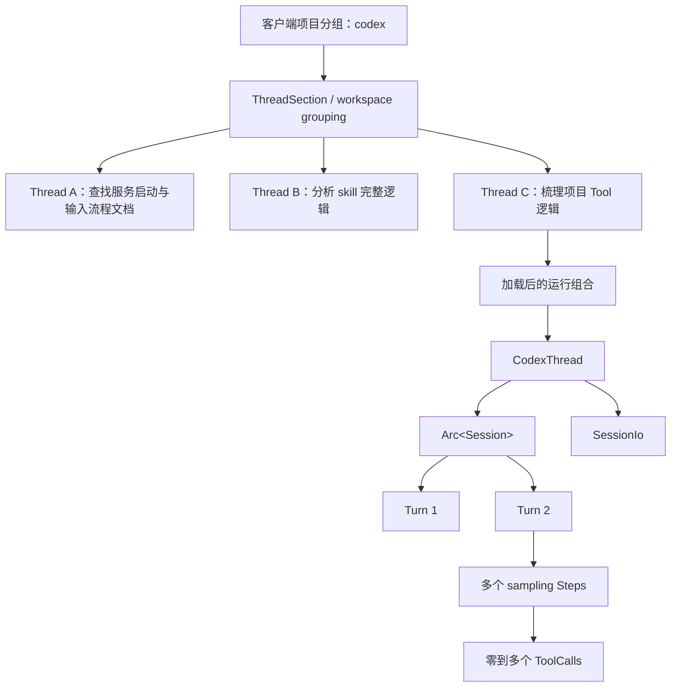

# Codex 客户端项目、任务与 Core Session 对应关系

本文专门解释 Codex 桌面客户端左侧栏中的“项目”和“任务/对话”，在 `codex-rs` 源码中分别对应什么。

这是理解其他执行流程前非常重要的一层：产品界面、app-server 协议、Core 运行时和持久化层会用不同类型观察同一个任务。如果把客户端项目误认为 `Session`，后续阅读 `ThreadManager`、`Session::new()`、`TurnContext` 时很容易把生命周期全部理解错。

配套文档：

- [Codex Agent 源码术语表](agent_glossary.md)
- [Agent 启动流程源码导读](agent_startup.md)
- [Agent 处理用户输入源码导读](agent_user_input_flow.md)

## 1. 从一个具体客户端界面开始

假设 Codex 客户端左侧栏显示：

```text
📁 codex
   查找服务启动与输入流程文档
   分析 skill 完整逻辑
   梳理 Codex Client 文档大纲
   梳理 Agent Prompt 核心模块
   梳理项目 Tool 逻辑
```

直觉上，我们可能把它叫作：

```text
一个项目 codex
└── 五个对话
```

映射到当前 app-server 和 Core 代码后，更准确的说法是：

```text
一个客户端项目/section/workspace 分组
└── 五个相互独立、可持久化的 root Threads
```

最重要的结论是：

> 文件夹 `codex` 不是一个 Core `Session`；文件夹下面的每个任务标题才对应一个独立 `Thread`。

## 2. 一张完整映射表

| 客户端看到的东西 | app-server / Core 概念 | 主要职责 |
| --- | --- | --- |
| 文件夹 `codex` | 最接近 `ThreadSection`，并结合 workspace/cwd | 组织多个任务，确定工作项目 |
| “梳理项目 Tool 逻辑” | `Thread` | 一段独立、可恢复、可持久化的任务 |
| 点击新建任务 | `thread/start` | 创建新的 ThreadId 和运行时 |
| 点击已有任务 | `thread/resume` / `thread/read` | 读取历史，必要时恢复运行时 |
| 活动任务的 Core 句柄 | `CodexThread` | submit、next_event、interrupt、shutdown |
| 活动任务的核心状态 | `Session` | 模型、历史、工具、权限、MCP、active turn |
| Core 双向通信 | `SessionIo` | Submission 输入、Event 输出 |
| 在任务中发一条新消息 | `Turn` | 围绕这次目标持续工作 |
| Turn 内请求一次模型 | sampling iteration / Step | 构造 prompt 并处理一次模型响应 |
| 模型要求执行命令或读文件 | `ToolCall` | Turn 某个 Step 中的一次工具调用 |
| 模型最终完成 | `TurnComplete` | 当前 Turn 结束，Thread 仍然存在 |

## 3. 全局层级关系



这里有三种完全不同的父子关系：

1. 客户端组织关系：项目/section 下显示哪些 Threads；
2. Thread 内容关系：一个 Thread 包含很多 Turns；
3. Agent 派生关系：root Thread 可以创建子 Agent Threads。

不要把这三种关系画成同一棵树。

## 4. 客户端“项目”对应什么

### 4.1 最接近的公开协议类型是 `ThreadSection`

app-server 定义了一个用户可见、独立持久化的分组类型：

```rust
pub struct ThreadSection {
    pub id: String,
    pub name: String,
}
```

源码位置：[`ThreadSection`](../app-server-protocol/src/protocol/v2/thread_data.rs#L174)。

它具有以下语义：

- `id` 是稳定的 UUIDv7；
- `name` 是客户端显示的名称；
- section 可以创建、列出、重命名和删除；
- Thread 可以被移动到某个 section；
- section 重命名后 id 保持不变。

因此，截图中带文件夹图标的 `codex`，在 app-server 协议层最接近一个名为 `codex` 的 `ThreadSection`。

### 4.2 `ThreadSection` 不等于代码目录

ThreadSection 只负责组织。代码实际在哪个目录工作，由 Thread 的这些信息决定：

- `cwd`；
- runtime workspace roots；
- environment selections；
- Git metadata；
- 项目配置和 `AGENTS.md` 查找结果。

换句话说：

```text
ThreadSection.name = "codex"
```

和：

```text
Thread.cwd = "/Users/.../github.com/openai/codex"
```

是两个不同字段。

桌面客户端可以根据仓库目录自动创建、选择或显示同名分组，但 Core 中没有下面这种父对象：

```rust
// 当前 Core 并不是这种结构。
struct Project {
    sessions: Vec<Session>,
}
```

### 4.3 为什么这里要说“最接近”

当前仓库包含 app-server、Core、TUI 和协议实现，但截图中的桌面前端展示逻辑不完全由这些 Rust 文件定义。

从当前协议可以确定：

- Thread 有 `section`；
- Thread 有独立 `cwd`；
- section 是用户可见分组；
- section 不是 Session。

但客户端究竟如何根据本地仓库、用户操作和 section 决定文件夹名称，属于客户端产品层逻辑。因此本文把“项目文件夹 → ThreadSection + workspace/cwd”称为精确到当前公开协议边界的映射，而不声称 UI 文件夹只由一个字段实现。

## 5. 文件夹下的每个标题对应 `Thread`

app-server v2 的 [`Thread`](../app-server-protocol/src/protocol/v2/thread_data.rs#L184) 是客户端任务的主要数据模型。

关键字段可以按下面方式理解：

| 字段 | 含义 |
| --- | --- |
| `id` | 这个任务独有的 ThreadId |
| `session_id` | 所属 root Agent 树的 SessionId |
| `name` | 用户可见任务名称 |
| `preview` | 首条消息或最佳内容预览 |
| `section` | 侧边栏所属分组 |
| `cwd` | 这个任务的工作目录 |
| `status` | 当前运行状态 |
| `turns` | 读取完整任务时携带的 Turns |
| `created_at` | 创建时间 |
| `updated_at` | 最近更新时间 |
| `path` | 可选的本地持久化路径 |
| `parent_thread_id` | 子 Agent Thread 的直接父 Thread |
| `forked_from_id` | fork 时的来源 Thread |

例如，下面五个标题分别是五个 Thread：

```text
ThreadId A → 查找服务启动与输入流程文档
ThreadId B → 分析 skill 完整逻辑
ThreadId C → 梳理 Codex Client 文档大纲
ThreadId D → 梳理 Agent Prompt 核心模块
ThreadId E → 梳理项目 Tool 逻辑
```

即使它们共享同一个 cwd 和 section，也仍然具有：

- 不同 ThreadId；
- 不同历史；
- 不同 token usage；
- 不同 active turn；
- 不同持久化 rollout；
- 加载后不同的 Core Session 对象。

## 6. 任务标题从哪里来

Thread 同时具有 `name` 和 `preview`：

- `name`：显式或生成的用户可见 thread 名称；
- `preview`：用于发现和列表显示的内容预览，通常和首条用户消息有关。

客户端显示“梳理项目 Tool 逻辑”时，优先可以使用 `Thread.name`；没有显式名称时，也可能使用 preview 或首条用户消息生成的标题。

标题只是展示属性。修改标题不会把 Thread 变成另一个 Thread，因为真正身份是稳定的 ThreadId。

## 7. Thread 被打开后，Core 创建什么

一个 Thread 只有在被加载时才需要完整运行时。Core 对外提供的活动句柄是：

```rust
pub struct CodexThread {
    session: Arc<Session>,
    io: SessionIo,
    // ...
}
```

源码位置：[`CodexThread`](../core/src/codex_thread.rs#L183)。

对应关系是：

```text
持久化/产品身份
Thread

加载后的 Core 运行组合
CodexThread
├── Arc<Session>
└── SessionIo
```

### 7.1 `CodexThread`

它是 app-server 或其他 Core 调用者使用的操作句柄，主要提供：

- `submit(op)`；
- `submit_user_input(...)`；
- `next_event()`；
- interrupt；
- shutdown；
- 读取配置快照和状态。

### 7.2 `Session`

它是这个活动 Thread 的核心运行对象，保存：

- conversation/context history；
- 当前模型与 provider；
- 工具和 ToolRouter；
- MCP manager/runtime；
- skills、plugins、hooks；
- 权限、审批与 sandbox；
- environment、cwd 和 workspace roots；
- `active_turn`；
- Core `InputQueue`；
- 持久化和 telemetry services。

源码位置：[`Session`](../core/src/session/session.rs#L31)。

### 7.3 `SessionIo`

它负责 Core 内外双向通信：

```text
外部 → tx_sub → Submission / Op → submission_loop
外部 ← rx_event ← Event / EventMsg ← Session
```

源码位置：[`SessionIo`](../core/src/session/mod.rs#L393)。

## 8. Thread 和 Session 是不是一一对应

需要区分“逻辑上”和“内存对象上”。

### 8.1 Thread 活动期间

对一个普通、已加载的 root Thread，可以近似理解为：

```text
一个活动 Thread
↕
一个 CodexThread
↕
一个 Arc<Session>
```

所以在阅读一次运行链时，可以把它们当作一组一一对应的对象。

### 8.2 客户端或 app-server 退出后

进程退出后：

- 内存中的 `Session` 被销毁；
- `CodexThread` 和 channel 消失；
- 持久化 Thread、rollout 和 metadata 继续存在。

重新打开任务时：

```text
thread/resume
→ 读取原 Thread 历史
→ 创建新的内存 Session 对象
→ 恢复相同的逻辑 Thread 身份
```

因此，不应说“一个持久化 Thread 从出生到永久只拥有同一个 Rust Session 对象”。更准确的表述是：

> 一个被加载的 Thread 在当前运行期由一个 Session 对象驱动；resume 可以重建新的内存对象，同时延续原来的 Thread 和逻辑 Session 身份。

### 8.3 未加载的 Thread

Thread 列表可以展示存储中的任务，即使它当前没有活动 Session。

协议字段 `can_accept_direct_input` 的注释也体现了这种区别：未加载的 stored thread 可能没有直接接收 turn 输入的能力，需要先 resume。

## 9. 在一个任务中继续聊天，对应 `Turn`

假设打开“梳理项目 Tool 逻辑”：

```text
Thread E：梳理项目 Tool 逻辑
│
├── Turn E1
│   用户：先介绍 Tool 总体架构
│   Agent：读取代码并回答
│
├── Turn E2
│   用户：继续讲 ToolRouter
│   Agent：分析 ToolRouter
│
└── Turn E3
    用户：再补充审批和沙箱
    Agent：分析审批路径
```

这些输入没有创建三个侧边栏任务，而是在同一个 Thread 中创建三个 Turns。

简单判断规则：

```text
点击“新建任务”
→ 新 Thread

在原任务输入框继续提问
→ 同一 Thread 中的新 Turn

Agent 工作期间追加 steer 输入
→ 通常仍进入当前 active Turn
```

## 10. 一个 Turn 为什么可能请求模型很多次

Turn 不是一次模型 HTTP 请求。

例如：

```text
Turn E2：继续讲 ToolRouter
│
├── Step 1：模型读取当前 prompt
│   └── 输出：调用 rg 搜索 ToolRouter
│
├── ToolCall 1：执行 rg
│   └── Tool output 写入 history
│
├── Step 2：模型读取搜索结果
│   └── 输出：读取 router.rs
│
├── ToolCall 2：读取文件
│   └── Tool output 写入 history
│
└── Step 3：模型生成最终解释
    └── Core 发出 TurnComplete
```

所以：

- Thread 包含很多 Turns；
- Turn 包含很多 sampling Steps；
- Step 可以产生 ToolCall；
- Tool output 会触发下一次 sampling；
- `TurnComplete` 只结束当前 Turn，不删除 Session 或 Thread。

## 11. 多个任务是否共享上下文

同一个 `codex` 项目分组下的 Thread A 和 Thread B，通常会共享：

- cwd 或同一 Git 仓库；
- workspace roots；
- 项目级 `AGENTS.md`；
- 项目 `.codex/config.toml`；
- 可用 skills/plugins/MCP 配置；
- 同一客户端账号和全局配置。

但默认不共享：

- conversation history；
- 用户在另一个 Thread 中说过的话；
- 另一个 Thread 的 tool outputs；
- active turn；
- compaction 结果；
- thread-local instructions 或动态设置；
- 未持久化的内存状态。

因此，不能假设“因为都在项目 codex 下，所以分析 skill 的任务自动知道 Tool 任务里得出的所有结论”。

如果需要跨任务共享知识，通常要通过以下显式载体之一完成：

- 把结论写入项目文件；
- 在新 Thread 中重新提供相关上下文；
- 使用适合的持久化 memory/知识机制；
- 从一个 Thread fork，使其继承指定历史；
- 让 root Agent 显式派生并协调子 Agent。

## 12. ThreadId 和 SessionId 的真实关系

这两个名字非常容易让人误以为是“对话 id”和“某次进程启动 id”。当前代码的语义更细。

### 12.1 普通 root Thread

Session 初始化时，普通 root Thread 默认执行等价于：

```rust
let session_id = SessionId::from(thread_id);
```

因此单 Agent 普通任务中通常有：

```text
ThreadId UUID == SessionId UUID
```

两者仍是不同 Rust newtype，因为概念作用域不同。

### 12.2 resume

恢复 Thread 时，Session 会尝试从持久化 `SessionMeta` 中读取原 SessionId。

所以 resume 并不是简单生成一个全新的 SessionId；它会延续持久化的逻辑会话身份。

### 12.3 子 Agent

一个 root Agent 派生子 Agent 后，关系变为：

```text
SessionId S：整个 Agent 树共享
│
├── Root ThreadId A
├── Sub-agent ThreadId B
├── Sub-agent ThreadId C
└── Sub-agent ThreadId D
```

每个子 Agent 有：

- 独立 ThreadId；
- 独立 CodexThread；
- 独立 Session 内存对象；
- 独立 history 和 active turn；
- `parent_thread_id` 指向父 Thread。

整棵 Agent 树共享：

- SessionId；
- `AgentControl` 范围；
- 多 Agent 执行配额和协调状态。

源码说明见 [`AgentControl`](../core/src/agent/control.rs#L97)。

因此，`SessionId` 更准确的解释是：

> 一棵 root Agent + descendant Agent Threads 共享的逻辑会话树标识。

而 Rust `Session` struct 是：

> 某一个具体活动 Thread 的内存运行对象。

## 13. 项目分组和子 Agent 树不是同一件事

项目分组关系可能是：

```text
ThreadSection: codex
├── Root Thread A
├── Root Thread B
└── Root Thread C
```

子 Agent 派生关系可能是：

```text
Root Thread C
├── Sub-agent Thread C1
└── Sub-agent Thread C2
```

两者的区别：

| 维度 | ThreadSection | Agent thread tree |
| --- | --- | --- |
| 目的 | 客户端组织和分类 | 多 Agent 执行与通信 |
| 关系字段 | `Thread.section` | `parent_thread_id` / SessionId |
| 是否共享历史 | 否 | 子 Agent 可按 spawn/fork 规则获得上下文 |
| 是否共享 SessionId | 没有此保证 | 是，同一 Agent 树共享 |
| 是否表示运行依赖 | 通常不表示 | 表示父子 Agent 控制关系 |

## 14. start、resume、read、fork 分别意味着什么

### 14.1 `thread/start`

创建一个新任务：

```text
新 ThreadId
→ 新持久化 Thread
→ 新 CodexThread
→ 新 Session
→ SessionConfigured
```

### 14.2 `thread/resume`

恢复已有任务：

```text
已有 ThreadId
→ 读取 rollout/history
→ 重建 CodexThread + Session
→ 恢复 SessionId 和上下文
```

### 14.3 `thread/read`

读取 Thread 的数据投影。它可以用于展示历史，不一定意味着创建一个可直接接收输入的活动 Session。

### 14.4 `thread/fork`

从已有 Thread 历史创建新的 Thread：

```text
原 ThreadId A
→ 新 ThreadId B
→ B.forked_from_id = A
```

fork 后两者是独立 Thread；后续输入不会自动双向同步。

## 15. 持久化状态和内存状态

### 15.1 持久化、可以跨进程存在

- ThreadId；
- SessionId 元数据；
- Thread 名称和 preview；
- section；
- cwd 和部分配置元数据；
- conversation rollout/history；
- Turns 和 items 的可重建记录；
- fork/parent 关系；
- 时间、usage 和归档状态。

### 15.2 主要属于当前内存运行期

- `Arc<Session>` 对象；
- `CodexThread` 句柄；
- `SessionIo` channels；
- submission loop task；
- 当前 `ActiveTurn`；
- 正在执行的 tool futures；
- cancellation tokens；
- 当前模型 streaming connection；
- 部分 prewarm 状态和短期缓存。

理解这个边界可以解释：为什么客户端重启后任务仍在，但正在运行的 Rust future 不会凭空继续执行。

## 16. 常见错误理解

### 误解一：“项目就是 Session”

错误。项目是客户端组织/workspace 概念；Session 是某个活动 Thread 的 Core 运行对象。

### 误解二：“项目下的五个任务是一个 Session 的五个 Turns”

错误。它们通常是五个独立 root Threads。每个 Thread 内部才有自己的 Turns。

### 误解三：“Session 就是左侧的一条对话记录”

不够准确。左侧持久化记录是 Thread；Session 是它被加载后使用的内存执行对象。

### 误解四：“一条用户消息就是一次模型请求”

错误。一条输入通常开启一个 Turn；Turn 可以包含多次模型请求和工具循环。

### 误解五：“同一个项目里的任务共享聊天历史”

错误。它们通常只共享仓库环境和配置，不自动共享 conversation history。

### 误解六：“SessionId 永远唯一对应一个 Rust Session 对象”

错误。resume 可以重建 Session 对象；多 Agent 场景下多个子 Thread 的 Session 对象还会共享同一 SessionId。

### 误解七：“子 Agent 就是当前 Turn 里的普通 ToolCall”

不准确。spawn agent 可能由工具机制触发，但创建结果是新的子 Thread、CodexThread 和 Session，并进入同一 Agent SessionId 树。

## 17. 用一句话判断当前代码属于哪一层

看到代码时可以依次提问：

1. 它是在组织左侧栏吗？看 `ThreadSection`、Thread list 和 cwd。
2. 它是在描述一个可恢复任务吗？看 app-server `Thread` 和 ThreadId。
3. 它是在操作活动 Agent 吗？看 `CodexThread`、`Session`、`SessionIo`。
4. 它是在接收一条操作吗？看 `Submission` 和 `Op`。
5. 它是在处理一轮用户目标吗？看 `TurnContext`、`ActiveTurn`、`RegularTask`。
6. 它是在做一次模型采样吗？看 `StepContext`、`Prompt`、`ResponseEvent`。
7. 它是在执行模型要求的动作吗？看 `ToolCall`、`ToolRouter` 和 `ToolCallRuntime`。
8. 它是在给客户端报告状态吗？看 `Event`、app-server notification 和 `AppEvent`。

## 18. 最终速记图

```text
客户端项目文件夹：codex
    ≈ ThreadSection + workspace/cwd 组织
    ≠ Core Session

客户端任务：梳理项目 Tool 逻辑
    = 一个持久化 Thread
    = 一个 ThreadId

任务被加载时
    = CodexThread
      + Arc<Session>
      + SessionIo

任务中发送一条消息
    = 一个 Turn

Turn 内模型调用工具并继续思考
    = 多个 sampling Steps
      + 零到多个 ToolCalls

普通 root task
    ThreadId UUID 通常等于 SessionId UUID

子 Agent
    独立 ThreadId + 独立 Session 对象
    但共享 root Agent 树的 SessionId
```

一句话总结：

> 客户端项目负责组织工作目录相关的多个任务；每个任务是独立 Thread；Thread 被加载后由 CodexThread、Session 和 SessionIo 驱动；Thread 中的每次用户目标形成 Turn，Turn 再包含多次模型采样和工具调用。
