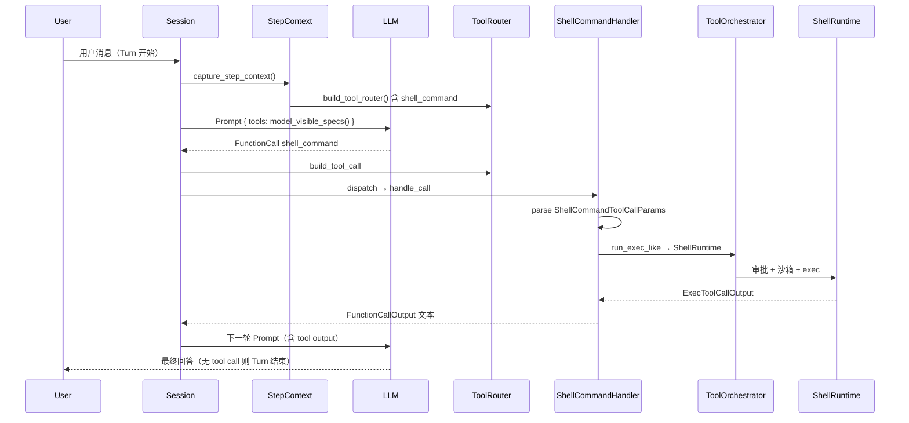

# `shell_command` Tool：从加载到执行的源码走读

本文以 `shell_command` 为例，按 **源码路径** 说明 Codex 里一个内置 Function Tool 的完整生命周期：

1. **何时、如何被加载进 Registry**
2. **哪些 spec 会发给模型**
3. **模型调用后如何解析参数、执行、返回结果**

涉及的主要 crate / 模块：`codex-rs/core`（`tools/`、`session/`）、`codex-rs/protocol`、`codex-rs/tools`。

---

## 0. 一句话定位

`shell_command` 是 **模型可见的一次性 shell 执行工具**：模型传入 JSON 参数（主要是 `command` 字符串），Codex 用用户默认 shell（`bash -lc "..."` 等）在沙箱里跑完，把 stdout/stderr 合并输出格式化成文本，作为 `FunctionCallOutput` 送回模型。

它与 `exec_command` / `write_stdin`（Unified Exec，PTY + 会话）同属 **shell 工具族**，共享 `run_exec_like` 和 `ShellRuntime`，但 **暴露策略、参数名、超时语义** 不同。

---

## 1. 架构分层（先建立地图）

```text
┌─────────────────────────────────────────────────────────────────┐
│ 模型请求层：Prompt.tools = router.model_visible_specs()          │
│   ToolSpec（JSON Schema）来自 ShellCommandHandler::spec()         │
└────────────────────────────┬────────────────────────────────────┘
                             │ LLM 返回 FunctionCall
                             ▼
┌─────────────────────────────────────────────────────────────────┐
│ 路由层：ToolRouter::build_tool_call → ToolCall                  │
│   ToolCallRuntime::handle_tool_call → ToolRegistry::dispatch    │
└────────────────────────────┬────────────────────────────────────┘
                             │
                             ▼
┌─────────────────────────────────────────────────────────────────┐
│ Handler：ShellCommandHandler::handle_call                       │
│   解析 ShellCommandToolCallParams → ExecParams                  │
│   run_exec_like → ToolOrchestrator + ShellRuntime               │
└────────────────────────────┬────────────────────────────────────┘
                             │
                             ▼
┌─────────────────────────────────────────────────────────────────┐
│ 返回：FunctionToolOutput → ResponseInputItem::FunctionCallOutput │
└─────────────────────────────────────────────────────────────────┘
```

**关键设计**：`ToolSpec`（模型面）和 `ShellCommandHandler`（执行面）由同一个 struct 实现 `ToolExecutor` + `CoreToolRuntime`，通过 `ToolName::plain("shell_command")` 绑定。

---

## 2. 加载时机：每个 Step 构建一次 ToolRouter

Tool **不是进程启动时全局注册一次**，而是 **每个 Step 开始前** 根据当前 `TurnContext`、环境、feature、模型配置 **重新规划并构建 `ToolRouter`**。

### 2.1 入口：`capture_step_context`

```rust
// codex-rs/core/src/session/mod.rs
pub(crate) async fn capture_step_context(...) -> CodexResult<Arc<StepContext>> {
    // 1. 刷新环境 readiness
    // 2. 准备 MCP、extension data、capability roots
    let tool_router = turn::built_tools(
        self.as_ref(),
        turn_context.as_ref(),
        &environments,
        &mcp,
        &extension_data,
        prepared_recommendations,
    ).await??;

    Ok(Arc::new(StepContext {
        turn: turn_context,
        environments,
        mcp,
        tool_router,   // ← 本 Step 的工具路由表
        ...
    }))
}
```

`StepContext` 定义见 `codex-rs/core/src/session/step_context.rs`：`tool_router: Arc<ToolRouter>` 与 `turn`、`environments` 一起固定在本 Step 内。

`run_turn` → `run_sampling_request` 使用 **同一个** `step_context.tool_router`，因此 **同一次 Step 里多次 LLM 往返** 看到的工具列表一致。

### 2.2 `built_tools` → `build_tool_router`

```rust
// codex-rs/core/src/session/turn.rs
pub(crate) async fn built_tools(...) -> CodexResult<Arc<ToolRouter>> {
    // 可选：加载 tool_suggest 候选（与 shell_command 无关）
    Ok(Arc::new(build_tool_router(
        sess, turn_context, environments, mcp,
        apps_enabled, step_store, tool_suggest_candidates.as_ref(),
    )?))
}
```

`build_tool_router`（`codex-rs/core/src/tools/spec_plan.rs`）流程：

```text
ToolRegistry::default()
  → add_core_tool_sources()      // 内置工具（含 shell_command）
  → append MCP / extension / dynamic tools
  → finalize_tool_router()       // code mode、tool_search、可见 spec 过滤
  → ToolRouter::from_parts(registry, model_visible_specs)
```

### 2.3 `add_shell_tools`：shell_command 是否注册

```rust
// codex-rs/core/src/tools/spec_plan.rs
fn add_shell_tools(context, registry) {
    if !environment_mode.has_environment() {
        return;  // 无可用执行环境 → 不注册任何 shell 工具
    }

    let supports_shell_command =
        context.environments.single_local_environment().is_some();

    match shell_type_for_model_and_features(&turn_context.model_info, features) {
        ConfigShellToolType::UnifiedExec => {
            registry.add(ExecCommandHandler::new(...));
            registry.add(WriteStdinHandler);
            if supports_shell_command {
                // shell_command 仍注册，但对模型 Hidden（兼容内部/Code Mode）
                registry.add_with_exposure(
                    ShellCommandHandler::new(shell_command_options),
                    ToolExposure::Hidden,
                );
            }
        }
        ConfigShellToolType::Disabled => {}
        ConfigShellToolType::Default
        | ConfigShellToolType::Local
        | ConfigShellToolType::ShellCommand => {
            if supports_shell_command {
                registry.add(ShellCommandHandler::new(shell_command_options));
            }
        }
    }
}
```

**注册条件小结**：

| 条件 | 不满足时 |
|------|----------|
| `environment_mode.has_environment()` | 不注册 |
| `single_local_environment()` 存在 | 不注册 `shell_command`（远程-only 环境走 `exec_command`） |
| `Feature::ShellTool` 开启 | `shell_type` 变为 `Disabled`（见下） |
| 非 Guardian reviewer 常规路径 | reviewer 只拿 `exec_command` 等 |

`add_shell_tools` 由 `add_core_tool_sources` 调用；Guardian reviewer 走单独分支，**不包含** `shell_command`。

### 2.4 Feature 与模型配置：`shell_type_for_model_and_features`

```rust
// codex-rs/tools/src/tool_config.rs
pub fn shell_type_for_model_and_features(model_info, features) -> ConfigShellToolType {
  if !features.enabled(Feature::ShellTool) {
      return ConfigShellToolType::Disabled;
  }
  // UnifiedExec feature + PTY 支持 → UnifiedExec
  // 否则 → ShellCommand（或模型指定的 shell_type）
}
```

`ShellCommandHandlerOptions` 在注册时注入：

```rust
ShellCommandHandlerOptions {
    backend_config: shell_command_backend_for_features(features), // Classic | ZshFork
    allow_login_shell: any_environment_allows_login_shell(...),
    exec_permission_approvals_enabled: features.enabled(Feature::ExecPermissionApprovals),
}
```

### 2.5 写入 Registry：`ToolRegistry::add`

```rust
// codex-rs/core/src/tools/registry.rs
pub(crate) fn add<T: CoreToolRuntime + 'static>(&mut self, handler: T) {
    self.register_trusted(Arc::new(handler));
}

fn register_trusted_with_exposure(runtime, exposure) {
    let tool_name = runtime.tool_name().with_default_namespace();
    // IndexMap<ToolName, RegisteredTool>，重复注册会 error_or_panic
    self.tools.insert(tool_name, RegisteredTool { runtime, exposure });
}
```

`ShellCommandHandler` 默认 `exposure()` 为 `ToolExposure::Direct`（`ToolExecutor` trait 默认实现）。Unified Exec 场景下显式设为 `Hidden`。

### 2.6 哪些 spec 发给模型：`build_model_visible_specs`

```rust
// codex-rs/core/src/tools/spec_plan.rs
fn build_model_visible_specs(registry, ...) -> Vec<ToolSpec> {
    for tool in registry.entries() {
        if !tool.exposure.is_direct() { continue; }  // Hidden/Deferred 跳过
        specs.push(tool.runtime.spec());
    }
    merge_into_namespaces(specs)
}
```

最终进入 LLM 请求：

```rust
// codex-rs/core/src/session/turn.rs
pub(crate) fn build_prompt(input, router, turn_context, ...) -> Prompt {
    Prompt {
        input,
        tools: router.model_visible_specs(),  // ← shell_command 的 ToolSpec 在这里
        parallel_tool_calls: turn_context.model_info.supports_parallel_tool_calls,
        ...
    }
}
```

**因此「加载」= 注册 Runtime + 按 exposure 筛选出本 Step 的 `model_visible_specs`，而不是动态 dlopen。**

---

## 3. Tool Spec：模型看到的参数契约

### 3.1 生成函数

`ShellCommandHandler::spec()` 委托 `create_shell_command_tool`：

```rust
// codex-rs/core/src/tools/handlers/shell/shell_command.rs
fn spec(&self) -> ToolSpec {
    create_shell_command_tool(CommandToolOptions {
        allow_login_shell: self.options.allow_login_shell,
        exec_permission_approvals_enabled: self.options.exec_permission_approvals_enabled,
    })
}
```

定义在 `codex-rs/core/src/tools/handlers/shell_spec.rs`：

| JSON 字段 | Schema 类型 | 必填 | 说明 |
|-----------|-------------|------|------|
| `command` | string | ✅ | 交给 shell 解释的整段命令 |
| `workdir` | string | ❌ | 工作目录，默认 turn cwd |
| `timeout_ms` | number | ❌ | 默认 10000ms |
| `login` | boolean | ❌ | login shell；仅 `allow_login_shell` 时出现在 schema |
| `sandbox_permissions` | enum | ❌ | `use_default` / `require_escalated` / … |
| `justification` | string | ❌ | 提权审批文案 |
| `prefix_rule` | string[] | ❌ | exec policy 前缀规则 |
| `additional_permissions` | object | ❌ | feature `exec_permission_approvals` 时 |

`output_schema: None` —— 返回是纯文本 `FunctionCallOutput`，无结构化 JSON schema。

### 3.2 Rust 反序列化结构体

模型返回的 `arguments` 字符串对应：

```rust
// codex-rs/protocol/src/models.rs
pub struct ShellCommandToolCallParams {
    pub command: String,
    pub workdir: Option<String>,
    pub login: Option<bool>,
    #[serde(alias = "timeout")]
    pub timeout_ms: Option<u64>,
    pub sandbox_permissions: Option<SandboxPermissions>,
    pub prefix_rule: Option<Vec<String>>,
    pub additional_permissions: Option<AdditionalPermissionProfile>,
    pub justification: Option<String>,
}
```

Schema 与 struct **字段名对齐**；Runtime 必须自己校验，不能信任模型 JSON 一定合法。

---

## 4. 模型调用 → 内部 `ToolCall`

### 4.1 流式响应结束：`handle_output_item_done`

```rust
// codex-rs/core/src/stream_events_utils.rs
match ToolRouter::build_tool_call(item.clone()) {
    Ok(Some(call)) => {
        record_completed_response_item(..., &item).await;
        let tool_future = ctx.tool_runtime.handle_tool_call(call, cancellation_token);
        output.needs_follow_up = true;  // 需要下一轮 sampling 把 tool output 送回模型
        output.tool_future = Some(tool_future);
    }
    Ok(None) => { /* 普通 assistant 消息，Turn 可能结束 */ }
}
```

### 4.2 `build_tool_call` 解析 FunctionCall

```rust
// codex-rs/core/src/tools/router.rs
ResponseItem::FunctionCall { name, namespace, arguments, call_id, .. } => {
    let tool_name = ToolName::new(namespace, name).with_default_namespace();
    Ok(Some(ToolCall {
        tool_name,           // plain: "shell_command"
        call_id,
        payload: ToolPayload::Function { arguments },
        ...
    }))
}
```

### 4.3 并行调度：`ToolCallRuntime`

```rust
// codex-rs/core/src/tools/parallel.rs
match future.await {
    Ok(response) => Ok(response.into_response()),
    Err(FunctionCallError::Fatal(message)) => Err(CodexErr::Fatal(message)),
    Err(other) => Ok(Self::failure_response(error_call, other)),  // RespondToModel → 仍回模型
}
```

`shell_command` 声明 `supports_parallel_tool_calls() -> true`，可与其他 tool 并行；非并行 tool 会拿写锁串行。

### 4.4 Registry 分发

```rust
// codex-rs/core/src/tools/registry.rs
dispatch_any_with_terminal_outcome(invocation) {
    let tool = self.tool(&tool_name)?;           // 查 IndexMap
    run_pre_tool_use_hooks(...);                 // shell_command → bash hook
    handle_any_tool(tool, invocation).await;     // → ShellCommandHandler::handle
    run_post_tool_use_hooks(...);
}
```

---

## 5. Handler 实现：`ShellCommandHandler`

文件：`codex-rs/core/src/tools/handlers/shell/shell_command.rs`  
模块树：`handlers/shell.rs` → `handlers/shell/shell_command.rs`

### 5.1 `handle_call` 主流程

```rust
async fn handle_call(&self, invocation: ToolInvocation) -> Result<Box<dyn ToolOutput>, ...> {
    let ToolPayload::Function { arguments } = payload else { ... };

    // 1) 必须有 primary 执行环境
    let turn_environment = step_context.environments.primary()?;

    // 2) 解析 workdir → 绝对路径 cwd
    let environment_cwd = turn_environment.cwd().to_abs_path()?;
    let cwd = resolve_workdir_base_path(&arguments, &environment_cwd)?;

    // 3) 反序列化参数（相对路径在 cwd 下解析）
    let params: ShellCommandToolCallParams =
        parse_arguments_with_base_path(&arguments, &cwd)?;

    // 4) 隐式 skill 触发（若 command 匹配 skill）
    maybe_emit_implicit_skill_invocation(..., &params.command, &cwd).await;

    // 5) 构造 ExecParams
    let exec_params = Self::to_exec_params(&params, session, turn, &turn_environment, cwd)?;

    // 6) 共用执行管线
    run_exec_like(RunExecLikeArgs {
        tool_name,
        exec_params,
        hook_command: params.command,
        shell_runtime_backend: self.shell_runtime_backend(),  // Classic | ZshFork
        ...
    }).await.map(boxed_tool_output)
}
```

### 5.2 `to_exec_params`：参数 → 进程启动信息

```rust
pub fn to_exec_params(...) -> Result<ExecParams, ...> {
    let shell = turn_environment.shell.as_ref().unwrap_or(session.user_shell());
    let use_login_shell = resolve_use_login_shell(params.login, allow_login_shell)?;
    let command = shell.derive_exec_args(&params.command, use_login_shell);
    // Unix: ["/bin/zsh", "-lc", "git status && npm test"]

    let env = create_env(shell_environment_policy, Some(thread_id));
    inject_permission_profile_env(&mut env, active_permission_profile);

    Ok(ExecParams {
        command,
        cwd,
        expiration: params.timeout_ms.into(),  // None → DefaultTimeout 10s
        capture_policy: ExecCapturePolicy::ShellTool,
        env,
        sandbox_permissions: resolve_sandbox_permissions(...)?,
        ...
    })
}
```

`derive_exec_args`（`codex-rs/core/src/shell.rs`）把 **整段 `command` 作为 shell 的一个 `-c` 参数**，因此 `&&`、`|`、`;`、重定向等 **由 shell 解释**，Codex 不做 argv 拆分。

### 5.3 Backend：Classic vs ZshFork

```rust
enum ShellCommandBackend {
    Classic,   // ShellRuntimeBackend::ShellCommandClassic
    ZshFork,   // ShellRuntimeBackend::ShellCommandZshFork（execve 拦截 / 细粒度审批）
}
```

由 `shell_command_backend_for_features` 决定：同时开启 `ShellTool` + `ShellZshFork` 时用 ZshFork。

---

## 6. 共用执行管线：`run_exec_like`

文件：`codex-rs/core/src/tools/handlers/shell.rs`（`shell_command` 与部分 legacy 路径共用）

```text
run_exec_like
  ├─ apply_granted_turn_permissions（本 turn 已批准的额外权限）
  ├─ normalize_and_validate_additional_permissions
  ├─ intercept_apply_patch（若命令实为 apply_patch 快捷方式则短路）
  ├─ ToolEmitter::shell(...).begin()     // UI：CommandExecution started
  ├─ exec_policy.create_exec_approval_requirement_for_command()
  ├─ 构造 ShellRequest
  ├─ ToolOrchestrator::run(ShellRuntime, ...)
  └─ ToolEmitter::finish() → FunctionToolOutput
```

### 6.1 `ToolOrchestrator`（审批 + 沙箱 + 重试）

文件：`codex-rs/core/src/tools/orchestrator.rs`

```text
approval（用户/策略）
  → select sandbox（Seatbelt / Landlock / Windows sandbox / 无沙箱）
  → ShellRuntime::run(req, sandbox_attempt)
  → 若沙箱拒绝且可升级 → 换策略重试（审批结果缓存，不重复弹窗）
```

### 6.2 `ShellRuntime`

文件：`codex-rs/core/src/tools/runtimes/shell.rs`

实现 `ToolRuntime<ShellRequest, ExecToolCallOutput>`：

- `Approvable`：把 `ApprovalAction::Shell { command, cwd, ... }` 交给审批 UI
- `Sandboxable`：`escalate_on_failure: true`
- `run`：经 `execute_env` 起子进程，流式 stdout/stderr 到 TUI 事件，超时/取消由 `ExecExpiration` 控制

原始结果类型：

```rust
// codex-rs/protocol/src/exec_output.rs
pub struct ExecToolCallOutput {
    pub exit_code: i32,
    pub aggregated_output: StreamOutput<String>,
    pub duration: Duration,
    pub timed_out: bool,
    ...
}
```

---

## 7. 返回值：如何回到模型

### 7.1 格式化

`ToolEmitter::finish` 成功时调用 `format_exec_output_for_model`：

```text
Exit code: 1
Wall time: 0.3 seconds
Total output lines: 120    // 仅截断时出现
Output:
<stdout+stderr 合并文本>
```

超时前缀：`command timed out after N milliseconds\n...`

截断策略来自 `turn_context.model_info.truncation_policy`。

### 7.2 `FunctionToolOutput` → 协议项

```rust
// run_exec_like 末尾
Ok(FunctionToolOutput {
    body: vec![FunctionCallOutputContentItem::InputText { text: content }],
    success: Some(true),
    post_tool_use_response: Some(JsonValue::String(...)),  // hook 用，格式更短
})
```

`FunctionToolOutput` 实现 `ToolOutput::to_response_item` → `ResponseInputItem::FunctionCallOutput`。

### 7.3 非零退出码

`ToolEmitter::finish` 在 `exit_code != 0` 时返回 `Err(FunctionCallError::RespondToModel(content))`，`parallel.rs` 将其转为 **`success: false` 的 FunctionCallOutput**，正文仍是上述格式化文本（模型能看到失败输出）。

### 7.4 Hooks

`ShellCommandHandler` 实现 `CoreToolRuntime`：

- `pre_tool_use_payload` → `HookToolName::bash()` + `{ "command": "..." }`
- `post_tool_use_payload` → 同上 + tool 输出
- `with_updated_hook_input` → hook 可改写 `command` 字段后重跑

---

## 8. 端到端时序（一个 Step 内）



---

## 9. 与 `exec_command` 的关系

| 维度 | `shell_command` | `exec_command` |
|------|-----------------|----------------|
| 注册条件 | `ConfigShellToolType::ShellCommand` 等 | `ConfigShellToolType::UnifiedExec` |
| 模型可见性 | Direct（ShellCommand 模式） | Direct；此时 shell_command 为 **Hidden** |
| 参数 | `command`, `timeout_ms` | `cmd`, `yield_time_ms`, `tty`, `session_id`… |
| 执行 | 一次性等进程结束 | PTY，可返回 `session_id` + `write_stdin` |
| 共用代码 | `run_exec_like`, `ShellRuntime`, `ToolOrchestrator` | 同左（不同 backend 选项） |

Enterprise 部署常通过 feature 在两者间切换，而不改 Handler 代码。

---

## 10. 源码索引（按阅读顺序）

| 顺序 | 路径 | 内容 |
|------|------|------|
| 1 | `core/src/session/mod.rs` | `capture_step_context` |
| 2 | `core/src/session/turn.rs` | `built_tools`, `build_prompt`, `run_sampling_request` |
| 3 | `core/src/tools/spec_plan.rs` | `build_tool_router`, `add_shell_tools`, `build_model_visible_specs` |
| 4 | `tools/src/tool_config.rs` | `shell_type_for_model_and_features`, backend 选择 |
| 5 | `core/src/tools/registry.rs` | `ToolRegistry::add`, `dispatch_any_with_terminal_outcome` |
| 6 | `core/src/tools/handlers/shell_spec.rs` | `create_shell_command_tool` |
| 7 | `protocol/src/models.rs` | `ShellCommandToolCallParams` |
| 8 | `core/src/tools/handlers/shell/shell_command.rs` | `ShellCommandHandler` |
| 9 | `core/src/tools/handlers/shell.rs` | `run_exec_like` |
| 10 | `core/src/tools/orchestrator.rs` | 审批 + 沙箱编排 |
| 11 | `core/src/tools/runtimes/shell.rs` | `ShellRuntime` |
| 12 | `core/src/shell.rs` | `derive_exec_args` |
| 13 | `core/src/stream_events_utils.rs` | `handle_output_item_done` |
| 14 | `core/src/tools/parallel.rs` | `ToolCallRuntime`, 错误转 output |
| 15 | `core/src/tools/events.rs` | `ToolEmitter::finish` |
| 16 | `core/tests/suite/shell_command.rs` | 集成测试 |

测试里可见 Unified Exec 下 `shell_command` 为 Hidden 的断言：`core/src/tools/spec_plan_tests.rs` → `shell_family_registers_visible_unified_exec_and_hidden_legacy_shell`。

---

## 11. 自测问题（读完可核对理解）

1. 远程-only 环境（无 `single_local_environment`）时，模型还能直接调 `shell_command` 吗？
2. 开启 `Feature::UnifiedExec` 后，Registry 里还有 `shell_command` 吗？模型首屏 tool list 里有吗？
3. `command: "a && b | c"` 在代码里变成几个 `exec` 参数？谁解析 `&&`？
4. 命令 exit code 为 2 时，模型收到的 `success` 字段是 true 还是 false？正文里是否仍有 Output？
5. `workdir` 在 JSON 解析的哪一步生效？相对路径相对谁解析？

<details>
<summary>参考答案</summary>

1. 不能注册（`add_shell_tools` 提前 return / 不 add）。
2. Registry 里有（Hidden）；首屏没有，可见的是 `exec_command` + `write_stdin`。
3. 三个 argv：`shell_path`, `-lc`/`-c`, 整段字符串`; shell 解析运算符。
4. `success: false`；正文仍是带 Exit code / Output 的格式化文本。
5. 先 `resolve_workdir_base_path` 得 cwd，再 `parse_arguments_with_base_path` 在 `AbsolutePathBufGuard` 下反序列化。

</details>
