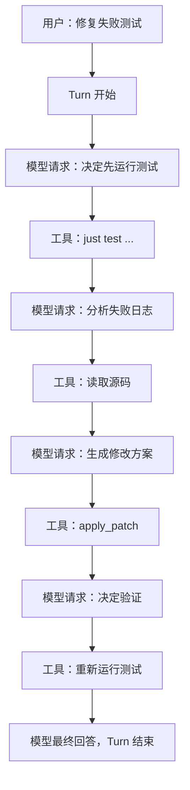

# 00.5：先认识术语与贯穿案例

这一页不讲源码。先用一个具体任务，把后面反复出现的词变成可以想象的东西。

## 贯穿案例

用户向 Codex 提出：

> 请修复 `codex-core` 中失败的测试 `tool_result_is_recorded`，并解释问题原因。

Codex 可能需要：

1. 搜索测试位置；
2. 阅读测试和实现；
3. 运行测试获取错误；
4. 修改源码；
5. 再次运行测试；
6. 向用户解释结果。

这看起来像一个任务，但内部包含多次模型思考和多次工具执行。

## 最常见的术语

### LLM / 模型

负责理解语言和决定下一步。例如它看到测试失败后，判断应该继续读取 `ToolRouter`，还是直接修改断言。

模型本身不能直接读取你的磁盘。它只能输出文字，或者输出结构化的“请调用某个工具”。

### Tool / 工具

Codex runtime 提供的可执行能力，例如搜索文件、运行命令、应用 patch。模型说“请运行测试”并不代表测试已经运行；runtime 接受 tool call、检查权限并执行后，结果才真实发生。

### Thread / 对话任务

你在 Codex UI 里看到、以后还能恢复的整段任务。今天退出应用，明天重新打开这个修复任务，恢复的是同一个 thread。

### Session / 当前运行实例

Thread 被当前 Codex 进程加载后，内存里需要 channels、HTTP client、工具连接和取消令牌。这套临时运行对象就是 session。关闭应用后 session 消失，但 thread 的持久记录可以保留。

可以类比：thread 是保存的游戏存档，session 是这次把存档加载进内存后的游戏实例。

### Turn / 一次用户任务

你发送“请修复测试”开始一个 turn。Codex 搜索、运行测试、修改和验证，都可以发生在同一个 turn 中。最后 Codex给出答案，这个 turn 才结束。

如果你随后说“再补一个回归测试”，这是下一个 turn，但仍属于同一 thread。

### Step / 一次模型决策使用的快照

模型第一次决定“先运行测试”时，会看到当前目录、权限和工具列表。测试结果回来后，模型要再次决定“接下来修改哪里”，这时可能重新取得一份最新快照。

Step 可以理解为模型每次睁眼观察世界时拍的一张照片。照片里必须保证：模型看到的工具和 runtime 真能执行的工具是同一套。

### Sampling request / 一次模型请求

Codex 把 instructions、对话历史、环境说明和工具定义发送给模型的一次网络请求。一次 turn 通常有多次 sampling request：

```text
模型请求 1 → 模型要求运行测试
工具执行测试 → 返回失败日志
模型请求 2 → 模型要求读取某个文件
工具读取文件 → 返回源码
模型请求 3 → 模型要求应用 patch
……
模型请求 N → 模型给出最终解释
```

### History / 模型上下文

模型下一次思考时需要知道之前发生了什么：用户要求、已经调用的工具、工具结果和 Codex 之前说过的话。Codex 会从内部 history 中整理出模型实际能看到的输入。

### Rollout / 持久执行记录

为了以后恢复 thread，Codex 还要把关键过程写入持久记录。它和模型 history 有联系，但用途不同：history 服务于下一次推理，rollout 服务于保存和重建。

## 整个案例的一张图



## 先记住三句话

1. 一个用户 turn 可以包含很多次模型请求和工具调用。
2. 模型只建议动作，runtime 才真正执行动作。
3. Thread 是可恢复的长期任务，Session 是当前进程中的临时运行实例。

后面遇到不熟悉的类型名，先回到这三句话，再看它属于哪一层。

## 本章词汇表

| 词语 | 直译 | 在本篇中的意思 |
|---|---|---|
| `run_turn` | 运行一轮 | 执行一个用户目标对应 Turn 的主循环 |
| `sampling` | 采样 | 让模型根据当前输入生成下一步输出 |
| `runtime` | 运行时 | 在模型之外真正执行工具、维护状态的程序部分 |
| `call_id` | 调用编号 | 把一次工具请求和它的执行结果对应起来 |
| `final answer` | 最终回答 | 没有更多工具工作后，模型给用户的完成说明 |

更多高频词可以随时查阅[术语总表](glossary.md)。
