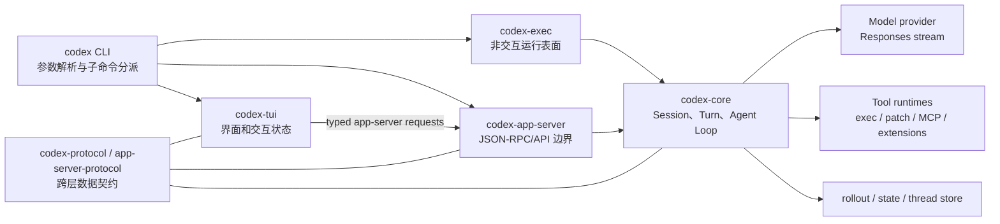

# 01：当前系统地图

## 先说人话：为什么需要这么多层

假设用户说“请修复一个失败测试”。界面负责接收这句话，但界面本身不应该知道怎样调用模型、运行命令或保存历史。因此 Codex 把工作分成几层：

```text
CLI/TUI：接待员，接收用户操作并展示结果
App-server：统一业务窗口，把客户端请求变成内部命令
Core：项目经理，决定一轮任务怎样运行
Model client：与 LLM 通信
Tool runtime：真正读文件、运行命令、修改代码
Store：保存任务，以便以后恢复
```

理解系统地图的重点不是背 crate 名，而是知道出了问题先查哪一层。例如“按钮没反应”先查 TUI/app-server；“工具结果回来后模型不继续”则查 core agent loop。

## 1. 先纠正一个旧心智模型

在当前基线中，交互式 TUI 的主路径不是“TUI 直接持有 core session”。`codex-tui` 会启动或连接 app-server：目标可能是进程内 app-server、本地 daemon，或显式远端 endpoint。TUI 通过 app-server protocol 发送 `thread/start`、`turn/start` 等请求，并消费 server notifications。

`codex exec` 则是另一个运行表面；CLI 顶层负责分派，而不是所有模式都经过 TUI。

## 2. 主要边界



这张图表达依赖方向，不表示所有 crate 的 Cargo 依赖。比如认证、配置、遥测、环境管理还有独立 crate，第一次学习可以先作为横切能力处理。

## 3. 从进程入口看运行表面

入口位于 `codex-rs/cli/src/main.rs`：

- `main()` 先进入 `arg0_dispatch_or_else(...)`，支持同一二进制的特殊 argv0 分派；
- `cli_main()` 解析 `MultitoolCli`；
- 没有子命令时调用 `run_interactive_tui()`；
- `exec` 和 `review` 进入 `codex_exec::run_main()`；
- `app-server`、`mcp-server`、plugin 等走各自分支。

学习重点不是记住所有子命令，而是认识到：**CLI 是运行表面的路由器，core 才是共享 agent 业务逻辑。**

## 4. TUI 的 app-server 边界

`codex-rs/tui/src/lib.rs` 的关键路径：

1. `run_main()` 解析配置、cwd、远端/本地目标；
2. `app_server_target_for_launch()` 决定连接方式；
3. `run_ratatui_app()` 初始化终端；
4. `start_app_server()` 建立 app-server session；
5. TUI 后续通过 request handle 发送 typed requests，并路由 notifications。

这层边界带来三个学习上的好处：

- UI 不需要理解 core 的所有内部类型；
- 本地嵌入与远端连接可以共享较多 UI 逻辑；
- app-server v2 API 成为需要认真维护的外部集成面。

## 5. Core 内部的主干

| 区域 | 主要职责 | 首选入口 |
|---|---|---|
| `core/src/thread_manager.rs` | 创建、恢复、fork、跟踪 thread | `ThreadManager` |
| `core/src/session/` | session 状态、submission、turn 生命周期 | `Session`, `SessionIo` |
| `core/src/session/handlers.rs` | 消费 `Op` 并启动/控制任务 | `submission_loop()` |
| `core/src/session/turn.rs` | agent loop、采样、流事件和 follow-up | `run_turn()` |
| `core/src/client.rs` | turn-scoped 模型客户端、传输与重试 | `ModelClientSession` |
| `core/src/tools/` | tool spec、注册、路由和输出 | `ToolRouter` |
| `core/src/context_manager/` | history 规范化与 prompt 视图 | `ContextManager` |

## 6. 三条不要跨错的边界

1. **UI 事件不是模型事件。** app-server 会把 core 的 `EventMsg` 转成 v2 notifications，TUI 再投影为界面状态。
2. **模型输出不是已执行动作。** function/custom tool call 仍需 runtime 路由、审批和 sandbox。
3. **持久化记录不是 prompt。** 恢复时需要重建可用 history，再由 `for_prompt()` 规范化。

## 用贯穿案例走一遍

用户在 TUI 输入“修复失败测试”后：

1. TUI 发 `turn/start`，好比前台创建一张工单；
2. app-server 找到对应 thread，把工单转成 `Op::UserInput`；
3. core 创建 turn，并询问模型下一步；
4. 模型要求运行测试，tool runtime 在受控环境执行；
5. core 把日志交回模型，模型继续决定读取和修改；
6. core 发出 item/turn 事件，app-server 转成通知；
7. TUI 把通知显示成命令输出、文件修改和最终回答。

## 理解检查

- TUI 能否直接决定某个 shell 命令应该获批？为什么？
- app-server 返回 `turn/start` 成功后，是否代表模型已经完成任务？
- 如果 `codex exec` 不使用交互 TUI，哪些层仍然需要存在？

## 本章词汇表

| 词语 | 直译 | 在系统地图中的意思 |
|---|---|---|
| Surface | 表面 | 用户进入 Codex 的产品入口，如 TUI、exec、app-server |
| Daemon | 守护进程 | 后台长期运行并接受客户端连接的服务进程 |
| Embedded | 嵌入式 | 服务与客户端位于同一进程或由其内部启动 |
| Boundary | 边界 | 两层之间交换数据和控制权的位置 |
| Typed API | 有类型的接口 | 请求和响应字段由明确类型约束的 API |
| Projection | 投影 | 将 Core event 转换为客户端可理解的通知 |

完整解释见[术语总表](glossary.md)。

## 源码检查点

- 在 `cli/src/main.rs::cli_main()` 中找出 TUI、exec、app-server 三个分支。
- 在 `tui/src/lib.rs::run_ratatui_app()` 中定位 `start_app_server()`。
- 在 `app-server/src/bespoke_event_handling.rs` 中观察 `EventMsg::TurnStarted` 如何转为 notification。
