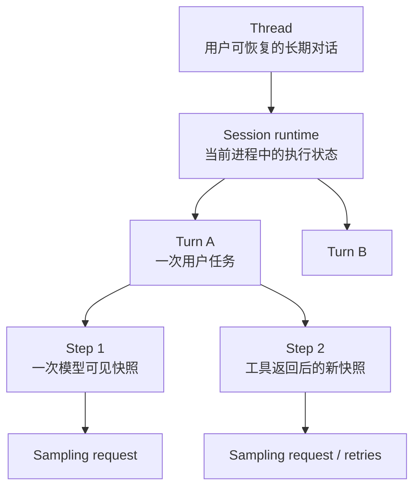

# 02：Thread、Session、Turn、Step 与 Request

## 先用一个类比

把 Codex 想成一款能保存进度的游戏：

- **Thread 是存档**：记录整个任务，关闭程序后仍可恢复；
- **Session 是本次加载的游戏实例**：包含内存对象和网络连接，退出进程就消失；
- **Turn 是一项当前任务**：例如“打败这个 Boss”，完成后可以接下一项；
- **Step 是一次观察世界的快照**：这一刻角色在哪里、有什么装备、允许哪些动作；
- **Sampling request 是向顾问问一次下一步怎么走**。

它们不是五种不同的聊天消息，而是五种不同寿命的东西。

## 1. 生命周期嵌套



这是一种解释模型，不等于源码里恰好存在五个同名 struct，但能正确指导阅读。

## 2. Thread：可寻址、可恢复的用户对象

`ThreadManager` 管理已加载 thread，并负责 start、resume、fork 和 shutdown 等操作。app-server API 使用 string ID 作为边界；内部协议和 core 会使用更强的 ID 类型。

Thread 的核心性质是：

- 有稳定身份；
- 可能跨进程存在；
- 能从持久状态恢复；
- 可以同时被 UI、app-server 和 agent graph 等系统引用。

不要把 thread 简化为内存中的 `Vec<Message>`。

## 3. Session：当前运行实例

`Session` 聚合运行期服务和可变状态。外部一般通过 `SessionIo` 提交 `Op`、读取事件。`SessionIo::submit()` 创建 submission ID，再将 `Submission { id, op }` 送入 channel。

`submission_loop()` 是理解控制面的关键：它持续接收 `Submission`，按 `Op` 分派。例如：

- `UserInput` 启动或 steer 用户任务；
- `Interrupt` 取消当前活动；
- approval / elicitation response 唤醒等待中的工具流程；
- `Shutdown` 让 loop 退出并收尾。

因此 `Op` 不只是“聊天消息”，而是对 session 的命令协议。

## 4. Turn：一次用户意图的执行范围

`run_turn()` 接收：

- `Arc<Session>`：共享 session 与服务；
- `Arc<TurnContext>`：本 turn 的稳定配置和元数据；
- `Vec<TurnInput>`：初始输入；
- 可选的 `ModelClientSession`：预热并在 turn 内复用；
- `CancellationToken`：中断边界。

一个 turn 可能包含多次模型请求和多次工具调用。只有当没有 follow-up、没有 pending input，且 stop hook 没有要求继续时，turn 才结束。

## 5. Step：一次请求的一致视图

`run_turn()` 在第一次采样前捕获 `first_step_context`，后续循环按需重新捕获。代码注释强调：context、advertised tools 和 tool calls 应共享同一个 request view。

Step 解决的是一致性问题。假设 MCP 工具集合、cwd 或环境在模型思考期间变化：

- 当前请求不能一半使用旧工具 schema、一半使用新 runtime；
- 下一次 follow-up 可以重新捕获状态；
- tool call 应按模型实际看到的那份工具视图解释。

### 一个具体例子

模型在 Step 1 里看到工具 `run_tests`，于是输出了对它的调用。与此同时，MCP 连接刷新并移除了这个工具。如果 runtime 直接使用“最新全局工具列表”，同一次模型决策就会出现矛盾：模型明明看到了工具，执行时却说不存在。

Codex 因此把 MCP binding、工具 router、环境和权限一起冻结在 StepContext 中。下一次模型请求可以捕获 Step 2，但 Step 1 的工具调用必须用 Step 1 的视图解释。

## 6. Sampling request：可重试的网络尝试

一次 step 通常构造一个 `Prompt`，但底层流请求可能因为可重试错误再次尝试。不要把“retry”误算成新的用户 turn。`run_sampling_request()` 管理重试，而 `try_run_sampling_request()` 消费一次 response stream。

`ModelClientSession` 是 turn-scoped：它在一个 turn 内复用 WebSocket、sticky routing 和增量请求基线，但不应跨 turn 复用。

## 7. 生命周期速查

| 对象 | 典型寿命 | 主要变化原因 |
|---|---|---|
| Thread | 跨多次运行 | start/resume/fork/archive |
| Session | 一次加载后的运行期 | config update、submission、shutdown |
| TurnContext | 一次 turn | 新用户任务或显式新 turn |
| StepContext | 一次采样视图 | 工具、环境、pending input 变化 |
| ModelClientSession | 一次 turn | turn 结束即不再复用 |
| Stream attempt | 一次网络流 | 完成、失败、取消、重试 |

## 贯穿案例中的数量

对“修复失败测试”这个任务，一种可能情况是：

```text
1 个 Thread
└── 当前进程加载出 1 个 Session
    └── 用户消息启动 1 个 Turn
        ├── Step 1 / 模型请求 1：决定运行测试
        ├── Step 2 / 模型请求 2：读取失败附近源码
        ├── Step 3 / 模型请求 3：应用修改
        └── Step 4 / 模型请求 4：根据验证结果回答
```

网络错误导致模型请求 2 重试，并不会自动产生一个新 turn。

## 理解检查

- 用户补一句“顺便检查另一个测试”，它一定是新 turn 吗？提示：也可能作为 active turn 的 pending input。
- 为什么不能把 `ModelClientSession` 跨 turn 复用？
- StepContext 主要解决生命周期问题，还是一致性问题？

## 本章词汇表

| 词语 | 直译 | 在生命周期中的意思 |
|---|---|---|
| Lifecycle | 生命周期 | 对象从创建、使用到清理的完整过程 |
| Scope | 作用域 | 某项状态在哪个范围内有效，例如 Step 或 Turn |
| Snapshot | 快照 | 为当前 Step 冻结的一致状态视图 |
| Sticky | 粘性的 | 在某个作用域内持续沿用，但不能无限跨边界复用 |
| Retry | 重试 | 同一请求语义失败后再次尝试，不创建新用户任务 |
| Cancellation token | 取消令牌 | 异步任务共同观察、用于停止工作的信号对象 |

完整解释见[术语总表](glossary.md)。

## 源码检查点

1. 阅读 `protocol/src/protocol.rs` 的 `Submission`、`Op`、`Event`、`EventMsg`。
2. 阅读 `session/mod.rs` 的 `SessionIo::submit()`。
3. 阅读 `session/handlers.rs::submission_loop()`，列出哪些 `Op` 会启动任务、哪些只解除等待。
4. 阅读 `client.rs` 中 `ModelClientSession` 上方的生命周期注释。
