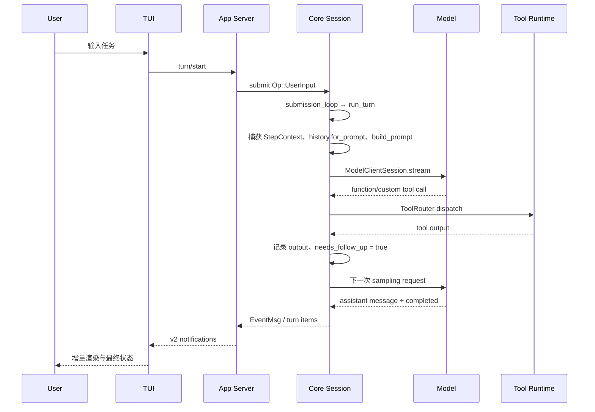

# 03：一次用户请求的源码走读

本章跟踪交互式 TUI 中一次普通文本请求的主要路径。它省略登录、onboarding、遥测和错误分支，但保留重要边界。

## 阅读前先知道结果

一次用户消息不会只调用一次模型。更常见的是下面这个循环：

```text
模型决定下一步 → runtime 执行工具 → 结果写入 history → 再问模型
```

直到模型不再要求工具，只给出最终回答，turn 才可能结束。本章的所有函数名都只是这个循环在源码中的落点。

## 1. 总览



## 2. UI 到 app-server

TUI 不应手工拼 JSON 字符串；它使用 `codex-app-server-protocol` 的 typed request。thread 首次建立使用 `thread/start`，新任务使用 `turn/start`。请求和通知的 wire shape 属于 app-server v2 API，需要遵守 camelCase、optional/nullable 等兼容规则。

源码导航：

- TUI 的 session 生命周期：`tui/src/app/session_lifecycle.rs`；
- TUI 的请求和通知路由：`tui/src/app/thread_routing.rs`、`app_server_event_targets.rs`；
- v2 类型：`app-server-protocol/src/protocol/v2/thread.rs` 与 `turn.rs`；
- app-server 请求处理：`app-server/src/request_processors/`。

## 3. App-server 到 core submission

app-server 解析 JSON-RPC 为 `ClientRequest`，找到目标 thread/session，再把用户输入转成 core 的 `Op::UserInput`。从此处开始，app-server API 类型与 core protocol 类型不应被当成同一层。

`SessionIo::submit()` 将操作封装成 `Submission` 放入 channel；`submission_loop()` 是统一消费点。这个 channel 解耦了“谁发出控制命令”和“session 如何串行处理控制命令”。

## 4. Turn 的准备阶段

`run_turn()` 在主循环前依次完成若干准备：

1. 创建或接收 turn-scoped `ModelClientSession`；
2. 必要时执行 turn 前 compaction；
3. 从输入解析本 turn 需要的 MCP/plugin 依赖；
4. 捕获第一份 `StepContext`；
5. 记录 world/context 更新；
6. 构造 skills/plugins 注入项；
7. 运行 hooks 并记录初始输入；
8. 初始化 turn diff tracker 和循环状态。

这里的顺序有意义：模型请求必须看到已记录的输入和同一 step 的上下文/工具视图。

## 5. 构造模型输入

主循环中最关键的三步是：

```text
Session history
  → ContextManager::for_prompt(input_modalities)
  → build_prompt(..., ToolRouter, ...)
  → ModelClientSession::stream(...)
```

`for_prompt()` 会执行规范化，例如根据模型 modality 处理媒体、保持 tool call/output 配对等。`build_prompt()` 再加入 model-visible tool specs、基础 instructions、输出 schema 等请求级信息。

因此不要直接把内部 history 序列化后称作“实际 prompt”。实际请求还经过规范化和组装。

### 一个简化的请求例子

第一次请求大致包含：

```json
{
  "instructions": "你是 coding agent……",
  "input": [
    {"role": "user", "content": "修复失败测试"},
    {"type": "environment", "cwd": "/repo", "sandbox": "workspace-write"}
  ],
  "tools": ["exec_command", "apply_patch", "read_mcp_resource"]
}
```

这只是帮助理解的简化 JSON，不是逐字抓包。它说明 history、运行环境和工具 schema 最终会在一次请求中汇合。

## 6. 消费 response stream

`try_run_sampling_request()` 循环读取 `ResponseEvent`：

- `OutputItemAdded`：开始一个流式 item，可向客户端发 started/delta；
- `OutputItemDone`：完成 item，交给 `handle_output_item_done()`；
- token、reasoning、文本 delta：更新事件和统计；
- stream 结束但没有 completed：视为错误，而不是静默成功。

对于 tool call，处理结果包含一个 future，加入 `FuturesOrdered`。工具输出会转换成 `ResponseInputItem`，记录到 history。`needs_follow_up` 告诉外层循环：模型还需要看到工具结果并继续。

## 7. 为什么工具后会再次请求模型

模型第一次只产生“调用工具”的结构化建议，并不知道执行结果。Runtime 完成动作后，将结果写成与 `call_id` 对应的 output item。下一次请求包含：

- 原来的用户输入；
- 模型产生的 tool call；
- runtime 产生的 tool output；
- 期间新增的 context/pending input（若有）。

模型基于这些信息继续，直到只产生最终回答或流程被中断。

例如第一次模型输出：

```json
{"type":"function_call","name":"exec_command","call_id":"call-1","arguments":{"cmd":"just test -p codex-core"}}
```

Runtime 执行后记录：

```json
{"type":"function_call_output","call_id":"call-1","output":"test failed: expected 2, got 1"}
```

第二次模型请求必须同时包含 call 和对应 output，模型才能知道命令真的执行过以及结果是什么。`call_id` 就像快递单号，把请求和回执配成一对。

## 8. 完成与回传

当 `model_needs_follow_up == false` 且没有 pending input 时，`run_turn()` 执行 stop/after-agent hooks。没有 hook 阻止结束，turn 才完成。core 发出的事件由 app-server 转成 v2 notification，TUI 再将 item/delta 投影到界面。

## 9. 关键失败路径

- cancellation token 触发：返回 `TurnAborted`；
- context window exceeded：记录 token full 状态并交由上层 compaction/错误逻辑处理；
- retryable stream error：`run_sampling_request()` 在预算内重试；
- stream 未收到 completed 就关闭：视为 stream error；
- tool 不存在、参数错误或被策略拒绝：生成可返回模型或用户的结构化错误。

## 理解检查

- 为什么工具执行结果不能只显示给 TUI，而不写回模型 history？
- `turn/start` 的 JSON-RPC response 和模型最终回答分别发生在哪个阶段？
- 如果工具调用完成，但 `needs_follow_up` 错误地保持为 false，会出现什么现象？

## 本章词汇表

| 词语 | 直译 | 在本章调用链中的意思 |
|---|---|---|
| Walkthrough | 走读 | 按实际执行顺序跟踪一条完整路径 |
| Submission | 提交 | 进入 Session 输入队列的一次操作 |
| Stream | 流 | 模型结果以多个事件逐步到达，而非一次返回 |
| Follow-up | 后续 | 工具结果写回后，再请求模型继续判断 |
| `needs_follow_up` | 需要后续 | 当前 Turn 是否还需要另一次模型采样 |
| Outbound request | 出站请求 | Codex 发往模型服务的网络请求 |

完整解释见[术语总表](glossary.md)。

## 源码检查点

从下列符号开始，自己画一次不含 UI 的调用链：

```text
SessionIo::submit
  → submission_loop
  → run_turn
  → run_sampling_request
  → build_prompt
  → try_run_sampling_request
  → handle_output_item_done
  → ToolRouter::build_tool_call / dispatch...
```

然后在 `core/tests/suite/client.rs` 或 `tools.rs` 中找一个 `mount_sse_once` 测试，将 mock SSE item 对应到上面的步骤。
