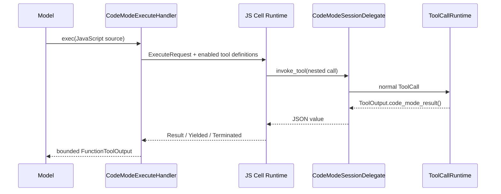

# 10：Code Mode

## 1. 它解决什么问题

先看一个具体任务：读取 100 个测试结果，找出失败项，并按错误类型分类。

如果让模型亲自指挥每一步，流程可能是：

```text
模型决定读取第一批 → 工具返回 → 再问模型
模型决定读取第二批 → 工具返回 → 再问模型
模型判断怎样分类 → 继续调用工具……
```

很多步骤其实不是语言推理，只是循环、并行、筛选和分组。Code Mode 允许模型先生成一段 JavaScript，把这些程序化步骤交给代码执行。下面是为了讲解而简化的示意代码，其中工具名也是虚构的：

```javascript
const files = ["result-1.json", "result-2.json", "result-3.json"];
const results = await Promise.all(
  files.map(file => tools.read_test_result({ path: file }))
);
const failed = results.filter(result => !result.passed);
const grouped = Object.groupBy(failed, result => result.errorType);
text(JSON.stringify(grouped));
```

于是流程变成：

```text
模型生成一次处理代码
→ 代码调用多个已授权工具并整理结果
→ 只把整理后的结果返回模型
```

所以它特别适合“执行逻辑相同或可以程序化，但输入很多、输入不同”的任务。它也能根据前一步结果走条件分支，例如测试失败后才读取日志。

这里的 `exec` 是 Code Mode 的 freeform tool 名称，不是 shell `exec_command`。JavaScript 也不直接获得操作系统权限。

## 1.1 它不适合什么

- 只有一次简单工具调用：直接 tool calling 更直观；
- 每一步都需要重新理解自然语言或做复杂判断：仍需要模型参与；
- 想绕过 sandbox 直接读文件或访问网络：Code Mode 不提供这种能力；
- 要维护一份正式产品代码：Code Mode 通常是当前任务中的临时编排脚本，不等同于提交进仓库的实现。

## 2. 主链路



最重要的安全性质是：嵌套调用重新进入正常 `ToolCallRuntime`，因此不会绕过 registry、审批、sandbox、telemetry 或输出转换。代码还明确拒绝 Code Mode 的 `exec` 自己调用自己。

## 3. Session 与 Cell

`CodeModeSession` 由一条 Codex thread 持有，多个 cell 可以共享 session store；不同 thread 的 session 必须隔离。`CodeModeService` 用 `OnceCell` 延迟创建 runtime，并在 session shutdown 时关闭。

一次脚本执行产生 `CellId`：

- `Result`：脚本自然完成，包含输出和可选 error text；
- `Yielded`：达到 yield 边界但 cell 仍在运行；
- `Terminated`：显式终止或取消后的终态。

对于 `Yielded`，模型可以使用 wait tool 按 cell ID 继续观察，也可以终止。`yield_control()` 允许脚本主动把当前可见输出交回，而不必结束整个 cell。

可以把 session 想成一个 Jupyter notebook，cell 是其中一次执行。Cell 暂时没有完成时会返回 ID；后续 wait 类似回来看这个 cell 是否有新输出。不过它是 Codex 自己的受控 runtime，并不是让用户任意访问本机的普通 notebook。

## 4. 模型可用的工具集合

`CodeModeExecuteHandler` 从当前 tool plan 构造 nested tool definitions。它处理 function 与 freeform 工具，并对名称排序、去重。Tool exposure 决定某工具是：

- 直接暴露给模型；
- 只通过 Code Mode 暴露；
- 延迟到 tool search；
- 完全不可用。

因此“runtime 注册了工具”仍不等于脚本能调用它。

例如 JavaScript 可以写 `tools.read_file(...)` 的前提是本 step 将 `read_file` 暴露给 Code Mode。脚本随便写 `require("fs")` 或调用一个不存在的工具，并不会凭空获得文件权限。

## 5. 输出边界

Runtime output 可以包含文本、图片和音频，但进入模型前仍会：

- 检查模型是否允许 original image detail；
- 按 `max_output_tokens` 截断；
- 对音频估算 token；
- 添加 completed/yielded/failed 状态和 wall time；
- 将脚本错误转换为模型可理解的 output，而不是进程 panic。

## 6. 本地与远端 Host

`CodeModeSessionProvider` 隔离运行位置。实现可以在进程内运行，也可以通过独立 code-mode host（stdio/WebSocket）执行。远端协议需要处理连接、session ID、cell route、delegate callback 和 shutdown；但对 core 来说仍是同一 `CodeModeSession` 契约。

## 7. 测试入口

- `core/tests/suite/code_mode.rs`：从模型 tool call 到嵌套工具和 follow-up 的集成行为；
- `code-mode-runtime/src/service_contract_tests.rs`：yield、resume、terminate、callback cleanup；
- `code-mode-host/tests/websocket.rs`：host transport 与 capability negotiation；
- `core/src/tools/code_mode/*_tests`：payload、截断和 tool spec。

## 理解检查

- Code Mode 主要替代的是工具，还是减少模型参与那些纯程序化步骤？
- JavaScript 调用 nested tool 时，为什么仍然受 approval 和 sandbox 约束？
- “读取 100 个结构相同文件”和“理解 100 个含糊需求”中，哪个更适合交给 Code Mode？

## 本章词汇表

| 词语 | 直译 | 在 Code Mode 中的意思 |
|---|---|---|
| Cell | 单元格 | 一次提交给持久 JS session 执行的代码单元 |
| Delegate | 委托者 | Runtime 向外请求普通工具调用等能力的接口 |
| Nested tool | 嵌套工具 | JavaScript 在 `exec` 内调用的普通授权工具 |
| Yield | 让出控制 | 暂停等待并先把 cell ID/已有输出返回模型 |
| Callback | 回调 | 工具完成后由 Runtime 调用、继续处理结果的函数 |
| Host process | 宿主进程 | 实际承载 JavaScript runtime 的独立进程 |
| Orchestration | 编排 | 用代码组织循环、并发、筛选和多次工具调用 |

完整解释见[术语总表](glossary.md)。

## 源码检查点

1. 从 `CodeModeExecuteHandler::execute()` 找到 enabled tools 怎样进入 `ExecuteRequest`。
2. 从 `call_nested_tool()` 证明嵌套调用回到 `ToolCallRuntime`。
3. 找一个 `yield_control()` 集成测试，画出 execute → wait → final result 的两次模型可见输出。
