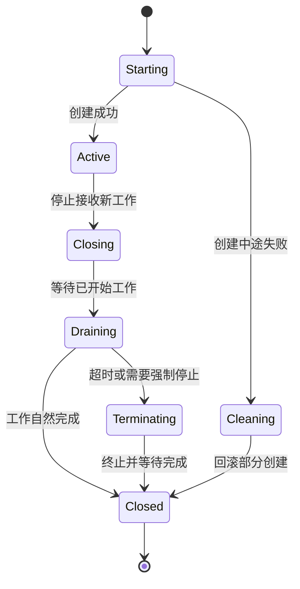
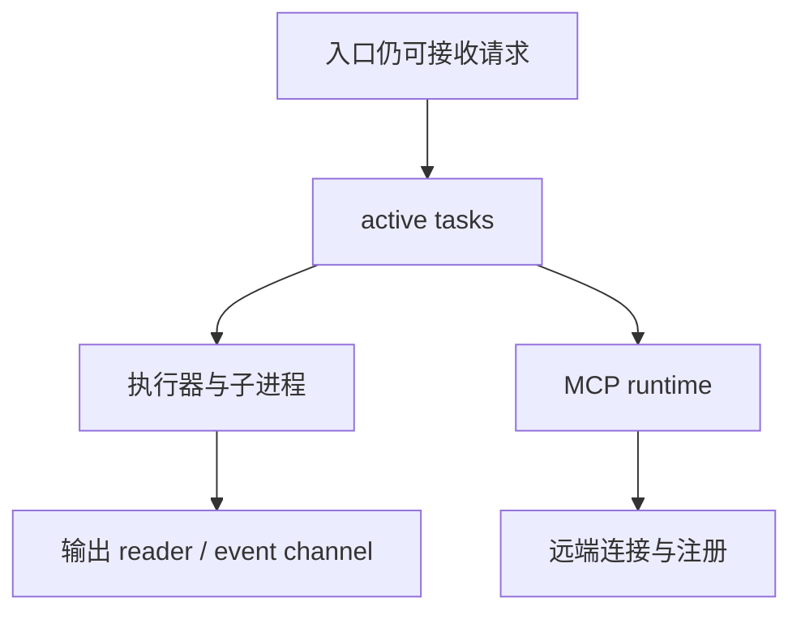

# 48：资源生命周期、RAII 与泄漏防护——对象离开作用域，不代表外部世界已经清理干净

> 源码基线：`4ee41929eaf4`
>
> 本章主要依据当前仓库实现整理。公开 Codex 文档中没有足够具体的资源关闭顺序说明，因此下面会明确区分“源码事实”和“通用解释模型”。

## 1. 本章解决什么问题

异步程序很容易出现一种错觉：

> Rust 对象被 `drop` 了，资源就一定已经释放了。

对普通内存，这句话大体成立；对下面这些资源，却远远不够：

- 后台 Tokio task；
- channel 中等待发送或接收的协程；
- semaphore permit；
- 文件、socket、PTY；
- 本地或远端子进程；
- 远端服务里的注册记录；
- 终端 raw mode、alternate screen 等全局状态。

本章要建立的核心认识是：

> 资源清理不是一个瞬间动作，而是一段有 owner、有顺序、有失败路径的生命周期协议。

读完后，你应该能够回答：

1. `Drop`、取消、关闭、排空、终止、等待分别是什么；
2. 为什么异步清理经常需要显式 `shutdown().await`；
3. guard 的 `armed` / `disarm` 模式怎样覆盖提前返回和取消；
4. 为什么过载时必须给 cleanup 留出执行容量；
5. 如何测试 task、channel、进程和远端注册没有泄漏。

## 2. 先用“酒店退房”理解生命周期

把一个异步资源想象成酒店房间：

- 创建资源：办理入住；
- 正常使用：住在房间里；
- 发出取消：通知前台准备退房；
- 停止接收新工作：不再允许新客人进入；
- 排空：让已经开始的服务完成；
- 终止：强制停止仍未结束的活动；
- 等待：确认清洁人员已经做完；
- `Drop`：客人把房卡丢进回收箱。

丢掉房卡并不自动保证房门已锁、账单已结、后台清洁已完成。

同理，Rust 值离开作用域只保证它的析构逻辑开始执行，不等于所有异步外部副作用都已经结束。

## 3. 先区分四层资源

| 层次 | 例子 | 常见 owner | 主要风险 |
|---|---|---|---|
| 内存资源 | `String`、`Vec`、状态对象 | Rust value | 引用周期导致长期存活 |
| 并发资源 | task、channel、permit、listener | manager / runtime | task 泄漏、死等、背压失效 |
| 操作系统资源 | fd、PTY、socket、child process | handle / driver | fd 泄漏、孤儿进程、终端损坏 |
| 远端逻辑资源 | remote stream、session、route | client registration | 本地消失但远端仍占资源 |

看到一个类型实现了 `Drop`，要继续问：

- 它只释放本地内存吗？
- 它能同步关闭 OS handle 吗？
- 它是否还需要向远端发送 cleanup RPC？
- 它是否需要等待另一个 task 确认退出？

## 4. RAII 到底是什么

`RAII` 是 **Resource Acquisition Is Initialization** 的缩写，常译为“资源获取即初始化”。

最实用的理解是：

> 资源所有权放进一个值里；值进入作用域时资源有效，值离开作用域时自动执行回收逻辑。

典型例子是锁：

```rust
let guard = mutex.lock().await;
// 访问受保护状态
drop(guard); // 或离开作用域，自动释放锁
```

RAII 会自然覆盖正常返回、`?` 提前返回、分支跳出、future 被取消以及 panic 展开时的析构路径。

但 RAII 并不意味着 `Drop` 可以完成任意复杂的异步协议。

## 5. `Drop` 不是“异步析构函数”

Rust 的 `Drop::drop` 是同步函数：

```rust
impl Drop for Resource {
    fn drop(&mut self) {
        // 这里不能直接 `.await`
    }
}
```

它适合释放本地 handle、取消 token、abort task、删除同步登记，或在已有 runtime 上安排 best-effort 清理。

它不适合独自承担：

- 等待远端确认；
- 等待子进程退出；
- 按顺序关闭多个异步子系统；
- 报告完整清理错误；
- 保证程序退出前清理 task 一定运行完。

所以成熟的异步 API 往往同时提供：

1. 显式 `shutdown().await`：完整、可等待、可报告错误；
2. `Drop`：遗忘显式关闭时的最后一道保险。

## 6. 一个推荐的双层 API

```rust
struct Worker {
    cancel: CancellationToken,
    task: Option<JoinHandle<()>>,
}

impl Worker {
    async fn shutdown(mut self) {
        self.cancel.cancel();
        if let Some(task) = self.task.take() {
            let _ = task.await;
        }
    }
}

impl Drop for Worker {
    fn drop(&mut self) {
        self.cancel.cancel();
        if let Some(task) = self.task.take() {
            task.abort();
        }
    }
}
```

正常关闭时，调用者协作式取消并等待 task 收尾；忘记关闭时，`Drop` 至少阻止 task 无限制继续运行。

实际实现还要考虑 deadline、错误和 runtime 是否仍存在，但这个模型已经足够用于阅读源码。

## 7. 生命周期是一张状态图



这张图提醒我们：创建到一半失败也要 cleanup；“不再接收”与“现有工作完成”是两个状态；timeout 后可能需要从温和取消升级到强制终止。

## 8. 协作式取消：通知，不是强杀

`codex-rs/async-utils/src/lib.rs` 中的 `OrCancelExt` 把 future 和 `CancellationToken` 放进 `tokio::select!`：

```rust
tokio::select! {
    result = future => Ok(result),
    _ = token.cancelled() => Err(CancelErr::Cancelled),
}
```

取消分支胜出时，原 future 会被 drop。但这只保证“这个 Rust future 不再被轮询”，不自动保证：

- future 启动的子进程已经退出；
- 远端请求已经撤销；
- 后台 task 已经停止；
- 外部系统的副作用已经回滚。

因此，取消协议必须继续向资源 owner 传播。

## 9. `cancel` 与 `abort` 不同

| 动作 | 含义 | 优点 | 风险 |
|---|---|---|---|
| `cancel` | 发信号，请任务自行退出 | 能执行收尾逻辑 | 任务可能不检查信号 |
| `abort` | 让 Tokio 不再轮询该 task | 快速停止 future | 异步收尾来不及完成 |

常见升级策略是：

1. 先 `cancel()`；
2. 等待有限时间；
3. 超时后 `abort()`；
4. 对 OS 子进程另外发送 terminate/kill；
5. 最后等待或确认资源登记已消失。

不要把 `JoinHandle::abort()` 误读成“递归杀掉这个 task 创建的所有外部资源”。

## 10. `AbortOnDropHandle` 解决哪一类遗漏

丢弃普通 `JoinHandle` 不一定停止 task；task 可能继续在 runtime 上运行。

`AbortOnDropHandle` 这类封装把语义改成：

> owner 消失时，后台 task 不能比 owner 活得更久。

它适合预热任务、观察者、刷新 worker 等没有独立业务身份的辅助 task。

如果 task 必须优雅写盘或通知远端，正常路径仍要显式等待，不能只依赖 abort-on-drop。

## 11. 当前实例：Session 的关闭顺序

`codex-rs/core/src/session/handlers.rs` 中的 `shutdown_session_runtime` 展示了一次完整 teardown：

1. 取走并 abort 启动阶段的预热任务；
2. 关闭 conversation；
3. 中断所有 active task；
4. 终止 unified exec manager 管理的全部进程；
5. 关闭 Code Mode service；
6. 停止 MCP prewarm worker；
7. 关闭 MCP refresh gate，再关闭 MCP runtime；
8. 关闭 Guardian review session；
9. 运行 session-end hooks。

这里最值得学的是它没有写成一句“丢弃 Session 即可”。

关闭有依赖顺序：仍允许新任务进入时就开始排空，会永远排不完；执行器关闭太早，active task 又可能继续提交工作。

## 12. `shutdown_and_wait` 为什么还要等待

`codex-rs/core/src/session/mod.rs` 中，`CodexThread::shutdown_and_wait()` 会：

1. 提交 `Op::Shutdown`；
2. 容忍 session loop 已经死亡；
3. 等待共享的 session-loop termination。

```text
send Shutdown  ───────────────►  session loop 开始清理
await terminated  ◄───────────  所有约定的清理结束
```

“请求关闭”和“已经关闭”是两个不同事件。调用者等到第二个事件，才可以安全地认为 thread 生命周期结束。

对应测试还覆盖 channel close、多 waiter、关闭已在进行，以及 shell 取消等待 TERM trap 清理。

## 13. 记住四个动作：close、drain、abort、join

- `close`：关闭入口，禁止新工作；
- `drain`：让已经接收的工作完成；
- `abort`：强制停止仍未结束的 task；
- `join` / `wait`：确认 task 或进程真的结束。

常见顺序是：

```text
close admission
    ↓
signal cancellation
    ↓
drain in-flight work
    ↓ timeout
abort / terminate remaining work
    ↓
join and release registrations
```

只做其中一步，通常只能解决一部分泄漏。

## 14. `ConnectionRpcGate`：先关门，再排空

`codex-rs/app-server/src/connection_rpc_gate.rs` 中的 gate 同时持有 `accepting` 状态和 `TaskTracker`。

`run()` 在同一把锁下检查是否仍接收请求，并为新任务取得 tracker token；`close()` 关闭入口和 tracker；`shutdown()` 再等待 tracker 归零。

这样避免了经典竞态：

```text
清理方检查“当前没有任务”
                 ↘
                  新请求刚好进入
                 ↗
清理方宣布关闭完成
```

检查准入状态和登记任务必须形成同一个原子边界，否则可能漏掉“最后一个新任务”。

## 15. Channel 为什么常常关不掉

很多 channel 只有在所有 sender 都被 drop 后才关闭。如果某个不显眼的结构体还保留 sender clone，receiver 会一直等待。

排查方法：

1. 找 channel 创建处；
2. 搜索 sender 的所有 clone；
3. 画出每个 clone 的 owner；
4. 检查 teardown 是否先 drop/close 这些 sender；
5. 检查后台 task 是否又持有 owner 的强引用。

channel leak 经常表现为“程序不退出”，而不是内存快速增长。

## 16. 当前实例：MCP Refresh Gate 的关闭

`codex-rs/core/src/session/mcp_refresh.rs` 使用：

- `AtomicBool` 表示 pending invalidation；
- 容量为 1 的 `Semaphore` 串行化 refresh；
- `close()` 阻止 shutdown 后再开始 refresh。

关闭 MCP runtime 前先关闭 refresh gate，可以避免 runtime 正在 shutdown 时，另一个 refresh 又取得 permit 准备重建状态。

这和 RPC gate 是同一类“关闭准入边界”思想。

## 17. Guard 为什么特别适合错误路径

假设函数开始时登记 active operation：

```rust
registry.insert(id);
do_step_one().await?;
do_step_two().await?;
registry.remove(&id);
```

任意一个 `?` 都可能跳过 remove。guard 把配对动作绑到作用域：

```rust
let guard = ActiveGuard::new(registry, id);
do_step_one().await?;
do_step_two().await?;
drop(guard);
```

它尤其适合计数加减、集合登记删除、permit 获取释放、终端模式恢复和部分初始化回滚。

## 18. `armed` / `disarm`：清理责任如何转移

```rust
struct PendingGuard {
    armed: bool,
}

impl PendingGuard {
    fn disarm(&mut self) {
        self.armed = false;
    }
}

impl Drop for PendingGuard {
    fn drop(&mut self) {
        if self.armed {
            rollback();
        }
    }
}
```

- `armed = true`：guard 仍负责失败回滚；
- `disarm()`：成功路径已经把资源交给新 owner；
- Drop 时仍 armed：说明中途失败或被取消，必须回滚。

`disarm` 不是“不清理”，而是“旧 guard 不再清理，因为责任已经转移”。

## 19. 当前实例：远端进程启动中的 guard

`codex-rs/exec-server/src/client.rs` 的进程启动路径包含：

- `ActiveProcessStart`：Drop 时结束 active-start tracking；
- `PendingProcessStartSession`：带有 `armed` 状态；
- 如果没有完成所有权交接，Drop 会删除仍 pending 的 session。

为什么启动阶段也需要清理？

远端可能已经创建进程，但本地恰好在收到结果前取消。只看本地返回值会误以为“启动失败，所以没有资源”，实际上远端进程可能已存在。

## 20. 所有权交接为什么需要确认握手

远端进程启动路径通过 oneshot 发送 `Session` 后，还会等待接收方的 `result_received` 确认：

```text
启动 task                 调用者
   │                        │
   ├── 发送 Session ───────►│
   │                        ├── 接管 cleanup 责任
   │◄── result_received ────┤
   │                        │
   └── disarm 旧 guard      │
```

发送成功并不等于接收方已建立 owner。确认前，启动 task 仍负责 cleanup；确认后，调用者负责后续 terminate/unregister。

## 21. 过载时为什么要保留 cleanup 容量

`codex-rs/exec-server/src/rpc.rs` 中，清理调用通过 `call_for_cleanup` 获得特殊处理：

1. 优先使用普通 call slot；
2. 普通 slot 饱和时使用保留的 cleanup slot；
3. cleanup slot 也满时，关闭 transport 作为 circuit breaker。

否则可能形成：

```text
普通请求占满所有 permit
        ↓
取消请求拿不到 permit
        ↓
普通请求所占资源无法释放
        ↓
系统永久拥塞
```

“保留清理容量”不是性能优化，而是活性保证。

## 22. Permit 本身也是 RAII 资源

`OwnedSemaphorePermit` 离开作用域时会自动归还容量：

```rust
let permit = semaphore.acquire_owned().await?;
perform_call().await?;
drop(permit);
```

即使 `perform_call()` 返回错误，permit 也会释放。

但仍要检查：permit owner 是否活得过久；是否持有旧 permit 又等待同类 permit；cleanup 是否也被普通 permit 阻塞。

RAII 保证“owner 被 drop 后释放”，不保证“owner 会及时被 drop”。

## 23. 当前实例：请求登记和 permit 一起释放

`RpcInboundRequestGuard` 同时拥有 request ID 的登记责任和 `OwnedSemaphorePermit`。

它在 Drop 时从集合删除 request ID，而 permit 也随字段析构自动释放。这把两个状态绑定到同一个 guard：

```text
请求存在于 active set  ⇔  它占用一个并发 permit
```

否则可能出现 ID 已删除但 permit 未归还，或 permit 已归还但 ID 永久残留。

## 24. 远端资源的 Drop 通常只是 best effort

`codex-rs/exec-server/src/remote_process.rs` 中，`RemoteExecProcess::drop` 会取消网络策略决策，并在 runtime 上 spawn 异步 `session.unregister()`。

准确的保证是：

> Drop 尝试安排清理，不等于已经收到远端确认。

如果 runtime 正在退出、transport 已断开或进程马上结束，任务可能无法完成。因此业务关键资源应提供显式 `close/terminate/shutdown().await`，Drop 只承担兜底。

## 25. 当前实例：远端文件流和 HTTP body route

`codex-rs/exec-server/src/remote_file_stream.rs` 中，`FileReadRegistration::drop` 会尝试安排远端 `fs_close`。

`codex-rs/exec-server/src/client/http_response_body_stream.rs` 中：

- body stream 在 EOF 前被 drop 时，安排删除 route；
- registration guard 在 header future 被取消时删除 route；
- 成功把 stream 交给调用者后，registration guard 被 `disarm()`；
- 正常读完走显式 `finish_remote_stream`。

这覆盖 header 前失败、header 后中途放弃和正常 EOF 三个不同出口。流式 API 必须逐个枚举这些出口。

## 26. 本地进程：杀 child 还不等于清理完

`codex-rs/utils/pty/src/process.rs` 的进程 handle 区分：

- `close_stdin`：只关闭输入；
- `request_terminate`：请求杀死 child，但保留读写 task，让剩余输出有机会排空；
- `terminate`：请求终止，并 abort reader、writer、wait helper 等 task；
- `Drop`：调用 `terminate` 兜底。

这里体现了一个取舍：太早 abort reader 可能丢最后一段输出；只 kill child 不停 reader，pipe/PTY task 可能继续悬挂；只丢弃 Rust handle，后台 OS 进程可能继续存在。

进程清理通常是“信号 + 排空 + task 回收”的组合。

## 27. `kill_on_drop` 为什么只是安全网

Tokio child 的 `kill_on_drop(true)` 可以在 handle 被丢弃时请求杀死进程，但它不能独自表达：

- 是否先发送温和的 TERM；
- 是否给 shell trap 留清理时间；
- 是否杀整个进程树；
- 是否排空 stdout/stderr；
- 是否等待退出状态；
- Windows 和 Unix 的进程树语义如何统一。

Codex 的 PTY 实现和测试还关注 process group、后台子进程以及 Windows Job Object。

因此看到 `kill_on_drop(true)` 时不要停止阅读；继续找显式 terminate 和进程树测试。

## 28. `Weak`：不让后台 worker 延长 owner 寿命

`codex-rs/app-server/src/models_refresh_worker.rs` 的刷新 worker：

- 持有 `CancellationToken` 和 `JoinHandle`；
- Drop 时触发 cancellation；
- task 内捕获 `Weak<ModelsManager>`；
- 每次工作前尝试 `upgrade()`，owner 已消失就退出。

如果 task 捕获 `Arc<ModelsManager>`，而 manager 又拥有 task handle，可能形成：

```text
Manager ──拥有──► Task Handle
   ▲                 │
   └──── strong Arc ─┘
```

使用 `Weak` 打破“worker 让 owner 永远活着”的关系。

## 29. `Weak` 不能代替取消

虽然 `Weak` 不增加强引用计数，但后台 task 仍可能睡眠很久、等待 I/O、占据 task 数量或保留其他资源。

所以常见组合是：

- `Weak`：不延长 owner 的内存生命周期；
- `CancellationToken`：让 worker 尽快醒来退出；
- `JoinHandle`：显式 shutdown 时等待；
- Drop：遗忘关闭时触发兜底取消。

## 30. TUI 的资源不是普通内存

终端程序会修改进程外部可见的全局状态：

- raw mode；
- bracketed paste；
- focus events；
- alternate screen；
- cursor 形状和可见性；
- keyboard enhancement flags；
- terminal title。

如果程序中途返回却没有恢复，用户可能看到 shell 不回显、光标消失、屏幕错乱或粘贴异常。

因此 TUI 清理不是“界面美观问题”，而是外部环境正确性问题。

## 31. 终端恢复为什么要“尽量执行全部步骤”

`codex-rs/tui/src/tui.rs` 的 `restore_common` 会依次尝试多项恢复，并保存第一个错误，而不是第一步失败就立即返回。

清理代码更适合：

```rust
let mut first_error = None;
try_cleanup_a(&mut first_error);
try_cleanup_b(&mut first_error);
try_cleanup_c(&mut first_error);
return first_error;
```

而不是：

```rust
cleanup_a()?;
cleanup_b()?;
cleanup_c()?;
```

因为 `cleanup_a` 失败并不意味着 cursor、raw mode 和 alternate screen 就不必恢复。清理阶段通常应“尽力全部执行，最后汇总错误”。

## 32. 当前实例：TUI 的多层 Drop

当前 TUI 中可以看到多层 owner 各自恢复自己拥有的资源：

- `Tui::drop` 清理 ambient pet image；
- `App::drop` 清理 managed terminal title；
- `ChatWidget::drop` 停止 rate-limit poller；
- alternate-screen guard 负责离开 alternate screen；
- stderr guard 负责恢复终端 stderr 管理状态。

好的边界是：

> 谁成功启用了某项状态，谁就拥有恢复它的责任。

不要把所有恢复代码塞进最外层 `main`，否则部分初始化失败时很难知道哪些步骤已经生效。

## 33. 异步 Drop guard 的限制

`codex-rs/app-server/src/thread_status.rs` 的 `ThreadWatchActiveGuard` 在 Drop 中使用 runtime handle spawn 异步 release，以减少 pending permission/user-input 状态。

这种模式实用，但要明确限制：

- spawn 只代表已经安排，不代表完成；
- runtime 关闭时任务可能来不及运行；
- release 最好是幂等的；
- 计数更新应容忍重复或迟到；
- 关键关闭路径仍应显式等待状态归零。

判断是否可以接受 best effort，要看资源后果：临时 UI 计数和计费事务不能使用同一保证级别。

## 34. 清理 task 自己也需要 owner

`codex-rs/app-server/src/connection_cleanup.rs` 用 `ConnectionCleanupTasks` 持有 `JoinSet<()>`，提供 spawn、reap、drain 和 abort。

这解决了“为了清理泄漏资源，却又泄漏了清理 task”的问题。

任何 `tokio::spawn(async move { cleanup().await })` 都应该继续追问：

- 谁保存它的 handle？
- 谁观察错误？
- 程序退出时谁等待它？
- 如果 cleanup 卡住，谁 abort 它？

## 35. Deadline 与升级策略

无限等待清理可能导致应用永远无法退出。更稳健的协议会定义 deadline：

```text
T0: close admission + cancel
T1: 等待优雅 drain
T2: terminate 子进程 / abort task
T3: 关闭 transport 或进程级兜底
T4: 记录仍未释放的资源并退出
```

deadline 的目的不是越短越好，而是明确哪些工作值得等待、何时升级、升级会丢失什么，以及最终失败怎样留下证据。

## 36. Cleanup error 应该怎样处理

清理错误有三类：

1. **可忽略的已完成状态**：例如远端已经关闭；
2. **需要记录但不阻止其他清理**：某一个 route 删除失败；
3. **必须影响最终结果**：持久数据未刷盘、进程无法终止。

实践中可以保留第一个错误，同时继续其他 cleanup；把附加错误记录成 structured event；将“已不存在”归一化为成功；关键资源则返回 shutdown error。

不要完全吞掉错误，也不要让第一个错误阻止后续所有回收。

## 37. 部分初始化失败怎么清理

复杂对象通常逐步创建：

```text
创建 channel
  → spawn task
  → 打开 socket
  → 注册远端 route
  → 返回完整对象
```

如果注册 route 失败，前面的 task 和 socket 仍要关闭。RAII 的自然写法是让每一步立即进入临时 owner：

```rust
let channel = ChannelGuard::new()?;
let task = TaskGuard::spawn(...);
let socket = SocketGuard::open().await?;
let route = RouteGuard::register().await?;

Ok(Resource::from_parts(channel, task, socket, route))
```

任何 `?` 都会按逆序 drop 已成功创建的部分。

## 38. 先画 shutdown 依赖图，再写顺序



然后反向关闭：

1. 关闭入口；
2. 取消生产新工作的 active tasks；
3. 终止执行器、远端 runtime；
4. 排空输出和事件；
5. 等待 task；
6. 最后释放底层 channel/transport。

原则是：消费者在生产者彻底停止前不要过早消失。

## 39. “泄漏”不只指内存泄漏

| 类型 | 表现 |
|---|---|
| task leak | thread 已结束，后台轮询仍运行 |
| channel leak | sender clone 残留，receiver 永不结束 |
| permit leak | 并发容量越来越少，最终所有请求等待 |
| registration leak | active ID、route、watch 状态永久残留 |
| process leak | shell 或孙进程继续占 CPU/文件 |
| fd/stream leak | 连接数或文件句柄持续增长 |
| UI state leak | raw mode、光标、终端标题没有恢复 |
| logical leak | 远端 session 已无人使用但仍占配额 |

排查时不能只看 RSS 内存。

## 40. 泄漏在生产环境里怎样表现

它常常不是立刻崩溃，而是逐渐恶化：

- 运行数小时后新请求开始等待 permit；
- thread 数量正常，但 task 数量持续上升；
- 用户停止任务后仍能看到工具输出；
- shell 已结束，后台编译器仍占 CPU；
- 重连次数越多，远端 route 越多；
- TUI 退出后终端无法输入；
- shutdown 偶尔卡住，而且只在高负载下出现。

生命周期问题往往需要长时间、取消、断线和过载场景才能暴露。

## 41. 测试应该验证什么

生命周期测试至少验证一种可观察终态：

- child PID 不再存在；
- active registry 变为空；
- permit 数恢复到初始值；
- receiver 收到 channel closure；
- JoinHandle 完成；
- cleanup RPC 被调用一次；
- 远端 route 被删除；
- terminal restore 函数都被尝试；
- 多次 shutdown 不重复产生破坏性副作用。

Codex 当前测试已有 session channel close、TERM cleanup trap、RPC cleanup 容量、PTY 后台子进程回收、stdio client Drop 后终止进程等例子。

## 42. 不要用固定 sleep 证明“已经清理”

脆弱测试常写成：

```rust
drop(resource);
tokio::time::sleep(Duration::from_millis(100)).await;
assert!(is_clean());
```

它在慢机器上可能不够，在快机器上浪费时间，而且没有证明等待的是正确事件。

更好的同步点包括：

- oneshot “done” acknowledgment；
- `JoinHandle::await`；
- `TaskTracker::wait()`；
- child `wait()`；
- mock server 观察 cleanup RPC；
- 带 deadline 的条件轮询。

等待因果事件，而不是等待猜测的时间。

## 43. 生命周期也需要可观测性

建议为关键资源记录 resource kind、stable ID、owner ID、创建/关闭/终止时间、close reason、graceful/forced 和 cleanup error。

最有用的指标通常是：

- 当前 active gauge；
- 创建与关闭计数差；
- shutdown duration；
- forced termination rate；
- cleanup timeout count；
- oldest active resource age。

## 44. 生命周期 API 的命名要表达保证

| 名字 | 推荐含义 |
|---|---|
| `close` | 不再接收或开始新工作 |
| `cancel` | 请求协作式停止 |
| `terminate` | 主动停止底层资源或进程 |
| `abort` | 强制停止 task/future |
| `drain` | 等待已接收工作完成 |
| `flush` | 把缓冲内容写向下一层 |
| `join` / `wait` | 等待完成事实 |
| `shutdown` | 编排若干关闭步骤的高层操作 |
| `unregister` | 删除本地或远端登记 |
| `dispose` | 含义模糊，除非项目已有统一约定 |

如果一个 `close()` 实际会等待并杀进程，名字或文档就应该明确。

## 45. 常见错误

### 错误一：只取消最外层 future

外层不再轮询，但子 task、远端请求和进程继续运行。

### 错误二：只实现 Drop，不提供 async shutdown

无法等待确认，也无法可靠报告错误。

### 错误三：先等待 drain，再关闭入口

新任务持续进入，永远排不空。

### 错误四：cleanup 与普通流量共用全部容量

系统过载后连释放资源的请求都发不出去。

### 错误五：spawn cleanup 后忘记管理 task

清理 task 自己变成新的泄漏。

### 错误六：只杀直接 child

shell 创建的后台孙进程仍然存活。

### 错误七：第一个 cleanup 错误立即返回

后续 raw mode、cursor、route 等资源不再恢复。

## 46. 源码阅读路线

1. `codex-rs/async-utils/src/lib.rs`：看 `OrCancelExt`。
2. `codex-rs/app-server/src/connection_rpc_gate.rs`：看 close admission 与 drain。
3. `codex-rs/core/src/session/handlers.rs`：看真实关闭顺序。
4. `codex-rs/core/src/session/mod.rs`：看 `shutdown_and_wait`。
5. `codex-rs/exec-server/src/rpc.rs`：看 guard、permit 和 cleanup reserve。
6. `codex-rs/exec-server/src/client.rs`：看 ownership handoff。
7. `codex-rs/utils/pty/src/process.rs`：看进程树和 reader/writer 回收。
8. `codex-rs/tui/src/tui.rs`：看终端恢复为何不 fail-fast。

## 47. 练习一：给后台 worker 补生命周期设计

假设你看到：

```rust
struct Poller {
    task: JoinHandle<()>,
}
```

请回答：谁创建它；task 能否比 owner 活得久；用 token、channel 还是 abort；shutdown 是否等待；Drop 只能做什么兜底；`Arc<Owner>` 是否成环；用什么测试证明退出。

参考形状通常是 `CancellationToken + Weak owner + JoinHandle + async shutdown + Drop fallback`，但仍应根据副作用调整。

## 48. 练习二：为流式资源列出全部出口

至少列出：

1. 请求发送前取消；
2. 远端已注册、本地未收到 header 时取消；
3. header 收到后，stream 交接前取消；
4. 读取中途调用者 drop；
5. 正常 EOF；
6. transport 断开；
7. shutdown 与读取并发。

对每个出口写清当前 owner、谁发 close、是否需 acknowledgment、失败如何观测、重复 cleanup 是否安全。

## 49. 本章术语表

| 英文或代码名 | 中文理解 | 在代码里先问什么 |
|---|---|---|
| lifecycle | 生命周期 | 从创建到关闭有哪些状态？ |
| resource | 资源 | 是内存、task、OS handle 还是远端登记？ |
| RAII | 资源责任绑定对象作用域 | value 被 drop 时自动释放什么？ |
| `Drop` | 同步析构钩子 | 能完成异步确认，还是仅兜底？ |
| teardown | 拆除/关闭全过程 | 顺序和依赖是什么？ |
| shutdown | 编排式关闭 | 是否 close、cancel、drain、join？ |
| cooperative cancellation | 协作式取消 | 被取消方在哪里观察 token？ |
| abort | 强制停止 task/future | 外部资源是否还需另外终止？ |
| guard | 作用域守卫 | Drop 时执行哪个配对动作？ |
| armed | 守卫仍承担回滚责任 | 失败时是否应 cleanup？ |
| disarm | 解除旧守卫责任 | cleanup 责任交给谁了？ |
| ownership transfer | 所有权交接 | 交接点是否有确认？ |
| acknowledgment | 确认回执 | 它证明“收到”还是“完成”？ |
| drain | 排空 | 是否已经先阻止新工作？ |
| join | 等待任务结束 | 等待的是哪个确定事件？ |
| permit | 并发许可 | owner 何时 drop，cleanup 有无保留容量？ |
| cleanup reserve | 清理保留容量 | 过载时 cleanup 能否继续？ |
| best effort | 尽力而为 | 哪些失败被允许，如何观测？ |
| orphan process | 孤儿进程 | 直接 child 和后代是否都被终止？ |
| registration leak | 登记泄漏 | route/session/active ID 由谁删除？ |
| task leak | 任务泄漏 | task 是否比 owner 活得更久？ |
| `Weak` | 不增加强引用计数的引用 | owner 消失后 worker 如何退出？ |
| deadline | 截止时间 | 何时从温和关闭升级为强制终止？ |
| idempotent cleanup | 幂等清理 | 重复 close/unregister 是否安全？ |

代码单词可以这样拆：

- `shutdown_and_wait`：发起关闭，并等待关闭完成；
- `terminate_all_processes`：终止 manager 拥有的全部进程；
- `PendingProcessStartSession`：进程启动尚未完成交接阶段的 session guard；
- `RpcInboundRequestGuard`：保护入站 RPC 登记和并发许可的 guard；
- `FileReadRegistration`：远端文件读取流在本地对应的登记所有权；
- `restore_after_exit`：退出后恢复终端状态，而不只是停止绘制。

## 50. 本章小结

资源生命周期的核心是五个问题：

1. **Owner 是谁**：谁拥有 task、channel、permit、进程和远端登记？
2. **关闭入口在哪里**：怎样阻止新工作继续进入？
3. **清理顺序是什么**：cancel、drain、terminate、join 谁先谁后？
4. **异常路径谁兜底**：提前返回、future 取消、断线和部分初始化怎样回滚？
5. **怎样证明已完成**：等待哪个 acknowledgment，并观测哪些 active gauge？

最值得记住的一句话是：

> `Drop` 能让清理责任不容易遗忘；显式异步 shutdown 才能让调用者知道清理什么时候真正完成。

看到 `JoinHandle`、`CancellationToken`、`SemaphorePermit`、remote session 或 child process 时，不要只追踪“怎样创建”，还要反向追踪“所有出口上，最后由谁关闭”。
