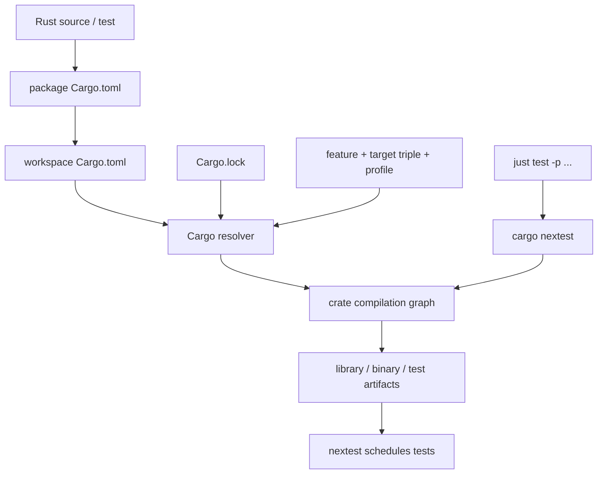
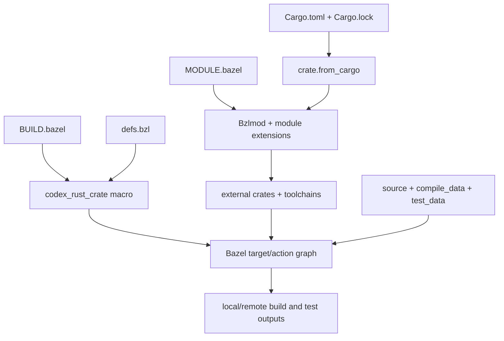

# 61：Rust Workspace、Cargo、Just 与 Bazel——改一个文件以后，构建系统究竟做了什么

> 源码基线：`4ee41929eaf4`
>
> 本章讲的是仓库在该提交中的构建结构。命令、版本和目标会继续变化，所以学习重点不是背诵一串命令，而是理解 manifest、lockfile、构建图和任务入口之间的关系。

## 1. 本章解决什么问题

第一次打开 Codex 仓库，很容易同时看到这些东西：

```text
codex-rs/Cargo.toml
codex-rs/core/Cargo.toml
codex-rs/Cargo.lock
justfile
MODULE.bazel
MODULE.bazel.lock
BUILD.bazel
defs.bzl
.github/workflows/*.yml
```

它们都和“构建”有关，但职责并不相同。本章回答：

- workspace、package、crate、target 到底分别是什么？
- 为什么目录叫 `core`，Cargo package 叫 `codex-core`，Rust 代码里又写 `codex_core`？
- 根 `Cargo.toml` 和每个子目录的 `Cargo.toml` 怎样配合？
- `Cargo.lock` 为什么要提交，它锁住了什么？
- feature、target-specific dependency 和 resolver 2 是什么？
- `just test -p codex-core` 到底转发成了什么？
- 为什么仓库要求用 `just test`，而不是直接运行 `cargo test`？
- Bazel 为什么还要再建一套 graph？
- `MODULE.bazel`、`BUILD.bazel`、`.bzl` 和 `MODULE.bazel.lock` 各负责什么？
- Cargo 和 Bazel 怎样尽量使用同一份依赖事实？
- 为什么 `include_str!` 能在 Cargo 下工作，却可能在 Bazel 下失败？
- 修改普通源码、依赖、schema、UI 或 build-time data 后，验证流程有何不同？

## 2. 先说人话：构建系统是一张“生产说明书”

假设你修改了：

```text
codex-rs/core/src/shell.rs
```

电脑并不是简单地“编译这个文件”。它还要回答：

```text
这个文件属于哪个 crate？
crate 的入口在哪里？
它依赖哪些内部和外部 crate？
启用了哪些 feature？
为哪个操作系统和 CPU 编译？
用哪个 rustc、linker 和系统库？
哪些测试需要重新构建和运行？
测试运行时需要哪些文件和辅助程序？
```

Cargo 和 Bazel 都会把这些回答组织成一张有向图，然后只重做受影响的节点。

## 3. 一个贯穿全章的例子

我们假设做了一个很小的修改：

```text
在 codex-core 中改变 shell 参数的构造逻辑，
并修改相应测试。
```

这次改动可能经过：

```text
shell.rs
  ↓ 属于
codex-core library crate
  ↓ 被链接进
codex CLI / TUI / tests
  ↓ 由团队命令验证
just test -p codex-core
  ↓ 实际调用
cargo nextest run --no-fail-fast -p codex-core
```

CI 还可能用 Bazel 从另一张等价程度很高的图重新构建和测试它。

## 4. 第一条核心原则：文件不是独立编译单位

Rust 源文件通常先通过模块关系进入 crate：

```text
src/lib.rs
  ├── mod shell;
  ├── mod config;
  └── mod tools;
```

`shell.rs` 并没有独立的依赖清单或最终制品。真正交给 `rustc` 的主要编译单位是 crate。

## 5. Module 是源码内部的命名空间

Rust `module` 是代码组织概念：

```rust
mod shell;

pub(crate) mod tools;
```

它解决：

- 名字放在哪里；
- 哪些名字可见；
- 源文件怎样形成模块树。

不要把 Rust module 与 Bazel module 混为一谈。两者只是恰好使用同一个英文词。

## 6. Crate 是 Rust 的编译单位

一个 crate 会被 rustc 编译成某种结果，例如：

```text
library crate  → 可被其他 Rust crate 依赖的库
binary crate   → 可执行程序
proc-macro     → 编译期间运行的过程宏动态库
test crate     → 带测试 harness 的可执行文件
```

一个 package 可以产生多个 crate。

## 7. Package 是 Cargo 管理单位

Cargo package 由一份 `Cargo.toml` 描述。它可以声明：

```toml
[package]
name = "codex-tui"

[lib]
name = "codex_tui"
path = "src/lib.rs"

[[bin]]
name = "codex-tui"
path = "src/main.rs"

[[bin]]
name = "md-events"
path = "src/bin/md-events.rs"
```

因此 `codex-tui` 是一个 package，但它同时产出：

```text
codex_tui library crate
codex-tui binary crate
md-events binary crate
以及测试时产生的 test crates
```

## 8. Target 在 Cargo 中是什么意思

Cargo target 是一个“要构建的东西”。常见 target 类型：

| Cargo target | 常见入口 | 结果 |
|---|---|---|
| library | `src/lib.rs` | library crate |
| binary | `src/main.rs` 或 `[[bin]]` | executable |
| integration test | `tests/*.rs` | 独立 test executable |
| benchmark | `benches/*.rs` | benchmark executable |
| example | `examples/*.rs` | example executable |
| build script | `build.rs` | host 上先执行的构建程序 |

注意：后面还会遇到 Bazel target。它与 Cargo target 不是同一个对象。

## 9. 三种名字为什么不一样

以 core 为例：

```text
目录名          core
Cargo package   codex-core
Rust crate      codex_core
Bazel label     //codex-rs/core:core
```

原因包括：

- Cargo package 名允许连字符；
- Rust 标识符不能用连字符，依赖在代码中通常写成下划线；
- Bazel label 由 package path 与 target name 组成；
- 目录名只负责文件系统定位。

## 10. `-p codex-core` 中的 `-p` 指 package

下面命令选择的是 package 名，不是目录名或 crate identifier：

```bash
just test -p codex-core
```

大致转发为：

```bash
cargo nextest run --no-fail-fast -p codex-core
```

所以若不确定名称，应先看该目录 `Cargo.toml` 的 `[package].name`。

## 11. Workspace 是一组共同管理的 package

`codex-rs/Cargo.toml` 开头的 `[workspace]` 列出许多成员：

```toml
[workspace]
members = [
    "app-server",
    "core",
    "protocol",
    "tui",
    "utils/string",
    # ...
]
resolver = "2"
```

它让这些 package 共享：

- 一份依赖解析；
- 一份 `Cargo.lock`；
- 一个默认 `target/`；
- workspace 级版本、edition、license、lint 和 profile；
- 跨 package 的选择与测试命令。

## 12. Workspace 不是一个巨大 crate

虽然它们在同一个 workspace 中，但边界仍然真实存在：

```text
codex-protocol 不能自动访问 codex-core 的 private item；
codex-tui 只能使用自己显式声明的依赖；
每个 crate 仍然分别编译；
依赖方向仍然决定重建影响面。
```

这正是把大型系统拆成 crate 的价值。

## 13. 根 manifest 管“共同政策”

`codex-rs/Cargo.toml` 同时包含：

```text
[workspace]               成员与 resolver
[workspace.package]       公共 version/edition/license
[workspace.dependencies]  统一依赖声明
[workspace.lints]         统一 lint
[profile.*]               构建 profile
[patch.*]                 全局依赖替换
```

它不像普通 package manifest 那样直接对应一个 `src/lib.rs`。

## 14. 子 manifest 管“本 package 需要什么”

`codex-rs/core/Cargo.toml` 写道：

```toml
[package]
edition.workspace = true
license.workspace = true
name = "codex-core"
version.workspace = true

[lib]
name = "codex_core"
path = "src/lib.rs"
```

意思是：package 自己声明名字和 target，但从 workspace 继承 edition、license 和 version。

## 15. `workspace = true` 不是“依赖整个 workspace”

例如：

```toml
serde = { workspace = true, features = ["derive"] }
codex-protocol = { workspace = true }
```

它表示：

```text
去根 [workspace.dependencies] 找 serde 或 codex-protocol 的基础来源/版本，
然后为当前 package 补充这里需要的 feature。
```

它不表示当前 crate 获得所有 workspace member。

## 16. 为什么集中版本

如果每个 package 各写一遍：

```toml
serde = "..."
tokio = "..."
```

升级时容易不一致。集中声明可以：

- 让升级 diff 更集中；
- 降低重复版本；
- 让 Cargo/Bazel 导入使用一致入口；
- 更容易审计来源和 feature。

## 17. Dependency 有几类

典型 manifest 会出现：

```toml
[dependencies]

[dev-dependencies]

[build-dependencies]

[target.'cfg(unix)'.dependencies]
```

它们的使用阶段不同：

| 类别 | 谁使用 |
|---|---|
| normal dependency | library/binary 正常构建 |
| dev dependency | test、example、benchmark 等开发目标 |
| build dependency | `build.rs` 在 host 上运行时 |
| target dependency | 只有满足目标平台条件才启用 |

## 18. Internal 与 external dependency

根 manifest 中：

```toml
codex-core = { path = "core" }
serde = "1"
```

前者是 workspace 中的 path dependency；后者通常由 crates.io registry 解析。

但二者最终都会成为依赖图中的节点。

## 19. Direct 与 transitive dependency

假设：

```text
codex-tui → codex-core → serde
```

对 TUI 来说：

- `codex-core` 是 direct dependency；
- 仅通过 core 到达的 `serde` 是 transitive dependency。

Cargo 不因为传递可达就允许 TUI 直接在源码中使用任意 crate；要直接使用，通常应显式声明。

## 20. Version requirement 不是最终版本

manifest 中：

```toml
tokio = "1"
url = "2"
```

表达可接受的版本范围，不等于本次构建必然使用字面上的 `1.0.0` 或 `2.0.0`。

最终解析结果记录在 `Cargo.lock`。

## 21. `Cargo.lock` 锁住什么

它记录解析后的具体 package，包括：

```text
name
version
source
checksum
dependencies
```

因此 manifest 更像“允许什么”，lockfile 更像“本仓库这次选了什么”。

## 22. 为什么应用仓库提交 lockfile

若只提交范围而不提交解析结果，不同时间可能得到不同传递版本。

提交 lockfile 有助于：

- 开发机和 CI 使用相同版本图；
- 依赖升级形成可审查 diff；
- checksum 和 source 可追踪；
- 问题可复现。

它提升可重复性，但不意味着二进制在所有机器上逐 bit 相同。

## 23. Lockfile 不是安全证明

锁住版本只证明“选的是谁”，不能自动证明：

- 依赖没有漏洞；
- build script 没有副作用；
- registry 或 git source 值得信任；
- 编译工具链和系统库完全一致。

这些还需要来源策略、审计、hermetic toolchain 和 CI 权限控制。

## 24. `[patch.crates-io]` 改变依赖来源

固定提交中，根 manifest 对若干 crate 使用 git revision patch：

```toml
[patch.crates-io]
crossterm = { git = "https://.../crossterm", rev = "..." }
tokio-tungstenite = { git = "https://.../tokio-tungstenite", rev = "..." }
```

这不是给当前 package 多加一个依赖，而是把依赖图中对应来源替换为指定实现。

## 25. Feature 是条件化能力开关

依赖声明中常见：

```toml
tokio = { workspace = true, features = [
    "macros",
    "process",
    "rt-multi-thread",
] }
```

feature 通常让一个 crate 条件编译某些 API 或依赖。

它不是运行时的用户配置开关，而是构建图的一部分。

## 26. Feature 会影响编译结果和依赖图

启用 feature 可能：

```text
暴露额外 API；
编译额外模块；
拉入额外依赖；
改变平台能力；
增大构建时间或制品。
```

所以不能把 `--all-features` 当成无害的“测试更全”。仓库说明日常测试不需要它。

## 27. `default-features = false`

例如某些依赖会写：

```toml
rmcp = {
    workspace = true,
    default-features = false,
    features = ["base64", "macros", "server"],
}
```

含义是先关闭上游默认 feature，再明确选择本项目需要的能力，避免隐式拉入不需要的代码。

## 28. Resolver 2 解决什么

workspace 指定：

```toml
resolver = "2"
```

可以先建立一个够用的直觉：feature 并不是“整个宇宙永远全局开一次”。Resolver 2 更谨慎地区分 target、build/dev 等上下文，减少不相关 feature 被意外统一。

阅读时仍应看当前 target 和依赖类别，而不要只问“某 feature 有没有在 workspace 某处出现”。

## 29. Target-specific dependency

core manifest 有：

```toml
[target.'cfg(unix)'.dependencies]
codex-shell-escalation = { workspace = true }
```

这表示只有 Unix 目标构建时才加入该依赖。

类似地，musl 目标会使用 vendored OpenSSL。依赖图会随 target triple 改变。

## 30. Target triple 是什么

常见形状：

```text
x86_64-unknown-linux-gnu
aarch64-apple-darwin
x86_64-pc-windows-msvc
x86_64-pc-windows-gnullvm
```

它概括 CPU、供应方、操作系统和 ABI/环境。不同 triple 可能选择不同依赖、链接器和系统库。

## 31. Host、target 与 exec platform

三者容易混淆：

```text
host    发起构建的机器
target  最终程序要运行的平台
exec    某个构建 action 实际执行的平台
```

本机 Cargo 构建时三者经常相同，交叉编译或远程执行时则可能不同。

## 32. Build script 在哪里运行

`build.rs` 是编译目标 crate 之前执行的小程序。交叉编译时，它通常必须能在构建执行平台运行，而不是在最终 target 平台运行。

它可能：

- 探测环境；
- 生成源码或配置；
- 编译 native library；
- 告诉 rustc 怎样链接。

这也是 build dependency 与 normal dependency 必须区分的原因。

## 33. Proc macro 也属于构建执行面

`#[derive(...)]` 背后可能由 proc-macro crate 在编译期间执行代码。

因此 proc macro 既是 Rust 依赖，又有类似构建工具的 host/ABI 要求。固定提交为 argument-comment lint 单独配置 nightly toolchain，也体现了构建工具与产品 target 可以有不同工具链。

## 34. Rust edition 不是 rustc 版本

workspace 写：

```toml
edition = "2024"
```

而 `rust-toolchain.toml` 写：

```toml
[toolchain]
channel = "1.95.0"
components = ["clippy", "rustfmt", "rust-src"]
```

edition 决定语言版本语义和兼容规则；toolchain channel 选择具体编译器及组件。两者相关但不是同一个概念。

## 35. Profile 控制怎样编译

固定提交定义：

```text
dev          本地开发，有限 debug 信息
dev-small    更小的开发制品
release      thin LTO、line tables、4 codegen units
profiling    保留完整 debug、关闭 LTO
ci-test      面向 CI 测试和磁盘压力
```

同一份源码使用不同 profile，编译速度、运行速度、调试信息和制品大小会不同。

## 36. Incremental build 的直觉

构建系统会缓存中间结果。若一个输入未变化，理论上可以复用其输出。

输入不只包括 `.rs` 文件，还可能包括：

```text
Cargo.toml / Cargo.lock
feature 集合
rustc 版本与 flags
target triple
环境变量
build script 输出
compile-time data
依赖 crate 的产物
```

所以“我只改了一行”不一定只重编一个文件。

## 37. 依赖方向决定重建影响面

若图是：

```text
protocol → core → tui
```

修改 `tui` 通常不会要求重编 `core`；修改 `protocol` 却可能使所有依赖它的下游重新编译。

这也是底层公共 crate 修改代价更高的原因之一。

## 38. `cargo metadata` 的概念用途

Cargo 可以把 workspace、package、target、feature 和 resolved graph 输出为机器可读 metadata。

你可以把它理解为：

```text
Cargo.toml + Cargo.lock + target/feature 条件
              ↓ 解析
      机器可查询的 package graph
```

Bazel 的 Cargo 导入逻辑也需要类似事实，而不是靠人手复制每个第三方版本。

## 39. Just 是什么

Just 是 task runner：把团队常用命令命名并封装起来。

例如固定提交根 `justfile`：

```just
fmt:
    @{{ python }} ../scripts/format.py

fix *args:
    cargo clippy --fix --tests --allow-dirty {args}
```

Just 本身不是 Rust compiler，也不是依赖 resolver。

## 40. Task runner 与 build system 的区别

可以这样理解：

```text
just：告诉团队“入口命令叫什么、按什么顺序运行”
Cargo：解析 Rust package/crate graph 并构建
Bazel：解析跨平台、工具链、数据和 action graph 并构建
```

一个 `just` recipe 内部可以调用 Cargo、Bazel、Python 或 shell script。

## 41. 为什么根目录执行也会进入 `codex-rs`

`justfile` 顶部写：

```just
set working-directory := "codex-rs"
```

因此大部分 recipe 默认在 `codex-rs/` 下运行。读命令时要把隐式 cwd 算进去。

标注 `[no-cd]` 的 recipe 则不采用这个切换。

## 42. `*args` 表示参数转发

例如：

```just
fix *args:
    cargo clippy --fix --tests --allow-dirty {args}
```

所以：

```bash
just fix -p codex-core
```

会把 `-p codex-core` 交给底层 Cargo 命令。

## 43. `--` 是参数边界

以：

```bash
cargo run --bin codex -- exec --json
```

为例，第一个 `--` 表示后续参数交给刚构建并启动的 `codex` 程序，不再由 Cargo 解析。

看到多层 wrapper 时，先问每个参数最终由哪一层消费。

## 44. `just fmt` 不只格式化 Rust

固定提交的 recipe 调用仓库脚本：

```just
fmt:
    @{{ python }} ../scripts/format.py
```

注释明确说明它覆盖 justfile、Rust、Bazel/Starlark、Python SDK 和 Python scripts。

所以直接 `cargo fmt` 不能替代完整仓库格式化约定。

## 45. `just fmt-check` 是只读检查

```just
fmt-check:
    @{{ python }} ../scripts/format.py --check
```

它用于验证格式是否已经正确，不修改文件。CI 的 repo checks 调用它，并在之后检查工作树是否干净。

## 46. `just test` 为什么不是 `cargo test`

Unix recipe 是：

```just
test *args:
    RUST_MIN_STACK=8388608 \
    NEXTEST_PROFILE=local \
    cargo nextest run --no-fail-fast "$@"
```

它统一了：

- 8 MiB 最小栈；
- nextest 的 local profile；
- `--no-fail-fast`，尽量运行全部选中测试；
- Unix 与 Windows 参数处理。

## 47. Nextest 是测试运行器

Cargo 负责构建 test executables，nextest 负责安排它们运行。

固定提交的 `.config/nextest.toml` 还定义：

- 慢测试阈值；
- 一次 retry；
- 若干并发 test group；
- Windows 重进程测试的并发限制；
- JUnit 输出。

因此直接 `cargo test` 会绕过一部分仓库测试调度语义。

## 48. `--no-fail-fast` 的含义

它不是“失败也算成功”，而是：

```text
一个测试失败以后，继续运行其他已选择测试，
最后仍以失败结果结束。
```

这样一次本地运行能收集更多失败信息。

## 49. 为什么优先 scoped test

对 core 的小修改，先运行：

```bash
just test -p codex-core
```

优点：

- 反馈更快；
- 失败更接近修改点；
- 避免无意义地占满资源；
- 仍使用仓库统一 runner 和 profile。

若修改公共 crate，影响面可能扩大，才需要进一步运行更广测试。

## 50. `just clippy` 与 `just fix`

固定提交中：

```just
clippy *args:
    cargo clippy --tests {args}

fix *args:
    cargo clippy --fix --tests --allow-dirty {args}
```

`clippy` 只报告 lint；`fix` 允许 Clippy 自动修改可修复问题。`--allow-dirty` 是允许工作树已有改动，不代表任意建议都无需 review。

## 51. 代码生成 recipe

仓库还把派生文件生成封装成明确任务：

```text
just write-config-schema
just write-app-server-schema
just write-hooks-schema
```

核心思想是：类型或协议是 source of truth，schema fixture 是生成物；修改来源以后要重新生成并提交匹配结果。

## 52. 生成文件为何必须纳入工作流

如果只改 Rust 类型，不更新 schema：

```text
编译可能成功；
但客户端看到的契约仍是旧的；
CI 的 fixture 一致性测试会失败；
reviewer 也无法看到 wire shape 的真实变化。
```

生成命令不是“顺手美化”，而是保持多份表示一致。

## 53. Snapshot 也是受控生成物

TUI 的 user-visible 输出常用 Insta snapshot 记录预期渲染。

合理流程是：

```text
修改 UI
运行相关测试产生 .snap.new
阅读实际差异
确认变化符合意图
接受对应 snapshot
```

不要把“让测试通过”误解为盲目接受所有 snapshot。

## 54. 为什么 Codex 仓库还需要 Bazel

Cargo 很适合 Rust 开发，但大型跨平台仓库还希望明确控制：

- toolchain 版本和平台约束；
- Rust 之外的 native dependencies；
- build/test action 的显式输入输出；
- 远程缓存与远程执行；
- 多平台 release 制品；
- 跨语言统一构建图。

Bazel 提供另一层更严格的 action graph。

## 55. Bazel Module 与 Rust module 完全不同

根 `MODULE.bazel` 开头：

```starlark
module(name = "codex")
```

这里的 module 是 Bzlmod 依赖管理单位，负责仓库级 Bazel module 及其外部依赖。

Rust `mod shell;` 则只是 crate 内的源码模块。

## 56. `bazel_dep` 声明 Bazel module 依赖

例如：

```starlark
bazel_dep(name = "rules_rs", version = "0.0.96")
```

这不是产品运行时 Rust crate，而是让 Bazel 获得构建 Rust 所需的规则和扩展。

## 57. Rule、target 与 action

建立一个简化模型：

```text
rule    定义怎样把 inputs 变 outputs
target  用某个 rule 声明的具体构建节点
action  Bazel 为实现 target 实际安排的一次命令执行
```

一个 target 可能展开成多个 action；一个宏也可能生成多个 target。

## 58. Bazel package 是什么

含有 `BUILD.bazel` 的目录通常形成 Bazel package。

例如：

```text
codex-rs/core/BUILD.bazel
```

对应 package path：

```text
//codex-rs/core
```

它与 Cargo package 概念相关但不等价。

## 59. Bazel label 怎样读

```text
//codex-rs/core:core
```

拆开是：

```text
//                 当前 workspace 根
codex-rs/core      Bazel package path
:core              target name
```

同 package 内可简写为 `:core`。

## 60. `//...` 是递归 target pattern

固定提交的 Bazel 测试 recipe：

```just
bazel-test:
    bazel test --test_tag_filters=-argument-comment-lint //... --keep_going
```

`//...` 表示当前 workspace 下递归匹配目标，不是 shell 文件 glob。

`--keep_going` 表示某些目标失败后尽量继续处理其他独立目标。

## 61. `.bzl` 是可复用 Starlark 逻辑

每个 crate 的 `BUILD.bazel` 若都手写 library、binary、unit test、integration test，会非常重复。

根 `defs.bzl` 提供：

```starlark
def codex_rust_crate(...):
    ...
```

各目录通过 `load()` 使用它。

## 62. Macro 是“生成构建声明的函数”

`codex-rs/core/BUILD.bazel` 只需：

```starlark
load("//:defs.bzl", "codex_rust_crate")

codex_rust_crate(
    name = "core",
    crate_name = "codex_core",
    # ...
)
```

宏内部再生成 library、unit tests、binaries、integration tests 和 wrapper targets。

因此读 BUILD 文件不能只看表面几行，还要追到宏定义。

## 63. `codex_rust_crate` 在做 Cargo parity

宏的 doc comment 明确说，它要让 Bazel wiring 与 Cargo conventions 对齐，包括：

- 有源码时建立 library；
- 处理 build script；
- 暴露 `CARGO_BIN_EXE_*`；
- 建立 unit 与 integration tests；
- 按 Cargo.lock resolution 映射依赖 bucket。

这里的 parity 是“尽量行为一致”，不是声称两个系统内部完全相同。

## 64. Cargo 依赖图怎样进入 Bazel

`MODULE.bazel` 使用 rules_rs 的 extension：

```starlark
crate.from_cargo(
    cargo_lock = "//codex-rs:Cargo.lock",
    cargo_toml = "//codex-rs:Cargo.toml",
    platform_triples = [
        "aarch64-unknown-linux-gnu",
        "x86_64-apple-darwin",
        "x86_64-pc-windows-gnullvm",
        # ...
    ],
)
```

这让 Bazel 从 Cargo manifest 与 lockfile 导入第三方 crate resolution，而不是人工复制全部版本。

## 65. `@crates` 是什么

`defs.bzl` 开头加载：

```starlark
load("@crates//:data.bzl", "DEP_DATA")
load("@crates//:defs.bzl", "all_crate_deps")
```

`@crates` 可理解为由 Cargo 依赖导入过程生成的外部 repository 名。宏借它查询每个 package 的依赖和 binary metadata。

## 66. 两个 lockfile 各锁什么

```text
codex-rs/Cargo.lock  Cargo 解析出的 Rust package 版本与来源
MODULE.bazel.lock    Bzlmod/module extension 的解析与扩展结果
```

由于 Bazel 的 Rust 导入读取 Cargo.toml/Cargo.lock，改 Rust 依赖时可能同时使 Bazel lock 失效。

## 67. 为什么依赖修改要更新 Bazel lock

仓库提供：

```just
[no-cd]
bazel-lock-update:
    bazel mod deps --lockfile_mode=update
```

并在 CI 运行 lock check。如果只更新 Cargo.lock 而不更新 MODULE.bazel.lock，Bazel 依赖视图可能过期，CI 会明确失败。

## 68. Lock update 的正确心智模型

不要把它看成“遇到 CI 红了就刷新文件”。正确顺序是：

```text
我有意修改依赖来源/版本/feature
  ↓
Cargo 重新解析并修改 Cargo.lock
  ↓
Bazel 从新 Cargo graph 更新 extension lock
  ↓
review 两份 lock diff 是否符合预期
```

## 69. Hermetic toolchain 是什么

Hermetic 的目标是让 action 尽量只依赖显式声明、版本固定的工具和输入，而不是偷偷使用开发机上恰好存在的编译器或 SDK。

固定提交的 `MODULE.bazel` 注册：

```text
Rust 1.95.0 / edition 2024 toolchain
独立 nightly toolchain 给 argument-comment-lint
LLVM 与平台相关工具链
```

这减少“我电脑能编，CI 不能”的环境漂移。

## 70. 为什么 lint 需要单独 nightly

源码注释说明 argument-comment lint 使用 `rustc_private` 和 `rustc-dev`，因此需要 nightly toolchain；产品默认 Rust toolchain 并不需要因此整体切到 nightly。

这是良好的隔离：

```text
产品构建工具链  stable/pinned
特殊静态分析工具 nightly/pinned
```

## 71. Platform constraint 决定匹配哪套工具链

根 `BUILD.bazel` 定义 Linux、Windows MSVC、Windows gnullvm 等 platform；`MODULE.bazel` 的 toolchain repository sets 则声明 exec/target compatibility。

Bazel 根据 constraint 匹配可用工具链，而不是只靠脚本中的 `if OS == ...`。

## 72. `select()` 是按配置选值

`defs.bzl` 中的 Windows link flags 使用：

```starlark
WINDOWS_RUSTC_LINK_FLAGS = select({
    "@llvm//constraints/windows/abi:gnullvm": [...],
    "@llvm//constraints/windows/abi:msvc": [...],
    "//conditions:default": [],
})
```

它让同一 target declaration 在不同配置下得到不同参数。

## 73. Build-time data 为什么必须显式声明

Cargo 常从 package 目录直接看到源码树中的文件，例如：

```rust
const TEMPLATE: &str = include_str!("../templates/default.md");
```

Bazel action 通常只能看到声明给它的 inputs。文件在 Git 仓库里，并不自动意味着编译 action 可读取它。

## 74. `compile_data` 与 `data` 的区别

建立够用的直觉：

```text
compile_data  编译 crate 时需要读取的非 Rust 文件
data          运行 library/program/test 时需要的文件
build_script_data  build.rs 运行时需要的文件
test_data_extra    测试运行时额外需要的文件
```

具体 rule 的传播语义要看 rules_rs 和仓库宏，但“哪个阶段读取”是判断入口。

## 75. Core BUILD 的真实例子

固定提交中，core target 声明：

```starlark
compile_data = glob(
    include = ["**"],
    exclude = ["**/* *", "BUILD.bazel", "Cargo.toml"],
)
```

并额外提供：

```text
config.schema.json
snapshot files
若干辅助 binary
AGENTS.md 测试数据 workaround
```

这说明测试成功不仅取决于 Rust source。

## 76. TUI BUILD 的真实例子

TUI 明确把 collaboration mode templates 加入 compile data：

```starlark
"//codex-rs/collaboration-mode-templates:templates/default.md"
"//codex-rs/collaboration-mode-templates:templates/plan.md"
```

并把源码和 snapshots 加入 test data。这让远程/隔离执行环境也能拿到所需文件。

## 77. Runfiles 是什么

Bazel 不保证测试从源码目录直接运行。它会建立一套运行时文件视图，通常称为 runfiles。

测试需要：

- 用 Bazel 的方式解析辅助 binary；
- 获取声明的数据文件；
- 不依赖开发机 cwd 的偶然布局。

`codex_rust_crate` 的 wrapper 正是在补齐 Cargo-like cwd、Insta path 和 binary env。

## 78. `CARGO_BIN_EXE_*` 解决什么

集成测试有时要启动 workspace 自己构建的 binary。Cargo 会为它提供类似：

```text
CARGO_BIN_EXE_codex=/absolute/path/to/codex
```

Bazel 宏也显式构造这些环境映射，使同一测试尽量不必知道自己由 Cargo 还是 Bazel 驱动。

## 79. 为什么不要在测试中猜 `target/debug`

如果测试硬编码：

```text
./target/debug/codex
```

它会假设 Cargo layout、本地 cwd 和 debug profile。在 Bazel、交叉编译、远程执行或不同 profile 下都会脆弱。

应使用仓库提供的 binary resolver 或环境契约。

## 80. Bazel sandbox 与 Codex product sandbox 不一样

两个概念都叫 sandbox，但作用域不同：

```text
Bazel sandbox
  隔离 build/test action，发现未声明输入与副作用

Codex product sandbox
  限制 Agent 启动的用户命令可访问哪些系统资源
```

排错时必须先确认是哪一种。

## 81. Remote cache 的基本直觉

若 action key 完全相同，Bazel 可复用其他机器已经产生的输出，而不重新执行 action。

action key 通常受这些内容影响：

```text
输入文件内容
rule/command
toolchain
flags
声明的环境
依赖输出
目标平台
```

未声明输入会破坏正确缓存，因此 hermeticity 与 cache correctness 是同一问题的两面。

## 82. Remote execution 不等于“远程运行产品”

Remote execution 是把编译或测试 action 放到匹配平台的 worker 上执行。

它不同于 Codex 的 exec-server：后者是产品运行时把用户命令交给远端环境。两者都涉及远端机器，但控制面、协议和安全目标不同。

## 83. CI 为什么同时检查 Cargo 与 Bazel 路径

两套构建路径可以暴露不同问题：

```text
Cargo/nextest
  快速、贴近 Rust 开发者日常和 Cargo conventions

Bazel
  检查显式数据、hermetic toolchain、平台、runfiles、远程执行兼容
```

一边通过，不足以证明另一边一定通过。

## 84. Clean-worktree check 的意义

CI 在生成、格式化或锁文件检查之后确认工作树干净，可以发现：

- 忘记提交生成 schema；
- formatter 会改文件；
- lockfile 过期；
- 测试偷偷修改 tracked fixture。

这是一种“仓库中的派生状态必须已经同步”的不变量。

## 85. 改普通 Rust 实现时的流程

以 `codex-core` 为例：

```text
1. 找到 package 和受影响 crate
2. 修改实现与回归测试
3. just test -p codex-core
4. 大改动时 just fix -p codex-core
5. just fmt
6. 检查最终 diff
7. 按依赖影响面决定是否需要更广测试
```

注意仓库约定：运行 `fix` 或 `fmt` 后不再重复测试，因此测试应在它们之前完成。

## 86. 改 dependency 时的流程

```text
1. 修改根或子 Cargo.toml
2. 让 Cargo 更新并核对 Cargo.lock
3. just bazel-lock-update
4. 核对 MODULE.bazel.lock
5. 运行受影响 package 测试
6. 必要时验证 Bazel target
7. just fmt
8. review manifest、两份 lockfile 和源码 diff
```

依赖 diff 要特别检查 source、version、features 和新增传递依赖。

## 87. 改 Config 类型时的流程

若修改 `ConfigToml` 或嵌套 config 类型：

```text
修改 Rust 类型和行为
  ↓
just write-config-schema
  ↓
检查 codex-rs/core/config.schema.json 的语义 diff
  ↓
运行 codex-core 相关测试
```

Schema diff 应与代码意图一致，不应只是机械提交。

## 88. 改 App-server v2 API 时的流程

除实现和集成测试外，至少考虑：

```text
app-server/README.md
just write-app-server-schema
实验 API 时的 experimental schema
just test -p codex-app-server-protocol
wire compatibility
```

这里 build workflow 与协议演进 workflow 发生交叉。

## 89. 改 TUI 可见输出时的流程

```text
1. 修改 UI
2. 增加或更新 snapshot coverage
3. just test -p codex-tui
4. 查看 pending .snap.new
5. 逐份确认并接受预期变化
6. 大改动时 just fix -p codex-tui
7. just fmt
```

Snapshot 是用户可见行为证据，不是测试噪声。

## 90. 新增 `include_str!` 文件时的流程

```text
1. 在 Rust 中加入 compile-time read
2. 找到该 crate 的 BUILD.bazel
3. 将文件加入 compile_data 或适当 data bucket
4. 验证 Cargo build/test
5. 验证对应 Bazel target
```

若 Cargo 通过、Bazel 报文件不存在，第一怀疑应是 action input 未声明，而不是文件真的不在仓库。

## 91. 新增 crate 时要同步哪些图

通常至少检查：

```text
codex-rs/Cargo.toml 的 workspace members
根 [workspace.dependencies] 中的 path alias
新 crate 的 Cargo.toml
调用方的 dependencies
新目录 BUILD.bazel
必要的 compile_data/test_data/build_script_data
Cargo.lock 与 MODULE.bazel.lock
```

还应思考依赖方向，避免把新概念顺手塞进过大的公共 crate。

## 92. 常见失败：`package ID specification did not match`

典型原因：

```text
把目录名当成 package 名；
拼错 [package].name；
package 未加入 workspace；
在错误 manifest/cwd 下执行。
```

先查看子 `Cargo.toml`，再确认根 members。

## 93. 常见失败：Feature 不存在

可能原因：

- 把产品 feature flag 与 Cargo feature 混淆；
- feature 属于依赖而不是当前 package；
- 名字只存在于另一版本；
- `default-features = false` 后忘记显式启用能力。

排查时沿 manifest 和 resolved graph 查，而不是猜命令行名字。

## 94. 常见失败：Cargo 能过，Bazel 缺文件

高概率检查：

```text
compile_data
build_script_data
test_data_extra
runfiles path
CARGO_MANIFEST_DIR 假设
源码相对路径是否依赖本地 cwd
```

根因通常是 Cargo 的源码树可见性掩盖了未声明输入。

## 95. 常见失败：Bazel lock 过期

若 CI 提示：

```text
MODULE.bazel.lock is out of date
```

先确认 Cargo manifest/lock 的改动是否有意，再运行仓库 recipe 更新 Bazel lock 并 review diff。

不要手工修改 lockfile 内容来“对齐报错”。

## 96. 常见失败：只在某个平台链接失败

检查顺序：

```text
target triple
cfg dependency
target feature
toolchain constraint
linker flags
native library
MSVC/gnullvm ABI
build script host/target 假设
```

“Windows”不是一个足够精确的平台描述，ABI 也可能不同。

## 97. 常见失败：测试在本地通过，CI 超时

可能不是业务逻辑错误，而是：

- 并发过高造成资源争用；
- test group 配置不同；
- CI 使用不同 profile/platform；
- 测试依赖隐式 cwd、网络或机器状态；
- retry 暂时掩盖了 flaky behavior。

应查看 nextest profile、CI shard 和 Bazel test attributes。

## 98. 常见失败：改了一个底层 crate，重编很多内容

这通常是依赖图的正常结果：

```text
底层 crate artifact 改变
  ↓
所有链接它的下游 crate 输入改变
  ↓
相关 binary/test 重新构建
```

优化构建时间不能只怪 compiler，还要审视 crate 边界和依赖方向。

## 99. 不要把命令背成咒语

看到命令先拆成四层：

```text
选择器：-p codex-core / Bazel label
动作：build / test / run / clippy / generate
配置：profile / feature / target / env
执行器：just → cargo/nextest 或 bazel
```

理解每层以后，遇到新命令也能自行推导。

## 100. 用一张图串起 Cargo 本地路径



## 101. 用一张图串起 Bazel 路径



## 102. 两张图怎样对账

共同事实主要来自：

```text
Cargo.toml
Cargo.lock
crate source layout
package metadata
```

Bazel 额外表达：

```text
toolchain 与 platform constraints
显式 compile/runtime data
runfiles
remote action 属性
跨平台 wrapper 和 sharding
```

对账目标不是文件完全相同，而是相同产品语义在两条构建路径下成立。

## 103. 阅读新 crate 的五步法

1. 看子 `Cargo.toml` 的 package、lib/bin、dependencies。
2. 回根 manifest 查 workspace dependency 的真实 path/version。
3. 从 `src/lib.rs` 或 `src/main.rs` 看模块树。
4. 看同目录 `BUILD.bazel` 怎样调用 `codex_rust_crate`。
5. 若宏参数含 data、binary、timeout、platform，再追 `defs.bzl`。

## 104. 阅读一次 CI 失败的五步法

1. 确认失败是 format、compile、test、lint、schema、snapshot 还是 lock。
2. 确认执行器是 Cargo/nextest 还是 Bazel。
3. 确认 package/label、target triple、profile 和 feature。
4. 找第一个根因错误，不被后续 cascade 淹没。
5. 在本地复现最小相同 target，而不是一开始运行整个 workspace。

## 105. 本章贯穿案例的完整解释

修改 `core/src/shell.rs` 后：

```text
shell.rs 通过 module tree 进入 codex_core library crate；
core/Cargo.toml 定义 codex-core package 及依赖；
根 Cargo.toml 提供 workspace 版本、依赖和 lint；
Cargo.lock 固定外部依赖解析；
just test 选择 nextest、栈大小和 local profile；
Cargo 构建 core tests 及所需依赖；
nextest 按配置运行测试；
Bazel 路径则由 core/BUILD.bazel 调用宏；
宏从 @crates 读取 Cargo resolution，并补齐 data、binary 和 test wrapper；
toolchain/platform 决定 action 在哪里、为谁编译；
CI 最终验证两条路径和派生文件保持一致。
```

## 106. 初学者最容易混淆的十组词

| 不要混淆 | 区别 |
|---|---|
| Rust module / Bazel module | 源码命名空间 / Bzlmod 依赖单位 |
| Cargo package / Bazel package | Cargo.toml 管理单位 / BUILD.bazel 目录边界 |
| Cargo target / target platform | 要构建的 crate / 制品运行平台 |
| Bazel target / target triple | 图中的 label 节点 / Rust 平台描述 |
| crate / package | Rust 编译单位 / 可产生多个 crate 的 Cargo 单位 |
| feature / runtime config | 编译期能力选择 / 程序运行时设置 |
| lockfile / manifest | 具体解析结果 / 允许范围和声明 |
| build script / just recipe | 编译期程序 / 团队命令封装 |
| Bazel sandbox / Codex sandbox | 构建 action 隔离 / Agent 命令权限隔离 |
| remote execution / exec-server | 远程执行构建 action / 产品远程执行用户进程 |

## 107. Glossary：基础结构名词

| 术语 | 直译或展开 | 在代码中的含义 |
|---|---|---|
| Workspace | 工作空间 | 共享 resolver、lockfile、target dir 和政策的一组 Cargo packages |
| Manifest | 清单 | `Cargo.toml`、`MODULE.bazel` 等声明输入和规则的文件 |
| Package | 包 | Cargo 中由一份 package manifest 管理的发布/选择单位 |
| Crate | 箱/板条箱 | Rust 交给 compiler 的 library、binary、proc-macro 或 test 编译单位 |
| Module | 模块 | Rust crate 内的命名空间和可见性结构；Bazel 中另有 Bzlmod 含义 |
| Target | 目标 | Cargo/Bazel 中要构建或测试的节点，具体语义依系统而定 |
| Artifact | 制品 | 编译产生的 library、binary、test executable、schema 或 package |
| Dependency graph | 依赖图 | 节点与“谁依赖谁”边组成的有向图 |
| Upstream / downstream | 上游/下游 | 被依赖的一侧/依赖它并受其变化影响的一侧 |
| Entry point | 入口点 | crate 从 `lib.rs`、`main.rs` 或显式 path 开始的根 |

## 108. Glossary：Cargo 与 Rust 单词

| 术语/代码词 | 字面意思 | 实际作用 |
|---|---|---|
| `[workspace]` | 工作空间表 | 定义成员和 dependency resolver |
| `members` | 成员 | 属于 workspace 的 package 目录列表 |
| `resolver = "2"` | 第二版解析器 | 更精细地区分 feature 的 target/build/dev 上下文 |
| `[workspace.package]` | 公共包属性 | 集中 version、edition、license 等 |
| `[workspace.dependencies]` | 公共依赖 | 集中 path、version 和基础 dependency attributes |
| `workspace = true` | 从工作空间继承 | 引用根 manifest 中同名定义 |
| `[dependencies]` | 正常依赖 | 构建 library/binary 的依赖 |
| `[dev-dependencies]` | 开发依赖 | test/example/bench 常用依赖 |
| `[build-dependencies]` | 构建依赖 | `build.rs` 在 exec/host 平台运行所需依赖 |
| `path` | 路径来源 | 从本地目录获取 dependency |
| `version` | 版本要求 | resolver 可选择的 SemVer 范围或精确要求 |
| `features` | 功能集合 | 构建时启用 crate 的条件能力 |
| `default-features` | 默认功能 | 是否自动启用依赖声明的默认 feature set |
| `cfg(...)` | 配置谓词 | 按 OS、arch、env 或 feature 条件编译 |
| Target triple | 目标三元组 | 实际常含多段的 CPU/vendor/OS/ABI 标识 |
| `build.rs` | 构建脚本 | 编译 crate 前在执行平台运行的 Rust 程序 |
| Proc macro | 过程宏 | 编译期间执行、生成或变换 Rust token 的 crate |
| Edition | 版本纪元 | Rust 语言兼容语义选择，不是 compiler patch version |
| Profile | 配置档 | dev/test/release 等优化与 debug 组合 |
| LTO | 链接时优化 | 跨 codegen unit/module 的链接阶段优化 |
| Codegen unit | 代码生成单元 | 并行 code generation 和优化粒度 |
| `Cargo.lock` | Cargo 锁文件 | 记录 resolved package version/source/checksum graph |
| `[patch.crates-io]` | registry 补丁 | 全局替换指定 crate 的来源 |
| Cargo metadata | Cargo 元数据 | workspace 和 resolved graph 的机器可读描述 |

## 109. Glossary：Just、测试与生成单词

| 术语/代码词 | 字面意思 | 实际作用 |
|---|---|---|
| Just | task runner 名称 | 读取 justfile 并运行命名 recipe |
| Recipe | 配方 | `fmt`、`test`、`fix` 等团队任务定义 |
| `working-directory` | 工作目录 | recipe 默认执行 cwd |
| `[no-cd]` | 不切目录 | recipe 保留 invocation directory |
| Positional arguments | 位置参数 | 按顺序传入 recipe/command 的参数 |
| `*args` | 可变参数 | 接收并转发任意数量参数 |
| `--` | 参数分界 | 把后续参数交给下一层程序 |
| rustfmt | Rust formatter | 统一 Rust 代码格式 |
| Clippy | Rust lint 集 | 查找可疑、非惯用或仓库禁止的写法 |
| `--fix` | 自动修复 | 应用 Clippy 可机械修正的建议 |
| Nextest | 下一代测试 runner | 调度 Cargo 构建的 Rust tests |
| Fail fast | 快速失败 | 首个失败后停止其他测试；仓库日常 recipe 关闭它 |
| Test group | 测试组 | 限制某类重资源测试并发的 nextest 配置 |
| Snapshot | 快照 | 记录预期 UI/文本输出的审核型 fixture |
| Schema fixture | Schema 固件 | 从协议/类型生成并提交的契约表示 |
| Source of truth | 事实来源 | 应由它生成或校验其他派生表示的权威定义 |

## 110. Glossary：Bazel 与构建图单词

| 术语/代码词 | 字面意思 | 实际作用 |
|---|---|---|
| Bazel | 构建系统名 | 建立显式、多平台、可缓存的 target/action graph |
| Bzlmod | Bazel modules | `MODULE.bazel` 驱动的外部 module 依赖系统 |
| `MODULE.bazel` | 模块清单 | 声明 Bazel module、依赖、extensions 和 toolchains |
| `MODULE.bazel.lock` | 模块锁文件 | 锁定 Bzlmod 与 module extension 解析状态 |
| `BUILD.bazel` | 构建声明 | 定义一个 Bazel package 中的 targets |
| Starlark | 星光语言 | Bazel BUILD 和 `.bzl` 使用的配置语言 |
| `.bzl` | Starlark 扩展 | 存放可复用 rule、macro 和 helper |
| Rule | 规则 | 定义 inputs 怎样产生 outputs 的 target 类型 |
| Macro | 宏 | 运行加载期逻辑并生成一个或多个 rule 调用 |
| Label | 标签 | `//package:path` 形式的 Bazel target 身份 |
| Target pattern | 目标模式 | `//...` 等一次选择一组 labels 的表达式 |
| Action | 动作 | 实际运行 compiler/linker/test 等命令的一次图节点执行 |
| Repository | 外部仓库 | `@crates` 等 Bazel 外部依赖命名空间 |
| Module extension | 模块扩展 | Bzlmod 解析时生成 repositories/toolchains 的逻辑 |
| `crate.from_cargo` | 从 Cargo 导入 crate | 读取 Cargo manifest/lock 形成 Bazel Rust dependency metadata |
| `rules_rs` | Rust 构建规则集 | 本仓库用于 Bazel Rust targets/toolchains 的规则 module |
| Toolchain | 工具链 | compiler、linker、standard library 及匹配约束 |
| Hermetic | 封闭可复现 | action 尽量只依赖显式且固定的工具与输入 |
| Constraint | 约束 | OS、CPU、ABI 等平台匹配属性 |
| `select()` | 配置选择 | 按 constraint/configuration 选择属性值 |
| Host platform | 主机平台 | 发起构建的机器平台 |
| Exec platform | 执行平台 | action 实际运行的平台 |
| Target platform | 目标平台 | 构建结果要运行的平台 |
| Runfiles | 运行文件 | Bazel 为 executable/test 提供的声明式运行时文件集合 |
| `compile_data` | 编译数据 | 编译期 Rust 代码读取的非源码 input |
| `build_script_data` | 构建脚本数据 | build.rs action 需要的文件 |
| `test_data_extra` | 测试额外数据 | test runtime 需要的文件 |
| Remote cache | 远程缓存 | 按 action key 共享已生成 outputs |
| Remote execution | 远程执行 | 在匹配 worker 上运行 build/test action |
| Shard | 分片 | 将目标或测试集合稳定拆到多个并行执行单元 |
| Parity | 等价/对齐 | Cargo 与 Bazel 尽量保持相同产品和测试语义 |

## 111. 理解检查

读完后，应能用自己的话回答：

1. 为什么一个 package 可以产生多个 crate？
2. `codex-core`、`codex_core`、`core/` 和 `//codex-rs/core:core` 各是哪一层名字？
3. `workspace = true` 为什么不表示依赖所有 workspace members？
4. manifest 的版本范围与 Cargo.lock 的 resolved version 有何区别？
5. feature 为什么会改变 dependency graph？
6. host、exec 和 target platform 何时会不同？
7. `just test` 比直接 `cargo test` 多封装了哪些语义？
8. 为什么 `just fmt` 不能简单替换成 `cargo fmt`？
9. Bazel 为何要从 Cargo.toml/Cargo.lock 导入依赖？
10. `MODULE.bazel.lock` 为什么可能因 Cargo dependency 改动而变化？
11. `include_str!` 为什么需要同步 BUILD.bazel？
12. Cargo 通过而 Bazel 失败时，哪些隐式输入最值得先查？

## 112. 动手练习一：给一个文件找归属

任选一个 `.rs` 文件，写出：

```text
Rust module path：
crate entry point：
Cargo package name：
package directory：
workspace manifest：
Bazel package：
Bazel target：
直接下游 crate：
```

若其中任何一项只能靠猜，说明还没有真正读完构建边界。

## 113. 动手练习二：手工展开一条 Just recipe

对：

```bash
just test -p codex-tui
```

回答：

```text
默认 cwd 是哪里？
哪个环境变量选择 nextest profile？
哪个参数选择 Cargo package？
哪个选项让其他测试在失败后继续？
最终是谁编译 test executable？
最终是谁调度 test executable？
```

## 114. 动手练习三：判断数据所在阶段

给每种文件选择正确 bucket：

```text
include_str! 使用的模板
build.rs 读取的 C header
测试运行时打开的 fixture
集成测试要启动的辅助 binary
程序运行时读取的静态资源
```

重点不是背属性名，而是先判断“谁在什么时候读取”。

## 115. 源码检查点

1. `codex-rs/Cargo.toml`
   - 看 workspace members、resolver 2、workspace package/dependencies、lints、profiles 和 patches。
2. `codex-rs/core/Cargo.toml`
   - 看 package/lib 名字、workspace inheritance、normal/dev/target dependencies 和 schema binary。
3. `codex-rs/tui/Cargo.toml`
   - 看一个 package 同时声明 library 与两个 binaries，以及 `autobins = false`。
4. `codex-rs/Cargo.lock`
   - 随便选一个 external crate，追 version、source、checksum 和 dependencies。
5. `codex-rs/rust-toolchain.toml`
   - 看 Rust 1.95.0 与 clippy/rustfmt/rust-src components。
6. `codex-rs/.cargo/config.toml`
   - 看 Windows MSVC/GNU target-specific rustflags。
7. `codex-rs/.config/nextest.toml`
   - 看 default/local profile、retry、slow timeout 与 test groups。
8. `justfile`
   - 看 working-directory、参数转发、fmt/test/fix、Bazel 和 schema recipes。
9. `MODULE.bazel`
   - 看 rules_rs、toolchains、platform triples、`crate.from_cargo` 与 dependency annotations。
10. `MODULE.bazel.lock`
    - 看 Bzlmod 解析结果为何与 Cargo.lock 不同。
11. `BUILD.bazel`
    - 看根平台 targets 与 release/exported files。
12. `defs.bzl`
    - 看 `codex_rust_crate` 如何生成 library、binary、unit/integration tests 和 runfiles wrapper。
13. `codex-rs/core/BUILD.bazel`
    - 看 compile_data、extra_binaries、test data、timeout 和 sharding。
14. `codex-rs/tui/BUILD.bazel`
    - 看 collaboration templates、snapshot data 和 TUI test sharding。
15. `scripts/check-module-bazel-lock.sh`
    - 看 CI 如何以 error mode 发现 Bazel lock drift。
16. `scripts/format.py`
    - 看 `just fmt` 实际覆盖哪些语言和文件。
17. `.github/workflows/repo-checks.yml`
    - 看 `just fmt-check` 与 clean-worktree 检查。
18. `.github/workflows/bazel.yml`
    - 看 lock check、跨平台 Bazel tests、target selection 与 execution logs。
19. `.github/workflows/rust-ci-full-nextest-platform.yml`
    - 看 nextest archive、平台矩阵、shard 与 JUnit 结果。
20. `.github/actions/prepare-bazel-ci/action.yml`
    - 看 cache key 如何纳入 `MODULE.bazel`、`Cargo.lock` 与 `Cargo.toml`。

## 116. 一句话总结

> 修改一个 Rust 文件以后，真正发生的不是“把这个文件编译一下”，而是先由模块树把它归入 crate，再由 Cargo package/workspace manifest、feature、target、profile 与 Cargo.lock 解析出 Rust 依赖图，由 Just 施加团队统一的格式化、lint、nextest 和生成命令；Bazel 则从同一份 Cargo 事实导入 crate resolution，并用 MODULE、BUILD、toolchain、platform、runfiles 和显式 data 建立更严格的 action graph——只有同时理解这些名字属于哪一层、输入在哪个阶段被读取，才能解释为什么某个改动会重建、为什么本地通过而 CI 失败，以及该运行哪条最小而正确的验证路径。
