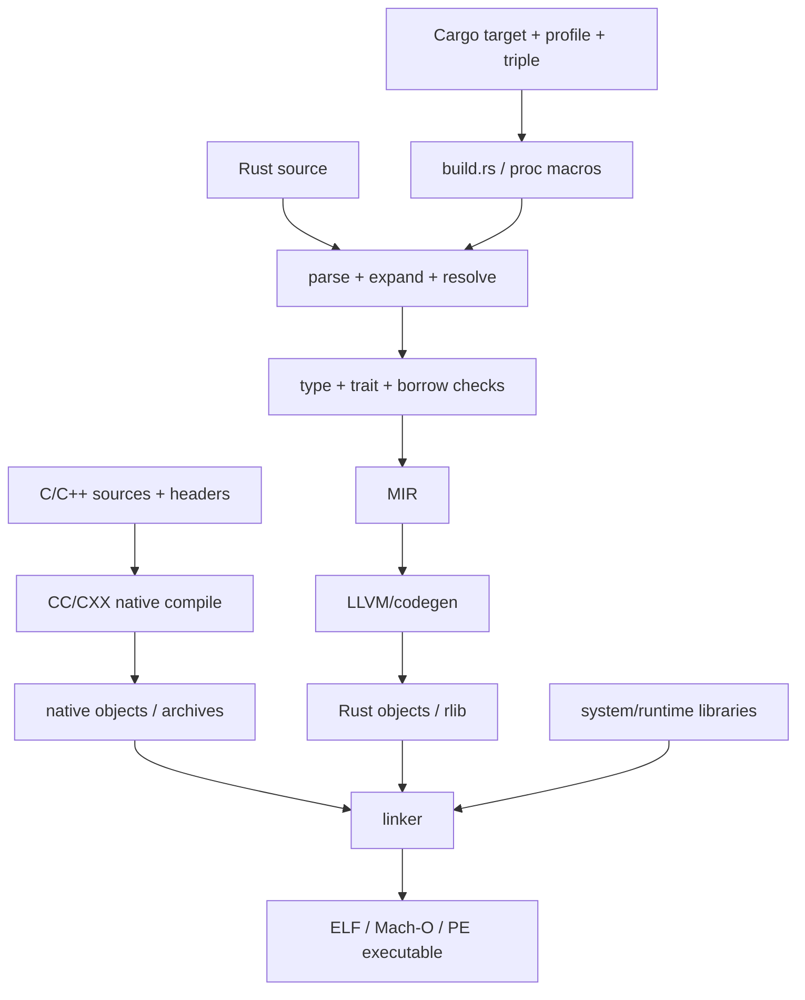
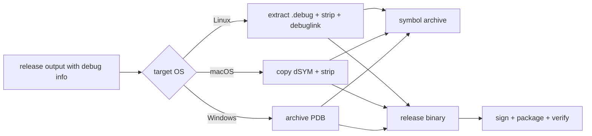
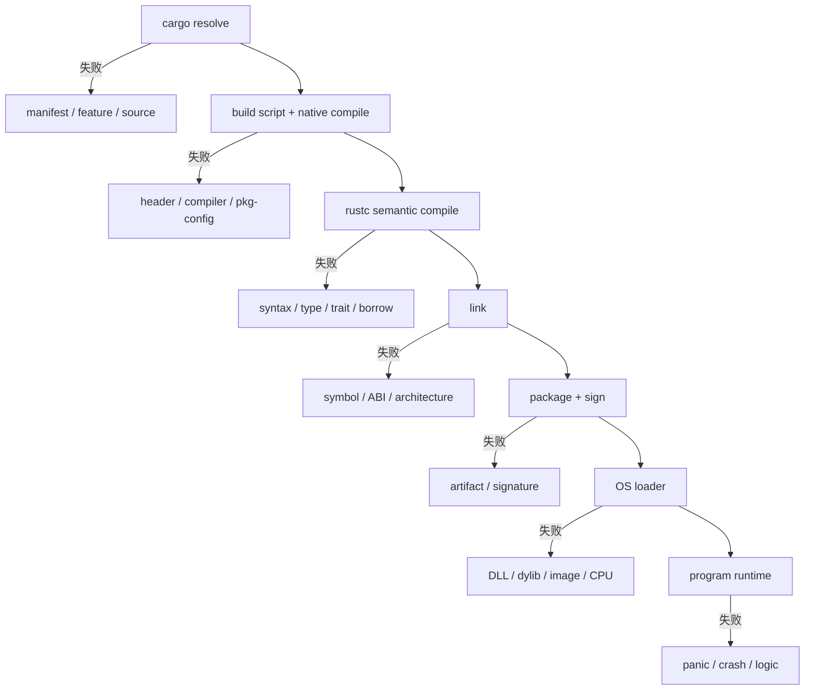

# 62：Rust 编译、链接、原生依赖与制品——从 `.rs` 到可执行文件，中间究竟发生了什么

> 源码基线：`4ee41929eaf4`
>
> 上一章关注 Cargo、Just 与 Bazel 怎样建立构建图；本章进入图中一个具体 Rust target，解释 compiler、linker 和 release 后处理怎样把源码变成机器可运行的制品。编译器内部会继续演进，因此流水线图是学习模型，不声称每次构建都把每种中间表示写成磁盘文件。

## 1. 本章解决什么问题

看到这些错误时，你能判断分别失败在哪一层吗？

```text
cannot find value `x` in this scope
the trait bound `T: Send` is not satisfied
linking with `cc` failed
undefined reference to `cap_get_proc`
library not found for -lc++
dyld: Library not loaded
foo.dll was not found
Exec format error
missing dSYM or PDB
```

本章回答：

- Cargo、rustc 和 linker 分别做什么？
- Rust crate 大致经历哪些编译阶段？
- `.rmeta`、`.rlib`、object file 和 executable 是什么？
- generic、monomorphization、codegen unit 和 LTO 怎样影响构建？
- Rust 为什么需要 C/C++ compiler、SDK、sysroot 和 system library？
- static 与 dynamic linking 的差别是什么？
- `build.rs` 怎样通过 `cargo:rustc-*` 影响编译和链接？
- `pkg-config`、header、library search path 和 ABI 各解决什么？
- Codex 的 bwrap、macOS `-ObjC`、Windows manifest 怎样接入链接？
- glibc、musl、MSVC、gnullvm 有什么关系？
- DWARF、dSYM、PDB、strip 与 symbolication 怎样配合？
- 怎样区分 compile、link、load 与 runtime 四类失败？

## 2. 先说人话：编译不是一个黑盒按钮

把：

```text
codex-rs/cli/src/main.rs
```

变成：

```text
target/<target-triple>/release/codex
```

至少要经过：

```text
Cargo 选择 package、target、feature、profile
  ↓
build script 和 proc macro 在构建平台运行
  ↓
rustc 解析、展开宏、解析名称、检查类型与借用
  ↓
生成并优化中间表示
  ↓
产生目标平台机器码 object files
  ↓
linker 合并 Rust/native objects 与 libraries
  ↓
得到 executable
  ↓
归档 debug symbols、strip、签名、打包
```

每一层都有自己的输入、输出和错误语言。

## 3. 用出版一本书建立直觉

| 构建概念 | 出版类比 |
|---|---|
| `.rs` source | 作者的章节稿 |
| parser | 检查句法结构 |
| type checker | 检查术语和引用是否自洽 |
| crate metadata | 其他卷册的目录与公开索引 |
| object file | 已排版、但地址未最终确定的章节 |
| symbol | 需要定义或被引用的条目名 |
| linker | 合并章节并解析交叉引用 |
| executable | 最终发行书籍 |
| debug symbols | 从成书页码回查原稿行号的编辑索引 |
| strip | 从发行本移走内部编辑索引 |

## 4. 第一条核心原则：Cargo 不等于 compiler

Cargo 负责：

- 选择 package 与 target；
- 解析 dependency graph；
- 决定构建顺序；
- 设置 feature、profile、target 和环境；
- 调用 build script、rustc 与 linker；
- 缓存和组织输出。

真正理解 Rust 语言并进行语义检查的核心程序是 `rustc`。

## 5. 第二条核心原则：Compiler 不等于 linker

```text
compiler
  理解 Rust，产生 metadata 和机器码片段

linker
  合并 object/library，解析 symbols 与 relocation，形成最终 image
```

rustc 会驱动 linker，但“Rust 编译成功、最终链接失败”完全可能。

## 6. 第三条核心原则：Build 成功不等于目标机能运行

Executable 已生成以后仍可能遇到：

```text
CPU architecture 不匹配
OS 或 ABI 不匹配
dynamic library 缺失
最低系统版本不兼容
签名或权限被拒绝
启动后 panic/crash
```

所以 build、load 和 run 是三层不同证明。

## 7. 用 Codex CLI 作为贯穿案例

固定提交的 `codex-rs/cli/Cargo.toml` 声明：

```toml
[package]
name = "codex-cli"
build = "build.rs"
default-run = "codex"

[[bin]]
name = "codex"
path = "src/main.rs"

[lib]
name = "codex_cli"
path = "src/lib.rs"
```

构建 `codex` binary 会涉及 package build script、library crate、binary crate 和大量依赖 crates。

## 8. `cargo build --bin codex` 怎样读

```text
cargo build     执行构建动作
--bin codex     选择 codex binary target
--release       若提供，选择 release profile
--target ...    若提供，选择 target triple
```

Cargo 会自动构建该 binary 所需的全部依赖，不只编译 `main.rs`。

## 9. Crate 编译依赖 metadata

若 `codex-cli` 使用 `codex-core` 的公开类型，编译 CLI 时可以读取已生成的 core crate metadata，而不必把 core 当成没有边界的一堆源码重新理解。

这使 crate 成为真实的接口与增量构建边界。

## 10. `.rmeta` 是什么

`.rmeta` 可理解为下游编译 Rust crate 所需的 metadata，包含类型、trait、泛型等信息。

它不是最终运行库，也不是承诺跨 rustc 版本稳定的公共格式。

## 11. `.rlib` 是什么

`.rlib` 是 Rust library 的一种静态归档形式，通常带有 Rust metadata 和 object code。

它面向 Rust 构建流程，不等同于向任意 C consumer 承诺稳定 ABI 的普通 `.a`。

## 12. Object file 是什么

常见扩展名：

```text
Unix-like   .o
Windows     .obj
```

它包含机器码和数据，但部分地址尚未确定。内部还会记录：

- 已定义 symbols；
- 仍需外部提供的 symbols；
- sections；
- relocations；
- 可选 debug information。

## 13. Executable 是什么

常见 executable/object 容器：

```text
Linux      ELF
macOS      Mach-O
Windows    PE/COFF
```

它不只有机器指令，还包含 sections、imports、entry point、权限和动态加载信息。

## 14. 编译阶段：Parsing

Parser 把 tokens 按 Rust grammar 组织成语法结构。少一个括号时，连合法语法树都无法形成，错误发生得很早。

```rust
fn main( {
```

## 15. 编译阶段：Macro expansion

```rust
println!("hello {name}");
#[derive(Serialize)]
```

声明宏与 proc macro 都可能生成代码。诊断有时同时显示宏调用点与展开内部位置。

## 16. `cfg` 改变实际参与编译的程序

```rust
#[cfg(target_os = "windows")]
fn setup_windows() {}
```

Linux target 下该 item 不进入相同的有效程序。因此“文件里存在”不代表当前 target 能看到。

## 17. Name resolution

名称解析回答：

```text
这个 Config 指哪个定义？
module path 是否存在？
item 是否可见？
import 是否冲突？
```

`cannot find ... in this scope` 通常属于这里，不是 linker 缺 symbol。

## 18. Type checking

类型检查验证函数参数、返回值、trait bound、generic constraint、method resolution 和 coercion。

`expected X, found Y` 是 compile-time semantic error。

## 19. Borrow checking

Borrow checker 证明：

```text
值是否已 move？
引用活得是否够久？
mutable 与 shared borrow 是否冲突？
跨 await 保存的状态是否安全？
```

它失败时 linker 尚未开始。

## 20. Trait solving 与 `Send`

Codex 大量使用 Tokio。若 future 被放到多线程 executor，常要求 `Send`。

```text
future cannot be sent between threads safely
```

这是类型/trait 推导失败，不是线程运行后才出错。

## 21. MIR 是什么

MIR 是 Rust compiler 的中层中间表示：比源码低层，控制流更明确，但尚未降到具体 CPU 指令。

借用检查、部分优化和后续 codegen 会围绕中间表示工作。

## 22. LLVM IR 是什么

常见 rustc 后端会把 MIR 进一步降低到 LLVM IR，由 LLVM 优化并生成目标机器码。

重点是区分：

```text
Rust 语言语义检查
与
目标 CPU 机器码优化
```

## 23. Code generation

Codegen 把中间表示变成目标架构机器码。同一源码为 x86_64 与 aarch64 构建，会产生不同指令。

目标 CPU features 也会影响可使用的指令集。

## 24. Codegen unit

Compiler 可把一个 crate 分成多个 codegen units 并行处理：

```text
更多 units：通常并行编译更快，但跨单元优化机会可能减少
更少 units：可能优化更充分，但编译并行度降低
```

固定提交的 release profile 设为 4。

## 25. Monomorphization

```rust
fn identity<T>(value: T) -> T { value }
```

Compiler 通常为实际使用的具体类型生成专门机器码，例如 `identity::<u64>`。这叫 monomorphization。

## 26. Generic 为什么影响下游 codegen

下游需要足够信息为自己的具体类型实例化泛型，所以：

- metadata 不只是简单函数地址表；
- 泛型可能增加编译时间和 binary size；
- 公共泛型实现变化可能影响多个下游 crate。

## 27. Dynamic dispatch 与 vtable

```rust
Box<dyn Tool>
```

这类调用可能通过 vtable 间接分派，而不是在调用点静态选定具体实现。

它是否更快、更慢或更小不能凭直觉决定，应由 workload 测量。

## 28. Inline

Inlining 把被调函数机器码合入调用点，可能减少调用开销并创造优化机会，也可能增大 binary。

小函数不保证一定 inline；`#[inline]` 也不是无条件命令。

## 29. Optimization level

开发构建通常重视编译速度和调试，release 更重视运行性能与制品质量。

性能比较必须确认 profile，不能拿 debug build 代表发布性能。

## 30. LTO 与 ThinLTO

LTO 即 Link Time Optimization，让 optimizer 跨越传统 codegen/library 边界观察更多程序。

固定提交 release profile 使用：

```toml
lto = "thin"
```

ThinLTO 旨在平衡跨单元优化能力与构建成本。

## 31. Linker 的核心任务

```text
收集 object files 与 libraries
解析未定义 symbol 的提供者
选择和排列 sections
应用 relocations
确定最终 virtual addresses
写出 executable/shared library image
```

若需要的 symbol 没有任何 input 提供，就会出现 undefined reference。

## 32. Symbol

Symbol 是 linker 可识别的函数、静态变量或外部入口名字。Rust 函数实际 symbol 往往编码 namespace、generic type 等信息。

## 33. Name mangling

Compiler 将 module path、generic 实例等编码进 linker symbol，这叫 name mangling。

Demangler 可以把错误日志中的长 symbol 恢复成更可读的 Rust 名字。

## 34. Defined 与 undefined symbol

一个 object 可以说：

```text
我定义了 bwrap_main
我需要 cap_get_proc
```

Linker 在所有 inputs 中找 `cap_get_proc`。若 `libcap` 未加入或 ABI 名字不匹配，就会失败。

## 35. Relocation

Object 生成时最终地址未知，compiler 留下“这里需要填某 symbol 地址”的记录。Linker 完成布局后再修正，这种记录就是 relocation。

## 36. Section

Object/image 常按用途分区：

```text
code/text
read-only data
writable data
zero-initialized data
debug information
symbol/string tables
platform metadata
```

精确名称依 ELF、Mach-O、PE/COFF 而异。

## 37. Static library

Unix 常见 `.a`；Windows `.lib` 可能是 static 或 import library，需结合工具链判断。

静态链接时，linker 从 archive 抽取需要的 object code 放进最终 image。

## 38. Dynamic library

```text
Linux      .so
macOS      .dylib
Windows    .dll，通常配 import library
```

Executable 通常只记录运行时要加载它们，而不复制全部代码。

## 39. Rust 依赖静态合入不等于完全静态 executable

Rust crates 常静态合入 binary，但程序仍可能依赖 OS shared libraries。

应检查实际制品：

```text
Linux    file / readelf / ldd
macOS    file / otool -L
Windows  dumpbin /DEPENDENTS 等
```

不能只凭 `--release` 下结论。

## 40. Dynamic loader

OS 启动 executable 时，loader 映射程序与 shared libraries、解析 imports、应用运行时 relocation，然后进入 entry point。

它发生在 build 完成以后。

## 41. Linker error 与 loader error

```text
linker error：构建机器上无法生成 executable
loader error：executable 已存在，但目标机器无法启动或加载依赖
```

二者可能都出现“library not found”，时间点和修复方式却不同。

## 42. ABI

ABI 即 Application Binary Interface，规定：

```text
参数和返回值怎样传递
symbol 命名
数据布局与对齐
异常/展开规则
object format
运行库约定
```

API 相同不保证 ABI 相同。

## 43. Calling convention

调用约定是 ABI 的一部分。Rust 默认 ABI 不承诺跨 compiler/version 稳定。

与 C 交互时通常声明明确 `extern "C"`，精确签名必须与 C 侧一致。

## 44. FFI

FFI 即 Foreign Function Interface，让 Rust 调用 C ABI 函数或反向导出。

Rust 类型系统无法完整保护 FFI，需人工维护：

- pointer 生命周期与 null；
- ownership 和 buffer 长度；
- struct layout；
- thread safety；
- unwind 边界；
- integer 宽度。

## 45. Header 与 library

```text
header：给 C/C++ compiler 看声明、类型、macro
library：给 linker/loader 提供实现机器码
```

找到 header 不代表能找到 library，反之亦然。

## 46. Include path

C compiler 要知道去哪里寻找：

```c
#include <sys/capability.h>
```

它通常由 `-I`、sysroot 或 build system 设置，作用于 native compile 阶段。

## 47. Library search path

Linker 要知道去哪里找 `libcap.a`、`libcap.so` 等。Build script 可输出：

```text
cargo:rustc-link-search=native=/some/path
```

## 48. `rustc-link-lib`

```text
cargo:rustc-link-lib=cap
```

表示后续需要链接名为 `cap` 的 native library。它不负责下载 library，也不保证 architecture/ABI 正确。

## 49. Link order 为什么有时重要

特别是 static archive，传统 linker 可能按输入顺序扫描，只抽取当时需要的 objects。

Library 是否进入、顺序和 group/whole-archive 规则都可能影响 unresolved symbols。应正确表达依赖，而不是随意堆 flags。

## 50. `build.rs` 是 Cargo 与外部构建世界的桥

Build script 可输出：

```text
rerun-if-changed
rerun-if-env-changed
rustc-cfg
rustc-check-cfg
rustc-link-search
rustc-link-lib
rustc-link-arg
```

Cargo 读取 stdout 中的 protocol lines，改变后续构建。

## 51. `OUT_DIR`

Cargo 给 build script 分配输出目录。生成 header、source 或 native artifact 应放到受管理区域，不应随意污染源码树。

## 52. `CARGO_MANIFEST_DIR`

它指向当前 package manifest 目录，build script 常据此寻找 vendored source。

Bazel action 不能假设 Cargo 环境天然存在；仓库构建规则需显式模拟或用另一条 native rule 表达。

## 53. `rerun-if-changed`

它声明 build script 的文件输入。遗漏真实输入可能错误复用旧输出；声明过宽则会无谓重跑。

## 54. `rerun-if-env-changed`

环境变量也可能是构建输入，例如：

```text
CODEX_BWRAP_SOURCE_DIR
PKG_CONFIG_PATH
PKG_CONFIG_SYSROOT_DIR
```

变量变化后 Cargo 会重新运行 build script。

## 55. `rustc-check-cfg` 与 `rustc-cfg`

Bwrap build script 先声明合法自定义 cfg：

```text
cargo:rustc-check-cfg=cfg(bwrap_available)
```

构建成功后再设置：

```text
cargo:rustc-cfg=bwrap_available
```

Rust source 可据此条件编译实现。

## 56. `cc` crate

`cc::Build` 帮助 Cargo build script 驱动 C/C++ compiler，将 native source 编译成 archive/object，并输出 linking metadata。

它不是 Rust compiler，也不自动提供 SDK。

## 57. `pkg-config`

它通过 `.pc` metadata 回答：

```text
include paths 在哪里？
library paths 在哪里？
链接哪些 libraries？
版本是否满足？
```

它是发现机制，不是 compiler 或 downloader。

## 58. Codex bwrap：完整 native build 案例

`codex-rs/bwrap/build.rs` 在 Linux target：

1. 找 vendored bubblewrap C source；
2. 用 pkg-config 探测 `libcap`；
3. 在 `OUT_DIR` 写 `config.h`；
4. 用 `cc::Build` 编译四个 C 文件；
5. 将 C `main` 改名为 `bwrap_main`；
6. 加入 libcap include paths；
7. 输出 link search 与 link lib；
8. 设置 `bwrap_available` cfg。

## 59. 为什么把 C `main` 改为 `bwrap_main`

最终 executable 已有 Rust 入口。若 vendored C code 仍定义另一个 `main`，会冲突。

```text
-Dmain=bwrap_main
```

把它变为 Rust wrapper 可调用的普通 symbol。

## 60. `-idirafter` 为什么不是普通 `-I`

Bwrap 注释说明：musl cross build 时，要让 target sysroot headers 优先，同时允许找到 toolchain 的 libcap header。

`-idirafter` 将目录放到系统搜索顺序更后面，降低 host glibc header 覆盖 target musl header 的风险。

## 61. Header 混用为何危险

为 musl target 编译却读取 host glibc header，声明、macro 或 layout 可能属于另一 libc。

有时立即 compile fail；更糟时可能成功生成 ABI 不一致的 code。

## 62. Sysroot

Sysroot 是 target headers、libraries 与 runtime objects 的根视图。

Cross compiler 应从它获取目标材料，而不是误用 host `/usr/include` 和 `/usr/lib`。

## 63. Native compiler 与 Rust linker 的变量

Musl 安装脚本设置：

```text
CC / CXX
CC_<target> / CXX_<target>
CMAKE_C_COMPILER / CMAKE_CXX_COMPILER
CARGO_TARGET_<TARGET>_LINKER
```

因为不同 native build systems 查询不同变量，编译 C/C++ 与最终链接 Rust executable 也可能由不同 driver 承担。

## 64. Compiler driver 与 linker

`cc`、`clang`、`musl-gcc` 可作为 driver：接收高层 flags，调用 assembler/linker，并自动加入 startup objects、runtime libraries 与默认 search paths。

所以“linking with cc failed”不表示 C compiler 正在解析 Rust；它可能只是链接驱动。

## 65. glibc 与 musl

它们是不同 Linux libc 实现，涉及 ABI、dynamic loader 与部署环境。

固定提交的 Linux release targets 是：

```text
x86_64-unknown-linux-musl
aarch64-unknown-linux-musl
```

这减少对目标机 glibc 环境的耦合，但仍应检查最终 binary 的实际动态 imports。

## 66. CRT

CRT 可指 C runtime 与启动支持，提供进程入口桥、allocation/I/O/thread 等运行库、startup objects 和平台 ABI 支撑。

CRT symbol 或 startup object 错误通常属于工具链/target 配置。

## 67. Windows MSVC 与 gnullvm

Codex 同时考虑：

```text
*-pc-windows-msvc
*-pc-windows-gnullvm
```

二者都面向 Windows，但工具链、ABI constraint、link flags 与 native artifacts 可能不同。

## 68. `+crt-static`

固定提交 `.cargo/config.toml` 对 Windows MSVC 设置：

```toml
"-C", "target-feature=+crt-static"
```

它请求静态 CRT，但不能据此推断 executable 没有任何动态 system dependency。

## 69. Windows stack reserve

Cargo 配置传：

```text
/STACK:8388608
```

Bazel `defs.bzl` 也为 MSVC/gnullvm 映射等价的 8 MiB reserve。这是 Cargo/Bazel linker parity 的真实案例。

## 70. macOS `-ObjC`

CLI build script：

```rust
if std::env::var("CARGO_CFG_TARGET_OS").as_deref() == Ok("macos") {
    println!("cargo:rustc-link-arg=-ObjC");
}
```

`defs.bzl` 也为涉及 libwebrtc 的 macOS targets 添加 `-ObjC` 与 `-lc++`。

## 71. Objective-C category 为什么需要特殊处理

源码注释说明 libwebrtc 使用 native archives 中的 Objective-C categories。普通按需 archive 抽取可能看不到直接 symbol 引用，`-ObjC` 要求 linker 加载相关 objects。

缺 flag 时不一定总是链接失败，也可能到运行时才表现为 selector/category 行为缺失。

## 72. `-lc++`

它要求链接 C++ standard library `libc++`。若依赖含 C++ objects，仅有这些 object code 仍可能缺少标准库、exception 或 runtime symbols。

## 73. Windows manifest 嵌入案例

`codex-rs/windows-sandbox-rs/build.rs` 只为：

```text
codex-windows-sandbox-setup
```

添加 manifest link arguments，并为 MSVC 与 GNU/LLVM ABI 产生不同 flag 形状。

## 74. 为什么 link arg 限定到一个 binary

Build script 使用：

```text
rustc-link-arg-bin=<name>=...
```

而不是给 package 所有产物加参数。这样 linking 该 library 的其他 Codex binaries 不会继承 setup helper 的 resource metadata。

## 75. Bazel 路径不一定执行相同 build.rs

Bwrap `BUILD.bazel` 明确：

```starlark
build_script_enabled = False
```

因为 Bazel 已用 `cc_library` 连接 vendored C sources 与 `@libcap`，并直接设置 `--cfg=bwrap_available`。

## 76. 行为一致不等于步骤完全相同

```text
Cargo：build.rs → pkg-config → cc::Build → Cargo link metadata
Bazel：cc_library + deps_extra + rustc_flags_extra
```

两者步骤不同，但产品语义都是让 Rust wrapper 链接 bwrap C 实现并启用相应 cfg。

## 77. Bazel 为何偏好显式 native target

`cc_library` 能明确声明：

- 每个 source/header；
- compiler flags；
- platform compatibility；
- native dependency；
- 可缓存 action。

这比 build script 任意扫描 host 系统更适合 hermetic graph。

## 78. `cc_library` 的真实结构

Bwrap BUILD 大意是：

```starlark
cc_library(
    name = "bwrap-ffi",
    srcs = ["//codex-rs/vendor:bubblewrap_c_sources"],
    hdrs = ["config.h", "//codex-rs/vendor:bubblewrap_headers"],
    copts = ["-D_GNU_SOURCE", "-Dmain=bwrap_main"],
    deps = ["@libcap"],
)
```

Native source、header、define 和 library 都成为图中显式输入。

## 79. Native artifact 的 architecture 必须匹配

将 x86_64 `.a` 链入 aarch64 target，不会因函数名相同而成功。至少要匹配：

```text
CPU architecture
object format
OS/ABI
runtime assumptions
compiler/linker compatibility
```

## 80. `pkg-config` cross 模式的风险

若 cross build 允许 pkg-config 却未隔离 search path，它可能返回 host library。

Codex musl 脚本设置 target-specific `PKG_CONFIG_PATH/LIBDIR`，并避免从 host glibc directories 解析 target libraries。

## 81. `libcap.pc`

Musl 脚本为 target `libcap.a` 生成 `.pc` 文件，记录：

```text
prefix
libdir
includedir
Libs: -L... -lcap
Cflags: -I...
```

Bwrap 的 pkg-config probe 因此能发现正确 target artifact。

## 82. Native source checksum

脚本下载 libcap source tarball 后验证 SHA-256，再解包构建。

Checksum 证明 bytes 与固定期望一致，不能单独证明源码安全，但可阻止无声漂移和传输损坏。

## 83. `ar` 与 `ranlib`

```text
ar      把 object files 打包进 static archive
ranlib  建立或更新 archive symbol index
```

现代工具可能整合功能，但日志仍常出现这些名字。

## 84. Debug information

Debug info 将 machine addresses 映射到：

```text
函数名
源文件
行号
局部变量和类型
inline call chain
```

Debugger、profiler 和 crash symbolication 都依赖它。

## 85. Debug build 与 debug symbols 不是同义词

Release build 也能保留 debug info；debug build 也可减少它。

固定提交 release profile：

```toml
debug = "line-tables-only"
strip = false
```

这是为了让发布 binary 在后处理前仍可 symbolicate。

## 86. Linux 的独立 debug file

发布脚本执行：

```text
objcopy --only-keep-debug binary binary.debug
strip --strip-debug --strip-unneeded binary
objcopy --add-gnu-debuglink=binary.debug binary
```

这样发行 binary 较小，同时保留独立 debug information。

## 87. macOS dSYM

Mac release 设置 packed split debug info，并要求每个 binary 具有 `.dSYM` bundle。

脚本复制 dSYM 后运行 `strip -S -x`。dSYM 保存 crash address 到源码位置的关键映射。

## 88. Windows PDB

Windows workflow 要求每个 binary 对应 `.pdb`，先将 `.exe/.pdb` 一起 staging，再单独归档 symbols。

PDB 即 Program Database，是 Windows/MSVC 常见 debug symbol 数据库。

## 89. Strip

Strip 从发行 binary 移除不需交付给用户的 symbol/debug sections，以减小体积并减少内部信息暴露。

错误 strip 可能破坏动态 symbols、签名或 symbolication，所以必须使用平台正确选项。

## 90. 为什么先归档 symbols 再 strip

若顺序反过来：

```text
先删除 debug mapping
  ↓
无法从 stripped binary 完整恢复
```

所以 release workflow 先抽取/复制 symbols，再 strip 最终 binary。

## 91. Build ID、UUID 与 GUID

独立 symbols 必须与准确 binary 对应。常见身份包括 build ID、Mach-O UUID、PDB GUID/age 或 GNU debug link。

只按文件名匹配不可靠：多个版本都可能叫 `codex`。

## 92. Symbolication

Crash log 可能只有：

```text
0x0000000101234567
```

Symbolication 用准确 binary layout 与 debug symbols 将它还原为函数、源文件和行号。

Symbols 与 binary 不匹配时，结果会错误或为空。

## 93. Optimization 为何让调试更难

优化后：

- 函数可能 inline；
- 变量可能消失；
- 指令顺序与源码不同；
- 一行可能对应不连续地址；
- tail call 会改变 stack。

Release symbols 很重要，但不能保证像 debug build 一样直观。

## 94. Panic 与 crash

```text
panic：Rust 代码触发失败，可能 unwind 或 abort
crash：更广义异常终止，包括 signal、access violation、abort
```

FFI memory bug 可能绕过 Rust safety，表现为 native crash。

## 95. Unwind 与 abort

Panic strategy 可选择沿 stack 清理传播，或直接终止进程。

跨 FFI boundary unwind 必须谨慎；边界应按 ABI 契约捕获或禁止传播。

## 96. Entry point

源码看似从 Rust `fn main()` 开始，但 OS 先进入 platform runtime startup，再初始化环境并调用语言入口。

Windows manifest、CRT、loader 和签名可能在业务 `main` 之前影响启动。

## 97. `default-run`

CLI package 有多个 binaries：

```toml
default-run = "codex"
```

它帮助 `cargo run -p codex-cli` 选择默认 target，不决定 OS entry point。

## 98. Release target matrix

固定提交的 Bazel release helper 包含：

```text
linux_arm64_musl
linux_amd64_musl
macos_amd64
macos_arm64
windows_amd64
windows_arm64
```

同一逻辑程序会产生多份不同机器码和平台 image。

## 99. Cross compilation

Host 与 target 不同时，需要同时具备：

- Rust target standard library；
- target linker；
- target sysroot；
- target native libraries；
- 能在 exec/host 上运行的 build scripts 与 proc macros。

## 100. Cross compile 成功不等于运行验证

Compiler/linker 证明 image 可生成，不自动证明其能在目标机正常启动。仍需要：

```text
native target CI
emulator 或 Wine tests
真实 OS smoke
dynamic import 检查
安装包验证
```

## 101. Universal binary 与多份 binary

为 macOS x86_64 和 arm64 分别构建会得到两份 architecture-specific Mach-O。即使以后合并为 universal container，也不是“同一机器码两边都运行”。

## 102. Signing 与 compilation 的边界

Code signing 通常发生在链接和必要 strip 后。签名覆盖文件 bytes，签名后再修改 binary 通常会失效。

```text
link → archive symbols → strip → sign → package → verify
```

## 103. Packaging 不改变 architecture

把 binary 放进 `.tar.gz`、`.zip`、`.dmg` 或 npm package 只是交付包装，不会把 x86_64 转成 arm64，也不会修复缺失 shared library。

## 104. 编译错误的典型语言

```text
error[E...]
expected ... found ...
cannot borrow
use of moved value
trait bound ... is not satisfied
cannot find ... in this scope
```

先查 Rust source、type/trait/lifetime/module/cfg，而不是 library path。

## 105. 链接错误的典型语言

```text
linking with `cc` failed
undefined reference
unresolved external symbol
duplicate symbol
library not found
file format not recognized
wrong architecture
```

先查 symbols、libraries、ABI、link flags、architecture 与 link order。

## 106. Loader 错误的典型语言

```text
dyld: Library not loaded
error while loading shared libraries
DLL was not found
Exec format error
bad CPU type in executable
```

检查目标机 image format、dynamic imports、search path、architecture、minimum OS 和签名。

## 107. Runtime 错误

程序已启动后才发生：

```text
panic/backtrace
segmentation fault/access violation
illegal instruction
assertion failure
configuration/permission error
```

此时 build/link 可能正确，问题在输入、CPU feature、FFI memory safety 或业务逻辑。

## 108. `undefined reference` 排查顺序

1. 谁引用该 symbol？
2. 哪个 object/library 应定义它？
3. Library 是否真的进入 link inputs？
4. Search path 是否属于正确 target？
5. Symbol 是否因 ABI/mangling 不匹配？
6. Static archive order/group 是否正确？
7. Definition 是否被 cfg 或 visibility 排除？

## 109. `duplicate symbol` 排查顺序

可能原因：

- object 被链接两次；
- 两个 libraries 导出同名 global；
- C `main` 未重命名；
- feature/cfg 同时启用互斥实现；
- static 与 dynamic 版本重复混入。

先找到两份 definition，不要直接用 flag 忽略重复。

## 110. `library not found` 排查顺序

```text
library 是否安装或构建？
文件名是否符合工具链约定？
search path 是否传给正确 linker？
pkg-config 是否返回 host path？
target architecture/ABI 是否匹配？
static/dynamic kind 是否正确？
Bazel sandbox 是否声明该文件？
```

## 111. Wrong architecture 排查顺序

分别检查：

```text
Rust target triple
每个 native .o/.a/.lib
linker 支持的 object format
SDK/sysroot
最终 executable header
目标机器 CPU/OS
```

一个错误 native archive 足以让整条链接失败。

## 112. 本地能链接、CI 不能

常见根因：

- 本机恰好安装 system library；
- pkg-config 搜到 host `/usr/lib`；
- build script 漏声明输入；
- CI target triple 不同；
- Bazel 看不到未声明文件；
- SDK/developer environment 不同；
- 本地缓存保留旧 artifact。

正确方向是消除隐式环境，而不是继续给本机安装更多东西。

## 113. Clean build 能证明什么

清缓存重建能发现 stale artifact，却不能修复依赖声明。长期正确性要求：

```text
所有影响输出的输入都进入 build graph/action key。
```

每次全量 clean 不是替代方案。

## 114. Cargo timings

Release workflow 使用 `cargo build --timings` 并上传 HTML，可观察：

- 哪些 crates 最慢；
- 并行度是否充分；
- build scripts 何时运行；
- critical path 在哪里。

它不是运行时性能 profile。

## 115. Build performance 与 runtime performance

```text
Build performance：编译/链接耗时、cache hit、并行度、磁盘
Runtime performance：启动延迟、CPU、内存、吞吐、p95
```

LTO、codegen units 和 debug info 可能同时影响两者，但测量目标不同。

## 116. Binary size 从哪里来

- monomorphized generics；
- 静态链接依赖；
- debug info；
- panic/unwind 支持；
- native libraries；
- embedded assets；
- 多份相似实例。

先用 size/symbol 工具测量，再改 profile 或架构。

## 117. Dead code elimination

Compiler/linker 可移除不可达 code/data，但效果取决于优化级别、section 粒度、exports、dynamic loading、whole-archive 和 LTO。

源码未调用不保证一定不在 binary 中。

## 118. Reproducible build 的边界

Bit-for-bit 可复现需要控制：

- compiler/linker；
- dependency 与 native source；
- timestamps、paths、随机性；
- environment；
- SDK/sysroot；
- build scripts；
- archive order；
- signing metadata。

Pinned toolchain 与 lockfile 很重要，但不会自动完成全部控制。

## 119. 实用分层诊断表

| 最后成功阶段 | 典型失败 | 先看哪里 |
|---|---|---|
| Cargo resolution | package/feature/version 无法解析 | manifests、lockfile、source |
| Build script | command/pkg-config/header 失败 | build.rs、env、sysroot |
| Rust compile | E-code、trait/type/borrow | Rust source、cfg、API |
| Native compile | C/C++ compile error | header、defines、CC/CXX |
| Link | undefined/duplicate/wrong arch | symbols、libraries、ABI、args |
| Package | symbol/signing/file 缺失 | release script、artifact paths |
| Load | dylib/DLL/image format 错误 | target machine、imports |
| Runtime | panic/crash | logs、backtrace、symbols、input |

## 120. Rust 与 native 编译图



## 121. 发布符号处理图



## 122. 错误阶段图



## 123. 修改纯 Rust 实现时怎样验证

```text
1. 确认 package 与 target
2. 运行该 package tests
3. E-code 停留在 source/type 层排查
4. Link fail 再检查 dependency/cfg/platform
5. 大改动按约定运行 scoped fix
6. 最后 fmt 并 review diff
```

## 124. 修改 build.rs 时怎样验证

至少检查：

```text
目标平台条件
rerun 文件/环境输入
生成文件写入 OUT_DIR
错误提示是否清楚
native compiler/library search
Bazel BUILD 是否同步
clean environment 是否可复现
```

Build script 是供应链执行面，应按生产代码 review。

## 125. 修改 native dependency 时怎样验证

```text
1. 固定并核对 source/checksum
2. 确认 headers 与 library 同版本/target
3. 检查 static/dynamic kind
4. 检查每个 release triple
5. 检查 Cargo 与 Bazel wiring
6. 检查许可证和包装
7. 在目标 OS 做启动/功能 smoke
```

## 126. 修改 linker flags 时怎样验证

先问作用域：

```text
只给一个 binary？
整个 crate？
所有 transitive consumers？
只在某 OS/ABI？
只在 release？
```

再验证 Cargo/Bazel parity，以及最终 imports、symbols、size 和 runtime behavior。

## 127. 修改 release profile 时怎样验证

至少比较：

```text
build time
binary size
runtime benchmark
debug symbols
crash symbolication
签名/包装
CI disk/cache pressure
```

Profile 是多目标权衡，不是“优化越高越好”。

## 128. 初学者最容易混淆的十二组词

| 不要混淆 | 区别 |
|---|---|
| Cargo / rustc | 构建编排与解析 / Rust compiler |
| rustc / linker | Rust 语义与 codegen / 合并 objects 和 symbols |
| compile / link error | 单 crate 语义失败 / symbol、ABI、library 失败 |
| link / loader error | 构建时失败 / 目标机启动时失败 |
| `.rmeta` / `.rlib` | Rust metadata / 带 metadata 与 code 的 library artifact |
| header / library | 编译声明 / 链接或装载实现 |
| include / library path | Header 搜索 / native library 搜索 |
| API / ABI | 源码调用契约 / 二进制调用与布局契约 |
| static library / static executable | Archive input / 最终 image 的动态依赖性质 |
| debug build / debug symbols | 开发 profile / 地址到源码映射 |
| strip / 删除源码 | 移除 binary sections / 与 source file 无关 |
| cross compile / target test | 生成另一平台制品 / 在目标平台运行验证 |

## 129. Glossary：编译流水线

| 术语 | 直译或展开 | 在本章中的含义 |
|---|---|---|
| Compiler | 编译器 | 理解 Rust 并产生 metadata/机器码的 rustc |
| Parser | 解析器 | 将 tokens 按 grammar 组织为语法结构 |
| Macro expansion | 宏展开 | 将宏 invocation 展成实际 tokens/items |
| Name resolution | 名称解析 | 决定 path、import、item 和 visibility 指向 |
| Type checking | 类型检查 | 验证类型、method、trait bound 与返回契约 |
| Borrow checking | 借用检查 | 证明 ownership、reference 与 lifetime 合法 |
| Trait solving | Trait 求解 | 判断类型是否满足所需 implementations/bounds |
| MIR | Mid-level IR | Rust 语义后的中层控制流表示 |
| LLVM IR | LLVM 中间表示 | 常见 rustc backend 优化/codegen 输入 |
| Codegen | 代码生成 | 将 IR 变成目标 CPU machine code |
| Codegen unit | 代码生成单元 | Crate 内并行 codegen 与优化粒度 |
| Monomorphization | 单态化 | 为 generic 具体类型生成专门机器码 |
| Dynamic dispatch | 动态分派 | 运行时通过 vtable 选择 trait object 实现 |
| Inline | 内联 | 将函数 body 合入调用点的优化 |
| LTO / ThinLTO | 链接时优化 | 跨 codegen/library 边界的优化方案 |
| `.rmeta` | Rust 元数据 | 下游编译 API、trait、generic 所需信息 |
| `.rlib` | Rust library artifact | 面向 Rust 构建的 metadata/object archive |
| Object file | 目标文件 | 已有机器码但仍带 symbols/relocations 的 `.o/.obj` |

## 130. Glossary：链接与 ABI

| 术语 | 直译或展开 | 在本章中的含义 |
|---|---|---|
| Linker | 链接器 | 合并 objects/libraries、解析 symbols 并写 image |
| Linker driver | 链接驱动 | `cc/clang/musl-gcc` 等封装 linker/runtime inputs 的程序 |
| Symbol | 符号 | Linker 识别的函数、数据或外部入口名字 |
| Name mangling | 名字改编 | 将 namespace/generic 信息编码进 symbol |
| Demangle | 反改编 | 将编码 symbol 恢复为可读 Rust 名字 |
| Undefined symbol | 未定义符号 | 有引用但无 input 提供实现的 symbol |
| Duplicate symbol | 重复符号 | 多个 inputs 提供冲突 definition |
| Relocation | 重定位 | Linker 完成布局后修正地址引用的记录 |
| Section | 节 | Image 中 code、data、debug 等分区 |
| Static library | 静态库 | Link 时抽取 object 的 `.a/.lib` archive |
| Dynamic library | 动态库 | Loader 映射的 `.so/.dylib/.dll` |
| Dynamic loader | 动态装载器 | 启动进程时加载 libraries 与解析 imports |
| ELF / Mach-O / PE | 平台 image 格式 | Linux/macOS/Windows 主要 executable 容器 |
| API / ABI | 编程/二进制接口 | 源码契约与 calling/layout/symbol 机器契约 |
| Calling convention | 调用约定 | 参数、返回值、寄存器与 stack 规则 |
| FFI | Foreign Function Interface | Rust 与 C 等外部 ABI 互调边界 |
| CRT | C runtime | 平台启动、标准运行库与 ABI 支持 |
| Entry point | 入口点 | Loader 开始执行 program image 的地址/启动链 |

## 131. Glossary：Native build 与跨平台

| 术语/代码词 | 字面含义 | 实际作用 |
|---|---|---|
| Native dependency | 原生依赖 | C/C++/系统 ABI 提供的 source、header 或 library |
| Header / include path | 头文件/包含路径 | Native compiler 的声明及其搜索目录 |
| Library search path | 库搜索路径 | Linker 寻找 archive/shared library 的目录 |
| `build.rs` / `OUT_DIR` | 构建脚本/输出目录 | Cargo 编译前程序与受管理生成物位置 |
| `rerun-if-*` | 变化时重跑 | Build script 文件与环境输入声明 |
| `rustc-link-search` | 链接搜索 | 向 rustc/linker 增加 native directory |
| `rustc-link-lib` | 链接库 | 要求链接指定 native library |
| `rustc-link-arg(-bin)` | 链接参数 | 给全部或指定 binary 传额外 linker flag |
| `rustc-cfg` | 编译配置 | 由 build script 启用 conditional code |
| `cc` crate | C/C++ 构建辅助 | 从 build.rs 驱动 native compile/archive |
| `pkg-config` | 包配置发现 | 从 `.pc` 查询 include/library flags |
| Sysroot | 系统根 | Cross build 的 target headers/libraries 根视图 |
| glibc / musl | Linux C libraries | 不同 libc、loader 和发布工具链选择 |
| MSVC / gnullvm | Windows 工具链 | 不同 Windows ABI/linker/native artifact 路径 |
| `+crt-static` | 静态 CRT feature | 请求静态链接对应 C runtime |
| `-ObjC` / `-lc++` | macOS linker flags | Objective-C categories 与 C++ runtime linking |
| `cc_library` | Bazel C/C++ rule | 显式声明 native source、header、flag 和 deps |
| Cross compilation | 交叉编译 | Host/exec 与最终 target 不同的构建 |

## 132. Glossary：制品与诊断

| 术语 | 直译或展开 | 在本章中的含义 |
|---|---|---|
| Artifact | 制品 | `.rlib`、object、executable、symbols archive 等输出 |
| Debug information | 调试信息 | 地址到函数、文件、行号与变量的映射 |
| DWARF | 调试格式族 | Linux/Unix-like 常见 debug representation |
| dSYM | 调试符号包 | macOS 独立 symbol bundle |
| PDB | Program Database | Windows/MSVC 常见 debug database |
| Strip | 剥离 | 从 release binary 移除不必要 debug/symbol sections |
| Symbol archive | 符号归档 | 离线保存与 binary 精确匹配的 debug info |
| Symbolication | 符号化 | 将 crash addresses 还原为函数与源码位置 |
| Build ID / UUID / GUID | 构建身份 | 将 binary 与准确 symbols 对应的标识 |
| Loader error | 装载错误 | Binary 已生成但 OS 无法加载 image/dependency |
| Runtime crash | 运行崩溃 | 程序启动后因 panic、signal、access violation 等终止 |
| `objcopy` / `strip` | Object 转换/剥离工具 | 抽取 debug info、添加 debuglink、缩小 binary |
| Cargo timings | Cargo 构建时序 | Crate/build-script 编译关键路径，不是运行 profile |
| Reproducible build | 可复现构建 | 相同声明输入尽量产生相同结果的性质 |

## 133. 理解检查

1. Cargo、rustc 和 linker 分别负责什么？
2. 为什么 crate 编译成功仍可能 link fail？
3. `.rmeta`、`.rlib`、object 与 executable 有何区别？
4. Generic 为什么影响下游 codegen？
5. LTO 与 codegen units 在权衡什么？
6. Header 找到了，为何 library 仍可能找不到？
7. API 一样，为何 ABI 仍可能不兼容？
8. Build script 怎样声明输入、设置 cfg 与链接 library？
9. Bwrap 的 Cargo/Bazel 路径为何不同却能追求 parity？
10. Musl cross build 为何不能读取 host glibc materials？
11. `-ObjC` 与 Windows manifest 为何属于 link 问题？
12. Release build 为何仍保留 line-table debug info？
13. `.debug`、dSYM 与 PDB 各做什么？
14. Linker error 与 loader error 怎样区分？
15. Cross compile 后为何仍需 target test？

## 134. 动手练习一：给错误分层

标注以下错误的阶段与第一检查点：

```text
error[E0382]: use of moved value
pkg-config exited with status 1
undefined reference to bwrap_main
file format not recognized
dyld: Library not loaded
illegal instruction
PDB not found
```

## 135. 动手练习二：追踪 bwrap

从以下入口画 Cargo 图：

```text
codex-rs/bwrap/Cargo.toml
codex-rs/bwrap/build.rs
codex-rs/vendor/bubblewrap
libcap.pc
cc::Build
bwrap_main
Rust binary
```

再画 Bazel 图，并标出它为何不执行 Cargo build.rs。

## 136. 动手练习三：比较三个平台

| 平台 | Executable 格式 | Debug artifact | Strip/提取工具 | 动态依赖检查 |
|---|---|---|---|---|
| Linux |  |  |  |  |
| macOS |  |  |  |  |
| Windows |  |  |  |  |

目标是形成“同一概念、不同平台具体化”的习惯。

## 137. 源码检查点

1. `codex-rs/Cargo.toml`
   - 看 profiles、ThinLTO、debug、split-debuginfo 与 strip。
2. `codex-rs/rust-toolchain.toml`
   - 看 rustc 版本和工具 components。
3. `codex-rs/.cargo/config.toml`
   - 看 Windows stack、CRT 与 Arm64 flags。
4. `codex-rs/cli/Cargo.toml`
   - 看 build.rs、library、多 binaries 与 default-run。
5. `codex-rs/cli/build.rs`
   - 看 macOS `-ObjC`。
6. `codex-rs/cli/BUILD.bazel`
   - 看 native flags、bwrap 与 multiplatform targets。
7. `codex-rs/bwrap/Cargo.toml`
   - 看 Linux 与 cc/pkg-config dependencies。
8. `codex-rs/bwrap/build.rs`
   - 看 OUT_DIR、vendored C、libcap、link metadata 与 cfg。
9. `codex-rs/bwrap/BUILD.bazel`
   - 看 disabled build.rs、cc_library 与 explicit cfg。
10. `codex-rs/windows-sandbox-rs/build.rs`
    - 看 binary-scoped manifest args 与 ABI branches。
11. `codex-rs/windows-sandbox-rs/Cargo.toml`
    - 看 library、setup 与 command-runner targets。
12. `defs.bzl`
    - 看 Windows stack/UCRT 与 macOS `-ObjC/-lc++`。
13. `MODULE.bazel`
    - 看 hermetic LLVM、macOS SDK 和 rules_cc。
14. `bazel/platforms/release_binaries.bzl`
    - 看六个 release platforms。
15. `.github/scripts/install-musl-build-tools.sh`
    - 看 linker、Zig wrapper、sysroot、target libcap 与 pkg-config。
16. `.github/actions/setup-msvc-env/action.yml`
    - 看 target-specific MSVC SDK environment。
17. `.github/workflows/rust-release.yml`
    - 看 matrix、musl、timings、symbols、strip 与 signing。
18. `.github/workflows/rust-release-windows.yml`
    - 看 exe/PDB staging 与 symbol jobs。
19. `.github/scripts/archive-release-symbols-and-strip-binaries.sh`
    - 看 `.debug`、dSYM、PDB 三条分支。
20. `.github/actions/setup-rusty-v8/action.yml`
    - 看 native artifact override 与 checksum。

## 138. 一句话总结

> Rust 源码不会被 Cargo 直接变成一个可执行文件：Cargo 先按 package、feature、profile 和 target 编排 crate graph，rustc 再经过宏展开、名称/类型/借用检查、MIR、codegen 与 monomorphization 产生 metadata 和 objects，linker 随后按 symbol、relocation 与 ABI 把 Rust code、C/C++ objects、CRT 和系统库合成 ELF、Mach-O 或 PE；build.rs、pkg-config、sysroot 与平台 flags 决定 native 边界是否正确，发布流程还必须按 binary 身份归档 DWARF/dSYM/PDB、strip、签名和包装——只有把 compile、link、load、runtime 四个阶段分开，才能从长错误日志直接走向正确的源码、工具链或目标机器。
