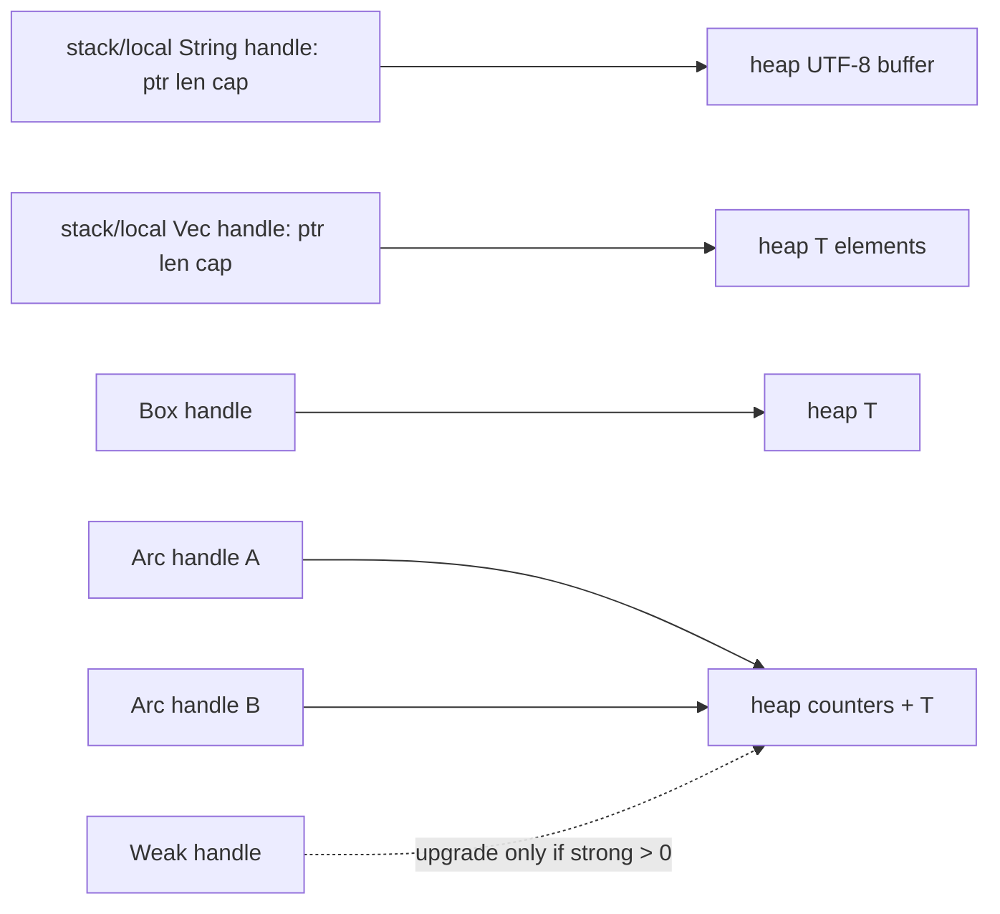
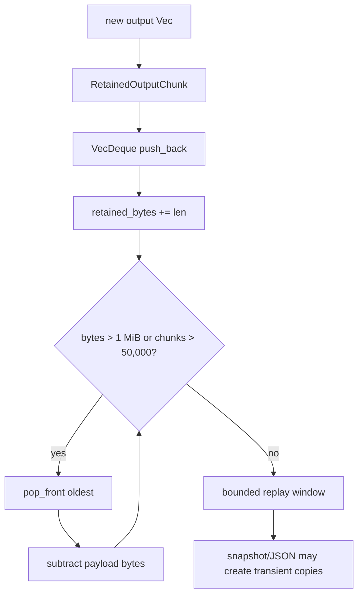
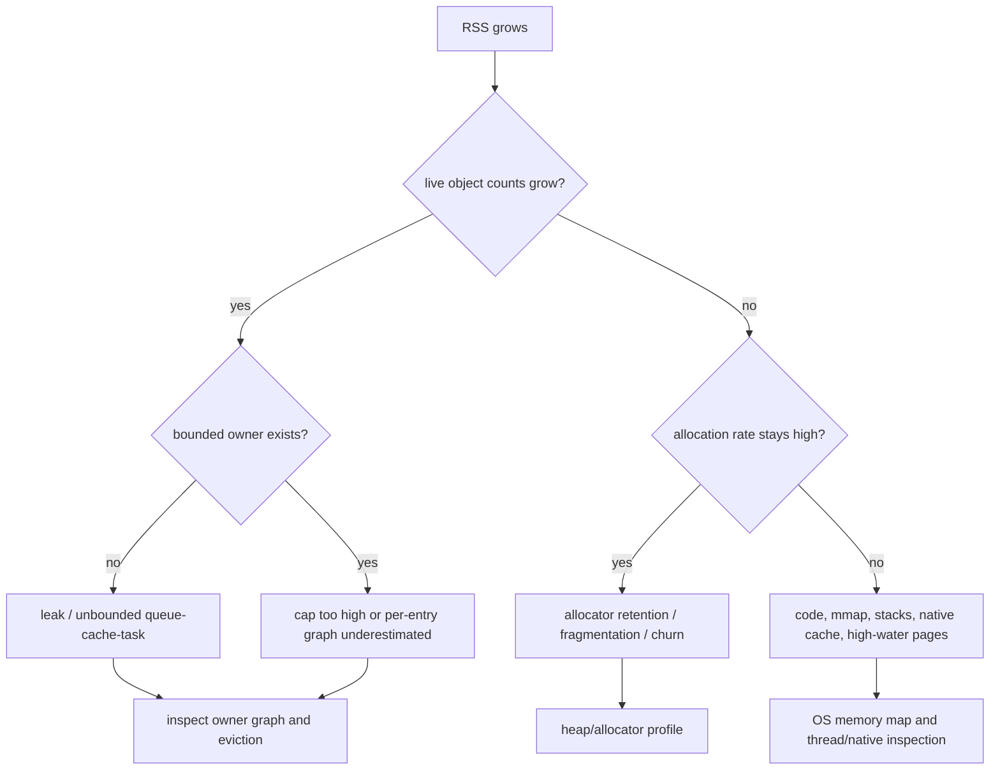

# 63：Rust 运行时内存——栈、堆、布局、分配、共享所有权与 OOM

> 源码基线：`4ee41929eaf4`
>
> 第 26 章讲怎样阅读 `Arc`、`Box`、borrow 等 Rust 类型；第 37、38 章讲性能剖析与容量；第 48 章讲资源关闭。本章专门补充它们中间的“内存物理模型”：一个值大致放在哪里、clone 会不会复制 payload、collection 的 length/capacity 怎样变化、为什么逻辑数据删掉后 RSS 未必马上下降，以及怎样证明内存增长的真正原因。

## 1. 本章解决什么问题

看到下面代码时，你能估计发生了多少次分配和复制吗？

```rust
let a = String::from("hello");
let b = a.clone();
let c = Arc::new(a);
let d = Arc::clone(&c);
let bytes = Bytes::from(vec![1, 2, 3]);
let retry = bytes.clone();
```

本章回答：

- Stack 与 heap 分别是什么？
- `String`、`Vec<T>`、`Box<T>`、`Arc<T>` 自身和 payload 放在哪里？
- `&str`、slice、trait object 为什么常是 fat pointer？
- `len`、`capacity` 与真实内存占用有什么区别？
- `clear`、`truncate`、`drain`、`drop`、`shrink_to_fit` 各改变什么？
- `Clone` 为什么有时深拷贝，有时只是引用计数加一？
- `Arc<Mutex<T>>` 到底共享了什么？
- `Weak<T>` 怎样阻止强引用环延长对象寿命？
- async future 为什么可能很大，`BoxFuture` 又解决什么？
- Enum 为什么有时把大 variant 放进 `Box`？
- 1 MiB 数据上限为什么还不等于只占 1 MiB 内存？
- 内存泄漏、缓存保留、allocator retention 与 fragmentation 怎样区分？
- OOM、stack overflow、use-after-free 在 Rust 中分别怎样出现或被阻止？
- 怎样系统调查 RSS 持续增长？

## 2. 先说人话：变量不是“一个名字装着数据”

这段代码：

```rust
let text = String::from("hello");
```

可以先建立一个概念模型：

```text
当前函数的局部值 text
  ├── pointer ──────────────┐
  ├── length = 5            │
  └── capacity >= 5         │
                            ↓
                     heap buffer: hello
```

`String` handle 与字符 bytes 不是同一块逻辑内容。

## 3. 用酒店前台与仓库建立直觉

| 内存概念 | 类比 |
|---|---|
| Stack frame | 当前客人的前台登记夹 |
| Heap allocation | 后方仓库中按需租用的储物格 |
| Pointer | 储物格编号 |
| Length | 当前实际放了多少物品 |
| Capacity | 已租储物格最多能放多少 |
| Move | 把唯一提货权交给新登记夹 |
| Borrow | 临时查看，不取得储物格所有权 |
| Clone `String` | 再租一个格子并复制物品 |
| Clone `Arc` | 复制提货卡并增加持有人计数 |
| Drop | 最后 owner 归还储物格 |
| Leak | 没人再需要，却始终没有归还条件 |

## 4. 第一条核心原则：Rust 语义不等于调试器中的固定地址

为学习方便，我们常说局部变量在 stack、`Box` payload 在 heap。但 optimizer 可能：

- 把值放寄存器；
- 完全消除变量；
- 拆分 struct fields；
- inline 函数；
- 复用 stack slots。

因此“栈/堆图”是所有权和分配模型，不是每条优化后指令的承诺。

## 5. 第二条核心原则：类型大小不等于它拥有的总内存

`size_of::<String>()` 只测 handle 的 inline size，不包含 heap buffer。

类似地：

```text
Vec<T>          不包含它指向的 elements allocation
Box<T>          不包含 boxed T
Arc<T>          不包含 control block 与 T allocation
HashMap<K,V>    不包含 buckets
```

调查内存必须同时看 handle、payload、capacity 和额外 metadata。

## 6. 第三条核心原则：有界逻辑数据不自动等于相同数量的物理内存

若“最多保留 1 MiB output”，真实内存还可能包括：

```text
每个 chunk 的 Vec handle 与 allocation metadata
VecDeque slots
sequence/stream fields
HashMap/HashSet buckets
Arc/Mutex/control blocks
临时 clone 和序列化 buffer
allocator rounding 与 fragmentation
```

这正是 Codex 远程进程同时限制 bytes 与 chunk count 的原因。

## 7. Stack 是什么

每个 OS thread 通常拥有调用栈。函数调用会建立 stack frame，用于保存：

- 返回地址和调用约定状态；
- 部分局部变量；
- spilled registers；
- 临时值；
- unwind metadata 所需状态。

函数返回时，整个 frame 以栈指针移动的方式快速回收。

## 8. Stack allocation 为什么快

一般不需要向通用 allocator 搜索空闲块；调整 stack pointer 就能为新 frame 留空间。

但“快”不表示容量无限。每条 thread stack 有固定或可增长边界。

## 9. Stack overflow

常见原因：

- 无界递归；
- 极深调用链；
- 很大的局部数组或 struct；
- async/blocking thread 栈配置太小；
- 每层 frame 都保存较多状态。

它不同于 heap OOM。

## 10. Codex 的 8 MiB 测试栈

固定提交 `just test` 设置：

```text
RUST_MIN_STACK=8388608
```

这影响 Rust 创建线程时的默认最小 stack 规模。它不是全进程 heap 上限，也不会让主线程或 OS 创建的所有线程自动遵循同一规则。

## 11. Heap 是什么

Heap 用于运行时大小或生命周期不适合当前 stack frame 的数据。

程序向 allocator 请求一块内存，得到 pointer；最后 owner 释放时再归还 allocator。

## 12. Allocator 是什么

Allocator 管理进程 virtual address space 中可供动态分配的区域：

- 按 size/alignment 找块；
- 复用 free blocks；
- 扩展/收缩向 OS 请求的区域；
- 保存内部 metadata；
- 处理不同 size classes。

Rust collection 通常通过 global allocator 获取 heap memory。

## 13. Virtual memory 与 physical memory

进程看到 virtual addresses。OS 再将 virtual pages 映射到 physical RAM、共享文件或 swap。

所以：

```text
virtual size
resident set size
allocator reserved bytes
live Rust payload bytes
```

是不同指标。

## 14. RSS 是什么

RSS 即 Resident Set Size，表示当前驻留 physical memory 的进程 pages 的近似规模。

它包含的不只是 Rust heap：

- executable code；
- shared libraries；
- thread stacks；
- allocator arenas；
- mmap/file pages；
- native dependencies。

## 15. Move 不等于 memcpy 整个对象图

```rust
let a = String::from("hello");
let b = a;
```

概念上只把 String handle 的所有权交给 `b`，heap buffer 不需要复制。之后不能再用 `a`。

Optimizer 甚至可能消除 handle 的实际搬移。

## 16. Copy

实现 `Copy` 的小型值在赋值/传参时按位复制，并且旧变量仍可用：

```rust
let a: u64 = 3;
let b = a;
```

拥有独立 heap allocation 的 `String` 不实现 `Copy`，避免两个 owner 重复释放同一 buffer。

## 17. Clone 由类型自己定义

`Clone` 不是统一的“复制所有 bytes”。不同类型语义不同：

```text
String::clone       通常分配并复制字符 bytes
Vec<T>::clone       分配并逐元素 clone
Arc::clone          增加强引用计数，共享 T
Bytes::clone        通常共享底层 storage
Copy 类型 clone     可只是简单值复制
```

看到 `.clone()` 必须先确认 receiver 类型。

## 18. Borrow 不转移所有权

```rust
fn len(text: &String) -> usize { text.len() }
```

`&String` 临时借用 String handle 指向的值，不产生新的 String owner，也不复制字符 buffer。

通常更惯用接受 `&str`，因为约束更小。

## 19. `&str` 是什么

`str` 是动态大小的 UTF-8 byte sequence；`&str` 需要同时携带：

```text
pointer
length
```

因此它是 fat pointer 的典型例子。Borrowed string slice 不拥有 bytes。

## 20. Slice `&[T]`

同样由 pointer + element count 构成，表示某段连续 elements 的借用视图。

切片本身不负责释放底层 array/Vec。

## 21. `String` 的概念布局

可以记为三个 machine words：

```text
ptr
len
capacity
```

字段的精确内存顺序不是稳定 public ABI，不应写依赖布局顺序的 unsafe code。

## 22. `Vec<T>` 的概念布局

也可理解为：

```text
pointer to T allocation
length in elements
capacity in elements
```

若 `T` 是 zero-sized type，具体 allocation 行为会特殊化，所以不要把概念图当所有边界的逐字实现。

## 23. Length 与 capacity

```text
len       当前已初始化、可访问 element 数
capacity  不重新分配时最多可容纳的 element 数
```

必须满足 `len <= capacity`。

## 24. Vec 增长为什么可能 realloc

`push` 时若 `len == capacity`，collection 需要：

```text
申请更大 allocation
移动或复制旧 elements
释放旧 allocation
更新 pointer/capacity
```

旧的 element pointer/reference 因此不能跨可能 reallocate 的可变操作长期保存。

## 25. Growth strategy 不是 API 契约

Vec 常以几何方式增长以摊薄 allocation 次数，但具体倍率不应作为稳定保证。

业务代码应依赖“capacity 足够前不会 realloc”这类契约，而不是猜下一次一定翻倍。

## 26. `Vec::with_capacity`

若预先知道 element 数，可减少重复 allocation：

```rust
let mut out = Vec::with_capacity(expected);
```

它通常预留 capacity，但 length 仍为 0；不能读取尚未初始化的 slots。

## 27. 过度预分配也有代价

若输入声称有十亿项，直接按它 `with_capacity` 可能：

- 立刻申请巨大 virtual/heap memory；
- 触发 OOM；
- 给恶意长度制造 DoS；
- 长时间保留未使用 capacity。

外部长度必须验证并设置 hard cap。

## 28. `reserve` 与 `try_reserve`

```text
reserve      请求确保额外 capacity，失败通常走 allocation failure 路径
try_reserve  以 Result 报告 capacity overflow 或 allocation failure
```

在需要优雅处理不可信巨大请求时，`try_reserve` 可能更合适，但后续每次分配仍要受预算约束。

## 29. `clear`

`Vec::clear()` drop 所有 elements，并把 `len` 设为 0，但通常保留 capacity/allocation 供复用。

所以业务条目数归零后 RSS 不一定下降。

## 30. `truncate`

它保留前 N 个 elements，drop 其余 elements，通常也不缩小 capacity。

逻辑内容缩短与 allocator memory 归还是两回事。

## 31. `shrink_to_fit`

它请求把 capacity 尽量靠近 len，但 allocator 不保证精确到 len，也不保证 RSS 立即归还 OS。

频繁 shrink 后又增长可能制造反复 realloc，不应机械添加。

## 32. `std::mem::take`

```rust
let old = std::mem::take(&mut value);
```

用 `Default::default()` 替换原位置，并把旧值 move 出来。对 `Vec` 来说，旧 allocation 移交给返回值，原 Vec 变成新的空 handle。

## 33. HeadTailBuffer 的 `drain`

固定提交使用 `mem::take` 移出 head、tail 和 omission count：

```rust
head: std::mem::take(&mut self.head),
tail: std::mem::take(&mut self.tail),
```

注释中的“preserving configured capacity”指保留 `max_bytes/head_budget/tail_budget` 配置；旧 collection allocation 随返回的新 buffer 一起移动，并非留在原对象中。

## 34. `Box<T>`

`Box` 在 heap 分配一个 `T`，handle 通常像一个 owning pointer。最后 Box 被 drop 时先 drop T，再释放 allocation。

它适合：

- 固定一个 heap 地址；
- 打破递归类型的无限 inline 大小；
- 缩小持有大 payload 的 enum/struct handle；
- 建立 trait object owner。

## 35. `Box` 不表示共享

普通 `Box<T>` 仍只有一个 owner。Move Box 只转移 pointer 所有权，不复制 T。

需要共享所有权时通常看 `Rc` 或 `Arc`。

## 36. `Box<dyn Trait>`

Trait object 需要：

```text
data pointer
vtable pointer
```

因此 `Box<dyn HistoryCell>` 的 handle 是 fat pointer；heap allocation 保存具体 cell value。

## 37. Codex TUI 的 trait-object cells

`ChatWidget::add_to_history` 接受任意实现 `HistoryCell` 的具体类型，再：

```rust
self.add_boxed_history(Box::new(cell));
```

这样一个 collection/channel 能统一持有不同具体 UI cell，并通过 vtable 调用行为。

## 38. Trait object 的成本

主要包括：

- Box allocation；
- 间接 vtable call；
- 某些优化/inline 机会减少；
- runtime type erasure。

它换来 heterogeneous collection 和较稳定的抽象边界，不能简单称为“浪费”。

## 39. Enum 的 inline 大小

普通 enum value 要能在同一位置容纳任意 variant，大小大致受最大 variant、alignment 和 discriminant 影响。

一个巨大 variant 会让所有 variants 的每个 value 都变大。

## 40. `ProcessEntry::Running(Box<RunningProcess>)`

固定提交：

```rust
enum ProcessEntry {
    Starting(Arc<ProcessStart>),
    Running(Box<RunningProcess>),
}
```

无论作者动机为何，布局效果很清楚：enum inline 保存 Box handle，而字段很多的 `RunningProcess` 放到 heap，避免每个 map entry inline 容纳整个大 struct。

## 41. Box 也会增加 indirection

访问 `RunningProcess` 要经过 pointer；每个 running process 多一个 allocation。

是否值得要看 enum 数量、移动频率、cache locality 与 payload 大小，而非一律 Box。

## 42. Alignment

每个类型有 alignment 要求。例如某类型可能要求地址为 8 的倍数。Struct fields 之间会出现 padding。

```text
字段字面大小相加
```

不一定等于 `size_of::<Struct>()`。

## 43. Padding

Compiler 为满足 alignment 在 fields 之间或结尾放未使用 bytes。调整字段顺序可能改变大小，但 Rust 默认 representation 不承诺稳定字段布局。

不要为省几个 bytes 随意制造大范围字段重排，先测量实例数量与真实影响。

## 44. `repr(C)`

FFI struct 常用 `#[repr(C)]` 请求 C-compatible 布局规则。它不自动让内容安全：pointer ownership、enum 表示、bool/string 等仍需明确 ABI 设计。

## 45. Niche optimization

Compiler 能利用某些类型的无效 bit patterns 编码 enum discriminant。例如 non-null pointer 的空值空间可能用于 `Option`。

因此 `Option<&T>` 常不比 `&T` 更大，但除非有语言/标准库保证，不应把所有 niche 细节当稳定 ABI。

## 46. `size_of` 测什么

```rust
std::mem::size_of::<T>()
```

测一个 `T` value 的 inline bytes，包含 padding，不递归计算 heap allocations。

`size_of_val` 则针对已有值或 dynamically sized value 的当前 inline extent。

## 47. `Arc<T>` 的概念结构

Arc handle 指向一个 heap allocation，allocation 概念上包含：

```text
strong reference count
weak reference count/control state
T
```

`Arc::clone` 不 clone T，只原子增加 strong count。

## 48. `Arc` 为什么使用 atomic

Arc 必须允许 handles 在 threads/tasks 间安全 clone/drop，因此 reference count 更新使用 atomic operations。

若确定只在单线程，`Rc` 可避免 atomic 开销，但不能跨线程安全共享。

## 49. `Arc` 不等于可变

多个 owner 同时拥有 `Arc<T>`，默认只得到 shared access。若需要共享可变状态，常组合：

```rust
Arc<Mutex<T>>
Arc<RwLock<T>>
Arc<AtomicBool>
```

可变性由内部同步类型提供，不是 Arc 自动提供。

## 50. `Arc<Mutex<T>>` 在哪里分配

常见概念图：

```text
task A stack: Arc handle ─┐
task B state: Arc handle ─┼→ heap Arc allocation
                         │    ├ counters
                         │    └ Mutex<T>
                         └────────────────
```

Mutex 与 T 通常位于 Arc allocation 中，不是“Arc 一块、Mutex 又必然单独一块”。

## 51. Mutex guard

`lock().await` 或 `lock()` 返回 guard。Guard borrow 受保护数据，并在 Drop 时释放 lock。

Guard 本身也占 task/future state；跨 await 持有会延长锁定时间，并可能使 future 不满足 `Send`。

## 52. Arc clone 的成本不是零

虽然不复制 T，但仍有：

- atomic read-modify-write；
- cache-line contention；
- handle move/copy；
- 最后 drop 时析构判断。

热路径无意义地反复 clone Arc 仍可能有成本。

## 53. `Weak<T>`

Weak 指向相同 control block，但不增加 strong count。`upgrade()` 只有在 T 尚存活时才返回 Arc。

它适合 observer、back-reference 与“不应延长 owner 寿命”的 callback。

## 54. MCP reviewer 的 Weak Session

固定提交：

```rust
struct GuardianMcpElicitationReviewer {
    session: std::sync::Weak<Session>,
}
```

Review 时 upgrade；Session 已释放则返回 `None`。Reviewer 不会仅因保存 back-reference 就让 Session 永远存活。

## 55. Strong reference cycle

若 A 用 Arc 拥有 B，B 又用 Arc 拥有 A：

```text
A strong count 因 B 永不归零
B strong count 因 A 永不归零
```

即使外部 handles 全 drop，两者仍泄漏。通常把一条反向边改为 Weak。

## 56. Weak 不等于取消

Weak 只影响所有权计数。后台 task 仍可能继续运行、持有其他资源或等待 channel。

停止工作仍需要 CancellationToken、channel close、abort/join 等生命周期机制。

## 57. `Bytes`

`bytes::Bytes` 是适合网络 payload 的不可变 byte view。Clone 通常共享底层 storage，并调整引用计数/视图 metadata。

它与 `Vec<u8>::clone()` 的深复制语义不同。

## 58. EncodedJsonBody 的真实说明

Codex `EncodedJsonBody` 注释明确说：

```text
JSON serialized once into reference-counted bytes
clones share the encoded allocation
```

Retry request 因此可以共享已序列化、已压缩的 wire bytes，避免每次重新分配和编码。

## 59. Shared bytes 不等于永远零拷贝

整个链路仍可能在这些位置复制：

- JSON 首次 serialization；
- compression output；
- transport/library 内部 buffer；
- TLS record；
- kernel socket buffer；
- error body 转成 String/Vec。

“zero-copy”必须说明哪两层之间避免了哪次 copy。

## 60. Byte slice 与 owning Bytes

```text
&[u8]   borrowed view，生命周期受 owner 约束
Bytes   owning/shared view，可独立 clone 并跨 async 边界
Vec<u8> unique growable owner
```

选择依据是 ownership、可变性、增长和跨 task 生命周期。

## 61. HashMap 的内存不只是 entries

HashMap 还需要 buckets、control metadata、空槽和装载率余量。

`len * size_of::<(K,V)>()` 通常低估真实占用；K/V 若再拥有 String/Vec，heap graph 会继续展开。

## 62. HashSet 也是 hash table

HashSet 保存 keys 和 buckets，没有用户 value。它仍有 capacity、hash metadata 与每个 key 的 owned payload。

## 63. VecDeque

VecDeque 适合两端 push/pop，通常以 ring buffer 表示。逻辑顺序可能在底层 allocation 中环绕，不保证总是一个连续 slice。

它很适合 FIFO eviction。

## 64. 远程输出为什么用 VecDeque

`LocalProcess` 每次把新 chunk `push_back`，超限时从前面 `pop_front`：

```text
oldest retained output → front
newest output          → back
```

这与 replay window 的时间顺序一致。

## 65. 1 MiB output 上限

固定提交：

```rust
const RETAINED_OUTPUT_BYTES_PER_PROCESS: usize = 1024 * 1024;
```

每次加入 chunk 后累计 `retained_bytes`，超限便从 front evict。

## 66. 为什么还限制 50,000 chunks

```rust
const RETAINED_OUTPUT_CHUNKS_PER_PROCESS: usize = 50_000;
```

若每个 chunk 只有 1 byte，payload 仅约 50 KiB，却会有 50,000 个 `Vec` allocations、struct metadata 和 JSON values。

Byte cap 管 payload；item cap 管每项固定开销和协议结构数量。

## 67. 一个 chunk 的概念内存

```rust
struct RetainedOutputChunk {
    seq: u64,
    stream: ExecOutputStream,
    chunk: Vec<u8>,
}
```

实际成本至少分为：

```text
VecDeque slot 中的 inline struct
Vec handle
Vec heap capacity
allocator metadata/rounding
```

不能只数 `chunk.len()`。

## 68. 同时按 bytes 与 items 设上限

通用设计规则：只要 entry 大小可变，通常要考虑：

```text
总 payload bytes
entry count
单 entry 最大 bytes
key/metadata bytes
临时处理峰值
```

任何单一维度都可能被极端输入绕过。

## 69. HeadTailBuffer

Codex unified exec 用：

```text
Vec<u8> head
VecDeque<u8> tail
1 MiB max bytes
```

先固定保留前半，再用 tail ring 保留最后半段，并记录中间省略 bytes。

## 70. 为什么保留 head 与 tail

命令 output 开头常含启动信息，结尾常含最终 error/summary。只保留 prefix 或 suffix 都可能丢失关键诊断。

这是信息价值策略，同时也是内存上限策略。

## 71. Snapshot 会产生瞬时复制

`snapshot_chunks()` clone head，并把 tail collect 成新 Vec。虽然长期 retained buffer 有界，生成 snapshot 时可能同时存在：

```text
原 head/tail
新 snapshot head/tail
后续 JSON serialization buffer
transport buffer
```

Peak memory 会高于 steady-state payload cap。

## 72. `to_bytes` 为什么预分配

源码：

```rust
let mut out = Vec::with_capacity(self.retained_bytes());
```

因为最终确切需要 head + tail bytes，预分配可避免拼接过程多次增长。

但调用本身仍新建一份完整聚合 copy。

## 73. Omission marker 也属于输出

`to_bytes_with_omission_marker` 使用 saturating addition 计算：

```text
retained bytes + marker length + delimiters
```

Marker 让 consumer 知道内容不完整。容量保护不能偷偷改变语义。

## 74. Saturating arithmetic

`saturating_add` 在整数溢出时停在最大值，而不是 wrap。

它能防止 size/accounting wraparound，却不能让一个接近 `usize::MAX` 的 allocation 变得可行；最终仍需 hard cap 或 fallible allocation。

## 75. Accepted write IDs 的双结构

远程 stdin 幂等缓存使用：

```text
HashSet<String>  快速 contains
VecDeque<String> FIFO eviction order
```

插入时 `write_id.clone()` 进 set，原 String 进 deque。String clone 通常深复制 bytes，因此每个逻辑 ID 有两份 owned string payload。

## 76. 为什么允许两份 ID

它换取：

```text
平均常数时间 membership check
常数时间 oldest eviction
```

并用 4096 entries 硬上限控制总量。空间成本需要与正确性和操作复杂度一起评估。

## 77. 4096 entries 仍不是固定 4096 bytes

真实占用取决于：

- 每个 ID 长度/capacity；
- 两份 String allocation；
- HashSet buckets；
- VecDeque slots；
- allocator overhead。

协议还应限制单个 ID 长度，否则 item count cap 仍允许超大 keys。

## 78. RPC pending map

固定提交限制 regular in-flight calls 为 1024，并在 HashMap 中保存 request ID → oneshot sender。

并发上限同时限制：

- pending entries；
- channel state；
- response bookkeeping；
- caller futures；
- timeout objects。

## 79. Semaphore 也是间接内存边界

Semaphore 不直接计算 bytes，但限制同时存活的操作数量，从而限制每个 operation 携带的 request、buffer 和 future state 的总乘积。

```text
total live memory ≈ concurrency × average per-operation live graph
```

## 80. Cleanup capacity

RPC 保留 1 个 cleanup slot。它主要是活性设计，但也说明容量不能全被普通工作占满，否则释放远端状态的请求无法推进，内存和资源会更久滞留。

## 81. Async function 会变成 state machine

`async fn` 返回一个 Future value。Compiler 将跨 `.await` 仍需保存的 locals 放进 future state machine variants。

Future 在哪里存放，取决于 caller：可能 inline 在另一个 future、task allocation 或 Box 中。

## 82. Future 为什么可能很大

若 async function 在 await 前创建大 local，并在 await 后仍使用它，该 local 必须保存在 suspended future 中。

多个分支的 state 也影响 enum-like future layout。

## 83. `BoxFuture`

Exec-server RPC 定义：

```rust
type BoxFuture<T> = Pin<Box<dyn Future<Output = T> + Send + 'static>>;
```

它把具体 future state 放 heap，通过 trait object 统一不同 handler future 类型。

## 84. 为什么需要 `Pin`

某些 Future 在首次 poll 后可能内部形成对自身字段的引用，不能再安全移动。

`Pin<Box<F>>` 固定 heap payload 地址，并通过类型 API 限制移动。Pin 不等于永远不 drop，也不自动让 F 成为 Send。

## 85. BoxFuture 的成本

- 每次构造通常一次 heap allocation；
- vtable 间接 poll；
- concrete type 被 erased；
- 换来 router 可存异构 async handlers。

在低频控制路径常很合理；极热循环则应测量。

## 86. Tokio task memory

Spawned task 通常需要 heap allocation 保存：

```text
future state
scheduler/task header
waker/reference state
output/join state
```

任务数量无界会造成内存增长，即使每个 task 没有传统“泄漏”。

## 87. Channel 中的值也延长生命周期

将 `Arc<Session>` 或 `Bytes` send 入 queue，会让底层对象至少活到：

```text
消息被接收并 drop
或 channel queue 被销毁
```

Queue capacity 不只限制条目，还间接限制被消息引用的整个 object graph。

## 88. Backlog memory

若消息本身只有一个 Arc handle，queue payload 看起来很小，但它可能阻止大型 Session graph 被释放。

调查 retained memory 要沿所有 strong references 查 owner，不能只看 queue item inline size。

## 89. Drop 的基本顺序

当 owner 离开作用域或被显式 drop：

1. 执行该类型 `Drop::drop`；
2. 再递归 drop fields；
3. 最终释放 owning heap allocation。

精确字段 drop order 有语言规则，但 unsafe code 不应靠脆弱的隐式顺序管理跨字段自引用。

## 90. Early drop

```rust
drop(guard);
```

可在 lexical scope 结束前释放 lock guard 或大型 buffer owner。

它消费 value；不是调用某个还能继续使用对象的普通方法。

## 91. `mem::forget`

`mem::forget(value)` 消费 value 却不运行 destructor。它是 safe API，因为 Rust safety 不能依赖 destructor 必然执行，但会泄漏 value 拥有的资源。

普通业务代码极少应使用。

## 92. `Box::leak`

它把 Box 转成长期引用并故意放弃自动释放。适合极少数 process-lifetime 配置；对动态请求使用会形成永久 heap growth。

## 93. `ManuallyDrop`

它让代码手工控制 destructor 是否/何时运行，常用于 unsafe layout 或 FFI。错误使用可能导致 leak、double drop 或 use-after-free。

## 94. `MaybeUninit<T>`

用于表示尚未初始化的 T storage，避免 compiler 假设里面已有合法 T。

它不是“可随意读取的 T”；在完全初始化前读或错误 assume_init 会触发 undefined behavior 风险。

## 95. Safe Rust 如何阻止 use-after-free

Ownership、borrow 与 lifetime 让 compiler 拒绝：

- owner drop 后继续借用；
- mutable alias 冲突；
- move 后继续使用；
- reference 活得比 referent 久。

但 unsafe、FFI、raw pointer、buggy native library 仍能破坏这些保证。

## 96. Double free

Safe Rust 不允许两个独立 owner 同时释放一个 allocation。`Arc` 用引用计数协调共享 owner。

错误 unsafe pointer reconstruction、FFI ownership 误解或重复 `Box::from_raw` 仍可能 double free。

## 97. OOM 是什么

OOM 即 Out Of Memory。可能因为：

- 单次巨大 allocation；
- 持续小 allocation 累积；
- 地址空间耗尽；
- container/process memory limit；
- allocator fragmentation；
- OS overcommit 后实际 page fault 失败。

## 98. Rust allocation failure

许多标准 collection 的常规增长 API 在 allocation failure 时无法普通地返回 `Result`，会进入 allocation error handling，常见结果是进程 abort。

需要优雅拒绝时，应在分配前验证上限，并考虑 `try_reserve` 等 fallible API。

## 99. OOM killer

Linux 在系统或 cgroup 内存压力下可能由 kernel 终止某进程。此时应用未必有机会打印 Rust panic 或执行 Drop。

诊断要看 container/kernel events，而不只看应用日志。

## 100. Stack overflow 与 heap OOM 的症状

```text
Stack overflow
  常与递归/大 frame 有关，可能 runtime abort 或 guard-page fault

Heap OOM
  常与 allocation/总体 live set 有关，可能 allocation abort 或 OS kill
```

二者需要不同 profile 与复现输入。

## 101. Memory leak

严格说是内存已无业务用途却仍不可回收，常见原因：

- Arc cycle；
- 永久 registry/cache；
- task 永不结束并持有 graph；
- channel queue 永不 drain；
- `forget`/`leak`；
- native library leak。

## 102. Retention 不是一定是 leak

Allocator、Vec capacity 或 cache 可能有意保留 memory 供复用。

关键问题不是“RSS 没下降”，而是：

```text
谁仍拥有这块内存？
是否有上限和淘汰？
负载停止后 live objects 是否趋稳？
内存能否被后续请求复用？
```

## 103. Fragmentation

有足够 free bytes，却散落在不同 size class/page 中，无法满足新大 allocation，或无法把完整 pages 归还 OS，这叫 fragmentation。

Live payload 下降而 RSS 高位不降可能由此造成。

## 104. Allocator retention

Allocator 可能把 freed blocks 留在 arena/thread cache，准备后续快速复用，而不马上 `munmap`/归还 OS。

因此 drop 成功不等于 RSS 立即下降。

## 105. High-water mark

进程经历一次峰值后，collection capacity、allocator arenas、JIT/native caches 等可能让 RSS 保持在高水位。

要区分：

```text
持续斜坡增长
阶梯增长后稳定
负载相关波动
一次峰值后平台不归还
```

## 106. Memory spike

长期 live set 有界，仍可能因同一时刻存在 input、decoded value、clone、compressed buffer、serialized output 而产生峰值。

Streaming 的价值之一是缩短这些完整副本同时存活的时间。

## 107. Peak 预算要按流水线相加

例如 1 MiB retained output 在生成最终 JSON 时，概念上可能同时有：

```text
1 MiB original chunks
1 MiB aggregated Vec
JSON/base64 escaping expansion
transport frame/TLS buffers
```

所以 cap 设计要看端到端峰值，而非单个 struct 常量。

## 108. UTF-8 与 bytes

`String` 必须保持合法 UTF-8；`Vec<u8>`/`Bytes` 可保存任意 bytes。

将 output bytes 转成 String 可能：

- 验证 UTF-8；
- lossy replacement；
- 重新分配；
- 在字符边界截断。

内存预算与文本语义必须同时考虑。

## 109. Unicode length 的三个单位

```text
String::len()          UTF-8 bytes
chars().count()        Unicode scalar values
用户感知字符           grapheme clusters
```

它们可能不同。Capacity 对 String 以 bytes 计。

## 110. Truncation 自身也可能分配

Codex `truncate_middle_chars` 返回新 String，并用 `String::with_capacity` 拼 prefix、marker、suffix。

即使输出有上限，函数执行时 input 与 output 会同时存活，形成 transient copy。

## 111. 序列化 object graph

Serde 将 struct/enum 转 JSON 时，输出 buffer 大小不等于 Rust inline size：

- 字段名重复出现；
- escaping 可扩张；
- base64 约有额外膨胀；
- nested arrays/objects 有标点；
- serializer 可能维护临时状态。

Wire size 与 heap size要分别计量。

## 112. Compression 也需要工作内存

Compression 可以减小网络 bytes，却需要 encoder state、dictionary/window 和 output buffer。

若同时保留原 JSON 用于 trace，再保留 compressed bytes，memory 可能增加。EncodedJsonBody 只在 trace logging 启用时保留相应原始 bytes，正是在权衡诊断与内存。

## 113. Cache key 也占内存

Cache 常被描述为“保存 values”，但 keys、hash buckets、timestamps、ETags、LRU links 和 Arc handles 同样占用。

容量若只统计 value payload，可能严重低估小对象缓存。

## 114. 深度与宽度攻击

不可信结构既可能：

```text
很宽：百万 entries
很深：百万层 nesting/recursion
```

宽度主要消耗 heap；深度还可能消耗 parser/visitor stack。协议应同时限制 bytes、items、nesting depth。

## 115. 小对象风暴

即使总 payload 不大，大量小 allocations 也会导致：

- allocator metadata 比例高；
- cache miss；
- lock/arena contention；
- fragmentation；
- drop storm。

50,000 chunk cap 是防止这类结构成本失控的实例。

## 116. Arena 与 bump allocation

某些 workload 可在 arena 中连续分配很多同生命周期对象，最后整体释放，减少逐对象开销。

但 arena 会延长其中所有对象到 arena 生命周期，可能放大 peak；Codex 当前案例没有因此自动需要 arena。

## 117. Small-vector optimization

有些 collection 会在 handle 内 inline 保存少量 elements，超阈值才 heap allocate。

这减少小集合 allocation，但增大每个 handle。是否采用应基于元素数分布和实例数量，而不是抽象偏好。

## 118. Cache locality

连续 Vec elements 通常比链式 heap nodes 更利于 CPU cache。Box/Arc indirection 则可能增加 pointer chasing。

内存布局会影响 runtime performance，但必须结合 access pattern 测量。

## 119. False sharing

两个 threads 修改不同 atomics，但它们位于同一 CPU cache line，仍会互相使 cache line 失效。

Arc count、metrics atomics 或紧邻 counters 的热点可能出现此问题。Padding 可缓解，但会增内存，应先 profile。

## 120. Memory ordering 与内存占用不是一回事

Atomic Ordering 规定跨 thread 的可见性/重排约束，不决定 allocation 大小。

不要把 `Ordering::Relaxed` 当作减少内存的优化；它只改变同步保证与可能性能。

## 121. 怎样开始调查 RSS 增长

第一步先画时间线：

```text
请求率
并发数
RSS/virtual memory
heap live bytes
allocation rate
queue/cache/task/process counts
GC 不适用；Rust 依赖 Drop/allocator
```

先判断是随负载、随时间还是随特定 payload 增长。

## 122. Live bytes 与 allocated bytes

```text
Live bytes      当前仍被对象拥有的 allocations
Allocated rate  单位时间申请的总 bytes，可很高但迅速释放
Resident bytes  OS 当前驻留 pages
```

高 allocation rate 可能造成 CPU 慢，却不一定造成 live memory 泄漏。

## 123. Heap profile 应看什么

至少需要两类视图：

```text
allocation flame graph：谁累计申请最多
retained/live profile：某时刻谁仍持有最多
```

只看 allocation 次数会把高频短命 buffer 误判成 leak owner。

## 124. Snapshot diff

在稳定 workload 的多个时刻获取 heap snapshots，按 type/call stack 比较 retained bytes：

```text
t0 warm
t1 运行 10 分钟
t2 停止输入并等待 cleanup
```

若 t2 仍随每轮增加，才更像无界 retention/leak。

## 125. 先看逻辑计数器

源码通常比 raw heap address 更容易观测：

```text
active tasks
pending RPCs
process map entries
retained chunks/bytes
history cells
cache entries
Arc owner source
```

将这些计数与 RSS 同图，能快速验证对象类别。

## 126. Arc strong count 能否作为诊断

`Arc::strong_count` 可用于局部调试，但并发下读到的是瞬时值，且到处加入会影响代码与时序。

更好的长期办法是明确 owner graph、生命周期事件和 bounded registries。

## 127. Heap profiler 的观察者效应

Profiler 可能：

- 记录 stack trace 增加内存；
- 改变 allocation timing；
- 降低并发；
- 禁用/替换 allocator；
- 改变 binary optimization。

结论需用正常构建的外部指标复核。

## 128. Sanitizer 解决什么

AddressSanitizer 等工具适合发现 native/unsafe memory corruption、use-after-free、buffer overflow。

它们不是普通 leak/retention 的唯一工具，且有显著内存与性能开销。平台与依赖必须支持相应 instrumented build。

## 129. Valgrind 类工具

可检测 invalid access、leak 等，但非常慢，对 async、多线程和现代 allocator 的结果需正确解读。

在 macOS/Windows 或 cross target 上应选平台对应工具，不能假设一套命令通用。

## 130. Core dump 与 symbols

Native crash 调查需要：

- 与 binary 匹配的 DWARF/dSYM/PDB；
- core/minidump 或 crash addresses；
- 正确 target/版本；
- thread stacks；
- 必要时 heap/allocator metadata。

上一章的 symbol archive 是内存故障诊断链的一部分。

## 131. 设计有界内存结构的五层预算

```text
单 value 最大 bytes
collection 最大 items
collection 总 payload bytes
同类 collection 最大实例数
转换/clone/serialization 峰值倍数
```

只写一个 `MAX_BYTES` 常不足以证明进程安全。

## 132. Overflow-safe accounting

计数使用 `checked_*` 或 `saturating_*`，并明确超限行为：拒绝、截断、evict 或终止。

不要在 `usize` wrap 后让“超大输入”看起来又低于 cap。

## 133. Eviction 后 capacity 怎么办

选择依 workload：

```text
保留 capacity：适合反复同规模使用，减少 realloc
缩小 capacity：适合罕见巨大峰值后长期空闲
重建 collection：简单释放 owner，但可能抖动
分代/分片：控制局部峰值与淘汰
```

应由负载分布和 RSS/live profile 决定。

## 134. Clone review 的四个问题

看到 `.clone()` 依次问：

1. Receiver 的确切类型是什么？
2. Clone 深复制 payload 还是共享 allocation？
3. Clone 后两个 owner 各活多久？
4. 是否处在循环、queue 或 retry hot path？

仅凭方法名无法判断成本。

## 135. Box/Arc review 的四个问题

1. Heap allocation 是为了 size、address stability、dynamic dispatch 还是 shared ownership？
2. Owner graph 是否会形成 cycle？
3. 是否把大 graph 的寿命意外延长到后台 task/queue？
4. Drop/shutdown 时哪个 handle 最后释放？

## 136. Collection review 的五个问题

1. Len 上限是多少？
2. 每个 entry 和 key 最大 bytes 是多少？
3. Capacity 在清空后是否保留？
4. Snapshot/serialization 会产生几份副本？
5. Eviction 是否同步移除所有辅助 index？

## 137. OOM-safe API 的基本形状

```text
解析长度前验证协议 hard cap
逐块 streaming 而非完整加载
使用 checked/saturating accounting
在合适处 try_reserve
分配前 admission control
超限返回结构化错误
保留 cleanup capacity
```

无法捕获所有系统 OOM，但能避免可预见的输入放大。

## 138. 为什么不能靠 Swap“解决”无界内存

Swap 只把压力转为严重 latency 和 I/O；container 可能根本无 swap；最终仍会 OOM。

正确方案是 bounded live set、backpressure、eviction、streaming 与 admission。

## 139. 一张图看 String、Vec、Box 与 Arc



## 140. 一张图看远程进程 retention



## 141. 一张图区分内存增长原因



## 142. 修改 collection 时怎样验证

```text
1. 写出 bytes + items + instances 三类上限
2. 测零、边界、超限和大量小 entry
3. 验证 eviction 更新所有 accounting/index
4. 测 snapshot 时峰值
5. 测清空后 capacity 策略
6. 用整个对象相等断言验证语义
```

## 143. 修改共享所有权时怎样验证

```text
1. 画 strong/weak owner graph
2. 标出 task/channel/cache 中的隐藏 Arc
3. 验证 owner drop 后 Weak upgrade 失败
4. 验证取消与 Drop 分开成立
5. 检查 lock guard 是否跨 await
6. 检查 teardown 后 live counts 稳定
```

## 144. 修改 buffer/clone 时怎样验证

同时测：

```text
steady live bytes
peak bytes
allocation count/rate
copy bytes
latency
RSS after repeated workload
```

减少一次 clone 可能没有收益，也可能是热点；需要 profile。

## 145. 初学者最容易混淆的十四组词

| 不要混淆 | 区别 |
|---|---|
| Stack / heap | 调用 frame 区域 / 动态 allocator 区域 |
| Inline size / owned memory | Handle 自身 bytes / 整个可达 allocation graph |
| Move / clone | 转移 owner / 创建另一个值，成本由类型定义 |
| Copy / shared clone | 按位值复制 / 增加共享 storage 引用 |
| Len / capacity | 已用 elements / 无需 realloc 的预留 elements |
| Clear / free | Drop elements 并 len=0 / allocation 是否归还是另一问题 |
| Drop / RSS下降 | Rust owner 释放 / OS resident pages 可能仍保留 |
| Box / Arc | 单 owner heap allocation / atomic shared owner |
| Arc / Mutex | 共享所有权 / 共享可变访问同步 |
| Weak / raw pointer | 可安全尝试 upgrade / 无生命周期保证的裸地址 |
| Leak / cache | 无用但不可回收 / 有意保留且应有 policy |
| Retention / fragmentation | Owner 仍持有 / Free blocks 形状或归还受限 |
| OOM / stack overflow | Heap/地址空间/limit 耗尽 / Thread call stack 耗尽 |
| Payload cap / process memory cap | 某字段 bytes 上限 / 完整对象图和临时峰值上限 |

## 146. Glossary：基础内存与布局

| 术语 | 直译或展开 | 在本章中的含义 |
|---|---|---|
| Stack / stack frame | 栈/栈帧 | Thread 调用链的局部执行状态区域 |
| Heap | 堆 | 由 allocator 管理的动态分配区域 |
| Allocator | 分配器 | 申请、复用和释放 heap blocks 的组件 |
| Virtual memory | 虚拟内存 | 进程看到的地址空间，由 OS 映射到 RAM/file/swap |
| RSS | Resident Set Size | 当前驻留 physical memory 的近似 pages |
| Inline size | 内联大小 | `size_of::<T>()` 测得的 value 本体 bytes |
| Alignment | 对齐 | Value 地址和 field placement 的倍数要求 |
| Padding | 填充 | 为满足 alignment 加入的空隙 bytes |
| `repr(C)` | C 表示 | 请求 C-compatible struct/enum layout 规则 |
| Niche optimization | 空位优化 | 利用无效 bit pattern 编码 enum 状态 |
| Fat pointer | 胖指针 | Pointer 外还带 length 或 vtable metadata 的 handle |
| `&str` / `&[T]` | 字符串/切片引用 | Borrowed pointer + length view |
| Object graph | 对象图 | 从一个 owner 沿 pointers/containers 可达的全部 values |

## 147. Glossary：所有权与智能指针

| 术语/代码词 | 字面含义 | 实际作用 |
|---|---|---|
| Move | 移动 | 转移 ownership，通常不复制 heap payload |
| Copy | 复制 | 按位复制小值且原 value 仍可用 |
| Clone | 克隆 | 类型自定义的新 value，可能深拷贝或共享 |
| Borrow | 借用 | 临时访问而不取得 ownership |
| `Box<T>` | 盒装值 | 单 owner 的 heap T |
| Trait object | Trait 对象 | Data pointer + vtable 的动态分派 value |
| Vtable | 虚函数表 | Trait object 的 method/drop/size/alignment metadata |
| `Arc<T>` | 原子引用计数 | 跨 thread 的 shared ownership |
| `Rc<T>` | 引用计数 | 仅单 thread 的 shared ownership |
| Strong count | 强计数 | 决定 T 是否仍存活的 Arc owner 数 |
| `Weak<T>` | 弱引用 | 不延长 T 寿命、可尝试 upgrade 的 observer |
| Strong cycle | 强引用环 | 引用计数互相阻止归零的 leak |
| `Arc<Mutex<T>>` | 共享互斥状态 | Arc 管 owner，Mutex 管 exclusive mutation |
| Guard | 守卫 | 借用受保护数据并在 Drop 时释放 lock/resource |
| `Pin<Box<T>>` | 固定盒装值 | Heap address 固定并受 API 限制移动 |
| `BoxFuture` | 盒装 Future | Heap + Pin + trait object 的异构 async return |

## 148. Glossary：Collection 与分配

| 术语/代码词 | 字面含义 | 实际作用 |
|---|---|---|
| Length / capacity | 长度/容量 | 已初始化 elements 与 realloc 前可容纳 elements |
| Reallocation | 重新分配 | 申请更大块、移动 elements 并释放旧块 |
| `with_capacity` | 预留容量 | 预分配 slots，但不增加 length |
| `reserve` / `try_reserve` | 预留/可失败预留 | 确保额外 capacity，后者返回 allocation error |
| `clear` / `truncate` | 清空/截短 | Drop elements，通常保留 allocation capacity |
| `shrink_to_fit` | 尽量收缩 | 请求减少 capacity，不保证 RSS 下降 |
| `mem::take` | 取走并默认替换 | Move 出旧 value，在原位置放 Default |
| `VecDeque` | 双端队列 | Ring buffer，适合 front eviction/back append |
| `HashMap` / `HashSet` | 哈希表/集合 | 带 buckets、capacity 和 key/value allocations |
| `Bytes` | 共享字节视图 | Clone 通常共享 immutable backing storage |
| Payload | 负载内容 | Entry 中实际业务 bytes，不含全部 metadata |
| Per-entry overhead | 单项固定开销 | Handle、slot、hash/control 与 allocator metadata |
| Small-object storm | 小对象风暴 | Payload 少但 allocation/item 数极多的压力模式 |
| Transient copy | 瞬时副本 | Snapshot/serialization 等阶段短时共存的完整 copy |

## 149. Glossary：泄漏、OOM 与诊断

| 术语 | 直译或展开 | 在本章中的含义 |
|---|---|---|
| Memory leak | 内存泄漏 | 已无业务用途但 owner graph 永不释放的 memory |
| Retention | 保留 | Cache/capacity/owner 有意或无意继续持有 memory |
| Fragmentation | 碎片 | Free blocks/pages 形状导致难复用或难归还 OS |
| Allocator retention | 分配器保留 | Freed blocks 留在 arena/cache 供后续复用 |
| High-water mark | 高水位 | 峰值后 RSS/allocator reservation 保持较高 |
| OOM | Out Of Memory | Allocation、地址空间或 cgroup/system memory 耗尽 |
| OOM killer | 内存终止器 | Linux kernel 在压力下选择并杀进程的机制 |
| Stack overflow | 栈溢出 | Thread call stack 超过边界 |
| Use-after-free | 释放后使用 | Allocation 已释放却继续解引用的 memory bug |
| Double free | 重复释放 | 同一 allocation 被释放两次 |
| `mem::forget` / `Box::leak` | 忘记/泄漏 | 明确跳过自动 Drop 或永久交出 Box ownership |
| `ManuallyDrop` | 手工析构 | Unsafe 场景显式管理 destructor |
| `MaybeUninit` | 可能未初始化 | 表示尚未构造合法 T 的 storage |
| Live bytes | 存活字节 | 当前仍被 owner graph 引用的 allocations |
| Allocation rate | 分配速率 | 单位时间申请的总 bytes/count，不等于 retained bytes |
| Heap snapshot | 堆快照 | 某时刻 live allocations 与 owner/callsite 视图 |
| Allocation profile | 分配剖析 | 观察 allocation hotspots 与 retained memory |
| ASan | AddressSanitizer | 检测 native/unsafe invalid memory access 的工具 |
| Core dump / minidump | 崩溃转储 | 保存进程故障现场供 symbols/debugger 分析 |

## 150. 理解检查

1. 为什么 `size_of::<String>()` 不包含字符 buffer？
2. Move String 为什么通常不复制字符？
3. String clone、Arc clone 与 Bytes clone 有何不同？
4. Vec clear 后为什么 RSS 可能不下降？
5. `with_capacity` 为什么 len 仍为 0？
6. `Box<dyn Trait>` 为什么通常是 fat pointer？
7. 大 enum variant Box 后改变了什么布局与成本？
8. `Arc<Mutex<T>>` 中 Arc 与 Mutex 分别负责什么？
9. Weak 怎样打破 strong cycle？
10. Async future 为什么会保存跨 await locals？
11. 1 MiB payload cap 为什么仍需 50,000 chunk cap？
12. Snapshot 为什么可能使瞬时内存翻倍以上？
13. Leak、retention、fragmentation 怎样区分？
14. Heap live bytes 下降而 RSS 不降可能是什么原因？
15. OOM 与 stack overflow 应看哪些不同证据？

## 151. 动手练习一：展开对象图

对下面类型画出 inline handle 与 heap allocations：

```rust
Arc<Mutex<HashMap<String, Vec<Bytes>>>>
```

并分别说明一次 Arc clone、HashMap clone、String clone、Bytes clone 的成本。

## 152. 动手练习二：估算 retention 上界

对远程 output 结构分别估算：

```text
1 MiB 分成 1 个 chunk
1 MiB 分成 1024 个 chunk
50,000 个 1-byte chunk
```

不要求算出 allocator 精确 bytes，但必须列出 slot、Vec handle、allocation metadata 与临时 snapshot。

## 153. 动手练习三：判断 RSS 曲线

为以下曲线提出最少两个可证伪假设：

```text
A. 每完成一轮任务 RSS 都增加且永不稳定
B. 首次大任务跃升，之后反复任务保持稳定
C. 负载停止后 live heap 降低，RSS 保持不变
D. Task count 与 RSS 同步线性增长
```

并写出要收集的逻辑计数器与 heap/OS 证据。

## 154. 源码检查点

1. `codex-rs/core/src/exec.rs`
   - 看 8192-byte read、8 KiB 初始聚合 capacity、output hard cap 与 OOM 注释。
2. `codex-rs/core/src/unified_exec/mod.rs`
   - 看 1 MiB transcript、token budget 与最多 64 processes。
3. `codex-rs/core/src/unified_exec/head_tail_buffer.rs`
   - 看 Vec/VecDeque、head-tail budget、saturating accounting、snapshot clone 与 mem::take。
4. `codex-rs/core/src/unified_exec/head_tail_buffer_tests.rs`
   - 看零容量、超大 chunk、head/tail、omission 和 drain 行为。
5. `codex-rs/core/src/unified_exec/async_watcher.rs`
   - 看 8192-byte delta、pending VecDeque、Arc<Mutex<HeadTailBuffer>> 和 transient prefix Vec。
6. `codex-rs/exec-server/src/local_process.rs`
   - 看 RunningProcess、Box variant、1 MiB/50,000 chunk retention 与 4096 write IDs。
7. `codex-rs/exec-server/src/local_process.rs` 的测试
   - 看 bytes/chunks 双上限、oldest eviction 与 late output。
8. `codex-rs/exec-server/src/rpc.rs`
   - 看 BoxFuture、Arc shared maps、1024 regular slots 与 1 cleanup slot。
9. `codex-rs/core/src/session/mcp.rs`
   - 看 Weak<Session>、Arc::downgrade、upgrade 失败分支。
10. `codex-rs/http-client/src/request.rs`
    - 看 EncodedJsonBody 的 Bytes、shared clone、trace_bytes 与 prepare-once。
11. `codex-rs/http-client/src/transport.rs`
    - 看 ByteStream、Bytes body，以及 error body 的 Vec/String 转换。
12. `codex-rs/tui/src/chatwidget.rs`
    - 看 `Box<dyn HistoryCell>`、Arc<ModelCatalog> 与 shared AtomicBool。
13. `codex-rs/utils/string/src/truncate.rs`
    - 看 String::with_capacity、UTF-8 boundaries、saturating token estimate 与新输出 allocation。
14. `codex-rs/utils/pty/src/process.rs`
    - 看 Arc process owner、channel tasks、Drop 与 output receivers 的对象生命周期。
15. `codex-rs/utils/pty/src/pipe.rs`
    - 看 fixed read buffer、bounded stdin channel 与 Vec chunk ownership。
16. `codex-rs/protocol/src/exec_output.rs`
    - 看 byte output 到 String 的 UTF-8/legacy encoding 分配边界。
17. `codex-rs/file-search/src/lib.rs`
    - 看 bounded channel、cancel 与大量候选项的内存生命周期。
18. `codex-rs/tui/src/file_search.rs`
    - 看 Arc<Mutex<SearchState>> 与 session generation 怎样限制旧结果寿命。
19. `justfile`
    - 看 `RUST_MIN_STACK=8388608` 与测试 thread stack 设置。
20. `codex-rs/Cargo.toml`
    - 看 `bytes`、collection/runtime dependencies 与 profiles 对 debug/优化的影响。

## 155. 一句话总结

> Rust 的内存安全不是“所有数据都在栈上”，而是每个 value 的 ownership 与借用在编译期受约束：String/Vec 等 inline handle 指向 heap capacity，Box 把单 owner payload 间接化，Arc 用 atomic strong count 共享整个对象图，Weak 让 observer 不延长 owner 寿命，Bytes 则让不可变网络 payload 便宜共享；真正可靠的 Codex runtime 还必须同时限制 payload bytes、entry count、实例并发与 snapshot/serialization 峰值，并理解 clear/drop 只结束 Rust ownership、allocator/OS 未必立即降低 RSS——只有把 live objects、capacity、fragmentation、task/queue retention、stack 与 native allocation 分开测量，才能判断看到的是合理高水位、性能抖动、无界保留、真实 leak，还是即将发生的 OOM。
