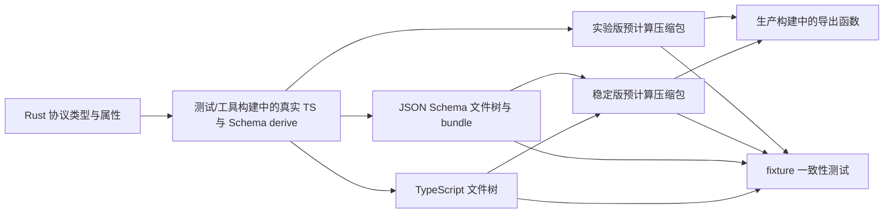

# 84：App-server 代码生成、TypeScript、JSON Schema 与协议同步

> 源码基线：`4ee41929eaf4`。本章解决“Rust 协议类型怎样变成客户端可用的 TypeScript 和 JSON Schema，以及怎样证明源码、生成物、稳定 API 与实验 API 没有悄悄分叉”。

## 1. 本章解决什么问题

App-server 的协议首先写成 Rust 类型，但客户端不一定用 Rust。TypeScript 客户端需要类型声明，其他工具需要 JSON Schema，发布制品还要在不携带完整生成器的情况下导出它们。

真正的问题不是“怎样按一下生成按钮”，而是：哪一份是事实源、每一步产生什么、什么变化属于 breaking change、生成文件为何要提交，以及测试如何发现漏生成和旧文件残留。

## 2. 先说人话：代码生成像翻译协议说明书

可以把 Rust 协议定义看作中文原稿，把 TypeScript 和 JSON Schema 看作英文版与机器可读版。它们表达的是同一份合同，但格式不同。

修改原稿后，如果没有重新翻译，Rust 服务端和客户端看到的就会是两个版本。代码生成解决重复手写；漂移测试负责证明译本仍跟原稿一致。

## 3. 一张全流程图



这张图省略了格式化和文件比较细节，但保留了最重要的所有权关系：Rust 是输入，生成树和压缩包是派生产物，测试检查二者没有 drift。

## 4. Source of Truth 是什么

Source of truth 是“发生冲突时应以哪一份为准”。这里主要是 Rust 协议类型、请求 DSL，以及它们身上的 `serde`、`ts`、`schemars` 和实验 API 属性。

生成后的 `.ts` 或 `.json` 不是新的独立事实源。它们即使被提交到 Git，也不应手工改成与 Rust 不同的形状。

## 5. Generated Artifact 是什么

Generated artifact 是可由上游输入和确定性工具重新得到的文件。例如：

- `schema/typescript/v2/ThreadStartParams.ts`
- `schema/typescript/v2/index.ts`
- `schema/json/v2/ThreadStartParams.json`
- 聚合后的 JSON Schema bundle
- `schema/precomputed/*.json.zst`

“提交到仓库”不等于“允许手工维护”。提交它们是为了分发、审查和漂移验证。

## 6. Runtime Serialization 与 Code Generation 不同

Serde 决定服务端运行时实际接受和发出怎样的 JSON；TS/JSON Schema 生成器描述这份 wire contract。前者是行为，后者是给客户端和工具的模型。

理想状态下二者一致，但使用的是不同 derive/属性系统，所以 rename、optional、tag 等规则必须同步表达，测试也必须覆盖。

## 7. Wire Contract 才是最终合同

客户端真正看到的是 JSON 字段名、是否可省略、是否可为 `null`、enum 字符串、tag 和 payload shape，而不是 Rust 的 field 名或内存布局。

因此 Rust 内部重构若保持序列化结果不变，未必 breaking；只改一个 `serde(rename)` 即使 Rust 类型仍能编译，也可能直接破坏客户端。

## 8. 固定提交中的生成入口

`codex-rs/app-server-protocol/src/export.rs` 包含真实 TypeScript 和 JSON Schema 生成逻辑。它只在测试配置中编译，因为 `lib.rs` 以 `#[cfg(test)]` 引入该模块。

这与第 81、82 章的结论相接：眼前存在源文件，不代表生产制品包含它。

## 9. 为什么真实 Generator 放在 Test Graph

真实生成依赖 `ts-rs` 与 `schemars` 的类型信息。普通生产构建不需要反复携带这些生成能力，只需要导出已经验证过的结果。

因此该 crate 把“生成新真相”和“分发已生成真相”分成两个构建路径。

## 10. Test Derive 与 Production No-op Derive

在测试配置下，`lib.rs` 使用真实 `schemars::JsonSchema` 和 `ts_rs::TS`。非测试配置则从 `app-server-protocol-noop-macros` 使用空操作 derive。

空操作 derive 接受相关辅助属性，但不生成完整实现。这样协议源码不用写两套，生产依赖和编译成本也不会被生成器无限带入。

## 11. 两阶段架构

第一阶段在测试/维护工具中读取 Rust 类型，生成 TS、JSON Schema 和压缩归档。第二阶段在生产代码中读取已嵌入归档，把文件写给调用者。

两阶段之间的关键不变量是：预计算内容必须等于真实生成器对当前 Rust 源码的输出。

## 12. TypeScript Generator 的入口集合

`export.rs` 不只导出几个数据结构。它依次覆盖客户端请求、对应响应、客户端通知、服务端请求、服务端响应、服务端通知和消息 envelope。

如果只生成 request params，却漏掉 response 或 notification，客户端的协议视图仍是不完整的。

## 13. `export_to` 是什么意思

`TS::export_to` 根据 Rust 类型的 `TS` 实现，把 TypeScript 声明写入目标目录。类型上的 `#[ts(export_to = "v2/")]` 决定 v2 文件进入对应子目录。

`export_to` 可理解成“把这个类型的 TypeScript 译本输出到哪里”。

## 14. 为什么有根目录和 `v2/`

App-server 同时存在协议代际。目录把不同 namespace 的客户端类型分开，避免同名类型互相覆盖，也让 v2 consumer 能通过独立 index 导入。

新增 v2 payload 时，漏写 `#[ts(export_to = "v2/")]` 会使生成文件落到错误位置或破坏导入关系。

## 15. `index.ts` 解决什么问题

每个类型一个文件适合增量审查，但客户端逐个写深路径 import 很麻烦。生成的根 `index.ts` 与 `v2/index.ts` 汇总 re-export，形成稳定入口。

生成选项允许关闭 index，说明“类型文件内容”和“包装入口”是两个可独立控制的层次。

## 16. Generated Header

生成的 TypeScript 文件带有类似下面的头：

```ts
// GENERATED CODE! DO NOT MODIFY BY HAND!
```

它不是装饰，而是在提醒 reviewer：若内容不对，应修改 Rust/生成器并重跑，而不是补丁式修改译本。

## 17. Prettier 的位置

`GenerateTsOptions` 可以要求生成后运行 Prettier。Prettier 改的是排版，不应改变 wire contract。

把格式化纳入统一流程可以减少“本机生成布局不同”的噪声；但版本变化仍可能产生大面积机械 diff，应与协议语义变化分开审查。

## 18. 尾部空白也会制造 Drift

生成逻辑会整理 trailing whitespace。否则相同类型可能因平台换行或工具版本造成无意义 diff。

确定性生成不仅是字段顺序一致，还包括换行、空白、header 和 index 排列稳定。

## 19. 一个生成后的 `ThreadStartParams`

固定提交里的 `ThreadStartParams.ts` 会把可选请求字段表达为类似：

```ts
model?: string | null;
```

这里同时出现 `?` 和 `null`，分别表示“属性可以缺席”和“属性存在时可以显式为 null”。这两个概念不能混成一个。

## 20. Optional 是什么

Optional 表示对象里可以没有这个 key：

```ts
{}
```

对 `model?` 而言，上面可能合法。它对应 request params 中调用者没有提供值。

## 21. Nullable 是什么

Nullable 表示 key 存在时值可以是 `null`：

```json
{"model": null}
```

它可用于表达显式清除、使用默认值或协议规定的另一种状态，具体语义要看字段文档。

## 22. `undefined` 又是什么

`undefined` 是 JavaScript/TypeScript 的值概念，但标准 JSON 没有 `undefined`。对象序列化时它常表现为省略字段，而不是 JSON value。

固定提交的生成测试明确限制不应随意生成 `undefined` union，以免 TS 描述偏离 JSON wire format。

## 23. Params 的特殊规则

v2 的客户端到服务端 request payload，`Option<T>` 字段使用 `#[ts(optional = nullable)]`，得到 `field?: T | null`。

这项规则只适用于 request `*Params`。若 response/notification 也任意变成 optional，客户端就难以区分“服务端保证返回”与“可能没有”。

## 24. Required Array 怎样表达必填

JSON Schema 用对象的 `required` 数组列出必须存在的属性。属性有 schema definition 不代表它自动必填。

因此判断兼容性时要同时查看 `properties` 与 `required`，不能只看字段类型。

## 25. `Option<T>` 不总等于同一份 Wire Shape

Rust `Option<T>` 可以配合 `skip_serializing_if`、default、flatten 和自定义 serializer。不同属性组合会改变“缺席”“null”“默认”的意义。

看到 Rust 类型后不能凭直觉手写 TS；这正是统一生成和 fixture 测试的价值。

## 26. Rename 必须双边一致

Rust 常用 snake_case，wire 常用 camelCase。`#[serde(rename_all = "camelCase")]` 控制 JSON，TS 侧也必须得到相同名字。

如果单字段使用 `serde(rename = "...")`，对应 TS rename 也应同步，否则 runtime 接受 `fooBar`，客户端类型却提示另一个名字。

## 27. Enum String Value

Rust enum variant 的源码名字也不一定等于 wire 字符串。`rename_all = "camelCase"` 或显式 rename 会影响协议值。

删除、改名或复用一个 wire enum value 都可能是 breaking change；新增 variant 也要求旧客户端能容忍未知值才安全。

## 28. Discriminated Union

协议 union 常以 `type` 字段作为 discriminator：

```json
{"type": "someEvent", "payload": {}}
```

Serde 和 TS 必须采用相同 tag 和 variant name。否则 TypeScript 的 narrowing 能通过，实际 JSON 却匹配不到对应 branch。

## 29. JSON Schema Generator 输出什么

真实生成器既写单类型 schema，也写聚合 bundle。单文件便于查一个类型，bundle 便于消费者一次加载完整定义图。

固定提交中包含通用 App-server bundle 和 v2 bundle，不应把二者当作同一个文件的重复副本。

## 30. `$ref` 与 Definitions

复杂 schema 不会把每个嵌套类型无限复制，通常以 `$ref` 指向 definitions 中的命名结构。这样共享类型只有一个定义位置。

重命名类型或改变 export path 可能造成大量引用变化，即使最终 JSON shape 只改了一点。

## 31. Bundle 的价值

Bundle 把 request、response、notification 和依赖类型放进一个可分发文档。代码生成器、validator 或 IDE 不必自行搜集数百个文件。

但 bundle 体积更大，review 时应从具体类型和引用路径定位语义变化，而不是肉眼通读全部 JSON。

## 32. Envelope Schema

除了 params/response payload，还要描述外层消息 envelope，例如 request ID、method 和 params 的组合。

只验证内部 params 会漏掉 method 与 payload 是否配对、notification 是否错误带 response ID 等 transport 合同。

## 33. v1 Allowlist

固定提交的 JSON 生成逻辑对 v1 类型使用显式 allowlist。它表达“只有仍属于公开 v1 合同的类型才导出”，而不是把 crate 内所有可派生类型全盘暴露。

Allowlist 是 API surface control；随意扩大它等于扩大需要长期兼容的公共面。

## 34. Internal JSON Schema

schema fixture 流程还生成内部 schema，例如 rollout line。它与公开 App-server v2 合同用途不同，但仍进入稳定预计算集合的独立 map。

“同样是 JSON Schema”不代表 audience 相同，目录与 bundle 边界要保留。

## 35. Stable API 是什么

Stable export 是默认面向客户端的协议集合。生成器会过滤被标记为 experimental 的 method、field 和相关类型。

稳定不表示永远不能改变，而表示变化必须按兼容性和迁移承诺处理。

## 36. Experimental API 是什么

Experimental export 包含需要显式 opt-in 的协议面。它允许产品在承诺稳定兼容前试验方法或字段。

实验不等于无需测试；相反，稳定版必须证明它没有泄漏实验项，实验版必须证明相关项没有被误删。

## 37. Whole-method Experimental

整个 RPC 尚未稳定时，可在 method definition 上标记 experimental。稳定 export 应完全看不到这个 method 及其只为该方法存在的相关输出。

这比让稳定客户端看见一个永远无法调用的方法更清晰。

## 38. Field-level Experimental

有时 method 已稳定，只增加一个实验参数。此时 payload 类型派生 `ExperimentalApi`，并在具体 field 上标记实验 key。

生成稳定 schema 时应移除该字段，同时保留 method 的其他稳定字段。

## 39. 为什么需要 `inspect_params`

请求 DSL 若只知道“方法是否实验”，不会自动深入 params 找实验字段。固定提交的约定用 `inspect_params: true` 表明应检查 params 内部的实验标记。

漏掉它可能使实验字段泄漏到 stable export，或让 runtime gating 与生成结果不一致。

## 40. Nested Experimental

实验字段可能藏在嵌套结构中，而不直接位于顶层 params。生成过滤必须沿类型关系继续检查，不能只删除一个顶层 property 名。

这也是 source visitor 和依赖遍历存在的原因之一。

## 41. Stable 与 Experimental 不是两个手写分支

它们来自相同 Rust 协议定义和同一生成器，只是 `experimental_api` 选项不同。

这种设计减少两份协议逐渐分叉的风险；差异应只来自显式实验元数据。

## 42. Stable 可见文件树

稳定模式会重新生成 checked-in 的 `schema/typescript` 和 `schema/json` 目录，方便人阅读、diff 和外部工具使用。

它也生成稳定预计算压缩包，供生产导出路径使用。

## 43. Experimental 为什么主要写压缩包

固定提交的 fixture writer 在实验模式下使用临时目录生成 TS/JSON，然后写入 `app-server-exports-experimental.json.zst`，不会覆盖公开可见的稳定目录树。

这样仓库不会同时维护两套庞大、相似的可见文件树，但生产代码仍能按选项导出实验集合。

## 44. `PrecomputedExports` 是什么

它是若干“相对路径 → 文件内容”的有序映射集合，分别容纳 TypeScript、JSON Schema 和 internal JSON Schema。

可以把它看成一个逻辑文件系统快照，而 `.json.zst` 是这个快照的压缩运输形式。

## 45. 为什么使用 `BTreeMap`

`BTreeMap` 按 key 排序，序列化时输出顺序稳定。若使用随机迭代顺序的 map，同一份源码可能每次产生不同压缩内容或 diff。

确定性是生成物可以被可靠 code review 和缓存的前提。

## 46. 为什么再用 Zstandard

`.zst` 表示 Zstandard 压缩。数百个文本声明存在大量重复 token，压缩能显著减少嵌入制品的体积。

压缩改变存储方式，不改变解压后的文件合同；测试应比较语义内容和最终文件树。

## 47. `include_bytes!` 在这里做什么

`precomputed_exports.rs` 通过 `include_bytes!` 把稳定版和实验版压缩包编译进制品。运行时不需要到安装目录寻找旁边的 schema 文件。

代价是压缩包必须在编译时存在，并被所有构建系统声明为输入。

## 48. Bazel `compile_data`

`app-server-protocol/BUILD.bazel` 把 `schema/precomputed/**` 放进 `compile_data`。这是因为 Bazel 不会仅凭源码里的相对路径自动允许 `include_bytes!` 读取任意源文件。

Cargo 能编译不代表 Bazel 一定能编译；新 compile-time resource 必须同步构建图。

## 49. Bazel `test_data_extra`

Fixture 测试需要读取完整 `schema/**` 树，所以 Bazel 还把它声明为测试数据。否则测试在 Cargo 本地可见文件，在 Bazel runfiles 中却找不到。

这再次说明“源码路径存在”与“当前执行环境可访问”是两回事。

## 50. Production Exporter 做什么

`precomputed_exports.rs` 的生产接口解压所选 archive，解析 `PrecomputedExports`，再按选项把路径和内容写入目标目录。

它不是重新分析 Rust 类型；它是在可靠地还原已经生成并验证的文件快照。

## 51. 生产导出为何仍支持选项

调用者可以控制是否生成 index、是否保留 header、是否运行 Prettier，以及选 stable 还是 experimental。

这些选项改变包装和展示，但不应凭空改变协议字段语义。

## 52. Relative Path Validation

写预计算文件前，代码验证路径非空，且每个 component 都是普通相对 component。绝对路径、`..` 等逃逸路径会被拒绝。

这是生成工具的安全边界：即使 archive 内容异常，也不能借导出覆盖目标目录之外的文件。

## 53. 为什么 Generator 也要考虑安全

代码生成经常被误认为“只是开发脚本”。实际上它会批量写文件，并可能进入 CI、release 或用户指定目录。

目标目录清理、相对路径验证和固定输入边界都属于 supply-chain 与 filesystem safety，而非额外洁癖。

## 54. `ensure_empty_dir` 为什么先清目录

若旧版本生成 `OldType.ts`，新版本删除该类型，但生成器只覆盖现有文件，`OldType.ts` 会永久残留。

先安全地重建精确目标目录，可让“文件已删除”也成为生成结果的一部分。

## 55. Stale File 是真实的协议 Bug

客户端若仍从 index 或磁盘发现旧类型，可能继续调用已不存在的方法。此时每个新文件内容都正确，整个目录仍然错误。

所以 fixture 测试首先比较 path set，再比较文件内容。

## 56. Fixture 是什么

Fixture 是提交在仓库中的预期输出样本。这里不是给 generator 随便读取的模板，而是当前协议输出的可审查快照。

测试会在内存或临时目录重新生成，再与 fixture 对比。

## 57. Drift 是什么

Drift 指 Rust/生成器已经变化，但 checked-in TypeScript、JSON Schema 或预计算 archive 仍停在旧状态。

它也可能反过来：有人手改生成物而源码没有对应变化。两种情况都应由一致性测试拒绝。

## 58. TypeScript Fixture 测试

`typescript_schema_fixtures_match_generated` 收集 checked-in TS 文件树，并与当前真实生成器输出比较。

它既检查路径，也检查内容；失败提示维护者运行生成流程，而不是让测试偷偷更新仓库。

## 59. JSON Fixture 测试

`json_schema_fixtures_match_generated` 对 JSON Schema 做同类比较。JSON 对 object key order 不敏感，所以测试先解析并规范化 JSON，再比较值。

这避免纯 key 排序差异掩盖真正的结构变化或制造噪声。

## 60. 为什么 TS 比较要 Normalize

TypeScript 是文本，测试会处理 CRLF 等换行差异，并在必要时忽略标准 generated header。

Normalization 只应消除不影响含义的环境差异；若把字段、import 或 union 也忽略，测试就失去合同价值。

## 61. Unified Diff

文件内容不同时，测试输出 unified diff。`-` 表示 fixture 中旧内容，`+` 表示新生成内容。

阅读时先找最小语义变化：required 改 optional、类型 union 扩大、rename、enum variant、import path，而不是被整个 bundle 的行数吓到。

## 62. Stable Archive 测试

`stable_precomputed_exports_match_schema_fixtures` 验证稳定 archive 解压后的内容与可见 TS/JSON/internal fixture 一致。

因此不能只更新可见文件而忘记 `.zst`，也不能只重建 archive 却漏掉可审查文件树。

## 63. Experimental Archive 测试

实验版没有同样的完整 visible tree，所以测试直接用当前真实生成器产生实验集合，再与实验 archive 比较。

这证明 archive 不只是“能解压”，而且包含当前应有的 experimental method/field。

## 64. Production Export Round-trip 测试

`precomputed_exports_tests.rs` 还验证生产 exporter 把 archive 写回磁盘后，得到的目录树和预期一致，并测试省略 index/header 等选项。

这覆盖了“archive 正确，但解包/选项实现写错”的另一类风险。

## 65. Type Visitor

生成测试需要从请求类型找到它依赖的其他类型。`TypeVisitor` 负责遍历类型关系并收集相关 TypeScript export。

它类似从入口节点走 dependency graph；若只列顶层类型，生成文件会出现 import 指向不存在的依赖。

## 66. Import Closure

完整生成集合必须对 import 闭包封闭：任何生成文件 import 的本地类型，也必须在同一导出树里存在。

固定提交有专门测试检查稳定 `ConfigRequirements.ts` 对 `PathUri.ts` 的 import 指向生成目录中的真实文件。

## 67. Experimental Filtering 的难点

删除实验 method 后，还要考虑它独占的 response、params 和依赖类型是否应该留下；删除嵌套 field 时，也要保证引用图仍合法。

因此 filtering 不是在最终文本里简单 grep 掉一行，而是基于协议元数据和类型图生成不同集合。

## 68. Optional/Nullable Policy 测试

固定提交的 export 测试扫描生成 TS，检查 `?: T | null` 只出现在允许的 Params 场景，并避免生成 `undefined` union。

这种测试不是验证某个静态字符串，而是在守护跨全部协议类型的一项设计规则。

## 69. 从 Rust 修改到生成物的标准路径

一次协议修改可按下面顺序理解：

1. 修改 Rust payload、request DSL 或序列化属性。
2. 在 test graph 中由真实 derive 建立类型/schema 信息。
3. 生成稳定 TS 与 JSON Schema 文件树。
4. 重建稳定预计算 archive。
5. 若涉及实验面，再重建实验 archive。
6. 审查 generated diff。
7. 运行 protocol tests 证明全部视图同步。

## 70. 为什么“Rust 能编译”远远不够

编译只证明当前 Rust 类型和使用点满足编译器约束。它不证明 checked-in TS 已更新，不证明 `.zst` 已更新，也不证明稳定 export 没有泄漏实验字段。

跨语言合同需要生成与 fixture 测试提供额外证据。

## 71. 为什么不应让测试自动改文件

测试若看到 drift 就静默重写 fixture，会把验证动作变成 mutation，CI 结果也难以复现。更安全的模式是失败并给出明确生成指令。

维护者显式运行 generator、审查 diff、再提交，这样每次合同变化都留下可见证据。

## 72. 固定提交中的命令约定

仓库文档要求协议变化后运行：

```bash
just write-app-server-schema
just write-app-server-schema --experimental
just test -p codex-app-server-protocol
```

第一条针对稳定输出，第二条针对实验 archive，第三条验证协议 crate。

## 73. 固定提交里值得注意的入口差异

在基线 `4ee41929eaf4` 中，根 `justfile` 的 recipe 指向 `cargo run -p codex-app-server-protocol --bin write_schema_fixtures`，但该提交树中找不到对应 bin source/manifest entry。

同一提交仍有 `scripts/write_schema_fixtures.py`，它通过环境变量调用 ignored test `schema_fixtures_tests::write_schema_fixtures_from_env`。这是源码基线中可观察到的过渡性不一致，不应假装 recipe 在该提交必然可运行。

## 74. 遇到生成命令失效时怎么判断

不要手工更新数百个结果文件。先检查：

- `justfile` 的 recipe 实际执行什么；
- Cargo manifest 是否声明相应 binary；
- `scripts/` 是否有相邻 driver；
- ignored writer test 接受哪些环境变量；
- 当前分支是否漏了与 recipe 配套的 commit。

生成入口本身也是需要版本同步的代码。

## 75. Python Driver 的作用

固定提交的 `scripts/write_schema_fixtures.py` 设置 schema root、stable/experimental 选择和是否运行 Prettier，再执行精确命名的 ignored Rust test。

Python 只做 orchestration；真正理解 Rust 类型和产生 schema 的逻辑仍在 Rust test modules 中。

## 76. 为什么 Writer Test 标为 Ignored

普通 `just test` 应验证工作树，而不应修改它。显式 writer 通过 `--ignored --exact` 选择这个带写入副作用的测试。

“测试形状的维护工具”可以复用私有生成逻辑，但必须避免在常规测试中意外执行。

## 77. 审查 Generated Diff 的第一步

先把 diff 分成四类：

- 预期的协议语义变化；
- 引用/index 随之变化；
- 格式化或 generator 版本噪声；
- 完全意外的其他类型变化。

最后一类通常提示 derive attribute、过滤图或工具版本影响范围超出预期。

## 78. 新增 Optional Request Field

通常比新增 required field 更兼容，因为旧客户端可继续不发送它，服务端也必须定义 omission 的行为。

但若该字段默认值改变旧请求语义，即使类型层面 optional，行为层面仍可能 breaking。

## 79. 新增 Required Request Field

旧客户端不会发送新字段，因此服务端若突然要求它，旧请求会验证或反序列化失败。这通常是 breaking change。

可考虑 optional + 明确 default、另建 method/version，或先实验再迁移。

## 80. 删除 Response Field

旧客户端可能读取该字段，删除通常 breaking。把 required 改 optional 也会迫使严格客户端新增空值处理。

服务端内部“不再需要这个值”不能作为删除公开 response field 的充分理由。

## 81. 新增 Response Field

对允许未知属性的宽松 consumer 常兼容；对 `additionalProperties: false`、穷尽 decoder 或严格生成模型未必兼容。

兼容性必须考虑真实 consumer，而不能只看 JSON 自身允许多一个 key。

## 82. 改变 Number/String 类型

即使内容看起来都能打印，`"42"` 与 `42` 是不同 JSON 类型。Schema、TS 和 runtime decoder 都会受到影响。

不要依赖 JavaScript 隐式转换来掩盖 wire type 变化。

## 83. 改字段名

Rename 对 wire 来说接近“删除旧字段并新增新字段”。若需要迁移期，可能要让 reader 暂时接受两种输入，但 writer 应有明确单一输出策略。

Serde alias 能帮助读取兼容，却不自动让 TS 同时表达所有迁移语义。

## 84. 改 Enum Variant

删除/重命名旧 variant 会让已保存消息、旧客户端和 replay 失败。新增 variant 则要求 consumer 的 match/default 策略能处理未知值。

Rust 自己的 exhaustive match 保护服务端源码，却无法自动保护外部旧客户端。

## 85. Schema Validation 的边界

JSON Schema 很擅长描述结构、类型、required、enum 和部分约束，但不能自动表达所有业务语义，例如“字段 A 与运行中 thread 状态必须匹配”。

通过 schema 不等于请求一定可执行；服务端仍需 domain validation 和 authorization。

## 86. Default 的边界

Schema 中写 default 常是提示或生成器信息，不保证 validator 会主动填入该值。真正 runtime default 由 Serde/业务逻辑决定。

文档、schema 与代码必须对 omission 后发生什么使用同一种说法。

## 87. `flatten` 与 Untagged 的风险

Flatten 会把嵌套字段提升到同一对象；untagged enum 依赖 shape 猜 variant。二者都让生成和兼容性分析更复杂。

若多个 branch shape 重叠，schema 看似合法，runtime 匹配顺序仍可能产生意外解释。

## 88. 生成器升级为什么要单独审查

升级 `ts-rs`、`schemars`、Prettier 或压缩逻辑，可能让几乎全部 fixture 改变。把它与产品协议修改混在一起，会隐藏真正的 breaking diff。

较好的提交边界是先做纯 generator/tooling 更新并解释机械变化，再做小而清晰的协议变化。

## 89. Determinism Checklist

可重复生成至少要控制：

- 类型和路径遍历顺序；
- map/key 排序；
- 换行与 trailing whitespace；
- formatter 版本；
- stable/experimental 选项；
- 目标目录是否先清理；
- generator 与 source 使用同一 commit。

## 90. Drift 失败的排查顺序

先看失败属于 path set、TS text、JSON semantic value，还是 precomputed archive。然后回到最小上游变化：Rust 类型、derive 属性、request DSL、过滤元数据或生成器版本。

不要从 `.zst` 二进制 diff 猜协议；先对照可见 TS/JSON 或解压后的逻辑 map。

## 91. Stable 泄漏实验字段的排查

依次检查 field 是否有 `#[experimental("...")]`、容器是否派生 `ExperimentalApi`、request definition 是否启用 `inspect_params`、嵌套类型是否传播元数据，以及 stable filter 是否遍历到了该节点。

这条路径把“生成结果不对”还原成具体 metadata pipeline。

## 92. Missing Import 的排查

检查依赖类型是否实现/派生 TS、export path 是否同 namespace、visitor 是否从入口访问它、stable filtering 是否误删，以及 index 是否重新生成。

不要通过手写一个空 `.ts` 文件满足 import；那只会把类型错误推迟给 consumer。

## 93. CI 里本地通过、Bazel 失败

重点检查 `BUILD.bazel` 的 `compile_data`/test data、runfiles 路径、刚新增的 compile-time file，以及 Cargo/test cfg 与 Bazel cfg 是否一致。

跨构建系统失败未必是协议逻辑错，也可能是输入图没有声明完整。

## 94. Code Review 应问的十个问题

1. Rust 序列化 shape 实际变了什么？
2. TS 与 JSON Schema 是否同时反映？
3. Stable 与 experimental 集合是否符合意图？
4. Optional、nullable、required 是否准确？
5. Serde 与 TS rename/tag 是否一致？
6. 新类型是否进入正确 namespace 与 index？
7. 删除的旧文件是否真的消失？
8. Visible fixture 与 archive 是否一起更新？
9. Diff 中是否混入 generator/formatter 噪声？
10. 旧 client、新 client、旧 server、新 server 的组合会怎样？

## 95. 四象限兼容性

协议演进至少思考四组连接：

| Client | Server | 主要问题 |
|---|---|---|
| 旧 | 旧 | 基线是否仍工作 |
| 旧 | 新 | 新 server 能否接受旧请求、返回旧 client 可读响应 |
| 新 | 旧 | 新 client 是否会发送旧 server 不懂的字段/method |
| 新 | 新 | 新能力本身是否正确 |

只测试最后一格，不能证明向前/向后兼容。

## 96. 初学者最容易混淆的三组概念

第一组：Rust field optional 与 JSON key optional；第二组：实验 runtime permission 与实验 schema export；第三组：真实 generator 与 production precomputed exporter。

遇到问题先明确自己在哪一层，很多“为什么明明改了却没生效”的困惑会消失。

## 97. 一个最小心智模型

记住五句话：

1. Rust 类型和 wire 属性是上游事实。
2. TS 与 JSON Schema 是同一合同的不同投影。
3. Stable export 必须过滤实验面。
4. Production 使用经过验证的预计算归档。
5. Path-set、内容和 archive 测试共同防止 drift。

## 98. 源码阅读路线

建议按这个顺序读：

1. `protocol/v2.rs` 或具体 v2 payload，观察 serde/ts/experimental 属性。
2. `lib.rs`，理解 test 与 production derive 分流。
3. `export.rs`，看真实 TS/JSON 生成。
4. `schema_fixtures.rs`，看 stable/experimental 写入流程。
5. `precomputed_exports.rs`，看生产解压与安全写出。
6. 两组 tests，看“不变量”怎样被编码。
7. `BUILD.bazel`、`justfile` 和 Python driver，看构建入口。

## 99. 源码检查点

在固定提交中逐项确认：

- `codex-rs/app-server-protocol/src/lib.rs`：真实与 no-op derive 的 cfg 分流。
- `codex-rs/app-server-protocol/src/export.rs`：TS、JSON、稳定过滤与生成策略。
- `codex-rs/app-server-protocol/src/schema_fixtures.rs`：目录清理、收集、stable/experimental archive。
- `codex-rs/app-server-protocol/src/precomputed_exports.rs`：`include_bytes!`、解压、路径验证和生产导出。
- `codex-rs/app-server-protocol/src/schema_fixtures_tests.rs`：fixture/path/content/archive drift 检查。
- `codex-rs/app-server-protocol/src/precomputed_exports_tests.rs`：生产 exporter round trip 与选项。
- `codex-rs/app-server-protocol/schema/typescript/v2/ThreadStartParams.ts`：可选/nullable 的实际 TS。
- `codex-rs/app-server-protocol/schema/json/v2/ThreadStartParams.json`：properties、required 和引用。
- `codex-rs/app-server-protocol/scripts/write_schema_fixtures.py`：固定提交实际存在的 writer driver。
- `codex-rs/app-server-protocol/BUILD.bazel`：compile-time/test schema inputs。

## 100. 练习一：追踪一个字段

任选 `ThreadStartParams` 的一个字段，写出：Rust field 名、wire 名、TS 类型、JSON Schema property、是否 required、是否 nullable、stable export 是否可见。

若六项中有一项无法确认，就沿 generator 与 fixture 找证据，不要猜。

## 101. 练习二：设计实验字段

假设给稳定 method 新增实验参数，列出需要修改/确认的点：field marker、`ExperimentalApi` derive、`inspect_params`、stable fixture、experimental archive 和 runtime opt-in。

然后解释漏掉每一步会造成什么可见后果。

## 102. 练习三：判断 Breaking Change

分别分析：新增 optional request field、把 response field 改 optional、rename enum variant、只改变 Rust private helper 名。用四象限兼容表写出判断，不只回答“是/否”。

## 103. 练习四：诊断一次 Drift

假设测试报告 fixture 多了 `OldParams.ts`，但新生成结果没有。解释为什么这更可能是 stale file，而不是 TypeScript 内容差异；再说明为何清空精确 schema 目录比逐文件覆盖可靠。

## 104. 本章结论

App-server 代码生成不是把 Rust “顺手转成几个类型文件”，而是一条跨语言合同供应链：Rust/属性定义 wire shape，测试构建中的真实 derives 生成 stable/experimental 投影，可见 fixtures 支持审查，压缩预计算归档支持轻量生产导出，路径、内容和 round-trip 测试共同阻止漂移。

真正可靠的协议修改必须同时回答：运行时 JSON 是否正确、客户端描述是否正确、稳定边界是否正确、生成物是否可重复，以及旧新 consumer 组合是否兼容。

## 105. 本章 Glossary

| 术语/代码短语 | 直译或展开 | 在本章中的含义 |
|---|---|---|
| Code generation / codegen | 代码生成 | 从 Rust 协议元数据自动产生 TS/Schema 等文件 |
| Source of truth | 事实源 | 冲突时应以其为准的 Rust 类型、DSL 与 wire 属性 |
| Generated artifact | 生成制品 | 可由事实源和工具重建的 `.ts`、`.json`、`.zst` 文件 |
| Wire contract | 线上合同 | 客户端与服务端实际交换的 JSON shape 与语义 |
| Runtime serialization | 运行时序列化 | Serde 在请求/响应执行时编码和解码 JSON |
| TypeScript declaration | TS 类型声明 | 给 TS consumer 的静态类型投影 |
| JSON Schema | JSON 模式 | 机器可读的 JSON 结构与约束描述 |
| Bundle | 聚合包 | 收纳许多 schema definitions 的单个文档 |
| Envelope | 信封/外层消息 | 包含 ID、method、params/result 的 transport 外壳 |
| `$ref` / definitions | 引用/定义表 | 复用命名 schema、避免重复嵌套的机制 |
| Optional | 可省略 | JSON object 中 key 可以不存在 |
| Nullable | 可为空 | key 存在时值允许是 JSON `null` |
| `undefined` | 未定义值 | JavaScript 值；不是合法 JSON value |
| Required | 必填 | JSON object 必须出现的 property |
| Rename / rename_all | 重命名/统一规则 | 把 Rust 名映射成 wire/TS 名 |
| Discriminator/tag | 判别字段/标签 | 用 `type` 等字段选择 union variant |
| Stable API | 稳定接口 | 默认导出并承担兼容承诺的协议面 |
| Experimental API | 实验接口 | 需 opt-in、尚未承诺稳定的协议面 |
| `inspect_params` | 检查参数 | 让 method 元数据处理继续检查 params 内实验字段 |
| Fixture | 固定样本 | 提交在仓库中、用于比较当前生成结果的预期输出 |
| Drift | 漂移 | 源码、可见生成物或预计算归档彼此不同步 |
| Path set | 路径集合 | 一次生成应存在的全部相对文件名 |
| Stale file | 陈旧文件 | 类型已删除但目录中仍残留的旧生成物 |
| Precomputed exports | 预计算导出 | 预先生成并打包、供生产路径还原的文件集合 |
| `BTreeMap` | 有序树映射 | 保证路径序列化顺序稳定的数据结构 |
| Zstandard / `.zst` | Zstandard 压缩 | 存放预计算导出快照的压缩格式 |
| `include_bytes!` | 编译期嵌入字节 | 把 archive 直接纳入生产制品 |
| Relative path | 相对路径 | 相对于受控输出根的文件路径 |
| Path traversal | 路径穿越 | 用绝对路径或 `..` 写出受控目录的攻击/错误 |
| Deterministic generation | 确定性生成 | 相同输入得到相同路径、内容和顺序 |
| Canonicalization | 规范化 | 消除 JSON key order 等无语义差异 |
| Unified diff | 统一差异格式 | 用 `-`/`+` 展示旧新文本差别 |
| Type visitor | 类型访问器 | 沿入口类型收集其依赖 export 的遍历器 |
| Import closure | 导入闭包 | 所有本地 import 的依赖也都包含在生成集合中 |
| No-op derive | 空操作派生 | 生产构建接受属性但不产生真实 schema 实现的宏 |
| Round trip | 往返 | Archive 解压写出后仍得到同一逻辑文件树 |
| Breaking change | 破坏性变更 | 使既有合法 consumer/provider 组合失效的合同变化 |
| Forward/backward compatibility | 前向/后向兼容 | 新旧 client/server 对另一代协议数据的容忍能力 |
