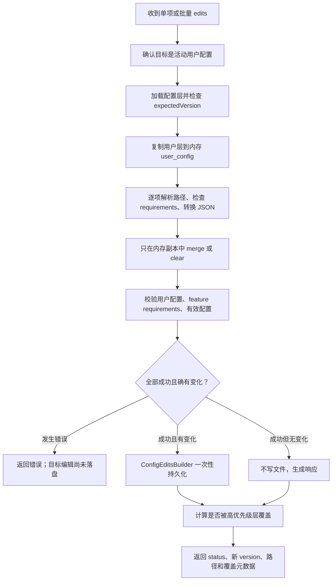

# 精读 01：`ConfigManager::apply_edits`——一次配置写入怎样安全完成

> 源码基线：`4ee41929eaf4`  
> 主文件：`codex-rs/app-server/src/config_manager_service.rs:245-448`  
> 前置阅读：[第 94 章：App-server 配置 API](../94-app-server-config-api-layer-stack-origins-writes-requirements-and-runtime-reload.md)

## 1. 先说结论：这个函数解决什么问题

客户端说“把 `model` 改成某个值”时，真正的问题远不只是修改一个 TOML 字符串。

`apply_edits` 必须同时保证：

1. 只能修改当前选中的用户配置文件，不能借这个 API 改系统或项目层。
2. 客户端若依据旧版本编辑，必须拒绝覆盖别人的新修改。
3. 批量编辑要么全部合法并写入，要么文件一项也不改变。
4. JSON 输入必须能表示成 TOML，并满足 Codex 的强类型配置约束。
5. 管理员 requirements 锁定的字段不能被用户改写。
6. `Replace` 与 `Upsert` 必须有不同、可预期的表合并语义。
7. 尽量只改目标路径，保留文件里无关的注释和排列。
8. 用户层写成功但被更高优先级配置覆盖时，要明确告诉客户端。

所以它更像一个“小型事务协调器”，而不是 find-and-replace。

这里的“事务”是帮助理解的类比：它先在内存副本中完成整批计算和校验，最后才持久化。但这不等于数据库事务，也不意味着多进程之间拥有完整的 ACID 保证。

Codex 的公开配置参考说明了 `config.toml` 中模型、审批、sandbox、MCP 等字段的用户可配置含义；本文关注 app-server 内部怎样安全修改这些字段。公开字段含义可查[官方配置参考](https://learn.chatgpt.com/docs/config-file/config-reference)。

## 2. 一张图看完整流程



最重要的阅读锚点是：

> 第 289—417 行都在准备、模拟和验证；真正写目标编辑发生在第 419—424 行。

注意一个边角情况：如果用户配置文件尚不存在，`create_empty_user_layer` 会先创建空文件。因此“任何失败都绝不触碰文件系统”并不精确。更准确的说法是：既有配置不会在整批验证成功前被应用目标编辑；缺失配置可能先被创建为空文件。

## 3. 贯穿案例

假设用户文件最初是：

```toml
# 我希望保留这条注释
model = "old-model"

[apps.demo]
enabled = true
destructive_enabled = false
```

客户端先读取配置，得到版本 `V1`，随后提交两项编辑：

```text
expectedVersion = V1

edit 1:
  keyPath = "model"
  value = "new-model"
  strategy = Replace

edit 2:
  keyPath = "apps.demo"
  value = { enabled: false }
  strategy = Upsert
```

理想结果是：

```toml
# 我希望保留这条注释
model = "new-model"

[apps.demo]
enabled = false
destructive_enabled = false
```

`Upsert` 保留了没有出现在输入中的 `destructive_enabled`。如果第二项改用 `Replace`，整个 `apps.demo` 表会被新表替换，旧字段将消失。

后文始终用这个案例追踪三个内存容器：

| 变量 | 用途 | 案例中的变化 |
|---|---|---|
| `user_config` | 编辑后的用户层语义树 | `model` 改值，`enabled` 改为 false |
| `config_edits` | 最终交给保格式编辑器的最小路径修改 | 两个 `SetPath` |
| `parsed_segments` | 所有请求路径的分段形式 | `[model]` 与 `[apps,demo]` |

## 4. 谁会调用它

源码第 185—243 行把两个公开动作收敛到同一个私有函数：

```rust
pub(crate) async fn write_value(...) -> Result<ConfigWriteResponse, ConfigManagerError> {
    let edits = vec![(params.key_path, params.value, params.merge_strategy)];
    self.apply_edits(params.file_path, params.expected_version, edits).await
}

pub(crate) async fn batch_write(...) -> Result<ConfigWriteResponse, ConfigManagerError> {
    let edits = params.edits.into_iter()
        .map(|edit| (edit.key_path, edit.value, edit.merge_strategy))
        .collect();
    self.apply_edits(params.file_path, params.expected_version, edits).await
}
```

白话翻译：

- 单项写入被包装成“只有一项的批量写入”。
- 批量写入把协议对象整理为内部统一的三元组。
- 两条入口共享完全相同的安全检查、合并规则和持久化路径。

这比维护两套实现安全。否则很容易出现“单项写检查 requirements，批量写漏检查”一类分叉。

## 5. 函数签名逐词解释

```rust
async fn apply_edits(
    &self,
    file_path: Option<String>,
    expected_version: Option<String>,
    edits: Vec<(String, JsonValue, MergeStrategy)>,
) -> Result<ConfigWriteResponse, ConfigManagerError>
```

| 代码词 | 字面意思 | 在这里的实际意思 |
|---|---|---|
| `async fn` | 异步函数 | 会等待配置加载和文件持久化 |
| `&self` | 借用自身 | 使用 manager，但不取得其所有权 |
| `Option<String>` | 可能有字符串 | `Some` 是显式值，`None` 表示默认行为 |
| `expected_version` | 预期版本 | 客户端上次读取的版本，用于乐观并发控制 |
| `Vec<...>` | 动态数组 | 保序的一批编辑 |
| `(A, B, C)` | 三元组 | 一项编辑的路径、JSON 值、合并策略 |
| `Result<Ok, Err>` | 成功或失败 | 成功返回写响应，失败返回分类错误 |

为什么 `edits` 要保序？同一批里后面的编辑能看见前面编辑产生的内存结果。例如先写 `apps.demo`，再写 `apps.demo.enabled`，第二项作用于第一项之后的树。

## 6. 第一关：把目标文件限制在用户层

源码第 251—265 行：

```rust
let allowed_path = self.user_config_path()?;
let provided_path = match file_path {
    Some(path) => AbsolutePathBuf::from_absolute_path(PathBuf::from(path))?,
    None => allowed_path.clone(),
};

if !paths_match(&allowed_path, &provided_path) {
    return Err(ConfigManagerError::write(
        ConfigWriteErrorCode::ConfigLayerReadonly,
        "Only writes to the user config are allowed",
    ));
}
```

### 6.1 两个路径分别是谁

- `allowed_path`：服务端根据当前用户配置选择算出的唯一可写路径。
- `provided_path`：客户端要求写入的路径；省略时就使用 `allowed_path`。

`AbsolutePathBuf::from_absolute_path` 在边界上要求“这必须是绝对路径”，后面不会偷偷依赖当前工作目录解释 `./config.toml`。

### 6.2 为什么不用字符串直接比较

`paths_match` 委托给路径规范化比较。路径中可能存在不同分隔写法、`.` 等语法差异；安全判断应该比较规范化后的路径含义，而不是肉眼相似的字符串。

### 6.3 为什么这一步必须最先做

如果先根据客户端路径加载或编辑内容，再判断是否允许，错误目标已经进入计算甚至 I/O。先缩小权限范围，后续步骤都可建立在“这是活动用户配置”的前提上。

## 7. 第二关：加载层栈，并处理用户文件不存在

源码第 267—274 行：

```rust
let layers = self.load_thread_agnostic_config().await?;
let user_layer = match layers.get_active_user_layer() {
    Some(layer) => Cow::Borrowed(layer),
    None => Cow::Owned(create_empty_user_layer(&allowed_path).await?),
};
```

### 7.1 `thread-agnostic` 是什么意思

`load_thread_agnostic_config` 调用 `load_config_layers(None)`：没有 cwd，也没有项目根，因此不会把仓库里的 `.codex/` 层混入这个通用配置查询。

它不是“没有任何层”，而是“没有与某条 thread 的项目目录相关的层”。用户、系统、managed 和 requirements 仍可能存在。

### 7.2 `Cow` 不是奶牛

`Cow` 是 Clone-on-Write 的缩写，可理解为“写时克隆容器”。这里主要利用它统一两种来源：

- 已有用户层：`Cow::Borrowed(layer)`，只借用。
- 没有用户层：`Cow::Owned(...)`，持有刚创建的层。

后续可以统一写 `user_layer.version` 和 `user_layer.config`，无需维护两个分支。

### 7.3 空用户层怎样创建

`create_empty_user_layer` 会：

1. 解析 symlink 的读取路径和实际写入路径。
2. 若目标存在，读取并解析已有 TOML。
3. 若不存在，用 `write_atomically` 创建空文件。
4. 构造来源为 `ConfigLayerSource::User` 的 `ConfigLayerEntry`。

这也解释了为什么主函数不能直接 `expect("user layer")`：第一次使用时文件可能尚不存在。

## 8. 第三关：用版本指纹防止覆盖新修改

源码第 276—283 行：

```rust
if let Some(expected) = expected_version.as_deref()
    && expected != user_layer.version
{
    return Err(ConfigManagerError::write(
        ConfigWriteErrorCode::ConfigVersionConflict,
        "Configuration was modified since last read. Fetch latest version and retry.",
    ));
}
```

### 8.1 一段现实时间线

```text
客户端 A 读取 V1
客户端 B 读取 V1
客户端 A 成功写入，文件变成 V2
客户端 B 仍带 expectedVersion=V1 写入
服务端发现 V1 != V2，拒绝 B
```

如果没有这项检查，B 可能基于旧界面覆盖 A 的新设置。这叫“乐观并发控制”：平时不加长期排他锁，提交时检查读取依据是否仍然新鲜。

### 8.2 version 从哪里来

固定提交中的 `version_for_toml` 会把 TOML 转成 JSON、对对象键排序、序列化后计算 SHA-256，返回 `sha256:<hex>`。

因此它是“配置内容指纹”，不是自增数字，也不是文件修改时间。对象字段书写顺序不同但语义相同，不应仅因此产生不同指纹。

### 8.3 Rust 语法小抄

- `as_deref()`：把 `Option<String>` 临时看成 `Option<&str>`，避免克隆。
- `if let Some(expected) = ... && ...`：既要求确实提供版本，又要求版本不相等。
- 未提供 `expected_version` 时会跳过冲突检查；这是协议允许调用者选择的行为。

## 9. 建立三份工作状态

源码第 285—287 行：

```rust
let mut user_config = user_layer.config.clone();
let mut parsed_segments = Vec::new();
let mut config_edits = Vec::new();
```

这是整篇最关键的设计点。

### 9.1 `user_config`：语义工作副本

它是解析后的 `toml::Value` 树。所有编辑先施加到这个 clone 上。验证函数关心“最终配置表达了什么”，所以使用它。

### 9.2 `config_edits`：文本最小补丁

它保存 `SetPath` 或 `ClearPath`。最后 `toml_edit` 根据这些路径修改原文，尽量保留无关注释、空行与顺序。

### 9.3 `parsed_segments`：事后解释依据

它不负责写文件，而是用于检查刚才写过的字段，在最终有效配置中是否被更高层覆盖。

### 9.4 为什么同时维护语义树和文本补丁

只用语义树重新序列化整个 TOML，容易丢注释或重排格式。只用文本补丁，又难以回答“最终整体配置是否能反序列化”。

```text
toml::Value        -> 负责计算与完整校验
Vec<ConfigEdit>    -> 负责最小化落盘改动
```

## 10. 进入循环：每项编辑先解析 key path

源码第 289—292 行：

```rust
for (key_path, value, strategy) in edits.into_iter() {
    let mut segments = parse_key_path(&key_path).map_err(|message| {
        ConfigManagerError::write(ConfigWriteErrorCode::ConfigValidationError, message)
    })?;
```

`model` 变成 `["model"]`；`apps.demo.enabled` 变成 `["apps", "demo", "enabled"]`。

带点号的真实键可以加引号，例如 `shell_environment_policy.filters."AWS.PROFILE"`。解析器只在引号外遇到 `.` 才切段，所以最后一段是 `AWS.PROFILE`。

`std::mem::take(&mut segment)` 把当前字符串移进数组，同时在原变量位置留下空字符串，避免复制字符内容。

以下输入会被拒绝：

- 空字符串或全空白。
- `apps..demo`，因为中间段为空。
- 结尾为 `apps.`。
- 未闭合的引号或引号内未完成的转义。

## 11. requirements 是“不可改”，不是“写了但不生效”

源码第 293—301 行：

```rust
if let Some(field) = layers
    .requirements_toml()
    .exact_requirement_for_config_path(&segments)
{
    return Err(ConfigManagerError::write(
        ConfigWriteErrorCode::ConfigRequirementReadonly,
        format!("`{field}` is managed by requirements and cannot be changed"),
    ));
}
```

这里要区分两个概念：

| 情形 | 写入用户层 | 最终是否采用 | API 结果 |
|---|---|---|---|
| exact requirement 锁定字段 | 不允许 | 不讨论 | `ConfigRequirementReadonly` |
| 更高优先级普通层覆盖 | 可以写 | 可能不采用 | 成功，可能 `OkOverridden` |

requirements 表达组织级约束，所以不是普通的层优先级提示。检查发生在内存 merge 之前，失败会立即结束整批。

## 12. 大小写与兼容表示的特殊处理

源码第 302—307 行：

```rust
if (value.is_null() || matches!(strategy, MergeStrategy::Upsert))
    && let Some(pattern) = shell_environment_filter_entry(&user_config, &segments)
        .map(|(pattern, _)| pattern.clone())
{
    segments[2] = pattern;
}
```

filter pattern 的匹配可能忽略 ASCII 大小写，但 TOML 原文 key 仍有原始拼写。若文件里已有 `AWS_*`，客户端用 `aws_*` 清除它，代码会把路径改回 `AWS_*`，从而删除正确键，也避免生成两个仅大小写不同的条目。

这是“语义相等”和“文本表示相同”之间的桥梁。

## 13. 拒绝重新写入 legacy profile

源码第 308—324 行只对非 `null` 写入检查：

```rust
if !value.is_null() {
    match segments.as_slice() {
        [segment] if segment == "profile" => return Err(...),
        [segment, ..] if segment == "profiles" => return Err(...),
        _ => {}
    }
}
```

含义是：

- 不允许新写 `profile = "work"`。
- 不允许新写 `profiles.work.model`。
- `null` 代表清除，因此仍允许删除遗留字段。

这是一种迁移策略：停止创造旧格式，但保留清理旧格式的出口。

模式 `[segment]` 表示恰好一段；`[segment, ..]` 表示至少一段并取第一段；`_` 是剩余情况。

## 14. JSON `null` 在这里不是 TOML null

`parse_value` 的核心是：

```rust
if value.is_null() {
    return Ok(None);
}
serde_json::from_value::<TomlValue>(value).map(Some)
```

TOML 没有通用的 `null` 值。因此协议中的 JSON `null` 被解释为 `None`，而 `apply_merge` 看见 `None` 时执行 `clear_path`。

```text
JSON null              -> Option::None -> 删除路径
JSON string/bool/table -> Option::Some(TomlValue) -> 设置或合并
```

## 15. `Upsert` 不是对所有类型都递归合并

一般规则是：

- 目标旧值和新值都是 table，策略为 `Upsert`：递归合并。
- 其他普通情况：在目标路径直接替换。
- 值是 `None`：清除目标路径，策略名称不再重要。

例如旧值：

```toml
[mcp_servers.linear]
name = "linear"
url = "https://old.example"

[mcp_servers.linear.http_headers]
alpha = "a"
```

用 `{"url":"https://new.example","http_headers":{"beta":"b"}}` Upsert 后会保留 `name` 和 `alpha`，更新 `url`，新增 `beta`。改成 Replace 则目标表只剩输入提供的字段。

`sparse_overlay(segments, value)` 会把路径包回稀疏树：

```text
path  = ["apps", "demo", "enabled"]
value = false
overlay = { apps = { demo = { enabled = false } } }
```

然后代码复用配置层的 `merge_toml_values`，而不是再写一套递归合并器。

## 16. 为什么 shell policy 要预先验证局部 overlay

源码第 328—339 行：

```rust
if matches!(strategy, MergeStrategy::Upsert)
    && let Some(value) = parsed_value.as_ref()
    && matches!(segments.as_slice(), [policy, ..] if policy == "shell_environment_policy")
{
    validate_shell_environment_policy_filter_config(&sparse_overlay(&segments, value))?;
}
```

shell environment policy 支持不同表示形式，某些 filter key 又有大小写相等约束。若等到普通 merge 后才发现局部输入本身矛盾，错误会更难定位。

`parsed_value.as_ref()` 把 `Option<TomlValue>` 变成 `Option<&TomlValue>`，校验只借用值，不把它移走，因为后面 merge 还要使用它。

## 17. `persist_segments`：语义路径不一定等于文本补丁路径

源码第 341—349 行：

```rust
let persist_segments = if matches!(strategy, MergeStrategy::Upsert)
    && parsed_value.as_ref().is_some_and(|value| {
        shell_environment_policy_representation_switch(&user_config, &segments, value)
    }) {
    vec!["shell_environment_policy".to_string()]
} else {
    segments.clone()
};
let original_value = value_at_path(&user_config, &persist_segments).cloned();
```

大多数时候两条路径相同。但若一次编辑把 shell policy 从旧表示切到新表示，只补一个深层 key 可能遗留旧字段，于是持久化范围提升到整个 `shell_environment_policy` 表。

- `segments`：用户说自己改了哪个语义字段。
- `persist_segments`：为保证文件表示一致，文本编辑器实际替换多大范围。

先保存 `original_value`，是为了 merge 后判断该范围是否真的改变。

## 18. `apply_merge` 如何修改内存树

主循环第 351—358 行调用 `apply_merge`。其内部有三条主要路径。

### 18.1 删除路径

```rust
let Some(value) = value else {
    return clear_path(root, segments);
};
```

这是 `let-else`：若 `value` 是 `Some`，绑定内部引用并继续；若是 `None`，执行 `else` 并离开当前控制流。

`clear_path` 沿父路径向下查找。任意父节点不存在或不是 table，都返回 `Ok(false)`，代表“无需改变”，不是错误。

### 18.2 table Upsert 或表示切换

```rust
let overlay = sparse_overlay(segments, value);
merge_toml_values(root, &overlay);
return Ok(true);
```

### 18.3 普通替换

普通路径逐级创建缺少的父 table，最后调用 `table.insert(last.clone(), value.clone())`。

若中间父节点原是标量，代码会把它变成 table 再继续。例如原来 `apps = false`，写 `apps.demo.enabled = true` 时，内存语义把 `apps` 换成 table；最终完整配置校验决定结果是否合法。

### 18.4 `multi_agent_v2` 的特殊兼容

固定提交兼容该 feature 的布尔表示与表表示，相关分支避免切换表示时意外丢失配置。这不是通用 merge 规律，而是具体配置迁移兼容代码。

## 19. 从语义差异生成最小文本编辑

源码第 360—375 行：

```rust
let updated_value = value_at_path(&user_config, &persist_segments).cloned();
if original_value != updated_value {
    config_edits.push(match updated_value {
        Some(value) => ConfigEdit::SetPath { ... },
        None => ConfigEdit::ClearPath { ... },
    });
}
parsed_segments.push(segments);
```

若新旧值相等，就不加入 `config_edits`。“把 model 再写成当前值”是 no-op，不需要重写文件。

`toml_value_to_item` 在两个 TOML 库间搭桥：

- `toml::Value` 适合反序列化和语义计算。
- `toml_edit::Item` 适合保留格式地修改原文。

即使某项没有产生差异，`segments` 仍会加入 `parsed_segments`，因为后面还要判断请求路径的值是否被高优先级层覆盖。

## 20. 为什么不能在循环里立刻写文件

假设批量请求是：

```text
1. model = "new-model"       合法
2. profile = "work"          非法 legacy selector
```

如果第一项循环结束就落盘，第二项失败后文件会处于“写了一半”的状态。

当前实现先修改 `user_config` clone，并把补丁积累在 `config_edits`。第二项失败时函数直接返回，`ConfigEditsBuilder` 尚未运行，所以原文件仍保留旧 `model`。

这就是该函数最重要的批量原子性含义：

> 目标编辑在逻辑上整批验证后才统一提交，不会因为后一个编辑非法而保留前一个编辑。

再次强调边界：这描述的是函数内部的批量目标编辑，不等价于跨进程数据库事务保证。

## 21. 循环结束后有三层校验

### 21.1 校验用户层的基本配置形状

```rust
validate_config(&user_config)?;
```

它尝试把整个 `TomlValue` 转成 `ConfigToml`。枚举字符串错误、字段类型错误、保留 provider ID 冲突等，会在这里暴露。

### 21.2 带 base path 反序列化并校验 feature requirements

```rust
let user_config_toml =
    deserialize_config_toml_with_base(user_config.clone(), self.codex_home())?;
validate_feature_requirements_for_config_toml(
    &user_config_toml,
    layers.requirements().feature_requirements.as_ref(),
)?;
```

普通 serde 形状合法，不代表满足组织对 feature 的要求，因此这是不同的一关。

`with_base` 也提醒我们：某些配置含路径，解释相对路径时需要明确基准目录，不能只看孤立 TOML 值。

### 21.3 把新用户层放回层栈，校验 effective config

```rust
let updated_layers = layers.with_user_config(&provided_path, user_config.clone())?;
let effective = updated_layers.effective_config();
validate_config(&effective)?;
```

用户层自己合法，和所有其他层合并后仍可能形成无效组合，所以还要校验 effective config。

执行顺序可概括为：

```text
用户层语法/类型
    -> 用户层领域要求
        -> 插回所有层
            -> 最终有效配置整体合法
```

任一校验失败，第 419 行的持久化都还没有发生。

## 22. 唯一的目标编辑提交点

源码第 419—425 行：

```rust
if !config_edits.is_empty() {
    ConfigEditsBuilder::for_config_path(provided_path.as_path())
        .with_edits(config_edits)
        .apply()
        .await?;
}
```

链式调用逐词理解：

- `for_config_path`：建立一个针对该配置文件的 builder。
- `with_edits`：交付整批已验证的路径编辑。
- `apply`：在 blocking task 中解析原 TOML 文本、应用编辑并持久化。
- `.await`：等待写入完成后才构造成功响应。

编辑器不是把 `user_config` 整棵树重新 `to_string`，而是对原 `DocumentMut` 应用 `SetPath`/`ClearPath`，这是注释与顺序能被保留的原因。

`config_edits.is_empty()` 时完全跳过写入，可避免无意义地改变文件时间或格式。

## 23. 写成功不等于最终生效

源码第 427—431 行：

```rust
let overridden = first_overridden_edit(&updated_layers, &effective, &parsed_segments);
let status = overridden
    .as_ref()
    .map(|_| WriteStatus::OkOverridden)
    .unwrap_or(WriteStatus::Ok);
```

`compute_override_metadata` 对每条编辑比较：

- 新用户层该路径的语义值。
- 所有层合成后的 effective 值。

两者不同，就从高到低寻找实际提供有效值的层，产生消息、层 metadata 和 `effective_value`。

例如用户层写：

```toml
approval_policy = "on-request"
```

但 managed 层规定：

```toml
approval_policy = "never"
```

文件写入仍可成功，但响应应告诉客户端最终采用 `never`。这避免 UI 显示“保存成功”后让用户误以为运行时已使用其值。

为什么叫 `first_overridden_edit`？批量请求可能有多个被覆盖字段，而当前响应只携带第一项覆盖元数据。`parsed_segments` 保留请求顺序，所以“第一项”含义稳定。

## 24. 响应中的 version 是新用户层版本

源码第 433—447 行：

```rust
Ok(ConfigWriteResponse {
    status,
    version: updated_layers
        .get_active_user_layer()
        .ok_or_else(...)?
        .version
        .clone(),
    file_path: provided_path,
    overridden_metadata: overridden,
})
```

| 字段 | 含义 |
|---|---|
| `status` | 正常成功或成功但被覆盖 |
| `version` | 更新后用户层内容的 SHA-256 指纹，供下次条件写入 |
| `file_path` | 实际写入的活动用户配置路径 |
| `overridden_metadata` | 哪一层覆盖、实际有效值是什么 |

若新层栈中竟找不到活动用户层，函数不伪造成功，而是返回 `UserLayerNotFound`。这是对内部不变量失效的显式防守。

## 25. 用贯穿案例跑完整个变量状态

### 25.1 进入循环前

```text
user_config.model = old-model
user_config.apps.demo = { enabled=true, destructive_enabled=false }
config_edits = []
parsed_segments = []
```

### 25.2 第一项 `model Replace`

```text
segments = [model]
original = old-model
updated  = new-model
config_edits += SetPath([model], new-model)
parsed_segments += [model]
```

### 25.3 第二项 `apps.demo Upsert`

```text
segments = [apps, demo]
original = { enabled=true, destructive_enabled=false }
overlay  = { apps={ demo={ enabled=false } } }
updated  = { enabled=false, destructive_enabled=false }
config_edits += SetPath([apps,demo], updated-table)
parsed_segments += [apps,demo]
```

### 25.4 所有验证完成

```text
validate user_config                  -> 成功
deserialize with codex_home           -> 成功
validate feature requirements         -> 成功
replace user layer in layer stack     -> 成功
compute and validate effective config -> 成功
```

### 25.5 持久化与响应

```text
一次 apply 两个 ConfigEdit
保留无关注释和排序
新用户层 version = V2
若某值被高层覆盖：status = OkOverridden
否则：status = Ok
```

## 26. 错误发生时，文件到了哪一步

| 失败点 | 示例 | 目标编辑是否已持久化 |
|---|---|---|
| 路径权限 | 试图写系统配置 | 否 |
| 版本检查 | `expectedVersion` 已过期 | 否 |
| keyPath 解析 | `apps..demo` | 否 |
| requirements | 修改被锁定字段 | 否 |
| legacy profile | 新写 `profile` | 否 |
| JSON→TOML | 输入不能表示为 TOML | 否 |
| 单项 merge 校验 | 特殊表示不合法 | 否 |
| 用户配置校验 | 枚举值或类型非法 | 否 |
| feature requirement | 与组织要求冲突 | 否 |
| effective config 校验 | 跨层合并后非法 | 否 |
| `ConfigEditsBuilder::apply` | 读取、解析或写文件失败 | 发生 I/O 尝试并返回持久化错误 |

若用户文件原先不存在，前文所述的空文件创建例外仍然成立。

## 27. 测试证据：每个重要结论由什么证明

### 27.1 保留注释和顺序

`write_value_preserves_comments_and_order` 先写入带注释和多个 section 的原文，调用 `write_value` 后对完整字符串做 equality 断言。它证明目标路径编辑没有把整个文件粗暴地重新格式化。

### 27.2 删除不存在路径是 no-op

`clear_missing_nested_config_is_noop` 清除缺失深层路径，并断言文件内容不变。这与 `clear_path` 遇到缺少父节点返回 `Ok(false)`、`config_edits` 保持为空对应。

### 27.3 批量失败不会留下第一项

`batch_write_rejects_legacy_profile_selector` 的第一项把 `model` 改成新值，第二项非法写 `profile`。测试期待整个请求失败，并断言文件仍是 `model = "gpt-main"`。

这是“循环中不落盘，整批校验后统一提交”的直接行为证据。

### 27.4 旧版本被拒绝

`version_conflict_rejected` 传入 `sha256:bogus`，断言错误码是 `ConfigVersionConflict`。

该测试证明错误分类；如果还要严格证明文件不变，理想测试应同时断言原文件内容。阅读测试时不要把没有断言的性质自动算进去。

### 27.5 即使会被 managed 覆盖，非法用户值仍被拒绝

`invalid_user_value_rejected_even_if_overridden_by_managed` 写入非法 `approval_policy`。即使 managed 层有合法有效值，仍返回 validation error，并断言文件未改变。

这证明代码不会用“反正最终被覆盖”作为保存坏用户配置的理由。

### 27.6 requirements 精确字段不可写

`write_value_rejects_exact_managed_requirement` 断言错误码为 `ConfigRequirementReadonly`，并验证原文件保持不变。

### 27.7 Upsert 与 Replace 的差别

`upsert_merges_tables_replace_overwrites` 对同一个 MCP server table 先执行 Upsert、再复原并执行 Replace，然后比较完整解析对象。前者保留未提供的 `env_http_headers`，后者删除它。

### 27.8 覆盖状态

测试中同时存在普通 managed override 和 `multi_agent_v2` 兼容表示的覆盖案例。它们证明响应会在用户语义与 effective 值不一致时返回 `OkOverridden` 和覆盖层元数据。

不过 `write_value_reports_override` 中写入值恰好等于 managed 有效值，断言是 `Ok` 而非 `OkOverridden`：用户层值与 effective 值相同，就没有必要警告“你的值没生效”。

## 28. 五个很容易产生的误解

### 误解一：`batch_write` 会一项一项写文件

不会。它一项一项修改内存副本，最后一次性提交积累的路径编辑。

### 误解二：`null` 会被写成 TOML 的 null

不会。这里把 JSON `null` 定义为删除路径。

### 误解三：写入成功就一定成为运行时有效值

不会。更高优先级层可能覆盖它，响应用 `OkOverridden` 说明。

### 误解四：`Upsert` 是无论什么值都递归合并

不会。常规递归合并要求旧值和新值都是 table；标量通常直接替换，另有少量路径特例。

### 误解五：版本号就是文件 mtime

不是。它是规范化配置内容的 SHA-256 指纹。

## 29. 为什么代码按这个顺序写

可以压缩成四条规则：

1. 权限和并发检查先于昂贵计算及目标编辑。
2. 所有请求编辑先施加到内存 clone，不触碰既有配置内容。
3. 局部合法之后还要验证用户层整体和跨层最终整体。
4. 只有验证全部通过，才调用唯一持久化点；之后才解释覆盖状态。

若把 effective 校验移到写入之后，可能把无法加载的组合先保存下来；若把覆盖计算放到 `with_user_config` 之前，它看到的还是旧用户层；若循环内调用 builder，就失去批量失败不部分提交的性质。

## 30. 这段实现仍有哪些边界值得留意

以下是阅读源码得到的工程边界，不等同于已经发现 bug：

- `expected_version` 可选；不提供它的调用者主动放弃乐观冲突保护。
- 版本检查和最终文件写入之间仍有时间窗口；判断多进程竞争保证，需要继续精读 `ConfigEditsBuilder` 和底层文件锁、原子替换。
- 响应只报告第一个被覆盖的编辑，不是所有被覆盖字段列表。
- 用户文件不存在时会先创建空文件，因此逻辑批量原子性与“零文件系统副作用”不是一回事。
- `user_config` clone 和文本编辑器各维护一份表示；新增特殊配置表示时，两边的路径和转换规则必须一致。

## 31. 可以从这段实现学走的设计模式

### 模式 A：入口归一化

单项和批量入口先变成统一内部结构，减少安全逻辑分叉。

### 模式 B：Validate before side effect

先在纯内存模型上完成尽可能多的检查，再触发不可逆 I/O。

### 模式 C：语义模型与保格式编辑分离

一种表示负责“对不对”，另一种表示负责“怎样最小改原文”。

### 模式 D：成功也可以附带警告状态

`OkOverridden` 不是失败，却比简单布尔成功更真实地表达系统状态。

### 模式 E：内容指纹式乐观并发

客户端把读取版本带回来，服务端提交前比较，避免静默覆盖新状态。

## 32. 自测题

先不要看答案，尝试口头说明：

1. 为什么 `user_config` 和 `config_edits` 不能轻易合并成一个变量？
2. 为什么 requirements 检查和 overridden 检查的结果不同？
3. 第二项 batch edit 失败时，第一项为什么没有留在文件中？
4. `parsed_segments` 为什么即使某项是 no-op 也要记录？
5. 为什么需要同时校验用户层和 effective config？
6. 客户端不传 `expectedVersion`，服务端还能阻止旧界面覆盖新修改吗？

### 参考答案

1. 前者用于完整语义计算与反序列化，后者用于保留注释和顺序的文本路径补丁。
2. requirement 表示禁止修改；override 表示允许写用户层，但最终值由高优先级层决定。
3. 循环只更新内存 clone 并积累补丁，唯一提交点在整个循环和整体校验之后。
4. 它还用于判断请求路径的用户语义与 effective 值是否一致，并生成覆盖说明。
5. 用户层可能自身非法；即使自身合法，与其他层合并后的组合也可能非法。
6. 不能依靠本函数的版本比较，因为 `None` 会跳过检查；调用者选择了无条件写。

## 33. 建议动手验证

不改生产代码，只做源码阅读练习：

1. 定位 `apply_edits`，给第 251—447 行手动画四段括号：入口保护、内存编辑、整体校验、提交与响应。
2. 打开 `batch_write_rejects_legacy_profile_selector`，把每个断言映射回主函数分支。
3. 打开 `upsert_merges_tables_replace_overwrites`，手算两个期望 TOML 为什么不同。
4. 搜索 `ConfigEditsBuilder::apply`，确认它何时进入 blocking task、怎样读取和写回文档。
5. 搜索 `version_for_toml`，解释为什么对象键顺序不应改变版本指纹。

## 34. 本篇局部术语表

| 名词或代码词 | 中文直译 | 本篇中的意思 |
|---|---|---|
| `apply_edits` | 应用编辑 | 统一处理一批用户配置修改的内部协调函数 |
| edit | 编辑项 | `keyPath + value + mergeStrategy` |
| batch | 批次 | 一次请求中按顺序处理的多项编辑 |
| atomic batch semantics | 批量原子语义 | 整批通过并提交，或不留下部分目标编辑 |
| side effect | 副作用 | 修改文件等函数外可观察状态 |
| user layer | 用户层 | 当前活动用户配置文件解析出的配置层 |
| effective config | 有效配置 | 所有层按优先级合并后的最终配置 |
| requirement | 强制要求 | 管理来源施加、用户不能违反的约束 |
| override | 覆盖 | 高优先级层使用户层值不成为最终值 |
| `OkOverridden` | 成功但被覆盖 | 文件写成功，但至少一个请求值不是有效值 |
| optimistic concurrency | 乐观并发控制 | 提交时比较版本，冲突则重新读取重试 |
| fingerprint | 指纹 | 由规范化内容计算出的 SHA-256 标识 |
| `Cow` | 写时克隆 | 可承载借用值或拥有值的 Rust 枚举 |
| `Borrowed` | 借来的 | `Cow` 中不拥有底层对象的分支 |
| `Owned` | 拥有的 | `Cow` 中持有自身对象的分支 |
| clone | 克隆 | 创建独立可修改副本 |
| key path | 键路径 | 如 `apps.demo.enabled` 的层级字段地址 |
| segment | 路径段 | key path 按未加引号的点分割后的部分 |
| `JsonValue` | JSON 值 | app-server 协议收到的动态输入 |
| `TomlValue` | TOML 值 | 用于语义计算和类型校验的动态树 |
| `TomlItem` | TOML 编辑项 | `toml_edit` 用来保留原文格式的节点 |
| `Option` | 可选值 | `Some` 有值，`None` 在此可表示清除 |
| `Result` | 结果 | `Ok` 成功，`Err` 携带分类错误 |
| `Replace` | 替换 | 用输入值整体替换目标路径 |
| `Upsert` | 更新或插入 | table 对 table 时递归合并，不存在则创建 |
| sparse overlay | 稀疏覆盖树 | 只含目标路径和值的嵌套 TOML |
| no-op | 无操作 | 新旧语义相同，不需要写文件 |
| persist | 持久化 | 把内存结果保存到配置文件 |
| builder | 构建器 | 收集路径和编辑，最后统一 apply 的对象 |
| canonical JSON | 规范 JSON | 对对象键排序后的稳定指纹输入 |
| symlink | 符号链接 | 文件系统中指向另一条路径的链接 |
| `as_deref` | 转为借用目标 | `Option<String>` 借看为 `Option<&str>` |
| `as_ref` | 转为内部引用 | 借用 `Option` 里的值，避免移动 |
| `is_some_and` | 有值且满足 | `Some` 且谓词为真时返回 true |
| `matches!` | 模式是否匹配 | 判断 enum variant 或 slice 形状 |
| `map_err` | 映射错误 | 把底层错误变成领域错误 |
| `?` | 错误传播 | 成功取值，失败立即返回 |

## 35. 源码导航

| 想继续追什么 | 固定提交中的文件 | 重点符号 |
|---|---|---|
| 主函数 | `codex-rs/app-server/src/config_manager_service.rs` | `write_value`、`batch_write`、`apply_edits` |
| 路径、merge 与覆盖辅助函数 | 同上 | `parse_key_path`、`apply_merge`、`first_overridden_edit` |
| 保格式文本持久化 | `codex-rs/core/src/config/edit.rs` | `ConfigEdit`、`ConfigEditsBuilder::apply` |
| 配置层替换与合成 | `codex-rs/config/src/state.rs` | `with_user_config`、`effective_config` |
| 版本指纹 | `codex-rs/config/src/fingerprint.rs` | `version_for_toml`、`canonical_json` |
| 直接单元测试 | `codex-rs/app-server/src/config_manager_service_tests.rs` | batch、version、requirements、upsert、override |
| JSON-RPC 集成行为 | `codex-rs/app-server/tests/suite/v2/config_rpc.rs` | config read/write 错误与响应 |

下一篇计划精读 `ModelsManager` 的目录刷新主链，重点观察一次“列出模型”如何在内存缓存、文件缓存、远端 `/models`、认证过滤和默认选择之间做决定。

返回[源码精读目录](README.md)或[课程总目录](../README.md)。
