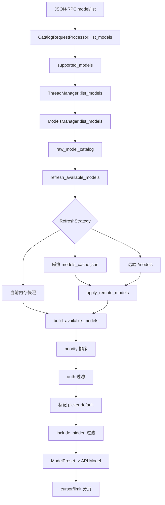

# 精读 02：`ModelsManager::list_models`——模型目录如何在缓存、远端和认证之间做决定

> 源码基线：`4ee41929eaf4`  
> 主文件：`codex-rs/models-manager/src/manager.rs`  
> 入口：`codex-rs/app-server/src/models.rs` 与 `request_processors/catalog_processor.rs`  
> 前置阅读：[第 95 章：App-server 模型目录](../95-app-server-model-catalog-discovery-selection-reasoning-service-tiers-provider-capabilities-and-refresh.md)

## 1. 先说结论：它不是“读取一个模型数组”

客户端打开模型选择器时，看起来只是调用 `model/list`。但服务端必须回答一组动态问题：

1. 使用进程内目录、磁盘缓存，还是访问远端 `/models`？
2. 缓存的五分钟 TTL 是否仍然有效？
3. 缓存是不是由当前 Codex 客户端版本生成的？
4. 当前认证有没有资格访问动态目录？
5. 远端结果应整体替代 bundled 目录，还是与 bundled 合并？
6. 同一个 slug 同时出现时谁覆盖谁？
7. 当前认证能看到哪些模型？
8. 隐藏模型是否出现在本次 API 响应中？
9. 过滤完成后，哪个模型才是 picker 默认项？
10. 远端或缓存失败时，是否仍能返回可用目录？

`ModelsManager` 就是这些决策的协调者。

OpenAI 官方模型目录说明了模型具有不同能力和用途，并会随产品演进变化；本文不把某个当前列表写死，而是精读固定提交中 Codex 如何发现、缓存和投影目录。当前公开模型可查[官方模型目录](https://developers.openai.com/api/docs/models/all)。

## 2. 一张图看完整调用链



链路里有三种不同数据形状：

| 形状 | 所在层 | 用途 |
|---|---|---|
| `ModelInfo` | models-manager 内部目录 | 完整能力与协议 metadata |
| `ModelPreset` | picker 领域投影 | 排序、认证过滤、默认项、显示信息 |
| app-server `Model` | JSON-RPC wire | 客户端真正收到的字段 |

不要把三者都笼统叫“模型对象”。一次 list 调用会逐层投影，而不是原样传递。

## 3. 贯穿案例：三份目录同时存在

假设进程启动时 bundled 目录是：

```text
alpha, priority=1, visible
beta,  priority=2, visible
```

磁盘 `models_cache.json` 中有：

```text
fetched_at = 2 分钟前
client_version = 当前版本
etag = "catalog-v7"
models = [alpha(remote metadata), gamma(priority=0)]
```

远端当前实际已变成：

```text
etag = "catalog-v8"
models = [delta(priority=0)]
```

若策略是 `OnlineIfUncached`：

- 缓存仍在 300 秒 TTL 内，client version 也相同。
- 所以不会访问远端。
- 对 ChatGPT auth，缓存中有 visible 模型，缓存目录成为 source of truth。
- picker 看到 `gamma`、`alpha`，按 priority 排序。

若策略改为 `Online`：

- 忽略新鲜缓存并访问远端。
- 内存更新为 `delta`，ETag 更新为 `catalog-v8`。
- 新目录写回磁盘缓存。

这个案例揭示：“缓存命中”不等于“远端绝对最新”，而是“在当前 freshness 合同下可接受”。

## 4. `model/list` 主要负责 API 外壳

`CatalogRequestProcessor::model_list` 第 159—170 行把请求交给 helper：

```rust
Self::list_models(
    self.thread_manager.clone(),
    self.config.http_client_factory(),
    params,
)
.await
```

helper 第 255—306 行负责：

1. 解构 `limit`、`cursor`、`include_hidden`。
2. 调用 `supported_models` 得到完成目录决策的列表。
3. 把 cursor 解析成起始 offset。
4. 计算 `[start..end]`。
5. 返回数据和下一 cursor。

所以分页不是 ModelsManager 的职责。`effective_limit.max(1)` 表示显式传 0 也会提升到至少 1；`saturating_add` 防止整数加法溢出；cursor 大于 total 会返回 invalid request。

## 5. `supported_models` 固定选择 `OnlineIfUncached`

`codex-rs/app-server/src/models.rs:13-25`：

```rust
thread_manager
    .list_models(RefreshStrategy::OnlineIfUncached, http_client_factory)
    .await
    .into_iter()
    .filter(|preset| include_hidden || preset.show_in_picker)
    .map(model_from_preset)
    .collect()
```

白话翻译：

> 有新鲜缓存就快速使用；没有可用缓存才联网。之后根据请求决定是否保留隐藏项，最后转换成 wire Model。

隐藏过滤发生得很晚。默认项会先依据 picker visibility 标记，随后 `supported_models` 才按 `include_hidden` 删除隐藏项。

## 6. Trait 默认实现：raw catalog + picker projection

`ModelsManager::list_models` 第 88—105 行：

```rust
let catalog = self
    .raw_model_catalog(refresh_strategy, http_client_factory)
    .await;
self.build_available_models(catalog.models)
```

两阶段职责：

- `raw_model_catalog`：决定当前活动的 `Vec<ModelInfo>` 快照。
- `build_available_models`：整理成 picker-ready `Vec<ModelPreset>`。

缓存和 ETag 不关心 UI 默认项；picker 展示也不决定是否联网。这正是分层价值。

返回类型是 boxed future，因为调用者持有 `Arc<dyn ModelsManager>`，运行时可能是动态 OpenAI 实现，也可能是静态 provider 实现。

## 7. 两种 Manager，不要混着理解

| 实现 | 目录来源 | 网络刷新 | 典型语义 |
|---|---|---|---|
| `OpenAiModelsManager` | bundled + cache + `/models` | 可能 | OpenAI-compatible 动态目录 |
| `StaticModelsManager` | 构造时传入的目录 | 不会 | provider 的进程内权威目录 |

`StaticModelsManager::raw_model_catalog` 忽略 `RefreshStrategy`，只 clone 自己的数组；`refresh_if_new_etag` 也是空操作。

本文主线是 `OpenAiModelsManager`。

## 8. 构造时，`remote_models` 其实先装 bundled

状态结构：

```rust
pub struct OpenAiModelsManager {
    remote_models: RwLock<Vec<ModelInfo>>,
    etag: RwLock<Option<String>>,
    cache: Option<Arc<dyn ModelsCache>>,
    endpoint_client: SharedModelsEndpointClient,
    auth_manager: Option<Arc<AuthManager>>,
}
```

构造函数执行：

```rust
let remote_models = load_remote_models_from_file().unwrap_or_default();
```

而 `load_remote_models_from_file` 读取编译时 bundled models response。因此字段名容易误导：刚创建时它不一定含网络结果，而是“当前活动原始目录快照”，初始来源为 bundled。

| 字段 | 职责 |
|---|---|
| `remote_models` | 当前活动目录，异步 `RwLock` 保护 |
| `etag` | 最近应用的远端或缓存 ETag |
| `cache` | 可选缓存，默认 `models_cache.json` |
| `endpoint_client` | 负责认证与 transport 的目录客户端 |
| `auth_manager` | picker 过滤及权威来源判断 |

默认缓存 TTL 是 300 秒。

## 9. `raw_model_catalog` 失败时返回旧目录

```rust
if let Err(err) = self
    .refresh_available_models(refresh_strategy, &http_client_factory)
    .await
{
    error!("failed to refresh available models: {err}");
}
ModelsResponse {
    models: self.get_remote_models().await,
}
```

- 刷新成功：返回新快照。
- 刷新失败：记录 error，仍返回内存里的上一份快照。

因此 `list_models` 返回 `Vec<ModelPreset>`，不是 `Result`。目录刷新故障通常不会让选择器整体失败。

代价是：调用者只看返回值，无法区分“刚更新”与“失败后使用旧数据”；诊断必须看 tracing。

## 10. 刷新前先问：endpoint 有资格联网吗

```rust
async fn should_refresh_models(&self) -> bool {
    self.endpoint_client.uses_codex_backend().await
        || self.endpoint_client.has_command_auth()
}
```

若两者都是 false：

```rust
if !self.should_refresh_models().await {
    if matches!(refresh_strategy, Offline | OnlineIfUncached) {
        self.try_load_cache().await;
    }
    return Ok(());
}
```

细节：

- `Offline` 和 `OnlineIfUncached` 仍会尝试磁盘缓存。
- `Online` 不加载缓存，也不访问远端，只保留内存现状。

所以 `Online` 不是“无条件一定发 HTTP”；仍受 endpoint/auth 能力门控。

## 11. 三种 RefreshStrategy 的精确决策

当 `should_refresh_models == true`：

| 策略 | 读缓存 | 缓存命中 | 缓存 miss/stale | 一定联网吗 |
|---|---|---|---|---|
| `Offline` | 是 | 应用缓存 | 保持内存现状 | 否 |
| `OnlineIfUncached` | 是 | 立即返回 | 访问远端 | 否 |
| `Online` | 否 | 不考虑 | 访问远端 | 是 |

```rust
match refresh_strategy {
    Offline => {
        self.try_load_cache().await;
        Ok(())
    }
    OnlineIfUncached => {
        if self.try_load_cache().await {
            return Ok(());
        }
        self.fetch_and_update_models(http_client_factory).await
    }
    Online => self.fetch_and_update_models(http_client_factory).await,
}
```

`Offline` 不是清空目录；cache miss 时保留 bundled 或上次内存结果。`OnlineIfUncached` 也不会在 cache hit 后后台偷偷检查网络。

## 12. 缓存条目的四类数据

```rust
pub struct ModelsCacheEntry {
    pub fetched_at: DateTime<Utc>,
    pub etag: Option<String>,
    pub client_version: Option<String>,
    pub models: Vec<ModelInfo>,
}
```

| 字段 | 解决的问题 |
|---|---|
| `fetched_at` | 是否超过 TTL |
| `etag` | 服务端以后能否说明目录没变 |
| `client_version` | metadata 是否适合当前 Codex 版本 |
| `models` | 真正目录快照 |

缓存合同规定：absent、stale、version mismatch 返回 `Ok(None)`，属于正常 miss；真正的 I/O 或解析故障返回 `Err`。Manager 会把两者都当作“不能用缓存”，但日志不同。

## 13. 文件缓存怎样判定 fresh

`is_fresh` 的含义：

```text
age = Utc::now() - fetched_at
fresh = age <= configured TTL
```

TTL 为零永远 stale。`load_fresh_file` 的顺序是：

1. 文件不存在 → miss。
2. JSON 损坏或 I/O 错误 → cache error。
3. `client_version` 缺失或不同 → miss。
4. 年龄超过 300 秒 → miss。
5. 全部通过 → cache hit。

一份两秒前但由不兼容客户端生成的目录仍不能用。“新鲜”不等于“兼容”。

## 14. `try_load_cache` 怎样应用磁盘快照

```rust
let cache_entry = match cache.load(&client_version).await {
    Ok(Some(entry)) => entry,
    Ok(None) => return false,
    Err(err) => {
        error!("failed to load models cache: {err}");
        return false;
    }
};
let models = cache_entry.models.clone();
*self.etag.write().await = cache_entry.etag.clone();
self.apply_remote_models(models.clone()).await;
true
```

返回 true 的意思不是“磁盘有文件”，而是“成功应用了一份合格缓存”。

缓存实现已经检查版本，manager 又检查一次。这保护自定义 `ModelsCache` 没有完全遵守合同的情况。

固定提交有一个明确 TODO：文件缓存资格尚未包含 provider identity。切换 provider 时复用同一个缓存文件，是源码已记录但尚未解决的隔离边界。

## 15. cache miss 后怎样访问远端

```rust
let client_version = crate::client_version_to_whole();
let (models, etag) = self
    .endpoint_client
    .list_models(&client_version, http_client_factory.clone())
    .await?;
self.apply_remote_models(models.clone()).await;
*self.etag.write().await = etag.clone();
if let Some(cache) = self.cache.as_ref() {
    let entry = ModelsCacheEntry {
        fetched_at: Utc::now(),
        etag,
        client_version: Some(client_version),
        models,
    };
    if let Err(err) = cache.store(&entry).await {
        error!("failed to write models cache: {err}");
    }
}
```

更新顺序：

1. 网络请求成功。
2. 更新内存活动目录。
3. 更新内存 ETag。
4. 尝试写磁盘缓存。

缓存写失败只记日志，不把成功远端刷新改判为失败。可能出现：

```text
本次进程内目录已经最新
但磁盘仍旧或不存在
下次启动需要重新联网
```

缓存不是权威存储，不能反过来阻止内存使用新结果。

## 16. remote 是替代 bundled，还是合并

`apply_remote_models` 先计算：

```rust
let should_use_remote_models_only =
    !models.is_empty()
    && models.iter().any(|m| m.visibility == ModelVisibility::List)
    && auth_mode_is_chatgpt;
```

只有同时满足：

1. remote 非空；
2. 至少一个模型 picker-visible；
3. 当前是 ChatGPT account auth；

remote 才成为完整 source of truth。

为什么要求 visible？如果远端异常返回空目录或只有隐藏 metadata，直接替代 bundled 会让 picker 突然无可用模型；代码选择进入 merge 路径。

## 17. merge 规则：同 slug 替换，新 slug 追加

```rust
let mut existing_models = load_remote_models_from_file().unwrap_or_default();
for model in models {
    if let Some(i) = existing_models.iter().position(|e| e.slug == model.slug) {
        existing_models[i] = model;
    } else {
        existing_models.push(model);
    }
}
*self.remote_models.write().await = existing_models;
```

每次 merge 都重新从 bundled 开始，不从当前内存数组继续累加：

- remote 同 slug 覆盖 bundled metadata。
- remote 新 slug 追加。
- 上次 remote 有、这次 remote 已删除的 slug 不会残留。

认证与结果矩阵：

| 情形 | 活动目录 |
|---|---|
| ChatGPT + 至少一个 visible remote | remote-only |
| ChatGPT + empty remote | bundled |
| ChatGPT + hidden-only remote | bundled + hidden remote |
| API auth / command auth | bundled + remote |

## 18. picker projection 的顺序

```rust
remote_models.sort_by_key(|model| model.priority);
let mut presets: Vec<ModelPreset> =
    remote_models.into_iter().map(Into::into).collect();
let uses_codex_backend = self
    .auth_manager()
    .is_some_and(AuthManager::current_auth_uses_codex_backend);
presets = ModelPreset::filter_by_auth(presets, uses_codex_backend);
ModelPreset::mark_default_by_picker_visibility(&mut presets);
presets
```

顺序不能随便交换：

1. 按数字 `priority` 升序，较小值排前。
2. `ModelInfo` 转成 `ModelPreset`。
3. 根据当前 auth 过滤。
4. 在剩余 picker-visible 模型中标 default。

若过滤前就标默认，被删掉的模型可能仍是唯一 default。测试 `build_available_models_picks_default_after_hiding_hidden_models` 证明 hidden 模型 priority 更高时，visible 模型仍成为默认项。

## 19. auth 过滤和 hidden 过滤不是一回事

两种过滤解决不同问题：

| 过滤 | 发生位置 | 问题 |
|---|---|---|
| `ModelPreset::filter_by_auth` | ModelsManager | 当前认证是否能使用这个模型 |
| `include_hidden` / `show_in_picker` | app-server | 本次客户端是否要求看隐藏模型 |

认证不允许的模型，不会因为 `include_hidden=true` 就重新出现。hidden 更像展示策略；auth filtering 是资格约束。

`auth_manager()` 每次读取当前模式，而不是只保存构造时布尔值。测试 `static_manager_reads_latest_auth_mode` 验证 auth 变化后，静态 manager 的列表过滤也随之变化。

## 20. 默认模型怎样选

普通动态 manager 的 trait 默认实现：

```rust
if let Some(model) = model.as_ref() {
    return model.to_string();
}
default_model_from_available(
    self.list_models(refresh_strategy, http_client_factory).await,
)
```

规则是：

- 用户显式提供 model：原样保留，甚至无需刷新目录。
- 未提供：列出可用模型，找 `is_default`。
- 没有标记 default：取第一项。
- 目录为空：返回空字符串。

这解释了 `dynamic_manager_preserves_requested_model_when_fallback_is_allowed`：即使参数名有 `allow_provider_model_fallback=true`，OpenAI 动态 manager 的 trait 默认实现仍优先保留显式 model。

`StaticModelsManager` 覆写了该方法。当 provider 明确允许 fallback 时，它会检查请求模型是否存在；不存在则改用 provider 默认项。不要从静态 provider 的 fallback 测试反推动态 manager。

## 21. `is_default` 为什么必须在排序和过滤之后计算

`default_model_from_available`：

```rust
available
    .iter()
    .find(|model| model.is_default)
    .or_else(|| available.first())
    .map(|model| model.model.clone())
    .unwrap_or_default()
```

默认项不是另一个独立配置字符串，而是 picker-ready 列表上的标志。构造列表时先按 priority 排序、再过滤、再标志，因此 fallback 到 `first()` 也具有稳定排序语义。

如果目录中第一个 raw model 是 hidden，它不应自动成为 picker default；这就是 `mark_default_by_picker_visibility` 存在的原因。

## 22. ETag 是变化提示，不是目录内容

ETag 可理解为远端目录版本标签。它本身不含模型数组，只帮助判断“服务器看到的目录是否与本地已知版本相同”。

固定提交有两条 ETag 来源：

- `/models` 响应返回的 ETag。
- `models_cache.json` 中随目录快照保存的 ETag。

两者被应用后都进入 manager 的 `etag: RwLock<Option<String>>`。

## 23. `refresh_if_new_etag` 的两条路

```rust
let current_etag = self.get_etag().await;
if current_etag.clone().is_some()
    && current_etag.as_deref() == Some(etag.as_str())
{
    if let Some(cache) = self.cache.as_ref() {
        cache.refresh_ttl(&client_version).await;
    }
    return;
}
self.refresh_available_models(RefreshStrategy::Online, ...).await;
```

### ETag 相同

无需重新下载目录，只续期缓存 freshness。

注意额外条件 `current_etag.is_some()`：两个“都没有 ETag”的状态不能证明目录相同，因此不会走续期捷径。

### ETag 不同，或当前没有 ETag

强制 `Online` 刷新，跳过普通 freshness 缓存。

`refresh_if_new_etag` 自己吞掉刷新错误并记日志，符合模型目录的可降级策略。

## 24. TTL 续期为什么不直接调用普通 cache load

`ModelsCache::load` 有意不返回过期条目。但服务端刚用 ETag 证明目录仍没变化时，即使本地时间戳即将或已经不适合普通 load，也需要更新原条目。

所以 cache trait 单独定义：

```rust
fn refresh_ttl(&self, client_version: &str) -> Future<Result<...>>;
```

文件实现直接读取条目，保留 models、ETag 和 client version，只更新 `fetched_at`。

它还有一个写放大优化：

```rust
if entry.is_fresh(self.cache_ttl / 2) {
    return Ok(());
}
```

五分钟 TTL 下，若条目年龄还不到约 2.5 分钟，就没必要为了同一个 ETag 再写一次磁盘。

## 25. 后台 worker：立即刷新，然后每三分钟刷新

`models_refresh_worker.rs` 中：

```rust
const MODELS_REFRESH_INTERVAL: Duration = Duration::from_secs(3 * 60);
```

worker 启动后循环顺序是：

1. 检查 cancellation。
2. 尝试升级 manager 的 weak reference。
3. 调用 `list_models(RefreshStrategy::Online, ...)`。
4. drop 临时 strong reference。
5. 等待取消或三分钟 sleep。

因为第一次 refresh 在 sleep 之前，所以 worker 启动后会立即在线刷新，不是三分钟后才第一次运行。

## 26. 为什么 worker 持有 `Weak`

```rust
let models_manager = Arc::downgrade(models_manager);
```

若后台 task 持有强 `Arc`，它自身可能让 manager 永远无法释放。使用 `Weak` 后：

- 主系统仍存在 manager：`upgrade()` 成功，继续刷新。
- 主系统已经释放 manager：`upgrade()` 返回 `None`，worker 自行结束。

`ModelsRefreshWorker::Drop` 还会取消 token。这里有两条独立退出条件：owner 生命周期和显式 cancellation。

## 27. worker 为什么使用 `Online`，model/list 使用 `OnlineIfUncached`

两者优化目标不同：

- 前台 `model/list`：优先低延迟，五分钟内缓存可接受。
- 后台 worker：职责就是主动更新，因此每轮使用 `Online`。

三分钟刷新间隔小于五分钟文件 TTL 并不矛盾。后台在线维护尽量新鲜的内存和缓存；前台在后台不可用、启动早期或独立调用时仍可用五分钟缓存快速响应。

## 28. RwLock 保护了什么，没有保护什么

`remote_models` 和 `etag` 各自使用 Tokio `RwLock`：

- 多个读者可以并发 clone 当前快照。
- 写入新目录或 ETag 时需要独占写锁。
- `try_get_remote_models` 使用 `try_read`，锁繁忙时立即返回 `TryLockError`，不会等待。

但网络请求发生在获得写锁之前：

```text
endpoint.list_models().await
    -> apply_remote_models() 获取目录写锁
    -> etag.write()
```

因此本函数没有提供 singleflight：两个并发 Online refresh 可能各自发网络请求，并按完成顺序写入。`RwLock` 保证内存访问安全，不自动保证“同一时刻只有一次刷新”。

这是源码边界，不等于已经确认生产中存在有害竞态；还需结合所有调用方和 endpoint 行为评估。

## 29. 目录与 ETag 分成两把锁意味着什么

`fetch_and_update_models` 先写目录，再写 ETag。短暂窗口里，另一个 task 理论上可能读到“新目录 + 旧 ETag”。

固定实现把二者视为分别受保护的派生状态，而不是一个原子 snapshot struct。大多数 list 调用只需要模型数组，所以这种结构简单；但若未来要求严格原子地观察目录与 ETag，就应考虑把它们放进同一锁保护的状态对象。

这是一项设计观察，不应写成现有 bug 结论。

## 30. 从 `ModelInfo` 转成 wire `Model`

`model_from_preset` 复制或转换：

- id、slug、display name、description。
- upgrade 与 migration 文案。
- reasoning effort 列表及默认 effort。
- input modalities、personality。
- speed/service tiers。
- picker default 与 hidden 状态。

该函数不是目录发现逻辑，而是 wire adapter。若新增 app-server Model 字段，通常需要同步检查：

1. `ModelInfo` 是否已有来源。
2. `ModelPreset` 是否携带。
3. `model_from_preset` 是否投影。
4. app-server schema/TypeScript 是否更新。

## 31. `get_model_info` 和“列出模型”不是同一问题

`get_model_info(model_slug)` 用于给某个已经选定的 slug 找运行 metadata：

```rust
let remote_models = self.get_remote_models().await;
construct_model_info_from_candidates(model, &remote_models, config)
```

匹配规则：

1. 在候选目录中做 longest-prefix match。
2. 普通匹配失败时，允许剥掉一层简单 provider namespace 再试。
3. 仍失败则从 slug 构造保守 fallback metadata。
4. 最后应用配置 overrides。

例如 `custom/gpt-image` 可以继承 `gpt-image` metadata；`ns1/ns2/gpt-image` 不会无限剥 namespace。

所以“某个显式 slug 能启动并获得 fallback metadata”不等于“它出现在 picker 目录里”，也不证明远端实际支持它。

## 32. 用贯穿案例完整跑一遍

### 32.1 进程构造

```text
remote_models = bundled [alpha, beta]
etag = None
cache = models_cache.json, TTL=300s
```

### 32.2 前台第一次 model/list

```text
strategy = OnlineIfUncached
should_refresh = true
cache age = 2min
cache version = current
try_load_cache -> true
apply_remote_models([alpha(remote), gamma])
```

ChatGPT + visible remote 触发 remote-only：

```text
remote_models = [alpha(remote), gamma]
etag = catalog-v7
network fetch count = 0
```

picker projection：

```text
sort priority -> [gamma, alpha]
auth filter -> 假设都保留
mark default -> gamma
include_hidden=false -> 都保留
```

### 32.3 后台 worker 紧接着运行

```text
strategy = Online
跳过 cache
远端返回 [delta], etag=catalog-v8
apply remote-only
remote_models = [delta]
etag = catalog-v8
store cache
```

### 32.4 下一次 model/list

它可能从刚写的新鲜缓存再次应用 `[delta]`，不会访问网络；结果仍是 delta。

## 33. 失败矩阵：出错后还剩什么

| 失败位置 | manager 行为 | list 最终常见结果 |
|---|---|---|
| cache 文件不存在 | 正常 miss | OnlineIfUncached 转远端 |
| cache stale | 正常 miss | 转远端 |
| cache version mismatch | 正常 miss | 转远端 |
| cache JSON 损坏 | 记 error，当 miss | 转远端 |
| remote request 失败 | refresh 返回 Err | raw catalog 记 error，返回旧内存目录 |
| cache store 失败 | 记 error，不传播 | 返回刚下载的内存目录 |
| refresh TTL 失败 | 记 error | 保留当前目录和 ETag |
| 当前 auth 不可刷新 | 不联网 | Offline/OIU 可试 cache，否则保持内存 |

这里最稳定的降级底座是 bundled 初始目录。只有 bundled 加载本身失败时，构造代码才以空数组继续。

## 34. 代表性测试分别证明什么

### 34.1 fresh cache 避免第二次网络请求

`refresh_available_models_uses_cache_when_fresh` 连续两次 `OnlineIfUncached`，最终断言 endpoint fetch count 为 1。

### 34.2 stale 和 version mismatch 都重新请求

- `refresh_available_models_refetches_when_cache_stale`
- `refresh_available_models_refetches_when_version_mismatch`

两者都先生成缓存，再修改 cache metadata，第二次调用后断言 fetch count 为 2。

### 34.3 cache read error 会 fallback，write error 不破坏刷新

- `injected_cache_read_error_falls_back_and_persists_remote_models`
- `injected_cache_write_error_does_not_fail_remote_refresh`

它们分别证明 cache 故障不是 model discovery 的硬失败。

### 34.4 ChatGPT visible remote 是 source of truth

`refresh_available_models_uses_remote_only_catalog_for_chatgpt_auth` 对整个数组做 equality，证明 bundled 没有混入结果。

对应边界测试：

- empty ChatGPT remote 保留 bundled。
- hidden-only ChatGPT remote 与 bundled 合并。
- API auth 继续走 bundled + remote。

### 34.5 删除的 remote 不应残留

`refresh_available_models_drops_removed_remote_models` 让第一次远端返回 old、第二次只返回 new，最终断言 new 存在而 old 不存在。这与“每次 merge 从 bundled 重建”直接对应。

### 34.6 auth 不允许时不联网

`refresh_available_models_skips_network_without_chatgpt_auth` 断言 fetch count 为 0。另一个测试验证外部 API key 覆盖 ChatGPT auth 时也不走 Codex backend 刷新。

### 34.7 排序与默认项

- `refresh_available_models_sorts_by_priority` 验证较小 priority 在前。
- `build_available_models_picks_default_after_hiding_hidden_models` 验证 hidden 高优先项不会抢走 visible default。

## 35. 六个容易产生的误解

### 误解一：`remote_models` 永远来自网络

不是。构造时它先装 bundled；之后可能被 cache 或 remote 更新。

### 误解二：`Online` 一定联网

不是。endpoint/auth 没有刷新资格时，它保持内存现状。

### 误解三：cache hit 后仍会后台比对远端

本次 `OnlineIfUncached` 不会。它命中后立即返回；独立后台 worker 可能随后 Online 刷新。

### 误解四：远端模型总是与 bundled 合并

不是。ChatGPT auth 且 remote 含 visible 模型时，remote 整体成为 source of truth。

### 误解五：`include_hidden=true` 可以绕过认证过滤

不能。auth filter 发生得更早，hidden 只是展示维度。

### 误解六：能构造 fallback `ModelInfo` 就代表模型可用

不能。fallback metadata 只让未知 slug 有保守运行参数，不证明 provider 接受该 slug。

## 36. 为什么整体顺序这样安排

主链顺序可压缩为：

```text
决定是否刷新
  -> 选择 cache 或 endpoint
  -> 形成活动 raw catalog
  -> priority 排序
  -> auth 过滤
  -> picker default
  -> hidden 过滤
  -> wire 投影
  -> 分页
```

若先分页再 auth 过滤，一页可能不足 limit 且 cursor 不稳定；若先标 default 再 auth 过滤，默认项可能消失；若把缓存写失败向上升级为 list 失败，非权威的性能优化会破坏已经成功的远端目录。

## 37. 值得继续留意的实现边界

- 默认文件缓存的 key 尚未包含 provider identity，源码有 TODO。
- 同一 manager 的并发 Online refresh 没有显式 singleflight。
- 目录与 ETag 使用两把锁，不是原子联合快照。
- file cache 使用 `fs::write`，它是不是足够满足崩溃一致性要结合使用场景评估，不能从本文件宣称原子替换。
- `raw_model_catalog` 吞刷新错误，使用户体验更稳，但上层若需要展示 stale 状态，目前没有结构化字段。
- 后台 worker 固定三分钟 Online；频率与网络成本的权衡需要 telemetry 才能评价。

## 38. 可以学走的设计模式

### 模式 A：权威数据与缓存分离

缓存失败不应否定一次已成功的远端读取。

### 模式 B：保底快照

动态刷新失败时保留上一份内存结果，首次又有 bundled 兜底。

### 模式 C：策略枚举代替布尔参数

`RefreshStrategy` 比 `refresh: bool` 清楚地区分三种调用意图。

### 模式 D：数据发现与 UI 投影分层

raw catalog 不携带分页和 hidden 请求细节。

### 模式 E：弱引用后台 owner

后台刷新不反向延长主要服务对象生命周期。

## 39. 自测题

1. 为什么 `OnlineIfUncached` 的 cache hit 不访问网络？
2. 为什么 client version 不同，即使缓存只生成一分钟也不能用？
3. ChatGPT remote 只有 hidden 模型时，为什么不采用 remote-only？
4. 为什么 merge 每次从 bundled 重建，而不基于当前内存数组？
5. auth filter 和 include_hidden filter 有什么不同？
6. 远端成功、cache store 失败，list 应返回哪份目录？
7. 两把 RwLock 是否保证目录和 ETag 总被原子观察？

### 参考答案

1. 该策略的合同就是“有合格缓存即停止”，主动追新由 Online 调用或 worker 完成。
2. metadata 可能与当前客户端能力或解析合同不兼容。
3. 防止 picker 被一个无 visible 项的远端快照清空。
4. 这样已从新 remote 删除的旧 remote slug 不会永久残留。
5. auth 是使用资格，hidden 是本次是否展示；include_hidden 不能恢复 auth 已删除项。
6. 返回刚应用到内存的新目录，缓存失败只影响未来复用。
7. 不能。每把锁只保证各自字段安全，二者更新之间有短窗口。

## 40. 建议动手验证

1. 给 `refresh_available_models` 画 2×3 表：`should_refresh` 两种值乘三种策略。
2. 对照 `apply_remote_models`，手算 ChatGPT/API auth 各自收到 empty、hidden-only、visible remote 的结果。
3. 阅读 stale 与 version mismatch 两个测试，指出它们只改了缓存的哪个字段。
4. 沿 `model/list -> supported_models -> list_models` 标出 hidden filter 和 auth filter 的先后。
5. 找到 worker 的 sleep，确认第一次刷新为什么不是三分钟后。

## 41. 本篇局部术语表

| 名词 / 代码词 | 中文 | 本篇含义 |
|---|---|---|
| model catalog | 模型目录 | 一组模型及其能力、可见性和默认信息 |
| bundled catalog | 内置目录 | 随程序提供的保底模型数据 |
| remote catalog | 远端目录 | provider `/models` 返回的目录 |
| active snapshot | 活动快照 | manager 当前内存中供读取的目录 |
| source of truth | 权威来源 | 本轮完全决定活动目录的数据源 |
| `RefreshStrategy` | 刷新策略 | Offline、OnlineIfUncached、Online |
| cache hit | 缓存命中 | 找到 freshness 和版本都合格的条目 |
| cache miss | 缓存未命中 | 不存在、过期或不合格 |
| stale | 过期 | 年龄超过配置 TTL |
| TTL | 生存时间 | 文件缓存可直接复用的 300 秒窗口 |
| ETag | 实体标签 | 远端目录版本提示 |
| revalidation | 重新验证 | 证明 ETag 未变并续期缓存 |
| client version | 客户端版本 | 缓存目录适用的 Codex 版本 |
| `ModelInfo` | 模型信息 | models-manager 的完整原始 metadata |
| `ModelPreset` | 模型预设 | picker-ready 的领域投影 |
| priority | 优先级 | 数字越小，排序越靠前 |
| visibility | 可见性 | 模型是否应在 picker 列出 |
| auth filtering | 认证过滤 | 根据当前认证删除不可用模型 |
| picker default | 选择器默认项 | 过滤后默认选中的 visible 模型 |
| merge | 合并 | remote 同 slug 替换，新增 slug 追加 |
| remote-only | 仅远端 | 不混入 bundled 的权威目录 |
| fallback metadata | 回退元数据 | 未知 slug 获得的保守运行参数 |
| longest-prefix match | 最长前缀匹配 | 用最具体候选 slug 继承 metadata |
| namespace | 命名空间 | `provider/model` 中的 provider 前缀 |
| `RwLock` | 读写锁 | 多读或单写的异步状态保护 |
| `try_read` | 尝试读锁 | 无法立即获得时返回错误而不等待 |
| singleflight | 单航班去重 | 多个相同刷新共享一次在途请求；本实现未显式提供 |
| `Weak` | 弱引用 | 不增加对象强引用计数的 owner 观察 |
| cancellation token | 取消令牌 | 通知后台 worker 结束 |
| wire projection | 协议投影 | `ModelPreset` 转 app-server `Model` |
| graceful degradation | 优雅降级 | 刷新失败时返回旧内存或 bundled 目录 |

## 42. 源码导航

| 想继续追什么 | 固定提交文件 | 重点符号 |
|---|---|---|
| Manager trait 与动态实现 | `codex-rs/models-manager/src/manager.rs` | `ModelsManager`、`OpenAiModelsManager` |
| refresh 决策 | 同上 | `refresh_available_models` |
| endpoint 更新 | 同上 | `fetch_and_update_models` |
| remote-only / merge | 同上 | `apply_remote_models` |
| picker 投影 | 同上 | `build_available_models`、`get_default_model` |
| metadata 匹配 | 同上 | `construct_model_info_from_candidates` |
| cache 合同与文件实现 | `codex-rs/models-manager/src/cache.rs` | `ModelsCache`、`FileModelsCache` |
| app-server 列表投影 | `codex-rs/app-server/src/models.rs` | `supported_models`、`model_from_preset` |
| JSON-RPC 分页 | `codex-rs/app-server/src/request_processors/catalog_processor.rs` | `model_list`、`list_models` |
| 后台刷新 | `codex-rs/app-server/src/models_refresh_worker.rs` | `spawn_with_interval` |
| ETag 运行时触发 | `codex-rs/core/src/session/turn.rs` | `refresh_if_new_etag` 调用 |
| manager 测试 | `codex-rs/models-manager/src/manager_tests.rs` | cache/auth/source-of-truth/default 测试 |
| app-server 集成测试 | `codex-rs/app-server/tests/suite/v2/model_list.rs` | hidden、pagination、remote catalog |

下一篇计划精读 Session 初始化：一条 thread 创建时，配置、模型、认证、工具服务和持久化对象怎样汇合成可运行的 Session。

返回[源码精读目录](README.md)或[课程总目录](../README.md)。
