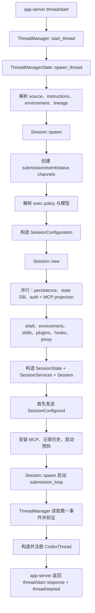

# 精读 03：`Session::spawn` 与 `Session::new`——一条 thread 怎样变成可运行的 Agent

> 源码基线：`4ee41929eaf4`  
> 主文件：`codex-rs/core/src/session/mod.rs`、`codex-rs/core/src/session/session.rs`  
> 上游：`codex-rs/core/src/thread_manager.rs`  
> 前置阅读：[生命周期与状态所有权](../02-thread-turn-step.md)

## 1. 先说结论：初始化不是调用一个构造器

用户发送 `thread/start` 后，Core 不能只执行 `Session { ... }`。它要在第一条 turn 到来前完成：

1. 决定新建、恢复还是 fork，并确定 thread/session lineage。
2. 解析活动模型、模型 metadata、provider 和 service tier。
3. 把配置中的审批、权限、cwd、environment 与 instructions 固化成初始运行配置。
4. 建立 submission、event 和 agent-status 通道。
5. 初始化 thread persistence、state DB、auth 与 MCP projection。
6. 解析 shell、环境、AGENTS.md、skills、plugins、hooks 和 extensions。
7. 准备网络代理、执行策略、模型客户端、code mode 和后台进程管理器。
8. 构造 `SessionState` 与 `SessionServices`。
9. 保证 `SessionConfigured` 是内部事件流第一条事件。
10. 安装初始 MCP runtime，记录恢复历史并启动预热。
11. 启动 submission loop。
12. 最后把 `CodexThread` 注册进 ThreadManager。

所以 Session 初始化是一条“组装并发布运行时”的流水线，而不是普通 struct constructor。

官方 app-server 文档把 thread 定义为包含 turns 的 conversation，并说明 `thread/start` 创建新 thread、订阅其事件，之后再用 `turn/start` 驱动工作。本文精读这个公开动作背后的 Core 实现。[官方 Codex App Server 文档](https://learn.chatgpt.com/docs/app-server)

## 2. 先分清三个对象

| 对象 | 它是什么 | 它不是什么 |
|---|---|---|
| `Session` | 一条已初始化 Agent 的状态与服务所有者 | 不是 JSON-RPC response |
| `SessionIo` | 向 session loop 提交消息、接收事件和等待结束的通道集合 | 不拥有主要业务状态 |
| `CodexThread` | 上层稳定句柄，包装 `Arc<Session> + SessionIo + configured metadata` | 不是另一份 Session |

源码关系：

```text
CodexThread
├── session: Arc<Session>
├── io: SessionIo
├── session_configured: SessionConfiguredEvent
├── rollout_path
└── session_source
```

用生活类比：

- `Session` 是正在运行的工作室。
- `SessionIo` 是工作室的收件口、广播口和关门通知。
- `CodexThread` 是管理系统保存的工作室句柄。

## 3. 一张图看完整流程



## 4. 贯穿案例

假设客户端请求：

```json
{
  "method": "thread/start",
  "params": {
    "model": null,
    "cwd": "/repo",
    "approvalPolicy": "on-request",
    "sandbox": "workspaceWrite",
    "ephemeral": false
  }
}
```

配置中还有：

```text
默认 provider = openai
默认 reasoning effort = medium
启用一个 optional MCP server
项目里有 AGENTS.md
模型目录缓存新鲜
```

最终希望得到：

```text
thread_id = 新 ID
session_id = thread_id（根 thread）
model = 缓存目录里的 picker default
cwd = /repo
rollout = 已建立逻辑记录，但首次用户消息前文件可尚未物化
SessionConfigured = 事件流第 1 条
MCP runtime = SessionConfigured 之后发布
submission_loop = 已运行，等待 turn/start
```

后文用这个案例追踪状态。

## 5. 公开 `thread/start` 入口做什么

app-server 的 `ThreadRequestProcessor::thread_start` 接收：

- request id。
- `ThreadStartParams`。
- app-server client name/version。
- client MCP extensions。
- request context。

它调用 `thread_start_inner`，后者负责协议参数验证、加载 cwd 对应配置、应用 overrides、构造 `StartThreadOptions`，然后进入 `ThreadManager::start_thread`。

本文从 Core 的 `ThreadManager::start_thread` 开始。原因是 app-server 负责“wire 参数是否合法”，Session 负责“运行时能否真正建立”。

## 6. `ThreadManager::start_thread` 先整理来源

```rust
pub async fn start_thread(&self, options: StartThreadOptions) -> CodexResult<NewThread> {
    self.start_thread_inner(options, None).await
}
```

`start_thread_inner` 会：

1. 根据 config 选择 agent control。
2. 如果 initial history 是 resumed，从历史恢复 session/thread source。
3. 显式 source 优先，否则使用恢复来源或 manager 默认来源。
4. 构造 `ThreadSpawnRequest`。
5. 进入统一 `spawn_thread`。

新建、恢复、fork 和 subagent 最终尽量收敛到同一 spawn 管线，但它们携带不同 `InitialHistory` 与 lineage。

## 7. 已运行的 resume 不重复创建 Session

`spawn_thread` 先检查 resumed conversation id：

```rust
if let Some(thread) = threads.get(&resumed.conversation_id).cloned() {
    if thread.is_running() {
        return Ok(NewThread {
            thread_id: resumed.conversation_id,
            session_configured: thread.session_configured(),
            thread,
        });
    }
}
```

如果同一 thread 已在内存运行，resume 返回现有 `CodexThread`，不会再建第二个 Session。

如果请求 rollout path 与正在运行实例不同，则拒绝，防止同一个 thread id 指向两份历史。

## 8. Core spawn 前还要解析四类派生信息

在调用 `Session::spawn` 前，ThreadManager 解析：

- `user_instructions`：根 thread 从 provider 新加载；非根 agent 尽量继承父运行时快照。
- `parent_rollout_thread_trace`：子 thread 的 tracing lineage。
- `multi_agent_version`：从历史、父 thread 或 config 决定。
- `originator`：用于 Responses 请求与 analytics 的有效发起方。

还会建立 `source_changed_during_startup` 标志，跟踪 MCP source 在 Session 尚未注册时是否发生变化；若发生，注册后请求一次 runtime refresh。

这说明初始化不是完全与外界隔绝。系统必须补偿“对象仍在 starting 阶段时配置源变化”的竞态。

## 9. `SessionSpawnArgs` 是组装清单

它包含几十个字段，大致分六组：

| 分组 | 代表字段 |
|---|---|
| 配置与模型 | `config`、`allow_provider_model_fallback`、`models_manager` |
| 身份与来源 | `installation_id`、`auth_manager`、`session_source`、`originator` |
| 历史与 lineage | `conversation_history`、`fork_persistence`、parent/fork ids |
| 能力服务 | skills、plugins、MCP、code mode、extensions、agent control |
| 环境与策略 | environment manager/selections、exec policy、shell override |
| 持久化与观测 | thread store、analytics、trace、attestation、time provider |

这个大参数对象的价值是让 ThreadManager 清楚交接“创建一个 Session 所需的全部依赖”，而不是让 `Session::new` 到处读全局单例。

## 10. `Session::spawn` 先建立 tracing 边界

外层 `spawn` 验证可选 W3C parent trace：

```rust
let parent_trace = match args.parent_trace {
    Some(trace) if context_from_w3c_trace_context(&trace).is_some() => Some(trace),
    Some(_) => {
        warn!("ignoring invalid thread spawn trace carrier");
        None
    }
    None => None,
};
```

无效 trace carrier 不让 thread 创建失败，只丢弃并 warning。随后整个 `spawn_internal` 被 `thread_spawn` span 包裹。

这是“诊断 metadata 失败不应破坏核心创建”的例子。

## 11. 首先创建三条通信路径

```rust
let (tx_sub, rx_sub) = async_channel::bounded(512);
let (tx_event, rx_event) = async_channel::unbounded();
let (agent_status_tx, agent_status_rx) =
    watch::channel(AgentStatus::PendingInit);
```

| 通道 | 方向 | 容量/语义 |
|---|---|---|
| submission | 上层 → loop | bounded 512，提供背压 |
| event | Session → 上层 | unbounded，按顺序输出事件 |
| agent status | Session → 观察者 | watch，只关心最新状态 |

为什么 submission 有界、event 无界？固定提交选择对输入施加队列上限，而事件通道要避免 Session 因上层暂未读取而卡在初始化。但 unbounded 也意味着消费方必须持续读取，不能把它理解为零成本。

## 12. exec policy 的三种来源

初始化执行策略按 source 选择：

1. Guardian reviewer：使用内置 default，拒绝调用者规则影响 reviewer。
2. 子/派生运行时显式继承了 policy：clone 继承对象。
3. 普通根 Session：必要时迁移旧 prefix rules，再从 config layer stack 加载。

加载失败映射为 fatal：

```rust
ExecPolicyManager::load(&config.config_layer_stack)
    .await
    .map_err(|err| CodexErr::Fatal(...))?
```

因此规则解析失败可以阻止 Session 建立；但旧规则迁移失败只 warning。这两者风险不同：无法确定当前有效策略比无法完成一次兼容迁移更严重。

## 13. 根 Agent 与非根 Agent 的模型刷新不同

```rust
let refresh_strategy = if session_source.is_non_root_agent() {
    RefreshStrategy::Offline
} else {
    RefreshStrategy::OnlineIfUncached
};
```

- 根 thread：可用新鲜缓存，必要时联网。
- 非根 agent：Offline，避免每个 subagent 都触发目录网络刷新。

如果 config 未显式 model，非根 agent 仍需读取当前目录来决定默认项；如果显式 model 且 Offline，则可以避免额外 `list_models`。

这是上一章 `ModelsManager` 在真实调用点中的应用。

## 14. 模型解析分三步

### 第一步：可选刷新目录

```rust
models_manager.list_models(refresh_strategy, ...).await;
```

返回值在这里可能被丢弃，因为目的只是让 manager 内部目录达到期望 freshness。

### 第二步：决定有效 model slug

```rust
let model = models_manager
    .get_default_model(&config.model, allow_provider_model_fallback, ...)
    .await;
```

显式 model、provider fallback 与 picker default 在这里汇合。

### 第三步：获得运行 metadata

```rust
let model_info = models_manager
    .get_model_info(&model, &config.to_models_manager_config())
    .await;
```

`model` 是字符串选择；`model_info` 是 context window、instructions、reasoning、tool 能力等运行描述。两者不能混为一个变量。

## 15. base instructions 的优先级

源码注释明确给出：

```text
1. config.base_instructions override
2. conversation history 中 session_meta.base_instructions
3. 当前 model 的 instructions template
```

对应代码：

```rust
config.base_instructions.clone()
    .or_else(|| history.get_base_instructions().map(|s| s.text))
    .unwrap_or_else(|| model_info.get_model_instructions(config.personality))
```

恢复 thread 时优先使用历史记录里的 base instructions，可以避免新版程序或目录模板变化后静默重写旧 conversation 的基础语境。

## 16. dynamic tools 也能从历史恢复

```rust
let dynamic_tools = if dynamic_tools.is_empty() {
    conversation_history.get_dynamic_tools().unwrap_or_default()
} else {
    dynamic_tools
};
```

调用方提供非空新列表时覆盖恢复值；没有新值时使用 rollout metadata 中的 dynamic tools。

这与官方合同“thread/start 定义并持久化 dynamic tools，resume 可恢复”的行为一致。

## 17. `SessionConfiguration` 是初始运行合同

它聚合：

- provider 与 collaboration mode。
- model、reasoning summary、service tier。
- base/developer instructions 与 personality。
- approval policy、reviewer、permission profile。
- environments、cwd、Codex home。
- history mode 与 lineage。
- source、originator、dynamic tools 和 shell override。

这里称“初始运行合同”比“永远不可变配置”准确。它存入 `SessionState`，部分字段可由后续 thread/turn 设置更新；但 features 等字段明确设计为 Session 生命周期不变。

## 18. provider 在这里变成运行对象

```rust
provider: create_model_provider(
    config.model_provider.clone(),
    Some(Arc::clone(&auth_manager)),
)
```

config 中的 provider 是描述；`create_model_provider` 产生运行时 provider 对象，并接入 AuthManager。

后面 `ModelClient::new` 会拿到 provider info，而每个 turn 的模型请求复用 Session 级 model client。

## 19. service tier 不是照抄配置字符串

初始化先根据：

- 配置的 tier。
- FastMode feature。
- `ModelInfo` 支持的 tiers。

计算有效值。若配置 tier 不受当前模型支持，生成 warning，并在 Session 创建后发送。

所以 `SessionConfigured.service_tier` 是解析后的有效值，不一定等于原始 config 字符串。

## 20. `Session::new` 先确定 thread_id 与 session_id

thread id：

| InitialHistory | thread id |
|---|---|
| New / Cleared / Forked | `agent_control.generate_thread_id()` |
| Resumed | 历史中的 conversation id |

session id：

- 恢复历史有有效 session id：优先恢复。
- 非根 agent：继承 agent control 的 session tree root id。
- 根 thread：`SessionId::from(thread_id)`。

因此根 thread 通常 `session_id == thread_id`；subagent 的 thread id 不同，但 session id 可与根相同。官方 app-server 文档也要求客户端读取 `thread.sessionId`，不要自行从 thread id 推导。

## 21. extension init 在 Session 存在前就准备

`thread_extension_init` 会：

1. 优先读取调用方传入的 selected capability roots。
2. 若没有，从 initial history 恢复。
3. 写入 `ThreadOriginator`。
4. clone 一份给 MCP thread init。
5. 构造成 thread-scoped `ExtensionData`。

这说明 extensions 不是 Session 创建完成后随便挂上的 map。它们参与 MCP projection、lifecycle callback 和历史恢复，必须在主对象构造前准备稳定 identity。

## 22. 三项独立初始化并行执行

源码用：

```rust
let (thread_persistence_result, state_db_ctx, (auth, mcp_projection)) =
    tokio::join!(
        thread_persistence_fut,
        state_db_fut,
        auth_and_mcp_fut
    );
```

并行的三组工作：

| future | 产出 |
|---|---|
| thread persistence | `LiveThread` 或 ephemeral 的 None |
| state DB | 本地 ThreadStore 的可选 state DB handle |
| auth + MCP | 当前 auth snapshot 与 step runtime projection |

它们没有彼此数据依赖，所以并行能降低启动延迟。`tokio::join!` 会等待全部 future 完成，不会像“第一个完成即返回”的 race。

## 23. persistent 与 ephemeral 的差别

若 `config.ephemeral`：

- 不创建或恢复 `LiveThread`。
- 不获取 state DB。
- `SessionConfigured.rollout_path` 为 None。
- app-server thread response 不暴露 path。

若 persistent：

- New/Cleared/Forked 调用 `LiveThread::create`。
- Resumed 调用 `LiveThread::resume`。
- 保存 session/thread ids、lineage、base instructions、dynamic tools、capability roots、history mode 等 metadata。

“创建 LiveThread”不等于马上在磁盘写出完整 rollout 文件。集成测试断言 fresh persistent thread 在首条用户消息前 path 已被分配，但实际文件尚未 materialize。

## 24. `LiveThreadInitGuard` 是提交/撤销边界

持久化初始化结果进入：

```rust
let mut live_thread_init = LiveThreadInitGuard::new(...);
```

之后所有 Session 组装放进一个 `session_result`。结尾：

```rust
match session_result {
    Ok(sess) => {
        live_thread_init.commit();
        Ok(sess)
    }
    Err(err) => {
        live_thread_init.discard().await;
        Err(err)
    }
}
```

这是一种异步 guard transaction：

- 全部初始化成功才 commit。
- 中途 shell、proxy、config lock、MCP 等失败就 discard 未完成 live thread。

它避免 thread store 留下一条看似可用、实际 Session 从未完成的记录。

## 25. tracing lineage 区分根与 spawned child

根 Session 调用：

```text
ThreadTraceContext::start_root_or_disabled
```

thread-spawn 子 Agent 调用：

```text
parent_trace.start_child_thread_trace_or_disabled
```

若父没有 trace bundle，子也不会创建一个看起来像独立根任务的孤儿 bundle。观测树要与真实 thread spawn 树保持一致。

## 26. warning 为什么先收集、不马上发送

初始化会收集：

- legacy feature deprecation。
- config startup warnings。
- unstable feature warning。
- hooks startup warning。

它们先进入 `post_session_configured_events`，而不是发现时立即 `send_event`。

原因是 ThreadManager 要求事件流第一条必须是 `SessionConfigured`。如果初始化过程中先发 warning，上层无法先建立 thread identity 和配置快照。

## 27. shell 与 environment 的组装

shell 选择顺序：

1. Session 显式 shell override。
2. 启用 ShellZshFork 时使用 packaged zsh。
3. 否则使用系统默认 user shell。

如果启用了 zsh fork，却没有可用 packaged zsh，Session 初始化失败。测试 `session_new_fails_when_zsh_fork_enabled_without_packaged_zsh` 覆盖这个边界。

随后构造 `ThreadEnvironments`，输入包括：

- environment manager。
- 默认 shell。
- thread-level environment config。
- shell snapshot。
- 继承 environment snapshot。
- deferred executor feature。

再应用 selections 并生成 resolved snapshot，后续 AGENTS、skills、MCP 都需要它。

## 28. AGENTS、plugins、skills 与 thread name 再次并行

```rust
let ((), plugin_skill_errors, thread_name) = tokio::join!(
    agents_md_manager.refresh(...),
    plugin_skill_warmup,
    thread_name_lookup,
);
```

- AGENTS.md 刷新依赖 resolved environments。
- plugins/skills warmup 建立本 Session 可见能力。
- thread name lookup 从 store 恢复标题。

skill 加载错误在这里被记录，不会统一让 Session 失败。required MCP 则不同，后面会看到它可以让启动失败。不同扩展系统有不同“是否为硬依赖”的合同。

## 29. Config lock 在运行对象发布前验证

thread name 写入 `SessionConfiguration` 后，代码执行：

```rust
validate_config_lock_if_configured(&session_configuration).await?;
export_config_lock_if_configured(&session_configuration, thread_id).await?;
```

如果配置锁要求无法满足，Session 不能继续发布。顺序上它发生在构造 `SessionState` 和发送 `SessionConfigured` 之前。

## 30. `SessionState` 与 `SessionServices` 的分工

### SessionState：会变化的 thread 状态

代表字段：

- `session_configuration`
- model-visible history
- token/rate limit 信息
- previous turn settings
- auto-compact window
- additional context
- granted permissions
- pending session-start hook source

它被 `Mutex<SessionState>` 包裹，因为 turn 和控制操作需要串行修改。

### SessionServices：Session 生命周期服务

代表字段：

- MCP runtime/manager。
- unified exec manager。
- AuthManager、ModelsManager、ModelClient。
- skills、plugins、extensions、hooks。
- exec policy、approval store、network approval。
- thread store/state DB。
- code mode、tool search cache、environment manager。

两者可以记成：

```text
State    = 这条 thread 现在记得什么、配置成什么
Services = 这条 thread 能调用哪些长期服务
```

## 31. 为什么很多 service 用 `Arc`

ThreadManager 传入的 AuthManager、ModelsManager、MCP manager、plugins 等可能跨 threads 共享，所以 `Arc::clone` 只增加引用计数，不复制底层 manager。

而 `SessionServices` 中也有 thread-owned 对象：

- `McpRuntime` 是此 thread 的活动连接集合。
- `UnifiedExecProcessManager` 管理此 thread 的后台进程。
- approval store 属于此 Session。
- `ModelClient` 携带 thread identity。

“放在 Arc 里”不自动意味着跨所有 Session 共享；必须看对象在哪里创建。

## 32. Managed network proxy 为什么在 Session 前启动

若 permissions 配置网络规则，初始化会根据：

- exec policy。
- permission profile。
- managed requirements。
- allowlist-miss decision callback。
- blocked-request observer。

启动 managed proxy。

callback 将来需要回到 Session，但 Session 尚未构造，所以先保存 `Weak<Session>` 槽；Session 创建后再填进去。使用 Weak 可避免 proxy callback 与 Session 构成强引用环。

## 33. Extension lifecycle 在 Session 构造前被调用

每个 thread lifecycle contributor 收到：

- config 与 session source。
- 是否有 persistent state。
- environments。
- MCP resource client。
- telemetry metrics。
- session/thread extension stores。

此时正式 Session 尚不存在，但代码已创建一个 empty MCP runtime 和稳定 resource client。这让 extensions 可以保存 thread-scoped 状态，同时避免它们看到尚未发布的半初始化 Session。

## 34. MCP runtime 先是 empty

`SessionServices` 构造时注释明确：

```rust
// Start with an empty connection set. The initialized set is
// published after SessionConfigured so MCP events follow it.
```

先放 empty runtime，构造 Session，发送 `SessionConfigured`，然后才：

```rust
sess.install_initial_mcp_runtime(...).await?;
```

这是事件顺序设计，不是“忘了提前连接 MCP”。如果先发布 initialized MCP runtime，它产生的 server status/tool 事件可能跑到 `SessionConfigured` 前面。

## 35. ModelClient 是 Session 级，不是每个 turn 新建

`ModelClient::new` 接收：

- AuthManager。
- agent identity auth policy。
- thread id。
- provider info。
- session source 与 originator。
- verbosity、request compression、runtime metrics。
- beta feature header、attestation、HTTP client factory。

它存入 `SessionServices.model_client`。每次 sampling 会从它创建请求 session，但 thread identity、provider 路由和共享 client pool 在 Session 层复用。

## 36. 真正构造 Session 时还没有 active turn

```rust
let sess = Arc::new(Session {
    state: Mutex::new(state),
    active_turn: Mutex::new(None),
    input_queue: InputQueue::new(),
    services,
    ...
});
```

这时 Agent 已初始化，但没有用户 turn。`thread/start` 和 `turn/start` 是两个不同阶段：

```text
thread/start -> 建立可运行容器
turn/start   -> 在容器内启动一次用户工作
```

这与官方 app-server 生命周期描述一致。

## 37. `SessionConfigured` 为什么必须是第一事件

事件包含：

- session/thread/parent/fork ids。
- model/provider/service tier。
- approval、reviewer、permission profile。
- cwd、reasoning effort。
- initial messages。
- network proxy runtime。
- rollout path。

它是上层理解后续事件的解释上下文。没有它，warning、MCP status 或历史 item 都缺少稳定配置基线。

源码通过两道保证：

1. `Session::new` 用 `std::iter::once(SessionConfigured).chain(warnings)` 发送。
2. `ThreadManager::finalize_thread_spawn` 读取第一事件并严格匹配，否则返回 `SessionConfiguredNotFirstEvent`。

这不是注释约定，而是运行时 invariant。

## 38. 为什么记录 initial history 也必须晚于 configured

源码注释：

```rust
// record_initial_history can emit events.
// We record only after the SessionConfiguredEvent is emitted.
```

resume/fork history 可能转成 item events。若先记录历史，UI 会在尚不知道 model、cwd 和 rollout path 时收到历史内容。

因此顺序是：

```text
SessionConfigured
-> startup warnings
-> 安装 MCP
-> record initial history
```

其中 MCP 安装可能发状态事件，但 empty runtime 的发布策略确保 configured 已经排队在前。

## 39. required MCP 失败为何让 thread/start 失败

`install_initial_mcp_runtime(...).await?` 位于 `Session::new` 成功返回之前。

- optional MCP 失败：Session 可继续，并发送 startup status。
- required MCP 失败：安装返回错误，`Session::new` 失败。
- `LiveThreadInitGuard` discard。
- `Session::spawn` 不会启动 submission loop。
- ThreadManager 不会注册 `CodexThread`。
- app-server 返回 thread/start error。

集成测试 `thread_start_fails_when_required_mcp_server_fails_to_initialize` 断言错误消息包含 required server 名。

## 40. 预热与 startup hook 不是第一条 turn

MCP 安装后：

- 启动 MCP prewarm worker。
- 调度 model/session startup prewarm。
- 根据 New/Resume/Fork/Clear 记录 pending SessionStart source。

这些工作为第一条 turn 降低延迟或准备 hook context，但 `active_turn` 仍为 None，也没有产生用户 turn。

## 41. `Session::spawn` 最后才启动 submission loop

`Session::new` 完整成功后：

```rust
let session_loop_handle = tokio::spawn(async move {
    submission_loop(session_for_loop, configured_config, rx_sub).await;
});
```

然后返回：

```rust
SessionIo {
    tx_sub,
    rx_event,
    agent_status: agent_status_rx,
    session_loop_termination: shared_completion_future,
}
```

submission loop 一直运行到 `Op::Shutdown` 或所有提交 sender 被关闭。把 endpoints 与 Session 本体分开，使关闭所有提交入口可以自然终止 loop。

## 42. ThreadManager 如何完成发布

`finalize_thread_spawn`：

1. 从 `SessionIo` 读取第一事件。
2. 验证 id 是空的 `INITIAL_SUBMIT_ID`。
3. 验证事件是 `SessionConfigured`。
4. 获取 thread map 写锁。
5. 仅在 id vacant 时构造 `CodexThread` 并注册。

若出现重复 id：

- shutdown 新创建的 Session loop。
- 返回 “thread already running”。

只有注册完成的 `CodexThread` 才会交给 app-server 形成 thread/start response 和 `thread/started` notification。

## 43. 用贯穿案例跑一遍

```text
1. app-server 解析 /repo 配置与 workspaceWrite
2. ThreadManager 解析 root source、instructions、originator
3. 创建 bounded submission、unbounded event、watch status
4. 加载 exec policy
5. root 使用 OnlineIfUncached 模型目录
6. config.model=None -> picker default
7. ModelInfo 生成 base instructions
8. 形成 SessionConfiguration
9. 生成 thread_id；root session_id=thread_id
10. 并行创建 LiveThread、state DB、auth+MCP projection
11. 解析 shell/environment/AGENTS/plugins/skills
12. 创建 SessionState 和 SessionServices
13. 构造 Arc<Session>，active_turn=None
14. event #1 = SessionConfigured
15. optional MCP 安装；失败只报告状态
16. 启动 prewarm，Session::new 成功
17. 启动 submission_loop
18. ThreadManager 消费并验证 event #1
19. 注册 CodexThread
20. app-server 返回 idle thread，等待 turn/start
```

## 44. 失败点与可见结果

| 失败点 | 是否有已注册 CodexThread | 处理 |
|---|---|---|
| app-server 参数/config 验证 | 否 | JSON-RPC error |
| exec policy load | 否 | fatal init error |
| model refresh | 通常继续 | ModelsManager 自身降级 |
| permission profile 构造 | 否 | Session spawn error |
| thread persistence | 否 | guard 不 commit |
| packaged zsh 不可用 | 否 | discard live init |
| config lock validation | 否 | discard |
| managed proxy 启动 | 否 | discard |
| required MCP | 否 | discard，thread/start error |
| optional MCP | 是 | status/warning 后继续 |
| duplicate thread id 注册 | 否（新实例） | shutdown 新 loop，保留旧 thread |

## 45. 测试证据

### 新建 thread 的外部合同

`thread_start_creates_thread_and_emits_started` 验证：

- session/thread ids 非空。
- preview 初始为空。
- provider 正确。
- status 为 Idle。
- persistent thread 有绝对 path。
- 首条用户消息前 rollout 文件尚未物化。

### ephemeral 不暴露 path

`thread_start_ephemeral_remains_pathless` 断言 `ephemeral=true` 且 `path=None`。

### required 与 optional MCP 区别

- required broken MCP：thread/start 返回错误。
- optional broken MCP：start 成功，并收到 `mcpServer/startupStatus/updated`。

### 模型 fallback

thread_start 测试分别覆盖 static provider fallback、动态目录保持显式未知 model、unsupported service tier 被丢弃。

### Session lineage

Core session tests验证 resumed root 的 session id 等于 root thread id，resumed subagent 恢复 persisted session tree id。

### starting 阶段 MCP invalidation

ThreadManager 测试 `mcp_invalidation_refreshes_threads_that_are_still_starting` 证明前文的 `source_changed_during_startup` 补偿不是死代码。

## 46. 七个常见误解

### 误解一：thread 就是 Session

公开 thread 是 conversation；Core `CodexThread` 包装 `Session` 和 `SessionIo`。

### 误解二：thread/start 会立刻开始调用模型

不会。它建立 idle Session；用户工作由 turn/start 开始。

### 误解三：创建 persistent thread 就立即写出完整 rollout 文件

不一定。可以先拥有逻辑 path，首次用户消息时再 materialize。

### 误解四：所有初始化错误都变成 warning

不是。exec policy、config lock、proxy、required MCP 等可以让启动失败。

### 误解五：所有 manager 都为每条 thread 复制

不是。许多 manager 通过 Arc 跨 threads 共享；thread runtime 和状态则单独创建。

### 误解六：SessionConfigured 只是普通通知

不是。Core 强制它为内部第一事件，ThreadManager 会验证。

### 误解七：SessionConfiguration 永远不可变

不准确。它是初始合同并存于可变 SessionState；一些设置可刷新，而 `Session.features` 明确设计为生命周期不变。

## 47. 为什么顺序必须这样安排

```text
先验证和解析配置
-> 决定 model/provider/instructions
-> 初始化持久化与环境服务
-> 构造完整 Session
-> 先发布配置基线
-> 再发布 MCP/历史/警告事件
-> 启动 loop
-> 验证首事件
-> 注册 thread
```

若先注册再 required MCP 初始化，客户端可能拿到随后立刻死亡的 thread；若先记录历史再 configured，UI 无法解释历史；若先启动 loop 再完成 service 组装，早到 submission 可能观察半初始化状态。

## 48. 值得留意的工程边界

- event channel 是 unbounded，慢消费者可能积累内存。
- submission capacity 512 是进程内背压，不等于 app-server transport 队列上限。
- `Session::new` 参数非常多，显示 Session 仍是高耦合组装边界。
- `original_config_do_not_use` 的字段名直接表达了待迁移技术债。
- skills warmup error 与 required MCP error 的策略不同，新增能力时必须明确 hard/soft dependency。
- SessionConfigured 已发送到内部 channel 后，required MCP 仍可能失败；由于 Session 未返回、ThreadManager 未注册，这个内部事件不会变成成功 thread 发布。

## 49. 可以学走的设计模式

### 模式 A：Prepare, publish, register

先准备完整对象，再发布初始化事件，最后放入全局 registry。

### 模式 B：Guarded initialization

用 `LiveThreadInitGuard` 在成功时 commit、失败时 discard。

### 模式 C：并行独立 I/O

用 `tokio::join!` 并行 persistence、state DB、auth/MCP，以及 AGENTS/skills/title。

### 模式 D：首事件作为握手

`SessionConfigured` 是 Core Session 与 ThreadManager 之间的运行时握手。

### 模式 E：State 与 Services 分离

可变历史/配置集中加锁，长期服务以清晰所有权保存。

## 50. 自测题

1. `Session`、`SessionIo`、`CodexThread` 各自负责什么？
2. 为什么 subagent 通常使用 Offline 模型刷新？
3. 恢复历史里的 base instructions 为什么优先于当前模型模板？
4. persistent thread 为什么可能有 path 但文件尚不存在？
5. 为什么 initial MCP runtime 先是 empty？
6. required MCP 失败后，ThreadManager 是否已注册 thread？
7. `SessionConfigured` 的第一事件规则由什么代码保证？
8. thread id 和 session id 在 subagent 中为何可能不同？

### 参考答案

1. Session 拥有运行状态/服务；SessionIo 是消息端口；CodexThread 是上层稳定句柄。
2. 避免每个子 Agent 重复联网刷新，并复用已有目录。
3. 保持旧 conversation 的基础语境，不被新版模板静默改写。
4. LiveThread 可以先建立逻辑记录，rollout 延迟到首条持久内容才物化。
5. 确保 MCP 产生的事件不会排在 SessionConfigured 前。
6. 没有；Session::new 先失败，guard discard，spawn/finalize 不继续。
7. Session::new 先 enqueue；finalize_thread_spawn 再读取并严格匹配。
8. subagent 是独立 thread，但属于根 thread 的 session tree。

## 51. 本篇局部术语表

| 名词 / 代码词 | 中文 | 本篇含义 |
|---|---|---|
| Session initialization | Session 初始化 | 从配置和依赖组装可运行 Agent 的全过程 |
| `Session` | 运行会话 | thread 的状态与服务所有者 |
| `SessionIo` | 会话输入输出 | submission/event/status/termination 通道集合 |
| `CodexThread` | Codex thread 句柄 | 上层持有的 Session + IO 包装 |
| `SessionSpawnArgs` | Session 创建参数 | ThreadManager 向 Session 交接的依赖清单 |
| `SessionConfiguration` | Session 运行配置 | model、provider、permissions、instructions 等初始合同 |
| `SessionState` | Session 状态 | 历史、token、可变设置和 turn 间状态 |
| `SessionServices` | Session 服务 | MCP、模型、exec、plugins、persistence 等长期对象 |
| `InitialHistory` | 初始历史 | New、Cleared、Forked 或 Resumed |
| lineage | 血缘 | root、parent、fork、session tree 关系 |
| thread id | thread 标识 | 一条 conversation 的唯一 id |
| session id | session 树标识 | 根及其 subagents 共享的树根 id |
| `LiveThread` | 活动持久线程 | ThreadStore 中的新建/恢复写入对象 |
| materialize | 物化 | 把逻辑 rollout 真正写成文件/耐久记录 |
| init guard | 初始化守卫 | 成功 commit、失败 discard 的资源边界 |
| `SessionConfigured` | Session 已配置事件 | 必须排在内部事件流首位的启动握手 |
| submission loop | 提交循环 | 持续处理 Op，直到 shutdown 的后台 task |
| bounded channel | 有界通道 | 达到 512 后对输入产生背压 |
| unbounded channel | 无界通道 | event queue 不设固定容量 |
| watch channel | 观察通道 | 保存并广播最新 AgentStatus |
| provider runtime | provider 运行对象 | config 描述结合 auth 后的模型 provider |
| effective model | 有效模型 | 显式设置、fallback 或默认选择后的 slug |
| base instructions | 基础指令 | config、历史或模型模板解析出的 session 指令 |
| dynamic tools | 动态工具 | thread start 定义并可随 rollout 恢复的工具 |
| hard dependency | 硬依赖 | 失败会阻止 Session 发布，例如 required MCP |
| soft dependency | 软依赖 | 失败记录 warning/status 后继续 |
| prewarm | 预热 | 第一 turn 前提前准备连接或模型 session |
| lifecycle contributor | 生命周期贡献者 | 接收 thread start/resume 等 extension callback |
| commit/discard | 提交/丢弃 | 初始化成功保留，失败清理未完成持久对象 |

## 52. 源码导航

| 想继续追什么 | 固定提交文件 | 重点符号 |
|---|---|---|
| app-server thread/start | `codex-rs/app-server/src/request_processors/thread_processor.rs` | `thread_start`、`thread_start_inner` |
| Core 统一入口 | `codex-rs/core/src/thread_manager.rs` | `start_thread`、`spawn_thread` |
| 前置派生信息 | 同上 | user instructions、originator、multi-agent、trace |
| Session 外层组装 | `codex-rs/core/src/session/mod.rs` | `SessionSpawnArgs`、`Session::spawn` |
| 模型与配置解析 | 同上 | `spawn_internal` 600—719 |
| channels 与 loop | 同上 | `SessionIo`、`submission_loop` |
| Session 重型初始化 | `codex-rs/core/src/session/session.rs` | `Session::new` |
| 状态对象 | `codex-rs/core/src/state/session.rs` | `SessionState` |
| 服务对象 | `codex-rs/core/src/state/service.rs` | `SessionServices` |
| 上层句柄 | `codex-rs/core/src/codex_thread.rs` | `CodexThread` |
| 首事件验证与注册 | `codex-rs/core/src/thread_manager.rs` | `finalize_thread_spawn` |
| app-server 行为测试 | `codex-rs/app-server/tests/suite/v2/thread_start.rs` | create/ephemeral/MCP/model |
| Core Session 测试 | `codex-rs/core/src/session/tests.rs` | ids、config、shell、history |
| ThreadManager 测试 | `codex-rs/core/src/thread_manager_tests.rs` | resume、MCP invalidation、shared services |

下一篇计划精读 Turn 主循环：一次 `turn/start` 怎样形成 TurnContext，进入模型 sampling，并在 tool call 与下一次 sampling 之间循环。

返回[源码精读目录](README.md)或[课程总目录](../README.md)。
