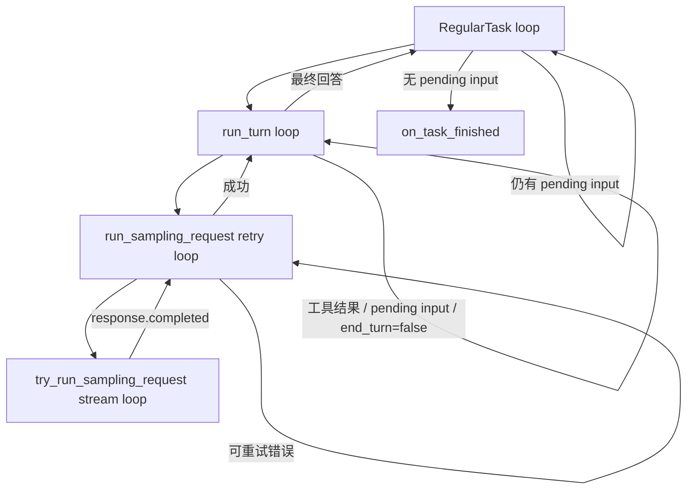

# 精读 04：`run_turn`——模型、工具与下一次采样怎样组成循环

> 源码基线：`4ee41929eaf4`  
> 主文件：`codex-rs/core/src/session/turn.rs`  
> 上游：`codex-rs/app-server/src/request_processors/turn_processor.rs`、`codex-rs/core/src/tasks/regular.rs`  
> 下游：`codex-rs/core/src/stream_events_utils.rs`、`codex-rs/core/src/tools/parallel.rs`  
> 前置阅读：[精读 03：Session 初始化](03-session-initialization.md)

## 1. 先说人话：Agent 不是只问模型一次

假设用户说：

```text
看看项目里的 Cargo.toml，然后告诉我 workspace 有多少成员。
```

Codex 不一定一次就得到最终答案。典型过程是：

```text
第 1 次请求模型：
    用户问题 + 历史 + 可用工具

模型返回：
    请执行 read_file("Cargo.toml")

Codex：
    执行工具，把文件内容记录为 tool output

第 2 次请求模型：
    原历史 + tool call + tool output

模型返回：
    workspace 共有 42 个成员

Codex：
    记录最终回答，结束 Turn
```

这个“模型决定下一步，Codex 执行，再把结果交还模型”的循环，就是 `run_turn` 的核心。

官方 App Server 文档把 `turn/start` 描述为：向 thread 添加用户输入并开始生成，先返回 `inProgress` Turn，然后流式发送 item 事件，最后发送 `turn/completed`。内部的多次模型请求、工具执行和重试，都被包装在这一个公开 Turn 里。[官方 Codex App Server 文档](https://learn.chatgpt.com/docs/app-server)

## 2. 本篇要解决的核心问题

读完应能回答：

1. 一个 Turn 为什么可能包含多次模型请求？
2. `TurnContext` 和 `StepContext` 有什么区别？
3. 模型返回 function call 后，谁查找并执行工具？
4. tool output 怎样进入下一次模型请求？
5. `needs_follow_up` 到底表示什么？
6. 网络重试和工具后的再次 sampling 有什么不同？
7. 多个工具为什么能并行，又为什么按原顺序回填结果？
8. 用户在 Turn 运行中继续输入，会发生什么？
9. 哪些条件结束 Turn，哪些条件让循环继续？
10. `TurnComplete` 为什么不由 `run_turn` 直接发送？

## 3. 先分清五个层级

| 层级 | 直观含义 | 典型数量 |
|---|---|---:|
| Session / thread | 一段持续对话 | 1 |
| Turn | 一次用户工作周期 | 多个 |
| Task | Core 执行 Turn 的后台任务 | 通常每 Turn 1 个 |
| sampling request | 一次发给模型的请求 | 每 Turn 1 到多次 |
| response item / tool call | 模型流中的消息、推理或工具请求 | 每次 sampling 0 到多个 |

最重要的一句：

> 一个 Turn 不等于一次 Responses 请求。

工具型任务通常是：

```text
1 Turn
├── sampling #1：模型要求调用工具
├── tool execution：运行工具
└── sampling #2：模型读取工具结果并回答
```

如果继续调用第二个工具，还会有 sampling #3。

## 4. 四层循环总览

源码里至少有四个不同目的的循环：



它们分别解决：

| 循环 | 解决的问题 |
|---|---|
| `RegularTask::run` 外层 loop | `run_turn` 返回后若仍有待处理输入，继续同一任务 |
| `run_turn` 主 loop | 工具结果、steer 输入和 compaction 后重新请求模型 |
| `run_sampling_request` retry loop | 同一次逻辑 sampling 遇到暂时性网络错误时重试 |
| `try_run_sampling_request` stream loop | 消费一次 Responses 流里的 created、item、delta、completed |

“再次 sampling”和“retry”不是同一回事，后文会反复强调。

## 5. 贯穿案例

使用一个足够具体的例子：

```text
用户：读取 Cargo.toml，统计 workspace members，并给出数字。
```

假设模型分两步：

```text
sampling #1
  -> function_call read_file({"path":"Cargo.toml"})

工具执行
  -> function_call_output("members = [a, b, c]")

sampling #2
  -> assistant message "workspace 有 3 个成员。"
```

运行中用户又 steer：

```text
另外把成员名字也列出来。
```

那么 pending input 也会使 `run_turn` 继续一次 sampling，而不是立即完成旧 Turn。

## 6. 公开入口 `turn_start_inner`

app-server 的 `turn_start_inner` 先做边界工作：

1. 根据 `threadId` 加载 `CodexThread`。
2. 检查当前来源是否允许直接输入。
3. 限制用户文本总字符数。
4. 保存 app-server client 信息。
5. 解析 cwd、runtime workspace roots 和 environments。
6. 把 v2 input 转成 Core `UserInput`。
7. 把 model、effort、sandbox、approval 等组成 `ThreadSettingsOverrides`。
8. 构造 `Op::UserInput`。
9. 提交给 `SessionIo`，用 submission id 作为公开 turn id。

核心片段可以概括为：

```rust
let turn_op = Op::UserInput {
    items,
    final_output_json_schema,
    responsesapi_client_metadata,
    additional_context,
    thread_settings,
};

let turn_id = thread
    .submit_user_input_with_client_user_message_id(...)
    .await?;
```

## 7. 为什么提交成功就能返回 `inProgress`

app-server 没有等待模型回答，只确认 `Op::UserInput` 已进入 Session submission channel：

```text
JSON-RPC request
-> submission channel 接收成功
-> 返回 Turn { status: InProgress, items: [] }
```

因此这个 response 表示：

> Core 已接纳工作，不表示模型请求已经完成，甚至不保证此刻已经发出。

公开 turn id 当前直接使用 Core submission id。源码注释也明确说，会创建 Turn 的 submission id 会暴露为 public-facing turn id。

## 8. `Op::UserInput` 里不只有文字

它还携带：

| 字段 | 含义 |
|---|---|
| `items` | 文本、图片、skill、mention 等用户输入 |
| `final_output_json_schema` | 最终输出结构约束 |
| `responsesapi_client_metadata` | 透传给 Responses 的客户端 metadata |
| `additional_context` | UI 或宿主补充的上下文 |
| `thread_settings` | 本 Turn 对 model、权限、cwd 等的覆盖 |

所以 `turn/start` 不只是“把字符串送给模型”，它也可能改变此 Turn 的运行环境和输出合同。

## 9. submission loop 把 Op 交给 handler

上一章看到 Session 初始化后启动 submission loop。收到 `Op::UserInput` 后，它进入：

```text
handlers::user_input_or_turn
-> user_input_or_turn_inner
```

这里开始把“消息提交”提升为“运行中的 Turn”。

## 10. 先应用 turn-level settings

`user_input_or_turn_inner` 先把 `ThreadSettingsOverrides` 转成 `SessionSettingsUpdate`，然后：

```rust
let current_context =
    sess.new_turn_with_sub_id(sub_id.clone(), updates).await?;
```

这意味着同一 Session 的不同 Turn 可以使用不同：

- model / reasoning effort。
- cwd / environment。
- approval 和 permission profile。
- service tier。
- personality。
- collaboration mode。
- output schema。

这些覆盖先经校验，再生成本 Turn 的有效快照。

## 11. `TurnContext` 是 Turn 级快照

`TurnContext` 保存一次 Turn 大体稳定的上下文，例如：

- turn/submission id 与 trace id。
- model metadata、provider、effort、summary。
- per-turn config 和 permission。
- environment selections。
- cwd、日期、时区。
- developer instructions 与 collaboration mode。
- personality、network proxy。
- final output schema。
- dynamic tools。
- extension store、timing、terminal error。

白话理解：

> `TurnContext` 回答“这一整次 Turn 按什么身份、模型和权限运行”。

它用 `Arc<TurnContext>` 传递，是为了让 sampling、工具异步任务和生命周期回调共享同一份 Turn 身份。

## 12. `new_turn_with_sub_id` 不只是 new

这个函数还会：

1. 在锁内把 updates 应用到 `SessionConfiguration`。
2. 检测 MCP 输入是否变化。
3. 检测 permission profile 是否变化。
4. 更新 environment selections/config。
5. 必要时标记 MCP runtime dirty 并预热。
6. 必要时刷新 managed network proxy。
7. 通知 config contributors。
8. 最后才构造 `TurnContext`。

如果设置无效，它先发送 bad-request error event，再返回 `InvalidRequest`。

因此 `new_turn_with_sub_id` 更像：

```text
validate + apply effective settings + refresh affected services + snapshot
```

## 13. 已有 active Turn 时可能变成 steer

生成 `TurnContext` 后，handler 先尝试：

```rust
sess.steer_input(...)
```

两种主要结果：

```text
已有 active Turn
-> 输入排进正在运行的 Turn
-> UserMessageAdmission::Steered

没有 active Turn
-> 组织 task_input
-> spawn RegularTask
-> UserMessageAdmission::Started
```

这说明 Core 的输入接纳层兼顾“开始新 Turn”和“给运行中 Turn 加输入”。公开 `turn/steer` 还有更严格的 `expectedTurnId` 语义；不要仅凭内部复用就把两个 API 当成完全相同。

## 14. additional context 与 user input 分开组织

新任务的 `task_input` 先放 additional context，再放用户输入：

```text
TurnInput::ResponseItem(additional context)
TurnInput::UserInput {
    content,
    client_id
}
```

这样 Core 可以区分：

- 用户真的说了什么。
- 宿主、环境或系统补充了什么。

两者都会进入模型可见历史，但来源语义不同。

## 15. `spawn_task` 建立任务生命周期

没有 active Turn 时，handler 调用：

```rust
sess.spawn_task(
    current_context,
    task_input,
    RegularTask::new(),
).await;
```

`spawn_task` 会：

1. 终止需被替换的旧任务。
2. 清理上次 connector selection。
3. 调用 `start_task`。

正常路径已经先确认没有 active Turn；`abort_all_tasks(Replaced)` 同时构成防御性边界。

## 16. `start_task` 创建 `ActiveTurn`

`start_task` 准备：

- `CancellationToken`。
- 完成通知 `Notify`。
- `TurnState`。
- token usage 起始基线。
- pending input。
- turn tracing span。
- agent execution guard。
- 后台 Tokio task。

随后保存：

```text
Session.active_turn
└── ActiveTurn
    ├── task: RunningTask
    └── turn_state: Arc<Mutex<TurnState>>
```

这就是审批、request_user_input、MCP elicitation、dynamic tool response 等异步回合能找到当前等待者的位置。

## 17. `TurnState` 保存“正在等什么”

它包含：

- pending approvals。
- pending permission requests。
- pending user input requests。
- pending MCP elicitations。
- pending dynamic tools。
- pending input queue。
- 已授权的 turn-scoped permissions。
- tool call 计数。
- token usage baseline。
- mailbox delivery phase。

`TurnContext` 偏配置快照，`TurnState` 偏运行中的可变等待状态。

## 18. 扩展生命周期早于真正采样

`start_task` 在启动后台任务前调用：

```rust
self.emit_turn_start_lifecycle(turn_context, token_usage_at_turn_start)
```

extension contributor 能看到：

- turn id。
- collaboration mode。
- Turn 开始时 token usage。
- session/thread/turn 三层 extension store。

因此 extension 的 `on_turn_start` 不等于“模型首 token 已出现”，而是 Core Turn 已正式建立。

## 19. `RegularTask` 先发送 `TurnStarted`

`RegularTask::run` 首先发送：

```rust
EventMsg::TurnStarted {
    turn_id,
    trace_id,
    started_at,
    model_context_window,
    collaboration_mode_kind,
}
```

然后才处理 startup prewarm，并进入 `run_turn`。

源码特别说明：`TurnStarted` 要立即发，不能为了等待 prewarm 阻塞 first-turn lifecycle。

## 20. prewarmed client session 是优化，不是另一个 Turn

Session 初始化时可能预热一个 `ModelClientSession`。

`RegularTask` 的处理：

| prewarm 结果 | 行为 |
|---|---|
| Ready | 把预热 session 交给 `run_turn` |
| Unavailable | 新建普通 model client session |
| Cancelled | 记录输入并结束 |

它只影响连接和请求准备成本，不改变 Turn id，也不会额外产生用户 Turn。

## 21. `RegularTask` 还有一个外层 loop

简化代码：

```rust
loop {
    let last = run_turn(...).await?;
    if !has_pending_input {
        return Ok(last);
    }
    next_input = Vec::new();
}
```

为什么 `run_turn` 自己已经有 loop，还要再包一层？

因为在 `run_turn` 判断可以结束到 task 真正收尾之间，仍可能有输入到达。外层 loop 做最后一道 pending-work 检查，避免刚到的消息被遗漏。

## 22. 进入 `run_turn`：先取得模型会话

```rust
let mut client_session =
    prewarmed.unwrap_or_else(|| model_client.new_session());
```

同一个 `ModelClientSession` 会在 Turn 内复用：

- 多次 sampling。
- sampling retry。
- WebSocket 连接。
- sticky routing state。

它是 Turn 级请求会话，不是整个 thread 的 `Session`。

## 23. sampling 前先检查是否需要 compact

`run_pre_sampling_compact` 在记录新用户输入前检查旧历史是否已接近上下文限制。

错误策略有区别：

| 错误 | 处理 |
|---|---|
| TurnAborted | 记录输入，向上传播取消 |
| ToolCollision | 直接返回错误 |
| 其他 compact error | 发 turn error lifecycle，停止本次工作 |

这一步说明上下文管理并非仅在请求失败后补救，而是会在 sampling 前预防。

## 24. 用户 mention 会影响 MCP、skills 和 plugins

`run_turn` 从输入中分析：

- required MCP servers。
- 显式提到的 plugins。
- skills。
- connectors/apps。

然后构造 injection items。比如用户显式写 `$skill-name`，完整 skill instructions 可能在这里进入历史，而不是由模型凭名字猜测。

## 25. 第一个 `StepContext` 在这里捕获

```rust
let first_step_context =
    sess.capture_step_context_with_required_mcp_servers(...).await?;
```

这一步固定“第一次 sampling 实际看到和能调用的运行世界”：

- environment readiness。
- capability roots。
- executor capability discovery。
- 当前 MCP binding。
- 当前 AGENTS.md。
- 最终 tool router。

## 26. `StepContext` 与 `TurnContext` 的区别

| 对象 | 稳定范围 | 典型内容 |
|---|---|---|
| `TurnContext` | 整个 Turn | model、权限、mode、turn id、output schema |
| `StepContext` | 一次 sampling request | MCP snapshot、tool router、environment readiness、AGENTS.md |

源码注释称 `StepContext` 是：

> Request-scoped state that may change between model sampling requests.

为什么需要两层？因为同一个 Turn 运行几十秒时：

- MCP server 可能变为 ready。
- tool catalog 可能刷新。
- remote environment readiness 可能变化。
- AGENTS.md 可能被重新观察。

下一次 sampling 可以捕获新 `StepContext`，但仍属于同一 `TurnContext`。

## 27. 一次 step 必须共享同一工具视图

源码强调：

```text
Capture once so context, advertised tools, and tool calls
share one request view.
```

也就是同一次 sampling 中：

```text
模型看到的 tool specs
==
ToolRouter 能分派的 tools
==
工具执行使用的 MCP/environment snapshot
```

如果 advertised tools 来自新目录，而执行 router 来自旧目录，模型可能调用一个“看得到却执行不了”的工具。

## 28. 先记录 world state，再记录用户输入

第一次 step 捕获后，Core：

1. 记录 context/world-state 更新。
2. 生成 display roots。
3. 注入 skills/plugins。
4. 运行 session-start hooks。
5. 检查 input hooks。
6. 把接受的输入写入 history/rollout。

所以最终 prompt 不只有用户一句话，还可能包含：

- cwd/environment 变化。
- AGENTS.md 更新。
- skill instructions。
- plugin/app context。
- hook 产生的 additional context。

## 29. `record_conversation_items` 同时更新三处

它会：

1. 更新内存中的 conversation history。
2. 异步持久化 rollout response items。
3. 发送 raw response items 事件。

后面构造 prompt 时再从 history clone：

```rust
sess.clone_history()
    .await
    .for_prompt(input_modalities)
```

因此工具结果要进入下一次模型请求，关键不是手工拼一个临时数组，而是先进入统一 history。

## 30. 主 loop 开始前的几个状态变量

```rust
let mut last_agent_message = None;
let mut stop_hook_active = false;
let turn_diff_tracker = ...;
let mut next_step_context = Some(first_step_context);
```

含义：

| 变量 | 作用 |
|---|---|
| `last_agent_message` | 最终交给 TurnComplete 的最后回答 |
| `stop_hook_active` | 防止 stop hook continuation 失去状态 |
| `turn_diff_tracker` | 聚合整个 Turn 的文件变更 |
| `next_step_context` | 第一次循环复用刚捕获的 step |

`TurnDiffTracker` 跨多次 sampling 和多个工具，因此最终 diff 是 Turn 级聚合。

## 31. 主 loop 的最简伪代码

```text
loop:
    接纳 pending input
    捕获 StepContext
    更新 world state
    从完整 history 构建 prompt
    执行一次 sampling request

    如果模型要求工具:
        等工具完成并把 outputs 写入 history
        continue

    如果用户又输入:
        把输入写入 history
        continue

    如果需要 compact:
        compact
        continue

    如果 stop hook 要求继续:
        写入 continuation prompt
        continue

    否则:
        保存最终 assistant message
        break
```

后面的源码细节，都是在维护这套状态机。

## 32. pending input 为什么第一次不能先 drain

源码初始化：

```rust
let mut can_drain_pending_input = input.is_empty();
```

新 Turn 有明确的 `input` 时，必须先让这条输入进入第一次 sampling，不能被随后 steer 的消息抢到前面。

第一次 sampling 完成后：

```rust
can_drain_pending_input = true;
```

从第二轮开始，pending input 才能在构建下一次 prompt 前合入 history。

## 33. 每轮可能重新捕获 `StepContext`

第一次使用 `next_step_context.take()`。

后续：

- 没有 pending input：普通 `capture_step_context`。
- 有 pending input：重新分析它要求的 MCP servers，再捕获 step。

所以 `StepContext` 不是为了制造更多对象，而是确保每次模型请求拿到一致且尽量新鲜的动态依赖快照。

## 34. prompt 是怎样组装的

`build_prompt` 的输入：

```rust
Prompt {
    input: conversation_history,
    tools: router.model_visible_specs(),
    parallel_tool_calls,
    base_instructions,
    output_schema,
    output_schema_strict,
}
```

注意：

- `input` 是整理后的完整模型可见历史。
- `tools` 来自本 step 的 `ToolRouter`。
- `parallel_tool_calls` 取决于 model metadata。
- base instructions 来自 Session。
- output schema 来自 Turn。

## 35. `run_sampling_request` 的职责

这个函数负责：

1. 创建本次 `ToolCallRuntime`。
2. 启动 code-mode turn worker。
3. 构建 prompt。
4. 调用 `try_run_sampling_request`。
5. 对可重试 stream error 重发。
6. context window/usage limit 立即向上返回。

它返回：

```text
SamplingRequestResult {
    needs_follow_up,
    last_agent_message,
}
```

以及第一次实际使用的 prompt input，供 after-agent hook 使用。

## 36. retry loop 不等于下一次 sampling

对比：

| 情况 | 是否是新逻辑 step | history 是否新增 tool output | 目的 |
|---|---:|---:|---|
| 网络 retry | 否 | 否 | 重做同一次失败请求 |
| tool follow-up | 是 | 是 | 让模型读取工具结果继续推理 |
| steer follow-up | 是 | 是 | 让模型处理新用户输入 |

网络 retry 会重新 clone history，但其逻辑目标仍是完成刚才那次 sampling；工具 follow-up 则是 `run_turn` 主 loop 的下一轮。

## 37. 为什么 retry 时保存 `original_input`

第一次 prompt 失败后，源码保存：

```rust
original_input = Some(prompt.input);
```

成功时返回原始输入，用于 legacy after-agent hook。这样 retry 过程中即使 history 投影发生技术性重建，hook 仍能拿到这次逻辑 sampling 的原始输入基线。

## 38. `try_run_sampling_request` 真正打开响应流

它调用：

```rust
client_session.stream(
    prompt,
    model_info,
    telemetry,
    effort,
    summary,
    service_tier,
    metadata,
    inference_trace,
)
```

然后持续读取 `ResponseEvent`。

这里的 stream 是上游模型响应流，不是 app-server 给 UI 的 JSON-RPC notification stream；Core 会把前者翻译、持久化，再发出后者。

## 39. 响应流常见事件

| `ResponseEvent` | Core 处理 |
|---|---|
| `Created` | 建立响应，无业务 item |
| `OutputItemAdded` | 建立 active item，可能发送 item started |
| `OutputTextDelta` | 发送 agent message delta |
| `ToolCallInputDelta` | 流式处理工具参数片段 |
| `OutputItemDone` | 完成消息或创建工具 future |
| `RateLimits` | 暂存 rate limit |
| `ModelsEtag` | 触发模型目录刷新 |
| `ServerModel` | 检测服务端模型不一致 |
| `Completed` | 记录 token、raw completion 和结束提示 |

一次模型 response 可以包含多个 output items，不能假设始终只有一个。

## 40. `OutputItemAdded` 与 `OutputItemDone`

两阶段让 UI 能先显示“正在生成”：

```text
OutputItemAdded
-> item/started
-> 多个 delta
-> OutputItemDone
-> item/completed
```

但工具 item 的处理可能不同：Core 要等完整参数到齐后，才能可靠构造 `ToolCall` 并执行。

## 41. assistant message 为什么通常不要求 follow-up

非工具 item 会走：

```text
finalize_non_tool_response_item
-> emit item completed
-> record completed response item
-> 提取 last_agent_message
```

如果 response 只有最终 assistant message，且 `response.completed` 没有要求继续：

```text
needs_follow_up = false
```

主 loop 就可以进入 stop hook 和结束判断。

## 42. function call 怎样被识别

`handle_output_item_done` 调用：

```rust
ToolRouter::build_tool_call(item.clone())
```

它会把：

- `ResponseItem::FunctionCall`
- client-side `ToolSearchCall`
- `CustomToolCall`

规范化成：

```text
ToolCall {
    tool_name,
    call_id,
    payload,
    encrypted_function_args,
}
```

从此以后，分派逻辑不必反复区分上游的多种 item 形状。

## 43. 解析失败不都算 fatal

`build_tool_call` 有三类结果：

| 结果 | 行为 |
|---|---|
| `Ok(Some(call))` | 执行工具 |
| `Ok(None)` | 当普通 response item 处理 |
| `RespondToModel(message)` | 生成失败 output，下一次告诉模型 |
| `Fatal(message)` | 终止当前 sampling/Turn 路径 |

工具参数 JSON 不合法时，很多场景选择“把错误告诉模型，让它修正调用”，而不是直接杀死整个 Turn。

## 44. 工具请求先持久化，再异步执行

识别出工具后：

1. 先把 tool call item 记录进 conversation history/rollout。
2. 构造 tool future。
3. 设置 `needs_follow_up = true`。
4. 把 future 放进 `FuturesOrdered`。

先记录 call 很重要。即使随后取消，历史也保留：

```text
模型请求了什么
-> 工具最终成功、失败或被取消
```

否则 rollout 里可能只出现孤立 output。

## 45. `ToolCallRuntime` 为什么持有 `StepContext`

工具可能在 response item 读取完以后才真正执行。因此 runtime 保存：

```text
session
step_context
turn_diff_tracker
parallel_execution lock
```

尤其 `step_context.tool_router` 必须是“模型刚才看到的那一份 router”。不能在执行时随手查最新 registry，否则模型调用的工具语义可能在排队期间改变。

## 46. `ToolRouter` 做两件不同的事

```text
model_visible_specs()
```

告诉模型有哪些工具。

```text
dispatch_tool_call(...)
```

把工具名映射到注册 handler 并执行。

它把“工具说明书”和“工具实现入口”绑定在同一 request snapshot 中。

## 47. 工具并行不是简单 `tokio::spawn`

`ToolCallRuntime` 使用一个 `RwLock<()>`：

```text
supports_parallel = true  -> 读锁
supports_parallel = false -> 写锁
```

多个支持并行的工具可以同时持有读锁；任何串行工具需要独占写锁。

因此：

- parallel + parallel 可以并发。
- serial 会等待已有 parallel 完成。
- serial 运行时也会阻止新 parallel。

是否支持并行由 registry 中对应工具的 metadata 决定，不是只看模型的 `parallel_tool_calls` 字段。

## 48. 模型支持并行与工具可并行是两层条件

| 层 | 决定什么 |
|---|---|
| model `supports_parallel_tool_calls` | prompt 是否允许模型一次返回多个调用 |
| tool registry `supports_parallel_tool_calls` | Core 是否允许这些调用同时执行 |

模型可能一次只返回一个工具；也可能返回多个，但某个 handler 要求串行。两层能力不能混为一谈。

## 49. 为什么用 `FuturesOrdered`

工具 futures 可以并发推进，但结果按插入顺序产出。

测试 `tool_results_grouped` 验证下一次 prompt 中：

```text
function_call #1
function_call #2
function_call #3
function_call_output #1
function_call_output #2
function_call_output #3
```

这样 call/output 配对稳定，减少执行完成时序造成的历史非确定性。

## 50. 工具错误通常也变成模型输入

`ToolCallRuntime::handle_tool_call` 的策略：

- handler 成功：正常 `FunctionCallOutput`。
- `Fatal`：返回 Core fatal error。
- 其他错误：构造 success=false 的 failure output。

原因很实际：

> “文件不存在”或“参数错误”通常是模型可以理解并修正的业务结果，不必让整个 Agent 崩溃。

## 51. 取消工具时也要形成终态

取消到达时：

- 某些 runtime 要自己完成 teardown。
- 其他任务可以 abort。
- Core 构造 aborted tool output。
- 发送 tool aborted lifecycle。

对 shell/unified exec，错误文本还会带 wall time。

这样 history 中不是一个永远悬空的 tool call。

## 52. 什么时候等待工具完成

`try_run_sampling_request` 在读到 `response.completed` 后，不会立刻返回：

```text
结束 stream sampling timing
-> drain_in_flight
-> 必要时发送 token count
-> 检查 cancellation
-> 必要时发送 TurnDiff
-> 返回 SamplingRequestResult
```

因此一次 sampling 的定义包含：

> 模型响应已完成，并且它发起的本地工具都已经得到可回填结果。

这里要区分“开始执行”和“统一等待”。`ToolCallRuntime` 构造调用 future 时已经启动内部 dispatch task，所以工具可以在上游 response stream 尚未发出 `response.completed` 时开始工作；`drain_in_flight` 是 response 结束后的 join barrier，确保所有结果都已收齐并写入 history，才允许下一次 sampling。固定提交中的延迟 stream 测试专门验证了这个重叠行为。

## 53. 工具结果怎样进入下一次 prompt

`drain_in_flight` 对每个结果：

```rust
sess.record_conversation_items(
    &turn_context,
    &[response_item],
).await;
```

随后 `run_turn` 因 `model_needs_follow_up=true` 执行 `continue`。

下一轮：

```text
clone history
-> for_prompt
-> build_prompt
```

自然会包含：

```text
原用户消息
tool call
tool output
```

这就是工具闭环的关键。

## 54. `needs_follow_up` 的真实来源

它可能因为：

1. 模型产生工具调用。
2. 工具请求无法执行，但需要把错误告诉模型。
3. `response.completed.end_turn == false`。
4. mailbox/pending user input 已到达。
5. 某些多 Agent mailbox 抢占逻辑。
6. stop hook 注入 continuation prompt。

因此它不是简单的“调用过工具”布尔值，而是：

> 当前 Turn 是否还需要再构造一次模型请求。

## 55. 两个 follow-up 信号要合并

每次 sampling 后：

```rust
let needs_follow_up =
    model_needs_follow_up || has_pending_input;
```

区分：

- `model_needs_follow_up`：模型/工具协议还没闭环。
- `has_pending_input`：用户或 mailbox 又提供了工作。

任意一个为真，Turn 都不能直接结束。

## 56. 为什么 tool follow-up 后允许 mailbox 进入当前 Turn

模型发出工具请求时，Core 调用：

```text
accept_mailbox_delivery_for_current_turn
```

因为 Turn 明确还要继续一次 sampling，子 Agent 回信或其他 mailbox 内容可以在下一次 prompt 一并被处理。

但当最终可见回答已经产生，mailbox delivery phase 可切到 NextTurn，避免晚到消息把用户已经看到的终态无限延长。

## 57. `end_turn=false` 是模型侧继续信号

`ResponseEvent::Completed` 带：

```text
end_turn: Option<bool>
```

若明确为 `Some(false)`：

```rust
needs_follow_up = true;
```

即使本次没有传统 function call，服务端也能要求客户端继续协议循环。

## 58. context limit 只在确实要继续时触发中途 compact

```rust
let should_roll_over =
    needs_follow_up
    && (new_context_window_requested || token_limit_reached);
```

如果已经得到最终回答，不需要仅为了“历史接近上限”在 Turn 结束前强行 compact。

但若还要 tool follow-up 或处理 pending input，就必须先腾出上下文空间。

## 59. mid-turn compact 后仍是同一个 Turn

compact 完成后：

```text
Turn id 不变
TurnContext 仍在
history 被压缩/重建
下一次 StepContext 再捕获
继续 sampling
```

compaction 是上下文窗口维护动作，不是新用户 Turn。

## 60. stop hook 也能让循环继续

当 `needs_follow_up=false` 时，Core 先运行 turn stop hooks。

如果 hook：

- `should_block=true`
- 并提供 continuation fragments

Core 会把它们形成新的模型可见 prompt，记录到历史，然后 `continue`。

所以“模型已经给出最终回答”不一定立刻等于“Turn 已完成”；宿主策略还有最后一次阻止结束的机会。

## 61. 什么时候 `run_turn` 真正退出

主要终态：

| 条件 | 结果 |
|---|---|
| 最终 assistant message，无 follow-up | 保存 message，退出 |
| stop hook `should_stop` | 退出 |
| 非致命 sampling error 已发事件 | 退出，允许以后继续 conversation |
| invalid image | 发明确 error，退出 |
| pre-sampling/hook 阻止 | 不 sampling，退出 |
| cancellation | 返回 `TurnAborted` |
| fatal/tool collision | 返回错误 |

`run_turn` 返回：

```text
CodexResult<Option<String>>
```

其中 `Option<String>` 是最后一条可用 agent message，不是完整 Turn 对象。

## 62. 为什么很多错误发事件后返回 `Ok(None)`

部分错误路径采用：

```text
发送 Error event
记录 terminal error / lifecycle
return Ok(None)
```

这是把两种通道分开：

- 面向用户的 Turn 失败信息走 event lifecycle。
- task future 自身不一定需要以 Rust `Err` 崩断 Session。

目标是让用户看到当前 Turn 失败后，仍能在同一 thread 继续下一次 Turn。

## 63. `TurnAborted` 与普通失败不同

取消会向上传播 `CodexErr::TurnAborted`。

`on_task_finished` 将它转换成：

```text
TurnAbortReason::Interrupted
-> EventMsg::TurnAborted
-> app-server turn status = interrupted
```

普通终端错误则通常仍发送 Core `TurnComplete`，其中带 error；app-server 再投影为 failed。

所以 Core event 名与公开 v2 status 不是简单的字符串一一对应。

## 64. 为什么 `run_turn` 不自己发送 `TurnComplete`

因为 `run_turn` 只负责 RegularTask 的模型/工具循环，而统一任务生命周期还要做：

- flush rollout。
- 处理 task result。
- 处理尚未持久化的 pending input。
- 统计工具数与 Turn token usage。
- 完成 timing profile。
- 调用 extension `on_turn_stop` / `on_turn_abort`。
- 清除 `active_turn`。
- 通知 thread idle。
- 再次 flush terminal event。

这些由 `Session::on_task_finished` 统一完成，使 Regular、Review、Compact 等 task 共享收尾框架。

## 65. `on_task_finished` 先拿走 RunningTask

它从 `active_turn.task` 中 `take()`：

```text
ActiveTurn 仍可暂时存在
但 task = None
```

这允许收尾阶段继续读取 `TurnState`，同时阻止其他路径误以为旧任务还在运行。

清理完成且 `turn_state` 仍是同一对象时，才把整个 `active_turn` 设为 `None`。

## 66. pending input 在收尾还会再检查一次

`on_task_finished`：

```text
take_pending_input_for_turn_state
-> run_hooks_and_record_inputs
```

再加上 `RegularTask` 外层检查，构成两道竞态补偿：

1. sampling loop 内处理正常到达的输入。
2. task 完成边界处理最后一刻到达的输入。

并发系统中，“刚检查为空，下一纳秒就到消息”无法靠一次 if 完全解决。

## 67. Turn token usage 用差值计算

Turn 开始时保存：

```text
token_usage_at_turn_start
```

结束时：

```text
当前 Session 累积 usage - Turn 起始 usage
```

得到本 Turn：

- input tokens。
- cached input tokens。
- cache write tokens。
- output tokens。
- reasoning tokens。
- total tokens。

一个 Turn 有多次 sampling 时，这个差值会覆盖全部请求，而不是只算最后一次。

## 68. `TurnComplete` 带哪些最终信息

Core 事件包含：

- turn id。
- last agent message。
- terminal error。
- started/completed timestamp。
- duration。
- time to first token。

app-server 聚合此前 item 状态后，发送公开 `turn/completed`，其 status 是：

```text
completed | interrupted | failed
```

官方文档也明确列出这三类公开终态。

## 69. terminal event 后为什么还要 flush rollout

普通 items 在 task body 结束后先 flush 一次，但 `TurnComplete`/`TurnAborted` 是随后才追加的。

所以源码再做 durability barrier：

```text
flush regular items
-> append terminal turn event
-> flush terminal event
```

否则进程恰好退出时，rollout 可能留下没有结束边界的 Turn。

## 70. 完整成功时序

把贯穿案例跑完：

```text
1. app-server 收到 turn/start
2. 转换输入与 turn settings
3. 提交 Op::UserInput，submission id 成为 turn id
4. 立即返回 inProgress Turn
5. handler 构造 TurnContext
6. 无 active Turn，于是启动 RegularTask
7. 建立 ActiveTurn/TurnState，调用 extension on_turn_start
8. 发 TurnStarted
9. 捕获 StepContext #1
10. 记录用户输入和上下文
11. 构造 prompt #1
12. 模型流返回 read_file tool call
13. 持久化 tool call，创建 tool future，needs_follow_up=true
14. response.completed
15. 等 read_file 完成
16. 按 call 顺序记录 function_call_output
17. 回到 run_turn loop
18. 捕获 StepContext #2
19. 从 history 构造 prompt #2，包含 call 与 output
20. 模型流返回最终 assistant message
21. needs_follow_up=false
22. stop hooks 允许结束
23. run_turn 返回最后回答
24. RegularTask 确认无 pending input
25. on_task_finished 统计、flush、发 TurnComplete
26. app-server 发 item/turn completed notifications
27. 清除 ActiveTurn，thread 回到 Idle
```

## 71. 对应 prompt 的变化

### sampling #1

```text
[base instructions]
[world state / AGENTS / skills]
user: 读取 Cargo.toml，统计 workspace members。
[tools: read_file, ...]
```

### sampling #2

```text
[base instructions]
[world state / AGENTS / skills]
user: 读取 Cargo.toml，统计 workspace members。
assistant tool call: read_file({"path":"Cargo.toml"})
tool output: members = ["a", "b", "c"]
[tools: 本 StepContext 的可见工具]
```

第二次不是只把 output 单独送给模型，而是发送可用上下文窗口内的完整一致历史。

## 72. 如果用户中途 steer

假设工具运行后用户补充：

```text
另外列出成员名称。
```

可能的下一次 prompt：

```text
原用户问题
tool call
tool output
steered user message
```

主 loop 通过 `has_pending_input` 保持 `needs_follow_up=true`。公开文档说明 `turn/steer` 不创建新的 `turn/started`，因为它仍属于当前 in-flight Turn。

## 73. 如果模型连续调用两个工具

```text
sampling #1 -> read Cargo.toml
sampling #2 -> read crates/a/Cargo.toml
sampling #3 -> 最终回答
```

仍是一个 Turn。每轮：

```text
capture StepContext
-> clone accumulated history
-> build prompt
-> stream response
-> execute/drain tool
```

这条链可以重复，直到没有 follow-up。

## 74. 如果一次 response 返回三个工具

```text
sampling #1
├── call A
├── call B
└── call C
```

Core：

1. 为每个 call 建 future。
2. 根据 handler parallel metadata 协调执行。
3. `FuturesOrdered` 按 call 顺序产出。
4. 全部 output 写入 history。
5. sampling #2 一次看到三份结果。

不会为每个 tool output 各自立刻请求一次模型。

## 75. 如果工具需要用户审批

tool future 可以暂停在：

```text
request approval
-> app-server 发 server request
-> 客户端回答
-> tool future 继续
```

`try_run_sampling_request` 会在 `drain_in_flight` 等待这个 future。因此公开 Turn 保持 inProgress。

token count 也故意等 pending tools 解决后再发送，避免 UI 在“等待用户回答”的停顿中误显示新的进展事件。

## 76. 如果 response stream 中断

```text
stream closed before response.completed
```

会形成 stream error。

若 `err.is_retryable()`：

```text
run_sampling_request retry loop
-> 检查 max retries
-> 处理 backoff/client session
-> 再次 try_run_sampling_request
```

若不可重试或次数耗尽，则返回 `run_turn` 的错误分支。

注意：已经完整记录的 response items 与 retry 的交互非常敏感，所以源码集中使用统一 history 与 retry helper，不应在外围随意再套一次重试。

## 77. 如果上游明确 context window exceeded

`run_sampling_request` 不把它当普通网络 retry：

```text
set_total_tokens_full
-> 立即返回错误
```

`run_turn` 的主动 pre/mid-turn compaction 是主要预防机制；真正收到 context exceeded 表示本次策略未能避免边界。

## 78. 如果达到 usage limit

Core 会先保存响应中的 rate limit snapshot，再返回错误。

这样 UI 能显示更准确的限制信息，而不是只得到笼统的“请求失败”。

## 79. `RawResponseCompleted` 不等于 `TurnComplete`

对工具型 Turn：

```text
RawResponseCompleted(resp-1)
-> 工具执行
-> RawResponseCompleted(resp-2)
-> TurnComplete
```

每次 sampling response 都有自己的 raw completion；整个 Turn 只有一个最终 completion。

这也是日志分析时最常见的计数误区。

## 80. `item/completed` 也不等于 Turn 完成

item 可能是：

- reasoning。
- commentary message。
- tool call。
- tool result。
- final agent message。

任一 item 完成只说明该输出单元结束。只有 Turn 主循环、hooks、pending input 与 task 收尾全部结束，才发 `turn/completed`。

## 81. 状态关系图

```mermaid
stateDiagram-v2
    [*] --> Admitted: Op::UserInput
    Admitted --> Running: RegularTask + TurnStarted
    Running --> Sampling: build prompt
    Sampling --> ToolBlocking: tool call(s)
    ToolBlocking --> Running: outputs recorded
    Sampling --> Running: pending input / end_turn=false
    Sampling --> Compacting: context limit + follow-up
    Compacting --> Running: compact complete
    Sampling --> Finishing: final assistant message
    Finishing --> Running: stop hook continuation
    Finishing --> Completed: hooks allow stop
    Running --> Interrupted: cancellation
    Running --> Failed: terminal error
    Completed --> [*]
    Interrupted --> [*]
    Failed --> [*]
```

## 82. 三种“上下文”不要混

| 名字 | 生命周期 | 例子 |
|---|---|---|
| conversation history | 跨 Turn | 用户消息、assistant、tool call/output |
| `TurnContext` | 一个 Turn | model、权限、output schema |
| `StepContext` | 一次 sampling | MCP/tool router/environment readiness |

如果只记一句：

> History 是模型看过什么；TurnContext 是这次任务按什么规则跑；StepContext 是这次请求具体能用什么。

## 83. 三种“继续”也不要混

| 继续方式 | turn id | 是否新增逻辑 sampling | 原因 |
|---|---|---:|---|
| retry | 不变 | 否 | 同一请求临时失败 |
| tool follow-up | 不变 | 是 | 工具结果需要模型读取 |
| next user Turn | 新 id | 是 | 上一个 Turn 已完成 |

steer follow-up 保持当前 turn id，并新增 sampling。

## 84. 事件顺序中的稳定边界

典型公开顺序：

```text
turn/started
item/started
item/.../delta
item/completed
...更多工具/item...
turn/completed
```

但不应假设：

- 一个 Turn 只有一个 item。
- 每个 item 都有 text delta。
- tool completed 后立刻 turn completed。
- raw response completed 只出现一次。
- optional status/warning 不会穿插。

客户端应按 threadId、turnId、itemId 聚合，而不是靠相邻位置猜关系。

## 85. 测试证据：基本 Turn 合同

app-server `turn_start` 测试覆盖：

- start response 返回 `inProgress`。
- 上游 assistant response 最终变成 `turn/completed`。
- `RawResponseCompleted` 保留 response id 与 token usage。
- service tier、model 等 Turn override 进入真实请求。

这证明公开 response 与后台事件流是两个阶段。

## 86. 测试证据：工具结果进入下一次 sampling

大量 Core 集成测试用两段 SSE：

```text
response #1 = function call + completed
response #2 = assistant message + completed
```

并断言第二次 captured request 中存在匹配 `call_id` 的：

```text
function_call_output
```

这比只断言“工具 handler 被调用”更强，因为它证明完整闭环确实回到了模型。

## 87. 测试证据：并行与稳定顺序

`tool_parallelism.rs` 覆盖：

- 两个 read/test tools 并行。
- 两个 shell tools 并行。
- 不同类型的 parallel tools 并行。
- 工具可在延迟的 `response.completed` 到达前开始执行。
- 多个 call 全部排在 outputs 前。
- outputs 与 calls 按 call id 顺序配对。

这分别证明“执行可并行”与“历史顺序稳定”可以同时成立。

## 88. 测试证据：阻塞工具计入 Turn profile

app-server 测试：

```text
sampling #1 -> request_user_input
等待客户端回答
sampling #2 -> Done
```

最终 analytics profile 同时记录：

- blocking tool time。
- follow-up sampling。

证明工具等待属于同一个 Turn 的端到端生命周期。

## 89. 测试证据：取消

abort task 测试检查：

- 原 tool call 被保留。
- 生成 aborted function_call_output。
- 收到 terminal turn event。
- 清理后 thread 能继续工作。

取消不是简单 drop future，而是要给协议历史补齐终态。

## 90. 十个常见误解

### 误解一：一次 Turn 就调用一次模型

工具、steer、compaction 和 stop hook 都可能引发多次 sampling。

### 误解二：网络 retry 就是下一轮 Agent 推理

retry 重做同一逻辑请求；tool follow-up 才是带新历史的下一 step。

### 误解三：模型直接执行工具

模型只产生结构化 tool call；Core 的 ToolRouter 与 handler 执行它。

### 误解四：工具结束顺序决定 history 顺序

执行可并行，但 `FuturesOrdered` 让结果按 call 插入顺序回填。

### 误解五：`parallel_tool_calls=true` 就保证并行执行

它只允许模型一次提出多个调用；handler metadata 还要允许并行。

### 误解六：`response.completed` 表示公开 Turn 完成

它只结束一次 sampling response。

### 误解七：最终 assistant message 一出现就必然结束

stop hook 或 pending input 仍可要求继续。

### 误解八：`TurnContext` 每次 sampling 都重新创建

同一 Turn 共享 TurnContext；会重新捕获的是 StepContext。

### 误解九：工具输出只存在临时 prompt

它先进入统一 conversation history 和 rollout，再由下一次 prompt 投影。

### 误解十：取消只要停止网络流即可

还要取消工具、清理等待者、补终态、发 TurnAborted 并 flush。

## 91. 可以学走的设计模式

### 模式 A：Agent loop

让模型输出动作，执行动作，把 observation 回填，再让模型继续。

### 模式 B：分层快照

Turn 级稳定配置与 request 级动态工具视图分离。

### 模式 C：统一 transcript

用户、模型、工具调用和工具结果都进入统一 history，避免旁路状态。

### 模式 D：并行执行、确定性提交

工作可以并行，结果按稳定顺序写入历史。

### 模式 E：事件生命周期与 Rust 错误分离

用户可见失败通过事件表达，内部 future error 只用于控制执行。

### 模式 F：集中式 task 收尾

业务 task 返回结果，由统一框架完成统计、flush、终态事件和清理。

### 模式 G：竞态补偿检查

在 sampling、run_turn 退出、task 结束多个边界检查 pending input。

## 92. 阅读源码时的抓手

不要从 `turn.rs` 第一行顺序读到最后一行。建议按主骨架：

```text
turn_start_inner
-> user_input_or_turn_inner
-> new_turn_with_sub_id
-> spawn_task / start_task
-> RegularTask::run
-> run_turn
-> run_sampling_request
-> try_run_sampling_request
-> handle_output_item_done
-> ToolCallRuntime::handle_tool_call
-> drain_in_flight
-> on_task_finished
```

先理解这条主线，再回头看 plan mode、hooks、memory、MCP、compaction 等支线。

## 93. 自测题

1. 为什么一个 Turn 可以有多个 `RawResponseCompleted`？
2. `TurnContext` 与 `StepContext` 分别稳定多久？
3. tool call 为什么要先记录再执行？
4. 工具结果如何进入下一次模型请求？
5. `FuturesOrdered` 在这里解决什么问题？
6. model parallel capability 与 handler parallel capability 有什么区别？
7. `needs_follow_up` 除了工具调用，还可能因为什么为真？
8. 为什么 `run_turn` 不直接发送 `TurnComplete`？
9. retry 与 tool follow-up 的本质区别是什么？
10. 为什么 terminal event 后还要再 flush rollout？

### 参考答案

1. 每次 sampling response 都有 raw completion；一个 Turn 可多次 sampling。
2. TurnContext 覆盖整个 Turn；StepContext 只覆盖一次 sampling request。
3. 保证 rollout 中 call/output 闭合，即使工具失败或取消也能解释。
4. drain future 后调用 `record_conversation_items`，下一轮从统一 history 构建 prompt。
5. 工具可并发推进，但 outputs 按 calls 的稳定顺序回填。
6. 前者决定模型能否一次提出多个调用，后者决定 Core 是否能同时执行。
7. pending input、`end_turn=false`、mailbox、stop hook continuation、可回复模型的工具错误。
8. 统一 task 框架还要统计、flush、调用 extensions、清理 active turn 和发送终态。
9. retry 重做同一逻辑请求；follow-up 带新增 observation 开始下一 step。
10. terminal event 在 task body 的第一次 flush 之后才追加，需要单独 durability barrier。

## 94. 本篇局部术语表

| 名词 / 代码词 | 中文 | 本篇含义 |
|---|---|---|
| Turn | 回合 / 工作周期 | 一次公开用户工作，从 started 到 completed |
| Task | 后台任务 | Core 执行 Turn 生命周期的异步对象 |
| sampling request | 采样请求 | 一次向模型发送 prompt 并消费 response stream |
| Agent loop | Agent 循环 | 模型决策、工具执行、结果回填、再次决策 |
| `TurnContext` | Turn 上下文 | 整个 Turn 共享的模型、权限、mode 和身份快照 |
| `StepContext` | Step 上下文 | 单次 sampling 的 MCP、工具与 environment 快照 |
| `ActiveTurn` | 活动 Turn | Session 当前运行 task 与可变 TurnState |
| `TurnState` | Turn 状态 | approvals、pending input、permissions、tool count 等 |
| `RegularTask` | 普通任务 | 执行常规用户 Turn 的 SessionTask |
| `ModelClientSession` | 模型客户端会话 | Turn 内复用的连接与 sticky routing 状态 |
| response stream | 响应流 | 上游模型逐事件返回的 stream |
| response item | 响应条目 | message、reasoning、tool call 等模型输出单元 |
| tool call | 工具调用请求 | 模型提出的结构化动作 |
| tool output | 工具结果 | Core 执行工具后回填给模型的 observation |
| `ToolRouter` | 工具路由器 | 同时提供 model-visible specs 和 handler dispatch |
| `ToolCallRuntime` | 工具调用运行时 | 固定 StepContext、执行工具、处理并行与取消 |
| `FuturesOrdered` | 有序异步队列 | 并发推进 futures，并按插入顺序产出结果 |
| `needs_follow_up` | 需要后续请求 | 当前 Turn 尚需再 sampling 一次 |
| pending input | 待处理输入 | Turn 运行期间新到的用户或 mailbox 内容 |
| steer | 驾驶中修正 | 向 active Turn 追加输入而不新建 Turn |
| retry | 重试 | 临时错误后重做同一次逻辑 sampling |
| compaction | 上下文压缩 | 为后续 sampling 腾出 context window |
| lifecycle | 生命周期 | start、error、stop/abort、idle 等阶段回调 |
| terminal event | 终态事件 | Core `TurnComplete` 或 `TurnAborted` |
| durability barrier | 持久化屏障 | 等待此前 rollout 写入真正完成 |
| last agent message | 最后 Agent 消息 | Turn 收尾时保存的最终可见回答 |
| TTFT | 首 token 时间 | time to first token |
| sticky routing | 粘性路由 | Turn 内复用同一模型后端路由状态 |
| transcript | 对话记录 | 用户、assistant、call 与 output 的统一历史 |

## 95. 源码导航

| 想继续追什么 | 固定提交文件 | 重点符号 |
|---|---|---|
| app-server turn/start | `codex-rs/app-server/src/request_processors/turn_processor.rs` | `turn_start_inner` 约 472—594 |
| Core 输入接纳 | `codex-rs/core/src/session/handlers.rs` | `user_input_or_turn_inner` |
| Turn 配置快照 | `codex-rs/core/src/session/turn_context.rs` | `TurnContext`、`new_turn_with_sub_id` |
| request 动态快照 | `codex-rs/core/src/session/step_context.rs` | `StepContext` |
| 捕获 StepContext | `codex-rs/core/src/session/mod.rs` | `capture_step_context*` 3064 起 |
| ActiveTurn/TurnState | `codex-rs/core/src/state/turn.rs` | `ActiveTurn`、`RunningTask`、`TurnState` |
| task 建立与收尾 | `codex-rs/core/src/tasks/mod.rs` | `spawn_task`、`start_task`、`on_task_finished` |
| 常规 task | `codex-rs/core/src/tasks/regular.rs` | `RegularTask::run` |
| Turn 主循环 | `codex-rs/core/src/session/turn.rs` | `run_turn` 151—558 |
| prompt 构造 | 同上 | `build_prompt` 1285 起 |
| sampling 与 retry | 同上 | `run_sampling_request` 1313 起 |
| response stream | 同上 | `try_run_sampling_request` 2142 起 |
| item/tool 分流 | `codex-rs/core/src/stream_events_utils.rs` | `handle_output_item_done` |
| 工具运行与并发门 | `codex-rs/core/src/tools/parallel.rs` | `ToolCallRuntime` |
| 工具名到 handler | `codex-rs/core/src/tools/router.rs` | `ToolRouter`、`build_tool_call` |
| extension 生命周期 | `codex-rs/core/src/tasks/lifecycle.rs` | start/error/stop/abort/idle |
| app-server Turn 测试 | `codex-rs/app-server/tests/suite/v2/turn_start.rs` | raw completion、profile、overrides |
| 工具并行测试 | `codex-rs/core/tests/suite/tool_parallelism.rs` | parallel duration、result ordering |
| pending/steer 测试 | `codex-rs/core/tests/suite/pending_input.rs` | pending input、compact、follow-up |
| 取消测试 | `codex-rs/core/tests/suite/abort_tasks.rs` | aborted tool output、terminal event |

下一篇计划精读 Tool dispatch：模型给出工具名和参数后，registry、policy、approval、sandbox 与具体 handler 怎样接力。

返回[源码精读目录](README.md)或[课程总目录](../README.md)。
