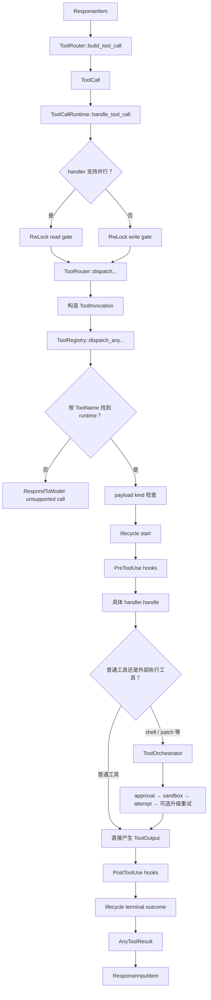

# 精读 05：Tool dispatch——工具名怎样找到 handler，安全策略在哪里介入

> 源码基线：`4ee41929eaf4`  
> 主文件：`codex-rs/core/src/tools/router.rs`、`codex-rs/core/src/tools/registry.rs`  
> 上游：`codex-rs/core/src/stream_events_utils.rs`、`codex-rs/core/src/tools/parallel.rs`  
> 下游：`codex-rs/core/src/tools/handlers/`、`codex-rs/core/src/tools/orchestrator.rs`  
> 前置阅读：[精读 04：Turn 主循环](04-turn-main-loop.md)

## 1. 先说人话：Tool dispatch 解决什么问题

模型可能返回这样一份结构化请求：

```json
{
  "type": "function_call",
  "namespace": "clock",
  "name": "curr_time",
  "call_id": "call-17",
  "arguments": "{}"
}
```

这还不是一次真正的函数调用。

它只是模型给 Codex 的一张“动作申请单”：

```text
请调用 clock.curr_time
参数是 {}
调用编号是 call-17
```

Codex 接下来必须回答：

1. 这是不是一种客户端应当执行的 tool call？
2. `clock.curr_time` 在当前 Step 里是否真的存在？
3. 它对应哪个 Rust handler？
4. 这份参数的形状是否与 handler 相容？
5. 这个工具允许和别的工具并行吗？
6. 执行前的 hook 是否阻止或改写它？
7. 它是否需要审批、Sandbox 或额外权限？
8. 成功、失败或取消后，怎样产生一个能回填给模型的结果？

把这些问题串起来，就是本篇所说的 **Tool dispatch（工具分发）**。

最简化的白话流程是：

```text
模型输出
  ↓
识别并规范化为 ToolCall
  ↓
按工具名查询 ToolRegistry
  ↓
运行通用前置流程
  ↓
调用具体 handler
  ↓
某些 handler 再进入审批 / Sandbox / 执行环境
  ↓
包装 ToolOutput
  ↓
转成 ResponseInputItem，回填给模型
```

## 2. 最重要的结论：分发不等于执行，更不等于审批

先把三个动作分开：

| 动作 | 回答的问题 | 主要负责者 |
|---|---|---|
| dispatch | 这个名字应该交给谁？ | `ToolRouter`、`ToolRegistry` |
| handle | 这个具体工具怎样理解参数、完成业务？ | 各个 handler |
| approve / sandbox / run | 这个外部动作能不能做、在哪里做、失败后能否升级重试？ | 特定 handler、`ToolOrchestrator`、runtime |

因此下面两句话都不准确：

```text
错误说法 A：ToolRegistry 会执行所有工具。
错误说法 B：每次工具调用都会经过用户审批和 Sandbox。
```

更准确的说法是：

> Registry 找到实现并调用统一接口；具体 handler 决定是否还要进入更深的安全执行链。

例如：

```text
clock.curr_time
  -> CurrentTimeHandler
  -> 从 time_provider 读取时间
  -> 返回结果

shell_command
  -> ShellCommandHandler
  -> 解析 command、cwd、权限与环境
  -> ToolOrchestrator
  -> 审批判断
  -> Sandbox 选择
  -> ShellRuntime 执行
  -> 返回结果
```

## 3. 本篇贯穿两个对照案例

### 案例 A：读取当前时间

模型调用：

```text
clock.curr_time({})
```

这个 handler：

- 检查 payload 是 function 形状；
- 调用 Session 中的 `time_provider`；
- 把时间包装为 `CurrentTimeOutput`；
- 不需要 OS 子进程；
- 不需要文件系统 Sandbox；
- 正常情况下也不发命令审批请求。

### 案例 B：执行 shell 命令

模型调用：

```text
shell_command({"command":"git status --short"})
```

这个 handler 还要处理：

- JSON 参数；
- 当前环境和 cwd；
- shell 类型；
- 默认或显式 Sandbox 权限；
- 额外文件/网络权限；
- exec policy；
- 用户、hook 或自动 reviewer 的审批；
- 首次 Sandbox 尝试；
- Sandbox denial 后是否允许升级重试；
- stdout、stderr、exit code 和取消清理。

两者共用前半段 dispatch，但后半段复杂度完全不同。

## 4. 全景图：一条工具调用经过哪些层



注意：图里的 `ToolOrchestrator` 是一条条件支路，不是 Registry 无条件执行的公共步骤。

## 5. dispatch 之前：当前 Step 先建立工具计划

模型为什么知道有哪些工具？因为每次 sampling 使用的 `StepContext` 里已经有一个 `ToolRouter`。

`build_tool_router` 大致做四类汇总：

```text
Core 内置工具
+ MCP 工具
+ Extension 提供的工具
+ Dynamic tools
+ Hosted model tool specs
```

然后 `finalize_tool_router`：

1. 处理直接调用、延迟加载和 Code Mode 的暴露方式；
2. 处理 `tool_search` 与保留名字；
3. 注册 Code Mode 执行器；
4. 检查名字或 namespace 描述冲突；
5. 生成真正发给模型的 `model_visible_specs`；
6. 返回同时持有 Registry 和 specs 的 `ToolRouter`。

这带来一个很重要的时间关系：

> 先为某个 Step 建立“允许调用什么”的快照，再让模型在这份快照上选择工具。

## 6. 为什么工具计划属于 Step，而不是整个进程

工具列表可能受到这些因素影响：

- 当前 model 能力；
- Feature flags；
- 当前是否有执行环境；
- 是本地环境还是多个环境；
- MCP server 在此刻发现了哪些工具；
- dynamic tool 是否已注册；
- extension 为当前 Step 贡献什么工具；
- 当前是 direct、deferred、Code Mode 还是 hidden exposure；
- Guardian reviewer 这种特殊 session source。

固定提交里，Guardian reviewer 的 Core 工具集合被特别收窄：有环境时只加入 `exec_command`、`write_stdin` 和可选的 `view_image`，然后直接返回，不再添加普通工具源。

所以不能把工具表理解成一个全局静态 HashMap。

## 7. `ToolRegistry` 保存的不是普通函数指针

Registry 的核心字段是：

```rust
pub struct ToolRegistry {
    tools: IndexMap<ToolName, RegisteredTool>,
    first_collision: Option<ToolName>,
}
```

而 `RegisteredTool` 是：

```rust
pub(crate) struct RegisteredTool {
    pub(crate) runtime: Arc<dyn CoreToolRuntime>,
    pub(crate) exposure: ToolExposure,
}
```

逐词解释：

| 代码词 | 含义 |
|---|---|
| `IndexMap` | 像 Map 一样按 key 查询，同时保留插入顺序 |
| `ToolName` | namespace 与 name 组成的工具身份 |
| `Arc` | 多处共享同一个 runtime 的引用计数所有权 |
| `dyn CoreToolRuntime` | 不关心具体 handler 类型，通过统一 trait 动态调用 |
| `ToolExposure` | 这个工具怎样或是否暴露给模型 |

Registry 需要保存异构实现：

```text
CurrentTimeHandler
ShellCommandHandler
ApplyPatchHandler
McpHandler
PlanHandler
...
```

它们是不同 Rust 类型，所以使用 trait object 擦除具体类型，统一保存为 `Arc<dyn CoreToolRuntime>`。

## 8. `ToolExecutor` 与 `CoreToolRuntime` 的分工

`ToolExecutor<ToolInvocation>` 提供最核心的执行合同：

```text
tool_name()
spec()
handle(invocation)
supports_parallel_tool_calls()
exposure()
```

`CoreToolRuntime` 在上面补充 Codex Core 需要的元数据和扩展点：

- `matches_kind`：接受哪种 payload；
- `wait_until_ready`：执行门之前是否等待资源就绪；
- `waits_for_runtime_cancellation`：取消时是否等待内部清理完成；
- `telemetry_tags`：额外观测标签；
- `pre_tool_use_payload`：给前置 hook 的输入；
- `with_updated_hook_input`：怎样接受 hook 改写；
- `post_tool_use_payload`：给后置 hook 的结果；
- `create_diff_consumer`：是否消费流式参数增量；
- Code Mode 定义、tool search 信息等。

一个初学者容易误解的地方是：

> 名叫 `Runtime` 不代表它一定会启动进程；它只是 Registry 能统一调用的运行合同。

`CurrentTimeHandler` 也实现 `CoreToolRuntime`，但不会启动 shell。

## 9. 注册时先统一默认 namespace

可信工具注册时执行：

```rust
let tool_name = runtime.tool_name().with_default_namespace();
```

这避免两种写法在 Map 中形成两个身份：

```text
namespace 省略 + name=shell_command
namespace=functions + name=shell_command
```

它们应当归一到同一个默认 namespace 身份。

“规范化”不是改业务含义，而是把等价表示变成一个稳定 key。

## 10. trusted 与 external 工具的名字冲突策略不同

可信内部工具重复注册：

```text
error_or_panic("tool ... already registered")
```

因为 Core 自己注册重名通常是编程错误。

外部工具重复时则更谨慎：

1. 外部工具不能占用默认 namespace 下的保留名 `shell_command`；
2. 已存在同名工具时，跳过外部重复项；
3. 记录首次 collision；
4. 如果配置要求 collision 直接报错，finalize 阶段返回 `ToolCollision`。

这体现出一个安全原则：

> 不可信或外部贡献者不能悄悄覆盖已有执行能力。

## 11. 注册进 Registry 不等于发给模型

Registry 中可能有 hidden 工具。

固定提交中启用 Unified Exec 时：

```text
exec_command   -> model visible
write_stdin    -> model visible
shell_command  -> 仍注册，但 exposure = Hidden
```

为什么还保留 hidden handler？因为历史、兼容路径或内部调用仍可能需要按名字找到它，但当前模型不应把它当作可选工具看到。

因此需要区分：

```text
registered：系统能不能按名字找到
model-visible：模型在本次 prompt 里能不能看到
```

## 12. `build_tool_call`：把不同 ResponseItem 统一成 ToolCall

模型输出的 tool item 不只有一种。

固定提交支持在这里规范化：

| `ResponseItem` | 生成的 payload |
|---|---|
| `FunctionCall` | `ToolPayload::Function { arguments }` |
| client-side `ToolSearchCall` | `ToolPayload::ToolSearch { arguments }` |
| `CustomToolCall` | `ToolPayload::Custom { input }` |
| 其他 item | `Ok(None)`，不当作客户端工具执行 |

简化源码：

```rust
ResponseItem::FunctionCall { name, namespace, arguments, call_id, .. } => {
    let tool_name = ToolName::new(namespace, name).with_default_namespace();
    Ok(Some(ToolCall {
        tool_name,
        call_id,
        payload: ToolPayload::Function { arguments },
        ...
    }))
}
```

它没有立即反序列化所有工具的参数，因为不同 handler 拥有各自的参数类型。

这里保留的是通用外壳：

```text
ToolCall
├── tool_name
├── call_id
├── payload
└── encrypted_function_args
```

## 13. 为什么 `arguments` 暂时还是字符串

Responses function call 的 `arguments` 是 JSON 字符串。

例如：

```json
"{\"command\":\"git status --short\",\"timeout_ms\":10000}"
```

Router 不知道这段 JSON 应解析为：

```text
ShellCommandArgs？
PlanArgs？
RequestUserInputArgs？
某个 MCP 工具自己的 schema？
```

所以正确的所有权是：

```text
Router：识别 payload 大类
Handler：解析该工具自己的具体参数
```

## 14. `call_id` 为什么必须一路保留

模型可能一次返回两个调用：

```text
call-A -> read Cargo.toml
call-B -> read README.md
```

工具结果不是只写“Cargo 内容”就够了，而要写：

```text
function_call_output(call_id=call-A, ...)
function_call_output(call_id=call-B, ...)
```

这样下一次 sampling 才能把结果和原调用正确配对。

`call_id` 是关联 ID，不是工具名，也不是业务幂等键。

## 15. `ToolCallRuntime` 为什么保留原 `StepContext`

源码注释非常关键：

```rust
// Tool calls may run later, so retain the step whose tool list advertised them.
step_context: Arc<StepContext>,
```

白话解释：

> 哪个 Step 把工具表发给模型，就应由哪个 Step 的 Router 和环境快照解释模型随后返回的调用。

不能在工具真正开始时随手抓一个更新后的 Router，否则可能出现：

```text
Step #1 告诉模型：工具 X 存在
期间 MCP 刷新，Step #2 的工具表变了
模型返回 Step #1 的 X 调用
系统却拿 Step #2 的 Registry 查找
```

这会破坏请求与响应的一致性。

## 16. 并行门：read lock 与 write lock

`ToolCallRuntime` 使用一个 `RwLock<()>` 作为执行门：

```rust
let _guard = if supports_parallel {
    Either::Left(lock.read().await)
} else {
    Either::Right(lock.write().await)
};
```

理解方式：

- 多个 read lock 可以同时持有，所以多个 parallel 工具可并行；
- write lock 要独占，所以 serial 工具会等当前并行工具结束，也阻止后续工具进入；
- 这里保护的不是某个数据结构，而是“能否同时执行”的协议。

工具自己通过 `supports_parallel_tool_calls()` 声明能力，Registry 还要求它不是 hidden 才对这里报告可并行。

## 17. “模型允许并行”与“handler 允许并行”是两回事

模型请求中的 parallel capability 表示：模型可以在一次响应里提出多个 tool call。

handler metadata 表示：Core 能否安全地让某个调用和同组其他调用同时执行。

只有前者，没有后者时，模型仍可提出多个调用，但 Core 会通过独占门串行执行。

固定提交的集成测试验证：

- 两个测试读取工具能够重叠执行；
- 两个 shell 工具能够重叠执行；
- 不同类型但都声明 parallel 的工具能够重叠执行；
- 并行完成不破坏 call/output 的稳定配对。

## 18. readiness 要在执行门之前等待

源码顺序是：

```text
tool.wait_until_ready()
-> 获取 parallel execution gate
-> 真正 dispatch
```

如果一个工具等待远端连接就绪时先占住 write lock，它可能无意义地阻塞其他完全可运行的工具。

所以 readiness 与 execution admission 被明确分开。

## 19. Router 把 ToolCall 扩充成 ToolInvocation

`ToolCall` 主要来自模型；`ToolInvocation` 则补上执行所需的 Core 上下文：

```rust
let invocation = ToolInvocation {
    session,
    turn,
    step_context,
    cancellation_token,
    tracker,
    call_id,
    tool_name,
    source,
    payload,
};
```

字段可以分组理解：

| 类别 | 字段 | 用途 |
|---|---|---|
| 身份 | `call_id`、`tool_name`、`source` | 关联结果、日志和生命周期 |
| 模型输入 | `payload` | function/custom/search 参数 |
| 生命周期 | `session`、`turn`、`step_context` | 访问对应作用域的状态和服务 |
| 控制 | `cancellation_token` | 用户取消时通知执行链 |
| 文件变化 | `tracker` | 聚合本 Turn 的 diff |

`ToolInvocation` 可以理解为“可执行版本的 ToolCall”。

## 20. Registry dispatch 的第一步不是查表，而是记账

`dispatch_any_with_terminal_outcome` 先：

- 复制工具名、call id；
- 计算 Sandbox / policy telemetry tags；
- 把 active Turn 的 `tool_calls` 计数加一；
- 启动 `ToolDispatchTrace`。

之后才查询 Registry。

这意味着连“不支持的工具调用”也会进入工具调用统计和失败 trace，而不是无声消失。

## 21. 真正的名字分派只有这一小步

核心查找可概括为：

```rust
let tool = match self.tool(&tool_name) {
    Some(tool) => tool,
    None => return Err(FunctionCallError::RespondToModel(...)),
};
```

`self.tool` 会再次使用默认 namespace 规范化后的 `ToolName` 查询 `IndexMap`，并 clone `Arc`。

所以“分发”最窄的含义其实很简单：

```text
ToolName -> Arc<dyn CoreToolRuntime>
```

复杂的是查到以后围绕执行建立的安全与生命周期语义。

## 22. 未知工具为什么返回给模型，而不是直接杀死 Turn

找不到工具时构造：

```text
unsupported call: <tool_name>
```

错误类型是 `FunctionCallError::RespondToModel`。

上层 `ToolCallRuntime::handle_tool_call` 会把这种非 Fatal 错误包装成失败 tool output，再交回模型。

这样模型有机会自我修正：

```text
模型：调用 nonexistent_tool
Core：unsupported call: nonexistent_tool
模型：明白了，改用已提供的工具
```

如果未知工具立即终止整个 Turn，模型就没有恢复机会。

## 23. 但 payload kind 不相容为什么是 Fatal

查到工具后，Registry 还检查：

```rust
if !tool.matches_kind(&invocation.payload) {
    return Err(FunctionCallError::Fatal(...));
}
```

例如 `apply_patch` 明确只接受：

```rust
ToolPayload::Custom { .. }
```

如果同名工具却收到 function payload，说明内部 tool spec、模型 item 形状和 runtime 注册合同彼此矛盾。

这比“模型拼错了工具名”更像系统不变量被破坏，因此固定提交把它定为 Fatal。

对比：

| 情况 | 错误分类 | 是否通常回给模型继续 |
|---|---|---|
| 名字不存在 | `RespondToModel` | 是 |
| handler 参数 JSON 不合法 | 通常 `RespondToModel` | 是 |
| 已注册工具收到不相容 payload 大类 | `Fatal` | 否，表示内部合同异常 |

## 24. lifecycle start 在何时发生

名字存在且 payload kind 匹配后，Registry 调用：

```rust
notify_tool_start(&invocation).await;
```

因此：

- 不存在的工具没有正常 start 生命周期；
- payload 大类不匹配也没有 start；
- 一旦 start 发出，后续就应当有 finish 或 aborted 终态。

生命周期扩展收到 session/thread/turn、call id、tool name、source 和 outcome，可用于观察或维护外部状态。

## 25. PreToolUse hook：在 handler 之前阻止或改写

普通 function 工具默认把 arguments 解析成 hook 可见的 `tool_input`。

前置 hook 有三类结果：

```text
Blocked(message)
Continue { updated_input: None }
Continue { updated_input: Some(value) }
```

分别表示：

1. 阻止，handler 完全不执行；
2. 放行原输入；
3. 放行，但先由 handler 的 `with_updated_hook_input` 重建 invocation。

若 hook 阻止：

- 返回 `RespondToModel`；
- lifecycle outcome 是 `Blocked`；
- handler 没有产生副作用。

若改写后的输入无法重建：

- lifecycle outcome 是 `Failed { handler_executed: false }`；
- 同样不会调用 handler。

## 26. 为什么 hook 改写必须由 handler 反向解析

Registry 只知道 hook 给了一个 JSON value，不知道它与工具内部参数怎样对应。

普通 function 工具有通用默认实现：把 JSON value 序列化回 arguments 字符串。

但 shell、apply_patch 等会建立更稳定的 hook 合同：

```json
{"command":"..."}
```

它们需要自行把改写结果变回 command 或 patch payload。

这就是 `with_updated_hook_input` 存在的原因。

## 27. 真正调用 handler 的位置

通用 dispatch 最终进入：

```rust
let output = tool.handle(invocation.clone()).await?;
```

这行通过 trait object 做动态分发：

```text
runtime 的真实类型是 CurrentTimeHandler
-> 调 CurrentTimeHandler::handle

runtime 的真实类型是 ShellCommandHandler
-> 调 ShellCommandHandler::handle
```

Registry 不写一个巨大的：

```rust
match tool_name {
    "clock.curr_time" => ...,
    "shell_command" => ...,
    "apply_patch" => ...,
}
```

新工具通过注册扩展，而不是修改中央 match。

## 28. 普通工具：`CurrentTimeHandler` 的完整业务路径

它的 `handle` 可以压缩为：

```rust
if payload 不是 Function {
    return RespondToModel(...);
}

let current_time = session.services.time_provider
    .current_time(session.thread_id)
    .await?;

Ok(CurrentTimeOutput(CurrentTimeReminder::new(current_time)))
```

这里没有：

- `ApprovalAction`；
- `ToolOrchestrator`；
- `SandboxAttempt`；
- 子进程；
- unsandboxed retry。

所以审批和 Sandbox 不是“工具框架自动附加”的固定仪式。

## 29. `ToolOutput` 为什么不是直接返回字符串

不同调用表面需要不同结果投影。

`CurrentTimeOutput` 同时能：

- 给日志提供 preview；
- 声明 logging success；
- 转成 Responses 的 `FunctionCallOutput`；
- 给 Code Mode 返回结构化 JSON：

```json
{"current_time":"2026-08-10 12:34:56 UTC"}
```

因此 handler 返回 `Box<dyn ToolOutput>`，而不是丢失语义的 `String`。

## 30. 外部执行工具：handler 先解释请求

以 `shell_command` 为例，handler 先处理工具特有问题：

1. 确认 payload 是 function；
2. 反序列化参数；
3. 解析 command；
4. 解析环境、cwd、login shell；
5. 解析默认、显式和额外权限；
6. 构造 `ShellRequest`；
7. 构造 `ShellRuntime`；
8. 把 request + runtime 交给 `ToolOrchestrator`。

这里的分层是：

```text
Handler：理解“用户要做什么”
Runtime：知道“怎样尝试执行”
Orchestrator：决定“允许怎样尝试，以及失败后怎么办”
```

## 31. `ToolOrchestrator` 的固定骨架

文件顶部注释直接概括为：

```text
approval
-> select sandbox
-> attempt
-> sandbox denial 时用升级策略重试
```

它是给实现 `ToolRuntime<Rq, Out>` 的执行型工具复用的协调器。

注意：Orchestrator 不负责按工具名查 Registry；调用它时，具体 handler 早已确定。

## 32. 审批与 Sandbox 是两条不同轴

审批回答：

```text
这个动作是否被授权？
```

Sandbox 回答：

```text
即使执行，它在 OS / executor 层能访问什么？
```

可能组合为：

| 审批 | Sandbox | 例子 |
|---|---|---|
| 不提示 | 有 Sandbox | 配置允许自动在 workspace 权限内运行 |
| 已批准 | 有 Sandbox | 用户批准动作，但仍保留文件/网络限制 |
| 已批准 | 无 Sandbox | 策略允许明确升级执行 |
| 被拒绝 | 不执行 | hook、Guardian、用户或配置拒绝 |

“用户点了允许”不必然等于“完全不受限制”。

## 33. 第一步：计算 `ExecApprovalRequirement`

Orchestrator 优先问具体 runtime 是否提供显式 requirement，否则根据全局 approval policy 与文件系统策略计算默认值。

结果有三种：

```text
Skip
NeedsApproval
Forbidden
```

含义：

| variant | 含义 |
|---|---|
| `Skip` | 此阶段不需要发审批请求，但不等于无 Sandbox |
| `NeedsApproval` | 先构造具体 action，再等待 reviewer 决定 |
| `Forbidden` | 当前策略不允许连“询问”都发出，直接拒绝 |

例如 granular policy 可以关闭 sandbox approval；此时默认 requirement 是 `Forbidden`，而不是向用户弹窗。

## 34. 审批请求不是只有用户能回答

固定提交的优先顺序写在源码注释里：

```text
1. Permission request hooks
2. 若 StrictAutoReview / Guardian 启用，则交给 Guardian
3. 否则交给用户
```

因此“需要审批”不等于“一定弹一个 UI 对话框”。

审批决策来源会进入 telemetry，可能是：

- Hook；
- Guardian；
- User；
- 或配置直接决定无需提示。

## 35. `ApprovalAction` 保存工具特有的审批事实

固定提交有三类主要 action：

```text
Shell
ExecCommand
ApplyPatch
```

它们携带的信息不同：

| action | 关键事实 |
|---|---|
| Shell | command、cwd、环境、Sandbox 权限、justification |
| ExecCommand | 上述内容再加 tty 等 unified exec 属性 |
| ApplyPatch | patch、cwd、受影响 files、结构化 changes |

审批系统不是只问“允许工具 X 吗”，而是尽量审核具体动作。

## 36. “本 Session 允许”怎样缓存

`ApprovalAction::cache_keys` 为不同动作建立工具特定 key：

- shell key 包括规范化 command、cwd、环境和权限；
- unified exec 还包括 tty；
- apply_patch 按环境 + 文件路径生成多个 key。

`with_cached_approval` 在所有 key 都已获 Session 批准时跳过重复询问；选择 session 范围批准后，把相应 key 写入 `ApprovalStore`。

这不是“批准一次，以后所有命令都免审”。

## 37. 官方 App Server 看到的审批顺序

公开协议把命令审批表现为 server-initiated JSON-RPC request。典型 item 顺序是：

```text
item/started
-> server 发出 command approval request
-> client 回答
-> serverRequest/resolved
-> item/completed
```

客户端可以返回单次接受、当前 Session 接受、拒绝、取消，或在支持时附带 exec policy amendment。内部审批与生命周期的细节以本篇固定提交源码为准；公开消息形状可参考[官方 App Server 文档](https://learn.chatgpt.com/docs/app-server)。

## 38. 第二步：选择第一次 Sandbox 尝试

审批阶段通过后，Orchestrator 才计算第一次尝试：

1. 读取环境 permission profile；
2. 合并 workspace roots；
3. 读取工具的 `sandbox_preference`；
4. 考虑显式 `SandboxPermissions` 和 approval requirement；
5. 让 `SandboxManager` 判断是否应 Sandbox；
6. 选择平台对应的初始 `SandboxType`；
7. 构造 `SandboxAttempt`。

`SandboxAttempt` 包含：

- 选择的 Sandbox 类型；
- 是否原本请求 Sandbox；
- permission profile；
- cwd 与 workspace roots；
- managed network 状态；
- Linux / Windows 平台配置；
- 网络审批 cancellation token 和 proxy。

## 39. Sandbox policy 不是 handler 自己手写 OS 限制

handler/runtime 表达所需权限和执行偏好；`SandboxManager` 再把它转换为当前平台能执行的请求。

大致是：

```text
抽象 permission profile
-> effective filesystem / network policy
-> SandboxManager 选实现
-> transform command / exec request
-> 本地或远端 executor 执行
```

官方 App Server API 也把公开 `sandboxPolicy` 区分为 `readOnly`、`workspaceWrite`、`dangerFullAccess` 和 `externalSandbox` 等形状，但 Core 内部仍要结合实际环境、平台和附加权限计算最终尝试。[官方 App Server 文档](https://learn.chatgpt.com/docs/app-server)

## 40. 第一次执行成功就直接返回

`run_attempt` 会：

1. 如有需要，开始网络审批上下文；
2. 把网络 proxy / cancellation token 放入本次 `SandboxAttempt`；
3. 调用具体 runtime 的 `run`；
4. 完成 immediate 网络审批，或暂存 deferred 网络审批；
5. 返回结果。

如果第一次成功，Orchestrator 不会为了“确认一下”再执行第二次。

## 41. 只有识别为 Sandbox denial 才进入升级判断

普通失败，例如：

```text
命令不存在
程序自己返回 exit 2
参数格式错误
远端环境断开
```

不应自动当作“Sandbox 挡住了”并移除保护重跑。

Orchestrator 只对结构化的：

```text
SandboxErr::Denied
```

考虑升级路径。

这是安全和正确性都很重要的错误分类。

## 42. Sandbox denial 也不保证一定无沙箱重试

升级前要连续检查：

- runtime 是否声明 `escalate_on_failure()`；
- approval policy 是否允许询问；
- 是否存在可解释的 network approval context；
- 文件系统 denied-read 限制是否禁止 unsandboxed execution；
- 第一次是否已获得足够的审批；
- 是否需要新的 retry reason；
- 严格自动审查是否只覆盖第一次尝试。

特别是 denied-read：如果用户或管理员明确规定某些路径不可读，直接无沙箱重跑会把“拒绝读取”的边界抹掉，所以源码会阻止这种升级，或保留 denied-read 的限制。

## 43. `apply_patch` 展示了另一种执行型工具

`ApplyPatchHandler` 只接受 custom payload：

```rust
fn matches_kind(&self, payload: &ToolPayload) -> bool {
    matches!(payload, ToolPayload::Custom { .. })
}
```

handler 先：

1. 解析 patch 文本；
2. 选择环境；
3. 在目标环境文件系统上验证 patch；
4. 把验证后的结构交给 `execute_verified_patch`。

`ApplyPatchRuntime` 再通过 Orchestrator 执行已验证 patch，并在 Sandbox denial 时返回结构化错误供上层决定是否升级。

所以 apply patch 不是把模型输出直接写进文件。

## 44. patch 的参数流还可以产生进度事件

`ApplyPatchHandler` 的 `create_diff_consumer` 返回 `ApplyPatchArgumentDiffConsumer`。

模型还在流式生成 patch 参数时，它可以：

- 增量解析 hunk；
- 转成 `PatchApplyUpdatedEvent`；
- 以 500ms 间隔限制事件频率；
- 在参数结束时 flush pending event；
- 若最终 patch 不完整，返回可回复模型的解析错误。

这说明 Tool dispatch 不一定等完整参数结束后才首次“看见”工具；某些工具会提前消费 argument diff 生成 UI 进度，但真正 handler 执行仍等完整调用成立。

## 45. PostToolUse hook 在副作用之后

handler 成功后，Registry 才运行 post-tool hooks。

源码明确提醒：

```text
A PostToolUse block rejects the result,
not the already-completed tool execution.
```

也就是说：

```text
shell 已经运行 / patch 已经写入
-> PostToolUse hook 决定阻止结果
```

阻止的是“把这个结果交给模型”，不是时光倒流撤销副作用。

这是前置 hook 和后置 hook 最重要的区别。

## 46. PostToolUse hook 能做什么

成功工具的 post hook outcome 可以：

- 添加额外上下文；
- `should_block=true`，把结果改成 `RespondToModel` 错误；
- 提供 `feedback_message`，替换模型可见的 function output；
- 保留原始结果用于日志或 Code Mode 的 typed result。

当只替换模型可见结果时，`PostToolUseFeedbackOutput` 同时保存：

```text
original      -> 日志 / Code Mode 结构化结果
model_visible -> 下一次 Responses 输入看到的反馈文字
```

## 47. lifecycle outcome 与函数返回值不是完全同一件事

Registry 在 handler 后确定生命周期终态：

```text
Completed { success }
Failed { handler_executed: true }
Blocked
Aborted
```

PostToolUse block 发生时，工具执行已经完成，因此生命周期可先记录 completed，随后 dispatch 返回一个“结果被 hook 阻止”的 `RespondToModel`。

不要把：

```text
工具副作用是否发生
模型是否收到原始结果
dispatch 最终返回 Ok 还是 Err
```

当成同一个布尔值。

## 48. 为什么终态要用 `AtomicBool` 仲裁

取消可能与正常完成同时发生：

```text
任务 A：handler 刚完成，准备 notify finish
任务 B：用户取消，准备 notify aborted
```

如果两边都发，扩展会看到两个终态。

`terminal_outcome_reached` 使用原子 swap 让第一个到达者取得终态所有权；另一边发现已经被领取，就不重复发送。

这是“exactly one terminal notification”，不是保证整个工具只能有一个内部事件。

## 49. 取消时为什么有两种策略

普通 handler 可以直接 abort dispatch task。

但进程型 runtime 可能需要：

- 发送信号；
- 回收 process tree；
- 关闭 pipe / PTY；
- 等待输出排空；
- 释放远端 session。

因此 runtime 可通过 `waits_for_runtime_cancellation()` 要求外层在取消后等待内部 teardown 完成，再返回 aborted output。

用户看到“已取消”不应以遗留后台进程为代价。

## 50. 非 Fatal 错误怎样变成 tool output

`ToolCallRuntime::handle_tool_call` 做最后一层错误投影：

```rust
match future.await {
    Ok(response) => Ok(response.into_response()),
    Err(FunctionCallError::Fatal(message)) => Err(CodexErr::Fatal(message)),
    Err(other) => Ok(failure_response(call, other)),
}
```

因此：

- Fatal 穿透为 Turn 级严重错误；
- 参数错误、未知工具、审批拒绝等可恢复错误，变成 `success: false` 的 tool output；
- 模型可读取失败原因，决定换参数、换工具或向用户解释。

## 51. `AnyToolResult` 为什么还保存原 payload

结构是：

```rust
AnyToolResult {
    call_id,
    payload,
    result: Box<dyn ToolOutput>,
    post_tool_use_payload,
}
```

同一个 `ToolOutput` 转协议 item 时，需要知道原始调用种类：

```text
Function payload -> FunctionCallOutput
Custom payload   -> CustomToolCallOutput
ToolSearch       -> ToolSearchOutput
```

所以结果不能只保存 call id + 文本。

## 52. 输出回填不是直接再次调用模型

dispatch 返回 `ResponseInputItem` 后，上游 Turn loop 才会：

1. 等待 in-flight tools；
2. 按稳定顺序收集 outputs；
3. 记录到 conversation history / rollout；
4. 判定 `needs_follow_up`；
5. 构建下一次 prompt；
6. 再 sampling。

Tool dispatch 只完成“一次动作及其 observation”，Agent loop 决定何时把 observation 用起来。

## 53. 三条具体时间线对照

### 53.1 普通时间工具成功

```text
FunctionCall(clock.curr_time)
-> build ToolCall
-> parallel gate
-> Registry lookup
-> lifecycle start
-> pre hook 放行
-> CurrentTimeHandler
-> time_provider
-> CurrentTimeOutput
-> post hook
-> lifecycle completed
-> FunctionCallOutput(call_id=原值)
```

### 53.2 shell 需要审批并成功

```text
FunctionCall(shell_command)
-> build ToolCall
-> Registry lookup
-> pre hook 放行
-> ShellCommandHandler 解析参数
-> ToolOrchestrator
-> NeedsApproval
-> permission hook / Guardian / user
-> Approved
-> 选择 Sandbox
-> ShellRuntime.run
-> stdout/stderr/exit code
-> post hook
-> lifecycle completed
-> FunctionCallOutput
```

### 53.3 前置 hook 阻止 patch

```text
CustomToolCall(apply_patch)
-> build ToolCall(Custom payload)
-> Registry lookup
-> payload kind 匹配
-> lifecycle start
-> PreToolUse hook: Blocked
-> 不解析、不验证、不写文件
-> lifecycle Blocked
-> failure CustomToolCallOutput
-> 模型读取原因
```

## 54. 五个边界问题

### 边界一：工具在 Registry 里，但模型看不见

可能是 hidden 或 Code Mode only。它仍可能被兼容或内部路径调用。

### 边界二：模型看见过工具，执行时当前全局工具表变了

ToolCallRuntime 保留原 StepContext，避免换用未来快照。

### 边界三：hook 改写了输入

真正 handler、日志分类和 post hook 都应使用改写后的 invocation。

### 边界四：post hook 阻止结果

副作用可能已发生，不能把它描述为“工具没执行”。

### 边界五：取消与完成竞态

AtomicBool 仲裁唯一 lifecycle 终态；进程型 runtime 还可能等待清理。

## 55. 测试证据怎样对应理解

### Registry 单元测试

`registry_tests.rs` 验证：

- function 工具默认 pre/post hook payload；
- hook 改写后仍保持 function payload 形状；
- 特殊工具可以不暴露默认 hook payload；
- post hook 反馈替换不破坏 Code Mode typed result；
- lifecycle 使用规范化工具名；
- handler 失败记录 `handler_executed: true`。

### Sandbox 单元测试

`sandboxing_tests.rs` 验证：

- external sandbox 下 OnRequest 可跳过 exec approval；
- restricted filesystem policy 下 OnRequest 需要审批；
- granular policy 禁止 sandbox prompt 时得到 `Forbidden`；
- denied-read 限制阻止危险的 unsandboxed escalation；
- 本地与远端 attempt 的 Sandbox 上下文投影。

### 集成测试

`core/tests/suite/approvals.rs` 用真实 Agent tool call 覆盖不同 approval policy、Sandbox policy、命令、写文件、patch、拒绝与批准组合。

`core/tests/suite/tool_parallelism.rs` 验证并行时间重叠与结果配对。

## 56. 常见误解

### 误解一：模型调用的就是 Rust 函数名

模型看到的是 wire tool name 和 schema；Registry 再把它映射到 trait object handler。

### 误解二：Registry 保存所有进程全局可用工具

它属于当前 Step 的 Router 快照，受配置、环境、MCP、extension 和 exposure 影响。

### 误解三：注册了就一定暴露给模型

hidden、deferred、direct-only、Code Mode only 等 exposure 会改变模型可见性。

### 误解四：每个工具都要审批

只有需要外部安全执行链的 handler 才进入 Orchestrator；当前时间等工具直接处理。

### 误解五：审批通过就是关闭 Sandbox

授权与隔离是两条轴，批准后仍可能在受限 Sandbox 中运行。

### 误解六：Sandbox 失败一定自动无沙箱重试

还要满足 runtime、policy、denied-read、网络上下文和审批条件。

### 误解七：PostToolUse block 能撤销命令或文件写入

它发生在 handler 成功后，只能阻止/替换结果，不能自动回滚副作用。

### 误解八：所有工具错误都会中止 Turn

多数会包装为失败 tool output 交给模型；只有 Fatal 穿透。

### 误解九：并行工具按完成顺序写回模型

执行可以并行，上游仍按稳定 call 顺序组织历史。

### 误解十：取消 future 就完成资源清理

进程/PTY/远端 runtime 可能必须先 teardown，外层会按 runtime 声明等待。

## 57. 可以学走的设计模式

### 模式 A：强类型核心，擦除边缘

每个 handler 内部使用自己的参数和输出类型；Registry 边界用 trait object 统一保存。

### 模式 B：广告快照与执行快照一致

保留发出工具 spec 的 StepContext，用同一 Router 解释返回调用。

### 模式 C：开放注册，集中横切逻辑

具体工具通过注册扩展；hook、telemetry 和 lifecycle 在 Registry dispatch 集中处理。

### 模式 D：业务解析与安全编排分离

handler 解释请求，runtime 执行尝试，Orchestrator 统一审批、Sandbox 和升级。

### 模式 E：可恢复错误回到 Agent loop

将模型可修正的错误转为 tool output，不把局部失败全部升级成 Turn 崩溃。

### 模式 F：副作用与结果发布分开建模

PostToolUse 可以影响模型看到什么，但不会假装已发生的动作不存在。

### 模式 G：唯一终态所有权

正常完成与取消竞态通过原子状态决定谁负责发终态。

## 58. 推荐源码阅读顺序

不要先陷进 `shell.rs` 的所有参数。建议按以下顺序：

```text
tools/router.rs
  ToolCall
  ToolRouter::build_tool_call
  dispatch_tool_call_with_code_mode_result_inner

tools/parallel.rs
  ToolCallRuntime::handle_tool_call
  handle_tool_call_with_source

tools/registry.rs
  CoreToolRuntime
  ToolRegistry registration
  dispatch_any_with_terminal_outcome
  handle_any_tool

tools/handlers/current_time.rs
  一个不进 Sandbox 的最小工具

tools/handlers/shell.rs
  一个进入安全执行链的工具

tools/orchestrator.rs
  approval → sandbox → attempt → retry

tools/approvals.rs
tools/sandboxing.rs
  审批来源、缓存 key、策略和 attempt

tools/handlers/apply_patch.rs
tools/runtimes/apply_patch.rs
  custom payload、验证、patch approval 与 Sandbox
```

## 59. 自测题

1. `ToolCall` 和 `ToolInvocation` 的差别是什么？
2. 为什么 Router 不立即把 function arguments 解析成具体 Rust struct？
3. 为什么 ToolCallRuntime 必须保留产生该调用的 StepContext？
4. Registry 中存在一个工具，为什么模型仍可能看不见它？
5. 未知工具名与 payload kind 不匹配为何使用不同错误级别？
6. PreToolUse block 与 PostToolUse block 的副作用差异是什么？
7. 为什么审批通过后仍可能运行在 Sandbox 中？
8. 什么失败才可能触发升级重试？
9. 为什么 `AnyToolResult` 要保留原 payload？
10. `AtomicBool` 在取消竞态中保护什么不变量？

### 参考答案

1. ToolCall 是规范化的模型请求；ToolInvocation 补上 Session、Turn、Step、取消 token、tracker 和 source，是可执行调用。
2. 只有具体 handler 知道参数 schema；Router 只负责识别 Function、Custom、ToolSearch 等通用大类。
3. 保证用当初向模型广告工具的同一份 Router/环境快照解释返回调用。
4. Registry 负责可分派性，`ToolExposure` 和 model-visible specs 负责模型可见性。
5. 未知名字可能是模型可修正错误；已注册工具收到错误 payload 大类表示内部 spec/runtime 合同矛盾。
6. Pre block 发生在 handler 前，可保证 handler 未执行；Post block 发生在副作用后，只阻止或替换结果。
7. 审批回答授权，Sandbox 提供强制隔离，两者是独立安全层。
8. 被识别为 `SandboxErr::Denied`，且 runtime、policy、权限和审批条件都允许时。
9. 不同 payload 需要投影为 Function、Custom 或 ToolSearch 的不同 output item。
10. finish 与 aborted 只能有一方取得 lifecycle 终态发送权。

## 60. 本篇局部术语表

| 英文 / 代码词 | 中文 | 在本篇中的实际含义 |
|---|---|---|
| Tool dispatch | 工具分发 | 把规范化 tool call 交给当前 Step 中对应 runtime 的全过程 |
| `ToolRouter` | 工具路由器 | 同时保存 Registry 与发给模型的可见 specs |
| `ToolRegistry` | 工具注册表 | 以规范化 `ToolName` 查找 `CoreToolRuntime` |
| registry | 注册表 | 名字到实现的有序映射，不等同于 OS Registry |
| route / router | 路由 / 路由器 | 根据身份选择下一处理者，不代表网络路由 |
| dispatch | 分派 | 找到并调用对应处理器 |
| handler | 处理器 | 理解某个工具参数并执行业务流程的实现 |
| runtime | 运行实现 | 可执行合同；不一定启动子进程 |
| `ToolExecutor` | 工具执行 trait | 名字、spec、handle、并行与 exposure 的基础合同 |
| `CoreToolRuntime` | Core 工具运行 trait | 在 ToolExecutor 上增加 hook、telemetry、payload 和取消能力 |
| trait object | trait 对象 | 通过 `dyn Trait` 擦除具体 handler 类型后统一保存 |
| dynamic dispatch | 动态分发 | 运行时根据 trait object 的真实类型调用实现方法 |
| `ToolName` | 工具名 | namespace + name 构成的稳定身份 |
| namespace | 命名空间 | 避免不同来源工具重名的名字分组 |
| default namespace | 默认命名空间 | 省略 namespace 的 function 工具归一化所属空间 |
| normalize | 规范化 | 把等价名字表示转换成同一个 Registry key |
| collision | 名字冲突 | 两个工具试图占用同一个规范化 ToolName |
| trusted tool | 可信工具 | Core 或受信注册路径贡献的工具，重名视为编程错误 |
| external tool | 外部工具 | MCP/扩展等外部来源工具，不能覆盖保留或已有名字 |
| `ToolExposure` | 工具暴露方式 | direct、deferred、hidden、Code Mode 等可见性策略 |
| model-visible spec | 模型可见规格 | 真正随本次 sampling 发送给模型的工具 schema |
| hidden tool | 隐藏工具 | Registry 可查，但当前不广告给模型 |
| deferred tool | 延迟工具 | 先通过搜索/加载机制发现，而非一开始展开完整 spec |
| `ResponseItem` | 模型响应条目 | message、reasoning、function call 等 wire 层输出 |
| `ToolCall` | 工具调用 | tool name、call id、payload 的通用规范化结构 |
| `ToolInvocation` | 工具调用上下文 | 在 ToolCall 上补齐执行所需 Session/Turn/Step 与控制信息 |
| payload | 载荷 | Function arguments、Custom input 或 ToolSearch 参数 |
| payload kind | 载荷种类 | Function、Custom、ToolSearch 等顶层调用形状 |
| arguments | 参数字符串 | FunctionCall 中尚未由具体 handler 解析的 JSON 文本 |
| `call_id` | 调用关联 ID | 把 tool output 与原 tool call 配对的编号 |
| source | 调用来源 | Direct、plaintext direct 或 Code Mode nested call |
| execution gate | 执行门 | 用 RwLock 协调 parallel 与 serial 工具进入执行区 |
| readiness | 就绪等待 | 工具在占用执行门前等待依赖可用 |
| `PreToolUse` | 工具使用前 hook | handler 前阻止、放行或改写输入 |
| input rewrite | 输入改写 | hook 修改 tool_input 后由 handler 重建 invocation |
| `PostToolUse` | 工具使用后 hook | 副作用完成后添加上下文、阻止或替换模型可见结果 |
| lifecycle | 生命周期 | start、completed、failed、blocked、aborted 通知 |
| terminal outcome | 终态结果 | 一次工具生命周期唯一的 finish 或 aborted 结论 |
| `AtomicBool` | 原子布尔 | 在并发完成/取消间仲裁终态发送权 |
| `AnyToolResult` | 类型擦除结果 | 保留 call id、payload 与 `Box<dyn ToolOutput>` 的通用结果 |
| `ToolOutput` | 工具输出 trait | 负责日志、Responses item、Code Mode 结果等投影 |
| `RespondToModel` | 回复模型错误 | 包装成失败 tool output，让 Agent loop 有机会恢复 |
| `Fatal` | 致命错误 | 表示内部合同或执行基础设施严重失败，穿透为 Turn 错误 |
| approval | 审批 | 判断具体动作是否获得授权 |
| reviewer | 审批者 | permission hook、Guardian 或用户 |
| `ApprovalAction` | 审批动作 | 带 command、cwd、patch、files 和权限等具体事实的请求 |
| approval cache key | 审批缓存键 | 限定 Session 复用批准范围的动作身份 |
| `ExecApprovalRequirement` | 执行审批要求 | Skip、NeedsApproval 或 Forbidden |
| `ToolOrchestrator` | 工具编排器 | 统一执行 approval、Sandbox 选择、attempt 与升级重试 |
| Sandbox | 沙箱 | 在执行层强制限制文件、网络等能力的隔离环境 |
| `SandboxAttempt` | 沙箱尝试 | 一次具体执行所用 Sandbox、权限、cwd、网络与平台上下文 |
| permission profile | 权限配置档 | 文件、网络和工作区访问能力的抽象集合 |
| additional permissions | 额外权限 | 在默认档之外、经策略约束后加入的最小权限 |
| denied read | 禁止读取 | 即使升级也必须保留的文件系统不可读边界 |
| escalation | 权限升级 | 首次 Sandbox denial 后，在允许条件下请求更宽执行方式 |
| sandbox denial | 沙箱拒绝 | 被识别为 Sandbox 策略阻止，而非普通程序非零退出 |
| attempt | 执行尝试 | runtime 在一个确定 Sandbox 上下文中的一次 run |
| teardown | 拆除 / 收尾 | 取消后终止进程树、关闭 I/O、释放远端资源的过程 |
| argument diff | 参数增量 | 模型流式生成工具参数时新到的文本片段 |
| diff consumer | 增量消费者 | 例如 apply_patch 提前解析 hunk 并产生进度事件的对象 |
| model-visible output | 模型可见输出 | 下一次 sampling 实际读取的 tool result 投影 |
| external context | 外部上下文 | 工具输出中来自外部来源、可能影响 Memory 安全模式的内容 |

## 61. 源码导航

| 想继续追什么 | 固定提交文件 | 重点符号 |
|---|---|---|
| 工具计划总入口 | `codex-rs/core/src/tools/spec_plan.rs` | `build_tool_router`、`add_core_tool_sources`、`finalize_tool_router` |
| item 规范化 | `codex-rs/core/src/tools/router.rs` | `ToolCall`、`build_tool_call` |
| invocation 构造 | 同上 | `dispatch_tool_call_with_code_mode_result_inner` 约 256—290 |
| 并行与取消 | `codex-rs/core/src/tools/parallel.rs` | `ToolCallRuntime`、`handle_tool_call_with_source` |
| runtime 公共合同 | `codex-rs/core/src/tools/registry.rs` | `CoreToolRuntime` 约 49—162 |
| 注册与冲突 | 同上 | `ToolRegistry` 约 261—467 |
| dispatch 主体 | 同上 | `dispatch_any_with_terminal_outcome` 约 473—754 |
| 真正调用 handler | 同上 | `handle_any_tool` 约 770—795 |
| invocation/output 类型 | `codex-rs/core/src/tools/context.rs` | `ToolInvocation`、`ToolPayload`、各类 Output |
| 最小普通工具 | `codex-rs/core/src/tools/handlers/current_time.rs` | `CurrentTimeHandler` |
| shell handler | `codex-rs/core/src/tools/handlers/shell.rs` | `ShellCommandHandler`、`run_exec_like` |
| shell runtime | `codex-rs/core/src/tools/runtimes/shell.rs` | `ShellRuntime`、`ShellRequest` |
| 安全编排 | `codex-rs/core/src/tools/orchestrator.rs` | `ToolOrchestrator::run` |
| 审批分派 | `codex-rs/core/src/tools/approvals.rs` | `ApprovalAction`、`Session::request_approval` |
| Sandbox 合同 | `codex-rs/core/src/tools/sandboxing.rs` | `ToolRuntime`、`SandboxAttempt`、approval cache |
| patch handler | `codex-rs/core/src/tools/handlers/apply_patch.rs` | `ApplyPatchHandler`、argument diff consumer |
| patch runtime | `codex-rs/core/src/tools/runtimes/apply_patch.rs` | `ApplyPatchRuntime` |
| lifecycle 通知 | `codex-rs/core/src/tools/lifecycle.rs` | `notify_tool_start`、`notify_tool_finish`、`notify_tool_aborted` |
| Registry 测试 | `codex-rs/core/src/tools/registry_tests.rs` | hooks、rewrite、lifecycle |
| Sandbox 测试 | `codex-rs/core/src/tools/sandboxing_tests.rs` | requirement、denied-read、remote projection |
| 审批集成测试 | `codex-rs/core/tests/suite/approvals.rs` | policy × Sandbox × action matrix |
| 并行集成测试 | `codex-rs/core/tests/suite/tool_parallelism.rs` | overlap、ordering |

下一篇计划精读 Unified exec：一条 `exec_command` 怎样创建进程、流式输出、返回 session id、接收 `write_stdin`，最后关闭和回收资源。

返回[源码精读目录](README.md)或[课程总目录](../README.md)。
