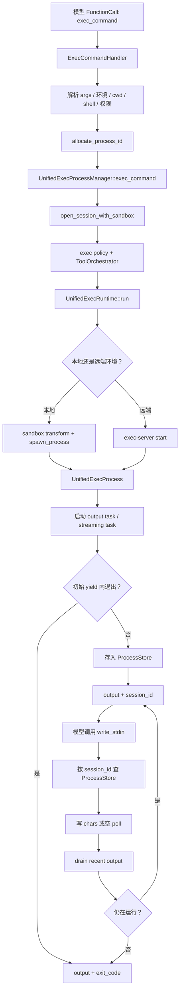

# 精读 06：Unified exec——命令怎样变成可继续交互的进程会话

> 源码基线：`4ee41929eaf4`  
> 主文件：`codex-rs/core/src/unified_exec/process_manager.rs`  
> 上游：`codex-rs/core/src/tools/handlers/unified_exec/exec_command.rs`、`write_stdin.rs`  
> 下游：`codex-rs/core/src/tools/runtimes/unified_exec.rs`、`codex-rs/core/src/unified_exec/process.rs`、`async_watcher.rs`  
> 前置阅读：[精读 05：Tool dispatch](05-tool-dispatch.md)

## 1. 先说人话：为什么不只用“一次性执行命令”

最简单的命令执行像这样：

```text
启动命令
-> 等它退出
-> 收集 stdout / stderr / exit code
-> 返回
```

这适合：

```bash
git status --short
```

但不适合下面这些任务：

```text
启动开发服务器，稍后检查日志
启动交互式 shell，连续输入多条命令
运行测试，先拿一部分输出，之后再轮询
程序询问 yes/no，需要继续写 stdin
命令很慢，但不想让一次 tool call 一直占着
```

Unified exec 把“命令执行”拆成两个工具：

```text
exec_command：启动一个新进程，并先等待一小段时间
write_stdin：对仍在运行的进程写输入，或者只轮询新输出
```

如果命令很快结束：

```text
exec_command
-> output + exit_code
-> 没有 session_id
```

如果命令仍在运行：

```text
exec_command
-> 当前 output + session_id

write_stdin(session_id, chars="...")
-> 新 output + 仍可能保留 session_id

write_stdin(session_id, chars="")
-> 不写输入，只等待并取走后续 output
```

## 2. 本篇要解决的核心问题

读完应能回答：

1. `exec_command` 与旧式 `shell_command` 的关键差别是什么？
2. `yield_time_ms` 为什么不是进程超时？
3. 工具参数里的 `session_id` 为什么在源码中叫 `process_id`？
4. 什么情况下返回 `session_id`，什么情况下返回 `exit_code`？
5. `tty=true` 与默认 pipes 模式有什么行为差异？
6. 一个活进程为什么能跨越多个 tool call 继续存在？
7. `write_stdin` 的空字符串为什么表示 poll？
8. 输出怎样同时用于实时事件、当前工具结果和最终 transcript？
9. 为什么输出要同时设置字节上限和 token 上限？
10. 进程退出、输出关闭、退出事件发布为什么不是同一个瞬间？
11. 本地进程与远端 exec-server 怎样共用同一套上层接口？
12. Turn 结束、Session 结束和后台进程结束是什么关系？

## 3. 贯穿案例：启动一个会延迟输出的命令

假设模型调用：

```json
{
  "cmd": "echo first; sleep 5; echo second",
  "yield_time_ms": 1000
}
```

一秒内只能看到：

```text
first
```

进程尚未退出，所以结果可能是：

```json
{
  "output": "first\n",
  "session_id": 18342,
  "wall_time_seconds": 1.0
}
```

几秒后，模型调用：

```json
{
  "session_id": 18342,
  "chars": "",
  "yield_time_ms": 5000
}
```

这次不写 stdin，只轮询，得到：

```json
{
  "output": "second\n",
  "exit_code": 0,
  "wall_time_seconds": 4.0
}
```

第二次结果不再有 `session_id`，表示进程已经结束，不能继续使用该句柄。

## 4. 一句话心智模型

> Unified exec 是一个由 Session 持有的、有界进程会话管理器：一次 `exec_command` 创建进程，多个 `write_stdin` 消费同一进程的后续输入输出，退出 watcher 最终发布完整命令终态。

## 5. 全景调用链



## 6. `exec_command` 和 `write_stdin` 何时注册

上一章看到 `spec_plan::add_shell_tools` 会根据 model、Feature 和环境选择 shell 工具。

启用 Unified Exec 且当前有可用环境时，通常注册：

```text
exec_command
write_stdin
```

同时可能把旧 `shell_command` 以 hidden 方式保留，供兼容路径使用。

若没有可执行环境，则不会把 Unified Exec 工具暴露给模型。

## 7. 两个工具共享一个 Session 级 manager

`SessionServices` 初始化时创建：

```rust
unified_exec_manager: UnifiedExecProcessManager::new(
    config.background_terminal_max_timeout,
),
```

这意味着 manager：

- 不是每个 tool call 新建；
- 不是每个 Turn 新建；
- 与 Session 生命周期绑定；
- 能让 Turn A 启动的后台终端继续被同一 Session 查询；
- Session shutdown 时会统一终止所有进程。

## 8. `exec_command` 的公开参数

固定提交中的核心参数：

| 参数 | 默认值 | 含义 |
|---|---:|---|
| `cmd` | 必填 | 要交给 shell 的脚本文本 |
| `workdir` | Turn cwd | 命令工作目录 |
| `shell` | 环境或 Session shell | 直接模式下请求 shell 路径 |
| `login` | 受配置控制 | 是否使用 login shell |
| `tty` | `false` | 是否分配终端语义 |
| `yield_time_ms` | `10000` | 本次调用等待输出或退出的时长 |
| `max_output_tokens` | `10000` | 模型可见输出预算，仍可能受策略限制 |
| `sandbox_permissions` | 默认权限 | 是否请求默认、额外或升级 Sandbox 权限 |
| `additional_permissions` | 无 | 更细粒度的额外文件/网络权限 |
| `justification` | 无 | 请求升级权限的理由 |
| `prefix_rule` | 无 | 建议或匹配 exec policy 的命令前缀规则 |
| `environment_id` | 主环境 | 多环境时选择目标环境 |

并非所有参数总会出现在 tool spec 中。例如是否展示 `shell`、`environment_id` 取决于当前工具计划。

## 9. 第一大名字陷阱：`session_id` 其实是 `process_id`

`write_stdin` 的模型参数叫：

```text
session_id
```

但源码内部统一保存：

```text
process_id: i32
```

错误枚举旁边的注释直接说明：

```rust
// The model is trained on `session_id`,
// but internally we track a `process_id`.
```

所以：

```text
工具协议 session_id
        =
Core 内部 process_id
```

它不是 Codex Session ID，也不是 thread ID，更不是操作系统 PID。

## 10. 为什么不直接暴露 OS PID

Unified Exec 的目标进程可能：

- 在本机；
- 在远端 exec-server；
- 经由平台 Sandbox wrapper；
- 使用 PTY 会话包装；
- 需要额外的网络审批状态和输出缓冲。

因此 Core 分配自己的逻辑 ID，用它查找完整的 `ProcessEntry`，而不是只记一个 OS PID。

## 11. `ProcessEntry` 保存的不只是进程

一个活会话的记录包含：

```text
process                  真正的 UnifiedExecProcess
call_id                  最初 exec_command 的调用 ID
process_id               Core 逻辑进程 ID
cwd                      工作目录
initial_exec_command_active
hook_command             原始命令文本
tty                      是否可继续写普通 stdin
network_approval         延迟网络审批状态
session                  Weak<Session>
last_used                最近交互时间
```

这解释了为什么 `write_stdin(session_id)` 能在以后继续：manager 不只是找到了进程句柄，也找回了原 call、hook、网络审批和事件上下文。

## 12. `allocate_process_id` 为什么先“预留”

handler 在审批和启动前先调用：

```rust
let process_id = manager.allocate_process_id().await;
```

生产环境随机选择 `1000..100000`；测试可使用从 1000 开始的确定性序列。

选中后先放进：

```text
reserved_process_ids
```

这样两个并发 `exec_command` 不会拿到同一个 ID。

若参数检查、权限校验或进程创建失败，必须调用 `release_process_id` 释放预留。

## 13. handler 为什么要解析两遍参数

`ExecCommandHandler` 先解析很小的：

```text
ExecCommandEnvironmentArgs
├── environment_id
└── workdir
```

先选择环境并解析 cwd，之后再解析完整 `ExecCommandArgs`。

原因是 additional permissions 里的相对路径必须相对于“选中的环境 cwd”解析，不能错误地相对于 Codex 宿主进程 cwd。

这是典型的分阶段解析：

```text
先解析决定上下文的字段
-> 建立正确上下文
-> 再解析依赖该上下文的字段
```

## 14. 本地路径与远端路径为什么会分叉

远端可能是 Windows，而 Codex 宿主是 macOS 或 Linux：

```text
file:///C:/repo
```

在 POSIX 上即使能机械地变成 `/C:/repo`，也不表示它是宿主原生路径。

handler 同时检查：

- `PathUri::to_abs_path()` 是否成功；
- 推断的 path convention 是否等于宿主 native convention；
- 当前 Sandbox 是否允许跳过依赖本地绝对路径的解析。

这不是挑剔，而是避免把远端路径误当成本地授权对象。

## 15. `get_command`：脚本文本怎样变成 argv

模型给的是：

```text
cmd = "echo hello"
```

真正 spawn 需要：

```text
program + args
```

Direct 模式下，shell 产生类似：

```text
["/bin/zsh", "-c", "echo hello"]
```

ZshFork 模式则使用配置的 zsh 路径，并根据 login 选择 `-lc` 或 `-c`。

`ResolvedCommand` 同时保存：

- `command: Vec<String>`；
- `shell_type`。

后者用于 PowerShell UTF-8、Windows Sandbox 和 shell-specific 处理。

## 16. `login` 不是模型想开就能开

逻辑是：

```text
args.login = true，但配置不允许
-> RespondToModel 错误

args.login 明确给值
-> 使用该值

args.login 未给
-> 使用环境 allow_login_shell 默认值
```

工具参数不能绕过更高层配置。

## 17. 远端环境必须使用远端报告的 shell 语义

远端 environment 可能运行不同 OS。

因此：

- shell mode 对远端强制回到 Direct；
- 优先使用 `TurnEnvironment` 报告的 shell；
- 若模型明确请求了不相容 shell，返回可回复模型的错误；
- 不能用宿主机的 shell 推断替远端拼 argv。

## 18. `exec_command` 也会拦截 apply_patch

如果模型通过 shell 形式调用 `apply_patch`，handler 会尝试识别：

```text
exec_command("apply_patch ...")
```

识别成功后进入经过验证的 patch 路径，而不是把它当普通命令启动。

这让显式 `apply_patch` 工具与 shell 中的 patch 命令共享文件修改验证和 diff tracking 语义。

拦截成功时，预留的 process ID 会立即释放，因为根本没有创建后台进程。

## 19. 第二大名字陷阱：`yield_time_ms` 不是命令总超时

假设：

```json
{"cmd":"sleep 60", "yield_time_ms":1000}
```

它不表示“一秒后杀掉 sleep”。

它表示：

```text
最多等待约一秒，看有没有输出或退出；
一秒后若仍在运行，返回 session_id，让后续继续。
```

真正的进程生命周期仍由：

- runtime 的执行 expiration；
- Sandbox / network cancellation；
- 用户取消；
- 后台终端清理；
- Session shutdown；
- 程序自行退出

共同决定。

## 20. 初始 yield 会被 clamp

固定提交常量：

```text
MIN_YIELD_TIME_MS = 250
MAX_YIELD_TIME_MS = 30000
Windows initial floor = 10000
```

普通平台：

```text
yield_time_ms.clamp(250, 30000)
```

Windows 先至少提升到 10000，再 clamp。

因此模型写 `yield_time_ms: 1` 不会真的只等 1ms。

## 21. `tty=false` 与 `tty=true`

工具说明：

```text
tty=true  -> 分配 PTY / terminal 语义
tty=false -> 使用普通 pipes
```

固定提交默认 `tty=false`。

主要差异：

| 行为 | `tty=false` | `tty=true` |
|---|---|---|
| 普通 stdin 持续写入 | 默认关闭 | 保持打开 |
| 终端感知程序 | 非交互/pipe 行为 | 更像真实终端 |
| 输入 Ctrl-C | 特殊允许，转成 interrupt signal | 作为 PTY 输入写入 |
| 适合场景 | 一次性命令、构建、查询 | REPL、交互 shell、需要回答提示的程序 |

## 22. 为什么 pipes 模式仍可能返回 session_id

`tty=false` 不等于“必须同步执行完”。

一个长时间运行但不需要 stdin 的程序仍可：

```text
exec_command(tty=false)
-> yield 后仍活着
-> 返回 session_id
-> 之后用空 write_stdin 轮询输出
```

只是不能向它写普通字符；需要持续输入时应从一开始使用 `tty=true`。

## 23. 安全执行链在哪里重新接上

handler 完成参数和权限准备后进入：

```text
UnifiedExecProcessManager::exec_command
-> open_session_with_sandbox
-> exec policy 生成 ExecApprovalRequirement
-> UnifiedExecRuntime
-> ToolOrchestrator::run
```

上一章解释的：

```text
approval → sandbox → attempt → 可选升级重试
```

在这里被实际复用。

## 24. exec policy 在启动前看什么

`create_exec_approval_requirement_for_command` 接收：

- 规范化后的 command argv；
- 当前 approval policy；
- permission profile；
- Windows Sandbox level；
- 请求的 Sandbox 权限；
- 可选 prefix rule。

它产生 `Skip`、`NeedsApproval` 或 `Forbidden`，随后由 Orchestrator 处理。

## 25. 环境变量不是简单继承整个父进程

`open_session_with_sandbox` 使用 `ShellEnvironmentPolicy` 创建环境，并额外设置：

```text
CODEX_THREAD_ID
活动 permission profile
Unified exec 的稳定环境变量
```

固定提交注入：

```text
NO_COLOR=1
TERM=dumb
LANG/LC_*=C.UTF-8
PAGER=cat
GIT_PAGER=cat
GH_PAGER=cat
CODEX_CI=1
```

目的是减少分页器、颜色控制符和 locale 差异，让输出更适合机器消费。

## 26. 本地和远端共用 `UnifiedExecProcess`

内部 transport enum：

```rust
enum ProcessHandle {
    Local(Box<ExecCommandSession>),
    ExecServer(Arc<dyn ExecProcess>),
}
```

上层统一调用：

```text
write
interrupt
terminate
has_exited
exit_code
output_handles
```

本地与远端的差异被包在 `ProcessHandle` 内，而 manager 不需要为每一步复制两套业务流程。

## 27. 本地启动路径

本地环境大致经过：

```text
SandboxCommand
-> SandboxAttempt::env_for
-> ExecRequest
-> codex_sandboxing::spawn_process
-> SpawnedPty
-> UnifiedExecProcess::from_spawned
```

即使结构名是 `SpawnedPty` / `ExecCommandSession`，实际是否启用 terminal 语义仍由 `tty` 参数决定；不要只凭类型名断言所有命令都有 PTY。

## 28. 远端启动路径

远端环境大致经过：

```text
SandboxCommand
-> SandboxAttempt::env_for_exec_server
-> ExecParams
-> backend.start(...)
-> StartedExecProcess
-> UnifiedExecProcess::from_exec_server_started
```

远端还要验证 capability，例如 executor-local network proxy launch；并且固定提交不支持把宿主 inherited file descriptors 传给远端。

## 29. `SpawnLifecycle` 为什么存在

某些启动方式在 child `exec()` 前后需要维护额外资源，例如 inherited file descriptors。

trait 提供：

```text
inherited_fds()
after_spawn()
```

普通路径使用 `NoopSpawnLifecycle`。

它让进程管理器支持特殊 spawn 前后动作，而不用把具体后端逻辑散落到通用管理代码中。

## 30. 进程对象有四类内部通信

`UnifiedExecProcess` 里值得区分：

| 机制 | 用途 |
|---|---|
| `output_buffer: Mutex<HeadTailBuffer>` | 给 `exec_command` / `write_stdin` drain 最近输出 |
| `output_tx: broadcast::Sender<Vec<u8>>` | 让 streaming watcher 订阅实时 chunk |
| `state_tx/rx: watch<ProcessState>` | 发布 exited、exit code、failure、sandbox denied |
| `cancellation_token` | 通知进程已退出/终止，驱动等待者收尾 |

它们不是重复实现同一件事，而是服务不同消费者。

## 31. 输出生产者做什么

本地 output task 从合并后的 stdout/stderr channel 读取 chunk：

```text
chunk
-> push 到 output_buffer
-> broadcast 给 streaming 订阅者
-> notify 等待输出的 poll
```

远端 output task 消费带序号的 `ExecProcessEvent`，遇到：

- broadcast lag；
- sequence gap；
- 旧 peer 缺失 sandbox_denied 字段

时会调用远端 `read(last_seq)` 做补偿读取。

## 32. 为什么远端输出要有 sequence number

网络或 broadcast consumer 可能错过事件。

若只依赖“刚刚收到的通知”，丢一个通知就永久丢输出。

远端事件带 `seq`，Core 保存 `last_seq`：

```text
收到 seq 8，但 last_seq=5
-> 发现 6、7 缺失
-> read(after=5)
-> 补回 retained chunks 和终态
```

这是 notification + reconciliation 的设计。

## 33. `HeadTailBuffer` 解决什么问题

一个命令可能无限输出：

```bash
yes
```

如果全部保留，Session 最终会 OOM。

固定提交的 `HeadTailBuffer` 默认最多保留 1 MiB，并把预算平均分成：

```text
前 512 KiB：head
后 512 KiB：tail
中间：丢弃并计数
```

渲染时插入：

```text
... N bytes omitted ...
```

## 34. 为什么保留 head + tail，而不是只保留最后部分

命令开头常包含：

- 版本；
- 配置；
- 编译目标；
- 第一个错误上下文。

命令结尾常包含：

- 最终错误；
- 测试摘要；
- exit 原因。

只保留 head 会丢结论，只保留 tail 会丢起因。对调试而言，两端通常比随机中间片段更有价值。

## 35. `drain` 为什么不等于丢失最终 transcript 视图

当前工具调用要返回“自上次以来的新输出”，因此会 drain 进程的 `output_buffer`。

与此同时 `start_streaming_output` 从 broadcast 订阅相同 chunk，并追加到单独的 transcript buffer，用于：

- `ExecCommandOutputDelta` 实时事件；
- 进程最终 `ExecCommandEnd` 的 aggregated output。

所以存在两个目的不同的有界视图：

```text
recent output buffer -> 每次工具响应消费
terminal transcript  -> 最终 item 完成事件汇总
```

## 36. 初始 `exec_command` 为什么同时 stream 和 collect

启动进程后源码：

```text
start_streaming_output(...)
collect_output_until_deadline(...)
```

前者给 UI / app-server 发增量事件；后者为当前 tool output 收集一个快照。

同一批 bytes 服务两个表面：

```text
人看到实时进度
模型在 tool result 中看到阶段性 observation
```

## 37. delta 也必须有界

除了 transcript 的 1 MiB 上限，实时事件还有：

- 单个 delta 最多 8192 bytes；
- 每次 call 的 delta 数量上限；
- UTF-8 边界切分；
- 无效 UTF-8 时仍保证向前推进。

有界最终缓冲不代表实时事件天然有界，这两层必须分别限制。

## 38. 为什么要在 UTF-8 边界发送 delta

一个中文字符可能跨两个底层 byte chunks：

```text
chunk A: 字符前两字节
chunk B: 最后一字节
```

若直接把 A 当字符串发 JSON，会产生无效 UTF-8。

`split_valid_utf8_prefix` 累积 pending bytes，尽量按有效前缀切分；对非法字节也至少消费一个 byte，避免死循环。

## 39. 输出关闭与进程退出不是一个信号

至少有三个相关事实：

```text
process state 已 exited
output producer 已 closed
streaming subscriber 已 drain 完尾部输出
```

进程可以先退出，pipe 中仍残留最后几行。

因此不能一看到 exit code 就立即发布最终 item，否则可能漏掉尾部日志。

## 40. `OutputTaskGuard` 保证关闭通知

output task 持有一个 guard。

无论任务正常结束、错误返回还是被 drop，guard 的 `Drop` 都会：

```text
output_closed = true
notify output_closed waiters
```

这是 RAII 用于异步收尾状态的例子。

## 41. trailing output grace

streaming watcher 收到进程 exit token 后，不立即结束，而是给尾部输出最多 100ms grace。

如果更早收到明确 `output_closed`，则不必等满 grace，马上 final drain。

因此逻辑是：

```text
exit
-> 等 output_closed 或 100ms fallback
-> try_recv 剩余 broadcast chunks
-> output_drained.notify_one()
```

## 42. exit watcher 为什么还要等 `output_drained`

后台 `spawn_exit_watcher` 顺序：

```text
等待 process exit token
-> 等 streaming output 已 drain
-> 等 deferred network denial monitor settle
-> 获取 interaction lock
-> 读取最终 transcript / failure / exit code
-> 发唯一 ExecCommandEnd
```

这保证最终命令 item 尽量包含尾部输出，并不会和同一个终端的 `write_stdin` 终态处理交错。

## 43. 初始响应前为什么先存活进程

源码注释：

```text
Persist live sessions before the initial yield wait
so interrupting the turn cannot drop the last Arc
and terminate the background process.
```

白话解释：

> 只要进程启动后仍存活，就先把 Arc 放进 ProcessStore，再开始等待 initial yield。

否则用户在等待期间中断 Turn，局部变量被 drop，最后一个 Arc 消失，`UnifiedExecProcess::drop` 会终止进程；本来应成为后台会话的进程就意外丢失了。

## 44. `InitialExecCommandGuard` 防什么竞态

进程存入 `ProcessEntry` 时：

```text
initial_exec_command_active = true
```

初始 `exec_command` 返回路径结束，guard Drop 后改为 false。

显式终止后台终端时，如果发现初始响应仍 active，会完成 terminate，但暂不从 store 移除，让初始调用有机会重新检查状态并产生一致的 response。

它保护的是：

```text
终止请求
vs
初始 tool response 组装
```

之间的竞态。

## 45. `collect_output_until_deadline` 的循环

简化为：

```text
loop:
  若处于 elicitation pause，延长 deadline
  锁 output_buffer
  drain 当前 bytes
  若有 bytes：合并到本次 collected
  若无 bytes：
      已退出且 output_closed -> 结束
      deadline 到 -> 结束
      否则等待 output notify / exit / close / pause change
```

它不是固定 `sleep(yield_time)`，命令提前退出或输出关闭时可以提前返回。

## 46. 为什么 pause 会延长 yield deadline

如果 Session 正等待用户回答 elicitation/审批，单纯按墙钟计算 yield，等待期间就可能把输出轮询预算耗尽。

`extend_deadlines_while_paused` 记录暂停时长，并把：

- 主 deadline；
- exit 后 close wait deadline

一起向后延长。

测试证明 250ms yield 遇到约 2 秒 pause 时，不会在 pause 中过期。

## 47. exit 后为何只再等最多 50ms close

`collect_output_until_deadline` 发现 exit signal 后，会给 output producer 一个很短的 close wait，上限 50ms。

目的平衡：

- 不立即返回，给尾部 bytes 一点到达时间；
- 不因为某个异常 producer 永不 close 而卡满剩余长 deadline。

后台 streaming watcher还有自己的 100ms trailing grace；两者服务不同消费者。

## 48. 初始响应如何判断是否返回 session_id

等待结束后刷新状态：

```text
Alive
-> response.process_id = Some(id)
-> 工具协议输出 session_id

Exited
-> 从 store 移除
-> response.process_id = None
-> 输出 exit_code

Unknown
-> 若不满足已退出竞态补偿，返回错误
```

关键不是“是否等满 yield”，而是组装响应那一刻的进程状态。

## 49. 短命令为什么不留下后台记录

若进程在初始检查时已经退出：

- 不需要未来 `write_stdin`；
- 立即发送命令 completed item；
- 完成 deferred network approval；
- 释放预留 ID；
- 检查 Sandbox denial；
- 返回 output + exit code。

因此运行 `echo hi` 通常不会让 ProcessStore 越积越多。

## 50. `write_stdin` 的公开参数

| 参数 | 默认值 | 含义 |
|---|---:|---|
| `session_id` | 必填 | 之前 `exec_command` 返回的逻辑进程 ID |
| `chars` | 空字符串 | 写入 stdin；为空时只 poll |
| `yield_time_ms` | `250` | 写入后或 poll 时最多等待输出的请求值 |
| `max_output_tokens` | `10000` | 本次模型可见输出预算 |

`chars` 的语义是 bytes/characters to write，不会自动补换行：

```text
"yes\n"  !=  "yes"
```

交互 shell 通常需要显式 `\n` 才会提交一行。

## 51. 空 `chars` 不是 no-op，而是 poll

调用：

```json
{"session_id":18342,"chars":""}
```

会：

1. 找到进程；
2. 不调用 process.write；
3. 等待新输出、进程退出或 deadline；
4. drain 自上次以来的 recent output；
5. 返回最新状态。

这使模型不需要额外的 `poll_process` 工具。

## 52. 空 poll 与非空 write 的等待范围不同

非空 write：

```text
至少 250ms，最多 30000ms
```

空 poll：

```text
至少 5000ms，最多 manager 配置上限
默认上限 300000ms
```

原因：

- 写入后应保持交互响应；
- 空 poll 本来就是等待后台状态，可以长一些，减少频繁轮询。

## 53. 同一终端上的交互为什么串行

源码先按 ID 找到进程，再获取：

```rust
process.interaction_lock().lock_owned().await
```

不同进程可以并发 poll；同一进程的两个读写不能重叠。

否则会发生：

```text
poll A drain 了一半输出
write B 同时写入并 drain
两边争抢终态、call id 和 buffer
```

`interaction_lock` 把单个终端建模为串行 actor-like 资源。

## 54. 为什么不能一直拿着全局 ProcessStore 锁

代码只在短临界区内：

- 查 entry；
- clone `Arc<UnifiedExecProcess>`；
- 更新 `last_used`；
- clone output handles 和 metadata。

等待 stdin、输出或退出时不持有全局 store lock。

这样一个慢终端不会阻止其他终端被查询或写入。

## 55. 用 `Arc::ptr_eq` 防止 ID 重用竞态

`prepare_process_handles` 不只再次按 process_id 查询，还检查：

```rust
Arc::ptr_eq(&entry.process, expected_process)
```

如果同一数字 ID 已经指向另一个新进程，旧调用不能误操作新对象。

虽然 ID 分配和预留已降低重用风险，这个对象身份检查又补了一层防线。

## 56. `tty=false` 写入普通字符为什么报 `StdinClosed`

固定提交本地 spawn 参数：

```text
stdin_open = tty
```

所以默认 pipe 命令的 stdin 不保持打开。

非 TTY 会话收到非空 input 时：

```text
若 input 是 Ctrl-C 字符 \u0003
-> 转成 interrupt signal

否则
-> StdinClosed
-> 提示重新用 tty=true 启动
```

## 57. Ctrl-C 为什么单独处理

对 `tty=false` 进程，虽然普通 stdin 关闭，用户仍需要中断长命令。

因此字符串：

```text
"\u0003"
```

被解释为 process interrupt，而不是普通字节写入。

本地映射到 PTY/process signal，远端映射到 exec-server `ProcessSignal::Interrupt`。

## 58. 写入后为什么 sleep 100ms

远端或交互程序收到输入后，输出不会在同一 CPU 指令瞬间出现。

成功 write 后短暂等待 100ms，可以提高紧随其后的 poll 捕获响应的概率。

这不是 correctness 必需的同步协议，而是交互体验上的小窗口；真正状态仍通过 output notify、deadline 和 exit signal判断。

## 59. `write_stdin` 也可能观察到原命令完成

原始 `exec_command` 返回 session_id 时，命令 item 仍在进行中。

后来的某次 `write_stdin` 可能发现进程已经退出，于是：

- response 不再含 process_id；
- 带 exit_code；
- 从 store 移除 entry；
- 完成 deferred network approval；
- 最终 post hook 使用原命令的 call id / hook command。

所以 `write_stdin` 不只是“输入工具”，也是原 `exec_command` 生命周期的继续者。

## 60. 为什么 `write_stdin` 不发第二次 PreToolUse

源码注释解释：

- 空 write 只是后台 poll；
- 非空 write 是已经通过 Bash PreToolUse 的原命令的延续。

因此 `WriteStdinHandler::pre_tool_use_payload` 返回 `None`。

否则每次轮询都可能被误认为一条全新 shell 命令。

## 61. 但 `write_stdin` 为什么可能触发 PostToolUse

当某次 poll 观察到原进程最终完成时，它可以构造原 `exec_command` 对应的 Bash PostToolUse payload。

`ExecCommandToolOutput` 保存：

- `event_call_id`；
- `hook_command`；
- 是否仍有 `process_id`。

只有进程真正完成、且有原 hook command 时，才产生 post-tool response。

## 62. Tool call ID 与 command item ID 如何延续

第一次 `exec_command` 有自己的 function call id。

`write_stdin` 本身又是一个新的 function call，但当它观察到旧进程结束时，命令生命周期仍应归到原命令 item。

因此 output 的 `post_tool_use_id`：

```text
event_call_id 非空 -> 使用原 exec_command call id
否则 -> 使用当前 tool call id
```

这避免把同一个 shell 命令拆成多个虚假的 PostToolUse 生命周期。

## 63. `TerminalInteraction` 事件何时发送

`write_stdin` 后，如果：

- 实际写了非空 input；或
- 进程仍在运行

则发送 `TerminalInteractionEvent`，记录：

```text
原 command call_id
process_id
stdin 内容
```

一个空 poll 若恰好观察到进程完成，则可以不再发送交互事件。

## 64. 输出响应有哪些字段

Unified Exec 的模型结果大致包含：

| 字段 | 何时出现 | 含义 |
|---|---|---|
| `output` | 通常都有 | 本次收集到的 recent output |
| `chunk_id` | 正常 exec 结果 | 本次输出块的随机短标识 |
| `wall_time_seconds` | 都有 | 本次等待输出花费的墙钟时间 |
| `session_id` | 仍在运行 | 后续传给 `write_stdin` 的 process_id |
| `exit_code` | 已结束且已知 | 进程退出码 |
| `original_token_count` | 已统计 | 截断前近似 token 数 |

`session_id` 与 `exit_code` 的存在性就是最直观的状态提示。

## 65. 非零 exit code 不等于工具框架失败

命令执行成功地启动并返回：

```bash
exit 17
```

其业务结果是：

```text
exit_code = 17
```

这不等于“工具 infrastructure 崩溃”。模型应读取 exit code 和输出进行判断。

测试明确验证 pipe 命令的 exit code 17 能被保留下来。

## 66. 哪些才是 Unified Exec infrastructure error

`UnifiedExecError` 区分：

- `CreateProcess`：无法创建进程；
- `ProcessFailed`：远端流、网络审批等运行基础设施失败；
- `UnknownProcessId`：句柄不存在或已完成；
- `WriteToStdin`：写入失败；
- `StdinClosed`：会话没保持 stdin；
- `MissingCommandLine`；
- `SandboxDenied`：结构化 Sandbox 拒绝；
- `ForeignPath`：路径不属于宿主平台约定。

handler 通常把这些转成 `RespondToModel`，让模型解释或调整动作。

## 67. Sandbox denial 为什么是特殊错误

进程可能退出非零，是因为：

- 程序自身失败；
- 命令不存在；
- Sandbox 拒绝文件或系统调用。

`UnifiedExecProcess::check_for_sandbox_denial_with_text` 综合：

- executor 是否明确报告 denial；
- 当前 SandboxType；
- exit code 和输出启发式。

识别为 denial 后交回 Orchestrator，才可能触发符合策略的升级尝试。

## 68. 为什么 Sandbox denial 响应不保留 live session

如果最终 denial 已经是终态，handler 构造的 `ExecCommandToolOutput` 明确：

```text
process_id = None
```

因为没有一个可供 `write_stdin` 恢复的正常活进程。

模型看到的是 denial 输出和 exit code，而不是一个虚假的 session_id。

## 69. 输出有两层截断

第一层：运行期 byte cap。

```text
HeadTailBuffer 最多保留 1 MiB
中间丢弃，记录 omitted_bytes
```

第二层：模型投影 token cap。

```text
max_output_tokens 默认 10000
还要与 model truncation policy 的预算取较小值
```

这样既保护内存，又保护模型 context window。

## 70. `original_token_count` 为什么只是 approximate

运行层先按 bytes 统计，再用近似换算 token。

真实 tokenizer 与文本内容有关，精确 tokenization 成本更高；这里主要用于提示：

```text
原输出大约多大
为什么发生截断
```

不能把它当成账单级精确 token 数。

## 71. `max_output_tokens` 不能让运行缓冲无限增大

即使模型请求一个很大的 `max_output_tokens`：

- 1 MiB byte cap 仍在；
- model truncation policy 仍可进一步收紧；
- 实时 delta 的单条/条数上限仍在。

调用方不能通过一个参数取消所有容量保护。

## 72. 后台 exit watcher 怎样完成命令 item

若 initial yield 时进程仍活着，`store_process` 会同时启动 exit watcher。

进程以后自行退出时，即使模型暂时没有 poll：

```text
exit watcher
-> 等尾部输出 drain
-> 等网络 denial 判定
-> 获取 interaction lock
-> 发 completed 或 failed ExecCommandEnd
```

所以 UI 的命令 item 不依赖模型必须及时再次调用 `write_stdin` 才能结束。

## 73. 为什么 watcher 使用 `Weak<Session>` 与 `Arc<Session>` 各有不同

`ProcessEntry` 保存 `Weak<Session>`，避免 process store 与 Session 形成强引用环。

但已经启动的 exit watcher 持有完成事件所需的 `Arc<Session>` / `Arc<TurnContext>`，确保 watcher 工作期间这些上下文有效。

这是有意区分：

```text
长期存储关系 -> Weak，避免环
有界后台任务 -> Arc，保证任务执行期间存活
```

## 74. ProcessStore 为什么设置 64 个软上限

常量：

```text
MAX_UNIFIED_EXEC_PROCESSES = 64
```

存入新进程前可能 prune：

1. 保护最近使用的 8 个；
2. 优先淘汰不在保护集里的已退出进程；
3. 否则选最久未使用的进程；
4. 若候选正被 interaction lock 使用，跳过；
5. 某些终态发布窗口允许临时超过软上限，而不错误杀死活进程。

## 75. prune 为什么不能在锁内做 async cleanup

选出并从 Map 移除候选需要持有 store mutex。

但：

```text
unregister network approval
terminate process
```

可能 await 或触发更多工作。

源码先在锁内完成纯内存 mutation，drop 锁后再清理，避免全局 store 被慢 I/O 长时间占用。

## 76. 后台终端可以由 app-server 管理

固定提交提供公开 thread 级操作：

```text
thread/backgroundTerminals/list
thread/backgroundTerminals/terminate
thread/backgroundTerminals/clean
```

list 投影：

- 原 command item id；
- process id；
- command；
- cwd。

这说明后台终端不仅是模型内部隐式状态，也能由客户端 UI 查询和清理。[官方 App Server 文档](https://learn.chatgpt.com/docs/app-server)

## 77. Turn 结束为什么不一定杀死后台进程

manager 属于 SessionServices，而不是 TurnContext。

因此：

```text
Turn #1 启动服务器并返回 session_id
Turn #1 完成
Turn #2 仍可查看同一 Session 的后台终端
```

否则“后台”只活到当前回答结束，就没有实际价值。

## 78. Session shutdown 必须终止所有进程

`shutdown_session_runtime` 的收尾包括：

```text
abort tasks
-> unified_exec_manager.terminate_all_processes()
-> shutdown Code Mode / MCP / Guardian / hooks
```

`terminate_all_processes`：

1. 锁内 drain 全部 entries 并清空 reserved IDs；
2. 锁外逐个注销网络审批；
3. 终止进程。

后台进程可以跨 Turn，但不能无主地跨 Session 永久泄漏。

## 79. `Drop for UnifiedExecProcess` 是最后防线

进程对象被 drop 时会调用：

```rust
self.terminate();
```

这提供 RAII 安全网。

但正常代码仍应显式管理 store、网络审批和事件，因为只靠 Drop：

- 无法 await 远端确认；
- 无法完整发布业务终态；
- 无法精确控制清理顺序。

## 80. `terminate` 与 `terminate_confirmed`

`terminate`：

- 本地发终止；
- 远端异步 spawn 一个 terminate 请求；
- 取消 output task。

`terminate_confirmed`：

- 远端 await terminate RPC；
- 显式 signal exit；
- 再结束输出任务；
- 可将失败返回调用者。

显式“终止某后台终端”需要更强的确认语义，所以使用 confirmed 路径。

## 81. 网络审批为何可能延续到后台进程结束

Managed network 的决定可能是 deferred：进程已启动，但特定网络访问稍后才触发 policy decision。

因此 `ProcessEntry` 保存 `DeferredNetworkApproval`，并启动 denial monitor：

```text
网络被拒绝
-> 标记 failure
-> terminate process
-> watcher 等 monitor settle
-> 发 failed terminal event
```

不能在 initial `exec_command` 返回 session_id 时就把网络审批上下文丢掉。

## 82. 为什么进程退出后还等 100ms 的 late network denial

远端/代理事件可能有轻微乱序：

```text
先收到 process exit
稍后才收到 network denial decision
```

固定提交保留 100ms grace 观察迟到 denial，避免把实际由网络策略终止的命令误报为普通 exit。

## 83. 三条完整时间线

### 83.1 一次性命令

```text
exec_command("printf hi")
-> 分配 process_id
-> approval / sandbox
-> spawn
-> output task
-> 150ms early-exit 检查或 yield collection
-> 进程退出
-> drain 尾部输出
-> emit command completed
-> release process_id
-> tool output: output="hi", exit_code=0
```

### 83.2 长命令 + 空 poll

```text
exec_command("sleep 5; echo done", yield=250ms)
-> 先存 ProcessEntry
-> 启动 streaming + exit watcher
-> yield 到
-> tool output: session_id=18342

write_stdin(18342, chars="")
-> interaction lock
-> 不写输入
-> 等 output / exit
-> drain "done"
-> refresh: Exited
-> tool output: exit_code=0，无 session_id
```

### 83.3 交互式 shell

```text
exec_command("bash -i", tty=true)
-> session_id=18342

write_stdin(18342, "export X=codex\n")
-> 写入 PTY
-> session_id 仍存在

write_stdin(18342, "echo $X\n")
-> output 包含 codex

write_stdin(18342, "exit\n")
-> shell 退出
-> output + exit_code，无 session_id
```

## 84. 六个关键竞态

### 竞态一：进程在 initial yield 中退出

响应前重新 `refresh_process_state`，不能仅依赖开始时的 alive 判断。

### 竞态二：用户在初始响应生成时终止进程

`initial_exec_command_active` 避免过早移除 entry。

### 竞态三：write_stdin 写入时进程刚退出

写失败后刷新状态；若已退出，继续按退出响应组装，而不是一律报写入错误。

### 竞态四：退出信号早于最后输出

output_closed、trailing grace 和 output_drained 保证尾部排空。

### 竞态五：同一终端两个 poll 同时 drain

interaction lock 将其串行化。

### 竞态六：进程退出早于网络 denial

late denial grace 和 monitor settle 后再分类终态。

## 85. 测试证据：跨调用保存交互状态

`unified_exec_persists_across_requests`：

1. 启动 `bash -i`；
2. 得到 process id；
3. 写入 `export ...=codex`；
4. 再写 `echo $...`；
5. 断言输出仍包含 `codex`；
6. 终止后台终端并确认 list 为空。

这证明不是每次 `write_stdin` 都新开一个 shell。

## 86. 测试证据：不同会话不共享 shell 状态

`multi_unified_exec_sessions`：

- shell A 设置环境变量；
- 新的 `exec_command` 运行短命令，看不到该变量；
- 回到 shell A 再查询，变量仍存在。

证明 process_id 选择的是具体进程会话，而不是全局 shell。

## 87. 测试证据：短 yield 后还能 poll 到晚到输出

`unified_exec_timeouts`：

- 在交互 shell 中执行 `sleep 5 && echo value`；
- 第一次 write 使用很短 yield，看不到 value；
- 等待后空 poll；
- 第二次结果看到 value。

这直接证明 yield 是“本次返回等待”，不是 kill timeout。

## 88. 测试证据：完成的 ID 不能重用

`reusing_completed_process_returns_unknown_process`：

- 启动 shell；
- 输入 `exit`；
- 再用同一个 ID poll；
- 得到 `UnknownProcessId`；
- store 为空。

终态句柄不会悄悄指向旧缓存或新进程。

## 89. 测试证据：终止竞态

测试覆盖：

- 初始 exec response 仍 active 时的后台 terminate；
- stdin poll 过程中进程被终止；
- poll 最终返回 exited response，而不是挂死；
- store 正确清空。

这些测试证明 guard、interaction lock 和状态重新检查不是多余复杂度。

## 90. 测试证据：输出边界

测试分别验证：

- HeadTailBuffer 保留 prefix + suffix；
- drain 后可继续使用；
- 多次 drain/merge 后仍受容量上限约束；
- omission count 不会丢；
- delta 不超过 8192 bytes；
- UTF-8 code point 不被错误切断；
- invalid UTF-8 不造成死循环。

## 91. 测试证据：远端执行

远端集成测试：

- 使用配置的 remote exec-server；
- 启动交互进程；
- 写入一条打印命令；
- 通过统一 collect 路径取得远端输出；
- 拒绝远端不支持的 inherited fds。

证明远端不是另一个完全独立工具表面，而是 `UnifiedExecProcess` 的另一 transport。

## 92. 常见误解

### 误解一：`yield_time_ms=1000` 会在一秒后杀进程

它只决定本次等待多久；活进程会返回 session_id。

### 误解二：`session_id` 是 Codex Session ID

它是 Core 分配的逻辑 process id，只用于 Unified Exec 会话。

### 误解三：有 session_id 就一定是交互 PTY

长时间运行的 pipes 命令也可返回 session_id，只是普通 stdin 默认关闭。

### 误解四：`write_stdin` 一定会写字符

`chars=""` 表示纯 poll。

### 误解五：每次 poll 都返回完整历史输出

recent output buffer 会 drain，返回的是自上次消费以来的阶段性输出；最终 item 另有 transcript。

### 误解六：看到 exit signal 就能立即结束 item

仍需等待输出 producer close、尾部 drain 和可能的迟到网络 denial。

### 误解七：非零 exit code 是 tool infrastructure error

它通常是正常完成的命令结果；创建/transport/句柄错误才是 UnifiedExecError。

### 误解八：Turn 完成会杀死所有后台进程

后台进程属于 Session manager，可跨 Turn；Session shutdown 或显式 clean 才统一终止。

### 误解九：`max_output_tokens` 是唯一输出上限

还有 1 MiB byte cap、model truncation policy 和 delta 上限。

### 误解十：本地与远端都可以直接用宿主路径和 shell

远端有自己的 PathUri、shell、capability 和 exec backend。

## 93. 可以学走的设计模式

### 模式 A：同步快路径 + 会话化慢路径

短命令一次返回；长命令自动提升为可继续交互的 session。

### 模式 B：句柄指向复合资源

对外只给一个整数 ID，内部绑定进程、输出、审批、事件和状态。

### 模式 C：按作用域放 owner

进程要跨 Turn，所以 manager 属于 SessionServices；Session 关闭时统一清理。

### 模式 D：通知加权威对账

远端实时事件快速推进，sequence gap 时用 read API 恢复完整状态。

### 模式 E：有界多视图输出

recent buffer、terminal transcript、delta events 和 model output 分别设置边界。

### 模式 F：退出与排空分阶段

先得知进程退出，再确认 output close 和 drain，最后发布终态。

### 模式 G：锁内取快照，锁外 await

全局 store 只做短内存操作；慢 I/O 使用 clone 出来的 Arc/handles。

### 模式 H：单资源串行、跨资源并发

每个终端有 interaction lock，不同终端仍可并发。

### 模式 I：RAII 兜底，显式 async shutdown 完成业务语义

Drop 防泄漏，confirmed termination 和 Session shutdown 负责可等待的完整清理。

## 94. 推荐源码阅读顺序

```text
tools/handlers/shell_spec.rs
  先看两个工具对模型公开什么

tools/handlers/unified_exec.rs
  参数结构、shell mode、默认值

tools/handlers/unified_exec/exec_command.rs
  环境/cwd/权限/命令解析与 manager 入口

unified_exec/mod.rs
  manager、request、store、常量

unified_exec/process_manager.rs
  exec_command
  write_stdin
  open_session_with_sandbox
  collect_output_until_deadline
  store / prune / terminate

tools/runtimes/unified_exec.rs
  Orchestrator 与本地/远端 Sandbox attempt

unified_exec/process.rs
  transport、output task、state、signal、Drop

unified_exec/async_watcher.rs
  delta stream、trailing drain、final item

unified_exec/head_tail_buffer.rs
  容量边界

tools/handlers/unified_exec/write_stdin.rs
  现有进程的输入与 poll 工具包装
```

## 95. 自测题

1. `yield_time_ms` 与真正进程 timeout 有什么区别？
2. 为什么对外叫 `session_id`，内部叫 `process_id`？
3. `tty=false` 的长命令是否可能返回 session_id？为什么？
4. 为什么初始 yield 前要先把活进程放进 ProcessStore？
5. `HeadTailBuffer` 为什么同时保留前部和尾部？
6. recent output buffer 与 terminal transcript 分别服务谁？
7. 为什么 exit watcher 要等待 `output_drained`？
8. 空 `write_stdin` 的作用是什么？
9. 为什么同一进程上的两个 write/poll 要串行？
10. 非零 exit code 与 `UnifiedExecError::ProcessFailed` 有什么区别？
11. Turn 完成和 Session shutdown 对后台进程的影响有何不同？
12. 远端事件 sequence gap 怎样恢复？

### 参考答案

1. yield 只限制本次工具调用等待输出的时间；进程可继续存活并返回 session_id，真正 timeout/cancel 由执行 runtime 管理。
2. 模型训练和工具协议使用 session_id；Core 用 process_id 表达它实际索引的是进程会话，二者是同一逻辑句柄。
3. 可以。session_id 表示进程仍活着，不保证 stdin 开放；tty=false 可用空 poll 继续取输出。
4. 防止 Turn 中断时局部最后一个 Arc 被 drop，从而意外终止本应后台运行的进程。
5. head 常含起因和配置，tail 常含最终错误或摘要；中间最适合在超限时省略。
6. recent buffer 为每次 tool response 提供增量快照；transcript 为实时 delta 和最终 command item 汇总。
7. 进程退出后 pipe/远端流仍可能有尾部输出，必须先排空再发布最终 item。
8. 不写 stdin，只等待并消费该进程的新输出或终态。
9. 它们共享可 drain buffer 和终态 mutation，并发会重复或错分输出。
10. 非零 exit 是程序业务结果；ProcessFailed 表示创建、transport、网络审批或进程管理基础设施失败。
11. manager 属于 Session，Turn 完成不必杀进程；Session shutdown 会 terminate_all_processes。
12. 比较 last_seq，发现 gap 后调用 exec-server read(after=last_seq) 对账 retained chunks 和终态。

## 96. 本篇局部术语表

| 英文 / 代码词 | 中文 | 在本篇中的实际含义 |
|---|---|---|
| Unified exec | 统一执行 | 用同一接口管理本地/远端、短命令/后台命令和持续交互 |
| `exec_command` | 执行命令工具 | 创建新进程并在 initial yield 后返回输出、退出码或 session id |
| `write_stdin` | 写标准输入工具 | 对现有进程写 bytes，或用空输入轮询新输出 |
| `UnifiedExecProcessManager` | 统一进程管理器 | Session 级 owner，分配 ID、保存进程、收集输出和清理资源 |
| `UnifiedExecProcess` | 统一进程包装 | 屏蔽本地 PTY/pipes 与远端 exec-server process 的差异 |
| `ProcessStore` | 进程存储 | process id 到 `ProcessEntry` 的 Session 内存映射 |
| `ProcessEntry` | 进程条目 | 进程、原 call、cwd、TTY、网络审批、最近使用时间等复合记录 |
| `session_id` | 工具会话 ID | 模型侧名称，实际等于 Core `process_id` |
| `process_id` | 逻辑进程 ID | Core 自分配的句柄，不是 OS PID |
| OS PID | 操作系统进程号 | 目标机器的真实系统进程身份，本篇工具协议不直接依赖它 |
| reserved ID | 已预留 ID | 进程启动前先占用，防止并发分配冲突 |
| `yield_time_ms` | 让出等待时间 | 本次调用等待输出/退出多久，不是自动杀进程的总超时 |
| initial yield | 初始等待 | `exec_command` 启动后第一次收集输出的等待窗口 |
| background process | 后台进程 | initial yield 后仍活着、已存入 ProcessStore 的进程 |
| background terminal | 后台终端 | app-server 对可列出/终止 Unified Exec 会话的用户表述 |
| `tty` | 终端开关 | 是否启用 terminal 语义并保持 stdin 打开 |
| PTY | 伪终端 | 让程序感知自己连接终端的 OS 会话机制 |
| pipe | 管道 | 非终端的 stdin/stdout/stderr 字节通道 |
| stdin | 标准输入 | 进程接收交互字符的输入流 |
| stdout | 标准输出 | 程序正常输出流；Unified Exec transcript 当前主要按聚合流处理 |
| stderr | 标准错误 | 程序诊断输出；在统一 PTY/聚合表面中可能与 stdout 合并 |
| poll | 轮询 | 用空 chars 等待并读取新输出，不发送输入 |
| `chars` | 输入字符 | 原样写入 stdin 的字符串，不自动添加换行 |
| interrupt | 中断信号 | Ctrl-C 语义，非 TTY 会话也允许通过 `\u0003` 请求 |
| `interaction_lock` | 交互锁 | 串行化同一进程上的写、poll 和终态发布 |
| `Arc::ptr_eq` | Arc 身份比较 | 防止旧操作误作用于同数字 ID 下的新进程对象 |
| `ProcessHandle` | 进程 transport | Local 或 ExecServer 两种底层句柄 |
| exec-server | 执行服务器 | 在远端环境真正启动、读写和终止进程的服务 |
| `SpawnLifecycle` | 启动生命周期 | child spawn 前后维护 inherited fds 等额外资源的合同 |
| `ExecRequest` | 执行请求 | Sandbox 转换后、可交给本地或远端后端的启动参数 |
| output chunk | 输出块 | output task 每次收到的一段 bytes |
| `OutputHandles` | 输出共享句柄 | buffer、notify、closed flag 和 cancellation token 的集合 |
| `HeadTailBuffer` | 首尾缓冲 | 有界保留输出前半和后半、统计省略中部 bytes 的结构 |
| byte cap | 字节上限 | 运行期最多保留 1 MiB 输出的内存边界 |
| token cap | token 上限 | 投影给模型时的 context 容量边界 |
| omission marker | 省略标记 | `... N bytes omitted ...`，说明中间输出被有界丢弃 |
| drain | 排空 / 取走 | 返回当前缓冲并把原缓冲重置为空 |
| recent output | 最近输出 | 自上次 drain 以来供当前 tool response 消费的 bytes |
| transcript | 过程汇总 | 另一路有界积累，用于 delta 和最终 command item；不承诺保存无限原始输出 |
| output delta | 输出增量事件 | 命令运行时实时发送给 UI/app-server 的小块文本 |
| sequence number | 序号 | 远端输出事件的单调位置，用于发现 gap 和补读 |
| reconciliation | 对账 | event 缺失时调用 read API 恢复 retained 输出与终态 |
| `Notify` | 异步通知器 | 唤醒等待新输出、输出关闭或 drain 完成的 task |
| `watch` channel | 状态观察 channel | 保存并广播最新 ProcessState，而非每条历史事件 |
| `broadcast` channel | 广播 channel | 让实时输出订阅者各自接收 chunk，慢消费者可能 lag |
| cancellation token | 取消令牌 | 通知进程退出/终止并唤醒等待者的协作信号 |
| output closed | 输出已关闭 | producer 不会再写新 chunk 的状态 |
| output drained | 输出已排空 | streaming consumer 已处理退出前尾部 chunk 的状态 |
| trailing output | 尾部输出 | 进程退出信号之后才从 pipe/远端流到达的最后 bytes |
| grace period | 宽限窗口 | 为迟到输出或网络拒绝保留的短暂等待时间 |
| exit watcher | 退出观察任务 | 等进程和输出收尾后发布最终 CommandExecution item |
| `InitialExecCommandGuard` | 初始调用守卫 | 标记首个 tool response 尚在组装，协调显式终止竞态 |
| `ProcessState` | 进程状态 | exited、exit code、failure 和 sandbox denial 的最新快照 |
| exit code | 退出码 | 程序业务终态，0 通常成功，非零不自动等于框架错误 |
| infrastructure error | 基础设施错误 | 创建、transport、写入、句柄或进程管理失败 |
| `UnifiedExecError` | 统一执行错误 | 对创建、运行、ID、stdin、Sandbox 和路径失败的分类 |
| sandbox denial | 沙箱拒绝 | 被平台限制识别出的执行失败，可交回 Orchestrator 决定升级 |
| deferred network approval | 延迟网络审批 | 进程启动后在实际网络访问发生时才完成的策略决定 |
| late denial | 迟到拒绝 | 进程 exit 后稍晚到达的网络 policy denial |
| LRU | 最近最少使用 | ProcessStore 超软上限时选择候选的一部分淘汰策略 |
| prune | 修剪 / 淘汰 | 为保持进程数量有界而移除并终止旧 entry |
| soft cap | 软上限 | 目标为 64，但终态锁竞争时可短暂超过以避免误杀活进程 |
| `Weak<Session>` | Session 弱引用 | 不反向保活 Session，避免进程条目形成所有权环 |
| RAII | 资源随所有权释放 | guard / Drop 在所有返回路径上维护 close 或 terminate 兜底 |
| teardown | 资源收尾 | 终止进程、停止 output task、注销审批并移除 store entry |

## 97. 源码导航

| 想继续追什么 | 固定提交文件 | 重点符号 |
|---|---|---|
| 工具公开 schema | `codex-rs/core/src/tools/handlers/shell_spec.rs` | `create_exec_command_tool_with_environment_id`、`create_write_stdin_tool` |
| 共用参数与 shell 解析 | `codex-rs/core/src/tools/handlers/unified_exec.rs` | `ExecCommandArgs`、`get_command`、`shell_mode_for_environment` |
| exec handler | `codex-rs/core/src/tools/handlers/unified_exec/exec_command.rs` | `ExecCommandHandler::handle_call` |
| stdin handler | `codex-rs/core/src/tools/handlers/unified_exec/write_stdin.rs` | `WriteStdinHandler::handle_call` |
| manager 与请求类型 | `codex-rs/core/src/unified_exec/mod.rs` | `UnifiedExecProcessManager`、`ProcessEntry`、yield 常量 |
| 命令主路径 | `codex-rs/core/src/unified_exec/process_manager.rs` | `exec_command` 约 417—663 |
| stdin / poll 主路径 | 同上 | `write_stdin` 约 665—843 |
| 输出等待循环 | 同上 | `collect_output_until_deadline` 约 1227—1318 |
| store 与 watcher 建立 | 同上 | `store_process` 约 905—960 |
| 本地/远端启动 | 同上 | `open_session_with_exec_env`、`open_session_with_prepared_exec_env` |
| approval/Sandbox 入口 | 同上 | `open_session_with_sandbox` 约 1124—1225 |
| Unified exec runtime | `codex-rs/core/src/tools/runtimes/unified_exec.rs` | `UnifiedExecRuntime`、`ToolRuntime::run` |
| 进程 transport | `codex-rs/core/src/unified_exec/process.rs` | `ProcessHandle`、`UnifiedExecProcess` |
| 本地/远端 output task | 同上 | `spawn_local_output_task`、`spawn_exec_server_output_task` |
| 流式输出与退出 watcher | `codex-rs/core/src/unified_exec/async_watcher.rs` | `start_streaming_output`、`spawn_exit_watcher` |
| 有界输出 | `codex-rs/core/src/unified_exec/head_tail_buffer.rs` | `HeadTailBuffer` |
| 进程状态 | `codex-rs/core/src/unified_exec/process_state.rs` | `ProcessState` |
| 错误分类 | `codex-rs/core/src/unified_exec/errors.rs` | `UnifiedExecError` |
| 模型输出投影 | `codex-rs/core/src/tools/context.rs` | `ExecCommandToolOutput` |
| 命令 UI item | `codex-rs/core/src/tools/events.rs` | `ToolEmitter::unified_exec`、`emit_exec_stage` |
| Session shutdown | `codex-rs/core/src/session/handlers.rs` | `shutdown_session_runtime` |
| 后台终端 Core API | `codex-rs/core/src/tasks/mod.rs` | list / terminate / close unified exec processes |
| app-server 后台终端 | `codex-rs/app-server/src/request_processors/thread_processor.rs` | background terminals list/terminate/clean |
| 核心行为测试 | `codex-rs/core/src/unified_exec/mod_tests.rs` | persist、poll、timeout、termination、remote |
| manager 边界测试 | `codex-rs/core/src/unified_exec/process_manager_tests.rs` | yield、bounded output、network denial、prune |
| watcher 测试 | `codex-rs/core/src/unified_exec/async_watcher_tests.rs` | close、grace、UTF-8、late denial |
| buffer 测试 | `codex-rs/core/src/unified_exec/head_tail_buffer_tests.rs` | head/tail、drain、omission |

下一篇计划精读 App-server JSON-RPC 分派：一行 JSON 怎样被解析成 request/notification/response，经过 typed method 路由、并发与双向 server request，最后返回正确 ID 的 JSON-RPC 消息。

返回[源码精读目录](README.md)或[课程总目录](../README.md)。
