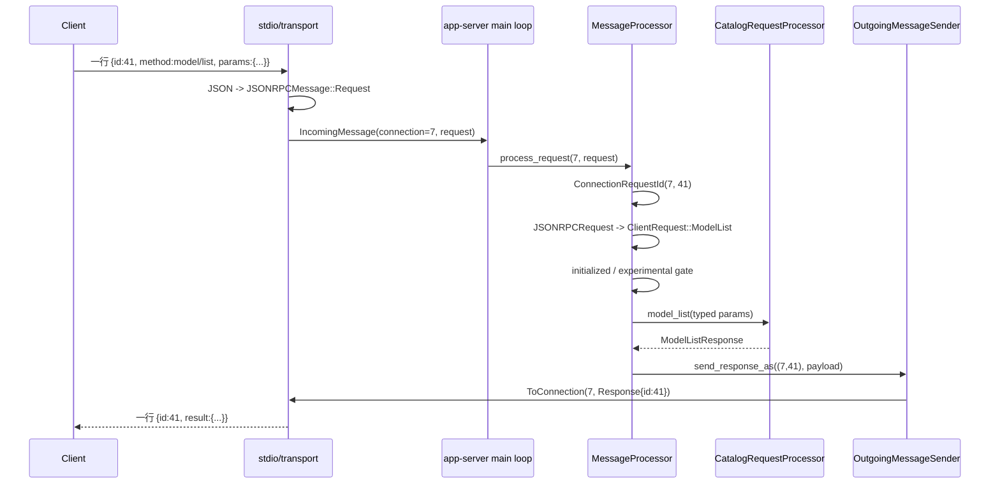
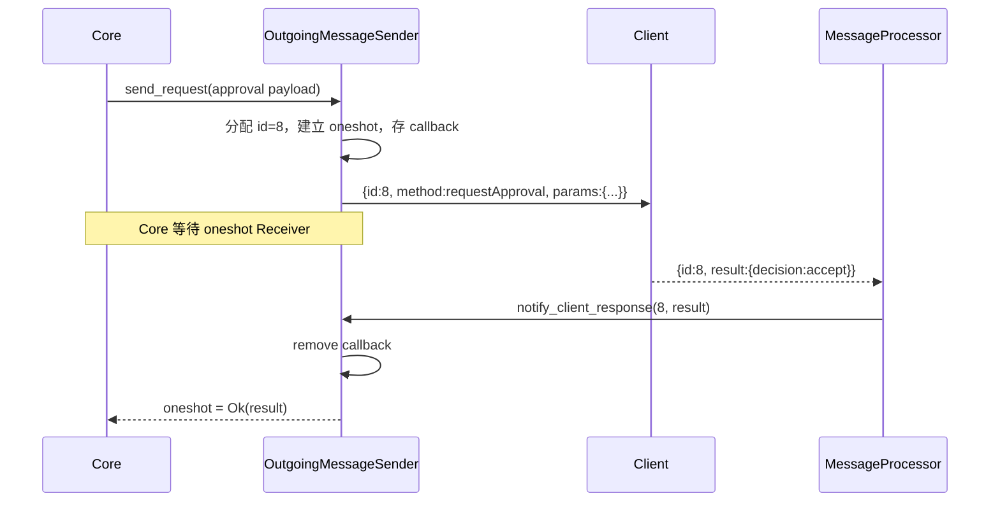

# 精读 07：App-server JSON-RPC 分派——一行 JSON 怎样找到正确的 Rust handler

> 源码基线：`4ee41929eaf4`  
> 主文件：`codex-rs/app-server/src/message_processor.rs`  
> 上游：`codex-rs/app-server-transport/src/transport/stdio.rs`、`transport/mod.rs`  
> 协议类型：`codex-rs/app-server-protocol/src/rpc.rs`、`protocol/common.rs`  
> 下游：`codex-rs/app-server/src/request_processors/*`、`outgoing_message.rs`  
> 前置阅读：[App-server v2 边界](../09-app-server-v2.md)、[App-server JSON-RPC 主题章](../86-app-server-json-rpc-requests-responses-notifications-ids-and-bidirectional-lifecycle.md)

## 1. 先说人话：App-server 像一个“带编号的总机”

桌面客户端想让 Codex 创建 thread、开始 turn 或读取模型列表时，不会直接调用某个 Rust 函数。它先发送一条 JSON：

```json
{"id": 41, "method": "model/list", "params": {"limit": 20}}
```

App-server 要完成五件事：

```text
1. 从输入流中读出完整的一行
2. 判断它是 request、notification、response 还是 error
3. 根据 method 把松散 JSON 变成强类型 Rust 数据
4. 找到负责这个 method 的 processor/handler
5. 把结果用原来的 id=41 发回原来的连接
```

可把它想成电话总机：

- `method` 是分机号；
- `params` 是来电人交代的事情；
- `id` 是取件号；
- `ClientRequest` 是总机填好的标准工单；
- `CatalogRequestProcessor::model_list` 是真正处理业务的部门；
- `result` 或 `error` 是凭取件号返回的答复。

最容易误解的是：App-server 不只是被调用。执行命令需要批准时，它还会反过来向客户端发 request，等客户端用同一个 id 回 response。

## 2. 本篇读完要回答什么

1. JSONL 和 JSON 有什么区别？
2. 为什么一条 request 必须有 `id`，notification 却没有？
3. 当前基线为什么只能称为“JSON-RPC 风格”，而不是完整 JSON-RPC 2.0？
4. `#[serde(untagged)]` 怎样区分四种 envelope？
5. 通用 `JSONRPCRequest` 为什么还要再转一次 `ClientRequest`？
6. 未知 method、错误 params 和未初始化请求分别在哪里失败？
7. `match codex_request` 为什么就是 typed dispatch 的核心？
8. 为什么响应键不是只有 `RequestId`，而是 `ConnectionRequestId`？
9. handler 为什么有时立即回包，有时返回 `None`？
10. server request 的 `oneshot` callback 怎样和客户端 response 对上？
11. notification 为什么不能被当成“没有 id 的普通 request”？
12. 断线后哪些状态必须清理？

## 3. 先纠正一个名字：这里并非完整 JSON-RPC 2.0

`app-server-protocol/src/rpc.rs` 文件开头直接写明：

```rust
//! We do not do true JSON-RPC 2.0, as we neither send nor expect the
//! "jsonrpc": "2.0" field.
```

虽然文件中有 `JSONRPC_VERSION = "2.0"` 常量，但四个实际 envelope 结构都没有 `jsonrpc` 字段。因此，本篇示例遵循固定提交真正的 wire shape：

```json
{"id": 41, "method": "model/list", "params": {"limit": 20}}
```

而不是擅自添加：

```json
{"jsonrpc": "2.0", "id": 41, "method": "model/list", "params": {"limit": 20}}
```

这套协议借用了 JSON-RPC 最重要的语义：method、params、id、result、error，以及 request/response 的关联方式。但“形状相似”不等于“逐条满足完整标准”。公开概念可参考[官方 App Server 文档](https://learn.chatgpt.com/docs/app-server)，内部行为仍以本基线源码为准。

## 4. JSONL：换行不是排版，而是消息边界

stdio 是连续字节流，本身不知道一段 JSON 在哪里结束。当前实现采用 JSON Lines，也叫 JSONL：

```text
一行 = 一个完整 JSON 对象
下一行 = 下一条消息
```

例如 stdin 中可能连续出现：

```jsonl
{"id":1,"method":"initialize","params":{"clientInfo":{"name":"demo","version":"1"}}}
{"id":2,"method":"model/list","params":{"limit":20}}
```

`start_stdio_connection` 的 reader task 使用：

```rust
let reader = BufReader::new(stdin);
let mut lines = reader.lines();

while let Ok(Some(line)) = lines.next_line().await {
    forward_incoming_message(..., &line).await;
}
```

writer task 做相反工作：

```rust
let Some(mut json) = serialize_outgoing_message(message) else {
    continue;
};
json.push('\n');
stdout.write_all(json.as_bytes()).await?;
```

所以 stdout 不能混入普通调试文字。客户端会把每一行都当协议消息解析。日志应走 stderr 或 tracing 的专用输出位置。

## 5. 四种 envelope：先看有没有 `method`，再看有没有 `result/error`

源码的第一层类型是：

```rust
#[serde(untagged)]
pub enum JSONRPCMessage {
    Request(JSONRPCRequest),
    Notification(JSONRPCNotification),
    Response(JSONRPCResponse),
    Error(JSONRPCError),
}
```

这里的 envelope 可以理解为“信封”。它只负责描述消息外壳，不负责具体业务。

| 种类 | 关键字段 | 方向 | 是否期待后续答复 |
|---|---|---|---|
| Request | `id + method + params?` | 双向都可发 | 是 |
| Notification | `method + params?` | 主要是 server → client | 否 |
| Response | `id + result` | 回答 request | 已是答复 |
| Error | `id + error` | 错误回答 request | 已是答复 |

### 5.1 Request

```json
{"id":"req-7","method":"thread/read","params":{"threadId":"abc"}}
```

有 `id`，表示发送方会等待一个对应答复。

### 5.2 Notification

```json
{"method":"turn/completed","params":{"threadId":"abc","turn":{"id":"turn-1"}}}
```

没有 `id`，表示这是单向事件，不建立“待回复槽位”。

### 5.3 Response

```json
{"id":"req-7","result":{"thread":{"id":"abc"}}}
```

`id` 告诉接收者：这是对哪条 request 的成功回答。

### 5.4 Error

```json
{"id":"req-7","error":{"code":-32600,"message":"Invalid request: ..."}}
```

它同样是终态答复，只是结果为失败。

## 6. `#[serde(untagged)]` 是什么意思

普通 Rust enum 序列化后可能自带显式标签。`untagged` 表示 wire JSON 中没有 `"type":"Request"` 这种额外字段，Serde 会尝试按各 variant 的字段形状匹配。

等价心智模型是：

```text
尝试按 JSONRPCRequest 解析
否则尝试 JSONRPCNotification
否则尝试 JSONRPCResponse
否则尝试 JSONRPCError
全部失败 -> 反序列化失败
```

variant 顺序因此不是装饰。Request 放在 Notification 前面，而 Request 比 Notification 多一个必需的 `id`；带 id 的 method 消息会先匹配 Request。

不要把它理解成复杂的业务判断。此时只是在识别“信封形状”，尚未确认 `method` 是不是 Codex 支持的方法。

## 7. 第一层解析失败时发生什么

`forward_incoming_message` 调用：

```rust
serde_json::from_str::<JSONRPCMessage>(payload)
```

成功时包装成：

```rust
TransportEvent::IncomingMessage {
    connection_id,
    message,
}
```

失败时当前实现只记录：

```text
Failed to deserialize JSONRPCMessage: ...
```

然后继续读取后续行。注意：如果连 `id` 都无法可靠获得，就没法构造一个一定能正确关联的 error response。这里的精确行为不要凭标准印象猜，应以代码为准。

## 8. TransportEvent：把“网络细节”翻译成“连接事件”

上层主循环不需要知道消息来自 stdin、WebSocket、Unix socket 还是 remote control。transport 统一发三种事件：

```rust
pub enum TransportEvent {
    ConnectionOpened { connection_id, origin, writer, ... },
    ConnectionClosed { connection_id },
    IncomingMessage { connection_id, message },
}
```

这样主循环关心的是：

```text
哪个连接开了？
哪个连接关了？
哪个连接发来了哪种消息？
```

而不是“这次到底调用了 stdin.read_line 还是 WebSocket receive”。这就是 transport abstraction 的价值。

## 9. 为什么每条消息都要带 `connection_id`

不同客户端完全可能都使用：

```json
{"id":1,"method":"model/list","params":{}}
```

`id=1` 只要求在发送方自己的请求空间里可关联，并不天然全局唯一。

所以服务端为客户端请求构造：

```rust
pub struct ConnectionRequestId {
    connection_id: ConnectionId,
    request_id: RequestId,
}
```

真正稳定的键是：

```text
(连接 12, 请求 1)
```

而不是只有：

```text
请求 1
```

这同时保证结果被发回原连接。否则连接 A 的 `id=1` 可能收到连接 B 的结果。

## 10. 主循环：四种 envelope 在这里第一次分叉

`app-server/src/lib.rs` 的主循环收到 `IncomingMessage` 后做穷举匹配：

```rust
match message {
    JSONRPCMessage::Request(request) => {
        processor.process_request(connection_id, request, ...).await;
    }
    JSONRPCMessage::Response(response) => {
        processor.process_response(response).await;
    }
    JSONRPCMessage::Notification(notification) => {
        processor.process_notification(notification).await;
    }
    JSONRPCMessage::Error(err) => {
        processor.process_error(err).await;
    }
}
```

这四条路用途不同：

```text
Request      -> 客户端正在要求 App-server 做新工作
Notification -> 客户端发来不要求答复的单向消息
Response     -> 客户端在回答 App-server 之前发出的 server request
Error        -> 客户端用错误回答之前的 server request
```

`Response` 不是“App-server 准备发给客户端的 response”。在接收路径里，它一定是 peer 发来的，所以它在回答 App-server。

## 11. Request 的两次类型转换

一条 request 会经历两个层次：

```text
原始字符串
-> JSONRPCRequest
-> ClientRequest
```

第一层 `JSONRPCRequest` 很宽松：

```rust
pub struct JSONRPCRequest {
    pub id: RequestId,
    pub method: String,
    pub params: Option<serde_json::Value>,
    pub trace: Option<W3cTraceContext>,
}
```

这里 `method` 只是任意字符串，`params` 只是任意 JSON value。

第二层 `ClientRequest` 是业务类型枚举：

```rust
pub enum ClientRequest {
    Initialize { request_id, params: InitializeParams },
    ModelList { request_id, params: ModelListParams },
    ThreadRead { request_id, params: ThreadReadParams },
    TurnStart { request_id, params: TurnStartParams },
    // ...
}
```

它能让后续代码知道：只要匹配到 `ModelList`，`params` 就已经是 `ModelListParams`，不用每个 handler 再手工从 JSON 中找字段。

## 12. 宏怎样把 method 字符串映射成 enum variant

`client_request_definitions!` 的输入同时声明：

```text
Rust variant 名
wire 上的 method 名
params 类型
serialization scope
response 类型
```

简化示意：

```rust
ModelList => "model/list" {
    params: ModelListParams,
    serialization: none,
    response: ModelListResponse,
}
```

宏生成的 `ClientRequest` 使用：

```rust
#[serde(tag = "method")]
```

因此 `method` 是内部标签：

```json
{"id":2,"method":"model/list","params":{"limit":20}}
```

会变成概念上的：

```rust
ClientRequest::ModelList {
    request_id: RequestId::Integer(2),
    params: ModelListParams { limit: Some(20), ... },
}
```

## 13. `TryFrom<JSONRPCRequest>` 具体做了什么

宏生成的转换会：

1. 从通用 request 取出 `id`、`method`、`params`；
2. 临时重建一个 JSON object；
3. 把外层的 `id` 放成内部字段；
4. 交给 Serde 按 `method` 选择 enum variant；
5. 同时把 `params` 校验为该 variant 的具体类型。

简化源码：

```rust
let JSONRPCRequest { id, method, params, .. } = request;
let mut object = serde_json::Map::new();
object.insert("id".into(), serde_json::to_value(id)?);
object.insert("method".into(), Value::String(method));
if let Some(params) = params {
    object.insert("params".into(), params);
}
serde_json::from_value(Value::Object(object))
```

这一步同时完成“找路由”和“验参数形状”。

## 14. 未知 method 与错误 params 为什么都先成为 Invalid request

`deserialize_client_request` 是：

```rust
ClientRequest::try_from(request)
    .map_err(|err| invalid_request(format!("Invalid request: {err}")))
```

所以固定基线中，下面两类错误都从这里进入 invalid request：

```text
method 不对应任何 ClientRequest variant
method 存在，但 params 缺字段或字段类型错误
```

例如：

```json
{"id":3,"method":"model/list","params":{"limit":"twenty"}}
```

`limit` 期待数字却收到字符串，因此不会进入 `CatalogRequestProcessor::model_list`。

重要边界是：handler 只处理已经通过 wire 类型校验的数据。

## 15. `process_request`：先建立上下文，再解析和分派

`MessageProcessor::process_request` 的顺序是：

```text
构造 ConnectionRequestId
-> 建立 tracing span / trace context
-> 注册尚未终结的 RequestContext
-> JSONRPCRequest 转 ClientRequest
-> handle_client_request
-> 失败则 send_error
```

为什么先注册 request context？因为无论成功还是错误，最终回包都需要结束对应的 trace；而有些请求不是在当前函数栈内立即完成。

`RequestContext` 保存：

- connection-scoped request id；
- tracing span；
- 可选的 W3C parent trace。

它不是业务结果，而是“这次 RPC 仍在处理中”的可观测性状态。

## 16. Initialize 是特殊入口，不走普通业务分派

`handle_client_request` 先单独匹配：

```rust
if let ClientRequest::Initialize { request_id, params } = codex_request {
    initialize_processor.initialize(...).await?;
    return Ok(());
}
```

其余请求才进入：

```rust
dispatch_initialized_client_request(...)
```

后者第一道检查是：

```rust
if !session.initialized() {
    return Err(invalid_request("Not initialized"));
}
```

因此客户端不能先发 `turn/start` 再补 initialize。初始化会建立后续请求依赖的连接级能力，例如：

- client name/version；
- 是否启用 experimental API；
- 哪些 notification 被 opt out；
- MCP extension capability；
- attestation 需求。

## 17. `initialized` 到底是谁的状态

这里不是全服务器只有一个 initialized flag，而是每个连接有自己的 `ConnectionSessionState`：

```rust
pub struct ConnectionSessionState {
    rpc_gate: Arc<ConnectionRpcGate>,
    initialized: OnceLock<InitializedConnectionSessionState>,
}
```

所以：

```text
连接 A 已初始化
不代表连接 B 已初始化
```

`OnceLock` 还表达“一次写入”的约束：连接能力一旦建立，不应被普通请求随意重写。

## 18. Experimental gate 发生在 handler 之前

初始化检查后，代码还会检查：

```rust
if let Some(reason) = codex_request.experimental_reason()
    && !session.experimental_api_enabled()
{
    return Err(invalid_request(experimental_required_message(reason)));
}
```

顺序很重要：

```text
先把 method/params 解析成 typed request
-> 再知道该 variant 是否 experimental
-> 再依据当前连接 capability 决定是否允许
-> 允许后才进入业务 processor
```

这避免 handler 已产生副作用后才发现客户端没有声明实验能力。

## 19. Typed dispatch 的核心就是一个穷举 `match`

`handle_initialized_client_request` 中有一个很大的：

```rust
match codex_request {
    ClientRequest::ConfigRead { params, .. } => {
        self.config_processor.read(params).await
    }
    ClientRequest::ModelList { params, .. } => {
        self.catalog_processor.model_list(params).await
    }
    ClientRequest::ThreadStart { params, .. } => {
        self.thread_processor.thread_start(..., params, ...).await
    }
    ClientRequest::TurnStart { params, .. } => {
        self.turn_processor.turn_start(..., params, ...).await
    }
    // ...
}
```

这就是“typed handler 调用”的最终路由表。

它不是按字符串查一个动态 `HashMap<String, Handler>`，而是先由 Serde 把字符串变 enum，再由 Rust 的 exhaustive match 选分支。新增 `ClientRequest` variant 后，如果忘记在这里处理，编译器通常会报告 match 不完整。

## 20. 用 `model/list` 完整走一遍

输入：

```json
{"id":41,"method":"model/list","params":{"limit":20}}
```

### 第一步：stdio 取一行

```text
line = 整条 JSON 字符串
```

### 第二步：识别 envelope

因为同时有 `id` 和 `method`：

```rust
JSONRPCMessage::Request(JSONRPCRequest { ... })
```

### 第三步：附加连接身份

假设当前连接为 7：

```rust
ConnectionRequestId {
    connection_id: ConnectionId(7),
    request_id: RequestId::Integer(41),
}
```

### 第四步：转成 typed request

```rust
ClientRequest::ModelList {
    request_id: 41,
    params: ModelListParams { limit: Some(20), ... },
}
```

### 第五步：检查连接

```text
已 initialize？
该 method 若是 experimental，连接是否 opt in？
```

### 第六步：选 handler

```rust
self.catalog_processor.model_list(params).await
```

### 第七步：把具体 response 包成通用 payload

```text
ModelListResponse
-> ClientResponsePayload::ModelList(...)
```

### 第八步：发回同连接和同 id

概念结果：

```json
{"id":41,"result":{"data":[...],"nextCursor":null}}
```

## 21. handler 返回的为什么是 `Option<ClientResponsePayload>`

总分派统一得到：

```rust
Result<Option<ClientResponsePayload>, JSONRPCErrorError>
```

三种结果分别表示：

```text
Ok(Some(response)) -> 总分派现在统一发送成功 response
Ok(None)           -> 当前分支不在这里发；可能已自行异步响应
Err(error)         -> 发送 error response
```

例如简单查询往往返回 `Some(response)`；某些需要把 request id 交给下层、稍后完成的操作可能返回 `None`。因此 `None` 不等于“忘了回包”，必须沿具体 processor 查看它是否接管了响应责任。

## 22. 成功回包怎样保持原 id

成功路径最终调用：

```rust
self.outgoing.send_response_as(request_id.clone(), response).await;
```

`send_response_as_inner` 将业务 payload 包装成：

```rust
OutgoingMessage::Response(OutgoingResponse {
    id: request_id.request_id,
    result: Box::new(response),
})
```

同时使用 `request_id.connection_id` 选择目标连接：

```rust
OutgoingEnvelope::ToConnection {
    connection_id,
    message,
    ...
}
```

可见 `(connection_id, request_id)` 的两部分承担不同职责：

```text
connection_id -> 发给谁
request_id    -> 对方把它认作哪次请求的答复
```

## 23. 错误回包也必须保持原 id

无论错误来自：

- typed deserialization；
- 尚未 initialize；
- experimental capability gate；
- 具体 processor；
- response 序列化；

只要已有可靠 request id，就应回到同一请求：

```rust
OutgoingMessage::Error(OutgoingError {
    id: request_id.request_id,
    error,
})
```

客户端不应靠“收到错误的时间”猜它属于哪条请求，因为多个请求可能并发执行。

## 24. 为什么请求可以并发，但响应仍不会串线

普通 initialized request 可能被 `tokio::spawn` 启动；带 serialization scope 的请求则进入按资源键管理的队列。于是：

```text
id=10 先收到，但工作较慢
id=11 后收到，但工作较快
id=11 可以先返回
id=10 后返回
```

协议并不要求按接收顺序返回，而是要求每个 response 的 id 正确。

本篇只需记住：

> 顺序不负责关联，id 才负责关联。

哪些请求能并发、哪些必须按资源串行，是下一篇 Serialization scope 的主题。

## 25. Notification 不是“省略 id 的 request”

notification 的合同是：发送方不等待 RPC response。

当前固定提交中，`MessageProcessor::process_notification` 只记录客户端 notification：

```rust
tracing::info!("<- notification: {:?}", notification);
```

源码注释明确说当前不期待客户端发送 notification。协议类型中虽然定义了 `ClientNotification`，测试辅助代码也会发送 `Initialized`，但本基线共享 JSON-RPC 接收处理器并没有把 notification 分派成业务 handler。

这里要区分两件事：

```text
类型系统允许描述某类消息
≠ 当前这条运行路径已经实现了相应业务处理
```

## 26. Server notification：事件流为什么不带 id

App-server 向客户端报告：

```text
thread/started
turn/started
item/started
item/completed
turn/completed
```

这些是状态事件，不是“请客户端计算一个答案”。所以它们以 notification 发送，不建立 callback。

`send_server_notification_to_connections` 可：

- 广播给所有已初始化连接；
- 定向发给给定连接列表；
- 根据连接的 experimental capability 过滤；
- 根据连接 opt-out method 集合过滤。

通知没有 response，不代表没有可靠性设计。它仍经过有界 outbound queue；慢 WebSocket 连接的队列塞满时，可以被断开，避免拖住整个服务器。

## 27. 双向 RPC：服务器为什么也会发 request

假设 Core 想执行一条需要用户批准的命令。真正能展示确认 UI、收集用户选择的是客户端。因此 App-server 发：

```json
{
  "id": 8,
  "method": "item/commandExecution/requestApproval",
  "params": {
    "threadId": "abc",
    "turnId": "turn-1",
    "itemId": "item-3"
  }
}
```

客户端稍后回答：

```json
{"id":8,"result":{"decision":"accept"}}
```

方向一换，名称也随观察者改变：

| 类型名 | 谁发送 | 谁处理 |
|---|---|---|
| `ClientRequest` | client | App-server |
| `ClientResponsePayload` | App-server | client |
| `ServerRequest` | App-server | client |
| `ServerResponse` | client | App-server |

`Client`/`Server` 前缀描述“请求的发起方或协议角色”，不是说所有 `Response` 都从 server 发出。

## 28. Server request 的 callback 怎样建立

`OutgoingMessageSender::send_request_to_connections` 做四件关键事：

```text
1. next_request_id() 分配服务器侧 RPC id
2. ServerRequestPayload.request_with_id(id) 变成完整 ServerRequest
3. oneshot::channel() 建立一次性等待通道
4. request_id_to_callback[id] = PendingCallbackEntry
5. 把 request 发给客户端
6. 把 oneshot Receiver 返回给业务调用方等待
```

简化伪代码：

```rust
let id = next_request_id();
let request = payload.request_with_id(id.clone());
let (tx, rx) = oneshot::channel();
pending.insert(id.clone(), PendingCallbackEntry { callback: tx, request });
send_to_client(request).await;
return (id, rx);
```

`oneshot` 表示这条 callback 只接受一次终态结果。

## 29. 客户端 response 怎样唤醒正确的等待者

客户端发来的：

```json
{"id":8,"result":{"decision":"accept"}}
```

第一层被识别为：

```rust
JSONRPCMessage::Response(JSONRPCResponse { id: 8, result: ... })
```

主循环调用：

```rust
processor.process_response(response).await;
```

然后：

```rust
self.outgoing.notify_client_response(id, result).await;
```

`notify_client_response` 从 map 中移除 callback：

```rust
let entry = self.take_request_callback(&id).await;
entry.callback.send(Ok(result));
```

业务调用方正在等待 `rx.await`，于是被唤醒并继续审批流程。

## 30. 为什么要“remove 后再 send”

`take_request_callback` 使用 `remove_entry`，而不是只 `get`：

```text
第一份 response -> 找到并取走 callback -> 成功完成
第二份重复 response -> map 中已不存在 -> 只记录 warning
```

这形成“一个 RPC id 只完成一次”的基本性质。

注意不要把它夸大为完整业务幂等。它只保证这张 pending callback 表里的首个终态拿走槽位；具体审批、多客户端竞争和重放还有更深的业务规则，可读主题章 89。

## 31. 客户端用 Error 回答时走哪里

如果客户端无法完成 server request，可返回：

```json
{"id":8,"error":{"code":-32000,"message":"approval UI unavailable"}}
```

接收路径是：

```text
JSONRPCMessage::Error
-> MessageProcessor::process_error
-> OutgoingMessageSender::notify_client_error
-> remove pending callback
-> callback.send(Err(error))
```

对等待方而言，成功 response 和 error response 都是该 request 的终态。

## 32. 两套 id 空间不要混为一谈

当前实现有两个容易混淆的方向：

```text
客户端发起的请求 ID
  用 ConnectionRequestId 保存，因为不同连接可能重复

服务器发起的请求 ID
  由 next_server_request_id 分配，并用于 pending callback map
```

后者当前是 `OutgoingMessageSender` 级递增整数。阅读时看到 `request_id_to_callback`，要先问：“这是等待客户端回答 server request 的表，还是等待 App-server 回答 client request 的表？”

答案是前者。

## 33. RequestContext map 和 callback map 不是同一张表

`OutgoingMessageSender` 同时持有：

```rust
request_id_to_callback: HashMap<RequestId, PendingCallbackEntry>
request_contexts: HashMap<ConnectionRequestId, RequestContext>
```

区别是：

| Map | 追踪什么 | 何时移除 |
|---|---|---|
| `request_contexts` | 客户端发来的请求仍未发最终答复 | 发 success/error 或连接关闭 |
| `request_id_to_callback` | 服务器发出的请求仍在等客户端答复 | 收到 response/error、取消或全量清理 |

一个追踪入站请求，一个追踪出站请求。两者都叫 request，却站在相反方向。

## 34. 连接关闭时为什么不能只删 socket

`ConnectionClosed` 到来后，主循环会：

```text
从 connections 移除连接
-> 关闭该连接的 RPC gate
-> 从 outbound router 移除 writer
-> 等该连接正在运行的 RPC 排空（带超时）
-> 清除未完成 RequestContext
-> 通知 fs/process/thread 等子系统做 connection-scoped cleanup
```

如果只关闭 socket 而不清状态，可能留下：

- 永远不会回包的入站 request context；
- 仍认为该连接订阅 thread 的 listener；
- 属于断开客户端的 watch/process 资源；
- 后续继续向已断开 writer 发送消息。

“连接断了”是生命周期事件，不只是一次 I/O 错误。

## 35. 过载时为什么 request 和 notification 行为不同

transport event channel 是有界的。`try_send` 发现满时：

- 若入站消息是 Request，尝试立即向该连接返回 overload error，并保留原 id；
- 若是其他事件，则等待 channel 有容量后再发送；
- 若 outbound queue 也满，过载答复也可能被丢弃并记录 warning。

这体现 request 的特殊性：对方正在等待一个终态，服务器应尽量明确告诉它“现在太忙，请稍后重试”。notification 本来就没有待回复者。

## 36. 响应序列化也可能失败

业务 handler 成功，不代表 JSON 一定能写出。`serialize_outgoing_message` 若序列化失败，会检查原消息是不是 Response：

```text
普通 outgoing 序列化失败 -> 记录错误，无法发送
Response 序列化失败 -> 尝试改发带同 id 的 internal error
```

这是很实用的兜底：客户端不应因为某个 response payload 无法序列化而无限等待。

但兜底 error 本身若也无法序列化，最终仍只能记录错误。任何 I/O 系统都存在“连错误也无法报告”的最外层失败边界。

## 37. Outbound router：业务代码不直接写 stdout

handler 最终把消息放入：

```rust
OutgoingEnvelope::ToConnection { ... }
```

或：

```rust
OutgoingEnvelope::Broadcast { ... }
```

outbound router 再根据 `connection_id` 找 writer，把消息放进具体连接的发送队列。

这样分层后：

```text
业务 processor 负责“发什么”
OutgoingMessageSender 负责“关联哪个 RPC / 哪个连接”
router 负责“选择连接 writer 和过滤”
transport writer 负责“序列化、加换行、真正写出”
```

每一层只处理一种责任。

## 38. 广播 notification 为什么只发给 initialized 连接

`route_outgoing_envelope` 处理 broadcast 时会筛选：

```rust
connection_state.initialized.load(...)
```

初始化前客户端还没有声明能力、实验开关和 notification opt-out。如果过早广播，客户端可能：

- 收到它不理解的实验事件；
- 在 initialize response 之前收到无上下文事件；
- 无法按自己的订阅偏好过滤。

所以“连接已建立”和“连接已准备接收业务事件”不是同一个状态。

## 39. 贯穿时序图：客户端调用 `model/list`



## 40. 反向时序图：App-server 请求客户端批准



## 41. 一段教学伪代码串起整个入站路径

```text
for each line from connection:
    envelope = parse_json_shape(line)

    match envelope:
        Request(raw):
            key = (connection_id, raw.id)
            register_request_context(key)

            typed = parse_method_and_params(raw)
            if typed failed:
                send_error(connection_id, raw.id)
                continue

            if typed is Initialize:
                initialize_this_connection()
                continue

            if connection not initialized:
                send_error(connection_id, raw.id, "Not initialized")
                continue

            if experimental but connection did not opt in:
                send_error(connection_id, raw.id)
                continue

            result = dispatch_typed_variant(typed)
            if result is Some(payload):
                send_response(connection_id, raw.id, payload)
            else if result is Error:
                send_error(connection_id, raw.id, error)

        Response(response):
            resolve_pending_server_request(response.id, Ok(response.result))

        Error(error):
            resolve_pending_server_request(error.id, Err(error.error))

        Notification(notification):
            log_currently_unhandled_client_notification(notification)
```

## 42. 五个常见误解

### 误解一：Request 一定是客户端发给服务器

不是。双方都可以发 request；谁发 request，谁等待对应 response。

### 误解二：Response 一定由服务器发送

不是。客户端也要回答 approval 等 server request。

### 误解三：先来的请求必须先返回

不是。并发请求可乱序完成，靠 id 关联。

### 误解四：Notification 只是少写了 id

不只是字段差异，而是语义差异：发送方明确不等待 RPC 答复。

### 误解五：JSON 能解析就会进入 handler

不会。还要经过 envelope 解析、typed request 解析、初始化 gate、实验能力 gate，以及下一篇要讲的并发调度。

## 43. 阅读大 `match` 的方法

不要从第一行读到最后一行背所有 variant。选一条具体 method，做四次搜索：

```bash
rg -n 'ModelList => "model/list"' codex-rs/app-server-protocol/src/protocol/common.rs
rg -n 'ClientRequest::ModelList' codex-rs/app-server/src/message_processor.rs
rg -n 'async fn model_list' codex-rs/app-server/src/request_processors
rg -n 'model/list' codex-rs/app-server/tests
```

每次回答：

```text
wire 名是什么？
params/response 类型是什么？
分派给谁？
测试观察什么？
```

掌握一条之后，再换 `thread/start` 或 `turn/start`。

## 44. 测试证据应该怎样读

### 44.1 transport 测试

`app-server-transport/src/transport/*tests.rs` 主要证明：

- 消息带正确 connection id 被转发；
- 连接打开/关闭事件成立；
- transport 边界能传递 request/notification；
- 队列和慢连接行为符合设计。

### 44.2 protocol/common.rs 单元测试

这些测试适合证明：

- JSONRPCRequest 能转成预期 ClientRequest variant；
- method 名和 params 字段映射正确；
- serialization scope 从 typed params 中提取正确。

### 44.3 app-server v2 集成测试

例如 `model_list.rs`、`thread_start.rs`、`dynamic_tools.rs` 会走真实公开 API。它们能证明：

- 发送 method 后确实收到同 id response；
- thread/turn 过程确实产生 notification；
- dynamic tool/approval 确实走 server request → client response → Core continuation。

### 44.4 outgoing_message.rs 测试

适合证明：

- notification 的 wire method/params；
- callback 只被一个 response/error 完成；
- request context 在 success/error/断线时移除；
- 定向和广播消息的 envelope 形状。

## 45. 哪些结论是源码事实，哪些是教学推论

### 源码直接事实

- 当前 envelope 不包含 `jsonrpc` 字段；
- stdio 一行读取、一行写出；
- `JSONRPCMessage` 有四种 untagged variant；
- `ClientRequest::try_from` 用 method-tagged enum 做 typed 解析；
- 非 Initialize 请求要求连接已初始化；
- 总分派使用 exhaustive match；
- client request 用 `(connection_id, request_id)` 关联回包；
- server request 使用递增 id、callback map 和 oneshot；
- 收到 response/error 时 callback 被移除并通知等待者。

### 教学推论

- 把 App-server 比作“带编号的总机”；
- 把通用 envelope 称为“信封”、typed request 称为“标准工单”；
- “顺序不负责关联，id 才负责关联”是对并发行为的概括。

## 46. 动手练习

### 练习一：判断消息种类

分别判断下面四条消息的 variant：

```json
{"id":1,"method":"thread/read","params":{"threadId":"t"}}
{"method":"turn/completed","params":{"threadId":"t"}}
{"id":1,"result":{"thread":{"id":"t"}}}
{"id":1,"error":{"code":-32600,"message":"bad params"}}
```

答案依次是 Request、Notification、Response、Error。

### 练习二：解释为什么不能只用 id

假设两个 WebSocket 连接同时发送 `id=5`。写一句话解释为什么响应路由需要 `ConnectionRequestId`。

参考答案：`id` 只在发起方的请求空间内关联；还需 connection id 才能确定发回哪个客户端。

### 练习三：追踪一个新 method

选择 `thread/read`，找到：

1. 宏定义中的 wire method；
2. params 和 response 类型；
3. `message_processor.rs` 中的 match arm；
4. processor 方法；
5. 至少一个集成测试。

### 练习四：画出反向 request

不看上文，画出：

```text
server request -> pending callback -> client response -> callback wakeup
```

并标出 id 在哪三处保持一致。

## 47. 理解检查

1. `JSONRPCMessage` 与 `ClientRequest` 分别解决什么问题？
2. 为什么 typed parsing 必须发生在 handler 之前？
3. initialize 为什么按连接保存，而不是全局保存？
4. `Ok(None)` 为什么不能直接解释成“没有响应”？
5. 收到重复 server response 时，为什么第二次找不到 callback？
6. 为什么 notification 没有 pending callback？
7. 业务 response 序列化失败时，源码如何避免客户端一直等？
8. connection close 为什么需要清理 processor 子系统？

如果这些问题能不用术语堆砌、用自己的话回答，就已经掌握本篇主链。

## 48. 本篇局部术语表

| 名词 / 代码词 | 字面意思 | 本篇中的具体含义 |
|---|---|---|
| App-server | 应用服务器 | Codex 客户端与 Core 之间的长运行协议边界 |
| RPC | 远程过程调用 | 用消息表达“调用某个方法并得到结果” |
| JSON | JavaScript 对象表示法 | wire 上承载 method、params、result 等字段的文本格式 |
| JSONL / JSON Lines | JSON 行格式 | 每一行是一条完整 JSON 消息，换行是 framing 边界 |
| wire | 线上 / 线上的格式 | 跨进程或跨连接实际发送的数据形状 |
| framing | 分帧 | 从连续字节流中划分一条条完整消息 |
| envelope | 信封 / 外壳 | 只描述 request、response 等通用字段的外层类型 |
| payload | 载荷 | envelope 内真正的业务参数或结果 |
| request | 请求 | 有 id、要求对方给最终 response/error 的调用 |
| notification | 通知 | 无 id、不要求 RPC response 的单向事件 |
| response | 响应 | 含相同 id 和 result 的成功终态 |
| error response | 错误响应 | 含相同 id 和 error 的失败终态 |
| `RequestId` | 请求标识 | 字符串或整数，用来关联一次 request 与其答复 |
| `ConnectionId` | 连接标识 | transport 为每条客户端连接分配的进程内编号 |
| `ConnectionRequestId` | 连接请求标识 | `(connection_id, request_id)`，唯一定位入站 client request |
| method | 方法名 | 如 `model/list`，用于选择 typed request variant 和 handler |
| params | 参数 | method 的业务输入对象 |
| result | 结果 | success response 的业务输出 |
| error | 错误 | error response 中的 code/message/data |
| Serde | 序列化框架 | Rust 中把 JSON 与结构体/enum 相互转换的库 |
| deserialize | 反序列化 | 从 JSON 文本/value 构造 Rust 类型 |
| serialize | 序列化 | 从 Rust 类型生成 JSON 文本/value |
| `untagged` | 无显式标签 | 根据字段形状尝试匹配 enum variant |
| tagged enum | 带标签枚举 | 本篇用 `method` 字段决定 `ClientRequest` variant |
| variant | 枚举分支 | 如 `ClientRequest::ModelList` |
| typed request | 强类型请求 | method 与 params 已验证并变成具体 Rust 类型的请求 |
| dispatch | 分派 / 路由 | 根据 typed variant 调用对应 processor 方法 |
| handler | 处理器 | 真正实现某个请求行为的函数或对象 |
| processor | 处理器 / 协调器 | 按领域组织的一组 App-server request handlers |
| exhaustive match | 穷举匹配 | enum 新增分支时编译器能提示漏掉的 match arm |
| initialize | 初始化 | 建立当前连接的客户端信息、能力与事件偏好 |
| capability | 能力声明 | 客户端在连接初始化时声明支持的协议特性 |
| experimental API | 实验 API | 只有连接显式启用后才能调用或接收的接口 |
| opt in | 主动加入 | 客户端明确启用某能力 |
| opt out | 主动退出 | 客户端明确不接收某些 notification |
| callback | 回调槽位 | server request 等待 client response 时保存的完成入口 |
| `oneshot` | 一次性通道 | 只传一个成功或错误终态的异步 channel |
| pending | 待处理 | request 已发出但尚未收到终态答复 |
| outbound | 出站 | 从 App-server 发向客户端 |
| inbound | 入站 | 从客户端进入 App-server |
| router | 路由器 | 按 connection id 将 outgoing envelope 送到具体 writer |
| writer | 写端 | 将序列化 JSON 和换行真正写到 stdout/socket 的 task |
| bounded channel | 有界通道 | 容量固定的异步队列，用于背压和过载保护 |
| overload | 过载 | 入站队列已满，服务器无法及时接收更多工作 |
| tracing span | 追踪区间 | 记录一次 RPC 从进入到最终 success/error 的可观测性上下文 |
| W3C Trace Context | W3C 追踪上下文 | 跨组件传播 traceparent/tracestate 的标准字段 |
| cleanup | 清理 | 连接关闭后排空 RPC 并释放监听、进程和 request context |

## 49. 源码导航

| 想继续追什么 | 固定提交文件 | 重点符号 |
|---|---|---|
| 四种通用 envelope | `codex-rs/app-server-protocol/src/rpc.rs` | `JSONRPCMessage`、`JSONRPCRequest/Notification/Response/Error` |
| ClientRequest 宏 | `codex-rs/app-server-protocol/src/protocol/common.rs` | `client_request_definitions!`、`TryFrom<JSONRPCRequest>` |
| ServerRequest 宏 | 同上 | `server_request_definitions!`、`ServerRequestPayload` |
| 通知类型 | 同上 | `server_notification_definitions!`、`client_notification_definitions!` |
| stdio JSONL reader/writer | `codex-rs/app-server-transport/src/transport/stdio.rs` | `start_stdio_connection` |
| transport 统一事件 | `codex-rs/app-server-transport/src/transport/mod.rs` | `TransportEvent`、`forward_incoming_message` |
| 入站过载处理 | 同上 | `enqueue_incoming_message` |
| 出站消息形状 | `codex-rs/app-server-transport/src/outgoing_message.rs` | `OutgoingMessage`、`OutgoingResponse/Error` |
| 四类消息总分叉 | `codex-rs/app-server/src/lib.rs` | `TransportEvent::IncomingMessage` match，约 1021—1109 |
| request 主入口 | `codex-rs/app-server/src/message_processor.rs` | `process_request` 538—590 |
| typed 转换 | 同上 | `deserialize_client_request`、`ClientRequest::try_from` |
| initialize gate | 同上 | `handle_client_request` 774—817 |
| initialized/experimental gate | 同上 | `dispatch_initialized_client_request` 819—882 |
| typed 总分派 | 同上 | `handle_initialized_client_request` 884—1501 |
| response/error 入站 | 同上 | `process_response`、`process_error` 761—772 |
| 连接断开清理 | 同上 | `connection_closed` 727—754 |
| 入站请求上下文 | `codex-rs/app-server/src/outgoing_message.rs` | `ConnectionRequestId`、`RequestContext`、`request_contexts` |
| server request callback | 同上 | `send_request_to_connections`、`notify_client_response/error` |
| success/error 回包 | 同上 | `send_response_as_inner`、`send_error_inner` |
| notification 发送 | 同上 | `send_server_notification_to_connections` |
| outbound 路由与过滤 | `codex-rs/app-server/src/transport.rs` | `route_outgoing_envelope`、`send_message_to_connection` |
| transport 行为测试 | `codex-rs/app-server-transport/src/transport/*tests.rs` | connection/message forwarding |
| typed 转换测试 | `codex-rs/app-server-protocol/src/protocol/common.rs` | 文件尾部 request conversion tests |
| app-server 测试客户端 | `codex-rs/app-server/tests/common/test_app_server.rs` | send request、read response/notification |
| 普通双向调用测试 | `codex-rs/app-server/tests/suite/v2/dynamic_tools.rs` | server request → client response → model output |
| notification/初始化测试 | `codex-rs/app-server/tests/suite/v2/thread_start.rs` | initialize、thread/started 与状态通知 |

下一篇将精读 Serialization scope：为什么某些请求可以直接并发，某些请求必须按 thread、process、config 等资源键排队，以及 SharedRead 怎样既保留并发又避免 writer 饥饿。

返回[源码精读目录](README.md)或[课程总目录](../README.md)。
