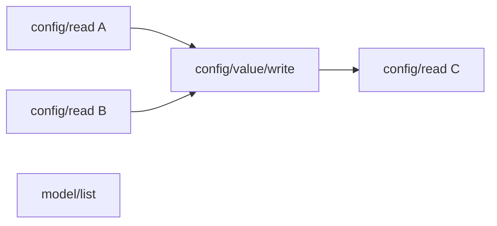

# 精读 08：Serialization scope——并发请求怎样按资源排队，又不锁住整个服务器

> 源码基线：`4ee41929eaf4`  
> 主文件：`codex-rs/app-server/src/request_serialization.rs`  
> 上游：`codex-rs/app-server-protocol/src/protocol/common.rs`  
> 接入点：`codex-rs/app-server/src/message_processor.rs`  
> 生命周期辅助：`codex-rs/app-server/src/connection_rpc_gate.rs`  
> 前置阅读：[精读 07：App-server JSON-RPC 分派](07-app-server-json-rpc-dispatch.md)

[官方 App Server 文档](https://learn.chatgpt.com/docs/app-server)说明了公开的 JSON-RPC/JSONL 传输、初始化和 thread/turn 生命周期；它没有把本篇的内部 serialization queue 当作客户端协议承诺。本篇关于 key、批次、公平性和断线 gate 的结论，均来自固定提交源码与测试。

## 1. 先说人话：为什么不能让所有请求随便同时执行

假设客户端几乎同时发送三条请求：

```text
A: config/read
B: config/value/write
C: config/read
```

如果三条都随便并发，可能出现：

```text
A 读到旧配置
B 正在更新配置文件、内存缓存和运行时状态
C 读到一半新、一半旧的中间状态
```

最粗暴的解决办法是给整个 App-server 加一把大锁：

```text
任何请求一次只能运行一条
```

这样虽然容易理解，却会让完全无关的工作互相等待：

```text
读取配置
阻塞另一个 thread 的 turn/start
阻塞第三个连接的 process/writeStdin
阻塞 model/list
```

当前源码采用更细的办法：

```text
先判断请求会碰哪个“逻辑资源”
-> 为资源生成 queue key
-> 只有同 key 的冲突请求排队
-> 不同 key 仍然并发
```

一句话心智模型：

> Serialization scope 不是“把服务器串行化”，而是给每个需要顺序保护的逻辑资源建立一条临时队列。

## 2. 三个贯穿案例

### 2.1 同一个配置资源

```text
config/read           -> key = Global("config"), SharedRead
config/value/write    -> key = Global("config"), Exclusive
config/read           -> key = Global("config"), SharedRead
```

执行批次是：

```text
[第一个 read]
-> [write]
-> [第二个 read]
```

第二个 read 不能因为“也是读”就越过已经排队的 write。

### 2.2 不同 thread

```text
turn/start(thread-A)      -> key = Thread("A")
thread/name/set(thread-B) -> key = Thread("B")
```

key 不同，因此两条请求可以并发。

### 2.3 同一个进程句柄、不同连接

```text
连接 1: process/writeStdin(handle="shell")
连接 2: process/writeStdin(handle="shell")
```

最终 key 还带 connection id：

```text
Process(connection=1, handle="shell")
Process(connection=2, handle="shell")
```

这两个字符串虽然相同，却代表不同客户端拥有的进程，不应互相阻塞。

## 3. 本篇要回答的核心问题

1. serialization 在这里为什么不是“转成 JSON”的序列化？
2. scope 怎样从 method 和 params 中计算出来？
3. `None`、`Global`、`Thread`、`Process` 分别表示什么？
4. 为什么有些 key 包含 connection id，有些不包含？
5. `Exclusive` 与 `SharedRead` 的行为差别是什么？
6. 相同 key 怎样保证 FIFO？
7. 不同 key 为什么可以并发？
8. 连续 SharedRead 怎样组成并发批次？
9. 后来的 read 为什么不能越过已经排队的 write？
10. 为什么每个 key 只启动一个 drain task？
11. 全局 `Mutex<HashMap<...>>` 为什么没有把 handler 全锁成串行？
12. `ConnectionRpcGate` 与 serialization queue 分别解决什么问题？
13. 客户端断线时，已运行和仍排队的请求怎样处理？
14. background work 为什么也要进入同一队列？
15. scope 保护的是整个 Turn，还是只保护 RPC handler？

## 4. 先消除词义歧义：这里的 serialization 是“排队执行”

软件里 serialization 常见两种含义：

```text
数据序列化：Rust object -> JSON bytes
执行串行化：让冲突操作按顺序执行
```

本篇的 `RequestSerializationQueues` 说的是第二种。

可以把它翻译为：

```text
请求顺序协调队列
```

它不负责 JSON 编码；JSON 编解码已在上一篇的 transport/protocol 层完成。

## 5. Scope 是“请求会影响哪个逻辑资源”

协议层定义：

```rust
pub enum ClientRequestSerializationScope {
    Global(&'static str),
    GlobalSharedRead(&'static str),
    Thread { thread_id: String },
    ThreadPath { path: PathBuf },
    CommandExecProcess { process_id: String },
    Process { process_handle: String },
    FuzzyFileSearchSession { session_id: String },
    FsWatch { watch_id: String },
    McpOauth { server_name: String },
}
```

这里的 scope 不是 Rust 变量作用域，而是“冲突域”。两条请求若落在相同冲突域，就需要协调顺序。

## 6. Scope 声明和 method 定义放在一起

上一篇看到 `client_request_definitions!` 同时声明 wire method、params、response。它还声明 serialization：

```rust
ConfigRead => "config/read" {
    params: v2::ConfigReadParams,
    serialization: global_shared_read("config"),
    response: v2::ConfigReadResponse,
},

ConfigValueWrite => "config/value/write" {
    params: v2::ConfigValueWriteParams,
    serialization: global("config"),
    response: v2::ConfigWriteResponse,
},
```

这样评审一个新 method 时，可以在同一处看到：

```text
它叫什么
输入是什么
返回什么
和哪些请求冲突
```

并发语义不是散落在 handler 内部的隐形约定。

## 7. `serialization_scope()` 是宏生成的穷举函数

宏为 `ClientRequest` 生成：

```rust
pub fn serialization_scope(&self) -> Option<ClientRequestSerializationScope> {
    match self {
        Self::ConfigRead { params, .. } => { ... }
        Self::ConfigValueWrite { params, .. } => { ... }
        Self::TurnStart { params, .. } => { ... }
        // 每个 variant 都有一条分支
    }
}
```

返回值含义：

```text
Some(scope) -> 进入按 key 管理的 serialization queue
None        -> 不经过这套资源队列，直接 spawn
```

`None` 不等于“这条请求天然线程安全”。它只表示：这条请求不由当前这套 scope queue 协调；安全性可能来自无共享状态、下层自己的锁、append-only 存储，或刻意需要并发取消旧工作。

## 8. Scope 表达式怎样从 params 取 key

`serialization_scope_expr!` 把声明式写法展开成数据：

```rust
serialization: thread_id(params.thread_id)
```

概念上变成：

```rust
Some(ClientRequestSerializationScope::Thread {
    thread_id: actual_params.thread_id.clone(),
})
```

所以 key 不是只由 method 决定，也可由请求参数决定：

```text
turn/start(thread-A) -> Thread("A")
turn/start(thread-B) -> Thread("B")
```

同一个 method 的不同实例可以落入不同队列。

## 9. `Global("config")`：名字叫全局，不等于锁住一切

`Global` 带一个静态字符串：

```text
Global("config")
Global("account-auth")
Global("environment")
Global("mcp-registry")
Global("remote-control")
Global("thread-sections")
```

这些是不同 key：

```text
config 写入
可以与 account auth 操作并发
可以与 environment 状态读取并发
```

“Global”只是说这个资源不按 thread/connection 再切分，而不是全 App-server 只有一条 Global 队列。

## 10. `Thread { thread_id }`：同 thread 排队，不同 thread 并发

大量 thread/turn 请求使用：

```rust
serialization: thread_id(params.thread_id)
```

例如：

- `thread/read`
- `thread/archive`
- `thread/name/set`
- `thread/rollback`
- `turn/start`
- `turn/steer`
- `turn/interrupt`
- `review/start`

若它们针对同一个 thread：

```text
Thread("abc")
```

就按到达顺序执行 handler。针对不同 thread 时有不同 drain task，可以并发。

这避免一条繁忙 thread 阻塞所有其他用户任务。

## 11. `ThreadPath`：还没有可靠 thread id 时用路径关联

`thread/resume` 和 `thread/fork` 支持根据 thread id 或 rollout path 找来源：

```rust
serialization: thread_or_path(params.thread_id, params.path)
```

规则是：

```text
thread_id 非空 -> Thread(thread_id)
否则 path 存在 -> ThreadPath(path)
否则 -> Thread(空字符串)
```

thread id 优先于 path。这样同一已知 thread 即使请求里同时带 path，也仍按 thread id 对齐。

当前 `request_serialization.rs` 直接把 `PathBuf` 放进 key，没有在该模块内 canonicalize。因此这里比较的是传入的路径表示；路径是否已规范化，需要继续查看上游合同，不能只凭这个队列假设。

## 12. Connection-scoped key：为什么进程和 watch 要带连接

协议 scope 中只有 process id/watch id；运行时 key 转换时补入 connection id：

```rust
CommandExecProcess {
    connection_id,
    process_id,
}

Process {
    connection_id,
    process_handle,
}

FsWatch {
    connection_id,
    watch_id,
}
```

原因是这些句柄由客户端提供或属于连接级资源。两个客户端都叫它 `proc-1`，不代表同一个进程。

相反，thread id、全局 config key 和 MCP server name 的含义跨连接共享，因此它们不附加 connection id。两个客户端同时修改同一 thread，仍必须进入同一个 thread 队列。

## 13. 所有 QueueKey 一览

| Queue key | 典型 method | 是否带 connection id | 保护的逻辑资源 |
|---|---|---:|---|
| `Global("config")` | config read/write、plugin install | 否 | 共享配置及相关刷新 |
| `Global("account-auth")` | account/read、login/logout | 否 | 认证与账号状态 |
| `Global("environment")` | environment add/info/status | 否 | 环境注册表 |
| `Global("thread-sections")` | section list/create/update | 否 | thread 分组/排序结构 |
| `Thread(id)` | turn/start、thread/read | 否 | 一条 Codex thread |
| `ThreadPath(path)` | path-based resume/fork | 否 | 一个历史 rollout 路径 |
| `CommandExecProcess` | command exec/write/terminate | 是 | sandboxed command 会话 |
| `Process` | process spawn/write/kill/resize | 是 | standalone process 会话 |
| `FuzzyFileSearchSession` | session start/update/stop | 否 | 一条模糊搜索会话 |
| `FsWatch` | fs/watch、fs/unwatch | 是 | 连接拥有的文件 watch |
| `McpOauth` | mcpServer/oauth/login | 否 | 某个 MCP server 的 OAuth 流程 |

## 14. Scope 还要转换成 key 与 access

协议层 scope 表达业务意图；App-server 内部把它转成：

```rust
(RequestSerializationQueueKey, RequestSerializationAccess)
```

`from_scope` 的核心规则是：

```text
GlobalSharedRead(name) -> Global(name) + SharedRead
其他 scope            -> 对应 key + Exclusive
```

`Global("config")` 与 `GlobalSharedRead("config")` 最终得到相同 key，只是 access 不同。正因为 key 相同，读和写才会在同一队列互相看见。

## 15. `Exclusive` 不应简单翻译为“写请求”

源码只有两种 access：

```rust
pub enum RequestSerializationAccess {
    Exclusive,
    SharedRead,
}
```

直觉上：

```text
Exclusive -> 当前批次只能有这一条
SharedRead -> 队首连续读可组成并发批次
```

但不要简单根据 method 名猜 access。比如：

- `thread/read` 使用 thread-scoped Exclusive；
- `configRequirements/read` 使用 config Exclusive；
- `mcpServerStatus/list` 使用 mcp-registry Exclusive；
- 只有显式声明 `global_shared_read(...)` 的请求才是 SharedRead。

这里的 Exclusive 表示“开发者声明它需要独占这个逻辑冲突域”，不一定说明它会写磁盘。

## 16. 为什么 SharedRead 当前只配合 Global scope

协议 enum 只有：

```rust
GlobalSharedRead(&'static str)
```

没有 `ThreadSharedRead`、`ProcessSharedRead` 等 variant。因此固定基线中，共享读优化主要用于 config、environment、remote control、thread sections 等全局资源。

这不是读写队列算法的理论限制，而是当前协议声明提供的 API 形状。若未来需要 thread-scoped shared read，应显式扩展 scope 模型，不能假装已有该能力。

## 17. 总接入点：每条 initialized request 都先包装成 future

`dispatch_initialized_client_request` 在完成初始化和 experimental 检查后：

```text
计算 serialization_scope
-> 捕获 request、processor、trace、client capability
-> 构造 QueuedInitializedRequest
-> 有 scope 则 enqueue
-> 无 scope 则 tokio::spawn(request.run())
```

简化代码：

```rust
let scope = codex_request.serialization_scope();
let request = QueuedInitializedRequest::new(rpc_gate, async move {
    handle_initialized_client_request(...).await;
});

if let Some(scope) = scope {
    let (key, access) = RequestSerializationQueueKey::from_scope(connection_id, scope);
    queues.enqueue(key, access, request).await;
} else {
    tokio::spawn(async move { request.run().await });
}
```

因此 scope 只改变“什么时候开始运行 handler”，不会改变 typed dispatch、response id 或 error 发送方式。

## 18. `QueuedInitializedRequest` 为什么同时包装 gate 和 future

结构是：

```rust
pub struct QueuedInitializedRequest {
    gate: Option<Arc<ConnectionRpcGate>>,
    future: BoxFutureUnit,
}
```

普通 client RPC 使用 `Some(gate)`；App-server 自己产生的 background work 使用 `None`。

运行时：

```rust
match gate {
    Some(gate) => gate.run(future).await,
    None => future.await,
}
```

一个 wrapper 同时提供两项能力：

```text
serialization queue 决定资源顺序
connection gate 决定断线后还允不允许启动
```

## 19. 为什么 future 要 Box + Pin

不同 request handler 的 async block 有不同匿名 Future 类型，不能直接混放进同一个 `VecDeque`。源码把它们擦除成：

```rust
Pin<Box<dyn Future<Output = ()> + Send + 'static>>
```

逐词理解：

- `dyn Future`：只保留“以后会完成”的统一接口；
- `Output = ()`：队列只关心完成时机，不直接收业务返回值；handler 内部自己发 response/error；
- `Send`：future 可在线程间调度；
- `'static`：future 不借用短命栈变量，能被 spawned task 持有；
- `Box`：放到堆上，得到统一大小；
- `Pin`：async future 在轮询期间不能随意移动其内部自引用状态。

这部分不必一次学会。对本篇主线，只需记住：“不同 handler 被包装成同一种可排队工作单元”。

## 20. 队列的真实数据结构

```rust
Arc<Mutex<HashMap<QueueKey, VecDeque<QueuedSerializedRequest>>>>
```

逐层展开：

```text
HashMap
  key = 逻辑资源
  value = 该资源的 FIFO 队列

VecDeque
  push_back = 新请求排到队尾
  pop_front = drain 从队首取请求

Mutex
  保护 map 和各队列结构的一致修改

Arc
  让 MessageProcessor、background callback 和 drain tasks 共享同一组队列
```

## 21. 全局 Mutex 为什么没有锁住整个 handler

关键在锁的持有范围。

`enqueue` 只在下面这段短操作中持锁：

```text
查找 key
-> push_back 或新建 VecDeque
-> 决定要不要启动 drain task
-> 释放锁
```

`drain` 也只在取下一批时持锁：

```text
pop_front
-> 可能再取连续 SharedRead
-> 释放锁
-> 真正 await handler
```

它没有写成：

```rust
let queues = mutex.lock().await;
handler.await; // 如果这样做，所有 key 都会被拖住
```

所以 map mutex 保护的是队列元数据，不保护整个业务执行时间。

## 22. `enqueue`：为什么新 key 才 spawn drain task

核心逻辑：

```rust
match queues.get_mut(&key) {
    Some(queue) => {
        queue.push_back(request);
        should_spawn = false;
    }
    None => {
        queues.insert(key.clone(), queue_with(request));
        should_spawn = true;
    }
}
```

含义是：

```text
map 中已有 key
-> 已有该 key 的 drain task 在负责它
-> 只追加，不再启动第二个 consumer

map 中没有 key
-> 当前请求创建这条队列
-> 同时启动唯一 drain task
```

如果同 key 同时存在两个 drain task，它们可能各自取一条 Exclusive 并并发运行，直接破坏串行保证。

## 23. “map 中有 key”为什么能代表 drain 仍活着

drain task 只有在队列为空时才执行：

```rust
queues.remove(&key);
return;
```

而检查空队列、删除 key 与 enqueue 查找/插入都在同一 Mutex 下完成，所以不会出现下面的空窗竞态：

```text
旧 drain 以为队列为空准备退出
新请求误以为旧 drain 还会处理它
结果请求永远留在无人消费的队列
```

可能的顺序只有：

```text
旧 drain 先持锁删除 key
-> 新 enqueue 看到 None，创建并 spawn 新 drain
```

或：

```text
新 enqueue 先持锁追加
-> 旧 drain 随后看到新请求，继续处理
```

## 24. Exclusive 怎样实现 FIFO

`drain` 每轮先：

```rust
let request = queue.pop_front();
```

若它是 Exclusive，这一批只有它自己：

```rust
let requests = vec![request];
join_all(requests.run()).await;
```

等它完成后，循环才再次 `pop_front`。

因此同 key 的三个 Exclusive：

```text
A 到达 -> 队首
B 到达 -> 队尾
C 到达 -> 更后
```

执行一定是：

```text
A 完成 -> B 完成 -> C 完成
```

注意 FIFO 依据的是成功 enqueue 的顺序，不是客户端本地创建 future 的时间，也不是网络发送意图的时间。

## 25. SharedRead 怎样组成批次

当队首是 SharedRead，drain 会继续观察队首：

```rust
while queue.front().is_some_and(|next| next.access == SharedRead) {
    requests.push(queue.pop_front());
}
```

然后：

```rust
join_all(requests.map(run)).await;
```

例如队列：

```text
R1, R2, R3, W1, R4
```

批次为：

```text
批次 1: R1 + R2 + R3 并发
批次 2: W1 独占
批次 3: R4
```

只有“队首连续”的 reads 合并，不会扫描整条队列把所有 read 抽出来。

## 26. `join_all` 在这里保证什么

`join_all` 同时轮询当前 read 批次中的 futures，并等待全部完成：

```text
R1 先结束
R2 后结束
R3 最后结束
-> 三个都结束以后才能开始 W1
```

它不保证 reads 的完成顺序等于到达顺序；每条 RPC 仍靠自己的 request id 回包。

队列关心的是：

```text
下一批什么时候可以安全开始
```

不是：

```text
客户端必须按什么次序收到 response
```

## 27. 为什么后来的 read 不能越过已排队的 write

假设：

```text
R1 已排队
W1 排在 R1 后
R2 后来才到
```

队列是：

```text
R1, W1, R2
```

第一批只能取 R1，因为下一个是 Exclusive。R1 完成后取 W1；R2 必须等 W1 完成。

如果实现把所有 read 都拉到前面：

```text
R1, R2, R3, R4, ...
W1 永远被新 read 推迟
```

这叫 writer starvation。当前“只合并连续队首 reads”的算法保留 FIFO 屏障：一旦 write 已排队，后来 read 不能插队。

## 28. 公平性保证到什么程度

固定实现能直接支持的结论是：

```text
同 key 按 enqueue 次序形成批次
已排队 Exclusive 不会被它后面的 SharedRead 越过
Exclusive 要等待它前面的整个 read 批次完成
```

不要进一步声称它保证实时 deadline、不同 key 之间的 CPU 公平，或每条请求有最大等待时间。这里没有优先级、deadline 或显式 per-key timeout。

## 29. 不同 key 为什么真正能并发

每个首次出现的 key 启动自己的 drain task：

```text
drain(Global("config"))
drain(Thread("A"))
drain(Thread("B"))
drain(Process(connection=7, "shell"))
```

这些 task 只在短暂操作共享 HashMap 时互斥，执行 handler 时互不持有 map lock。

测试 `different_keys_run_concurrently` 会故意让一个 key 永久等待，然后证明另一个 key 仍能开始。

## 30. 一个完整 config 时序例子

按顺序到达：

```text
1. config/read A      SharedRead
2. config/read B      SharedRead
3. config/value/write Exclusive
4. config/read C      SharedRead
5. model/list         None
```

执行关系：



解释：

- A 与 B 是同 key 的连续 SharedRead，可并发；
- write 必须等 A、B 都完成；
- C 排在 write 后，不能插队；
- model/list 没有 scope，由独立 spawned task 运行，不受 config 队列约束。

## 31. 同 thread handler 顺序例子

客户端快速发送：

```text
1. turn/start(thread=A)
2. turn/steer(thread=A)
3. turn/interrupt(thread=A)
4. turn/start(thread=B)
```

队列：

```text
Thread(A): start -> steer -> interrupt
Thread(B): start
```

Thread B 的 handler 可以和 Thread A 并发；A 内部三个 handler 按队列顺序开始。

## 32. 重要边界：队列没有锁住整个 Turn 生命周期

`QueuedInitializedRequest` 包装的是：

```rust
handle_initialized_client_request(...).await
```

所以 scope 保护的是 App-server 接收并处理这一条 RPC，直到 handler 返回或发送/委托响应。

`turn/start` handler 会把工作提交给 Core，并返回启动响应；模型采样、工具执行和后续事件仍可能继续很久。handler 返回后，Thread(A) 队列就可以开始下一条 RPC。

因此不要画成：

```text
turn/start 获得 Thread(A) 锁
-> 整个 Turn 十分钟运行完
-> turn/interrupt 才能开始
```

那样 `turn/interrupt` 将失去意义。

更准确的是：

```text
turn/start 的“接纳/提交 handler”完成
-> Core 中 Turn 继续运行
-> 队列开始 turn/steer 或 turn/interrupt handler
-> 它们向同一运行中 Turn 发送新的操作
```

## 33. `None` 为什么有时是刻意的并发语义

几个典型例子：

### 33.1 `thread/start`

新 thread 尚无现成 thread id 可作为冲突键，因此 scope 为 None；下层 ThreadManager 负责创建和注册。

### 33.2 `thread/turns/list` 与 `thread/items/list`

源码注释说它们主要读取 append-only rollout storage，显式允许并发，因此为 None。

### 33.3 legacy `fuzzyFileSearch`

源码注释说明新请求复用 cancellation token 来取消旧搜索，所以必须允许新请求在旧请求仍运行时进入；若按同 key 串行，新请求永远无法及时取消旧请求。

### 33.4 `command/exec` 没有 process id

`optional_command_process_id` 在参数没有 process id 时返回 None。没有可复用的客户端会话键，就不进入 process-specific queue。

这些例子说明 scope 是行为设计，不是机械地“所有有状态请求都排队”。

## 34. `ConnectionRpcGate` 解决的不是资源冲突

serialization queue 回答：

```text
同一个逻辑资源上的请求应该按什么顺序运行？
```

ConnectionRpcGate 回答：

```text
这个客户端连接已经断开后，排队中的 handler 还允许启动吗？
关闭连接时，哪些已启动 handler 需要等待收尾？
```

两者是正交机制：

| 机制 | key/作用域 | 主要目的 |
|---|---|---|
| Serialization queue | 逻辑资源 | 冲突顺序与读并发 |
| ConnectionRpcGate | 单个连接 | 断线后拒绝新 handler、追踪已启动 handler |

## 35. Gate 的三个状态动作

`ConnectionRpcGate` 内有：

```rust
accepting: Mutex<bool>
tasks: TaskTracker
```

### `run(future)`

```text
检查 accepting
-> 若 false，直接丢弃 future，不 poll
-> 若 true，先取得 TaskTracker token
-> 执行 future
-> 完成后 drop token
```

### `close()`

```text
accepting = false
tasks.close()
立即返回，不等待已启动任务
```

### `shutdown()`

```text
先 close
再等待所有已有 token 被释放
```

## 36. 为什么检查 accepting 与取得 token 必须放在同一锁内

`run` 中：

```rust
let token = {
    let accepting = self.accepting.lock().await;
    if !*accepting { return; }
    self.tasks.token()
};
```

`close` 也先拿同一个 mutex。

这避免：

```text
run 看到 accepting=true
-> close 宣布关闭并开始等待
-> run 才偷偷创建一个未被 shutdown 正确纳入边界的 token
```

持同一把短锁后，线性顺序只有两种：

```text
run 先取得 token -> shutdown 必须等它
close 先改 false   -> run 不启动
```

## 37. 断线时，正在运行和仍排队的请求不同

连接关闭主循环先调用：

```rust
session.rpc_gate.close().await;
```

随后 cleanup task 调用带 30 秒 timeout 的：

```rust
session.rpc_gate.shutdown().await;
```

结果：

```text
已经通过 gate 并取得 token 的 handler
-> 允许继续完成
-> shutdown 等待它，最多由外层 timeout 等 30 秒

仍在 serialization queue、尚未调用 gate.run 的 handler
-> 轮到它时看到 accepting=false
-> future 不被 poll，直接跳过
-> drain 继续处理后续队列项
```

这避免断开客户端积压的旧请求在未来突然产生新副作用。

## 38. 为什么跳过关闭连接的请求后仍要继续 drain

同一个全局 key 队列可能混合多个连接：

```text
连接 A 的 config write（A 已断开）
连接 B 的 config read（B 仍正常）
```

A 的 gate 拒绝它，不应让整条 `Global("config")` 队列停止。`run` 直接返回后，drain 进入下一轮，B 的请求仍可执行。

测试 `closed_gate_request_is_skipped_and_following_requests_continue` 专门验证这一点。

## 39. `shutdown` 为什么只等待已启动请求，不等待队列中所有请求

排队项尚未通过 gate，不属于 inflight。连接关闭后它们应被跳过，而不是执行完。

因此 TaskTracker token 在 handler body 开始前创建，并在 body 完成后释放：

```text
token 数量 = 已被允许启动、尚未完成的 connection RPC handler 数
```

如果把所有排队项都算作 inflight，shutdown 可能等待一长串本来应该丢弃的旧请求逐个出队。

## 40. Background work 为什么也进入同一资源队列

App-server 自己产生的后台工作也可能修改配置。例如远程 plugin materialize 后，需要信任新 hook 并写入配置。

`effective_plugins_changed_callback` 使用：

```rust
enqueue_background(
    RequestSerializationQueueKey::Global("config"),
    RequestSerializationAccess::Exclusive,
    async move { trust_materialized_plugin_hooks(...).await }
)
```

如果后台写绕过 queue：

```text
客户端 config/value/write
与后台 trusted_hash 写入
可能同时修改同一配置资源
```

进入同一 `Global("config")` 队列后，两种来源共享顺序合同。

## 41. Background request 为什么没有 ConnectionRpcGate

`QueuedInitializedRequest::new_background` 把 gate 设为 None。

这是因为后台工作属于 App-server 自身，而不是某条客户端连接。某个 WebSocket 断开，不应自动取消已经 materialize 的 plugin hook 信任更新。

它仍受 serialization queue 约束，但不受 connection lifecycle 约束：

```text
资源冲突域 = config
所有权生命周期 = App-server background work
```

## 42. Queue 的生命周期为什么是“按需出现、空时删除”

首次看到 key：

```text
创建 VecDeque
插入首请求
spawn drain
```

队列变空：

```text
从 HashMap 删除 key
drain task 退出
```

好处是不会永久为每个历史 thread/process/watch 保留一个队列对象和 task。

如果曾经访问过十万个 thread，但当前没有待处理请求，map 不需要保留十万个空 entry。

## 43. 容量边界：这张 per-key 队列没有显式 hard cap

固定提交中的 `VecDeque` 没有在 `enqueue` 处检查长度，也没有 per-key timeout 或 priority。

这并不等于整个输入系统完全无界：transport 前面有有界 channel 和过载处理。但一旦消息进入 processor 并被快速 enqueue，某个慢 key 仍可能积累队列项。

阅读这类系统时，应分别问：

```text
transport queue 是否有界？
serialization queue 是否有界？
handler 内部队列是否有界？
每层过载行为是什么？
```

不要因为看到一层有界，就推断所有下游队列都有相同容量保护。

## 44. 错误在哪里返回

queue 本身不改变 handler 的错误合同。包装的 async block 会：

```rust
let result = handle_initialized_client_request(...).await;
if let Err(error) = result {
    outgoing.send_error(error_request_id, error).await;
}
```

业务 handler 内部也会把 `Ok(Some(response))`、`Ok(None)`、`Err(error)` 转成适当回包。

queue 只决定什么时候 poll 这段 future。若 gate 因断线跳过 future，则不会再尝试向已断开的客户端回 error。

### 44.1 普通 Error 与 panic 不是同一条路径

上述错误合同处理的是 `Result::Err`。若 handler 直接 panic，`drain` 外层没有 `catch_unwind`；panic 会使承载该 drain 的 spawned task 异常结束。

根据当前数据结构可进一步推论：panic 发生时，该 key 很可能仍留在 HashMap 中；后来 enqueue 会看到“key 已存在”而不再 spawn 新 drain，因此这条 key 可能失去 consumer。源码没有在本模块提供 panic 后自动移除 key 的 guard，也没有相应测试。

这不是正常业务错误应走的路径，更不能据此说所有 panic 一定以同一种方式表现；Tokio runtime、进程级 panic 策略和上层退出也会影响最终现象。这里能确定的工程原则是：handler 应把可预期失败转成 `Result::Err`，不能用 panic 代替错误返回。

## 45. Tracing span 为什么跟着请求进入队列

请求在 enqueue 前用：

```rust
future.instrument(span)
```

drain task 本身也有：

```rust
debug_span!("app_server.serialized_request_queue", ?key)
```

于是观察 trace 时可区分：

```text
请求自己的 RPC span
资源队列 drain 的 key span
```

等待时间与 handler 执行时间在概念上不同。性能分析时，长延迟可能是：

```text
排队很久，但 handler 很快
```

而不是 handler 本身慢。

## 46. 五种典型排队错误

### 46.1 key 太粗

把所有 thread 都映射成 `Global("thread")`：无关 thread 互相阻塞，吞吐下降。

### 46.2 key 太细

把同一全局 config 按 connection id 切开：两个客户端可同时写同一配置，破坏一致性。

### 46.3 把会修改状态的 request 标成 SharedRead

多个写操作被同批并发执行，可能丢更新。

### 46.4 把需要抢先取消的 request 串行化

新取消请求必须等旧长任务结束，取消机制失效。

### 46.5 handler 持有队列槽位等待整个长生命周期

如果 handler 等完整 Turn 结束才返回，同 thread 的 interrupt/steer 会被堵死。

## 47. 新增 method 时怎样选择 scope

依次问：

1. 它会读写哪个逻辑资源？
2. 资源身份能否从 params 稳定提取？
3. 这个身份是跨连接共享，还是连接局部？
4. 它与哪些现有 method 必须互斥？
5. 多个同 key 操作是否可安全并发读取？
6. 是否需要新请求并发进入来取消旧请求？
7. handler 什么时候返回；是否错误地等待整个后台生命周期？
8. App-server background work 是否也会触碰同一资源？

选择 scope 的依据是状态所有权和冲突关系，不是 method 名看起来像 read 还是 write。

## 48. 测试一：相同 key 的 Exclusive 保持 FIFO

`same_key_requests_run_fifo`：

```text
向 Global("test") 依次 enqueue 1、2、3
每条都是 Exclusive
读取执行记录
断言 [1, 2, 3]
```

它直接证明同 key 的基本顺序合同。

但它没有证明真实 config handler 的业务正确性；那需要对应 processor/API 测试。

## 49. 测试二：不同 key 并发

`different_keys_run_concurrently`：

```text
Global("blocked") 的请求一直等 oneshot
Global("other") 的请求发出“我已运行”信号
测试确认 other 不被 blocked 卡住
```

这证明实现不是单一全局串行 worker。

## 50. 测试三：关闭 gate 后跳过旧请求

`closed_gate_request_is_skipped_and_following_requests_continue` 构造：

```text
1. live connection request
2. closed gate request
3. live connection request
```

期望执行记录：

```text
[1, 3]
```

第二条没有 poll，但没有毒死后续队列。

`shutdown_of_live_gate_skips_already_queued_requests` 进一步证明：第一条已开始时调用 shutdown，会等待第一条；同 gate 第二条尚未开始，所以被跳过。

## 51. 测试四：SharedRead 批次并发

`same_key_shared_reads_run_concurrently` 先用 Exclusive blocker 把请求稳定排好：

```text
blocker, R1, R2
```

释放 blocker 后，测试在不释放 R1/R2 的情况下观察到两者都已开始。这证明它们不是一个读完才开始另一个。

使用 blocker 的目的不是业务需求，而是消除测试调度不确定性，确保 R1、R2 在 drain 取批次前都已入队。

## 52. 测试五：写必须等整个读批次

`exclusive_write_waits_for_running_shared_reads` 排列：

```text
blocker, R1, R2, W1
```

释放 blocker 后：

- R1/R2 都开始；
- W1 暂时不能开始；
- 释放两个 read 后，W1 才开始。

这证明 `join_all` 等的是整个 SharedRead batch。

## 53. 测试六：后来的 read 不能让 writer 饥饿

`later_shared_reads_do_not_jump_ahead_of_queued_write` 排列：

```text
blocker, R1, W1, R2
```

观察顺序：

```text
R1 开始
W1 等待
R2 也等待
R1 完成
W1 开始
R2 继续等待
W1 完成
R2 开始
```

这是本篇最关键的公平性证据。

## 54. 协议测试证明 scope 映射，不证明运行顺序

`protocol/common.rs` 的 `client_request_serialization_scope_covers_keyed_families` 会构造 typed requests 并断言：

```text
PluginInstall -> Global("config")
SkillsList -> GlobalSharedRead("config")
CommandExec(process_id="proc-1") -> CommandExecProcess("proc-1")
FsWatch(watch_id="watch-1") -> FsWatch("watch-1")
McpOauth(name="server-a") -> McpOauth("server-a")
```

另一组测试覆盖代表性的 `None`：

```text
Initialize
ThreadStart
无 process id 的 command/exec
fs/readFile
thread/turns/list
```

这些测试证明“分类是否正确”，队列运行行为则由 `request_serialization.rs` 测试证明。不要把两类证据混在一起。

## 55. 一段等价白话代码

```text
收到 typed request:
    scope = request.serialization_scope()
    work = 包装(handler future + connection gate)

    if scope is None:
        单独启动 work
        return

    (key, access) = scope 转换结果

    锁住队列表（只锁很短时间）:
        如果 key 已存在:
            把 work 放到队尾
        否则:
            创建 key 对应的队列
            把 work 放入
            标记需要启动唯一 drain
    释放队列表锁

    如果需要:
        启动 drain(key)

drain(key):
    循环:
        锁住队列表:
            从队首取一条
            如果没有:
                删除 key
                退出
            如果队首是 SharedRead:
                一并取走后续连续 SharedRead
        释放队列表锁

        并发运行本批所有 work，并等待全批完成
```

## 56. 常见误解纠正

### 误解一：serialization scope 就是 Rust lifetime scope

不是。这里描述请求冲突资源。

### 误解二：Global 表示所有全局请求互斥

不是。`Global("config")` 与 `Global("account-auth")` 是不同 key。

### 误解三：SharedRead 使用了 Tokio RwLock

不是。它是显式 FIFO `VecDeque` 加连续 read batch。

### 误解四：Exclusive 一定会修改数据

不是。它表示独占冲突域，某些 read 也被声明为 Exclusive。

### 误解五：Thread scope 锁住整个 Turn

不是。只协调 App-server RPC handler future；Core 长任务可在响应后继续。

### 误解六：无 scope 就没有并发风险

不是。它只是不使用这套队列，可能依赖其他机制或刻意允许并发。

### 误解七：断线会立即取消已经开始的 handler

不是。gate 阻止尚未开始的 handler；已取得 token 的 handler 允许收尾，shutdown 会等待它。

## 57. 哪些是源码事实，哪些是推论

### 源码直接事实

- scope 在 ClientRequest 定义旁声明并由宏生成；
- queue key 有 Global、Thread、Path、Process、Watch、OAuth 等形状；
- command/process/watch key 在运行时加入 connection id；
- 相同 key 使用 `VecDeque`；
- 新 key 只 spawn 一个 drain；
- Exclusive 单独一批；
- 队首连续 SharedRead 用 `join_all` 同批运行；
- 后来 read 不跨越队中的 write；
- queue map lock 在 handler await 前释放；
- gate close 后不 poll 新 future；
- background config work 使用同一队列且没有 connection gate；
- per-key `VecDeque` 在该模块没有显式容量上限。

### 教学推论

- 把 scope 称为“冲突域”；
- 把每个 key 比作“一条临时车道”；
- “scope 保护 handler 接纳顺序，而不是整个 Turn”是根据包装 future 的边界与 turn handler 行为作出的综合解释。
- “handler panic 可能使该 key 留在 map 中却失去 drain consumer”是根据没有 `catch_unwind`/清理 guard、key 只在正常空队列分支删除而得出的失败边界推论。

## 58. 动手练习

### 练习一：手算批次

同 key 队列：

```text
R1, R2, W1, R3, R4, W2
```

答案：

```text
[R1 + R2] -> [W1] -> [R3 + R4] -> [W2]
```

### 练习二：手算 key

```text
连接 4 的 process/writeStdin(handle="x")
连接 5 的 process/kill(handle="x")
```

它们是否互斥？

答案：不由同一 serialization key 互斥，因为 connection id 不同。

### 练习三：分析一个新 API

假设新增：

```text
thread/export(threadId)
```

列出选择 `Thread(threadId)`、`None` 或未来 `ThreadSharedRead` 时分别需要确认的状态事实。不要只凭“export 看起来是读”下结论。

### 练习四：解释取消死锁

说明为什么某些“新请求取消旧请求”的 API 不能把旧请求完整生命周期串行化在同一 key 上。

### 练习五：寻找背景写入

从 `effective_plugins_changed_callback` 追踪到 `enqueue_background`，解释为什么它使用 `Global("config") + Exclusive`。

## 59. 理解检查

1. 数据 serialization 与 request serialization 有何区别？
2. 为什么 `GlobalSharedRead("config")` 与 `Global("config")` 能相互协调？
3. 为什么不同 thread 不共享同一 drain？
4. map mutex 在什么时候释放？
5. 为什么连续 read 合批，而不是把整条队列所有 read 合批？
6. `join_all` 完成前，下一批能否开始？
7. connection gate 如何区分已启动和未启动 handler？
8. background work 为什么没有 gate 却仍有 scope？
9. `turn/start` 的 thread scope 为什么不会阻止后续 interrupt？
10. scope 为 None 能否证明没有共享状态？

## 60. 本篇局部术语表

| 名词 / 代码词 | 字面意思 | 本篇中的具体含义 |
|---|---|---|
| serialization | 串行化 / 序列化 | 本篇指安排冲突请求顺序执行，不是 JSON 编码 |
| scope | 范围 | 请求会触碰的逻辑冲突资源 |
| conflict domain | 冲突域 | 必须共享顺序合同的一组操作和资源 |
| queue key | 队列键 | 标识 config、thread、process 等具体逻辑资源 |
| access | 访问模式 | `Exclusive` 或 `SharedRead` |
| Exclusive | 独占 | 当前批次只能运行这一条 request handler |
| SharedRead | 共享读 | 队首连续 shared reads 可以同批并发 |
| FIFO | 先进先出 | 先 enqueue 的请求或批次先执行 |
| batch | 批次 | drain 一轮一起运行并等待完成的一组请求 |
| writer starvation | 写者饥饿 | write 一直被后来 read 越过而无法执行 |
| `HashMap` | 哈希映射 | queue key 到该资源 `VecDeque` 的索引 |
| `VecDeque` | 双端队列 | 从尾部 enqueue、从头部 drain 的 FIFO 容器 |
| drain | 排空 / 消费 | 循环从一个 key 的队列取批次并运行 |
| drain task | 排队执行任务 | 每个活跃 key 唯一的异步 consumer |
| `should_spawn` | 是否应启动 | 当前 enqueue 是否创建了全新的 key 队列 |
| queue metadata | 队列元数据 | map entry、队列元素和 access，不含 handler 的业务状态 |
| `Mutex` | 互斥锁 | 短暂保护共享 queue map 的结构更新 |
| lock scope | 持锁范围 | 从获得锁到 guard 释放的代码区间 |
| `join_all` | 全部汇合 | 并发轮询同批 futures，并等待它们全部完成 |
| future | 未来值 / 异步工作 | 可被 poll，完成后产生输出的异步计算 |
| poll | 轮询 | async runtime 推进 future 状态机一步 |
| `BoxFutureUnit` | 装箱的无返回 future | 把不同 handler async 类型统一为可入队工作单元 |
| type erasure | 类型擦除 | 隐藏每个具体 future 的匿名类型，只保留共同接口 |
| `Pin` | 固定位置 | 保证 future 被 poll 后不发生不安全移动 |
| `Send` | 可跨线程发送 | async runtime 可把 future 调度到其他 worker thread |
| `'static` | 不借用短命数据 | spawned/queued future 可独立于创建栈帧存在 |
| connection-scoped | 连接作用域 | 同字符串句柄在不同客户端连接中代表不同资源 |
| `ConnectionRpcGate` | 连接 RPC 门 | 断线后拒绝未启动 handler，并追踪已启动 handler |
| accepting | 是否接纳 | gate 是否还允许新的 handler body 开始 |
| `TaskTracker` | 任务追踪器 | 用 token 计数已通过 gate 且尚未完成的 handlers |
| inflight | 执行中 | 已取得 gate token、尚未完成的请求 |
| `close` | 停止接纳 | gate 拒绝后来的 runs，但不等待已有工作 |
| `shutdown` | 关闭并排空 | close 后等待所有 inflight token 释放 |
| background work | 后台工作 | App-server 自己发起、无客户端连接所有者的异步操作 |
| queue capacity | 队列容量 | 可积压元素数；本模块 per-key VecDeque 无显式 hard cap |
| linearization point | 线性化点 | 并发操作可视为原子生效的瞬间，本篇是锁内插入/删除等操作 |

## 61. 源码导航

| 想继续追什么 | 固定提交文件 | 重点符号 |
|---|---|---|
| scope enum | `codex-rs/app-server-protocol/src/protocol/common.rs` | `ClientRequestSerializationScope` 119—130 |
| scope 表达式宏 | 同上 | `serialization_scope_expr!` 132—197 |
| method 与 scope 声明 | 同上 | `client_request_definitions!` 调用 474—1259 |
| scope getter | 同上 | 宏生成的 `ClientRequest::serialization_scope` 247—258 |
| scope 分类测试 | 同上 | `client_request_serialization_scope_*` 2010 起 |
| queue key/access | `codex-rs/app-server/src/request_serialization.rs` | `RequestSerializationQueueKey/Access` 18—51 |
| scope 到运行时 key | 同上 | `from_scope` 53—104 |
| 可排队 future wrapper | 同上 | `QueuedInitializedRequest` 106—136 |
| queue 数据结构 | 同上 | `RequestSerializationQueues` 143—146 |
| background enqueue | 同上 | `enqueue_background` 148—162 |
| 普通 enqueue | 同上 | `enqueue` 164—192 |
| drain 与 read batch | 同上 | `drain` 194—226 |
| FIFO 与不同 key 测试 | 同上 | `same_key_requests_run_fifo`、`different_keys_run_concurrently` |
| gate/queue 联动测试 | 同上 | `closed_gate_request...`、`shutdown_of_live_gate...` |
| SharedRead 公平测试 | 同上 | `same_key_shared_reads...`、`exclusive_write_waits...`、`later_shared_reads...` |
| request 接入 queue | `codex-rs/app-server/src/message_processor.rs` | `dispatch_initialized_client_request` 819—882 |
| connection gate | `codex-rs/app-server/src/connection_rpc_gate.rs` | `run`、`close`、`shutdown` |
| 断线先 close | `codex-rs/app-server/src/lib.rs` | ConnectionClosed 分支 998—1013 |
| 断线 drain timeout | `codex-rs/app-server/src/message_processor.rs` | `connection_closed` 727—754 |
| background config 写 | `codex-rs/app-server/src/effective_plugin_change.rs` | `effective_plugins_changed_callback` 23—69 |

下一篇将精读 Rollout resume：恢复一条 thread 时，系统怎样读取耐久历史、重建上下文和运行状态，而不是简单把 UI 文本复制回模型。

返回[源码精读目录](README.md)或[课程总目录](../README.md)。
