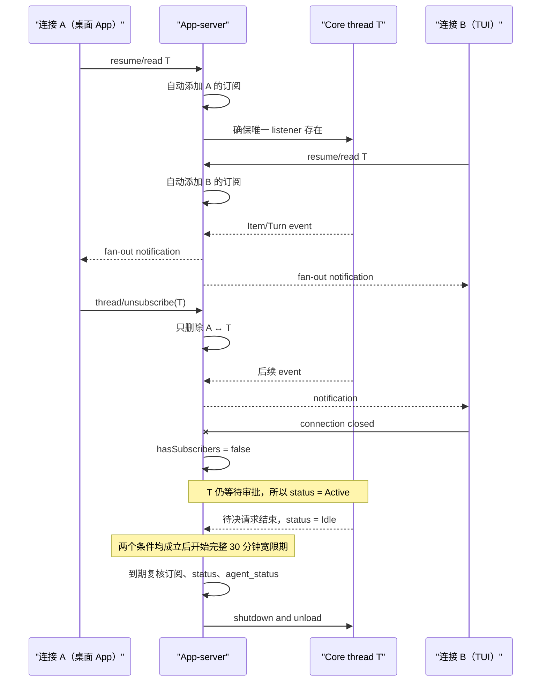

# 源码精读 20：Thread watch、订阅与多客户端路由

> 源码基线：`4ee41929eaf4`。本文讨论的是这个固定提交中的实现；以后源码变化时，请优先搜索符号名，不要依赖行号。

这一篇解决一个看似简单、实际很容易混乱的问题：

> 如果桌面 App、TUI 或另一个客户端同时打开同一条 thread，服务器怎么知道事件该发给谁？一个客户端断开后，为什么不会误伤另一个客户端？没人再看时，thread 又在什么时候真正退出内存？

先给结论：Codex 把这件事拆成了三套不同机制。

| 机制 | 它回答的问题 | 主要 owner |
|---|---|---|
| connection subscription | 哪些连接应该收到这条 thread 的通知？ | `ThreadStateManager` |
| thread status watch | thread 是运行中、等待审批、空闲，还是系统错误？ | `ThreadWatchManager` |
| file watch registration | 技能、配置等文件变化时，谁负责监听？ | 文件监听服务与 `WatchRegistration` |

它们都出现了 `watch`、listener、subscriber 一类词，但不是一回事。本文主要研究前两套，第三套只用于消除歧义。

---

## 1. 先用“直播间”建立直觉

把一条 thread 想成一个直播间：

- Core 中的 `CodexThread` 是正在工作的主播；
- App-server 的 listener 是唯一一台转播设备；
- connection 是打开了这个直播间的浏览器窗口；
- subscription 是观众名单；
- thread status 是门口的状态灯；
- 自动卸载是长期无人观看且主播已停止工作后关闭直播间。

这个类比最重要的地方是：

> “有没有观众”和“主播有没有工作”是两个独立问题。

可能出现四种组合：

| 有订阅者 | thread 活跃 | 应怎样处理 |
|---|---|---|
| 是 | 是 | 继续运行并把事件发给订阅者 |
| 是 | 否 | 保留空闲 thread，等待客户端下一条请求 |
| 否 | 是 | 不能卸载；任务可能仍在运行或等用户批准 |
| 否 | 否 | 开始计算延迟卸载时间 |

如果只维护一个 `is_active` 布尔值，就无法表达这四种情况。

---

## 2. 贯穿全文的双客户端案例

假设有两个连接：

- 连接 A：桌面 App；
- 连接 B：TUI；
- 两者都观察 thread T；
- T 当前正在执行一个需要审批的命令。

我们会依次追踪：

1. A 附着到 T；
2. B 也附着到 T；
3. T 产生事件，A、B 都收到；
4. A 取消订阅，B 仍继续收到；
5. B 断线，T 暂时无人订阅；
6. T 仍等待审批，所以不能卸载；
7. 待决请求结束，T 变为空闲；
8. 无订阅且非活跃持续 30 分钟后，App-server 才卸载 T。

先记住一句最短版：

> 订阅决定“发给谁”，状态决定“能不能卸载”。

---

## 3. 第一张地图：数据放在哪里

主要源码位于：

- `codex-rs/app-server/src/thread_state.rs`
- `codex-rs/app-server/src/thread_status.rs`
- `codex-rs/app-server/src/request_processors/thread_lifecycle.rs`
- `codex-rs/app-server/src/request_processors/thread_processor.rs`

`ThreadStateManagerInner` 保存三组关键数据：

```rust
struct ThreadStateManagerInner {
    live_connections: HashMap<ConnectionId, ConnectionCapabilities>,
    threads: HashMap<ThreadId, ThreadEntry>,
    thread_ids_by_connection: HashMap<ConnectionId, HashSet<ThreadId>>,
}
```

初学者可以把字段名拆开读：

- `live_connections`：目前仍然存活并已初始化的连接；
- `threads`：按 thread ID 找到 App-server 的 thread 条目；
- `thread_ids_by_connection`：反过来按连接找它订阅了哪些 thread。

这里故意保存正向、反向两份索引。

---

## 4. 为什么需要双向索引

如果只保存 `thread -> connections`：

- 广播事件很快；
- 但连接 A 突然断线时，不知道它订阅了哪些 thread；
- 只能扫描所有 thread，再逐个删除 A。

如果只保存 `connection -> threads`：

- 断线清理很快；
- 但 T 来了一个事件时，不知道要发给哪些连接；
- 只能扫描全部连接。

因此源码同时维护：

```text
threads[T].connection_ids = {A, B}
thread_ids_by_connection[A] = {T}
thread_ids_by_connection[B] = {T}
```

这带来一个不变量：

> 任意一条订阅关系，都必须同时出现在两个方向；删除时也必须同时删除。

---

## 5. `ThreadEntry` 不只是订阅集合

每个 thread 对应一个 `ThreadEntry`：

```rust
struct ThreadEntry {
    state: Arc<Mutex<ThreadState>>,
    connection_ids: HashSet<ConnectionId>,
    has_connections_watcher: watch::Sender<bool>,
}
```

三部分分别表示：

- `state`：listener、当前 Turn 摘要等 per-thread 状态；
- `connection_ids`：当前订阅者集合；
- `has_connections_watcher`：只广播“是否至少有一个连接”的变化。

注意最后一个 watcher 不广播完整连接名单。自动卸载只关心零个还是非零个订阅者，不需要知道 A、B 的身份。

---

## 6. Tokio `watch` 是“最新值”，不是事件队列

`tokio::sync::watch` 可以理解成一个可被多人观察的“最新状态槽”。

它与消息队列不同：

- 队列重视每条消息；
- watch 重视当前最新值；
- 值从 `false -> true -> false`，观察者可能依次醒来；
- 但它不用于保存完整历史。

`has_connections_watcher` 的值只有：

```text
true  = 至少一个订阅连接
false = 当前没有订阅连接
```

它适合驱动卸载判断，却不适合事件 fan-out。真正 fan-out 仍读取 `connection_ids`。

---

## 7. 连接先要成为 live connection

连接建立订阅前，先经过初始化并登记到 `live_connections`。

这样 `try_ensure_connection_subscribed` 可以先问：

> 这个 connection ID 现在仍然有效吗？

如果连接已经关闭，函数拒绝重新插入它。这个检查处理一种竞态：

1. 某个请求开始处理；
2. 网络连接关闭，清理逻辑删除 connection；
3. 请求稍晚才执行“自动订阅”；
4. 如果不检查 live 状态，就会把幽灵连接重新放回订阅表。

相关测试明确覆盖了“closed connection cannot be reintroduced”。

---

## 8. 固定提交里没有公开的 `thread/subscribe`

这是本文最容易产生错误预期的地方。

固定提交的 v2 API 有：

```text
thread/unsubscribe
```

但没有与它对称的公开：

```text
thread/subscribe
```

订阅通常在 start、resume、read 或 attach listener 等流程里自动完成。也就是说，客户端不是先单独订阅，再操作 thread；它在需要观察 thread 的请求中被附着上去。

因此这里的 `try_ensure_connection_subscribed` 是内部动作，不是同名公开 RPC。

---

## 9. 自动订阅函数做了什么

`try_ensure_connection_subscribed(thread_id, connection_id, raw_events_enabled)` 的逻辑可以简化成：

```text
确认 connection 仍然 live
找到或创建 ThreadEntry
把 connection 加进 entry.connection_ids
把 thread 加进 thread_ids_by_connection[connection]
更新 has_connections_watcher
按需要打开 thread 的 raw event 行为
返回共享 ThreadState
```

其中最重要的是两个集合必须一起更新。

`ensure` 在函数名中表示“保证处于某种状态”：已存在时不重复添加，不存在时补上。

---

## 10. A、B 依次附着后的状态

A 附着后：

```text
threads[T].connection_ids = {A}
thread_ids_by_connection[A] = {T}
has_connections(T) = true
```

B 附着后：

```text
threads[T].connection_ids = {A, B}
thread_ids_by_connection[A] = {T}
thread_ids_by_connection[B] = {T}
has_connections(T) = true
```

第二次附着不会让 boolean watcher 再从 true 变成 true 后制造有意义的状态变化。卸载器只需知道“仍有人”。

---

## 11. 两个客户端不是两个 Core thread

A、B 订阅 T，并不会创建两个 `CodexThread`，也不会启动两个独立 listener。

结构更接近：

```text
                    ┌─ connection A
Core CodexThread T ─ listener ─┤
                    └─ connection B
```

一个 per-thread listener 消费 Core 事件，再查当前订阅者集合进行广播。

这样避免：

- 每个客户端重复消费 Core 事件；
- 同一事件被重复投影；
- 多套 listener 各自维护不一致的 Turn 摘要。

---

## 12. `ensure_conversation_listener` 的第一重防竞态

`ensure_conversation_listener` 在建立订阅时，还要与卸载流程协调。

它持有 `pending_thread_unloads` 的锁，然后：

1. 检查 thread 是否已经进入 closing/unloading；
2. 调用 `try_ensure_connection_subscribed`；
3. 再保证 listener 正在运行。

这个锁像一个围栏：

- attach 一旦跨过围栏，卸载不能同时抢走 thread；
- unload 一旦预订成功，新的 attach 会得到“正在关闭”的结果。

否则可能发生：新连接刚订阅，另一边却按旧的“无人订阅”判断把 thread 删除。

---

## 13. listener 启动失败要回滚订阅

订阅成功不代表 listener 一定启动成功。

如果 `ensure_listener_task_running` 返回错误，代码会调用 `unsubscribe_connection_from_thread` 回滚刚建立的关系。

这体现一个常见事务式结构：

```text
先修改内存关系
尝试建立依赖资源
依赖失败 -> 撤销前一步
```

否则客户端会显示为“已订阅”，但没有 listener 为它转发事件。

---

## 14. `listener_matches`：同 ID 不一定是同实例

`ThreadState` 保存一个指向当前 Core `CodexThread` 的 `Weak` 引用。

`listener_matches` 会 upgrade 这个弱引用，再用 `Arc::ptr_eq` 判断是否真的是同一个共享实例。

为什么不能只比较 Thread ID？

因为 T 可能被卸载、恢复或替换；新旧 Core 对象可以有相同逻辑 ID，却不是同一个事件源。旧 listener 不能继续假装自己服务于新对象。

---

## 15. listener generation 是什么

每次 `set_listener` 都会：

- 取消旧 listener；
- 增加 `listener_generation`；
- 安装新的命令 channel；
- 返回新 generation。

可以把 generation 想成门锁换锁后的编号：

```text
旧 listener = generation 4
新 listener = generation 5
```

旧任务稍后退出时，只有发现当前仍是 generation 4，才允许清理共享 listener 状态。现在已经是 5，它就不能动。

这叫 generation fencing，中文可理解为“世代围栏”。

---

## 16. 为什么旧 listener 的清理也危险

异步任务被取消，不等于它在同一瞬间消失。

可能发生：

1. listener 4 收到取消；
2. listener 5 已安装；
3. listener 4 才运行退出清理；
4. 如果它无条件 `clear_listener`，会把 listener 5 的状态一起清掉。

因此退出处检查：

```text
current listener_generation == my generation ?
```

只有相等才清理。这是异步资源替换中非常通用的写法。

---

## 17. listener 主循环监听四类来源

listener loop 使用 biased `select`，大体监听：

1. listener cancel；
2. App-server 内部 listener command；
3. Core 的下一条 event；
4. 自动卸载 watcher。

`biased` 表示多个分支同时 ready 时，按写出的优先次序选择。这里取消和内部协调消息排在普通事件及卸载检查前面。

第 19 篇讲过 listener command 用来把 resume snapshot 等动作和 event 消费放到同一串行 owner 中。本文只关注它还负责卸载与订阅路由。

---

## 18. 事件真正怎样 fan-out

Core T 产生一个事件时，listener 不使用启动时拍下的订阅者快照，而是读取当前：

```rust
subscribed_connection_ids(thread_id)
```

然后构造 thread-scoped sender，把通知发给这些 connection ID。

这样 A 取消订阅后，后续事件的集合自然只剩 B。

“当前集合”很重要，因为 listener 的寿命通常比任何单个连接更长。

---

## 19. 广播与单一处理者不是同一问题

普通 thread notification 可以 fan-out 给 A、B。

但某些操作只能选一个客户端响应，例如需要某种 capability 的 attestation 请求。源码会：

- 只在 T 的订阅者里筛选；
- 再检查 live connection capability；
- 用最小 `ConnectionId` 做确定性选择。

这说明多客户端协议需要区分：

| 类型 | 路由方式 |
|---|---|
| 状态/事件通知 | 广播给全部订阅者 |
| 必须唯一回答的请求 | 按能力和稳定规则选一个连接 |

不能把所有“发给客户端”的行为都理解成广播。

---

## 20. capability 为什么属于 connection

`ConnectionCapabilities` 跟随 live connection，而不是 thread。

原因是能力描述的是客户端：

- A 版本可能支持某实验请求；
- B 版本可能不支持；
- 两者却可以同时订阅 T。

路由时必须求交集：

```text
T 的订阅者 ∩ 当前 live connections ∩ 支持所需 capability 的连接
```

这比在 thread 上保存一个笼统的 `supports_x = true` 更准确。

---

## 21. 显式 `thread/unsubscribe`

协议类型位于 `app-server-protocol/src/protocol/v2/thread.rs`。

请求只带 thread ID；调用者身份来自当前 JSON-RPC connection，而不是让客户端任意填写另一个 connection ID。

响应状态有三种：

| 状态 | 含义 |
|---|---|
| `notLoaded` | Core 中已经没有这条 thread |
| `notSubscribed` | thread 存在，但当前连接本来就没订阅 |
| `unsubscribed` | 成功删除当前连接的订阅 |

这个细分让重复取消订阅保持幂等、可解释。

---

## 22. A 取消订阅时改了什么

`unsubscribe_connection_from_thread(T, A)` 同时删除：

```text
threads[T].connection_ids 中的 A
thread_ids_by_connection[A] 中的 T
```

然后更新 `has_connections_watcher`。

结果为：

```text
threads[T].connection_ids = {B}
thread_ids_by_connection[B] = {T}
has_connections(T) = true
```

listener 没有被取消，Core thread 也没有 shutdown。B 继续正常收事件。

---

## 23. unsubscribe 为什么不立即卸载

因为它只表达：

> 当前 connection 不再希望收到这条 thread 的通知。

它没有表达：

> 用户要求终止当前工作并销毁 thread。

若 A 取消订阅时 T 正在执行命令，立即卸载会把“停止观察”错误解释成“停止任务”。因此 unsubscribe 只改变路由关系；生命周期交给后面的延迟卸载判断。

---

## 24. 断线与显式 unsubscribe 的区别

显式 unsubscribe 知道一个明确的 `(T, A)`。

连接 A 断线时，A 可能订阅了 T1、T2、T3。`remove_connection(A)` 使用反向索引一次找全：

```text
thread_ids_by_connection[A] = {T1, T2, T3}
```

然后从每个 `ThreadEntry.connection_ids` 中移除 A，并更新各自 watcher。

函数返回“移除 A 后已经没有任何订阅者”的 thread ID 列表，供上层做进一步协调。

---

## 25. B 断线后的状态

在贯穿案例里，A 已取消订阅，B 又断线：

```text
threads[T].connection_ids = {}
thread_ids_by_connection 不再包含 T 的订阅关系
has_connections(T) = false
```

但这仍不等于 T 马上被卸载。

此刻 T 正等待审批，thread status 仍是 Active。无人观看只是卸载条件的一半。

---

## 26. 断线还要清理哪些 connection-owned 状态

`MessageProcessor::connection_closed` 不只清 thread subscription，还会协调：

- 等待该连接已进入的 RPC gate 收口；
- 清 outgoing request context；
- 清文件 watch；
- 清 command/process exec 的连接状态；
- 最后通知 thread processor 删除订阅。

这提醒我们：connection 是多个子系统共同使用的 owner。只从 thread 表删除它，并不足以完成断线清理。

---

## 27. 第二套 watch：`ThreadWatchManager`

现在进入另一个名字相似、职责不同的系统。

`ThreadWatchManager` 不保存“谁订阅了 T”，它保存 T 的 runtime facts，并投影成公开 `ThreadStatus`。

关键事实包括：

```rust
struct RuntimeFacts {
    is_loaded: bool,
    running: bool,
    pending_permission_requests: u32,
    pending_user_input_requests: u32,
    has_system_error: bool,
}
```

为什么保存 facts 再计算 status，而不是到处直接写枚举？因为多个独立事实可以组合，例如运行中同时等待审批。

---

## 28. `ThreadStatus` 的公开形状

协议状态大致包括：

- `NotLoaded`：thread 未加载；
- `Idle`：已加载，但当前没有活动工作；
- `SystemError`：非运行状态下记录了系统错误；
- `Active { active_flags }`：正在运行或存在待决交互。

`active_flags` 可包含：

- `WaitingOnApproval`；
- `WaitingOnUserInput`。

因此 Active 不只是“CPU 正在执行”。等待人类输入也是一种活跃状态。

---

## 29. 从 facts 投影 status 的顺序

`loaded_thread_status` 的判断顺序可读成：

```text
未加载 -> NotLoaded
否则收集 pending permission / user input flags
running 或 flags 非空 -> Active
否则有 system error -> SystemError
否则 -> Idle
```

顺序很重要。例如正在运行且之前记录过系统错误时，当前活跃事实优先，不应被旧错误遮住。

---

## 30. 为什么 pending request 用计数而非 bool

源码使用：

```text
pending_permission_requests: u32
pending_user_input_requests: u32
```

而不是两个 bool。

假设同时存在两个审批请求：

1. 第一个开始，计数 0 -> 1；
2. 第二个开始，计数 1 -> 2；
3. 第一个结束，计数 2 -> 1。

如果使用 bool，第三步可能错误地设为 false，掩盖仍然存在的第二个请求。计数使嵌套和并发请求可以正确配对。

---

## 31. `ThreadWatchActiveGuard`：用 Drop 配对计数

请求审批或用户输入时，manager 增加计数并返回 `ThreadWatchActiveGuard`。

guard 活着表示：

> 这条待决请求仍占用一个 active reason。

guard 被 drop 时，它在 Tokio runtime 上安排 decrement。于是正常返回、错误返回、取消或提前 `return` 都能走同一套清理。

这种模式叫 RAII guard：资源或计数的释放绑定到对象生命周期，而不是要求每个分支手写 cleanup。

---

## 32. 为什么 guard 的 Drop 还要 `spawn`

Rust 的 `Drop::drop` 不是 async function，不能直接 `.await` Tokio mutex。

因此 guard 保存 runtime `Handle`，drop 时 spawn 一个异步清理任务，调用 `note_active_guard_released`。

这是一种折中：

- 调用路径自动释放语义；
- 真正修改异步共享状态会稍后执行；
- 所以代码还需要终态重置和实际 agent 状态复核来兜住短暂时序窗口。

---

## 33. 计数为什么使用 saturating 运算

增加使用 `saturating_add`，减少使用 `saturating_sub`。

`saturating_sub(1)` 在 0 时仍得到 0，不会整数下溢。

这对迟到 guard 很重要：Turn completion 或 system error 可能已经把全部 pending counters 重置为 0；旧 guard 随后 drop，再减一次也不会变成巨大无符号整数。

---

## 34. Turn 终态为何主动清 counters

`note_turn_completed` 和 interrupted 路径会清：

- `running = false`；
- pending permission count；
- pending user input count。

因为 Turn 已经进入终态时，它留下的交互请求不应继续让 thread 显示 Active。

guard 的迟到 Drop 与这里的强制 reset 是两层防线：

- guard 负责常规路径自动配对；
- Turn 终态负责建立明确的新基线。

---

## 35. running Turn count 不等于 Active thread count

`ThreadWatchManager` 还维护一个全局 `running_turn_count_tx`。

这个计数只统计 `runtime.running == true` 的 thread，不把 pending guard 单独算成 running Turn。

因此：

```text
ThreadStatus = Active(WaitingOnApproval)
```

并不必然意味着 running turn count 因该 guard 增加。测试专门验证了这个区别。

命名上的细微差别很重要：`active` 比 `running` 更宽。

---

## 36. 状态通知如何避免重复

状态修改通过类似 `mutate_and_publish` 的集中路径：

1. 在锁内修改 facts；
2. 计算修改前后的 `ThreadStatus`；
3. 若状态真的变化，准备 notification；
4. 在锁外更新 watch 和发送通知。

锁外发送避免持锁跨越异步 I/O；前后比较避免 `Active -> Active` 的无意义重复通知。

---

## 37. 状态 watch 与全局通知的区别

`ThreadWatchManager` 同时支持：

- 内部 per-thread `watch::Receiver<ThreadStatus>`；
- 发给客户端的 `thread/status/changed` 类通知。

前者供卸载器等服务器内部逻辑观察最新状态；后者供外部客户端更新 UI。

同一事实可以有多个投影出口，但 owner 仍然只有 `ThreadWatchManager`。

---

## 38. `resolve_thread_status` 修补观察窗口

读取 thread snapshot 时，可能出现一个很短的竞态：

1. Core 已经有 active Turn；
2. status watch 尚未处理对应的 started 更新；
3. 单独读取 watch 暂时得到 Idle。

`resolve_thread_status(status, has_in_progress_turn)` 在已有真实 active Turn snapshot 时，会把 Idle/NotLoaded 修正为 `Active`（flags 可能为空）。

这是“用更直接的事实修补派生状态滞后”，不是篡改历史。

---

## 39. 三个 watch 名字必须分开

现在可以正式消歧：

| 名字 | 观察什么 | 生命周期作用 |
|---|---|---|
| `has_connections_watcher` | 是否还有 thread subscriber | 决定无人订阅计时 |
| thread status receiver | `ThreadStatus` 最新值 | 决定 thread 是否 inactive |
| `WatchRegistration` | 文件系统变化 | 保持文件监听注册存活 |

文件 watch registration 被放在 `ThreadState` 中，是因为 listener 替换或清除时需要释放它；它并不代表客户端订阅。

看到源码里的 `watch`，先问“被观察的值是什么”，不要先把它翻译成统一概念。

---

## 40. 自动卸载必须同时看两路信号

`UnloadingState` 同时持有：

- `has_subscribers_rx`；
- `thread_status_rx`。

它还记录两个条件各自从什么时候开始成立：

```text
no_subscribers_since
inactive_since
```

只有：

```text
has_subscribers == false
并且
status 不是 Active
```

才会产生卸载目标时间。

---

## 41. 固定提交的延迟是 30 分钟

常量为：

```rust
const THREAD_UNLOADING_DELAY: Duration = Duration::from_secs(30 * 60);
```

这 30 分钟不是从 thread 创建时算，也不是从最后一个事件时算，而是与“无人订阅”和“非活跃”两个条件的时间有关。

---

## 42. 为什么目标时间取两个时刻的最大值

卸载目标可简化为：

```text
max(no_subscribers_since, inactive_since) + 30 minutes
```

也就是从较晚成立的条件开始计算完整宽限期。

例子：

- 10:00 最后一个客户端离开；
- thread 仍执行任务；
- 10:20 才变 Idle；
- 最早卸载时间是 10:50，而不是 10:30。

如果取较早时间，thread 只在真正满足全部条件后得到 10 分钟宽限，不符合完整延迟的含义。

---

## 43. 状态变化会重算计时

如果 10:40 又有客户端附着，`has_subscribers` 变 true，卸载目标消失。

如果随后 10:45 再次无人订阅，则新的 `no_subscribers_since` 是 10:45。

同理，thread 在等待期间重新 Active，也会取消当前目标；再次 Idle 后重新建立 inactive timestamp。

因此这不是创建一个永远不变的 timer，而是由两个 watch 动态驱动的 deadline。

---

## 44. timer 醒来后为什么还要复核

异步 timer 到期只表示：

> 按上次看到的状态，现在可能可以卸载。

在 timer 等待期间，订阅或活动状态可能已改变。因此 listener 醒来后再次调用 `should_unload_now`。

这是异步代码中的常见原则：

> 通知负责唤醒，真实状态负责决定。

不要把“收到信号”当成“条件现在仍成立”。

---

## 45. 为什么还检查 Core `agent_status()`

即使 status watch 说 inactive，Core conversation 的真实 agent 可能已经 Running，而 watch 更新尚未到达。

卸载分支会再次检查 `conversation.agent_status()`。若真实状态是 Running：

- 不卸载；
- 调用 `note_thread_activity_observed()`；
- 重置 inactive 计时基线。

这与前面的 `resolve_thread_status` 思路一致：派生 watch 可能短暂滞后，危险操作前用权威状态复核。

---

## 46. `pending_thread_unloads` 是卸载预订表

满足条件后，代码还不能立即无条件 teardown。它先锁住 `pending_thread_unloads`：

- 已有 T：说明另一路已经负责卸载，当前分支跳过；
- 没有 T：再次复核条件，然后插入 T，取得卸载责任。

它同时防止：

- 两个任务重复卸载同一 thread；
- 新 attach 与 unload 交叉通过。

可以把它理解为 per-thread closing reservation，而不是普通状态展示字段。

---

## 47. 真正卸载时做什么

`unload_thread_without_subscribers` 大体执行：

1. 取消待决的 App-server -> client 请求；
2. 从 `ThreadStateManager` 移除 thread state；
3. 取消并清理 listener；
4. 后台等待 Core thread shutdown，最长约 10 秒；
5. 从 Core thread manager 移除；
6. 从 `ThreadWatchManager` 移除状态；
7. 清除 pending unload reservation。

移除顺序体现 owner 关系：先停止外部路由和待决交互，再完成 Core 与状态注册的拆除。

---

## 48. `remove_thread_state` 与 unsubscribe 不同

`unsubscribe_connection_from_thread` 只删一条边：

```text
A --subscribed-to--> T
```

`remove_thread_state(T)` 则删除整个 thread 条目，并从所有 connection 的反向索引中删除 T，还会注销 listener command sender、取消 listener、清当前 Turn history 和文件 watch registration。

前者是关系修改；后者是 owner teardown。不要因为两者都“remove”就认为作用域相同。

---

## 49. 完整时序图



---

## 50. 一份可手算的状态表

| 时刻 | subscribers | running | permission count | status | unload deadline |
|---|---:|---:|---:|---|---|
| A 附着 | 1 | true | 0 | Active | 无 |
| B 附着 | 2 | true | 1 | Active + WaitingOnApproval | 无 |
| A unsubscribe | 1 | true | 1 | Active + WaitingOnApproval | 无 |
| B 断线 | 0 | true | 1 | Active + WaitingOnApproval | 无 |
| Turn 停止运行但仍待请求 | 0 | false | 1 | Active + WaitingOnApproval | 无 |
| guard/终态清计数 | 0 | false | 0 | Idle | 从此刻 +30 分钟 |
| 期间 C 附着 | 1 | false | 0 | Idle | 取消 |
| C 又离开 | 0 | false | 0 | Idle | 重新从较晚条件计时 |

这张表也说明：Idle thread 只要仍有 subscriber，就不会自动卸载。

---

## 51. 测试怎样证明多客户端不互相误伤

`thread_processor_tests.rs` 中的相关测试覆盖：

- 两个连接都附着后，移除 A 不会取消共享 listener；
- B 仍保留在订阅集合；
- `has_connections` 在 false/true 之间正确切换；
- `wait_for_thread_subscriber` 会在连接附着后解除等待；
- 已关闭的连接不能被迟到请求重新插入；
- 删除整个 thread state 才会取消 listener 并清 active history。

测试证明的是具体不变量，不应扩大解释成“所有多客户端竞态都已被完全证明”。

---

## 52. status 测试证明什么

`thread_status.rs` 的测试覆盖：

- permission/user-input guard 映射为正确 active flags；
- 多个嵌套 guard 的计数不会过早清零；
- 状态变化会发通知；
- running count 不把 guard 单独当 running Turn；
- 不同 thread 的 per-thread watcher 彼此隔离；
- system error、shutdown 会清理活动状态。

这些测试让“Active 是多事实投影”不只是一种阅读猜测。

---

## 53. 常见误解一：unsubscribe 等于 interrupt

不等于。

- unsubscribe：停止向当前 connection 路由通知；
- interrupt：请求活动 Turn 进入中断终态；
- unload：从 App-server/Core 的内存 owner 中拆除 thread。

三个动作的对象和副作用完全不同。

---

## 54. 常见误解二：没有客户端，任务就停止

不一定。

连接全部断开后，Core task 可能仍运行，也可能等待审批或用户输入。status 为 Active 时，自动卸载不会发生。

这让短暂 UI 重启、网络抖动和客户端切换不会直接杀掉后台工作。

---

## 55. 常见误解三：每个客户端都有自己的 listener

不是。固定提交采用每 thread 一个匹配当前 Core conversation 的 listener，再对当前订阅者 fan-out。

per-connection 的是：

- 连接身份；
- capabilities；
- 它订阅的 thread 集合；
- 部分待决 RPC/outgoing context。

per-thread 的是 listener、current turn summary 和订阅者集合。

---

## 56. 常见误解四：watch 收到了所有历史变化

Tokio watch 只承诺可观察最新值及变化通知，不是审计日志。

需要历史时应读取 rollout、snapshot 或事件存储；卸载判断只需要最新 boolean/status，因此 watch 正合适。

---

## 57. 常见误解五：timer 到期就可以直接删除

不能。到期后仍需复核：

- 是否仍无订阅者；
- status 是否仍非 Active；
- Core agent 是否其实正在 Running；
- 是否已有另一个卸载者取得 reservation。

timer 是“请重新检查”的信号，不是删除授权书。

---

## 58. 阅读这类源码的通用方法

遇到 subscription/watch/lifecycle 代码，可以依次画四张表：

1. owner 表：谁拥有 connection、thread、listener、guard？
2. 索引表：正向和反向关系怎样保持一致？
3. 状态表：哪些原始 facts 投影成哪个公开 enum？
4. 终态表：断线、取消、错误、超时和 shutdown 分别清什么？

随后专门搜索：

```text
Drop
remove
clear
unsubscribe
connection_closed
generation
timeout
```

正常路径往往容易读懂，真正的设计信息藏在迟到清理和竞态围栏中。

---

## 59. 本篇核心不变量

读完后应能复述以下不变量：

1. 每条订阅同时存在于 thread→connections 和 connection→threads 两个索引。
2. 只有 live connection 可以被自动附着。
3. 多个 connection 共享一个匹配当前 Core instance 的 per-thread listener。
4. listener 退出时必须用 generation 防止清掉替代者。
5. notification 广播读取当前订阅集合，而非 listener 启动时的旧集合。
6. unsubscribe 只影响调用连接，不等于 interrupt 或 unload。
7. Active 同时涵盖 running 与待审批/待输入。
8. 无订阅且非 Active 两个条件必须同时持续完整延迟，才可能卸载。
9. 危险卸载动作前必须复核当前 watch、Core agent 状态和 unload reservation。
10. connection teardown 需要跨多个 connection-owned 子系统清理。

---

## 60. 局部术语表与代码词拆解

| 名词 / 代码词 | 字面含义 | 本文中的实际含义 |
|---|---|---|
| thread | 线程/对话线 | 一条可持续多个 Turn 的 Codex 会话实体，不是 OS thread |
| connection | 连接 | 一个已初始化的 App-server 客户端连接 |
| subscriber | 订阅者 | 应收到某 thread 通知的 connection |
| subscription | 订阅关系 | connection 与 thread 之间的路由关系 |
| live connection | 活连接 | 尚未关闭、可参与订阅和路由的连接 |
| routing | 路由 | 决定消息发往哪些 connection |
| fan-out | 扇出 | 一条 thread 事件复制发送给多个订阅连接 |
| listener | 监听任务 | 从 Core conversation 读取事件并投影、路由的 per-thread task |
| watch channel | 状态观察通道 | 保存最新值、在值变化时唤醒 receiver 的 Tokio channel |
| watcher | 观察者/发送端俗称 | 此处常指让其他任务观察最新状态的机制 |
| `ensure` | 确保 | 已有则复用，没有则建立 |
| `try_ensure` | 尝试确保 | 可能因连接关闭等条件而无法建立 |
| `entry` | 条目 | map 中与一个 thread ID 对应的状态容器 |
| reverse index | 反向索引 | 从 connection 快速找到它订阅的 threads |
| capability | 能力 | 某个客户端连接声明支持的协议功能 |
| attestation | 证明/认证陈述 | 需要选择合适客户端处理的一类能力受限请求 |
| generation | 世代编号 | 区分新旧 listener 实例的递增标记 |
| fencing | 围栏 | 阻止旧异步任务修改新一代共享状态 |
| `Arc::ptr_eq` | 指针身份相等 | 判断两个 Arc 是否指向同一共享实例，而非只比较内容 |
| `Weak` | 弱引用 | 可观察 Core thread，但不因 listener 单独延长其强引用寿命 |
| runtime facts | 运行事实 | loaded、running、pending counts、system error 等原始状态 |
| projection | 投影 | 从多项内部事实计算较简洁的公开状态 |
| active flag | 活跃原因标记 | 等审批或等用户输入等 Active 的具体原因 |
| pending | 待决 | 请求已发出但尚未得到响应或完成清理 |
| guard | 守卫对象 | 以对象生命周期自动配对状态增加与释放 |
| RAII | 资源随对象生命周期管理 | 构造时取得责任，Drop 时自动释放 |
| saturating | 饱和运算 | 超出边界时停在最大/最小值，不回绕 |
| idle | 空闲 | 已加载但当前没有 active reason |
| unload | 卸载 | 从运行时 owner 中移除 thread 及相关 listener/state |
| unloading delay | 卸载宽限期 | 两个卸载条件同时成立后仍保留 thread 的时间 |
| deadline | 截止时刻 | 重新检查是否可以卸载的目标时间 |
| reservation | 预订/责任占位 | 标记已有任务负责卸载，排除重复者和新 attach |
| teardown | 拆除 | 按 owner 关系取消工作、清状态并释放资源 |
| rollback | 回滚 | 后续步骤失败时撤销已经建立的订阅 |
| `connection_closed` | 连接已关闭 | 跨子系统清理该 connection 所有 owner 状态的入口 |
| `unsubscribe` | 取消订阅 | 只删除当前 connection 与指定 thread 的路由关系 |
| `interrupt` | 中断 | 请求活动 Turn 停止并进入结构化终态 |
| raw events | 原始事件 | 除规范 v2 投影外可选暴露的底层事件流 |
| biased select | 有偏选择 | 多分支同时 ready 时优先选择靠前分支 |

---

## 61. 变量名逐词阅读练习

### `thread_ids_by_connection`

- `thread_ids`：值是一组 thread ID；
- `by_connection`：按 connection 作为 key 查找；
- 合起来：从连接反查它订阅的 thread。

### `has_connections_watcher`

- `has_connections`：是否至少有一个连接；
- `watcher`：让其他任务观察该最新 boolean；
- 它不是完整 connection list。

### `pending_permission_requests`

- `pending`：尚未结束；
- `permission`：权限/审批；
- `requests`：可能不止一个，所以使用计数。

### `wait_for_unloading_trigger`

- `wait_for`：异步等待；
- `unloading`：与卸载有关；
- `trigger`：触发复核的信号，不等于已获准删除。

### `unload_thread_without_subscribers`

- `unload_thread`：拆除 thread；
- `without_subscribers`：调用它时预期满足的重要前置条件；
- 源码仍会在进入危险阶段前多次复核。

---

## 62. 小练习

### 练习一

T 有 A、B 两个订阅者。A 断线，T 是 Idle。会在 30 分钟后卸载吗？

<details>
<summary>参考答案</summary>

不会。B 仍是订阅者，`has_subscribers` 仍为 true，因此没有卸载 deadline。

</details>

### 练习二

T 无订阅者，`running == false`，但 `pending_user_input_requests == 1`。公开状态是什么？能卸载吗？

<details>
<summary>参考答案</summary>

状态是带 `WaitingOnUserInput` flag 的 Active。不能开始满足“非 Active”的卸载条件。

</details>

### 练习三

为什么 listener 退出时比较 generation，而不能只检查 cancellation token 已取消？

<details>
<summary>参考答案</summary>

token 只能说明旧 listener 应退出，不能说明共享槽位里仍装着它。新 listener 可能已经替换它；generation 才能证明退出任务是否仍拥有当前槽位的清理权。

</details>

### 练习四

10:00 无订阅，10:25 才 Idle，最早什么时候卸载？

<details>
<summary>参考答案</summary>

10:55。两个条件中较晚成立的是 10:25，再加完整 30 分钟。

</details>

---

## 63. 源码导航

| 阅读目标 | 固定提交路径 | 重点符号 |
|---|---|---|
| 订阅双向索引 | `codex-rs/app-server/src/thread_state.rs` | `ThreadStateManagerInner`、`ThreadEntry` |
| 自动附着 | 同上 | `try_ensure_connection_subscribed` |
| 取消订阅 | 同上 | `unsubscribe_connection_from_thread` |
| 断线清订阅 | 同上 | `remove_connection` |
| 等待首个订阅者 | 同上 | `wait_for_thread_subscriber` |
| listener generation | 同上 | `ThreadState::set_listener`、`clear_listener`、`listener_matches` |
| 状态 owner | `codex-rs/app-server/src/thread_status.rs` | `ThreadWatchManager`、`RuntimeFacts` |
| Active guard | 同上 | `ThreadWatchActiveGuard`、`note_pending_request` |
| 状态投影 | 同上 | `loaded_thread_status`、`resolve_thread_status` |
| attach/unload 协调 | `codex-rs/app-server/src/request_processors/thread_lifecycle.rs` | `ensure_conversation_listener` |
| listener loop | 同上 | `ensure_listener_task_running` |
| 延迟卸载 | 同上 | `UnloadingState`、`unloading_target` |
| 真正 teardown | 同上 | `unload_thread_without_subscribers` |
| unsubscribe RPC | `codex-rs/app-server/src/request_processors/thread_processor.rs` | `thread_unsubscribe_response_inner` |
| 断线总入口 | `codex-rs/app-server/src/message_processor.rs` | `connection_closed` |
| v2 wire types | `codex-rs/app-server-protocol/src/protocol/v2/thread.rs` | `ThreadUnsubscribeParams/Response/Status` |
| status wire types | `codex-rs/app-server-protocol/src/protocol/v2/thread.rs` | `ThreadStatus`、`ThreadActiveFlag` |
| 多客户端测试 | `codex-rs/app-server/src/request_processors/thread_processor_tests.rs` | remove/attach/subscriber watcher tests |
| status 测试 | `codex-rs/app-server/src/thread_status.rs` | guard、flags、running count、shutdown tests |

---

## 64. 本篇收束

多客户端 thread 管理并不是一个 `subscribed: bool` 能解决的问题。固定提交把它拆为：

- 双向索引维护“谁观察谁”；
- 唯一 listener 维护 per-thread 事件消费和投影；
- generation 防止旧 listener 清理新 listener；
- `ThreadWatchManager` 用多项 runtime facts 计算 Active/Idle；
- RAII guard 追踪等待审批和用户输入；
- 两路 watch 加完整宽限期决定何时尝试卸载；
- 权威 Core 状态复核与 unload reservation 保护最后的危险动作。

下一篇适合继续精读 App-server 向客户端发出的反向请求：审批、用户输入等请求怎样选中连接，怎样等待 response，又怎样在 Turn 结束、连接断开或 listener 被替换时保证收口。

返回[源码精读目录](README.md)，或查看[课程术语总表](../glossary.md)。
