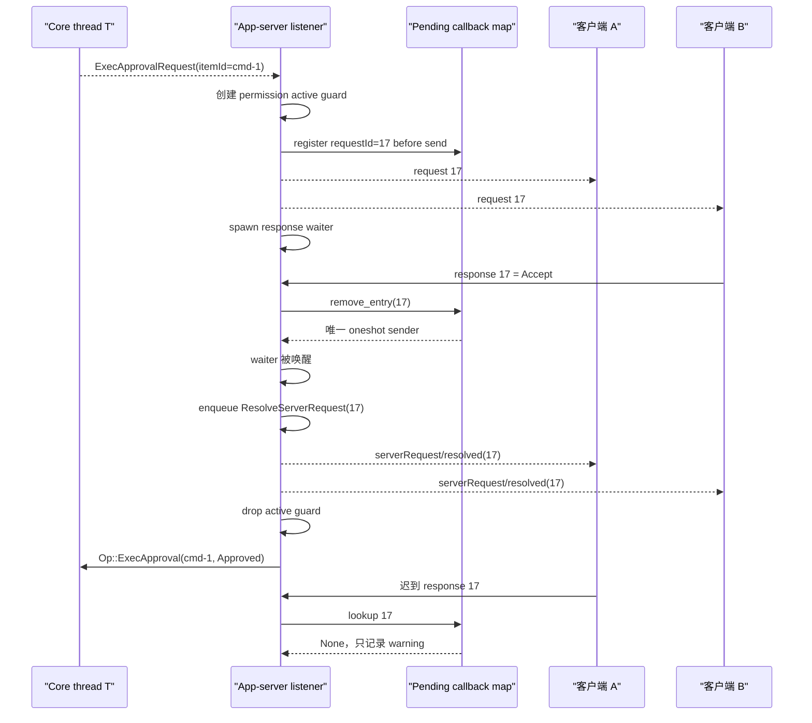
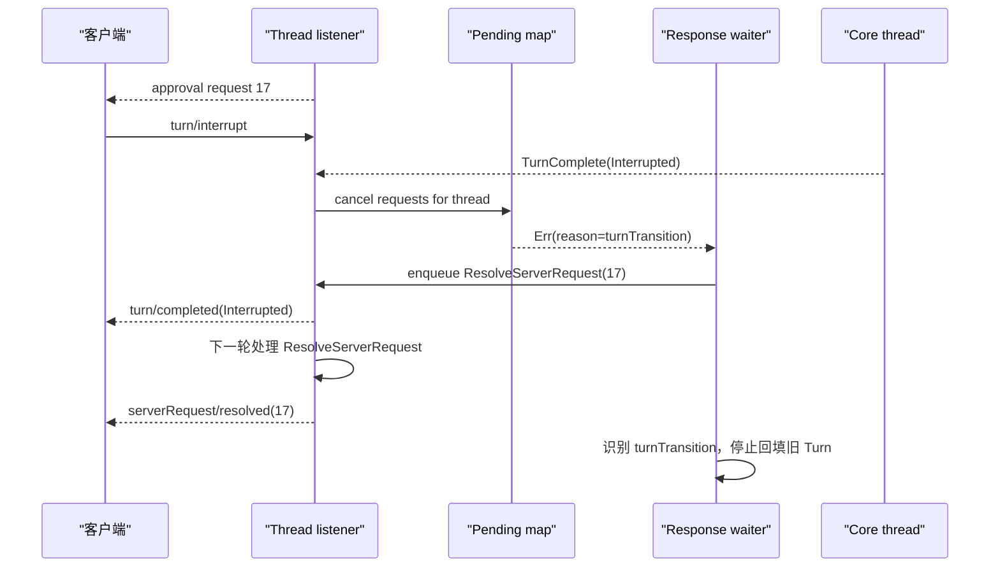

# 源码精读 21：App-server 反向请求与待决响应收口

> 源码基线：`4ee41929eaf4`。本文中的行为与符号均以这个固定提交为准。源码更新后，请搜索符号名，不要依赖行号。

普通 JSON-RPC 通常是客户端发请求、服务器回响应：

```text
client ──request──> app-server
client <─response── app-server
```

但命令审批、文件修改审批、`request_user_input` 和 MCP elicitation 的方向正好相反：

```text
app-server ──request──> client
app-server <─response── client
```

这篇要回答：

> App-server 怎样把 Core 的“我需要一个人类决定”变成 JSON-RPC 反向请求？多个客户端同时看着一条 thread 时，谁可以回答？第一个回答以后，其他客户端怎么关掉重复界面？Turn 已结束、listener 被替换或 thread 被卸载时，等待者又怎样保证不会永远挂住？

---

## 1. 先说最短答案

固定提交中的核心链路是：

1. Core 发出审批或输入事件，并等待对应的 Core `Op`；
2. App-server 创建全局唯一的 server request ID；
3. 先把 callback 放进 pending map；
4. 再把 JSON-RPC request 发给当前 thread subscribers；
5. 后台任务等待一个 oneshot receiver；
6. 任意客户端的第一个 response 原子取走 callback；
7. waiter 被唤醒，response 被解析为 Core decision/input；
8. `serverRequest/resolved` 通知其他客户端关闭同一请求；
9. Turn 切换时，用带 `reason: "turnTransition"` 的内部错误唤醒全部旧 waiter；
10. resume 时，仍在 pending map 中的请求按 request ID 顺序重放。

一句话记忆：

> pending map 保存“还欠谁一个答案”，oneshot 把答案交给唯一等待者，resolved notification 告诉其他界面“别再答了”。

---

## 2. 贯穿全文的案例

假设：

- thread T 正在 Turn U；
- Core 想执行 `python3 cleanup.py`；
- 命令需要用户审批；
- 桌面连接 A 与 TUI 连接 B 都订阅了 T。

我们跟踪下面的时间线：

1. Core 发出 `ExecApprovalRequest`；
2. App-server 生成 server request ID `17`；
3. A、B 都看到 request 17；
4. B 先点击 Accept；
5. pending map 原子移除 17；
6. 唯一 waiter 收到 B 的 JSON value；
7. App-server 广播 `serverRequest/resolved(requestId=17)`；
8. A 关闭仍显示的审批卡片；
9. App-server 向 Core 提交 `Op::ExecApproval`；
10. A 稍后迟到的 response 17 找不到 callback，只记录 warning，不会再次批准。

---

## 3. 第一张源码地图

| 职责 | 路径 | 重点符号 |
|---|---|---|
| 反向请求协议 | `app-server-protocol/src/protocol/common.rs` | `ServerRequest`、`ServerRequestPayload`、`ServerResponse` |
| pending callback owner | `app-server/src/outgoing_message.rs` | `OutgoingMessageSender`、`PendingCallbackEntry` |
| Core event 转反向请求 | `app-server/src/bespoke_event_handling.rs` | `apply_bespoke_event_handling` |
| response 解析与回填 | 同上 | `on_*_response` functions |
| resolved 顺序协调 | `app-server/src/thread_state.rs` | `ResolveServerRequest` listener command |
| resolved 通知发送 | `app-server/src/request_processors/thread_lifecycle.rs` | `resolve_pending_server_request` |
| JSON-RPC response 入口 | `app-server/src/message_processor.rs` | `process_response`、`process_error` |
| Turn 切换取消原因 | `app-server/src/server_request_error.rs` | `turnTransition` |

---

## 4. 为什么称为“反向请求”

从 App-server 的角色看：

- `turn/start` 是 incoming client request；
- `item/commandExecution/requestApproval` 是 outgoing server request。

两者都有 JSON-RPC request ID，也都期待一次 response，但方向相反。

不要把 server request 理解成 notification。notification 不期待回应；server request 必须有 request ID 和最终收口路径。

---

## 5. 固定提交支持哪些 server requests

`server_request_definitions!` 生成的请求包括：

| 方法 | 用途 |
|---|---|
| `item/commandExecution/requestApproval` | 命令执行审批 |
| `item/fileChange/requestApproval` | 文件修改审批 |
| `item/tool/requestUserInput` | 工具向用户提问 |
| `mcpServer/elicitation/request` | MCP server elicitation |
| `item/permissions/requestApproval` | 额外权限审批 |
| `item/tool/call` | 在客户端执行 dynamic tool |
| `account/chatgptAuthTokens/refresh` | 刷新认证 token |
| `attestation/generate` | 客户端生成 attestation |
| `currentTime/read` | 从客户端外部时钟读时间 |

本文主线只研究与 thread/Turn 绑定的审批和输入请求。全局请求与 capability 定向请求复用部分 callback 基础设施，但路由和超时策略不同。

---

## 6. 四类消息不要混在一起

| 方向 | 有 ID | 需要响应 | 例子 |
|---|---:|---:|---|
| client → server request | 是 | 是 | `turn/start` |
| server → client response | 同一个 ID | 否 | `TurnStartResponse` |
| server → client notification | 否 | 否 | `turn/completed` |
| server → client request | 是 | 是 | command approval |

`serverRequest/resolved` 是 notification，不是 request 的 JSON-RPC response。真正 response 由某个客户端发回；resolved 只是通知其他观察者更新 UI。

---

## 7. 第一组 ID：incoming request 为什么带 connection

客户端 A、B 都可能发送：

```text
request id = 1
```

所以客户端发来的 request 在服务器内部用：

```rust
ConnectionRequestId {
    connection_id,
    request_id,
}
```

表示。

于是 `(A, 1)` 与 `(B, 1)` 不冲突。这个 ID 用于把 App-server response 发回原始连接。

---

## 8. 第二组 ID：server request 为什么不带 connection

`OutgoingMessageSender` 自己维护：

```rust
next_server_request_id: AtomicI64
```

每次 `fetch_add(1, Ordering::Relaxed)` 得到新的整数 ID。

server request ID 在整个 `OutgoingMessageSender` 内唯一，并可能把同一个 request 广播到 A、B，所以 pending map 只需按 `RequestId` 查找，不把 connection ID 纳入 key。

这两组 ID 处在不同命名空间：

- incoming client request：客户端选择 ID，内部必须加 connection namespace；
- outgoing server request：App-server 统一分配 ID，同一请求可由多个连接看到。

---

## 9. 不止一个“业务 ID”

命令审批参数还可能包含：

| 字段 | 标识什么 |
|---|---|
| `threadId` | 所属 thread |
| `turnId` | 所属 Turn |
| `itemId` | 命令 Item 或 Core call |
| JSON-RPC request ID | 这一次 client callback |
| `approvalId` | 某些子命令审批的独立 opaque callback ID |

普通 shell/unified exec 审批中 `approvalId` 通常为空；zsh bridge 的多个子命令审批可以共享父 `itemId`，所以必须用非空 `approvalId` 区分提交给 Core 的具体 callback。

不要拿 JSON-RPC request ID 代替 Core item ID。它们的 owner 与寿命不同。

---

## 10. `OutgoingMessageSender` 是 callback owner

简化后的结构：

```rust
struct OutgoingMessageSender {
    next_server_request_id: AtomicI64,
    sender: mpsc::Sender<OutgoingEnvelope>,
    request_id_to_callback: Mutex<HashMap<RequestId, PendingCallbackEntry>>,
    request_contexts: Mutex<HashMap<ConnectionRequestId, RequestContext>>,
}
```

这里又有两张 map：

- `request_id_to_callback`：等待客户端回答的 server requests；
- `request_contexts`：尚未向客户端完成 response 的 incoming client requests。

名字相似，但方向相反。连接断开时清理 `request_contexts`，不能据此推断所有 server callbacks 也按该连接删除。

---

## 11. `PendingCallbackEntry` 保存什么

```rust
struct PendingCallbackEntry {
    callback: oneshot::Sender<ClientRequestResult>,
    thread_id: Option<ThreadId>,
    request: ServerRequest,
}
```

三项分别用于：

- `callback`：把唯一结果送给等待任务；
- `thread_id`：Turn 切换、卸载和 resume 时按 thread 筛选；
- `request`：resume 时原样重放，analytics 也能知道请求类型。

只存 callback 不够，因为断线恢复需要重新发出完整 request。

---

## 12. 为什么使用 oneshot

一个 server request 只需要一个最终结果：

```text
pending ──一次 response/error/cancel──> resolved
```

因此使用 `tokio::sync::oneshot`：

- sender 放在 pending map；
- receiver 交给专门的 response task；
- sender 只能发送一次；
- sender 被丢弃时，receiver 以 `RecvError` 醒来。

这比可以发送很多值的 mpsc 更贴近“一问一答”的状态机。

---

## 13. 先登记 callback，再发送 request

`send_request_to_connections` 的关键顺序是：

```text
分配 request ID
构造 typed ServerRequest
创建 oneshot
把 PendingCallbackEntry 插入 map
把 request 放入 outgoing channel
返回 (request ID, receiver)
```

为什么不能先发再登记？

因为客户端可能非常快：request 刚写出，response 就回来。如果 callback 尚未登记，`notify_client_response` 会找不到等待者，形成 lost response。

这就是“register-before-send”不变量。

---

## 14. 发送失败怎样收口

如果 outgoing channel 发送失败，代码会：

1. 记录 warning；
2. 从 pending map 删除刚插入的 callback entry；
3. 返回原有 receiver。

entry 被删除时，oneshot sender 被 drop，所以 receiver 得到 `RecvError`。后续 response handler 会选择安全 fallback，而不是永久等待。

函数没有把 send error 作为普通 `Result` 返回，而是通过 receiver closure 表达终结；阅读调用者时必须继续跟进 `receiver.await`。

---

## 15. thread-scoped sender 封装了什么

`ThreadScopedOutgoingMessageSender` 保存：

- 全局 `OutgoingMessageSender`；
- 当前 thread 的 subscriber connection IDs；
- `thread_id`。

调用：

```rust
outgoing.send_request(payload)
```

内部会把 connection IDs 和 thread ID 一起传给 `send_request_to_connections`。

所以普通 handler 不必反复传路由信息，且 pending entry 会被正确标记为属于 T。

---

## 16. 多客户端下 request 发给谁

第 20 篇讲过，listener 每次处理 Core event 时读取当前 subscriber IDs。

若 T 的 subscribers 是 `{A, B}`，thread-scoped `send_request` 会把同一个 typed request、同一个 request ID 分别发送给 A 和 B。

这不是创建两个 callback。pending map 中只有：

```text
17 -> one PendingCallbackEntry
```

多份 UI 共享一个逻辑请求。

---

## 17. 为什么审批可以广播，而不是先选一个客户端

广播让任何正在观察 thread 的客户端都能呈现请求；用户可以在当前方便使用的界面回答。

代价是必须解决：

- 两个客户端同时回答；
- 一个客户端回答后，另一个怎样知道；
- 新客户端 resume 时怎样看到仍未回答的问题。

pending map 的原子 remove、resolved notification 和 replay 正是这三个答案。

能力受限的请求可以采用不同路由，例如 attestation 会选择支持相应 capability 的连接；不要把“所有 server request 都广播”当成普遍规则。

---

## 18. Core event 怎样变成 command approval request

`apply_bespoke_event_handling` 收到 `EventMsg::ExecApprovalRequest` 后大致执行：

1. 创建 `ThreadWatchActiveGuard`，标记等待审批；
2. 整理 command、cwd、reason、环境、策略 amendment 等展示数据；
3. 构造 `CommandExecutionRequestApprovalParams`；
4. 调用 thread-scoped `send_request`；
5. 得到 `(pending_request_id, rx)`；
6. spawn `on_command_execution_request_approval_response(...)`。

listener 不在原地等待用户。否则它无法继续处理 Turn interrupt、状态事件或内部 listener commands。

---

## 19. 为什么 response 等待要 spawn

用户可能几秒、几分钟甚至一直不回答。

若 listener 直接：

```rust
let response = rx.await;
```

它会阻塞该 thread 的全部事件投影与生命周期协调。

因此 listener 只负责创建 pending request，等待工作交给独立 Tokio task。结果回来后，再通过 Core `Op` 和 listener command 回到各自串行 owner。

这是“不要持有主事件循环等待外部人类”的通用原则。

---

## 20. App-server 收到成功 response 的入口

transport 把 JSON-RPC response 解析成：

```text
{ id, result }
```

`MessageProcessor::process_response` 调用：

```rust
outgoing.notify_client_response(id, result).await
```

注意这里不需要重新查 thread ID。request ID 已足够定位 pending entry，而 entry 自己保存 thread metadata 和原始 typed request。

---

## 21. error response 走平行路径

客户端也可能回复 JSON-RPC error：

```text
{ id, error }
```

`process_error` 调用 `notify_client_error`。成功 response 和 error response 最终都会：

- 查找并移除同一个 callback；
- 唤醒同一个 receiver；
- 只是 `ClientRequestResult` 分别为 `Ok(result)` 与 `Err(error)`。

这样业务 handler 可以统一匹配 transport 成功、client error 与 channel closed。

---

## 22. 首答胜出来自 `remove_entry`

`notify_client_response` 先执行：

```rust
take_request_callback(&id)
```

内部在 mutex 下对 HashMap 做 `remove_entry`。

A、B 几乎同时回答 17 时：

- 先拿到锁的一方移除 entry，得到 oneshot sender；
- 后一方再查已经是 `None`；
- 只有第一方能向 waiter 发送结果。

因此“首答胜出”不是靠时间戳猜测，而是靠 map 中唯一 entry 的原子所有权转移。

---

## 23. 第二个 response 会怎样

迟到 response 找不到 callback，代码记录：

```text
could not find callback for <id>
```

它不会：

- 再次提交一个 Core approval；
- 覆盖第一人的 decision；
- 恢复已经关闭的 pending state。

从协议角度看，迟到 response 是无效的终态后输入。

---

## 24. 为什么 callback 发送失败不等于请求未解决

entry 已从 map 移除后，`callback.send(...)` 仍可能失败，例如等待 task 已被取消，receiver 已 drop。

代码只记录 warning，因为 server request 的 pending ownership 已经结束。不能把 entry 放回 map：

- 原 receiver 已不存在；
- 重放会制造无人消费的请求；
- 客户端已经认为自己回答成功。

这体现 remove-before-deliver 的终态语义。

---

## 25. response task 看到的是嵌套结果

`receiver.await` 的类型可读成三层：

```text
Result<
  Result<JSON value, JSON-RPC client error>,
  oneshot RecvError
>
```

对应：

| 形状 | 含义 |
|---|---|
| `Ok(Ok(value))` | 收到正常 JSON-RPC result |
| `Ok(Err(error))` | 客户端返回 JSON-RPC error，或服务器主动注入取消错误 |
| `Err(RecvError)` | oneshot sender 被丢弃，没有携带业务错误 |

不先画出这三层，很容易把 channel failure 和客户端拒绝混为一谈。

---

## 26. 成功 JSON 仍要 typed decode

JSON-RPC envelope 合法，不代表 result shape 合法。

命令审批还要：

```rust
serde_json::from_value::<CommandExecutionRequestApprovalResponse>(value)
```

再把 wire decision 映射为 Core `ReviewDecision`。

因此至少有两层验证：

1. transport/envelope 能否识别为 response；
2. result 是否符合该 request 方法的 typed schema。

---

## 27. 命令审批 decision 如何映射

主要映射包括：

| wire decision | Core 含义 |
|---|---|
| Accept | `Approved` |
| AcceptForSession | `ApprovedForSession` |
| Decline | 带原因的 denied |
| Cancel | `Abort` |
| AcceptWithExecpolicyAmendment | 批准并带 exec policy amendment |
| ApplyNetworkPolicyAmendment | 应用网络 allow/deny amendment |

客户端不能随便返回一个未列入 schema 的字符串。反序列化失败会走 fail-closed fallback，而不是默认批准。

---

## 28. 失败默认值因请求类型而不同

| 请求类型 | 普通错误/无效结果时的安全 fallback |
|---|---|
| command approval | denied / failed |
| file change approval | denied |
| permission request | 空 permission、Turn scope |
| user input | 空 answers |
| MCP elicitation | decline 或 cancel，取决于错误类别 |
| dynamic tool | `success: false` 的 fallback output |

“安全”不总是简单返回 false，而是选择能使对应 Core 状态机继续收口、又不扩大权限的值。

---

## 29. 权限响应还要做集合交集

客户端返回的 granted permissions 不是无条件信任。

固定提交会把：

```text
Core 原始 requested permissions
∩
客户端返回 granted permissions
```

做交集，并对路径进行本地化/校验。

这防止恶意或有 bug 的客户端通过 response 授予 Core 从未请求的更大权限。

如果路径本地化失败，代码发送 Turn error 并 interrupt，而不是继续执行。

---

## 30. active guard 何时释放

response task 的共同顺序通常是：

```text
receiver.await
请求 listener 发 resolved notification
drop active guard
解析 response
向 Core 提交 Op
```

guard 释放后 `ThreadWatchManager` 减少 pending permission/user-input count。

Turn completion 也会强制清 counters，所以正常回复、错误、取消与 Turn 终态都有收口路径。

---

## 31. `serverRequest/resolved` 解决什么 UI 问题

B 回答 17 后，A 不会收到 B 的 JSON-RPC response，因为 response 的方向是 client → server。

如果没有额外通知，A 的审批弹窗会一直显示。

因此 App-server 广播：

```json
{
  "method": "serverRequest/resolved",
  "params": {
    "threadId": "T",
    "requestId": 17
  }
}
```

它只表达“这个请求已经没有待答资格”，不泄露另一个客户端的完整 response 内容。

---

## 32. 为什么 resolved 要经过 listener command

response task 不能直接随意发送 resolved notification。它调用：

```text
resolve_server_request_on_thread_listener
```

该函数向 per-thread listener 的 command channel 发送：

```rust
ThreadListenerCommand::ResolveServerRequest {
    request_id,
    completion_tx,
}
```

listener 在自己的串行循环里处理后，再通过 `completion_tx` 回执。

这样 resolved 与同一 thread 的 request/event 输出共享顺序 owner。

---

## 33. completion oneshot 又解决什么

这里出现第二个 oneshot：

- 第一个 oneshot：客户端 response → response task；
- 第二个 oneshot：listener 已处理 resolved command → response task。

`resolve_server_request_on_thread_listener` 等待 `completion_rx`，所以调用者知道 resolved command 已经被 listener 消费，而不只是成功塞进 channel。

两个 oneshot 的 payload 和 owner 不同，不能混为一个。

---

## 34. listener 不运行时会怎样

如果 `listener_command_tx` 不存在或已关闭，resolve helper 会记录 error 并返回。

这时 pending callback 可能已经从 map 移除，业务 response 仍可继续映射和回填 Core；但其他客户端可能收不到 resolved UI notification。

这是固定提交中的错误恢复边界：日志保留问题证据，不重新建立 listener，也不回滚已接受的 client response。

---

## 35. 为什么 resolved 在 typed decode 之前发送

多数 response handler 在 `receiver.await` 后，先 resolved，再解析业务 JSON。

因为即使客户端给了无效 result，这个 request ID 的 callback 也已经被首答原子取走，不能再由其他客户端回答。UI 应先关闭该请求；后续无效内容由安全 fallback 处理。

resolved 表示 callback 生命周期结束，不表示业务 decision 一定有效或获批。

---

## 36. 最终怎样回到 Core

命令审批最后调用：

```rust
conversation.submit(Op::ExecApproval {
    id,
    turn_id,
    decision,
})
```

其他类型使用不同 Op：

- `PatchApproval`；
- `UserInputAnswer`；
- `ResolveElicitation`；
- `RequestPermissionsResponse`；
- `DynamicToolResponse`。

App-server 的 oneshot callback 只负责跨 JSON-RPC 等客户端；真正解除 Core 内部工具等待的是这些 Core Ops。

---

## 37. 两层等待者

命令审批实际存在两层异步等待：

```text
Core tool
  等待 Core approval channel / Op
      ↑
App-server response task
  等待 JSON-RPC callback oneshot
      ↑
client UI
```

App-server 是桥梁：

- 向外把 Core event 变成 server request；
- 向内把 client result 变成 Core Op。

只读一侧会误以为 client response 能直接唤醒 shell executor。

---

## 38. Turn 切换为什么必须取消旧请求

假设 Turn U 的命令审批还在屏幕上，但 U 已被 interrupt，随后 Turn V 开始。

若 request 17 仍可回答：

- 用户可能批准一个已经不存在的旧操作；
- active guard 可能让状态一直显示等待；
- resume 会反复重放过期 UI。

因此 `TurnComplete` 和防御性的 `TurnStarted` 路径都会调用：

```text
abort_pending_server_requests()
```

它按 thread 取消所有旧 server requests。

---

## 39. 为什么取消要携带结构化 reason

Turn transition 注入的内部 JSON-RPC error 包含：

```json
{
  "message": "client request resolved because the turn state was changed",
  "data": { "reason": "turnTransition" }
}
```

handler 使用 `is_turn_transition_server_request_error` 检查结构化 `data.reason`，而不是比较整段人类可读 message。

稳定机器字段适合控制流；message 适合日志与诊断。

---

## 40. Turn transition 不能走普通失败 fallback

命令审批的普通 client error 会映射为 denied，并向 Core 提交 decision。

但 Turn 已结束时，再提交 denied 也是迟到输入。于是 handler 特判：

```text
Ok(Err(error)) if reason == turnTransition => return
```

这条 return 的含义不是忘记清理：

- callback 已从 map 移除；
- resolved notification 已安排；
- active guard 会被 drop；
- 只是不再向已经转换世代的 Core Turn 提交 fallback。

---

## 41. `cancel_requests_for_thread` 怎样批量取消

它在 mutex 下：

1. 找出 `entry.thread_id == Some(T)` 的 request IDs；
2. 从 map 逐个 remove；
3. 释放锁；
4. 对每个 entry 记录 aborted analytics；
5. 若提供 error，则通过 callback sender 发送 `Err(error)`。

先锁内摘取、后锁外发送，避免在共享 map 锁内执行可能唤醒其他 task 的动作。

---

## 42. `error: None` 与 `Some(error)` 有何不同

- Turn transition 使用 `Some(turnTransition error)`：receiver 得到 `Ok(Err(error))`，可以识别这是世代变化；
- thread unload 使用 `None`：entry 被 drop，receiver 得到 `Err(RecvError)`；
- `cancel_all_requests` 也可选择带统一 shutdown error。

三者最终都清 pending map，但给 waiter 的终结信息不同。

---

## 43. interrupt 测试证明了什么

Turn interrupt 集成测试验证：

1. 客户端先收到 command approval request；
2. 客户端发 `turn/interrupt`；
3. 流中出现匹配 request ID 的 `serverRequest/resolved`；
4. 同一 Turn 最终出现 completed/interrupted。

这说明 pending UI 的收口是 Turn 中断生命周期的一部分，而不是可有可无的界面优化。该测试的读取 helper 可能跳过并缓冲其他消息，因此这里不把它扩大解释成 resolved 在 wire 上必然早于 `turn/completed`；从 listener 源码看，resolved command 需要等待当前 TurnComplete event handler 让出 listener 循环后才能被处理。

---

## 44. 新客户端 resume 时为什么要 replay

A 收到 request 17 后断线，Core 仍在等待。如果 B 重新 resume T，仅返回 active Turn snapshot 不足以重建审批表单的完整参数。

因此 resume response 发送完成后，代码调用：

```rust
replay_requests_to_connection_for_thread(B, T)
```

从 pending map 取出 T 的未决 `ServerRequest`，原样发给 B。

---

## 45. replay 为什么复用原 request ID

重放不是创建新请求，而是让新连接观察同一个逻辑 pending callback。

因此它复用：

- 原 typed params；
- 原 request ID；
- 原 pending entry；
- 原唯一 waiter。

如果为重放分配新 ID，就需要额外别名表合并多个响应，还可能让两个 ID 都各自触发 Core decision。

---

## 46. replay 为什么按 request ID 排序

`pending_requests_for_thread` 收集 HashMap values 后显式：

```text
sort_by(request.id)
```

HashMap 本身没有稳定迭代顺序。按递增 server request ID 重放可得到确定的创建顺序，使多项待决 UI 在恢复时稳定排列，也让测试可重复。

这不声称 request ID 是业务优先级；它只是稳定时序代理。

---

## 47. resume response 与 replay 的顺序

运行中 resume 由 listener command 串行处理，大体顺序是：

1. 组合 durable history 与 active Turn snapshot；
2. 发送 `ThreadResumeResponse`；
3. 发送必要的 token/goal 更新；
4. replay pending server requests；
5. 再允许 idle lifecycle 后续反应。

客户端先拿到 thread 基线，再看到依附于该 thread 的待决请求，不会先弹出一个尚未建立 thread 状态的审批框。

---

## 48. replay 与 resolved 的竞态怎样理解

可能发生：B resume 的同时，A 正回答 17。

pending map 是事实 owner：

- replay snapshot 早一步取得 request，B 可能短暂看到 17，随后收到 resolved；
- A 早一步移除 callback，replay 查不到 17，B 不会看到；
- B 若在 resolved 前抢先回答，仍由 pending map 的首个 remove 决定赢家。

客户端必须把 `serverRequest/resolved` 设计成幂等关闭操作。

---

## 49. connection closed 为什么没有简单删除 server callback

`OutgoingMessageSender::connection_closed` 在固定提交中清理的是该连接的 incoming `request_contexts`。

thread-scoped server request 可能已广播给 A、B；A 断线不代表 B 不能回答，也不代表 Core Turn 应立即失败。因此 callback 不归单一 connection 所有，而归 thread/请求本身所有。

当全部 subscribers 消失时，pending request仍可等新客户端 resume；Turn transition 或 thread unload 才是明确的批量终结边界。

---

## 50. 这与第 20 篇怎样连接

第 20 篇的 subscription 回答“当前向谁发送/重放”。

本篇 pending callback 回答“哪个逻辑问题尚未得到答案”。

两者组合：

```text
pending request = 仍欠答案的业务状态
subscriber set  = 当前有资格看到消息的连接集合
```

subscriber 可以变化，pending request ID 和 waiter 保持不变。

---

## 51. thread unload 时怎样处理 pending requests

自动卸载前调用：

```text
cancel_requests_for_thread(T, None)
```

因为 thread 即将失去 listener/Core owner，已经不可能再安全处理客户端答案。

随后移除 thread state、停止 listener、shutdown Core thread。先取消 callbacks，避免后台 response task 在 owner 被拆除后继续无限等待。

---

## 52. listener 替换与 response task 的关系

response task 保存 `thread_state`，resolved 时读取其中当前的 `listener_command_tx`。

如果旧 listener 已被新 generation 替换，它会把 resolved command 发给当前 listener，而不是固守创建请求时的旧 channel。这使 UI 收口跟随当前 per-thread 顺序 owner。

如果 thread state 已 clear，则记录 listener unavailable error；业务 callback 的首答终态仍不会逆转。

---

## 53. shutdown 的全局清理

`cancel_all_requests` 会 drain 整张 pending callback map，并可向所有 waiter 发送统一 error。

固定提交中的 in-process runtime shutdown 使用它，因为 detached processor task 可能还持有 outgoing sender，不能只等待 channel 自然关闭。

显式 drain 是 owner shutdown 的强终态；否则 Arc 或 sender 副本可能让资源长期存活。

---

## 54. request context 与 callback 为什么分开清理

对比两种 owner：

| 状态 | key | 归属 | 终结条件 |
|---|---|---|---|
| incoming request context | `(connection, client request ID)` | 发起请求的连接 | response/error 或 connection closed |
| outgoing pending callback | server request ID | server request/thread | client answer、Turn transition、unload、shutdown |

如果按 connection close 清掉所有 callback，就会误伤同一广播请求的其他客户端。

---

## 55. 发送进 outgoing channel 不等于写到 socket

`send_request_to_connections` 成功通常只表示 `OutgoingEnvelope` 已进入服务器的 mpsc router。

它不等于：

- bytes 已写完；
- 客户端已收到；
- UI 已展示；
- 用户会回答。

某些其他消息路径带 `write_complete_tx`，但普通 thread server request 这里设置为 `None`。因此必须依靠 pending/replay/cancel，而不能把 enqueue success 当成交付确认。

---

## 56. typed `ServerRequestPayload` 为什么有价值

业务代码先构造：

```text
ServerRequestPayload::CommandExecutionRequestApproval(params)
```

分配 ID 后再转为：

```text
ServerRequest::CommandExecutionRequestApproval {
    request_id,
    params,
}
```

payload 阶段刻意没有 ID，防止调用者自己制造冲突；统一 owner 负责分配 ID 后，才成为完整 wire request。

宏同时生成 request/response 的 typed 转换，减少方法名与 payload 类型漂移。

---

## 57. analytics 为什么保存原 typed request

pending entry 保存 `request: ServerRequest`，response 到达后可以调用该 request 的 `response_from_result` 解析对应 response variant，并记录 typed analytics。

这比只记录 `{id, raw JSON}` 更容易区分命令审批、文件审批和用户输入的完成情况。

但 analytics 不是 callback 正确性的 owner；即使 tracking 逻辑跳过某类 response，oneshot 仍照常完成。

---

## 58. Dynamic tool 是值得注意的边界

固定提交中 dynamic tool 同样使用 pending callback 与 Turn transition cancellation，但 `dynamic_tools::on_call_response` 直接等待、解析并提交 `Op::DynamicToolResponse`。

在这条展示出来的路径里，它没有像审批/用户输入 handlers 那样调用 `resolve_server_request_on_thread_listener`。

因此不要把“所有 server request 完成后都必然发 `serverRequest/resolved`”写成无条件事实。本文的 resolved 主链明确覆盖审批、权限、用户输入和 MCP elicitation 等专门 handlers；具体新请求类型仍需逐条检查。

---

## 59. Request user input 的错误语义

`request_user_input` 正常响应把 question ID 映射到答案数组，再提交 `Op::UserInputAnswer`。

普通 client error、无效 JSON 或 channel closed 时，会提交空 answers，使 Core 等待可以收口；Turn transition error 则直接 return，不再向旧 Turn 注入空回答。

这里再次体现：

- 普通失败需要一个 fallback 终态；
- 世代已经结束时需要静默停止迟到回填。

---

## 60. MCP elicitation 的错误语义

MCP elicitation 把 client response 转换为 accept/decline/cancel 及可选 content/meta。

- typed decode 失败或普通 error 通常降级为 decline；
- Turn transition 映射为 cancel；
- 最终提交 `Op::ResolveElicitation`。

这里没有简单 return，是因为外部 MCP 请求还需要得到明确取消动作。不同 Core 状态机需要不同收口策略，不能机械复制 handler。

---

## 61. command approval 的 Item UI 补偿

命令审批不仅产生 server request，还可能提前发 CommandExecution `ItemStarted`，让 UI 在审批阶段就看到命令 Item。

若用户 decline/cancel 或响应解析失败，handler 可能发对应的 completed Item 状态；但 zsh 子命令审批若共享父 Item，则要避免错误完成整个父命令。

`approvalId`、`itemId` 和 `command_execution_started` set 在这里共同防止重复/错误终结。

---

## 62. 完整时序图



---

## 63. Turn interrupt 时序图



图省略了 interrupt acknowledgement 的部分细节，但保留了 pending request 收口的关键顺序。

---

## 64. 一张状态转移表

| 当前状态 | 输入 | pending map | waiter 结果 | 后续动作 |
|---|---|---|---|---|
| 未登记 | create | 插入 entry | 等待 | send request |
| pending | success response | remove | `Ok(Ok(value))` | typed decode、Core Op |
| pending | error response | remove | `Ok(Err(error))` | fallback 或特殊取消 |
| pending | Turn transition | 批量 remove | `Ok(Err(turnTransition))` | resolved，停止旧 Turn 回填 |
| pending | unload, no error | 批量 remove/drop | `Err(RecvError)` | handler fallback/收口 |
| pending | resume | 不变 | 继续等待 | 原 ID request 重放 |
| resolved | late response | 无变化 | 无 waiter | warning |

---

## 65. 关键测试证据

固定提交中的测试覆盖：

- `notify_client_error_forwards_error_to_waiter`：client error 进入同一 receiver；
- `pending_requests_for_thread_returns_thread_requests_in_request_id_order`：重放顺序稳定；
- `cancel_requests_for_thread_cancels_all_thread_requests`：同 thread 多类请求一起终结；
- `aborting_pending_request_clears_pending_state`：Turn transition reason 正确且 map 变空；
- `thread_resume_replays_pending_command_execution_request_approval`：重放 request 与原 request 完全相等；
- 对应 file change replay 测试；
- `turn_interrupt_resolves_pending_command_approval_request`：interrupt 后收到匹配 ID 的 resolved 和 interrupted Turn 终态；
- request user input、permission、MCP elicitation 集成测试验证 resolved 通知。

这些测试证明具体链路，不自动证明未来新增的每一种 `ServerRequest` 都遵循完全相同的 resolved 规则。

---

## 66. 常见误解一：客户端 response 就是批准

不一定。

response 只是 JSON-RPC envelope。还必须：

- 找到仍 pending 的 ID；
- typed decode 成正确 response；
- 校验 decision/permissions；
- 映射为 Core 类型；
- 成功提交 Core Op。

任何一层失败都可能变成 deny、empty、decline、cancel 或 failed output。

---

## 67. 常见误解二：每个客户端各有一份审批

不是。A、B 看到的是同一个 request ID 和同一个 pending callback。

UI 可以有两份，逻辑问题只有一份。首答移除 map entry，resolved 通知关闭其他副本。

---

## 68. 常见误解三：断线就取消审批

不能一概而论。

thread-scoped request 不归单一连接所有。A 断线后 B 仍可回答，新连接也可通过 resume replay 看到 pending request。

真正批量终结边界是 Turn transition、thread unload 或 runtime shutdown。

---

## 69. 常见误解四：resolved 表示 approved

错误。

resolved 只表示 request ID 不再 pending。它可能因为：

- 用户批准；
- 用户拒绝；
- client error；
- Turn interrupt；
- invalid response 触发 fallback。

业务结果要从后续 Item/Turn 状态理解，而不是从 resolved 猜测。

---

## 70. 常见误解五：HashMap 会保留创建顺序

不会。resume replay 显式按 request ID 排序，才得到稳定顺序。

看到测试中的固定顺序时，要继续追踪它来自数据结构性质，还是来自额外 sort。

---

## 71. 常见误解六：cancel receiver 就足够了

仅 drop receiver 不能完成全部语义：

- pending map 仍可能保留 entry；
- resume 仍会重放；
- active guard 可能不释放；
- 其他 UI 不知道关闭。

正确收口需要从 owner map 移除、唤醒/终止 waiter，并按适用路径发送 resolved、释放 guard、停止 Core 回填。

---

## 72. 阅读反向 RPC 的六个固定问题

以后遇到新的 server request，逐项问：

1. request ID 由谁分配，作用域多大？
2. callback 在发送前还是发送后登记？
3. request 发给所有连接还是选定连接？
4. 正常 response、error、channel closed 分别怎样映射？
5. timeout、Turn transition、disconnect、shutdown 谁负责取消？
6. 新客户端怎样恢复 pending UI，旧客户端怎样收到 resolved？

如果第 5、6 问没有答案，这个请求很可能存在悬挂或恢复缺口。

---

## 73. 本篇核心不变量

1. server request callback 必须先登记、后发送。
2. 一个逻辑 server request 只有一个全局 ID、一个 pending entry 和一个 waiter。
3. 多个 subscriber 可以看到并回答同一 request，首个 map remove 胜出。
4. typed decode 失败不能扩大权限；审批类路径默认 fail closed。
5. resolved 表示 callback 生命周期结束，不表示业务批准。
6. resolved 通过 thread listener command 与 thread 输出排序。
7. Turn transition 必须清掉旧 Turn 的全部 thread-scoped requests。
8. `turnTransition` 使用结构化 reason，handler 不向旧 Turn提交 fallback。
9. resume 重放原 request/原 ID，不创建第二个 callback。
10. subscriber 生命周期与 pending request 生命周期彼此独立。
11. unload/shutdown 必须显式 drain callbacks，不能只依赖 channel 自然关闭。
12. 每种新增 server request 都要单独核对 resolved、fallback 和 cancellation 语义。

---

## 74. 局部术语表

| 名词 / 代码词 | 中文理解 | 在本文中的具体含义 |
|---|---|---|
| reverse request | 反向请求 | App-server 主动请求客户端完成审批、输入或能力操作 |
| `ServerRequest` | 完整服务器请求 | 已带 request ID、可以序列化到 wire 的 typed enum |
| `ServerRequestPayload` | 请求载荷 | 尚未分配 request ID 的 typed request variant |
| `ServerResponse` | 服务器请求的客户端响应类型 | 按原 request 方法解析得到的 typed response enum |
| request ID | 请求编号 | JSON-RPC 一问一答的关联键 |
| `ConnectionRequestId` | 连接内请求编号 | connection ID 加客户端自选 request ID，避免多连接冲突 |
| item ID | 项目编号 | Core Turn Item/call 的业务身份 |
| approval ID | 审批 callback 编号 | 某些共享父 Item 的子命令审批所需 opaque ID |
| callback | 回调入口 | response 到达后唤醒等待任务的 oneshot sender |
| pending | 待决 | 已发送但尚未被 answer/error/cancel 收口 |
| pending map | 待决表 | request ID 到 `PendingCallbackEntry` 的唯一 owner map |
| oneshot | 单次通道 | 只交付一个最终值的 sender/receiver pair |
| waiter | 等待者 | await oneshot receiver 的后台 response task |
| register-before-send | 先登记后发送 | 防止极快 response 在 callback 建立前到达 |
| first response wins | 首答胜出 | 第一个原子移除 pending entry 的响应成为唯一结果 |
| late response | 迟到响应 | callback 已终结后才到达的第二个 response |
| typed decode | 强类型解码 | 把 raw JSON result 转换为方法对应 response struct/enum |
| fail closed | 失败时不放权 | 无效或错误审批结果默认拒绝或授予空权限 |
| fallback | 降级结果 | 错误时用于让 Core 状态机安全收口的默认 response |
| resolved | 已解决 | request ID 已不再接受回答，不等于 approved |
| replay | 重放 | resume 后向新 connection 原样重发仍 pending 的 request |
| `turnTransition` | Turn 世代转换原因 | 表示旧 Turn 的 server request 已因生命周期变化失效 |
| callback drain | 回调排空 | 批量移除 pending entries 并终结所有 waiters |
| listener command | listener 内部命令 | 把 resolved notification 放回 per-thread 串行顺序 |
| completion acknowledgement | 完成回执 | 第二个 oneshot 确认 listener 已处理 resolved command |
| active guard | 活跃守卫 | pending 期间维持 WaitingOnApproval/UserInput 状态的 RAII 对象 |
| request context | 请求上下文 | incoming client request 的 trace/connection-scoped response 状态 |
| subscriber | 订阅连接 | 当前应收到 thread request/notification 的客户端连接 |
| elicitation | 引导式询问 | MCP server 请求宿主向用户取得决定或结构化内容 |
| permission intersection | 权限交集 | granted 不得超过 Core 原始 requested permissions |
| opaque ID | 不透明编号 | 只用于关联，调用者不解析其内部格式 |

---

## 75. 代码词逐词拆解

### `request_id_to_callback`

- `request_id`：查找 key；
- `to`：映射到；
- `callback`：用于唤醒 waiter 的 sender；
- 合起来：server request ID 到 pending callback entry 的 map。

### `notify_client_response`

- `notify`：唤醒内部等待者；
- `client_response`：收到的是客户端对 server request 的回答；
- 它不是向客户端发送 response。

### `pending_requests_for_thread`

- `pending_requests`：尚未终结的 server requests；
- `for_thread`：按 entry 中 thread ID 过滤；
- 返回值会排序，用于 resume replay。

### `resolve_server_request_on_thread_listener`

- `resolve_server_request`：通知请求已终结；
- `on_thread_listener`：动作必须交给 thread listener 顺序执行；
- 它不负责解析 client result。

### `abort_pending_server_requests`

- `abort`：使等待者以取消原因结束；
- `pending_server_requests`：当前 thread 全部未决反向请求；
- 常用于 Turn 开始/结束的世代边界。

---

## 76. 小练习

### 练习一

A、B 同时收到 request 17。A 先 Accept，B 随后 Decline。Core 得到什么？

<details>
<summary>参考答案</summary>

只有 A 的 Accept。A 的 response 先从 pending map 移除唯一 entry；B 的迟到 response 找不到 callback，只记录 warning。

</details>

### 练习二

A 收到 request 17 后断线，B 没有订阅。request 是否必须立刻取消？

<details>
<summary>参考答案</summary>

不必。callback 属于 thread/request，而不是 A。新客户端 resume 时可以重放同一个 request 17；Turn transition 或 thread unload 才明确终结它。

</details>

### 练习三

为什么 `serverRequest/resolved` 不能直接理解成用户批准？

<details>
<summary>参考答案</summary>

它只说明 callback 已不再 pending。拒绝、错误、无效 JSON、Turn interrupt 都可能触发同样的 UI 收口。

</details>

### 练习四

为什么 Turn transition error 要带 `data.reason`，而不是只写一条 message？

<details>
<summary>参考答案</summary>

handler 需要稳定地识别“旧 Turn 已失效”并停止回填。人类可读 message 可能改写或本地化，不适合作为机器控制流合同。

</details>

### 练习五

resume 为 request 17 分配新的 request 18，会带来什么复杂度？

<details>
<summary>参考答案</summary>

需要维护 17/18 到同一 callback 的别名关系、解决两个 ID 同时回答的竞态，并向多个 UI 分别 resolved。复用原 ID 可以保持一个逻辑请求只有一个身份。

</details>

---

## 77. 源码导航

| 阅读目标 | 固定提交路径 | 重点符号 |
|---|---|---|
| request/response DSL | `codex-rs/app-server-protocol/src/protocol/common.rs` | `server_request_definitions!` |
| request enum 与 payload | 同上 | `ServerRequest`、`ServerRequestPayload` |
| command approval wire | `codex-rs/app-server-protocol/src/protocol/v2/item.rs` | Params、Response、Decision |
| user input wire | 同上 | `ToolRequestUserInput*` |
| permission wire | `codex-rs/app-server-protocol/src/protocol/v2/permissions.rs` | `PermissionsRequestApproval*` |
| resolved notification wire | `codex-rs/app-server-protocol/src/protocol/v2/notification.rs` | `ServerRequestResolvedNotification` |
| callback owner | `codex-rs/app-server/src/outgoing_message.rs` | `OutgoingMessageSender` |
| pending entry | 同上 | `PendingCallbackEntry` |
| server ID 分配 | 同上 | `next_request_id` |
| register-before-send | 同上 | `send_request_to_connections` |
| success/error 回调 | 同上 | `notify_client_response`、`notify_client_error` |
| 首答原子取走 | 同上 | `take_request_callback` |
| pending snapshot/sort | 同上 | `pending_requests_for_thread` |
| resume replay | 同上 | `replay_requests_to_connection_for_thread` |
| per-thread 取消 | 同上 | `cancel_requests_for_thread` |
| 全局排空 | 同上 | `cancel_all_requests` |
| Thread scoped wrapper | 同上 | `ThreadScopedOutgoingMessageSender` |
| Core event 分派 | `codex-rs/app-server/src/bespoke_event_handling.rs` | `apply_bespoke_event_handling` |
| command response | 同上 | `on_command_execution_request_approval_response` |
| file response | 同上 | `on_file_change_request_approval_response` |
| user input response | 同上 | `on_request_user_input_response` |
| permission response | 同上 | `on_request_permissions_response` |
| MCP response | 同上 | `on_mcp_server_elicitation_response` |
| Turn 边界取消 | 同上 | TurnStarted/TurnComplete 的 `abort_pending_server_requests` |
| dynamic tool 边界 | `codex-rs/app-server/src/dynamic_tools.rs` | `on_call_response` |
| resolved listener command | `codex-rs/app-server/src/thread_state.rs` | `ResolveServerRequest` |
| resolved helper | 同上 | `resolve_server_request_on_thread_listener` |
| resume 后 replay | `codex-rs/app-server/src/request_processors/thread_lifecycle.rs` | `handle_pending_thread_resume_request` |
| resolved 通知发送 | 同上 | `resolve_pending_server_request` |
| response transport 入口 | `codex-rs/app-server/src/message_processor.rs` | `process_response`、`process_error` |
| Turn transition reason | `codex-rs/app-server/src/server_request_error.rs` | constant 与 predicate |
| callback unit tests | `codex-rs/app-server/src/outgoing_message.rs` | error、sort、cancel tests |
| abort pending test | `codex-rs/app-server/src/request_processors/thread_processor_tests.rs` | `aborting_pending_request_clears_pending_state` |
| resume replay tests | `codex-rs/app-server/tests/suite/v2/thread_resume.rs` | command/file approval replay |
| interrupt integration test | `codex-rs/app-server/tests/suite/v2/turn_interrupt.rs` | pending approval resolved |
| resolved integration tests | `codex-rs/app-server/tests/suite/v2/` | request_user_input、permissions、MCP elicitation |

---

## 78. 本篇收束

App-server 反向请求不是“发一个 JSON，然后 await”这么简单。固定提交用一套完整生命周期保证它可以跨多客户端、断线和 Turn 转换：

- typed payload 与统一 Atomic ID 建立身份；
- register-before-send 消除快速 response 窗口；
- pending map 与 oneshot 建立唯一 waiter；
- 原子 remove 实现首答胜出；
- listener command 排序 resolved UI 通知；
- typed decode、权限交集与 fail-closed fallback守住安全边界；
- `turnTransition` 区分普通失败与旧世代取消；
- 原 ID replay 让新客户端恢复待决界面；
- per-thread cancel、unload 和 shutdown drain 提供完整终态。

下一篇适合继续精读 transport 与 outgoing router：同一条 typed 消息怎样变成 connection-targeted envelope，怎样经过 bounded channel、WebSocket/stdio writer、初始化门和 write-complete acknowledgement，最终成为真正写出的 bytes。

返回[源码精读目录](README.md)，或查看[课程术语总表](../glossary.md)。
