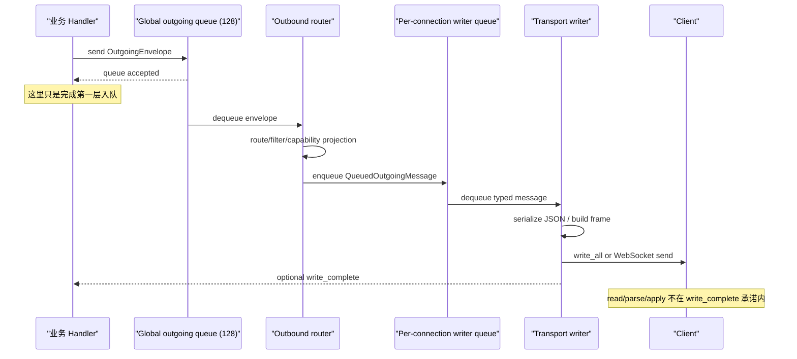
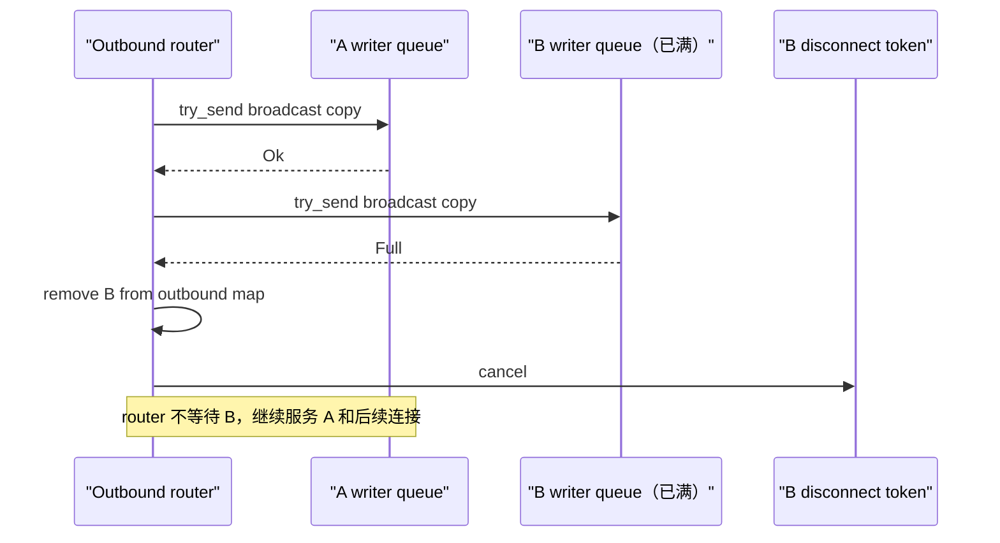

# 源码精读 22：Outgoing router、传输写入与交付边界

> 源码基线：`4ee41929eaf4`。本文只描述该固定提交中的实现。以后源码移动时，请搜索符号名，不要依赖行号。

上一章停在：App-server 已经构造好一个 typed response、notification 或反向 request。

但“构造好了”离“客户端看到了”还很远：

```text
typed value
  → global outgoing queue
  → outbound router
  → per-connection queue
  → JSON serialization
  → stdio / WebSocket write
  → 操作系统与网络
  → client read
  → client parse
  → UI/state update
```

这一篇解决的问题是：

> App-server 怎样把一条消息定向到正确连接？多个连接中有一个很慢时，为什么不会拖死所有人？初始化前为什么收不到广播？实验字段怎样按连接裁剪？`write_complete` 到底承诺到哪一层？

---

## 1. 先给最重要的结论

固定提交把发送过程拆成三个队列层级：

1. 业务代码把 `OutgoingEnvelope` 放入全局 outgoing channel；
2. outbound router 根据 `ToConnection`/`Broadcast` 选择连接，并放入 per-connection writer channel；
3. transport writer 序列化 `OutgoingMessage`，写到 stdout、WebSocket sink 或 in-process event queue。

每一层的“成功”含义不同：

| 成功点 | 能证明什么 | 不能证明什么 |
|---|---|---|
| typed value 构造成功 | Rust 数据合法 | 已排队 |
| global `send().await` 成功 | router channel 接受了 envelope | 已找到连接 |
| per-connection enqueue 成功 | writer queue 接受了消息 | 已序列化或写出 |
| writer 返回成功 | transport write API 已完成 | 对端已读取、解析或应用 |
| client response/ack | 对端完成协议动作 | 只在协议显式设计这种确认时成立 |

一句话记忆：

> 入队、写出、收到、处理，是四个不同承诺。

---

## 2. 贯穿全文的案例

假设 App-server 有三个 WebSocket 连接：

- A：已初始化，读取正常；
- B：已初始化，但客户端停止读取，writer queue 最终被塞满；
- C：刚建立，还没完成 initialize。

服务器产生全局 `configWarning`：

1. 业务代码生成 `OutgoingEnvelope::Broadcast`；
2. envelope 进入容量 128 的全局队列；
3. router 只把 A、B 选为广播目标，C 被初始化门排除；
4. A 的 per-connection queue 接受消息；
5. B 的队列已满，router 移除 B 并触发 disconnect token；
6. A 的 WebSocket writer 将 JSON text frame 写出；
7. B 不会拖住 A；
8. C 初始化完成后，只接收未来广播及显式发送的初始化快照，不自动补发刚才那条普通广播。

---

## 3. 第一张源码地图

| 层级 | 路径 | 重点符号 |
|---|---|---|
| 业务发送 API | `app-server/src/outgoing_message.rs` | `OutgoingMessageSender` |
| 路由 envelope | 同上 | `OutgoingEnvelope` |
| outbound connection 表 | `app-server/src/transport.rs` | `OutboundConnectionState` |
| 路由主函数 | 同上 | `route_outgoing_envelope` |
| 进程主循环 | `app-server/src/lib.rs` | outbound router task、control events |
| 跨 crate 消息类型 | `app-server-transport/src/outgoing_message.rs` | `OutgoingMessage`、`QueuedOutgoingMessage` |
| transport 公共入口 | `app-server-transport/src/transport/mod.rs` | `TransportEvent`、序列化、容量 |
| stdio reader/writer | `app-server-transport/src/transport/stdio.rs` | JSONL read/write loops |
| WebSocket reader/writer | `app-server-transport/src/transport/websocket.rs` | frame loops、disconnect token |
| in-process transport | `app-server/src/in_process.rs` | typed queue routing与交付策略 |

---

## 4. `OutgoingMessage` 是 wire 前的最后一个 typed enum

它有四个 variant：

```rust
pub enum OutgoingMessage {
    Request(ServerRequest),
    AppServerNotification(ServerNotificationEnvelope),
    Response(OutgoingResponse),
    Error(OutgoingError),
}
```

分别表示：

- App-server 向客户端发反向请求；
- App-server 发通知；
- 回答客户端 request 的成功 response；
- 回答客户端 request 的 error response。

这个 enum 仍是 Rust 值，还不是 JSON 字符串。

---

## 5. 为什么 `OutgoingMessage` 使用 untagged serialization

`#[serde(untagged)]` 意味着不会额外生成：

```json
{ "type": "Response", "value": ... }
```

而是直接使用各 variant 自己的 JSON-RPC wire shape，例如：

```json
{ "id": 7, "result": {} }
```

或：

```json
{ "method": "configWarning", "params": { ... } }
```

enum 是 Rust 内部分类，wire 不暴露这层包装。

---

## 6. `OutgoingEnvelope` 还没有进入具体 transport

App-server crate 再包一层：

```rust
enum OutgoingEnvelope {
    ToConnection {
        connection_id,
        message,
        write_complete_tx,
    },
    Broadcast {
        message,
    },
}
```

`OutgoingMessage` 回答“发什么”；`OutgoingEnvelope` 回答“发给谁”。

把 payload 与 routing metadata 分开后，同一个 typed message 可以复用于 stdio、WebSocket、Unix socket、remote control 和 in-process transport。

---

## 7. `ToConnection` 与 `Broadcast`

| variant | 目标 | 常见用途 |
|---|---|---|
| `ToConnection` | 一个明确 `ConnectionId` | request response、thread subscriber、定向通知 |
| `Broadcast` | 所有已初始化且允许该通知的连接 | 全局配置、账户或状态通知 |

注意：thread fan-out 通常在上一层把 subscriber IDs 逐个转换成多个 `ToConnection`，并不是交给全局 Broadcast。

这防止 thread T 的通知误发给没有订阅 T 的连接。

---

## 8. 空 connection list 为什么有时表示 Broadcast

`send_server_notification_to_connections(&[], notification)` 把空 slice 解释为 Broadcast。

但 `ThreadScopedOutgoingMessageSender::send_server_notification` 在 subscriber 列表为空时会先 return，不调用这个函数。

所以必须结合 wrapper 阅读：

- 全局 sender 的空列表：广播；
- thread-scoped sender 的空订阅者：不发送。

只看底层函数很容易误以为“thread 无订阅者时反而广播给所有人”。

---

## 9. 全局 outgoing channel

主函数创建：

```rust
mpsc::channel::<OutgoingEnvelope>(CHANNEL_CAPACITY)
```

固定提交中的：

```text
CHANNEL_CAPACITY = 128
```

`OutgoingMessageSender` 持有 sender；单独的 outbound router task 持有 receiver。

业务处理与慢 transport write 因此不在同一个任务里直接执行。

---

## 10. 为什么全局队列必须有界

若客户端长期不读、网络卡住，而业务不断产生日志 delta，无界队列会持续增长内存。

有界 channel 提供：

- 明确的最多待排队消息数；
- `send().await` 形式的背压；
- channel closed 时的失败信号；
- 更可预测的内存上限。

但容量按“消息条数”计，不按总 bytes 计。一条特别大的 JSON 仍可能占很多内存。

---

## 11. `send().await` 是背压，不是写入

业务代码常调用：

```rust
self.sender.send(envelope).await
```

当 128 个槽位已满，它会等待 router 消费出空间。

成功只表示 envelope 进入 global queue。此时：

- connection 可能已断开；
- per-connection queue 可能已满；
- message 还没序列化；
- write 可能最终失败。

因此日志中的“failed to send”在这一层主要指 global channel closed，不覆盖后续全部交付失败。

---

## 12. 为什么 processor loop 和 outbound loop 分离

主函数明确维护两个任务：

- processor loop：处理 incoming JSON-RPC、业务 dispatch 与 connection lifecycle；
- outbound loop：维护 writer 表并执行可能较慢的 per-connection enqueue。

若 processor 直接写 socket，一个慢客户端可能阻止服务器处理其他客户端的新请求、interrupt 或 connection close。

队列把“产生消息”与“推进写入”解耦，但仍通过容量保留背压。

---

## 13. outbound router 自己维护连接表

```text
HashMap<ConnectionId, OutboundConnectionState>
```

每项包含：

- `initialized` atomic；
- `experimental_api_enabled` atomic；
- opted-out notification method set；
- per-connection writer sender；
- 可选 disconnect token。

router 不去查询 processor 的 mutable connection map，而是维护自己的发送侧投影。

---

## 14. 两份 connection state 为什么不是重复浪费

processor 关心：

- initialize session；
- RPC gate；
- client capabilities；
- incoming request 生命周期。

outbound router 关心：

- 可不可以收广播；
- 哪些通知需要过滤；
- writer queue 在哪里；
- 慢连接能否主动断开。

两份 state 用共享 Atomic/RwLock 同步少量跨任务事实，避免一个大 mutex 把业务处理和慢发送绑在一起。

---

## 15. `OutboundControlEvent` 协调连接生命周期

processor/transport 侧通过另一条 channel 发送：

```text
Opened
Closed
DisconnectAll
```

- Opened：注册 writer 与共享 flags；
- Closed：从 router map 删除连接；
- DisconnectAll：优雅重启时取消全部可断开的连接并清 map。

outbound loop 的 `select!` 使用 `biased`，control event 写在 outgoing envelope 前面。二者同时 ready 时，连接开关状态优先处理。

---

## 16. 连接 ID 在哪里分配

transport crate 使用全局 `AtomicU64`：

```text
next_connection_id()
```

每个 stdio/WebSocket 等连接建立时得到稳定 `ConnectionId`，并通过 `TransportEvent::ConnectionOpened` 把 writer 交给 App-server。

该 ID 是进程运行期路由身份，不是 thread ID、JSON-RPC request ID 或用户账号 ID。

---

## 17. 初始化门解决什么问题

新连接建立后，`initialized` 初始为 false。

Broadcast 只选择：

```text
initialized == true
```

的连接。

否则一个尚未完成 capability 协商和 initialize response 的客户端，可能先收到业务通知，不知道怎样解析，也无法建立正确状态基线。

---

## 18. 定向消息为什么不统一经过初始化门

`ToConnection` 不检查 `initialized` boolean，而是直接尝试该连接。

这是必要的，因为 initialize response 本身，以及 initialize 期间定向发送的 config warnings/remote status，必须能在广播门打开前到达。

因此安全边界在调用者：初始化前只能定向发送初始化协议允许的消息。router 不能把所有定向消息一刀切掉。

---

## 19. WebSocket 初始化的精确顺序

主循环大体执行：

1. 收到 initialize request；
2. processor 发送定向 initialize response；
3. 把 session 中的 notification opt-out 与 experimental capability 镜像到 outbound state；
4. 定向发送 config warnings 和 remote-control status；
5. 登记该 connection 的 thread 能力；
6. 最后 `outbound_initialized.store(true, Release)`。

这使普通 Broadcast 不会插到初始化快照之前。

---

## 20. Atomic 的 Acquire/Release 在这里表达什么

processor 使用 `store(..., Release)` 发布初始化/capability 状态；router 使用 `load(..., Acquire)` 读取。

初学时可把它理解为：

> 当 router 观察到 ready=true 时，也应观察到初始化流程此前发布的相关状态更新。

它解决的是跨线程可见性和顺序，不是对整个发送流程加锁。

---

## 21. Broadcast 先拍目标快照

`route_outgoing_envelope` 对 Broadcast：

1. 遍历连接表；
2. 筛出 initialized 且未 opt-out 的 IDs；
3. 收集成 `Vec<ConnectionId>`；
4. 再逐个发送。

为什么先收集？因为发送时可能发现慢连接并从原 HashMap 删除。不能一边借用 map 迭代，一边修改同一个 map。

这也是“锁/借用内 snapshot，外部逐项处理”的一个变体。

---

## 22. 找不到定向连接时怎样处理

`send_message_to_connection` 查不到 ID 时：

- 记录 dropping message for disconnected connection；
- 返回 false；
- message 与可选 `write_complete_tx` 被 drop。

它不会缓存到连接未来重连后自动补发。需要恢复语义的业务必须使用 snapshot/replay，例如上一章的 pending request replay。

transport queue 不是 durable store。

---

## 23. Notification opt-out 在哪里生效

每个 connection 可以保存不想接收的方法名集合。

router 只对 `AppServerNotification` 检查：

```text
notification method ∈ opted_out_notification_methods ?
```

命中就跳过。

Request、Response、Error 不是可任意 opt-out 的通知，所以不走该过滤。

---

## 24. 实验通知按 connection capability 过滤

若 notification 带 experimental reason，而该 connection 没启用 experimental API，router 会丢弃它。

同一个 Broadcast 可能：

- 发给支持实验协议的 A；
- 不发给旧客户端 B。

因此“广播”不是无条件复制给所有 socket，而是 per-connection compatibility projection。

---

## 25. 实验 request 字段可以裁剪而非整条丢弃

命令审批 request 的 `additionalPermissions` 是实验字段。

`filter_outgoing_message_for_connection` 对每个目标单独处理：

- experimental enabled：保留字段；
- 未启用：调用 `strip_experimental_fields()` 去掉字段，但仍发送基础审批 request。

这体现兼容策略的两种粒度：

- 整个 notification 都是实验的：不发；
- 稳定 request 中只有某字段实验：裁剪字段后发。

---

## 26. 为什么过滤必须发生在 fan-out 之后

A 支持实验字段，B 不支持。若在 Broadcast 前统一修改原消息，只能得到一种 shape：

- 全保留，会破坏 B；
- 全删除，会让 A 失去能力。

router 为每个连接 clone message，再按该连接 capability 过滤，于是同一逻辑消息可以产生不同 wire projection。

---

## 27. `QueuedOutgoingMessage` 是 per-writer 队列项

```rust
pub struct QueuedOutgoingMessage {
    pub message: OutgoingMessage,
    pub write_complete_tx: Option<oneshot::Sender<()>>,
}
```

它仍保存 typed `OutgoingMessage`。JSON serialization 被推迟到具体 transport writer，确保所有 transport 共享同一协议类型，但可以选择自己的 framing。

---

## 28. 为什么每个连接有独立 writer queue

若只有一个全局 socket writer queue：

- 不同连接的发送目标难以隔离；
- 某连接阻塞会挡住其他连接；
- 关闭连接时不容易只丢弃它的积压消息。

per-connection queue 让路由和物理写入分层，也允许 WebSocket 对单个慢连接采取断开策略。

---

## 29. WebSocket writer queue 容量

固定提交设置：

```text
WEBSOCKET_OUTBOUND_CHANNEL_CAPACITY = 32 * 1024
```

注释说明 WebSocket client 可能在正常 Turn 输出 burst 中短暂落后，因此给它比内部 128 更大的 headroom。

这仍是有界队列。32,768 表示消息条数，不是 bytes，也不是鼓励无限积压。

---

## 30. 可断开连接为什么使用 `try_send`

`OutboundConnectionState` 有 `disconnect_sender` 时，说明 router 可以主动结束该连接，例如 WebSocket。

它使用非等待的 `try_send`：

- 有空间：立即入队；
- Full：记录 slow connection，移出 map，取消 disconnect token；
- Closed：移出 map并请求断开。

router 不等待慢连接腾位，所以仍能继续服务其他连接。

---

## 31. 为什么“断开慢连接”是一种背压策略

背压不只有“让生产者等待”一种形式。可选策略包括：

- 阻塞/等待；
- 丢弃单条消息；
- 合并更新；
- 限流生产者；
- 断开无法跟上的 consumer。

WebSocket 选择最后一种，保护服务器和其他客户端免受一个无限落后的 consumer 影响。

---

## 32. slow connection 测试证明什么

测试先把 B 的容量 1 writer queue 填满，再 Broadcast：

- route 在 100ms 内返回；
- B 从 connections map 移除；
- B 的 disconnect token 被取消；
- A 仍收到广播；
- B 队列中原来的消息仍在，但新广播没有塞进去。

这具体证明“慢 B 不阻塞快 A”，不是证明网络任意故障都无损。

---

## 33. stdio 为什么不用同样的断开策略

stdio `ConnectionOpened` 提供：

```text
disconnect_sender = None
```

它通常是单客户端、进程级 stdin/stdout 生命周期。router 无法像 WebSocket 那样只取消一条独立网络连接。

所以 per-writer queue 满时使用：

```rust
writer.send(queued_message).await
```

等待空间，把背压向全局 router 和生产者传播。

---

## 34. stdio 背压的代价

若 stdout consumer 永久不读：

1. stdio writer 卡在 `write_all`；
2. per-writer queue 填满；
3. outbound router 等待 enqueue；
4. global outgoing queue 填满；
5. 业务 senders 开始等待。

这是有界内存换取整体停顿的选择。单客户端 stdio 场景中，它比悄悄丢事件更容易保持顺序和完整性。

---

## 35. WebSocket writer 怎样写消息

`run_websocket_outbound_loop` 从 writer queue 收到项后：

1. `serialize_outgoing_message(message)`；
2. 构造 text frame；
3. `websocket_writer.send(frame).await`；
4. 成功后发送可选 `write_complete_tx`；
5. sink error 则退出 loop。

同一 loop 还处理 ping 对应的 pong control frames和 disconnect token。

---

## 36. stdio writer 怎样写消息

stdio writer：

1. 序列化为 JSON string；
2. 追加 `\n`；
3. `stdout.write_all(bytes).await`；
4. 成功后发送 write-complete；
5. 写失败则记录 error 并退出。

每条 JSON 一行，因此 framing 是 JSONL。换行不属于 JSON value，但属于 transport record boundary。

---

## 37. WebSocket framing 与 JSONL framing

| transport | 一条协议消息的边界 |
|---|---|
| stdio | newline-delimited JSON line |
| WebSocket | 一个 text frame |
| in-process | 一个 typed enum queue item |

业务层都是同一个 `OutgoingMessage`，但 transport framing 不同。

不能把“读取到若干 bytes”自动等同于完整 JSON；必须按相应 framing 取一条 record/frame/item。

---

## 38. 序列化为什么放在 writer 中

优点包括：

- router 操作 typed values，不处理字符串协议细节；
- stdio/WebSocket 共享一个序列化 helper；
- in-process 可以绕过 JSON text，直接转 typed event；
- per-connection capability filtering 在序列化前仍能修改 typed fields。

代价是“成功进入 writer queue”仍可能在序列化阶段失败。

---

## 39. 普通序列化成功的 wire shape

测试验证 notification：

```json
{
  "method": "configWarning",
  "params": {
    "summary": "summary",
    "details": null
  },
  "emittedAtMs": 1234
}
```

也验证 typed response：

```json
{ "id": 7, "result": {} }
```

测试比较解析后的 JSON value，避免只靠字符串格式、空格或字段书写顺序判断协议。

---

## 40. Response 序列化失败为什么要回 error

若客户端发 request 7，服务器算出 response，但其中包含不可序列化数据，直接丢弃会让客户端永远等待。

`serialize_outgoing_message` 对 `OutgoingMessage::Response` 特别处理：

```text
原 response 序列化失败
→ 构造相同 request ID 的 internal JSON-RPC error
→ 再次序列化并发送
```

这样 request 7 仍得到结构化终态。

---

## 41. 非 UTF-8 路径测试证明什么

Unix 测试构造包含无效 UTF-8 byte 的绝对路径，使 initialize response 无法成为 JSON string。

预期输出保留：

- `id: 7`；
- internal error code `-32603`；
- 明确的 serialization failure message。

它证明 response 序列化失败会转成对应 request 的 error，而不是 panic 或静默悬挂。

---

## 42. Notification/request 序列化失败的边界

若失败消息不是 `OutgoingMessage::Response`，helper 记录 error 并返回 `None`。

writer 随后 `continue`，该条消息不会写出。

原因之一是 notification 没有 request ID，无法构造对应 error response；server request 的 callback 还需依靠上层取消/超时等机制收口。

因此新增 wire 类型时，确保 serialization 可成功本身就是协议正确性要求。

---

## 43. `write_complete` 的第一层实现

调用者可以创建 oneshot，把 sender 放入 `OutgoingEnvelope::ToConnection`：

```text
write_complete_tx: Some(tx)
```

router 将它移动进 `QueuedOutgoingMessage`。transport writer 处理成功后：

```rust
let _ = write_complete_tx.send(());
```

调用者等待 receiver，形成跨两个队列的 barrier。

---

## 44. `send_server_notification_to_connection_and_wait`

该 helper：

1. 给 notification 加 timestamp；
2. 创建 oneshot；
3. 发送定向 envelope；
4. `await write_complete_rx`；
5. 忽略 receiver 是 `Ok(())` 还是 sender 被 drop。

所以它的实际承诺是：

> 等到这条队列项被 writer 成功处理，或者确认它不可能再被处理。

它不是强制的 delivery receipt。

---

## 45. 为什么 sender drop 也会解除等待

这些情况会让 `write_complete_tx` 未发送 `()` 就被 drop：

- connection ID 已不存在；
- notification 被 capability/opt-out 过滤；
- per-connection queue Full 导致连接断开；
- serialization 返回 None；
- writer/queue 关闭。

receiver 会以 error 醒来，helper 当前忽略该结果并返回。

如果不这样，等待者可能因永远没人持有 sender 而悬挂；但调用者也不能把“返回了”解释成成功交付。

---

## 46. writer success 仍不是 client acknowledgement

stdio 的 `write_all` 或 WebSocket sink `send` 成功只表示本地 transport API 接受/写完了数据。

之后仍可能：

- 进程崩溃；
- 网络断开；
- client 从未 read；
- client parse 失败；
- client 收到但没有应用到 UI。

若业务必须知道客户端处理完成，需要设计显式 response/ack protocol，不能复用 write-complete 猜测。

---

## 47. 为什么流式输出路径使用 write-complete barrier

command/process output delta、`ProcessExited` 和 fs change 等路径使用定向-and-wait helper。

主要价值是限制单个生产者跑得比 writer 快太多，并保持该生产循环中的顺序：下一块 delta 不会在前一块仍滞留于 writer queue 时无限前冲。

这是一种局部背压/排序 barrier，不是端到端可靠投递协议。

---

## 48. 普通 notification 为什么不都等待

若每条全局或 thread notification 都等待物理 writer：

- 每个事件 handler 都被 transport 延迟绑定；
- 多客户端 fan-out 会显著增加串行等待；
- 一个 transport fault 更容易拖住 Core event listener。

多数通知选择 enqueue-and-continue；只有需要局部流控/顺序的路径显式等待 writer barrier。

---

## 49. Broadcast 为什么没有 write-complete

一个 Broadcast 会展开成零到多个目标。单个 oneshot 无法自然回答：

- 是等全部连接？
- 只等至少一个？
- 过滤掉的连接算成功还是失败？
- 中途断开的连接怎么算？

固定提交直接为每个广播目标传 `write_complete_tx: None`，避免制造含糊的聚合确认语义。

---

## 50. Notification timestamp 在哪一层产生

`timestamped_server_notification` 在进入 router 前设置 `emitted_at_ms`。

Broadcast clone 的所有目标因此共享同一 timestamp。测试明确验证了两条 targeted copy 的 timestamp 相等。

该时间表示 App-server 生成 envelope 的时间，不是每个 socket 真正写出的时间，更不是客户端收到的时间。

---

## 51. WebSocket reader 与 writer 为什么分任务

每个 WebSocket connection 启动：

- outbound task：消费 writer queue、发 text/pong frame；
- inbound task：读取 text/ping/close frame并上报 `TransportEvent`。

任一任务结束：

- cancellation token 被触发；
- 另一个 task 被 abort；
- 最终上报 `ConnectionClosed`。

这确保 half-dead connection 不会无限保留另一半任务。

---

## 52. Ping/Pong 为什么有单独 control queue

WebSocket inbound 收到 Ping 后，需要及时发 Pong。control frame 使用 `writer_control_rx`，业务 JSON 使用 `writer_rx`。

outbound loop 的 select 同时监听二者和 disconnect token。

两条队列区分协议控制流与应用消息，但最终仍由同一个 sink owner 写 frame，避免并发写 WebSocket sink。

---

## 53. ConnectionClosed 怎样向上传播

transport reader/writer 结束后发：

```text
TransportEvent::ConnectionClosed { connection_id }
```

processor loop 随后：

- 从 incoming connection map 删除；
- 关闭 RPC gate；
- 发 `OutboundControlEvent::Closed`；
- 异步清理 outgoing contexts、process/fs/thread subscriptions 等。

transport 断开和业务 owner 清理是两阶段，不在 socket loop 中塞入所有 cleanup。

---

## 54. router 主动断慢连接后的闭环

per-connection queue Full 时，router：

1. 从 outbound map 删除 B；
2. 取消 B 的 disconnect token；
3. WebSocket tasks 停止；
4. transport 上报 ConnectionClosed；
5. processor 做 connection-owned cleanup。

删除 outbound state 先阻止更多消息进入，后续事件再完成业务侧清理。

---

## 55. stdio EOF 为什么会结束单客户端服务器

stdin reader 遇到 EOF 后上报 ConnectionClosed。

主循环识别 origin 是 Stdio；在 single-client mode 中以 `stdio_connection_closed` 结束服务器主处理循环。

WebSocket 单连接关闭通常只删除该连接，服务器 acceptor 仍可服务其他连接。

这体现 transport topology 对进程生命周期的影响。

---

## 56. In-process transport 不写 JSON text

in-process 模式仍复用：

- `OutgoingEnvelope`；
- outbound router；
- `QueuedOutgoingMessage`；
- initialize/capability filters。

但 writer 最终把 typed message 转换成 `InProcessServerEvent`，response result 才可能用 `serde_json::to_value` 适配统一 API。

它省去 socket framing，却没有跳过路由与生命周期语义。

---

## 57. In-process 的交付策略更细

对 notification：

- `TurnCompleted`、`ThreadSettingsUpdated`、`ExternalAgentConfigImportCompleted` 使用 `event_tx.send().await`，保证队列有位置才继续；
- 其他 notification 使用 `try_send`，Full 时记录并丢弃。

对 server request：

- `try_send` 失败时把 overload/closed error 回填 pending callback，避免 waiter 永久挂起。

不同消息的重要性决定不同队列策略。

---

## 58. In-process `write_complete` 的边界更明显

in-process writer 在 match 处理完 queue item 后发送 write-complete。

若普通 notification 因 event queue Full 被 drop，代码仍走到 completion sender。

因此 write-complete 在这里明确表示“writer 已处理该项”，而不是“consumer event stream 一定收到”。这个事实也提醒我们不要对 stdio/WebSocket 做更强的无依据推断。

---

## 59. Incoming queue overload 是相邻但不同的边界

transport 的 incoming `TransportEvent` channel 同样容量 128。

当它已满：

- 新 client request：不阻塞 reader，尝试立刻回 `-32001 Server overloaded`；
- client response/error/notification 等非 request event：等待队列空间，不轻易丢掉。

为什么区别？request 有 request ID，可以立即给调用者结构化拒绝；response 可能是上一章 pending callback 的唯一答案，丢掉会让 server waiter 悬挂。

---

## 60. overload error 自己也可能发不出去

incoming request 被 overload 时，transport 对 writer queue 使用 `try_send`。

- writer 有空间：排入 overload error；
- writer closed：连接处理结束；
- writer 也 Full：记录 warning，丢掉 overload response，但 reader 不继续阻塞。

系统过载时不能假定错误消息一定可靠送达。容量规划和断线恢复仍然重要。

---

## 61. 为什么 client response 在 incoming queue Full 时等待

如果直接丢弃 server request 的 client response：

- pending map 保留 callback；
- Core approval/user-input 继续等待；
- client 以为已经回答；
- resume 可能再次显示同一请求。

所以 `enqueue_incoming_response_waits_instead_of_dropping_when_queue_is_full` 测试验证 response 最终进入 processor queue。

这是端到端收口优先于 reader 吞吐的取舍。

---

## 62. 一张完整发送时序图



---

## 63. 慢连接时序图



---

## 64. 交付层级表

| 层级 | 完成事件 | 失败表现 | 是否可重放 |
|---|---|---|---|
| 业务构造 | typed value 返回 | validation/conversion error | 由业务决定 |
| global enqueue | mpsc send success | global receiver closed | 否 |
| routing | 找到目标且不过滤 | disconnected/opt-out/capability | 普通消息否 |
| writer enqueue | send/try_send success | Full/Closed | 普通消息否 |
| serialization | JSON string 产生 | response→error；其他 drop | 否 |
| local write | write/sink success | writer loop exit | 通常否 |
| peer receipt | 对端 read | 网络/进程故障 | 需上层协议 |
| peer application | response/ack | parse/UI/business failure | 需显式设计 |

上一章的 pending request replay 属于上层业务协议，不是 transport 自动重发。

---

## 65. 常见误解一：`send().await` 后客户端已经收到

错误。它通常只表示某一层 mpsc channel 接受了值。

要判断完成层级，必须看当前 sender 对应的是：

- global outgoing queue；
- per-connection writer queue；
- in-process event queue；
- 还是 socket sink。

同样叫 `send`，语义由对象决定。

---

## 66. 常见误解二：Broadcast 就是发给所有连接

固定提交中的 Broadcast 会排除：

- 未 initialized 的连接；
- opt-out 该 notification method 的连接；
- 没开启相应 experimental API 的连接。

发送过程中还可能断开 queue Full 的慢连接。

---

## 67. 常见误解三：write-complete 是客户端 ACK

不是。它最多是 writer-side barrier；sender drop 也会让等待结束，并且 helper 忽略 receiver error。

客户端是否真正处理，必须看后续 client response、业务 notification 或专门 acknowledgement。

---

## 68. 常见误解四：队列有界就等于内存严格有界

队列限制 item count，但每个 item 大小可变；Broadcast clone 还会为多个连接持有消息副本，serialization 又会产生 String/bytes。

严格内存分析还要考虑：

- 单条 payload byte cap；
- connection 数量；
- 每连接 queue capacity；
- typed value 与 serialized buffer 的同时存活；
- allocator overhead。

---

## 69. 常见误解五：序列化失败总会返回 JSON-RPC error

只有普通 `Response` 有原始 client request ID，可在固定提交中转换为同 ID 的 internal error。

notification 或 server request 序列化失败会记录并 drop；它们的上层 owner 还需另行收口。

---

## 70. 常见误解六：所有 transport 的背压策略相同

不同：

- WebSocket：per-connection queue Full 时断开慢连接；
- stdio：等待 writer queue 空间；
- in-process：按消息重要性选择 await、try_send/drop 或回 callback error；
- incoming request overload：尝试立即回结构化错误。

共享 typed protocol 不意味着共享完全相同的流控策略。

---

## 71. 修改 outgoing 代码时的审查清单

1. 消息应是 ToConnection 还是 Broadcast？
2. thread-scoped 空目标会 return，还是误落到全局 broadcast？
3. 未初始化连接是否应该看到它？
4. notification 是否允许 opt-out？
5. experimental surface 是整条过滤还是字段裁剪？
6. 队列 Full 时是 await、drop、error 还是 disconnect？
7. serialization 失败怎样给 request 一个终态？
8. 是否真的需要 write-complete barrier？
9. barrier 是 writer processed，还是协议明确的 client ack？
10. 断线后靠 snapshot/replay 恢复什么？
11. 新增 transport 是否保持相同 routing/filter contract？
12. 测试是否覆盖快/慢连接、未初始化、capability 与 queue Full？

---

## 72. 本篇核心不变量

1. `OutgoingMessage` 保存消息种类，`OutgoingEnvelope` 保存路由目标。
2. 业务处理和慢写入由 global bounded channel 与 outbound task 隔离。
3. outbound router 是 per-connection writer/capability projection 的 owner。
4. Broadcast 只面向已初始化且未被过滤的连接。
5. ToConnection 可在初始化门打开前用于初始化协议消息。
6. thread 无 subscriber 时不能退化为全局 Broadcast。
7. per-connection capability filtering 必须发生在 fan-out 的每个副本上。
8. WebSocket 慢连接 queue Full 时被断开，不能阻塞快连接。
9. stdio queue Full 时传播背压而非悄悄丢消息。
10. Response serialization failure 要保留 request ID 并转成 error。
11. write-complete 是 writer pipeline barrier，不是 peer acknowledgement。
12. transport 不提供普通消息的 durable replay；恢复由上层 snapshot/pending protocol承担。

---

## 73. 局部术语表

| 名词 / 代码词 | 中文理解 | 在本文中的具体含义 |
|---|---|---|
| outgoing | 向外发送的 | App-server 到客户端方向的消息流 |
| router | 路由器 | 按 envelope、连接状态和 capability 选择 writer queue |
| envelope | 信封/路由包装 | 消息加目标 connection 或 Broadcast metadata |
| payload | 载荷 | 真正的 request/response/notification 内容 |
| `OutgoingMessage` | 出站消息 | serialization 前的四类 typed wire value |
| `OutgoingEnvelope` | 出站路由信封 | `ToConnection` 或 `Broadcast` |
| `QueuedOutgoingMessage` | 写队列项 | typed message 加可选 write-complete sender |
| `ConnectionId` | 连接编号 | 进程运行期标识一个 transport connection |
| outbound connection | 出站连接状态 | writer、初始化、实验能力、opt-out 与 disconnect token |
| fan-out | 扇出 | 一条逻辑消息复制到多个 per-connection 路径 |
| broadcast | 广播 | 面向所有合格 initialized connections 的路由方式 |
| targeted | 定向 | 只面向一个明确 ConnectionId |
| bounded channel | 有界通道 | 只能积压固定数量 item 的异步队列 |
| capacity | 容量 | channel 可缓存的消息条数 |
| backpressure | 背压 | consumer 跟不上时限制或阻止 producer 继续前冲 |
| headroom | 余量 | 为短时 burst 预留的额外 queue capacity |
| slow consumer | 慢消费者 | 无法及时 drain writer queue 的客户端 |
| disconnect token | 断开令牌 | router 请求 WebSocket tasks 停止的 cancellation token |
| initialization gate | 初始化门 | Broadcast 只进入 initialized=true 的连接 |
| capability projection | 能力投影 | 按连接能力过滤通知或裁剪实验字段 |
| opt-out | 选择不接收 | 客户端声明不接收某 notification method |
| serialization | 序列化 | typed Rust value 转为 JSON string |
| framing | 分帧/记录边界 | JSONL newline、WebSocket text frame 或 typed queue item |
| JSONL | 一行一条 JSON | stdio transport 的消息边界约定 |
| write-complete | 写处理完成信号 | writer 成功处理或 sender drop 后解除 barrier，不是 peer ack |
| acknowledgement / ACK | 确认 | 对端明确返回已收到/处理的协议消息 |
| enqueue | 入队 | 把 value 放入 channel，不等于物理写出 |
| dequeue | 出队 | consumer 从 channel 取出下一项 |
| queue full | 队列已满 | 没有可立即容纳新 item 的槽位 |
| overload | 过载 | incoming processor queue 无法及时接受新 request |
| writer | 写任务 | 唯一拥有 stdout/WebSocket sink 并推进实际写入的 task |
| sink | 异步写入端 | WebSocket frame 的 `Sink` 抽象 |
| control frame | 控制帧 | WebSocket Ping/Pong/Close 等非业务 JSON frame |
| durable | 耐久 | 可跨断线/重启恢复；普通 transport queue 不具备此性质 |
| replay | 重放 | 上层按业务状态重新发送，而非 transport 自动 retry |

---

## 74. 代码词逐词拆解

### `route_outgoing_envelope`

- `route`：选择去向；
- `outgoing`：服务器向客户端；
- `envelope`：包含目标和消息的包装；
- 它不负责最终 JSON parsing 或 client state update。

### `send_message_to_connection`

- `send_message`：把 typed message 推进到 writer queue；
- `to_connection`：目标是单一 ConnectionId；
- 内部还会 filter、检查 queue Full 并可能 disconnect。

### `should_skip_notification_for_connection`

- `should_skip`：返回是否不发送；
- `notification`：只针对通知，不针对 response/error；
- `for_connection`：判断依赖该连接的 opt-out 与 experimental capability。

### `write_complete_tx`

- `write_complete`：writer 已处理完成；
- `tx`：oneshot transmitter/sender；
- receiver error 也会让等待者结束，所以它不是成功布尔值。

### `WEBSOCKET_OUTBOUND_CHANNEL_CAPACITY`

- `WEBSOCKET`：只用于 WebSocket transport；
- `OUTBOUND`：server → client；
- `CHANNEL_CAPACITY`：可缓存 item 数；
- 固定提交为 32×1024。

---

## 75. 小练习

### 练习一

A 已初始化，B 未初始化。Broadcast notification 会发给谁？定向 initialize response 能发给 B 吗？

<details>
<summary>参考答案</summary>

Broadcast 只选择 A。ToConnection 不经过 initialized gate，所以初始化 response 可以定向发给 B。

</details>

### 练习二

`global_sender.send(envelope).await` 返回成功，随后目标 connection 已关闭。客户端一定收到吗？

<details>
<summary>参考答案</summary>

不一定。成功只表示 global queue 接受 envelope；router 之后可能找不到 connection 并丢弃。

</details>

### 练习三

WebSocket B 的 writer queue Full，A 正常。router 会等待 B 腾位吗？

<details>
<summary>参考答案</summary>

不会。B 有 disconnect token，router 使用 try_send；Full 时移除并断开 B，然后继续服务 A。

</details>

### 练习四

`send_server_notification_to_connection_and_wait` 返回，能否记录“客户端已展示通知”？

<details>
<summary>参考答案</summary>

不能。它只等待 writer 处理或 sender 被 drop，而且忽略 oneshot error。对端 read、parse、展示不在其承诺范围。

</details>

### 练习五

为什么 response serialization failure 可以转成 error，而 notification 通常只能 drop？

<details>
<summary>参考答案</summary>

Response 有原始 client request ID，可以发送同 ID 的 internal error 来闭合请求；notification 没有等待它的 request ID。

</details>

---

## 76. 源码导航

| 阅读目标 | 固定提交路径 | 重点符号 |
|---|---|---|
| 业务 outgoing API | `codex-rs/app-server/src/outgoing_message.rs` | `OutgoingMessageSender` |
| 路由 envelope | 同上 | `OutgoingEnvelope` |
| 定向 response/error | 同上 | `send_outgoing_message_to_connection` |
| Notification fan-out | 同上 | `send_server_notification_to_connections` |
| Writer barrier helper | 同上 | `send_server_notification_to_connection_and_wait` |
| Notification timestamp | 同上 | `timestamped_server_notification` |
| Router connection state | `codex-rs/app-server/src/transport.rs` | `OutboundConnectionState` |
| Notification filter | 同上 | `should_skip_notification_for_connection` |
| Experimental field projection | 同上 | `filter_outgoing_message_for_connection` |
| 单连接入队/慢连接处理 | 同上 | `send_message_to_connection` |
| Envelope 总路由 | 同上 | `route_outgoing_envelope` |
| Router 单元测试 | `codex-rs/app-server/src/transport_tests.rs` | opt-out、experimental、slow connection、stdio backpressure |
| Router task 与连接控制 | `codex-rs/app-server/src/lib.rs` | `OutboundControlEvent`、outbound loop |
| WebSocket 初始化发布 | 同上 | initialize 后镜像 state、定向通知、Release store |
| Connection close 清理 | 同上 | `TransportEvent::ConnectionClosed` branch |
| 跨 crate outgoing types | `codex-rs/app-server-transport/src/outgoing_message.rs` | `OutgoingMessage`、`QueuedOutgoingMessage` |
| Channel capacity | `codex-rs/app-server-transport/src/transport/mod.rs` | `CHANNEL_CAPACITY` |
| Transport event | 同上 | `TransportEvent`、`ConnectionOrigin` |
| Incoming overload | 同上 | `enqueue_incoming_message` |
| JSON serialization | 同上 | `serialize_outgoing_message` |
| Response serialization fallback | 同上 | `response_serialization_error` |
| Serialization/overload tests | 同上 | wire shape、invalid UTF-8、queue Full tests |
| Stdio connection | `codex-rs/app-server-transport/src/transport/stdio.rs` | reader/writer loops、JSONL |
| WebSocket capacity | `codex-rs/app-server-transport/src/transport/websocket.rs` | `WEBSOCKET_OUTBOUND_CHANNEL_CAPACITY` |
| WebSocket connection tasks | 同上 | `run_websocket_connection` |
| WebSocket writer | 同上 | `run_websocket_outbound_loop` |
| WebSocket reader/control frames | 同上 | `run_websocket_inbound_loop` |
| In-process router | `codex-rs/app-server/src/in_process.rs` | `run_outbound_router` |
| In-process message policies | 同上 | writer_rx branch、`server_notification_requires_delivery` |
| In-process shutdown | 同上 | pending response/callback drain |
| Writer barrier callers | `command_exec.rs`、`fs_watch.rs`、`process_exec_processor.rs` | output/fs/process notifications |

---

## 77. 本篇收束

一条 App-server 消息从 Rust value 到客户端状态，跨过的不是一个 `send`，而是一系列明确边界：

- typed message 与 routing envelope 分离；
- global bounded queue 隔离业务与 router；
- control events 维护发送侧 connection projection；
- initialize、opt-out 与 experimental capability 决定每连接可见 shape；
- per-connection writer queue 隔离物理连接；
- WebSocket 用断开慢 consumer 保住整体进度；
- stdio 用等待传播背压；
- writer 才执行 JSON serialization 和 framing；
- response serialization failure保留 ID 转为 error；
- write-complete 只建立 writer-side barrier；
- 真正的收到、应用和恢复必须由更高层协议提供证据。

下一篇适合继续精读 incoming transport：一条 JSONL line 或 WebSocket text frame 怎样经过 JSON-RPC envelope 分类、initialize gate、connection RPC gate 和 serialization scope，最终进入 typed handler；同时研究 malformed input、overload 和 unknown connection 怎样收口。

返回[源码精读目录](README.md)，或查看[课程术语总表](../glossary.md)。
