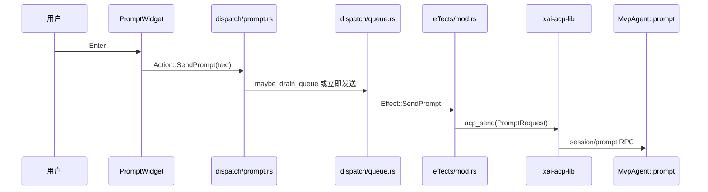
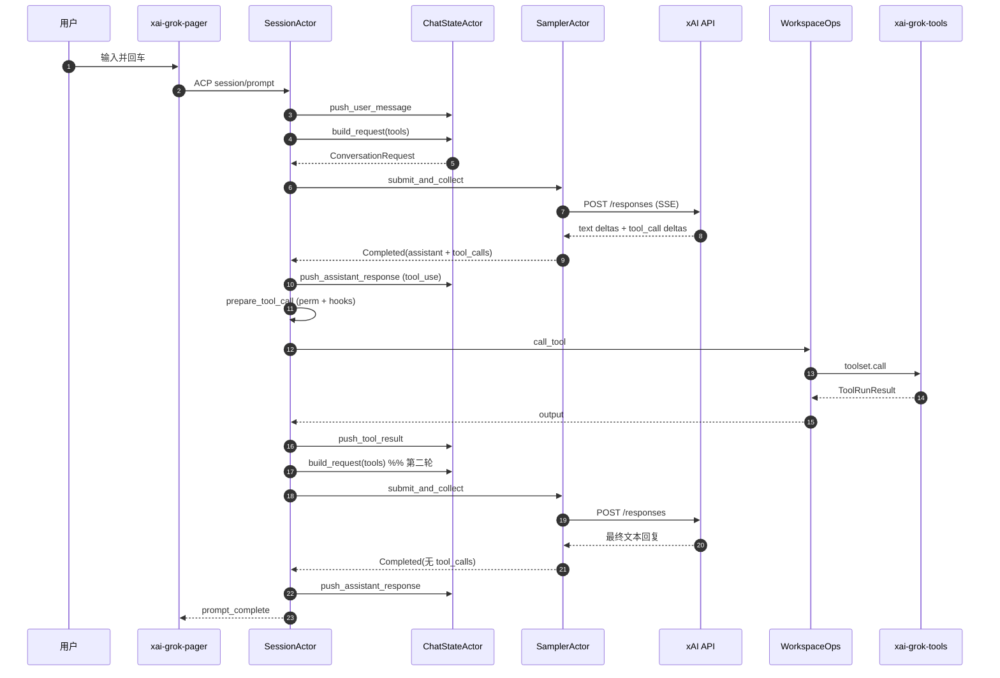

# 09. 端到端请求流程：从用户输入到多轮推理

本文档把 Grok Build 从「你在终端敲下一条指令」到「模型多轮调用工具并最终回复」的完整链路串起来，**精确到 crate、文件和关键函数**。适合配合 [codegen 逐 crate 文档](codegen/README.md) 和 [04_agent_session_runtime.md](04_agent_session_runtime.md) 一起读。

---

## 总览：四层架构

```text
用户输入
  ↓
xai-grok-pager          TUI / headless / ACP 客户端
  ↓  ACP session/prompt
xai-grok-shell          SessionActor：回合编排、权限、工具循环
  ↓  ConversationRequest
xai-grok-sampler        HTTP 推理流、重试、SSE 解析
  ↓  tool_calls
xai-grok-tools          工具注册与执行（经 xai-grok-workspace）
  ↓  tool_result
xai-chat-state          对话历史累积 → 下一轮 build_request
```

**核心 Actor：**

| Actor | Crate | 职责 |
| --- | --- | --- |
| `SessionActor` | `xai-grok-shell` | 每会话一个，拥有 prompt 队列、工具循环、ACP 通知 |
| `ChatStateActor` | `xai-chat-state` | 对话历史、token 估算、build_request |
| `SamplerActor` | `xai-grok-sampler` | HTTP 推理、流式解析、重试 |
| `Agent` | `xai-grok-agent` | system prompt、工具桥、reminder 策略（会话创建时构建） |

---

## 阶段 0：会话创建时发生了什么（一次性）

在你发第一条 prompt 之前，shell 已经建好 agent 和对话前缀。理解这一步才能明白 **system prompt / skills / AGENTS.md 各自落在哪条消息里**。

### 0.1 解析 Agent 定义

**入口：** `MvpAgent::resolve_agent_definition()`  
**文件：** `crates/codegen/xai-grok-shell/src/agent/mvp_agent/agent_ops.rs`

优先级（高→低）：

1. 模型 `agent_type`（严格 harness）
2. ACP `_meta.agentProfile`
3. CLI `--agent-profile`
4. `config.toml` 中的 `[agent] name`
5. 环境变量 `GROK_AGENT`
6. 在 cwd 向上 walk 发现 `.grok/agents/*.md`
7. 内置 `default_grok_build()`

### 0.2 构建 Agent

**入口：** `AgentRebuildSpec::build_agent_with_initial_overrides()`  
**文件：** `crates/codegen/xai-grok-shell/src/session/agent_rebuild.rs`

调用 `xai-grok-agent` 的 `AgentBuilder::build()`，得到 `Agent` 对象，其中包含：

- 渲染好的 `system_prompt` 字符串
- `ToolBridge`（工具注册表 + 模板渲染器）
- `AgentDefinition`（frontmatter 配置）
- `PromptContext`（可重新渲染的上下文）

### 0.3 安装 System Prompt

**文件：** `crates/codegen/xai-grok-shell/src/session/acp_session_impl/spawn.rs`

```text
agent.system_prompt()
  → install_system_prompt()          # prompt_build.rs
  → ConversationItem::System         # 对话 index 0
```

可选：ACP `_meta.systemPromptOverride` 会**完全绕过** agent 模板，直接使用覆盖文本（`build_spawn_system_prompt()`）。

### 0.4 安装对话前缀（第一条「假」用户消息）

**文件：** `crates/codegen/xai-grok-shell/src/session/acp_session_impl/session_setup.rs`  
**函数：** `SessionActor::initialize()` → `ensure_prefix_ready()`

在**第一次真正推理前**，会话会插入若干 **synthetic user 消息**（不是 system prompt 的一部分）：

| 顺序 | 内容 | 来源 | 函数 |
| --- | --- | --- | --- |
| ~1 | `<user_info>` OS/Shell/工作目录/日期 | shell | `build_user_message_prefix()` (`prompt_build.rs`) |
| ~2 | AGENTS.md / rules 全文 | `xai-grok-agent` | `agent.agents_md_user_reminder()` → `ConversationItem::project_instructions` |
| ~3 | Skills 目录清单 | `xai-grok-tools` | `inject_baseline_skill_reminder()` → `<system-reminder>` user 消息 |

**重要设计：** AGENTS.md 和「已发现 skills 列表」**不进 system prompt 字符串**，而是作为独立 user 消息注入，模型在对话里看到它们。

---

## 阶段 1：用户输入 → ACP `session/prompt`

### 1.1 TUI 路径（最常见）



**关键文件：**

| 步骤 | 文件 | 函数/类型 |
| --- | --- | --- |
| 按键 | `xai-grok-pager/src/app/agent_view/prompt.rs` | `handle_prompt_key` → `try_send()` |
| 动作 | `xai-grok-pager/src/app/actions.rs` | `Action::SendPrompt(String)` |
| 路由 | `xai-grok-pager/src/app/dispatch/router.rs` | `dispatch_send_prompt` |
| 队列/发送 | `xai-grok-pager/src/app/dispatch/prompt.rs` | `dispatch_send_prompt_inner` |
| 本地队列 | `xai-grok-pager/src/app/dispatch/queue.rs` | `maybe_drain_queue` |
| ACP 发送 | `xai-grok-pager/src/app/effects/mod.rs` | `Effect::SendPrompt` → `acp_send` |
| 通道 | `xai-acp-lib/src/channel.rs` | `acp_send` |

**`PromptRequest` 元数据：**

```json
{
  "_meta": {
    "promptId": "<uuid>",
    "screenMode": "fullscreen" | "headless" | ...
  },
  "prompt": [{ "type": "text", "text": "用户输入" }]
}
```

`skill_token_ranges` 会编码进 content block，供 UI 高亮 skill mention。

### 1.2 Headless 路径（`grok -p "..."`）

**文件：** `xai-grok-pager/src/headless.rs`

跳过 TUI 事件循环，直接 `acp_send(PromptRequest)`，`_meta.screenMode = "headless"`。之后 shell 侧路径与 TUI **完全相同**。

### 1.3 Shell 接收 prompt

**文件：** `xai-grok-shell/src/agent/mvp_agent/acp_agent.rs`  
**函数：** `MvpAgent::prompt`

1. 解析 `session_id` → `SessionHandle`
2. 分配 `prompt_id`（来自 `_meta` 或新 UUID）
3. 发送 `SessionCommand::Prompt` 到 session actor 邮箱
4. **阻塞等待**本轮结束（`respond_to` oneshot）

**文件：** `xai-grok-shell/src/session/acp_session_impl/run_loop.rs`

收到 `SessionCommand::Prompt` 后：

1. `queue_input()` — 入队 `pending_inputs`
2. `maybe_start_running_task()` — 若无运行中任务，提升队首为 `AgentTask`
3. `run_task()` → `handle_prompt()`

---

## 阶段 2：`handle_prompt` — 回合开始

**文件：** `crates/codegen/xai-grok-shell/src/session/acp_session_impl/turn.rs`  
**函数：** `SessionActor::handle_prompt`

### 2.1 生命周期钩子

```rust
// turn.rs ~239
for contributor in self.extension_registry.turn_lifecycle_contributors() {
    contributor.on_turn_start(&turn_start_input).await;
}
```

### 2.2 发出 `Event::TurnStarted`

```rust
// turn.rs ~466-513
self.emit_event(Event::TurnStarted {
    session_id, turn_number, model_id, yolo_mode, ...
});
```

Pager 据此更新 UI 状态（`AgentState::TurnRunning`）。

### 2.3 用户消息写入历史

```rust
// turn.rs
self.chat_state_handle.push_user_message(parsed_user_items).await;
```

**ChatState 路径：**

`ChatStateHandle::push_user_message`  
→ `xai-chat-state/src/handle.rs`  
→ `ChatStateActor::push_message` (`actor/mutations.rs`)  
→ `state.conversation.push(item)` + JSONL 持久化

### 2.4 解析 prompt 中的 skills

**函数：** `parse_prompt_with_skills`（`turn.rs`）

若用户在 prompt 里 `@skill-name` 或触发 skill 加载，会在此解析并可能：

- 把 skill 正文加载进上下文
- 更新 `SkillManager` 的 announced 集合
- 产生额外的 synthetic user 消息

### 2.5 进入 agentic 循环

```rust
// turn.rs ~846
process_conversation_turn_with_recovery(...).await
  → process_conversation_turn(...)   // 内层 while loop
```

---

## 阶段 3：System Prompt 组装（详解）

System prompt 在**会话创建时**由 `AgentBuilder::build()` 渲染，不是每轮重新拼。但理解组装规则对读 `prompt.md` 和 skill 注入至关重要。

### 3.1 模板源：`prompt.md`

| 资源 | 路径 |
| --- | --- |
| 明文模板 | `crates/codegen/xai-grok-agent/templates/prompt.md` |
| 加密存储 | `src/prompt/prompt_encrypted.rs`（`encrypt_templates.py` 生成） |
| 解密访问 | `src/prompt/template.rs::base_template()` |

`prompt.md` 包含：身份、工具调用约定、后台任务说明、格式规则等。使用 MiniJinja 语法 `${{ tools.by_kind.read }}` 等，**不是** `{{ }}`（避免与 Markdown 冲突）。

### 3.2 `PromptMode::Extend` vs `Full`

**文件：** `xai-grok-agent/src/prompt/context.rs::render_with_renderer`

```273:299:crates/codegen/xai-grok-agent/src/prompt/context.rs
        let prompt = match self.prompt_mode {
            PromptMode::Extend => {
                // 1. 选 base 模板（prompt.md / subagent_prompt.md / apply_patch / custom）
                let mut prompt = render(base)?;
                // 2. 追加 agent 定义 body（.grok/agents/*.md 中 --- 后的 Markdown）
                if let Some(body) = &self.prompt_body {
                    prompt.push_str("\n\n");
                    prompt.push_str(&render(body).unwrap_or_else(|| body.clone()));
                }
                prompt
            }
            PromptMode::Full => render(self.prompt_body.as_deref().unwrap_or(""))?,
        };
```

| 模式 | 结果 |
| --- | --- |
| **Extend**（默认） | `render(prompt.md)` + `\n\n` + `render(agent_body)` |
| **Full** | 仅 `render(agent_body)`，作者完全控制 system prompt |

### 3.3 MiniJinja 渲染与工具名占位符

**`TemplateRenderer`：** `xai-grok-tools/src/types/template_renderer.rs`

- 在 `ToolRegistryBuilder::finalize()` 时创建
- 存入 `ToolBridge` 的 `Resources`
- `render_with_extra(template, placeholders)` 合并：
  - `tools.by_kind.*` — 各 `ToolKind` 的**模型可见名称**
  - `tools.*` 参数名覆盖
  - `os_name`, `shell_path`, `working_directory`, `current_date` 等

**环境定义：** `description.rs::make_desc_env()` — 定界符 `${{ }}` / `$`

### 3.4 Skills 注入：三条路径

Skills 有**三种不同的注入方式**，不要混淆：

#### 路径 A：Agent 定义 `skills:` 预加载 → **写入 system prompt**

**文件：** `xai-grok-agent/src/builder.rs` ~685-698

```685:698:crates/codegen/xai-grok-agent/src/builder.rs
        let preloaded =
            crate::prompt::skills::resolve_preloaded_skills(&definition.skills, &skill_info)
                .await;
        // ...
        let injection = crate::prompt::skills::format_skills_for_injection(&preloaded);
        if !injection.is_empty() {
            definition.prompt_body =
                Some(injection + &definition.prompt_body.unwrap_or_default());
        }
```

- frontmatter 里 `skills: [code-review, ...]` 指定的 skill
- `format_skills_for_injection()` 把 skill 正文包成 markdown envelope
- **拼进 `prompt_body`**，最终进入 **Extend 模式的 system prompt 尾部**

#### 路径 B：文件系统发现的全量 skill 列表 → **synthetic user 消息**

**发现：** `xai-grok-agent/src/prompt/skills.rs::list_skills_with_plugins()`  
扫描 `.grok/skills/`、`~/.cursor/skills/` 等目录。

**种子：** `AgentBuilder::build()` → `tool_bridge.seed_skill_discovery()`  
**运行时管理：** `xai-grok-tools` 的 `SkillManager`

**注入时机：** `SessionActor::inject_baseline_skill_reminder()` (`session_setup.rs`)

```71:92:crates/codegen/xai-grok-shell/src/session/acp_session_impl/session_setup.rs
    pub(super) async fn inject_baseline_skill_reminder(...) {
        let effects = bridge.apply_pending_skill_update().await?;
        if let Some(item) = self.wrap_skill_reminder(&effects) {
            conversation.push(item);  // <system-reminder> user 消息
        }
    }
```

- 产出 `<agent_skills>` XML 或 markdown 列表（Cursor harness 用 XML）
- **不进 system prompt**，是对话里的一条 user 消息
- 告诉模型「有哪些 skill 可用、如何用 `skill` 工具加载」

#### 路径 C：用户回合中动态加载 skill → **user 消息 + 可能更新列表**

用户输入 `@skill` 或模型调用 `skill` 工具时：

1. `skill` 工具读取 `SKILL.md` 正文
2. 作为 **tool result** 或 **follow-up user 消息** 进入历史
3. `SkillManager` 可能发 `SkillDiscoveryReminder`，在下一工具批次后 `flush_pending_skill_reminders`

### 3.5 AGENTS.md 注入

**发现：** `xai-grok-agent/src/prompt/agents_md.rs::read_agents_config_with_paths()`  
从 cwd 向上 walk 到 git root，读 `AGENTS.md`、`.cursorrules` 等。

**格式化：** `format_agents_md_section()` → 带 `## From: <path>` 的块

**注入：** `Agent::agents_md_user_reminder()` → `ConversationItem::project_instructions`  
在 `spawn.rs` 和 `ensure_prefix_ready()` 插入，**不是 system prompt**。

### 3.6 首条 synthetic user 消息：`<user_info>`

**文件：** `xai-grok-shell/src/session/prompt_build.rs::build_user_message_prefix()`

默认模板包含：

```xml
<user_info>
OS Version: ...
Shell: ...
Workspace Path: ...
Today's date: ...
</user_info>
```

以及可选的 `<git_status>` 块。这与 `prompt.md` 里写的「user_info 在 user message」一致。

### 3.7 内容落点总结表

| 内容 | 落在哪 | 何时写入 |
| --- | --- | --- |
| `prompt.md` + agent body（Extend） | `ConversationItem::System` | 会话 spawn |
| frontmatter `skills:` 预加载正文 | system prompt 内（prompt_body 前缀） | `AgentBuilder::build()` |
| 发现的 skill 目录列表 | synthetic user `<system-reminder>` | `initialize` / `ensure_prefix_ready` |
| AGENTS.md / rules | `project_instructions` user 消息 | spawn / `ensure_prefix_ready` |
| `<user_info>` / git status | synthetic user 消息 | `ensure_prefix_ready` |
| 用户真实 prompt | `ConversationItem::User` | `handle_prompt` |
| 动态加载的 skill 正文 | tool result 或 user 消息 | 工具执行后 |

---

## 阶段 4：构建 LLM 请求（含 tool 描述）

每一轮 agentic 循环开始时，`SessionActor::process_conversation_turn` 会构建一次 `ConversationRequest`。

### 4.1 准备工具定义

**文件：** `xai-grok-shell/src/session/acp_session_impl/sampler_turn.rs`  
**函数：** `prepare_tool_definitions_inner`

```text
agent.tool_bridge().tool_definitions_builtins_only().await
  → FinalizedToolset::tool_definitions_builtins_only()   # xai-grok-tools
  → Vec<ToolDefinition>   # name, description, parameters JSON Schema
```

**注意：** 发给模型的列表**默认不含 MCP 工具**（名字带 `__` 的会被过滤）。MCP 工具通过内置的 `CallMcpTool` 等元工具间接调用。

每个 `ToolDefinition` 在 registry finalize 时生成：

**文件：** `xai-grok-tools/src/registry/types.rs::ToolRegistryBuilder::finalize`  
→ `ToolMetadata::versioned_definition()` — 渲染 description 模板、参数 schema

### 4.2 转为 API `ToolSpec`

**文件：** `xai-grok-shell/src/session/acp_session_impl/sampler_turn.rs`  
**函数：** `turn_base_tool_specs`

- `ToolSpec::from(ToolDefinition)`
- Plan 模式可能过滤部分工具（`filter_cursor_tools_by_plan_mode`）
- 若开启 structured output，追加 `StructuredOutput` 工具

### 4.3 `ChatStateActor::build_conversation_request`

**调用链：**

```text
chat_state_handle.build_request(tools, memory_reminder, ...)
  → ChatStateCommand::BuildConversationRequest
  → xai-chat-state/src/actor/request_builder.rs::build_conversation_request
```

**核心逻辑：**

1. 克隆 `state.conversation`（完整历史）
2. 可选：prune 旧的大 tool result（`should_prune` / `prune_conversation`）
3. 可选：compaction 替换旧消息
4. 注入 memory reminder（若启用 experimental memory）
5. 组装 `ConversationRequest`

```127:131:crates/codegen/xai-chat-state/src/actor/request_builder.rs
        ConversationRequest {
            items,                    // 完整对话 Item 列表
            tools: tool_definitions,  // 本轮可用工具 schema
            hosted_tools: vec![],     // shell 层后续填充 web_search 等
            model: Some(...),
            temperature, max_output_tokens, ...
            x_grok_conv_id, x_grok_req_id, ...
        }
```

### 4.4 Shell 层 enrich

**文件：** `turn.rs`（`process_conversation_turn` 内）

- 设置 `hosted_tools`（服务端 web search / x search）
- `json_schema`（structured output）
- token clamp、trace 头
- `effective_tool_overrides`

### 4.5 序列化到 HTTP body

**文件：** `xai-grok-sampling-types/src/conversation.rs`

| API | 转换 |
| --- | --- |
| Chat Completions | `From<ConversationRequest> for ChatCompletionRequest` — `tools: Option<Vec<ToolDefinition>>` |
| Responses API | `build_responses_tools()` — function tools + hosted tools |
| Messages (Anthropic) | `conversation_stream_messages` 路径 |

---

## 阶段 5：发送给 LLM（Sampler）

### 5.1 提交推理

**文件：** `xai-grok-shell/src/session/acp_session_impl/sampler_turn.rs`  
**函数：** `run_turn_via_sampler`

```text
prepare_sampler_for_turn()     # 推送最新 auth、model config
sampler_handle.submit_and_collect(request_id, request)
```

### 5.2 Sampler Actor

**文件：** `xai-grok-sampler/src/handle.rs` → `actor/mod.rs`

```text
SamplerCommand::Submit { request, completion_tx }
  → request_task::run_request_task
  → run_one_attempt (带重试)
  → SamplingClient::conversation_stream_responses / conversation_stream / conversation_stream_messages
```

### 5.3 HTTP 请求

**文件：** `xai-grok-sampler/src/client.rs::create_response_stream`

- `POST {base_url}/responses`（或 `/chat/completions`）
- `Accept: text/event-stream`
- Body：`CreateResponse` JSON，含 `input`（对话 items）和 `tools`（schema 数组）
- Bearer token 来自 `SamplerConfig`

### 5.4 流式解析

**文件：** `xai-grok-sampler/src/stream/`

| 事件（Responses API） | 转为 |
| --- | --- |
| `response.output_item.added` (function_call) | `SamplingEvent::ToolCallDelta { id, name }` |
| `response.function_call_arguments.delta` | `ToolCallDelta { arguments_delta }` |
| 流结束 | `SamplingEvent::Completed { items, tool_calls }` |
| 文本 delta | `SamplingEvent::TextDelta` |

**Shell 消费：** `SessionActor::handle_sampling_event` (`tool_calls.rs`)

- `ToolCallDelta` → ACP `ToolCallDeltaChunk`（UI 实时显示）
- `TextDelta` → `AgentMessageChunk`
- `Completed` → 回合推理结束，进入工具执行

---

## 阶段 6：记录模型输出 → 执行工具

### 6.1 把 assistant 消息写入历史

**文件：** `turn.rs` ~2254

```rust
for item in response.items {
    match item {
        ConversationItem::Assistant(_) => {
            self.record_assistant_response(item).await;  // 含 tool_use 块
        }
        _ => self.chat_state_handle.push_tool_result(item),
    }
}
```

**关键：** assistant 的 `tool_use` **在工具执行之前** 就 commit 进 `xai-chat-state`。这保证历史里永远是「assistant 先要工具 → 再 tool result」的顺序。

### 6.2 `execute_tool_calls` 三阶段

**文件：** `xai-grok-shell/src/session/acp_session_impl/tool_calls.rs`

```text
Phase 1  顺序 pre-flight（每个 tool call）
         prepare_tool_call()
           → 解析参数 tool_bridge.try_parse()
           → plan_mode_edit_gate
           → dispatch_pre_tool_use (xai-grok-hooks)
           → run_pre_tool_use_client_hook (ACP x.ai/hooks/run)
           → permissions.request_with_edit_path_context (xai-grok-workspace)
         → PreparedToolCall 或 ToolLoop 终止/跳过

Phase 2  并行 dispatch（已批准的 calls）
         dispatch_tool()
           → workspace_ops.call_tool()
           → FinalizedToolset::call()
           → 具体工具实现 (read_file, Bash, ...)

Phase 3  后处理
         handle_bridge_tool_success / handle_tool_error
           → push_tool_result()
         post_tool_use / post_tool_use_failure hooks
         deferred_followups → push_user_message
```

### 6.3 权限检查细节

**文件：** `xai-grok-workspace/src/permission/manager.rs`

决策链：

1. YOLO 模式 → 快速允许
2. 持久化 grant（用户之前点过「始终允许」）
3. Bash 专用评估器
4. Auto-mode 分类器（远程 settings）
5. UI 弹窗（pager 显示 permission card）

结果：

| 决策 | 效果 |
| --- | --- |
| Allow | 进入 Phase 2 |
| PolicyDeny | `tool_result` 写拒绝原因，**继续**本轮其他工具 |
| Reject | 用户拒绝 → `ToolLoop::PermissionReject`（**终止**回合） |
| FollowupMessage | 注入 user 消息，继续循环 |

### 6.4 `pre_tool_use` 钩子

**文件 hooks：** `xai-grok-hooks/src/dispatcher.rs::dispatch_pre_tool_use`  
**Shell 集成：** `tool_calls.rs::dispatch_pre_tool_use`

- 读 `~/.grok/hooks/` 和 `.grok/hooks/` 下 JSON 定义
- 可 **deny** 阻止工具（仍写 `tool_result: Hook denied`）
- 默认 fail-open（钩子崩溃不阻塞，除非显式 deny）

### 6.5 工具实际执行

```text
dispatch_tool (tool_dispatch.rs)
  → WorkspaceOps::call_tool (xai-grok-workspace)
  → FinalizedToolset::call (xai-grok-tools)
  → 具体实现，例如：
       grok_build/bash.rs        run_terminal_cmd
       grok_build/read_file.rs   read_file
       skills/skill.rs           skill 工具加载 SKILL.md
       mcp 元工具                转发到 xai-grok-mcp
```

返回 `ToolRunResult { output, prompt_text, effective_tool_name }`。

### 6.6 工具结果写入历史

**成功：** `handle_bridge_tool_success` →  
`ConversationItem::tool_result(tool_call_id, content)` 或带 images 的变体

**失败：** `handle_tool_error` → error 文本的 `tool_result`

**未执行（权限/钩子）：** `handle_tool_not_executed`

**路径：** 全部 → `chat_state_handle.push_tool_result` → `ChatStateActor::push_message`

**形状：** `xai-grok-sampling-types/src/conversation.rs`

```rust
ConversationItem::ToolResult(ToolResultItem {
    tool_call_id,
    content,      // 字符串或结构化块
    images,       // 可选
})
```

---

## 阶段 7：下一轮推理（agentic loop）

**文件：** `turn.rs::process_conversation_turn` 内 `loop { ... }`（~1922 起）

### 7.1 `execute_tool_calls` 返回后

| `ToolLoop` 变体 | 行为 |
| --- | --- |
| `Continue` | `loop` 继续 → 再次 `build_request` |
| `HookDenied` | 非终止；deny 已在 history，继续 |
| `PermissionReject` / `Cancelled` | `TurnOutcome::Cancelled` |
| `FollowupMessage` | 加 user 消息，`continue` |

### 7.2 循环体（每轮）

```text
1. prepare_tool_definitions_timed()
2. chat_state_handle.build_request(effective_tools, ...)
      # 此时 conversation 已含：user, assistant+tool_use, tool_result, ...
3. run_turn_via_sampler(request)
4. record_assistant_response
5. if tool_calls.is_empty() → TurnOutcome::Completed ✓
6. else execute_tool_calls → goto 1
```

### 7.3 安全阀

- `max_turns` — 工具轮次上限
- `MAX_CONSECUTIVE_IDENTICAL_TOOL_CALLS` — 相同命令重复执行 stationarity 停止（~1925）
- preflight compaction — 上下文快满时先压缩再请求
- doom-loop recovery — sampler 层检测重复 tool 模式

### 7.4 回合结束

`handle_prompt` 返回 `PromptTurnResult` → `MvpAgent::prompt` 的 oneshot 完成 → pager 收到 `prompt_complete` → `finish_turn` → `maybe_drain_queue` 发下一条 queued prompt。

---

## 完整时序图（单轮含一次工具调用）



---

## 关键文件速查表

| 你想看… | 去这里 |
| --- | --- |
| 用户按键 → ACP | `xai-grok-pager/src/app/dispatch/prompt.rs` |
| ACP → SessionActor | `xai-grok-shell/src/agent/mvp_agent/acp_agent.rs` |
| 回合主循环 | `xai-grok-shell/src/session/acp_session_impl/turn.rs` |
| 工具执行 | `xai-grok-shell/src/session/acp_session_impl/tool_calls.rs` |
| 权限 | `xai-grok-workspace/src/permission/manager.rs` |
| 钩子 | `xai-grok-hooks/src/dispatcher.rs` |
| Agent / prompt 组装 | `xai-grok-agent/src/builder.rs`, `prompt/context.rs` |
| Skills 发现与注入 | `xai-grok-agent/src/prompt/skills.rs`, `session_setup.rs` |
| AGENTS.md | `xai-grok-agent/src/prompt/agents_md.rs` |
| 对话历史 | `xai-chat-state/src/actor/request_builder.rs`, `mutations.rs` |
| 工具 schema | `xai-grok-tools/src/registry/types.rs` |
| HTTP 推理 | `xai-grok-sampler/src/client.rs`, `stream/responses.rs` |
| Wire 类型 | `xai-grok-sampling-types/src/conversation.rs` |

---

## 调试建议

```sh
# 只看 agent prompt 组装（不跑完整 TUI）
cargo test -p xai-grok-agent

# 打印各 section 的 system prompt（若 grok 支持）
grok prompt --section template

# 追踪日志（示例）
RUST_LOG=xai_grok_shell=debug,xai_chat_state=debug cargo run -p xai-grok-pager-bin
```

在代码里打断点/日志的优先位置：

1. `handle_prompt` 入口 — 确认 prompt 到达 shell
2. `build_conversation_request` — 看 `items` 和 `tools` 数组
3. `run_turn_via_sampler` 前后 — 看请求/响应
4. `execute_tool_calls` — 看每个 tool 的 prepare/dispatch 结果
5. `push_tool_result` — 确认 history 形状正确

---

## 相关文档

- [04_agent_session_runtime.md](04_agent_session_runtime.md) — session 运行时概览
- [05_tools_workspace_permissions.md](05_tools_workspace_permissions.md) — 工具与权限
- [codegen/xai-grok-agent.md](codegen/xai-grok-agent.md) — Agent 定义格式
- [codegen/xai-grok-shell.md](codegen/xai-grok-shell.md) — Shell 模块图
- [codegen/xai-chat-state.md](codegen/xai-chat-state.md) — 对话状态 Actor
- [codegen/xai-grok-sampler.md](codegen/xai-grok-sampler.md) — 推理层
- [codegen/xai-grok-tools.md](codegen/xai-grok-tools.md) — 工具实现
