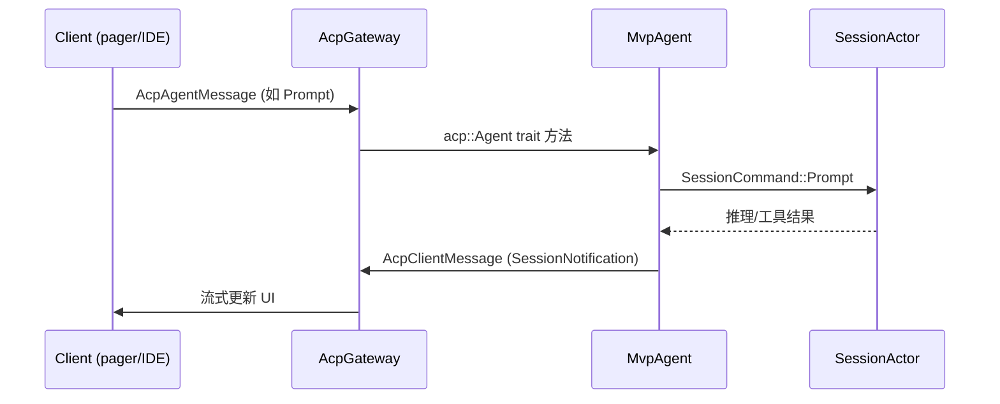

# 10. ACP（Agent Client Protocol）协议与代码实现

本文说明 Grok Build 中 **ACP** 是什么、线上格式如何、以及在本仓库里如何落地。ACP 是 **客户端（TUI / IDE / headless）** 与 **Agent 运行时（`xai-grok-shell`）** 之间的标准通信协议。

---

## 1. ACP 是什么

**ACP（Agent Client Protocol）** 是一套让「宿主 UI」与「Agent 后端」解耦的 RPC 协议。Grok Build 中：

- **Agent 端**：`MvpAgent`（`xai-grok-shell`）实现 `acp::Agent` trait
- **Client 端**：`xai-grok-pager` TUI、headless runner、外部 IDE（通过 `grok agent stdio` / `grok serve`）实现 `acp::Client` trait

**依赖的 Rust crate：**

| Crate | 角色 |
| --- | --- |
| `agent-client-protocol` | 上游协议定义：请求/响应类型、`Agent`/`Client` trait、stdio/WebSocket 连接 |
| `xai-acp-lib` | 本仓库封装：类型化 channel、gateway、按行 JSON 读写 |

---

## 2. 线上格式与传输

### 2.1 线格式：JSON-RPC + 换行分隔

ACP 在 Grok Build 里使用 **JSON-RPC 风格** 消息，**每条消息一行 JSON**（NDJSON），通过 `LineBufferedRead` 按行读取。

**相关代码：**

- `crates/codegen/xai-acp-lib/src/line_reader.rs` — 行缓冲读取
- `crates/codegen/xai-acp-lib/src/stdin_reader.rs` — 从 stdin spawn 行读取任务

### 2.2 传输方式

| 模式 | 场景 | 入口文件 |
| --- | --- | --- |
| **进程内 channel** | 默认 TUI：`grok` 在同一进程 spawn `MvpAgent` | `xai-grok-pager/src/acp/spawn.rs` |
| **stdio** | `grok agent stdio` — IDE/自动化客户端连子进程 stdin/stdout | `xai-grok-shell/src/agent/app.rs` |
| **WebSocket** | `grok serve` — 远程 TUI 连 WebSocket | `xai-grok-shell/src/agent/server.rs` |
| **Leader relay** | 多客户端共享一个 leader agent | `xai-grok-shell/src/agent/app.rs`（leader 模式） |

**stdio 模式核心：**

```text
Client (IDE)  ←stdin/stdout→  AgentSideConnection::new(MvpAgent, ...)
```

`AgentSideConnection` 来自 `agent-client-protocol`，负责 JSON-RPC 编解码和请求路由到 `MvpAgent` 的 trait 方法。

**WebSocket 模式核心：**

- `server.rs` 用 axum 起 WS 服务
- 每个 WS 连接桥接到同一个持久 `MvpAgent` 实例（会话在断线重连后仍存活）
- 内部仍用 `AcpAgentGatewayReceiver` 转发 `AcpClientMessage`

---

## 3. 架构：Client ↔ Agent 消息流



### 3.1 `xai-acp-lib` 核心抽象

**文件：** `crates/codegen/xai-acp-lib/src/`

| 模块 | 作用 |
| --- | --- |
| `message.rs` | `AcpAgentMessage` / `AcpClientMessage` 枚举，映射到标准 ACP 方法名 |
| `channel.rs` | `acp_channels()` 创建双向 mpsc；`acp_send()` 带 oneshot 响应 |
| `gateway.rs` | `AcpGatewaySender` / `AcpGatewayReceiver` — 把 channel 消息转发到 `AgentSideConnection` |
| `normalize.rs` | 消息规范化 |

**Agent 侧入站消息（Client → Agent）：**

定义于 `message.rs` 的 `agent` 模块：

| 变体 | ACP 方法名 | 用途 |
| --- | --- | --- |
| `Initialize` | `initialize` | 握手、能力协商 |
| `Authenticate` | `authenticate` | 登录 / API key |
| `NewSession` | `session/new` | 创建会话 |
| `LoadSession` | `session/load` | 恢复历史会话 |
| `Prompt` | `session/prompt` | **发送用户 prompt，启动一轮** |
| `Cancel` | `session/cancel` | 取消当前回合 |
| `SetSessionMode` | `session/set_mode` | 切换模式（如 plan） |
| `SetSessionModel` | `session/set_model` | 切换模型 |
| `ExtMethod` | 自定义 `x.ai/*` | 扩展 RPC |
| `ExtNotification` | 自定义通知 | 扩展单向消息 |

**Client 侧入站消息（Agent → Client）：**

| 变体 | ACP 方法名 | 用途 |
| --- | --- | --- |
| `SessionNotification` | `session/update` | **流式会话更新（主通道）** |
| `RequestPermission` | `session/request_permission` | 权限弹窗 |
| `ReadTextFile` / `WriteTextFile` | `fs/*` | 客户端文件系统（IDE 集成） |
| `CreateTerminal` 等 | `terminal/*` | 终端集成 |
| `ExtMethod` / `ExtNotification` | `x.ai/*` | 扩展 |

### 3.2 进程内 TUI 如何接线

**文件：** `xai-grok-pager/src/acp/spawn.rs`

```text
1. acp_channels() → (acp_client, acp_agent)
2. 后台线程 + LocalSet：
     MvpAgent::new(...)
     AcpGatewayReceiver::new(acp_agent_rx, MvpAgent).run()
3. 主线程 TUI 持有 acp_client（AcpClientChannel）
4. Effect::SendPrompt → acp_send(PromptRequest, &acp_tx)
```

---

## 4. 标准生命周期（代码路径）

### 4.1 `initialize`

**实现：** `MvpAgent::initialize` — `acp_agent.rs:73`

- 启动 subagent coordinator
- worktree 自动 GC、session 清理、搜索索引 bootstrap
- 返回 agent 能力（模型列表、auth 方法等）写入 `InitializeResponse` 的 `_meta`

### 4.2 `authenticate`

**实现：** `MvpAgent::authenticate` — `acp_agent.rs:541`

- 浏览器 OAuth、API key、OIDC 等
- 更新 `AuthManager` 凭证
- 与 xAI 账号体系打通（`auth.json`）

### 4.3 `session/new`

**实现：** `MvpAgent::new_session` — `acp_agent.rs:931`

关键步骤：

1. 解析 `_meta`：`x.ai/session`（会话类型）、`x.ai/hooks`（客户端钩子）、`x.ai/mcp/servers`（SDK 内嵌 MCP）等
2. `resolve_agent_definition()` — 选 agent profile
3. `spawn_session_on_thread()` — 创建 `SessionActor` + workspace
4. `AgentBuilder::build()` — 组装 system prompt 和工具
5. `SessionActor::initialize()` — 安装对话前缀（user_info、AGENTS.md、skills 列表）

### 4.4 `session/prompt`（核心）

**实现：** `MvpAgent::prompt` — `acp_agent.rs:2144`

```text
SessionHandle.cmd_tx.send(SessionCommand::Prompt { ... })
  → run_loop 入队 queue_input
  → maybe_start_running_task
  → handle_prompt → process_conversation_turn (agentic loop)
  → 完成后 respond_to oneshot → PromptResponse
```

详见 [09_end_to_end_request_flow.md](09_end_to_end_request_flow.md)。

### 4.5 `session/update`（通知）

Agent 通过 `SessionNotification` 向 Client 推送流式内容：

- `AgentMessageChunk` — 模型文本流
- `ToolCall` / `ToolCallUpdate` — 工具调用状态
- `UserMessageChunk` — 用户消息回显
- 以及 xAI 扩展的 `x.ai/session/update` 载荷

**Client 处理：** `xai-grok-pager/src/app/acp_handler/mod.rs::handle`

---

## 5. x.ai 扩展方法（Grok 私有扩展）

标准 ACP 之上，Grok 用 `ExtMethod` / `ExtNotification` 承载 **`x.ai/*`** 命名空间。实现分散在 `xai-grok-shell/src/extensions/`。

### 5.1 扩展分发

`MvpAgent` 在 `ext_method` / `ext_notification` 中按方法名前缀路由到各 `extensions/*.rs` 模块。

### 5.2 主要扩展一览

| 前缀/方法 | 文件 | 用途 |
| --- | --- | --- |
| `x.ai/mcp/*` | `extensions/mcp.rs` | MCP 服务器列表、认证、开关、直接调用 |
| `x.ai/hooks/list`, `x.ai/hooks/action` | `extensions/hooks.rs` | 钩子 UI 与客户端钩子注册 |
| `x.ai/skills/*` | `extensions/skills.rs` | Skill 增删改查、toggle |
| `x.ai/queue/changed` | `xai-prompt-queue` + shell | Prompt 队列同步 |
| `x.ai/session/search` | `extensions/session_search.rs` | 会话搜索 |
| `x.ai/git/*` | `extensions/git.rs` | Git 状态、stage、diff |
| `x.ai/hunk-tracker/*` | `extensions/hunk_tracker.rs` | Diff hunk accept/reject |
| `x.ai/settings/update` | `mvp_agent/mod.rs` | 远程 settings 推送 |
| `x.ai/announcements/update` | `xai-grok-announcements` | 启动横幅 |
| `x.ai/session/interjection` | `acp_session_impl/interjection.rs` | 回合中注入 |
| `x.ai/monitor_event` | 后台任务监控 | |
| `x.ai/suggestPrompt` | prompt 建议 | |
| `x.ai/log` | `xai-grok-pager/unified_log.rs` | 统一日志流 |

**类型定义（wire DTO）：** `xai-hooks-plugins-types` — hooks/plugins/MCP 的 ACP 载荷结构，供 shell 和 pager 共享。

### 5.3 `_meta` 约定（session/new / prompt）

常用 `_meta` 键：

| 键 | 含义 |
| --- | --- |
| `promptId` | 客户端分配的 prompt UUID |
| `screenMode` | `fullscreen` / `headless` / `minimal` |
| `agentProfile` | 使用的 agent 定义名 |
| `x.ai/session` | 会话类型（Build / 等） |
| `x.ai/hooks` | 客户端 PreToolUse 等钩子回调 ID |
| `x.ai/mcp/servers` | SDK 进程内 MCP 服务器描述 |
| `x.ai/persist` | 是否持久化会话 |
| `systemPromptOverride` | 覆盖 system prompt |

---

## 6. Client 端实现（xai-grok-pager）

### 6.1 发送 prompt

```text
Action::SendPrompt
  → dispatch_send_prompt_inner
  → Effect::SendPrompt
  → acp_send(PromptRequest { session_id, prompt, _meta })
```

**文件：** `app/dispatch/prompt.rs`, `app/effects/mod.rs`

### 6.1 接收通知

```text
event_loop 收到 AcpClientMessage
  → acp_handler::handle(msg, &mut app)
  → 按类型更新 AgentView / scrollback / 权限弹窗 / MCP 状态
```

**子模块：**

| 模块 | 职责 |
| --- | --- |
| `acp_handler/session_notification.rs` | `session/update` 主逻辑 |
| `acp_handler/permissions.rs` | 权限请求 UI |
| `acp_handler/mcp.rs` | MCP 状态更新 |
| `acp_handler/queue.rs` | 队列同步 |
| `acp_handler/subagent_activity.rs` | 子 agent 活动 |

### 6.3 Headless

**文件：** `xai-grok-pager/src/headless.rs`

跳过 TUI，直接 `acp_send`，把 `SessionNotification` 打印到 stdout。

---

## 7. Agent 端实现（xai-grok-shell）

### 7.1 `MvpAgent`

**文件：** `crates/codegen/xai-grok-shell/src/agent/mvp_agent/`

| 子模块 | 职责 |
| --- | --- |
| `acp_agent.rs` | `impl acp::Agent for MvpAgent` — 所有标准方法 |
| `mod.rs` | agent 级状态、ext 路由、settings |
| `session_lifecycle.rs` | `x.ai/sessions/changed` |
| `agent_ops.rs` | session spawn、agent 定义解析 |

### 7.2 `SessionActor`

每个 ACP session 对应一个 `SessionActor`（`session/acp_session_impl/`），通过 `SessionHandle.cmd_tx` 接收 `SessionCommand`，**不直接处理 ACP 线协议**。

ACP 与 Session 的分层：

```text
ACP 层 (MvpAgent)     — 协议、多 session 路由、ext 方法
Session 层 (SessionActor) — 单会话推理、工具、历史、权限
```

### 7.3 三种对外服务模式

| 命令 | 文件 | 说明 |
| --- | --- | --- |
| 内嵌（默认 TUI） | `pager/acp/spawn.rs` | 同进程 channel |
| `grok agent stdio` | `agent/app.rs` | stdin/stdout ACP |
| `grok serve` | `agent/server.rs` | WebSocket ACP |

---

## 8. 与端到端流程的关系

```text
用户输入
  → [ACP] session/prompt
  → SessionActor::handle_prompt
  → [非 ACP] sampler / tools / chat-state
  → [ACP] session/update 流式通知
  → pager 渲染
```

ACP **不负责** LLM HTTP 或工具执行；它只负责 **客户端与 shell 之间的控制面 + UI 同步**。

---

## 9. 调试与测试

```sh
# stdio 模式 E2E（仓库内测试）
# crates/codegen/xai-grok-shell/tests/test_built_binary_e2e.rs

# 手动：起一个 agent stdio，另一终端用 ACP client 连
grok agent stdio
```

**日志：**

```sh
RUST_LOG=xai_acp_lib=debug,xai_grok_shell=debug cargo run -p xai-grok-pager-bin
```

---

## 10. 关键文件索引

| 主题 | 路径 |
| --- | --- |
| ACP 库入口 | `crates/codegen/xai-acp-lib/src/lib.rs` |
| 消息枚举 | `crates/codegen/xai-acp-lib/src/message.rs` |
| Gateway | `crates/codegen/xai-acp-lib/src/gateway.rs` |
| Agent trait 实现 | `crates/codegen/xai-grok-shell/src/agent/mvp_agent/acp_agent.rs` |
| TUI spawn | `crates/codegen/xai-grok-pager/src/acp/spawn.rs` |
| TUI 消息处理 | `crates/codegen/xai-grok-pager/src/app/acp_handler/mod.rs` |
| stdio 服务 | `crates/codegen/xai-grok-shell/src/agent/app.rs` |
| WebSocket 服务 | `crates/codegen/xai-grok-shell/src/agent/server.rs` |
| x.ai 扩展 | `crates/codegen/xai-grok-shell/src/extensions/` |
| 扩展 DTO 类型 | `crates/codegen/xai-hooks-plugins-types/src/lib.rs` |

---

## 相关阅读

- [09_end_to_end_request_flow.md](09_end_to_end_request_flow.md) — prompt 进入 shell 后的完整链路
- [11_mcp_protocol.md](11_mcp_protocol.md) — MCP 如何通过 ACP 扩展暴露
- [codegen/xai-acp-lib.md](codegen/xai-acp-lib.md) — crate 简介
- [codegen/xai-grok-shell.md](codegen/xai-grok-shell.md) — Agent 运行时
