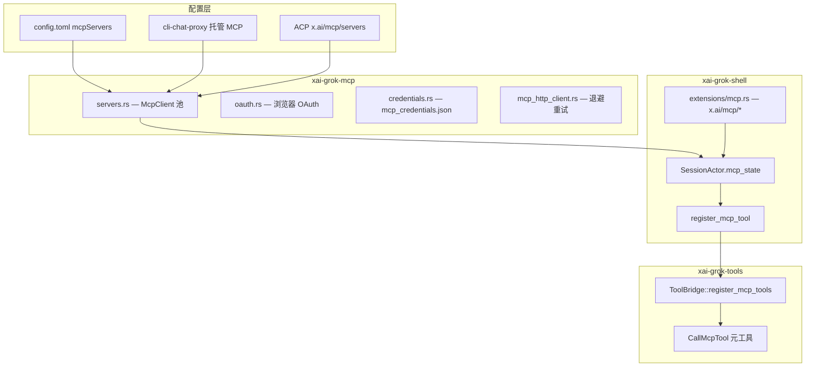

# 11. MCP（Model Context Protocol）协议与代码实现

本文说明 Grok Build 如何集成 **MCP（Model Context Protocol）**：连接外部工具服务器、OAuth 认证、工具注册进 Agent，以及通过 ACP 扩展供 UI 管理。

---

## 1. MCP 在本项目中的角色

**MCP** 是一种让 AI Agent 连接**外部工具服务器**的开放协议（常见实现：stdio 子进程、HTTP/SSE 流式传输）。

在 Grok Build 中，MCP 服务器提供的工具会变成 Agent 可调用的工具（经 `server__tool` 命名空间），例如：

- 用户配置的 `config.toml` 里 `[[mcpServers]]`
- xAI **托管 MCP**（从 cli-chat-proxy 拉取配置 + OAuth token）
- IDE/SDK **进程内 MCP**（通过 ACP `x.ai/mcp/servers` 注入）

**核心 crate：** `xai-grok-mcp` — 故意与主工作区隔离（见下节）。

---

## 2. 为什么单独一个 `xai-grok-mcp` crate

**文件：** `crates/codegen/xai-grok-mcp/src/lib.rs`（crate 文档）

| 原因 | 说明 |
| --- | --- |
| **依赖隔离** | MCP SDK `rmcp` 2.1 要求 `reqwest >= 0.13`；工作区其余部分锁定 `reqwest 0.12` |
| **职责集中** | OAuth、凭证磁盘存储、传输层、rmcp 客户端生命周期都在此 crate |
| **对外 API** | 重导出 `xai_grok_mcp::rmcp::*`，其他 crate 不必直接依赖 rmcp |

**依赖关系：**

```text
xai-grok-shell ──► xai-grok-mcp ──► rmcp + reqwest 0.13
xai-grok-shell ──► xai-grok-tools / workspace (reqwest 0.12)
```

---

## 3. MCP 协议基础（概念）

### 3.1 传输类型

Grok 支持两种 MCP 传输（配置于 `xai-grok-config-types`）：

| 类型 | 配置 | 实现 |
| --- | --- | --- |
| **Stdio** | `command` + `args` + `env` | `rmcp::transport::TokioChildProcess` — 启动子进程，stdin/stdout JSON-RPC |
| **Streamable HTTP** | `url` + `headers` | `rmcp::transport::StreamableHttpClientTransport` — SSE/HTTP 长连接 |

**配置类型：** `crates/codegen/xai-grok-config-types/src/mcp.rs`

- `McpServerTransportConfig::Stdio { command, args, env }`
- `McpServerTransportConfig::StreamableHttp { url, headers, ... }`

`config.toml` 示例键：`[mcpServers.my-server]`

### 3.2 MCP 能力

连接握手后，客户端向服务器：

1. `initialize` — 协议版本与能力
2. `tools/list` — 获取工具列表（name、description、inputSchema）
3. `tools/call` — 调用工具

Grok 用 **rmcp** SDK 封装这些 JSON-RPC 调用。

---

## 4. 架构总览



---

## 5. 配置与发现

### 5.1 用户配置（`config.toml`）

**类型：** `McpConfig` / `McpServerConfig` — `xai-grok-config-types/src/mcp.rs`

```toml
[mcpServers.github]
type = "stdio"
command = "npx"
args = ["-y", "@modelcontextprotocol/server-github"]

[mcpServers.linear]
type = "http"
url = "https://mcp.linear.app/v1/mcp"
```

合并顺序：用户 config → managed settings → 会话级覆盖。

### 5.2 托管 MCP（Managed）

**前缀：** `grok_com_` 等 — `session/managed_mcp.rs`

- Agent 启动时向 **cli-chat-proxy** 拉取企业/用户已授权的 MCP 端点
- 响应含 URL + OAuth Bearer headers + 过期时间
- 缓存在 agent 级 `ManagedMcpCache`，跨会话复用
- Token 快过期时 `refresh_managed_mcp_if_stale()` 刷新

**会话支持：** `xai-grok-shell-session-support/src/managed_mcp.rs` — 主动刷新、反应式重认证（3 次失败后冷却）

### 5.3 ACP 注入（SDK 进程内 MCP）

**Wire 常量：** `xai-grok-mcp/src/wire.rs`

| 常量 | 含义 |
| --- | --- |
| `x.ai/mcp/servers` | `session/new` `_meta` 中的内嵌 MCP 服务器列表 |
| `x.ai/mcp/sdk` | `initialize` 能力标志：客户端支持 ACP 传输的 MCP |
| `x.ai/mcp/call` | 客户端直接请求 agent 调用 MCP 工具（不经 LLM） |
| `x.ai/mcp/sdk_call` | agent → client 反向调用 SDK 内工具 |

---

## 6. 连接与生命周期（`xai-grok-mcp`）

### 6.1 `servers.rs` — 核心

**路径：** `crates/codegen/xai-grok-mcp/src/servers.rs`

| 概念 | 说明 |
| --- | --- |
| `McpClient` | 单个 MCP 服务器的 rmcp `RunningService` 包装 |
| `InitProgress` | 状态机：`NotStarted` → `Starting` → `Finished` |
| `McpConfigDiff` | 配置变更时的 added/removed/retained 服务器 |
| `MCP_TOOL_NAME_DELIMITER` | `"__"` — 工具全名 `github__create_issue` |

**工具名校验：** `validate_tool_name()` — 兼容 Anthropic/OpenAI/Gemini 的 `^[a-zA-Z_][a-zA-Z0-9_-]{0,63}$`

**连接流程：**

```text
1. 解析 McpServerConfig（stdio 或 HTTP）
2. 若 HTTP 且需 OAuth → AuthorizationManager + 凭证存储
3. rmcp ClientHandler::initialize
4. tools/list → 得到工具元数据
5. 注册到 shell 的 McpState
```

### 6.2 OAuth

**文件：** `crates/codegen/xai-grok-mcp/src/oauth.rs`

- 使用 rmcp `AuthorizationManager`（RFC 8414/9728 发现、DCR、PKCE）
- `authenticate_mcp_server_dedup()` — **双层去重**：
  - 进程内：watch channel，避免多任务重复开浏览器
  - 跨进程：文件锁 `$GROK_HOME/mcp_auth_{server}.lock`
- 浏览器回调本地 redirect server

**BYO OAuth：** `oauth_config.rs` — 从 `config.toml` 解析自定义 client_id/secret

### 6.3 凭证存储

**文件：** `crates/codegen/xai-grok-mcp/src/credentials.rs`

- 路径：`$GROK_HOME/mcp_credentials.json`
- 键：`"{server_name}:{server_url}"`
- 与 xAI 主账号 `auth.json` **分离**
- 实现 rmcp `CredentialStore` trait（`McpCredentialStoreAdapter`）
- Unix 文件权限 `0600`

### 6.4 HTTP 退避

**文件：** `mcp_http_client.rs`

包装传给 rmcp 的 HTTP 客户端，避免 rmcp SSE 重连零退避导致的风暴。

### 6.5 存活检测

**文件：** `liveness.rs`

检测传输断开、触发重连或状态上报（与 `mcp_dispatcher` 配合）。

---

## 7. Shell 集成（`xai-grok-shell`）

### 7.1 会话级 `McpState`

**文件：** `session/mcp_servers.rs`（类型定义）、`session/acp_session_impl/mcp.rs`（逻辑）

每个 `SessionActor` 持有 `mcp_state: Mutex<McpState>`：

- `owned_clients` — 本 session 拥有的 MCP 连接
- 初始化标志、`InitProgress`
- UI 工具列表缓存

### 7.2 初始化时机

| 策略 | 行为 |
| --- | --- |
| `McpInitStrategy::Blocking` | `session/new` 后阻塞等待 MCP 握手完成再接受 prompt |
| 非阻塞 | 后台握手，`wait_for_mcp_initialized()` 在首次需要时等待 |

**入口：** `ensure_mcp_tools_initialized()` — `acp_session_impl/mcp.rs`

### 7.3 注册工具到 `ToolBridge`

**函数：** `SessionActor::register_mcp_tool` — `mcp.rs:296`

```text
1. 从 McpClient 取 tools/list 结果
2. 生成 wire 名：{server_name}__{tool_name}
3. tool_bridge.register_mcp_tools(wire_name, McpToolImpl, input_schema)
4. 更新 UI 侧工具列表（McpUiTool）
```

**ToolBridge API：** `xai-grok-tools/src/bridge.rs:162`

```rust
pub async fn register_mcp_tools<T>(&self, mcp_name: String, tool: T, input_schema: Option<Value>)
```

动态注册进 `FinalizedToolset`，与内置 `read_file` 等并列。

### 7.4 模型请求中的 MCP 工具

**重要细节：** 发给 LLM 的 `tool_definitions` 默认用 `tool_definitions_builtins_only()`，**过滤掉** wire 名含 `__` 的 MCP 工具。

MCP 工具通过内置元工具间接调用，例如：

- `CallMcpTool` / `use_tool` — 由模型调用，shell 再 dispatch 到对应 MCP client

这样避免把大量 MCP schema 塞进每次推理请求，并统一权限/钩子路径。

**直接调用路径：** `SessionCommand::CallMcpTool` — UI 或 `x.ai/mcp/call` 不经 LLM 调用。

### 7.5 配置热更新

`McpConfigDiff` 驱动：

- `added` 服务器 → 新握手 + register
- `removed` 服务器 → `unregister_tools_by_prefix("{server}__")` + 断开 client
- `retained` → 保持连接

通知：`x.ai/mcp/tools_changed`、`x.ai/mcp/servers_updated`

---

## 8. ACP 扩展：`x.ai/mcp/*`

**文件：** `crates/codegen/xai-grok-shell/src/extensions/mcp.rs`

Agent ↔ Client 私有方法（**不是** MCP 协议本身，而是 Grok 用 ACP 管理 MCP）：

| 方法 | 方向 | 用途 |
| --- | --- | --- |
| `x.ai/mcp/list` | C→A | 列出所有 MCP 服务器（配置 + 会话状态） |
| `x.ai/mcp/auth_status` | C→A | OAuth 是否已授权 |
| `x.ai/mcp/auth_trigger` | C→A | 触发浏览器 OAuth |
| `x.ai/mcp/setup` | C→A | 首次配置向导 |
| `x.ai/mcp/toggle` | C→A | 启用/禁用服务器 |
| `x.ai/mcp/toggle_tool` | C→A | 启用/禁用单个工具 |
| `x.ai/mcp/upsert` / `delete` | C→A | 增删服务器配置 |
| `x.ai/mcp/read_resource` | C→A | 读 MCP resource |
| `x.ai/mcp/call` | C→A | 直接调用 MCP 工具 |
| `x.ai/mcp/servers_updated` | A→C | 托管配置变更通知 |
| `x.ai/mcp/tools_changed` | A→C | 工具列表变更 |
| `x.ai/mcp/init_progress` | A→C | 握手进度 |
| `x.ai/mcp/server_status` | A→C | 单服务器状态 delta |

**Pager UI：** `xai-grok-pager/src/views/mcps_modal.rs`、`app/acp_handler/mcp.rs`

**状态合并：** `session/mcp_dispatcher.rs` — `StatusDispatcher` 合并高频状态更新

---

## 9. 工具调用完整路径

### 9.1 经 LLM（常见）

```text
模型返回 tool_call: CallMcpTool { server, tool, arguments }
  → prepare_tool_call（权限 + pre_tool_use 钩子）
  → dispatch_tool → workspace_ops.call_tool
  → ToolBridge 解析到 MCP 实现
  → McpClient::call_tool (rmcp tools/call)
  → push_tool_result 进 chat-state
```

### 9.2 经 UI / `x.ai/mcp/call`（不经 LLM）

```text
Pager MCP 面板 → ExtMethod x.ai/mcp/call
  → extensions/mcp.rs::handle_call
  → SessionHandle CallMcpTool
  → 同上 rmcp 调用
```

### 9.3 经 SDK 反向通道

```text
Agent 需要客户端进程内工具
  → ExtNotification/Method x.ai/mcp/sdk_call
  → 客户端 SDK 执行后返回
```

---

## 10. 权限与安全

- MCP 工具调用走与普通工具相同的 **PermissionManager**（`xai-grok-workspace`）
- `McpToolPermission` / `McpScope` — 可按服务器或单工具授权
- HTTP MCP 的 auth token **不出现在** `x.ai/mcp/list` 响应中（仅 scope 元数据）
- Stdio MCP 子进程通过 `xai-tty-utils::detach_command` 脱离 TUI 终端

---

## 11. 与 Workspace 的关系

**Wire 类型：** `xai-grok-workspace-types` 定义 `MCP_TOOL_NAME_DELIMITER`

远程 workspace 模式下，MCP 调用可经 hub 路由，但逻辑仍在 shell 侧 `McpState` 拥有连接。

---

## 12. 调试

```sh
# 查看 MCP 相关日志
RUST_LOG=xai_grok_mcp=debug,xai_grok_shell::session=debug cargo run -p xai-grok-pager-bin

# 凭证文件
ls ~/.grok/mcp_credentials.json

# 配置
cat ~/.grok/config.toml  # [mcpServers] 段
```

**TUI：** `/mcp` 或 MCP 模态框 — 触发 `x.ai/mcp/list` 和 auth/setup。

---

## 13. 关键文件索引

| 主题 | 路径 |
| --- | --- |
| MCP crate 入口 | `crates/codegen/xai-grok-mcp/src/lib.rs` |
| 连接与工具列表 | `crates/codegen/xai-grok-mcp/src/servers.rs` |
| OAuth | `crates/codegen/xai-grok-mcp/src/oauth.rs` |
| 凭证 | `crates/codegen/xai-grok-mcp/src/credentials.rs` |
| ACP wire 常量 | `crates/codegen/xai-grok-mcp/src/wire.rs` |
| ACP 传输适配 | `crates/codegen/xai-grok-mcp/src/acp_transport.rs` |
| 配置类型 | `crates/codegen/xai-grok-config-types/src/mcp.rs` |
| 会话 MCP 逻辑 | `crates/codegen/xai-grok-shell/src/session/acp_session_impl/mcp.rs` |
| 托管 MCP | `crates/codegen/xai-grok-shell/src/session/managed_mcp.rs` |
| ACP 扩展 API | `crates/codegen/xai-grok-shell/src/extensions/mcp.rs` |
| 状态分发 | `crates/codegen/xai-grok-shell/src/session/mcp_dispatcher.rs` |
| 工具注册 | `crates/codegen/xai-grok-tools/src/bridge.rs` |
| Pager MCP UI | `crates/codegen/xai-grok-pager/src/views/mcps_modal.rs` |

---

## 14. MCP vs ACP 对比（易混点）

| | ACP | MCP |
| --- | --- | --- |
| **连接谁** | TUI/IDE ↔ Grok Agent | Grok Agent ↔ 外部工具服务 |
| **协议** | Agent Client Protocol（JSON-RPC） | Model Context Protocol（JSON-RPC） |
| **本仓库 crate** | `xai-acp-lib` + `agent-client-protocol` | `xai-grok-mcp` + `rmcp` |
| **典型方法** | `session/prompt`, `session/update` | `tools/list`, `tools/call` |
| **Grok 扩展** | `x.ai/mcp/list` 等（用 ACP 管 MCP） | — |

---

## 相关阅读

- [10_acp_protocol.md](10_acp_protocol.md) — ACP 协议与 `x.ai/mcp/*` 扩展通道
- [09_end_to_end_request_flow.md](09_end_to_end_request_flow.md) — 工具执行与历史
- [codegen/xai-grok-mcp.md](codegen/xai-grok-mcp.md) — crate 简介
- [codegen/xai-grok-config-types.md](codegen/xai-grok-config-types.md) — MCP 配置类型
- 用户指南：`crates/codegen/xai-grok-pager/docs/user-guide/07-mcp-servers.md`
