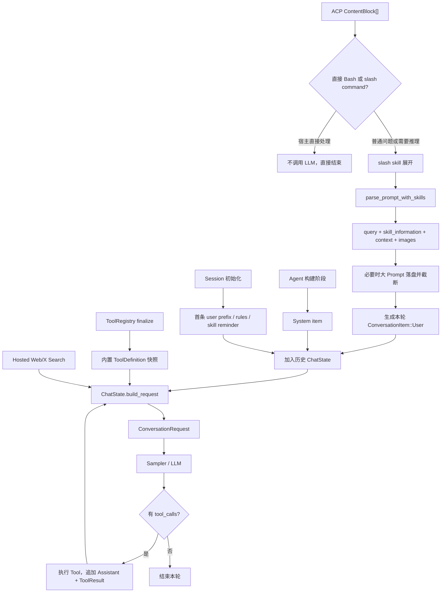

# 用户输入如何变成模型请求：Prompt 与 Tool List 组装详解

本文专门回答一个问题：**Grok Build 收到一次用户输入以后，究竟把什么内容、按什么顺序发给 LLM？**

先给出最重要的结论：它并不是把 system prompt、历史、用户问题和所有 Tool 拼成一个超长字符串。最终对象是结构化的 `ConversationRequest`：

```text
ConversationRequest
├── items[]          System/User/Assistant/ToolResult/Reasoning 等消息
├── tools[]          本地 function tool 的 name/description/parameters
├── hosted_tools[]   后端原生 WebSearch/XSearch
├── model / temperature / top_p / max_output_tokens
├── reasoning_effort / json_schema
└── conversation、request、session、turn 等追踪 ID
```

也就是说，平时口头说的“拼 prompt”，在这个项目中至少要拆成两件事：

1. 构造 `items` 消息序列；
2. 独立构造 `tools` 和 `hosted_tools`。

源码主入口分别是：

- 用户输入与 agent loop：`crates/codegen/xai-grok-shell/src/session/acp_session_impl/turn.rs`
- system prompt：`crates/codegen/xai-grok-agent/src/prompt/context.rs`
- 首条 user prefix：`crates/codegen/xai-grok-shell/src/session/acp_session_impl/prompt_build.rs`
- Tool Definition：`crates/codegen/xai-grok-tools/src/registry/types.rs`
- 最终请求：`crates/codegen/xai-chat-state/src/actor/request_builder.rs`

## 1. 全链路概览



这张图还有一个重要含义：一次“用户轮次”内部可能有多次采样。第一次请求包含用户消息，模型调用 Tool 后，第二次请求包含同一段历史加上新产生的 `Assistant(tool_calls)` 与 `ToolResult`，直到模型不再发 Tool Call。

## 2. 按生命周期理解 Prompt

不同内容并不是每轮都从头发现和渲染。可以分为三种生命周期：

| 生命周期 | 典型内容 | 什么时候变化 |
| --- | --- | --- |
| Agent 构建期 | system prompt、选中的 Tool 集、Tool 名称映射、显式预加载 Skill 正文 | 重建/切换 Agent 时 |
| Session 前缀期 | workspace、OS、shell、git status、AGENTS/rules、Skill 概览、MCP Server 概览 | 初始化、零轮重建或 compaction 重建前缀时 |
| 每轮/每次采样 | 当前问题、附件、slash Skill 正文、图片、提醒、Tool Result、memory、动态 Tool gates | 每个用户输入甚至同一轮的每个 loop |

因此，分析某条指令“在哪里传给模型”时，不能只搜 system prompt。它还可能位于 synthetic user item、project instructions、当前 user item、Tool description，或者 Tool Result 中。

## 3. Agent 构建阶段：System Prompt 如何生成

### 3.1 `AgentBuilder` 先解析 AgentDefinition

`AgentBuilder::build()` 会先取得 `AgentDefinition`。没有显式 definition 时，使用 `AgentDefinition::default_grok_build()`。definition 决定：

- `prompt_mode`
- `prompt_body`
- `system_prompt` override
- 是否发现 Skills
- 显式预加载的 `skills:`
- `tool_config`
- `user_message_template`
- disallowed tools、MCP inheritance、backend search 等开关

### 3.2 显式预加载 Skill 会进入 system prompt body

Builder 先发现 Skill 元数据。如果 definition 的 `skills:` 非空，则通过 `resolve_preloaded_skills()` 读取对应 `SKILL.md` 正文，再由 `format_skills_for_injection()` 格式化，并**前置**到 `definition.prompt_body`。

所以需要区分：

- 普通“可用 Skill”：通常只公布名称、描述和路径，正文不会全塞入 system prompt；
- Agent definition 显式声明的 Skill：正文在构建 Agent 时预加载到 `prompt_body`；
- 用户输入 `/skill-name`：正文在该次用户消息中进入 `<skill_information>`。

### 3.3 `PromptMode::Extend` 与 `Full`

核心代码是 `PromptContext::render_with_renderer()`：

```text
Extend:
    rendered base template
    + "\n\n"
    + rendered prompt_body（如果有）

Full:
    只渲染 prompt_body
```

`Extend` 的 base 来源还有三种：

- `TemplateOverride::None`：主 Agent 用内置 base template，子 Agent 用 subagent template；
- `TemplateOverride::Custom`：使用自定义 system template；
- `TemplateOverride::Codex`：使用 Codex/apply-patch 风格模板。

### 3.4 Tool 名称占位符在此时解析

Prompt 模板可以写：

```text
${{ tools.by_kind.read }}
${{ tools.by_kind.task }}
${{ params.task.run_in_background }}
```

这些不是在采样前临时字符串替换，而是 Tool Registry finalize 后生成 `TemplateRenderer`，以最终的 client-facing Tool 名和参数名进行解析。这样 preset 把 `GrokBuild:task` 改名为 `spawn_subagent` 后，prompt 中的工具名也同步改变。

同时会注入工作目录、日期、OS、shell、role/persona、memory path 等 placeholders。

### 3.5 system prompt 成为真正的 System item

Session 初始化时：

```rust
ConversationItem::system(system_prompt)
```

然后通过 `replace_conversation()` 建立初始历史。恢复顶层会话时通常保留已持久化的 system item；子 Agent spawn 是否覆盖继承的 system prompt，则由 `preserve_inherited_system` 控制。

## 4. Session 初始化：第一条 User Prefix

system item 后面还会插入一条首轮前缀，它的角色是 `User`，不是 `System`。

### 4.1 为什么异步构建

`initialize()` 先快速安装 system item，`build_prefix_background()` 并行收集 git/MCP 等较慢信息。第一次真正处理 `Prompt` 命令前，`ensure_prefix_ready()` 等待这个任务；10 秒未完成就取消后台任务并同步 fallback。

成功后大致形成：

```text
items[0] = System(system_prompt)
items[1] = User(first-user-prefix)
items[2] = ProjectInstructions(AGENTS/rules)       // 条件性
items[3] = User(SystemReminder(skill listing))    // 条件性
items[4] = User(actual query)                     // 第一次真实输入
```

实际索引会受 persona、继承历史、Skill reminder 等影响，不能硬编码，但 system 在头部、prefix 靠前这一原则成立。

### 4.2 默认 prefix 与自定义模板不一样

这是当前代码非常值得注意的地方。

`UserMessageTemplate::Default` 走 shell 的 legacy 构造逻辑，主要生成：

- `<user_info>`：工作目录、OS、shell、日期等；
- 可选 `<git_status>`。

`UserMessageTemplate::Custom` 才构造完整 `UserMessageContext`，可供模板选择的字段包括：

- workspace path、OS/kernel、shell；
- VCS root 和 status；
- local date；
- workspace-scoped rules；
- user-scoped rules；
- budgeted Skill listing；
- 已连接 MCP Server 列表、server instructions、descriptor folder；
- 最终 read Tool 的模型可见名称。

因此不能简单说“所有 Agent 的首条 user message 都包含 Skill/MCP 列表”。**上下文会被收集，但自定义模板是否引用对应 placeholder，决定它是否真正出现在文本里；默认模板走另一条较精简路径。**

### 4.3 AGENTS/rules 的另一条注入路径

即使 prefix 没有内联 rules，`ensure_prefix_ready()` 仍可把 `agents_md_user_reminder()` 作为 `ConversationItem::project_instructions(...)` 插入历史。因此规则信息可能在：

1. 自定义首条 user template 内；
2. 独立的 ProjectInstructions item；
3. 两者由兼容模式和去重逻辑协调，避免重复。

### 4.4 Skill baseline reminder

初始化时 `inject_baseline_skill_reminder()` 从 `SkillManager` 获取 pending baseline。普通 Grok Build 通常把 Skill 概览包装为 synthetic user `<system-reminder>`；兼容模板若已经以内联 `<agent_skills>` 展示，则抑制重复 baseline reminder。

这里公布的主要是 Skill 目录，不等于读取所有 `SKILL.md` 正文。

## 5. 收到真实用户输入后的处理

输入类型是 ACP 的 `Vec<ContentBlock>`，可以包含：

- `Text`
- `Image`
- `ResourceLink`
- `Resource`（嵌入资源）

### 5.1 先判断是否绕过模型

在构造 prompt 前先处理两类特殊输入：

1. 可识别的直接 Bash 命令：宿主直接执行；
2. builtin slash command：有些命令直接改 session 状态或返回信息，不调用 LLM。

只有普通输入，或 slash command 解析后仍需要推理的输入，才进入后续 agent loop。

### 5.2 `/skill-name` 如何进入当前消息

`slash_commands::resolve()` 若解析到 Skill：

1. 用当前 `slash_skills` 快照定位 Skill；
2. 记录 active skill 和 telemetry；
3. `build_skill_information_for_refs()` 读取完整 Skill 正文；
4. 保留用户原始 blocks；
5. 把正文保存到 `pending_skill_information`。

之后 parser 生成：

```xml
<user_query>
用户的问题
</user_query>
<skill_information>
完整 Skill 指令
</skill_information>
```

这说明 Grok Build 的默认 Skill 加载并不依赖一个模型可见 `skill` Tool；slash 路径由宿主在采样前完成加载。若模型只是看到 Skill 路径并自行决定使用，则它可通过已有的文件读取 Tool 读取 `SKILL.md`。

### 5.3 `parse_prompt_with_skills()` 如何拆块

Parser 会：

- 合并所有 Text；
- 收集 Image；
- 将无 meta 的 ResourceLink 转成 `@path` 提示；
- 读取 `@file` 文件引用；
- 渲染 Embedded Resource；
- 将用户文本包入 `<user_query>`，除非 `verbatim=true`；
- 把附件放进 `<system-reminder><attached_files>...`；
- 把编辑器 meta 渲染成 `<focused_files>` / `<open_files>`；
- 保留 `query`、`skill_information`、`context` 三段，避免过早 flatten 后难以按优先级截断。

当前普通消息的最终顺序是：

```text
query
skill_information（如果有，紧跟 query）

context（附件、resource links、编辑器状态）
```

### 5.4 一个源码注释与实现漂移点

`ParsedPrompt` 的注释仍描述 `is_cursor=true` 时使用“context 在前、query 在后”。但当前 `assemble_parts_with_skills()` 实现对 `is_cursor` 做了 `let _ = is_cursor`，无论模式都返回 `query_block + context`。

不过，大 Prompt 截断函数 `build_truncated_prompt_message()` 仍保留 `is_cursor` 分支，超长输入时 Cursor 顺序仍可能不同。读代码时应以执行语句而不是旧注释为准。

### 5.5 图片不是只变成文字

普通 Grok 路径会：

- 标准化 ACP Image；
- 抽取用户文本中内嵌的 base64 image；
- 将图片保存到 session assets，并在文本前加入路径信息；
- 同时把 `data:` URL 或远端 HTTP(S) URL作为多模态 content part 加进 User item；
- 更新 `AttachedImages` Tool Resource，供 `image_edit` 等 Tool 使用。

Cursor 兼容路径则可能先转录图片，把结果并入文本。

## 6. 超长用户输入如何处理

普通非 verbatim 输入超过 `LARGE_PROMPT_THRESHOLD = 25_000` 字节时，不会简单截掉尾部。

处理策略是：

1. 把完整组装消息写入 session 文件；
2. 给模型保留一个最多约 25 KB 的 preview；
3. Skill 单独预留最多 4 KB；
4. 剩余预算最多 80% 优先给 query；
5. 长 query 使用 head + tail，保留末尾真正的问题；
6. context 使用剩余空间；
7. 插入明确 notice，要求模型先用 `read_file` 读取完整文件。

如果落盘失败，则移除不存在的文件路径，改为提示用户重新发送，避免模型追逐无效文件。

`verbatim=true` 会跳过这条 prompt 截断逻辑，但最终请求仍受整体 context window 和 HTTP body 大小等限制。

## 7. 每轮附加的 synthetic context

真实 user item 入历史前后，Session 还可能注入：

- MCP 可用/连接中的提醒；
- 日期 rollover；
- Plan Mode 状态；
- resumed task 提醒；
- deferred subagent/command completion；
- workflow status；
- interrupt reminder；
- 动态发现的新 Skill reminder。

这些通常表现为带 `SyntheticReason` 的 User item 或专门的 ProjectInstructions 类型，而不是修改 system prompt。这样可保留事件的时间顺序，也避免每轮改写 system prefix 破坏 prompt cache。

## 8. Tool List 是怎样形成的

### 8.1 “注册了”不等于“发给模型”

`ToolRegistryBuilder::new()` 建立所有静态实现候选，外部 Tool Pack 还可在首次 builder 创建前注册更多实现。随后 `AgentDefinition.tool_config` 选择当前 Agent 使用的子集。

默认 Grok Build preset 选择 18 项：

```text
run_terminal_command
read_file
search_replace
list_dir
grep
kill_command_or_subagent
todo_write
get_command_or_subagent_output
wait_commands_or_subagents
spawn_subagent
scheduler_create
scheduler_delete
scheduler_list
monitor
search_tool
use_tool
update_goal
workflow
```

这是默认起点，不是每一轮绝对固定值。Memory、Web、Plan、AskUser、媒体 Tool、会话 allow/deny list、Agent 类型、feature gate 等都会增删 Tool。

### 8.2 finalize 阶段完成什么

`ToolRegistryBuilder::finalize()` 主要做：

1. 检查 `ToolConfig` 中的 ID 是否存在；
2. 验证每个 Tool 的 requirements；
3. 计算 registry ID 到 client-facing name 的映射；
4. 计算参数 canonical name 到模型可见名称的映射；
5. 创建 `TemplateRenderer`；
6. 安装 session-scoped Resources，如 cwd、filesystem、terminal、SkillManager、memory/backend client；
7. 渲染 Tool description template；
8. 生成/重写 JSON Schema；
9. 创建不可变 `FinalizedToolset`。

模型可见定义最初是：

```rust
ToolDefinition {
    kind: ToolType::Function,
    function: FunctionTool {
        name: String,
        description: Option<String>,
        parameters: serde_json::Value, // JSON Schema
    },
}
```

采样前再扁平映射成：

```rust
ToolSpec {
    name,
    description,
    parameters,
}
```

### 8.3 每个用户轮次只取一次基础 Tool 快照

`process_conversation_turn()` 进入时调用一次：

```rust
let (tool_definitions, mcp_wait_ms) =
    self.prepare_tool_definitions_timed().await;
```

然后同一用户轮次的所有 model/tool loop 都复用这份 `tool_definitions`。这么做可以避免同一轮中途 Tool schema 突变，保证缓存和 tool-call 协议稳定。

每次 loop 仍会从该快照生成 `effective_tools`，并应用少量动态逻辑：

- forked child 可使用 `forked_tool_override`；
- backend hosted search 启用时，移除本地 `web_search` function，避免重名/重复能力；
- Plan Mode 可在快照形成前过滤不允许的 Cursor tools；
- 非原生 structured output backend 临时追加 `StructuredOutput` Tool。

### 8.4 MCP Tool 为什么不会撑爆顶层 list

当前 turn 路径的 `prepare_tool_definitions_inner()` 明确调用：

```rust
bridge.tool_definitions_builtins_only().await
```

而 `tool_definitions_builtins_only()` 会排除 client name 中含 `__` 的动态 MCP Tool。也就是说，即便 MCP Tool 已动态注册到 `FinalizedToolset`，当前采样请求也不会把每个 MCP schema 都直接列到 `tools[]`。

默认 Grok Build 始终暴露两个小入口：

- `search_tool`：在 MCP Tool Index 中搜索名称、描述和 schema；
- `use_tool`：按已发现的 Tool 调用远端 MCP Server。

其效果就是：

```text
LLM 顶层 Tool List：固定的内置 Tool + search_tool + use_tool
MCP Tool Catalog：留在宿主侧索引中，按需搜索和调用
```

这正是防止 MCP Server 越接越多、Tool schema 挤占 prompt/context 的核心机制。详细 BM25/index/call 分发见 [grok-build-tools-and-mcp-discovery.md](grok-build-tools-and-mcp-discovery.md)。

需要注意，registry 本身仍支持 `register_tool()` 把 MCP Tool 注册成动态 Tool；“存在于运行时 registry”和“本轮直接暴露给模型”是两个层次。

### 8.5 Hosted Tools 是第三条通道

Web Search 和 X Search 还可以作为后端原生 `HostedTool` 放在 `request.hosted_tools` 中。它们由推理后端执行，不经过本地 function Tool executor。

只有同时满足以下条件才会发送：

- Agent 开启 backend search；
- 当前 backend 宣告支持；
- Agent allowlist 允许该 hosted Tool。

日期范围等 `ToolOverrides` 会直接应用到 HostedTool options。

### 8.6 Structured Output 的两种实现

如果用户请求 JSON Schema：

- backend 支持 native schema：设置 `request.json_schema`；
- backend 不支持：在 `tools[]` 临时增加 `StructuredOutput`，参数 schema 就是用户给的 schema，并注入提醒要求最后恰好调用一次。

因此抓包时看到的 Tool 数可能比 Agent 的 finalized Tool 数多 1。

## 9. ChatState 如何生成最终请求

每个 sampling loop 调用：

```rust
chat_state_handle.build_request(
    effective_tools,
    memory_reminder,
    persist_memory_reminder,
    trace,
    conv_id,
    req_id,
)
```

### 9.1 先修复会话完整性

Actor handler 会先保证 Tool Call/Tool Result 配对，修复 dangling tool call、重复 result 等不合法历史，随后 request builder 才 clone 当前 conversation。

### 9.2 Memory reminder

首轮 memory context 可：

- 持久注入 actor conversation；或
- 只注入这次 request clone。

是否持久化由 memory 配置决定。

### 9.3 Tool Result pruning

估算 token 超过 context window 的 50% 时，会对旧 Tool Result 做分层裁剪：

- 最近 N 轮保留；
- 较旧且很大的结果保留 head/tail；
- 非常旧的结果替换为 `[Tool result omitted — too old]`。

这是 request-time pruning。更重的自动 compaction 在 sampling 前由 Session 检查并运行，两者不能混为一谈。

### 9.4 图片 body 控制

序列化 conversation body 接近 50 MB proxy 上限时，会从最旧图片开始批量替换成“图片已不可见”的 placeholder，降到低水位。触发阈值特意给 Tool Definitions 和 request envelope 留了约 3 MB 空间。

### 9.5 构造 `ConversationRequest`

核心字段最终来自：

| 字段 | 来源 |
| --- | --- |
| `items` | ChatState 历史的 request copy |
| `tools` | 本轮 `effective_tools` |
| `hosted_tools` | request builder 后由 Session 补入 |
| `model` | 当前 `SamplingConfig` |
| `temperature/top_p` | `SamplingConfig` |
| `max_output_tokens` | SamplingConfig，再按 task budget clamp |
| `reasoning_effort` | `SamplingConfig` |
| `json_schema` | native structured output 时补入 |
| 各类 ID | ChatState + Session 在 builder 后补齐 |

近似 JSON 可以理解为：

```json
{
  "model": "...",
  "items": [
    {"type": "system", "content": "..."},
    {"type": "user", "content": "<user_info>...</user_info>"},
    {"type": "user", "content": "<user_query>修复这个 bug</user_query>"},
    {"type": "assistant", "tool_calls": []},
    {"type": "tool_result", "tool_call_id": "...", "content": "..."}
  ],
  "tools": [
    {
      "name": "read_file",
      "description": "...",
      "parameters": {"type": "object", "properties": {}}
    }
  ],
  "hosted_tools": [],
  "reasoning_effort": "..."
}
```

真实 wire format 会由具体 sampling backend adapter 转换，以上重点是内部语义，而不是承诺最终 HTTP JSON 的每个键名。

## 10. Tool Call 后下一次 Prompt 如何变化

模型返回的 response items 会进入历史：

1. `Assistant` item 通过 `record_assistant_response()` 记录；
2. Tool executor 执行 `tool_calls`；
3. 结果作为 `ToolResult` item 回填；
4. loop 回到顶部，处理新的 interjection/reminder/compaction；
5. 使用同一份基础 Tool 快照重新 `build_request()`；
6. 新请求包含刚才的 Assistant Tool Call 和 Tool Result。

所以第二次采样并不是只传 Tool Result，而是传完整的、可能经过 pruning/compaction 的结构化历史。Tool Call ID 是把 Assistant call 和 ToolResult 配对的关键。

## 11. 一次普通请求的典型消息顺序

以一个全新默认 Grok Build Session、没有图片和 slash Skill 为例：

```text
System
  内置 base system prompt + Agent prompt body

User（session prefix）
  <user_info>cwd / OS / shell / date ...</user_info>
  <git_status>...</git_status>

ProjectInstructions / synthetic User（条件性）
  AGENTS.md、rules、Skill baseline、MCP reminder 等

User（真实输入）
  <user_query>用户问题</user_query>
  <system-reminder>附件和 editor context</system-reminder>

Assistant
  text / reasoning / tool_calls

ToolResult（若调用 Tool）
  工具输出

Assistant
  最终答案或下一批 tool_calls
```

与消息序列平行发送：

```text
tools = 内置 ToolDefinition 快照
        - backend search 下被替代的本地 web_search
        + 可选 StructuredOutput

hosted_tools = 可选 WebSearch / XSearch
```

## 12. 常见误区

### 误区一：Tool description 属于 system prompt

不是。Tool Definitions 是请求中的独立字段。system prompt 只可能引用解析后的 Tool 名和使用规范。

### 误区二：每个 MCP Tool 都直接传给模型

当前 Grok Build turn 路径不是这样。MCP Tool 留在索引/registry，模型主要看到 `search_tool` 和 `use_tool`。

### 误区三：所有 Skills 都完整加载到 prompt

不是。baseline 通常只是目录；显式预加载 Skill 或本轮 slash Skill 才会加载正文。模型也可以按路径用 read Tool 自行读取。

### 误区四：system reminder 一定是 System role

不是。项目里很多 `<system-reminder>` 实际装在 synthetic `User` item 中；要看 `ConversationItem` 类型和 `SyntheticReason`，不能只看 XML 标签名。

### 误区五：一次用户输入只请求模型一次

不是。每次 Tool Call 都会产生新一轮 sampling request，直到没有 Tool Call、被取消、触发 stationarity hard stop，或其他结束条件。

### 误区六：历史太长时只有一种“压缩”

至少有三层：当前用户超长输入落盘、旧 Tool Result pruning、完整 conversation compaction；另有接近 50 MB 时的图片驱逐。

## 13. 推荐的源码跟读顺序

1. `xai-grok-agent/src/builder.rs::AgentBuilder::build`
2. `xai-grok-agent/src/prompt/context.rs::PromptContext::render_with_renderer`
3. `xai-grok-shell/src/session/acp_session_impl/session_setup.rs::initialize`
4. `session_setup.rs::ensure_prefix_ready`
5. `prompt_build.rs::build_user_message_prefix`
6. `turn.rs` 中 `slash_commands::resolve` 到 `parse_prompt_with_skills`
7. `prompt_parser.rs::ParsedPrompt::assemble_parts_with_skills`
8. `sampler_turn.rs::prepare_tool_definitions_timed`
9. `turn.rs::process_conversation_turn`
10. `xai-chat-state/src/actor/request_builder.rs::build_conversation_request`

## 14. 调试与验证建议

要验证运行时究竟给模型发了什么，优先观察以下信号：

- `shell.turn.tool_prep_done`：本轮 Tool 数和 MCP 等待时间；
- trace upload 中的 Tool Definitions 快照；
- ChatState conversation dump / session `history.jsonl`：消息序列与 synthetic reason；
- `shell.turn.build_request_done`：每次 loop 的 request 构建；
- `shell.turn.inference_start`：真正开始采样；
- 大 prompt 的 session offload 文件；
- Tool Call 与 Tool Result 的 call ID 是否配对。

如果要写测试，最有价值的断言通常不是“包含某段字符串”，而是同时检查：

1. 它处于哪个 `ConversationItem`；
2. 相对顺序是否正确；
3. `tools[]` 是否包含/排除预期 Tool；
4. 第二次 loop 是否带回 Tool Result；
5. pruning/compaction 后协议完整性是否仍成立。

## 15. 与其他学习文档的关系

- 更宽的端到端流程：[09_end_to_end_request_flow.md](09_end_to_end_request_flow.md)
- 默认 Tool、`search_tool`、`use_tool`：[grok-build-tools-and-mcp-discovery.md](grok-build-tools-and-mcp-discovery.md)
- 全部 Tool 实现：[tools/README.md](tools/README.md)
- Skill 详细实现：[tools/04-skill-implementation.md](tools/04-skill-implementation.md)
- MCP 协议：[11_mcp_protocol.md](11_mcp_protocol.md)

