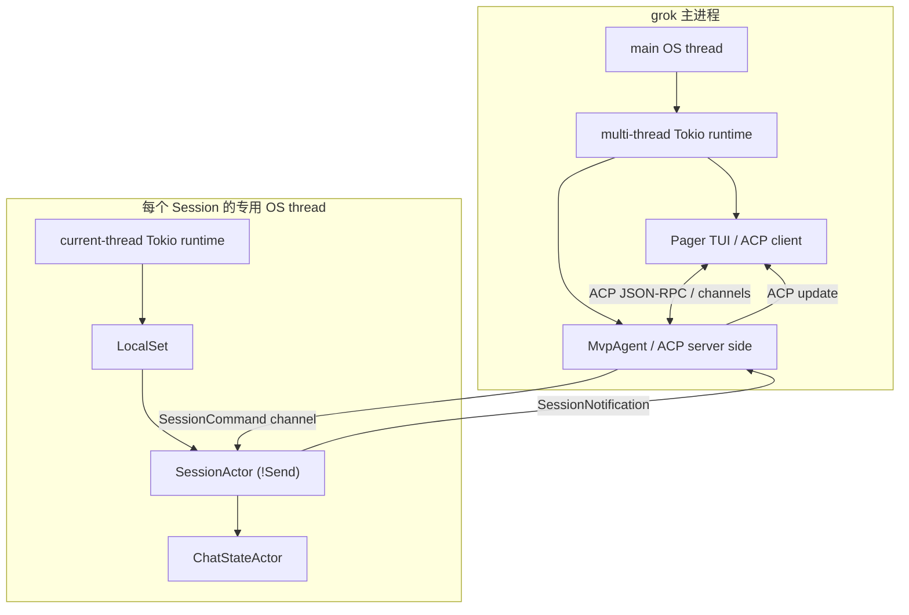

# Grok Build 完整执行时间线：从进程启动到最终回答

本文沿一条真实主路径，从用户运行 `grok` 开始，一直追到模型完成多轮 Tool Call、答案显示在 TUI、会话落盘和进程退出。

它与其他文档的区别是：这里不以 crate 或功能分类，而是严格按照**实际发生的时间顺序**组织。每一阶段都会回答四个问题：

1. 运行在哪一层、哪个线程或异步任务；
2. 进入哪个关键函数；
3. 读写什么核心数据；
4. 下一阶段通过函数、channel 还是协议连接。

本文选择最常见路径作为主线：

```text
交互式 Pager TUI
→ 本地 ACP Agent
→ 新建 Grok Build Session
→ 用户发送普通文本
→ 模型调用本地 Tool
→ Tool Result 回填
→ 模型返回最终文本
```

`headless`、`stdio`、`serve`、leader/reconnect、resume、subagent 等分支也会标出，但不会让它们打断主线。

## 1. 先建立全局地图

### 1.1 参与执行的主要 crate

| 层 | crate | 责任 |
| --- | --- | --- |
| 二进制入口 | `xai-grok-pager-bin` | CLI 解析、进程初始化、运行模式分发、Tokio runtime |
| TUI | `xai-grok-pager` | 键盘/鼠标、编辑器、页面状态、ACP client、增量渲染 |
| Agent Server | `xai-grok-shell` | ACP Agent、认证、模型目录、Session 注册与生命周期 |
| Agent 定义 | `xai-grok-agent` | AgentDefinition、system prompt、Skill/AGENTS 发现、Tool preset |
| Session Runtime | `xai-grok-shell::session` | 用户轮次、采样循环、Tool Call、MCP、提醒、取消、持久化 |
| Conversation | `xai-chat-state` | 历史 actor、token 估算、请求构建、修复、pruning |
| Tool Runtime | `xai-grok-tools` | Tool 注册、finalize、schema、resources、调用分发 |
| Workspace | `xai-grok-workspace` | 文件系统、terminal、permission、git/worktree |
| Sampling | `xai-grok-sampler` | HTTP/API backend、streaming、retry、响应解析 |
| 协议类型 | `xai-grok-sampling-types` | ConversationItem、ConversationRequest、ToolSpec、ToolCall |

### 1.2 进程、线程与 Actor



最关键的所有权关系是：

- `MvpAgent` 管理 Session registry，但不直接执行每个 turn；
- 每个 Session 拥有独立 OS thread、current-thread runtime 和 `LocalSet`；
- `SessionActor` 是 `!Send`，创建后不会跨线程；
- 外界只持有 `SessionHandle`，通过 `cmd_tx` 给 Session 发命令；
- Conversation 的权威状态由 `ChatStateActor` 管理；
- TUI 不直接调用 `SessionActor`，二者通过 ACP 隔离。

这种设计允许一个 Agent 进程维护多个 Session，同时让每个 Session 内大量 `Rc`、`RefCell` 和局部任务保持单线程语义。

## 2. 阶段 0：操作系统启动进程

入口：

```text
crates/codegen/xai-grok-pager-bin/src/main.rs::main
```

### 2.1 最早的特殊子进程分流

`main()` 首先判断当前进程是否其实是内部 worker：

- Mermaid render subprocess；
- voice capture subprocess。

命中后直接执行 worker 并退出，避免完整启动 TUI/Agent。

### 2.2 CLI 解析与无 runtime 快速命令

随后：

```rust
let args = PagerArgs::parse_cli();
```

`--version` 和 `doctor` 等路径可以在创建 Tokio runtime 前结束。这样简单命令不会承担认证、网络、模型目录和 TUI 初始化成本。

### 2.3 进程级基础设施

主路径继续安装：

- 最小日志/终端恢复设施；
- 可选 jemalloc 统计和 purge hook；
- memory trace；
- file descriptor limit；
- managed requirements 校验；
- Sentry；
- 用户指南解压；
- crash handler；
- 上一次崩溃报告检测；
- crashed sessions 扫描。

这里的顺序有意保证：即使后续 runtime 创建或配置加载失败，也尽可能恢复终端并留下诊断信息。

### 2.4 创建顶层 Tokio runtime

```rust
tokio::runtime::Builder::new_multi_thread()
    .worker_threads(cli_worker_threads())
    .enable_all()
    .build()
```

然后执行：

```text
run_and_shutdown(runtime, async_main(args), grace)
```

顶层 runtime 负责 TUI、Agent I/O、网络、后台刷新等可 `Send` 任务。后面每个 Session 还会建立自己的 current-thread runtime，这两层不要混淆。

## 3. 阶段 1：`async_main` 解析运行模式

入口：

```text
main.rs::async_main
```

### 3.1 应用工作目录和进程环境

典型动作包括：

- `args.apply_cwd()`：在大多数后续配置解析前切换 cwd；
- compaction mode/detail 写入环境；
- chat mode、leader socket、debug log 设置；
- resume target 固定；
- sandbox profile 解析和冲突检查；
- 计算当前是否 interactive，并设置 workspace permission client type。

需要特别注意 cwd：后面的 Agent、AGENTS.md、Skills、git root、MCP config 和 Session persistence 都依赖它。代码中还区分真实执行 cwd 与 `prompt_display_cwd`，后者只控制模型看到的路径。

### 3.2 子命令分流

`async_main` 会提前处理：

- `completions`
- `wrap`
- `agent`
- `inspect`
- `setup`
- `mcp`
- `plugin`
- `models`
- `leader`
- `worktree`
- `workspace`
- `sessions`
- `share`
- `export`

因此并非所有 `grok ...` 都会启动 Pager TUI。本文主线最终进入交互式 Pager；Agent 子进程一侧则进入 `run_agent_command()`。

## 4. 阶段 2：建立 TUI 与 Agent 的 ACP 连接

Grok Build 使用 ACP（Agent Client Protocol）把用户界面与 Agent Runtime 解耦。

### 4.1 两个角色

```text
Pager TUI = ACP Client
MvpAgent  = ACP Agent
```

它们可以：

- 在同一进程内通过内存管道连接；
- 通过 stdio 连接；
- 通过 leader IPC 连接到持久 Agent；
- 通过 WebSocket serve 模式远程连接。

无论 transport 是什么，上层语义保持为 ACP request/response/update。

### 4.2 Agent 子命令的模式选择

`run_agent_command()` 先处理：

- signal flush task；
- tracing/OTel/panic hook；
- `--trust`；
- models early prefetch；
- HTTP client warm-up；
- update check；
- auth/config。

最后根据 `AgentCmd` 分发：

| 模式 | 行为 |
| --- | --- |
| `Stdio` | ACP 走 stdin/stdout |
| `Headless` | 无 TUI，直接执行给定 prompt |
| `Serve` | WebSocket server，远程 client 连接 |
| `Leader` | 持久后台 Agent，可承接多个 client/reconnect |
| 默认 | 本地交互式 Agent/TUI 路径 |

### 4.3 创建 `MvpAgent`

Agent I/O 路径最终会建立：

```rust
let mut agent = MvpAgent::new(gateway, &agent_config, auth_manager, prefetched_models)?;
let (conn, handle_io) = acp::AgentSideConnection::new(
    agent,
    outgoing,
    incoming,
    |fut| tokio::task::spawn_local(fut),
);
```

同时启动 `GatewayReceiver`，负责把 Session 产生的 notification 转回 ACP connection。

这里存在两种方向的消息：

```text
Client → Agent：initialize/new_session/prompt/cancel/set_mode/...
Agent → Client：response + SessionUpdate stream
```

## 5. 阶段 3：ACP `initialize`

入口：

```text
MvpAgent implements acp::Agent
acp_agent.rs::initialize
```

### 5.1 initialize 是进程级握手

注释明确要求它每个 Agent 进程只调用一次，并且发生在任何 session creation 前。主要工作包括：

- 保存 client capabilities 和 initialize request；
- 启动 subagent coordinator；
- 启动 remote settings reapply；
- 清理陈旧 worktree/session；
- bootstrap session search index；
- 清理过期 permission state；
- 迁移旧 hook trust；
- 检查/刷新认证用户信息；
- 建立 auth methods；
- 初始化/刷新 models manager；
- 返回 Agent capabilities、认证方式、模型状态等。

### 5.2 为什么必须先 initialize

`new_session()` 会读取 `self.initialize_request.get()`。未初始化直接建 Session 会返回 invalid params。原因是 Session 构建依赖 client 是否支持：

- terminal；
- fs read/write；
- permission request；
- MCP；
-某些扩展 meta。

## 6. 阶段 4：创建一个新 Session

入口：

```text
acp_agent.rs::new_session
```

### 6.1 解析 Session 级输入

`NewSessionRequest` 至少携带 cwd，并可携带 MCP servers 和 meta。`new_session()` 会解析：

- 绝对 cwd；
- folder trust；
- client MCP servers + managed MCP；
- client 指定或生成的 UUID v7 session ID；
- model ID；
- session kind（Build/Chat）；
- yolo/auto mode；
- client identifier；
- code navigation 和 client I/O capabilities；
- local workspace intent；
- remote settings。

### 6.2 解析模型与 SamplingConfig

模型解析不是简单抄一个字符串。代码会：

1. 检查请求模型是否存在；
2. 检查是否 `user_selectable`；
3. 推导 model 对应 agent type；
4. 生成 Session 私有 `SamplingConfig`；
5. 应用 reasoning effort；
6. 构造 summary/compaction client；
7. 避免 leader 中一个 client 的选择污染另一个 client。

`SamplingConfig` 后续控制：

- model；
- context window；
- max completion tokens；
- temperature/top_p；
- reasoning effort；
- backend 能力；
- compaction 配额。

### 6.3 创建 persistence

普通 Build Session 调用 `session::persistence::new(...)`，准备 session 目录、history/update writer、summary、registry title sync、relay sync 等。Chat kind 可使用 noop persistence。

持久化必须在 actor 启动前准备好，因为初始化阶段的 system prompt、prefix、Skill reminder 和后面的每个 update 都可能立刻写入。

### 6.4 构造 `SessionSpawnOptions`

`new_session()` 把几十个分散配置收敛成 Session spawn 参数，包括：

- session_info/cwd；
- sampling/credentials；
- AgentDefinition；
- ToolContext；
- MCP；
- permissions；
- persistence/history；
- compaction/memory；
- Skill/plugin config；
- web/media backend；
- hooks；
- subagent/workflow/goal；
- client capability；
- restore snapshots。

然后进入 `spawn_and_register_session()`，最终调用 `spawn_session_on_thread()`。

## 7. 阶段 5：为 Session 创建专用线程

入口：

```text
session/acp_session_impl/spawn.rs::spawn_session_on_thread
```

### 7.1 为什么是 OS thread 而不只是 Tokio task

`SessionActor` 使用 `Rc`、`RefCell`、`Cell` 等单线程数据结构，是 `!Send`。如果直接 spawn 到 multi-thread runtime，future 可能在线程间迁移，无法满足 Rust 类型和状态语义。

因此代码创建：

```text
std::thread::Builder
  name = ses-<session-id-prefix>
  stack = 8 MB
```

线程内部再创建：

```text
current-thread Tokio runtime
+ LocalSet
```

整个 `spawn_session_actor()` 都在这个 LocalSet 中执行，`SessionActor` 永不跨出该线程。

### 7.2 跨线程只返回 Send handle

父 Agent 不拿到 `Arc<SessionActor>`，而是通过 oneshot 取得：

- `SessionHandle`；
- permission event receiver；
- system prompt 文本；
- `SessionThread` join/control handle。

`SessionHandle` 中的 command sender、ChatState handle 等允许外界安全地控制 Session，而不破坏 actor confinement。

### 7.3 恢复辅助信息

线程启动时还会读取 `updates.jsonl`：

- 找最近 compaction checkpoint；
- 恢复历史用户 prompt 文本。

这些信息用于 turn index、rewind、resume 和 compaction 边界。

## 8. 阶段 6：`spawn_session_actor` 组装运行时

入口：

```text
spawn.rs::spawn_session_actor
```

这是仓库参数最多、责任最密集的构造阶段之一。

### 8.1 建立通信通道

首先创建 `SessionCommand` 的 unbounded channel：

```text
MvpAgent/其他控制方
    │ cmd_tx
    ▼
Session run loop
    │ respond_to oneshot
    ▼
调用方得到命令结果
```

同时还有独立通道服务于：

- ACP notifications；
- persistence messages；
- permission events；
- session events；
- tool progress；
- background task completion；
- workflow/MCP/monitor 通知。

### 8.2 创建 Agent

Session 根据 `AgentDefinition` 配置 `AgentBuilder`。Builder 大体完成：

1. Skill/AGENTS 发现；
2. ToolConfig 动态增删；
3. Tool Registry finalize；
4. session resources 安装；
5. Tool 名/参数名映射；
6. system prompt 渲染；
7. hosted tools 准备；
8. 返回不可变 `Agent`。

默认 Grok Build 的 18 个 Tool 只是起点。memory、backend search、media、plan、ask-user、write-file、subagent gates 和 allow/deny list 都可能修改最终集合。

### 8.3 创建 ChatStateActor

Conversation 的权威副本不直接放在 turn 局部变量，而由 `xai-chat-state` actor 持有。初始输入通常是空历史或 resume history，再安装 system/prefix。

ChatState 维护：

- `Vec<ConversationItem>`；
- SamplingConfig；
- token 估算；
- prompt index；
- last turn usage；
- pruning config；
- turn capture/snapshot；
- persistence hook。

### 8.4 构造 `SessionActor`

`Arc::new_cyclic()` 用来把 weak self 交给 extension/notification 等组件。Actor 字段可分为：

| 类型 | 例子 |
| --- | --- |
| 身份与配置 | session_info、model、origin client、startup hints |
| 状态 actor | chat_state_handle、persistence、events |
| 工具 | agent、tool_context、permissions、workspace ops |
| 外部能力 | MCP、managed MCP、models manager、auth |
| turn 控制 | current_prompt_id、task slot、pending inputs、cancel |
| 上下文管理 | compaction、memory、images、rewind |
| 高层编排 | task/subagent、workflow、goal、scheduler、monitor |
| UI/telemetry | notification sender、feedback、trace、roster |

大量字段使用 interior mutability，是因为 actor 方法通常接收 `&Arc<Self>`，但所有方法仍运行在单线程 LocalSet。

## 9. 阶段 7：初始化 Conversation 前缀

### 9.1 `SessionCommand::Initialize`

Session run loop 收到 initialize command 后调用：

```text
SessionActor::initialize(system_prompt)
```

它：

1. 清理 Skill discovery pending；
2. 保存 system prompt；
3. 创建 `ConversationItem::System`；
4. 条件性注入 baseline Skill reminder；
5. `replace_conversation()`；
6. 同步写初始 history JSONL。

### 9.2 prefix 在后台构造

run loop 随后 `spawn_local`：

```text
build_prefix_background()
```

它可能等待 MCP handshake，并收集：

- cwd/display cwd；
- OS/kernel、shell、日期；
- git/jj root 和 status；
- AGENTS/rules；
- Skill listing；
- MCP server 信息。

第一次 Prompt 真正出队前，`ensure_prefix_ready()` 把结果插到 conversation index 1；10 秒未完成则同步 fallback。

到此 Session 才拥有一个可供首次模型调用使用的稳定前缀。

## 10. 阶段 8：用户在 TUI 提交输入

### 10.1 TUI 侧

TUI 编辑器把用户输入和附件转换为 ACP `PromptRequest`：

- `session_id`；
- `prompt: Vec<ContentBlock>`；
- 可选 meta，如 model/client/screen/output schema/tool overrides。

ACP client 发送 request 后，一边等待最终 `PromptResponse`，一边持续消费 `SessionUpdate`：

- user message echo；
- agent text/reasoning chunk；
- ToolCall/ToolCallUpdate；
- plan/permission；
- available commands；
- usage/status。

因此 UI 可以在整个 turn 尚未结束时实时更新。

### 10.2 `MvpAgent::prompt`

Agent 收到请求后先做 session/model/admission 检查，并解析 meta：

- client identifier；
- screen mode；
- `outputSchema`；
- `toolOverrides`；
- prompt mode/verbatim/send-now。

然后创建 oneshot，并发送：

```rust
SessionCommand::Prompt {
    prompt_id,
    prompt_blocks,
    prompt_mode,
    json_schema,
    tool_overrides_update,
    respond_to: tx,
    ...
}
```

`MvpAgent::prompt` 随后等待 `rx.await`。注意：等待 RPC 最终响应不妨碍 Session 通过 gateway 持续发送流式 update。

## 11. 阶段 9：Session command loop 接收 Prompt

入口：

```text
session/acp_session_impl/run_loop.rs
```

收到 `SessionCommand::Prompt` 后先：

1. 处理 synthetic task wake admission；
2. `ensure_prefix_ready()`；
3. 清除真实用户重新参与时的 notification suppression；
4. 更新 cancellation/laziness generation；
5. 应用 per-turn Tool overrides；
6. 根据当前是否已有 running turn，决定立即启动、排队或作为 interjection。

真正执行 prompt 的任务由 Session 自己的 task slot 管理，使一个 Session 不会无控制地并发修改同一 Conversation。

## 12. 阶段 10：解析用户输入并加入历史

入口：

```text
turn.rs::handle_prompt
```

### 12.1 特殊命令先行

在调用模型前依次识别：

- direct bash command；
- builtin slash command；
- Skill slash command；
- workflow/goal 等宿主命令。

部分命令完全由宿主执行并直接结束 turn，不进入 sampling。

### 12.2 Skill slash 展开

若输入 `/skill-name args`：

- `slash_commands::resolve()` 匹配 Skill；
- 完整读取对应 `SKILL.md`；
- 构造 `<skill_information>`；
- 原始用户 blocks 仍保留。

这一步发生在模型请求前，所以 Grok Build 默认不需要一个模型可见 `skill` Tool 来加载 slash Skill。

### 12.3 解析 ContentBlock

`parse_prompt_with_skills()` 把输入拆为：

```text
query
skill_information
context
images
```

其中：

- 文本包为 `<user_query>`；
- `@file` 被读取并放入 attached files；
- Resource/ResourceLink 转为上下文；
- editor meta 转为 focused/open files；
- Image 保留为多模态数据。

当前普通 assemble 顺序为 query → skill information → context。

### 12.4 超长输入和图片

超过 25 KB 的普通 prompt 会把全文落盘，保留 query/Skill 优先的 preview，并提醒模型调用 `read_file`。

图片会被标准化、持久化到 session assets，并作为 image content part 加入 User item；`AttachedImages` resource 同步更新给图片 Tool。

### 12.5 注入本轮提醒

在真实 User item 附近还可能插入：

- MCP reminder；
- date rollover；
- plan mode；
- resumed tasks；
- workflow status；
- task/subagent completion；
- interrupt/Skill discovery reminder。

最后创建带 prompt index 的 `ConversationItem::User`，加入 ChatState。

## 13. 阶段 11：进入 Agent 多轮循环

入口：

```text
process_conversation_turn_with_recovery()
→ process_conversation_turn()
```

### 13.1 recovery 外层

外层依据 Agent recovery policy 处理某些失败后的恢复/重试；主循环本身位于 `process_conversation_turn()`。

### 13.2 turn 开始准备

进入主循环前：

- 刷新 resume 后的 model metadata；
- model switch 时必要 compaction；
- 记录 turn start；
- 创建 prompt timing；
- 准备 Tool Definitions；
- 建立 metrics、stationarity、auth retry、structured output 状态。

Tool Definitions 在一个用户 turn 开始时取一次快照，同一 turn 内后续 Tool loop 复用。

## 14. 阶段 12：构建第一次模型请求

每次 loop 顶部依次处理：

1. repeated identical Tool Call hard stop/nudge；
2. pending interjection；
3. pending Skill reminder；
4. monitor events；
5. first-turn memory；
6. MCP reminder；
7. two-pass prefire；
8. auth refresh；
9. auto compaction。

### 14.1 Effective Tools

基础定义来自：

```text
prepare_tool_definitions_timed()
→ ToolBridge::tool_definitions_builtins_only()
```

然后：

- fork override 可整体替换；
- backend hosted search 开启时去掉本地 `web_search`；
- structured output fallback 可追加临时 Tool。

动态 MCP Tool 不直接铺进顶层 definitions，模型通过 `search_tool`/`use_tool` 按需访问。

### 14.2 ChatState build request

```text
chat_state_handle.build_request(effective_tools, memory, trace, IDs)
```

ChatState 会先修复 history integrity，然后在 request copy 上：

- 必要时注入 memory；
- context > 50% 时裁剪旧 Tool Result；
- body 接近 50 MB 时驱逐最旧 inline image；
- 复制完整 conversation；
- 附加 ToolSpec 与 SamplingConfig。

Session 再补入：

- session/turn/agent/deployment IDs；
- native `json_schema`；
- hosted tools；
- task output token budget clamp。

得到最终 `ConversationRequest`。

## 15. 阶段 13：Sampling 与流式响应

调用：

```text
run_turn_via_sampler(request.clone())
```

Sampler 根据 `SamplingConfig.api_backend` 选择具体 API adapter，将内部 `ConversationRequest` 转成 wire request。

在响应过程中，stream event drainer 将事件转换为 ACP updates：

- reasoning delta；
- text delta；
- Tool Call 开始/参数；
- usage；
- completion/error。

这些 update 通过：

```text
SessionActor::send_update
→ GatewaySender
→ ACP connection
→ Pager tracker/render state
→ 终端画面
```

因此用户看到文字逐步出现，而不是等 `PromptResponse` 最终返回。

### 15.1 Sampling 的特殊返回

除了普通 Response，`run_turn_via_sampler` 还可能要求：

- `CompactAndResubmit`：先压缩再重建请求；
- `RefreshAuthAndResubmit`：刷新凭证后重试；
- Error：交给 turn recovery 或返回失败。

## 16. 阶段 14：解析模型响应

模型响应中的 items 会按类型进入历史：

- Assistant：`record_assistant_response()`；
- 其他返回项：作为 Tool/Backend result 加入 ChatState。

同时提取：

- `tool_calls`；
- fallback text；
- stop reason；
- usage；
- model fingerprint；
- structured final text。

若无 Tool Call，主循环进入结束 gates；若有 Tool Call，进入执行阶段。

## 17. 阶段 15：执行 Tool Calls

调用链：

```text
turn.rs
→ execute_tool_calls(tool_call_responses)
→ tool_calls.rs::execute_tool_calls_batch
→ ToolBridge / 特殊宿主 handler
→ 具体 Tool::run
```

### 17.1 Tool Call 的输入

模型返回：

```text
id
name
arguments（JSON string）
```

Runtime 用 client-facing name 定位 finalized Tool，并把重命名参数反向映射到 canonical args，再反序列化成具体 Rust `Args`。

### 17.2 执行前处理

根据 Tool 类型可能发生：

- JSON/schema/参数校验；
- plan mode gate；
- permission 计算和用户审批；
- hook 执行；
- cwd/path 解析；
- task/terminal/backend 资源获取；
- UI ToolCall update；
- cancellation 注册。

### 17.3 Tool 的实际执行位置

具体 Tool 获得 `Resources` 中的能力，而不是直接依赖整个 SessionActor。例如：

- read/edit：FileSystem、Cwd、permission；
- bash：TerminalBackend、SessionEnv；
- task：Subagent backend；
- search/use：ToolIndex/MCP dispatcher；
- scheduler：SchedulerHandle。

耗时阻塞工作按实现选择 `spawn_blocking`、子进程或异步 client。

### 17.4 输出标准化

Tool 原始输出经过：

- output converter；
- truncation/offload；
- path rewriting；
- reminder/postflight；
- telemetry；
- UI ToolCallUpdate。

最终形成与 call ID 对应的 `ConversationItem::ToolResult`。

## 18. 阶段 16：第二次及后续模型请求

Tool Result 进入 ChatState 后，主循环 `continue`。下一轮不是仅发送 Tool Result，而是重新构建完整请求：

```text
System
Session prefix / rules / reminders
用户问题
Assistant(tool_call id=A)
ToolResult(tool_call_id=A)
```

外加同一份基础 Tool Definition 快照。

模型可以：

- 基于结果直接回答；
- 发起下一批 Tool Call；
- 调用 `search_tool` 后再 `use_tool`；
- 继续子 Agent/后台任务；
- 被 TodoGate 提醒不要过早结束。

循环直到：

- 没有 Tool Call 且通过结束 gates；
- structured output 完成；
- 用户取消；
- 达到 max turns/retry；
- content filter/refusal；
- stationarity hard stop；
- unrecoverable error。

## 19. 阶段 17：Turn 结束

无 Tool Call 时并不一定立刻返回。

可能继续的原因包括：

- TodoGate 发现 pending/in-progress todo；
- 刚到达新的 interjection；
- background task completion 需要模型处理；
- structured output 校验失败；
- goal/workflow/stop gate 要求继续。

真正结束后执行 bookkeeping：

- 记录 usage/model fingerprint/latency；
- 结束 turn capture；
- 更新 prompt/turn index；
- flush persistence；
- 更新 goal/task/roster/activity；
- 发送 completion event；
- 生成 `PromptTurnOk` 或错误结果；
- 通过 `respond_to` oneshot 唤醒 `MvpAgent::prompt`。

## 20. 阶段 18：ACP PromptResponse 回到 TUI

`MvpAgent::prompt` 收到 Session oneshot 结果后：

- 获取 last turn usage；
- 附加 cancellation、model、prompt usage、structured output、tool overrides 等 meta；
- 把内部 completion kind 映射为 ACP `StopReason`；
- 返回 `PromptResponse`。

这时增量文字通常早已通过 SessionUpdate 展示。最终 response 的作用更像 RPC 完成信号：告诉 TUI 该 turn 已正式结束，可以恢复输入、更新状态和持久 UI bookkeeping。

## 21. 阶段 19：持久化在什么时候发生

持久化不是只在 turn 结束时一次性 dump。

典型写入点包括：

- Session 创建时初始化目录和 metadata；
- system prompt 初始化；
- 用户原始 ACP chunks；
- parsed User item；
- Assistant stream/final item；
- Tool Call/Result；
- plan/goal/todo/workflow state；
- Skill announcement state；
- usage 和 completion；
- compaction checkpoint；
- assets 和大 prompt offload；
- background command output。

Session 使用独立 persistence channel，使采样主循环不必在每个 UI 更新上同步等待磁盘。但在需要严格 durability 的路径，可使用 flush-and-ack barrier。

## 22. 阶段 20：取消、中断与排队输入

用户在模型或 Tool 执行期间再次操作时，有三种不同语义：

### 22.1 Cancel

取消当前 prompt task，触发 cancellation token，Tool/stream 尽可能停止，并修复可能留下的 dangling Tool Call。

### 22.2 Interjection

用户的新消息可以被缓存，在主循环安全点 `drain_pending_interjections()` 注入 conversation，然后让模型在同一总体执行中看到新要求。

### 22.3 Queued prompt

如果不能安全作为 interjection，则进入 pending input queue，当前 turn 完成后由 task slot 启动下一项。

这些机制共同保证 Conversation 仍由一个顺序化的 SessionActor 修改。

## 23. 阶段 21：Session 和进程退出

Session 关闭时需要协调：

- 当前 prompt task；
- parked permission/plan interaction；
- subagent/background command；
- MCP clients；
- scheduler/monitor/workflow；
- persistence flush；
- memory save/flush；
- session thread join；
- active session marker。

进程层 `run_and_shutdown` 提供有限 grace period。正常退出会 flush telemetry/debug log 并恢复 terminal；crash handler 负责异常退出时尽可能恢复终端并留下报告。

Leader/Serve 模式的生命周期不同：client 断开不必销毁 Agent 和 Session。持久 Agent 保留 actors，重连后 gateway 重新绑定，正在执行的 turn 可继续把 update 发给新连接。

## 24. 主路径的调用链速查

```text
xai-grok-pager-bin::main
└── async_main
    ├── Pager/TUI startup
    └── run_agent_command / local agent startup
        └── spawn_agent_local / MvpAgent::new
            └── ACP AgentSideConnection
                ├── MvpAgent::initialize
                ├── MvpAgent::new_session
                │   └── spawn_and_register_session
                │       └── spawn_session_on_thread
                │           └── spawn_session_actor
                │               ├── AgentBuilder::build
                │               ├── ChatStateActor
                │               ├── SessionActor
                │               └── Session command loop
                │                   ├── initialize(system_prompt)
                │                   └── build_prefix_background
                └── MvpAgent::prompt
                    └── cmd_tx.send(SessionCommand::Prompt)
                        └── Session run loop
                            └── handle_prompt
                                ├── slash/direct command resolution
                                ├── parse_prompt_with_skills
                                ├── push ConversationItem::User
                                └── process_conversation_turn_with_recovery
                                    └── process_conversation_turn
                                        ├── prepare_tool_definitions_timed
                                        ├── ChatState::build_request
                                        ├── run_turn_via_sampler
                                        ├── record Assistant
                                        ├── execute_tool_calls
                                        ├── push ToolResult
                                        ├── loop: build_request + sample
                                        └── finalize_turn_bookkeeping
                                            └── respond_to.send(PromptTurnOk)
                                                └── ACP PromptResponse
```

## 25. 数据在主路径中的形态变化

```text
键盘字符
↓
TUI editor state
↓
ACP Vec<ContentBlock>
↓
SessionCommand::Prompt
↓
ParsedPrompt { query, skill_information, context, images }
↓
ConversationItem::User
↓
ChatState Vec<ConversationItem>
↓
ConversationRequest { items, tools, hosted_tools, sampling params }
↓
Backend wire JSON / stream
↓
ConversationItem::Assistant + ToolCall
↓
ToolInput / concrete Args
↓
ToolOutput
↓
ConversationItem::ToolResult
↓
下一次 ConversationRequest
↓
Assistant final text
↓
ACP SessionUpdate chunks + PromptResponse
↓
Pager render blocks
```

## 26. 哪些对象是权威状态

| 状态 | 权威 owner | 不应误认为 owner 的对象 |
| --- | --- | --- |
| Session registry | `MvpAgent` | TUI 本地列表 |
| Conversation | `ChatStateActor` | 某次 `ConversationRequest` clone |
| Turn execution | `SessionActor` task slot | `MvpAgent::prompt` RPC future |
| Tool 实现和 Resources | `FinalizedToolset/ToolBridge` | 请求里的 `ToolSpec` |
| UI 显示 | Pager tracker/render state | Session persistence 文件 |
| Session durability | persistence worker/files | ChatState 内存副本 |
| MCP connection | Session MCP state/clients | `search_tool` 搜索结果 |
| 模型参数 | Session SamplingConfig | 全局 models manager 当前选择 |

弄清“谁是权威 owner”可以避免许多误读。例如 `ConversationRequest.items` 是为本次请求创建的副本，request-time pruning 不一定立即改写长期历史。

## 27. 最值得设置断点或日志的位置

如果想亲自验证本文，建议按顺序观察：

1. `main.rs::async_main`：最终进入了哪种模式；
2. `MvpAgent::new_session`：session/model/MCP/meta 的解析结果；
3. `spawn_session_on_thread`：Session 是否拥有独立线程；
4. `AgentBuilder::build`：最终 definition 和 ToolConfig；
5. `SessionActor::initialize`：初始 conversation；
6. `ensure_prefix_ready`：首次请求前的 prefix；
7. `MvpAgent::prompt`：ACP blocks/meta；
8. `turn.rs::handle_prompt`：解析后的 query/context/Skill；
9. `prepare_tool_definitions_timed`：本轮 Tool 数；
10. `ChatStateActor::build_conversation_request`：最终 items/tools；
11. `run_turn_via_sampler`：请求与 stream；
12. `execute_tool_calls`：name/args/permission/result；
13. `finalize_turn_bookkeeping`：最终 usage 和 stop；
14. persistence `updates.jsonl/history`：实际落盘顺序。

## 28. 本文刻意省略、由后续专题展开的部分

这篇文档建立主干，以下复杂机制只说明了插入点：

- Actor/channel 的背压、任务所有权和竞态；
- sampling backend 和 stream event 的逐类型转换；
- Conversation compaction 算法；
- permission rule 解析与审批；
- AgentDefinition 配置覆盖；
- subagent/task/workflow；
- MCP handshake、索引更新与 restart；
- persistence/resume/fork；
- retry/cancellation；
- telemetry 和测试体系。

它们分别对应后续 `15` 到 `26` 文档。

## 29. 相关文档

- [09_end_to_end_request_flow.md](09_end_to_end_request_flow.md)：较短的端到端 Agent 数据流
- [13_prompt_and_tool_list_assembly.md](13_prompt_and_tool_list_assembly.md)：Prompt、历史和 Tool List 的请求级放大
- [02_startup_modes.md](02_startup_modes.md)：启动模式
- [03_tui_architecture.md](03_tui_architecture.md)：TUI 内部结构
- [10_acp_protocol.md](10_acp_protocol.md)：ACP
- [11_mcp_protocol.md](11_mcp_protocol.md)：MCP
- [tools/README.md](tools/README.md)：全部 Tool 实现

