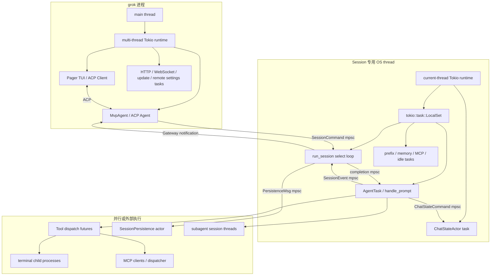

# Grok Build Actor、Channel 与并发模型详解

Grok Build 的难点不只是“异步代码很多”，而是它同时使用了多种并发边界：多线程 Tokio runtime、每 Session 专用 OS thread、`LocalSet`、Actor command channel、独立 prompt task、ChatState actor、Tool batch 并发、持久化 worker、ACP streaming pipeline，以及跨线程共享的少量原子状态。

如果只看到 `async fn` 和 `Arc`，很容易得出两个错误结论：

1. 所有状态都可能被多个线程同时修改；
2. 一个 Session 同时只能执行一个 future，所以完全不存在竞态。

真实情况介于两者之间：

- `SessionActor` 被限制在一个 OS thread 的 `LocalSet` 中，避免线程级数据竞争；
- 但同一 LocalSet 上有多个 future 协作式交错执行，仍然存在 await 间隙竞态；
- Conversation 又被移入独立 `ChatStateActor`，通过 FIFO command 串行化；
- Tool batch 可以真正并发推进；
- persistence、MCP、网络、subagent 等任务可能运行在其他 Tokio task 或线程；
- 跨边界通信依赖 channel、oneshot、watch、CancellationToken 和极少数 mutex/atomic。

本文目标是把这些边界逐层拆开，并解释代码为什么这样写。

## 1. 总体并发拓扑



可以把系统分成三类并发单元：

| 类型 | 例子 | 主要保证 |
| --- | --- | --- |
| Actor | Session command loop、ChatStateActor、Persistence actor | 单 owner、FIFO command、顺序 mutation |
| Scoped task | prompt AgentTask、prefix task、memory flush、sampling drainer | 可取消、生命周期受 Session/turn 控制 |
| 外部/后台任务 | Tool、subagent、MCP、terminal process、upload | 独立推进，通过 handle/event 回到 Session |

## 2. 为什么每个 Session 使用专用 OS Thread

入口：

```text
crates/codegen/xai-grok-shell/src/session/acp_session_impl/spawn.rs
spawn_session_on_thread()
```

### 2.1 `SessionActor` 是 `!Send`

`SessionActor` 内有：

- `Rc`
- `RefCell`
- `Cell`
- `Arc<SessionActor>` 上的单线程 interior mutability
- 某些只允许在创建线程使用的资源

因此不能把拥有 `SessionActor` 的 future 直接交给 multi-thread runtime 的 `tokio::spawn`。后者要求 future 为 `Send`，因为 scheduler 有权在线程间迁移 task。

### 2.2 线程内部结构

每个 Session 创建：

```text
std::thread::Builder
├── name: ses-<session-id-prefix>
├── stack: 8 MiB
└── current-thread Tokio runtime
    └── LocalSet
        └── spawn_session_actor + run_session + local tasks
```

`LocalSet` 允许 `spawn_local()` 接收 `!Send` future。所有 local task 只会在 Session thread 被轮询。

### 2.3 这解决了什么

线程 confinement 带来：

- `RefCell` 可替代很多 async mutex；
- Agent/ToolBridge 等对象不必全部实现 `Send + Sync`；
- 一个 Session 的 CPU/状态行为与其他 Session 隔离；
- Session panic 可以由外部 join-handle supervisor 回收；
- subagent 作为另一个 Session，自然拥有独立线程。

### 2.4 它没有解决什么

同一 LocalSet 上多个 task 仍会在 `.await` 处交错：

```text
run_session task       ──lock──await────────resume──
prompt AgentTask             ─────run tool await────
prefix task              ──git/MCP await──
memory task                     ──storage await──
```

不会出现两个 CPU thread 同时执行 `SessionActor` 代码，但会出现典型逻辑竞态：

- 检查 `running_task == None` 后 await，回来时已有 task；
- 一个 turn 刚完成但 completion 尚未被 run loop 消费；
- interjection 在最后一次 drain 之后到达；
- cancel 与 Tool/monitor completion 交错；
- model switch 在排队和 promotion 之间发生。

因此源码大量使用“锁内检查 → 锁外 await → 重新加锁再检查”。这不是多余防御，而是 cooperative concurrency 的必要模式。

## 3. 跨线程代理：`SessionHandle`

文件：

```text
crates/codegen/xai-grok-shell/src/session/handle.rs
```

外部组件不持有 `SessionActor`，只拿一个 `Clone + Send` 的 `SessionHandle`。

### 3.1 Command proxy

最核心字段是：

```rust
pub cmd_tx: mpsc::UnboundedSender<SessionCommand>
```

典型 query 写法：

```text
创建 oneshot(tx, rx)
→ cmd_tx.send(SessionCommand::{ ..., respond_to: tx })
→ Session run loop 顺序处理
→ respond_to.send(result)
→ 调用方 rx.await
```

这相当于手写 Actor RPC。

### 3.2 为什么 Handle 仍缓存很多字段

Handle 不只有 command sender，还缓存：

- session info/cwd；
- model ID、reasoning effort、yolo mode；
- current prompt ID；
- pending interactions；
- ChatStateHandle；
- permission handle；
- ToolContext；
- MCP startup snapshot；
- terminal/scheduler/notification handles；
- subagent inheritance 信息。

这些字段分三类：

1. **不可变 spawn snapshot**：无需 RPC，例如 `info`、初始 MCP、agent name；
2. **显式跨线程共享状态**：atomic/mutex/ArcSwap，例如 current prompt、gateway gate；
3. **另一个 Actor handle**：如 ChatStateHandle、permission handle。

源码会注明 snapshot 是否可能过期。例如 `SessionHandle.mcp_servers` 是 spawn 时快照，热更新后需要最新状态的调用方必须 query SessionActor。

### 3.3 Fail-open 与 fail-closed

Handle query 在 actor channel 关闭时必须选择安全默认值。例如：

- `is_busy()` 失败返回 `true`：保守地不卸载 Session；
- list/query 可能返回 `None`；
- mutation 多数 fire-and-forget，channel 关闭就丢弃；
- durable 操作通过 oneshot 区分未提交、已提交但报错、ack 丢失。

默认值代表系统安全策略，而不只是错误处理风格。

## 4. Session 主 Actor Loop

文件：

```text
crates/codegen/xai-grok-shell/src/session/acp_session_impl/run_loop.rs
```

### 4.1 一个 `tokio::select!` 协调所有控制面事件

主循环大致监听：

```text
idle memory flush timer
dream timer
model switch watch
ChatStateActor event
SessionEvent / streaming event
prompt completion channel
SessionCommand channel
其他 scheduler/MCP/workflow 通道
```

使用 `tokio::select! { biased; ... }`。当多个分支同时 ready 时，源码顺序决定优先级。

### 4.2 为什么 run loop 不直接执行整个 prompt

若 `SessionCommand::Prompt` 分支直接：

```rust
session.handle_prompt(...).await
```

那么在模型/Tool 执行期间，主 loop 无法消费 Cancel、Interject、notification、stream flush 等命令。

实际做法是：

```text
Prompt command
→ queue_input()
→ maybe_start_running_task()
→ spawn_local AgentTask
→ run loop 继续 select
```

Prompt task 完成后通过 `completion_tx` 把 `(prompt_id, result)` 发回主 loop。

这形成两层串行性：

- run loop 持续响应控制命令；
- `State.running_task` 保证同时最多一个主 prompt task。

### 4.3 completion 分支是 commit 点

completion 到达时，主 loop：

1. flush ReplayBuffer；
2. `handle_completion()`；
3. drain monitor race buffer；
4. 更新 goal/infra pause；
5. 把 stranded interjection 转成 prompt；
6. promotion 下一条 pending input；
7. idle 时 drain notifications；
8. 发布 idle；
9. 可选启动 laziness check。

因此 prompt future 返回不等于 turn 已完全从队列状态提交。`completion_rx` 分支处理完才是 Session 调度意义上的结束。

## 5. `State`：Prompt 调度的权威状态

定义在 `acp_session.rs`：

```rust
pub(crate) struct State {
    running_task: Option<AgentTask>,
    pending_inputs: VecDeque<InputItem>,
    pending_notifications: Vec<PendingNotification>,
    combine_edit_holds: HashSet<String>,
    notifications_suppressed: bool,
    rewindable: bool,
    nudges_used_this_session: u32,
}
```

### 5.1 为什么还需要 `TokioMutex<State>`

虽然 SessionActor 在单线程上，但：

- run loop；
- AgentTask；
- notification task；
- interjection task；
- timer task

会协作式交错访问调度状态。`TokioMutex` 把跨 await 的状态转换串行化。

### 5.2 为什么 Conversation 不在 State 中

注释明确说明 Conversation、tokens、prompt index、sampling config 等已迁移到 ChatStateActor。这样：

- prompt 调度锁不会被大历史 clone、token 计算和 persistence 阻塞；
- ChatState mutation 有单独顺序；
- 外部可以通过 ChatStateHandle query，而无需进入 Session command loop；
- Conversation 相关 invariant 集中在一个 actor。

### 5.3 Running identity 的两个表示

系统同时存在：

- `State.running_task.prompt_id`；
- `SessionHandle/current_prompt_id: Arc<std::sync::Mutex<Option<String>>>`。

二者用途不同：

- `running_task` 与 `pending_inputs` 在同一锁下，是队列 sweep 的权威身份；
- `current_prompt_id` 供跨线程 telemetry、subagent attribution、notification meta 快速读取。

完成路径可能先清 `current_prompt_id`，再处理 queue。因此队列算法不能用 pin 代替 `running_task`，源码对此有明确警告。

## 6. Prompt Queue 的状态机

相关文件：

```text
prompt_queue.rs
notification_drain.rs
turn_end.rs
tasks_cancel.rs
```

### 6.1 一个特殊 invariant：运行项仍留在队首

promotion 时不会立刻从 `pending_inputs` 删除 front。它同时：

```text
pending_inputs.front = 当前运行 InputItem
running_task          = 对应 AgentTask
```

完成或 cancel 时才 pop/resolve front。

这样可以：

- 保留原始 `respond_to` oneshot；
- 支持 queue UI 显示 running row；
- cancel 时精确处理运行项；
- 避免另建一份复杂的 RunningInput 状态。

代价是所有 sweep/reorder 都必须保护运行项。

### 6.2 `queue_input()`

它在真正运行前：

- 立即写 fast prompt history；
- 生成 `InputItem`；
- 处理 send-now/preemption；
- 去重某些 synthetic wake；
- 维护 combined prompt edit hold；
- 在锁内插入 `VecDeque`；
- 返回是否需要取消当前 turn。

### 6.3 `maybe_start_running_task()` 的双重检查

典型结构：

```text
lock State
├── running_task 存在 → return
├── queue 空 → return
└── 记录是否可能 combine
unlock

await load_config()                 // 锁外 I/O

lock State again
├── 重新检查 running/queue          // await gap 后状态可能变了
├── 清 stale workflow completion
├── 可选 combine queued prompts
├── 读取 front
├── 设置 current_prompt_id
├── broadcast queue promotion
└── running_task = AgentTask::new_prompt(spawn_local)
```

这是本项目 cooperative race 防御的标准范式。

### 6.4 为什么 promotion broadcast 在 spawn 前

客户端需要先把 queue row 标成 running，并建立 user-echo skip 状态。如果先 spawn prompt，`handle_prompt` 很可能立即发 UserMessageChunk，UI 会在 promotion update 之前看到 echo，造成重复或错误排序。

所以代码先 broadcast，再创建 AgentTask。

### 6.5 `sweep_pending_inputs()`

该 helper 删除满足条件的 queued item，但始终保留与 `running_task.prompt_id` 相同的项。否则可能把运行项删掉，使下一条用户消息移到 index 0，随后 cancel 路径误把它当作运行项解决掉，造成消息永远不执行。

这是一个很典型的“队列位置不是身份，prompt ID 才是身份”原则。

## 7. `AgentTask` 与 TaskSlot

文件：`tasks_cancel.rs`。

### 7.1 `AgentTask`

`AgentTask::new_prompt()` 使用 `spawn_local` 执行：

```text
run_task
→ SessionActor::handle_prompt
→ completion_tx.send(prompt_id, result)
```

对象只保存：

- prompt ID；
- `AbortHandle`。

主 loop 不 await JoinHandle，而由 completion channel接收正常结束；cancel 直接通过 AbortHandle 终止 future。

### 7.2 `TaskSlot<T>`

这是“最多一个 task”的小型 RAII 容器：

- `arm(new)`：abort old，保存 new；
- `take()`：转移 JoinHandle；
- `cancel()`：abort 并清空。

它用于：

- deferred prefix；
- idle notification debounce；
- 其他只允许一个实例的延迟任务。

内部用 `Cell<Option<JoinHandle<T>>>`，因为它只在 Session LocalSet 线程访问。

### 7.3 RAII guards

`TurnSubagentScopeGuard` 在 drop 时按 prompt ID 清 `current_prompt_id`；`TurnActiveGuard` 在任何退出路径把 flag 设回 false。

RAII 覆盖：

- `return Err`；
- `?`；
- future abort/drop；
- panic unwind（若未 abort process）。

相比在每个 return 前手工清理，guard 更适合复杂 async 控制流。

## 8. ChatStateActor：Conversation 的串行化边界

文件：

```text
crates/codegen/xai-chat-state/src/actor/mod.rs
crates/codegen/xai-chat-state/src/handle.rs
```

### 8.1 Actor 自己拥有全部 ChatState

```rust
pub struct ChatStateActor {
    state: ChatState,
    pruning_config: PruningConfig,
    persistence: Box<dyn ChatPersistence>,
    cmd_rx: UnboundedReceiver<ChatStateCommand>,
    event_tx: UnboundedSender<ChatStateEvent>,
    cancellation_token: CancellationToken,
}
```

没有其他对象直接拿 `&mut ChatState`。

### 8.2 顺序处理

Actor loop：

```rust
tokio::select! {
    biased;
    _ = cancellation.cancelled() => break,
    cmd = cmd_rx.recv() => handle_command(cmd).await,
}
```

因此不同 producer 发来的 command 最终形成单一 mutation 顺序。

### 8.3 Fire-and-forget 与 Ack query

`ChatStateHandle` 提供两种 API：

```text
mutation:
    cmd_tx.send(PushToolResult)
    不等待 actor

query / strict mutation:
    创建 oneshot
    send(Command { reply })
    rx.await
```

FIFO channel 保证同一个 sender clone 上发送顺序，但多个 producer 的跨 sender 全局先后由实际 enqueue 时刻决定。因此需要“User item 必须在 sampling request 前已处理”时，代码使用 `push_user_message_and_ack()`，不能只 fire-and-forget 后立刻 query。

### 8.4 `BuildConversationRequest` 是原子读边界

该 command 在 actor 内：

1. `ensure_conversation_integrity()`；
2. clone/裁剪 request copy；
3. 组装 ConversationRequest；
4. reply。

在这个 command 执行期间，其他 push command 不会插入中间。这保证一次模型请求看到自洽的 Tool Call/Result 配对。

### 8.5 ChatStateEvent 反向通道

ChatStateActor 不直接依赖 SessionActor，而发：

- ConversationReset；
- ImageBudget；
- PromptIndexChanged；
- TokensUpdated。

Session run loop 消费后处理 memory re-arm、telemetry 等跨层副作用，保持 chat-state crate 的职责独立。

## 9. 为什么使用 Unbounded Channel

项目大量使用 `mpsc::unbounded_channel()`：

- SessionCommand；
- ChatStateCommand；
- completion；
- persistence；
- SessionEvent；
- Tool batch result。

### 9.1 优点

- 同步 `send()`，不需要在持锁区 `.await`；
- cancellation/control command 不会因满队列阻塞；
- fire-and-forget mutation API 简单；
- 单 Session 的典型 command 量可控；
- 避免 producer/consumer 互等形成 actor deadlock。

### 9.2 风险

unbounded 不提供内存级 backpressure。若 producer 长期快于 consumer，消息会积累。

项目通过上层机制缓解：

- streaming chunks 经 ReplayBuffer merge/debounce；
- persistence 合并连续文本 notification；
- Tool delta 不全部持久化；
- queue 有去重/合并 synthetic prompt；
- completion/monitor 有 reservation 和 suppression；
- actor command 通常是短结构，超大内容放文件或 Arc。

但这不是数学意义上的容量上限。增加新的高频 producer 时，应优先审计是否需要 batching、coalescing 或 bounded channel。

## 10. 输出并发与 ReplayBuffer

相关文件：

```text
updates.rs
agent/update_chunk_merge.rs
run_loop.rs
```

### 10.1 高频路径

Sampling stream 调用：

```text
send_update / send_buffered_xai_update
→ 生成带 eventId/promptId/timestamp 的 SessionEvent::Notification
→ event_tx
→ run_session event_rx 分支
→ ReplayBuffer.consume_chunk
→ emit_buffered
```

ReplayBuffer 可以合并连续 text/reasoning delta，降低 UI、gateway 和磁盘写频率。

### 10.2 低频直接路径

`emit_notification_direct()`：

1. 确保 event ID；
2. 除 AvailableCommands 外写 persistence；
3. gateway enabled 时发 client。

适用于低频、需要立即发送的完整 notification。

### 10.3 transient 路径

`emit_transient_notification()` 只发 live client，不持久化。适合纯 UI 修正，其真实状态由别的 resource/历史负责。

### 10.4 buffered xAI Tool delta 为什么不持久化

Tool argument delta 很高频，持久化后 replay 价值很低。最终 canonical ACP ToolCall 会带完整 `raw_input` 并落盘，所以 delta 只 live-forward。

### 10.5 事件顺序 invariant

completion/cancel/shutdown 分支在发 `TurnCompleted` 前必须 flush ReplayBuffer。否则磁盘或 client 可能先看到“turn 完成”，后看到上一轮最后一段文本。

源码特别警告：已经排队的 buffered chunks 前若插入一个 mint 了更高 event ID 的 direct update，客户端 in-order dedup 可能把后到的旧 chunks 当 stale 丢弃。因此某些 mode update 必须也排入 FIFO event pipeline。

## 11. Persistence Actor

文件：`session/persistence.rs`。

### 11.1 单 writer

`SessionPersistence` 拥有：

- storage adapter；
- `PersistenceMsg` receiver；
- pending merged ACP notification；
- remote/relay sync；
- summary/title generator。

所有 session 文件 mutation 通过一个 receiver 顺序执行，避免多个 async task 同时改 `updates.jsonl`、summary 和状态文件。

### 11.2 消息种类

包括：

- Update；
- ContentChunk；
- Chat；
- ReplaceChatHistory；
- CurrentModel；
- Plan/Goal/Workflow/Signals；
- Rewind point；
- Compaction artifacts；
- Feedback；
- title；
- Flush/FlushAndAck；
- durable append；
- Copy/snapshot。

### 11.3 普通写与 barrier

```text
普通：tx.send(PersistenceMsg::Update)
      只保证已 enqueue

FlushAndAck：
      enqueue barrier
      actor flush 前面所有消息
      oneshot ack

Durable append：
      drain pending
      durable commit-aware write
      返回 NotCommitted / Committed / AckLost 语义
```

“send 成功”不等于“已写磁盘”。需要 durability 的调用点必须用 ack/barrier。

### 11.4 为什么 persistence 也合并文本

ReplayBuffer 优化 live emission；Persistence actor 仍维护 `pending_notification`，进一步合并相邻纯文本 ACP chunk，减少文件写和远端同步。两层优化服务不同边界，不能互相替代。

## 12. Tool Batch：局部并发策略

文件：`tool_calls.rs::execute_tool_calls_batch()`。

### 12.1 准备阶段串行

对模型给出的 Tool Calls 依序执行 `prepare_tool_call()`：

- parse args；
- permission；
- hooks；
- plan gate；
- 特殊 ToolLoop 结果；
- UI start event。

如果前一个 call 被用户拒绝/取消，后续 call 不再执行，而是写入对应 cancellation ToolResult。

串行准备保证用户不会同时收到多块互相竞争的 permission panel，也让 batch 的终止语义确定。

### 12.2 `exit_plan_mode` tail

多个 Tool Call 时，`split_exit_plan_tail()` 把退出 Plan Mode 的 call 放到 body 执行之后。否则 plan exit 与仍受 plan gate 的操作并发，会产生权限/状态竞态。

### 12.3 获批后并发 dispatch

准备好的 calls 转成 futures，放入：

```rust
FuturesUnordered
```

因此多个 read、grep、MCP call 等可并发完成。一个独立 drainer task 将完成项送到 `dispatch_rx`，Session 侧逐个执行 postflight。

### 12.4 为什么有 drainer task

dispatch futures 可能都是 `Send` 的 Tool 工作。使用 `tokio::spawn` drainer 可以让 completion stream 独立推进，并通过 channel 把结果交回仍持有 `&SessionActor` 的 local postflight 逻辑。

`AbortOnDrop` guard 保证外层提前退出时 drainer 不泄漏。

### 12.5 同文件写锁

批次先收集所有非只读 call 的目标路径，再为有写冲突的路径建立：

```text
HashMap<path, Arc<tokio::sync::Mutex<()>>>
```

每个 dispatch 在运行前获取对应 lock。结果是：

- 不同路径可并发；
- 同一路径的 read/write 或 write/write 按锁串行；
- 锁只存在于本批次，不是全局文件锁。

跨批次和跨 Session 的文件一致性仍需 workspace/file Tool 自身的原子写、permission、worktree isolation 等机制保证。

### 12.6 完成顺序与 call ID

`FuturesUnordered` 按完成顺序产出，不保证模型给出的顺序。代码带回原始 `idx`，用 `approved_slots[idx]` 找到 metadata，但 postflight/ToolResult 可能按完成顺序进入历史。

协议依赖 `tool_call_id` 配对，而不是位置配对，所以逻辑仍正确。需要严格顺序的 Tool 必须在调度层特殊分组，而不能假设 vector 顺序自动保留。

### 12.7 interruptible wait Tool

wait 类 Tool 的 dispatch 使用：

```rust
tokio::select! {
    tool_result = run_tool() => ...,
    _ = wait_for_pending_interjection() => interrupted result,
}
```

这样用户 interjection 可以打断长时间 wait，而不需要取消整个 turn。真正后台任务继续存在，模型收到“等待被打断”后处理用户新要求。

### 12.8 共享 Auth recovery

批次共享 `OnceCell<bool>`。若多个 Tool 同时遇到 auth error，只让一个执行恢复，其他 call 复用结果，避免 refresh storm。

## 13. Cancel 的并发语义

入口：`cancel_running_task()`。

Cancel 不是简单 `AbortHandle::abort()`，而是一套有顺序的 teardown 协议。

### 13.1 主要步骤

1. 请求取消 compaction；
2. Ctrl+C 时抑制 task wake/notification drain；
3. snapshot current prompt ID；
4. 若 cancel subagents，先 abort producer，防止继续 spawn；
5. 发送 session-scoped subagent cancel；
6. kill foreground terminal；
7. 可选 kill background tasks；
8. 锁 State，drain monitor race buffer；
9. take/abort running task；
10. 按 cancel 类型筛选 queued inputs；
11. 修复 conversation/turn terminal；
12. flush replay/persistence；
13. promotion 保留的下一条输入。

### 13.2 为什么先 kill foreground 再 abort prompt future

若只 abort future，子进程不一定自动退出。TerminalBackend 可能独立持有 process handle。先显式 kill 可避免 orphan foreground command。

源码承认一个很窄的 TOCTOU：kill 与 abort 之间 prompt task 理论上可再 spawn process。实践上 cooperative scheduling 和紧邻 abort 让窗口很小，但这是需要理解的边界。

### 13.3 Ctrl+C、send-now、teardown 不同

| 类型 | 当前 turn | queued user | background task | synthetic wake |
| --- | --- | --- | --- | --- |
| Ctrl+C | 取消 | 通常保留 | 通常保留 | 抑制/清理相关 wake |
| send-now | 取消并让新输入优先 | 新输入 promotion | 保留 | 重新启用 notification |
| subagent teardown | 取消 | 全部解决/清理 | owner-scoped kill | 不再启动下一轮 |
| rewind-if-pristine | 可撤回当前 front | 按 rewind 语义恢复 | 通常保留 | 清除 suppression |

“cancel”参数很多，是因为这些产品语义不能被一个布尔值表达。

### 13.4 Monitor race buffer

cancel 与 `TurnActiveGuard` drop 之间可能有 monitor event 仍认为 turn active，从而写入 mid-turn buffer。cancel 在锁内 sweep buffer 到 pending notifications，确保事件不会因 task abort 丢失；hard teardown 时再显式清除已死亡 producer 的通知。

## 14. Interjection 的竞态处理

Interjection 与 queued prompt 不同：它希望进入当前 turn，让下一次 sampling loop 立刻看到。

### 14.1 正常路径

```text
interjection arrives
→ PendingInterjection buffer
→ process_conversation_turn 安全点 drain
→ 格式化 synthetic/user context
→ push ChatState
→ 继续 sampling
```

### 14.2 Stranded interjection

可能发生：

```text
turn 做完最后一次 drain
→ interjection 到达
→ prompt task 返回
```

如果不处理，它会永远留在 buffer。completion 分支调用 `flush_stranded_interjections()`，把它转换为一个新的 front-of-queue prompt。

### 14.3 为什么 fallback 插入时重新检查 running front

调用方先观察 idle，随后 await/加锁前，另一条路径可能已 promotion 一个 prompt。fallback 若盲目 `push_front` 会把运行项挤到 index 1，破坏“运行项在 front” invariant。

代码在锁内判断 front ID 是否等于 running ID：

- 是：插到 index 1；
- 否：插到 front。

这是典型的 check-then-act race 修复。

## 15. 锁与 Interior Mutability 的选择

### 15.1 `RefCell<T>`

适合：

- 只在 Session thread 使用；
- borrow 不跨 await；
- 需要从 `&self` 修改；
- 高频轻量状态。

例子：Agent、memory storage slot、tool overrides。

风险：运行时 borrow panic。必须在 `.await` 前 drop borrow。

### 15.2 `Cell<T>`

适合 Copy 小值，如 turn number、flag、date/prefix 状态。没有 borrow guard，成本最低。

### 15.3 `parking_lot::Mutex`

适合短临界区、不会跨 await 的同步共享，如 plan tracker、pending reminder list。不能持 guard await。

### 15.4 `tokio::sync::Mutex`

适合可能跨 await 或被多个 local async task 访问的状态，如 `State`、MCP state、file lock。

即便单线程也需要它来防止 cooperative interleaving。

### 15.5 `std::sync::Mutex`

用于真正跨 OS thread 且临界区很短的 pin，例如 `current_prompt_id`。SessionHandle 的外部调用方可同步读取。

### 15.6 Atomic

适合跨线程单值信号：

- gateway enabled；
- is turn active；
- cancellation/suppression generation；
- usage counters；
- force compact。

代码会根据同步需求选择 Relaxed、AcqRel、SeqCst。计数/观测常用 Relaxed；需要发布前序写并与 reader 建立 happens-before 时用 AcqRel；history repair gate 等强顺序点可能用 SeqCst。

### 15.7 ArcSwap

`resolved_tool_overrides` 使用 `ArcSwapOption`，允许跨线程 reader 无需 async lock 读取最新 immutable snapshot，适合 subagent spawn inheritance。

## 16. CancellationToken、AbortHandle 与 Channel Close

三者语义不同：

| 机制 | 行为 | 适合 |
| --- | --- | --- |
| `AbortHandle` | 直接 drop/终止某个 Tokio task future | prompt、debounce、drainer |
| `CancellationToken` | cooperative，代码在 select/检查点自行退出 | ChatState、sync loop、compaction |
| channel close | 所有 sender drop 后 receiver 得到 None | Actor 生命周期自然结束 |

### 16.1 Abort 不执行异步清理

Future 被 abort 后只执行同步 Drop，不会自动 await cleanup。因此必须依赖：

- RAII guard；
- cancel 前显式 kill process；
- completion/cancel 路径修复历史；
- actor shutdown hook；
- persistence barrier。

### 16.2 CancellationToken 可组成层次

Token 适合传给多个子任务，并在 shutdown 时广播。被取消的任务在自己的 select 分支安全结束，可以 flush/emit terminal event。

### 16.3 Channel close 是所有权信号

Session command receiver 得到 `None` 说明外部所有 handle sender 已释放。run loop 执行 session_end hook、memory save、dream、workflow shutdown、feedback flush 和 scratch cleanup 后退出。

## 17. `spawn_local`、`tokio::spawn` 与 `spawn_blocking`

### 17.1 `spawn_local`

用于捕获 `Arc<SessionActor>` 或其他 `!Send` 状态：

- AgentTask；
- prefix；
- memory/dream；
- laziness；
- plan approval resume。

生命周期绑定 Session LocalSet；线程结束会 drop 它们。

### 17.2 `tokio::spawn`

用于 `Send + 'static` future：

- Tool dispatch drainer；
- HTTP/upload；
- background catalog；
-跨 Session/Agent 任务。

即便当前 runtime 是 current-thread，API 仍要求 Send，使任务可以独立于 local actor borrow。

### 17.3 `spawn_blocking`

用于同步 CPU/IO 工作：

- worktree cleanup；
- filesystem scanning；
- 某些 parser/validation；
- 无 async API 的阻塞库。

它运行在线程池，传入 closure 必须拥有 Send 数据，不能捕获 `RefCell` borrow 或 `&SessionActor`。

## 18. 常见死锁和竞态陷阱

### 18.1 在 run_session 中等待自己的 event pipeline

`flush_to_disk()` 注释明确禁止从 `run_session()` 内调用：它通过 `event_tx` 请求 flush，而 receiver 就是当前被阻塞的 select loop，会自等死锁/超时。

### 18.2 持 `RefCell` borrow 跨 await

另一个 local task 可能在 await 时尝试 borrow，引发 runtime panic。正确做法是先 clone 所需 handle，再 drop borrow，再 await。

### 18.3 持 State lock 做配置/网络 I/O

会阻塞 Prompt/Cancel/queue 状态转换。`maybe_start_running_task()` 特意在锁外读 config，然后重检。

### 18.4 以 queue index 代替 prompt identity

running front、send-now、fallback interjection、queue edit 都会改变位置。必须用 prompt ID 并在同一 State lock 下判断。

### 18.5 把 fire-and-forget 当成已提交

`cmd_tx.send()` 只代表命令入队。紧接着依赖 mutation 结果时必须用 ack API。

### 18.6 Direct notification 越过 buffered notification

可能造成 event ID 逆序和客户端丢 chunk。需要根据频率和顺序要求选择 event pipeline。

### 18.7 Abort task 后忘记外部资源

子进程、MCP request、background task、subagent 不一定随 Rust future drop 自动终止，必须走 owner-scoped cancel/kill。

## 19. 并发安全不是只有 Rust 类型安全

Rust 可以防止 data race，但以下仍是业务级并发 invariant：

- 一个 Session 最多一个主 prompt task；
- running input 在 queue front；
- Assistant ToolCall 必须最终有 ToolResult 或 repair result；
- TurnCompleted 必须在所有 buffered delta 之后；
- user prompt 不得被 synthetic sweep 删除；
- cancel 不能杀 sibling/parent 的 shared terminal task；
- interjection 不得静默 stranded；
- persistence barrier 前的消息必须先落盘；
-同一 Tool batch 的冲突写必须串行；
- auth recovery 不应并发风暴。

这些由锁顺序、ID、RAII、channel FIFO、completion branch 和测试共同保证。

## 20. 如何调试“卡住”问题

### 20.1 Prompt RPC 一直不返回

检查：

1. `SessionCommand::Prompt` 是否 send 成功；
2. InputItem 是否进入 `pending_inputs`；
3. `running_task` 是否阻止 promotion；
4. completion_tx sender 是否仍存活；
5. `handle_completion` 是否解决 front 的 `respond_to`；
6. sweep 是否错误删除 user item 而未发送 RemovedFromQueue。

### 20.2 UI 显示 Cancelling

检查：

- `shell.cancel.received` 与 `shell.cancel.processing`；
- pin prompt ID 与 `State.running_task.prompt_id`；
- foreground kill 是否卡住；
- AbortHandle 是否 finished；
- completion/replay flush 是否到达；
- permission interaction 是否仍 parked。

### 20.3 Tool 已完成但模型没继续

检查：

- dispatch result 是否进入 `dispatch_rx`；
- postflight 是否成功 push ToolResult；
- Tool call ID 是否为空/错配；
- prompt task 是否在等待 permission/hook；
- cancel/interjection 是否改变 ToolLoop；
- ChatState build request 是否修复/包含 result。

### 20.4 最后几个字丢失

检查 ReplayBuffer flush 顺序、event ID、是否使用 direct update 越过 buffered path、persistence text merge 是否被 flush。

### 20.5 Session 无法 idle unload

`SessionHandle::is_busy()` 失败会保守返回 true。检查 actor channel、`running_task`、残留 pending_inputs、parked interaction、subagent/activity signal。

## 21. 推荐测试模型

并发测试不要只 sleep 固定毫秒。优先使用：

- oneshot barrier 控制精确阶段；
- mpsc 接收事件断言顺序；
- CancellationToken；
- fake Tool 在指定 barrier 阻塞；
- `yield_now()` 暴露 interleaving；
- timeout 只作为测试失败保护；
- prompt ID/call ID 断言身份；
- drop sender 模拟 actor shutdown；
- ack API 验证 mutation 已处理。

关键测试场景：

1. Prompt 运行时第二条 Prompt 入队；
2. send-now 抢占；
3. completion 与 interjection 同时到达；
4. cancel 与 monitor completion 交错；
5. 多 Tool 不同完成顺序；
6. 同文件两个写 Tool；
7. persistence flush barrier；
8. ChatState actor 在 build request 前处理完 User push；
9. channel close 的 session-end cleanup；
10. direct/buffered notification 顺序。

## 22. 核心源码索引

| 主题 | 文件/函数 |
| --- | --- |
| Session 专用线程 | `session/acp_session_impl/spawn.rs::spawn_session_on_thread` |
| SessionActor 构造 | `spawn.rs::spawn_session_actor` |
| 外部代理 | `session/handle.rs::SessionHandle` |
| 主 select loop | `session/acp_session_impl/run_loop.rs` |
| 调度 State | `session/acp_session.rs::State` |
| Prompt queue | `prompt_queue.rs::queue_input` |
| Promotion | `notification_drain.rs::maybe_start_running_task` |
| Prompt task | `tasks_cancel.rs::AgentTask` |
| Cancel | `tasks_cancel.rs::cancel_running_task` |
| Interjection | `interjection.rs` |
| Turn completion | `turn_end.rs::handle_completion` |
| ChatState Actor | `xai-chat-state/src/actor/mod.rs` |
| ChatState proxy | `xai-chat-state/src/handle.rs` |
| Request atomic snapshot | `actor/request_builder.rs` |
| Tool batch | `tool_calls.rs::execute_tool_calls_batch` |
| Outbound events | `updates.rs` |
| ReplayBuffer | `agent/update_chunk_merge.rs` |
| Persistence Actor | `session/persistence.rs::SessionPersistence` |

## 23. 与下一篇的边界

本文回答的是“哪些 task 能同时推进、状态如何安全传递”。下一篇计划文档 `16_sampling_and_agent_loop.md` 将沿 `process_conversation_turn()` 内部循环展开：

- 每个 sampling iteration 的精确顺序；
- streaming drainer；
- retry/auth/compaction；
- stop reason；
- structured output；
- TodoGate/stationarity；
- Tool loop 如何决定 continue/end。

## 24. 相关文档

- [14_complete_execution_timeline.md](14_complete_execution_timeline.md)：完整运行时间线
- [13_prompt_and_tool_list_assembly.md](13_prompt_and_tool_list_assembly.md)：请求组装
- [09_end_to_end_request_flow.md](09_end_to_end_request_flow.md)：端到端概览
- [tools/05-cross-cutting-behavior.md](tools/05-cross-cutting-behavior.md)：Tool 权限、锁和持久化
