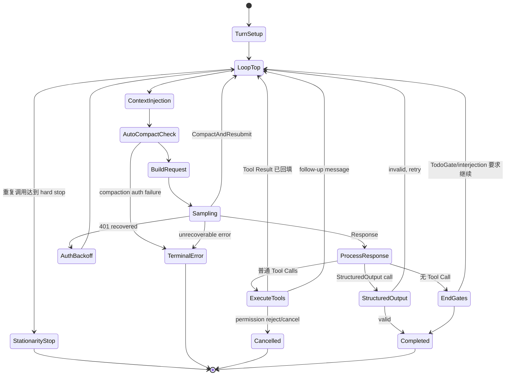

# Grok Build Sampling、Streaming 与多轮 Agent Loop 详解

本文深入一次用户 turn 内部最核心的循环：Grok Build 如何反复构造模型请求、消费 streaming event、处理错误、执行 Tool Call、回填 Tool Result，再决定继续采样还是结束。

主入口：

```text
crates/codegen/xai-grok-shell/src/session/acp_session_impl/turn.rs
    process_conversation_turn_with_recovery()
    process_conversation_turn()

crates/codegen/xai-grok-shell/src/session/acp_session_impl/sampler_turn.rs
    prepare_sampler_for_turn()
    run_turn_via_sampler()
    handle_sampling_failure()

crates/codegen/xai-grok-shell/src/session/acp_session_impl/tool_calls.rs
    handle_sampling_event()
    execute_tool_calls()
```

## 1. 首先区分三个“轮次”

代码里“turn”可能指不同层级：

| 层级 | 含义 | 计数 |
| --- | --- | --- |
| 用户 Prompt Turn | 用户提交一次 prompt，直到最终响应 | prompt index / turn number |
| Sampling Loop | 同一用户 turn 内调用一次模型 | `loop_index` |
| Tool Turn | 一轮模型 Tool Call 执行完成后继续模型 | `tool_turn_count` |

例如：

```text
用户：修复测试

Sampling #1 → read_file
Tool Turn 1
Sampling #2 → search_replace + run tests
Tool Turn 2
Sampling #3 → 最终回答

总计：1 个用户 turn，3 次 sampling，2 个 Tool turn
```

`max_turns` 限制的是 Tool loop 推进次数，不是 Session 一生只能接收多少用户消息。

## 2. 整体状态机



## 3. Recovery 外层

`handle_prompt()` 不直接调用主循环，而是：

```text
process_conversation_turn_with_recovery()
→ process_conversation_turn()
```

Recovery 外层负责 Agent policy 允许的高层恢复。主循环内部仍自行处理更细的：

- context overflow compaction；
- auth 401 refresh/resubmit；
- sampler 自身 retry；
- structured output retry；
- doom-loop recovery。

不要把“函数名字带 recovery”理解为所有错误都会自动重跑。只有显式分类为可恢复的错误才继续；permission rejection、内容过滤、配置错误等有独立终态。

## 4. Turn Setup：进入循环前只做一次的工作

`process_conversation_turn()` 开头执行：

1. 记录 wall/awake 双时钟；
2. resume 后按需刷新 model metadata；
3. model switch 后按需 compact；
4. 记录 turn start timestamp；
5. 给 trace span 写 agent/skill/model/effort/parent；
6. 创建 PromptTiming；
7. 获取 Tool Definitions 快照；
8. 记录当前模型；
9. 初始化 metrics、Tool 列表、retry 和 gate 状态；
10. 编译 structured output validator。

### 4.1 Tool Definitions 为什么在 loop 外

```rust
let (tool_definitions, mcp_wait_ms) =
    self.prepare_tool_definitions_timed().await;
```

同一用户 turn 内所有 sampling iteration 复用这份基础快照。好处是：

- Tool schema 不会在 Tool Call 后突然改变；
- prompt cache 更稳定；
- fork tool override 有一致基线；
- trace 上传的 Tool Definitions 对应该 turn；
- model 不会看到调用了一个下一轮突然消失的 Tool。

动态 Skill/MCP 状态仍可通过 reminder、ToolIndex 和 Tool Result变化，但顶层 function definitions 保持稳定。

### 4.2 Blocking 与 Progressive MCP

`prepare_tool_definitions_timed()` 根据 `McpInitStrategy`：

- Blocking：首次 prompt 前等待 MCP 初始化；
- Progressive：不阻塞，后续通过 reminder/索引更新告知可用能力。

当前真正取定义使用 `tool_definitions_builtins_only()`，动态 MCP Tool 不直接加入顶层 list；等待仍影响 MCP catalog/index readiness。

## 5. Structured Output 初始化

若 prompt meta 携带 JSON Schema：

```rust
jsonschema::validator_for(schema)
```

随后分为：

### 5.1 Native backend

backend 支持 native schema 时：

```text
request.json_schema = schema
```

模型仍返回普通 Assistant text，结束时本地再次验证/解析。

### 5.2 Tool fallback

backend 不支持时：

- 注入 reminder；
- 每次 loop 给 `effective_tools` 追加 `StructuredOutput`；
- 该 Tool 的 parameters 就是目标 schema；
- 模型必须最后调用它，而不是用普通文本返回结果。

### 5.3 Schema 自身无效

validator 编译失败时 `schema_ok=false`。代码不会把一个无法验证的 schema 当成成功约束；最终 outcome 会携带相应验证状态。TodoGate 也会避开部分 schema 异常路径，防止两个结束协议互相干扰。

## 6. Loop Top：每次 Sampling 前的安全点

每次 `loop` 开头依次执行：

1. 发 `LoopStarted`；
2. stationarity hard stop；
3. stationarity nudge；
4. drain interjection；
5. flush Skill reminders；
6. inject monitor events；
7. first-turn memory；
8. MCP reminder；
9. two-pass prefire；
10. auth refresh；
11. auto-compaction。

这个位置是“上一轮 Tool Result 已加入历史、下一次 request 尚未 snapshot”的边界，所以适合插入新的上下文。

## 7. Action Stationarity：重复 Tool Call 防死循环

代码为同一 sampling step 生成 signature：

```text
tool name + unit separator + raw arguments
多个 Tool Call再用 record separator 拼接
```

因此一批 Tool Calls 的名称、顺序和参数完全一致才算 identical step。

阈值：

```rust
MAX_CONSECUTIVE_IDENTICAL_TOOL_CALLS = 16
NUDGE_AFTER_IDENTICAL_TOOL_CALLS     = 8
MAX_CONSECUTIVE_TRUE_NOOPS           = 4
```

### 7.1 普通重复

- 连续 8 次：注入模板化 reminder，要求停止 tight polling；
- 连续 16 次：结束 turn，返回 `StationarityEnded`。

### 7.2 `true` no-op 更严格

系统识别实际无副作用的 true step，4 次就可 hard stop。因为它几乎没有“工作仍在推进”的合理解释。

### 7.3 为什么 signature 用 raw arguments

若只看 Tool name，连续读取不同文件会被误判；若看执行结果，输出中的时间戳等噪声会掩盖真正的重复动作。name + arguments 最接近“Agent 决策是否停滞”。

## 8. 动态上下文注入

### 8.1 Interjection

用户中途输入在 loop top 被 drain 成 ConversationItem。这样下一次 sampling 立即看到，而无需结束当前用户 turn。

### 8.2 Skill reminder

Tool 导航发现新 Skill、热重载或 slash 相关更新可能先存入 pending list，在此 flush，避免 Tool postflight 与 request snapshot 交错。

### 8.3 Monitor events

后台 monitor 结果在 turn 活跃时进入 buffer，再于安全点注入。Cancel/turn-end 还有额外 sweep 防止竞态丢失。

### 8.4 Memory reminder

`first_turn_memory_reminder()` 只在需要时返回上下文。`build_request()` 决定持久写入 conversation 或仅注入 request clone。

### 8.5 MCP reminder

Progressive MCP 初始化、server/tool catalog 变化可通过 reminder 让模型知道当前能力，而不重建 system prompt。

## 9. Two-pass Prefire

在满足条件时，主 loop 用 `spawn_local` 提前启动 pass 1：

```text
two_pass_active
prefire cache 尚无结果
should_prefire_two_pass
PrefireState.try_begin 成功
```

这是推测式并发：主 turn 继续准备，compaction/two-pass 后续若需要可复用缓存。`try_begin` 防止同一个 turn 启动多个 pass 1。

Task/subagent output 有独立 token budget 时跳过这类主 Session 优化，避免辅助任务承担额外模型成本。

## 10. Pre-sampling Auto Compaction

在真正发请求前：

```text
check_auto_compact_needed()
→ run_compact_only(trigger_info)
```

失败通常记录后继续，但 auth 类 compaction error 会直接 surface。原因是如果连 compaction model 都无法认证，继续发主请求大概率只会重复失败；而普通压缩失败有时仍可让 backend 接受原请求。

Compaction 完成后 Conversation 已被替换，随后本 iteration 继续构建新 request。

## 11. Effective Tools 每轮如何生成

```text
forked_tool_override（若有）
否则 turn_base_tool_specs(tool_definitions)
```

`turn_base_tool_specs` 会：

- 把 `ToolDefinition` 映射为 `ToolSpec`；
- backend hosted search 活跃时移除本地 `web_search`。

Structured Output fallback 再临时追加一个 Tool。

Hosted WebSearch/XSearch 不在 `tools` 中，而在 request 构建后写入 `hosted_tools`。

## 12. Request 构建

```rust
chat_state_handle.build_request(
    effective_tools,
    memory_reminder,
    memory_enabled,
    trace,
    session_id,
    req_id,
)
```

ChatStateActor 串行执行：

1. 修复 dangling Tool Call/Result；
2. clone conversation；
3. request-time Tool Result pruning；
4. image body compaction；
5. memory injection；
6. 附加 SamplingConfig。

Session 随后补：

- session ID；
- turn index；
- agent/deployment ID；
- native schema；
- hosted tools；
- task output token clamp。

每个 loop 都重新构建 request，因此上一轮 Tool Result、interjection、reminder 和 compaction 都能进入下一次采样。

## 13. `run_turn_via_sampler()`

### 13.1 Prepare sampler

每次提交前 `prepare_sampler_for_turn()` 会同步最新：

- credentials；
- sampler config；
- model/backend；
- timeout/retry 参数；
- request 所需 auth 状态。

Tool Definitions 在 turn 级固定，但 credentials/config 需要在每次 retry/loop 前刷新。

### 13.2 注册 stream-drain barrier

```rust
let (tx, rx) = oneshot::channel();
turn_stream_drained = Some(tx);
```

然后生成 sampler `RequestId` 并：

```text
sampler_handle.submit_and_collect(request_id, request)
```

### 13.3 Sampler actor 的两个输出

Sampler 同时产生：

1. 最终 `Response + Metrics`，通过 `submit_and_collect` 返回；
2. 细粒度 `SamplingEvent`，通过 `sampler_event_rx` 给独立 drainer。

这两个路径并行，最终 response 到达不代表 UI stream events 已全部处理。

## 14. Streaming Event Drainer

Session spawn 时启动：

```rust
spawn_local(async move {
    while let Some(event) = sampler_event_rx.recv().await {
        session.handle_sampling_event(event).await;
    }
})
```

它把 sampler 事件转换为 ACP/xAI update。

### 14.1 `StreamStarted`

- 初始化/切换 StreamingTurnCapture；
- 记录 prompt ID、turn number、attempt；
- 记录 stream timestamp 到 ChatState。

### 14.2 `FirstToken`

发内部 Event，用于 TTFT 和 UI phase。

### 14.3 Text token

- append 到 streaming capture；
- phase → StreamingText；
- 发送 ACP `AgentMessageChunk`；
- 附 chunk index。

### 14.4 Reasoning token

- append 到 reasoning capture；
- phase → StreamingReasoning；
- 发送 ACP `AgentThoughtChunk`。

### 14.5 ToolCallDelta

- capture phase → ToolCall；
- 发 xAI `ToolCallDeltaChunk`；
- 只用于 live UI 参数流，不作为最终 canonical history。

### 14.6 ResponseStarted / ReasoningCompleted

发布 message/model/input/cache token 元数据和 reasoning signature。

### 14.7 Completed

最先做：

```rust
turn_stream_drained.take().send(())
```

然后处理 doom-loop signal、capture stamp 等 side effects。

### 14.8 Failed / Retrying

更新 capture attempt/phase，发送 RetryState 等 UI 通知。语义恢复仍由 turn loop 的 `handle_sampling_failure()` 决定，event drainer 只负责展示和 capture。

## 15. Stream-drain Barrier 为什么重要

`submit_and_collect` 返回成功后，`run_turn_via_sampler()` 最多等 5 秒：

```text
stream Completed event
→ drainer 处理完它之前的 channel FIFO events
→ oneshot ack
→ turn loop 才处理 response/tool calls
```

保护的顺序：

```text
最后一个 text/reasoning chunk
→ ResponseCompleted
→ ToolCall UI / Tool execution
```

若不等待，最终 response future 可能先醒，Tool Call update mint 更高 event ID并发送；随后晚到的文本 chunk 会被客户端去重逻辑当作旧事件丢弃。

5 秒超时是可用性兜底：drainer 异常时不能让 turn 永久卡死。超时后继续，但日志明确说明该 turn 事件顺序可能不完美。

## 16. Sampling 成功后的 Metrics

Response 到达后记录：

- total latency；
- TTFT；
- attempt count；
- prompt/cached/completion/reasoning tokens；
- tokens/sec；
- cost ticks；
- model fingerprint；
- stop reason；
- doom-loop signals。

Token usage 写入 ChatState 的 prompt/session ledger。成功 response 还清除部分 auto-compact/auth suppression，使下一次 loop 恢复正常自动行为。

## 17. Sampling Failure 的分层恢复

`handle_sampling_failure()` 先把 sampler rich error 转为稳定分类，然后决定：

```text
CompactAndResubmit
RefreshAuthAndResubmit { credential, store }
terminal ACP error
```

### 17.1 Context length

识别 backend context-length error 后运行 compaction，成功则返回 `CompactAndResubmit`，外层 loop `continue` 并重建 request。

### 17.2 Auth 401

若 Session token/provider 可以恢复：

- 更新 ChatState credentials；
- 返回 `RefreshAuthAndResubmit`；
- 外层 AuthRetrySchedule 决定立即、backoff 或终止。

### 17.3 Sampler 内部 retry 与外层 auth retry

Sampler metrics 的 attempts 代表 backend request 内部 retry；外层 loop 的 auth resubmit 是完整重建/重交 request。两者是不同预算。

### 17.4 Terminal error

无法恢复时：

- 应用 auth remedy/friendly message；
- unified log；
- `RetryState::Failed`；
- 返回带 status/kind 的 ACP internal error。

## 18. AuthRetrySchedule

外层对 recovered 401 做额外保护。

### 18.1 Uncharged resubmit

请求没有实际携带 credential 时，第一次 401 可能只是冷启动 mint 尚未完成。这类 resubmit 有独立较小预算，不按普通已认证拒绝计费。

### 18.2 Backoff

已携带 credential 仍被拒绝时采用 attempt + delay，并发 RetryState 给 UI。

### 18.3 Suspend-aware reset

代码用 `DualClock` 区分 awake time 与 wall time。设备休眠跨过一次 auth incident 时可重置预算，避免用户合盖数小时后回来，系统因旧 incident 直接判定 runaway。

### 18.4 Runaway guard

连续恢复/401 过多时终止，防止 token rotation 或 provider 配置错误形成无限重试。错误文本会附 awake/wall/suspended 时间，便于诊断。

## 19. Response 入历史

成功 response 先提取：

- Tool Calls；
- fallback text；
- stop reason/message；
- empty/refusal；
- structured output candidate。

然后遍历 response items：

- Assistant → `record_assistant_response()`；
- 其他 backend item → push ToolResult/对应 conversation item。

这样下一次 loop 构建请求时，Assistant 的 Tool Call 已先于执行结果存在。

### 19.1 Fallback text

若 response 有文本但 streaming path 没发 chunk，turn loop补发一个 `AgentMessageChunk`，避免 UI 空白。

### 19.2 Content Filter

stop reason 为 ContentFilter 且 response 为空时，生成用户可见说明；仍以 refusal outcome 结束，而不是误认为正常空答案。

### 19.3 ResponseCompleted

发送带 usage/stop 等元数据的 xAI update，与最终 turn outcome 分离。一个 sampling iteration 完成不一定代表用户 turn 完成，因为后面可能有 Tool Call。

## 20. 无 Tool Call 时的结束 Gates

### 20.1 TodoGate

若启用且不处于 schema/refusal 冲突路径：

1. 收集 todo state；
2. 区分 pending、unbacked in-progress、backed in-progress；
3. 判断是否应提醒模型继续；
4. 未超过 `max_fires_per_prompt` 时注入 reminder 并 `continue`；
5. 超过上限时记录 exhausted，允许返回用户。

TodoGate 防止模型创建 todo 后立刻用一段总结结束，却也有硬上限防止永不结束。

### 20.2 Turn-end 前第一次 interjection drain

无 Tool Call 后再次检查 interjection。如果有新用户输入，继续 sampling。

### 20.3 Bookkeeping 后第二次 drain

`finalize_turn_bookkeeping()` 本身包含 await 和多个动作，期间仍可能到达 interjection。因此完成 bookkeeping 后再 drain 一次；若有则重新进入 loop。

这是双检模式，缩小“用户刚插话但 turn 已返回”的竞态窗口。再晚到的输入由 run loop 的 stranded fallback 兜底。

### 20.4 Completed outcome

最终返回：

- snapshot；
- tools called；
- structured validation；
- refusal 信息。

## 21. StructuredOutput Tool 处理

fallback backend 下，Tool Calls 中可能包含 `StructuredOutput`。

处理器会：

- 找出该 call；
- 解析 arguments 为 JSON；
- 用 validator 验证；
- 确保调用位置/次数符合协议。

返回三种 step：

| Step | 含义 |
| --- | --- |
| Complete | JSON 有效，直接完成 turn，不执行普通 Tool dispatcher |
| Retry | 写入纠错上下文，继续 sampling |
| Proceed | 当前 batch 仍有普通 Tool，应继续执行 |

`structured_output_retries` 有上限，避免模型持续输出无效 JSON。

## 22. Tool Calls 前的 bookkeeping

普通 Tool Calls 会：

1. 记录 MCP server/tool span；
2. append `turn_tools_called`；
3. 计算 stationarity signature；
4. 判断 true no-op；
5. 转成 shell `ToolCallResponse`；
6. phase → ToolExecution；
7. `execute_tool_calls()`。

Assistant ToolCall item 已在之前写入 ChatState，Tool executor 只负责产生配对结果和 side effects。

## 23. `ToolLoop` 如何控制 Agent Loop

`execute_tool_calls()` 的结果不仅表示成功/失败，还可能改变 turn 控制流：

| ToolLoop | 外层行为 |
| --- | --- |
| Continue | ToolResult 已写入，继续下一次 sampling |
| PermissionReject | 返回 Cancelled/PermissionRejected |
| Cancelled | 返回 Cancelled/PermissionCancelled |
| FollowupMessage | 把用户 follow-up 加入历史，继续 sampling |
| HookDenied | Tool 被 hook 拒绝，但通常让模型看到结果后继续 |

普通 Tool execution error 通常不会终止 turn：它被转换为失败 ToolResult，让模型决定换方法、修参数或告诉用户。

## 24. Max Turns

Tool batch 结束后：

```rust
next_turn = tool_turn_count + 1
if next_turn > max_turns → MaxTurnsReached
```

它在 Tool Result 已写入后停止，因此历史仍是协议完整的。调用方可以看到最后一个 Tool 的结果并在后续用户 turn 继续。

## 25. Tool 后的 Preflight Overflow

Tool Result 可能非常大，即使 Tool 执行前 context 尚未超限。代码在下一次 model request 前检查：

```text
check_preflight_overflow()
→ run_compact_only()
→ continue
```

这与 loop top 的普通 auto compact略有区别：它专门处理新 Tool Result 导致的突增，避免明知超限仍发一次必失败请求。

## 26. Doom-loop Recovery 与 Stationarity 的区别

### Stationarity

Harness 根据连续 Tool Call action signature 判断，确定性强，不依赖模型自报。

### Doom-loop signal

Sampler/模型 response 携带 `doom_loop_signals`，policy 判断 confident triggers，可启动更高级恢复、记录 streaming segment stamp。

两者结合：

- stationarity 捕获“同样动作重复”；
- doom-loop 捕获更语义化的失败模式；
- 两者有独立预算和 telemetry。

## 27. StreamingTurnCapture

Session 维护一个带大小上限的 capture，记录：

- prompt ID/turn number；
- attempts；
- 每段 stream 的 text/reasoning；
- phase；
- retry/failure；
- doom-loop stamp。

它用于 trace/upload、cancel 后部分输出诊断和 offline replay，不是 Conversation 的权威副本。

Capture 用 `parking_lot::Mutex`，因为 event drainer 与 turn/cancel/upload 路径都可能同步访问，但临界区只做短字符串 append/snapshot，不跨 await。

## 28. 一次两 Tool 场景的精确时间线

```text
loop_index=0
  inject reminders
  build request(items: system + user, tools: 18)
  submit request A

event drainer:
  StreamStarted
  ReasoningToken...
  ToolCallDelta(read_file)...
  ToolCallDelta(grep)...
  Completed → stream barrier ack

turn loop:
  submit_and_collect returns response A
  await stream barrier
  record Assistant(tool calls read_file, grep)
  execute_tool_calls
    prepare read_file
    prepare grep
    dispatch concurrently
    grep may finish first → ToolResult(grep-id)
    read_file finishes → ToolResult(read-id)

tool_turn_count=2
preflight overflow check

loop_index=1
  drain possible interjection/reminder
  build request(items now include Assistant + both ToolResults)
  submit request B
  stream final text
  response B has no tools
  TodoGate passes
  interjection double-check
  finalize bookkeeping
  return Completed
```

## 29. 关键顺序 Invariants

1. Tool Definitions 基础快照在用户 turn 内固定；
2. 每次 request 在 ChatStateActor 内原子 snapshot；
3. Assistant ToolCall 必须先进入历史，再执行 Tool；
4. ToolResult 通过 call ID 配对，不依赖完成位置；
5. stream-drain barrier 先于 Tool UI/执行；
6. ResponseCompleted 不等于用户 turn completed；
7. Tool error 通常回填给模型，不直接终止；
8. context/auth retry 必须重新 build request；
9. TodoGate 和 stationarity 都有硬上限；
10. turn-end interjection 至少双检，并有 run-loop fallback。

## 30. 调试手册

### 30.1 模型请求重复但看不到原因

检查：

- `loop_index`；
- `SamplerTurnOutcome` 是 compact、auth 还是 response；
- RetryState；
- structured output retry；
- TodoGate fire；
- interjection；
- stationarity run length。

### 30.2 UI 先显示 Tool，前面的文字丢失

检查：

- sampler `Completed` event 是否到达；
- `turn_stream_drained` 是否被取走；
- 是否出现 5 秒 barrier timeout；
- ReplayBuffer 是否在 completion 前 flush；
- direct update 是否越过 FIFO pipeline。

### 30.3 401 无限重试

检查：

- request 是否携带 credential；
- session-token auth gate；
- provider refresh outcome；
- uncharged vs authenticated rejection count；
- suspend reset；
- runaway guard 日志；
- ChatState credentials 是否实际更新。

### 30.4 Tool 执行完但没有下一次模型请求

检查：

- `execute_tool_calls` 是否返回 PermissionReject/Cancelled；
- max-turns；
- ToolResult 是否 push；
- preflight compaction 是否卡住；
- prompt AgentTask 是否被 abort；
- completion channel 是否提前关闭。

### 30.5 模型已经回答但 turn 不结束

检查：

- TodoGate pending todo；
- structured output schema；
- late interjection；
- goal/stop gate；
- background completion reminder；
- final bookkeeping 是否等待 usage/flush。

## 31. 推荐测试场景

1. 一次 sampling 无 Tool，直接完成；
2. Tool Call → ToolResult → final text；
3. context error → compact → resubmit；
4. 401 → refresh → backoff → success；
5. stream Completed barrier 保证 Tool update 在文字后；
6. barrier timeout 仍可继续；
7. fallback text；
8. content filter empty response；
9. StructuredOutput native；
10. StructuredOutput Tool invalid → retry → valid；
11. TodoGate fire/exhaust；
12. identical call nudge/hard stop；
13. true no-op 快速 hard stop；
14. max-turns；
15. Tool Result 触发 preflight compaction；
16. turn-end 两个 interjection 时间窗。

## 32. 核心源码索引

| 主题 | 文件/函数 |
| --- | --- |
| 主循环 | `turn.rs::process_conversation_turn` |
| recovery 外层 | `turn.rs::process_conversation_turn_with_recovery` |
| Tool defs | `sampler_turn.rs::prepare_tool_definitions_timed` |
| 单次提交 | `sampler_turn.rs::run_turn_via_sampler` |
| sampler 配置 | `sampler_turn.rs::prepare_sampler_for_turn` |
| failure 分类 | `sampler_turn.rs::handle_sampling_failure` |
| event drainer 创建 | `spawn.rs` 中 `sampler_event_rx` loop |
| stream event 映射 | `tool_calls.rs::handle_sampling_event` |
| Tool batch | `tool_calls.rs::execute_tool_calls` |
| request builder | `xai-chat-state/src/actor/request_builder.rs` |
| streaming capture | `session/streaming_capture.rs` |
| ReplayBuffer | `agent/update_chunk_merge.rs` |
| compaction | `session/compaction.rs` |

## 33. 相关文档

- [14_complete_execution_timeline.md](14_complete_execution_timeline.md)：进程到最终回答
- [15_actor_channels_and_concurrency.md](15_actor_channels_and_concurrency.md)：Actor 与并发边界
- [13_prompt_and_tool_list_assembly.md](13_prompt_and_tool_list_assembly.md)：每次 request 的内容
- [tools/README.md](tools/README.md)：具体 Tool 执行

