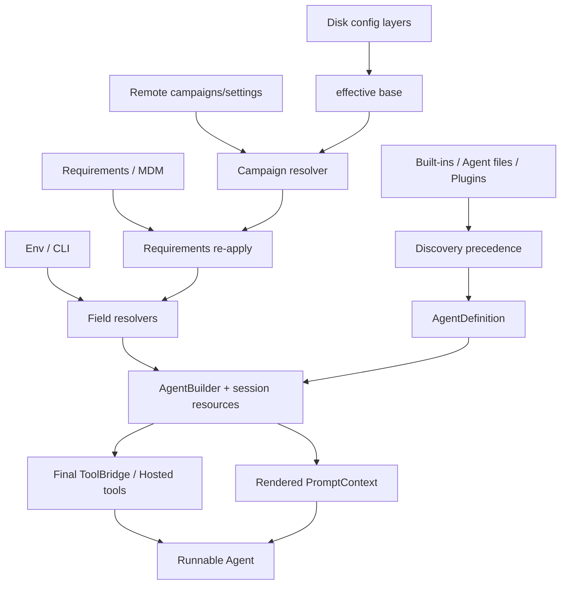

# Grok Build 配置系统与 AgentDefinition 详解

本文分析两套最终汇合的配置系统：

1. 产品运行配置：TOML、requirements、MDM、Remote Settings、Campaign、环境变量与 CLI override；
2. Agent 配置：`AgentDefinition`、Markdown frontmatter、built-in/plugin agent 和 `AgentBuilder`。

核心源码：

```text
crates/codegen/xai-grok-config/src/
crates/codegen/xai-grok-config-types/src/lib.rs
crates/codegen/xai-grok-shell/src/util/config/
crates/codegen/xai-grok-agent/src/config.rs
crates/codegen/xai-grok-agent/src/discovery.rs
crates/codegen/xai-grok-agent/src/builder.rs
crates/codegen/xai-grok-agent/src/agent.rs
```

## 1. 两类配置的边界

有效运行配置大致是：

```text
effective config
  = disk layers
  + active campaign patches
  + requirements re-application
  + field-specific remote/env/CLI resolution
```

可运行 Agent 则是：

```text
AgentDefinition
  + session resources/features
  + operator clamps
  + project discovery
  → Agent
```

`config.toml` 决定宿主允许提供什么，`AgentDefinition` 决定某个 Agent 选择和使用什么。

## 2. `ConfigLayers`

```rust
pub struct ConfigLayers {
    pub system_managed: toml::Value,
    pub managed: toml::Value,
    pub user: toml::Value,
    pub user_requirements: Option<toml::Value>,
    pub system_requirements: Option<toml::Value>,
    pub mdm_requirements: Option<toml::Value>,
    pub campaigns: CampaignOverrides,
}
```

典型文件包括：

```text
system config dir/managed_config.toml
$GROK_HOME/managed_config.toml
$GROK_HOME/config.toml
$GROK_HOME/requirements.toml
system config dir/requirements.toml
macOS MDM requirements payload
```

## 3. 基础合并优先级

`effective_config_base()` 从低到高合并：

```text
system_managed
managed
user
user_requirements
system_requirements
mdm_requirements
```

因此最终 authority：

```text
MDM > system requirements > user requirements > user > managed > system managed
```

这里的 managed config 是同步下发的默认层，requirements 才是强约束层。

## 4. `deep_merge_toml()`

规则：

```text
table + table → 递归按 key 合并
其他组合      → override 整体替换 base
```

所以：

- nested table 递归合并；
- scalar 替换；
- array 整体替换，不拼接；
- 类型变化整体替换；
- 新 key 直接插入。

示例：

```toml
# lower
[features]
a = true
b = true
tools = ["read", "grep"]

# higher
[features]
b = false
tools = ["read"]
```

结果保留 `a=true`，覆盖 `b=false`，数组只剩 `read`。

## 5. 文件读取错误语义

### 不存在

返回空 table，是正常缺省。

### 不可读

返回 IO error；逐层容错的调用方可只跳过该层。

### TOML 语法错误

错误只报告 line、column 和 parser message，不回显原始错误行。原始行可能包含 token、URL credential 或 secret。

## 6. 环境变量展开

普通配置递归展开字符串中的：

```text
$VAR
${VAR}
```

覆盖 string、array element 和 nested table。

Hook config 刻意使用未展开的 raw reader，因为 hook runner 自己展开一次；提前展开会产生 double expansion。

## 7. Version Overrides

每层可带 `[[version_overrides]]`。loader 根据当前 CLI semver 应用匹配 patch，然后移除该 section。

即使没有匹配，它也不会流入下游普通配置。开发环境测试版本不可解析时，系统移除 section 并保持 CLI 可用。

## 8. Managed Layer 错误隔离

`managed_config_layers()` 分别读取 system/user managed 文件。单层解析失败会 warning 并跳过，不会抹掉另一层。

需要 provenance 的子系统因此可以保留每层来源，而不是只拿一个已经压平的 table。

## 9. Requirements 的语义

Requirements 用于强制：

- permission 规则；
- always-approve pin；
- sandbox profile 限制；
- MCP/marketplace allowlist；
- feature gate；
- 最小版本与 fail-closed policy。

同在 `$GROK_HOME` 的两个文件信任语义不同：

```text
config.toml       = preference
requirements.toml = constraint
```

## 10. Managed Cache 与 Signed Policy

远程要求落盘缓存，使离线启动仍执行最近约束。requirements 存在但不可读、sync marker 标记 fail-closed，不能当成“无约束”。

Signed policy 进一步验证来源和完整性，防止本地植入同名文件冒充组织策略。路径相同不代表同等可信，签名与 provenance 才决定 authority。

## 11. Campaign 独立于普通 Merge

Campaign 是条件化 patch。各层中的 campaign 先被取出，再执行：

```text
collect → merge by id → filter active → drop dismissed → apply patch
```

同 id 的来源优先级：

```text
requirements > remote > user > managed > system_managed
```

Requirements 内部按 MDM、system、user 排序。

## 12. Requirements Re-apply

Campaign patch 能修改任意字段，因此 patch 完成后重新 merge：

```text
user requirements
system requirements
MDM requirements
```

这在结构上保证低信任实验不能覆盖管理员约束。

## 13. Campaign 开关和 Override

普通 kill switch：

```text
GROK_CAMPAIGNS=0
[features] campaigns = false
```

它在 pre-campaign base 上判断，campaign 不能把禁用自己的开关重新打开。

`GROK_CAMPAIGNS_OVERRIDE` 是 JSON 数组，替换所有来源并优先于 kill switch；`[]` 明确表示无 campaign，非法 JSON也向无 campaign 失败。

## 14. Dismissed Campaign

用户 dismissal 保存在：

```text
$GROK_HOME/campaigns_state.json
```

读取失败或损坏时使用空集合。它只影响实验，不应阻断 Agent 启动。

## 15. Remote Settings

Remote Settings 是宽容解析的 typed JSON，并不整体 deep merge 到 TOML。

两类用法：

1. remote campaigns 进入统一 campaign resolver；
2. 其他字段进入 `util/config/resolve/` 下的 field-specific resolver。

坏 nested field 通常只令该字段为 None，不使整个 RemoteSettings 解析失败；安全字段再由具体 resolver 选择 fail-safe default。

## 16. Field-specific Resolver

领域包括：

```text
features
toolset
system_prompt
auto_mode
tool_approvals
ui
crash_handler
display_refresh
```

不同字段 precedence 不完全相同。有的允许 env 强 override，有的不能覆盖 managed pin，因此不能用一条全局公式代替各 resolver。

## 17. Remote-aware 与 Disk-only

两个 API：

```text
load_effective_config()
load_effective_config_disk_only()
```

前者读取 remote campaign cache 和 env override；后者明确没有 remote。长期 shell 使用 remote-aware，一次性未 fetch remote 的 CLI 使用 disk-only。

## 18. 配置的三个时间尺度

### Process startup

解析 sandbox、global policy、registry 与不可逆进程状态。

### Session spawn

确定 model、toolset、prompt、permission、MCP 和 AgentDefinition。

### Mid-session refresh

更新动态 remote fields、campaign、MCP 等；不会自动重做不可逆 sandbox 或完整重建所有工具。

`store_remote_settings()` 只存值，`install_remote_settings()` 还触发 `on_remote_settings_changed()` side effects。

## 19. AgentDefinition 文件格式

```markdown
---
name: code-reviewer
description: Review code without modifying it
promptMode: extend
tools:
  - read_file
  - grep
  - "Agent(explore)"
effort: high
maxTurns: 20
---

You are a careful code reviewer...
```

YAML frontmatter 变成 typed definition，Markdown body 变成 `prompt_body`。

## 20. Parse 与 Frontmatter-only

完整 parse 要求 opening/closing `---`、合法 YAML 和可选正文。正文 trim 后为空则 None。

`from_file_frontmatter_only()` 只读元数据，并设置：

```text
prompt_body = None
system_prompt = None override
```

适合 discovery/UI list，真正 spawn 时再加载全文。

## 21. JSON Agent Profile

ACP `_meta.agentProfile` 可以提交 flat JSON，并用显式 `promptBody`。`from_json()` 手动恢复被 `serde(skip)` 的 prompt body。

没有合法 `toolConfig` object 时补默认 Grok Build toolset，scope 设为 BuiltIn-like runtime profile。

## 22. AgentDefinition 字段总览

| 字段 | 含义 |
| --- | --- |
| `name/description` | 标识与父 Agent 可见能力说明 |
| `prompt_mode` | extend 或 full |
| `tool_config` | 初始 ToolServerConfig |
| `capability_mode` | Subagent runtime 能力约束 |
| `permission_mode` | default/auto/plan 等 |
| `skills` | 预加载 Skill |
| `discover_skills` | 是否 cwd discovery |
| `inherit_skills` | 是否继承父 Skill |
| `agents_md` | 是否加载项目规则 |
| `inject_default_tools` | 是否注入 optional tools |
| `tools/disallowed_tools` | author allow/deny |
| `effort/max_turns` | 采样与循环限制 |
| `isolation/background` | worktree/后台提示 |
| `mcp_servers/inheritance` | MCP 配置 |
| `hooks/memory` | Agent hooks 与 memory scope |
| `model` | inherit 或指定模型 |
| `completion_requirement` | 必须调用的结束工具 |
| `tool_overrides` | sampling tool override |
| `user_message_template` | 首条用户消息模板 |

## 23. PromptMode

```text
Extend → body 追加到 stock base template
Full   → body 就是完整 system prompt
```

Extend 保留 Tool conventions、环境块和公共规则；Full 适合 exact compat/browser harness，但作者必须承担完整 prompt 契约。

## 24. Strict Harness

以下任一条件使 definition strict：

- 自定义 system prompt template；
- 自定义 user message template；
- `inject_default_tools=false` curated toolset。

strict harness 的 wire format 不可与 stock harness 交换，所以 client-supplied profile 不能随意覆盖它。

## 25. Built-in Agent

内置 definition 包括 Grok Build 各变体、Codex、OpenCode、general-purpose、explore、plan、browser-use 和 orchestrator。

它们可能改变：

- Tool namespace/schema；
- system prompt；
- agents_md；
- permission mode；
- Skill inheritance；
- exact curated toolset。

并非只换名称。

## 26. Built-in 默认值

`builtin_defaults()` 典型设置：

```text
prompt_mode = Extend
tool_config = default Grok Build
permission_mode = Default
discover_skills = true
inherit_skills = true
agents_md = true
inject_default_tools = true
mcp_inheritance = All
model = Inherit
scope = BuiltIn
```

Explore/Plan 用受限 toolset、Plan permission mode 和专用 prompt，并关闭 Skill inheritance。Orchestrator 使用 curated toolset 和 `inject_default_tools=false`。

## 27. Agent Discovery

Project：

```text
cwd→git root chain/.grok/agents
cwd→git root chain/.claude/agents
```

User/Bundled：

```text
$GROK_HOME/agents
legacy ~/.grok/agents
~/.claude/agents
$GROK_HOME/bundled/agents
```

还可以加载 plugin agents。

## 28. Discovery 优先级

Name lookup：

```text
project > built-in > user > bundled
```

Project Agent 可以 shadow built-in。User/Bundled 同名 built-in subagent 会跳过，以保证 UI 中 visible target 与 runtime callable target 一致。

Plugin definition 记录 plugin name、source path 和 ConfigSource provenance，并执行 plugin variable substitution。

## 29. MCP Inheritance

```yaml
mcpInheritance: all
mcpInheritance: none
mcpInheritance:
  named: [slack, github]
mcpInheritance:
  except: [production]
```

Map 必须恰好一个 key，不能同时 named 和 except。

`mcpServers` 支持 named ref 和 inline object；非法 inline shape 在 parse 阶段失败，而不是等 server spawn。

## 30. Memory Scope

```text
user    → $GROK_HOME/agent-memory/<name>
project → <project>/.grok/agent-memory/<name>
local   → <project>/.grok/agent-memory-local/<name>
```

Project/Local 天然 workspace-scoped。

## 31. Completion Requirement

```rust
CompletionRequirement {
    tool,
    reminder,
    recovery: Option<RecoveryPolicy>,
}
```

Agent 在 turn 结束前必须调用指定 Tool；否则 gate 注入 reminder 并继续。Recovery 包含 max retries 和 backoff 参数，是 harness contract，不是普通 prompt 建议。

## 32. AgentBuilder

AgentDefinition 是声明，Builder 注入真实资源：

```text
terminal/fs backend
notification handle
real/display cwd
session env
memory/web/LSP/media resources
plugin registry
MCP output limit
context window
parent scheduler
feature gates
```

最后产出可运行 Agent。

## 33. Build：Skill Discovery

优先级：

```text
preloaded skills
else discover_skills ? list_skills_with_plugins : []
```

definition.skills 中点名的 Skill 会解析并把完整内容注入 prompt body；其路径从普通 listing 移除，避免同一 Skill 既全文注入又显示为未加载。

Subagent 可按 `inherit_skills` 直接复用父 session 发现结果。

## 34. Build：Initial Tool Config

```rust
let mut tool_config = definition.tool_config.clone();
```

若 `inject_default_tools=false` 且工具为空，直接 InvalidConfig。这能暴露 provider registry 未注册，而不是静默构造无工具 strict harness。

## 35. Default Tool Injection

`inject_default_tools=true` 时按真实资源追加：

- memory search/get；
- web search/fetch；
- LSP；
- image/video tools；
- OpenCode write fallback；
- plan-mode tools。

false 时保持 exact toolset，只应用不可绕过的 session/subagent clamps。

## 36. 反向清理

资源或 feature 不可用时移除：

- 无 memory backend 的 memory tools；
- ask-user gate 关闭的 ask tool；
- workflow mode 不适用的 workflow/goal tool；
- subagent disabled 或列表为空时的 task；
- 无后台执行能力时的 lifecycle tools。

目标是 `advertised == executable`。

## 37. Tool Params Merge

运行配置中的 WebFetch、Bash、AskUser 参数 merge 到匹配 `ToolConfig.params`，例如 Bash timeout、output limit 和 command prefix。

这一步发生在具体 ToolConfig 上，最终 schema 与 executor 看到相同参数。

## 38. Tool Denylist 与 Allowlist

先执行 `disallowed_tools`，支持 full id 和 short name。未匹配项会 warning。

再执行非空 `tools` allowlist，匹配：

- full id/short name；
- vendor-compatible ToolKind；
- Agent directives；
- Task dependencies；
- SearchTool/UseTool 动态网关。

保留动态网关使 MCP virtualization 不要求初始列出所有实际 MCP schema。

## 39. Unknown Allowlist 的兼容回退

如果 allowlist 含完全无法映射的 entry，Builder warning 并保留完整 Grok toolset，避免 vendor/plugin 名称尚未注册时产生半残 harness。

高信任最小权限场景应使用 canonical ids、curated tool_config 和 session operator clamp，不能依赖含未知名称的 author allowlist。

## 40. Session Operator Clamp

Session `--tools/--disallowed-tools` 与 Agent author 列表分开：

```text
deny wins
unset allowlist allows all
set allowlist requires match
```

它最后应用，并覆盖 local function 与 hosted tools，后续 optional injection 不能绕过。

## 41. Hosted Tool Filter

Hosted WebSearch/XSearch 不在 local tool_config 中，使用严格 `hosted_tool_allowed()` 检查：

```text
Agent deny
Agent allow
Session clamp
```

它不使用 unknown-entry compatibility fallback。

## 42. `Agent(type)` Directives

```text
Agent(explore)
Agent(plan,general-purpose)
```

Builder 转成：

```text
None        = unrestricted
Some(types) = restricted
Some([])    = blocked
```

显式 `tools` allowlist 没有任何 Agent directive 时，子 Agent 权限设为 blocked；`disallowedTools: [Agent]` 也阻止全部。

## 43. Subagent Block 联动

完全阻止子 Agent 时移除：

- task；
- get_task_output；
- wait_tasks；
- kill_task；
- terminal background/auto-background。

避免保留无法产生 task 的 lifecycle tools，或通过 background shell 绕过调度约束。

## 44. Capability Mode

capability mode 在 subagent spawn 时按 read-only/read-write 等类别进一步过滤 tool_config。

它只能收紧，不能添加 definition 原本没有的 Tool；与 identity-based allowlist 组成两维约束。

## 45. ToolBridge Finalization

Builder 将 final tool_config 和 `SessionContext` 交给 `ToolBridge::finalize_builder()`。

SessionContext 注入 backend、cwd、session folder/env、notification、scheduler、Skills、memory/web/LSP/media 和 auth resources。此后 Tool 从 schema 变成绑定资源的可执行实例。

Session-specific MCP output cap 在 finalize 后写入 `TruncationCfg` resource。

## 46. AGENTS.md 与 Mid-session Discovery

`agents_md=true` 时读取规则文件，并把 initial paths、git root、cwd chain、gitignore 和 compat config seed 到 ToolBridge。

这不仅生成初始 prompt，也支持后续路径触达时的 reminder/discovery。

## 47. Real CWD 与 Display CWD

Fork/worktree session 可能：

```text
real cwd    = internal overlay path
display cwd = original project path
```

Tool 执行使用 real cwd；PromptContext 和 AGENTS.md 展示路径使用 display cwd，避免向模型泄漏内部 worktree 路径。

## 48. PromptContext 渲染

Context 包含 prompt mode/body/template、audience、AGENTS、persona、memory、OS/shell、cwd、date 和 non-interactive flag。

通过 final ToolBridge 渲染后，`${{ tools.by_kind.* }}` 绑定真实 Tool 名称。Agent description 也使用同一 placeholder context 渲染，供 Task tool 展示。

## 49. Hosted Search

backend search 启用时不注册 local Function，而构造 HostedTool::WebSearch/XSearch；仍经过 hosted tool clamp。

这解释了为什么最终 Tool list 同时包含 function tools 和 hosted tools 两条路径。

## 50. Agent 构造产物

最终 Agent 持有：

- final definition；
- rendered system prompt；
- PromptContext；
- ToolBridge；
- hosted tools；
- compaction/reminder policy；
- permission mode；
- Skill/AGENTS runtime state。

Session 再把它连接到 ChatState、Sampler、Permission Manager、MCP 和 persistence。

## 51. Mid-session Definition Switch

`render_prompt_for_definition()` 可复用已有 ToolBridge，更新 prompt mode/body/template、timestamp 和 AGENTS visibility。

但 `update_policies_from_definition()` 明确不重建 registry；completion/retry policy 的完整 mid-session 更新尚未支持。因此 mode switch 不等同重新执行 AgentBuilder。

Tool name override/disable 后需调用 `finalize_prompt()`，否则 prompt 仍可能引用旧名称。

## 52. 完整装配图



## 53. 示例：只读 Review Agent

```markdown
---
name: review
description: Review code without editing
promptMode: extend
tools:
  - read_file
  - grep
  - "Agent(explore)"
disallowedTools:
  - run_terminal_cmd
permissionMode: plan
inheritSkills: false
maxTurns: 15
---

Inspect code, cite exact files, and do not modify the workspace.
```

Builder 会发现 Skill/AGENTS，组装 optional tools，先移除 terminal，再应用 allowlist，限制 Task 只能 spawn explore，最后按 capability/session clamp 收紧并渲染 prompt。

## 54. 示例：Exact Compat Harness

```markdown
---
name: compat
description: Exact external harness
promptMode: full
injectDefaultTools: false
agentsMd: false
discoverSkills: false
toolConfig:
  tools:
    - id: OpenCode:read
    - id: OpenCode:bash
---

You are an exact compatibility harness...
```

它不会自动追加 memory、web、LSP、media、plan tools。若 registry 未注册导致工具为空，build 直接失败。

## 55. 常见误区

1. User config 不总是最高，requirements/MDM 可以覆盖；
2. Remote Settings 不是一个整体覆盖层，很多字段各自 resolve；
3. Agent `tools` 不是最终 Tool list；
4. PromptMode Full 不叠加 stock base prompt；
5. Mid-session switch 不等同重建 Agent；
6. Project agent 可以 shadow built-in，User/Bundled 同名 subagent不能；
7. `inject_default_tools=false` 是 exact harness 约束，不只是性能开关。

## 56. 关键 Invariants

1. requirements 高于普通 user/managed config；
2. Campaign 后重新应用 requirements；
3. TOML array replace 而非 append；
4. parse error 不回显 secret source line；
5. Hook env 只展开一次；
6. remote-aware 与 disk-only 明确区分；
7. discovery list 与 runtime lookup precedence 一致；
8. curated empty toolset 必须报错；
9. advertised Tool 必须有 backend/resource；
10. denylist 在 author allowlist 前；
11. session operator clamp 最后；
12. hosted tools 同样受 clamp；
13. 显式 Tool allowlist 不隐式保留 Subagent 权限；
14. Tool 名称在 ToolBridge final 后渲染；
15. real cwd 与 display cwd 不混用；
16. strict harness 不被通用 profile 随意替换。

## 57. 调试清单

### 配置值不符合预期

- 确认字段走 TOML merge 还是 field resolver；
- 检查 requirements/MDM；
- 检查 active/dismissed campaign；
- 检查 reapply；
- 确认 remote cache 是否 seed；
- 确认 loader 类型；
- 检查 env/CLI/version override。

### Agent 未发现

- 检查 cwd→git root chain；
- 检查 `.grok/agents` 和 `.claude/agents`；
- 检查 GROK_HOME/legacy home；
- 检查 YAML delimiter；
- 检查同名高优先级 definition；
- 检查 plugin registry 和 toggle。

### Tool 意外消失

- 检查资源 feature；
- `inject_default_tools`；
- author deny/allow；
- session clamp；
- capability mode；
- subagent/workflow gate；
- hosted/local 路径。

### Tool 意外出现

- 检查 optional injection；
- unknown allowlist fallback；
- full id/short name/ToolKind alias；
- SearchTool/UseTool 保留；
- plan-mode injection。

### Prompt Tool 名称过期

- 检查 ToolBridge finalize；
- tool override 后是否 `finalize_prompt()`；
- PromptMode/TemplateOverride；
- placeholder 是否有对应 ToolKind。

## 58. 推荐测试矩阵

1. disk precedence；
2. table recursive merge；
3. array replace；
4. scalar/type replace；
5. absent/unreadable file；
6. error snippet redaction；
7. nested env expansion；
8. hook no double expansion；
9. version override；
10. Campaign duplicate id；
11. kill switch；
12. invalid campaign override；
13. requirements reapply；
14. remote-aware/disk-only；
15. tolerant RemoteSettings bad field；
16. invalid signed policy；
17. agent delimiter/YAML error；
18. frontmatter-only；
19. JSON promptBody roundtrip；
20. project/builtin/user precedence；
21. plugin substitution；
22. MCP inheritance variants；
23. invalid inline MCP；
24. Skill discovery/inheritance；
25. curated empty toolset；
26. optional injection/removal；
27. deny full/short id；
28. ToolKind allow alias；
29. unknown allow fallback；
30. session clamp；
31. hosted clamp；
32. Agent directive；
33. block task lifecycle；
34. workflow gates；
35. Tool params merge；
36. real/display cwd；
37. PromptMode Extend/Full；
38. strict harness；
39. tool override re-render。

## 59. 核心源码索引

| 主题 | 文件 |
| --- | --- |
| TOML load/merge | `xai-grok-config/src/loader.rs` |
| requirements | `xai-grok-config/src/validation.rs` |
| version patch | `xai-grok-config/src/version_overrides.rs` |
| signed/cache | `signed_policy.rs`、`managed_cache.rs` |
| Campaign | `xai-grok-shell/src/util/config/campaigns.rs` |
| Remote types | `xai-grok-config-types/src/lib.rs` |
| field resolver | `xai-grok-shell/src/util/config/resolve/` |
| AgentDefinition | `xai-grok-agent/src/config.rs` |
| discovery | `xai-grok-agent/src/discovery.rs` |
| assembly | `xai-grok-agent/src/builder.rs` |
| prompt re-render | `xai-grok-agent/src/agent.rs` |

## 60. 相关文档

- [13_prompt_and_tool_list_assembly.md](13_prompt_and_tool_list_assembly.md)：配置如何进入 request
- [18_permissions_security_and_command_policy.md](18_permissions_security_and_command_policy.md)：requirements 的权限执行效果
- [07_skill_implementation_deep_dive.md](07_skill_implementation_deep_dive.md)：Skill discovery
- [06_dynamic_tool_integration_system.md](06_dynamic_tool_integration_system.md)：ToolBridge/MCP
