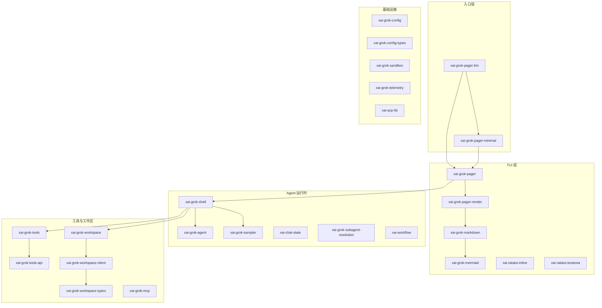

# crates/codegen 目录详解

本目录包含 Grok Build（`grok` CLI）的 **63 个 Rust crate**，是终端 AI 编程 agent 的主体实现。每个子目录对应一个独立 crate，下面有一份对应的详解文档。

## 快速导航：按职责分层



## 全部 crate 索引

### 入口与 TUI（7）

| Crate | 文档 | 一句话 |
| --- | --- | --- |
| `xai-grok-pager-bin` | [详解](./xai-grok-pager-bin.md) | 组合根二进制，`grok` 的 `main()` |
| `xai-grok-pager` | [详解](./xai-grok-pager.md) | 全屏 TUI：scrollback、prompt、会话、斜杠命令 |
| `xai-grok-pager-minimal` | [详解](./xai-grok-pager-minimal.md) | `--minimal` 模式，原生终端 scrollback 渲染 |
| `xai-grok-pager-render` | [详解](./xai-grok-pager-render.md) | 主题、渲染原语、外观配置 |
| `xai-grok-pager-pty-harness` | [详解](./xai-grok-pager-pty-harness.md) | PTY e2e 测试 harness（仅测试） |
| `xai-ratatui-inline` | [详解](./xai-ratatui-inline.md) | 底部固定视口 + 原生 scrollback |
| `xai-ratatui-textarea` | [详解](./xai-ratatui-textarea.md) | 多行富文本输入框 widget |

### Agent 运行时（10）

| Crate | 文档 | 一句话 |
| --- | --- | --- |
| `xai-grok-shell` | [详解](./xai-grok-shell.md) | 核心后端：会话、认证、工具编排、ACP |
| `xai-grok-shell-base` | [详解](./xai-grok-shell-base.md) | shell 基础模块（env、profiling、grok_home） |
| `xai-grok-shell-session-support` | [详解](./xai-grok-shell-session-support.md) | 托管 MCP 凭证缓存 |
| `xai-grok-agent` | [详解](./xai-grok-agent.md) | Agent 定义解析、system prompt 组装 |
| `xai-grok-sampler` | [详解](./xai-grok-sampler.md) | HTTP 推理流、重试、取消（Actor） |
| `xai-grok-sampling-types` | [详解](./xai-grok-sampling-types.md) | 采样 API 纯数据类型 |
| `xai-chat-state` | [详解](./xai-chat-state.md) | 对话历史 Actor |
| `xai-grok-subagent-resolution` | [详解](./xai-grok-subagent-resolution.md) | 子 agent 定义与 resume 解析 |
| `xai-agent-lifecycle` | [详解](./xai-agent-lifecycle.md) | Agent 生命周期扩展钩子 |
| `xai-workflow` | [详解](./xai-workflow.md) | Rhai 脚本化多 agent 工作流 |

### 工具与工作区（9）

| Crate | 文档 | 一句话 |
| --- | --- | --- |
| `xai-grok-tools` | [详解](./xai-grok-tools.md) | 50+ 内置工具实现与注册表 |
| `xai-grok-tools-api` | [详解](./xai-grok-tools-api.md) | 工具 Protobuf/gRPC API |
| `xai-grok-workspace` | [详解](./xai-grok-workspace.md) | 文件系统、VCS、权限、会话 RPC |
| `xai-grok-workspace-client` | [详解](./xai-grok-workspace-client.md) | hub 代理 workspace RPC 客户端 |
| `xai-grok-workspace-types` | [详解](./xai-grok-workspace-types.md) | workspace wire 类型（无 I/O） |
| `xai-grok-mcp` | [详解](./xai-grok-mcp.md) | MCP 服务器集成与 OAuth |
| `xai-grok-hooks` | [详解](./xai-grok-hooks.md) | 文件/HTTP 钩子系统 |
| `xai-grok-plugin-marketplace` | [详解](./xai-grok-plugin-marketplace.md) | 插件市场浏览与安装 |
| `xai-hooks-plugins-types` | [详解](./xai-hooks-plugins-types.md) | hooks/plugins ACP 扩展 DTO |

### 配置与认证（6）

| Crate | 文档 | 一句话 |
| --- | --- | --- |
| `xai-grok-config` | [详解](./xai-grok-config.md) | 多层 TOML 配置加载与合并 |
| `xai-grok-config-types` | [详解](./xai-grok-config-types.md) | RemoteSettings 与功能开关类型 |
| `xai-grok-auth` | [详解](./xai-grok-auth.md) | 认证 trait 与 401 重试中间件 |
| `xai-grok-env` | [详解](./xai-grok-env.md) | 生产端点 URL 预设 |
| `xai-grok-models` | [详解](./xai-grok-models.md) | 默认模型 ID（embedded JSON） |
| `xai-grok-paths` | [详解](./xai-grok-paths.md) | 类型安全绝对/相对路径 |

### 安全与沙箱（3）

| Crate | 文档 | 一句话 |
| --- | --- | --- |
| `xai-grok-sandbox` | [详解](./xai-grok-sandbox.md) | Landlock/Seatbelt 内核沙箱 |
| `xai-grok-secrets` | [详解](./xai-grok-secrets.md) | 遥测出站数据脱敏 |
| `xai-crash-handler` | [详解](./xai-crash-handler.md) | 跨平台崩溃捕获与符号化 |

### 渲染与 Markdown（4）

| Crate | 文档 | 一句话 |
| --- | --- | --- |
| `xai-grok-markdown` | [详解](./xai-grok-markdown.md) | 流式 Markdown → 终端渲染 |
| `xai-grok-markdown-core` | [详解](./xai-grok-markdown-core.md) | 无头 Markdown 分析（共享解析配置） |
| `xai-grok-mermaid` | [详解](./xai-grok-mermaid.md) | Mermaid → PNG（纯 Rust） |
| `xai-grok-voice` | [详解](./xai-grok-voice.md) | 语音听写（流式 STT） |

### Git 与工作区加速（5）

| Crate | 文档 | 一句话 |
| --- | --- | --- |
| `xai-fast-worktree` | [详解](./xai-fast-worktree.md) | CoW 快速 git worktree |
| `xai-hunk-tracker` | [详解](./xai-hunk-tracker.md) | diff hunk 归因与 accept/reject |
| `xai-gix-status` | [详解](./xai-gix-status.md) | gix status 线程预算限制 |
| `xai-codebase-graph` | [详解](./xai-codebase-graph.md) | tree-sitter 代码图与跳转 |
| `xai-fsnotify` | [详解](./xai-fsnotify.md) | 文件系统事件广播 |

### 数据、存储与上传（5）

| Crate | 文档 | 一句话 |
| --- | --- | --- |
| `xai-grok-memory` | [详解](./xai-grok-memory.md) | 跨会话记忆（FTS5 + 向量） |
| `xai-sqlite-journal` | [详解](./xai-sqlite-journal.md) | WAL/TRUNCATE 按文件系统选择 |
| `xai-file-utils` | [详解](./xai-file-utils.md) | 事件追踪与 S3/GCS 上传 |
| `xai-prompt-queue` | [详解](./xai-prompt-queue.md) | prompt 队列 wire 类型与合并 |
| `xai-grok-shared` | [详解](./xai-grok-shared.md) | shell↔pager 共享工具（剪贴板等） |

### 网络、遥测与更新（5）

| Crate | 文档 | 一句话 |
| --- | --- | --- |
| `xai-grok-http` | [详解](./xai-grok-http.md) | 共享 reqwest 客户端与 UA |
| `xai-grok-telemetry` | [详解](./xai-grok-telemetry.md) | Mixpanel + Sentry + OTEL |
| `xai-mixpanel` | [详解](./xai-mixpanel.md) | 最小 Mixpanel HTTP 客户端 |
| `xai-grok-update` | [详解](./xai-grok-update.md) | 自动更新与版本策略 |
| `xai-grok-version` | [详解](./xai-grok-version.md) | 全局版本常量 |

### 协议与集成（2）

| Crate | 文档 | 一句话 |
| --- | --- | --- |
| `xai-acp-lib` | [详解](./xai-acp-lib.md) | ACP 消息通道与网关 |
| `xai-grok-announcements` | [详解](./xai-grok-announcements.md) | 启动横幅公告 |

### 终端自动化（2）

| Crate | 文档 | 一句话 |
| --- | --- | --- |
| `ptyctl` | [详解](./ptyctl.md) | 无头 PTY 控制器库 |
| `ptyctl-cli` | [详解](./ptyctl-cli.md) | `ptyctl` 命令行工具 |

### 横切工具库（5）

| Crate | 文档 | 一句话 |
| --- | --- | --- |
| `xai-tty-utils` | [详解](./xai-tty-utils.md) | TTY 安全子进程 spawn |
| `xai-token-estimation` | [详解](./xai-token-estimation.md) | token 估算（bytes/4） |
| `xai-tracing-macros` | [详解](./xai-tracing-macros.md) | tprintln!/timed! 宏 |
| `xai-system-power` | [详解](./xai-system-power.md) | 系统睡眠/唤醒通知 |
| `xai-grok-test-support` | [详解](./xai-grok-test-support.md) | 集成测试 mock 服务器与沙箱 |

## 推荐阅读顺序

如果你是第一次读这个代码库，建议按这条路径：

1. [xai-grok-pager-bin](./xai-grok-pager-bin.md) → 从 `main()` 开始
2. [xai-grok-pager](./xai-grok-pager.md) → TUI 交互层
3. [xai-grok-shell](./xai-grok-shell.md) → agent 运行时
4. [xai-grok-agent](./xai-grok-agent.md) → system prompt 与 agent 定义
5. [xai-grok-tools](./xai-grok-tools.md) → 工具实现
6. [xai-grok-workspace](./xai-grok-workspace.md) → 文件系统与权限

更宏观的架构说明见上级目录：[01_project_map.md](../01_project_map.md)。

## 编译提示

```sh
# 编译并启动 TUI
cargo run -p xai-grok-pager-bin

# 只检查某个 crate
cargo check -p xai-grok-agent

# 需要先安装 DotSlash（用于 bin/protoc）
cargo install dotslash
```

详见仓库根目录 [README.md](../../README.md)。
