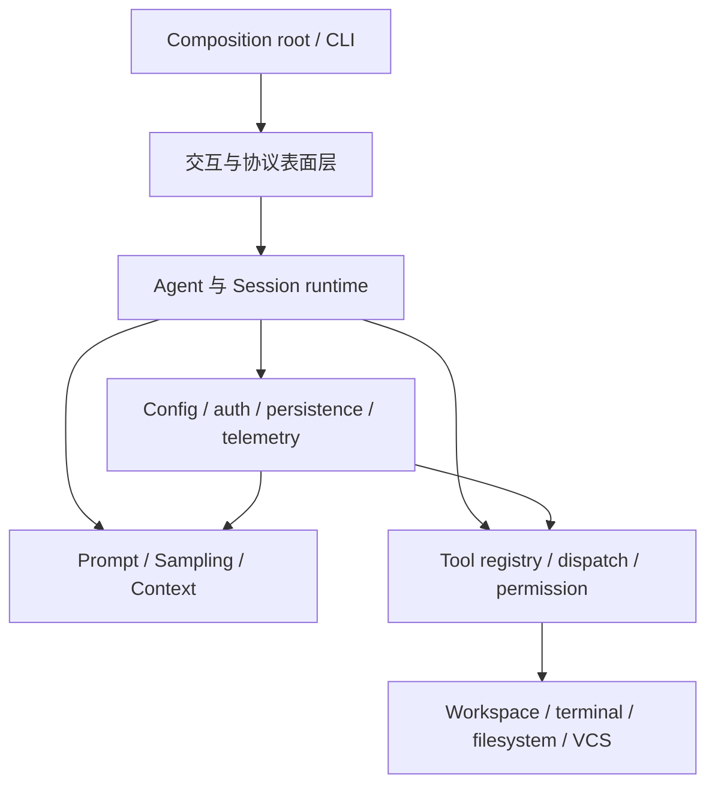

# 项目导读：先建立正确的 Grok Build 心智模型

## 这篇解决什么问题

面对 81 个 workspace 成员，最危险的阅读方式是从根目录随便打开一个 `main.rs`，然后跟着调用一路下钻。这样很快会进入配置、认证、TUI、协议或工具细节，失去全局方向。

这篇先回答：Grok Build 是怎样的程序、主要运行边界是什么、代码为什么被拆成这么多 crate，以及第一次阅读时哪些细节可以暂时忽略。

## 一句话定义

Grok Build 是一个用 Rust 实现的终端 AI 编程 agent。主发行物由 `xai-grok-pager-bin` 构建，二进制名是 `xai-grok-pager`；它可以承载交互式终端界面，也可以从同一个 composition root 进入 stdio agent、headless、leader 和多种管理命令。

源码依据：

- `crates/codegen/xai-grok-pager-bin/Cargo.toml`：声明包名、二进制名及 composition-root 定位。
- `crates/codegen/xai-grok-pager-bin/src/main.rs`：导入 `run_stdio_agent`、`run_headless`、`run_leader`，并对 CLI `Command` 分派。
- `crates/codegen/xai-grok-pager/src/app/mod.rs`：暴露交互式应用的 `run`。

## 不要把它只看成聊天 UI

聊天界面只是可见表面。一次编程任务至少跨越以下能力：

1. 接收用户输入或协议请求；
2. 建立 agent 和 session；
3. 组装 system prompt、历史、工具列表与当前输入；
4. 调用模型并消费流式事件；
5. 识别工具请求；
6. 做权限决策并在 workspace 中执行；
7. 把工具结果送回模型，继续迭代；
8. 把进度呈现给 TUI 或协议客户端；
9. 保存可恢复的会话状态。

这九步是一个**阅读模型**，并不是源码里一个同名的九阶段状态机。后续运行链路文章会把每一步映射到真实类型和函数。

## 五个需要同时区分的边界

### 1. 进程入口与业务能力

`xai-grok-pager-bin` 是 composition root：它负责把 CLI、运行模式、更新、telemetry、shell runtime 和 pager 连接起来。大部分业务逻辑不应该在阅读时被归为“main.rs 的功能”，而属于它所组装的库。

### 2. 展示层与 agent runtime

`xai-grok-pager` 关注终端交互、状态更新和渲染；`xai-grok-shell` 则暴露 agent、session、sampling、terminal、tools 等运行时模块。二者连接，但不应在心智模型中合并成一层。

### 3. Agent 定义与 Session 实例

`xai-grok-agent` 的 crate 文档明确把 `Agent` 描述为工具、system prompt、reminder、compaction policy 和模型配置的组合。Session 则是一次可持续交互的运行实例，拥有历史、事件、执行状态和恢复逻辑。

简化理解：

- Agent 回答“这个智能体具备什么能力和规则”。
- Session 回答“这一次对话现在进行到哪里”。

后续必须回到源码验证两者的创建、克隆和重建边界，不能只依赖这个简化比喻。

### 4. 工具描述与工具副作用

模型需要看到工具名称、说明和参数 schema；真正的文件读取、编辑、命令执行或远程调用则发生在运行时与 workspace 边界。把“模型可见的 tool definition”和“宿主实际执行的 operation”分开，是理解权限设计的前提。

### 5. 协议边界与内部调用

ACP、MCP 都是协议，但连接对象不同：

- ACP 主要连接外部宿主/编辑器与 agent。
- MCP 主要连接 agent 与外部工具服务。

内部 Rust 函数调用、Tokio channel 和协议消息不能混为一谈。后续文章会分别追踪序列化边界和进程内边界。

## 建议采用的六层架构阅读模型

这是教学分层，不是源码强制分层。真实依赖中会有横向公共 crate，也会有为了 composition 和 feature 解环而形成的桥接关系。

## 关键代码区域

### Composition root

- `crates/codegen/xai-grok-pager-bin/src/main.rs`
- `crates/codegen/xai-grok-pager-bin/Cargo.toml`

先观察 `main` 怎样做早期初始化、解析命令并分流，不必第一次就读完其中所有管理命令。

### 交互式终端

- `crates/codegen/xai-grok-pager/src/app/mod.rs`
- `crates/codegen/xai-grok-pager-render/`
- `crates/codegen/xai-ratatui-textarea/`
- `crates/codegen/xai-ratatui-inline/`

这里包含 UI 状态、输入、scrollback、渲染和终端适配。它是当前仓库最大的代码区域之一，必须按用户事件链阅读。

### Agent 与 session runtime

- `crates/codegen/xai-grok-shell/src/lib.rs`
- `crates/codegen/xai-grok-shell/src/agent/`
- `crates/codegen/xai-grok-shell/src/session/`
- `crates/codegen/xai-grok-agent/src/lib.rs`

`xai-grok-shell` 的公开模块包括 `agent`、`sampling`、`session`、`terminal`、`tools`、`leader`、`auth` 等。它代码量很大，应先追一条请求，再回头按模块补全。

### 模型与上下文

- `crates/codegen/xai-grok-sampler/`
- `crates/codegen/xai-grok-sampling-types/`
- `crates/common/xai-grok-compaction/`
- `crates/codegen/xai-token-estimation/`
- `crates/codegen/xai-grok-models/`

这些 crate 将调用实现、协议数据、上下文压缩和轻量模型描述拆开。

### 工具与主机能力

- `crates/codegen/xai-grok-tools/`
- `crates/codegen/xai-grok-tools-api/`
- `crates/codegen/xai-grok-workspace/`
- `crates/codegen/xai-grok-workspace-types/`
- `crates/codegen/xai-grok-workspace-client/`
- `crates/common/xai-tool-runtime/`
- `crates/common/xai-tool-types/`
- `crates/common/xai-tool-protocol/`

不要仅凭名称假定调用方向。后续工具链文章会从注册点和 dispatch 点实际验证。

### 横切能力

- 配置：`xai-grok-config`、`xai-grok-config-types`
- 认证：`xai-grok-auth` 与 `xai-grok-shell/src/auth/`
- 协议：`xai-acp-lib`、`xai-grok-mcp`
- 可观测性：`xai-grok-telemetry`、`xai-tracing`
- 扩展：`xai-grok-hooks`、`xai-grok-plugin-marketplace`、`xai-grok-memory`
- 测试：`xai-grok-test-support`、`xai-test-utils`、PTY harness

## 第一次阅读暂时跳过什么

为了尽快建立主线，可以暂时跳过：

- `third_party/` 中 vendored 的 Mermaid 布局实现；
- UI 控件的像素级和样式级细节；
- 更新、公告、语音、Mixpanel 等外围能力；
- 单个管理命令的全部分支；
- 大量平台特定 `cfg` 分支；
- 测试 fixture 的具体构造。

这些不是不重要，而是它们不能帮助你最早回答“一次 prompt 怎样完成”。

## 初学者最容易产生的误解

### “最大的 crate 就是最核心的抽象”

不一定。大 crate 往往承担大量 UI 状态、兼容逻辑或集成代码；小 crate 反而可能定义关键协议和稳定边界。

### “所有 async 函数都在同一个 Tokio 线程池自由运行”

不能这样假设。源码中可能存在专用线程、local task、actor 和 channel。必须针对具体 session 和 UI 路径检查 `spawn`、runtime、`LocalSet` 以及 channel 创建位置。

### “工具被模型调用后就直接执行”

模型产出调用意图之后，通常仍有解析、路由、权限、workspace 和结果转换等边界。安全语义就藏在这些中间层。

### “会话历史就是屏幕上看到的聊天记录”

展示状态、模型上下文、持久化事件和恢复摘要可能是不同的数据轨。后续会话文档要分别识别它们。

## 本篇术语表

| 名词 | 白话解释 | 在本篇中的具体含义 |
| --- | --- | --- |
| agent | 能根据目标反复调用模型和工具来完成任务的程序 | 不只是一次模型问答，还包含规则、工具、上下文和执行循环 |
| composition root | 把各个组件实例创建出来并连接在一起的最外层位置 | `xai-grok-pager-bin` 负责连接 pager、shell、telemetry、update 等组件；业务细节仍在各自 crate |
| CLI | Command-Line Interface，命令行界面 | `grok` 接受的参数和子命令，例如 `agent`、`login`、`update` |
| TUI | Terminal User Interface，终端图形界面 | 在终端内用全屏区域、颜色、键盘和鼠标交互的 pager 界面 |
| stdio | standard input/output，标准输入和标准输出 | agent 可通过 stdin/stdout 与父进程交换 ACP 消息 |
| headless | 没有交互式图形或 TUI 的运行方式 | 用于脚本、自动化或 relay 驱动的 agent；具体有不止一条入口 |
| leader | 可被多个客户端发现和复用的长生命周期 Grok 进程 | 它可以拥有真正的 agent runtime，客户端连接后转发交互 |
| runtime | 让组件和异步任务运行起来的环境或逻辑 | 本篇有时泛指 agent/session 运行逻辑；特指 Tokio 时会写“Tokio runtime” |
| session | 一次可以持续、保存和恢复的交互实例 | 拥有对话历史、执行状态、事件和持久化身份 |
| turn | 用户发起一次输入到该次任务告一段落的逻辑回合 | 一个 turn 内可能发生多次模型 sampling 和工具调用 |
| sampling | 向模型提交上下文并取得一次输出流的过程 | 工具结果返回后可能开始下一次 sampling |
| system prompt | 给模型的系统级规则和角色说明 | 由 agent definition、运行环境和策略共同组装 |
| schema | 对数据形状和字段约束的结构化描述 | 工具参数通常用 JSON Schema 告诉模型怎样构造调用 |
| dispatch | 根据消息或类型把工作交给正确处理者 | 例如根据工具名找到具体工具实现 |
| host / 宿主 | 真正拥有文件、终端和进程能力的一侧 | 对工具来说通常是本地 Grok 进程和 workspace 层 |
| workspace | 本篇有两层意思 | Cargo workspace 是 Rust 多包工程；运行 workspace 是 agent 正在操作的项目目录，正文按上下文区分 |
| ACP | Agent Client Protocol | 连接编辑器/宿主客户端与 agent 的协议 |
| MCP | Model Context Protocol | 让 agent 连接外部工具服务的协议 |
| channel | 异步任务之间传递消息的队列式通道 | 常见为 Tokio `mpsc`、`oneshot` 等，并不是网络 channel |
| compaction | 把过长历史压缩成更短上下文 | 目标是在保留关键信息的同时满足模型上下文上限 |
| telemetry | 为观察程序行为而收集的日志、指标和追踪信息 | 用于诊断性能、失败与使用情况，具体受隐私和配置约束 |
| fixture | 测试预先准备的数据或环境 | 本篇建议首轮跳过其具体构造，不代表测试不重要 |

## 完成本篇后的自测

1. 为什么 `xai-grok-pager-bin` 更适合称为 composition root，而不是所有业务逻辑的所有者？
2. Agent 定义和 Session 实例分别描述什么？
3. ACP 与 MCP 的两端分别是谁？
4. 为什么工具 schema 和工具副作用必须分开理解？
5. 如果想追踪一次文件编辑，你预计要跨越哪几层？

## 下一步

继续阅读 [Workspace 全景图](../01-architecture/01-workspace-map.md)，把六层阅读模型映射到真实 crate；然后从 [分层阅读路线](02-learning-routes.md) 选择一条路径。
