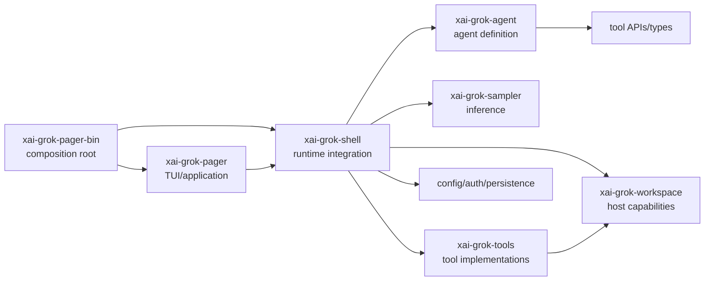

# Workspace 全景图

## 这篇解决什么问题

根 `Cargo.toml` 声明 81 个 workspace 成员。逐个打开并不能自然形成架构理解。本篇把它们按学习职责分组，并给出精读、理解和查询三个级别。

分组和优先级属于**阅读模型与学习建议**；成员名称和路径来自根 `Cargo.toml` 与各 crate manifest。

## 先看主干



这张图只表达推荐阅读主干，不保证每条 Cargo 依赖都按箭头单向存在。精确依赖应以各 manifest 和 `cargo metadata` 为准。

## 优先级定义

### A：主线精读

需要理解公开边界、核心状态和至少一条完整调用链。它们共同回答程序如何启动、接收请求、调用模型、执行工具和更新界面。

### B：专题理解

需要知道解决的问题、核心 API 和被谁使用；当学习对应专题时再深入。

### C：按需查询

通常是叶子能力、平台适配、构建辅助或第三方实现。第一次学习只需知道存在。

优先级不是代码质量或业务重要性评价。

## A 级：主线 crate

| Crate | 路径 | 学习职责 | 首个入口 |
| --- | --- | --- | --- |
| `xai-grok-pager-bin` | `crates/codegen/xai-grok-pager-bin` | 进程入口、CLI 分流、运行模式组装 | `src/main.rs` |
| `xai-grok-pager` | `crates/codegen/xai-grok-pager` | TUI application、输入、状态和事件协调 | `src/app/mod.rs` |
| `xai-grok-pager-render` | `crates/codegen/xai-grok-pager-render` | 终端内容和组件渲染 | `src/lib.rs` |
| `xai-grok-shell` | `crates/codegen/xai-grok-shell` | agent/session/sampling/tools/terminal 的集成 runtime | `src/lib.rs` |
| `xai-grok-agent` | `crates/codegen/xai-grok-agent` | Agent 定义、builder、prompt 和策略装配 | `src/lib.rs` |
| `xai-grok-sampler` | `crates/codegen/xai-grok-sampler` | 模型采样实现 | `src/lib.rs` |
| `xai-grok-sampling-types` | `crates/codegen/xai-grok-sampling-types` | 采样相关稳定数据类型 | `src/lib.rs` |
| `xai-grok-tools` | `crates/codegen/xai-grok-tools` | 具体工具实现与工具集合 | `src/lib.rs` |
| `xai-grok-tools-api` | `crates/codegen/xai-grok-tools-api` | 工具侧 API 边界 | `src/lib.rs` |
| `xai-grok-workspace` | `crates/codegen/xai-grok-workspace` | 文件、命令、VCS 和宿主 workspace 能力 | `src/lib.rs` |
| `xai-grok-workspace-types` | `crates/codegen/xai-grok-workspace-types` | workspace 交互数据类型 | `src/lib.rs` |
| `xai-grok-config` | `crates/codegen/xai-grok-config` | 配置加载、合并和消费 | `src/lib.rs` |
| `xai-acp-lib` | `crates/codegen/xai-acp-lib` | ACP 集成边界 | `src/lib.rs` |
| `xai-grok-mcp` | `crates/codegen/xai-grok-mcp` | MCP client/server 与工具桥接相关能力 | `src/lib.rs` |

其中 `xai-grok-pager`、`xai-grok-shell`、`xai-grok-tools` 和 `xai-grok-workspace` 体量显著较大。不要线性读完；只沿端到端链路进入相关模块。

## B 级：上下文、状态与长期会话

| Crate | 主要学习问题 |
| --- | --- |
| `xai-chat-state` | 聊天状态如何表达和转换？ |
| `xai-grok-compaction` | 上下文压缩的公共策略和数据边界是什么？ |
| `xai-token-estimation` | token 预算如何估算？ |
| `xai-grok-memory` | 长期或项目记忆怎样发现、存储和注入？ |
| `xai-prompt-queue` | 新 prompt、排队与用户插话怎样协调？ |
| `xai-agent-lifecycle` | agent 生命周期有哪些可复用状态？ |
| `xai-grok-shell-session-support` | session 的跨 crate 支撑类型如何解耦？ |
| `xai-sqlite-journal` | 可恢复 journal 怎样持久化？ |
| `xai-interjection-core` | 运行中插话的公共语义是什么？ |

## B 级：工具、协议与主机执行

| Crate | 主要学习问题 |
| --- | --- |
| `xai-tool-types` | 工具定义、调用和结果的公共类型是什么？ |
| `xai-tool-runtime` | 工具注册、上下文和执行抽象是什么？ |
| `xai-tool-protocol` | 跨边界工具消息如何表示？ |
| `xai-grok-workspace-client` | workspace 能力如何被远程或间接调用？ |
| `xai-grok-sandbox` | 操作系统 sandbox 如何建立和执行？ |
| `xai-grok-subagent-resolution` | 子 agent 的发现和选择如何表达？ |
| `xai-workflow` | workflow 执行、journal 和调度模型是什么？ |
| `xai-fast-worktree` | worktree 创建和复用如何提速？ |
| `xai-file-utils` | 文件操作的公共、安全和跨平台细节是什么？ |
| `xai-fsnotify` | 文件变更如何被监控？ |
| `xai-gix-status` | Git 状态查询如何封装？ |
| `xai-codebase-graph` | 代码关系图如何建立和查询？ |

## B 级：配置、认证与扩展

| Crate | 主要学习问题 |
| --- | --- |
| `xai-grok-config-types` | 哪些配置类型需要稳定共享？ |
| `xai-grok-auth` | 跨模块认证 API 是什么？ |
| `xai-grok-secrets` | secret 如何加载和隐藏？ |
| `xai-grok-http` | HTTP client 的代理、TLS 和默认策略是什么？ |
| `xai-grok-extra-ca` | 自定义 CA 如何进入网络栈？ |
| `xai-grok-hooks` | 生命周期 hook 如何发现和调用？ |
| `xai-hooks-plugins-types` | hook/plugin 共享协议类型是什么？ |
| `xai-grok-plugin-marketplace` | plugin 来源、安装和元数据如何处理？ |
| `xai-grok-models` | 模型标识和轻量描述如何共享？ |
| `xai-grok-paths` | 应用路径如何集中计算？ |
| `xai-grok-env` | 环境检测和环境相关常量如何集中？ |

## B 级：终端、文本与渲染

| Crate | 主要学习问题 |
| --- | --- |
| `xai-grok-pager-minimal` | 非全屏或精简渲染模式如何接入？ |
| `xai-ratatui-textarea` | prompt 编辑控件如何维护输入状态？ |
| `xai-ratatui-inline` | inline terminal 展示如何实现？ |
| `xai-grok-markdown` | 流式 Markdown 如何解析和呈现？ |
| `xai-grok-markdown-core` | Markdown 公共核心数据是什么？ |
| `xai-grok-mermaid` | Mermaid 内容如何识别和渲染？ |
| `ptyctl` / `ptyctl-cli` | PTY 控制接口与调试命令是什么？ |
| `xai-tty-utils` | TTY 探测和跨平台辅助是什么？ |

## B 级：可观测性与可靠性

| Crate | 主要学习问题 |
| --- | --- |
| `xai-grok-telemetry` | 日志、trace、metrics 和上传如何分流？ |
| `xai-tracing` | 公共 tracing 包装和 context 传播是什么？ |
| `xai-tracing-macros` | 项目自定义 tracing 宏解决什么问题？ |
| `xai-circuit-breaker` | 外部依赖失败时怎样限流和恢复？ |
| `xai-crash-handler` | panic/crash 信息怎样保存和呈现？ |
| `xai-hunk-tracker` | 编辑 hunk 怎样跟踪并用于展示或恢复？ |
| `xai-grok-test-support` | agent、sampling 和 workspace 测试如何构造？ |
| `xai-test-utils` | 跨 crate 测试工具是什么？ |
| `xai-grok-pager-pty-harness` | 如何用真实 PTY 验证终端行为？ |

## C 级：外围产品能力与构建辅助

| Crate/区域 | 说明 |
| --- | --- |
| `xai-grok-announcements` | 公告能力 |
| `xai-grok-update`、`xai-grok-version` | 版本与自动更新 |
| `xai-grok-voice` | 语音交互 |
| `xai-mixpanel` | 分析事件集成 |
| `xai-system-power` | 系统电源相关能力 |
| `xai-grok-shared`、`xai-grok-shell-base` | 共享基础能力；按调用点阅读 |
| `xai-computer-hub-*` | Computer Hub 的 core、SDK 与 MCP adapter |
| `prod-mc-cli-chat-proxy-types` | 远端 chat proxy 共享类型 |
| `xai-proto-build` | protobuf 构建辅助 |
| `third_party/*` | vendored 图布局和 Mermaid 渲染依赖 |

## 目录性质

### `crates/codegen`

名字容易使人误以为其中全是临时生成物，但它实际上包含产品主干的大部分 crate。根 `Cargo.toml` 自身标注为 auto-generated，仓库 README 也要求优先修改每个 crate 自己的 manifest。学习时仍然应把这些 Rust 源文件当作当前构建的真实实现。

### `crates/common`

这里主要放跨产品或跨层共享的基础抽象。公共 crate 通常不掌握完整业务流程，因此适合从调用者反向阅读。

### `prod/mc`

当前 workspace 中包含 chat proxy 的共享类型包。先理解它如何被消费，再决定是否深入字段细节。

### `third_party`

这里是仓库内 vendored 源码，具有独立许可。除非研究 Mermaid 渲染或图布局，不应进入第一轮主线。

## 按问题定位 crate

| 你看到的现象 | 第一站 | 第二站 |
| --- | --- | --- |
| CLI 参数没有生效 | `xai-grok-pager-bin` | `xai-grok-config` / `xai-grok-shell::agent` |
| prompt 发出后没有响应 | `xai-grok-shell::session` | `xai-grok-sampler` |
| 工具没有出现在模型请求中 | `xai-grok-agent` | `xai-grok-shell::tools` / tool runtime |
| 工具参数正确但执行失败 | `xai-grok-tools` | `xai-grok-workspace` |
| 命令要求意外审批 | permission 相关 session/tool 模块 | `xai-grok-sandbox` / workspace |
| 流式文本存在但 UI 不显示 | `xai-grok-shell::session::events` | `xai-grok-pager` / render |
| 会话重启后缺内容 | session persistence/replay | `xai-chat-state` / journal |
| MCP 工具不见了 | `xai-grok-shell::session::mcp_*` | `xai-grok-mcp` |
| 编辑器连接失败 | `xai-acp-lib` | `xai-grok-shell::session::acp_*` |
| 长对话开始异常 | session compaction | `xai-grok-compaction` / token estimation |

## 建议的源码打开顺序

第一轮只打开以下入口：

```text
Cargo.toml
crates/codegen/xai-grok-pager-bin/src/main.rs
crates/codegen/xai-grok-pager/src/app/mod.rs
crates/codegen/xai-grok-shell/src/lib.rs
crates/codegen/xai-grok-shell/src/agent/app.rs
crates/codegen/xai-grok-shell/src/session/mod.rs
crates/codegen/xai-grok-agent/src/lib.rs
crates/codegen/xai-grok-sampler/src/lib.rs
crates/codegen/xai-grok-tools/src/lib.rs
crates/codegen/xai-grok-workspace/src/lib.rs
```

目的只是辨认公开模块和入口，禁止在第一轮追进每个子模块。第二轮应从一条 prompt 链路出发，而不是从列表的第一个 crate 读到最后一个。

## 本篇术语表

| 名词 | 白话解释 | 在本篇中的具体含义 |
| --- | --- | --- |
| Cargo | Rust 官方的包管理与构建工具 | 读取 `Cargo.toml`，解析依赖并编译 workspace |
| Cargo workspace | 统一管理多个 Rust 包的工程 | 根 `Cargo.toml` 的 `[workspace]` 列出 81 个构建成员 |
| crate | Rust 的包和编译单元 | 每个主要目录有自己的 `Cargo.toml`，可单独 `cargo check -p` |
| manifest | 包的构建清单 | 即 `Cargo.toml`，记录包名、依赖、feature 和目标 |
| dependency / 依赖 | 当前 crate 编译或运行需要使用的另一个包 | 依赖方向应从 manifest 或 `cargo metadata` 验证，不能只凭目录名猜 |
| leaf crate / 叶子 crate | 依赖关系中职责较小、被上层组合使用的包 | 通常提供类型或单一能力，适合从调用者反向阅读 |
| public API | crate 对其他 crate 暴露的稳定入口 | 常先从 `lib.rs` 中的 `pub mod`、`pub use`、公开类型和 trait 查看 |
| composition root | 创建并连接各组件的最外层 | 此项目主要由 `xai-grok-pager-bin` 承担 |
| integration runtime | 把多个能力协调成完整运行流程的代码 | 图中主要指 `xai-grok-shell`，不是一个源码里的正式类型名 |
| host capability | 只有宿主机器才能真正完成的能力 | 读取文件、启动进程、操作 Git 等，由 workspace/terminal 等实现 |
| bridge / 桥接 | 在两个接口或数据模型之间做转换和转发 | 例如把 session 的工具请求转给工具 runtime |
| vendored source | 复制进仓库并随项目构建的第三方源码 | `third_party` 下的 Mermaid 和图布局实现 |
| PTY | Pseudo-Terminal，伪终端 | 程序用它像真实终端一样运行和控制交互式子进程 |
| harness | 为测试目标搭建和操控环境的测试框架 | PTY harness 会启动真实终端环境并观察行为 |
| adapter | 把一个接口转换成另一个接口的组件 | 名称本身不保证调用方向，仍需查看实现和调用者 |
| replay | 重新读取过去事件来恢复状态 | 用于 session 或 journal 恢复，区别于只加载一个最终快照 |
| journal | 按发生顺序保存操作或事件的日志 | 可用于崩溃后继续、幂等判断或 workflow 恢复 |

## 自测

1. 为什么 81 个 crate 不适合按字母顺序阅读？
2. `xai-grok-tools` 与 `xai-grok-workspace` 的学习边界可能是什么？后续需要用哪些调用点验证？
3. 为什么公共类型 crate 通常应该从调用者反向阅读？
4. 遇到“模型看不到工具”和“工具执行失败”，为什么第一站不同？
5. 哪些分组是源码事实，哪些只是阅读模型？
