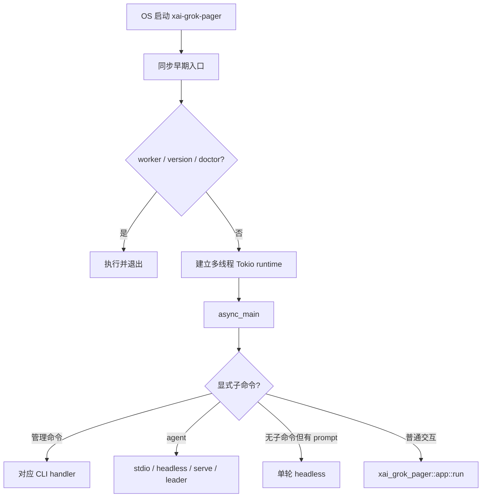
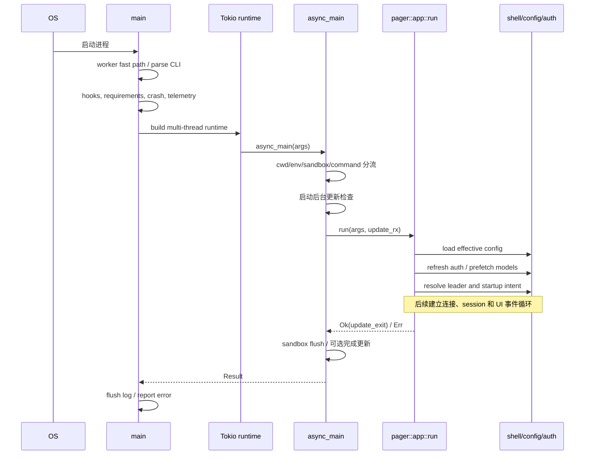

# 启动链路：从进程入口到可接收任务

## 这篇解决什么问题

本文追踪 `xai-grok-pager` 进程怎样从同步 `main` 进入不同运行形态，重点回答：哪些工作必须在 Tokio runtime 之前完成、CLI 怎样分流、交互 TUI 与 agent 子命令在哪里分开，以及启动失败如何退出。

本文不展开 session 内部如何执行 prompt，也不详解配置合并、认证和 leader 协议；这些将在独立文章中处理。

## 先建立心智模型

启动不是一条直线，而是三个连续的分流层：



这张图省略了更新、sandbox、恢复目标和 leader 复用等分支，但保留了最重要的控制流边界。

## 入口文件与核心符号

| 位置 | 符号 | 职责 |
| --- | --- | --- |
| `crates/codegen/xai-grok-pager-bin/src/main.rs` | `main` | 同步进程初始化、runtime 创建和最终错误处理 |
| 同上 | `async_main` | 应用 cwd/env/sandbox，分发子命令、单轮 prompt 或 TUI |
| 同上 | `run_agent_command` | 分发 agent 的 stdio/headless/serve/leader 模式 |
| `crates/codegen/xai-grok-pager/src/app/cli.rs` | `PagerArgs` | 顶层 CLI 参数模型 |
| 同上 | `Command` | 顶层子命令 |
| 同上 | `AgentCmd` | agent 子命令的运行形态 |
| `crates/codegen/xai-grok-pager/src/app/mod.rs` | `run` | 交互式 pager/TUI 启动入口 |
| `crates/codegen/xai-grok-shell/src/agent/app.rs` | `run_stdio_agent` | 通过 stdin/stdout 承载 ACP agent |
| 同上 | `run_headless` | 通过 relay 承载非 TUI 自动化 agent |
| 同上 | `run_leader` | 长生命周期 leader runtime |

## 第一阶段：同步 `main`

### 1. 先检查特殊子进程模式

`main` 最早调用：

- `mermaid_worker::maybe_run_render_subprocess()`；
- `voice::maybe_run_capture_subprocess()`。

如果当前进程是这些 worker，函数返回退出码，`main` 立即 `process::exit`。这说明同一个二进制也承载辅助子进程入口，而且这些入口刻意发生在普通 CLI 初始化之前。

### 2. 解析 CLI，并处理不需要完整 runtime 的早期命令

`PagerArgs::parse_cli()` 生成顶层参数。随后 `dispatch_version_if_requested` 和 `dispatch_doctor_if_requested` 有机会直接完成工作并返回。

这里有一个值得注意的边界：`async_main` 的 `Command::Doctor` 分支被标记为 `unreachable!`，因为 doctor 按设计已经在 runtime 启动前消费。阅读 CLI 分支时不能只看 `match Command`，还要检查前置 fast path。

### 3. 安装进程级能力

进入普通路径后，`main` 依次安装或启动若干进程级能力：

- minimal pager 的 IoC hook；
- jemalloc 内存释放、统计和 heap profile hook（受 feature 与平台约束）；
- memory trace；
- 文件描述符上限的 best-effort 调整；
- managed requirements 校验；
- Sentry；
- 用户指南提取；
- terminal restore 和可选 crash handler；
- 上次崩溃 session 的收集。

这些不是一次 session 的状态，而是进程级生命周期。尤其 crash handler 和终端恢复必须在 UI 切换终端模式前准备好。

### 4. 创建 Tokio runtime

`main` 使用 `tokio::runtime::Builder::new_multi_thread()`，由 `cli_worker_threads()` 决定 worker 数，调用 `enable_all()` 后构建 runtime。构建失败会打印错误并通过 `shutdown_and_flush_telemetry` 结束。

随后：

```text
run_and_shutdown(runtime, async_main(args), RUNTIME_SHUTDOWN_GRACE)
```

因此顶层 async future 是 `async_main(args)`；runtime 的优雅关闭由 `run_and_shutdown` 统一包裹，而不是简单 `block_on` 后立刻丢弃。

### 5. 汇总最终结果

运行结束后刷新 debug log。若结果为错误，则恢复 native stderr、打印完整错误链、释放 Sentry guard 并以状态码 1 退出。

这里定义的是最外层错误语义；某些子命令会更早使用自己的退出码或 `finalize_and_exit`。

## 第二阶段：`async_main`

### 1. 安装 TLS provider

函数首先尝试安装 `rustls::crypto::ring::default_provider()`。返回值被忽略，体现的是“确保 provider 可用”的进程初始化语义，而不是每个网络请求重复配置。

### 2. 应用 cwd 和 CLI 派生环境

`args.apply_cwd()?` 先处理工作目录。随后部分 CLI 参数被写入进程环境，例如 compaction 模式、chat 模式、leader socket 和 debug log 开关。

这是一个重要的设计事实：某些下游模块通过环境读取启动选择，因此 CLI 值并不全通过显式函数参数向下传递。研究配置优先级时必须把这些启动时环境写入纳入考虑。

### 3. 再处理两个轻量命令

`Completions` 与 `Wrap` 在复杂 session 和 sandbox 启动之前执行并返回。它们已经进入 `async_main`，但仍避免启动完整交互应用。

### 4. 固定恢复目标并应用 sandbox

启动恢复相关逻辑先固定本地 resume target，然后检查请求的 sandbox profile 与已保存 session profile 是否冲突。冲突时直接解释原因并退出；通过后调用：

```text
xai_grok_shell::config::apply_sandbox(...)
```

顺序很关键：sandbox 在后续大部分异步应用逻辑和工具执行之前应用。恢复 session 不能悄悄换到不一致的 sandbox profile。

### 5. 判断 client 类型

源码用以下条件计算 `is_interactive`：

- 没有显式子命令；
- 没有 `single` prompt；
- 没有 JSON prompt；
- 没有 prompt file。

交互路径把 HTTP client name 设为 `ClientType::GrokPager`，其余设为 `Generic`。这说明“是否交互”不仅影响 UI，也会进入后续请求身份或权限上下文。

## 第三阶段：顶层子命令分流

`args.command.take()` 之后，对 `Command` 做集中分发。可以按启动成本理解成三组。

### 轻量或管理命令

包括 version、inspect、setup、MCP 管理、plugin、models、leader 管理、worktree、workspace、sessions、share、export、trace、memory、update、login、logout 等。

它们通常：

1. 按需调用 `init_tracing_simple("cli")`；
2. 按需建立 OTEL guard；
3. 只加载 disk config 或创建 `AgentConfig`；
4. 调用所属模块 handler；
5. 直接返回，不进入 TUI。

不能把“运行 `grok`”等同于“必然启动 agent session”。许多子命令只是共享同一个二进制入口。

### `Command::Agent`

该分支先拒绝错误层级的 `--leader` / `--no-leader` 参数，然后执行版本策略检查，再进入 `run_agent_command`。

`run_agent_command` 最终按照 `AgentCmd` 分成：

| 模式 | 入口 | 关键表面 |
| --- | --- | --- |
| `Stdio` | `run_stdio_agent` | stdin/stdout 上的 ACP |
| `Headless` | `run_headless` | relay 驱动的非 TUI agent |
| `Serve` | `run_agent_server` | WebSocket server |
| `Leader` | `run_leader` | 可被客户端复用的长生命周期进程 |
| 未给 mode | `run_headless` | 默认落到 headless |

此外，在真正本地运行这些模式前，`run_agent_command` 还可能根据 leader 策略连接已有 leader。这使“CLI 选择的表面模式”和“实际拥有 agent runtime 的进程”不总是同一个进程。

### `Dashboard`

Dashboard 分支不会像普通管理命令那样立即退出，而是把命令放回参数，经过 `flag_dashboard_at_startup_if_requested` 后继续进入交互式 pager。这是 `Command` 枚举中一个具有 UI 启动语义的特殊项。

## 第四阶段：无显式子命令时再分流

### 单轮 headless prompt

`HeadlessPrompt::from_args` 综合 `single`、`prompt_json` 和 `prompt_file`。若形成 prompt，则：

1. 初始化 headless tracing；
2. 检查版本策略；
3. 解析 permission/yolo 启动选择；
4. 解析可选 JSON schema，并必要时把输出格式从 plain 调成 JSON；
5. 调用 `xai_grok_pager::headless::run_single_turn`。

这里容易与 `grok agent headless` 混淆：

- 单轮 headless 是 pager 侧的“一次 prompt 并输出”路径；
- agent headless 是 `xai-grok-shell::agent::app::run_headless` 承载的长期/relay agent 模式。

它们名字相近，但入口、transport 和生命周期不同。

### 交互式 pager

如果没有形成单轮 prompt，就进入普通交互路径：

1. 强制执行版本策略；
2. 建立 OTEL guard；
3. 按条件启动后台更新检查；
4. 调用 `xai_grok_pager::app::run(args, bg_update_rx)`；
5. pager 返回后 flush sandbox；
6. 如果返回 `Ok(true)`，完成退出时更新；`Ok(false)` 表示普通退出。

`app::run` 的返回值不是单纯成功/失败：布尔值额外表达“是否为了更新而退出”。

## 交互式 `app::run` 的启动前半段

`xai_grok_pager::app::run` 首先完成一组与交互 session 密切相关的准备：

1. 重定向 native stderr，保护 TUI 显示；
2. 创建顶层 `CancellationToken`；
3. 加载 effective config；
4. 尝试在超时内刷新认证；
5. 提前预取模型配置并预热 async HTTP client；
6. 异步填充 Git 信息；
7. 应用远端 settings/campaign；
8. 重新加载 effective config；
9. 解析 leader mode；
10. 检查 chat mode、leader、fork、restore 等组合冲突；
11. materialize 新建、恢复或 fork 的启动意图；
12. 计算标题、cwd、permission mode、hunk tracker 和连接 flags。

这里两次加载 effective config 不是本文要自行解释掉的冗余。源码在二者之间加入认证/远端预取与 cache 更新，因此配置文章需要进一步验证第二次加载能看到哪些新来源。

## `run_stdio_agent` 展示出的生命周期设计

stdio agent 是理解启动并发边界的好例子：

- 先注册进程生命周期的 fs-watch runtime；
- 在支持的平台把当前进程绑定到父进程死亡；
- stdin 读取使用专用 OS thread，规避 Windows redirected pipe 行读取问题；
- stdin 经 simplex 转入 ACP incoming stream，以便内部消息和客户端输入共用一条不交叉破坏行边界的通道；
- 建立 `tokio::task::LocalSet`，在其中运行本地 agent 与 ACP handlers；
- stdin EOF 后在 LocalSet 中协调 shutdown，让待处理 handler 有机会刷新响应；
- agent 结束后关闭所有 PTY，并给上传队列短暂 drain 时间。

这证明不能把整个程序简化成“一个多线程 Tokio runtime”。进程有全局多线程 runtime，具体 agent 入口还会建立 LocalSet 或更细的执行边界。

## 状态与所有权

| 状态 | 主要所有者/生命周期 |
| --- | --- |
| `PagerArgs` | 从 `main` 移交给 `async_main`，再移交给目标 handler |
| Tokio runtime | 同步 `main` 创建，包裹整个 `async_main` |
| Sentry guard | `main` 栈帧持有，直到正常或错误退出 |
| update receiver/waiter | `async_main` 交互路径创建，pager 消费结果，退出时可能接管下载 waiter |
| 顶层 pager cancellation token | `xai_grok_pager::app::run` 创建，覆盖交互应用生命周期 |
| stdio LocalSet | `run_stdio_agent` 创建，只覆盖该 agent 的本地任务 |
| process-wide fs-watch runtime handle | agent 入口注册，刻意长于单个 session |

## 错误和退出路径

### runtime 之前

- worker 模式以 worker 返回码退出；
- requirements 不满足时打印说明并以 2 退出；
- crash handler 安装失败只警告，不阻止启动；
- runtime 构建失败会刷新 telemetry 后退出。

### `async_main` 内

- cwd、sandbox/resume 冲突等错误在进入应用前返回或退出；
- 大多数 CLI handler 使用 `?` 返回 `anyhow::Error`；
- login/logout 某些路径调用 instrumentation 的 finalize-and-exit；
- pager 运行错误最终回到 `main` 统一打印。

### 退出收尾

- TUI 返回后调用 `xai_grok_sandbox::flush()`；
- 更新型退出可能等待后台下载或回退到阻塞更新；
- stdio agent 单独负责关闭 PTY 和等待上传队列；
- 最外层刷新 debug log，并在错误时恢复 stderr。

不同运行模式的收尾责任不同，后续生命周期文章需要逐一建立资源所有权表。

## 一次普通交互启动的时序



## 如何验证

### 静态查找

```sh
rg -n "^fn main|^async fn async_main|run_and_shutdown" \
  crates/codegen/xai-grok-pager-bin/src/main.rs

rg -n "pub enum Command|pub enum AgentCmd|pub struct PagerArgs" \
  crates/codegen/xai-grok-pager/src/app/cli.rs

rg -n "pub async fn run_stdio_agent|pub async fn run_headless|pub async fn run_leader" \
  crates/codegen/xai-grok-shell/src/agent/app.rs
```

### 低成本运行

```sh
cargo run -p xai-grok-pager-bin -- --version
cargo run -p xai-grok-pager-bin -- --help
cargo run -p xai-grok-pager-bin -- agent --help
```

这些命令只能验证 CLI 和早期启动表面，不能证明 session、认证或模型调用正常。

### 定向检查

```sh
cargo check -p xai-grok-pager-bin
```

## 常见误解

### “`main` 是 async main”

不是。同步 `main` 明确执行一批必须早于 runtime 的工作，然后手动构造 Tokio runtime 并运行 `async_main`。

### “没有子命令就一定进入 TUI”

不是。`--single`、JSON prompt 或 prompt file 会先形成 `HeadlessPrompt`，进入单轮 headless 路径。

### “headless 只有一种”

不是。单轮 pager headless 与 agent headless 是两条不同路径。

### “stdio agent 使用 stdin/stdout，所以没有异步并发”

恰好相反。它组合专用 stdin thread、simplex、Tokio task 与 LocalSet，还要协调 EOF 和 handler flush。

### “所有子命令都需要认证并建立 session”

不是。许多管理命令直接在自身 handler 中完成并返回。

## 修改影响

| 修改位置 | 需要重点复核 |
| --- | --- |
| `PagerArgs` / `Command` | help、早期 fast path、`async_main` match、冲突校验 |
| `main` 早期初始化 | worker 子进程、终端恢复、崩溃处理、错误退出 |
| runtime builder | LocalSet、blocking task、文件监控和关闭 grace |
| sandbox 启动顺序 | resume 兼容、权限边界、子进程继承 |
| `run_agent_command` | leader 复用、transport、认证、更新策略 |
| `app::run` 返回值 | 普通退出与更新型退出 |

## 本篇术语表

| 名词 | 白话解释 | 在本篇中的具体含义 |
| --- | --- | --- |
| entrypoint / 入口点 | 程序或一种运行方式最先进入的函数 | 整个进程从 `main` 开始，stdio agent 等模式还有自己的业务入口 |
| composition root | 创建组件并把它们连接起来的最外层代码 | `xai-grok-pager-bin` 选择 pager、shell、update、telemetry 等实现并组装 |
| IoC | Inversion of Control，控制反转 | 组件不在内部写死实现，而是让外层把实现或回调安装进去 |
| IoC hook | 外层用来插入实现的接入点 | `xai_grok_pager_minimal::install()` 注册函数指针等实现，使 pager 可调用 minimal 模式，同时避免两个 crate 互相依赖；这里的 hook 不是 Git hook |
| hook | 在既定流程的某个位置允许额外代码接入的机制 | 本文既有内存释放 hook、heap profile hook，也提到 IoC hook；具体作用由安装函数决定 |
| runtime | 调度和驱动异步任务的执行环境 | `main` 手动建立 Tokio 多线程 runtime，覆盖 `async_main` 生命周期 |
| Tokio | Rust 常用异步运行库 | 提供 runtime、task、timer、channel、异步 I/O 等能力 |
| future | 表示“将来可能完成”的异步计算值 | `async_main(args)` 返回的 future 被 Tokio runtime 驱动 |
| worker thread | runtime 用来执行异步任务的工作线程 | 数量由 `cli_worker_threads()` 决定；不同于 Mermaid worker 子进程 |
| worker subprocess | 为单一辅助工作启动的子进程 | 本文最早检查 Mermaid render 和 voice capture 子进程模式 |
| fast path | 避开完整通用流程的短路径 | version、doctor 等可以在昂贵 runtime 或 session 启动前完成 |
| CLI handler | 处理某个命令行子命令的函数 | 例如 update、login、MCP 管理各有自己的 handler |
| dispatch / 分流 | 根据参数或消息选择对应处理路径 | `async_main` 对 `Command` 的 `match` 是顶层分流点 |
| IoC install | 把一个可替换实现登记给调用方 | 本文的 minimal `install()` 不等同于把软件安装到磁盘 |
| jemalloc | 一种可替代系统默认分配器的内存分配库 | Unix 且开启 feature 时，用于分配、统计、释放保留页和 heap profiling |
| heap | 程序运行时动态申请对象所使用的内存区域 | heap profile 用于分析哪些分配导致内存增长 |
| profile / profiling | 采集资源使用数据来定位性能问题 | 本篇的 heap profile 是内存分析；不要与 agent profile 或 sandbox profile 混淆 |
| feature | Cargo 的编译期开关 | 例如 `jemalloc` feature 决定相关代码是否参与编译 |
| `cfg` | Rust 的条件编译机制 | 根据操作系统、测试状态或 feature 选择代码 |
| file descriptor / fd | Unix 用来表示打开文件、socket、pipe 等资源的整数句柄 | `raise_fd_limit` 尝试避免大量 session/子进程耗尽 fd |
| best-effort | 尝试完成，但失败不阻断主流程 | 调整 fd 上限或部分清理失败时，启动仍可继续 |
| Sentry | 收集崩溃和错误报告的外部可观测性系统 | `main` 初始化 guard，其启用受配置控制 |
| guard | 借助对象生命周期管理资源清理的值 | guard 被 drop 时通常触发 flush、关闭或恢复动作 |
| telemetry | 用于了解程序运行情况的日志、指标和 trace | 启动与退出都要初始化或刷新相关通道 |
| OTEL | OpenTelemetry 的常见缩写 | 用统一规范记录和导出 trace、metric 等；guard 维持导出生命周期 |
| sandbox | 限制进程能访问哪些系统资源的隔离机制 | 在 session 和工具启动前应用，并与恢复 session 的保存配置核对 |
| sandbox profile | 一组命名的 sandbox 限制配置 | 恢复 session 时不能无声切换成冲突 profile |
| stdio | 标准输入/标准输出 | `run_stdio_agent` 在这两条字节流上承载 ACP 消息 |
| headless | 不启动交互式 TUI | 本文区分单轮 headless 和 relay 驱动的 agent headless |
| leader | 可被客户端复用、可比客户端活得更久的 Grok 进程 | 客户端有时连接已有 leader，而不在本进程创建实际 agent runtime |
| relay | 在网络端与本地 agent 之间转发消息的连接层 | `run_headless` 的主要 transport |
| transport | 消息实际通过什么通道传输 | 可以是 stdin/stdout、WebSocket、simplex 或其他连接 |
| ACP | Agent Client Protocol | stdio agent 用它与桌面端、IDE、SDK 或父 agent 通信 |
| simplex | 只能单方向传输的数据流 | stdio 路径用它合并外部输入和内部注入消息；双向通信需要分别的流 |
| LocalSet | Tokio 中只在当前线程调度一组本地异步任务的容器 | stdio agent 用它运行 ACP handlers 和不要求跨线程移动的 future |
| `Send` | Rust 标记类型是否能安全移动到另一线程的能力 | LocalSet 可以承载某些不是 `Send` 的 future；这不代表它们线程安全 |
| EOF | End Of File，输入流结束 | stdio 的 stdin EOF 表示父客户端关闭输入，触发协调 shutdown |
| graceful shutdown | 给在途任务清理和写完结果的有序关闭 | 顶层 runtime、ACP handler、PTY 和上传队列各有不同收尾责任 |
| PTY | Pseudo-Terminal，伪终端 | agent 启动的交互式 shell 子进程可能依赖 PTY，退出时需要集中关闭 |
| drain | 停止接收新工作后，把队列里已有工作尽量处理完 | stdio agent 退出前给上传队列短暂时间完成在途上传 |
| process-wide | 生命周期覆盖整个操作系统进程 | fs-watch runtime handle、telemetry 等不属于单个 session |
| `anyhow::Error` | 能携带错误上下文链的通用 Rust 错误类型 | 多数 CLI handler 用 `?` 把错误逐层返回给 `main` 统一展示 |

## 自测题

1. 为什么 Mermaid/voice worker 判断必须在普通 CLI 初始化之前？
2. `Doctor` 为什么会在 `async_main` 的 match 中成为不可达分支？
3. 顶层多线程 runtime 与 stdio agent 的 LocalSet 分别负责什么？
4. 单轮 headless 与 agent headless 有哪三个关键差异？
5. sandbox profile 为什么要在 session 恢复和应用启动早期校验？
6. `app::run` 返回的 `bool` 表达什么额外语义？
7. 哪些启动状态属于进程级，哪些属于单个 agent 或 session？

## 源码依据

- `crates/codegen/xai-grok-pager-bin/src/main.rs`
  - `main`
  - `async_main`
  - `run_agent_command`
  - `run_and_shutdown`
  - `should_check_for_updates`
- `crates/codegen/xai-grok-pager/src/app/cli.rs`
  - `PagerArgs`
  - `Command`
  - `AgentCmd`
- `crates/codegen/xai-grok-pager/src/app/mod.rs`
  - `run`
  - `resolve_leader_mode`
- `crates/codegen/xai-grok-shell/src/agent/app.rs`
  - `run_stdio_agent`
  - `run_headless`
  - `run_leader`
