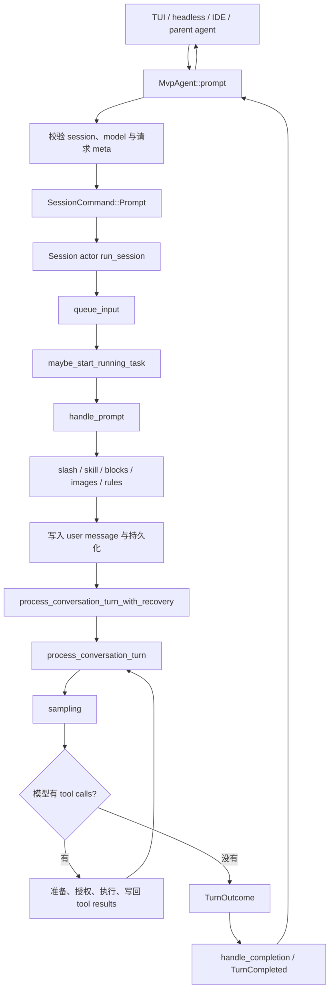
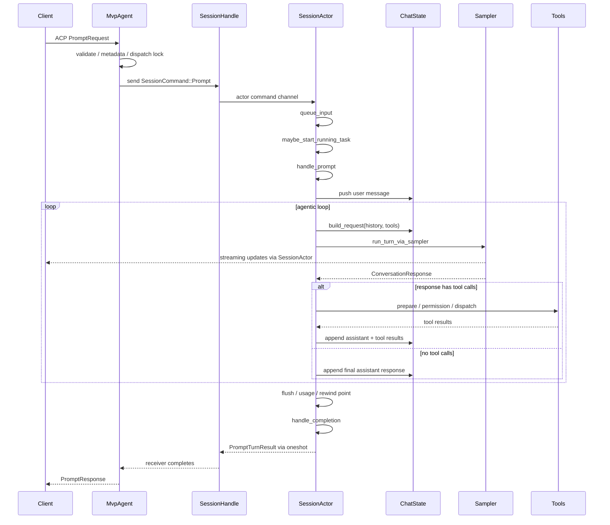

# 从 Prompt 到最终回答：一次 Turn 的完整主链

## 这篇解决什么问题

本文从共享的 ACP agent 入口开始，追踪一次 prompt 如何进入 Session actor、怎样被排队和解析、如何进入模型与工具循环，以及最终怎样返回 `PromptResponse` 并发出可持久化的结束事件。

读完后，你应该能区分四件很容易混在一起的事：

- 客户端提交一次 prompt；
- Session 启动一个 turn；
- turn 内进行一次或多次 sampling；
- sampler 对一次模型请求做内部 retry。

本文先讲完整骨架。模型 stream、retry 和工具循环的细节见 [Sampling 与 Agentic Loop](03-sampling-loop.md)。

## 先建立心智模型



这里的“客户端”不限定为外部进程。交互式 pager 可以通过进程内连接使用同一套 ACP agent/session 核心；stdio、IDE 或 parent agent 则可能跨进程传输消息。

## 核心文件与符号

| 文件 | 符号 | 职责 |
| --- | --- | --- |
| `agent/mvp_agent/acp_agent.rs` | `MvpAgent::prompt` | 接收 ACP `PromptRequest`，找到 session，构造命令，等待结果 |
| `session/commands.rs` | `SessionCommand::Prompt` | Agent 到 Session actor 的 prompt 消息 |
| 同上 | `PromptTurnResult` / `PromptTurnOk` | Session 返回给 agent 的 typed turn 结果 |
| `session/handle.rs` | `SessionHandle` | 可克隆、可跨线程持有的 session actor 代理 |
| `session/acp_session_impl/run_loop.rs` | `run_session` | Session actor 的主事件循环 |
| `session/acp_session_impl/prompt_queue.rs` | `queue_input` | 记录并排队 prompt，处理优先级和 send-now |
| `session/acp_session_impl/notification_drain.rs` | `maybe_start_running_task` | 在 session 空闲时把队首 prompt 提升为运行中 turn |
| `session/acp_session_impl/turn.rs` | `handle_prompt` | 解析输入、建立 user message、驱动 turn、收尾 |
| 同上 | `process_conversation_turn` | 真正的模型/工具 agentic loop |
| `session/acp_session_impl/turn_end.rs` | `handle_completion` | 消费 task 结果、回复请求方、发出 durable terminal |
| `session/acp_session_impl/updates.rs` | `send_update` 等 | 向客户端发送并按策略持久化 session 更新 |

以上路径均位于 `crates/codegen/xai-grok-shell/src/`。

## 第一阶段：`MvpAgent::prompt` 接收请求

### 1. 连接 trace 上下文

如果 `PromptRequest.meta` 存在，入口先尝试从 meta 中连接 trace context。这样跨 ACP、channel 和 session 的执行可以在可观测性系统里属于同一条 trace。

### 2. 找到真实 Session

入口通过：

```text
session_handle_waiting_for_load(&arguments.session_id)
```

查找 session。这个方法名强调了一点：session 可能仍在 load/attach，prompt 入口不是只查一个立即可用的 map。找不到时返回 ACP `invalid_params`，并带上 `unknown session id`。

客户端持有的是 session ID；真正与 actor 交互的是 `SessionHandle`。Handle 内的 `cmd_tx` 是发送 `SessionCommand` 的 channel sender。

### 3. 在排队前阻止不可运行请求

`MvpAgent::prompt` 会检查：

- allowed-models 是否把所有模型排除；
- 恢复的 session 是否绑定了当前已不可用的模型；
- 该模型若重新出现，是否能先恢复/切换后继续；
- `outputSchema` 是否为 JSON object；
- `toolOverrides` 是否能解析成 typed update。

部分失败返回 `EndTurn` 并向客户端解释，部分格式错误返回 ACP error。这里是 agent 表面的请求准入，不是模型 provider 的错误处理。

### 4. 获取 session 级 dispatch lock

入口用 session ID 取得 `dispatch_lock` 并等待。它的作用是把同一 session 的“确定 prompt mode、分配 metadata、发命令”这段 dispatch 序列化，避免多个 caller 同时准备请求时互相踩状态。

注意：拿到 dispatch lock 不等于 turn 会立即执行。真正的运行顺序仍由 Session actor 的 authoritative queue 决定。

### 5. 解析 PromptRequest metadata

入口从 `_meta` 中读取或推导：

- `mode`：prompt/plan 等模式；
- `promptId`：缺失时生成 UUID；
- `verbatim`：是否跳过用户消息模板和大 prompt 截断；
- `sendNow`：是否取消当前 turn 并尽快运行；
- `clientIdentifier`；
- `screenMode`；
- `outputSchema`；
- `toolOverrides`；
- trace 和上传相关 metadata。

同时分配 turn number、查询当前模型，并可能启动 metadata、session copy、图片和 plugin 状态上传。上传是可观测性/评估侧工作，不是 prompt 进入模型的必要数据流。

### 6. 构造 `SessionCommand::Prompt`

入口建立 oneshot channel，把 sender 放进命令的 `respond_to`，再通过 `SessionHandle.cmd_tx` 发送：

```text
SessionCommand::Prompt {
    prompt_id,
    prompt_blocks,
    prompt_mode,
    ...,
    respond_to,
}
```

发送成功后释放 dispatch guard，把 roster activity 标记为 `Working`，然后等待 oneshot receiver。也就是说，ACP `prompt` RPC 在逻辑上覆盖整个 turn：Session actor 结束后，入口才形成最终 `PromptResponse`。

## 第二阶段：Session actor 接收并排队

### 1. `run_session` 消费命令

Session actor 的主循环在 `run_session`。收到 `SessionCommand::Prompt` 后，它先根据 `prompt_id` 判断 `PromptOrigin`，处理 synthetic task-wake admission，再确保延迟构建的 prefix 已准备好。

真实用户输入还会：

- 解除 task-wake suppression；
- 解除 notification suppression；
- 增加 `user_input_generation`，让旧的 laziness classifier 观察到自己已经过期。

随后 actor 调用 `queue_input`。

### 2. `queue_input` 是权威队列入口

`queue_input` 的主要职责包括：

- 立即把真实用户 prompt 追加到按 cwd 保存的快速 prompt history；
- 取消过期 recap；
- 保存首个真实 prompt 的 trace 配置模板，供 synthetic turn 复用；
- 让真实用户 prompt 优先于尚未运行的部分 synthetic wake；
- 为用户 prompt 建立共享队列 metadata；
- 把所有运行所需字段装入 `InputItem`；
- 根据 `send_now`、当前是否在 interruptible wait 等条件决定插入位置和是否需要取消当前 turn。

actor 之外的 caller 不直接修改 `pending_inputs`，因此 server queue 才是最终顺序的权威来源。

### 3. `sendNow` 不是“绕过队列”

`queue_input` 返回布尔值，表示 caller 是否需要执行 `cancel_turn_for_send_now`。新 prompt 仍被放入 authoritative queue，只是被安排在当前 turn 取消后尽快运行。这样排队、取消、响应和持久化仍能保持一致。

### 4. `maybe_start_running_task` 提升队首

每次入队后都会尝试启动：

```text
SessionActor::maybe_start_running_task(...)
```

它先检查：

- 是否已有 `running_task`；
- 队列是否为空；
- 是否允许合并多个 queued prompt；
- 队首 synthetic completion 是否已过期。

通过后，它从队首读取 `InputItem` 所需字段，spawn 本地 task 执行 `handle_prompt`。队首此时不会立刻弹出；完成结果必须由 `handle_completion` 以 prompt ID 核对后再弹出。这是防止 stale completion 清掉新 turn 的重要不变量。

## 第三阶段：`handle_prompt` 把原始输入变成模型历史

### 1. 建立 turn 生命周期

`handle_prompt` 首先：

- 记录 prompt 大小和 origin；
- 清空/设置当前 skill、prompt mode；
- 增加 turn signal；
- 激活 turn guard；
- 通知 lifecycle contributors `on_turn_start`；
- 识别 rewind 后的 regenerate 或 edit-and-retry。

如果 prompt 是直接 bash command，会走专用 `handle_direct_bash_command`，不进入普通模型主链。

### 2. 处理 slash command、skill 和 workflow

普通输入先经过 `slash_commands::resolve`。结果可能是：

- 重写后的普通 blocks；
- skill 引用，并生成后续要注入的信息；
- 内置命令，例如 goal、workflow；
- 完全在宿主侧执行并直接结束 turn 的命令。

因此，不是每条显示为用户输入的内容都会调用模型。

### 3. 发出 TurnStarted 与用户 echo

进入普通 turn 后，actor：

- `events.begin_turn()`；
- 记录当前模型、turn number、yolo mode 和消息数量；
- 发出内部 `TurnStarted` 和 observability bridge 事件；
- 读取当前 `prompt_index`，随后将其增加；
- 为 UI/客户端构造 `UserMessageChunk`。

用户 echo 可能是：

- live broadcast + persistence；
- 只 persistence、不 live broadcast。

例如 notification drain 或某些 interjection fallback 不应在 scrollback 重复显示，但仍必须持久化用户消息块，保证 rewind/fork 能从保存的 prompt 边界工作。

### 4. 解析 content blocks

`parse_prompt_with_skills` 把 ACP content blocks 解析为：

- `context`；
- `query`；
- `skill_information`；
- 图片；
- 是否是 Cursor harness。

之后还有一系列规范化：

- 恢复孤立的图片 placeholder；
- 移除 placeholder 中不该直接发给模型的本地路径；
- 重新编码、压缩或丢弃不合要求的图片；
- 从文本里提取 base64 图片；
- 按模板重新组合 context、query 与 skill information；
- 非 verbatim 模式下，对超大 prompt 做 offload/截断。

`parsed_prompt_tx` 可以把最终文本、截断前全文和本地 offload 路径返回给上传/metadata 逻辑，避免另一侧重新解析一遍。

### 5. 注入动态 reminders

在用户消息进入 chat state 前后，Session 可能注入：

- MCP 状态 reminder；
- 日期变化 reminder；
- plan-mode reminder；
- 已恢复后台任务 reminder；
- between-turn completion；
- workflow 状态 reminder；
- interrupt reminder。

这些内容不一定来自用户直接键入，却会影响模型实际看到的 conversation。理解“模型收到什么”时，不能只读取 `PromptRequest.prompt`。

### 6. 构造并保存 `ConversationItem::User`

根据 `PromptOrigin`，同一段文本可能构造成：

- 普通 user message；
- task/subagent completed；
- notification drain；
- goal summary/nudge；
- scheduler fired。

actor 给 item 写入 `prompt_index`，附加图片，然后通过 `chat_state_handle` 加入 conversation。

如果 caller 提供 `persist_ack`，使用 `push_user_message_and_ack`，随后经过 persistence 的 `FlushAndAck` barrier 才通知 caller；否则普通 push。这个 barrier 用于那些必须保证推理前磁盘已经包含 prompt 的调用方。

### 7. 运行 UserPromptSubmit hook

用户消息进入 chat state 后，actor 调用 `UserPromptSubmit` hook，然后为本 turn 打开 subagent spawn admission，进入 conversation turn。

## 第四阶段：驱动 Agentic Loop

`handle_prompt` 调用：

```text
process_conversation_turn_with_recovery(...)
  → process_conversation_turn(...)
```

外层 recovery 会处理某些“模型没有按要求使用必需工具”等恢复策略；内层函数才是主要 agentic loop。

每次 loop iteration 的核心动作：

1. 注入待处理 interjection、skill、monitor、memory 和 MCP reminders；
2. 必要时刷新认证、执行 preflight compaction；
3. 生成本轮有效工具列表；
4. 由 `chat_state_handle.build_request` 从完整 conversation 构造 `ConversationRequest`；
5. 附加 session/turn/agent/deployment metadata、hosted tools 和输出预算；
6. 调用 `run_turn_via_sampler`；
7. 把 response、usage、assistant item 写回 chat state；
8. 若存在 tool calls，准备并执行，再把 tool results 写回 conversation；
9. `continue`，用更新后的历史再次调用模型；
10. 若没有 tool calls 且所有结束 gate 允许，返回 `TurnOutcome::Completed`。

所以一次 turn 内可能有：

```text
模型 → 工具 → 模型 → 工具 → 模型 → 最终文本
```

而不是一次 prompt 必然对应一次 HTTP 请求。

## 第五阶段：流式更新与最终回答不是同一条信号

模型流式文本会在 sampling 过程中被翻译成 `AgentMessageChunk` 等 session update，客户端因此可以边接收边渲染。最终 `PromptResponse` 则要等整个 turn 收尾后才返回。

这意味着客户端观察到两类输出：

- **增量更新**：文本、reasoning、tool call 状态、retry 状态等；
- **终端结果**：stop reason、总 token、structured output、usage 和 completion kind。

如果 provider 没有产生可见 stream chunk，但最终 response 含有 fallback text，turn 会补发 `AgentMessageChunk`，避免客户端只得到终端却没有正文。

## 第六阶段：`handle_prompt` 收尾

`process_conversation_turn` 返回后，`handle_prompt` 会根据 outcome 调用 extension lifecycle：

- 完成：`on_turn_done`；
- 取消或 max-turn：`on_turn_abort`；
- 错误：`on_turn_error`。

随后：

- 必要时取消本 turn 创建的前台 subagents；
- flush persistence；
- 结束 file-state prompt 跟踪；
- 保存 rewind point；
- freeze 本 prompt 的 usage；
- flush chat state；
- 把 `TurnOutcome` 映射为 `PromptTurnOk` 或附带 usage 的 ACP error。

主要 completion kind 包括：

| `PromptCompletionKind` | 含义 |
| --- | --- |
| `Completed` | 正常完成或 provider refusal 已形成明确结果 |
| `StationarityEnded` | 检测到重复动作，静默结束以阻止死循环 |
| `Cancelled` | 用户、send-now 或其他取消路径终止 |
| `MaxTurnsReached` | session 的 turn 上限已达到 |
| `Rewound` | rewind 路径结束 |
| `RemovedFromQueue` | prompt 尚未开始就从队列移除 |

## 第七阶段：completion 回到 caller

运行 task 的结果经 completion channel 回到 `run_session`，随后调用 `handle_completion(prompt_id, result)`。

`handle_completion` 必须先验证完成的 prompt 是否仍是队首/当前运行 prompt：

- 匹配时弹出队首，通过 `InputItem.respond_to` 回复原先的 `MvpAgent::prompt`；
- 不匹配时视为 stale completion，不允许它清除新 turn 的 `running_task`；
- 对真正拥有的 completion 发出 durable、可 replay 的 `TurnCompleted`。

`MvpAgent::prompt` 的 oneshot receiver 得到结果后还会：

- 发出 fire-and-forget `x.ai/session/prompt_complete`；
- 把 roster activity 改为 `Idle` 或 `NeedsInput`；
- 收集 resolved model、permission events、subagent refs、turn messages 等上传信息；
- 构造最终 ACP `PromptResponse` 与 `_meta`。

这里故意有两个终端表面：

- `prompt_complete` 是即时通知；
- `TurnCompleted` 走持久化和 replay rail，供中途重新附着的 viewer 正确结束 UI 状态。

## 状态所有权

| 状态 | 所有者 | 说明 |
| --- | --- | --- |
| session registry | `MvpAgent` 侧 registry | 从 session ID 找到 `SessionHandle` |
| prompt dispatch lock | `MvpAgent` 按 session 管理 | 序列化请求准备与入队，不拥有 turn 执行 |
| authoritative prompt queue | `SessionActor.state.pending_inputs` | 决定 prompt 真正运行顺序 |
| running task | `SessionActor.state.running_task` | 同一 session 同时只提升一个前台 turn |
| conversation | chat-state actor | 保存 system/user/assistant/tool items 并构造模型请求 |
| prompt index | chat-state actor | 标识 conversation 中的 turn 边界，支持 replay/rewind |
| UI/protocol updates | Session notification pipeline | 广播并按事件类型持久化 |
| prompt RPC completion | `InputItem.respond_to` oneshot | 把最终结果只返回给提交该 prompt 的 caller |

## 正常时序图



图中 sampler 的 streaming event 实际先回到 SessionActor，再转成 session update；为了突出客户端可见效果，箭头做了压缩表示。

## 错误、取消与队列移除

### 输入或 session 错误

- session ID 未知：ACP invalid params；
- schema/tool override 格式不合法：入队前拒绝；
- slash/prompt 解析失败：`handle_prompt` 返回 error；
- chat-state actor 不可用：需要 ack 的路径记录错误，模型请求构建则视为不应发生的不变量破坏。

### 模型或工具错误

Sampler failure 先尝试其策略允许的 retry、auth recovery 或 compaction；最终失败转换成 ACP error。普通 tool execution failure通常被编码成 tool result，让模型有机会纠正，而不是自动结束整个 turn。

### 取消

取消必须同时处理：

- 当前 sampler request；
- 正在等待的 permission/question；
- 可中断工具；
- 本 turn 的前台 subagent；
- prompt usage 与 terminal event；
- authoritative queue 中当前项。

取消细节将在任务与生命周期专题单独展开。

### `RemovedFromQueue`

这个结果表示 prompt 从未开始 turn，因此不能广播普通 `prompt_complete` 或 `TurnCompleted`，否则其他客户端可能误以为当前真正运行的 turn 已结束。`MvpAgent::prompt` 专门 short-circuit，返回 cancelled response，但不触发 turn completion 副作用。

## 如何验证

### 建立符号链

```sh
rg -n "async fn prompt" \
  crates/codegen/xai-grok-shell/src/agent/mvp_agent/acp_agent.rs

rg -n "SessionCommand::Prompt|queue_input|maybe_start_running_task" \
  crates/codegen/xai-grok-shell/src/session

rg -n "handle_prompt|process_conversation_turn" \
  crates/codegen/xai-grok-shell/src/session/acp_session_impl

rg -n "handle_completion|emit_turn_completed" \
  crates/codegen/xai-grok-shell/src/session/acp_session_impl/turn_end.rs
```

### 优先阅读的测试

```text
session/acp_session_tests/prompt_queue_actor_tests.rs
session/acp_session_tests/prompt_context_persistence_tests.rs
session/acp_session_tests/turn_completion_emit_tests.rs
session/acp_session_tests/cancel_running_task_tests.rs
session/acp_session_tests/turn/chat_history_integrity_tests.rs
session/acp_session_tests/turn/turn_end_guard_tests.rs
```

测试路径相对于 `crates/codegen/xai-grok-shell/src/`。

## 常见误解

### “`MvpAgent::prompt` 直接调用模型”

不是。它主要做请求准入、metadata 和 SessionCommand dispatch，真正循环在 Session actor。

### “拿到 dispatch lock 就获得 turn 执行权”

不是。dispatch lock 只保护请求进入 actor 前的准备；authoritative queue 才决定执行顺序。

### “用户在 UI 看见自己的消息，说明它已经进入模型历史”

不一定。user echo、chat-state push 和 persistence barrier 是不同步骤。队列中的 prompt 甚至可能还没开始执行。

### “一次 turn 等于一次 sampling”

不是。工具调用、TodoGate、interjection、auth/compaction resubmit 都可能让同一 turn 再次 sampling。

### “最终文本 chunk 就代表 turn 已完成”

不是。还需完成 tool/gate 判断、usage、flush、rewind point、completion ownership 和 terminal event。

## 修改影响

| 修改 | 需要复核 |
| --- | --- |
| `PromptRequest.meta` 字段 | 客户端生成、`MvpAgent::prompt` 解析、trace/upload、SessionCommand |
| `SessionCommand::Prompt` | 所有 producer、run loop match、`InputItem`、测试构造 |
| queue 排序 | send-now、synthetic wake、shared queue UI、stale completion |
| prompt parsing | UI echo、chat history、图片、skills、上传 metadata |
| conversation item 类型 | provider 转换、persistence、replay、compaction |
| terminal result | prompt response、prompt_complete、TurnCompleted、roster |

## 本篇术语表

| 名词 | 白话解释 | 在本篇中的具体含义 |
| --- | --- | --- |
| PromptRequest | 客户端提交一次 prompt 的 ACP 请求对象 | 包含 session ID、content blocks 和可选 `_meta` |
| content block | prompt 中一个有类型的内容块 | 可以是文本、图片等，不等同于最终发给模型的一条字符串 |
| `_meta` | 协议对象附带的扩展 metadata | 承载 promptId、mode、screenMode、schema、trace 等 xAI 扩展字段 |
| typed / 强类型 | 用明确的 Rust enum/struct 表达数据 | 与到处传任意 JSON 字符串相比，更容易穷尽分支和保持语义 |
| SessionHandle | 其他线程/组件操作 session actor 的代理 | 内含 command sender 和若干可安全共享的 handle，不直接暴露 actor 全部内部状态 |
| Session actor | 独自拥有 session 可变状态并处理消息的运行单元 | `run_session` 消费 `SessionCommand`，协调 queue、turn 和 completion |
| authoritative | 最终说了算的唯一事实来源 | prompt 真正顺序由 server-side `pending_inputs` 决定，而不是某个客户端 UI 列表 |
| dispatch lock | 让同一 session 的请求准备按顺序进行的锁 | 不等同于 turn lock，也不保证 prompt 立刻运行 |
| oneshot channel | 只能发送一个结果的异步通道 | `MvpAgent::prompt` 用它等待对应 prompt 的最终 `PromptTurnResult` |
| roster | 当前 session 及其活动状态的列表/登记 | 用 `Working`、`Idle`、`NeedsInput` 等供 dashboard 或 leader 客户端观察 |
| prompt origin | 标记 prompt 真正来源的枚举语义 | 用户输入、任务完成、subagent 完成、scheduler、notification drain 等 |
| synthetic prompt | 不是用户此刻直接键入，而由系统生成的输入 | 可唤醒 session 处理后台任务结果，但通常不显示为普通队列项 |
| send-now | 请求取消当前 turn，并把新 prompt 安排为下一个执行 | 仍经过权威队列，不是绕过 Session actor |
| stale completion | 已过时的 turn task 晚到的完成消息 | 必须丢弃，不能清除后来已运行 prompt 的状态 |
| prompt index | conversation 中标识 prompt/turn 边界的递增编号 | persistence、rewind、fork 和 UI metadata 会使用 |
| user echo | 把用户输入作为 `UserMessageChunk` 发给 UI/客户端 | 与加入模型 conversation、写磁盘是相关但不同的动作 |
| verbatim | 尽量按原始输入处理 | 跳过常规 user-message 包装和超大 prompt 截断，但仍受协议解析等必要步骤影响 |
| offload | 把过大内容完整保存到文件，模型输入只保留摘要/路径和有限片段 | 避免超大 prompt 直接挤占上下文，同时让工具仍可读取全文 |
| reminder | 运行时注入给模型的系统提醒 | MCP、plan、memory、interrupt 等状态可形成 reminder |
| barrier | 必须等前面的操作确认完成后才能越过的同步点 | `FlushAndAck` 保证 prompt 已持久化后再通知 caller |
| lifecycle contributor | 订阅 turn 开始、完成、取消或错误的扩展组件 | 通过统一 lifecycle 输入执行横切逻辑 |
| durable | 进程退出后仍可从存储恢复 | `TurnCompleted` 进入持久化/replay rail，区别于仅即时通知 |
| replay rail | 能保存并在重新附着时重放的事件通路 | viewer 可用它恢复 turn 已经结束的事实 |
| stop reason | 协议层对 turn 为什么停止的分类 | 如 EndTurn、Cancelled、Refusal |
| structured output | 必须符合用户 JSON Schema 的最终结果 | 可由 provider 原生约束或 synthetic `StructuredOutput` 工具完成 |
| stationarity | agent 行为长时间重复、没有实质进展 | 重复相同工具调用达到阈值时会 nudge 或结束 turn |

## 自测题

1. `MvpAgent::prompt`、`run_session` 和 `handle_prompt` 各自拥有哪部分责任？
2. 为什么 dispatch lock 和 authoritative queue 必须同时存在？
3. user echo、chat-state push、persistence 分别服务什么目的？
4. 一个 prompt 为什么可能不调用模型？举出两个路径。
5. 一次 turn 为什么可能包含多次 sampling？
6. stale completion 如果错误地清空 `running_task`，可能发生什么？
7. `prompt_complete` 和 `TurnCompleted` 为什么暂时同时存在？
8. `RemovedFromQueue` 为什么不能发普通 turn terminal？

## 源码依据

- `crates/codegen/xai-grok-shell/src/agent/mvp_agent/acp_agent.rs`
  - `MvpAgent::prompt`
- `crates/codegen/xai-grok-shell/src/session/commands.rs`
  - `SessionCommand::Prompt`
  - `PromptTurnOk`
  - `PromptCompletionKind`
- `crates/codegen/xai-grok-shell/src/session/handle.rs`
  - `SessionHandle`
- `crates/codegen/xai-grok-shell/src/session/acp_session_impl/run_loop.rs`
  - `run_session`
- `crates/codegen/xai-grok-shell/src/session/acp_session_impl/prompt_queue.rs`
  - `queue_input`
- `crates/codegen/xai-grok-shell/src/session/acp_session_impl/notification_drain.rs`
  - `maybe_start_running_task`
- `crates/codegen/xai-grok-shell/src/session/acp_session_impl/turn.rs`
  - `handle_prompt`
  - `process_conversation_turn_with_recovery`
  - `process_conversation_turn`
- `crates/codegen/xai-grok-shell/src/session/acp_session_impl/turn_end.rs`
  - `handle_completion`
  - `emit_turn_completed`

